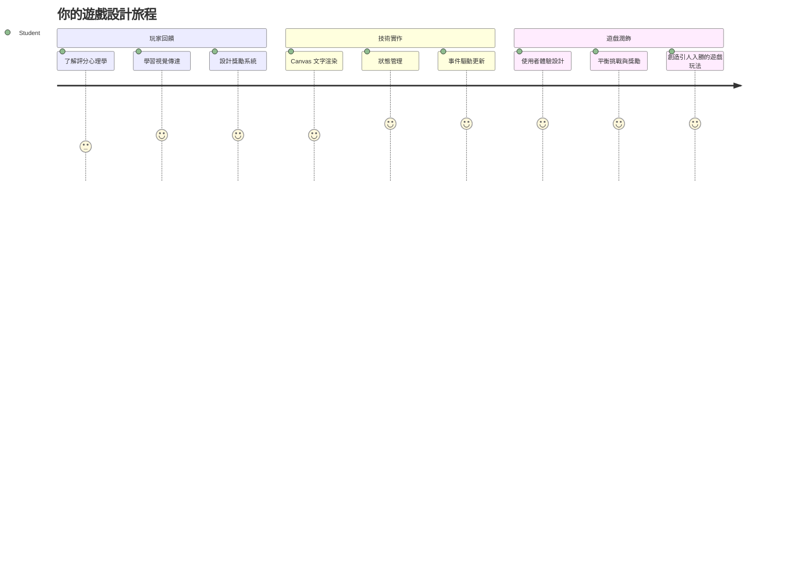
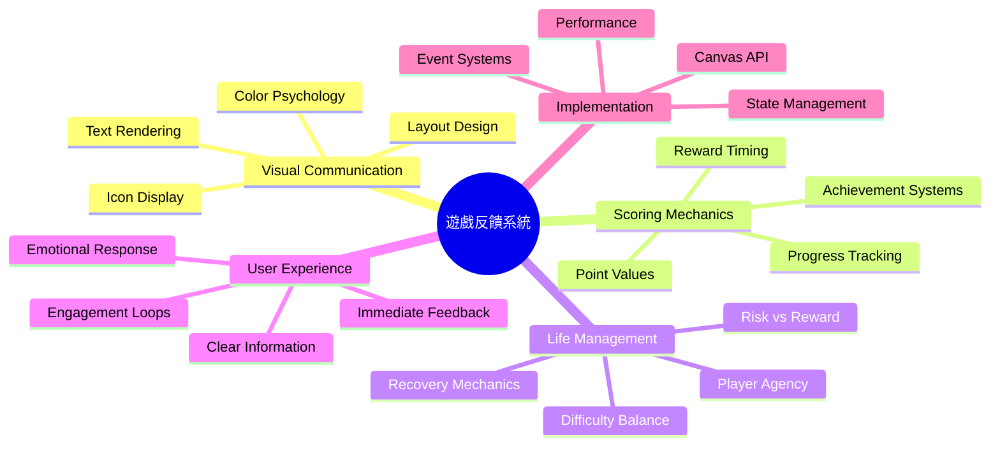
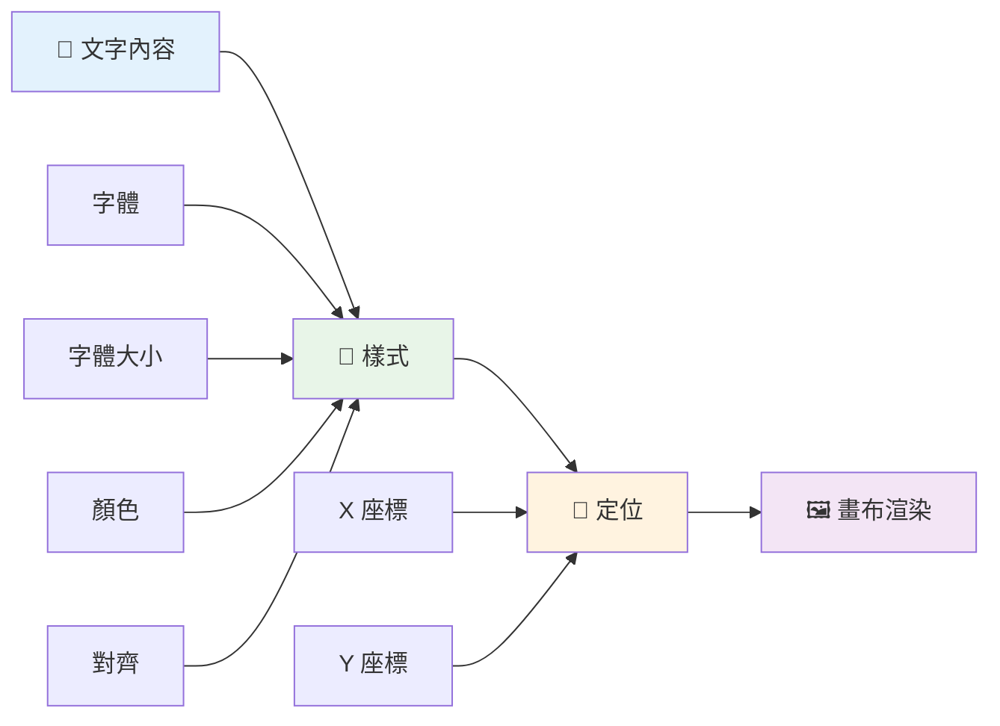
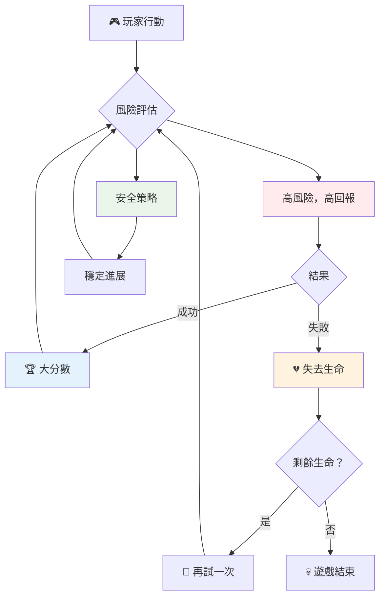
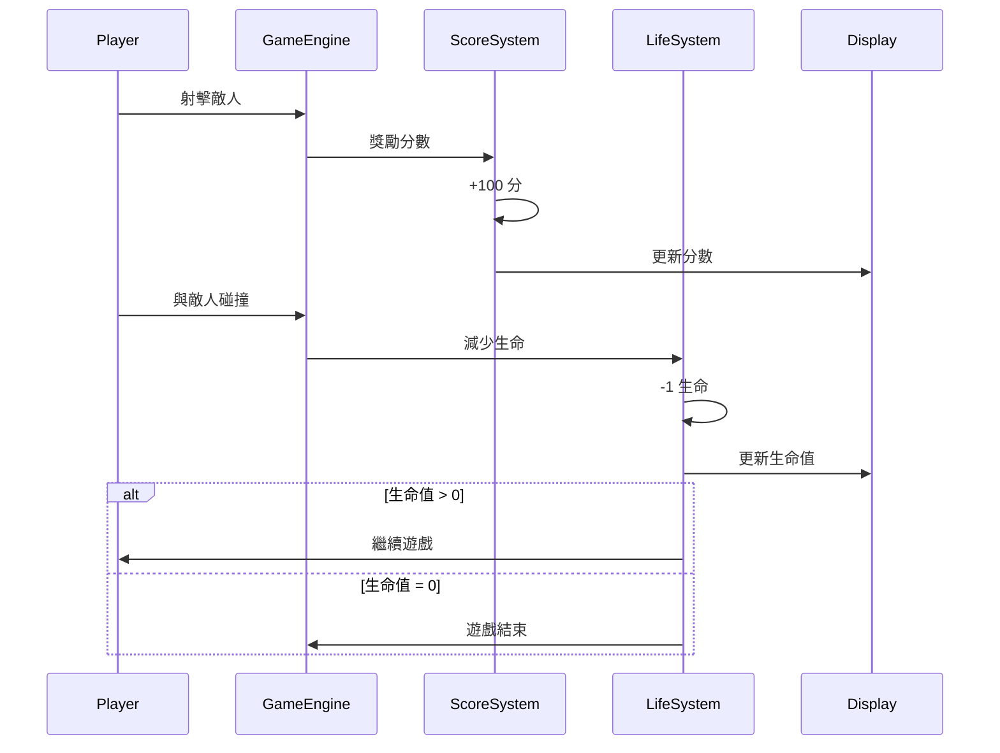
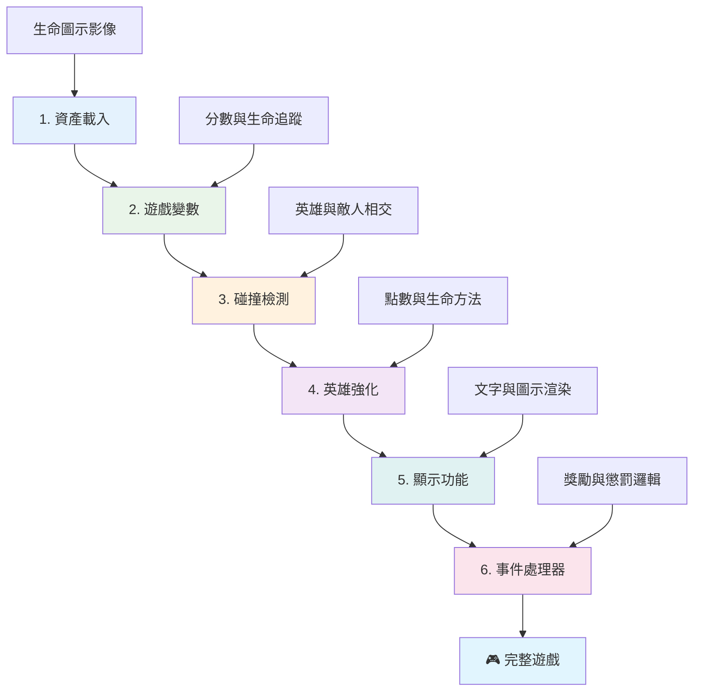
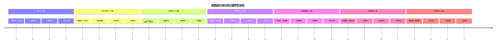

<!--
CO_OP_TRANSLATOR_METADATA:
{
  "original_hash": "2ed9145a16cf576faa2a973dff84d099",
  "translation_date": "2026-01-06T12:34:17+00:00",
  "source_file": "6-space-game/5-keeping-score/README.md",
  "language_code": "hk"
}
-->
# 建立太空遊戲第5部分：得分與生命值


## 課前測驗

[課前測驗](https://ff-quizzes.netlify.app/web/quiz/37)

準備讓你的太空遊戲感覺像真正的遊戲了嗎？讓我們加入得分和生命管理 —— 這些是讓像太空侵略者這類早期街機遊戲，從簡單展示轉變成令人上癮娛樂的核心機制。這是你的遊戲真正變得可玩之處。


## 在畫面上繪製文字 — 你的遊戲之聲

要顯示你的分數，我們需要學會如何在畫布上渲染文字。`fillText()` 方法是你的主要工具 —— 這和經典街機遊戲用來顯示分數和狀態資訊的技術相同。


你可以完全控制文字的外觀：

```javascript
ctx.font = "30px Arial";
ctx.fillStyle = "red";
ctx.textAlign = "right";
ctx.fillText("show this on the screen", 0, 0);
```

✅ 深入了解[在畫布上添加文本](https://developer.mozilla.org/docs/Web/API/Canvas_API/Tutorial/Drawing_text) —— 你可能會驚訝於你能用字體與樣式創造出多麼有創意的效果！

## 生命值 — 不只是個數字

在遊戲設計中，「生命」代表玩家的容錯空間。這種概念可追溯到彈珠台機器，你會得到多顆彈珠來玩。像小行星這類早期遊戲中，生命讓玩家有機會承擔風險並從錯誤中學習。


視覺呈現非常重要 —— 用飛船圖示來展示生命，而不是僅僅顯示「Lives: 3」，會創造即刻的視覺識別，就像早期街機機台用圖標跨越語言障礙般。

## 建立你的遊戲獎勵系統

現在我們會實作保持玩家投入的核心回饋系統：


- **得分系統**：每摧毀一艘敵機，獲得100分（整數更方便玩家心算）。分數顯示在左下角。
- **生命計數器**：你的英雄起始有三條命 —— 這是早期街機遊戲定下的標準，平衡挑戰與可玩性。每次與敵機碰撞損失一條命。剩餘生命用飛船圖示顯示在右下角 。

## 開始動手吧！

先設置工作環境。瀏覽到你的 `your-work` 子資料夾。你應該會看到這些檔案：

```bash
-| assets
  -| enemyShip.png
  -| player.png
  -| laserRed.png
-| index.html
-| app.js
-| package.json
```

要測試你的遊戲，從 `your_work` 資料夾啟動開發伺服器：

```bash
cd your-work
npm start
```

這會啟動一個本地伺服器於 `http://localhost:5000`。在瀏覽器打開這個地址看你的遊戲。用方向鍵試試控制，並嘗試射擊敵人確認功能正常。


### 開始編碼！

1. **準備你需要的視覺資源**。將 `solution/assets/` 資料夾中的 `life.png` 複製到你的 `your-work` 資料夾。然後在 `window.onload` 函數中加入 lifeImg：

    ```javascript
    lifeImg = await loadTexture("assets/life.png");
    ```

1. 別忘了把 `lifeImg` 加入你的資源列表：

    ```javascript
    let heroImg,
    ...
    lifeImg,
    ...
    eventEmitter = new EventEmitter();
    ```
  
2. **設定遊戲變數**。加入程式碼以追蹤你的總分（初始為0）與剩餘生命（初始為3）。我們會將它們顯示在畫面上，好讓玩家隨時知道狀況。

3. **實作碰撞偵測**。擴充你的 `updateGameObjects()` 函數，偵測敵人與英雄碰撞時的狀態：

    ```javascript
    enemies.forEach(enemy => {
        const heroRect = hero.rectFromGameObject();
        if (intersectRect(heroRect, enemy.rectFromGameObject())) {
          eventEmitter.emit(Messages.COLLISION_ENEMY_HERO, { enemy });
        }
      })
    ```

4. **將生命與得分追蹤加到 Hero 中**。
   1. **初始化計數器**。在 Hero 類別中 `this.cooldown = 0` 下方設定生命與分數：

        ```javascript
        this.life = 3;
        this.points = 0;
        ```

   1. **顯示這些數值給玩家**。建立函數在畫面繪製這些值：

        ```javascript
        function drawLife() {
          // 待辦，35，27
          const START_POS = canvas.width - 180;
          for(let i=0; i < hero.life; i++ ) {
            ctx.drawImage(
              lifeImg, 
              START_POS + (45 * (i+1) ), 
              canvas.height - 37);
          }
        }
        
        function drawPoints() {
          ctx.font = "30px Arial";
          ctx.fillStyle = "red";
          ctx.textAlign = "left";
          drawText("Points: " + hero.points, 10, canvas.height-20);
        }
        
        function drawText(message, x, y) {
          ctx.fillText(message, x, y);
        }

        ```

   1. **將所有功能掛勾到遊戲迴圈**。在 `window.onload` 中 `updateGameObjects()` 後加入這些函數：

        ```javascript
        drawPoints();
        drawLife();
        ```

### 🔄 **教學檢核**
**遊戲設計理解**：在實作後果之前，先確保你理解：
- ✅ 視覺反饋如何將遊戲狀態傳達給玩家
- ✅ 一致擺放 UI 元素提升使用便利性
- ✅ 分數與生命管理的心理學意義
- ✅ Canvas 文字渲染與 HTML 文字的不同

**快速自測**：為什麼街機遊戲通常使用整數作為分數？
*答：整數更方便玩家心算，也能創造令人滿足的心理獎勵*

**用戶體驗原則**：你現在正在應用：
- **視覺層級**：重要資訊顯著呈現
- **即時回饋**：玩家動作即時更新
- **認知負荷**：資訊簡單明確呈現
- **情感設計**：用圖示與顏色建立玩家連結

1. **實作遊戲後果與獎勵**。現在加入讓玩家行為有意義的回饋系統：

   1. **碰撞會損失生命**。每次英雄撞上敵人就會損失一條命。
   
      在你的 `Hero` 類別加入此方法：

        ```javascript
        decrementLife() {
          this.life--;
          if (this.life === 0) {
            this.dead = true;
          }
        }
        ```

   2. **射擊敵人得分**。每次成功命中敵人可獲得100分，立刻給予精準射擊的正向回饋。

      擴充 Hero 類別加入此分數增加方法：

        ```javascript
          incrementPoints() {
            this.points += 100;
          }
        ```

        現在將這些方法連結到碰撞事件中：

        ```javascript
        eventEmitter.on(Messages.COLLISION_ENEMY_LASER, (_, { first, second }) => {
           first.dead = true;
           second.dead = true;
           hero.incrementPoints();
        })

        eventEmitter.on(Messages.COLLISION_ENEMY_HERO, (_, { enemy }) => {
           enemy.dead = true;
           hero.decrementLife();
        });
        ```

✅ 對用 JavaScript 和 Canvas 製作的其他遊戲感到好奇嗎？去探索看看 — 你會驚訝於還能做到什麼！

完成這些功能後，測試你的遊戲，看看完整的回饋系統如何運作。你應該會在右下角看到生命圖示，左下角看到分數，碰撞時生命減少，成功射擊時分數增加。

你的遊戲現在已經具備早期街機遊戲讓人著迷的基本機制 —— 明確目標、即時回饋及有意義的玩家行為後果。

### 🔄 **教學檢核**
**完整遊戲設計系統**：確認你掌握了玩家回饋系統：
- ✅ 得分機制如何激發玩家動機與投入？
- ✅ 為什麼視覺一致性對用戶介面設計重要？
- ✅ 生命系統如何平衡挑戰與玩家留存？
- ✅ 即時回饋在製造滿足感遊戲體驗中扮演什麼角色？

**系統整合**：你的回饋系統展現了：
- **用戶體驗設計**：清晰視覺傳達與資訊層級
- **事件驅動架構**：對玩家動作做出迅速回應
- **狀態管理**：追蹤並呈現動態遊戲資料
- **Canvas 精通**：文字渲染與精靈定位
- **遊戲心理學**：理解玩家動機與投入

**專業模式**：你已實作：
- **MVC 架構**：遊戲邏輯、資料與呈現分離
- **觀察者模式**：事件驅動遊戲狀態更新
- **元件設計**：可重用的繪圖與邏輯函數
- **效能優化**：遊戲迴圈中高效渲染

### ⚡ **5分鐘內可以做的事**
- [ ] 嘗試不同字型大小和顏色來顯示分數
- [ ] 嘗試改變分數值，看看遊戲節奏如何改變
- [ ] 添加 console.log 訊息來追蹤分數與生命變化
- [ ] 測試極端狀況，例如生命用盡或達成高分

### 🎯 **這一小時內可以完成的目標**
- [ ] 完成課後測驗並理解遊戲設計心理學
- [ ] 新增得分與損失生命的音效
- [ ] 使用 localStorage 實作高分系統
- [ ] 為不同敵人設定不同點數
- [ ] 新增損失生命時的畫面震動特效

### 📅 **你的一週遊戲設計旅程**
- [ ] 完成整個太空遊戲並優化回饋系統
- [ ] 實作連擊倍率等進階得分機制
- [ ] 新增成就與可解鎖內容
- [ ] 創建難度進程與平衡系統
- [ ] 設計選單與遊戲結束畫面介面
- [ ] 研究其他遊戲理解玩家黏著機制

### 🌟 **你的一個月遊戲開發精通**
- [ ] 製作帶有完整進階系統的遊戲
- [ ] 學習遊戲分析與玩家行為度量
- [ ] 參與開源遊戲開發專案
- [ ] 精通進階遊戲設計模式與營利策略
- [ ] 製作關於遊戲設計與用戶體驗的教學內容
- [ ] 建立遊戲設計與開發技能的作品集

## 🎯 你的遊戲設計精通時程


### 🛠️ 你的遊戲設計工具箱總結

完成本課程後，你已掌握：
- **玩家心理學**：理解動機、風險/報酬與參與循環
- **視覺傳達**：使用文字、圖示與排版設計有效介面
- **回饋系統**：即時回應玩家行為與遊戲事件
- **狀態管理**：有效追蹤與呈現動態遊戲資料
- **Canvas 文字渲染**：專業文字顯示與樣式位置調整
- **事件整合**：連結使用者行為到有意義遊戲後果
- **遊戲平衡**：設計難度曲線與玩家進度系統

**真實世界應用**：你的遊戲設計技能直接適用於：
- **用戶介面設計**：打造有吸引力且直覺的介面
- **產品開發**：理解用戶動機與回饋循環
- **教育科技**：遊戲化與學習參與系統
- **資料視覺化**：使複雜資訊易於理解與吸引人
- **行動應用開發**：用戶留存與體驗設計
- **行銷科技**：理解用戶行為與轉換優化

**所獲專業技能**：你現在能：
- **設計**激發與吸引用戶的體驗
- **實作**引導用戶行為的回饋系統
- **平衡**互動系統中的挑戰與易用性
- **創造**跨群組皆有效的視覺傳達
- **分析**用戶行為並迭代設計優化

**掌握的遊戲開發概念**：
- **玩家動機**：理解推動投入與留存的因素
- **視覺設計**：打造清晰、美觀且實用的介面
- **系統整合**：連結多種遊戲系統創造整合體驗
- **效能優化**：高效渲染與狀態管理
- **可及性**：為不同技能等級與玩家需求設計

**下一步**：你已準備好探索進階遊戲設計模式、實作分析系統，或研究遊戲營利與玩家留存策略！

🌟 **成就解鎖**：你已建立完整的玩家回饋系統、具備專業遊戲設計原則！

---

## GitHub Copilot 代理挑戰 🚀

使用代理模式完成以下挑戰：

**描述：** 強化太空遊戲得分系統，實作可持久儲存的高分功能與額外連擊加分機制。

**提示：** 創建高分系統，將玩家最佳分數保存到 localStorage。為連續擊殺敵人新增連擊獎勵分數，並為不同敵人類型設置不同點數。當玩家達成新高分時顯示視覺提示，並在遊戲畫面顯示當前最高分。

## 🚀 挑戰

你現在有一個功能完整的有得分與生命的遊戲。思考還能加入哪些額外功能提升玩家體驗。

## 課後測驗

[課後測驗](https://ff-quizzes.netlify.app/web/quiz/38)

## 複習與自學

想探究更多？研究不同的遊戲得分與生命系統方案。市面上有像 [PlayFab](https://playfab.com) 這樣管理得分、排行榜和玩家進度的強大遊戲引擎。整合類似系統如何提升你的遊戲層次？

## 作業

[建造得分遊戲](assignment.md)

---

<!-- CO-OP TRANSLATOR DISCLAIMER START -->
**免責聲明**：
本文件使用 AI 翻譯服務 [Co-op Translator](https://github.com/Azure/co-op-translator) 進行翻譯。儘管我們致力於確保準確性，但請注意自動翻譯可能存在錯誤或不準確之處。原始文件的母語版本應被視為權威來源。對於重要資訊，建議採用專業人工翻譯。我們不對因使用此翻譯而引起的任何誤解或誤譯承擔責任。
<!-- CO-OP TRANSLATOR DISCLAIMER END -->