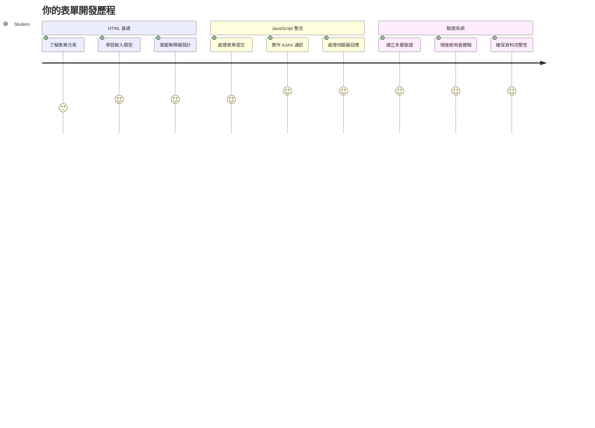
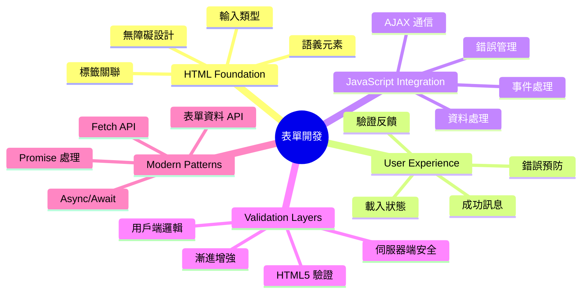
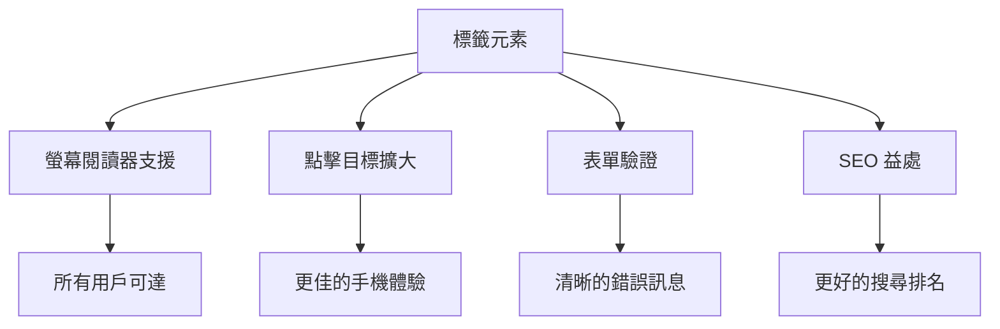
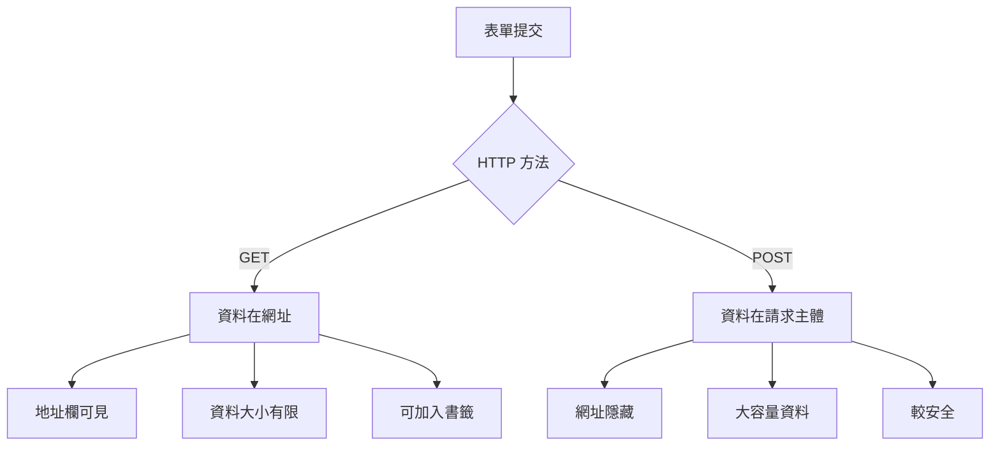
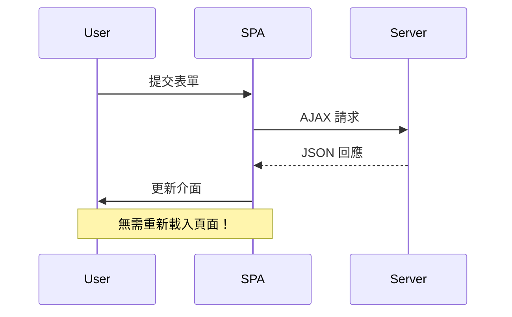
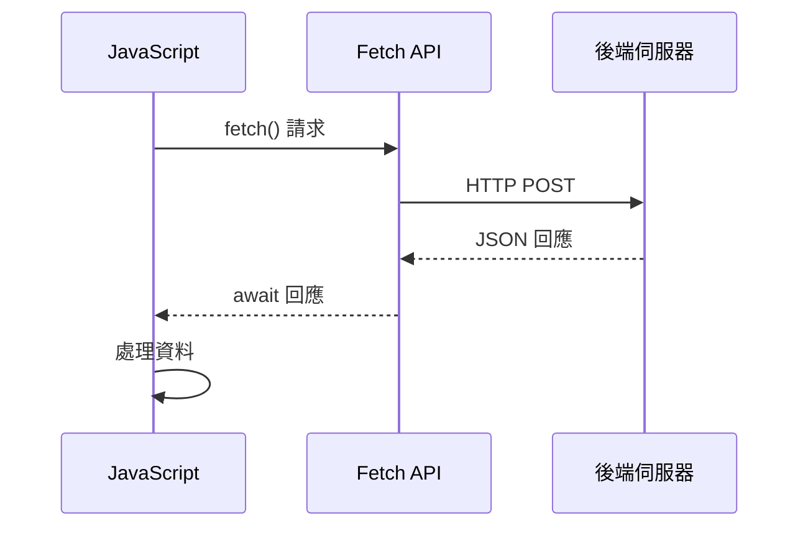
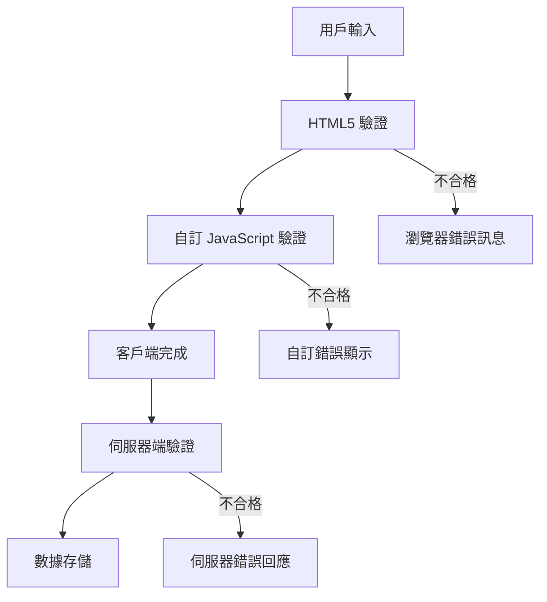
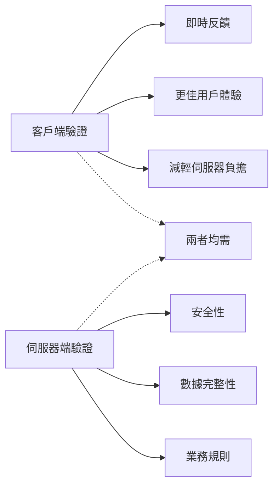
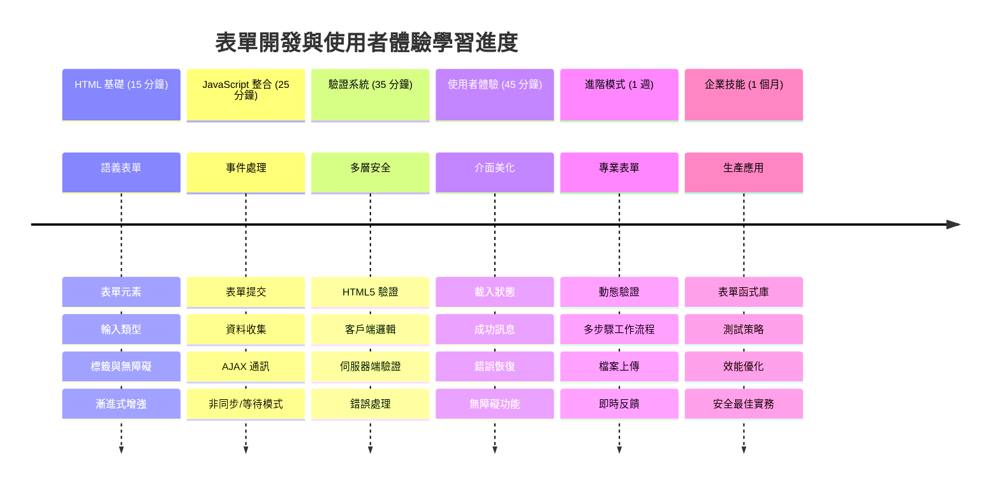
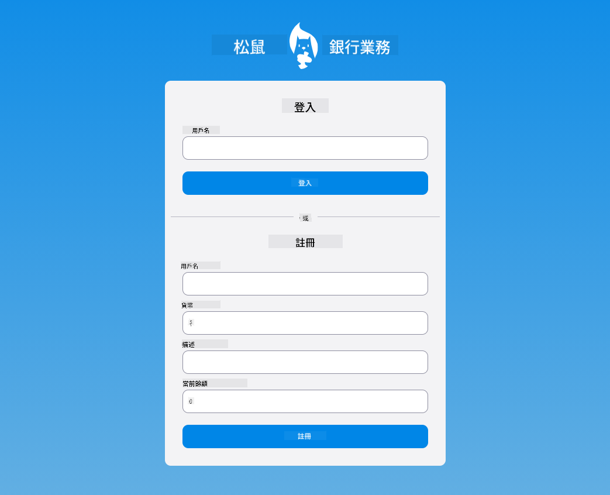

<!--
CO_OP_TRANSLATOR_METADATA:
{
  "original_hash": "7cbdbd132d39a2bb493e85bc2a9387cc",
  "translation_date": "2026-01-06T12:46:26+00:00",
  "source_file": "7-bank-project/2-forms/README.md",
  "language_code": "hk"
}
-->
# 建立銀行應用程式第二部分：建立登入及註冊表單


## 課前小測驗

[課前小測驗](https://ff-quizzes.netlify.app/web/quiz/43)

是否曾經在線上填寫表格，卻被拒絕你的電郵格式？或者點擊提交時所有資料都遺失了？我們都遇過這些令人挫敗的經歷。

表格是使用者與應用程序功能之間的橋樑。就像航空管制員謹慎使用的程序，引導飛機安全抵達目的地一樣，良好設計的表格提供明確回饋並防止昂貴錯誤。反之，糟糕的表格可能比忙碌機場裡的誤會更快令使用者流失。

在本課程中，我們將把你的靜態銀行應用轉換成互動式應用。你將學會建立驗證使用者輸入、與伺服器通訊並提供實用回饋的表格。可視為建立讓使用者導航應用功能的控制界面。

最後，你將擁有一套完整的登入及註冊系統，透過驗證引導使用者走向成功而非挫敗。


## 預備知識

在開始建立表格前，先確保你的環境設置妥當。本課程緊接上次課程內容，因此如果你跳過了中間步驟，建議你回去先完成基礎設定。

### 必要設置

| 元件 | 狀態 | 描述 |
|-----------|--------|-------------|
| [HTML 模板](../1-template-route/README.md) | ✅ 必須 | 你的基本銀行應用結構 |
| [Node.js](https://nodejs.org) | ✅ 必須 | 伺服器的 JavaScript 執行環境 |
| [銀行 API 伺服器](../api/README.md) | ✅ 必須 | 用於資料存取的後端服務 |

> 💡 **開發提示**：你會同時執行兩個伺服器 — 前端銀行應用伺服器和後端 API 伺服器。這種設定模擬真實開發中前後端分離的環境。

### 伺服器配置

**你的開發環境會包括：**
- **前端伺服器**：提供銀行應用（通常使用 `3000` 端口）
- **後端 API 伺服器**：負責資料存取（使用 `5000` 端口）
- **兩個伺服器**可以同時運行而不衝突

**測試 API 連線：**
```bash
curl http://localhost:5000/api
# 預期回應: "Bank API v1.0.0"
```

**若你看到 API 版本回應，表示環境準備就緒！**

---

## 了解 HTML 表格與控制元件

HTML 表格是使用者與你的網頁應用程式溝通的方式。你可以將它們想像成 19 世紀連接遠方地點的電報系統──它們是使用者意圖與應用回應間的通訊協議。設計良好時，會捕捉錯誤、指導格式並提供有用提示。

現代表格比起基本文字輸入框複雜得多。HTML5 引入特定輸入類型，自動處理電郵驗證、數字格式及日期選擇。這些改良有助無障礙和行動用戶體驗。

### 必備表格元素

**每個表格都需要的建構模組：**

```html
<!-- Basic form structure -->
<form id="userForm" method="POST">
  <label for="username">Username</label>
  <input id="username" name="username" type="text" required>
  
  <button type="submit">Submit</button>
</form>
```

**這段代碼做了什麼：**
- **建立**一個帶有唯一識別碼的表格容器
- **指定**資料提交所使用的 HTTP 方法
- **關聯**標籤與輸入欄位以提升無障礙性
- **定義**一個送出按鈕來處理表格提交

### 現代輸入類型與屬性

| 輸入類型 | 用途 | 範例用法 |
|------------|---------|---------------|
| `text` | 一般文字輸入 | `<input type="text" name="username">` |
| `email` | 電郵驗證 | `<input type="email" name="email">` |
| `password` | 隱藏文字輸入 | `<input type="password" name="password">` |
| `number` | 數字輸入 | `<input type="number" name="balance" min="0">` |
| `tel` | 電話號碼 | `<input type="tel" name="phone">` |

> 💡 **現代 HTML5 優勢**：使用特定輸入類型可提供自動驗證、行動裝置適合的鍵盤，以及更佳的無障礙支援，無需額外 JavaScript！

### 按鈕類型及行為

```html
<!-- Different button behaviors -->
<button type="submit">Save Data</button>     <!-- Submits the form -->
<button type="reset">Clear Form</button>    <!-- Resets all fields -->
<button type="button">Custom Action</button> <!-- No default behavior -->
```

**各按鈕類型功能說明：**
- **送出按鈕**：觸發表格提交並將資料發送至指定端點
- **重設按鈕**：重置所有表格欄位為初始狀態
- **一般按鈕**：沒有預設行為，須配合自訂 JavaScript 實現功能

> ⚠️ **重要提醒**：`<input>` 是自閉合元素，無需閉合標籤。現代最佳實踐為 `<input>`，不加斜線。

### 建立你的登入表格

現在讓我們建立一個實用的登入表格，展示現代 HTML 表格實務。我們先從基本結構開始，逐步加強無障礙性及驗證。

```html
<template id="login">
  <h1>Bank App</h1>
  <section>
    <h2>Login</h2>
    <form id="loginForm" novalidate>
      <div class="form-group">
        <label for="username">Username</label>
        <input id="username" name="user" type="text" required 
               autocomplete="username" placeholder="Enter your username">
      </div>
      <button type="submit">Login</button>
    </form>
  </section>
</template>
```

**分析這裡發生的事情：**
- **用語義化 HTML5 元素**來結構化表格
- **使用帶有描述性類別的 `<div>` 容器**分組相關元素
- **用 `for` 與 `id` 屬性**關聯標籤與輸入
- **加入現代屬性**如 `autocomplete` 和 `placeholder` 改善使用者體驗
- **加上 `novalidate`**，改由 JavaScript 處理驗證，而非瀏覽器預設

### 正確標籤的重要性

**為何標籤對現代網頁開發很重要：**


**正確標籤的作用：**
- **讓螢幕閱讀器清楚宣告表格欄位**
- **擴大點擊區域（點擊標籤可聚焦輸入欄位）**
- **提升行動裝置使用體驗，觸控目標更大**
- **支援更有意義的錯誤訊息驗證**
- **增強 SEO，提供表格元素語意**

> 🎯 **無障礙目標**：每個輸入都應有相對應標籤。這個簡單做法讓你的表格對所有人都更友善，包括有障礙的使用者，並提升整體使用體驗。

### 建立註冊表格

註冊表格需要填寫較多詳細資料來建立完整帳號。讓我們用現代 HTML5 功能及加強無障礙性來建立它。

```html
<hr/>
<h2>Register</h2>
<form id="registerForm" novalidate>
  <div class="form-group">
    <label for="user">Username</label>
    <input id="user" name="user" type="text" required 
           autocomplete="username" placeholder="Choose a username">
  </div>
  
  <div class="form-group">
    <label for="currency">Currency</label>
    <input id="currency" name="currency" type="text" value="$" 
           required maxlength="3" placeholder="USD, EUR, etc.">
  </div>
  
  <div class="form-group">
    <label for="description">Account Description</label>
    <input id="description" name="description" type="text" 
           maxlength="100" placeholder="Personal savings, checking, etc.">
  </div>
  
  <div class="form-group">
    <label for="balance">Starting Balance</label>
    <input id="balance" name="balance" type="number" value="0" 
           min="0" step="0.01" placeholder="0.00">
  </div>
  
  <button type="submit">Create Account</button>
</form>
```

**上述代碼中，我們：**
- **將每個欄位置於容器 `<div>` 中**以便更好地調整樣式和版面
- **加入適當的 `autocomplete` 屬性**以支援瀏覽器自動填入
- **包含實用的 placeholder 文字**指引用戶輸入
- **使用 `value` 設定合理預設值**
- **套用驗證屬性**如 `required`、`maxlength` 和 `min`
- **balance 欄位使用 `type="number"`**且支援小數點

### 探索輸入類型與行為

**現代輸入類型帶來的功能強化：**

| 功能 | 好處 | 範例 |
|---------|---------|----------|
| `type="number"` | 行動裝置數字鍵盤 | 較易輸入餘額 |
| `step="0.01"` | 小數點精度控制 | 支援貨幣分角 |
| `autocomplete` | 瀏覽器自動填入 | 更快填表 |
| `placeholder` | 背景提示 | 指導使用者預期 |

> 🎯 **無障礙挑戰**：嘗試僅用鍵盤操作表格！用 `Tab` 鍵移動欄位，`Space` 勾選多選框，`Enter` 送出。這可幫助你理解螢幕閱讀器使用者的互動模式。

### 🔄 **學習進度檢查**
**表格基礎理解**：在實作 JavaScript 前，請確保你知道：
- ✅ 怎樣用語義化 HTML 建立無障礙表格結構
- ✅ 輸入類型對行動鍵盤與驗證的重要性
- ✅ 標籤與表格控制元件的相互關係
- ✅ 表格屬性如何影響瀏覽器預設行為

**自我檢測題**：若沒有 JavaScript 管理，送出表格會發生什麼事？
*答案：瀏覽器進行預設提交，通常跳轉至 action 指定的 URL*

**HTML5 表格好處**：現代表格提供：
- **內建驗證**：自動檢查電郵及數字格式
- **行動優化**：依輸入類型調整鍵盤
- **無障礙**：支援螢幕閱讀器和鍵盤導航
- **漸進增強**：即使無 JavaScript 也可正常使用

## 理解表格提交方式

當有人填完你的表格並點擊提交時，資料需要被送到某處──通常是伺服器進行儲存。有幾種方式可以實現這點，了解何時使用可少很多麻煩。

讓我們看清楚按下「提交」按鈕時到底發生什麼。

### 預設表格行為

先看基本表格提交的表現：

**測試你現在的表格：**
1. 點擊你表格中的*註冊*按鈕
2. 觀察瀏覽器網址列的變化
3. 注意頁面重新載入且資料出現在 URL 中


### HTTP 方法比較


**了解差異：**

| 方法 | 使用場景 | 資料位置 | 安全等級 | 大小限制 |
|--------|----------|---------------|----------------|-------------|
| `GET` | 搜尋查詢、篩選器 | URL 參數 | 低（可見） | 約 2000 字元 |
| `POST` | 使用者帳號、敏感資料 | 請求主體 | 較高（隱藏） | 無實際限制 |

**基本差異認識：**
- **GET**：在 URL 以查詢參數附加表格資料（適合搜尋操作）
- **POST**：將資料放在請求主體中（敏感資料時必須）
- **GET 限制**：大小有限制、資料可見、瀏覽器歷史會保存
- **POST 優勢**：容量大、資料隱藏、支援檔案上傳

> 💡 **最佳實務**：搜尋及篩選使用 `GET`，用戶註冊、登入與資料建立用 `POST`。

### 配置表格提交

讓我們配置註冊表格，透過 POST 與後端 API 正確通訊：

```html
<form id="registerForm" action="//localhost:5000/api/accounts" 
      method="POST" novalidate>
```

**此配置會：**
- **將表格提交導向你的 API 端點**
- **使用 POST 方法進行安全資料傳送**
- **加入 `novalidate` 屬性，改用 JavaScript 验證**

### 測試表格提交

**按步驟測試你的表格：**
1. **填寫**註冊表格資料
2. **點擊**「建立帳戶」按鈕
3. **觀察**瀏覽器中的伺服器回應


**你應該看到：**
- **瀏覽器跳轉**至 API 端點 URL
- **JSON 回應**包含你新建立的帳號資料
- **伺服器確認**帳號已成功創建

> 🧪 **實驗時間**：試試用相同使用者名稱再次註冊。你會收到什麼反應？這幫助你了解伺服器如何處理重複資料與錯誤狀況。

### 了解 JSON 回應

**當伺服器成功處理你的表格時：**
```json
{
  "user": "john_doe",
  "currency": "$",
  "description": "Personal savings",
  "balance": 100,
  "id": "unique_account_id"
}
```

**此回應證明：**
- **建立**一個新帳戶，使用你提供的資料
- **指派**唯一識別碼以便未來參考
- **回傳**完整帳戶資訊以供驗證
- **表示**資料庫已成功存儲

## 使用 JavaScript 的現代表格處理

傳統表格提交會導致整頁重新載入，就像早期太空任務需要完全重設系統才能修正軌道。這方法打斷使用者體驗並損失應用狀態。

JavaScript 表格處理猶如現代太空船的持續導航系統──可即時調整且不失去導航脈絡。我們可以攔截表單提交，立即回饋、優雅處理錯誤，根據伺服器回應更新介面，同時維持用戶在應用中的位置。

### 為何要避免頁面重新載入？


**JavaScript 表格處理優勢：**
- **維持**應用狀態與使用者上下文
- **提供**即時回饋與載入指示
- **使能**動態錯誤處理與驗證
- **創造**流暢、類應用程式使用經驗
- **允許**依伺服器回應調整條件邏輯

### 傳統與現代表格過渡

**傳統方法挑戰：**
- **將使用者導離**你的應用程式
- **失去**當前應用狀態與上下文
- **必須**完全重新載入頁面才能簡單操作
- **控制反饋**有限

**現代 JavaScript 方法優勢：**
- **讓使用者停留**在應用程式中
- **保存**所有應用狀態與資料
- **實現**即時驗證與回饋
- **支援**漸進增強與無障礙

### 實作 JavaScript 表格處理

讓我們用現代 JavaScript 事件處理取消傳統表格提交：

```html
<!-- Remove the action attribute and add event handling -->
<form id="registerForm" method="POST" novalidate>
```

**在 `app.js` 文件中加入註冊邏輯：**

```javascript
// 現代事件驅動表單處理
function register() {
  const registerForm = document.getElementById('registerForm');
  const formData = new FormData(registerForm);
  const data = Object.fromEntries(formData);
  const jsonData = JSON.stringify(data);
  
  console.log('Form data prepared:', data);
}

// 當頁面加載時附加事件監聽器
document.addEventListener('DOMContentLoaded', () => {
  const registerForm = document.getElementById('registerForm');
  registerForm.addEventListener('submit', (event) => {
    event.preventDefault(); // 阻止表單默認提交
    register();
  });
});
```

**分析代碼作用：**
- **使用 `event.preventDefault()`** 避免預設表格提交
- **用現代 DOM 方法**取得表格元素
- **運用強大的 `FormData` API**擷取表格資料
- **用 `Object.fromEntries()` 將 FormData 轉成純物件**
- **將資料序列化成 JSON 格式**以便伺服器通信
- **記錄處理後資料**供除錯及驗證

### 了解 FormData API

**FormData API 提供強大的表格資料處理功能：**
```javascript
// FormData 擷取內容的範例
const formData = new FormData(registerForm);

// FormData 自動擷取：
// {
//   "user": "john_doe",
//   "currency": "$",
//   "description": "個人帳戶",
//   "balance": "100"
// }
```

**FormData API 優勢：**
- **全面收集**：捕捉所有表單元素，包括文字、檔案及複雜輸入
- **類型識別**：自動處理不同輸入類型，無需自訂程式碼
- **高效**：以單一 API 呼叫取代手動欄位收集
- **適應性強**：隨表單結構變化依然保持功能正常

### 建立與伺服器通訊功能

現在讓我們使用現代 JavaScript 模式，打造一個穩健的 API 伺服器通訊函式：

```javascript
async function createAccount(account) {
  try {
    const response = await fetch('//localhost:5000/api/accounts', {
      method: 'POST',
      headers: { 
        'Content-Type': 'application/json',
        'Accept': 'application/json'
      },
      body: account
    });
    
    // 檢查回應是否成功
    if (!response.ok) {
      throw new Error(`HTTP error! status: ${response.status}`);
    }
    
    return await response.json();
  } catch (error) {
    console.error('Account creation failed:', error);
    return { error: error.message || 'Network error occurred' };
  }
}
```

**認識非同步 JavaScript：**


**這個現代實作達成了：**
- **使用** `async/await` 以撰寫易讀的非同步程式碼
- **包含** try/catch 區塊以妥善處理錯誤
- **檢查** 回應狀態後再處理資料
- **設定** 適當的標頭以傳送 JSON 通訊
- **提供** 詳細錯誤訊息以方便除錯
- **回傳** 成功與錯誤案例均一致的資料結構

### 現代 Fetch API 的強大之處

**Fetch API 優於舊方法的特色：**

| 功能 | 優點 | 實作方式 |
|---------|---------|----------------|
| 基於 Promise | 清晰非同步程式碼 | `await fetch()` |
| 請求客製化 | HTTP 全面控制 | 標頭、方法、主體 |
| 回應處理 | 彈性資料解析 | `.json()`, `.text()`, `.blob()` |
| 錯誤處理 | 全面錯誤攔截 | try/catch 區塊 |

> 🎥 **深入學習**： [Async/Await 教學](https://youtube.com/watch?v=YwmlRkrxvkk) - 理解非同步 JavaScript 模式，用於現代網頁開發。

**伺服器通訊的核心概念：**
- **非同步函式**允許暫停執行，等待伺服器回應
- **await 關鍵字**讓非同步程式讀起來像同步程式碼
- **Fetch API**提供現代、基於 Promise 的 HTTP 請求
- **錯誤處理**確保應用程式能優雅回應網路問題

### 完善登記功能

讓我們將所有元素結合，打造完整、適合生產環境的登錄函式：

```javascript
async function register() {
  const registerForm = document.getElementById('registerForm');
  const submitButton = registerForm.querySelector('button[type="submit"]');
  
  try {
    // 顯示加載狀態
    submitButton.disabled = true;
    submitButton.textContent = 'Creating Account...';
    
    // 處理表單數據
    const formData = new FormData(registerForm);
    const jsonData = JSON.stringify(Object.fromEntries(formData));
    
    // 發送到伺服器
    const result = await createAccount(jsonData);
    
    if (result.error) {
      console.error('Registration failed:', result.error);
      alert(`Registration failed: ${result.error}`);
      return;
    }
    
    console.log('Account created successfully!', result);
    alert(`Welcome, ${result.user}! Your account has been created.`);
    
    // 成功註冊後重置表單
    registerForm.reset();
    
  } catch (error) {
    console.error('Unexpected error:', error);
    alert('An unexpected error occurred. Please try again.');
  } finally {
    // 恢復按鈕狀態
    submitButton.disabled = false;
    submitButton.textContent = 'Create Account';
  }
}
```

**此強化實作包含：**
- **提供** 表單提交期間的視覺回饋
- **禁用** 提交按鈕防止重複提交
- **妥善處理** 預期內外錯誤
- **顯示** 使用者友善的成功與錯誤訊息
- **成功後** 重設表單
- **恢復** UI 狀態，不論結果如何

### 測試你的實作

**開啟瀏覽器開發者工具測試注冊流程：**

1. **打開** 瀏覽器控制台（F12 → Console 分頁）
2. **填寫** 註冊表單
3. **點擊**「建立帳戶」
4. **觀察** 控制台訊息及使用者回饋


**你應該看到：**
- **提交按鈕出現** 加載狀態
- **控制台輸出** 詳細流程資訊
- **成功訊息** 在帳號創建後出現
- **提交後** 表單自動重設

> 🔒 **安全提醒**：目前資料透過 HTTP 傳送，生產環境並不安全。實務中務必使用 HTTPS 來加密傳輸。了解更多 [HTTPS 安全性](https://en.wikipedia.org/wiki/HTTPS) 及其重要性。

### 🔄 **教學檢核**
**現代 JavaScript 整合**：確認你掌握非同步表單處理：
- ✅ `event.preventDefault()` 如何改變表單預設行為？
- ✅ 為何 FormData API 比手動收集欄位更有效？
- ✅ async/await 模式如何改善程式可讀性？
- ✅ 錯誤處理在使用者體驗扮演什麼角色？

**系統架構**：你的表單處理示範了：
- **事件驅動程式設計**：表單對使用者互動即時回應，無需頁面重新載入
- **非同步通訊**：伺服器請求不阻塞介面操作
- **錯誤處理**：網路失敗時能優雅退化
- **狀態管理**：UI 根據伺服器回應適當更新
- **漸進強化**：基礎功能可用，JavaScript 更加強化體驗

**專業範式**：你實作了：
- **單一職責原則**：函式目的明確專注
- **錯誤邊界**：try/catch 防止程式崩潰
- **用戶回饋**：加載狀態與成功/錯誤訊息
- **資料轉型**：FormData 轉 JSON 以便伺服器通訊

## 全面表單驗證

表單驗證防止送出後才發現錯誤的挫折體驗。就如同國際太空站多重備援系統，有效驗證採用多層安全檢查。

最佳策略結合瀏覽器層即時驗證、JavaScript 驗證提升使用者體驗，以及伺服器端驗證守護安全與資料完整。多重備援確保用戶滿意與系統防護。

### 理解驗證層級


**多層驗證策略：**
- **HTML5 驗證**：瀏覽器即時檢查
- **JavaScript 驗證**：客製邏輯與使用者體驗
- **伺服器驗證**：最後安全及資料完整檢核
- **漸進增強**：即使停用 JavaScript 仍能運作

### HTML5 驗證屬性

**你可用的現代驗證工具：**

| 屬性 | 目的 | 範例用法 | 瀏覽器行為 |
|-----------|---------|---------------|------------------|
| `required` | 必填欄位 | `<input required>` | 防止空白送出 |
| `minlength`/`maxlength` | 文字長度限制 | `<input maxlength="20">` | 強制字數限制 |
| `min`/`max` | 數字範圍 | `<input min="0" max="1000">` | 檢驗數值界線 |
| `pattern` | 自訂正則表達式 | `<input pattern="[A-Za-z]+">` | 符合指定格式 |
| `type` | 資料型別驗證 | `<input type="email">` | 格式特定驗證 |

### CSS 驗證樣式

**為驗證狀態創造視覺回饋：**

```css
/* Valid input styling */
input:valid {
  border-color: #28a745;
  background-color: #f8fff9;
}

/* Invalid input styling */
input:invalid {
  border-color: #dc3545;
  background-color: #fff5f5;
}

/* Focus states for better accessibility */
input:focus:valid {
  box-shadow: 0 0 0 0.2rem rgba(40, 167, 69, 0.25);
}

input:focus:invalid {
  box-shadow: 0 0 0 0.2rem rgba(220, 53, 69, 0.25);
}
```

**這些視覺提示達成了：**
- **綠色邊框**：表示驗證成功，猶如任務控制的綠燈
- **紅色邊框**：代表驗證錯誤需注意
- **焦點高亮**：清晰呈現目前輸入焦點位置
- **風格一致**：建立使用者易學習的介面規則

> 💡 **專業秘訣**：用 `:valid` 與 `:invalid` CSS 偽類，隨輸入即時提供視覺回饋，打造響應式且有用介面。

### 實作全面驗證

讓我們強化註冊表單，提供優良使用者體驗與優質資料：

```html
<form id="registerForm" method="POST" novalidate>
  <div class="form-group">
    <label for="user">Username <span class="required">*</span></label>
    <input id="user" name="user" type="text" required 
           minlength="3" maxlength="20" 
           pattern="[a-zA-Z0-9_]+" 
           autocomplete="username"
           title="Username must be 3-20 characters, letters, numbers, and underscores only">
    <small class="form-text">Choose a unique username (3-20 characters)</small>
  </div>
  
  <div class="form-group">
    <label for="currency">Currency <span class="required">*</span></label>
    <input id="currency" name="currency" type="text" required 
           value="$" maxlength="3" 
           pattern="[A-Z$€£¥₹]+" 
           title="Enter a valid currency symbol or code">
    <small class="form-text">Currency symbol (e.g., $, €, £)</small>
  </div>
  
  <div class="form-group">
    <label for="description">Account Description</label>
    <input id="description" name="description" type="text" 
           maxlength="100" 
           placeholder="Personal savings, checking, etc.">
    <small class="form-text">Optional description (up to 100 characters)</small>
  </div>
  
  <div class="form-group">
    <label for="balance">Starting Balance</label>
    <input id="balance" name="balance" type="number" 
           value="0" min="0" step="0.01" 
           title="Enter a positive number for your starting balance">
    <small class="form-text">Initial account balance (minimum $0.00)</small>
  </div>
  
  <button type="submit">Create Account</button>
</form>
```

**理解此強化驗證：**
- **結合** 必填欄位標示與說明文字
- **加入** `pattern` 屬性做格式驗證
- **附加** `title` 屬性供無障礙與工具提示
- **增加** 輔助文本指導使用者輸入
- **使用** 語意化 HTML 結構提升存取性

### 進階驗證規則

**各檢核規則意義：**

| 欄位 | 驗證規則 | 使用者利益 |
|-------|------------------|--------------|
| 使用者名稱 | `required`, `minlength="3"`, `maxlength="20"`, `pattern="[a-zA-Z0-9_]+"` | 確保有效且唯一的標識 |
| 貨幣 | `required`, `maxlength="3"`, `pattern="[A-Z$€£¥₹]+"` | 接受常見貨幣符號 |
| 帳戶餘額 | `min="0"`, `step="0.01"`, `type="number"` | 防止負餘額 |
| 描述 | `maxlength="100"` | 合理長度限制 |

### 測試驗證行為

**試試這些驗證場景：**
1. **送出** 留空必填欄位
2. **使用** 少於 3 個字元的使用者名稱
3. **嘗試** 在使用者名稱內輸入特殊字元
4. **輸入** 負數餘額金額


**你會觀察到：**
- **瀏覽器呈現** 原生驗證訊息
- **樣式變化** 隨 `:valid` 和 `:invalid` 狀態變動
- **禁止表單送出** 直到所有驗證通過
- **焦點自動移至** 第一個無效欄位

### 客戶端與伺服器端驗證


**你為何需要雙層驗證：**
- **客戶端驗證**：即時回饋並提升用戶體驗
- **伺服器端驗證**：保證安全並處理複雜商業規則
- **雙管齊下**：打造強健、用戶友善又安全的應用
- **漸進增強**：即便停用 JavaScript 仍可運作

> 🛡️ **安全提醒**：切勿只信任客戶端驗證！惡意使用者可繞過客戶端檢查，所以伺服器端驗證對安全與資料完整至關重要。

### ⚡ **接下來 5 分鐘你可以做什麼**
- [ ] 用錯誤資料測試表單，查看驗證訊息
- [ ] 嘗試關閉 JavaScript 後，提交表單體驗 HTML5 驗證
- [ ] 開啟瀏覽器開發工具，檢查送往伺服器的表單資料
- [ ] 嘗試多種輸入類型，觀察手機鍵盤變化

### 🎯 **本時段你能完成什麼**
- [ ] 完成本堂測驗，理解表單處理概念
- [ ] 實作全面驗證挑戰，加強即時回饋
- [ ] 添加 CSS 樣式，打造專業表單外觀
- [ ] 創建錯誤處理邏輯，應對重複用戶名與伺服器錯誤
- [ ] 新增密碼確認欄位及對應驗證

### 📅 **為期一週的表單精修旅程**
- [ ] 完成進階功能齊全的銀行應用表單
- [ ] 實作個人資料或文件上傳功能
- [ ] 加入多步驟表單，含進度指標與狀態管理
- [ ] 創建依用戶選擇動態變化的表單
- [ ] 實現表單自動保存與恢復提升體驗
- [ ] 實作進階驗證如 Email 驗證與電話格式化

### 🌟 **你的一個月前端表單開發精通**
- [ ] 開發具條件邏輯與工作流程的複雜表單應用
- [ ] 學習表單庫與框架加速開發
- [ ] 精通無障礙指引與包容性設計原則
- [ ] 實現國際化與本地化的全球化表單
- [ ] 創建可重用表單元件庫與設計系統
- [ ] 貢獻開源表單專案並分享最佳實踐

## 🎯 你的表單開發精通時程


### 🛠️ 你的表單開發工具包總結

學完本課程，你已掌握：
- **HTML5 表單**：語意結構、輸入類型與無障礙功能
- **JavaScript 表單處理**：事件管理、資料收集及 AJAX 通訊
- **驗證架構**：多層驗證保障安全與使用者體驗
- **非同步程式設計**：現代 fetch API 與 async/await 模式
- **錯誤管理**：全面錯誤處理與用戶回饋系統
- **使用者體驗設計**：加載狀態、成功訊息及錯誤復原
- **漸進增強**：跨瀏覽器與能耐皆適用之表單

**實務應用**：你的表單開發技能直接適用於：
- **電子商務**：結帳流程、帳戶註冊與付款表單
- **企業軟體**：資料輸入系統、報表介面與工作流程應用
- **內容管理**：發佈平台、用戶產生內容與管理介面
- **金融應用**：銀行介面、投資平台與交易系統
- **醫療系統**：病患入口網站、預約排程與醫療紀錄表單
- **教育平台**：課程註冊、評估工具與學習管理

**專業技能**：你現在能：
- **設計** 適用於所有用戶（含身障者）的可存取表單
- **實作** 安全驗證，預防資料損毀與安全漏洞
- **打造** 提供明確回饋與指導的響應介面
- **除錯** 複雜表單互動，使用瀏覽器開發工具及網路分析
- **優化** 表單效能，透過高效資料處理與驗證策略

**前端開發概念精通：**
- **事件驅動架構**：用戶交互處理與回應系統
- **非同步程式設計**：非阻塞伺服器通訊與錯誤管理
- **資料驗證**：客戶端與伺服器端安全完整性檢查
- **使用者體驗設計**：引導用戶成功的直覺介面
- **無障礙工程**：滿足多元用戶需求的包容設計

**下一階段**：你已準備好探索進階表單庫、實作複雜驗證規則，或打造企業級資料蒐集系統！

🌟 **成就解鎖**：你已完成一套完整表單處理系統，具備專業驗證、錯誤處理與使用者體驗模式！

---


---

## GitHub Copilot Agent 挑戰 🚀

使用 Agent 模式完成以下挑戰：

**說明：** 強化註冊表單，實現全面的客戶端驗證與用戶回饋。此挑戰將幫助你練習表單驗證、錯誤處理與透過互動式反饋提升使用者體驗。
**提示：** 建立一個完整的註冊表單驗證系統，包含：1) 使用者輸入時每個欄位即時驗證反饋，2) 自訂驗證訊息顯示於每個輸入欄位下方，3) 密碼確認欄位及配對驗證，4) 視覺指示器（如對有效欄位顯示綠色勾勾，對無效欄位顯示紅色警告），5) 僅在所有驗證通過後，送出按鈕才會啟用。使用 HTML5 驗證屬性、CSS 來設計驗證狀態樣式，並用 JavaScript 實作互動行為。

在此了解更多關於 [agent 模式](https://code.visualstudio.com/blogs/2025/02/24/introducing-copilot-agent-mode) 。

## 🚀 挑戰

若使用者已存在，請在 HTML 顯示錯誤訊息。

以下是簡單美化後的最終登入頁面範例：



## 課後小測驗

[課後小測驗](https://ff-quizzes.netlify.app/web/quiz/44)

## 複習與自學

開發者在表單建置特別是驗證策略上很有創意。試著在 [CodePen](https://codepen.com) 上瀏覽，能否發現一些有趣且有啟發性的表單？

## 作業

[美化你的銀行應用程式](assignment.md)

---

<!-- CO-OP TRANSLATOR DISCLAIMER START -->
**免責聲明**：  
本文件是使用 AI 翻譯服務 [Co-op Translator](https://github.com/Azure/co-op-translator) 進行翻譯。雖然我們努力確保準確性，但請注意自動翻譯可能包含錯誤或不準確之處。原始文件的母語版本應視為權威來源。對於重要資訊，建議採用專業人工翻譯。我們對因使用本翻譯而產生的任何誤解或誤釋概不負責。
<!-- CO-OP TRANSLATOR DISCLAIMER END -->