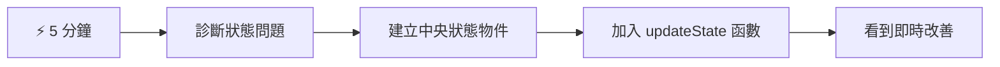
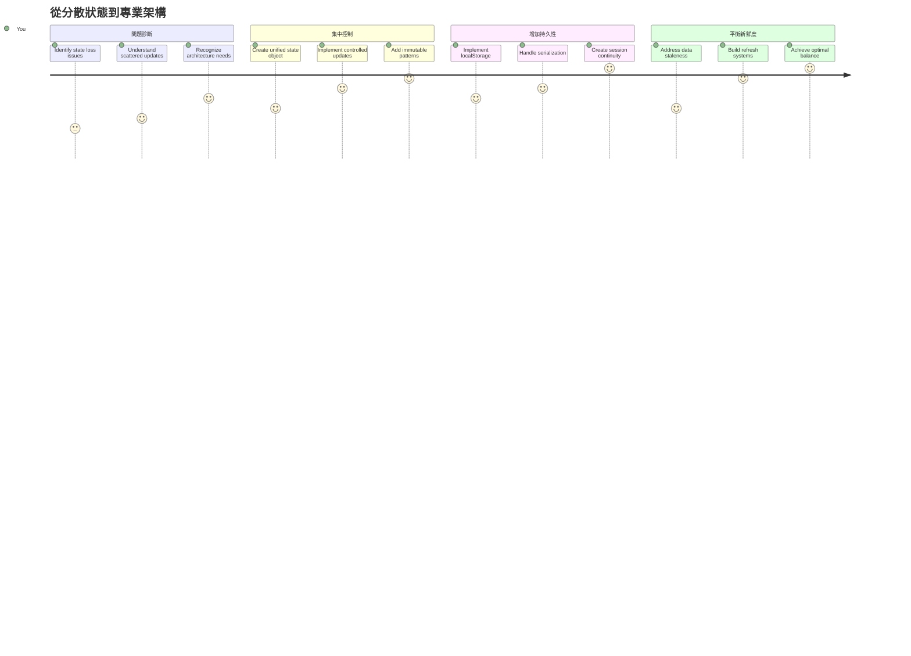
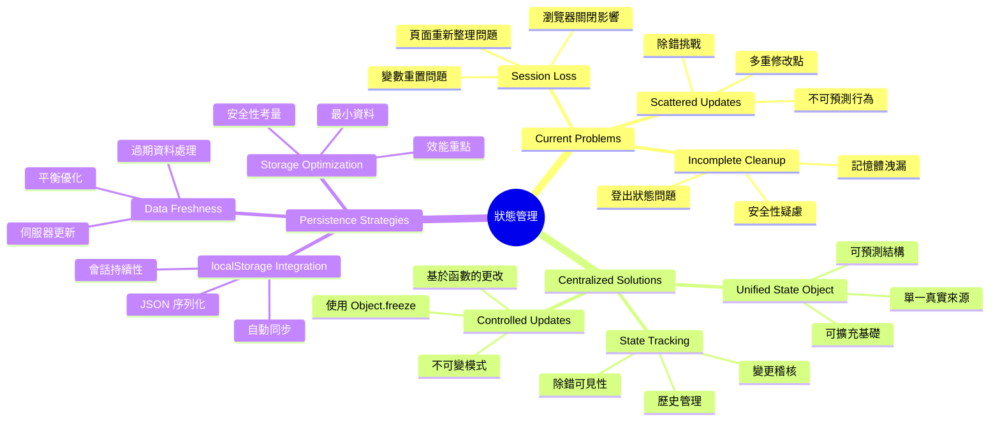
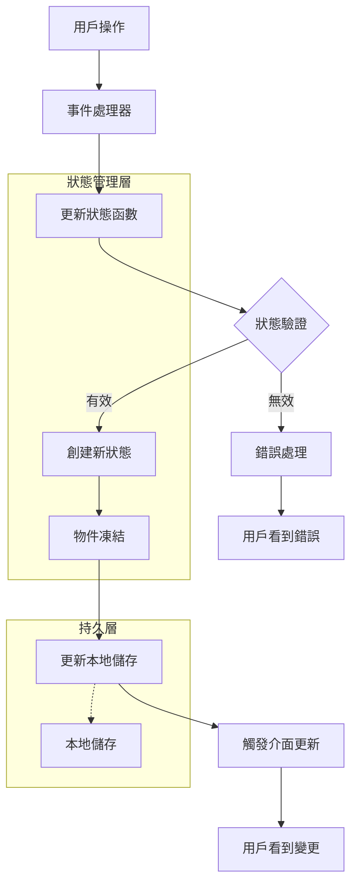
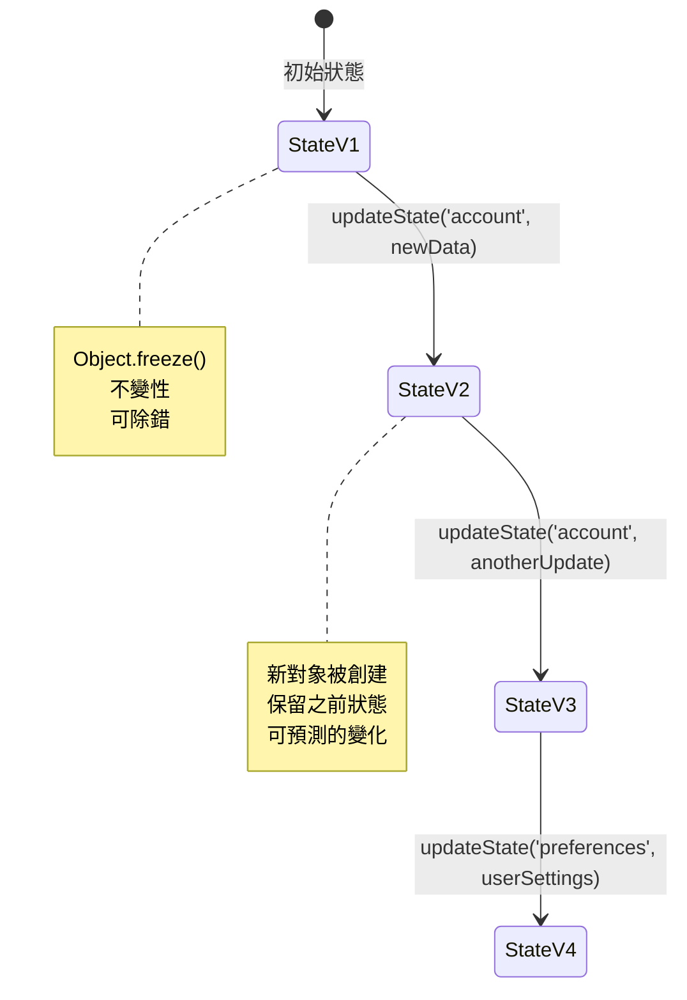
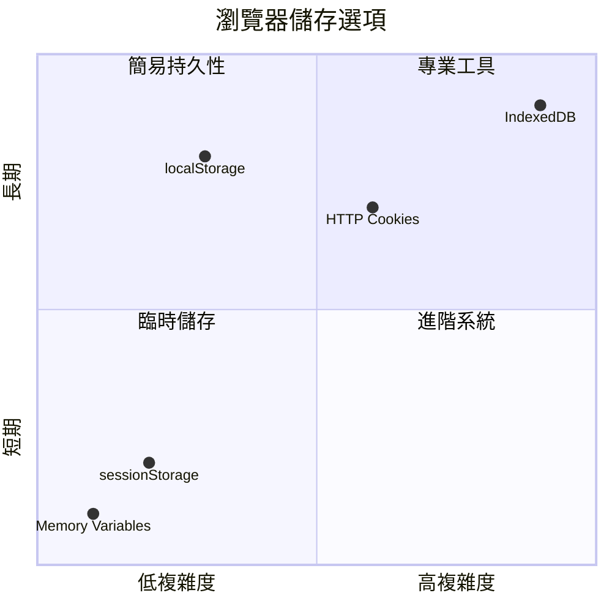
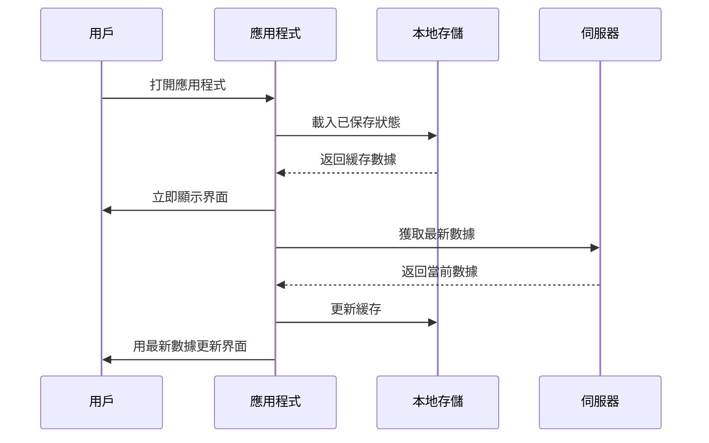
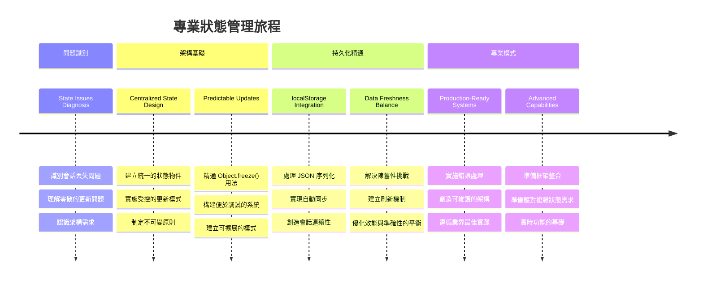

<!--
CO_OP_TRANSLATOR_METADATA:
{
  "original_hash": "b807b09df716dc48a2b750835bf8e933",
  "translation_date": "2026-01-06T12:54:43+00:00",
  "source_file": "7-bank-project/4-state-management/README.md",
  "language_code": "hk"
}
-->
# 建立銀行應用程式 第4部分：狀態管理概念

## ⚡ 接下來5分鐘可完成的事項

**忙碌開發者的快速啟動路徑**


- **第1分鐘**：測試目前的狀態問題 - 登入，重新整理頁面，觀察登出
- **第2分鐘**：用 `let state = { account: null }` 替換 `let account = null`
- **第3分鐘**：建立簡易的 `updateState()` 函式用於受控更新
- **第4分鐘**：更新一個函式以使用新的模式
- **第5分鐘**：測試更可預測且易於除錯的狀態管理

**快速診斷測試**：
```javascript
// 之前：分散狀態
let account = null; // 刷新後遺失！

// 之後：集中狀態
let state = Object.freeze({ account: null }); // 可控且可追蹤！
```

**為何這很重要**：5分鐘內，您將體驗從混亂的狀態管理轉變為可預測且易於除錯的模式。這是讓複雜應用程式易於維護的基礎。

## 🗺️ 您透過狀態管理大師之路的學習旅程


**您的學習目標**：本課結束時，您將建立一套專業等級的狀態管理系統，可處理持久化、資料鮮度及可預測的更新——這些模式正是生產系統中使用的。

## 課前小測驗

[課前小測驗](https://ff-quizzes.netlify.app/web/quiz/47)

## 介紹

狀態管理就像航行者號太空船上的導航系統——當一切運作順暢時，你幾乎感覺不到它的存在。但當事情出錯時，它就決定了你是能抵達星際空間，還是迷失在宇宙虛空中。在網頁開發中，狀態代表應用程式需要記住的一切：使用者登入狀態、表單資料、導覽歷史和臨時介面狀態。

隨著您的銀行應用程式從簡單的登入表單演進成更複雜的應用，您很可能已遇到一些常見挑戰。重新整理頁面時用戶意外登出。關閉瀏覽器所有進度消失。除錯時你得在多重函式中追蹤相同資料的多種寫入方式。

這些並非程式編寫不佳的跡象——而是當應用達到某種複雜度門檻時，必然會出現的成長痛。每位開發者都會在應用從「概念驗證」進展到「可投入生產」時遇到這類挑戰。

在本課中，我們將實作集中式狀態管理系統，將您的銀行應用程式轉變為可靠且專業的產品。您將學會可預測地管理資料流，適當地持久化使用者會話，並創造現代網路應用所需的流暢用戶體驗。

## 先決條件

在深入狀態管理概念之前，請確保您的開發環境已正確設定，且銀行應用程式基礎已建立。本課程直接建立在本系列前幾部分的概念與程式碼之上。

請確保您已備妥以下組件後再繼續：

**必要設定：**
- 完成[資料擷取課程](../3-data/README.md) - 您的應用程式應能成功載入並顯示帳戶資料
- 在您的系統上安裝[Node.js](https://nodejs.org)以執行後端API
- 本機啟動[伺服器API](../api/README.md)來處理帳戶資料操作

**測試您的環境：**

在終端機執行以下指令，以驗證API伺服器是否正常運作：

```sh
curl http://localhost:5000/api
# -> 應該返回 "Bank API v1.0.0" 作為結果
```

**此指令功能：**
- **送出** GET 請求至您本機的API伺服器
- **測試**連線且驗證伺服器回應
- **回傳**API版本資訊（如一切正常）

## 🧠 狀態管理架構概述


**核心原理**：專業的狀態管理在可預測性、持久化和效能之間取得平衡，打造從簡單互動到複雜應用流程皆可擴展的可靠用戶體驗。

---

## 診斷目前的狀態問題

就像福爾摩斯檢視案發現場，我們必須完全了解當前實作中到底發生了什麼，才能破解消失的使用者會話之謎。

讓我們執行一個簡單實驗，揭露潛藏的狀態管理挑戰：

**🧪 嘗試這個診斷測試：**
1. 登入您的銀行應用並導航至儀表板
2. 重新整理瀏覽器頁面
3. 觀察您的登入狀態發生了什麼

若您被導回登入畫面，您就遇到了經典的狀態持久化問題。這是因為我們目前的實作將使用者資料儲存在會在每次頁面載入時重置的 JavaScript 變數中。

**目前的實作問題：**

來自我們[前一課程](../3-data/README.md)中簡易的 `account` 變數造成三個重大問題，影響使用者體驗與程式碼可維護性：

| 問題 | 技術原因 | 使用者影響 |
|---------|--------|----------------|
| **會話丟失** | 頁面重新整理清空 JavaScript 變數 | 使用者需頻繁重新認證 |
| **更新分散** | 多個函式直接改寫狀態 | 除錯難度逐漸升高 |
| **清理不完整** | 登出未清除所有狀態引用 | 潛在安全與隱私風險 |

**架構挑戰：**

宛如鐵達尼號的隔艙設計看似堅固，卻在多艙同時淹水時崩潰，單獨修補這些問題無法解決根本架構缺陷。我們需要全面的狀態管理解決方案。

> 💡 **我們到底想達成什麼？**

[狀態管理](https://en.wikipedia.org/wiki/State_management) 實際上是兩大基本問題的解決：

1. **我的資料在哪？**：追蹤我們擁有什麼資訊及其來源
2. **是否資訊一致？**：確保使用者所見即資料實際情況

**我們的策略：**

不再蛇行亂撞，而是建立 **集中式狀態管理** 系統。想像有一名非常有組織的專責人員主控所有重要事物：



**理解此資料流：**
- **集中管理**所有應用狀態於單一位置
- **路由**所有狀態變更透過受控函式
- **確保**介面與當前狀態同步
- **提供**清晰且可預測的資料管理模式

> 💡 **專業洞見**：本課專注於基礎概念。對於複雜應用，像是[Redux](https://redux.js.org)等函式庫提供了更進階的狀態管理功能。理解這些核心原則將有助您精通任何狀態管理庫。

> ⚠️ **進階主題**：我們這裡不會介紹由狀態變更自動觸發的UI更新，此屬於[反應式編程](https://en.wikipedia.org/wiki/Reactive_programming)範疇。可視為學習之路的優秀後續課題！

### 任務：集中狀態結構

讓我們開始將分散的狀態管理轉換成集中系統。這第一步為接下來的所有改進奠定基礎。

**步驟1：建立中央狀態物件**

取代簡單的 `account` 宣告：

```js
let account = null;
```

改為有結構的狀態物件：

```js
let state = {
  account: null
};
```

**為何這改動重要：**
- **集中管理**所有應用資料於單一地點
- **為未來擴充狀態屬性做好準備**
- **建立狀態與其它變數間清晰界線**
- **確立隨應用成長而擴展的設計模式**

**步驟2：更新狀態存取模式**

修改函式以使用新的狀態結構：

**在 `register()` 與 `login()` 函式中**，將：
```js
account = ...
```

改為：
```js
state.account = ...
```

**在 `updateDashboard()` 函式頂部**新增：
```js
const account = state.account;
```

**這些更新達成：**
- **維持既有功能同時改善結構**
- **為更先進的狀態管理做準備**
- **建立一致的狀態資料存取模式**
- **奠定集中式狀態更新的基礎**

> 💡 **注意**：此重構尚未立即解決問題，但為後續強力改進打造關鍵基礎！

### 🎯 教學點檢：集中原則

**暫停反思**：您剛實作出集中式狀態管理的基礎。這是關鍵架構決策。

**自我評估：**
- 您能說明為何集中狀態於單一物件比分散變數更好嗎？
- 若忘記更新某函式改用 `state.account`，會發生什麼事？
- 此模式如何為您的程式碼準備好先進功能？

**實務連結**：您學到的集中模式正是現代框架如 Redux、Vuex 和 React Context 的架構基礎。您正在建構大型應用的同樣架構思維。

**挑戰題**：若需新增使用者偏好（主題、語言）到應用狀態，您會把它們加在哪？如何擴展？

## 實作受控狀態更新

狀態集中後，下一步是建立受控資料修改機制。這種作法確保狀態變更可預測且易於除錯。

核心原理像空中交通管制：不允許多個函式獨立更改狀態，而是所有改動都經由單一、受控函式。此模式提供清晰監控變更時機和方式。

**不可變狀態管理：**

我們將視 `state` 物件為[*不可變物件*](https://en.wikipedia.org/wiki/Immutable_object)，意即永不直接修改它。每次變更都會建立一個新的狀態物件，內含更新後的資料。

此策略初看起來似乎比直接修改效率低，但它在除錯、測試及維持應用可預測性方面優勢明顯。

**不可變狀態管理的好處：**

| 好處 | 說明 | 影響 |
|---------|-------------|--------|
| **可預測性** | 變更僅透過受控函式發生 | 降低除錯與測試難度 |
| **歷史追蹤** | 每個狀態變更都建立新物件 | 支援復原/重做功能 |
| **避免副作用** | 無意外修改 | 預防神祕錯誤 |
| **效能優化** | 容易判斷狀態是否變更 | 支援高效介面更新 |

**JavaScript的不可變性：`Object.freeze()`**

JavaScript 提供 [`Object.freeze()`](https://developer.mozilla.org/docs/Web/JavaScript/Reference/Global_Objects/Object/freeze) 防止物件被修改：

```js
const immutableState = Object.freeze({ account: userData });
// 任何嘗試修改 immutableState 嘅行為都會引發錯誤
```

**解析此處發生的事：**
- **防止**直接指派或刪除屬性
- **若嘗試修改會拋出例外**
- **確保**狀態變更必須走受控函式
- **建立**狀態更新明確規範

> 💡 **深入了解**：可參考[MDN文件](https://developer.mozilla.org/docs/Web/JavaScript/Reference/Global_Objects/Object/freeze#What_is_shallow_freeze) 中淺層與深度不可變物件的差異。這對複雜狀態結構至關重要。


### 任務

讓我們建立新的 `updateState()` 函式：

```js
function updateState(property, newData) {
  state = Object.freeze({
    ...state,
    [property]: newData
  });
}
```

此函式中，我們利用[*展開(...)*運算子](https://developer.mozilla.org/docs/Web/JavaScript/Reference/Operators/Spread_syntax#Spread_in_object_literals)創建新的狀態物件，複製先前狀態資料，之後用[中括號符號](https://developer.mozilla.org/docs/Web/JavaScript/Guide/Working_with_Objects#Objects_and_properties) `[property]` 覆寫特定屬性。最後用 `Object.freeze()` 鎖定物件防止修改。現在狀態中只有 `account` 屬性，但此設計容許您隨時新增多個狀態屬性。

此外，我們同時更新 `state` 初始值，確保初始狀態也被凍結：

```js
let state = Object.freeze({
  account: null
});
```

接著，在 `register` 函式中將 `state.account = result;` 改為：

```js
updateState('account', result);
```

同理，在 `login` 函式中將 `state.account = data;` 改為：

```js
updateState('account', data);
```

我們也趁此機會修正使用者點擊*登出*時帳戶資料未清除的問題。

建立新函式 `logout()`：

```js
function logout() {
  updateState('account', null);
  navigate('/login');
}
```

在 `updateDashboard()` 中，將導向 `return navigate('/login');` 改為 `return logout()`；

嘗試註冊新帳戶，登出再登入，確認一切功能正常。

> 小提示：您可以在 `updateState()` 函式底部新增 `console.log(state)`，開啟瀏覽器開發者工具的控制台查看所有狀態變更。

## 實作資料持久化

先前發現的會話丟失問題需要持久化方案，讓使用者狀態在瀏覽器會話間得以保存。這使我們的應用從短暫體驗轉變為可靠且專業的工具。

想像原子鐘即便斷電也能維持精準時間，因為它將關鍵狀態存放在非揮發性記憶。網頁應用同理，需要持久化存儲機制，以保存重要使用者資料穿越瀏覽器會話與頁面重整。

**資料持久化的策略性問題：**

在實作持久化前，請考慮以下關鍵因素：

| 問題 | 銀行應用情境 | 決策影響 |
|----------|-------------------|----------------|
| **資料是否敏感？** | 帳戶餘額、交易歷史 | 選擇安全的儲存方式 |
| **應該持續多久？** | 登入狀態 vs. 臨時介面設定偏好 | 選擇適當的儲存時間 |
| **伺服器需要它嗎？** | 驗證令牌 vs. 介面設定 | 判斷共享需求 |

**瀏覽器儲存選項：**

現代瀏覽器提供多種儲存機制，每種皆為不同使用情境設計：

**主要儲存 API：**

1. **[`localStorage`](https://developer.mozilla.org/docs/Web/API/Window/localStorage)**：持久的[鍵值儲存](https://en.wikipedia.org/wiki/Key%E2%80%93value_database)
   - **持久**保存資料於瀏覽器會話間無限期  
   - **可持續**瀏覽器重啟與電腦重開後依然存在
   - **限制於**特定網站網域範圍
   - **適合**用戶偏好設定及登入狀態

2. **[`sessionStorage`](https://developer.mozilla.org/docs/Web/API/Window/sessionStorage)**：臨時會話儲存
   - 在活動會話期間**功能與 localStorage 相同**
   - 瀏覽器分頁關閉時**自動清除**
   - **理想用於**不需持續的暫存資料

3. **[HTTP Cookies](https://developer.mozilla.org/docs/Web/HTTP/Cookies)**：伺服器共享儲存
   - 會**自動隨每次伺服器請求發送**
   - **適合**[驗證](https://en.wikipedia.org/wiki/Authentication)令牌
   - **大小有限制**且可能影響效能

**資料序列化需求：**

`localStorage` 與 `sessionStorage` 僅能儲存[字串](https://developer.mozilla.org/docs/Web/JavaScript/Reference/Global_Objects/String)：

```js
// 將物件轉換為 JSON 字串以便儲存
const accountData = { user: 'john', balance: 150 };
localStorage.setItem('account', JSON.stringify(accountData));

// 檢索時將 JSON 字串解析回物件
const savedAccount = JSON.parse(localStorage.getItem('account'));
```

**了解序列化：**
- 使用 [`JSON.stringify()`](https://developer.mozilla.org/docs/Web/JavaScript/Reference/Global_Objects/JSON/stringify) **將 JavaScript 物件轉換為 JSON 字串**
- 使用 [`JSON.parse()`](https://developer.mozilla.org/docs/Web/JavaScript/Reference/Global_Objects/JSON/parse) **從 JSON 解析回物件**
- **自動處理**複雜的巢狀物件與陣列
- **無法處理**函式、未定義值及循環參考

> 💡 **進階選項**：針對複雜離線應用及大型資料集，考慮使用 [`IndexedDB` API](https://developer.mozilla.org/docs/Web/API/IndexedDB_API)。它提供完整的客戶端資料庫，但實作較為繁複。


### 任務：實作 localStorage 持久性

讓我們實作持久化儲存，讓使用者在未明確登出前持續保持登入。我們將使用 `localStorage` 於瀏覽器會話間儲存帳戶資料。

**步驟 1：定義儲存設定**

```js
const storageKey = 'savedAccount';
```

**此常數提供：**
- **建立**一致的儲存資料識別標誌
- **避免**儲存鍵名稱拼字錯誤
- **方便**日後需更換儲存鍵時調整
- **遵循**可維護程式碼的最佳實務

**步驟 2：新增自動持久化**

於 `updateState()` 函式結尾加入這行：

```js
localStorage.setItem(storageKey, JSON.stringify(state.account));
```

**解析執行流程：**
- **將**帳戶物件轉換為 JSON 字串存檔
- **以**一致的儲存鍵保存資料
- **每當狀態更新時自動執行**
- **確保**儲存資料隨時與當前狀態保持同步

> 💡 **架構優勢**：由於所有狀態更新都集中在 `updateState()`，加入持久化只需一行程式碼，展現良好架構設計的威力！

**步驟 3：於應用載入還原狀態**

建立初始化函數來還原儲存資料：

```js
function init() {
  const savedAccount = localStorage.getItem(storageKey);
  if (savedAccount) {
    updateState('account', JSON.parse(savedAccount));
  }

  // 我們之前的初始化代碼
  window.onpopstate = () => updateRoute();
  updateRoute();
}

init();
```

**理解初始化流程：**
- **從 localStorage 讀取**先前儲存的帳戶資料（如有）
- **解析** JSON 字串回 JavaScript 物件
- **用受控更新函式**更新狀態
- **分頁載入時自動還原**使用者會話
- **於路由更新前執行**，確保狀態可用

**步驟 4：優化預設路由**

更新預設路由以善用持久化：

於 `updateRoute()`，替換：
```js
// 替換：return navigate('/login');
return navigate('/dashboard');
```

**此改動理由：**
- **有效利用**新持久化系統
- **讓**儀表板能處理驗證檢查
- **若無已保存會話，自動導向登入頁**
- **打造更流暢的用戶體驗**

**測試您的實作：**

1. 登入您的銀行應用
2. 重新整理瀏覽器頁面
3. 確認仍保持登入且在儀表板頁面
4. 關閉並重新開啟瀏覽器
5. 回到應用驗證仍持續登入

🎉 **成就解鎖**：您已成功實作持久狀態管理！您的應用現在表現如專業網頁應用。

### 🎯 教學檢查：持久化架構

**架構理解**：您已實作出平衡使用者體驗與資料管理複雜度的進階持久層。

**掌握重點概念**：
- **JSON 序列化**：將複雜物件轉為可儲存的字串
- **自動同步**：狀態變更自動觸發儲存
- **會話恢復**：應用可於中斷後復原用戶上下文
- **集中管理持久化**：一個更新函式處理所有儲存

**產業連結**：此持久化模式為漸進式網頁應用（PWA）、離線優先應用及現代行動網頁體驗的基礎。您正在打造生產級能力。

**反思問題**：若需同一設備支持多用戶帳號，您會如何修改此系統？請考慮隱私與安全性。

## 平衡持久化與資料新鮮度

我們的持久系統成功維持使用者會話，卻帶來新挑戰：資料陳舊。當多使用者或應用修改同一伺服器資料時，當地快取資訊便會過時。

此狀況如維京航海家同時依賴存有的星圖與當前星象觀測。星圖提供穩定性，但需即時觀測來應付變化。同理，我們的應用需要持久使用者狀態及最新伺服器資料兼顧。

**🧪 發現資料新鮮度問題：**

1. 使用 `test` 帳戶登入儀表板
2. 開啟終端機執行下列指令模擬他方交易：

```sh
curl --request POST \
     --header "Content-Type: application/json" \
     --data "{ \"date\": \"2020-07-24\", \"object\": \"Bought book\", \"amount\": -20 }" \
     http://localhost:5000/api/accounts/test/transactions
```

3. 在瀏覽器刷新儀表板頁面
4. 注意是否看到新的交易紀錄

**此測試示範：**
- **顯示**本地儲存可能變得「過時」
- **模擬**真實世界資料於應用外部更新
- **揭露**持久化與資料鮮度之間的衝突

**資料陳舊挑戰：**

| 問題 | 原因 | 使用者影響 |
|---------|-------|-------------|
| **資料陳舊** | localStorage 不會自動過期 | 使用者看到過時資訊 |
| **伺服器更改** | 其他應用/用戶變更相同資料 | 各平台資料不同步 |
| **快取與真實差異** | 本地快取與伺服器狀態不符 | 不佳用戶體驗與混淆 |

**解決策略：**

我們將實作「載入時刷新」方案，平衡持久化優點與資料新鮮需求。此方式維持流暢體驗同時確保資料正確。


### 任務：實作資料刷新系統

建立系統自動從伺服器抓取最新資料，同時維持持久狀態管理優點。

**步驟 1：建立帳戶資料更新器**

```js
async function updateAccountData() {
  const account = state.account;
  if (!account) {
    return logout();
  }

  const data = await getAccount(account.user);
  if (data.error) {
    return logout();
  }

  updateState('account', data);
}
```

**此函式邏輯說明：**
- **檢查**用戶是否登入（state.account 是否存在）
- **無有效會話即導向登出**
- **利用現有 `getAccount()` 函式從伺服器取得新資料**
- **伺服器錯誤時優雅處理，登出無效會話**
- **使用受控更新系統更新狀態為最新**
- **觸發 `updateState()` 自動儲存 localStorage**

**步驟 2：建立儀表板刷新處理器**

```js
async function refresh() {
  await updateAccountData();
  updateDashboard();
}
```

**刷新函式實現：**
- **協調**資料刷新與介面更新流程
- **等待**新資料載入後更新顯示
- **確保**儀表板展現最即時資訊
- **保持**資料管理與介面更新分離清晰

**步驟 3：與路由系統整合**

更新路由配置以自動觸發刷新：

```js
const routes = {
  '/login': { templateId: 'login' },
  '/dashboard': { templateId: 'dashboard', init: refresh }
};
```

**整合方式說明：**
- **每次儀表板路由載入時執行刷新**
- **確保用戶瀏覽儀表板時看到最新資料**
- **保留既有路由結構同時新增資料新鮮度**
- **建立路由特定初始化一致模式**

**測試您的資料刷新系統：**

1. 登入您的銀行應用
2. 執行之前的 curl 指令建立新交易
3. 重新整理儀表板或離開再回來
4. 確認新交易立刻出現

🎉 **完美平衡**：您的應用成功結合持久狀態順暢體驗與最新伺服器資料準確性！

## 📈 您的狀態管理精通時間軸


**🎓 畢業里程碑**：您已使用類似 Redux、Vuex 等專業狀態庫的原理，成功建構完整狀態管理系統。這些模式可從簡易應用擴展至企業級應用。

**🔄 下一階段能力：**
- 準備掌握狀態管理框架（Redux、Zustand、Pinia）
- 準備實作 WebSockets 實時功能
- 有能力打造離線優先漸進式網頁應用（PWA）
- 奠定狀態機與觀察者等進階模式的基礎

## GitHub Copilot Agent 挑戰 🚀

使用 Agent 模式完成以下挑戰：

**描述：** 為銀行應用實作包含撤銷/重做功能的完整狀態管理系統。本挑戰將幫助您練習進階狀態管理概念，包括狀態歷史追蹤、不變式更新及介面同步。

**提示：** 建立強化狀態管理系統，包含：1) 一個追蹤所有過去狀態的歷史陣列，2) 可回復前一狀態的撤銷與重做功能，3) 儀表板的撤銷/重做按鈕，4) 最多保存10個歷史狀態以防資源浪費，5) 使用者登出時清理歷史紀錄。確保撤銷/重做對帳戶餘額變更生效，並可持久於瀏覽器刷新後。

更多資訊請見[agent mode](https://code.visualstudio.com/blogs/2025/02/24/introducing-copilot-agent-mode)。

## 🚀 挑戰：儲存優化

您已有效處理使用者會話、資料刷新與狀態管理。然而，請思考目前方法是否在儲存效率與功能間達到最佳平衡。

如同棋手分辨必需子力與可犧牲兵卒，有效狀態管理需識別哪些資料必須持久保存，哪些應由伺服器保持即時更新。

**優化分析：**

評估您的 localStorage 實作並考慮以下策略問題：
- 維持用戶認證需最少的資訊是什麼？
- 哪些資料變動頻率高且本地快取效益低？
- 如何優化儲存提升效能同時不損使用體驗？

此類架構分析展現經驗豐富開發者同時考量功能與效率的能力。

**實作策略：**
- **鑑別**必須持久保存的核心資料（可能只需用戶身份標識）
- **修改** localStorage 實作只存儲關鍵會話資料
- **確保**儀表板訪問時總從伺服器載入最新資料
- **測試**優化方案同時維持相同使用體驗

**進階考量：**
- **比較**保存完整帳戶資料與僅保存認證令牌的利弊
- **紀錄**您的決策與原因供團隊未來參考

此挑戰助您養成考慮用戶體驗與應用效率的專業開發者思維。請慢慢嘗試不同方案！

## 講義結束測驗

[講義結束測驗](https://ff-quizzes.netlify.app/web/quiz/48)

## 作業

[實作「新增交易」對話框](assignment.md)

以下為完成作業後的示範結果：


---

<!-- CO-OP TRANSLATOR DISCLAIMER START -->
**免責聲明**：  
本文件乃使用 AI 翻譯服務 [Co-op Translator](https://github.com/Azure/co-op-translator) 進行翻譯。雖然我們盡力確保準確性，但請注意自動翻譯可能包含錯誤或不準確之處。原始文件的母語版本應視為權威版本。對於重要資訊，建議採用專業人工翻譯。我們對因使用本翻譯而產生的任何誤解或誤譯概不負責。
<!-- CO-OP TRANSLATOR DISCLAIMER END -->