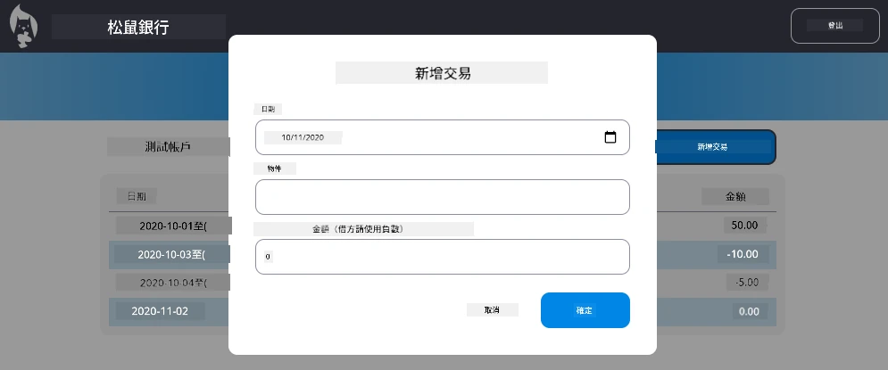

<!--
CO_OP_TRANSLATOR_METADATA:
{
  "original_hash": "50a7783473b39a2e0f133e271a102231",
  "translation_date": "2026-01-06T12:57:07+00:00",
  "source_file": "7-bank-project/4-state-management/assignment.md",
  "language_code": "hk"
}
-->
# 實作「新增交易」對話框

## 概述

你的銀行應用程式現在已有穩固的狀態管理和資料持久化功能，但缺少一個真正銀行應用需要的重要功能：讓使用者新增自己的交易。在這個作業中，你將實作一個完整的「新增交易」對話框，並與你現有的狀態管理系統無縫整合。

本作業結合了你在四堂銀行課程中學到的所有內容：HTML 模板、表單處理、API 整合和狀態管理。

## 學習目標

完成此作業後，你將能夠：
- **建立** 使用者友善的對話框介面來輸入資料
- **實作** 支援鍵盤和螢幕閱讀器的無障礙表單設計
- **整合** 新功能至現有的狀態管理系統
- **練習** API 通訊與錯誤處理
- **應用** 現代網頁開發模式於實際功能

## 指示

### 步驟 1：新增交易按鈕

**建立** 一個「新增交易」按鈕於你的控制台頁面，使用者可以輕易找到並存取。

**需求：**
- **將** 按鈕放在控制台中合適的位置
- **使用** 明確且行動導向的按鈕文字
- **套用** 與現有介面設計一致的樣式
- **確保** 按鈕可由鍵盤操作存取

### 步驟 2：對話框實作

從以下兩種方法中選擇一種來實作你的對話框：

**選項 A：獨立頁面**
- **建立** 新的 HTML 模板用於交易表單
- **新增** 一個路由至你的路由系統
- **實作** 導航至表單頁面與返回功能

**選項 B：模態對話框（建議）**
- **使用** JavaScript 於控制台內顯示/隱藏對話框，不離開控制台頁面
- **使用** [`hidden` 屬性](https://developer.mozilla.org/docs/Web/HTML/Global_attributes/hidden) 或 CSS 類別實作
- **打造** 流暢的使用體驗，包含適當的焦點管理

### 步驟 3：無障礙實作

**確保** 對話框符合[模態對話框無障礙標準](https://developer.paciellogroup.com/blog/2018/06/the-current-state-of-modal-dialog-accessibility/)：

**鍵盤導覽：**
- **支援** 使用 Escape 鍵關閉對話框
- **將** 焦點鎖定於對話框內開啟狀態
- **關閉後** 將焦點回復至觸發按鈕

**螢幕閱讀器支援：**
- **添加** 適切的 ARIA 標籤與角色
- **對** 對話框開啟/關閉做出螢幕閱讀器公告
- **提供** 清楚的表單欄位標籤與錯誤訊息

### 步驟 4：表單建立

**設計** HTML 表單以收集交易資料：

**必填欄位：**
- **日期**：交易發生時間
- **描述**：交易用途說明
- **金額**：交易金額（正數為收入，負數為支出）

**表單特色：**
- **於送出前** 驗證使用者輸入
- **提供** 明確的錯誤提示
- **包含** 有助於輸入的 placeholder 及標籤
- **樣式** 與你現有的設計一致

### 步驟 5：API 整合

**將** 你的表單與後端 API 連接：

**實作步驟：**
- **參考** [伺服器 API 規格](../api/README.md) 確認正確的端點與資料格式
- **從表單輸入產生** JSON 資料
- **利用適當的錯誤處理** 發送資料至 API
- **向使用者顯示** 成功或失敗訊息
- **優雅處理** 網路錯誤問題

### 步驟 6：狀態管理整合

**更新** 你的控制台以加入新交易：

**整合需求：**
- **新增交易成功後** 重新整理帳戶資料
- **更新** 控制台顯示，不需重新載入頁面
- **確保** 新交易即時出現
- **維持** 整個流程中的狀態一致性

## 技術規格

**API 端點詳情：**
參考 [伺服器 API 文件](../api/README.md) 了解：
- 交易資料所需 JSON 格式
- HTTP 方法與端點 URL
- 預期回應格式
- 錯誤回應處理

**預期結果：**  
完成作業後，你的銀行應用應具備完整且專業的「新增交易」功能：

## 測試你的實作

**功能測試：**
1. **確認** 「新增交易」按鈕明顯且可存取
2. **測試** 對話框能正確開啟與關閉
3. **確認** 表單驗證對所有必填欄位有效
4. **檢查** 成功新增的交易能立即於控制台顯示
5. **確保** 錯誤處理對無效資料及網路問題有效

**無障礙測試：**
1. **僅使用鍵盤** 執行整個操作流程
2. **使用螢幕閱讀器測試** 確保適當公告
3. **驗證** 焦點管理運作正常
4. **檢查** 全部表單元件有適當標籤

## 評分標準

| 評分標準 | 優異 | 適當 | 需要改進 |
| -------- | --------- | -------- | ----------------- |
| **功能性** | 新增交易功能完美運作，使用體驗優秀，符合所有課程最佳實務 | 新增交易功能正常，可能未完全遵循部分最佳實務或有少許使用障礙 | 新增交易功能部分運作，或存在嚴重使用障礙 |
| **程式碼品質** | 程式碼條理清晰，遵循既有設計模式，具備完善錯誤處理，且與現有狀態管理無縫整合 | 程式碼可運作，但可能有組織不佳或部分與現有程式不一致 | 程式碼結構問題嚴重，或無法良好整合既有系統 |
| **無障礙** | 完整支援鍵盤導覽、螢幕閱讀器，符合 WCAG 指南，並具優良焦點管理 | 基本無障礙功能有實作，但可能缺少部分鍵盤導覽或螢幕閱讀器支援 | 幾乎無或未實作無障礙功能 |
| **使用者體驗** | 介面直覺流暢，反饋清晰，互動順暢且具專業外觀 | 使用體驗良好，反饋或視覺設計有少許可改善之處 | 使用體驗差，介面混亂或缺乏反饋 |

## 額外挑戰（選做）

完成基本需求後，可考慮以下增強功能：

**強化功能：**
- **新增** 交易類別（餐飲、交通、娛樂等）
- **實作** 即時反饋的輸入驗證
- **為進階使用者建立** 鍵盤快捷鍵
- **增加** 交易編輯與刪除功能

**進階整合：**
- **實作** 新增交易的復原功能
- **新增** 由 CSV 檔案匯入大量交易功能
- **建立** 交易搜尋與篩選功能
- **實作** 資料匯出功能

這些進階功能將幫助你練習更高階的網頁開發觀念，打造更完整的銀行應用程式！

---

<!-- CO-OP TRANSLATOR DISCLAIMER START -->
**免責聲明**：  
本文件由 AI 翻譯服務 [Co-op Translator](https://github.com/Azure/co-op-translator) 進行翻譯。儘管我們致力於確保準確性，但請注意自動翻譯可能包含錯誤或不準確之處。原始文件的母語版本應被視為權威來源。對於重要資訊，建議採用專業人工翻譯。我們不對因使用本翻譯而引起的任何誤解或誤釋負責。
<!-- CO-OP TRANSLATOR DISCLAIMER END -->