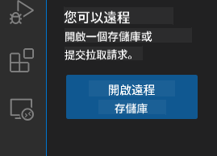
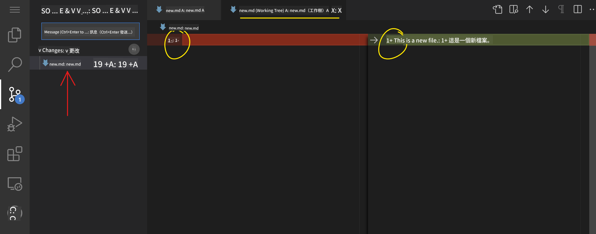
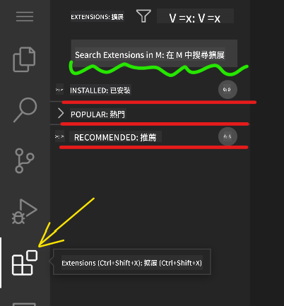

<!--
CO_OP_TRANSLATOR_METADATA:
{
  "original_hash": "1ba61d96a11309a2a6ea507496dcf7e5",
  "translation_date": "2025-08-29T15:09:16+00:00",
  "source_file": "8-code-editor/1-using-a-code-editor/README.md",
  "language_code": "hk"
}
-->
# 使用程式碼編輯器

本課程介紹如何使用 [VSCode.dev](https://vscode.dev) 這個基於網頁的程式碼編輯器，讓你可以在不需要安裝任何軟件的情況下修改程式碼並參與專案。

## 學習目標

在本課程中，你將學習如何：

- 在程式專案中使用程式碼編輯器
- 使用版本控制追蹤更改
- 自訂編輯器以進行開發

### 先決條件

在開始之前，你需要先在 [GitHub](https://github.com) 建立一個帳戶。如果你尚未建立帳戶，請前往 [GitHub](https://github.com/) 註冊。

### 簡介

程式碼編輯器是撰寫程式和協作現有程式專案的重要工具。一旦你掌握了編輯器的基本操作及其功能，你就能在撰寫程式時靈活運用。

## 開始使用 VSCode.dev

[VSCode.dev](https://vscode.dev) 是一款基於網頁的程式碼編輯器。你不需要安裝任何軟件，只需像打開其他網站一樣打開它即可。要開始使用編輯器，請打開以下連結：[https://vscode.dev](https://vscode.dev)。如果你尚未登入 [GitHub](https://github.com/)，請按照提示登入或建立新帳戶後再登入。

載入後，畫面應該類似以下圖片：


主要有三個區域，從左到右分別是：

1. _活動欄_，包括一些圖示，例如放大鏡 🔎、齒輪 ⚙️ 等。
2. 展開的活動欄，預設為 _檔案總管_，稱為 _側邊欄_。
3. 最右邊的程式碼區域。

點擊每個圖示以顯示不同的選單。完成後，點擊 _檔案總管_ 回到初始位置。

當你開始撰寫程式碼或修改現有程式碼時，這些操作都會在右側最大的區域進行。你也可以在這個區域查看現有程式碼，接下來我們將進行相關操作。

## 開啟 GitHub 儲存庫

首先，你需要開啟一個 GitHub 儲存庫。有多種方式可以開啟儲存庫。在本節中，我們將介紹兩種方法，讓你可以開始進行修改。

### 1. 使用編輯器

使用編輯器本身開啟遠端儲存庫。如果你前往 [VSCode.dev](https://vscode.dev)，你會看到一個 _"Open Remote Repository"_ 按鈕：



你也可以使用命令面板。命令面板是一個輸入框，你可以在其中輸入任何命令或操作的關鍵字來找到相應的指令。使用左上方的選單，選擇 _檢視_，然後選擇 _命令面板_，或者使用以下快捷鍵：Ctrl-Shift-P（MacOS 上為 Command-Shift-P）。


選單打開後，輸入 _open remote repository_，然後選擇第一個選項。你參與的或最近開啟的多個儲存庫將顯示出來。你也可以使用完整的 GitHub URL 來選擇一個儲存庫。將以下 URL 貼入輸入框：

```
https://github.com/microsoft/Web-Dev-For-Beginners
```

✅ 如果成功，你將看到該儲存庫的所有檔案載入到文字編輯器中。

### 2. 使用 URL

你也可以直接使用 URL 來載入儲存庫。例如，目前儲存庫的完整 URL 是 [https://github.com/microsoft/Web-Dev-For-Beginners](https://github.com/microsoft/Web-Dev-For-Beginners)，但你可以將 GitHub 網域替換為 `VSCode.dev/github`，直接載入儲存庫。結果 URL 將是 [https://vscode.dev/github/microsoft/Web-Dev-For-Beginners](https://vscode.dev/github/microsoft/Web-Dev-For-Beginners)。

## 編輯檔案

當你在瀏覽器或 VSCode.dev 中開啟儲存庫後，下一步就是更新或修改專案。

### 1. 建立新檔案

你可以在現有資料夾中建立檔案，也可以在根目錄/資料夾中建立檔案。要建立新檔案，打開你希望檔案儲存的位置/目錄，然後選擇活動欄上的 _'New file ...'_ 圖示，為檔案命名並按下 Enter。


### 2. 編輯並儲存儲存庫中的檔案

使用 vscode.dev 非常方便，特別是在你需要快速更新專案而不需要本地載入任何軟件時。
要更新程式碼，點擊活動欄上的 '檔案總管' 圖示以查看儲存庫中的檔案和資料夾。
選擇一個檔案以在程式碼區域中打開，進行修改並儲存。


完成專案更新後，選擇 _`版本控制`_ 圖示，該圖示包含你對儲存庫所做的所有新更改。

要查看你對專案所做的更改，選擇展開的活動欄中 `Changes` 資料夾中的檔案。這將打開一個 '工作樹'，讓你直觀地查看檔案的更改。紅色表示刪除，綠色表示新增。



如果你對所做的更改感到滿意，將滑鼠移到 `Changes` 資料夾並點擊 `+` 按鈕以暫存更改。暫存表示準備將更改提交到 GitHub。

如果你對某些更改不滿意並希望捨棄它們，將滑鼠移到 `Changes` 資料夾並選擇 `撤銷` 圖示。

然後，輸入 `提交訊息` _(描述你對專案所做的更改)_，點擊 `勾選圖示` 提交並推送更改。

完成專案後，選擇左上方的 `漢堡選單圖示` 返回 github.com 上的儲存庫。


## 使用擴展功能

在 VSCode 中安裝擴展功能可以為編輯器添加新功能並自訂開發環境選項，以改善你的開發工作流程。這些擴展功能還能幫助你支援多種程式語言，通常分為通用擴展或基於語言的擴展。

要瀏覽所有可用擴展的列表，點擊活動欄上的 _`擴展圖示`_，然後在標籤為 _'Search Extensions in Marketplace'_ 的文字框中輸入擴展名稱。
你會看到一個擴展列表，每個擴展都包含 **擴展名稱、發佈者名稱、一句描述、下載次數** 和 **星級評分**。


你還可以通過展開 _`已安裝資料夾`_ 查看所有已安裝的擴展，通過 _`熱門資料夾`_ 查看大多數開發者使用的熱門擴展，以及通過 _`推薦資料夾`_ 查看基於相同工作區的使用者或你最近打開的檔案推薦的擴展。



### 1. 安裝擴展

要安裝擴展，在搜索框中輸入擴展名稱，點擊它以在擴展活動欄中顯示更多資訊。

你可以點擊擴展活動欄上的 _藍色安裝按鈕_ 安裝，或者在選擇擴展後使用程式碼區域中顯示的安裝按鈕。


### 2. 自訂擴展

安裝擴展後，你可能需要根據自己的偏好修改其行為並進行自訂。要執行此操作，選擇擴展圖示，這次你的擴展將出現在 _已安裝資料夾_ 中，點擊 _**齒輪圖示**_ 並導航到 _擴展設定_。


### 3. 管理擴展

安裝並使用擴展後，vscode.dev 提供了基於不同需求管理擴展的選項。例如，你可以選擇：

- **停用：** _(當你暫時不需要擴展但又不想完全卸載它時，可以選擇停用)_

    在擴展活動欄中選擇已安裝的擴展 > 點擊齒輪圖示 > 選擇 '停用' 或 '停用（工作區）' **或者** 在程式碼區域中打開擴展並點擊藍色停用按鈕。

- **卸載：** 在擴展活動欄中選擇已安裝的擴展 > 點擊齒輪圖示 > 選擇 '卸載' **或者** 在程式碼區域中打開擴展並點擊藍色卸載按鈕。

---

## 作業

[使用 vscode.dev 建立履歷網站](https://github.com/microsoft/Web-Dev-For-Beginners/blob/main/8-code-editor/1-using-a-code-editor/assignment.md)

## 回顧與自學

閱讀更多關於 [VSCode.dev](https://code.visualstudio.com/docs/editor/vscode-web?WT.mc_id=academic-0000-alfredodeza) 及其其他功能的資訊。

---

**免責聲明**：  
此文件已使用人工智能翻譯服務 [Co-op Translator](https://github.com/Azure/co-op-translator) 翻譯。我們致力於提供準確的翻譯，但請注意，自動翻譯可能包含錯誤或不準確之處。應以原始語言的文件作為權威來源。對於關鍵資訊，建議使用專業的人類翻譯。我們對因使用此翻譯而引起的任何誤解或錯誤解讀概不負責。