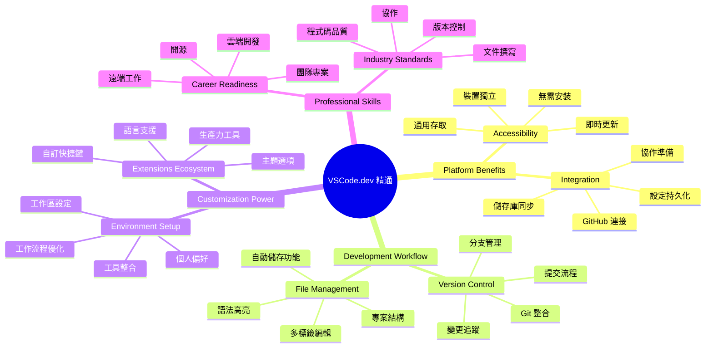
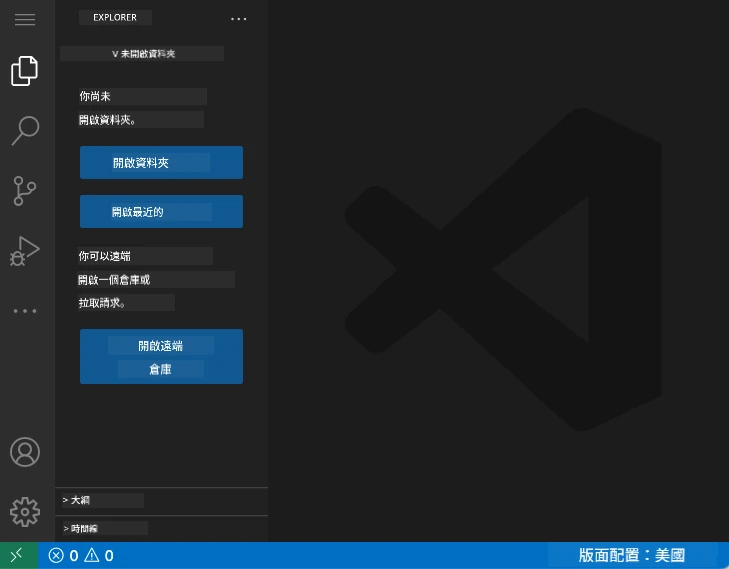
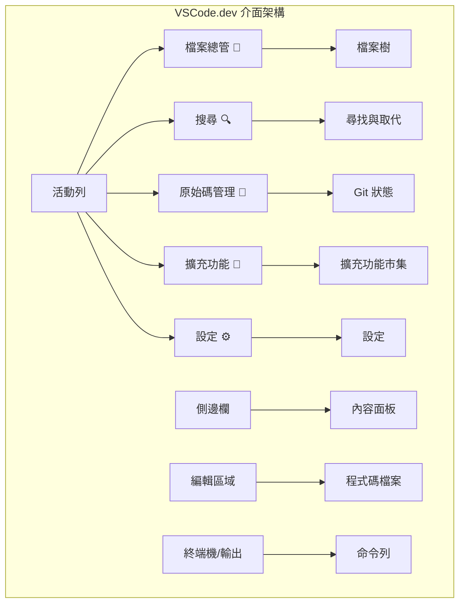
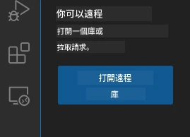
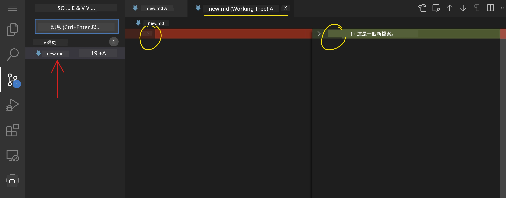
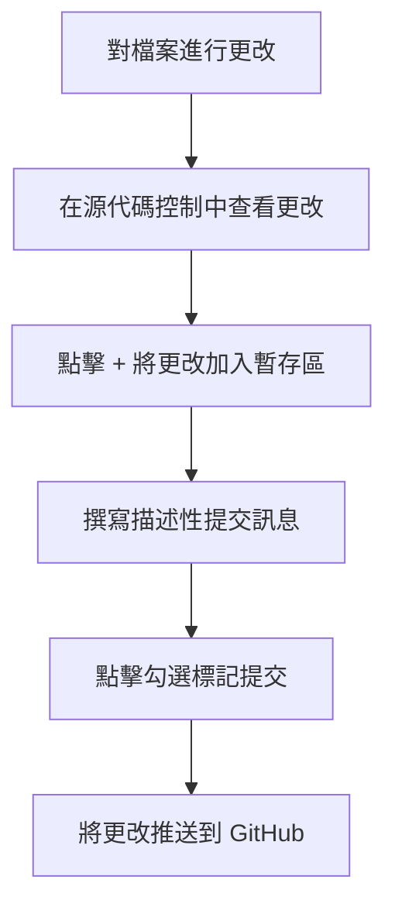
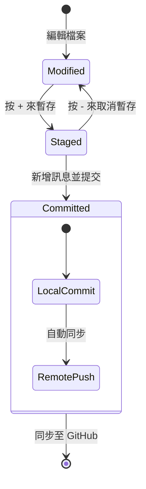
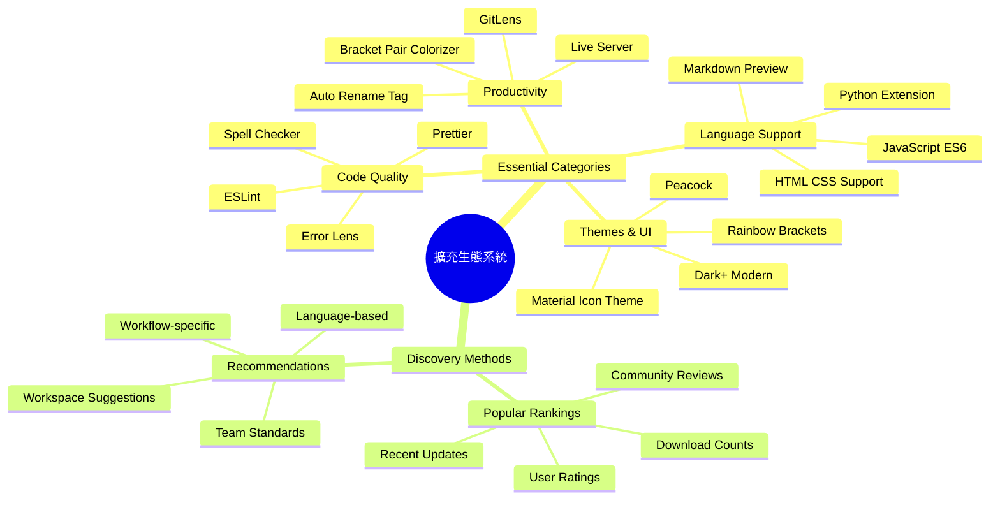
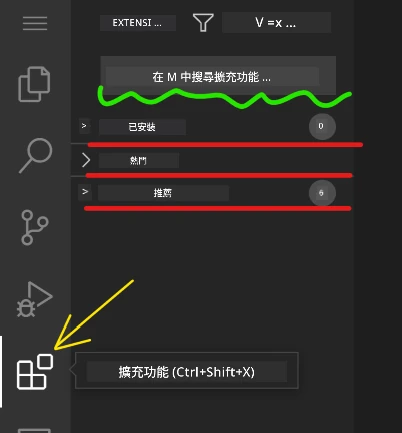
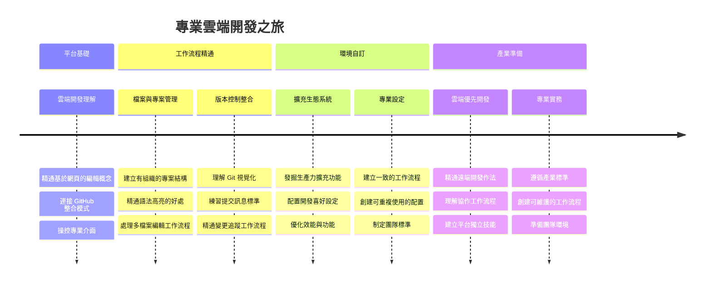

<!--
CO_OP_TRANSLATOR_METADATA:
{
  "original_hash": "a9a3bcc037a447e2d8994d99e871cd9f",
  "translation_date": "2026-01-06T12:23:51+00:00",
  "source_file": "8-code-editor/1-using-a-code-editor/README.md",
  "language_code": "hk"
}
-->
# 使用程式碼編輯器：精通 VSCode.dev

記得《駭客任務》中尼歐必須連接到龐大的電腦終端來進入數碼世界嗎？現今的網頁開發工具則完全相反——強大功能，可隨時隨地使用。VSCode.dev 是一款基於瀏覽器的程式碼編輯器，將專業的開發工具帶到任何有網絡連接的裝置上。

就像印刷機讓書籍普及到每個人，而不只是修道院的書吏一樣，VSCode.dev 讓編碼變得民主化。你可以在圖書館電腦、學校實驗室或任何有瀏覽器可用的地方工作。無需安裝，沒有「我需要特定設置」的限制。

完成本課程後，你將會了解如何操作 VSCode.dev、直接在瀏覽器中打開 GitHub 倉庫，以及使用 Git 進行版本控制——這些都是專業開發者每日依賴的技能。

## ⚡ 下一 5 分鐘你可以做什麼

**忙碌開發者的快速入門路徑**


- **第 1 分鐘**：前往 [vscode.dev](https://vscode.dev) — 無需安裝
- **第 2 分鐘**：使用 GitHub 登入以連接你的倉庫
- **第 3 分鐘**：試試網址技巧：將任何倉庫的 `github.com` 改成 `vscode.dev/github`
- **第 4 分鐘**：建立新檔案，觀看語法高亮自動啟用
- **第 5 分鐘**：透過「原始碼控制」面板修改並提交變更

**快速測試網址**：
```
# Transform this:
github.com/microsoft/Web-Dev-For-Beginners

# Into this:
vscode.dev/github/microsoft/Web-Dev-For-Beginners
```

**為什麼這很重要**：5 分鐘內，你將體驗到隨時隨地使用專業工具編碼的自由。這是開發的未來——可及、強大又即時。

## 🗺️ 你的雲端開發學習旅程


**你的旅程目標**：完成本課後，你將掌握一個專業的雲端開發環境，能在任何裝置上工作，使用與大型科技公司開發者相同的工具進行編碼。

## 你將學到什麼

在一起學習後，你將能：

- 像熟悉家一樣導航 VSCode.dev —— 不迷路地找到所需功能
- 直接在瀏覽器中打開任意 GitHub 倉庫，立即開始編輯（非常神奇！）
- 使用 Git 跟蹤變更，像專家一樣保存進度
- 透過擴充功能強化編輯器，使編碼更快樂、更高效
- 自信地建立及組織專案檔案

## 你需要準備什麼

需求很簡單：

- 一個免費的 [GitHub 帳戶](https://github.com)（需要時我們會指導如何註冊）
- 對網頁瀏覽器有基本認識
- 《GitHub 基本概念》課程提供有用背景，但非必須

> 💡 **GitHub 新手？** 註冊帳戶免費且僅需幾分鐘。就像圖書卡讓你能借閱全球書籍，GitHub 帳戶讓你接觸到網路上各種程式碼倉庫。

## 🧠 雲端開發生態系統總覽


**核心理念**：雲端開發環境代表了編碼的未來——提供專業級工具，可及、協作並且不受平台限制。

## 為什麼 web-based 程式碼編輯器很重要

在網際網路出現前，不同大學的科學家難以共享研究。1960年代，ARPANET 的出現連接了不同地點的電腦。基於網頁的程式碼編輯器遵循同一原則——無論身處何地或使用何種裝置，都能使用強大工具。

程式碼編輯器就像你的開發工作空間，讓你撰寫、編輯並組織程式碼檔案。專業編輯器不同於簡單文字編輯器，提供語法高亮、錯誤偵測和專案管理功能。

VSCode.dev 將這些功能帶入瀏覽器：

**基於 Web 編輯的優勢：**

| 功能 | 描述 | 實際好處 |
|---------|-------------|----------|
| **跨平台獨立** | 任何有瀏覽器的裝置均可執行 | 在不同電腦間無縫工作 |
| **免安裝** | 透過網址訪問 | 避免軟體安裝限制 |
| **自動更新** | 永遠使用最新版本 | 無需手動更新即可使用新功能 |
| **倉庫整合** | 直接連接 GitHub | 不需本地檔案管理即可編輯程式碼 |

**實務意義：**
- 不同環境間工作連續性
- 不受作業系統限制界面一致
- 即時協作能力
- 降低本地儲存需求

## 探索 VSCode.dev

正如瑪麗·居里實驗室內雖空間簡單卻配備先進設備，VSCode.dev 也將專業開發工具濃縮在瀏覽器介面中。這款 Web 應用提供與桌面程式碼編輯器相同核心功能。

首先在瀏覽器中前往 [vscode.dev](https://vscode.dev)。介面無需下載或系統安裝——雲端運算原理的直接應用。

### 連接你的 GitHub 帳戶

如同亞歷山大·格雷厄姆·貝爾電話連接遠方，連結 GitHub 帳戶將 VSCode.dev 與你的程式碼倉庫橋接。當系統提示使用 GitHub 登入時，建議接受連接。

**GitHub 整合提供：**
- 在編輯器內直接存取你的倉庫
- 跨裝置同步設定與擴充功能
- 流暢的保存到 GitHub 工作流程
- 個人化開發環境

### 認識你的新工作區

一切載入後，你將看到一個簡潔美觀的工作區，設計來幫助你專注於重要的事——你的程式碼！



**這是你的區域導覽：**
- **活動欄**（左側條）：主導航含資源管理器 📁、搜尋 🔍、原始碼控制 🌿、擴充功能 🧩、設定 ⚙️
- **側邊欄**（旁邊面板）：根據你選擇的功能顯示相關資訊
- **編輯區域**（中間大空間）：魔法所在——你的主要寫碼區域

**花點時間探索：**
- 按一下活動欄圖示，看看各個功能
- 注意側邊欄如何根據選擇更新資訊——相當酷吧？
- 資源管理器 (📁) 可能是你主要使用的地方，好好熟悉它


## 打開 GitHub 倉庫

在網路出現前，研究者必須親赴圖書館查閱資料。GitHub 倉庫也類似，是遠端儲存的程式碼集合。VSCode.dev 省去了將倉庫下載到本地的傳統步驟即可編輯。

這項功能可以讓你即時訪問任何公開倉庫，進行查看、編輯或貢獻。以下是兩種打開倉庫的方法：

### 方法一：點擊操作法

當你剛開始用 VSCode.dev，想打開特定倉庫時，這是簡單且適合新手的方式：

**操作流程：**

1. 如果還沒在，先前往 [vscode.dev](https://vscode.dev)
2. 在歡迎頁尋找「Open Remote Repository」按鈕並點擊

   

3. 貼上任何 GitHub 倉庫網址（試試這個：`https://github.com/microsoft/Web-Dev-For-Beginners`）
4. 按 Enter，見證魔法發生！

**進階技巧 - 指令面板快捷鍵：**

想感受成為編碼魔法師的感覺？試試這個鍵盤快捷鍵：Ctrl+Shift+P（Mac 上為 Cmd+Shift+P），開啟指令面板：


**指令面板就像你所有操作的搜尋引擎：**
- 輸入「open remote」立刻找到開啟遠端倉庫功能
- 記住你最近開啟過的倉庫（超方便！）
- 習慣後會覺得速度快得驚人
- 基本上就是 VSCode.dev 的「嘿 Siri，但用於編碼」

### 方法二：網址改寫技巧

就像 HTTP 和 HTTPS 使用不同協議但域名結構相同，VSCode.dev 使用的網址模式也模擬 GitHub 的系統。任何 GitHub 倉庫網址都可以修改成直接用 VSCode.dev 打開。

**網址轉換格式：**

| 倉庫類別 | GitHub 網址 | VSCode.dev 網址 |
|----------------|---------------------|----------------|
| **公開倉庫** | `github.com/microsoft/Web-Dev-For-Beginners` | `vscode.dev/github/microsoft/Web-Dev-For-Beginners` |
| **個人專案** | `github.com/your-username/my-project` | `vscode.dev/github/your-username/my-project` |
| **任何可訪問倉庫** | `github.com/their-username/awesome-repo` | `vscode.dev/github/their-username/awesome-repo` |

**使用方法：**
- 將 `github.com` 替換成 `vscode.dev/github`
- 其他 URL 部分保持不變
- 適用於任何公開可訪問倉庫
- 立刻進入編輯狀態

> 💡 **改變人生的技巧**：將你最愛倉庫的 VSCode.dev 版加入書籤。我有「編輯個人作品集」跟「修正文檔」這類書籤，點開就直達編輯模式！

**該用哪種方法？**
- **介面法**：適合探索或忘記準確倉庫名稱時用
- **網址技巧**：知道確切位置時快速上手

### 🎯 教學檢視：雲端開發存取

**停下來想想**：你剛學會兩種透過瀏覽器存取程式碼倉庫的方法，這代表了開發工作方式的根本改變。

**快速自我測試：**
- 你能說明為什麼 Web 編輯免除了傳統「開發環境設置」嗎？
- 網址改寫技巧比本地 git 克隆有什麼好處？
- 這種方法如何改變你對開源專案貢獻的可能性？

**現實連結**：GitHub、GitLab與Replit等大型公司打造的開發平台皆基於這些雲端優先原則。你正在學習全球專業開發團隊使用的工作流程。

**挑戰題**：雲端開發如何改變學校的程式設計教學？試想裝置需求、軟體管理與協作可能性。

## 使用檔案與專案

現在你已經打開一個倉庫，開始建構吧！VSCode.dev 為你提供建立、編輯及組織程式碼檔案所需一切。把它想成你的數位工作坊——所有工具盡在你手旁。

讓我們深入介紹那些將佔你大部分編碼流程的日常任務。

### 建立新檔案

就像建築師辦公室整理藍圖一樣，VSCode.dev 中檔案建立有條理。系統支援所有標準網頁開發檔案類型。

**建立檔案流程：**

1. 在資源管理器側邊欄中導航到目標資料夾
2. 將滑鼠移到資料夾名稱旁，會出現「新檔案」圖示（📄+）
3. 輸入包含正確副檔名的檔名（如 `style.css`、`script.js`、`index.html`）
4. 按 Enter 建立檔案


**命名規範：**
- 使用描述性名稱以表明檔案用途
- 包含副檔名以啟用正確語法高亮
- 專案中保持命名一致
- 使用小寫字母及連字號，避免空格

### 編輯與保存檔案

真正的樂趣開始！VSCode.dev 編輯器充滿貼心功能，讓編碼體驗流暢直覺。就像有一位超棒的寫作助手，但專門為程式碼設計。

**你的編輯流程：**

1. 點擊資源管理器中的任意檔案以在主區域打開
2. 開始輸入，觀看 VSCode.dev 為你提供顏色標示、建議及錯誤提示
3. 用 Ctrl+S（Windows/Linux）或 Cmd+S（Mac）保存工作——但它也會自動保存！


**編碼時有趣的事情：**
- 程式碼會被漂亮地著色，閱讀方便
- VSCode.dev 會根據你的輸入做自動補全（比自動更正還智能）
- 在你保存前就能抓到錯字和錯誤
- 可同時打開多個檔案標籤，像瀏覽器分頁一樣
- 背景自動保存所有變更

> ⚠️ **快速提示**：雖然自動保存可靠，但養成按 Ctrl+S 或 Cmd+S 的習慣不錯。這能立刻保存並觸發額外的錯誤檢查功能。

### 透過 Git 進行版本控制

就像考古學家詳細記錄挖掘層次，Git 跟蹤你程式碼的歷史變化。它保存專案歷程，必要時可回溯舊版本。VSCode.dev 整合了 Git 功能。

**原始碼控制介面：**

1. 透過活動欄中的 🌿 圖示打開原始碼控制面板
2. 已修改檔案會出現在「Changes」區域
3. 顏色標示變更類型：綠色代表新增，紅色代表刪除



**保存工作（提交工作流程）：**



**步驟指引：**
- 點擊檔案旁 "+" 圖示，將想要保存的檔案「暫存」起來
- 仔細檢查你對所有已暫存更改是否滿意
- 寫一段簡短的說明解釋你做了什麼（這就是你的「提交訊息」）
- 點擊勾選按鈕將所有內容保存至 GitHub
- 如果你改變主意，撤銷圖示允許你放棄更改

**撰寫良好提交訊息（比你想像的容易！）：**
- 只需描述你做了什麼，例如「新增聯絡表單」或「修正壞掉的導覽」
- 保持簡短有力 – 想像成推文長度，而非論文
- 開頭使用動作動詞如「新增」、「修正」、「更新」或「移除」
- **良好範例**：「新增響應式導覽選單」、「修正行動版版面問題」、「更新色彩以改善可及性」

> 💡 **快速導航提示**：使用左上角的漢堡選單 (☰) 快速返回你的 GitHub 倉庫，並查看你線上提交的更改。這就像你編輯環境與 GitHub 項目主頁之間的橋樑！

## 透過擴充功能強化功能

就像工匠的工作坊擁有各種專用工具一樣，VSCode.dev 也可以藉由擴充功能來客製化，增添特定的能力。這些由社群開發的外掛解決常見的開發需求，例如程式碼格式化、即時預覽和強化的 Git 整合。

擴充功能市集提供成千上萬個由全球開發者創建的免費工具。每個擴充功能皆針對特定工作流程挑戰提供解決方案，讓你建立符合個人需求和偏好的專屬開發環境。


### 尋找適合你的擴充功能

擴充功能市集結構清晰，所以你不會迷失，輕鬆找到所需。它設計用於幫助你探索特定工具，以及你甚至不知道存在的酷炫東西！

**進入市集的方法：**

1. 點擊活動列中的擴充功能圖示 (🧩)
2. 瀏覽或搜尋特定項目
3. 點擊任何看起來有趣的項目以了解更多



**你會看到的內容：**

| 區塊 | 內容 | 為何有用 |
|----------|---------|----------|
| **已安裝** | 你已安裝的擴充功能 | 你的個人程式工具箱 |
| **熱門** | 大眾最愛 | 多數開發者推薦的 |
| **推薦** | 專案的智慧建議 | VSCode.dev 的貼心推薦 |

**讓瀏覽更簡易的原因：**
- 每個擴充功能會顯示評分、下載數及用戶評論
- 有截圖和清晰的功能說明
- 清楚標記相容性資訊
- 類似擴充會被建議，方便比較選擇

### 安裝擴充功能（超簡單！）

為編輯器新增功能只需點擊按鈕。擴充功能幾秒鐘內完成安裝並立即生效—不需重新啟動，也不用等。

**你需要做的步驟：**

1. 搜尋你想要的功能（試試搜尋 "live server" 或 "prettier"）
2. 點擊看起來不錯的擴充功能，查看詳情
3. 閱讀功能說明並確認評分
4. 按下藍色的「安裝」按鈕，搞定！


**幕後發生的事：**
- 擴充功能會自動下載並完成設定
- 新功能立刻在介面中出現
- 立即開始運作（真的這麼快！）
- 如果你已登入，擴充還會同步到所有裝置

**建議初學時安裝的擴充功能：**
- **Live Server**：你編碼時網站會即時更新（超神奇！）
- **Prettier**：自動讓你的程式碼美觀且專業
- **Auto Rename Tag**：改一個 HTML 標籤，對應的也會同步更新
- **Bracket Pair Colorizer**：用顏色標記括號，避免搞混
- **GitLens**：強化 Git 功能，提供豐富資訊

### 自訂你的擴充功能

大多數擴充功能都有設定可以調整，讓它們符合你的使用習慣。就像調整汽車座椅和後視鏡，每個人的偏好都不同！

**調整擴充功能設定：**

1. 在擴充功能面板找到已安裝的擴充
2. 點選名稱旁邊的小齒輪圖示 (⚙️)
3. 從下拉選單中選「擴充功能設定」
4. 依照工作流程調整到自己喜歡的狀態


**常見調整項目：**
- 程式碼格式設定（tab 或空白鍵、最大行長等）
- 哪些鍵盤快速鍵觸發不同動作
- 擴充作用的檔案類型
- 開啟或關閉特定功能，保持界面簡潔

### 管理你的擴充功能

當你發現更多好用擴充，會希望保持擴充清單整齊且順暢運作。VSCode.dev 讓這一切管理起來非常方便。

**你可以進行的操作：**

| 操作 | 何時有用 | 小技巧 |
|--------|---------|----------|
| **停用** | 測試是否是擴充功能導致問題 | 如果會想再用，停用比刪除好 |
| **解除安裝** | 完全移除不需要的擴充功能 | 保持環境乾淨且效率 |
| **更新** | 獲取最新功能和錯誤修正 | 通常會自動，但值得確認 |

**我的管理方式：**
- 每隔幾個月檢視已安裝擴充，移除不再用的
- 維持擴充最新版，確保功能與安全
- 如果覺得速度變慢，暫時禁用擴充來測試
- 大型更新時會閱讀更新說明，常有新功能！

> ⚠️ **效能提示**：擴充功能很棒，但太多會拖慢速度。專注在真正提升你工作效率的，不用怕刪除從未使用過的。

### 🎯 教學檢核：開發環境客製化

**架構認知**：你已學會使用社群開發的擴充，打造專業開發環境。這就像企業團隊建立標準化工具鏈。

**掌握的核心概念**：
- **擴充發掘**：尋找解決特定開發需求的工具
- **環境設定**：依個人或團隊偏好調整工具
- **效能最佳化**：在功能與系統效能間取得平衡
- **社群協作**：利用全球開發者社群的創作

**業界連結**：擴充生態系是 VS Code、Chrome DevTools 及現代 IDE 等主要開發平台的動力。理解如何評估、安裝和設定擴充是專業開發流程必備技能。

**反思問題**：你會如何為 10 人開發團隊設定標準化開發環境？請考慮一致性、效能和個人偏好。

## 📈 你的雲端開發精熟時間軸


**🎓 畢業里程碑**：你已成功掌握使用專業科技公司開發者相同工具和流程的雲端開發。這些技能代表軟體開發的未來。

**🔄 下一階段能力**：
- 準備探索進階的雲端開發平台（Codespaces、GitPod）
- 能夠在分散式開發團隊中合作
- 具備為全球開源專案貢獻的能力
- 建立現代 DevOps 與持續整合流程的基礎

## GitHub Copilot Agent 挑戰 🚀

就像 NASA 太空任務的系統化方法，這挑戰要求你全面應用 VSCode.dev 技能完成完整工作流程。

**目標：** 展示運用 VSCode.dev，在網頁開發工作流程的熟練度。

**專案需求：** 使用 Agent 模式協助完成：
1. 分叉現有倉庫或建立新倉庫
2. 建立包含 HTML、CSS 及 JavaScript 檔案的功能性專案結構
3. 安裝並設定三個增進開發效能的擴充功能
4. 練習版本控管並撰寫描述性提交訊息
5. 嘗試建立與修改功能分支
6. 在 README.md 文件中紀錄流程與學習心得

此練習將所有 VSCode.dev 概念統整為實務工作流程，可應用於未來開發專案。

深入了解 [agent mode](https://code.visualstudio.com/blogs/2025/02/24/introducing-copilot-agent-mode)。

## 作業

是時候實際應用所學了！我準備了一個實作專案，讓你練習我們涵蓋的全部內容：[使用 VSCode.dev 建立履歷網站](./assignment.md)

此作業帶你從頭到尾用瀏覽器建構專業履歷網站。你會使用所有探索過的 VSCode.dev 功能，完成後不僅擁有美觀網站，也對新流程充滿信心。

## 持續探索並提升技能

你已打下堅實基礎，但還有更多精彩內容待發掘！以下是提升 VSCode.dev 技能的資源與建議：

**官方文件推薦收藏：**
- [VSCode Web Documentation](https://code.visualstudio.com/docs/editor/vscode-web?WT.mc_id=academic-0000-alfredodeza) – 瀏覽器編輯的完整指南
- [GitHub Codespaces](https://docs.github.com/en/codespaces) – 當你想要更強大的雲端力量時

**後續可試的酷功能：**
- **鍵盤快捷鍵**：學習讓你成為編碼忍者的快速鍵組合
- **工作區設定**：為不同專案類型設置不同環境
- **多根目錄工作區**：同時操作多個倉庫（非常方便！）
- **終端機整合**：直接在瀏覽器存取命令列工具

**練習建議：**
- 投入開源專案，使用 VSCode.dev 貢獻程式碼—回饋社群的好方法！
- 試用不同擴充找到你的完美設定
- 建立常用網站類型的專案模板
- 練習 Git 工作流程，如分支與合併—團隊合作中的關鍵技能

---

**你已精通瀏覽器開發！** 🎉 就像可攜式儀器讓科學家能在偏遠地點研究一樣，VSCode.dev 讓你從任何連網裝置進行專業編碼。

這些技能反映當前產業實務，很多專業開發者使用雲端開發環境以追求靈活與可及性。你已學會的工作流程，能從個人專案擴展至大型團隊協作。

將這些技術運用到你的下一個開發專案吧！🚀

---

<!-- CO-OP TRANSLATOR DISCLAIMER START -->
**免責聲明**：  
本文件乃透過 AI 翻譯服務 [Co-op Translator](https://github.com/Azure/co-op-translator) 進行翻譯。儘管我們致力於確保準確性，但請注意，自動翻譯可能包含錯誤或不準確之處。原始文件以其母語版本為權威依據。對於重要資訊，建議尋求專業人工翻譯。本公司對於因使用本翻譯而引起的任何誤解或誤釋不負任何責任。
<!-- CO-OP TRANSLATOR DISCLAIMER END -->