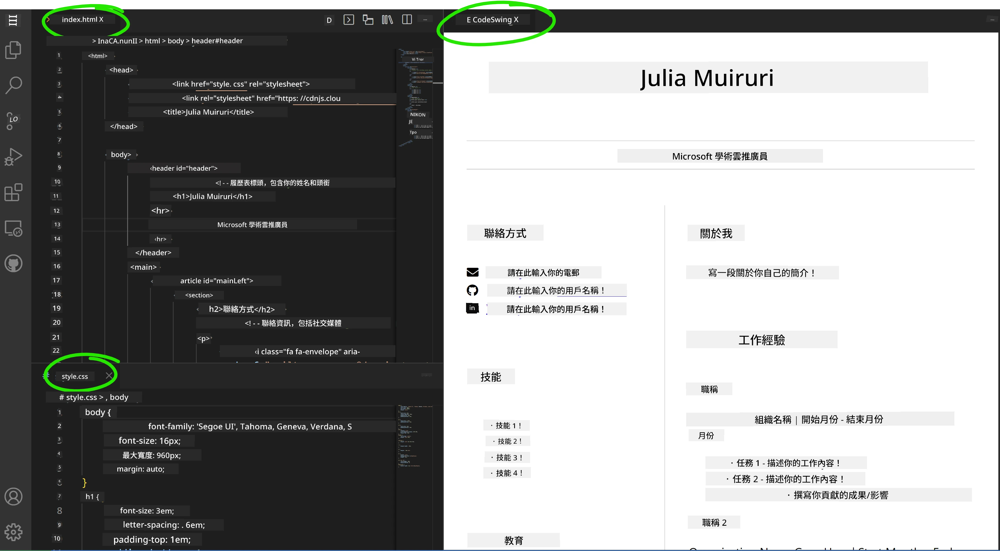

<!--
CO_OP_TRANSLATOR_METADATA:
{
  "original_hash": "effe56ba51c38d7bdfad1ea38288666b",
  "translation_date": "2026-01-06T12:26:51+00:00",
  "source_file": "8-code-editor/1-using-a-code-editor/assignment.md",
  "language_code": "hk"
}
-->
# 使用 VSCode.dev 建立履歷網站

建立一個專業的履歷網站，展示你的技能和經驗，以互動且現代的形式呈現，從而提升你的職業前景。與直接傳送傳統 PDF 不同，想像一下能向招聘者提供一個時尚、響應式的網站，既展示你的資格，也展現你的網頁開發能力。

這個實作作業讓你將所有 VSCode.dev 技能付諸實踐，同時建立對你的職涯真正有用的東西。你將體驗完整的網頁開發工作流程——從建立版本庫到部署——全部在瀏覽器中完成。

完成此專案後，你將擁有一個專業的線上存在，能輕鬆與潛在雇主分享，隨著你的技能成長而更新，並根據個人品牌進行客製化。這正是展現真實世界網頁開發技能的實際專案。

## 學習目標

完成這個作業後，你將能夠：

- **使用 VSCode.dev 建立和管理完整的網頁開發專案**
- **使用語意化 HTML 元素架構專業網站**
- **利用現代 CSS 技術設計響應式版面**
- **使用基本網頁技術實作互動功能**
- **部署可分享 URL 的線上網站**
- **在開發過程中展現版本控制最佳實務**

## 先備條件

開始此作業前請確保你已：

- 擁有 GitHub 帳戶（如尚無，請至 [github.com](https://github.com/) 註冊）
- 完成 VSCode.dev 課程，熟悉介面導覽與基本操作
- 具備基本 HTML 結構與 CSS 樣式概念

## 專案設置與版本庫建立

讓我們從建立專案基礎開始。這個流程模擬真實開發時適當建立版本庫和規劃結構的作法。

### 第 1 步：建立你的 GitHub 版本庫

建立專屬版本庫能確保你的專案從一開始就有良好組織與版本控管。

1. **前往** [GitHub.com](https://github.com) 並登入帳號
2. **點擊** 右上角的綠色「New」按鈕或「+」圖示
3. **命名**你的版本庫為 `my-resume`（或依個人喜好如 `john-smith-resume`）
4. **加入**簡短描述：「專業履歷網站，使用 HTML 和 CSS 建立」
5. **選擇**「Public」使履歷能讓潛在雇主存取
6. **勾選**「Add a README file」以建立初始專案說明
7. **點擊**「Create repository」完成設置

> 💡 **版本庫命名技巧**：使用清楚且專業的名稱來表明專案目的，有助於分享給雇主或作品集展示。

### 第 2 步：初始化專案結構

因 VSCode.dev 需要有至少一個檔案才能打開版本庫，我們先在 GitHub 上直接建立主要 HTML 檔。

1. **點擊**新版本庫中的「creating a new file」連結
2. **輸入**檔案名稱為 `index.html`
3. **加入**以下初始 HTML 結構：

```html
<!DOCTYPE html>
<html lang="en">
<head>
    <meta charset="UTF-8">
    <meta name="viewport" content="width=device-width, initial-scale=1.0">
    <title>Your Name - Professional Resume</title>
</head>
<body>
    <h1>Your Name</h1>
    <p>Professional Resume Website</p>
</body>
</html>
```


4. **輸入**提交訊息：「Add initial HTML structure」
5. **點擊**「Commit new file」儲存變更


**這初始設置達成的效果：**
- **建立**正確的 HTML5 文件結構，使用語意標籤
- **包含**視窗元標籤，以支援響應式設計
- **設定**描述性頁面標題，顯示於瀏覽器分頁
- **打下**專業內容組織的基礎

## 在 VSCode.dev 工作

確立版本庫基礎後，我們轉至 VSCode.dev 進行主要開發。此網頁編輯器具備專業網頁開發所需的各項工具。

### 第 3 步：在 VSCode.dev 開啟專案

1. **於新分頁開啟** [vscode.dev](https://vscode.dev)
2. **點擊**歡迎畫面的「Open Remote Repository」
3. **從 GitHub 複製**你的版本庫 URL 並貼上輸入框

   格式：`https://github.com/your-username/my-resume`
   
   *將 `your-username` 替換成你的 GitHub 使用者名稱*

4. **按下** Enter 載入專案

✅ **成功指標**：你會看到專案檔案呈現在側邊欄中，且能在主要編輯區編輯 `index.html`。


**介面中你將看到：**
- **Explorer 側邊欄**：**顯示**版本庫檔案與資料夾結構
- **編輯區**：**呈現**選取檔案內容供編輯
- **活動列**：**提供**存取原始碼控制、擴充功能等
- **狀態列**：**顯示**連線狀態與當前分支資訊

### 第 4 步：建立你的履歷內容

用完整的履歷結構替換 `index.html` 中的佔位內容。此 HTML 提供專業資格展示的基礎。

<details>
<summary><b>完整 HTML 履歷結構</b></summary>

```html
<!DOCTYPE html>
<html lang="en">
<head>
    <meta charset="UTF-8">
    <meta name="viewport" content="width=device-width, initial-scale=1.0">
    <link href="style.css" rel="stylesheet">
    <link rel="stylesheet" href="https://cdnjs.cloudflare.com/ajax/libs/font-awesome/5.15.4/css/all.min.css">
    <title>Your Name - Professional Resume</title>
</head>
<body>
    <header id="header">
        <h1>Your Full Name</h1>
        <hr>
        <p class="role">Your Professional Title</p>
        <hr>
    </header>
    
    <main>
        <article id="mainLeft">
            <section>
                <h2>CONTACT</h2>
                <p>
                    <i class="fa fa-envelope" aria-hidden="true"></i>
                    <a href="mailto:your.email@domain.com">your.email@domain.com</a>
                </p>
                <p>
                    <i class="fab fa-github" aria-hidden="true"></i>
                    <a href="https://github.com/your-username">github.com/your-username</a>
                </p>
                <p>
                    <i class="fab fa-linkedin" aria-hidden="true"></i>
                    <a href="https://linkedin.com/in/your-profile">linkedin.com/in/your-profile</a>
                </p>
            </section>
            
            <section>
                <h2>SKILLS</h2>
                <ul>
                    <li>HTML5 & CSS3</li>
                    <li>JavaScript (ES6+)</li>
                    <li>Responsive Web Design</li>
                    <li>Version Control (Git)</li>
                    <li>Problem Solving</li>
                </ul>
            </section>
            
            <section>
                <h2>EDUCATION</h2>
                <h3>Your Degree or Certification</h3>
                <p>Institution Name</p>
                <p>Start Date - End Date</p>
            </section>
        </article>
        
        <article id="mainRight">
            <section>
                <h2>ABOUT</h2>
                <p>Write a compelling summary that highlights your passion for web development, key achievements, and career goals. This section should give employers insight into your personality and professional approach.</p>
            </section>
            
            <section>
                <h2>WORK EXPERIENCE</h2>
                <div class="job">
                    <h3>Job Title</h3>
                    <p class="company">Company Name | Start Date – End Date</p>
                    <ul>
                        <li>Describe a key accomplishment or responsibility</li>
                        <li>Highlight specific skills or technologies used</li>
                        <li>Quantify impact where possible (e.g., "Improved efficiency by 25%")</li>
                    </ul>
                </div>
                
                <div class="job">
                    <h3>Previous Job Title</h3>
                    <p class="company">Previous Company | Start Date – End Date</p>
                    <ul>
                        <li>Focus on transferable skills and achievements</li>
                        <li>Demonstrate growth and learning progression</li>
                        <li>Include any leadership or collaboration experiences</li>
                    </ul>
                </div>
            </section>
            
            <section>
                <h2>PROJECTS</h2>
                <div class="project">
                    <h3>Project Name</h3>
                    <p>Brief description of what the project accomplishes and technologies used.</p>
                    <a href="#" target="_blank">View Project</a>
                </div>
            </section>
        </article>
    </main>
</body>
</html>
```
</details>

**客製化指引：**
- **用真實資訊**取代所有佔位文字
- **根據經驗和職涯重點**調整區塊
- **視需要**新增或刪減區段（如證照、志工、語言）
- **加入**連結至你的實際個人資料與專案

### 第 5 步：建立支援檔案

專業網站需有組織的檔案架構。建立 CSS 樣式表與設定檔。

1. **將滑鼠移至** Explorer 側邊欄的專案資料夾名稱
2. **點擊**出現的「新增檔案」圖示（📄+）
3. **依序建立**下列檔案：
   - `style.css`（樣式與版面）
   - `codeswing.json`（預覽擴充功能設定）

**建立 CSS 檔案 (`style.css`):**

<details>
<summary><b>專業 CSS 樣式</b></summary>

```css
/* Modern Resume Styling */
body {
    font-family: 'Segoe UI', Tahoma, Geneva, Verdana, sans-serif;
    font-size: 16px;
    line-height: 1.6;
    max-width: 960px;
    margin: 0 auto;
    padding: 20px;
    color: #333;
    background-color: #f9f9f9;
}

/* Header Styling */
header {
    text-align: center;
    margin-bottom: 3em;
    padding: 2em;
    background: linear-gradient(135deg, #667eea 0%, #764ba2 100%);
    color: white;
    border-radius: 10px;
    box-shadow: 0 4px 6px rgba(0, 0, 0, 0.1);
}

h1 {
    font-size: 3em;
    letter-spacing: 0.1em;
    margin-bottom: 0.2em;
    font-weight: 300;
}

.role {
    font-size: 1.3em;
    font-weight: 300;
    margin: 1em 0;
}

/* Main Content Layout */
main {
    display: grid;
    grid-template-columns: 35% 65%;
    gap: 3em;
    margin-top: 3em;
    background: white;
    padding: 2em;
    border-radius: 10px;
    box-shadow: 0 2px 10px rgba(0, 0, 0, 0.1);
}

/* Typography */
h2 {
    font-size: 1.4em;
    font-weight: 600;
    margin-bottom: 1em;
    color: #667eea;
    border-bottom: 2px solid #667eea;
    padding-bottom: 0.3em;
}

h3 {
    font-size: 1.1em;
    font-weight: 600;
    margin-bottom: 0.5em;
    color: #444;
}

/* Section Styling */
section {
    margin-bottom: 2.5em;
}

#mainLeft {
    border-right: 1px solid #e0e0e0;
    padding-right: 2em;
}

/* Contact Links */
section a {
    color: #667eea;
    text-decoration: none;
    transition: color 0.3s ease;
}

section a:hover {
    color: #764ba2;
    text-decoration: underline;
}

/* Icons */
i {
    margin-right: 0.8em;
    width: 20px;
    text-align: center;
    color: #667eea;
}

/* Lists */
ul {
    list-style: none;
    padding-left: 0;
}

li {
    margin: 0.5em 0;
    padding: 0.3em 0;
    position: relative;
}

li:before {
    content: "▸";
    color: #667eea;
    margin-right: 0.5em;
}

/* Work Experience */
.job, .project {
    margin-bottom: 2em;
    padding-bottom: 1.5em;
    border-bottom: 1px solid #f0f0f0;
}

.company {
    font-style: italic;
    color: #666;
    margin-bottom: 0.5em;
}

/* Responsive Design */
@media (max-width: 768px) {
    main {
        grid-template-columns: 1fr;
        gap: 2em;
    }
    
    #mainLeft {
        border-right: none;
        border-bottom: 1px solid #e0e0e0;
        padding-right: 0;
        padding-bottom: 2em;
    }
    
    h1 {
        font-size: 2.2em;
    }
    
    body {
        padding: 10px;
    }
}

/* Print Styles */
@media print {
    body {
        background: white;
        color: black;
        font-size: 12pt;
    }
    
    header {
        background: none;
        color: black;
        box-shadow: none;
    }
    
    main {
        box-shadow: none;
    }
}
```
</details>

**建立設定檔 (`codeswing.json`):**

```json
{
    "scripts": [],
    "styles": []
}
```


**CSS 功能說明：**
- **使用** CSS Grid 實現專業響應式版面
- **採用**現代漸層色彩設計頁首
- **包含**滑鼠懸停效果與平滑過渡
- **支援**所有裝置大小的響應設計
- **加入**列印友善樣式以利匯出 PDF

### 第 6 步：安裝與設定擴充功能

擴充功能提升開發體驗，提供即時預覽與工作流程工具。CodeSwing 擴充對網頁專案特別有用。

**安裝 CodeSwing 擴充：**

1. **點擊**活動列的擴充功能圖示（🧩）
2. **在搜尋框**輸入「CodeSwing」
3. **從結果中**選擇 CodeSwing 擴充
4. **點擊**藍色「Install」安裝


**CodeSwing 功能：**
- **啟用**編輯時即時預覽網站
- **即時顯示**變更，無需手動重新整理
- **支援**多種檔案類型（HTML、CSS、JavaScript）
- **提供**整合式開發環境體驗

**安裝後的即時效果：**
安裝完成後，你會在編輯器看到履歷網站的即時預覽，方便你隨時檢視網站外觀。



**強化介面說明：**
- **分割檢視**：一側顯示程式碼，一側顯示即時預覽
- **即時更新**：輸入時立即反映變更
- **互動預覽**：可測試連結及互動元素
- **手機模擬**：方便測試響應式設計

### 第 7 步：版本控制與發布

履歷網站完成後，使用 Git 儲存工作並上線。

**提交變更：**

1. **點擊**活動列的原始碼控制圖示（🌿）
2. **檢視**「變更」區段的所有新增和修改檔案
3. **點擊**每個檔案旁的「+」圖標暫存變更
4. **輸入**描述性提交訊息，例如：
   - 「Add complete resume website with responsive design」
   - 「Implement professional styling and content structure」
5. **點擊**勾選（✓）提交並推送修改

**有效提交訊息範例：**
- 「新增專業履歷內容與樣式」
- 「實作行動裝置相容之響應式設計」
- 「更新聯絡資訊與專案連結」

> 💡 **專業技巧**：好的提交訊息有助於追蹤專案演進，也展現細心，這是雇主看重的特質。

**存取已發布網站：**
提交完畢後，透過左上選單（☰）回到 GitHub 版本庫。你的履歷網站已受版本控管，準備好部署分享。

## 結果與後續

**恭喜！🎉** 你已成功利用 VSCode.dev 建立專業履歷網站。你的專案展示了：

**展示的技術能力：**
- **版本庫管理**：建立並組織完整專案架構
- **網頁開發**：運用現代 HTML5 與 CSS3 建置響應式網站
- **版本控制**：實施有效 Git 工作流程與有意義的提交
- **工具熟練度**：有效利用 VSCode.dev 介面與擴充功能系統

**達成的專業成果：**
- **線上存在感**：可共享的 URL 展現資格
- **現代格式**：互動式替代傳統 PDF 履歷
- **技術證明**：具體展示你的網頁開發能力
- **易於更新**：可持續改進及客製化的基礎

### 部署選擇

為讓雇主存取你的履歷，可考慮下列主機方案：

**GitHub Pages（推薦）：**
1. 前往 GitHub 版本庫設定
2. 捲動至「Pages」區段
3. 選擇「Deploy from a branch」，指定「main」分支
4. 即可透過 `https://your-username.github.io/my-resume` 存取網站

**其他平台選項：**
- **Netlify**：自動部署，支援自訂域名
- **Vercel**：快速部署，具現代化主機功能
- **GitHub Codespaces**：內建預覽的開發環境

### 功能增強建議

持續提升技能，加入以下功能：

**技術提升：**
- **JavaScript 互動性**：新增平滑捲動或互動元件
- **暗/亮主題切換**：實現主題切換及平滑過渡
- **聯絡表單**：啟用潛在雇主直接聯繫
- **SEO 優化**：加入 meta 標籤與結構化資料，提升搜尋能見度

**內容增潤：**
- **專案作品集**：連結 GitHub 倉庫與現場示範
- **技能視覺化**：建立進度條或技能評分系統
- **推薦語區**：新增同事或導師推薦
- **部落格整合**：加入部落格，展現學習歷程

## GitHub Copilot Agent 挑戰 🚀

使用代理模式完成以下挑戰：

**說明：** 強化你的履歷網站，加入展現專業網頁開發能力與現代設計原則的進階功能。

**提示：** 在既有履歷網站基礎上，實作這些進階功能：
1. 新增暗/亮主題切換並具平滑過渡效果
2. 建立帶動畫進度條的互動技能區
3. 實作具表單驗證的聯絡表單
4. 加入帶懸停效果與模態視窗的專案作品集區
5. 含有至少 3 篇學習歷程樣本文章的部落格區
6. 使用適當 meta 標籤、結構化資料和效能優化提升 SEO
7. 使用 GitHub Pages 或 Netlify 發布強化後網站
8. 在 README.md 中記錄全部新功能與截圖

你的強化網站應展現現代網頁開發的精通，包括響應式設計、JavaScript 互動性以及專業部署流程。

## 挑戰延伸

想進一步挑戰嗎？試試這些進階挑戰：

**📱 手機優先重新設計：** 使用 CSS Grid 和 Flexbox 完全重建網站，符合手機優先設計原則

**🔍 SEO 優化：** 實現全方位 SEO 改善，包括 meta 標籤、結構化資料與效能優化

**🌐 多語系支援：** 新增國際化功能，支持多種語言

**📊 分析整合：** 加入 Google Analytics，追蹤訪客互動並優化內容

**🚀 效能優化：** 在所有分類取得完美 Lighthouse 分數

## 複習與自我學習

利用這些資源擴展知識：

**VSCode.dev 進階功能：**
- [VSCode.dev 文件](https://code.visualstudio.com/docs/editor/vscode-web?WT.mc_id=academic-0000-alfredodeza) - 網頁編輯完整指南
- [GitHub Codespaces](https://docs.github.com/en/codespaces) - 雲端開發環境

**網頁開發最佳實踐：**
- **響應式設計**：研習 CSS Grid 與 Flexbox 實現現代版面布局
- **無障礙設計**：學習 WCAG 指南以實現包容性網頁設計
- **效能**：使用 Lighthouse 等工具進行優化
- **SEO**：了解搜尋引擎優化的基本原理

**專業發展：**
- **作品集建立**：創建更多項目以展示多樣化技能
- **開源貢獻**：參與現有項目以獲得協作經驗
- **社交網絡**：在開發者社群分享你的履歷網站以獲取反饋
- **持續學習**：保持對網頁開發趨勢和技術的更新

---

**你的下一步驟：** 與朋友、家人或導師分享你的履歷網站，聽取他們的反饋。利用他們的建議反覆修改和完善你的設計。記住，這個項目不只是履歷，而是展示你作為網頁開發者成長的證明！

---

<!-- CO-OP TRANSLATOR DISCLAIMER START -->
**免責聲明**：  
本文件由AI翻譯服務 [Co-op Translator](https://github.com/Azure/co-op-translator) 進行翻譯。儘管我們致力於確保翻譯的準確性，但請注意自動翻譯可能包含錯誤或不準確之處。原始文件的母語版本應被視為權威來源。對於關鍵資訊，建議尋求專業人工翻譯。我們不對因使用本翻譯而產生的任何誤解或誤譯承擔責任。
<!-- CO-OP TRANSLATOR DISCLAIMER END -->