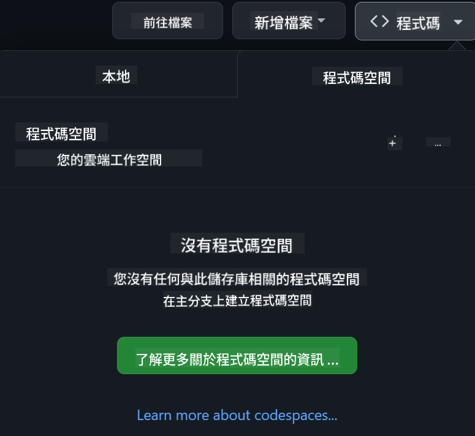

<!--
CO_OP_TRANSLATOR_METADATA:
{
  "original_hash": "caf2ca695e9d259153d24a5cf3e07ef5",
  "translation_date": "2025-10-11T10:51:41+00:00",
  "source_file": "README.md",
  "language_code": "hk"
}
-->
[](https://github.com/microsoft/Web-Dev-For-Beginners/blob/master/LICENSE)  
[](https://GitHub.com/microsoft/Web-Dev-For-Beginners/graphs/contributors/)  
[](https://GitHub.com/microsoft/Web-Dev-For-Beginners/issues/)  
[](https://GitHub.com/microsoft/Web-Dev-For-Beginners/pulls/)  
[](http://makeapullrequest.com)  

[](https://GitHub.com/microsoft/Web-Dev-For-Beginners/watchers/)  
[](https://GitHub.com/microsoft/Web-Dev-For-Beginners/network/)  
[](https://GitHub.com/microsoft/Web-Dev-For-Beginners/stargazers/)  

[](https://discord.gg/zxKYvhSnVp?WT.mc_id=academic-000002-leestott)  

# 初學者網頁開發課程 - 一個完整的課程

透過 Microsoft Cloud Advocates 提供的 12 週完整課程，學習網頁開發的基礎知識。24 節課程涵蓋 JavaScript、CSS 和 HTML，並通過實際項目如生態瓶、瀏覽器擴展和太空遊戲進行學習。參與測驗、討論和實踐作業，提升技能並優化知識吸收。立即開始你的編程之旅吧！

加入 Azure AI Foundry Discord 社群  

[](https://discord.com/invite/ByRwuEEgH4)  

按照以下步驟開始使用這些資源：  
1. **Fork 此儲存庫**：點擊 [](https://GitHub.com/microsoft/Web-Dev-For-Beginners/fork)  
2. **Clone 此儲存庫**：`git clone https://github.com/microsoft/Web-Dev-For-Beginners.git`  
3. [**加入 Azure AI Foundry Discord，與專家和其他開發者交流**](https://discord.com/invite/ByRwuEEgH4)  

### 🌐 多語言支援

#### 通過 GitHub Action 支援（自動化且始終保持最新）

<!-- CO-OP TRANSLATOR LANGUAGES TABLE START -->
[阿拉伯語](../ar/README.md) | [孟加拉語](../bn/README.md) | [保加利亞語](../bg/README.md) | [緬甸語](../my/README.md) | [中文（簡體）](../zh/README.md) | [中文（繁體，香港）](./README.md) | [中文（繁體，澳門）](../mo/README.md) | [中文（繁體，台灣）](../tw/README.md) | [克羅地亞語](../hr/README.md) | [捷克語](../cs/README.md) | [丹麥語](../da/README.md) | [荷蘭語](../nl/README.md) | [愛沙尼亞語](../et/README.md) | [芬蘭語](../fi/README.md) | [法語](../fr/README.md) | [德語](../de/README.md) | [希臘語](../el/README.md) | [希伯來語](../he/README.md) | [印地語](../hi/README.md) | [匈牙利語](../hu/README.md) | [印尼語](../id/README.md) | [意大利語](../it/README.md) | [日語](../ja/README.md) | [韓語](../ko/README.md) | [立陶宛語](../lt/README.md) | [馬來語](../ms/README.md) | [馬拉地語](../mr/README.md) | [尼泊爾語](../ne/README.md) | [挪威語](../no/README.md) | [波斯語](../fa/README.md) | [波蘭語](../pl/README.md) | [葡萄牙語（巴西）](../br/README.md) | [葡萄牙語（葡萄牙）](../pt/README.md) | [旁遮普語（古魯穆奇文）](../pa/README.md) | [羅馬尼亞語](../ro/README.md) | [俄語](../ru/README.md) | [塞爾維亞語（西里爾文）](../sr/README.md) | [斯洛伐克語](../sk/README.md) | [斯洛文尼亞語](../sl/README.md) | [西班牙語](../es/README.md) | [斯瓦希里語](../sw/README.md) | [瑞典語](../sv/README.md) | [他加祿語（菲律賓語）](../tl/README.md) | [泰米爾語](../ta/README.md) | [泰語](../th/README.md) | [土耳其語](../tr/README.md) | [烏克蘭語](../uk/README.md) | [烏爾都語](../ur/README.md) | [越南語](../vi/README.md)  
<!-- CO-OP TRANSLATOR LANGUAGES TABLE END -->

**如果你希望支援其他語言，請參考 [這裡](https://github.com/Azure/co-op-translator/blob/main/getting_started/supported-languages.md)**  

[](https://open.vscode.dev/microsoft/Web-Dev-For-Beginners)  

#### 🧑‍🎓 _你是學生嗎？_

訪問 [**學生中心頁面**](https://docs.microsoft.com/learn/student-hub/?WT.mc_id=academic-77807-sagibbon)，你可以找到初學者資源、學生包，甚至獲得免費證書的機會。這是你應該收藏並定期查看的頁面，因為我們每月都會更新內容。

### 📣 公告 - _使用生成式 AI 構建的新項目_

新增了全新的 AI 助手項目，快來看看 [項目](./09-chat-project/README.md)  

### 📣 公告 - _新的生成式 AI 課程_ 已經發布

不要錯過我們全新的生成式 AI 課程！  

訪問 [https://aka.ms/genai-js-course](https://aka.ms/genai-js-course) 開始學習！  

  

- 課程涵蓋從基礎到 RAG 的所有內容。  
- 使用 GenAI 和我們的配套應用程式與歷史人物互動。  
- 有趣且引人入勝的故事情節，帶你穿越時空！  

  

每節課都包括一個作業、一個知識檢查和一個挑戰，幫助你學習以下主題：  
- 提示和提示工程  
- 文本和圖像應用程式生成  
- 搜索應用程式  

訪問 [https://aka.ms/genai-js-course](https://aka.ms/genai-js-course) 開始學習！  

## 🌱 開始學習

> **教師們**，我們已經[提供了一些建議](for-teachers.md)關於如何使用這個課程。我們非常期待你在[討論論壇](https://github.com/microsoft/Web-Dev-For-Beginners/discussions/categories/teacher-corner)中的反饋！  

**[學習者](https://aka.ms/student-page/?WT.mc_id=academic-77807-sagibbon)**，每節課開始前，先完成課前測驗，然後閱讀課程材料，完成各種活動，並通過課後測驗檢查你的理解。  

為了提升學習體驗，與同學一起合作完成項目吧！我們鼓勵在[討論論壇](https://github.com/microsoft/Web-Dev-For-Beginners/discussions)中進行討論，我們的版主團隊將隨時為你解答問題。  

為了進一步提升你的教育水平，我們強烈建議探索 [Microsoft Learn](https://learn.microsoft.com/users/wirelesslife/collections/p1ddcy5jwy0jkm?WT.mc_id=academic-77807-sagibbon) 獲取更多學習材料。  

### 📋 設置你的學習環境

這個課程已經準備好開發環境！開始學習時，你可以選擇在 [Codespace](https://github.com/features/codespaces/)（_基於瀏覽器，無需安裝的環境_）中運行課程，或者在你的電腦上使用文本編輯器如 [Visual Studio Code](https://code.visualstudio.com/?WT.mc_id=academic-77807-sagibbon) 本地運行。  

#### 創建你的儲存庫
為了方便保存你的學習進度，建議你創建一個此儲存庫的副本。你可以點擊頁面頂部的 **Use this template** 按鈕，這將在你的 GitHub 帳戶中創建一個包含課程副本的新儲存庫。  

按照以下步驟：  
1. **Fork 此儲存庫**：點擊頁面右上角的 "Fork" 按鈕。  
2. **Clone 此儲存庫**：`git clone https://github.com/microsoft/Web-Dev-For-Beginners.git`  

#### 在 Codespace 中運行課程

在你創建的這個儲存庫副本中，點擊 **Code** 按鈕並選擇 **Open with Codespaces**。這將為你創建一個新的 Codespace 以供學習使用。  

  

#### 在本地電腦上運行課程

要在本地電腦上運行此課程，你需要一個文本編輯器、一個瀏覽器和一個命令行工具。我們的第一節課 [編程語言和工具介紹](../../1-getting-started-lessons/1-intro-to-programming-languages) 將指導你選擇最適合你的工具。  

我們建議使用 [Visual Studio Code](https://code.visualstudio.com/?WT.mc_id=academic-77807-sagibbon) 作為你的編輯器，它還內置了一個 [終端](https://code.visualstudio.com/docs/terminal/basics/?WT.mc_id=academic-77807-sagibbon)。你可以在[這裡](https://code.visualstudio.com/?WT.mc_id=academic-77807-sagibbon)下載 Visual Studio Code。  

1. 將你的儲存庫克隆到你的電腦。你可以通過點擊 **Code** 按鈕並複製 URL 來完成此操作：  

    [CodeSpace](./images/createcodespace.png)  

    然後，在 [Visual Studio Code](https://code.visualstudio.com/?WT.mc_id=academic-77807-sagibbon) 的 [終端](https://code.visualstudio.com/docs/terminal/basics/?WT.mc_id=academic-77807-sagibbon) 中運行以下命令，將 `<your-repository-url>` 替換為你剛剛複製的 URL：  

    ```bash 
    git clone <your-repository-url>
    ```
  
2. 在 Visual Studio Code 中打開文件夾。你可以通過點擊 **File** > **Open Folder** 並選擇你剛剛克隆的文件夾來完成此操作。  

> 推薦的 Visual Studio Code 擴展：  
>
> * [Live Server](https://marketplace.visualstudio.com/items?itemName=ritwickdey.LiveServer&WT.mc_id=academic-77807-sagibbon) - 在 Visual Studio Code 中預覽 HTML 頁面  
> * [Copilot](https://marketplace.visualstudio.com/items?itemName=GitHub.copilot&WT.mc_id=academic-77807-sagibbon) - 幫助你更快地編寫代碼  

## 📂 每節課包括：

- 可選的手繪筆記  
- 可選的補充視頻  
- 課前熱身測驗  
- 書面課程
- 專案式課程，逐步指導如何建立專案
- 知識檢測
- 挑戰
- 補充閱讀
- 作業
- [課後測驗](https://ff-quizzes.netlify.app/web/)

> **關於測驗的注意事項**：所有測驗都包含在 Quiz-app 資料夾中，共有 48 個測驗，每個測驗包含三個問題。它們可以在[這裡](https://ff-quizzes.netlify.app/web/)找到，測驗應用程式可以在本地運行或部署到 Azure；請按照 `quiz-app` 資料夾中的指示操作。

## 🗃️ 課程

|     |                       專案名稱                       |                            教授概念                             | 學習目標                                                                                                                 |                                                         相關課程                                                          |         作者          |
| :-: | :--------------------------------------------------: | :------------------------------------------------------------: | ----------------------------------------------------------------------------------------------------------------------- | :-----------------------------------------------------------------------------------------------------------------------: | :-------------------: |
| 01  |                     入門篇                      |           程式設計入門及開發工具           | 學習大多數程式語言的基本原理以及幫助專業開發者完成工作的軟件 | [程式語言入門及開發工具](./1-getting-started-lessons/1-intro-to-programming-languages/README.md) |         Jasmine         |
| 02  |                     入門篇                      |             GitHub 基礎，包含團隊合作             | 學習如何在專案中使用 GitHub，如何與他人協作程式碼庫                                                    |                            [GitHub 基礎入門](./1-getting-started-lessons/2-github-basics/README.md)                             |          Floor          |
| 03  |                     入門篇                      |                             無障礙設計                              | 學習網頁無障礙設計的基礎                                                                                               |                       [無障礙設計基礎](./1-getting-started-lessons/3-accessibility/README.md)                       |       Christopher       |
| 04  |                        JS 基礎                         |                         JavaScript 資料型別                          | JavaScript 資料型別的基礎                                                                                                 |                                       [資料型別](./2-js-basics/1-data-types/README.md)                                        |         Jasmine         |
| 05  |                        JS 基礎                         |                         函數與方法                          | 學習如何使用函數與方法來管理應用程式的邏輯流程                                                             |                              [函數與方法](./2-js-basics/2-functions-methods/README.md)                               | Jasmine 和 Christopher |
| 06  |                        JS 基礎                         |                        使用 JS 做出決策                        | 學習如何使用決策方法在程式碼中創建條件                                                           |                                 [做出決策](./2-js-basics/3-making-decisions/README.md)                                  |         Jasmine         |
| 07  |                        JS 基礎                         |                            陣列與迴圈                            | 使用 JavaScript 中的陣列與迴圈處理資料                                                                                 |                                   [陣列與迴圈](./2-js-basics/4-arrays-loops/README.md)                                    |         Jasmine         |
| 08  |       [Terrarium](./3-terrarium/solution/README.md)       |                            HTML 實踐                            | 建立 HTML 來創建線上生態瓶，專注於建立佈局                                                         |                                 [HTML 入門](./3-terrarium/1-intro-to-html/README.md)                                 |           Jen           |
| 09  |       [Terrarium](./3-terrarium/solution/README.md)       |                            CSS 實踐                             | 建立 CSS 來設計線上生態瓶，專注於 CSS 的基礎，包括使頁面響應式                     |                                  [CSS 入門](./3-terrarium/2-intro-to-css/README.md)                                  |           Jen           |
| 10  |            [Terrarium](./3-terrarium/solution/README.md)            |                 JavaScript 閉包與 DOM 操作                  | 建立 JavaScript 使生態瓶具備拖放介面功能，專注於閉包與 DOM 操作             |                  [JavaScript 閉包與 DOM 操作](./3-terrarium/3-intro-to-DOM-and-closures/README.md)                   |           Jen           |
| 11  |          [打字遊戲](./4-typing-game/solution/README.md)          |                          建立打字遊戲                           | 學習如何使用鍵盤事件來驅動 JavaScript 應用程式的邏輯                                                          |                                [事件驅動程式設計](./4-typing-game/typing-game/README.md)                                |       Christopher       |
| 12  | [綠色瀏覽器擴展](./5-browser-extension/solution/README.md) |                         瀏覽器操作                          | 學習瀏覽器的工作原理、歷史，以及如何搭建瀏覽器擴展的第一個元素                               |                               [關於瀏覽器](./5-browser-extension/1-about-browsers/README.md)                                |           Jen           |
| 13  | [綠色瀏覽器擴展](./5-browser-extension/solution/README.md) | 建立表單、呼叫 API 並將變數存儲於本地存儲 | 建立瀏覽器擴展的 JavaScript 元素，使用存儲於本地存儲的變數呼叫 API                      |                [API、表單與本地存儲](./5-browser-extension/2-forms-browsers-local-storage/README.md)                 |           Jen           |
| 14  | [綠色瀏覽器擴展](./5-browser-extension/solution/README.md) |          瀏覽器背景處理與網頁效能          | 使用瀏覽器的背景處理來管理擴展的圖示；學習網頁效能及一些優化方法   |             [背景任務與效能](./5-browser-extension/3-background-tasks-and-performance/README.md)              |           Jen           |
| 15  |           [太空遊戲](./6-space-game/solution/README.md)           |             更高階的 JavaScript 遊戲開發             | 學習使用類別與組合進行繼承以及 Pub/Sub 模式，為建立遊戲做準備              |                      [高階遊戲開發入門](./6-space-game/1-introduction/README.md)                       |          Chris          |
| 16  |           [太空遊戲](./6-space-game/solution/README.md)           |                           繪製到畫布                            | 學習 Canvas API，用於將元素繪製到螢幕                                                                       |                                [繪製到畫布](./6-space-game/2-drawing-to-canvas/README.md)                                |          Chris          |
| 17  |           [太空遊戲](./6-space-game/solution/README.md)           |                   在螢幕上移動元素                    | 探索如何使用笛卡爾座標與 Canvas API 使元素獲得運動                                            |                           [移動元素](./6-space-game/3-moving-elements-around/README.md)                           |          Chris          |
| 18  |           [太空遊戲](./6-space-game/solution/README.md)           |                          碰撞檢測                           | 使元素碰撞並相互反應，使用按鍵提供冷卻功能以確保遊戲效能    |                              [碰撞檢測](./6-space-game/4-collision-detection/README.md)                              |          Chris          |
| 19  |           [太空遊戲](./6-space-game/solution/README.md)           |                             計分                              | 根據遊戲的狀態與效能進行數學計算                                                                |                                    [計分](./6-space-game/5-keeping-score/README.md)                                    |          Chris          |
| 20  |           [太空遊戲](./6-space-game/solution/README.md)           |                     結束與重新開始遊戲                     | 學習如何結束與重新開始遊戲，包括清理資源與重置變數值                              |                                [結束條件](./6-space-game/6-end-condition/README.md)                                 |          Chris          |
| 21  |         [銀行應用程式](./7-bank-project/solution/README.md)          |                 HTML 模板與網頁應用程式路由                 | 學習如何使用路由與 HTML 模板建立多頁網站的架構                             |                            [HTML 模板與路由](./7-bank-project/1-template-route/README.md)                             |          Yohan          |
| 22  |         [銀行應用程式](./7-bank-project/solution/README.md)          |                  建立登入與註冊表單                   | 學習如何建立表單並處理驗證例程                                                                          |                                           [表單](./7-bank-project/2-forms/README.md)                                           |          Yohan          |
| 23  |         [銀行應用程式](./7-bank-project/solution/README.md)          |                   資料的獲取與使用方法                   | 資料如何在應用程式中流動，如何獲取、存儲與處理                                                 |                                            [資料](./7-bank-project/3-data/README.md)                                            |          Yohan          |
| 24  |         [銀行應用程式](./7-bank-project/solution/README.md)          |                      狀態管理概念                      | 學習應用程式如何保留狀態以及如何以程式方式管理它                                                              |                                [狀態管理](./7-bank-project/4-state-management/README.md)                                |          Yohan          |
| 25 | [瀏覽器/VScode 編輯器](../../8-code-editor) | 使用 VScode | 學習如何使用程式碼編輯器| [使用 VScode 編輯器](./8-code-editor/1-using-a-code-editor/README.md) | Chris |
| 26 | [AI 助理](./9-chat-project/README.md) | 使用 AI | 學習如何建立自己的 AI 助理 | [AI 助理專案](./9-chat-project/README.md) | Chris |

## 🏫 教學法

我們的課程設計基於兩個主要教學原則：
* 專案式學習
* 頻繁測驗

本課程教授 JavaScript、HTML 和 CSS 的基礎知識，以及當今網頁開發者使用的最新工具與技術。學生將有機會通過建立打字遊戲、虛擬生態瓶、環保瀏覽器擴展、類似太空侵略者的遊戲以及商業銀行應用程式來獲得實際操作經驗。完成課程後，學生將對網頁開發有扎實的理解。

> 🎓 您可以在 Microsoft Learn 上以[學習路徑](https://docs.microsoft.com/learn/paths/web-development-101/?WT.mc_id=academic-77807-sagibbon)的形式學習本課程的前幾節！

通過確保內容與專案相符，學習過程對學生來說更具吸引力，並能增強概念的記憶。我們還撰寫了幾個 JavaScript 基礎入門課程來介紹概念，並搭配 "[JavaScript 初學者系列](https://channel9.msdn.com/Series/Beginners-Series-to-JavaScript/?WT.mc_id=academic-77807-sagibbon)" 視頻教程，其中一些作者也參與了本課程的編寫。

此外，課前的低壓測驗可以幫助學生集中注意力於學習主題，而課後的第二次測驗則能進一步加強記憶。本課程設計靈活有趣，可以完整學習或選擇部分內容。專案從簡單開始，並在 12 週的課程結束時逐漸變得更為複雜。

雖然我們有意避免介紹 JavaScript 框架，以便專注於作為網頁開發者在採用框架之前所需的基本技能，但完成本課程後的下一步可以通過另一系列視頻學習 Node.js："[Node.js 初學者系列](https://channel9.msdn.com/Series/Beginners-Series-to-Nodejs/?WT.mc_id=academic-77807-sagibbon)"。

> 請參閱我們的 [行為準則](CODE_OF_CONDUCT.md) 和 [貢獻指南](CONTRIBUTING.md)。我們歡迎您的建設性反饋！

## 🧭 離線存取

您可以使用 [Docsify](https://docsify.js.org/#/) 離線運行此文件。Fork 此 repo，[安裝 Docsify](https://docsify.js.org/#/quickstart) 到您的本地機器，然後在此 repo 的根目錄中輸入 `docsify serve`。網站將在本地端的 3000 端口上運行：`localhost:3000`。

## 📘 PDF

所有課程的 PDF 可在[這裡](https://microsoft.github.io/Web-Dev-For-Beginners/pdf/readme.pdf)找到。

## 🎒 其他課程

我們的團隊還製作了其他課程！請查看：

- [MCP 初學者課程](https://aka.ms/mcp-for-beginners)
- [Edge AI 初學者課程](https://aka.ms/edgeai-for-beginners)
- [AI Agents 初學者課程](https://aka.ms/ai-agents-beginners)
- [生成式 AI 初學者課程 .NET](https://github.com/microsoft/Generative-AI-for-beginners-dotnet)
- [使用 JavaScript 的生成式 AI](https://github.com/microsoft/generative-ai-with-javascript)
- [使用 Java 的生成式 AI](https://github.com/microsoft/Generative-AI-for-beginners-java)
- [AI 初學者課程](https://aka.ms/ai-beginners)
- [資料科學初學者課程](https://aka.ms/datascience-beginners)
- [機器學習初學者課程](https://aka.ms/ml-beginners)
- [網絡安全初學者課程](https://github.com/microsoft/Security-101)
- [網頁開發初學者課程](https://aka.ms/webdev-beginners)
- [物聯網初學者課程](https://aka.ms/iot-beginners)
- [XR 開發入門](https://github.com/microsoft/xr-development-for-beginners)  
- [GitHub Copilot 高手指南：智能應用](https://github.com/microsoft/Mastering-GitHub-Copilot-for-Paired-Programming)  
- [GitHub Copilot 高手指南：C#/.NET 開發者](https://github.com/microsoft/mastering-github-copilot-for-dotnet-csharp-developers)  
- [選擇你的 Copilot 冒險](https://github.com/microsoft/CopilotAdventures)  

## 尋求幫助

如果你遇到困難或對建立 AI 應用有任何疑問，請加入：  

[](https://aka.ms/foundry/discord)  

如果你有產品反饋或在開發過程中遇到錯誤，請訪問：  

[](https://aka.ms/foundry/forum)  

## 授權

此存儲庫採用 MIT 授權。詳情請參閱 [LICENSE](../../LICENSE) 文件。  

---

**免責聲明**：  
本文件已使用人工智能翻譯服務 [Co-op Translator](https://github.com/Azure/co-op-translator) 進行翻譯。雖然我們致力於提供準確的翻譯，但請注意，自動翻譯可能包含錯誤或不準確之處。原始文件的母語版本應被視為權威來源。對於關鍵資訊，建議使用專業人工翻譯。我們對因使用此翻譯而引起的任何誤解或錯誤解釋概不負責。