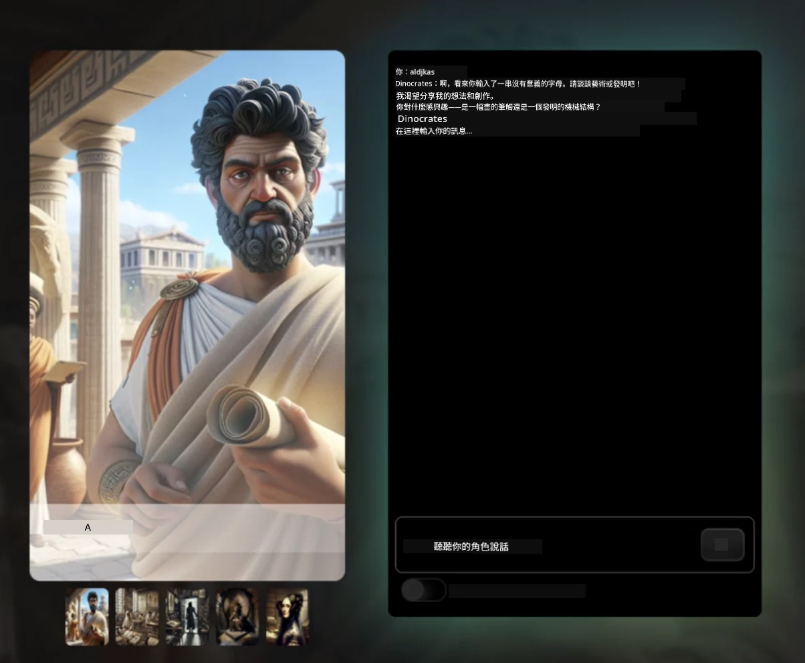
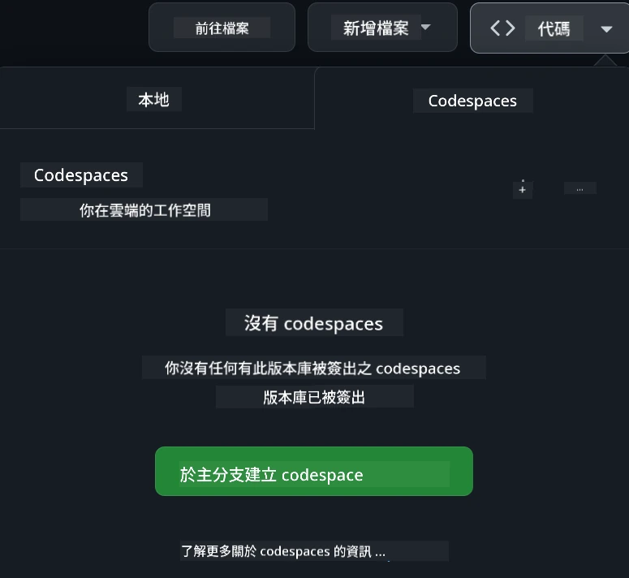

<!--
CO_OP_TRANSLATOR_METADATA:
{
  "original_hash": "fea3a0fceb8ad86fd640c09cf63a2aac",
  "translation_date": "2026-01-06T12:05:13+00:00",
  "source_file": "README.md",
  "language_code": "hk"
}
-->
# Web 開發初學者課程

透過微軟雲端推廣大使設計的 12 週完整課程，學習網頁開發的基本知識。24 堂課程深入探討 JavaScript、CSS 及 HTML，並透過製作玻璃容器生態缸、瀏覽器擴充功能及太空遊戲等實作專案進行學習。參與小測驗、討論和實際作業。以專案為本的教學方法，幫助你提升技能並優化知識吸收。立即開始你的程式設計旅程！

加入 Azure AI Foundry Discord 社群

跟隨以下步驟開始使用這些資源：  
1. **派生倉庫**：點擊 [](https://GitHub.com/microsoft/Web-Dev-For-Beginners/fork)  
2. **複製倉庫**：`git clone https://github.com/microsoft/Web-Dev-For-Beginners.git`  
3. [**加入 Azure AI Foundry Discord，與專家及開發者交流**](https://discord.com/invite/ByRwuEEgH4)

### 🌐 多語言支援

#### 透過 GitHub Action 支援（自動且持續更新）

<!-- CO-OP TRANSLATOR LANGUAGES TABLE START -->
[阿拉伯語](../ar/README.md) | [孟加拉語](../bn/README.md) | [保加利亞語](../bg/README.md) | [緬甸語](../my/README.md) | [中文（簡體）](../zh/README.md) | [中文（繁體，香港）](./README.md) | [中文（繁體，澳門）](../mo/README.md) | [中文（繁體，臺灣）](../tw/README.md) | [克羅埃西亞語](../hr/README.md) | [捷克語](../cs/README.md) | [丹麥語](../da/README.md) | [荷蘭語](../nl/README.md) | [愛沙尼亞語](../et/README.md) | [芬蘭語](../fi/README.md) | [法語](../fr/README.md) | [德語](../de/README.md) | [希臘語](../el/README.md) | [希伯來語](../he/README.md) | [印地語](../hi/README.md) | [匈牙利語](../hu/README.md) | [印度尼西亞語](../id/README.md) | [義大利語](../it/README.md) | [日語](../ja/README.md) | [坎納達語](../kn/README.md) | [韓語](../ko/README.md) | [立陶宛語](../lt/README.md) | [馬來語](../ms/README.md) | [馬拉雅拉姆語](../ml/README.md) | [馬拉地語](../mr/README.md) | [尼泊爾語](../ne/README.md) | [奈及利亞皮欽語](../pcm/README.md) | [挪威語](../no/README.md) | [波斯語（法爾西語）](../fa/README.md) | [波蘭語](../pl/README.md) | [葡萄牙語（巴西）](../br/README.md) | [葡萄牙語（葡萄牙）](../pt/README.md) | [旁遮普語（古魯穆奇文）](../pa/README.md) | [羅馬尼亞語](../ro/README.md) | [俄語](../ru/README.md) | [塞爾維亞語（西里爾字母）](../sr/README.md) | [斯洛伐克語](../sk/README.md) | [斯洛文尼亞語](../sl/README.md) | [西班牙語](../es/README.md) | [斯瓦希里語](../sw/README.md) | [瑞典語](../sv/README.md) | [他加祿語（菲律賓）](../tl/README.md) | [泰米爾語](../ta/README.md) | [泰盧固語](../te/README.md) | [泰語](../th/README.md) | [土耳其語](../tr/README.md) | [烏克蘭語](../uk/README.md) | [烏爾都語](../ur/README.md) | [越南語](../vi/README.md)

> **想要本機複製倉庫？**

> 此倉庫包含 50 多種語言翻譯，會大幅增加下載大小。若想複製不含翻譯的倉庫，請使用 sparse checkout：  
> ```bash
> git clone --filter=blob:none --sparse https://github.com/microsoft/Web-Dev-For-Beginners.git
> cd Web-Dev-For-Beginners
> git sparse-checkout set --no-cone '/*' '!translations' '!translated_images'
> ```
> 這樣可以更快速下載並取得完成課程所需的所有內容。  
<!-- CO-OP TRANSLATOR LANGUAGES TABLE END -->

**如果你希望支援更多翻譯語言，請見 [此處](https://github.com/Azure/co-op-translator/blob/main/getting_started/supported-languages.md)**

#### 🧑‍🎓 _你是學生嗎？_

請參訪 [**學生中心頁面**](https://docs.microsoft.com/learn/student-hub/?WT.mc_id=academic-77807-sagibbon)，你會找到初學者資源、學生包，以及取得免費證書兌換券的方式。這是你應該收藏並不時瀏覽的頁面，因為內容會每月更新。

### 📣 公告 - 新增 GitHub Copilot Agent 模式挑戰！

新增了挑戰章節，大部分章節中可找到「GitHub Copilot Agent Challenge 🚀」。這是使用 GitHub Copilot 與 Agent 模式完成的新挑戰。若你還未用過 Agent 模式，它不僅可以產生文字，還能建立及編輯檔案、執行指令等功能。

### 📣 公告 - _新增產生式 AI 專案_

新增 AI 助理專案，詳情請參閱 [專案](./9-chat-project/README.md)

### 📣 公告 - _剛剛發布的 Generative AI JavaScript 新課程_

千萬別錯過我們全新的產生式 AI 課程！

造訪 [https://aka.ms/genai-js-course](https://aka.ms/genai-js-course) 開始學習！


- 涵蓋從基礎到 RAG (Retrieval-Augmented Generation) 的課程  
- 使用 GenAI 及我們的夥伴應用程式與歷史人物互動  
- 有趣且引人入勝的故事情節，帶你穿越時空！



每堂課都包含作業、知識檢查及挑戰，引導你學習以下主題：  
- 提示語設計與提示工程  
- 文字及圖像應用程式產生  
- 搜尋應用程式

造訪 [https://aka.ms/genai-js-course](https://aka.ms/genai-js-course) 開始學習！


## 🌱 入門指引

> **老師們**，我們已在 [for-teachers.md](for-teachers.md) 提供了一些使用課程的建議。歡迎在我們的 [討論區](https://github.com/microsoft/Web-Dev-For-Beginners/discussions/categories/teacher-corner) 提供反饋！

**[學員](https://aka.ms/student-page/?WT.mc_id=academic-77807-sagibbon)**，每節課開始前先做「課前小測驗」，接著閱讀課程教材、完成各項活動，最後以「課後小測驗」檢核學習成果。

為提升學習體驗，請與同儕合作完成專案！我們鼓勵在 [討論區](https://github.com/microsoft/Web-Dev-For-Beginners/discussions) 發問討論，管理員團隊會隨時為你解答。

若想進一步學習，我們強烈建議探索 [Microsoft Learn](https://learn.microsoft.com/users/wirelesslife/collections/p1ddcy5jwy0jkm?WT.mc_id=academic-77807-sagibbon) 以獲取更多教材。

### 📋 設定您的環境

本課程已備好開發環境！開始時，您可以選擇在 [Codespace](https://github.com/features/codespaces/) （瀏覽器執行，無需安裝）中執行課程，或在您的電腦上使用文字編輯器，例如 [Visual Studio Code](https://code.visualstudio.com/?WT.mc_id=academic-77807-sagibbon)。

#### 建立您的倉庫
為方便儲存作品，建議您建立此倉庫的個人副本。可點擊頁面頂端的 **Use this template** 按鈕，這會在您的 GitHub 帳號中建立一個包含本課程的新的倉庫。

請依下列步驟操作：  
1. **派生倉庫**：點擊本頁右上角的「Fork」按鈕。  
2. **複製倉庫**：`git clone https://github.com/microsoft/Web-Dev-For-Beginners.git`

#### 在 Codespace 執行課程

在您剛建立的倉庫中，點擊 **Code** 按鈕並選擇 **Open with Codespaces**。系統會為您建立一個新的 Codespace 作業環境。



#### 在您的電腦上本地執行課程

如果想直接在電腦上進行課程，您需要一個文字編輯器、一個瀏覽器及命令列工具。第一課 [程式語言與工具介紹](../../1-getting-started-lessons/1-intro-to-programming-languages) 會介紹各項工具選擇以協助您挑選最適合的組合。

我們建議使用 [Visual Studio Code](https://code.visualstudio.com/?WT.mc_id=academic-77807-sagibbon) 編輯器，此編輯器內建 [終端機](https://code.visualstudio.com/docs/terminal/basics/?WT.mc_id=academic-77807-sagibbon)。您可從 [這裡](https://code.visualstudio.com/?WT.mc_id=academic-77807-sagibbon) 下載 Visual Studio Code。

1. 將您的倉庫複製到電腦。可點擊 **Code** 按鈕並複製網址：

    [CodeSpace](./images/createcodespace.png)
然後，於 [Visual Studio Code](https://code.visualstudio.com/?WT.mc_id=academic-77807-sagibbon) 內打開 [終端機](https://code.visualstudio.com/docs/terminal/basics/?WT.mc_id=academic-77807-sagibbon)，並執行以下命令，將 `<your-repository-url>` 替換為你剛才複製的 URL：

    ```bash 
    git clone <your-repository-url>
    ```

2. 在 Visual Studio Code 中打開資料夾。你可以點擊 **檔案** > **打開資料夾**，然後選擇你剛剛複製的資料夾。


>  推薦的 Visual Studio Code 擴充功能：
>
> * [Live Server](https://marketplace.visualstudio.com/items?itemName=ritwickdey.LiveServer&WT.mc_id=academic-77807-sagibbon) - 在 Visual Studio Code 中預覽 HTML 頁面
> * [Copilot](https://marketplace.visualstudio.com/items?itemName=GitHub.copilot&WT.mc_id=academic-77807-sagibbon) - 協助你更快撰寫程式碼

## 📂 每個課程包含：

- 可選的手繪筆記
- 可選的補充影片
- 課前熱身小測驗
- 書面課程內容
- 對於專案導向課程，有逐步指引說明如何建構專案
- 知識檢核
- 挑戰題
- 補充閱讀
- 作業
- [課後小測驗](https://ff-quizzes.netlify.app/web/)

> **關於小測驗的提醒**：所有小測驗皆包含於 Quiz-app 資料夾中，共 48 個小測驗，每個包含三個問題。你可以在 [這裡](https://ff-quizzes.netlify.app/web/) 使用，該測驗應用程式可在本機執行或部署到 Azure；請依照 `quiz-app` 資料夾中的說明操作。

## 🗃️ 課程列表

|     |                       專案名稱                       |                            教授的概念                             | 學習目標                                                                                                                 |                                                         連結課程                                                          |         作者          |
| :-: | :-------------------------------------------------: | :----------------------------------------------------------------: | ------------------------------------------------------------------------------------------------------------------------ | :--------------------------------------------------------------------------------------------------------------------------: | :-------------------: |
| 01  |                     入門篇                          |           程式設計導論與開發工具介紹           | 了解大部分程式語言的基本原理以及有助專業開發者的軟體工具                                                                       | [程式語言與開發工具導論](./1-getting-started-lessons/1-intro-to-programming-languages/README.md) |         Jasmine       |
| 02  |                     入門篇                          |             GitHub 基礎，包含團隊協作             | 學習如何在專案中使用 GitHub，如何與他人協作管理程式碼庫                                                                   |                            [GitHub 基礎](./1-getting-started-lessons/2-github-basics/README.md)                             |          Floor        |
| 03  |                     入門篇                          |                             無障礙設計                              | 學習網頁無障礙設計的基本原則                                                                                               |                       [無障礙基礎](./1-getting-started-lessons/3-accessibility/README.md)                       |       Christopher     |
| 04  |                        JavaScript 基礎                         |                         JavaScript 資料型態                          | JavaScript 資料型態的基礎                                                                                                 |                                       [資料型態](./2-js-basics/1-data-types/README.md)                                        |         Jasmine       |
| 05  |                        JavaScript 基礎                         |                         函數與方法                          | 認識函數及方法以管理應用程式的邏輯流程                                                             |                              [函數與方法](./2-js-basics/2-functions-methods/README.md)                               | Jasmine 和 Christopher |
| 06  |                        JavaScript 基礎                         |                        使用 JS 作決策                        | 學習如何在程式碼中創建條件判斷流程                                                           |                                 [決策製作](./2-js-basics/3-making-decisions/README.md)                                  |         Jasmine       |
| 07  |                        JavaScript 基礎                         |                            陣列與迴圈                            | 使用 JavaScript 陣列和迴圈來處理資料                                                                                 |                                   [陣列與迴圈](./2-js-basics/4-arrays-loops/README.md)                                    |         Jasmine       |
| 08  |       [Terrarium](./3-terrarium/solution/README.md)       |                            HTML 實作                            | 建置網路生態缸的 HTML 元素，專注於佈局設計                                                         |                                 [HTML 入門](./3-terrarium/1-intro-to-html/README.md)                                 |           Jen         |
| 09  |       [Terrarium](./3-terrarium/solution/README.md)       |                            CSS 實作                             | 建置網路生態缸的 CSS 樣式，涵蓋 CSS 基礎並負責使頁面響應式                     |                                  [CSS 入門](./3-terrarium/2-intro-to-css/README.md)                                  |           Jen         |
| 10  |            [Terrarium](./3-terrarium/solution/README.md)            |                 JavaScript 閉包與 DOM 操作                  | 建置網路生態缸的拖放功能，專注於閉包及 DOM 操作             |                  [JavaScript 閉包與 DOM 操作](./3-terrarium/3-intro-to-DOM-and-closures/README.md)                   |           Jen         |
| 11  |          [打字遊戲](./4-typing-game/solution/README.md)          |                          建置打字遊戲                           | 學習如何使用鍵盤事件驅動 JavaScript 應用程式的邏輯                                                          |                                [事件驅動程式設計](./4-typing-game/typing-game/README.md)                                |       Christopher     |
| 12  | [綠色瀏覽器擴充功能](./5-browser-extension/solution/README.md) |                         瀏覽器運作                          | 瞭解瀏覽器的運作原理、歷史，以及如何搭建瀏覽器擴充功能的初步架構                               |                               [關於瀏覽器](./5-browser-extension/1-about-browsers/README.md)                                |           Jen         |
| 13  | [綠色瀏覽器擴充功能](./5-browser-extension/solution/README.md) | 建立表單、呼叫 API 及本機儲存變數 | 建構瀏覽器擴充功能 JavaScript 元素，使用本機儲存的變數呼叫 API                      |                [API、表單與本機儲存](./5-browser-extension/2-forms-browsers-local-storage/README.md)                 |           Jen         |
| 14  | [綠色瀏覽器擴充功能](./5-browser-extension/solution/README.md) |          瀏覽器背景程序與網頁效能          | 使用瀏覽器背景程序管理擴充功能圖示；了解網頁效能及優化                            |             [背景任務與效能](./5-browser-extension/3-background-tasks-and-performance/README.md)              |           Jen         |
| 15  |           [太空遊戲](./6-space-game/solution/README.md)           |             JavaScript 更進階遊戲開發             | 認識類別與組合的繼承，以及發布/訂閱模式，為開發遊戲做準備              |                      [進階遊戲開發導論](./6-space-game/1-introduction/README.md)                       |          Chris        |
| 16  |           [太空遊戲](./6-space-game/solution/README.md)           |                           Canvas 畫布繪圖                            | 熟悉 Canvas API，用於繪製畫面元素                                                                       |                                [Canvas 繪圖](./6-space-game/2-drawing-to-canvas/README.md)                                |          Chris        |
| 17  |           [太空遊戲](./6-space-game/solution/README.md)           |                   移動畫面上的元素                    | 探索如何透過笛卡爾座標和 Canvas API 讓元素產生運動                                            |                           [移動畫面元素](./6-space-game/3-moving-elements-around/README.md)                           |          Chris        |
| 18  |           [太空遊戲](./6-space-game/solution/README.md)           |                          碰撞偵測                           | 使元素相互碰撞並透過按鍵產生反應，並提供冷卻函式以維持遊戲效能    |                              [碰撞偵測](./6-space-game/4-collision-detection/README.md)                              |          Chris        |
| 19  |           [太空遊戲](./6-space-game/solution/README.md)           |                             計分                              | 根據遊戲狀況與表現進行數學計算                                                                |                                    [計分系統](./6-space-game/5-keeping-score/README.md)                                    |          Chris        |
| 20  |           [太空遊戲](./6-space-game/solution/README.md)           |                     遊戲結束與重新開始                     | 了解如何結束與重新啟動遊戲，包括清理資源與重置變數                              |                                [結束條件](./6-space-game/6-end-condition/README.md)                                 |          Chris        |
| 21  |         [銀行應用程式](./7-bank-project/solution/README.md)          |                 網頁應用程式中的 HTML 範本與路由                 | 學習如何建立多頁網站架構的骨幹，使用路由與 HTML 範本                             |                            [HTML 範本與路由](./7-bank-project/1-template-route/README.md)                             |          Yohan        |
| 22  |         [銀行應用程式](./7-bank-project/solution/README.md)          |                  建立登入和註冊表單                   | 學習建立表單及驗證處理函式                                                                          |                                           [表單](./7-bank-project/2-forms/README.md)                                           |          Yohan        |
| 23  |         [銀行應用程式](./7-bank-project/solution/README.md)          |                   取得與使用資料的方式                   | 資料如何流入流出應用程式，如何取得、儲存與釋放                                                      |                                            [資料](./7-bank-project/3-data/README.md)                                            |          Yohan        |
| 24  |         [銀行應用程式](./7-bank-project/solution/README.md)          |                      狀態管理概念                      | 學習應用程式如何維持狀態，並以程式方式管理                                                              |                                [狀態管理](./7-bank-project/4-state-management/README.md)                                |          Yohan        |
| 25  | [瀏覽器/VScode 程式碼](../../8-code-editor) | 使用 VScode | 學習如何使用程式碼編輯器| [使用 VScode 程式碼編輯器](./8-code-editor/1-using-a-code-editor/README.md) | Chris |
| 26  | [AI 助理](./9-chat-project/README.md) | AI 應用 | 學習如何建置屬於你自己的 AI 助理 | [AI 助理專案](./9-chat-project/README.md) | Chris |

## 🏫 教學法

我們的課程設計基於兩個主要教學原則：
* 專案導向學習
* 頻繁的小測驗

該課程教授 JavaScript、HTML 和 CSS 的基礎知識，以及現今網頁開發者所使用的最新工具和技術。學生將有機會透過建造打字遊戲、虛擬生態缸、環保瀏覽器擴充功能、太空侵略者風格遊戲以及商業銀行應用程式，獲得實務經驗。系列課程結束後，學生將對網頁開發有穩固的理解。

> 🎓 你可以將此課程的前幾堂課作為 Microsoft Learn 上的 [學習路徑](https://docs.microsoft.com/learn/paths/web-development-101/?WT.mc_id=academic-77807-sagibbon) 來學習！

確保內容與專案相符，能使學習過程對學生更具吸引力，並加強概念的記憶。我們還撰寫了一些 JavaScript 基礎入門課程，搭配來自「[JavaScript 初學者系列](https://channel9.msdn.com/Series/Beginners-Series-to-JavaScript/?WT.mc_id=academic-77807-sagibbon)」影片教學合集的影片，其中一些作者也參與了此課程的編寫。

此外，開課前的小測驗有助於學生建立學習主題的意向，而課後小測驗則確保進一步的知識鞏固。此課程旨在保持彈性與趣味，學生可選擇完整或部分學習。專案從簡單開始，到 12 週課程末變得越來越複雜。

雖然我們刻意避免引入 JavaScript 框架，以集中於成為網頁開發者前應先掌握的基本技能，完成此課程後，下一步可透過另一系列影片學習 Node.js：「[Node.js 初學者系列](https://channel9.msdn.com/Series/Beginners-Series-to-Nodejs/?WT.mc_id=academic-77807-sagibbon)」。

> 請參閱我們的 [行為守則](CODE_OF_CONDUCT.md) 和 [貢獻指南](CONTRIBUTING.md)。我們歡迎您的建設性回饋！


## 🧭 離線使用

你可以使用 [Docsify](https://docsify.js.org/#/) 離線執行本文件。將此倉庫分支，於本機安裝 [Docsify](https://docsify.js.org/#/quickstart)，接著在此倉庫根目錄輸入 `docsify serve`。網站會在本機的 3000 端口啟動：`localhost:3000`。

## 📘 PDF

所有課程的 PDF 可以在 [這裏](https://microsoft.github.io/Web-Dev-For-Beginners/pdf/readme.pdf) 找到。


## 🎒 其他課程
我們團隊製作了其他課程！歡迎查看：

<!-- CO-OP TRANSLATOR OTHER COURSES START -->
### LangChain
[](https://aka.ms/langchain4j-for-beginners)
[](https://aka.ms/langchainjs-for-beginners?WT.mc_id=m365-94501-dwahlin)

---

### Azure / Edge / MCP / Agents
[](https://github.com/microsoft/AZD-for-beginners?WT.mc_id=academic-105485-koreyst)
[](https://github.com/microsoft/edgeai-for-beginners?WT.mc_id=academic-105485-koreyst)
[](https://github.com/microsoft/mcp-for-beginners?WT.mc_id=academic-105485-koreyst)
[](https://github.com/microsoft/ai-agents-for-beginners?WT.mc_id=academic-105485-koreyst)

---
 
### 創生式 AI 系列
[](https://github.com/microsoft/generative-ai-for-beginners?WT.mc_id=academic-105485-koreyst)
[-9333EA?style=for-the-badge&labelColor=E5E7EB&color=9333EA)](https://github.com/microsoft/Generative-AI-for-beginners-dotnet?WT.mc_id=academic-105485-koreyst)
[-C084FC?style=for-the-badge&labelColor=E5E7EB&color=C084FC)](https://github.com/microsoft/generative-ai-for-beginners-java?WT.mc_id=academic-105485-koreyst)
[-E879F9?style=for-the-badge&labelColor=E5E7EB&color=E879F9)](https://github.com/microsoft/generative-ai-with-javascript?WT.mc_id=academic-105485-koreyst)

---
 
### 核心學習
[](https://aka.ms/ml-beginners?WT.mc_id=academic-105485-koreyst)
[](https://aka.ms/datascience-beginners?WT.mc_id=academic-105485-koreyst)
[](https://aka.ms/ai-beginners?WT.mc_id=academic-105485-koreyst)
[](https://github.com/microsoft/Security-101?WT.mc_id=academic-96948-sayoung)
[](https://aka.ms/webdev-beginners?WT.mc_id=academic-105485-koreyst)
[](https://aka.ms/iot-beginners?WT.mc_id=academic-105485-koreyst)
[](https://github.com/microsoft/xr-development-for-beginners?WT.mc_id=academic-105485-koreyst)

---
 
### Copilot 系列
[](https://aka.ms/GitHubCopilotAI?WT.mc_id=academic-105485-koreyst)
[](https://github.com/microsoft/mastering-github-copilot-for-dotnet-csharp-developers?WT.mc_id=academic-105485-koreyst)
[](https://github.com/microsoft/CopilotAdventures?WT.mc_id=academic-105485-koreyst)
<!-- CO-OP TRANSLATOR OTHER COURSES END -->

## 獲取協助

如果您遇到困難或有任何關於構建 AI 應用的問題，請加入其他學習者和有經驗的開發者，一起討論 MCP。這是一個支持性社群，歡迎任何問題並自由分享知識。

[](https://discord.gg/nTYy5BXMWG)

如果您有產品反饋或在構建過程中遇到錯誤，請訪問：

[](https://aka.ms/foundry/forum)

## 授權條款

此倉庫採用 MIT 授權條款。詳細資訊請參閱[LICENSE](../../LICENSE)文件。

---

<!-- CO-OP TRANSLATOR DISCLAIMER START -->
**免責聲明**：  
本文件由 AI 翻譯服務 [Co-op Translator](https://github.com/Azure/co-op-translator) 所翻譯。雖然我們致力於提供準確的翻譯，但自動翻譯仍可能包含錯誤或不準確之處。原始語言文件應視為權威來源。對於重要資訊，建議尋求專業人工翻譯。我們對於因使用本翻譯而產生的任何誤解或誤譯概不負責。
<!-- CO-OP TRANSLATOR DISCLAIMER END -->