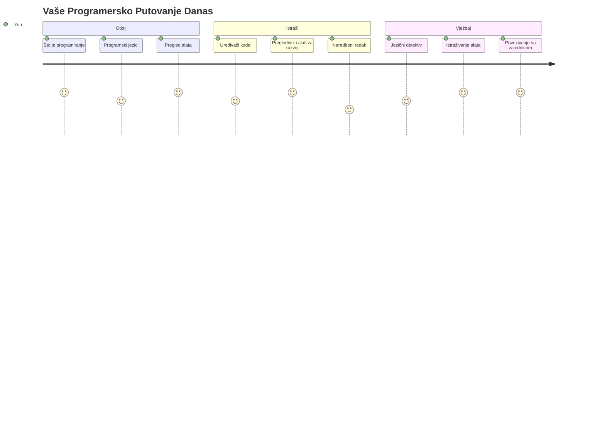
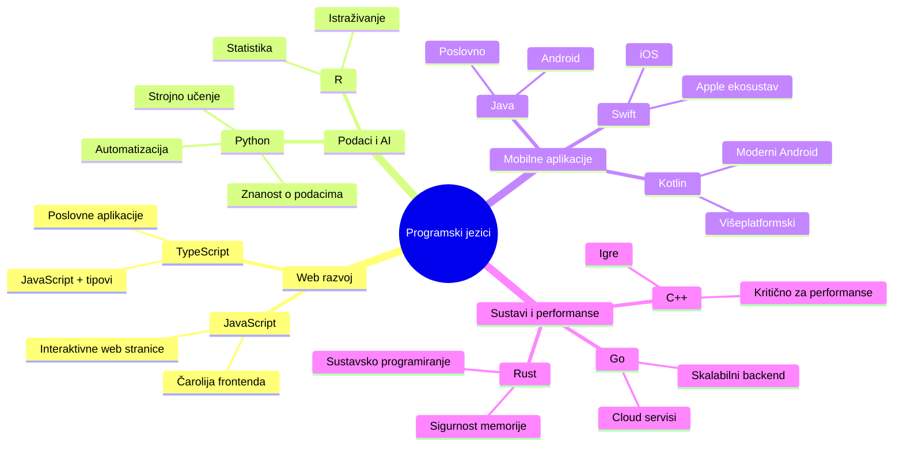
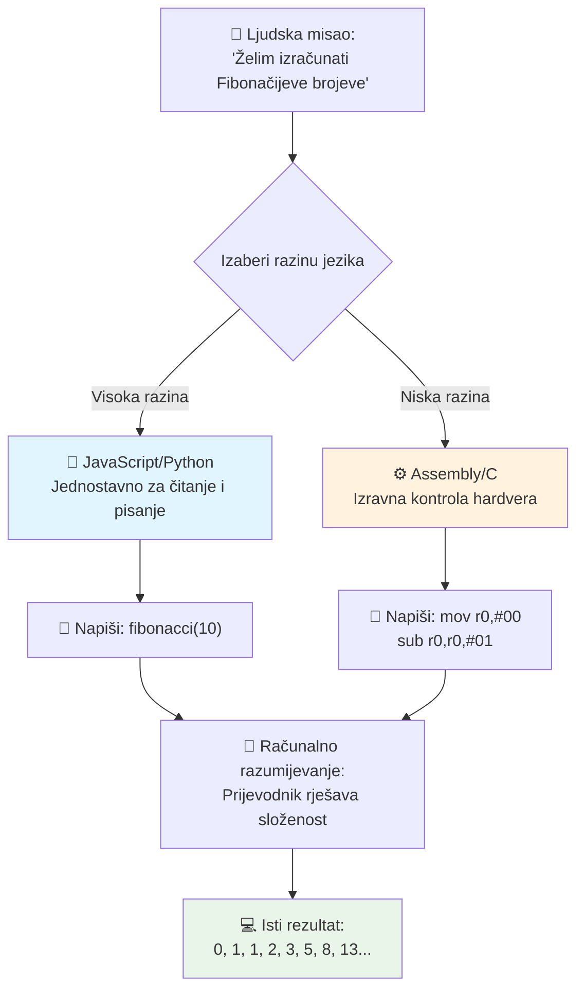
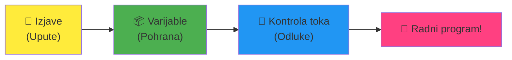
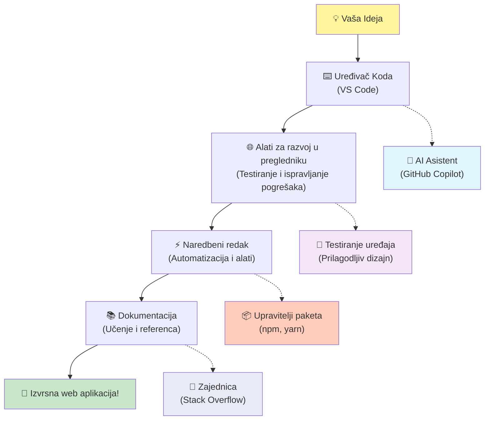
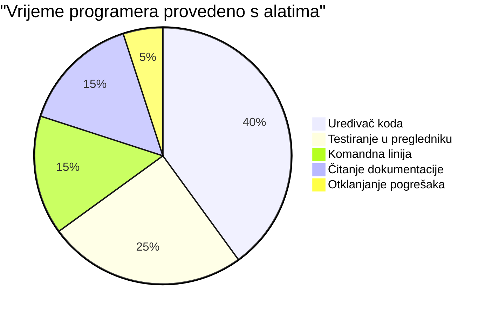
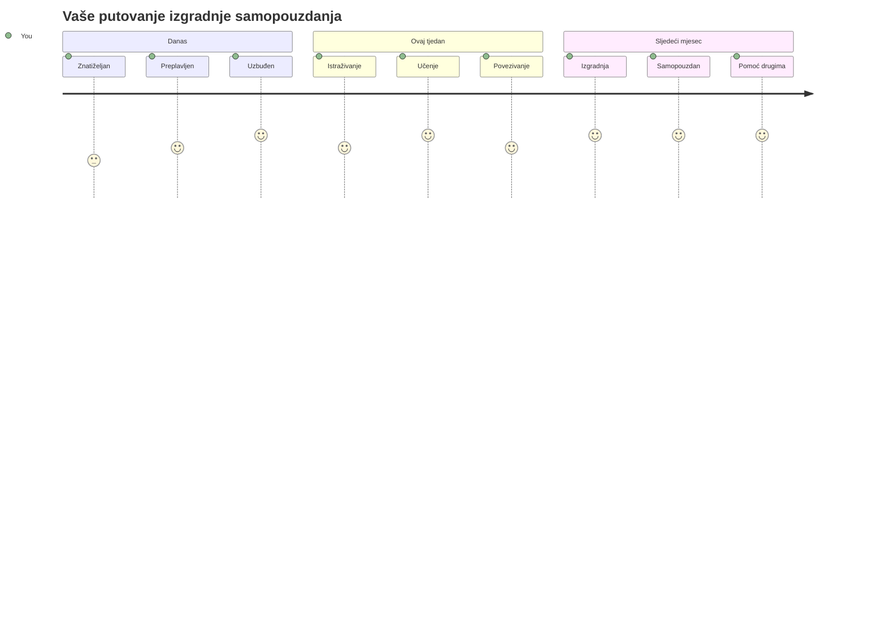

<!--
CO_OP_TRANSLATOR_METADATA:
{
  "original_hash": "d45ddcc54eb9232a76d08328b09d792e",
  "translation_date": "2026-01-07T09:36:14+00:00",
  "source_file": "1-getting-started-lessons/1-intro-to-programming-languages/README.md",
  "language_code": "hr"
}
-->
# Uvod u programske jezike i moderne razvojne alate

Bok, budući programeru! 👋 Mogu li ti reći nešto što mi i danas svaki dan izaziva jezu? Upravo ćeš otkriti da programiranje nije samo za računala – to su prave supermoći koje ti omogućuju da oživiš svoje najluđe ideje!

Znaš onaj trenutak kad koristiš svoju omiljenu aplikaciju i sve jednostavno savršeno klikne? Kad dodirneš gumb i dogodi se nešto posve magično zbog čega pomisliš „wow, kako su TO učinili?“ Pa, netko baš poput tebe – vjerojatno sjedi u svom omiljenom kafiću u 2 ujutro s trećim espresom – napisao je kod koji je stvorio tu čaroliju. A ovo će ti izvaditi dah: do kraja ovog sata ćeš ne samo razumjeti kako su to napravili, nego ćeš jedva čekati sam probati!

Pogledaj, potpuno razumijem ako ti se programiranje sada čini zastrašujuće. Kad sam ja počinjao, iskreno sam mislio da trebaš biti neki matematički genij ili da kodaš od pete godine života. Ali evo što mi je u potpunosti promijenilo pogled: programiranje je kao učenje novog jezika komunikacije. Počneš s „bok“ i „hvala“, zatim naručuješ kavu, a prije nego znaš, vodiš duboke filozofske razgovore! Osim što u ovom slučaju razgovaraš s računalima, i iskreno? Oni su najstrpljiviji sugovornici koje možeš imati – nikad ne osuđuju tvoje pogreške i uvijek su spremni ponovno pokušati!

Danas ćemo istražiti nevjerojatne alate koji čine moderni web razvoj ne samo mogućim, već i ozbiljno zaraznim. Govorim o točno istim uređivačima, preglednicima i radnim procesima koje koriste developeri u Netflixu, Spotifyu i tvom omiljenom indie studiju svaki dan. I evo dijela koji će te natjerati da zaplešeš od sreće: većina ovih profesionalnih, industrijskih alata je potpuno besplatna!


> Sketchnote autora [Tomomi Imura](https://twitter.com/girlie_mac)


## Pogledajmo što već znaš!

Prije nego što skočimo na zabavne stvari, zanima me – što već znaš o ovom svijetu programiranja? I slušaj, ako na ova pitanja gledaš misleći „Doslovno nemam pojma ni o čemu od ovoga,“ nije samo u redu, to je savršeno! To znači da se nalaziš na točno pravom mjestu. Razmišljaj o ovom kvizu kao o zagrijavanju prije treninga – samo pripremamo tvoje moždane mišiće!

[Posloži pred-čas kviz](https://forms.office.com/r/dru4TE0U9n?origin=lprLink)


## Avantura na koju krećemo zajedno

Ok, stvarno sam oduševljen onim što ćemo danas istražiti! Ozbiljno, volio bih vidjeti tvoj izraz lica kad ti neki od ovih pojmova zaista sjednu. Evo nevjerojatnog putovanja na koje krećemo zajedno:

- **Što je programiranje zapravo (i zašto je to najslađa stvar ikad!)** – Otkrit ćemo kako je kod doslovno nevidljiva čarolija koja pokreće sve oko tebe, od onog alarma koji nekako zna da je ponedjeljak ujutro do algoritma koji savršeno kroji tvoje Netflix preporuke  
- **Programski jezici i njihove nevjerojatne osobnosti** – Zamislite da ulaziš na zabavu na kojoj svaka osoba ima potpuno drugačije supermoći i načine rješavanja problema. Tako izgleda svijet programskih jezika, i voljet ćeš ih upoznati!
- **Temeljni gradivni blokovi koji stvaraju digitalnu magiju** – Zamislite ovo kao ultimativni LEGO set za kreativnost. Kad shvatiš kako se ti dijelovi uklapaju, shvatit ćeš da doslovno možeš složiti bilo što što ti mašta zamisli
- **Profesionalni alati koji će ti dati osjećaj kao da si dobio čarobni štapić** – Nije pretjerivanje – ovi alati će te zaista natjerati da se osjećaš kao da imaš supermoći, a najbolji dio? To su isti alati koje koriste profesionalci!

> 💡 **Evo u čemu je stvar**: Nemoj ni pomišljati na to da sve danas naučiš napamet! Trenutno želim da osjetiš taj sjaj uzbuđenja zbog mogućnosti. Detalji će se prirodno upamtiti dok vježbamo zajedno – to je pravi način učenja!

> Ovaj sat možeš proći i na [Microsoft Learn](https://docs.microsoft.com/learn/modules/web-development-101/introduction-programming/?WT.mc_id=academic-77807-sagibbon)!

## Pa što točno *jest* programiranje?

Ok, uhvatimo se milijun dolara vrijednog pitanja: što je zapravo programiranje?

Ispričat ću ti priču koja mi je potpuno promijenila pogled na ovo. Prošli tjedan sam pokušavao objasniti mami kako se koristi naš novi pametni daljinski za TV. Uhvatim se kako govorim stvari poput „Pritisni crveni gumb, ali ne onaj veliki crveni, mali crveni s lijeve strane... ne, tvoj drugi lijevi... okej, sad ga drž’ dvije sekunde, ne jednu, ne tri...“ Zvuči poznato? 😅

To je programiranje! To je umjetnost davanja izuzetno detaljnih, korak-po-korak uputa nečemu što je vrlo moćno, ali treba da sve bude savršeno razjašnjeno. Osim što niješ mami objašnjavao (koja može pitati „koji crveni gumb?!“), nego računalu (koje radi točno ono što kažeš, čak i ako to nije baš ono što si htio).

Evo što me je oduševilo kad sam prvi put naučio ovo: računala su zapravo prilično jednostavna u svojoj srži. Doslovno razumiju samo dvije stvari – 1 i 0, što je u osnovi „da“ i „ne“ ili „uključeno“ i „isključeno.“ To je to! Ali ovdje dolazi čarolija – ne moramo govoriti u 1-icama i 0-icama kao u Matrixu. Tu na scenu stupaju **programski jezici**. Oni su kao najbolji prevoditelj na svijetu koji pretvara tvoje sasvim normalne ljudske misli u računalni jezik.

I evo što mi svakog jutra doslovno izaziva jezu: sve *digitalno* u tvom životu počelo je s nekim kao ti, vjerojatno u pidžami s šalicom kave, tipkajući kod na laptopu. Taj Instagram filter koji te čini besprijekornim? Netko je to kodirao. Preporuka koja te dovela do tvoje nove omiljene pjesme? Netko je izgradio taj algoritam. Aplikacija koja ti pomaže podijeliti račun za večeru s prijateljima? Da, netko je pomislio „ovo je dosadno, sigurno mogu to popraviti“ i... onda je napravio!

Kad naučiš programirati, ne samo da stječeš novu vještinu – postaješ dio ove nevjerojatne zajednice rješavatelja problema koji cijeli dan razmišljaju „Što ako mogu napraviti nešto što će nečiji dan učiniti malo boljim?“ Iskreno, postoji li išta cool od toga?

✅ **Zabavni zadatak**: Evo nečega super cool što možeš potražiti kad budeš imao slobodnog vremena – tko misliš da je bio prvi računalni programer na svijetu? Dati ću ti nagovještaj: možda nije osoba koju očekuješ! Priča o toj osobi je apsolutno fascinantna i pokazuje da je programiranje uvijek bilo o kreativnom rješavanju problema i razmišljanju izvan okvira.

### 🧠 **Vrijeme za provjeru: Kako se osjećaš?**

**Uzeći trenutak za razmišljanje:**
- Ima li sada smisla ideja o „davanju uputa računalima“?
- Možeš li smisliti neku svakodnevnu aktivnost koju bi htio automatizirati programiranjem?
- Koja pitanja ti se vrzmaju po glavi o svemu ovome s programiranjem?

> **Sjeti se**: potpuno je normalno ako ti neki pojmovi sada djeluju nejasno. Učenje programiranja je kao učenje novog jezika – treba vremena da tvoj mozak izgradi te neuronske veze. Ti to odlično radiš!

## Programsko jezici su kao različiti okusi magije

Ok, ovo će možda zvučati čudno, ali drži se sa mnom – programski jezici su kao različite vrste glazbe. Razmisli o tome: imaš jazz, koji je gladak i improvizacijski, rock koji je snažan i jednostavan, klasičnu glazbu koja je elegantna i strukturirana, i hip-hop koji je kreativan i izražajan. Svaki stil ima svoj vibe, svoju zajednicu strastvenih obožavatelja i svaki je savršen za različita raspoloženja i prilike.

Programsko jezici rade potpuno isto! Ne bi koristio isti jezik za izradu zabavne mobilne igre kao za obradu ogromne količine klimatskih podataka, isto kao što ne bi svirao death metal na satu joge (dobro, većinom ne! 😄).

Ali ovo me svaki put iznova oduševi kad pomislim na to: ti jezici su kao da kraj tebe sjedne najstrpljiviji, briljantni prevoditelj na svijetu. Možeš izraziti svoje ideje na način koji prirodno vidi tvoj ljudski mozak, a oni obavljaju sav nevjerojatno složen posao prevođenja u 1-ice i 0-ke koje računala zapravo razumiju. Kao da imaš prijatelja koji je savršeno tečan u „ljudskoj kreativnosti“ i „računalnoj logici“ – i nikad se ne umori, nikad ne treba pauzu za kavu i nikad ne sudi ako isto pitanje postaviš dvaput!

### Popularni programski jezici i njihova primjena


| Jezik | Najbolje za | Zašto je popularan |
|----------|----------|------------------|
| **JavaScript** | Web razvoj, korisnička sučelja | Radi u preglednicima i pokreće interaktivne web stranice |
| **Python** | Znanost o podacima, automatizacija, umjetna inteligencija | Jednostavan za čitanje i učenje, moćne biblioteke |
| **Java** | Poslovne aplikacije, Android aplikacije | Neovisan o platformi, robustan za velike sustave |
| **C#** | Windows aplikacije, razvoj igara | Snažna podrška u Microsoftovom ekosustavu |
| **Go** | Cloud usluge, backend sustavi | Brz, jednostavan, dizajniran za moderni računalni svijet |

### Visoko-nivovski vs. nisko-nivovski jezici

Ok, iskreno, ovo je bio pojam koji mi je slomio mozak kad sam počinjao učiti, pa ću ti ispričati analogiju koja mi je napokon sve osvijetlila – i stvarno se nadam da će pomoći i tebi!

Zamisli da putuješ u zemlju čiji jezik ne znaš i očajno tražiš najbliži WC (svi smo prošli kroz to, zar ne? 😅):

- **Nisko-nivovsko programiranje** je kao da tako dobro naučiš lokalni dijalekt da možeš razgovarati s bakom koja prodaje voće na uglu koristeći kulturne reference, lokalni žargon i interne šale koje razumije samo netko tko je tamo odrastao. Super impresivno i nevjerojatno učinkovito... ako slučajno tečno govoriš! Ali prilično zastrašujuće ako samo pokušavaš pronaći WC.

- **Visoko-nivovsko programiranje** je kao da imaš onog divnog lokalnog prijatelja koji te jednostavno razumije. Možeš reći „Stvarno mi treba WC“ na čistom engleskom, a on prevede sve kulturne nijanse i da ti upute koje tvom nemjestnom mozgu savršeno sjede.

U programerskim terminima:
- **Nisko-nivovski jezici** (kao Assembly ili C) ti dopuštaju da vodiš izuzetno detaljne razgovore s stvarnim hardverom računala, ali moraš razmišljati kao stroj, što je... pa, recimo da je to prilično velik mentalni skok!
- **Visoko-nivovski jezici** (kao JavaScript, Python ili C#) puštaju te da razmišljaš kao čovjek dok oni rade sav „strojni govor“ u pozadini. I uz to imaju ove nevjerojatno gostoljubive zajednice ljudi koji se sjećaju kako je bilo biti početnik i doista žele pomoći!

Pogodi s kojim ću ti savjetovati da počneš? 😉 Visoko-nivovski jezici su kao pomoćne kotačiće koje zapravo nikad nećeš htjeti skinuti jer iskustvo čine toliko ljepšim!


### Pokažem ti zašto su visoko-nivovski jezici toliko prijateljski

Ok, pokazat ću ti nešto što savršeno pokazuje zašto sam se zaljubio u visoko-nivovske jezike, ali prvo – obećaj mi jednu stvar. Kad vidiš prvi primjer koda, nemoj paničariti! Trebalo bi izgledati zastrašujuće. Upravo to i pokazujem!

Pogledat ćemo isti zadatak napisan u dva potpuno različita stila. Oba stvaraju tzv. Fibonačijev niz – to je prekrasan matematički obrazac gdje je svaki broj zbroj prethodna dva: 0, 1, 1, 2, 3, 5, 8, 13... (Zabavna činjenica: ovaj obrazac naći ćeš doslovno svugdje u prirodi – spirale sjemenki suncokreta, obrasci češera, čak i način na koji nastaju galaksije!)

Spreman za razliku? Idemo!

**Visoko-nivovski jezik (JavaScript) – prijateljski ljudima:**

```javascript
// Korak 1: Osnovna postavka Fibonaccija
const fibonacciCount = 10;
let current = 0;
let next = 1;

console.log('Fibonacci sequence:');
```

**Evo što ovaj kod radi:**
- **Deklarira** konstantu koja određuje koliko Fibonacci brojeva želimo generirati
- **Inicijalizira** dvije varijable za praćenje trenutnog i sljedećeg broja u nizu
- **Postavlja** početne vrijednosti (0 i 1) koje definiraju Fibonačijev obrazac
- **Prikazuje** naslovnu poruku da označimo naš izlaz

```javascript
// Korak 2: Generirajte niz pomoću petlje
for (let i = 0; i < fibonacciCount; i++) {
  console.log(`Position ${i + 1}: ${current}`);
  
  // Izračunajte sljedeći broj u nizu
  const sum = current + next;
  current = next;
  next = sum;
}
```

**Objašnjenje što se ovdje događa:**
- **Petlja** kroz svaki položaj u nizu koristeći `for` petlju
- **Prikazuje** svaki broj s njegovom pozicijom koristeći formatiranje predložene niske
- **Izračunava** sljedeći Fibonacci broj zbrajajući tekuće i sljedeće vrijednosti
- **Ažurira** varijable za praćenje kako bi prešao na sljedeću iteraciju

```javascript
// Korak 3: Moderan funkcionalni pristup
const generateFibonacci = (count) => {
  const sequence = [0, 1];
  
  for (let i = 2; i < count; i++) {
    sequence[i] = sequence[i - 1] + sequence[i - 2];
  }
  
  return sequence;
};

// Primjer korištenja
const fibSequence = generateFibonacci(10);
console.log(fibSequence);
```

**U gornjem primjeru smo:**
- **Stvorili** funkciju koja se može ponovno koristiti koristeći modernu sintaksu streličaste funkcije
- **Izgradili** niz za pohranu cijelog niza umjesto da prikazujemo broj po broj
- **Koristili** indeksiranje niza kako bismo izračunali svaki novi broj iz prethodnih
- **Vratili** cijeli niz za fleksibilnu uporabu u drugim dijelovima programa

**Nisko-nivovski jezik (ARM Assembly) – prilagođen računalu:**

```assembly
 area ascen,code,readonly
 entry
 code32
 adr r0,thumb+1
 bx r0
 code16
thumb
 mov r0,#00
 sub r0,r0,#01
 mov r1,#01
 mov r4,#10
 ldr r2,=0x40000000
back add r0,r1
 str r0,[r2]
 add r2,#04
 mov r3,r0
 mov r0,r1
 mov r1,r3
 sub r4,#01
 cmp r4,#00
 bne back
 end
```

Primijeti kako JavaScript verzija čita gotovo kao upute na engleskom, dok verzija u Assemblyju koristi kriptične naredbe koje izravno kontroliraju procesor računala. Oba ostvaruju isti zadatak, ali je visoko-nivovski jezik puno lakši za ljude za razumjeti, pisati i održavati.

**Ključne razlike koje ćeš primijetiti:**
- **Čitljivost**: JavaScript koristi opisne nazive poput `fibonacciCount` dok Assembly koristi kriptične oznake poput `r0`, `r1`
- **Komentari**: Visoko razine jezici potiču objašnjavajuće komentare koji kod čine samodokumentirajućim
- **Struktura**: Logički tijek JavaScripta odgovara načinu na koji ljudi razmišljaju o problemima korak po korak
- **Održavanje**: Ažuriranje JavaScript verzije za različite zahtjeve je jednostavno i jasno

✅ **O Fibonacci nizu**: Ovaj apsolutno prekrasan brojčani uzorak (gdje je svaki broj zbroj dva prethodna: 0, 1, 1, 2, 3, 5, 8...) pojavljue se doslovno *svugdje* u prirodi! Pronaći ćete ga u spiralama suncokreta, uzorcima češera, načinu na koji se ljuske nautilusa uvijaju, pa čak i u načinu rasta grana na drveću. Prilično je zadivljujuće kako matematika i kod mogu pomoći u razumijevanju i rekreiranju uzoraka kojima priroda stvara ljepotu!


## Gradivni Blokovi Koji Čine Čaroliju Mogućom

Dobro, sada kada ste vidjeli kako programski jezici izgledaju u praksi, razložimo osnovne dijelove koji čine doslovno svaki ikada napisan program. Zamislite ih kao ključne sastojke u vašem omiljenom receptu – jednom kad shvatite što svaki od njih radi, moći ćete čitati i pisati kod u gotovo bilo kojem jeziku!

Ovo je nešto poput učenja gramatike programiranja. Sjećate se iz škole kad ste učili o imenima, glagolima i kako sastavljati rečenice? Programiranje ima vlastitu verziju gramatike, i iskreno, to je puno logičnije i opraštajuće nego što je ikada bila engleska gramatika! 😄

### Izjave: Uputstva Korak Po Korak

Počnimo s **izjavama** – one su poput pojedinačnih rečenica u razgovoru s vašim računalom. Svaka izjava govori računalu da učini jednu konkretnu stvar, kao da dajete upute: "Skreni lijevo ovdje," "Zaustavi se na crvenom svjetlu," "Parkiraj na tom mjestu."

Ono što volim kod izjava je koliko su obično čitljive. Pogledajte ovo:

```javascript
// Osnovne naredbe koje izvršavaju pojedinačne radnje
const userName = "Alex";                    
console.log("Hello, world!");              
const sum = 5 + 3;                         
```

**Evo što ovaj kod radi:**
- **Deklarira** konstantnu varijablu za pohranu imena korisnika
- **Prikazuje** poruku pozdrava na konzolnom izlazu
- **Izračunava** i pohranjuje rezultat matematičke operacije

```javascript
// Izjave koje komuniciraju s web stranicama
document.title = "My Awesome Website";      
document.body.style.backgroundColor = "lightblue";
```

**Korak po korak, evo što se događa:**
- **Mijenja** naslov web stranice koji se pojavljuje na kartici preglednika
- **Mijenja** boju pozadine cijelog tijela stranice

### Varijable: Memorijski Sustav Vašeg Programa

U redu, **varijable** su iskreno jedan od mojih omiljenih koncepata za podučavanje jer su toliko slične stvarima koje već koristite svaki dan!

Razmislite o svojoj listi kontakata na telefonu na trenutak. Ne pamtite telefonske brojeve svih – umjesto toga, spremite "Mama," "Najbolji prijatelj," ili "Pizzerija koja dostavlja do 2 ujutro" i vaš telefon zapamti stvarne brojeve. Varijable funkcioniraju upravo tako! One su poput označenih spremnika gdje vaš program može pohraniti informacije i kasnije ih dohvatiti koristeći ime koje zapravo ima smisla.

Evo što je stvarno cool: varijable se mogu mijenjati dok vaš program radi (otuda i ime "varijabla" – vidite što su napravili?). Baš kao što biste mogli ažurirati kontakt pizzerije kad otkrijete nešto još bolje, varijable se mogu mijenjati kako vaš program uči nove informacije ili kako se situacije mijenjaju!

Evo kako ovo može biti lijepo jednostavno:

```javascript
// Korak 1: Kreiranje osnovnih varijabli
const siteName = "Weather Dashboard";        
let currentWeather = "sunny";               
let temperature = 75;                       
let isRaining = false;                      
```

**Razumijevanje ovih koncepata:**
- **Pohranjujte** nepromjenjive vrijednosti u `const` varijable (npr. ime stranice)
- **Koristite** `let` za vrijednosti koje se mogu mijenjati tijekom programa
- **Dodjeljujte** različite tipove podataka: stringove (tekst), brojeve i boolean (true/false)
- **Birajte** opisna imena koja jasno objašnjavaju što svaka varijabla sadrži

```javascript
// Korak 2: Rad s objektima za grupiranje povezanih podataka
const weatherData = {                       
  location: "San Francisco",
  humidity: 65,
  windSpeed: 12
};
```

**U gornjem primjeru smo:**
- **Kreirali** objekt za grupiranje povezanih informacijama o vremenu
- **Organizirali** više podataka pod jednim imenom varijable
- **Koristili** parove ključ-vrijednost za jasno označavanje svake informacije

```javascript
// Korak 3: Korištenje i ažuriranje varijabli
console.log(`${siteName}: Today is ${currentWeather} and ${temperature}°F`);
console.log(`Wind speed: ${weatherData.windSpeed} mph`);

// Ažuriranje promjenjivih varijabli
currentWeather = "cloudy";                  
temperature = 68;                          
```

**Razumimo svaki dio:**
- **Prikazuje** informacije koristeći template literale s `${}` sintaksom
- **Pristupa** svojstvima objekta koristeći točkastu notaciju (`weatherData.windSpeed`)
- **Ažurira** varijable deklarirane s `let` za odražavanje promjenjivih uvjeta
- **Kombinira** više varijabli za stvaranje smislenih poruka

```javascript
// Korak 4: Moderna destrukturacija za čišći kod
const { location, humidity } = weatherData; 
console.log(`${location} humidity: ${humidity}%`);
```

**Što trebate znati:**
- **Izvlači** specifična svojstva iz objekata koristeći destrukturiranje
- **Kreira** nove varijable automatski s istim imenima kao ključevi objekta
- **Pojednostavljuje** kod izbjegavajući ponavljanje točkaste notacije

### Kontrolni Tijek: Podučavanje Vašeg Programa da Razmišlja

U redu, ovo je mjesto gdje programiranje postaje potpuno nevjerojatno! **Kontrolni tijek** je u osnovi podučavanje vašeg programa kako donositi pametne odluke, baš kao što to vi radite svaki dan, a da toga uopće niste svjesni.

Zamislite ovo: jutros ste vjerojatno prošli kroz nešto poput "Ako pada kiša, uzet ću kišobran. Ako je hladno, obući ću jaknu. Ako kasnim, preskočit ću doručak i uzet kavu usput." Vaš mozak prirodno slijedi ovu if-then logiku desetine puta dnevno!

To je ono što čini programe inteligentnima i živima, umjesto da slijede samo dosadan, predvidljiv scenarij. Oni zapravo mogu pogledati situaciju, procijeniti što se događa i reagirati primjereno. To je kao da svom programu date mozak koji može prilagoditi i donositi odluke!

Želite li vidjeti kako ovo sjajno funkcionira? Dopustite da vam pokažem:

```javascript
// Korak 1: Osnovna uvjetna logika
const userAge = 17;

if (userAge >= 18) {
  console.log("You can vote!");
} else {
  const yearsToWait = 18 - userAge;
  console.log(`You'll be able to vote in ${yearsToWait} year(s).`);
}
```

**Evo što ovaj kod radi:**
- **Provjerava** zadovoljava li korisnik dob za glasanje
- **Izvršava** različite blokove koda ovisno o rezultatu uvjeta
- **Izračunava** i prikazuje koliko još treba do postanka podobnim za glasanje ako je korisnik mlađi od 18
- **Pruža** specifične i korisne povratne informacije za svaku situaciju

```javascript
// Korak 2: Više uvjeta s logičkim operatorima
const userAge = 17;
const hasPermission = true;

if (userAge >= 18 && hasPermission) {
  console.log("Access granted: You can enter the venue.");
} else if (userAge >= 16) {
  console.log("You need parent permission to enter.");
} else {
  console.log("Sorry, you must be at least 16 years old.");
}
```

**Rasčlanjivanje onoga što se ovdje događa:**
- **Kombinira** više uvjeta koristeći `&&` (i) operator
- **Stvara** hijerarhiju uvjeta koristeći `else if` za više scenarija
- **Rješava** sve moguće slučajeve s konačnim `else` blokom
- **Pruža** jasne, konkretne povratne informacije za različite situacije

```javascript
// Korak 3: Sažeti uvjet s ternarnim operatorom
const votingStatus = userAge >= 18 ? "Can vote" : "Cannot vote yet";
console.log(`Status: ${votingStatus}`);
```

**Što morate zapamtiti:**
- **Koristite** ternarni operator (`? :`) za jednostavne uvjete s dvije opcije
- **Napišite** uvjet prvo, zatim `?`, zatim rezultat za true, pa `:`, zatim rezultat za false
- **Primjenjujte** ovaj obrazac kad trebate dodijeliti vrijednosti prema uvjetima

```javascript
// Korak 4: Obrada više specifičnih slučajeva
const dayOfWeek = "Tuesday";

switch (dayOfWeek) {
  case "Monday":
  case "Tuesday":
  case "Wednesday":
  case "Thursday":
  case "Friday":
    console.log("It's a weekday - time to work!");
    break;
  case "Saturday":
  case "Sunday":
    console.log("It's the weekend - time to relax!");
    break;
  default:
    console.log("Invalid day of the week");
}
```

**Ovaj kod ostvaruje slijedeće:**
- **Uspoređuje** vrijednost varijable s više specifičnih slučajeva
- **Grupira** slične slučajeve (radni dani vs. vikendi)
- **Izvršava** odgovarajući blok koda kad nađe podudaranje
- **Uključuje** `default` slučaj za neočekivane vrijednosti
- **Koristi** `break` izjave da spriječi nastavak izvođenja sljedećeg slučaja

> 💡 **Analogija iz stvarnog svijeta**: Zamislite kontrolni tijek poput najstrpljivijeg GPS-a koji vam daje upute. Možda kaže "Ako ima gužve na Glavnoj cesti, uzmi autocestu. Ako je konstrukcija blokirala autocestu, pokušaj slikoviti put." Programi koriste istu vrstu uvjetne logike da bi inteligentno reagirali na različite situacije i uvijek pružili korisniku najbolje moguće iskustvo.

### 🎯 **Provjera Koncepta: Majstorija Gradivnih Blokova**

**Pogledajmo kako stojite s osnovama:**
- Možete li vlastitim riječima objasniti razliku između varijable i izjave?
- Smislite stvarni scenarij u kojem biste koristili if-then odluku (poput primjera glasanja)
- Koja vas je stvar o logici programiranja iznenadila?

**Brzi poticaj samopouzdanja:**

✅ **Što slijedi**: Imat ćemo pravo veselje zaroniti dublje u ove koncepte dok nastavljamo ovaj nevjerojatan put zajedno! Sada se samo usredotočite na to da osjetite uzbuđenje zbog svih sjajnih mogućnosti koje su pred vama. Specifične vještine i tehnike će se prirodno usaditi kako budemo zajedno vježbali – obećavam da će ovo biti puno zabavnije nego što možda očekujete!

## Alati Struke

U redu, iskreno, ovo je mjesto gdje se toliko uzbudim da se jedva mogu suzdržati! 🚀 Upravo ćemo govoriti o nevjerojatnim alatima koji će vam dati osjećaj kao da ste upravo dobili ključeve digitalnog svemirskog broda.

Znate kako kuhar ima savršeno uravnotežene noževe koji mu djeluju kao produžetak ruku? Ili kako glazbenik ima onu gitaru koja kao da zapjeva u trenutku kad je dotakne? Pa, programeri imaju vlastitu verziju tih čarobnih alata, i evo što će vam apsolutno iznenaditi – većina njih je potpuno besplatna!

Skoro se micam u stolici dok razmišljam o tome da vam ovo podijelim jer su potpuno revolucionirali način na koji pravimo softver. Govorimo o AI-pokretanim asistentima za kodiranje koji vam mogu pomoći napisati kod (nisam se šalio!), cloud okružjima gdje možete raditi čitave aplikacije doslovno od bilo kuda s Wi-Fi mrežom, i alatima za otklanjanje pogrešaka toliki sofisticiranim da ih možete usporediti s rendgenskim vidom za vaše programe.

I evo dijela koji me i dalje oduševi: ovo nisu "alati za početnike" koje ćete prerasti. Ovo su točno isti profesionalni alati koje developeri u Googleu, Netflixu i u onom indie studiju aplikacija kojeg volite koriste baš u ovom trenutku. Osjećat ćete se kao pravi profesionalac koristeći ih!


### Uređivači Koda i IDE-i: Vaši Novi Digitalni Najbolji Prijatelji

Razgovarajmo o uređivačima koda – oni su ozbiljno na putu da postanu vaša nova omiljena mjesta za provoditi vrijeme! Zamislite ih kao svoje osobno svetište kodiranja gdje ćete većinu vremena provoditi stvarajući i usavršavajući svoje digitalne kreacije.

Ali evo što je apsolutno čarobno kod modernih uređivača: oni nisu samo sjajni uređivači teksta. Oni su kao da imate najsjajnijeg, najpodržavajućeg mentora za kodiranje koji sjedi pored vas 24/7. Uhvatit će vam tipfelere prije nego ih i primijetite, predložiti poboljšanja koja će vas učiniti genijem, pomoći vam da razumijete što svaki dio koda radi, a neki od njih mogu čak i predvidjeti što ćete napisati i ponuditi da dovrše vaše misli!

Sjećam se kad sam prvi put otkrio automatsko dovršavanje – doslovno sam se osjećao kao da živim u budućnosti. Počnete tipkati nešto, a uređivač kaže "Hej, jesi li razmišljao o ovoj funkciji koja radi točno ono što trebaš?" Kao da imate čitača misli kao prijatelja za kodiranje!

**Što ove uređivače čini tako nevjerojatnima?**

Moderni uređivači koda nude impresivan niz značajki koje vam povećavaju produktivnost:

| Značajka | Što Radi | Zašto Pomaže |
|---------|--------------|--------------|
| **Isticanje Sintakse** | Boji različite dijelove koda | Čini kod lakšim za čitanje i pronalaženje grešaka |
| **Automatsko dovršavanje** | Predlaže kod dok tipkate | Ubrzava kodiranje i smanjuje greške u tipkanju |
| **Alati za Debugging** | Pomaže pronaći i popraviti pogreške | Štedi sate vremena za ispravljanje problema |
| **Proširenja** | Dodaju specijalizirane značajke | Prilagođavaju uređivač za bilo koju tehnologiju |
| **AI Asistenti** | Predlažu kod i objašnjenja | Ubrzavaju učenje i produktivnost |

> 🎥 **Video Resurs**: Želite li vidjeti ove alate u akciji? Pogledajte [Tools of the Trade video](https://youtube.com/watch?v=69WJeXGBdxg) za sveobuhvatan pregled.

#### Preporučeni Uređivači za Web Razvoj

**[Visual Studio Code](https://code.visualstudio.com/?WT.mc_id=academic-77807-sagibbon)** (Besplatno)
- Najpopularniji među web developerima
- Sjajan ekosustav proširenja
- Ugrađena terminal i Git integracija
- **Obavezna proširenja**:
  - [GitHub Copilot](https://marketplace.visualstudio.com/items?itemName=GitHub.copilot) - AI-pokretani prijedlozi koda
  - [Live Share](https://marketplace.visualstudio.com/items?itemName=MS-vsliveshare.vsliveshare) - Suradnja u stvarnom vremenu
  - [Prettier](https://marketplace.visualstudio.com/items?itemName=esbenp.prettier-vscode) - Automatsko formatiranje koda
  - [Code Spell Checker](https://marketplace.visualstudio.com/items?itemName=streetsidesoftware.code-spell-checker) - Pronalazi tipkarske pogreške u kodu

**[JetBrains WebStorm](https://www.jetbrains.com/webstorm/)** (Plaćeno, besplatno za studente)
- Napredni alati za debugging i testiranje
- Inteligentno dovršavanje koda
- Ugrađeni sustav kontrole verzija

**Cloud IDE-i** (Različite cijene)
- [GitHub Codespaces](https://github.com/features/codespaces) - Cijeli VS Code u vašem pregledniku
- [Replit](https://replit.com/) - Odlično za učenje i dijeljenje koda
- [StackBlitz](https://stackblitz.com/) - Instantni full-stack web razvoj

> 💡 **Savjet za početak**: Počnite s Visual Studio Code – besplatan je, široko korišten u industriji, i ima ogromnu zajednicu koja stvara korisne tutorijale i proširenja.


### Web Preglednici: Vaš Tajni Laboratorij za Razvoj

U redu, pripremite se da vam se um potpuno razbije! Znate kako ste koristili preglednike za listanje društvenih mreža i gledanje videa? Pa, ispostavilo se da su cijelo to vrijeme skrivali nevjerojatnu tajnu razvojnu laboratoriju, samo čekajući da je otkrijete!

Svaki put kad kliknete desnim klikom miša na web stranicu i odaberete "Inspect Element", otvarate skriveni svijet razvojnih alata koji su iskreno moćniji od nekog skupog softvera za koji sam nekada plaćao stotine dolara. Kao da otkrivate da je vaša obična kuhinja cijelo vrijeme skrivala profesionalni kuharski laboratorij iza tajnog panela!
Prvi put kad mi je netko pokazao DevTools u pregledniku, proveo sam oko tri sata samo klikajući po svemu i govoreći "ČEKAJ, TO MOGU I TO?!" Doslovno možeš uređivati bilo koju web stranicu u stvarnom vremenu, vidjeti točno koliko brzo se sve učitava, testirati kako tvoja stranica izgleda na različitim uređajima, pa čak i debugirati JavaScript kao pravi profesionalac. Apsolutno je zapanjujuće!

**Evo zašto su preglednici tvoj tajni adut:**

Kad stvaraš web stranicu ili web aplikaciju, trebaš vidjeti kako izgleda i ponaša se u stvarnom svijetu. Preglednici ne prikazuju samo tvoj rad, već daju i detaljne povratne informacije o performansama, pristupačnosti i potencijalnim problemima.

#### Alati za razvoj u pregledniku (DevTools)

Moderni preglednici uključuju opsežne razvojne alate:

| Kategorija alata | Što radi | Primjer uporabe |
|------------------|----------|-----------------|
| **Inspector elemenata** | Pregled i uređivanje HTML/CSS u stvarnom vremenu | Prilagodi stilove i vidi trenutne rezultate |
| **Konzola** | Pregled poruka o greškama i testiranje JavaScripta | Debugiranje problema i eksperimenti s kodom |
| **Mrežni nadzor** | Praćenje učitavanja resursa | Optimizacija performansi i vremena učitavanja |
| **Provjera pristupačnosti** | Testiranje inkluzivnog dizajna | Osiguraj da tvoja stranica funkcionira za sve korisnike |
| **Simulator uređaja** | Pregled na različitim veličinama zaslona | Testiranje responzivnog dizajna bez više uređaja |

#### Preporučeni preglednici za razvoj

- **[Chrome](https://developers.google.com/web/tools/chrome-devtools/)** - Industrijski standard DevTools s opsežnom dokumentacijom
- **[Firefox](https://developer.mozilla.org/docs/Tools)** - Izvrsni alati za CSS Grid i pristupačnost
- **[Edge](https://docs.microsoft.com/microsoft-edge/devtools-guide-chromium/?WT.mc_id=academic-77807-sagibbon)** - Izgrađen na Chromiumu uz Microsoftove razvojne resurse

> ⚠️ **Važan savjet za testiranje**: Uvijek testiraj svoje web stranice u više preglednika! Ono što savršeno radi u Chromeu može izgledati drugačije u Safariju ili Firefoxu. Profesionalni programeri testiraju u svim glavnim preglednicima kako bi osigurali dosljedno korisničko iskustvo.


### Alati naredbenog retka: tvoja vrata u razvojne supermoći

U redu, idemo na potpuno iskren trenutak o naredbenom retku, jer želim da ovo čuješ od nekoga tko stvarno to razumije. Kad sam ga prvi put vidio – samo ovaj zastrašujući crni ekran s trepćućim tekstom – doslovno sam mislio, „Ne, nikako! Ovo izgleda kao nešto iz hacker filma iz 1980-ih i definitivno nisam dovoljno pametan za ovo!“ 😅

Ali evo što bih volio da mi je netko tada rekao, i što ti sada govorim: naredbeni redak nije strašan – zapravo je kao da razgovaraš direktno sa svojim računalom. Pomisli na to kao razliku između naručivanja hrane preko neke fancy aplikacije s slikama i jelovnicima (što je fino i jednostavno) i ulaska u svoj omiljeni lokalni restoran gdje kuhar točno zna što voliš i može ti napraviti nešto savršeno samo zato što mu kažeš „iznenadi me s nečim nevjerojatnim.“

Naredbeni redak je mjesto gdje programeri osjećaju kao čarobnjaci. Upisuješ nekoliko naizgled magičnih riječi (okej, to su samo naredbe, ali djeluju kao magija!), pritisneš enter i BUM – stvorio si čitave strukture projekta, instalirao moćne alate s cijelog svijeta ili rasporedio svoju aplikaciju na internet da je milijuni ljudi mogu vidjeti. Kad prvi put osjetiš tu moć, iskreno, postaneš ovisan!

**Zašto će naredbeni redak postati tvoj omiljeni alat:**

Dok su grafička sučelja izvrsna za mnoge zadatke, naredbeni redak briljira u automatizaciji, preciznosti i brzini. Mnogi razvojni alati rade prvenstveno putem naredbenog retka, a učenje njihove učinkovite uporabe može znatno poboljšati tvoju produktivnost.

```bash
# Korak 1: Kreirajte i prijeđite u direktorij projekta
mkdir my-awesome-website
cd my-awesome-website
```

**Ovo kod radi:**
- **Stvara** novi direktorij „my-awesome-website“ za tvoj projekt
- **Prelazi** u novo stvoreni direktorij kako bi započeo rad

```bash
# Korak 2: Inicijalizirajte projekt s package.json
npm init -y

# Instalirajte moderne razvojne alate
npm install --save-dev vite prettier eslint
npm install --save-dev @eslint/js
```

**Korak po korak, ovako se odvija:**
- **Inicijalizira** novi Node.js projekt s zadanim postavkama koristeći `npm init -y`
- **Instalira** Vite kao moderan build alat za brzi razvoj i proizvodnju
- **Dodaje** Prettier za automatsko formatiranje koda i ESLint za provjere kvalitete koda
- **Koristi** zastavicu `--save-dev` za označavanje ovih alata kao razvojnih ovisnosti

```bash
# Korak 3: Izradite strukturu projekta i datoteke
mkdir src assets
echo '<!DOCTYPE html><html><head><title>My Site</title></head><body><h1>Hello World</h1></body></html>' > index.html

# Pokrenite razvojni poslužitelj
npx vite
```

**U gornjem primjeru smo:**
- **Organizirali** projekt stvaranjem zasebnih mapa za izvorni kod i resurse
- **Generirali** osnovnu HTML datoteku s ispravnom strukturom dokumenta
- **Pokrenuli** Vite razvojni server za live reloading i hot module replacement

#### Osnovni alati naredbenog retka za web razvoj

| Alat | Svrha | Zašto ti treba |
|------|-------|----------------|
| **[Git](https://git-scm.com/)** | Upravljanje verzijama | Praćenje promjena, suradnja s drugima, sigurnosna kopija rada |
| **[Node.js & npm](https://nodejs.org/)** | JavaScript runtime i upravljanje paketima | Pokretanje JavaScripta izvan preglednika, instalacija modernih razvojnih alata |
| **[Vite](https://vitejs.dev/)** | Build alat i razvojni server | Munjevito brz razvoj s hot module replacementom |
| **[ESLint](https://eslint.org/)** | Kvaliteta koda | Automatsko pronalaženje i ispravljanje problema u JavaScriptu |
| **[Prettier](https://prettier.io/)** | Formatiranje koda | Održava kod dosljedno formatiranim i čitljivim |

#### Opcije specifične za platformu

**Windows:**
- **[Windows Terminal](https://docs.microsoft.com/windows/terminal/?WT.mc_id=academic-77807-sagibbon)** - Moderan terminal s puno značajki
- **[PowerShell](https://docs.microsoft.com/powershell/?WT.mc_id=academic-77807-sagibbon)** 💻 - Moćno okruženje za skriptiranje
- **[Command Prompt](https://docs.microsoft.com/windows-server/administration/windows-commands/?WT.mc_id=academic-77807-sagibbon)** 💻 - Tradicionalni Windows naredbeni redak

**macOS:**
- **[Terminal](https://support.apple.com/guide/terminal/)** 💻 - Ugrađena terminalska aplikacija
- **[iTerm2](https://iterm2.com/)** - Poboljšani terminal s naprednim značajkama

**Linux:**
- **[Bash](https://www.gnu.org/software/bash/)** 💻 - Standardna Linux ljuska
- **[KDE Konsole](https://docs.kde.org/trunk5/en/konsole/konsole/index.html)** - Napredni terminal emulator

> 💻 = unaprijed instalirano na operativnom sustavu

> 🎯 **Put učenje**: Započni s osnovnim naredbama poput `cd` (promjena direktorija), `ls` ili `dir` (popis datoteka) i `mkdir` (stvaranje mape). Vježbaj s modernim naredbama poput `npm install`, `git status` i `code .` (otvara trenutni direktorij u VS Codeu). Kako budeš sve sigurniji, prirodno ćeš prihvatiti naprednije naredbe i tehnike automatizacije.


### Dokumentacija: tvoj mentor učenja uvijek pri ruci

Okej, hoću ti otkriti malu tajnu koja će ti pomoći da se osjećaš puno bolje kao početnik: čak i najiskusniji programeri velik dio svog vremena troše na čitanje dokumentacije. I to nije zato što ne znaju što rade – to je zapravo znak mudrosti!

Zamisli dokumentaciju kao pristup najstrpljivijim, najupućenijim učiteljima na svijetu koji su ti dostupni 24/7. Zapneš na problem u 2 ujutro? Dokumentacija je tu s toplim virtualnim zagrljajem i točno s odgovorom koji ti treba. Želiš naučiti o nekoj super novoj funkciji o kojoj svi pričaju? Dokumentacija ti je podrška s uputama korak po korak. Pokušavaš shvatiti zašto nešto funkcionira onako kako funkcionira? Pogodi što – dokumentacija je spremna objasniti ti na način koji napokon ima smisla!

Evo što mi je potpuno promijenilo pogled na stvari: svijet web razvoja se nevjerojatno brzo mijenja i nitko (apsolutno nitko!) ne pamti sve napamet. Vidio sam starije programere s 15+ godina iskustva kako traže osnovnu sintaksu, i znaš što? To nije sramota – to je pametno! Nije stvar u savršenom pamćenju; radi se o tome da znaš gdje brzo pronaći pouzdane odgovore i razumjeti kako ih primijeniti.

**Prava magija se događa ovdje:**

Profesionalni programeri veliku količinu vremena provode u čitanju dokumentacije – ne zato što ne razumiju što rade, već zato što se područje web razvoja brzo mijenja i praćenje novosti zahtijeva kontinuirano učenje. Dobra dokumentacija pomaže ti shvatiti ne samo *kako* nešto koristiti, već i *zašto* i *kada* to učiniti.

#### Ključni izvori dokumentacije

**[Mozilla Developer Network (MDN)](https://developer.mozilla.org/docs/Web)**
- Zlatni standard za dokumentaciju web tehnologija
- Sveobuhvatni vodiči za HTML, CSS i JavaScript
- Uključuje informacije o kompatibilnosti preglednika
- Sadrži praktične primjere i interaktivne demonstracije

**[Web.dev](https://web.dev)** (od Googlea)
- Najbolje prakse modernog web razvoja
- Vodiči za optimizaciju performansi
- Principi pristupačnosti i inkluzivnog dizajna
- Studije slučaja iz stvarnih projekata

**[Microsoft Developer Documentation](https://docs.microsoft.com/microsoft-edge/#microsoft-edge-for-developers)**
- Razvojni resursi za preglednik Edge
- Vodiči za Progressive Web Apps
- Uvidi u razvoj za više platformi

**[Frontend Masters Learning Paths](https://frontendmasters.com/learn/)**
- Strukturirani programi učenja
- Video tečajevi od stručnjaka iz industrije
- Praktične vježbe kodiranja

> 📚 **Strategija učenja**: Nemoj pokušavati naučiti dokumentaciju napamet – umjesto toga, nauči kako učinkovito pretraživati informacije. Dodaj u favorite često korištene izvore i vježbaj korištenje funkcija pretraživanja za brzi pronalazak potrebnih podataka.

### 🔧 **Provjera ovladavanja alatima: Što te najviše privlači?**

**Uzmite trenutak da razmisliš:**
- Koji alat te najviše zanima probati prvo? (Nema pogrešnog odgovora!)
- Osjećaš li se još uvijek intimidirano naredbenim retkom ili si znatiželjan?
- Možeš li zamisliti korištenje DevTools u pregledniku za zavirivanje iza kulisa svojih omiljenih web stranica?


> **Zanimljivost:** Većina programera provede oko 40% vremena u svom editoru koda, ali primijeti koliko vremena odlazi na testiranje, učenje i rješavanje problema. Programiranje nije samo pisanje koda – to je stvaranje iskustava!

✅ **Za razmišljanje:** Evo zanimljive misli – kako misliš da se alati za izradu web stranica (razvoj) razlikuju od alata za dizajn njihovog izgleda (dizajn)? To je kao razlika između arhitekta koji dizajnira prekrasnu kuću i izvođača koji ju zapravo gradi. Oba su ključna, ali im trebaju različiti alati! Ovakav način razmišljanja pomoći će ti da shvatiš širu sliku kako web stranice nastaju.

## Izazov GitHub Copilot Agent 🚀

Koristi Agent način rada da dovršiš sljedeći izazov:

**Opis:** Istraži značajke modernog editora koda ili IDE-a i pokaži kako može poboljšati tvoj radni tijek kao web programera.

**Zadatak:** Odaberi editor koda ili IDE (npr. Visual Studio Code, WebStorm ili cloud-based IDE). Navedi tri značajke ili ekstenzije koje ti pomažu efikasnije pisati, debugirati ili održavati kod. Za svaku daj kratak opis kako koristi tvom radu.

---

## 🚀 Izazov

**U redu, detektive, jesi li spreman za svoj prvi slučaj?**

Sad kad imaš sjajne temelje, imam avanturu koja će ti pomoći vidjeti koliko je svijet programiranja zaista raznolik i fascinantan. I slušaj – nije ovo još pisanje koda, tako da nema pritiska! Zamisliti se kao detektiv programskih jezika na svom prvom uzbudljivom slučaju!

**Tvoja misija, ako je prihvatiš:**
1. **Postani istraživač jezika**: Izaberi tri programska jezika iz potpuno različitih svjetova – možda jedan za izradu web stranica, jedan za mobilne aplikacije i jedan za znanstvenu obradu podataka. Pronađi primjere iste jednostavne zadaće napisane u svakom od tih jezika. Obećajem ti da ćeš biti potpuno oduševljen koliko mogu izgledati različito dok rade istu stvar!

2. **Otkrij njihove priče nastanka**: Što svaki jezik čini posebnim? Evo zanimljive činjenice – svaki programski jezik je nastao jer je netko mislio „Znaš što? Mora postojati bolji način za rješavanje ovog konkretno problema.“ Možeš li otkriti koji su to problemi? Neki od tih priča su zaista fascinantni!

3. **Upoznaj zajednice**: Pogledaj koliko su prijateljski i strastveni članovi svake zajednice. Neke broje milijune programera koji dijele znanje i pomažu jedni drugima, druge su manje ali vrlo povezane i podržavajuće. Voljet ćeš vidjeti različite osobnosti ovih zajednica!

4. **Slijedi svoj instinkt**: Koji ti jezik trenutno najpristupačniji? Ne brini se o „savršeno“ donesenoj odluci – samo slušaj svoj osjećaj! Nema pogrešnog odgovora i uvijek možeš istražiti druge kasnije.

**Bonus detektivski zadatak**: Pokušaj saznati koje su glavne web stranice ili aplikacije izgrađene u svakom od tih jezika. Garantiram da ćeš se iznenaditi kad saznaš što pokreće Instagram, Netflix ili onu mobilnu igru koju ne možeš prestati igrati!

> 💡 **Sjeti se**: Danas ne pokušavaš postati ekspert u bilo kojem od ovih jezika. Samo upoznaješ „kvart“ prije nego što odlučiš gdje ćeš se nastaniti. Uzmi si vremena, zabavi se i pusti znatiželji da te vodi!

## Proslavimo što si otkrio!

Vau, danas si usvojio toliko nevjerojatnih informacija! Stvarno sam uzbuđen vidjeti koliko ti je ovog sjajnog putovanja ostalo u pamćenju. I sjeti se – ovo nije test gdje moraš sve savršeno znati. Ovo je prije proslava svega kul što si naučio o ovom fascinantnom svijetu u koji tek krećeš zaroniti!

[Uradi kviz nakon lekcije](https://ff-quizzes.netlify.app/web/)
## Pregled i samostalno učenje

**Uzmi si vremena za istraživanje i zabavu!**

Danas si prešao/la jako puno gradiva i na to možeš biti ponosan/na! Sada dolazi zabavni dio – istraživanje tema koje su probudile tvoju znatiželju. Zapamti, ovo nije domaća zadaća – ovo je avantura!

**Zaronite dublje u ono što vas zanima:**

**Isprobaj programske jezike uživo:**
- Posjeti službene stranice 2-3 jezika koji su ti zapeli za oko. Svatko ima svoju osobnost i priču!
- Isprobaj neke online okruženja za kodiranje poput [CodePen](https://codepen.io/), [JSFiddle](https://jsfiddle.net/) ili [Replit](https://replit.com/). Ne boj se eksperimentirati – ne možeš ništa pokvariti!
- Pročitaj kako je tvoj omiljeni jezik nastao. Ozbiljno, neke od tih priča o nastanku su fascinantne i pomoći će ti razumjeti zašto jezici funkcioniraju onako kako funkcioniraju.

**Upoznaj se sa svojim novim alatima:**
- Preuzmi Visual Studio Code ako već nisi – besplatan je i sigurno će ti se svidjeti!
- Provedi nekoliko minuta pregledavajući tržište ekstenzija. To je kao trgovina aplikacijama za tvoj uređivač koda!
- Otvori Alate za programere u svom pregledniku i samo klikaj unaokolo. Ne brini oko shvaćanja svega – samo se upoznaj s time što je dostupno.

**Pridruži se zajednici:**
- Prati neke zajednice programera na [Dev.to](https://dev.to/), [Stack Overflow](https://stackoverflow.com/) ili [GitHub](https://github.com/). Programerska zajednica izuzetno je otvorena za nove članove!
- Gledaj videozapise za početnike na YouTubeu. Ima toliko sjajnih autora koji se sjećaju kako je biti početnik.
- Razmisli o pridruživanju lokalnim okupljanjima ili online zajednicama. Vjeruj mi, programeri vole pomoći onima koji tek počinju!

> 🎯 **Slušaj, ovo želim da zapamtiš**: Ne očekuje se da preko noći postaneš majstor programiranja! Sada tek upoznaješ ovaj nevjerojatan novi svijet kojem ćeš pripadati. Uzmi si vremena, uživaj u putovanju i zapamti – svaki programer kojeg se diviš jednom je sjedio točno tamo gdje si ti sada, uzbuđen i možda malo preplavljen. To je potpuno normalno i znači da radiš stvari kako treba!


## Zadatak

[Reading the Docs](assignment.md)

> 💡 **Mali poticaj za tvoj zadatak**: Volio/voljela bih da istražiš još neke alate koje nismo spomenuli! Preskoči uređivače, preglednike i alate naredbenog retka o kojima smo već pričali – postoji čitav nevjerojatan svijet sjajnih razvojnih alata koji čekaju da budu otkriveni. Potraži one koji su aktivno održavani i imaju živahne, podržavajuće zajednice (oni obično imaju najbolje tutorijale i najviše prijateljskih ljudi koji ti mogu pomoći kad zaglaviš).

---

## 🚀 Tvoj vremenski plan za programiranje

### ⚡ **Što možeš napraviti u sljedećih 5 minuta**
- [ ] Označi kao favorite 2-3 web stranice programskih jezika koji su ti zapeli za oko
- [ ] Preuzmi Visual Studio Code ako već nisi
- [ ] Otvori DevTools (F12) u pregledniku i klikaj po bilo kojoj web stranici
- [ ] Pridruži se jednoj programerskoj zajednici (Dev.to, Reddit r/webdev ili Stack Overflow)

### ⏰ **Što možeš postići u sljedećih sat vremena**
- [ ] Riješi kviz nakon lekcije i razmisli o svojim odgovorima
- [ ] Namjesti VS Code sa ekstenzijom GitHub Copilot
- [ ] Isprobaj primjer "Hello World" u 2 različita programska jezika online
- [ ] Pogledaj video "Dan u životu programera" na YouTubeu
- [ ] Započni svoj detektivski rad o programskom jeziku (iz izazova)

### 📅 **Tvoja tjedna avantura**
- [ ] Dovrši zadatak i istraži 3 nova razvojna alata
- [ ] Prati 5 programera ili računa vezanih uz programiranje na društvenim mrežama
- [ ] Pokušaj napraviti nešto malo u CodePenu ili Replitu (čak i samo "Hello, [Tvoje ime]!")
- [ ] Pročitaj jedan blog post programera o njegovom putu u kodiranju
- [ ] Pridruži se virtualnom meetup-u ili pogledaj neki programerski govor
- [ ] Započni učiti odabrani jezik uz online tutorijale

### 🗓️ **Tvoja mjesečna transformacija**
- [ ] Izradi svoj prvi mali projekt (čak i jednostavna web stranica se računa!)
- [ ] Doprinesi open-source projektu (počnite s ispravcima dokumentacije)
- [ ] Mentoriraj nekoga tko tek počinje s programiranjem
- [ ] Napravi svoju web stranicu kao portfelj programera
- [ ] Poveži se s lokalnim zajednicama programera ili studijskim grupama
- [ ] Započni planirati svoj sljedeći cilj u učenju

### 🎯 **Završna refleksija**

**Prije nego što kreneš dalje, uzmi trenutak da se pohvališ:**
- Što te danas u programiranju posebno oduševilo?
- Koji alat ili koncept želiš prvo istražiti?
- Kako se osjećaš što počinješ ovo programersko putovanje?
- Koje pitanje bi htio/htjela sada postaviti nekom programeru?


> 🌟 **Zapamti**: Svaki stručnjak je nekada bio početnik. Svaki iskusni programer je jednom osjećao upravo kao ti sada – uzbuđeno, možda malo preplavljeno i nestrpljivo znati što je moguće. U dobrom si društvu, a ovo putovanje bit će nevjerojatno. Dobrodošao/dobrodošla u prekrasni svijet programiranja! 🎉

---

<!-- CO-OP TRANSLATOR DISCLAIMER START -->
**Napomena**:
Ovaj dokument je preveden korištenjem AI prevoditeljske usluge [Co-op Translator](https://github.com/Azure/co-op-translator). Iako nastojimo postići točnost, imajte na umu da automatski prijevodi mogu sadržavati pogreške ili netočnosti. Izvorni dokument na njegovom izvornom jeziku treba smatrati autoritativnim izvorom. Za ključne informacije preporučuje se profesionalni ljudski prijevod. Ne snosimo odgovornost za bilo kakve nesporazume ili kriva tumačenja koja proizlaze iz korištenja ovog prijevoda.
<!-- CO-OP TRANSLATOR DISCLAIMER END -->