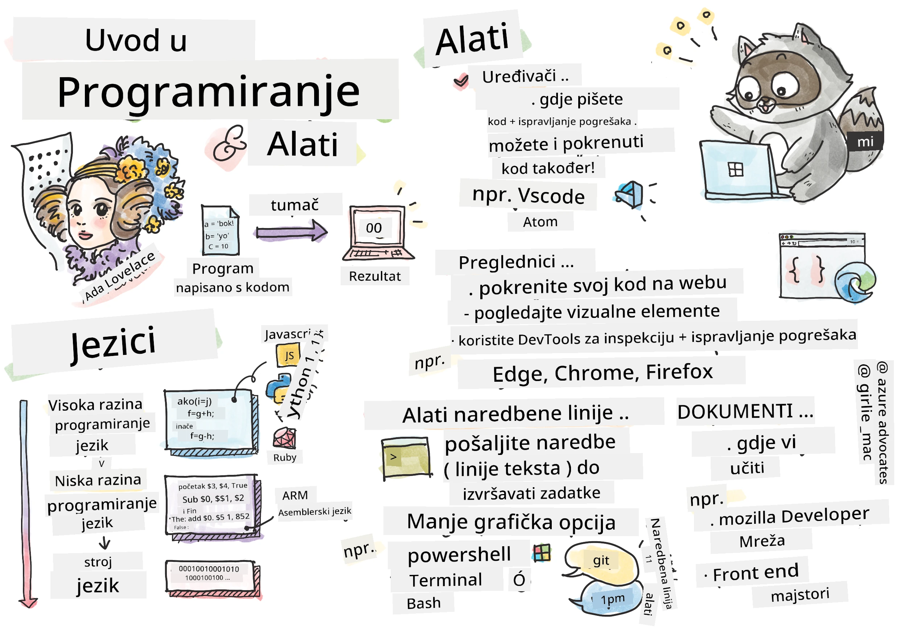
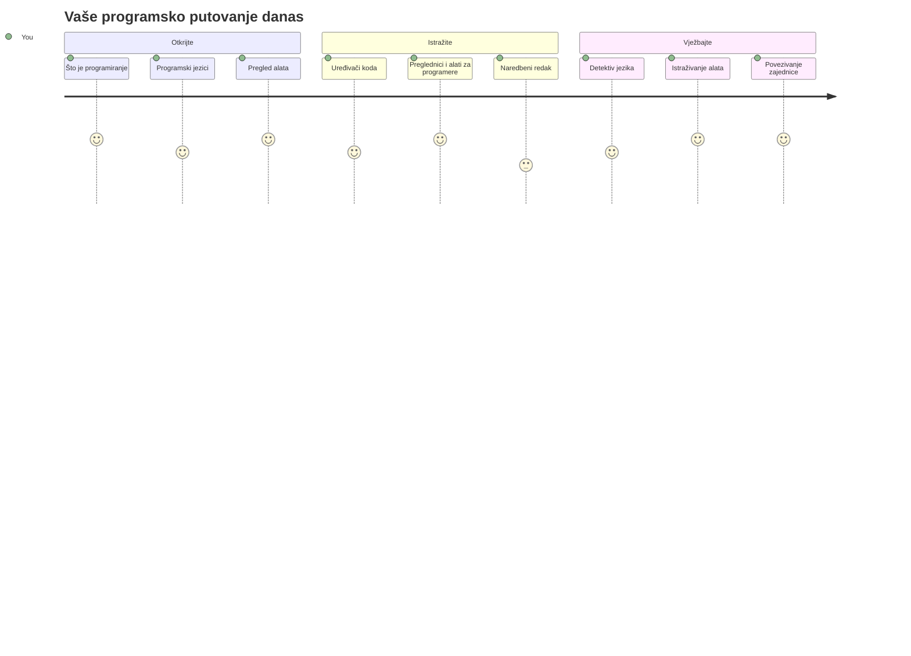
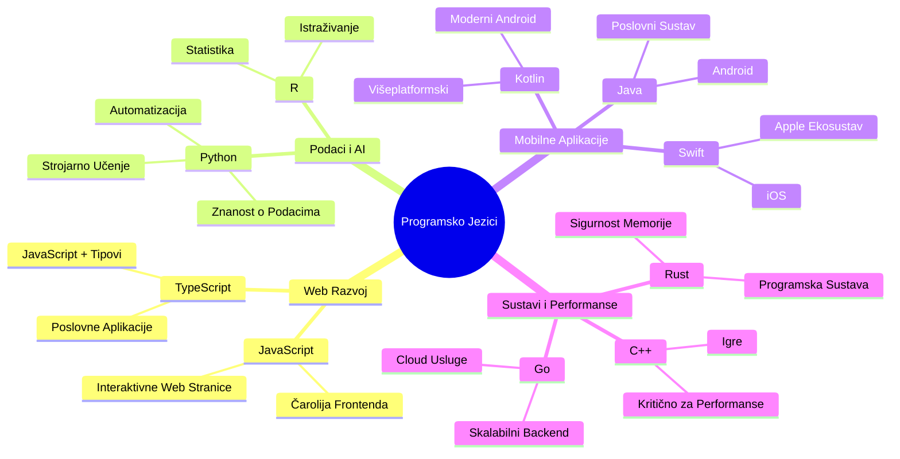
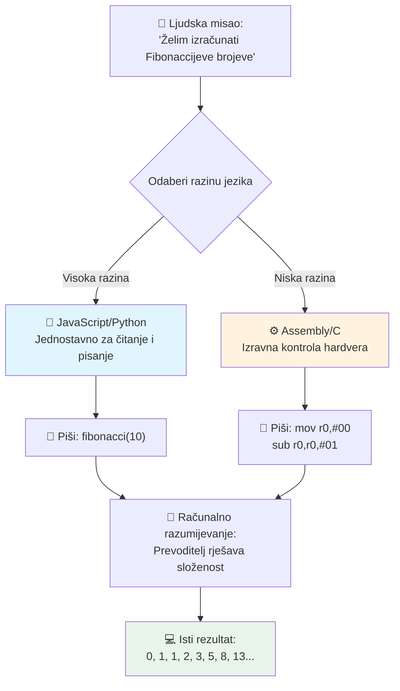
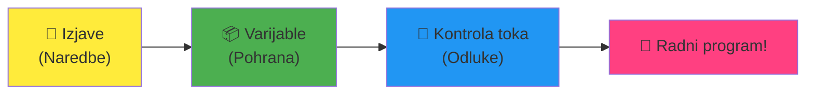
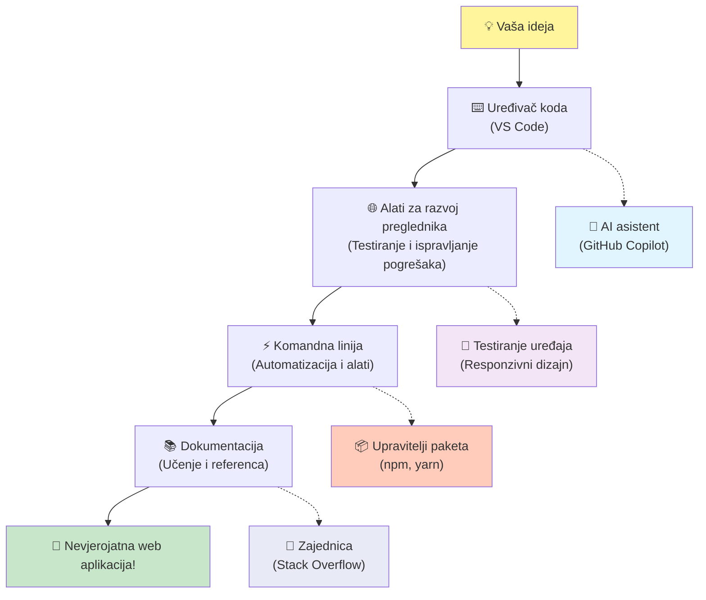
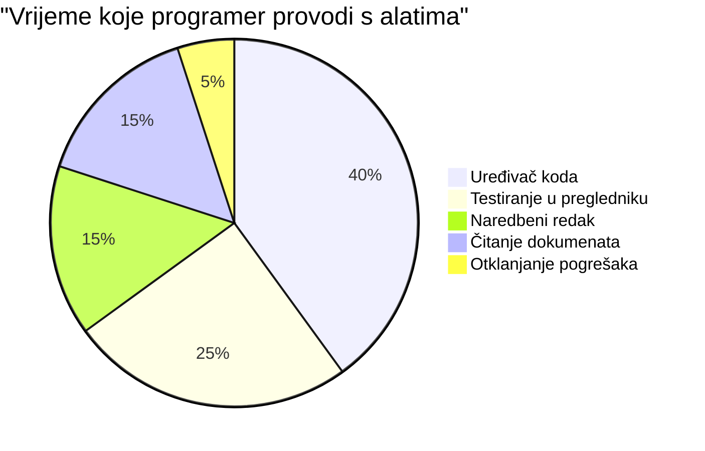
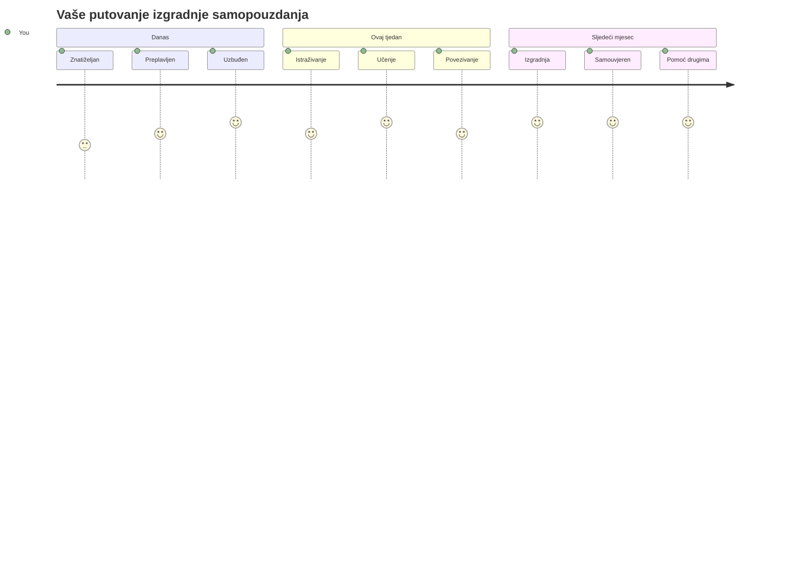

# Uvod u programske jezike i moderne razvojne alate

Bok, budući programeru! 👋 Mogu li ti reći nešto što me svaki dan iznova oduševi? Upravo ćeš otkriti da programiranje nije samo o računalima – to su zapravo supermoći kojima oživljavaš svoje najluđe ideje!

Znaš onaj trenutak kad koristiš svoju omiljenu aplikaciju i sve savršeno klikne? Kad pritisneš gumb i dogodi se nešto zaista čarobno što te natjera da kažeš "wow, kako su TO napravili?" Pa, netko baš poput tebe – vjerojatno sjedeći u svojoj omiljenoj kafiću u 2 ujutro s trećom kavom – napisao je kod koji je stvorio tu magiju. I evo što će ti razbit um: do kraja ovog sata nećeš samo shvatiti kako su to napravili, nego ćeš jedva čekati sam pokušati!

Gledaj, potpuno razumijem ako ti programiranje sada izgleda zastrašujuće. Kad sam ja počinjao, iskreno sam mislio da moraš biti neki matematički genij ili da kodiraš od pete godine. Ali evo što mi je u potpunosti promijenilo pogled na stvari: programiranje je točno kao učenje razgovora na novom jeziku. Počneš s "bok" i "hvala", onda se naučiš naručivati kavu, a prije nego što shvatiš, vodiš duboke filozofske razgovore! Samo što u ovom slučaju razgovaraš s računalima i, iskreno? Oni su najstrpljiviji sugovornici – nikad ne sude tvoje pogreške i uvijek s oduševljenjem pokušavaju ponovo!

Danas ćemo istražiti nevjerojatne alate koji čine moderni web razvoj ne samo mogućim, već ozbiljno zaraznim. Govorim o točno istim editorima, preglednicima i radnim procesima koje programeri u Netflixu, Spotifyju i tvojoj omiljenoj indie studio aplikaciji koriste svaki dan. I evo onog djelića koji će te učiniti sretnim: većina ovih profesionalnih, industrijskih alata je potpuno besplatna!


> Sketchnote autora [Tomomija Imure](https://twitter.com/girlie_mac)


```mermaid
journey
    title Vaše programsko putovanje danas
    section Otkrijte
      Što je programiranje: 5: You
      Programski jezici: 4: You
      Pregled alata: 5: You
    section Istražite
      Uređivači koda: 4: You
      Preglednici i alati za programere: 5: You
      Naredbeni redak: 3: You
    section Vježbajte
      Detektiv jezika: 4: You
      Istraživanje alata: 5: You
      Povezivanje zajednice: 5: You
```
## Pogledajmo što već znaš!

Prije nego uskočimo u zabavne stvari, zanima me – što već znaš o ovom programerskom svijetu? I slušaj, ako gledaš ova pitanja misleći "Doslovno nemam pojma o ničemu od ovoga," to nije samo u redu, to je savršeno! To znači da si na pravom mjestu. Razmišljaj o ovom kvizu kao o istezanju prije treninga – samo zagrijavamo te moždane mišiće!

[Odradi predsatni kviz](https://ff-quizzes.netlify.app/web/)


## Avantura u koju krećemo zajedno

Ok, iskreno sam presretan zbog onoga što ćemo danas istražiti! Stvarno, volio bih vidjeti tvoj izraz lica kad ti neki od ovih koncepata konačno kliknu. Evo nevjerojatnog putovanja koje ćemo zajedno proći:

- **Što je zapravo programiranje (i zašto je to najcool stvar ikad!)** – Otkrit ćemo kako je kod doslovno nevidljiva magija koja pokreće sve oko tebe, od onog alarma koji nekako zna da je ponedjeljak ujutro do algoritma koji savršeno kreira tvoje Netflix preporuke
- **Programsci jezici i njihove nevjerojatne osobnosti** – Zamisliti da uđeš na zabavu gdje svaki čovjek ima posve različite supermoći i načine rješavanja problema. Tako izgleda svijet programskih jezika i uživat ćeš u upoznavanju s njima!
- **Temeljni gradivni blokovi koji stvaraju digitalnu magiju** – Razmišljaj o njima kao o ultimativnom LEGO setu za kreativce. Kad shvatiš kako se ti dijelovi uklapaju, shvatit ćeš da doslovno možeš izgraditi bilo što što tvoja mašta zamisli
- **Profesionalni alati koji će te natjerati da se osjećaš kao da ti je netko dao čarobni štapić** – Nisam pretjerivao – ovi alati će te stvarno natjerati da se osjećaš kao da imaš supermoći, a najbolji dio? To su isti alati koje koriste profesionalci!

> 💡 **Evo jedna stvar**: Ne pokušavaj sve danas pamtiti! Sada samo želim da osjetiš taj plamen uzbuđenja oko svega što je moguće. Detalji će ti prirodno ostati dok zajedno vježbamo – to je pravi način učenja!

> Ovaj sat možeš odraditi i na [Microsoft Learn](https://learn.microsoft.com/en-us/learn/modules/web-development-101/introduction-programming/?WT.mc_id=academic-77807-sagibbon)!

## Pa što je točno *programiranje*?

Dobro, riješimo milijunsko pitanje: što je zapravo programiranje?

Dat ću ti jednu priču koja mi je u potpunosti promijenila pogled na ovo. Prošli tjedan pokušavao sam objasniti mami kako koristiti naš novi smart TV daljinski. Uhvatih se kako govorim stvari poput "Pritisni crveni gumb, ali ne veliki crveni gumb, mali crveni gumb lijevo... ne, tvoj drugi lijevi... ok, sad drži dvije sekunde, ne jednu, ne tri..." Zvuči poznato? 😅

To je programiranje! To je umjetnost davanja izuzetno detaljnih, korak-po-korak uputa nečemu što je vrlo moćno, ali mu se mora sve savršeno objasniti. Samo umjesto da objašnjavaš mami (koja može pitati "koji crveni gumb?"), objašnjavaš računalu (koje točno radi ono što mu kažeš, čak i ako ono što si rekao nije baš ono što si mislio).

Evo što me oduševilo kad sam ovo prvi put naučio: računala su zapravo prilično jednostavna u svojoj biti. Oni doslovno razumiju samo dvije stvari – 1 i 0, što je otprilike "da" i "ne" ili "uključeno" i "isključeno." To je to! Ali tu nastupa magija – ne moramo govoriti u 1-icama i 0-kama kao da smo u Matrici. Tu na scenu stupaju **programski jezici**. Oni su poput najboljeg prevoditelja na svijetu koji uzima tvoje sasvim normalne ljudske misli i pretvara ih u računalni jezik.

I evo što me i dalje svaki dan ujutro oduševljava: doslovno *sve* digitalno u tvom životu počelo je s nekim poput tebe, vjerojatno u pidžami s šalicom kave, tipkajući kod na svom laptopu. Taj Instagram filter koji te čini besprijekornom? Netko ga je kodirao. Preporuka zbog koje si otkrila novu omiljenu pjesmu? Programer je sastavio taj algoritam. Aplikacija koja ti pomaže podijeliti račun za večeru s prijateljima? Da, netko je pomislio "ovo je dosadno, sigurno mogu to popraviti" i... napravio je!

Kad naučiš programirati, ne samo da usvajaš novu vještinu – postaješ dio te nevjerojatne zajednice rješavatelja problema koji provode dane razmišljajući "Što ako mogu napraviti nešto što nekome uljepša dan, makar malo?" Iskreno, postoji li išta fora od toga?

✅ **Zabavna potraga za činjenicama**: Evo nešto super kul što možeš potražiti kad imaš slobodnu minutu – tko je, po tvom mišljenju, bio prvi računalni programer na svijetu? Dat ću ti nagovještaj: možda nije onaj koga očekuješ! Priča o toj osobi je potpuno fascinantna i pokazuje da je programiranje oduvijek bilo o kreativnom rješavanju problema i razmišljanju izvan okvira.

### 🧠 **Vrijeme za provjeru: Kako se osjećaš?**

**Posveti trenutak i razmisli:**
- Sad ti ima smisla ideja "davanja uputa računalima"?
- Možeš li smisliti neki svakodnevni zadatak koji bi želio/la automatizirati programiranjem?
- Koja pitanja ti se vrzmaju po glavi o svemu vezanom za programiranje?

> **Zapamti**: Normalno je ako ti neki koncepti sada djeluju zbunjujuće. Učenje programiranja je kao učenje novog jezika – treba vremena da tvoj mozak izgradi te neuronske puteve. Dobro ti ide!

## Programsci jezici su poput različitih vrsta magije

Ok, ovo će možda zvučati čudno, ali druži se sa mnom – programski jezici su kao različite vrste glazbe. Razmisli o tome: imaš jazz koji je gladak i improvizacijski, rock koji je snažan i izravan, klasiku koja je elegantna i strukturirana, te hip-hop koji je kreativan i izražajan. Svaki stil ima svoju vibru, svoje zajednice strastvenih obožavatelja i svaki je savršen za različita raspoloženja i prilike.

Programsci jezici funkcioniraju točno na isti način! Ne bi koristio isti jezik za izradu zabavne mobilne igre kakav bi koristio za analiziranje golemih količina klimatskih podataka, baš kao što ne bi puštao death metal na satu joge (pa, većina satova joge, u svakom slučaju! 😄).

Ali evo što me svaki put iznova oduševi kada o tome razmišljam: ovi jezici su poput najstrpljivijeg, briljantnog prevoditelja na svijetu koji sjedi pored tebe. Možeš izraziti svoje ideje na način koji je prirodan za tvoj ljudski mozak, a oni rješavaju sav nevjerojatno složen posao prevođenja toga u 1-ke i 0-ke koje računala zapravo razumiju. To je kao imati prijatelja koji je savršeno tečan u oba "ljudske kreativnosti" i "računalne logike" – i nikad nije umoran, nikad ne treba pauzu za kavu i nikad te ne osuđuje ako dva puta pitaš isto!

### Popularni programski jezici i njihove primjene


```mermaid
mindmap
  root((Programsko Jezici))
    Web Razvoj
      JavaScript
        Čarolija Frontenda
        Interaktivne Web Stranice
      TypeScript
        JavaScript + Tipovi
        Poslovne Aplikacije
    Podaci i AI
      Python
        Znanost o Podacima
        Strojarno Učenje
        Automatizacija
      R
        Statistika
        Istraživanje
    Mobilne Aplikacije
      Java
        Android
        Poslovni Sustav
      Swift
        iOS
        Apple Ekosustav
      Kotlin
        Moderni Android
        Višeplatformski
    Sustavi i Performanse
      C++
        Igre
        Kritično za Performanse
      Rust
        Sigurnost Memorije
        Programska Sustava
      Go
        Cloud Usluge
        Skalabilni Backend
```
| Jezik | Najbolji za | Zašto je popularan |
|----------|----------|------------------|
| **JavaScript** | Web razvoj, korisnička sučelja | Radi u preglednicima i pokreće interaktivne web stranice |
| **Python** | Znanost o podacima, automatizacija, umjetna inteligencija | Jednostavan za čitanje i učenje, moćne biblioteke |
| **Java** | Poslovne aplikacije, Android aplikacije | Neovisan o platformi, robustan za velike sustave |
| **C#** | Windows aplikacije, razvoj igara | Snažna podrška Microsoft ekosustava |
| **Go** | Cloud servisi, backend sustavi | Brz, jednostavan, dizajniran za modernu računalnu tehnologiju |

### Jezici visokog i niskog nivoa

Ok, ovo je iskreno bio koncept koji mi je srušio mozak kad sam počinjao, pa ću podijeliti analogiju koja mi je napokon sve objasnila – i stvarno se nadam da će i tebi pomoći!

Zamisli da si u zemlji gdje ne govoriš jezik i hitno ti trebaš naći najbliži WC (svi smo to doživjeli, zar ne? 😅):

- **Programiranje niskog nivoa** je kao da naučiš lokalni dijalekt toliko dobro da možeš razgovarati s bakom koja prodaje voće na uglu, koristeći kulturne reference, lokalni žargon i interne šale koje razumije samo netko tko je odrastao tamo. Super impresivno i nevjerojatno efikasno... ako si fluentan! Ali prilično zbunjujuće ako samo pokušavaš pronaći WC.

- **Programiranje visokog nivoa** je kao da imaš tog super lokalnog prijatelja koji te shvaća. Možeš reći "Stvarno mi treba WC" na običnom engleskom i on prevede sve kulturne faze i da ti upute koje savršeno razumije tvoj nemjesni mozak.

U terminima programiranja:
- **Jezici niskog nivoa** (kao Assembly ili C) ti daju mogućnost da imaš iznimno detaljne razgovore s stvarnim računalnim hardverom, ali moraš razmišljati kao stroj, što je... pa, recimo da je to veliki mentalni zaokret!
- **Jezici visokog nivoa** (kao JavaScript, Python ili C#) ti omogućuju da razmišljaš kao čovjek dok oni rješavaju sav strojni govor u pozadini. Plus, imaju ove iznimno dobrodošle zajednice punu ljudi koji se sjećaju kako je biti početnik i iskreno žele pomoći!

Pogodi koje ću ti preporučiti da počneš koristiti? 😉 Jezici visokog nivoa su kao pomoćne kotačiće na biciklu koje nikad zapravo ne želiš skinuti jer cijeli proces čine puno zabavnijim!


```mermaid
flowchart TB
    A["👤 Ljudska misao:<br/>'Želim izračunati Fibonaccijeve brojeve'"] --> B{Odaberi razinu jezika}
    
    B -->|Visoka razina| C["🌟 JavaScript/Python<br/>Jednostavno za čitanje i pisanje"]
    B -->|Niska razina| D["⚙️ Assembly/C<br/>Izravna kontrola hardvera"]
    
    C --> E["📝 Piši: fibonacci(10)"]
    D --> F["📝 Piši: mov r0,#00<br/>sub r0,r0,#01"]
    
    E --> G["🤖 Računalno razumijevanje:<br/>Prevoditelj rješava složenost"]
    F --> G
    
    G --> H["💻 Isti rezultat:<br/>0, 1, 1, 2, 3, 5, 8, 13..."]
    
    style C fill:#e1f5fe
    style D fill:#fff3e0
    style H fill:#e8f5e8
```
### Pokažimo zašto su jezici visokog nivoa toliko prijateljskiji

Ok, upravo ću ti pokazati nešto što savršeno ilustrira zašto sam se zaljubio u jezike visokog nivoa, ali prvo – obećaj mi nešto. Kad vidiš prvi kod, nemoj paničariti! Trebao bi izgledati teško. Točno to želim pokazati!

Pogledat ćemo isti zadatak napisan u dva potpuno različita stila. Oba stvaraju tzv. Fibonacci niz – to je prekrasan matematički uzorak gdje je svaki broj zbroj prethodna dva: 0, 1, 1, 2, 3, 5, 8, 13... (Zabavna činjenica: ovaj se uzorak doslovno pojavljuje svuda u prirodi – spirale suncokretovih sjemenki, uzorci češera, čak i način na koji galaksije nastaju!)

Spreman za vidjeti razliku? Idemo!

**Jezik visokog nivoa (JavaScript) – prilagođen ljudima:**

```javascript
// Korak 1: Osnovna postavka Fibonačijevog niza
const fibonacciCount = 10;
let current = 0;
let next = 1;

console.log('Fibonacci sequence:');
```

**Evo što ovaj kod radi:**
- **Deklarira** konstantu da odredi koliko Fibonacci brojeva želimo generirati
- **Inicijalizira** dvije varijable koje prate trenutni i sljedeći broj u nizu
- **Postavlja** početne vrijednosti (0 i 1) koje definiraju Fibonacci uzorak
- **Prikazuje** zaglavlje za identifikaciju našeg izlaza

```javascript
// Korak 2: Generirajte niz pomoću petlje
for (let i = 0; i < fibonacciCount; i++) {
  console.log(`Position ${i + 1}: ${current}`);
  
  // Izračunajte sljedeći broj u nizu
  const sum = current + next;
  current = next;
  next = sum;
}
```

**Razlaganje što se događa:**
- **Petlja** kroz svaku poziciju u našem nizu koristeći `for` petlju
- **Prikazuje** svaki broj s njegovom pozicijom koristeći template literal formatiranje
- **Računa** sljedeći Fibonacci broj zbrajanjem trenutne i sljedeće vrijednosti
- **Ažurira** varijable za praćenje kako bi prešao na sljedeću iteraciju

```javascript
// Korak 3: Moderan funkcionalni pristup
const generateFibonacci = (count) => {
  const sequence = [0, 1];
  
  for (let i = 2; i < count; i++) {
    sequence[i] = sequence[i - 1] + sequence[i - 2];
  }
  
  return sequence;
};

// Primjer korištenja
const fibSequence = generateFibonacci(10);
console.log(fibSequence);
```

**U gornjem primjeru smo:**
- **Napravili** ponovnu funkciju koristeći modernu sintaksu strelice  
- **Izgradili** polje za spremanje cijelog niza umjesto prikaza brojeva jedan po jedan  
- **Koristili** indeksiranje polja za izračunavanje svakog novog broja iz prethodnih  
- **Vratili** cijeli niz za fleksibilnu upotrebu u drugim dijelovima programa

**Jezik niskog nivoa (ARM Assembly) – prilagođen računalu:**

```assembly
 area ascen,code,readonly
 entry
 code32
 adr r0,thumb+1
 bx r0
 code16
thumb
 mov r0,#00
 sub r0,r0,#01
 mov r1,#01
 mov r4,#10
 ldr r2,=0x40000000
back add r0,r1
 str r0,[r2]
 add r2,#04
 mov r3,r0
 mov r0,r1
 mov r1,r3
 sub r4,#01
 cmp r4,#00
 bne back
 end
```

Primijeti kako verzija u JavaScriptu čita skoro kao upute na engleskom, dok verzija u Assemblyju koristi šifrirane naredbe koje izravno kontroliraju procesor računala. Oba obavljaju isti zadatak, ali je jezik visokog nivoa mnogo lakši za ljude da razumiju, pišu i održavaju.

**Ključne razlike koje ćeš primijetiti:**
- **Čitljivost**: JavaScript koristi opisna imena poput `fibonacciCount`, dok Assembly koristi šifrirane oznake poput `r0`, `r1`
- **Komentari**: Jezici višeg nivoa potiču objašnjavajuće komentare koji čine kod samodokumentirajućim
- **Struktura**: Logički tijek JavaScript-a odgovara načinu na koji ljudi razmišljaju o problemima korak po korak
- **Održavanje**: Ažuriranje JavaScript verzije za različite zahtjeve je jednostavno i jasno

✅ **O Fibonaccijevom nizu**: Ovaj apsolutno prekrasan obrasac brojeva (gdje je svaki broj jednak zbroju prethodna dva: 0, 1, 1, 2, 3, 5, 8...) pojavljuje se doslovno *posvuda* u prirodi! Pronaći ćete ga u spiralama suncokreta, obrascima češera, načinu na koji se uvijaju školjke nautilusa, pa čak i u načinu na koji grane drveća rastu. Nevjerojatno je kako nam matematika i kod mogu pomoći razumjeti i stvoriti obrasce koje priroda koristi za stvaranje ljepote!


## Građevni blokovi koji čine magiju

Dobro, sada kada ste vidjeli kako programski jezici izgledaju u akciji, razložimo osnovne dijelove koji čine doslovno svaki ikada napisan program. Razmislite o njima kao o osnovnim sastojcima vaše omiljene recepture – kad jednom razumijete što svaki radi, moći ćete čitati i pisati kod u gotovo bilo kojem jeziku!

Ovo je kao učenje gramatike programiranja. Sjećate se kad ste u školi učili o imenica, glagolima i kako slagati rečenice? Programiranje ima svoju vlastitu gramatiku, i iskreno, ona je puno logičnija i popustljivija nego što je ikad bila engleska gramatika! 😄

### Izjave: Upute korak po korak

Započnimo s **izjavama** – one su kao pojedinačne rečenice u razgovoru s vašim računalom. Svaka izjava kaže računalu da učini jednu specifičnu stvar, kao da dajete upute: "Skreni lijevo ovdje," "Stani na crveno svjetlo," "Parkiraj na tom mjestu."

Ono što volim kod izjava je koliko su obično čitljive. Pogledajte ovo:

```javascript
// Osnovne naredbe koje izvode pojedinačne radnje
const userName = "Alex";                    
console.log("Hello, world!");              
const sum = 5 + 3;                         
```

**Evo što ovaj kod radi:**
- **Deklarira** konstantnu varijablu za pohranu korisničkog imena
- **Prikazuje** pozdravnu poruku na konzoli
- **Izračunava** i pohranjuje rezultat matematičke operacije

```javascript
// Izjave koje komuniciraju s web stranicama
document.title = "My Awesome Website";      
document.body.style.backgroundColor = "lightblue";
```

**Korak po korak, evo što se događa:**
- **Mijenja** naslov web stranice koji se pojavljuje na kartici preglednika
- **Mijenja** boju pozadine cijelog tijela stranice

### Varijable: Memorijski sustav vašeg programa

Dobro, **varijable** su iskreno jedan od mojih najdražih pojmova za podučavanje jer su toliko slične stvarima koje svakodnevno koristite!

Razmislite o imeniku na vašem telefonu na trenutak. Ne pamtiš brojeve svih ljudi – umjesto toga, spremaš "Mama," "Najbolji prijatelj" ili "Pizzerija koja dostavlja do 2 ujutro" i tvoj telefon pamti prave brojeve. Varijable rade upravo na isti način! One su kao označeni spremnici gdje vaš program može pohraniti informacije i kasnije ih dohvatiti koristeći smisleno ime.

Evo što je stvarno cool: varijable se mogu mijenjati dok program radi (otuda i ime "varijabla" – vidite što su napravili?). Baš kao što biste mogli ažurirati kontakt pizzerije kada pronađete nešto još bolje, varijable se mogu mijenjati dok vaš program uči nove informacije ili dok se okolnosti mijenjaju!

Pogledajmo kako ovo može biti prekrasno jednostavno:

```javascript
// Korak 1: Kreiranje osnovnih varijabli
const siteName = "Weather Dashboard";        
let currentWeather = "sunny";               
let temperature = 75;                       
let isRaining = false;                      
```

**Razumijevanje ovih pojmova:**
- **Pohranjuj** nepromjenjive vrijednosti u `const` varijable (poput naziva stranice)
- **Koristi** `let` za vrijednosti koje se mogu mijenjati tijekom rada programa
- **Dodijeli** različite tipove podataka: stringove (tekst), brojeve i booleove (true/false)
- **Odaberi** opisna imena koja objašnjavaju što varijabla sadrži

```javascript
// Korak 2: Rad s objektima za grupiranje povezanih podataka
const weatherData = {                       
  location: "San Francisco",
  humidity: 65,
  windSpeed: 12
};
```

**U gornjem primjeru smo:**
- **Stvorili** objekt za grupiranje povezanih vremenskih podataka
- **Organizirali** više podataka pod jednim imenom varijable
- **Koristili** parove ključ-vrijednost za jasno označavanje informacija

```javascript
// Korak 3: Korištenje i ažuriranje varijabli
console.log(`${siteName}: Today is ${currentWeather} and ${temperature}°F`);
console.log(`Wind speed: ${weatherData.windSpeed} mph`);

// Ažuriranje promjenjivih varijabli
currentWeather = "cloudy";                  
temperature = 68;                          
```

**Razumimo svaki dio:**
- **Prikazi** informacije koristeći template literale s `${}` sintaksom
- **Pristupi** svojstvima objekta koristeći točkastu notaciju (`weatherData.windSpeed`)
- **Ažuriraj** varijable deklarirane s `let` kako bi prikazale promjene uvjeta
- **Kombiniraj** više varijabli za stvaranje smislenih poruka

```javascript
// Korak 4: Moderna destrukturacija za čišći kod
const { location, humidity } = weatherData; 
console.log(`${location} humidity: ${humidity}%`);
```

**Što morate znati:**
- **Izdvoji** specifična svojstva iz objekata koristeći destrukturiranje
- **Stvori** nove varijable automatski sa istim imenima kao ključevi objekta
- **Pojednostavi** kod izbjegavajući ponavljanje točaste notacije

### Kontrolni tijek: Poučavanje programa da razmišlja

Dobro, ovdje programiranje postaje zaista nevjerojatno! **Kontrolni tijek** je u osnovi podučavanje vašeg programa kako donositi pametne odluke, baš kao što to vi radite svaki dan, a da o tome ne razmišljate.

Zamislite ovo: jutros ste vjerojatno prošli nešto kao "Ako pada kiša, uzet ću kišobran. Ako je hladno, obucit ću jaknu. Ako kasnim, preskočit ću doručak i uzet ću kavu usput." Vaš mozak prirodno slijedi tu if-then logiku desetke puta dnevno!

Ovo je ono što programima daje osjećaj inteligencije i živosti umjesto da samo slijede neki dosadni, predvidljivi scenarij. Oni zapravo mogu pogledati situaciju, procijeniti što se događa i odgovoriti prikladno. Kao da vašem programu dajete mozak koji se može prilagoditi i donositi odluke!

Želite vidjeti kako ovo prekrasno funkcionira? Dopustite da vam pokažem:

```javascript
// Korak 1: Osnovna uvjetna logika
const userAge = 17;

if (userAge >= 18) {
  console.log("You can vote!");
} else {
  const yearsToWait = 18 - userAge;
  console.log(`You'll be able to vote in ${yearsToWait} year(s).`);
}
```

**Evo što ovaj kod radi:**
- **Provjerava** ispunjava li korisnik dobni zahtjev za glasanje
- **Izvršava** različite blokove koda na temelju rezultata uvjeta
- **Izračunava** i prikazuje koliko još treba do prihvatljivosti za glasanje ako je mlađi od 18
- **Pruža** specifičan i koristan odgovor za svaki scenarij

```javascript
// Korak 2: Više uvjeta s logičkim operatorima
const userAge = 17;
const hasPermission = true;

if (userAge >= 18 && hasPermission) {
  console.log("Access granted: You can enter the venue.");
} else if (userAge >= 16) {
  console.log("You need parent permission to enter.");
} else {
  console.log("Sorry, you must be at least 16 years old.");
}
```

**Raščlanjivanje što se događa:**
- **Kombinira** više uvjeta koristeći `&&` (i) operator
- **Stvara** hijerarhiju uvjeta koristeći `else if` za različite scenarije
- **Rješava** sve moguće slučajeve s konačnim `else`
- **Pruža** jasne, konkretne odgovore za svaku različitu situaciju

```javascript
// Korak 3: Sažet uvjet s ternarnim operatorom
const votingStatus = userAge >= 18 ? "Can vote" : "Cannot vote yet";
console.log(`Status: ${votingStatus}`);
```

**Što morate zapamtiti:**
- **Koristi** ternarni operator (`? :`) za jednostavne uvjete sa dvije opcije
- **Piši** prvo uvjet, zatim `?`, zatim istinit rezultat, zatim `:`, pa lažni rezultat
- **Primijeni** ovaj obrazac kad trebaš dodijeliti vrijednosti na temelju uvjeta

```javascript
// Korak 4: Rukovanje s više specifičnih slučajeva
const dayOfWeek = "Tuesday";

switch (dayOfWeek) {
  case "Monday":
  case "Tuesday":
  case "Wednesday":
  case "Thursday":
  case "Friday":
    console.log("It's a weekday - time to work!");
    break;
  case "Saturday":
  case "Sunday":
    console.log("It's the weekend - time to relax!");
    break;
  default:
    console.log("Invalid day of the week");
}
```

**Ovaj kod postiže sljedeće:**
- **Uspoređuje** vrijednost varijable s više specifičnih slučajeva
- **Grupira** slične slučajeve zajedno (radni dani naspram vikenda)
- **Izvršava** odgovarajući blok koda kad se pronađe podudaranje
- **Uključuje** `default` slučaj za neočekivane vrijednosti
- **Koristi** `break` izjave da spriječi izvođenje sljedećih slučajeva

> 💡 **Realna analogija**: Razmišljajte o kontrolnom tijeku kao o najstrpljivijem GPS-u na svijetu koji vam daje upute. Možda kaže „Ako je promet na Main Streetu, uzmi autocestu. Ako je gradilište blokira autocestu, pokušaj slikovitiju rutu.“ Programi koriste upravo takvu uvjetnu logiku da inteligentno odgovore na različite situacije i uvijek pruže korisnicima najbolje moguće iskustvo.

### 🎯 **Provjera pojmova: Ovladavanje građevnim blokovima**

**Pogledajmo kako vam ide s osnovama:**
- Možete li vlastitim riječima objasniti razliku između varijable i izjave?
- Razmislite o stvarnom scenariju gdje biste koristili if-then odluku (kao u našem primjeru s glasovanjem)
- Koja vam je jedna stvar o logici programiranja iznenadila?

**Brzi poticaj samopouzdanja:**

```mermaid
flowchart LR
    A["📝 Izjave<br/>(Naredbe)"] --> B["📦 Varijable<br/>(Pohrana)"] --> C["🔀 Kontrola toka<br/>(Odluke)"] --> D["🎉 Radni program!"]
    
    style A fill:#ffeb3b
    style B fill:#4caf50
    style C fill:#2196f3
    style D fill:#ff4081
```
✅ **Što slijedi**: Zabavit ćemo se istražujući dublje ove pojmove dok nastavljamo ovo nevjerojatno putovanje zajedno! Sad se samo usredotočite na uzbuđenje zbog svih nevjerojatnih mogućnosti koje su pred vama. Specifične vještine i tehnike će se prirodno usvojiti kako budemo zajedno vježbali – obećavam, ovo će biti puno zabavnije nego što možda očekujete!

## Alati zanata

Evo, iskreno, oduševljen sam i jedva se mogu suzdržati! 🚀 Upravo ćemo govoriti o nevjerojatnim alatima koji će vam dati osjećaj kao da ste upravo dobili ključeve digitalnog svemirskog broda.

Znate kako kuhar ima savršeno izbalansirane noževe koji mu se čine kao produžetak ruku? Ili kako glazbenik ima onaj jedan gitaru koja počne pjevati čim je dotakne? Pa, razvojni programeri imaju vlastitu verziju tih magičnih alata, i evo što će vam potpuno izbaciti mozak iz glave – većina njih je potpuno besplatna!

Doslovno skačem na stolici dok razmišljam o dijeljenju ovih alata s vama jer su u potpunosti revolucionirali način na koji gradimo softver. Govorimo o AI-pokretanim asistentima za kodiranje koji vam pomažu pisati kod (nisam ni šala!), oblak okruženjima gdje možete graditi cijele aplikacije doslovno s bilo kojeg mjesta s Wi-Fi-jem, te alatima za ispravljanje pogrešaka tako sofisticiranima da su kao rendgenski vid za vaše programe.

I evo dijela koji mi i dalje daje jezu: ovo nisu "alati za početnike" koje ćete prerasti. Ovo su isti profesionalni alati koje programeri u Googleu, Netflixu i onom indie studiju aplikacija koje volite koriste upravo sada. Osjećat ćete se kao pravi profesionalac koristeći ih!


```mermaid
graph TD
    A["💡 Vaša ideja"] --> B["⌨️ Uređivač koda<br/>(VS Code)"] 
    B --> C["🌐 Alati za razvoj preglednika<br/>(Testiranje i ispravljanje pogrešaka)"]
    C --> D["⚡ Komandna linija<br/>(Automatizacija i alati)"]
    D --> E["📚 Dokumentacija<br/>(Učenje i referenca)"]
    E --> F["🚀 Nevjerojatna web aplikacija!"]
    
    B -.-> G["🤖 AI asistent<br/>(GitHub Copilot)"]
    C -.-> H["📱 Testiranje uređaja<br/>(Responzivni dizajn)"]
    D -.-> I["📦 Upravitelji paketa<br/>(npm, yarn)"]
    E -.-> J["👥 Zajednica<br/>(Stack Overflow)"]
    
    style A fill:#fff59d
    style F fill:#c8e6c9
    style G fill:#e1f5fe
    style H fill:#f3e5f5
    style I fill:#ffccbc
    style J fill:#e8eaf6
```
### Uređivači koda i IDE-ovi: Vaši novi digitalni najbolji prijatelji

Razgovarajmo o uređivačima koda – oni će vam uskoro postati najdraža mjesta za druženje! Zamislite ih kao svoj osobni svetište za kodiranje gdje ćete provoditi većinu vremena stvarajući i usavršavajući svoje digitalne kreacije.

Ali evo što je apsolutno magično kod modernih uređivača: oni nisu samo pomodni uređivači teksta. Oni su poput najsjajnijeg, najpodršnijeg mentora za kodiranje koji sjedi pored vas 24/7. Uhvate vaše tipfelere prije nego što ih primijetite, predlažu poboljšanja koja vas čine genijalcem, pomažu vam razumjeti što svaka linija koda radi, a neki od njih čak mogu predvidjeti što ćete upisati i ponuditi da vam dovrše misao!

Sjećam se kad sam prvi put otkrio automatsko dovršavanje – doslovno sam se osjećao kao da živim u budućnosti. Počnete tipkati nešto, a uređivač kaže: "Hej, jesi li mislio na ovu funkciju koja radi upravo ono što trebaš?" Kao da imate čitača misli za kodnog prijatelja!

**Što ove uređivače čini tako nevjerojatnima?**

Moderne uređivače koda nude impresivan niz značajki dizajniranih za povećanje vaše produktivnosti:

| Značajka | Što radi | Zašto pomaže |
|---------|--------------|--------------|
| **Isticanje sintakse** | Boji različite dijelove vašeg koda | Olakšava čitanje i pronalaženje pogrešaka |
| **Automatsko dovršavanje** | Predlaže kod dok tipkate | Ubrzava kodiranje i smanjuje tipfelere |
| **Alati za ispravljanje pogrešaka** | Pomaže pronaći i popraviti greške | Štedi sate traženja problema |
| **Proširenja** | Dodaju specijalizirane funkcije | Prilagođavaju uređivač bilo kojoj tehnologiji |
| **AI asistenti** | Predlažu kod i objašnjenja | Ubrzavaju učenje i produktivnost |

> 🎥 **Video resurs**: Želite vidjeti ove alate u akciji? Pogledajte ovaj [Tools of the Trade video](https://youtube.com/watch?v=69WJeXGBdxg) za cjelovit pregled.

#### Preporučeni uređivači za web razvoj

**[Visual Studio Code](https://code.visualstudio.com/?WT.mc_id=academic-77807-sagibbon)** (Besplatno)
- Najpopularniji među web developerima
- Izvrsna ekstenzijska zajednica
- Ugrađeni terminal i Git integracija
- **Must-have ekstenzije**:
  - [GitHub Copilot](https://marketplace.visualstudio.com/items?itemName=GitHub.copilot) - AI-pokretane sugestije koda
  - [Live Share](https://marketplace.visualstudio.com/items?itemName=MS-vsliveshare.vsliveshare) - Suradnja u stvarnom vremenu
  - [Prettier](https://marketplace.visualstudio.com/items?itemName=esbenp.prettier-vscode) - Automatsko formatiranje koda
  - [Code Spell Checker](https://marketplace.visualstudio.com/items?itemName=streetsidesoftware.code-spell-checker) - Pronalaženje tipfelera u kodu

**[JetBrains WebStorm](https://www.jetbrains.com/webstorm/)** (Plaćeno, besplatno za studente)
- Napredni alati za ispravljanje grešaka i testiranje
- Inteligentno dovršavanje koda
- Ugrađeni sustav kontrole verzija

**IDE-ovi u oblaku** (Različite cijene)
- [GitHub Codespaces](https://github.com/features/codespaces) - Cijeli VS Code u pregledniku
- [Replit](https://replit.com/) - Izvrsno za učenje i dijeljenje koda
- [StackBlitz](https://stackblitz.com/) - Instantni razvoj full-stack web aplikacija

> 💡 **Savjet za početak**: Počnite s Visual Studio Code-om – besplatan je, široko korišten u industriji i ima ogromnu zajednicu koja stvara korisne tutorijale i proširenja.


### Web preglednici: Vaša tajna razvojna laboratorija

Dobro, pripremite se da vam se potpuno pomuti razum! Znate kako ste koristili preglednike za pregledavanje društvenih mreža i gledanje videa? Pa, ispostavilo se da su cijelo vrijeme skrivali ovu nevjerojatnu tajnu razvojnu laboratoriju, samo čekajući da je otkrijete!

Svaki put kad desnim klikom miša kliknete na web stranicu i odaberete "Inspect Element" (Ispitaj element), otvarate skriveni svijet razvojnih alata koji su iskreno moćniji od nekog skupog softvera za koji sam prije plaćao stotine dolara. Kao da otkrivate da je vaša obična kuhinja skrivala profesionalnu kuhinjsku laboratoriju iza tajnog panela!
Prvi put kad mi je netko pokazao DevTools u pregledniku, proveo sam oko tri sata samo klikajući i govoreći: "ČEKAJ, I TO MOŽE?!" Doslovno možeš uređivati bilo koju web stranicu u stvarnom vremenu, vidjeti točno koliko brzo se sve učitava, testirati kako tvoja stranica izgleda na različitim uređajima, pa čak i debugirati JavaScript kao pravi profesionalac. Apsolutno je zapanjujuće!

**Evo zašto su preglednici tvoja tajna moć:**

Kad stvaraš web stranicu ili web aplikaciju, trebaš vidjeti kako ona izgleda i ponaša se u stvarnom svijetu. Preglednici ne samo da prikazuju tvoj rad već pružaju detaljne povratne informacije o performansama, pristupačnosti i potencijalnim problemima.

#### Alati za razvoj u pregledniku (DevTools)

Moderni preglednici uključuju sveobuhvatne razvojne alate:

| Kategorija alata | Što radi | Primjer uporabe |
|------------------|----------|-----------------|
| **Preglednik elemenata** | Pregled i uređivanje HTML/CSS-a u stvarnom vremenu | Podešavanje stila s trenutnim rezultatima |
| **Konzola** | Pregled poruka o greškama i testiranje JavaScripta | Debugiranje problema i eksperimentiranje s kodom |
| **Mrežni monitor** | Praćenje učitavanja resursa | Optimizacija performansi i vremena učitavanja |
| **Provjera pristupačnosti** | Testiranje inkluzivnog dizajna | Osiguranje da stranica radi za sve korisnike |
| **Simulator uređaja** | Pregled na različitim veličinama zaslona | Testiranje responzivnog dizajna bez više uređaja |

#### Preporučeni preglednici za razvoj

- **[Chrome](https://developers.google.com/web/tools/chrome-devtools/)** - Standardni DevTools s opsežnom dokumentacijom
- **[Firefox](https://developer.mozilla.org/docs/Tools)** - Izvrsni alati za CSS Grid i pristupačnost
- **[Edge](https://docs.microsoft.com/microsoft-edge/devtools-guide-chromium/?WT.mc_id=academic-77807-sagibbon)** - Baziran na Chromiumu s Microsoftovim razvojnim resursima

> ⚠️ **Važan savjet za testiranje**: Uvijek testiraj svoje web stranice u više preglednika! Ono što savršeno radi u Chromeu možda izgleda drugačije u Safariju ili Firefoxu. Profesionalni developeri testiraju kroz sve glavne preglednike kako bi osigurali konzistentno korisničko iskustvo.

### Alati naredbenog retka: tvoj ulaz u supermoći developera

Dobro, budimo potpuno iskreni oko naredbenog retka, jer želim da ovo čuješ od nekoga tko to zaista razumije. Kad sam ga prvi put vidio – samo ovaj zastrašujući crni ekran s bljeskajućim tekstom – doslovno sam mislio: "Ne, apsolutno ne! Ovo izgleda kao nešto iz hakera 80-ih, a ja definitivno nisam dovoljno pametan za ovo!" 😅

Ali evo što bih volio da mi je netko tada rekao, a što sada tebi govorim: naredbeni redak nije zastrašujuć – on je zapravo kao izravan razgovor s tvojim računalom. Zamislite ga kao razliku između naručivanja hrane preko složene aplikacije s fotografijama i jelovnicima (što je lijepo i jednostavno) i ulaska u omiljeni lokalni restoran gdje kuhar točno zna što voliš i može skuhati nešto savršeno samo ako kažeš "iznenadi me s nečim fantastičnim".

Naredbeni redak je mjesto gdje developeri postaju apsolutni čarobnjaci. Upišeš nekoliko naizgled čarobnih riječi (dobro, to su samo naredbe, ali zvuče kao čarolija!), pritisneš enter i BOOM – kreirao si cijelu strukturu projekta, instalirao moćne alate iz cijelog svijeta ili objavio svoju aplikaciju na internetu da je milijuni ljudi vide. Kad jednom osjetiš tu moć, stvarno postaje zarazno!

**Zašto će ti naredbeni redak postati omiljeni alat:**

Iako su grafička sučelja odlična za mnoge zadatke, naredbeni redak briljira u automatizaciji, preciznosti i brzini. Mnogi razvojni alati rade uglavnom preko naredbenog retka, a učenje učinkovitog korištenja može dramatično poboljšati tvoju produktivnost.

```bash
# Korak 1: Kreirajte i pridružite se direktoriju projekta
mkdir my-awesome-website
cd my-awesome-website
```

**Ovo radi ovaj kod:**
- **Kreira** novi direktorij pod nazivom "my-awesome-website" za tvoj projekt
- **Ulazi** u novo kreirani direktorij kako bi započeo s radom

```bash
# Korak 2: Inicijalizirajte projekt s package.json
npm init -y

# Instalirajte moderne razvojne alate
npm install --save-dev vite prettier eslint
npm install --save-dev @eslint/js
```

**Korak po korak, evo što se događa:**
- **Inicijalizira** novi Node.js projekt s default postavkama pomoću `npm init -y`
- **Instalira** Vite kao moderan alat za brzu izradu i produkcijske buildove
- **Dodaje** Prettier za automatsko formatiranje koda i ESLint za provjere kvalitete koda
- **Koristi** `--save-dev` flag za označavanje ovih paketa kao razvojnih ovisnosti

```bash
# Korak 3: Kreirajte strukturu projekta i datoteke
mkdir src assets
echo '<!DOCTYPE html><html><head><title>My Site</title></head><body><h1>Hello World</h1></body></html>' > index.html

# Pokrenite razvojni poslužitelj
npx vite
```

**Iz navedenog smo:**
- **Organizirali** projekt stvaranjem zasebnih mapa za izvorni kod i resurse
- **Generirali** osnovnu HTML datoteku s pravilnom strukturom dokumenta
- **Pokrenuli** Vite razvojni server za live reload i hot module replacement

#### Ključni alati naredbenog retka za web razvoj

| Alat | Svrha | Zašto ti treba |
|------|-------|----------------|
| **[Git](https://git-scm.com/)** | Kontrola verzija | Praćenje promjena, suradnja, backup rada |
| **[Node.js & npm](https://nodejs.org/)** | JavaScript runtime & upravljanje paketima | Pokretanje JavaScripta izvan preglednika, instalacija modernih razvojnih alata |
| **[Vite](https://vitejs.dev/)** | Alat za build i razvojni server | Ultra brz razvoj s hot module replacementom |
| **[ESLint](https://eslint.org/)** | Kvaliteta koda | Automatsko pronalaženje i ispravljanje problema u JavaScriptu |
| **[Prettier](https://prettier.io/)** | Formatiranje koda | Održavanje dosljednog i čitljivog formata koda |

#### Opcije specifične za platformu

**Windows:**
- **[Windows Terminal](https://docs.microsoft.com/windows/terminal/?WT.mc_id=academic-77807-sagibbon)** - Moderan terminal s puno mogućnosti
- **[PowerShell](https://docs.microsoft.com/powershell/?WT.mc_id=academic-77807-sagibbon)** 💻 - Moćno skriptno okruženje
- **[Command Prompt](https://learn.microsoft.com/windows-server/administration/windows-commands/windows-commands)** 💻 - Tradicionalni Windows naredbeni redak

**macOS:**
- **[Terminal](https://support.apple.com/guide/terminal/)** 💻 - Ugrađena terminal aplikacija
- **[iTerm2](https://iterm2.com/)** - Poboljšani terminal s naprednim značajkama

**Linux:**
- **[Bash](https://www.gnu.org/software/bash/)** 💻 - Standardni Linux shell
- **[KDE Konsole](https://docs.kde.org/trunk5/en/konsole/konsole/index.html)** - Napredni terminal emulator

> 💻 = unaprijed instalirano u operativnom sustavu

> 🎯 **Put učenja**: Počni s osnovnim naredbama poput `cd` (promjena direktorija), `ls` ili `dir` (popis datoteka) i `mkdir` (kreiraj mapu). Vježbaj s modernim naredbama poput `npm install`, `git status` i `code .` (otvara trenutni direktorij u VS Code). Kad se osjetiš ugodnije, prirodno ćeš usvojiti naprednije naredbe i tehnike automatizacije.

### Dokumentacija: tvoj uvijek dostupan mentor za učenje

Ok, evo jedne male tajne koja će ti pomoći da se osjećaš puno bolje kao početnik: čak i najiskusniji developeri ogroman dio svog vremena provode čitajući dokumentaciju. I to nije zato što ne znaju što rade – zapravo je znak mudrosti!

Razmišljaj o dokumentaciji kao o pristupu najstrpljivijim, najstručnijim učiteljima na svijetu koji su dostupni 24/7. Zapneš na problem u 2 ujutro? Dokumentacija je tamo s toplim virtualnim zagrljajem i točno odgovorom koji trebaš. Želiš naučiti o nekoj novoj zanimljivoj značajci o kojoj svi pričaju? Dokumentacija je tu s primjerima korak po korak. Pokušavaš razumjeti zašto nešto radi onako kako radiš? Pogodi što – dokumentacija će ti to objasniti na način koji će ti konačno kliknuti!

Evo nešto što mi je potpuno promijenilo pogled na stvari: svijet web razvoja se nevjerojatno brzo mijenja i nitko (doslovno nitko!) ne pamti sve napamet. Gledao sam seniore s 15+ godina iskustva kako gledaju osnovnu sintaksu, i znaš što? To nije sramotno – to je pametno! Ne radi se o savršenom pamćenju, nego o znanju gdje brzo pronaći pouzdane odgovore i kako ih primijeniti.

**Evo gdje se događa prava magija:**

Profesionalni developeri veliki dio svog vremena provode čitajući dokumentaciju – ne zato što ne znaju, nego zato što se svijet web razvoja toliko brzo mijenja da je stalno učenje nužno. Dobra dokumentacija ti pomaže razumjeti ne samo *kako* nešto koristiti, nego *zašto* i *kada* to koristiti.

#### Bitni izvori dokumentacije

**[Mozilla Developer Network (MDN)](https://developer.mozilla.org/docs/Web)**
- Zlato standard za web tehnologije
- Sveobuhvatni vodiči za HTML, CSS i JavaScript
- Uključuje informacije o kompatibilnosti preglednika
- Sadrži praktične primjere i interaktivne demo-e

**[Web.dev](https://web.dev)** (od Googlea)
- Najbolje prakse modernog web razvoja
- Vodiči za optimizaciju performansi
- Pristupačnost i principi inkluzivnog dizajna
- Studije slučaja iz stvarnih projekata

**[Microsoft Developer Documentation](https://docs.microsoft.com/microsoft-edge/#microsoft-edge-for-developers)**
- Resursi za razvoj u Edge pregledniku
- Vodiči za progresivne web aplikacije
- Uvidi u razvoj za različite platforme

**[Frontend Masters Learning Paths](https://frontendmasters.com/learn/)**
- Strukturirani kurikulumi učenja
- Video tečajevi od stručnjaka iz industrije
- Praktične vježbe kodiranja

> 📚 **Strategija učenja**: Nemoj pokušavati memorirati dokumentaciju – umjesto toga, nauči kako je efikasno pretraživati. Spremi često korištene reference u bookmarke i vježbaj upotrebu tražilica za brzi pronalazak specifičnih informacija.

### 🔧 **Provjera majstorstva alata: Što te najviše zanima?**

**Odvoji trenutak da razmisliš:**
- Koji alat jedva čekaš isprobati prvi? (Nema pogrešnog odgovora!)
- Je li ti naredbeni redak i dalje zastrašujuć ili si sada znatiželjan?
- Možeš li zamisliti korištenje DevTools u pregledniku za zavirivanje iza kulisa svojih omiljenih web stranica?


```mermaid
pie title "Vrijeme koje programer provodi s alatima"
    "Uređivač koda" : 40
    "Testiranje u pregledniku" : 25
    "Naredbeni redak" : 15
    "Čitanje dokumenata" : 15
    "Otklanjanje pogrešaka" : 5
```
> **Zanimljiva spoznaja**: Većina developera provede oko 40% vremena u svom ureñivaču koda, ali primjeti koliko vremena ide na testiranje, učenje i rješavanje problema. Programiranje nije samo pisanje koda – to je stvaranje iskustava!

✅ **Razmisli o ovome**: Evo jedne zanimljive misli – kako misliš da se alati za izradu web stranica (razvoj) razlikuju od alata za dizajniranje njihovog izgleda (dizajn)? To je kao razlika između arhitekta koji dizajnira prelijepu kuću i izvođača koji je zapravo gradi. Oba su ključna, ali trebaju različite alate! Ovako razmišljanje će ti stvarno pomoći vidjeti širu sliku kako web stranice oživljavaju.

## Izazov GitHub Copilot Agenta 🚀

Koristi Agent način rada da dovršiš sljedeći izazov:

**Opis:** Istraži mogućnosti modernog uređivača koda ili IDE-a i pokaži kako može poboljšati tvoj radni proces kao web developera.

**Zadatak:** Izaberi uređivač koda ili IDE (npr. Visual Studio Code, WebStorm ili cloud-based IDE). Nabroji tri značajke ili ekstenzije koje ti pomažu pisati, debugirati ili održavati kod učinkovitije. Za svaku daj kratko objašnjenje kako poboljšava tvoj radni tijek.

---

## 🚀 Izazov

**Dakle, detektive, jesi li spreman za svoj prvi slučaj?**

Sad kad imaš ovu fantastičnu osnovu, pripremio sam avanturu koja će ti pomoći vidjeti koliko je programerski svijet zaista raznolik i fascinantan. I slušaj – ovo nije o pisanju koda još, pa bez pritiska! Zamislite sebe kao detektiva programskih jezika na uzbudljivom prvom slučaju!

**Tvoja misija, ako je prihvatiš:**
1. **Postani istraživač jezika**: Izaberi tri programska jezika iz potpuno različitih svjetova – možda jedan za web, jedan za mobilne aplikacije i jedan za znanost i podatke. Pronađi primjere iste jednostavne zadaće napisane u svakom jeziku. Obećajem da ćeš biti zapanjen koliko različito mogu izgledati dok rade isto!

2. **Otkrij njihove priče o nastanku**: Što svaki jezik čini posebnim? Evo kul činjenice – svaki programski jezik nastao je jer je netko mislio: "Znaš što? Mora postojati bolji način za rješavanje ovog problema." Možeš li otkriti koje su to bile potrebe? Neke od tih priča su zaista fascinantne!

3. **Upoznaj zajednice**: Pogledaj koliko su svaka zajednica jezika gostoljubiva i strastvena. Neke imaju milijune developera koji dijele znanje i pomažu jedni drugima, dok su druge manje, ali izuzetno povezane i podržavajuće. Voljet ćeš vidjeti različite "ličnosti" koje zajednice imaju!

4. **Prati svoj instinkt**: Koji ti jezik trenutno najviše "leži"? Ne brini o savršenom izboru – jednostavno slušaj svoj osjećaj! Ovdje nema pogrešnog odgovora i uvijek možeš kasnije istražiti druge.

**Bonus detektivski zadatak**: Pokušaj saznati koje velike web stranice ili aplikacije koriste svaki od tih jezika. Garantiram ti da će te iznenaditi što pokreće Instagram, Netflix ili onu mobilnu igru koju ne možeš prestati igrati!

> 💡 **Zapamti**: Ne pokušavaš danas postati stručnjak ni u jednom od tih jezika. Samo upoznaješ "kvart" prije nego što odlučiš gdje ćeš se nastaniti. Uzmi si vremena, zabavi se i pusti znatiželju da te vodi!

## Proslavimo što si otkrio!

Vau, upio si toliko nevjerojatnih informacija danas! Stvarno sam uzbuđen vidjeti koliko ti je ovog čudesnog putovanja ostalo u sjećanju. I sjeti se – ovo nije test u kojem moraš sve savršeno znati. Ovo je više kao proslava svega zabavnog što si naučio o ovom fascinantnom svijetu u koji ćeš uskoro zakoračiti!

[Pogledaj kviz nakon lekcije](https://ff-quizzes.netlify.app/web/)

## Pregled i samostalno učenje

**Uzmi si vremena za istraživanje i zabavu!**
Obuhvatili ste puno toga danas, i to je nešto na što trebate biti ponosni! Sada dolazi zabavni dio – istraživanje tema koje su probudile vašu znatiželju. Sjetite se, ovo nije domaća zadaća – ovo je avantura!

**Zaronite dublje u ono što vas zanima:**

**Isprobajte programske jezike praktično:**
- Posjetite službene web stranice 2-3 jezika koji su vam zapeli za oko. Svaki ima svoju osobnost i priču!
- Isprobajte neke online alate za kodiranje poput [CodePen](https://codepen.io/), [JSFiddle](https://jsfiddle.net/), ili [Replit](https://replit.com/). Ne bojte se eksperimentirati – ne možete ništa pokvariti!
- Pročitajte kako je vaš omiljeni jezik nastao. Ozbiljno, neke od tih priča o nastanku su fascinantne i pomoći će vam shvatiti zašto jezici funkcioniraju onako kako funkcioniraju.

**Upoznajte se sa svojim novim alatima:**
- Preuzmite Visual Studio Code ako ga još nemate – besplatan je i sigurno će vam se svidjeti!
- Provedite nekoliko minuta pregledavajući Marketplace dodataka. To je poput trgovine aplikacijama za vaš uređivač koda!
- Otvorite alati za razvoj u svom pregledniku i slobodno klikajte. Ne brinite ako sve ne razumijete – samo se upoznajte s onim što je dostupno.

**Pridružite se zajednici:**
- Pratite neke zajednice programera na [Dev.to](https://dev.to/), [Stack Overflow](https://stackoverflow.com/), ili [GitHub](https://github.com/). Programerska zajednica je izuzetno gostoljubiva prema početnicima!
- Pogledajte neke videozapise za početnike na YouTubeu. Postoji toliko sjajnih kreatora koji se sjećaju kako je to počinjati.
- Razmislite o pridruživanju lokalnim meetupovima ili online zajednicama. Vjerujte mi, programeri vole pomagati novajlijama!

> 🎯 **Slušajte, želim da zapamtite ovo**: Ne očekuje se od vas da preko noći postanete čarobnjak za kodiranje! Sada se tek upoznajete s ovim nevjerojatnim novim svijetom kojem ćete pripadati. Uzmite si vremena, uživajte u putovanju i sjetite se – svaki programer kojeg cijenite jednom je sjedio točno tamo gdje ste vi sada, osjećajući uzbuđenje i možda malo preplavljenosti. To je potpuno normalno i znak je da radite kako treba!


## Zadatak

[Reading the Docs](assignment.md)

> 💡 **Mali poticaj za vaš zadatak**: Jako bih volio vidjeti kako istražujete neke alate koje još nismo obradili! Preskočite uređivače, preglednike i alate naredbenog retka o kojima smo već razgovarali – postoji cijeli nevjerojatan svemir sjajnih razvojnih alata koji samo čekaju da ih otkrijete. Pronađite one koji se aktivno održavaju i imaju živahne, korisne zajednice (oni obično imaju najbolje tutorijale i najpodržavajuće ljude kad se neizbježno zaglavite i trebate prijateljsku ruku).

---

## 🚀 Vaš vremenski plan programerskog putovanja

### ⚡ **Što možete napraviti u sljedećih 5 minuta**
- [ ] Označiti 2-3 web stranice programskih jezika koje su vam zapela za oko
- [ ] Preuzeti Visual Studio Code ako ga još niste instalirali
- [ ] Otvoriti DevTools u pregledniku (F12) i kliknuti po bilo kojoj web stranici
- [ ] Pridružiti se jednoj programerskoj zajednici (Dev.to, Reddit r/webdev ili Stack Overflow)

### ⏰ **Što možete postići u sljedećem satu**
- [ ] Završiti kviz nakon lekcije i razmisliti o svojim odgovorima
- [ ] Postaviti VS Code s GitHub Copilot ekstenzijom
- [ ] Isprobati "Hello World" primjer u 2 različita programska jezika online
- [ ] Pogledati video "Dan u životu programera" na YouTubeu
- [ ] Započeti detektivski posao istraživanja programskog jezika (prema izazovu)

### 📅 **Vaša tjedna avantura**
- [ ] Završiti zadatak i istražiti 3 nova razvojna alata
- [ ] Pratiti 5 programera ili razvojnih računa na društvenim mrežama
- [ ] Pokušati napraviti nešto malo u CodePenu ili Replitu (čak i samo "Hello, [Vaše ime]!")
- [ ] Pročitati jedan blog post programera o nečijem putovanju kroz kodiranje
- [ ] Pridružiti se virtualnom meetup-u ili pogledati predavanje o programiranju
- [ ] Započeti učenje svog odabranog jezika putem online tutorijala

### 🗓️ **Vaša mjesečna transformacija**
- [ ] Izgraditi svoj prvi mali projekt (čak i jednostavna web stranica vrijedi!)
- [ ] Doprinijeti open-source projektu (počnite s ispravcima dokumentacije)
- [ ] Mentorirati nekoga tko tek počinje s programiranjem
- [ ] Napraviti svoju web stranicu portfelja programera
- [ ] Povezati se s lokalnim programerskim zajednicama ili grupama za učenje
- [ ] Početi planirati svoj sljedeći ciljani cilj učenja

### 🎯 **Završni pregled refleksije**

**Prije nego što nastavite, odvojite trenutak za slavlje:**
- Što vas je danas najviše uzbudilo u programiranju?
- Koji alat ili koncept želite istražiti prvo?
- Kako se osjećate povodom početka ovog programerskog putovanja?
- Koje pitanje biste sada postavili nekom programeru?


```mermaid
journey
    title Vaše putovanje izgradnje samopouzdanja
    section Danas
      Znatiželjan: 3: You
      Preplavljen: 4: You
      Uzbuđen: 5: You
    section Ovaj tjedan
      Istraživanje: 4: You
      Učenje: 5: You
      Povezivanje: 4: You
    section Sljedeći mjesec
      Izgradnja: 5: You
      Samouvjeren: 5: You
      Pomoć drugima: 5: You
```
> 🌟 **Zapamtite**: Svaki stručnjak je jednom bio početnik. Svaki senior developer se jednom osjećao točno kao vi sada – uzbuđeno, možda malo preplavljeno i definitivno znatiželjno o onome što je moguće. U izvrsnom ste društvu, i ovo putovanje će biti nevjerojatno. Dobrodošli u prekrasan svijet programiranja! 🎉

---

<!-- CO-OP TRANSLATOR DISCLAIMER START -->
**Izjava o odricanju odgovornosti**:  
Ovaj dokument preveden je pomoću AI prevoditeljskog servisa [Co-op Translator](https://github.com/Azure/co-op-translator). Iako težimo točnosti, imajte na umu da automatski prijevodi mogu sadržavati pogreške ili netočnosti. Izvorni dokument na njegovom izvornom jeziku treba smatrati službenim izvorom. Za ključne informacije preporučuje se profesionalni ljudski prijevod. Nismo odgovorni za bilo kakve nesporazume ili kriva tumačenja koja proizlaze iz korištenja ovog prijevoda.
<!-- CO-OP TRANSLATOR DISCLAIMER END -->