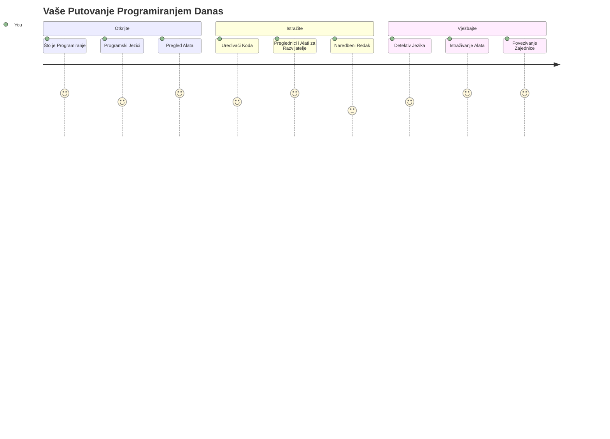
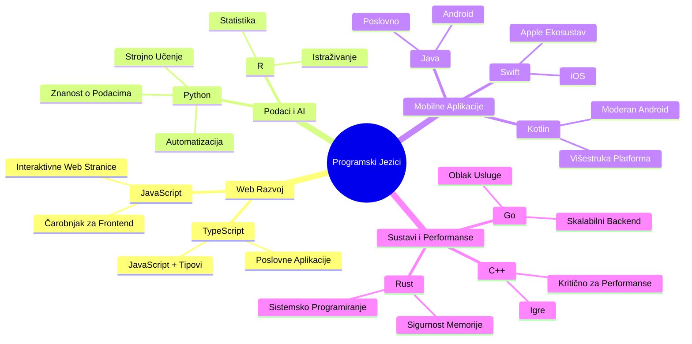
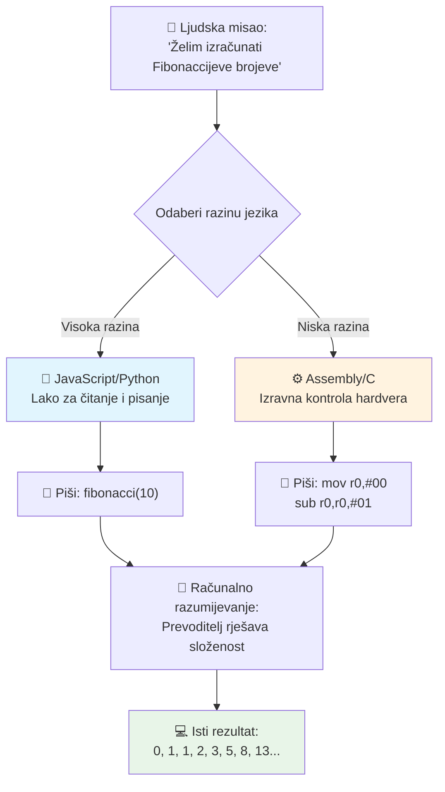
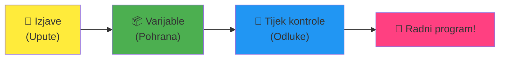
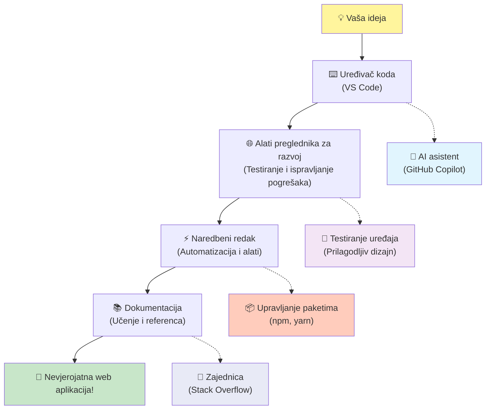
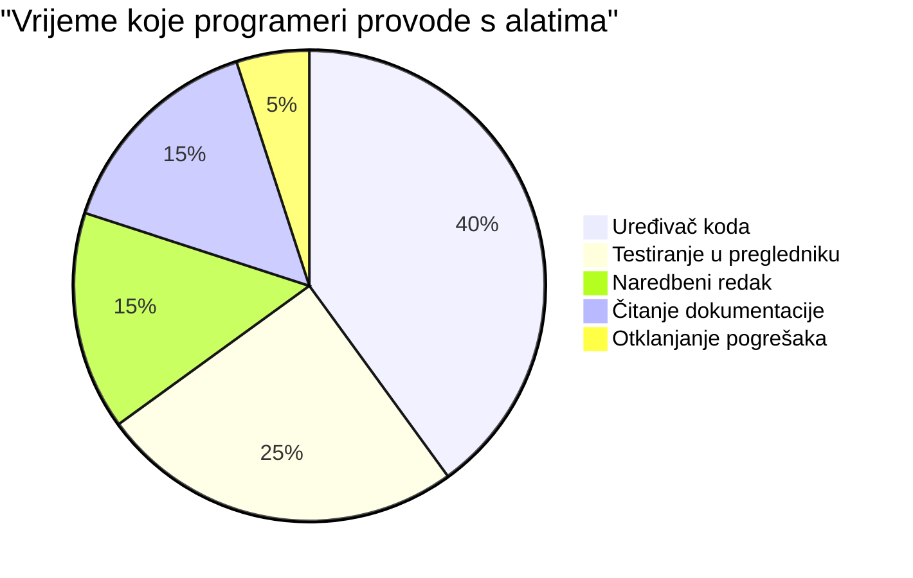

# Uvod u programske jezike i moderne razvojne alate
 
Hej, budući developere! 👋 Mogu li ti reći nešto što mi i dalje izaziva trnce svaki dan? Upravo ćeš otkriti da programiranje nije samo o računalima – radi se o pravim supermoćima kojima možeš ostvariti svoje najluđe ideje!

Znaš onaj trenutak kad koristiš svoju omiljenu aplikaciju i sve se savršeno složi? Kad klikneš na gumb i dogodi se nešto čarobno što te natjera da pomisliš "vau, kako su TO napravili?" Pa, netko baš poput tebe – vjerojatno sjedi u svojoj omiljenoj kafiću u 2 ujutro s trećom espresom – napisao je kod koji je stvorio tu čaroliju. I evo što će te oduševiti: na kraju ove lekcije ne samo da ćeš razumjeti kako su to napravili, već ćeš i sam jedva čekati da probaš!

Pogledaj, u potpunosti razumijem ako ti programiranje sada djeluje zastrašujuće. Kad sam ja počinjao, iskreno sam mislio da moraš biti neki matematički genije ili da kodiraš od pete godine. Ali ovo je ono što mi je sasvim promijenilo pogled: programiranje je točno kao učenje razgovora na novom jeziku. Počneš s "bok" i "hvala", zatim naručuješ kavu, a prije nego što znaš, vodiš duboke filozofske razgovore! Samo što u ovom slučaju razgovaraš s računalima, i iskreno? Oni su najstrpljiviji sugovornici koje ćeš ikada imati – nikad ne osuđuju tvoje pogreške i uvijek su spremni pokušati ponovno!

Danas ćemo istražiti nevjerojatne alate koji moderni razvoj weba čine ne samo mogućim, već i ozbiljno zaraznim. Govorim o istim onim uređivačima, preglednicima i radnim procesima koje developeri u Netflixu, Spotifyju i omiljenom neovisnom studiju koriste svaki dan. A evo što će te dodatno razveseliti: većina ovih profesionalnih, industrijskih alata potpuno je besplatna!


> Sketchnote autora [Tomomi Imura](https://twitter.com/girlie_mac)


```mermaid
journey
    title Vaše Putovanje Programiranjem Danas
    section Otkrijte
      Što je Programiranje: 5: You
      Programski Jezici: 4: You
      Pregled Alata: 5: You
    section Istražite
      Uređivači Koda: 4: You
      Preglednici i Alati za Razvijatelje: 5: You
      Naredbeni Redak: 3: You
    section Vježbajte
      Detektiv Jezika: 4: You
      Istraživanje Alata: 5: You
      Povezivanje Zajednice: 5: You
```
## Vidimo što već znaš!

Prije nego skočimo u zabavne stvari, zanimljivo me što već znaš o ovom programerskom svijetu? I slušaj, ako gledaš ova pitanja i misliš "Doslovno nemam pojma o ničemu od ovoga," nije samo u redu, nego je savršeno! To znači da si na točno pravom mjestu. Razmišljaj o ovom kvizu kao o istezanju prije treninga – samo zagrijavamo moždane mišiće!

[Prođi kviz prije lekcije](https://ff-quizzes.netlify.app/web/)


## Avantura koja nas čeka zajedno

Ok, stvarno sam uzbuđen oko onoga što ćemo danas istražiti! Ozbiljno, volio bih vidjeti tvoj izraz lica kad ti neki od ovih pojmova kliknu. Evo nevjerojatnog putovanja na koje krećemo zajedno:

- **Što je programiranje zapravo (i zašto je najcool stvar ikad!)** – Otkrit ćemo kako je kod doslovno nevidljiva čarolija koja pokreće sve oko tebe, od onog alarma koji nekako zna da je ponedjeljak ujutro do algoritma koji savršeno bira tvoje Netflix preporuke
- **Programski jezici i njihove nevjerojatne osobnosti** – Zamislite da uđete na zabavu gdje svaka osoba ima potpuno različite supermoći i načine rješavanja problema. Tako je u svijetu programskih jezika, i svidjet će ti se upoznavanje s njima!
- **Temeljni gradivni blokovi koji pokreću digitalnu magiju** – Razmišljaj o njima kao o ultimativnom kreativnom LEGO setu. Kad shvatiš kako ti dijelovi međusobno funkcioniraju, shvatit ćeš da možeš doslovno izgraditi sve što mašta sanja
- **Profesionalni alati zbog kojih ćeš se osjećati kao da si upravo dobio čarobnjački štapić** – Ne pretjerujem – ovi alati će te zaista natjerati da se osjećaš kao da imaš supermoći, a najbolji dio? To su isti oni koje profesionalci koriste!

> 💡 **Evo što je bitno:** Nemoj ni pomišljati da ćeš danas pamtiti sve napamet! Sada samo želim da osjetiš onu iskru uzbuđenja glede mogućnosti. Detalji će se prirodno učvrstiti dok vježbamo zajedno – tako prava učenja funkcioniraju!

> Lekciju možeš proći na [Microsoft Learn](https://learn.microsoft.com/en-us/learn/modules/web-development-101/introduction-programming/?WT.mc_id=academic-77807-sagibbon)!

## Pa što je točno *programiranje*?

Ok, uhvatimo milijunsko pitanje: što je programiranje, zapravo?

Ispričat ću ti priču koja mi je u potpunosti promijenila razmišljanje o tome. Prošli tjedan sam pokušavao objasniti mami kako se koristi novi pametni daljinski za TV. Uhvatih se da govorim stvari poput "Pritisni crveni gumb, ali ne onaj veliki crveni, onaj mali crveni s lijeve strane... ne, tvoj drugi lijevi... ok, sada ga drži dvije sekunde, ne jednu, ne tri..." Zvuči poznato? 😅

To je programiranje! To je umjetnost davanja iznimno detaljnih, korak-po-korak uputa nečemu što je vrlo moćno, ali treba da mu se sve precizno objasni. Samo što umjesto da objašnjavaš mami (koja može pitati "koji crveni gumb?!"), objašnjavaš računalu (koje radi točno ono što mu kažeš, čak i ako to nije ono što si stvarno htio).

Što mi je pomaknulo razumijevanje kad sam ovo prvi puta shvatio: računala su zapravo prilično jednostavna u svojoj biti. Doslovno razumiju samo dvije stvari – 1 i 0, što je zapravo samo "da" i "ne" ili "uključeno" i "isključeno." To je to! Ali evo gdje postaje čarobno – ne moramo pričati u 1 i 0 kao da smo u Matrixu. Tu na scenu stupaju **programski jezici**. Oni su kao najbolji svjetski prevoditelj koji uzima tvoje potpuno normalne ljudske misli i pretvara ih u jezik računala.

I evo što mi i danas daje prave trnce svako jutro kad se probudim: doslovno *sve* digitalno u tvom životu počelo je s nekim baš poput tebe, vjerojatno u pidžami s šalicom kave, tipkajući kod na laptopu. Onaj Instagram filter koji te čini besprijekornim? Netko je to kodirao. Preporuka koja te dovela do tvoje nove omiljene pjesme? Developer je napravio baš taj algoritam. Aplikacija koja ti pomaže da podijeliš račun za večeru s prijateljima? Da, netko je pomislio "ovo je dosadno, sigurno mogu ovo popraviti" i onda... to je i napravio!

Kad naučiš programirati, ne samo da učiš novu vještinu – postaješ dio ove nevjerojatne zajednice ljudi koji rješavaju probleme i provode dane razmišljajući, "Što ako napravim nešto što će nečiji dan učiniti barem malo boljim?" Iskreno, postoji li išta bolji osjećaj?

✅ **Zabavna potraga za činjenicom**: Evo nečeg superzanimljivog što možeš potražiti kad budeš imao slobodnog trenutka – tko misliš da je bio prvi svjetski programer? Dat ću ti trag: možda nije onaj koga očekuješ! Priča o toj osobi je zaista fascinantna i pokazuje da je programiranje oduvijek bilo o kreativnom rješavanju problema i razmišljanju izvan okvira.

### 🧠 **Vrijeme za provjeru: Kako se osjećaš?**

**Odvoji trenutak za razmišljanje:**
- Sad ti ima smisla ideja "davanja uputa računalima"?
- Možeš li zamisliti neki dnevni zadatak koji bi volio automatizirati programiranjem?
- Koja pitanja ti se vrzmaju u glavi o cijeloj toj programskoj stvari?

> **Zapamti:** Sasvim je normalno ako ti neki pojmovi sada djeluju nejasno. Učenje programiranja je kao učenje novog jezika – treba vremena da tvoj mozak izgradi te neuronske veze. Super si!

## Programski jezici su kao različiti okusi magije

Ok, ovo će zvučati čudno, ali ostani sa mnom – programski jezici su puno kao različite vrste glazbe. Razmisli o tome: imaš jazz, koji je glatki i improvizacijski, rock koji je snažan i izravan, klasičnu glazbu koja je elegantna i strukturirana, i hip-hop koji je kreativan i izražajan. Svaki stil ima svoj vibe, svoju zajednicu strastvenih fanova, i svaki je savršen za različite raspoloženja i prilike.

Programski jezici rade na isti način! Ne bi koristio isti jezik za izradu zabavne mobilne igre kao za analizu ogromne količine klimatskih podataka, baš kao što ne bi svirao death metal na satu joge (pa, barem na većini joga sati! 😄).

Ali evo što mi svaki put iznova uzrokuje trnce kad o tome razmišljam: ovi jezici su kao nevjerojatno strpljiv, briljantan prevoditelj koji sjedi tik pored tebe. Možeš izreći svoje ideje na način koji ti je prirodan kao ljudskom mozgu, a oni se brinu za sav izuzetno složeni posao prevođenja toga u 1 i 0 koji računala zapravo razumiju. To je kao da imaš prijatelja koji tečno govori oba jezika – "ljudska kreativnost" i "računalna logika" – i nikad se ne umori, ne treba kavu i nikad te ne osuđuje ako pitaš isto pitanje dvaput!

### Popularni programski jezici i njihova namjena


```mermaid
mindmap
  root((Programski Jezici))
    Web Razvoj
      JavaScript
        Čarobnjak za Frontend
        Interaktivne Web Stranice
      TypeScript
        JavaScript + Tipovi
        Poslovne Aplikacije
    Podaci i AI
      Python
        Znanost o Podacima
        Strojno Učenje
        Automatizacija
      R
        Statistika
        Istraživanje
    Mobilne Aplikacije
      Java
        Android
        Poslovno
      Swift
        iOS
        Apple Ekosustav
      Kotlin
        Moderan Android
        Višestruka Platforma
    Sustavi i Performanse
      C++
        Igre
        Kritično za Performanse
      Rust
        Sigurnost Memorije
        Sistemsko Programiranje
      Go
        Oblak Usluge
        Skalabilni Backend
```
| Jezik | Najbolji za | Zašto je popularan |
|----------|----------|------------------|
| **JavaScript** | Web razvoj, korisnička sučelja | Radi u preglednicima i pokreće interaktivne stranice |
| **Python** | Data science, automatizacija, AI | Jednostavan za čitanje i učenje, moćne biblioteke |
| **Java** | Poslovne aplikacije, Android aplikacije | Nezavisan o platformi, robustan za velike sustave |
| **C#** | Windows aplikacije, razvoj igara | Snažna podrška Microsoft ekosustava |
| **Go** | Cloud servisi, backend sustavi | Brz, jednostavan, dizajniran za modernu računalnu tehnologiju |

### Jezici višeg i nižeg nivoa

Ovo je iskreno bio pojam koji mi je slomio mozak kad sam tek počinjao učiti, pa ću podijeliti analogiju koja mi je konačno pomogla da shvatim – i stvarno se nadam da će i tebi pomoći!

Zamisli da posjećuješ zemlju u kojoj ne govoriš jezik, i hitno ti treba najbliži WC (svi smo bili tamo, zar ne? 😅):

- **Programiranje niskog nivoa** je kao učenje lokalnog dijalekta toliko dobro da možeš razgovarati s bakom koja prodaje voće na uglu koristeći kulturne reference, lokalni žargon i interne šale koje razumije samo netko tko je tamo odrastao. Super impresivno i iznimno efikasno... ako slučajno govoriš taj jezik! Ali poprilično neodoljivo kad samo tražiš WC.

- **Programiranje visokog nivoa** je kao da imaš tog nevjerojatnog lokalnog prijatelja koji te jednostavno razumije. Možeš reći "Stvarno mi treba WC" na običnom engleskom, a on prevede sve kulturne nijanse i da ti upute na način koji savršeno ima smisla tvojoj nelokalnoj glavi.

U programerskim pojmovima:
- **Jezici niskog nivoa** (kao Assembly ili C) dopuštaju ti iskazivanje vrlo detaljnih razgovora s stvarnom hardverskom strukturom računala, ali trebaš razmišljati kao stroj, što je... pa, recimo, velika mentalna promjena!
- **Jezici visokog nivoa** (kao JavaScript, Python ili C#) dopuštaju ti da razmišljaš kao čovjek dok oni rješavaju sav "strojni" govor iza kulisa. Plus, imaju nevjerojatno dobrodošle zajednice pune ljudi koji se sjećaju kako je bilo biti početnik i stvarno žele pomoći!

Pogodi s kojim bih te jezicima predložio da počneš? 😉 Jezici visokog nivoa su kao pomoćne kotačiće za bicikl koje zapravo nikad nećeš htjeti skloniti jer cijeli proces čine toliko ugodnijim!


```mermaid
flowchart TB
    A["👤 Ljudska misao:<br/>'Želim izračunati Fibonaccijeve brojeve'"] --> B{Odaberi razinu jezika}
    
    B -->|Visoka razina| C["🌟 JavaScript/Python<br/>Lako za čitanje i pisanje"]
    B -->|Niska razina| D["⚙️ Assembly/C<br/>Izravna kontrola hardvera"]
    
    C --> E["📝 Piši: fibonacci(10)"]
    D --> F["📝 Piši: mov r0,#00<br/>sub r0,r0,#01"]
    
    E --> G["🤖 Računalno razumijevanje:<br/>Prevoditelj rješava složenost"]
    F --> G
    
    G --> H["💻 Isti rezultat:<br/>0, 1, 1, 2, 3, 5, 8, 13..."]
    
    style C fill:#e1f5fe
    style D fill:#fff3e0
    style H fill:#e8f5e8
```
### Pokažem ti zašto su jezici visokog nivoa toliko prijateljskiji

Ok, upravo ću ti pokazati nešto što savršeno pokazuje zašto sam zavolio jezike visokog nivoa, ali prvo – moraš mi obećati nešto. Kad vidiš prvi primjer koda, ne paničari! Trebao bi izgledati zastrašujuće. To je točno ono što želim da osjetiš!

Pogledat ćemo isti zadatak napisan u dva potpuno različita stila. Oba kreiraju tzv. Fibonacci niz – to je prekrasan matematički uzorak u kojem je svaki broj zbroj prethodna dva: 0, 1, 1, 2, 3, 5, 8, 13... (Zabavna činjenica: ovaj uzorak doslovno možete naći svugdje u prirodi – spirale sjemenki suncokreta, obrasce češera, pa čak i način na koji se galaksije formiraju!)

Jesi spreman vidjeti razliku? Idemo!

**Jezik visokog nivoa (JavaScript) – Ljudski prijateljski:**

```javascript
// Korak 1: Osnovna postavka Fibonaccijevog niza
const fibonacciCount = 10;
let current = 0;
let next = 1;

console.log('Fibonacci sequence:');
```

**Evo što ovaj kod radi:**
- **Deklarira** konstantu kojom određujemo koliko Fibonacci brojeva želimo generirati
- **Inicijalizira** dvije varijable da prati trenutni i sljedeći broj u nizu
- **Postavlja** početne vrijednosti (0 i 1) koje definiraju Fibonacci uzorak
- **Prikazuje** naslovnu poruku kako bi označili naš izlaz

```javascript
// Korak 2: Generiraj niz pomoću petlje
for (let i = 0; i < fibonacciCount; i++) {
  console.log(`Position ${i + 1}: ${current}`);
  
  // Izračunaj sljedeći broj u nizu
  const sum = current + next;
  current = next;
  next = sum;
}
```

**Evo što se događa dalje:**
- **Petlja** kroz svaku poziciju u nizu koristeći `for` petlju
- **Prikazuje** svaki broj s njegovom pozicijom koristeći predloženi string (template literal)
- **Izračunava** sljedeći Fibonacci broj zbrajanjem trenutnih i sljedećih vrijednosti
- **Ažurira** varijable kako bi prešao na sljedeću iteraciju

```javascript
// Korak 3: Moderan funkcionalni pristup
const generateFibonacci = (count) => {
  const sequence = [0, 1];
  
  for (let i = 2; i < count; i++) {
    sequence[i] = sequence[i - 1] + sequence[i - 2];
  }
  
  return sequence;
};

// Primjer upotrebe
const fibSequence = generateFibonacci(10);
console.log(fibSequence);
```

**U gore navedenom smo:**
- **Kreirali** funkciju koju je moguće višekratno koristiti pomoću moderne sintakse arrow funkcija
- **Izgradili** niz koji pohranjuje cijeli slijed, umjesto da ga prikazujemo broj po broj
- **Koristili** indeksiranje niza za izračunavanje svakog novog broja na temelju prethodnih
- **Vratili** cijeli niz za fleksibilnu upotrebu u drugim dijelovima programa

**Jezik niskog nivoa (ARM Assembly) – Računalu prijateljski:**

```assembly
 area ascen,code,readonly
 entry
 code32
 adr r0,thumb+1
 bx r0
 code16
thumb
 mov r0,#00
 sub r0,r0,#01
 mov r1,#01
 mov r4,#10
 ldr r2,=0x40000000
back add r0,r1
 str r0,[r2]
 add r2,#04
 mov r3,r0
 mov r0,r1
 mov r1,r3
 sub r4,#01
 cmp r4,#00
 bne back
 end
```

Primijeti kako verzija u JavaScriptu čita gotovo kao upute na engleskom, dok verzija u Assemblyju koristi šifrirane naredbe koje direktno kontroliraju procesor računala. Oba izvršavaju isti zadatak, ali je jezik visokog nivoa mnogo lakši za ljude za razumjeti, pisati i održavati.

**Ključne razlike koje ćeš primijetiti:**
- **Čitljivost**: JavaScript koristi opisna imena poput `fibonacciCount`, dok Assembly koristi kriptične oznake kao `r0`, `r1`
- **Komentari**: Visokonivojski jezici potiču objašnjavajuće komentare koji čine kod samodokumentiranim
- **Struktura**: Logički tok JavaScripta odgovara načinu na koji ljudi razmišljaju o problemima korak po korak
- **Održavanje**: Ažuriranje JavaScript verzije za različite zahtjeve je jednostavno i jasno

✅ **O Fibonacci nizu**: Ovaj uistinu prekrasan uzorak brojeva (gdje je svaki broj zbroj prethodna dva: 0, 1, 1, 2, 3, 5, 8...) pojavljuje se doslovno *posvuda* u prirodi! Naći ćete ga u spiralama suncokreta, obrascima češera, načinu savijanja školjki nautilusa pa čak i u načinu rasta grana drveća. Prilično je zadivljujuće kako nam matematika i kod pomažu razumjeti i ponovno stvarati obrasce koje priroda koristi da stvori ljepotu!


## Gradivni elementi koji stvaraju magiju

Dobro, sada kad ste vidjeli kako programski jezici izgledaju u akciji, razložimo temeljne dijelove koji čine doslovno svaki napisani program. Zamislite ih kao osnovne sastojke vašeg omiljenog recepta – kada shvatite što svaki od njih radi, moći ćete čitati i pisati kod gotovo u bilo kojem jeziku!

Ovo je nekako kao učenje gramatike programiranja. Sjećate se u školi kada ste učili o imenima, glagolima i kako sastavljati rečenice? Programiranje ima vlastitu verziju gramatike, i iskreno, ona je puno logičnija i popustljivija nego što je ikad bila engleska gramatika! 😄

### Izjave: upute korak po korak

Počnimo s **izjavama** – one su kao pojedinačne rečenice u razgovoru s vašim računalom. Svaka izjava govori računalu da učini jednu određenu stvar, nešto poput davanja uputa: "Skreni lijevo ovdje," "Zaustavi se na crvenom svjetlu," "Parkiraj na tom mjestu."

Ono što volim kod izjava jest koliko su obično čitljive. Pogledajte ovo:

```javascript
// Osnovne naredbe koje izvode pojedinačne radnje
const userName = "Alex";                    
console.log("Hello, world!");              
const sum = 5 + 3;                         
```

**Ovo kod radi:**
- **Deklarira** konstantnu varijablu za pohranu korisničkog imena
- **Prikazuje** poruku dobrodošlice na konzolu
- **Računa** i pohranjuje rezultat matematičke operacije

```javascript
// Izjave koje komuniciraju s web stranicama
document.title = "My Awesome Website";      
document.body.style.backgroundColor = "lightblue";
```

**Korak po korak, ovo se događa:**
- **Mijenja** naslov web stranice koji se prikazuje u kartici preglednika
- **Mijenja** boju pozadine cijelog tijela stranice

### Varijable: memorijski sustav vašeg programa

Ok, **varijable** su iskreno jedan od mojih omiljenih koncepata za podučavanje jer su toliko slične stvarima koje svakodnevno koristite!

Razmislite o popisu kontakata na vašem telefonu na sekundu. Ne pametite telefonske brojeve svih – umjesto toga, spremate "Mama," "Najbolji prijatelj" ili "Pizzeria koja dostavlja do 2 ujutro" i dopuštate telefonu da zapamti stvarne brojeve. Varijable rade potpuno isto! One su poput označenih spremnika u kojima vaš program može pohraniti informacije i kasnije ih dohvatiti koristeći ime koje zapravo ima smisla.

Evo što je stvarno cool: varijable se mogu mijenjati dok program radi (otuda i naziv "varijabla" – vidite što su napravili?). Baš kao što možete ažurirati zapis pizzerije kad otkrijete još bolje mjesto, varijable se mogu ažurirati dok program uči nove informacije ili se situacije mijenjaju!

Dopustite da vam pokažem koliko to može biti jednostavno:

```javascript
// Korak 1: Kreiranje osnovnih varijabli
const siteName = "Weather Dashboard";        
let currentWeather = "sunny";               
let temperature = 75;                       
let isRaining = false;                      
```

**Razumijevanje ovih koncepata:**
- **Spremanje** nepromjenjivih vrijednosti u `const` varijable (poput naziva stranice)
- **Korištenje** `let` za vrijednosti koje se mogu mijenjati tijekom rada programa
- **Dodjeljivanje** različitih tipova podataka: stringovi (tekst), brojevi i booleovi (true/false)
- **Odabir** opisnih imena koja objašnjavaju što svaka varijabla sadrži

```javascript
// Korak 2: Rad s objektima za grupiranje povezanih podataka
const weatherData = {                       
  location: "San Francisco",
  humidity: 65,
  windSpeed: 12
};
```

**U gornjem smo:**
- **Kreirali** objekt za grupiranje povezanih vremenskih podataka
- **Organizirali** više podataka pod jednim imenom varijable
- **Koristili** parove ključ-vrijednost za jasnu oznaku svakog podatka

```javascript
// Korak 3: Korištenje i ažuriranje varijabli
console.log(`${siteName}: Today is ${currentWeather} and ${temperature}°F`);
console.log(`Wind speed: ${weatherData.windSpeed} mph`);

// Ažuriranje promjenjivih varijabli
currentWeather = "cloudy";                  
temperature = 68;                          
```

**Razumimo svaki dio:**
- **Prikazivanje** informacija pomoću template literala s `${}` sintaksom
- **Pristup** svojstvima objekta koristeći točkasnu notaciju (`weatherData.windSpeed`)
- **Ažuriranje** varijabli deklariranih s `let` za odražavanje promjenjivih uvjeta
- **Kombiniranje** više varijabli kako bi se stvorile smislenije poruke

```javascript
// Korak 4: Moderno destrukturiranje za čišći kod
const { location, humidity } = weatherData; 
console.log(`${location} humidity: ${humidity}%`);
```

**Što trebate znati:**
- **Ekstrahirati** specifična svojstva iz objekata koristeći destrukturiranje
- **Stvarati** nove varijable automatski s istim imenima kao ključevi objekta
- **Pojednostaviti** kod izbjegavanjem ponavljajuće točkasne notacije

### Kontrola toka: učenje vašeg programa da razmišlja

Ok, ovdje programiranje postaje potpuno nevjerojatno! **Kontrola toka** je u osnovi učenje vašeg programa kako donositi pametne odluke, baš kao što to i vi radite svaki dan bez razmišljanja.

Zamislite ovo: jutros ste vjerojatno prošli kroz nešto poput "Ako pada kiša, uzet ću kišobran. Ako je hladno, obući ću jaknu. Ako kasnim, preskočit ću doručak i kupiti kavu usput." Vaš mozak prirodno slijedi ovu if-then logiku desetke puta svaki dan!

To je ono što programima daje osjećaj da su pametni i živi, a ne da samo prate dosadan, predvidiv skript. Oni zapravo mogu pogledati situaciju, procijeniti što se događa i adekvatno odgovoriti. To je poput davanja vašem programu mozga koji se može prilagoditi i donositi odluke!

Želite vidjeti kako to lijepo funkcionira? Dopustite da vam pokažem:

```javascript
// Korak 1: Osnovna uvjetna logika
const userAge = 17;

if (userAge >= 18) {
  console.log("You can vote!");
} else {
  const yearsToWait = 18 - userAge;
  console.log(`You'll be able to vote in ${yearsToWait} year(s).`);
}
```

**Ovo kod radi:**
- **Provjerava** ispunjava li korisnik godine za glasanje
- **Izvršava** različite blokove koda ovisno o rezultatu uvjeta
- **Izračunava** i prikazuje koliko vremena preostaje do kvalifikacije za glasanje ako je ispod 18
- **Pruža** specifične i korisne povratne informacije za svaki scenarij

```javascript
// Korak 2: Više uvjeta s logičkim operatorima
const userAge = 17;
const hasPermission = true;

if (userAge >= 18 && hasPermission) {
  console.log("Access granted: You can enter the venue.");
} else if (userAge >= 16) {
  console.log("You need parent permission to enter.");
} else {
  console.log("Sorry, you must be at least 16 years old.");
}
```

**Razlaganje što se događa:**
- **Kombinira** više uvjeta koristeći `&&` (i) operator
- **Stvara** hijerarhiju uvjeta koristeći `else if` za više scenarija
- **Obrađuje** sve moguće slučajeve s konačnim `else` iskazom
- **Pruža** jasne i korisne povratne informacije za svaku situaciju

```javascript
// Korak 3: Sažet uvjet s ternarnim operatorom
const votingStatus = userAge >= 18 ? "Can vote" : "Cannot vote yet";
console.log(`Status: ${votingStatus}`);
```

**Što treba zapamtiti:**
- **Koristite** ternarni operator (`? :`) za jednostavne uvjete s dvije opcije
- **Napišite** uvjet prvo, zatim `?`, zatim istinit rezultat, zatim `:`, potom lažni rezultat
- **Primijenite** ovaj obrazac kad trebate dodijeliti vrijednosti na temelju uvjeta

```javascript
// Korak 4: Rješavanje više specifičnih slučajeva
const dayOfWeek = "Tuesday";

switch (dayOfWeek) {
  case "Monday":
  case "Tuesday":
  case "Wednesday":
  case "Thursday":
  case "Friday":
    console.log("It's a weekday - time to work!");
    break;
  case "Saturday":
  case "Sunday":
    console.log("It's the weekend - time to relax!");
    break;
  default:
    console.log("Invalid day of the week");
}
```

**Ovaj kod ostvaruje sljedeće:**
- **Uspoređuje** vrijednost varijable s više specifičnih slučajeva
- **Grupira** slične slučajeve zajedno (radni dani vs. vikendi)
- **Izvršava** odgovarajući blok koda kada se nađe podudaranje
- **Uključuje** `default` slučaj za neočekivane vrijednosti
- **Koristi** `break` izjave za sprječavanje nastavka na sljedeći slučaj

> 💡 **Analagija iz stvarnog svijeta**: Zamislite kontrolu toka kao najstrpljiviji GPS na svijetu koji vam daje upute. Može reći "Ako je gužva na Glavnoj ulici, umjesto toga idite autocestom. Ako je izgradnja blokirala autocestu, pokušajte slikoviti put." Programi koriste baš takvu uvjetnu logiku da pametno reagiraju na različite situacije i uvijek pruže korisnicima najbolje moguće iskustvo.

### 🎯 **Provjera koncepata: Majstorstvo gradivnih elemenata**

**Pogledajmo kako vam ide s temeljnim stvarima:**
- Možete li objasniti razliku između varijable i izjave svojim riječima?
- Smislite stvarni primjer u kojem biste koristili if-then odluku (kao u našem primjeru glasanja)
- Što vas je iznenadilo u logici programiranja?

**Brzi poticaj samopouzdanja:**

```mermaid
flowchart LR
    A["📝 Izjave<br/>(Upute)"] --> B["📦 Varijable<br/>(Pohrana)"] --> C["🔀 Tijek kontrole<br/>(Odluke)"] --> D["🎉 Radni program!"]
    
    style A fill:#ffeb3b
    style B fill:#4caf50
    style C fill:#2196f3
    style D fill:#ff4081
```
✅ **Što slijedi**: Uskoro ćemo se još dublje uroniti u ove koncepte i zajedno započeti ovo nevjerojatno putovanje! Sad se samo usredotočite na uzbuđenje zbog svih nevjerojatnih mogućnosti koje su pred vama. Specifične vještine i tehnike će se prirodno usaditi kako vježbamo zajedno – obećajem da će ovo biti puno zabavnije nego što možda očekujete!

## Alati zanata

Dobro, iskreno ovdje se toliko uzbudim da se jedva kontroliram! 🚀 Upravo ćemo govoriti o nevjerojatnim alatima koji će vam učiniti da se osjećate kao da su vam dali ključeve digitalnog svemirskog broda.

Znate kako kuhar ima te savršeno izbalansirane noževe koji su kao produžetak njegovih ruku? Ili kako glazbenik ima onu gitaru koja kao da pjeva čim je dotakne? Pa, programeri imaju vlastitu verziju tih čarobnih alata, i evo što će vam zbilja oduzeti dah – većina njih je potpuno besplatna!

Skoro skakutam na stolici dok razmišljam o tome da vam ovo pokažem jer su potpuno revolucionirali način na koji stvaramo softver. Govorimo o AI-pokretanim asistentima za kodiranje koji vam mogu pomoći napisati kod (ozbiljno!), cloud okruženjima gdje možete izgraditi kompletne aplikacije doslovno iz bilo kojeg mjesta s Wi-Fi-jem, te alatima za otklanjanje pogrešaka toliko sofisticiranim da su kao da imate rendgenski vid za svoje programe.

A evo dijela koji mi i dalje diže kosu na glavi: ovi nisu "alata za početnike" koje ćemo prerasti. Ovo su isti profesionalni alati koje programeri u Googleu, Netflixu i onom indie studiju aplikacija koji volite koriste upravo sada. Osjećat ćete se kao totalni profesionalac koristeći ih!


```mermaid
graph TD
    A["💡 Vaša ideja"] --> B["⌨️ Uređivač koda<br/>(VS Code)"] 
    B --> C["🌐 Alati preglednika za razvoj<br/>(Testiranje i ispravljanje pogrešaka)"]
    C --> D["⚡ Naredbeni redak<br/>(Automatizacija i alati)"]
    D --> E["📚 Dokumentacija<br/>(Učenje i referenca)"]
    E --> F["🚀 Nevjerojatna web aplikacija!"]
    
    B -.-> G["🤖 AI asistent<br/>(GitHub Copilot)"]
    C -.-> H["📱 Testiranje uređaja<br/>(Prilagodljiv dizajn)"]
    D -.-> I["📦 Upravljanje paketima<br/>(npm, yarn)"]
    E -.-> J["👥 Zajednica<br/>(Stack Overflow)"]
    
    style A fill:#fff59d
    style F fill:#c8e6c9
    style G fill:#e1f5fe
    style H fill:#f3e5f5
    style I fill:#ffccbc
    style J fill:#e8eaf6
```
### Uređivači koda i IDE-ovi: vaši novi digitalni najbolji prijatelji

Pričajmo o uređivačima koda – oni će stvarno postati vaše novo omiljeno mjesto za druženje! Zamislite ih kao svoje osobno utočište programiranja gdje ćete provesti većinu svog vremena izrađujući i usavršavajući svoje digitalne kreacije.

Ali ono što je apsolutno magično kod modernih uređivača jest da oni nisu samo fini tekstualni uređivači. Oni su poput najsjajnijeg, najpodržavajućeg mentora za kodiranje kraj vas 24 sata na dan, 7 dana u tjednu. Uhvatit će vaše tipfelere prije nego ih uopće primijetite, predložiti poboljšanja koja vas čine genijem, pomoći vam razumjeti što svaki dio koda radi, a neki od njih čak mogu predvidjeti što ćete napisati i ponuditi da dovrše vaše misli!

Sjećam se kad sam prvi put otkrio automatsko završavanje – doslovno sam se osjećao kao da živim u budućnosti. Počnete tipkati nešto, a uređivač kaže: "Hej, jeste li mislili na ovu funkciju koja radi upravo ono što trebate?" Kao da imate čitača misli kao prijatelja za kodiranje!

**Što ove uređivače čini nevjerojatnima?**

Moderni uređivači koda nude impresivan niz značajki dizajniranih za povećanje vaše produktivnosti:

| Značajka | Što radi | Zašto pomaže |
|---------|--------------|--------------|
| **Isticanje sintakse** | Boji različite dijelove vašeg koda | Čini kod lakšim za čitanje i pronalazak grešaka |
| **Automatsko dovršavanje** | Predlaže kod dok tipkate | Ubrzava kodiranje i smanjuje tipfelere |
| **Alati za ispravljanje pogrešaka** | Pomaže vam pronaći i ispraviti greške | Štedi sate na otklanjanju problema |
| **Proširenja** | Dodaju specijalizirane funkcije | Prilagođavaju uređivač bilo kojoj tehnologiji |
| **AI asistenti** | Predlažu kod i objašnjenja | Ubrzavaju učenje i produktivnost |

> 🎥 **Video resurs**: Želite vidjeti ove alate u akciji? Pogledajte ovaj [video Alati zanata](https://youtube.com/watch?v=69WJeXGBdxg) za sveobuhvatan pregled.

#### Preporučeni uređivači za web razvoj

**[Visual Studio Code](https://code.visualstudio.com/?WT.mc_id=academic-77807-sagibbon)** (besplatan)
- Najpopularniji među web programerima
- Izvrsna ekosustav proširenja
- Ugrađeni terminal i Git integracija
- **Obavezna proširenja**:
  - [GitHub Copilot](https://marketplace.visualstudio.com/items?itemName=GitHub.copilot) - AI-pokretani prijedlozi koda
  - [Live Share](https://marketplace.visualstudio.com/items?itemName=MS-vsliveshare.vsliveshare) - suradnja u stvarnom vremenu
  - [Prettier](https://marketplace.visualstudio.com/items?itemName=esbenp.prettier-vscode) - automatsko formatiranje koda
  - [Code Spell Checker](https://marketplace.visualstudio.com/items?itemName=streetsidesoftware.code-spell-checker) - pronalaženje tipfelera u kodu

**[JetBrains WebStorm](https://www.jetbrains.com/webstorm/)** (plaćeni, besplatan za studente)
- Napredni alati za otklanjanje grešaka i testiranje
- Inteligentno dovršavanje koda
- Ugrađeno upravljanje verzija

**Cloud-based IDEs** (Različite cijene)
- [GitHub Codespaces](https://github.com/features/codespaces) - puni VS Code u pregledniku
- [Replit](https://replit.com/) - odličan za učenje i dijeljenje koda
- [StackBlitz](https://stackblitz.com/) - trenutačni full-stack web razvoj

> 💡 **Savjet za početak**: Počnite s Visual Studio Code – besplatan je, široko korišten u industriji i ima ogromnu zajednicu koja stvara korisne tutorijale i proširenja.


### Web preglednici: vaš tajni razvojni laboratorij

Ok, pripremite se da vam se mozak potpuno raznese! Znate kako koristite preglednike za skrolanje društvenih mreža i gledanje videa? Pa, pokazalo se da su cijelo ovo vrijeme skrivali tajni nevjerojatni razvojni laboratorij, samo čekajući da ga otkrijete!

Svaki put kad desnim klikom miša kliknete na web stranicu i odaberete "Inspect Element," otvarate skriveni svijet razvojnih alata koji su iskreno moćniji nego neki skupi softver za koji sam nekad plaćao stotine dolara. Kao da otkrivate da vaša obična kuhinja skriva profesionalni kuharski laboratorij iza tajnog panela!
Prvi put kad mi je netko pokazao DevTools u pregledniku, proveo sam otprilike tri sata samo klikajući okolo i govoreći "ČEKAJ, TO TO MOŽE TAKO?!" Doslovno možeš uređivati bilo koju web stranicu u stvarnom vremenu, vidjeti točno koliko brzo se sve učitava, testirati kako tvoja stranica izgleda na različitim uređajima, pa čak i ispravljati JavaScript kao totalni profesionalac. Potpuno je zapanjujuće!

**Evo zašto su preglednici tvoje tajno oružje:**

Kad stvaraš web stranicu ili web aplikaciju, trebaš vidjeti kako ona izgleda i ponaša se u stvarnom svijetu. Preglednici ne samo da prikazuju tvoj rad, već pružaju i detaljne povratne informacije o performansama, pristupačnosti i potencijalnim problemima.

#### Alati za razvoj preglednika (DevTools)

Moderni preglednici uključuju sveobuhvatne razvojne pakete:

| Kategorija alata | Što radi | Primjer korištenja |
|------------------|----------|--------------------|
| **Inspektor elemenata** | Pregled i uređivanje HTML/CSS u stvarnom vremenu | Prilagodi stil i odmah vidi rezultate |
| **Konzola** | Pregled poruka o greškama i testiranje JavaScripta | Otklanjanje problema i eksperimentiranje s kodom |
| **Monitor mreže** | Praćenje učitavanja resursa | Optimizacija performansi i vremena učitavanja |
| **Provjera pristupačnosti** | Testiranje uključivog dizajna | Osiguraj da tvoja stranica radi za sve korisnike |
| **Simulator uređaja** | Pregled na različitim veličinama zaslona | Testiranje responzivnog dizajna bez više uređaja |

#### Preporučeni preglednici za razvoj

- **[Chrome](https://developers.google.com/web/tools/chrome-devtools/)** - Industrijski standard DevTools s opsežnom dokumentacijom
- **[Firefox](https://developer.mozilla.org/docs/Tools)** - Izvrsni alati za CSS Grid i pristupačnost
- **[Edge](https://docs.microsoft.com/microsoft-edge/devtools-guide-chromium/?WT.mc_id=academic-77807-sagibbon)** - Izgrađen na Chromiumu s Microsoftovim resursima za razvoj

> ⚠️ **Važan savjet za testiranje**: Uvijek testiraj svoje web stranice u više preglednika! Ono što savršeno radi u Chromeu može izgledati drugačije u Safariju ili Firefoxu. Profesionalni programeri testiraju na svim glavnim preglednicima kako bi osigurali dosljedno korisničko iskustvo.


### Alati naredbenog retka: tvoje vrata u supermoći programera

Dobro, budimo potpuno iskreni oko naredbenog retka, jer želim da to čuješ od nekoga tko to stvarno razumije. Kad sam ga prvi put vidio – samo taj zastrašujući crni ekran s trepćućim tekstom – doslovno sam pomislio, "Ne, apsolutno ne! Ovo izgleda kao nešto iz hakerskog filma iz 1980-ih, i definitivno nisam dovoljno pametan za ovo!" 😅

Ali evo što bih želio da mi je netko tada rekao, a što ti sada govorim: naredbeni redak nije strašan – on je zapravo kao da vodiš izravan razgovor sa svojim računalom. Razmisli o tome kao o razlici između naručivanja hrane putem luksuzne aplikacije s slikama i jelovnicima (što je zgodno i jednostavno) nasuprot ulasku u omiljeni lokalni restoran gdje kuhar točno zna što voliš i može ti odmah napraviti nešto savršeno samo ako kažeš "iznenadi me nečim nevjerojatnim."

Naredbeni redak je mjesto gdje programeri osjećaju da su pravi čarobnjaci. Ukucaš nekoliko naizgled magičnih riječi (okej, to su samo naredbe, ali djeluju kao magija!), pritisneš enter i BUM – stvorio si čitavu strukturu projekta, instalirao moćne alate iz cijelog svijeta ili postavio svoju aplikaciju na internet da je milijuni ljudi vide. Kad jednom okusite tu moć, iskreno je poprilično zarazno!

**Zašto će naredbeni redak postati tvoj omiljeni alat:**

Iako su grafička sučelja izvrsna za mnoge zadatke, naredbeni redak se ističe u automatizaciji, preciznosti i brzini. Mnogi alati za razvoj primarno rade kroz naredbeni redak, a učenje njihovog učinkovite korištenja može dramatično povećati tvoju produktivnost.

```bash
# Korak 1: Kreirajte i navigirajte do direktorija projekta
mkdir my-awesome-website
cd my-awesome-website
```

**Evo što ovaj kod radi:**
- **Stvara** novi direktorij nazvan "my-awesome-website" za tvoj projekt
- **Ulazi** u nedavno kreirani direktorij za početak rada

```bash
# Korak 2: Inicijalizirajte projekt s package.json
npm init -y

# Instalirajte moderne razvojne alate
npm install --save-dev vite prettier eslint
npm install --save-dev @eslint/js
```

**Korak po korak, evo što se događa:**
- **Inicijalizira** novi Node.js projekt s zadanim postavkama koristeći `npm init -y`
- **Instalira** Vite kao moderan alat za izgradnju za brzo vrijeme razvoja i proizvodnje
- **Dodaje** Prettier za automatsko formatiranje koda i ESLint za provjeru kvalitete koda
- **Koristi** oznaku `--save-dev` za označavanje kao razvojnih ovisnosti

```bash
# Korak 3: Kreirajte strukturu projekta i datoteke
mkdir src assets
echo '<!DOCTYPE html><html><head><title>My Site</title></head><body><h1>Hello World</h1></body></html>' > index.html

# Pokrenite razvojni poslužitelj
npx vite
```

**U gore navedenom smo:**
- **Organizirali** projekt stvaranjem zasebnih mapa za izvorni kod i resurse
- **Generirali** osnovnu HTML datoteku s pravilnom strukturom dokumenta
- **Pokrenuli** Vite razvojni server za živo ponovno učitavanje i zamjenu modula u hodu

#### Bitni alati naredbenog retka za web razvoj

| Alat | Svrha | Zašto ti treba |
|------|-------|----------------|
| **[Git](https://git-scm.com/)** | Kontrola verzija | Praćenje promjena, suradnja s drugima, sigurnosna kopija rada |
| **[Node.js & npm](https://nodejs.org/)** | JavaScript runtime & upravljanje paketima | Pokretanje JavaScripta izvan preglednika, instalacija modernih razvojnih alata |
| **[Vite](https://vitejs.dev/)** | Alat za izgradnju & razvojni server | Munjevito brz razvoj s hot module replacementom |
| **[ESLint](https://eslint.org/)** | Kvaliteta koda | Automatsko pronalaženje i ispravljanje problema u JavaScriptu |
| **[Prettier](https://prettier.io/)** | Formatiranje koda | Drži tvoj kod dosljedno formatiranim i čitljivim |

#### Platformno specifične opcije

**Windows:**
- **[Windows Terminal](https://docs.microsoft.com/windows/terminal/?WT.mc_id=academic-77807-sagibbon)** - Moderan, bogat značajkama terminal
- **[PowerShell](https://docs.microsoft.com/powershell/?WT.mc_id=academic-77807-sagibbon)** 💻 - Moćno skriptno okruženje
- **[Command Prompt](https://docs.microsoft.com/windows-server/administration/windows-commands/?WT.mc_id=academic-77807-sagibbon)** 💻 - Tradicionalni Windows naredbeni redak

**macOS:**
- **[Terminal](https://support.apple.com/guide/terminal/)** 💻 - Ugrađena terminal aplikacija
- **[iTerm2](https://iterm2.com/)** - Poboljšani terminal s naprednim značajkama

**Linux:**
- **[Bash](https://www.gnu.org/software/bash/)** 💻 - Standardni Linux shell
- **[KDE Konsole](https://docs.kde.org/trunk5/en/konsole/konsole/index.html)** - Napredni terminal emulator

> 💻 = Pretinstalirano u operativnom sustavu

> 🎯 **Put učenja**: Počni s osnovnim naredbama poput `cd` (promjena direktorija), `ls` ili `dir` (popis datoteka) i `mkdir` (stvaranje mape). Vježbaj s modernim naredbama kao `npm install`, `git status` i `code .` (otvara trenutni direktorij u VS Codeu). Kako budeš samouvjereniji, prirodno ćeš usvajati naprednije naredbe i tehnike automatizacije.


### Dokumentacija: tvoj uvijek dostupan mentor za učenje

Ok, otkrit ću ti malu tajnu koja će ti pomoći da se osjećaš mnogo bolje kao početnik: čak i najiskusniji programeri provode velik dio svog vremena čitajući dokumentaciju. I to nije zato što ne znaju što rade – to je zapravo znak mudrosti!

Zamisli dokumentaciju kao pristup najstrpljivijim, najiskusnijim učiteljima na svijetu koji su dostupni 24/7. Zapeo si na problemu u 2 ujutro? Dokumentacija je tu s toplim virtualnim zagrljajem i točno odgovorom koji ti treba. Želiš naučiti o nekoj super novoj značajki o kojoj svi pričaju? Dokumentacija te podržava s primjerima korak po korak. Pokušavaš shvatiti zašto nešto radi onako kako radi? Pogodi što – dokumentacija je spremna objasniti to na način koji napokon ima smisla!

Evo nešto što mi je potpuno promijenilo pogled: svijet web razvoja se nevjerojatno brzo mijenja i nitko (u potpunosti nitko!) ne pamti sve napamet. Vidio sam starije programere s preko 15 godina iskustva kako traže osnovni sintaksni podatak, i znaš što? To nije sramota – to je pametno! Nije stvar imati besprijekoran memorijski kapacitet; radi se o tome znati gdje brzo pronaći pouzdane odgovore i razumjeti kako ih primijeniti.

**Prava magija događa se ovdje:**

Profesionalni programeri provode značajan dio svog vremena čitajući dokumentaciju – ne zato što ne znaju što rade, već zato što se web razvoj brzo mijenja i da bi ostali u toku, potrebna je kontinuirana edukacija. Dobra dokumentacija pomaže ti razumjeti ne samo *kako* nešto koristiti, već *zašto* i *kada* to upotrijebiti.

#### Neophodni izvori dokumentacije

**[Mozilla Developer Network (MDN)](https://developer.mozilla.org/docs/Web)**
- Zlatni standard za dokumentaciju web tehnologija
- Sveobuhvatni vodiči za HTML, CSS i JavaScript
- Uključuje informacije o kompatibilnosti preglednika
- Sadrži praktične primjere i interaktivne demonstracije

**[Web.dev](https://web.dev)** (od Googlea)
- Najbolje prakse modernog web razvoja
- Vodiči za optimizaciju performansi
- Načela pristupačnosti i uključivog dizajna
- Studije slučaja iz stvarnih projekata

**[Microsoft Developer Documentation](https://docs.microsoft.com/microsoft-edge/#microsoft-edge-for-developers)**
- Resursi za razvoj u pregledniku Edge
- Vodiči za progresivne web aplikacije
- Uvidi u razvoj za više platformi

**[Frontend Masters Learning Paths](https://frontendmasters.com/learn/)**
- Strukturirani programi učenja
- Video tečajevi od stručnjaka iz industrije
- Praktične vježbe kodiranja

> 📚 **Strategija učenja**: Nemoj pokušavati naučiti dokumentaciju napamet – umjesto toga, nauči efikasno nju koristiti. Označi često korištene reference i vježbaj korištenje funkcija pretraživanja za brzo pronalaženje specifičnih informacija.

### 🔧 **Provjera ovladavanja alatima: Što ti rezonira?**

**Uzmite trenutak da razmisliš:**
- Koji alat si najviše uzbuđen isprobati prvi? (Ne postoji pogrešan odgovor!)
- Osjećaš li da je naredbeni redak i dalje zastrašujuć ili si znatiželjan prema njemu?
- Možeš li zamisliti korištenje DevTools preglednika da zaviriš iza kulisa omiljenih web stranica?


```mermaid
pie title "Vrijeme koje programeri provode s alatima"
    "Uređivač koda" : 40
    "Testiranje u pregledniku" : 25
    "Naredbeni redak" : 15
    "Čitanje dokumentacije" : 15
    "Otklanjanje pogrešaka" : 5
```
> **Zabavan uvid**: Većina programera provodi oko 40% svog vremena u uređivaču koda, ali primijeti koliko vremena ide na testiranje, učenje i rješavanje problema. Programiranje nije samo pisanje koda – to je stvaranje iskustava!

✅ **Hrana za razmišljanje**: Evo jednog zanimljivog pitanja – kako misliš da su alati za izgradnju web stranica (razvoj) različiti od alata za dizajniranje njihovog izgleda (dizajn)? To je poput razlike između arhitekta koji dizajnira prekrasnu kuću i izvođača koji je zapravo gradi. Oba su ključna, ali traže različite alate! Ovakvo razmišljanje zaista će ti pomoći da vidiš širu sliku o tome kako web stranice dolaze do života.

## Izazov GitHub Copilot Agenta 🚀

Koristi Agent mod za dovršetak sljedećeg izazova:

**Opis:** Istraži značajke modernog uređivača koda ili IDE-a i pokaži kako može poboljšati tvoj radni tijek kao web programera.

**Zadatak:** Odaberi uređivač koda ili IDE (kao što su Visual Studio Code, WebStorm ili cloud-based IDE). Navedite tri značajke ili ekstenzije koje ti pomažu pisati, ispravljati ili održavati kod učinkovitije. Za svaku daj kratak opis kako koristi tvom radnom tijeku.

---

## 🚀 Izazov

**Dobro, detektive, spreman za svoj prvi slučaj?**

Sad kad imaš ovo sjajno znanje, imam avanturu koja će ti pomoći da vidiš koliko je svijet programiranja doista raznolik i fascinantan. I slušaj – ovo još nije o pisanju koda, tako da se ne brini! Zamislite se kao detektiv programskih jezika na svom prvom uzbudljivom zadatku!

**Tvoja misija, ako je prihvatiš:**
1. **Postani istraživač jezika**: Odaberi tri programska jezika iz sasvim različitih područja – možda jedan koji gradi web stranice, jedan za mobilne aplikacije i jedan za znanstveno obrađivanje podataka. Pronađi primjere istog jednostavnog zadatka napisanog u svakom jeziku. Obećavam da ćeš biti zapanjen koliko mogu izgledati različito dok rade upravo istu stvar!

2. **Otkrij njihovu priču o nastanku**: Što svaki jezik čini posebnim? Evo kul činjenice – svaki programski jezik nastao je jer je netko mislio: "Znate što? Mora postojati bolji način za rješavanje ovog specifičnog problema." Možeš li otkriti koji su to problemi bili? Neke od tih priča su stvarno fascinantne!

3. **Upoznaj zajednice**: Pogledaj koliko su svaka jezicna zajednica gostoljubiva i strastvena. Neke imaju milijune programera koji dijele znanje i pomažu jedni drugima, druge su manje ali izuzetno povezane i podržavajuće. Sigurno će ti se svidjeti vidjeti različite osobnosti tih zajednica!

4. **Slijedi svoj instinkt**: Koji jezik ti trenutno djeluje najpristupačnije? Ne brini o "savršeno" odabranom jeziku – samo slušaj svoje osjećaje! Ovdje nema pogrešnog odgovora i uvijek možeš kasnije istražiti druge.

**Bonus detektivski zadatak:** Pokušaj saznati koje su glavne web stranice ili aplikacije izgrađene u svakom od tih jezika. Garantiram da ćeš biti iznenađen koje su tehnologije iza Instagrama, Netflixa ili one mobilne igre od koje ne možeš odustati!

> 💡 **Zapamti**: Ne pokušavaš danas postati stručnjak ni za jedan od tih jezika. Samo upoznaješ okolicu prije nego odlučiš gdje želiš započeti. Uzmi si vremena, zabavi se i pusti da te znatiželja vodi!

## Proslavimo ono što si otkrio!

Vau, danas si upio toliko nevjerojatnih informacija! Iskreno se radujem vidjeti koliko ti je toga ostalo u glavi nakon ovog fantastičnog putovanja. I zapamti – ovo nije test da sve moraš savršeno znati. Ovo je više kao proslava svih super stvari koje si naučio o ovom fascinantnom svijetu u koji se upravo spremaš zaroniti!

[Posjeti kviz nakon lekcije](https://ff-quizzes.netlify.app/web/)

## Pregled & Samostalno učenje

**Uzmi si vremena za istraživanje i zabavi se!**
Pokrili ste puno toga danas i na to možete biti ponosni! Sada dolazi zabavni dio – istraživanje tema koje su probudile vašu znatiželju. Zapamtite, ovo nije domaća zadaća – ovo je avantura!

**Zaronite dublje u ono što vas zanima:**

**Isprobajte programske jezike praktično:**
- Posjetite službene web stranice 2-3 jezika koji su vam zapeli za oko. Svaki od njih ima svoju osobnost i priču!
- Isprobajte neke online programske radionice kao što su [CodePen](https://codepen.io/), [JSFiddle](https://jsfiddle.net/) ili [Replit](https://replit.com/). Ne bojte se eksperimentirati – ne možete ništa pokvariti!
- Pročitajte kako je nastao vaš omiljeni jezik. Zaista, neke od tih priča o nastanku su fascinantne i pomoći će vam razumjeti zašto jezici funkcioniraju onako kako funkcioniraju.

**Upoznajte se s novim alatima:**
- Preuzmite Visual Studio Code ako to već niste učinili – besplatan je i sigurno će vam se svidjeti!
- Provedite nekoliko minuta pregledavajući Tržnicu Extensions. To je kao trgovina aplikacijama za vaš uređivač koda!
- Otvorite Alate za razvojne programere u svom pregledniku i samo klikajte. Ne brinite ako sve ne razumijete – samo se upoznajte s time što je dostupno.

**Pridružite se zajednici:**
- Pratite neke zajednice programera na [Dev.to](https://dev.to/), [Stack Overflow](https://stackoverflow.com/) ili [GitHub](https://github.com/). Zajednica programera izuzetno je otvorena za nove članove!
- Pogledajte neke videozapise za početnike o programiranju na YouTubeu. Postoji mnogo sjajnih kreatora koji se sjećaju kako je krenuti od nule.
- Razmislite o pridruživanju lokalnim susretima ili online zajednicama. Vjerujte mi, programeri vole pomagati novim članovima!

> 🎯 **Evo što želim da zapamtite**: Ne očekuje se od vas da preko noći postanete majstor programiranja! Trenutno se samo upoznajete s ovim nevjerojatnim novim svijetom kojem ćete pripadati. Uzmite si vremena, uživajte u putovanju i zapamtite – svaki razvojni programer kojeg danas cijenite jednom je sjedio točno tamo gdje ste sada, osjećajući uzbuđenje i možda malo zbunjenosti. To je potpuno normalno i znak je da ste na pravom putu!


## Zadatak

[Reading the Docs](assignment.md)

> 💡 **Mali poticaj za zadatak**: Jako bih volio vidjeti da istražite neke alate koje još nismo pokrili! Preskočite uređivače, preglednike i alate komandne linije o kojima smo već govorili – postoji cijeli nevjerojatan svijet fantastičnih razvojnih alata koji samo čekaju da budu otkriveni. Tražite one koji su aktivno održavani i imaju živahne, korisne zajednice (oni obično imaju najbolje tutorijale i najpodržavajuće ljude kad zapnete i zatrebate prijateljsku pomoć).

---

## 🚀 Vaša vremenska linija programerskog putovanja

### ⚡ **Što možete učiniti u sljedećih 5 minuta**
- [ ] Spremiti u favorite web stranice 2-3 programska jezika koji su vam zapele za oko
- [ ] Preuzeti Visual Studio Code ako to već niste učinili
- [ ] Otvoriti DevTools u pregledniku (F12) i kliknuti po bilo kojoj web stranici
- [ ] Pridružiti se jednoj programerskoj zajednici (Dev.to, Reddit r/webdev ili Stack Overflow)

### ⏰ **Što možete postići unutar ovog sata**
- [ ] Završiti kviz nakon lekcije i razmisliti o svojim odgovorima
- [ ] Postaviti VS Code s GitHub Copilot ekstenzijom
- [ ] Isprobati "Hello World" primjer u 2 različita programska jezika online
- [ ] Pogledati video "Dan u životu programera" na YouTubeu
- [ ] Početi detektivski rad o programskim jezicima (iz izazova)

### 📅 **Vaša tjedna avantura**
- [ ] Završiti zadatak i istražiti 3 nova razvojna alata
- [ ] Pratiti 5 developera ili računa o programiranju na društvenim mrežama
- [ ] Pokušati napraviti nešto malo u CodePenu ili Replitu (čak i samo "Hello, [Vaše ime]!")
- [ ] Pročitati jedan blog post developera o nečijem putu programiranja
- [ ] Pridružiti se virtualnom meetupu ili pogledati programersko predavanje
- [ ] Početi učiti odabrani programski jezik putem online tutorijala

### 🗓️ **Vaša mjesečna transformacija**
- [ ] Izraditi svoj prvi mali projekt (čak i jednostavna web stranica se računa!)
- [ ] Doprinijeti open-source projektu (počnite s ispravcima dokumentacije)
- [ ] Mentorirati nekoga tko tek započinje svoje programersko putovanje
- [ ] Izraditi vlastitu web stranicu s portfeljom programera
- [ ] Povezati se s lokalnim zajednicama developera ili studijskim grupama
- [ ] Početi planirati sljedeću prekretnicu u učenju

### 🎯 **Završna refleksija**

**Prije nego što nastavite, odvojite trenutak za slavlje:**
- Što je jedna stvar u vezi programiranja koja vas je danas posebno oduševila?
- Koji alat ili koncept želite prvo istražiti?
- Kako se osjećate pred početak ovog programerskog putovanja?
- Koje pitanje biste sada htjeli postaviti programeru?


```mermaid
journey
    title Vaše putovanje izgradnje samopouzdanja
    section Danas
      Radoznao: 3: You
      Preplavljen: 4: You
      Uzbuđen: 5: You
    section Ovaj tjedan
      Istražujem: 4: You
      Učim: 5: You
      Povezujem se: 4: You
    section Sljedeći mjesec
      Gradim: 5: You
      Samopouzdan: 5: You
      Pomažem drugima: 5: You
```
> 🌟 **Zapamtite**: Svaki stručnjak jednom je bio početnik. Svaki stariji programer osjećao se baš kao i vi sada – uzbuđeno, možda malo preplavljeno i definitivno znatiželjno oko svega što je moguće. Nalazite se u sjajnom društvu i ovo putovanje će biti nevjerojatno. Dobro došli u prekrasni svijet programiranja! 🎉

---

<!-- CO-OP TRANSLATOR DISCLAIMER START -->
**Odricanje od odgovornosti**:
Ovaj dokument preveden je pomoću AI usluge za prijevod [Co-op Translator](https://github.com/Azure/co-op-translator). Iako težimo točnosti, imajte na umu da automatski prijevodi mogu sadržavati pogreške ili netočnosti. Izvorni dokument na izvornom jeziku smatra se službenim i autoritativnim izvorom. Za važne informacije preporučuje se profesionalni ljudski prijevod. Ne snosimo odgovornost za bilo kakve nesporazume ili pogrešna tumačenja koja proizlaze iz korištenja ovog prijevoda.
<!-- CO-OP TRANSLATOR DISCLAIMER END -->