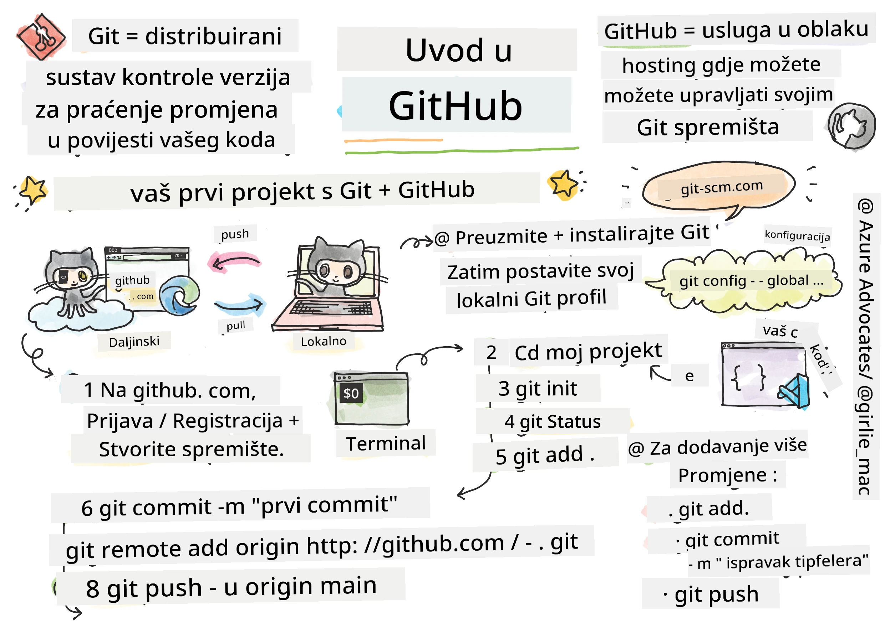
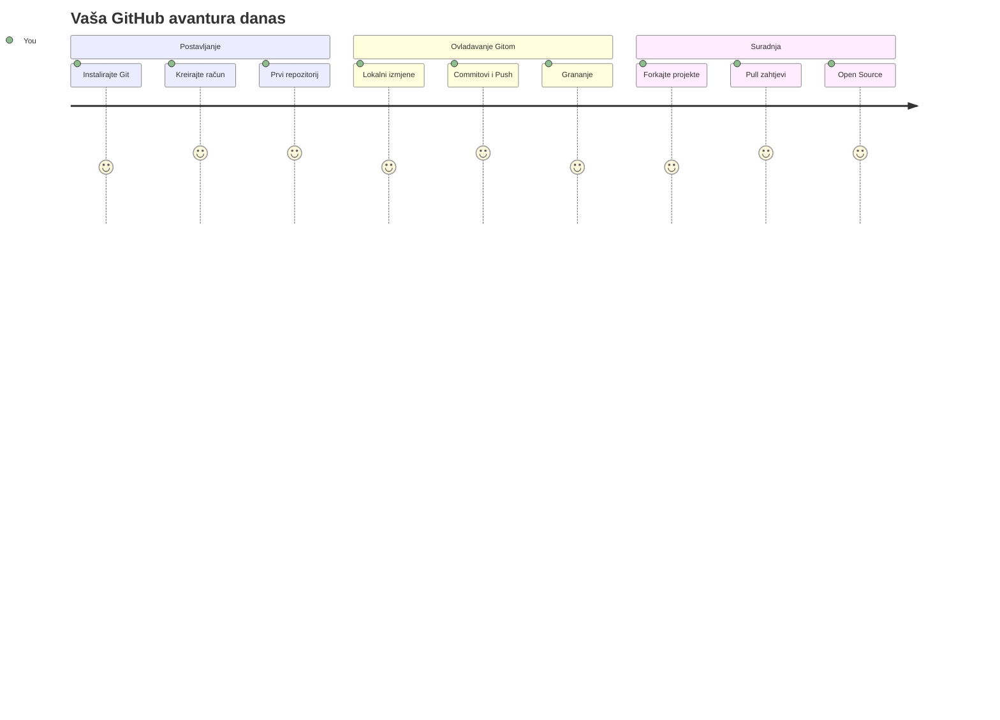
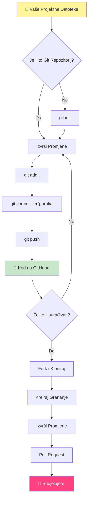
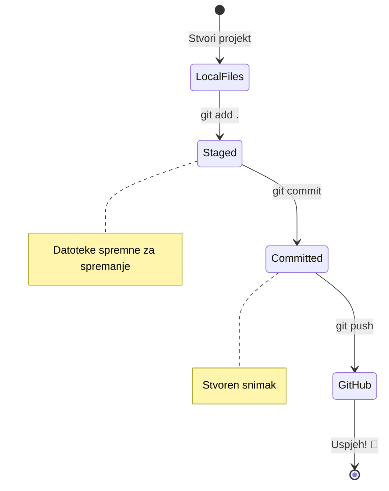
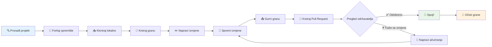
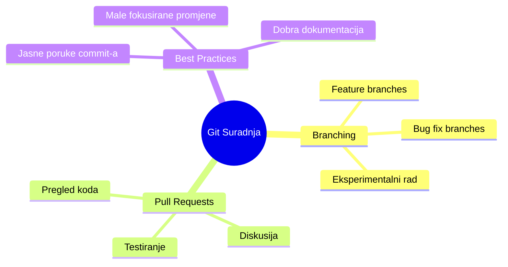
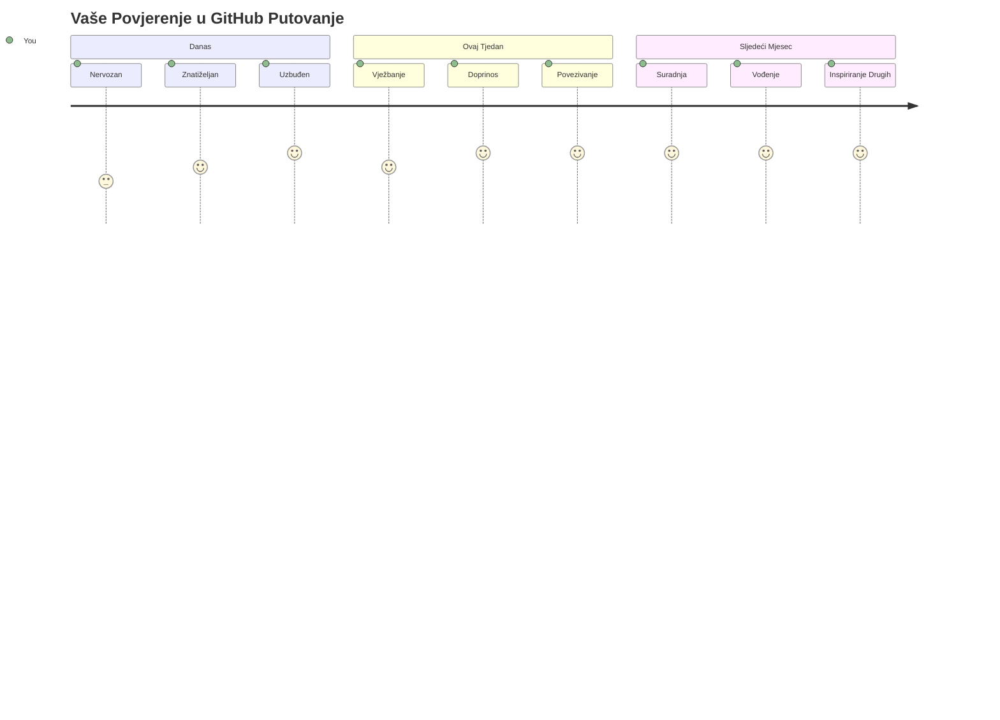

<!--
CO_OP_TRANSLATOR_METADATA:
{
  "original_hash": "5c383cc2cc23bb164b06417d1c107a44",
  "translation_date": "2026-01-07T09:39:25+00:00",
  "source_file": "1-getting-started-lessons/2-github-basics/README.md",
  "language_code": "hr"
}
-->
# Uvod u GitHub

Bok, budući programeru! 👋 Spreman za pridruživanje milijunima programera diljem svijeta? Iskreno sam uzbuđen što ću ti predstaviti GitHub – zamisli to kao društvenu mrežu za programere, samo što umjesto dijeljenja slika svog ručka, dijelimo kod i zajedno gradimo nevjerojatne stvari!

Ono što me potpuno oduševljava jest ovo: svaka aplikacija na tvom telefonu, svaka web stranica koju posjetiš i većina alata koje ćeš naučiti koristiti napravljeni su od strane timova programera koji surađuju na platformama poput GitHuba. Ta glazbena aplikacija koja ti se sviđa? Netko poput tebe je na tome radio. Ta igra koju ne možeš prestati igrati? Da, vjerojatno je izrađena uz suradnju na GitHubu. I sada ćeš TI naučiti kako biti dio te nevjerojatne zajednice!

Znam da ti to može na početku djelovati previše – sjećam se i sam da sam gledao svoju prvu GitHub stranicu misleći "Što, zaboga, sve ovo znači?" Ali evo što je važno: svaki programer je počeo točno tamo gdje si sada ti. Do kraja ove lekcije imat ćeš svoj vlastiti GitHub repozitorij (zamislite to kao tvoju osobnu vitrinu projekata u oblaku), i znat ćeš kako spremiti svoj rad, podijeliti ga s drugima, pa čak i pridonijeti projektima koje koristi milijune ljudi.

Krenut ćemo na ovo putovanje zajedno, korak po korak. Bez žurbe, bez pritiska – samo ti, ja i nekoliko stvarno cool alata koji će ubrzo postati tvoji novi najbolji prijatelji!


> Sketchnote by [Tomomi Imura](https://twitter.com/girlie_mac)


## Pred-predavanje kviz
[Pred-predavanje kviz](https://ff-quizzes.netlify.app)

## Uvod

Prije nego što zaronimo u stvarno uzbudljive stvari, pripremimo tvoj računalni sustav za malo GitHub čarolije! Zamislite ovo kao organiziranje tvojih umjetničkih potrepština prije nego što započneš s majstorskim djelom – imati prave alate spremne čini sve lakšim i puno zabavnijim.

Vodit ću te kroz svaki korak postavljanja osobno i obećavam da nije ni približno tako zastrašujuće kako bi na prvi pogled moglo izgledati. Ako ti nešto ne klikne odmah, to je potpuno normalno! Sjećam se kad sam postavljao svoje prvo razvojno okruženje i osjećao se kao da pokušavam čitati drevne hijeroglife. Svaki programer bio je točno tamo gdje si ti sada, pitajući se radi li to ispravno. Spojler alert: ako si ovdje i učiš, već radiš ispravno! 🌟

U ovoj lekciji pokrit ćemo:

- praćenje rada koji obavljaš na svojem računalu
- rad na projektima s drugima
- kako doprinijeti open source softveru

### Preduvjeti

Pripremimo tvoje računalo za malo GitHub čarolije! Ne brini – ovo postavljanje trebaš napraviti samo jednom, a onda ćeš biti spreman za cijelo svoje programersko putovanje.

Dobro, krenimo od temelja! Prvo trebamo provjeriti je li Git već instaliran na tvom računalu. Git je zapravo kao superpametni pomoćnik koji pamti svaku promjenu koju napraviš u svom kodu – mnogo je bolji nego panično pritiskati Ctrl+S svake dvije sekunde (svi smo to prošli!).

Provjerimo je li Git već instaliran tako da upišeš ovu magičnu naredbu u svoj terminal:
`git --version`

Ako Git još nije instaliran, nema brige! Samo posjeti [download Git](https://git-scm.com/downloads) i preuzmi ga. Nakon što ga instaliraš, trebaš upoznati Git kako treba:

> 💡 **Prvo postavljanje**: Ove naredbe Git-u govore tko si. Te informacije bit će povezane sa svakim tvojim komitom, zato odaberi ime i email koje ti je ugodno dijeliti javno.

```bash
git config --global user.name "your-name"
git config --global user.email "your-email"
```

Za provjeru je li Git već konfiguriran možeš upisati:
```bash
git config --list
```

Trebat će ti također GitHub račun, uređivač koda (kao što je Visual Studio Code) i trebaš otvoriti svoj terminal (ili: command prompt).

Posjeti [github.com](https://github.com/) i kreiraj račun ako ga već nemaš, ili se prijavi i popuni svoj profil.

💡 **Suvremeni savjet**: Razmotri postavljanje [SSH ključeva](https://docs.github.com/en/authentication/connecting-to-github-with-ssh) ili korištenje [GitHub CLI](https://cli.github.com/) za lakšu autentifikaciju bez lozinki.

✅ GitHub nije jedini repozitorij koda na svijetu; postoje i drugi, ali GitHub je najpoznatiji

### Priprema

Trebat ćeš imati mapu s projektnim kodom na lokalnom računalu (laptop ili PC), i javni repozitorij na GitHubu, koji će poslužiti kao primjer kako doprinijeti projektima drugih.

### Sigurnost tvog koda

Razgovarajmo o sigurnosti na trenutak – ali ne brini, nećemo te preplaviti strašnim stvarima! Zamislimo sigurnosne prakse kao zaključavanje auta ili kuće. To su jednostavne navike koje postaju druga priroda i štite tvoj naporan rad.

Pokazat ćemo ti moderne, sigurne načine rada s GitHubom odmah od početka. Tako ćeš razviti dobre navike koje će ti koristiti tijekom cijele programerske karijere.

Kad radiš s GitHubom, važno je slijediti najbolje sigurnosne prakse:

| Sigurnosno područje | Najbolja praksa | Zašto je važno |
|---------------------|-----------------|---------------|
| **Autentifikacija** | Koristi SSH ključeve ili Personal Access Token-e | Lozinke su manje sigurne i izbacuju se iz upotrebe |
| **Dvofaktorska autentifikacija** | Omogući 2FA na svom GitHub računu | Dodaje dodatni sloj zaštite računa |
| **Sigurnost repozitorija** | Nikad ne komitiraj osjetljive podatke | API ključevi i lozinke ne smiju biti u javnim repozitorijima |
| **Upravljanje ovisnostima** | Omogući Dependabot za ažuriranja | Održava ovisnosti sigurnim i ažuriranim |

> ⚠️ **Kritičan sigurnosni podsjetnik**: Nikad ne komitiraj API ključeve, lozinke ili druge osjetljive informacije u bilo koji repozitorij. Koristi varijable okoline i `.gitignore` datoteke za zaštitu osjetljivih podataka.

**Suvremeno postavljanje autentifikacije:**

```bash
# Generiraj SSH ključ (moderan ed25519 algoritam)
ssh-keygen -t ed25519 -C "your_email@example.com"

# Postavi Git da koristi SSH
git remote set-url origin git@github.com:username/repository.git
```

> 💡 **Profesionalni savjet**: SSH ključevi eliminiraju potrebu za ponovnim unosom lozinki i sigurniji su od tradicionalnih metoda autentifikacije.

---

## Upravljanje svojim kodom kao profesionalac

E pa, OVO je ono gdje stvari postaju stvarno uzbudljive! 🎉 Upravo ćemo naučiti kako pratiti i upravljati svojim kodom kao profesionalci, i iskreno, ovo je jedna od mojih omiljenih stvari za podučavati jer mijenja igru.

Zamislite ovo: pišeš fantastičnu priču i želiš pratiti svaki nacrt, svaku briljantnu izmenu i svaki "čekaj, pa ovo je genijalno!" trenutak na putu. Upravo to Git radi za tvoj kod! Kao da imaš nevjerojatnu bilježnicu koja putuje kroz vrijeme i pamti SVE – svaki pritisak tipke, svaku promjenu, svaki "ups, sve sam zezao" trenutak koji možeš odmah poništiti.

Iskreno – na početku ti to može biti previše. Kad sam ja počinjao, mislio sam "Zašto ne mogu samo normalno spremiti datoteke?" Ali vjeruj mi: čim ti Git klikne (i hoće!), dobit ćeš onaj "aha" trenutak kad pomisliš "Kako sam PA ikad programirao bez ovoga?" Kao da otkriješ da možeš letjeti kad si cijeli život hodao!

Recimo da imaš mapu lokalno s nekim projektnim kodom i želiš početi pratiti svoj napredak pomoću git-a – sustava za praćenje verzija. Neki ljudi uspoređuju korištenje git-a s pisanjem ljubavnog pisma svojem budućem ja. Kad kasnije čitaš svoje komit poruke nakon dana, tjedana ili mjeseci, moći ćeš se sjetiti zašto si donio određenu odluku ili "vratiti" promjenu – pod uvjetom da pišeš dobre "commit message".


### Zadatak: Napravi svoj prvi repozitorij!

> 🎯 **Tvoja misija (i toliko sam uzbuđen zbog tebe!)**: Zajedno ćemo napraviti tvoj prvi GitHub repozitorij! Do kraja ove lekcije imati ćeš svoj mali kutak interneta gdje živi tvoj kod i napravit ćeš svoj prvi "commit" (to je programerski izraz za pametno spremanje rada). 
>
> Ovo je stvarno poseban trenutak – službeno se pridružuješ globalnoj zajednici programera! Još se sjećam uzbuđenja kad sam napravio svoj prvi repozitorij i pomislio "Vau, stvarno to radim!"

Prođimo zajedno kroz ovu avanturu, korak po korak. Uzmi si vremena za svaki dio – nema nagrade za žurbu i obećajem da će svaki korak imati smisla. Sjeti se, svaki programerski superstar kojeg cijeniš nekad je sjedio točno gdje si ti sada, spreman napraviti svoj prvi repozitorij. Kako je to super, zar ne?

> Pogledaj video
> 
> [](https://www.youtube.com/watch?v=9R31OUPpxU4)

**Napravimo to zajedno:**

1. **Napravi svoj repozitorij na GitHubu**. Otiđi na GitHub.com i potraži onaj svijetlo zeleni gumb **New** (ili znak **+** u gornjem desnom kutu). Klikni na njega i odaberi **New repository**.

   Evo što treba napraviti:
   1. Daj repozitoriju ime – neka ti znači nešto!
   1. Dodaj opis ako želiš (pomaže drugima da razumiju o čemu je tvoj projekt)
   1. Odluči hoćeš li da bude javan (svi ga mogu vidjeti) ili privatan (samo ti)
   1. Preporučujem da označiš kućicu za dodavanje README datoteke – to je kao naslovnica tvog projekta
   1. Klikni **Create repository** i slavi – upravo si napravio svoj prvi repozitorij! 🎉

2. **Idi u svoj projektni folder**. Sada otvorimo terminal (ne brini, nije tako strašno kako izgleda!). Trebamo reći računalu gdje su tvoje projektne datoteke. Upiši ovu naredbu:

   ```bash
   cd [name of your folder]
   ```

   **Što ovdje radimo:**
   - Recimo računalu "Hej, odvodi me u moj projektni folder"
   - Kao da otvaraš određenu mapu na desktopu, samo sada radimo s tekstualnim naredbama
   - Zamijeni `[name of your folder]` stvarnim imenom svoje projektne mape

3. **Pretvori svoju mapu u Git repozitorij**. Ovamo dolazi magija! Upiši:

   ```bash
   git init
   ```

   **Evo što se upravo dogodilo (prilično kul stvari!):**
   - Git je upravo stvorio skrivenu `.git` mapu u tvom projektu – nećeš je vidjeti, ali je tu!
   - Tvoja obična mapa sada je "repozitorij" koji može pratiti svaku tvoju promjenu
   - Zamislite to kao da daješ svojoj mapi supermoći da sve pamti

4. **Provjeri što se događa**. Pogledajmo što Git misli o tvom projektu trenutno:

   ```bash
   git status
   ```

   **Razumijevanje što ti Git govori:**
   
   Možda vidiš nešto ovako:

   ```output
   Changes not staged for commit:
   (use "git add <file>..." to update what will be committed)
   (use "git restore <file>..." to discard changes in working directory)

        modified:   file.txt
        modified:   file2.txt
   ```

   **Ne paniči! Evo što to znači:**
   - Datoteke u **crvenom** su datoteke koje su promijenjene, ali još nisu spremne za pohranu
   - Datoteke u **zelenom** (kad ih vidiš) su spremne za pohranu
   - Git ti pomaže govoreći ti što možeš sljedeće napraviti

   > 💡 **Profesionalni savjet**: naredba `git status` tvoj je najbolji prijatelj! Koristi ju kad god si zbunjen što se događa. Kao da pitaš Git "Hej, kakva je sada situacija?"

5. **Pripremi datoteke za pohranu** (to se zove "staging"):

   ```bash
   git add .
   ```

   **Što smo upravo napravili:**
   - Rekli smo Gitu "Hej, želim uključiti SVE datoteke u sljedeće spremanje"
   - `.` znači "sve u ovoj mapi"
   - Sada su tvoje datoteke "staged" i spremne za sljedeći korak

   **Želiš biti izbirljiviji?** Možeš dodati samo određene datoteke:

   ```bash
   git add [file or folder name]
   ```

   **Zašto bi to želio?**
   - Ponekad želiš spremiti povezane promjene zajedno
   - Pomaže ti organizirati rad u logične cjeline
   - Lakše je razumjeti što se i kada promijenilo

   **Predomislio si se?** Nema problema! Možeš ukloniti datoteke iz "staged" ovako:

   ```bash
   # Ukloni sve iz staging područja
   git reset
   
   # Ukloni samo jednu datoteku iz staging područja
   git reset [file name]
   ```

   Ne brini – ovo ne briše tvoj rad, samo uklanja datoteke iz reda "spremnih za pohranu".

6. **Spremi svoj rad trajno** (napravi svoj prvi commit!):

   ```bash
   git commit -m "first commit"
   ```

   **🎉 Čestitamo! Upravo si napravio svoj prvi commit!**
   
   **Evo što se dogodilo:**
   - Git je napravio "snapshhot" svih tvojih staged datoteka u ovom trenutku
   - Tvoja commit poruka "first commit" objašnjava o čemu je ova točka spremanja
   - Git je ovom snapshotu dodijelio jedinstveni ID da ga uvijek možeš pronaći kasnije
   - Službeno si počeo pratiti povijest svog projekta!

   > 💡 **Poruke za buduće commitove**: Za sljedeće komite budi opisniji! Umjesto "updated stuff", probaj "Add contact form to homepage" ili "Fix navigation menu bug". Tvoje buduće ja će ti biti zahvalno!

7. **Poveži svoj lokalni projekt s GitHubom**. Trenutno je tvoj projekt samo na tvom računalu. Povežimo ga s tvojim GitHub repozitorijem da ga možeš podijeliti sa svijetom!

   Prvo, ode na stranicu svog GitHub repozitorija i kopiraj URL. Zatim se vrati ovamo i upiši:

   ```bash
   git remote add origin https://github.com/username/repository_name.git
   ```
   
   (Zamijeni taj URL stvarnim URL-om svog repozitorija!)

   **Što smo upravo napravili:**
   - Stvorili smo vezu između vašeg lokalnog projekta i vašeg GitHub spremišta
   - "Origin" je samo nadimak za vaše GitHub spremište – kao da dodajete kontakt u svoj telefon
   - Sada vaš lokalni Git zna kamo poslati vaš kod kad budete spremni za dijeljenje

   💡 **Jednostavniji način**: Ako imate instaliran GitHub CLI, ovo možete napraviti jednim naredbom:
   ```bash
   gh repo create my-repo --public --push --source=.
   ```

8. **Pošaljite svoj kod na GitHub** (veliki trenutak!):

   ```bash
   git push -u origin main
   ```

   **🚀 To je to! Učitavate svoj kod na GitHub!**
   
   **Što se događa:**
   - Vaši commiti putuju s vašeg računala na GitHub
   - `-u` oznaka uspostavlja trajnu vezu kako bi budući push bio jednostavniji
   - "main" je naziv vaše glavne grane (kao glavni direktorij)
   - Nakon ovoga za buduće učitavanje samo upišite `git push`!

   💡 **Brza napomena**: Ako se vaša grana zove drugačije (npr. "master"), koristite taj naziv. Možete provjeriti s `git branch --show-current`.

9. **Vaš novi dnevni ritam kodiranja** (ovdje postaje zarazno!):

   Od sada, kad god napravite promjene na projektu, imate ovaj jednostavni ples od tri koraka:

   ```bash
   git add .
   git commit -m "describe what you changed"
   git push
   ```

   **Ovo postaje vaš puls kodiranja:**
   - Napravite sjajne promjene u kodu ✨
   - Stage-ajte ih s `git add` ("Hej Git, obrati pažnju na ove promjene!")
   - Spremite ih s `git commit` i opisnom porukom (budući vi će vam zahvaliti!)
   - Podijelite ih sa svijetom koristeći `git push` 🚀
   - Ponovite – ozbiljno, ovo postaje isto kao disati!

   Volim ovaj radni tok jer je kao imati više točaka spremanja u videoigri. Napravili ste promjenu koju volite? Commitajte ju! Želite isprobati nešto riskantno? Nema problema – uvijek se možete vratiti na posljednji commit ako stvari krenu po zlu!

   > 💡 **Savjet**: Možda ćete htjeti koristiti `.gitignore` datoteku da spriječite da datoteke koje ne želite pratiti budu vidljive na GitHubu – poput datoteke s bilješkama koju držite u istom direktoriju, ali nema mjesto u javnom spremištu. Možete pronaći predloške za `.gitignore` datoteke na [.gitignore templates](https://github.com/github/gitignore) ili izraditi jednu pomoću [gitignore.io](https://www.toptal.com/developers/gitignore).

### 🧠 **Prvi unos u spremište: Kako se osjećate?**

**Uzmite trenutak za slavlje i razmišljanje:**
- Kako ste se osjećali kad ste prvi put vidjeli svoj kod na GitHubu?
- Koji vam je korak bio najzbunjujući, a koji neočekivano jednostavan?
- Možete li vlastitim riječima objasniti razliku između `git add`, `git commit` i `git push`?


> **Zapamtite**: Čak i iskusni developeri ponekad zaborave točne naredbe. Da ovaj radni tok postane mišićna memorija treba vježbe – odlično vam ide!

#### Moderni Git radni tokovi

Razmislite o usvajanju ovih modernih praksi:

- **Conventional Commits**: Koristite standardizirani format poruke commita poput `feat:`, `fix:`, `docs:`, itd. Saznajte više na [conventionalcommits.org](https://www.conventionalcommits.org/)
- **Atomski commitovi**: Svaki commit treba predstavljati jednu logičku promjenu
- **Česti commitovi**: Često commitajte s opisnim porukama umjesto velikih, rijetkih commitova

#### Poruke commitova

Dobar naslov Git commita završava slijedeću rečenicu:
Ako se primijeni, ovaj commit će <ovdje napišite svoj naslov>

Za naslov koristite imperativ, sadašnje vrijeme: "promijeni", a ne "promijenio" ili "promjene".
Kao u naslovu, i u tijelu (opcionalno) koristite imperativ, sadašnje vrijeme. Tijelo bi trebalo uključivati motivaciju promjene i kontrast prema prethodnom ponašanju. Objašnjavate „zašto“, ne „kako“.

✅ Provedite nekoliko minuta istražujući GitHub. Možete li pronaći zaista dobru poruku commit-a? Možete li pronaći neku minimalnu? Koje informacije mislite da su najvažnije i najkorisnije za prenijeti porukom commit-a?

## Rad s drugima (Zabavni dio!)

Zadržite svoj šešir jer OVO je mjesto gdje GitHub postaje prava čarolija! 🪄 Savladali ste upravljanje vlastitim kodom, a sada ulazimo u moj najdraži dio – suradnju s nevjerojatnim ljudima iz cijelog svijeta.

Zamislite ovo: probudite se sutra i vidite da vam je netko u Tokiju unaprijedio kod dok ste spavali. Zatim netko u Berlinu popravi bug na kojem ste zapeli. Popodne developeri u São Paulu dodaju značajku o kojoj nikad niste ni razmišljali. To nije znanstvena fantastika – to je samo utorak u GitHub svemiru!

Ono što me stvarno usrećuje jest da su vještine suradnje koje ćete naučiti? To su APSOLUTNO isti radni tokovi koje koriste timovi u Googleu, Microsoftu i vašim omiljenim startupima svaki dan. Ne učite samo cool alat – učite tajni jezik koji cijelom softverskom svijetu omogućuje suradnju.

Ozbiljno, kad osjetite uzbuđenje kad vam netko spoji prvi pull request, shvatit ćete zašto developeri vole otvoreni izvor. Kao da ste dio najvećeg i najkreativnijeg timskog projekta na svijetu!

> Pogledajte video
>
> [](https://www.youtube.com/watch?v=bFCM-PC3cu8)

Glavni razlog za stavljanje stvari na GitHub bio je omogućiti suradnju s drugim developerima.


U svom spremištu idite na `Insights > Community` da vidite kako se vaš projekt uspoređuje s preporučenim standardima zajednice.

Želite da vaše spremište izgleda profesionalno i primamljivo? Idite u svoje spremište i kliknite `Insights > Community`. Ova super značajka pokazuje kako se vaš projekt uspoređuje s onim što GitHub zajednica smatra "dobrim praksama u spremištima."

> 🎯 **Neka vaš projekt zablista**: Dobro organizirano spremište s dobrom dokumentacijom je kao uredna, pozivajuća izloga trgovine. Kaže ljudima da vam je stalo do vašeg rada i tjera druge da žele doprinijeti!

**Evo što čini spremište sjajnim:**

| Što dodati | Zašto je važno | Što vam to donosi |
|-----------|----------------|-------------------|
| **Opis** | Prvi dojam je važan! | Ljudi odmah znaju čemu vaš projekt služi |
| **README** | Naslovna stranica vašeg projekta | Kao prijateljski vodič za nove posjetitelje |
| **Smjernice za doprinos** | Pokazuje da ste otvoreni za pomoć | Ljudi točno znaju kako vam mogu pomoći |
| **Code of Conduct** | Stvara prijateljsko okruženje | Svi se osjećaju dobrodošli za sudjelovanje |
| **Licenca** | Pravna jasnoća | Drugi znaju kako smiju koristiti vaš kod |
| **Sigurnosna politika** | Pokazuje da ste odgovorni | Pokazuje profesionalne prakse |

> 💡 **Profesionalni savjet**: GitHub nudi predloške za sve ove datoteke. Prilikom izrade novog spremišta, označite polja da automatski generirate ove datoteke.

**Moderni GitHub alati za istraživanje:**

🤖 **Automatizacija i CI/CD:**
- **GitHub Actions** za automatizirano testiranje i distribuciju
- **Dependabot** za automatske nadogradnje ovisnosti

💬 **Zajednica i upravljanje projektima:**
- **GitHub Discussions** za razgovore u zajednici izvan issuea
- **GitHub Projects** za upravljanje projektima u kanban stilu
- **Pravila zaštite grana** za održavanje standarda kvalitete koda


Svi ovi resursi pomažu u uvođenju novih članova tima. A to su tipično stvari kojima se novi suradnici prvo bave prije nego pogledaju vaš kod, da otkriju je li vaš projekt pravo mjesto za njihovo vrijeme.

✅ README datoteke, iako zahtijevaju vrijeme za pripremu, često zanemaruju zauzeti održavatelji. Možete li pronaći primjer posebno opisne? Napomena: postoje [alati za izradu dobrih README-a](https://www.makeareadme.com/) koje biste možda željeli isprobati.

### Zadatak: Spojite neki kod

Dokumentacija za doprinos pomaže ljudima da doprinesu projektu. Objašnjava koje vrste doprinosa tražite i kako proces funkcionira. Suradnici trebaju slijediti nekoliko koraka da bi mogli doprinijeti vašem repozitoriju na GitHubu:


1. **Forkajte svoj repozitorij** Vjerojatno ćete htjeti da ljudi _forkaju_ vaš projekt. Forkanje znači stvaranje kopije vašeg spremišta na njihovom GitHub profilu.
1. **Kloniranje**. Iz tamo će klonirati projekt na svoje lokalno računalo. 
1. **Napravite granu**. Zamolite ih da naprave _granu_ za svoj rad. 
1. **Usredotočite promjenu na jedno područje**. Zamolite suradnike da svoje doprinose usredotoče na jednu stvar odjednom – tako je veća vjerojatnost da ćete moći _spojiti_ njihov rad. Zamislite da napišu popravak buga, dodaju novu značajku i ažuriraju nekoliko testova – što ako želite, ili možete implementirati samo 2 od 3, ili 1 od 3 promjene?

✅ Zamislite situaciju u kojoj su grane posebno važne za pisanje i isporuku dobrog koda. Koje slučajeve upotrebe možete zamisliti?

> Zapamtite, budite promjena koju želite vidjeti u svijetu i stvarajte grane i za svoj rad. Svaki commit koji napravite biti će na grani na kojoj ste trenutno "checked out". Koristite `git status` da vidite koja je to grana.

Prođimo kroz radni tok suradnika. Pretpostavimo da je suradnik već _forkao_ i _klonirao_ repo pa ima Git repozitorij spreman za rad na svojem lokalnom računalu:

1. **Napravite granu**. Koristite naredbu `git branch` da napravite granu koja će sadržavati promjene koje planira doprinijeti:

   ```bash
   git branch [branch-name]
   ```

   > 💡 **Moderan pristup**: Možete napraviti i odmah prebaciti se na novu granu jednom naredbom:
   ```bash
   git switch -c [branch-name]
   ```

1. **Prebaci se na radnu granu**. Prebacite se na određenu granu i osvježite radni direktorij s `git switch`:

   ```bash
   git switch [branch-name]
   ```

   > 💡 **Moderena napomena**: `git switch` je moderna zamjena za `git checkout` kod promjene grana. Jasnije je i sigurnije za početnike.

1. **Radite**. Sada želite dodati svoje promjene. Ne zaboravite to reći Git-u sljedećim naredbama:

   ```bash
   git add .
   git commit -m "my changes"
   ```

   > ⚠️ **Kvaliteta poruke commita**: Pobrinite se da vaš commit ima dobar naziv, i za vlastitu korist i za održavatelja repozitorija kojem pomažete. Budite specifični što ste promijenili!

1. **Spojite svoj rad s `main` granom**. Kad završite s radom, želite spojiti svoj rad s onim na `main` grani. `main` grana se možda u međuvremenu promijenila pa se prvo pobrinite da je osvježite do najnovije verzije sljedećim naredbama:

   ```bash
   git switch main
   git pull
   ```

   Sad želite izbjeći bilo kakve _konflikte_, situacije u kojima Git ne može jednostavno _spojiti_ promjene u vašoj radnoj grani. Stoga pokrenite sljedeće naredbe:

   ```bash
   git switch [branch_name]
   git merge main
   ```

   Naredba `git merge main` donosi sve promjene s `main` grane u vašu granu. Nadamo se da možete nastaviti bez problema. Ako ne, VS Code će vam pokazati gdje je Git _zbunjen_, a vi samo promijenite pogođene datoteke kako biste naznačili koji sadržaj je točan.

   💡 **Moderna alternativa**: Razmislite o korištenju `git rebase` za čišću povijest:
   ```bash
   git rebase main
   ```
   Ovo reproducira vaše commitove na vrh najnovije main grane, stvarajući linearnu povijest.

1. **Pošaljite svoj rad na GitHub**. Slanje rada na GitHub znači dvije stvari. Pushanje vaše grane na vaš repozitorij i zatim otvaranje PR, Pull Requesta.

   ```bash
   git push --set-upstream origin [branch-name]
   ```

   Gornja naredba stvara granu na vašem forkiranom repozitoriju.

### 🤝 **Provjera suradničkih vještina: Spremni za rad s drugima?**

**Pogledajmo kako se osjećate oko suradnje:**
- Je li vam sad jasna ideja forkanja i pull requestova?
- Koju bi stvar o radu s granama željeli više vježbati?
- Koliko se ugodno osjećate u doprinosu tuđem projektu?


> **Poticanje samopouzdanja**: Svaki developer kojeg cijenite bio je nekad nervozan oko svog prvog pull requesta. GitHub zajednica iznimno dobrodošla je prema početnicima!

1. **Otvorite PR**. Sljedeće, želite otvoriti PR. To napravite tako da odete na forkani repozitorij na GitHubu. Vidjet ćete na GitHubu obavijest koja vas pita želite li napraviti novi PR, kliknete na to i odvest će vas na sučelje gdje možete promijeniti naslov poruke commita, dati prikladniji opis. Sada održavatelj repo-a koji ste forkali vidjet će ovaj PR i _kucajmo prstima_ da će cijeniti i _spojiti_ vaš PR. Sada ste suradnik, jebiga :)

   💡 **Moderni savjet**: PR-ove možete također kreirati korištenjem GitHub CLI:
   ```bash
   gh pr create --title "Your PR title" --body "Description of changes"
   ```

   🔧 **Najbolje prakse za PR-ove**:
   - Povežite s povezanim issueima koristeći ključne riječi poput "Fixes #123"
   - Dodajte screenshotove za promjene korisničkog sučelja
   - Zatražite specifične recenzente
   - Koristite PR-ove u draftu za rad u tijeku
   - Osigurajte da svi CI provjere prođu prije nego što zatražite pregled
1. **Očistite**. Smatra se dobrom praksom _očistiti_ nakon što uspješno spojite PR. Želite očistiti i svoju lokalnu granu i granu koju ste poslali na GitHub. Prvo je izbrišite lokalno sljedećom naredbom: 

   ```bash
   git branch -d [branch-name]
   ```

   Zatim obavezno idite na GitHub stranicu forkiranog repozitorija i uklonite udaljenu granu koju ste upravo poslali.

`Pull request` zvuči kao neozbiljan termin jer zapravo želite gurnuti svoje promjene u projekt. Ali održavatelj (vlasnik projekta) ili glavni tim mora razmotriti vaše promjene prije spajanja s "main" granom projekta, tako da zapravo tražite odluku o promjeni od održavatelja.

Pull request je mjesto za usporedbu i diskusiju razlika uvedenih na grani s pregledima, komentarima, integriranim testovima i još mnogo toga. Dobar pull request slijedi otprilike ista pravila kao i poruka komita. Možete dodati referencu na problem u trackeru problema, na primjer kada vaš rad rješava neki problem. To se radi korištenjem `#` nakon kojeg slijedi broj vašeg problema. Na primjer `#97`.

🤞Nadam se da će svi provjere proći i da će vlasnici projekta spojiti vaše promjene u projekt🤞

Ažurirajte svoju trenutnu lokalnu radnu granu sa svim novim komitima s odgovarajuće udaljene grane na GitHubu:

`git pull`

## Doprinoseći Open Sourceu (Vaša prilika da ostavite trag!)

Jeste li spremni za nešto što će vam potpuno "isključiti mozak"? 🤯 Razgovarajmo o doprinosu open source projektima – i već mi se dižu žmarci samo dok razmišljam da to s vama podijelim!

Ovo je vaša prilika da postanete dio nečeg doista izvanrednog. Zamislite da poboljšavate alate koje milijuni programera koriste svakodnevno, ili da popravljate grešku u aplikaciji koju vaši prijatelji vole. To nije samo san – to je ono o čemu je doprinos open sourceu!

Ono što me svaki put oduševljava kad razmišljam o tome: svaki alat koji ste učili koristiti – vaš kôd editor, okviri koje ćemo istraživati, čak i preglednik u kojem ovo čitate – započeo je s nekim poput vas koji je napravio svoj prvi doprinos. Ovaj briljantni programer koji je napravio vašu omiljenu VS Code ekstenziju? Nekada je bio početnik koji je drhtavim rukama kliknuo "create pull request", baš kao što ćete vi sada.

I najljepši dio: open source zajednica je kao najveći internet zagrljaj. Većina projekata aktivno traži novake i imaju issue-e označene kao "good first issue" posebno za ljude poput vas! Održavatelji se iskreno vesele kad vide nove doprinose jer se sjećaju svojih vlastitih prvih koraka.

```mermaid
flowchart TD
    A[🔍 Istražite GitHub] --> B[🏷️ Pronađite "dobar prvi zadatak"]
    B --> C[📖 Pročitajte Smjernice za doprinos]
    C --> D[🍴 Forkajte Repozitorij]
    D --> E[💻 Postavite Lokalno Okruženje]
    E --> F[🌿 Izradite Feature Granu]
    F --> G[✨ Napravite Svoj Doprinos]
    G --> H[🧪 Testirajte Promjene]
    H --> I[📝 Napišite Jasni Commit]
    I --> J[📤 Gurnite i Kreirajte PR]
    J --> K[💬 Sudjelujte u Povratnim informacijama]
    K --> L[🎉 Spojeno! Vi ste Suradnik!]
    L --> M[🌟 Pronađite Sljedeći Zadatak]
    
    style A fill:#e1f5fe
    style L fill:#c8e6c9
    style M fill:#fff59d
```
Ne učite samo kako kodirati – pripremate se da se pridružite globalnoj obitelji graditelja koji se svakog dana bude pitajući "Kako možemo učiniti digitalni svijet barem malo boljim?" Dobrodošli u klub! 🌟

Prvo, pronađimo repozitorij (ili **repo**) na GitHubu koji vas zanima i u kojem želite doprinijeti promjenom. Želit ćete kopirati njegov sadržaj na svoje računalo.

✅ Dobar način za pronalaženje 'prijateljskih za početnike' repozitorija je [pretraživanje po oznaci 'good-first-issue'](https://github.blog/2020-01-22-browse-good-first-issues-to-start-contributing-to-open-source/).


Postoji nekoliko načina za kopiranje koda. Jedan od načina je "kloniranje" sadržaja repozitorija, koristeći HTTPS, SSH, ili GitHub CLI (Command Line Interface).

Otvorite svoj terminal i klonirajte repozitorij ovako:
```bash
# Korištenje HTTPS-a
git clone https://github.com/ProjectURL

# Korištenje SSH-a (zahtijeva postavljanje SSH ključa)
git clone git@github.com:username/repository.git

# Korištenje GitHub CLI-ja
gh repo clone username/repository
```

Za rad na projektu, prebacite se u odgovarajući direktorij:
`cd ProjectURL`

Također možete otvoriti cijeli projekt koristeći:
- **[GitHub Codespaces](https://github.com/features/codespaces)** - GitHubovo razvojno okruženje u oblaku s VS Code u pregledniku
- **[GitHub Desktop](https://desktop.github.com/)** - GUI aplikaciju za Git operacije  
- **[GitHub.dev](https://github.dev)** - Pritisnite tipku `.` na bilo kojem GitHub repozitoriju za otvaranje VS Code u pregledniku
- **VS Code** s ekstenzijom GitHub Pull Requests

Na kraju, možete preuzeti kod u zipani folder.

### Još nekoliko zanimljivih stvari o GitHubu

Možete označiti zvjezdicom, pratiti i/ili "forkati" bilo koji javni repozitorij na GitHubu. Možete pronaći svoje označene repozitorije u padajućem izborniku gore desno. To je poput bookmarka, ali za kod.

Projekti imaju tracker za probleme, većinom na GitHubu u kartici "Issues" osim ako nije drugačije naznačeno, gdje ljudi raspravljaju o problemima vezanim za projekt. Kartica Pull Requests je mjesto gdje ljudi raspravljaju i pregledavaju promjene koje su u tijeku.

Projekti također mogu imati rasprave na forumima, mailing listama ili chat kanalima poput Slacka, Discorda ili IRC-a.

🔧 **Moderne GitHub značajke**:
- **GitHub Discussions** - Ugrađeni forum za razgovore zajednice
- **GitHub Sponsors** - Financijska podrška održavateljima  
- **Kartica Security** - Izvještaji o ranjivostima i sigurnosni savjeti
- **Kartica Actions** - Pregled automatiziranih tijekova rada i CI/CD pipelinea
- **Kartica Insights** - Analitika o contributorima, komitima i zdravlju projekta
- **Kartica Projects** - Ugrađeni GitHub alati za upravljanje projektima

✅ Istražite svoj novi GitHub repo i isprobajte nekoliko stvari, poput uređivanja postavki, dodavanja informacija u vaš repo, kreiranja projekta (kao Kanban ploča) i postavljanja GitHub Actions za automatizaciju. Možete jako puno toga!

---

## 🚀 Izazov

Dobro, vrijeme je da isprobate svoje nove sjajne GitHub supermoći! 🚀 Evo izazova koji će vam pomoći da sve klikne na najzadovoljavajući način:

Uzmite prijatelja (ili člana obitelji koji vas stalno pita što radite sa svim tim "računalnim stvarima") i krenite zajedno u suradnički kôd avanturu! Tu se događa prava magija – napravite projekt, neka ga oni forkaju, napravite neke grane i spajajte promjene kao pravi profesionalci u nastajanju.

Neću lagati – vjerojatno ćete se smijati u nekom trenutku (pogotovo kad oboje pokušate promijeniti istu liniju), možda ćete češati glavu u zbunjenosti, ali sigurno ćete imati divne "aha!" trenutke koji čine sav vaš trud vrijednim. Osim toga, postoji nešto posebno u dijeljenju tog prvog uspješnog spajanja s nekim drugim – to je kao mala proslava koliko ste daleko stigli!

Još nemate partnera za kodiranje? Nema brige! GitHub zajednica je prepuna iznimno gostoljubivih ljudi koji se sjećaju kako je bilo biti nov. Potražite repozitorije s oznakama "good first issue" – one u osnovi kažu "Hej početnici, dođite učiti s nama!" Kako je to sjajno?

## Post-lecture Quiz
[Post-lecture quiz](https://ff-quizzes.netlify.app/web/en/)

## Pregled i nastavak učenja

Uf! 🎉 Pogledajte se – upravo ste osvojili osnove GitHuba kao pravi prvak! Ako vam je mozak malo pun sada, to je potpuno normalno i zapravo dobar znak. Upravo ste naučili alate za koje je meni trebalo tjednima da se osjećam ugodno kada sam počinjao.

Git i GitHub su nevjerojatno moćni (ozbiljno moćni), i svaki programer kojeg znam – uključujući one koji sada izgledaju kao čarobnjaci – morao je vježbati i spoticati se prije nego što mu je sve kliknulo. Činjenica da ste prošli ovu lekciju znači da ste već na putu da svladate neke od najvažnijih alata u razvojnom alatu programera.

Evo nekoliko odličnih resursa za praksu i postajanje još bolji:

- [Vodič za doprinos open source softveru](https://opensource.guide/how-to-contribute/#how-to-submit-a-contribution) – Vaš vodič za ostavljanje traga
- [Git cheatsheet](https://training.github.com/downloads/github-git-cheat-sheet/) – Držite ovo pri ruci za brzi pregled!

I zapamtite: praksa donosi napredak, a ne savršenstvo! Što više koristite Git i GitHub, to postaje prirodnije. GitHub je stvorio neke sjajne interaktivne tečajeve koji vam dopuštaju praksu u sigurnom okruženju:

- [Uvod u GitHub](https://github.com/skills/introduction-to-github)
- [Komunicirajte koristeći Markdown](https://github.com/skills/communicate-using-markdown)  
- [GitHub Pages](https://github.com/skills/github-pages)
- [Upravljanje sukobima spajanja](https://github.com/skills/resolve-merge-conflicts)

**Želite li avanturu? Isprobajte ove moderne alate:**
- [Dokumentacija GitHub CLI](https://cli.github.com/manual/) – Za kad želite biti kao čarobnjak komandne linije
- [Dokumentacija GitHub Codespaces](https://docs.github.com/en/codespaces) – Kodirajte u oblaku!
- [Dokumentacija GitHub Actions](https://docs.github.com/en/actions) – Automatizirajte sve što možete
- [Najbolje prakse za Git](https://www.atlassian.com/git/tutorials/comparing-workflows) – Podignite svoj radni tijek na višu razinu

## GitHub Copilot Agent Izazov 🚀

Koristite Agent način rada za završetak sljedećeg izazova:

**Opis:** Kreirajte suradnički projekt web razvoja koji demonstrira kompletan GitHub radni tijek koji ste naučili u ovoj lekciji. Ovaj izazov će vam pomoći da vježbate kreiranje repozitorija, suradničke značajke i moderne Git radne procese u stvarnom scenariju.

**Zadatak:** Kreirajte novi javni GitHub repozitorij za jednostavan projekt "Resursi za web razvoj". Repozitorij treba sadržavati dobro strukturirani README.md datoteku s popisom korisnih alata i resursa za web razvoj, organizirano po kategorijama (HTML, CSS, JavaScript, itd.). Postavite repozitorij s pravilima zajednice uključujući licencu, smjernice za doprinos i kodeks ponašanja. Kreirajte barem dvije funkcijske grane: jednu za dodavanje CSS resursa i drugu za JavaScript resurse. Napravite komite na svakoj grani s opisnim porukama komita, zatim kreirajte pull requestove za spajanje promjena natrag u main. Omogućite GitHub značajke kao što su Issues, Discussions i postavite osnovni GitHub Actions tijek rada za automatizirane provjere.

## Zadatak

Vaša misija, ako je odlučite prihvatiti: Završite [Uvod u GitHub](https://github.com/skills/introduction-to-github) tečaj na GitHub Skills. Ovaj interaktivni tečaj će vam omogućiti praksu svega što ste naučili u sigurnom i vođenom okruženju. Uz to, dobit ćete sjajnu značku kada završite! 🏅

**Spremni za više izazova?**
- Postavite SSH autentifikaciju za svoj GitHub račun (zaboravite lozinke!)
- Isprobajte GitHub CLI za svoje svakodnevne Git radnje
- Kreirajte repozitorij s GitHub Actions tijek rada
- Istražite GitHub Codespaces otvaranjem ovog repozitorija u uređivaču u oblaku

---

## 🚀 Vaš GitHub vremenski plan majstorstva

### ⚡ **Što možete učiniti u sljedećih 5 minuta**
- [ ] Oznaciti zvjezdicom ovaj repozitorij i tri druga projekta koja vas zanimaju
- [ ] Postaviti dvofaktorsku autentikaciju na svom GitHub računu
- [ ] Kreirati jednostavan README za svoj prvi repozitorij
- [ ] Zapratiti 5 programera čiji rad vas inspirira

### 🎯 **Što možete postići u ovom satu**
- [ ] Završiti post-lesson kviz i razmisliti o svom GitHub putovanju
- [ ] Postaviti SSH ključeve za autentifikaciju bez lozinke na GitHubu
- [ ] Kreirati svoj prvi značajan komit s odličnom porukom komita
- [ ] Istražiti GitHubovu karticu "Explore" za otkrivanje trending projekata
- [ ] Vježbati forkanje repozitorija i napraviti malu promjenu

### 📅 **Vaša tjedna GitHub avantura**
- [ ] Završiti GitHub Skills tečajeve (Uvod u GitHub, Markdown)
- [ ] Napraviti svoj prvi pull request na open source projektu
- [ ] Postaviti GitHub Pages stranicu za prikaz svog rada
- [ ] Pridružiti se GitHub Discussions na projektima koji vas zanimaju
- [ ] Kreirati repozitorij s pravilima zajednice (README, Licenca, itd.)
- [ ] Isprobati GitHub Codespaces za razvoj u oblaku

### 🌟 **Vaša mjesečna transformacija**
- [ ] Doprinijeti 3 različita open source projekta
- [ ] Mentorirati nekoga novog u GitHubu (proslijediti iskustvo!)
- [ ] Postaviti automatizirane tijekove rada s GitHub Actions
- [ ] Izgraditi portfelj koji prikazuje vaše GitHub doprinose
- [ ] Sudjelovati na Hacktoberfestu ili sličnim zajedničkim događajima
- [ ] Postati održavatelj vlastitog projekta kojem drugi doprinose

### 🎓 **Završna provjera GitHub majstorstva**

**Proslavite koliko ste daleko stigli:**
- Što vam je najdraža stvar u korištenju GitHuba?
- Koja vas suradnička značajka najviše oduševljava?
- Kako se sada osjećate u vezi doprinosa open sourceu?
- Koji projekt želite prvi poduprijeti?


> 🌍 **Dobrodošli u globalnu zajednicu programera!** Sada imate alate za suradnju s milijunima programera širom svijeta. Vaš prvi doprinos može se činiti malim, ali zapamtite - svaki veliki open source projekt započeo je s nekim tko je napravio svoj prvi komit. Pitanje nije hoćete li utjecati, nego koji će fantastični projekt prvi imati koristi od vaše jedinstvene perspektive! 🚀

Zapamtite: svaki stručnjak je nekada bio početnik. Vi to možete! 💪

---

<!-- CO-OP TRANSLATOR DISCLAIMER START -->
**Odricanje od odgovornosti**:
Ovaj dokument je preveden korištenjem AI usluge za prevođenje [Co-op Translator](https://github.com/Azure/co-op-translator). Iako težimo točnosti, imajte na umu da automatski prijevodi mogu sadržavati pogreške ili netočnosti. Izvorni dokument na izvornom jeziku treba se smatrati autoritativnim izvorom. Za kritične informacije preporučuje se profesionalni ljudski prijevod. Ne snosimo odgovornost za bilo kakva nesporazuma ili pogrešna tumačenja koja proizlaze iz korištenja ovog prijevoda.
<!-- CO-OP TRANSLATOR DISCLAIMER END -->