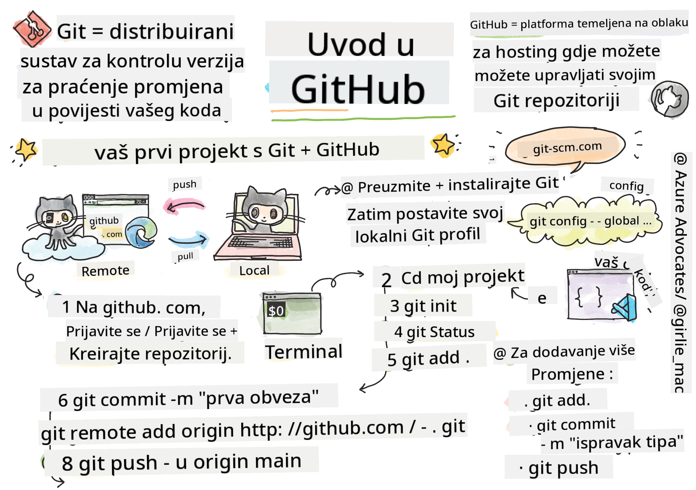
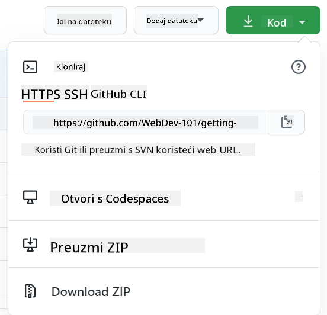

<!--
CO_OP_TRANSLATOR_METADATA:
{
  "original_hash": "ea65b75e488aa33a3cc5cb1c6c3f047a",
  "translation_date": "2025-10-03T14:16:38+00:00",
  "source_file": "1-getting-started-lessons/2-github-basics/README.md",
  "language_code": "hr"
}
-->
# Uvod u GitHub

Ova lekcija pokriva osnove GitHuba, platforme za hostiranje i upravljanje promjenama u vašem kodu.


> Sketchnote autor [Tomomi Imura](https://twitter.com/girlie_mac)

## Kviz prije predavanja
[Kviz prije predavanja](https://ff-quizzes.netlify.app)

## Uvod

U ovoj lekciji obradit ćemo:

- praćenje rada na vašem računalu
- rad na projektima s drugima
- kako doprinijeti softveru otvorenog koda

### Preduvjeti

Prije nego što počnete, provjerite je li Git instaliran. U terminalu upišite: 
`git --version`

Ako Git nije instaliran, [preuzmite Git](https://git-scm.com/downloads). Zatim postavite svoj lokalni Git profil u terminalu:
* `git config --global user.name "vaše-ime"`
* `git config --global user.email "vaš-email"`

Da biste provjerili je li Git već konfiguriran, možete upisati:
`git config --list`

Također će vam trebati GitHub račun, uređivač koda (poput Visual Studio Code), i trebate otvoriti svoj terminal (ili: command prompt).

Posjetite [github.com](https://github.com/) i kreirajte račun ako ga već nemate, ili se prijavite i popunite svoj profil.

✅ GitHub nije jedini repozitorij koda na svijetu; postoje i drugi, ali GitHub je najpoznatiji.

### Priprema

Trebat će vam mapa s projektom koda na vašem lokalnom računalu (laptop ili PC) i javni repozitorij na GitHubu, koji će poslužiti kao primjer kako doprinijeti projektima drugih.

---

## Upravljanje kodom

Recimo da imate mapu lokalno s nekim projektom koda i želite početi pratiti svoj napredak koristeći git - sustav za kontrolu verzija. Neki ljudi uspoređuju korištenje gita s pisanjem ljubavnog pisma svom budućem ja. Čitajući poruke o commitima danima, tjednima ili mjesecima kasnije, moći ćete se prisjetiti zašto ste donijeli određenu odluku ili "vratiti" promjenu - naravno, ako pišete dobre poruke o commitima.

### Zadatak: Napravite repozitorij i commitajte kod  

> Pogledajte video
> 
> [](https://www.youtube.com/watch?v=9R31OUPpxU4)

1. **Kreirajte repozitorij na GitHubu**. Na GitHub.com, u kartici repozitorija ili iz navigacijske trake gore desno, pronađite gumb **new repo**.

   1. Dajte svom repozitoriju (mapi) ime
   1. Odaberite **create repository**.

1. **Navigirajte do svoje radne mape**. U terminalu, prebacite se na mapu (poznatu i kao direktorij) koju želite početi pratiti. Upišite:

   ```bash
   cd [name of your folder]
   ```

1. **Inicijalizirajte git repozitorij**. U svom projektu upišite:

   ```bash
   git init
   ```

1. **Provjerite status**. Da biste provjerili status svog repozitorija, upišite:

   ```bash
   git status
   ```

   izlaz može izgledati ovako:

   ```output
   Changes not staged for commit:
   (use "git add <file>..." to update what will be committed)
   (use "git checkout -- <file>..." to discard changes in working directory)

        modified:   file.txt
        modified:   file2.txt
   ```

   Obično naredba `git status` govori stvari poput toga koji su datoteke spremne za _spremanje_ u repozitorij ili imaju promjene koje biste možda željeli zadržati.

1. **Dodajte sve datoteke za praćenje**
   Ovo se također naziva postavljanje datoteka/dodavanje datoteka u staging područje.

   ```bash
   git add .
   ```

   Argument `git add` plus `.` označava da su sve vaše datoteke i promjene spremne za praćenje.

1. **Dodajte odabrane datoteke za praćenje**

   ```bash
   git add [file or folder name]
   ```

   Ovo nam pomaže dodati samo odabrane datoteke u staging područje kada ne želimo commitati sve datoteke odjednom.

1. **Uklonite sve datoteke iz staging područja**

   ```bash
   git reset
   ```

   Ova naredba pomaže ukloniti sve datoteke iz staging područja odjednom.

1. **Uklonite određenu datoteku iz staging područja**

   ```bash
   git reset [file or folder name]
   ```

   Ova naredba pomaže ukloniti samo određenu datoteku iz staging područja koju ne želimo uključiti u sljedeći commit.

1. **Spremanje vašeg rada**. U ovom trenutku ste dodali datoteke u tzv. _staging područje_. Mjesto gdje Git prati vaše datoteke. Da biste promjenu učinili trajnom, trebate _commitati_ datoteke. Da biste to učinili, kreirate _commit_ s naredbom `git commit`. _Commit_ predstavlja točku spremanja u povijesti vašeg repozitorija. Upišite sljedeće da biste kreirali _commit_:

   ```bash
   git commit -m "first commit"
   ```

   Ovo commitira sve vaše datoteke, dodajući poruku "first commit". Za buduće poruke o commitima, želite biti opisniji u svom opisu kako biste prenijeli kakvu ste promjenu napravili.

1. **Povežite svoj lokalni Git repozitorij s GitHubom**. Git repozitorij je koristan na vašem računalu, ali u nekom trenutku želite imati sigurnosnu kopiju svojih datoteka negdje i također pozvati druge ljude da rade s vama na vašem repozitoriju. Jedno takvo sjajno mjesto za to je GitHub. Sjetite se da smo već kreirali repozitorij na GitHubu, tako da jedino što trebamo učiniti je povezati naš lokalni Git repozitorij s GitHubom. Naredba `git remote add` će to učiniti. Upišite sljedeću naredbu:

   > Napomena, prije nego što upišete naredbu, idite na stranicu svog GitHub repozitorija da biste pronašli URL repozitorija. Koristit ćete ga u naredbi ispod. Zamijenite ```https://github.com/username/repository_name.git``` s vašim GitHub URL-om.

   ```bash
   git remote add origin https://github.com/username/repository_name.git
   ```

   Ovo kreira _remote_, ili vezu, nazvanu "origin" koja pokazuje na GitHub repozitorij koji ste ranije kreirali.

1. **Pošaljite lokalne datoteke na GitHub**. Do sada ste kreirali _vezu_ između lokalnog repozitorija i GitHub repozitorija. Pošaljimo ove datoteke na GitHub sljedećom naredbom `git push`, ovako: 
   
   > Napomena, naziv vaše grane može biti drugačiji od ```main```.

   ```bash
   git push -u origin main
   ```

   Ovo šalje vaše commitove u vašu "main" granu na GitHub. Postavljanje `upstream` grane uključujući `-u` u naredbi uspostavlja vezu između vaše lokalne grane i udaljene grane, tako da ubuduće možete jednostavno koristiti git push ili git pull bez navođenja naziva grane. Git će automatski koristiti upstream granu i nećete morati eksplicitno navoditi naziv grane u budućim naredbama.

2. **Dodavanje više promjena**. Ako želite nastaviti s promjenama i slati ih na GitHub, samo ćete trebati koristiti sljedeće tri naredbe:

   ```bash
   git add .
   git commit -m "type your commit message here"
   git push
   ```

   > Savjet, Možda ćete također htjeti usvojiti `.gitignore` datoteku kako biste spriječili da se datoteke koje ne želite pratiti pojavljuju na GitHubu - poput one datoteke s bilješkama koju pohranjujete u istoj mapi, ali nema mjesta u javnom repozitoriju. Možete pronaći predloške za `.gitignore` datoteke na [.gitignore templates](https://github.com/github/gitignore).

#### Poruke o commitima

Odličan naslov poruke o Git commitu završava sljedeću rečenicu:
Ako se primijeni, ovaj commit će <ovdje vaš naslov>

Za naslov koristite imperativ, sadašnje vrijeme: "promijeni" ne "promijenio" niti "mijenja". 
Kao i u naslovu, u tijelu (opcionalno) također koristite imperativ, sadašnje vrijeme. Tijelo bi trebalo uključivati motivaciju za promjenu i usporediti je s prethodnim ponašanjem. Objašnjavate `zašto`, ne `kako`.

✅ Odvojite nekoliko minuta da pregledate GitHub. Možete li pronaći zaista odličnu poruku o commitu? Možete li pronaći zaista minimalnu? Koje informacije mislite da su najvažnije i najkorisnije za prenijeti u poruci o commitu?

### Zadatak: Suradnja

Glavni razlog za postavljanje stvari na GitHub bio je omogućiti suradnju s drugim programerima.

## Rad na projektima s drugima

> Pogledajte video
>
> [](https://www.youtube.com/watch?v=bFCM-PC3cu8)

U svom repozitoriju, navigirajte do `Insights > Community` da biste vidjeli kako vaš projekt uspoređuje s preporučenim standardima zajednice.

   Evo nekoliko stvari koje mogu poboljšati vaš GitHub repozitorij:
   - **Opis**. Jeste li dodali opis za svoj projekt?
   - **README**. Jeste li dodali README? GitHub pruža smjernice za pisanje [README](https://docs.github.com/articles/about-readmes/?WT.mc_id=academic-77807-sagibbon).
   - **Smjernice za doprinos**. Ima li vaš projekt [smjernice za doprinos](https://docs.github.com/articles/setting-guidelines-for-repository-contributors/?WT.mc_id=academic-77807-sagibbon), 
   - **Kodeks ponašanja**. [Kodeks ponašanja](https://docs.github.com/articles/adding-a-code-of-conduct-to-your-project/), 
   - **Licenca**. Možda najvažnije, [licenca](https://docs.github.com/articles/adding-a-license-to-a-repository/)?

Svi ovi resursi će koristiti novim članovima tima. A to su obično stvari koje novi suradnici pregledavaju prije nego što uopće pogledaju vaš kod, kako bi saznali je li vaš projekt pravo mjesto za njih da troše svoje vrijeme.

✅ README datoteke, iako zahtijevaju vrijeme za pripremu, često se zanemaruju od strane zauzetih održavatelja. Možete li pronaći primjer posebno opisnog README-a? Napomena: postoje neki [alati za pomoć pri izradi dobrih README-a](https://www.makeareadme.com/) koje biste mogli isprobati.

### Zadatak: Spojite kod

Dokumenti o doprinosima pomažu ljudima da doprinesu projektu. Objašnjavaju koje vrste doprinosa tražite i kako proces funkcionira. Suradnici će morati proći kroz niz koraka kako bi mogli doprinijeti vašem repozitoriju na GitHubu:

1. **Forkanje vašeg repozitorija**. Vjerojatno ćete htjeti da ljudi _forkaju_ vaš projekt. Forkanje znači stvaranje replike vašeg repozitorija na njihovom GitHub profilu.
1. **Kloniranje**. Odatle će klonirati projekt na svoje lokalno računalo. 
1. **Kreiranje grane**. Želite ih zamoliti da kreiraju _granu_ za svoj rad. 
1. **Usmjeravanje promjena na jedno područje**. Zamolite suradnike da se koncentriraju na jednu stvar odjednom - na taj način su šanse da možete _spojiti_ njihov rad veće. Zamislite da napišu ispravak greške, dodaju novu funkciju i ažuriraju nekoliko testova - što ako želite, ili možete implementirati samo 2 od 3, ili 1 od 3 promjene?

✅ Zamislite situaciju gdje su grane posebno kritične za pisanje i isporuku dobrog koda. Koje slučajeve upotrebe možete zamisliti?

> Napomena, budite promjena koju želite vidjeti u svijetu i kreirajte grane za svoj vlastiti rad također. Svaki commit koji napravite bit će napravljen na grani na kojoj ste trenutno "checked out". Koristite `git status` da vidite na kojoj ste grani.

Prođimo kroz tijek rada suradnika. Pretpostavimo da je suradnik već _forkao_ i _klonirao_ repozitorij tako da ima Git repozitorij spreman za rad na svom lokalnom računalu:

1. **Kreiranje grane**. Koristite naredbu `git branch` za kreiranje grane koja će sadržavati promjene koje namjeravaju doprinijeti:

   ```bash
   git branch [branch-name]
   ```

1. **Prebacivanje na radnu granu**. Prebacite se na određenu granu i ažurirajte radni direktorij s `git switch`:

   ```bash
   git switch [branch-name]
   ```

1. **Radite na promjenama**. U ovom trenutku želite dodati svoje promjene. Ne zaboravite reći Gitu o tome sljedećim naredbama:

   ```bash
   git add .
   git commit -m "my changes"
   ```

   Pobrinite se da svom commitu date dobro ime, za vaše dobro kao i za održavatelja repozitorija kojem pomažete.

1. **Spojite svoj rad s `main` granom**. U nekom trenutku završavate s radom i želite spojiti svoj rad s onim iz `main` grane. `Main` grana se možda promijenila u međuvremenu, pa se pobrinite da je prvo ažurirate na najnoviju verziju sljedećim naredbama:

   ```bash
   git switch main
   git pull
   ```

   U ovom trenutku želite biti sigurni da se svi _sukobi_, situacije u kojima Git ne može lako _spojiti_ promjene, događaju u vašoj radnoj grani. Stoga pokrenite sljedeće naredbe:

   ```bash
   git switch [branch_name]
   git merge main
   ```

   Naredba `git merge main` će donijeti sve promjene iz `main` u vašu granu. Nadamo se da možete jednostavno nastaviti. Ako ne, VS Code će vam pokazati gdje je Git _zbunjen_ i samo izmijenite zahvaćene datoteke kako biste odredili koji je sadržaj najtočniji.

   Za prebacivanje na drugu granu, koristite modernu naredbu `git switch`:
   ```bash
   git switch [branch_name]

1. **Pošaljite svoj rad na GitHub**. Slanje vašeg rada na GitHub znači dvije stvari. Guranje vaše grane na vaš repozitorij i zatim otvaranje PR-a, Pull Requesta.

   ```bash
   git push --set-upstream origin [branch-name]
   ```

   Gornja naredba kreira granu na vašem forkanom repozitoriju.
1. **Otvorite PR**. Sljedeći korak je otvaranje PR-a. To radite tako da odete na forkani repo na GitHubu. Vidjet ćete naznaku na GitHubu gdje vas pita želite li stvoriti novi PR, kliknete na to i bit ćete preusmjereni na sučelje gdje možete promijeniti naslov poruke commita i dodati prikladniji opis. Sada će održavatelj repozitorija koji ste forkali vidjeti ovaj PR i _držimo palčeve_ da će ga cijeniti i _spojiti_ vaš PR. Sada ste suradnik, bravo! :)

1. **Čišćenje**. Smatra se dobrom praksom _očistiti_ nakon što uspješno spojite PR. Trebate očistiti i lokalnu granu i granu koju ste poslali na GitHub. Prvo je izbrišite lokalno pomoću sljedeće naredbe:

   ```bash
   git branch -d [branch-name]
   ```
  
   Zatim idite na GitHub stranicu forkiranog repozitorija i uklonite udaljenu granu koju ste upravo poslali.

`Pull request` može zvučati kao čudan izraz jer zapravo želite "gurnuti" svoje promjene u projekt. No, održavatelj (vlasnik projekta) ili glavni tim mora razmotriti vaše promjene prije nego što ih spoji s "main" granom projekta, pa zapravo tražite odluku o promjeni od održavatelja.

Pull request je mjesto gdje možete usporediti i raspraviti razlike uvedene na grani uz recenzije, komentare, integrirane testove i još mnogo toga. Dobar pull request slijedi otprilike ista pravila kao i poruka commita. Možete dodati referencu na problem u trackeru problema, na primjer kada vaš rad rješava neki problem. To se radi pomoću `#` praćenog brojem vašeg problema. Na primjer, `#97`.

🤞Držimo palčeve da svi provjeri prođu i da vlasnik(i) projekta spoje vaše promjene u projekt🤞

Ažurirajte svoju trenutnu lokalnu radnu granu sa svim novim commitovima iz odgovarajuće udaljene grane na GitHubu:

`git pull`

## Kako doprinijeti otvorenom kodu

Prvo, pronađimo repozitorij (ili **repo**) na GitHubu koji vas zanima i kojem želite doprinijeti promjenom. Želite kopirati njegov sadržaj na svoje računalo.

✅ Dobar način za pronalaženje repozitorija prilagođenih početnicima je [pretraživanje po oznaci 'good-first-issue'](https://github.blog/2020-01-22-browse-good-first-issues-to-start-contributing-to-open-source/).



Postoji nekoliko načina za kopiranje koda. Jedan od načina je "kloniranje" sadržaja repozitorija, koristeći HTTPS, SSH ili GitHub CLI (Command Line Interface).

Otvorite terminal i klonirajte repozitorij ovako:  
`git clone https://github.com/ProjectURL`

Za rad na projektu, prebacite se u odgovarajući folder:  
`cd ProjectURL`

Također možete otvoriti cijeli projekt koristeći [Codespaces](https://github.com/features/codespaces), GitHubov ugrađeni uređivač koda / razvojno okruženje u oblaku, ili [GitHub Desktop](https://desktop.github.com/).

Na kraju, možete preuzeti kod u zipanoj mapi.

### Nekoliko zanimljivih stvari o GitHubu

Možete označiti zvjezdicom, pratiti i/ili "forkati" bilo koji javni repozitorij na GitHubu. Svoje označene repozitorije možete pronaći u padajućem izborniku u gornjem desnom kutu. To je poput označavanja stranica, ali za kod.

Projekti imaju tracker problema, uglavnom na GitHubu u kartici "Issues", osim ako nije drugačije naznačeno, gdje ljudi raspravljaju o problemima vezanim za projekt. Kartica Pull Requests je mjesto gdje ljudi raspravljaju i pregledavaju promjene koje su u tijeku.

Projekti također mogu imati rasprave na forumima, mailing listama ili chat kanalima poput Slacka, Discorda ili IRC-a.

✅ Pogledajte svoj novi GitHub repo i isprobajte nekoliko stvari, poput uređivanja postavki, dodavanja informacija u repo i stvaranja projekta (poput Kanban ploče). Puno toga možete učiniti!

---

## 🚀 Izazov

Udružite se s prijateljem i radite na kodu jedno drugoga. Zajedno stvorite projekt, forkajte kod, kreirajte grane i spojite promjene.

## Kviz nakon predavanja  
[Kviz nakon predavanja](https://ff-quizzes.netlify.app/web/en/)

## Pregled i samostalno učenje  

Pročitajte više o [doprinosu otvorenom softveru](https://opensource.guide/how-to-contribute/#how-to-submit-a-contribution).

[Git cheatsheet](https://training.github.com/downloads/github-git-cheat-sheet/).

Vježbajte, vježbajte, vježbajte. GitHub ima odlične obrazovne putove dostupne putem [skills.github.com](https://skills.github.com):

- [Prvi tjedan na GitHubu](https://skills.github.com/#first-week-on-github)

Tamo ćete pronaći i naprednije tečajeve.

## Zadatak  

Završite [tečaj Prvi tjedan na GitHubu](https://skills.github.com/#first-week-on-github)

---

**Izjava o odricanju odgovornosti**:  
Ovaj dokument je preveden pomoću AI usluge za prevođenje [Co-op Translator](https://github.com/Azure/co-op-translator). Iako nastojimo osigurati točnost, imajte na umu da automatski prijevodi mogu sadržavati pogreške ili netočnosti. Izvorni dokument na izvornom jeziku treba smatrati autoritativnim izvorom. Za ključne informacije preporučuje se profesionalni prijevod od strane ljudskog prevoditelja. Ne preuzimamo odgovornost za nesporazume ili pogrešna tumačenja koja mogu proizaći iz korištenja ovog prijevoda.