<!--
CO_OP_TRANSLATOR_METADATA:
{
  "original_hash": "7f2c48e04754724123ea100a822765e5",
  "translation_date": "2026-01-07T09:32:59+00:00",
  "source_file": "1-getting-started-lessons/3-accessibility/README.md",
  "language_code": "hr"
}
-->
# Izrada pristupačnih web stranica


> Sketchnote autora [Tomomi Imura](https://twitter.com/girlie_mac)

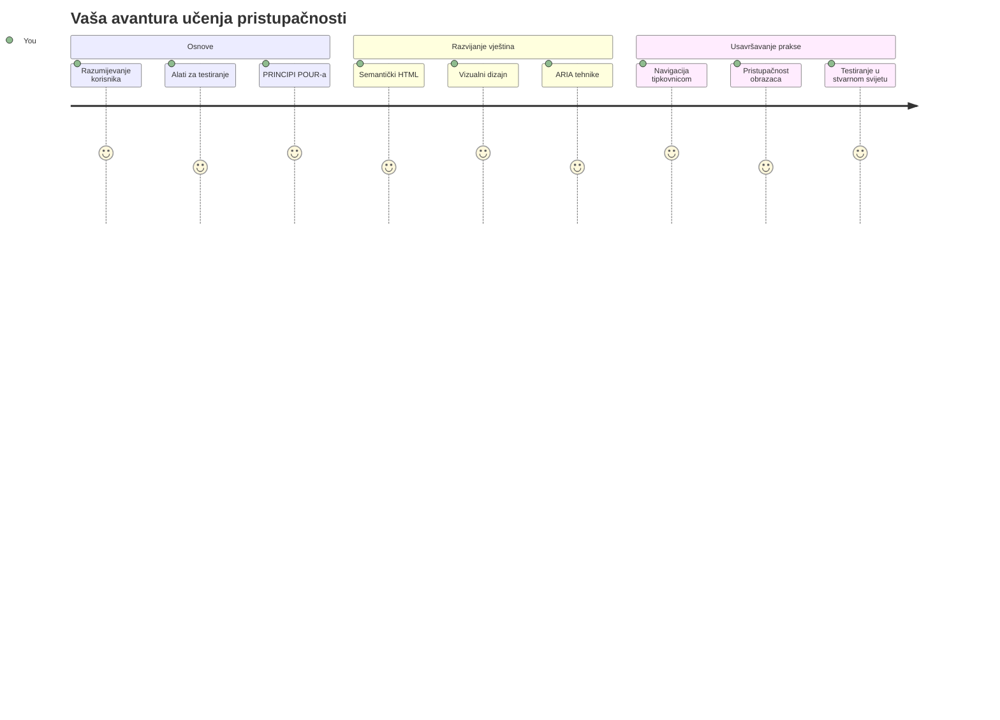
## Predpredavanje kviz
[Predpredavanje kviz](https://ff-quizzes.netlify.app/web/)

> Moć weba leži u njegovoj univerzalnosti. Pristup svima bez obzira na invaliditet je ključan aspekt.
>
> \- Sir Timothy Berners-Lee, direktor W3C-a i izumitelj World Wide Weba

Evo nečega što bi vas moglo iznenaditi: kada izrađujete pristupačne web stranice, ne pomažete samo osobama s invaliditetom—već zapravo poboljšavate web za svakoga!

Jeste li ikada primijetili one prilaze na rubnicima ulica? Izvorno su izrađeni za invalidska kolica, ali sada pomažu ljudima s dječjim kolicima, dostavljačima s kolica, putnicima s koferima na kotačićima i biciklistima. Upravo tako funkcionira pristupačni dizajn weba—rješenja koja pomažu jednoj skupini često u konačnici pomažu svima. Lijepo, zar ne?

U ovom ćemo satu istražiti kako stvoriti web stranice koje doista funkcioniraju za svakoga, bez obzira na način kojime pregledavaju web. Otkrit ćete praktične tehnike koje su već ugrađene u web standarde, isprobati alate za testiranje i vidjeti kako pristupačnost čini vaše stranice upotrebljivijima za sve korisnike.

Na kraju ovog sata steći ćete samopouzdanje da pristupačnost postane prirodan dio vašeg razvojneg tijeka rada. Spremni za istraživanje kako promišljene odluke u dizajnu mogu otvoriti web milijardama korisnika? Krenimo!

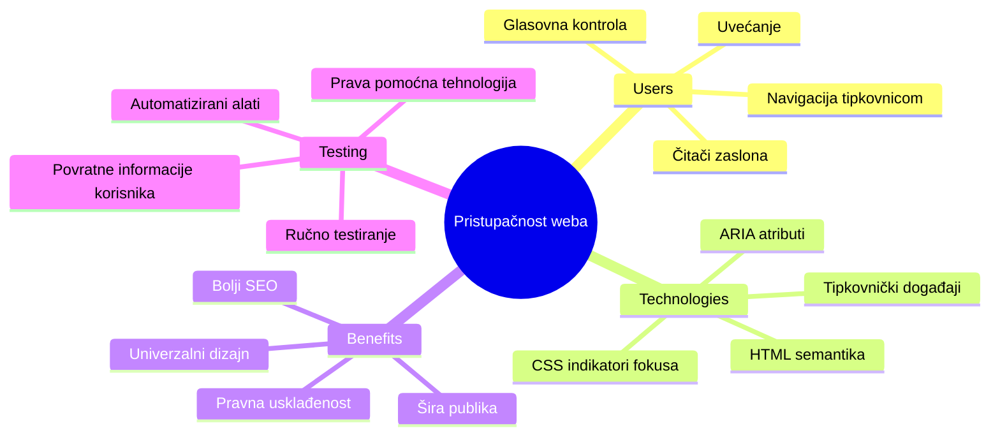
> Ovaj sat možete pohađati na [Microsoft Learn](https://docs.microsoft.com/learn/modules/web-development-101/accessibility/?WT.mc_id=academic-77807-sagibbon)!

## Razumijevanje asistivnih tehnologija

Prije nego što se bacimo na kodiranje, odvojimo trenutak da shvatimo kako osobe s različitim sposobnostima zapravo doživljavaju web. Ovo nije samo teorija—razumijevanje ovih stvarnih obrazaca navigacije učinit će vas znatno boljim programerom!

Asistivne tehnologije su prilično nevjerojatni alati koji pomažu ljudima s invaliditetom da na načine koji bi vas mogli iznenaditi koriste web stranice. Jednom kada ovladate time kako ove tehnologije funkcioniraju, stvaranje pristupačnih web iskustava postaje znatno intuitivnije. To je kao da učite gledati svoj kod očima nekoga drugog.

### Čitači zaslona

[Čitači zaslona](https://en.wikipedia.org/wiki/Screen_reader) su prilično sofisticirani tehnologijski alati koji pretvaraju digitalni tekst u govor ili brajicu. Iako ih primarno koriste osobe s oštećenjima vida, također su izuzetno korisni za korisnike s poteškoćama u učenju poput disleksije.

Volim razmišljati o čitaču zaslona kao o jako pametnom naratoru koji vam čita knjigu. Čita sadržaj naglas u logičkom redoslijedu, najavljuje interaktivne elemente poput "gumb" ili "poveznica" te omogućuje prečace na tipkovnici za brzo preskakanje po stranici. Ali evo bitnog dijela—čitači zaslona mogu čarobno raditi samo ako izgradimo web stranice s pravilnom strukturom i smislom sadržaja. Tu nastupate vi kao programer!

**Popularni čitači zaslona na platformama:**
- **Windows**: [NVDA](https://www.nvaccess.org/about-nvda/) (besplatan i najpopularniji), [JAWS](https://webaim.org/articles/jaws/), [Narrator](https://support.microsoft.com/windows/complete-guide-to-narrator-e4397a0d-ef4f-b386-d8ae-c172f109bdb1/?WT.mc_id=academic-77807-sagibbon) (ugrađeni)
- **macOS/iOS**: [VoiceOver](https://support.apple.com/guide/voiceover/welcome/10) (ugrađeni i vrlo sposoban)
- **Android**: [TalkBack](https://support.google.com/accessibility/android/answer/6283677) (ugrađeni)
- **Linux**: [Orca](https://wiki.gnome.org/Projects/Orca) (besplatan i open-source)

**Kako čitači zaslona navigiraju web sadržaj:**

Čitači zaslona nude više metoda navigacije koje olakšavaju pregledavanje iskusnim korisnicima:
- **Sekvencijalno čitanje**: Čita sadržaj od vrha prema dnu, kao čitanje knjige
- **Navigacija po oznakama**: Preskače između dijelova stranice (zaglavlje, navigacija, glavni dio, podnožje)
- **Navigacija po naslovima**: Preskače između naslova radi razumijevanja strukture stranice
- **Liste poveznica**: Generira listu svih poveznica za brzi pristup
- **Kontrole obrasca**: Izravna navigacija između polja unosa i gumba

> 💡 **Evo nečega što me zadivilo**: 68% korisnika čitača zaslona primarno navigira pomoću naslova ([WebAIM Survey](https://webaim.org/projects/screenreadersurvey9/#finding)). To znači da vaša struktura naslova služi kao karta korisnicima—kada je dobro postavljena, uistinu pomažete ljudima da brže pronađu sadržaj!

### Izgradnja tijeka rada za testiranje

Evo dobre vijesti—učinkovito testiranje pristupačnosti ne mora biti neodoljivo! Trebali biste kombinirati automatizirane alate (koji su sjajni za hvatanje očitih problema) sa nekim praktičnim testiranjem. Evo sustavnog pristupa koji sam otkrio da hvata najviše problema bez da vam oduzme cijeli dan:

**Osnovni tijek rada ručnog testiranja:**

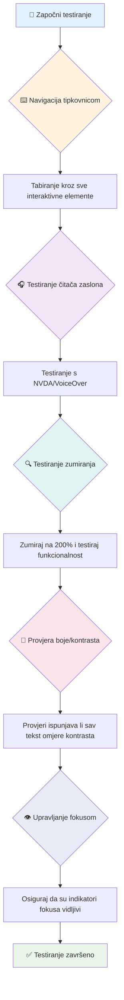
**Korak-po-korak kontrolni popis za testiranje:**
1. **Navigacija samo tipkovnicom**: Koristite samo Tab, Shift+Tab, Enter, Space i strelice
2. **Testiranje čitačem zaslona**: Omogućite NVDA, VoiceOver ili Narratora i navigirajte s zatvorenim očima
3. **Testiranje zumiranja**: Testirajte na razinama povećanja 200% i 400%
4. **Provjera kontrasta boja**: Provjerite sav tekst i UI komponente
5. **Testiranje indikatora fokusa**: Osigurajte da svi interaktivni elementi imaju vidljivo stanje fokusa

✅ **Počnite s Lighthouseom**: Otvorite DevTools u pregledniku, pokrenite Lighthouse reviziju pristupačnosti i koristite rezultate da usmjerite svoja ručna testiranja.

### Alati za zumiranje i povećanje

Znate onaj osjećaj kada prstima štipate zaslon telefona da povećate tekst jer je premalen ili kada se mrštite na zaslon prijenosnog računala na jakom suncu? Mnogi korisnici svakodnevno koriste alate za povećanje kako bi sadržaj bio čitljiv. To uključuje osobe s oštećenim vidom, starije osobe i svakoga tko je ikada pokušao čitati web vani.

Moderne tehnologije zumiranja nadilaze samo povećavanje predmeta. Razumijevanje kako ovi alati funkcioniraju pomoći će vam da stvorite responzivne dizajne koji ostaju funkcionalni i privlačni na bilo kojoj razini povećanja.

**Sposobnosti modernog povećanja u preglednicima:**
- **Zumiranje stranice**: Proporcionalno se povećava sav sadržaj (tekst, slike, raspored) - to je preferirana metoda
- **Zumiranje samo teksta**: Povećava veličinu fonta zadržavajući izvorni raspored
- **Zumiranje štipanjem**: Pokreti za mobilne uređaje za privremeno povećanje
- **Podrška preglednika**: Svi moderni preglednici podržavaju zumiranje do 500% bez prekida funkcionalnosti

**Specijalizirani softver za povećanje:**
- **Windows**: [Povećalo](https://support.microsoft.com/windows/use-magnifier-to-make-things-on-the-screen-easier-to-see-414948ba-8b1c-d3bd-8615-0e5e32204198) (ugrađeni), [ZoomText](https://www.freedomscientific.com/training/zoomtext/getting-started/)
- **macOS/iOS**: [Zoom](https://www.apple.com/accessibility/mac/vision/) (ugrađeni s naprednim značajkama)

> ⚠️ **Dizajnerska napomena**: WCAG zahtijeva da sadržaj ostane funkcionalan pri zumiranju do 200%. Na toj razini horizontalno pomicanje trebalo bi biti minimalno, a svi interaktivni elementi trebaju ostati dostupni.

✅ **Testirajte svoj responzivni dizajn**: Zumirajte preglednik na 200% i 400%. Prilagođava li se vaš raspored uredno? Možete li još uvijek pristupiti svim funkcionalnostima bez prevelikog pomicanja?

## Moderni alati za testiranje pristupačnosti

Sada kada razumijete kako ljudi navigiraju webom koristeći asistivne tehnologije, istražimo alate koji vam pomažu graditi i testirati pristupačne web stranice.

Razmislite o tome ovako: automatizirani alati su izvrsni u hvatanju očitih problema (poput nedostajućeg alt teksta), dok vam ručno testiranje pomaže osigurati da se vaša stranica stvarno dobro koristi u stvarnom svijetu. Zajedno vam daju povjerenje da vaše stranice funkcioniraju za svakoga.

### Testiranje kontrasta boja

Evo dobre vijesti: kontrast boja je jedan od najčešćih problema pristupačnosti, ali i jedan od najlakših za ispraviti. Dobar kontrast koristi svima—od korisnika s oštećenjem vida do ljudi koji pokušavaju čitati s telefona na plaži.

**WCAG zahtjevi za kontrast:**

| Vrsta teksta | WCAG AA (Minimalno) | WCAG AAA (Poboljšano) |
|--------------|---------------------|-----------------------|
| **Obični tekst** (ispod 18pt) | Omjer kontrasta 4.5:1 | Omjer kontrasta 7:1 |
| **Veliki tekst** (18pt+ ili 14pt+ podebljano) | Omjer kontrasta 3:1 | Omjer kontrasta 4.5:1 |
| **UI komponente** (gumbi, obrubi obrazaca) | Omjer kontrasta 3:1 | Omjer kontrasta 3:1 |

**Osnovni alati za testiranje:**
- [Colour Contrast Analyser](https://www.tpgi.com/color-contrast-checker/) - Desktop aplikacija s odabiračem boja
- [WebAIM Contrast Checker](https://webaim.org/resources/contrastchecker/) - Web alat s trenutnim povratnim informacijama
- [Stark](https://www.getstark.co/) - dodatak za dizajnerske alate kao Figma, Sketch, Adobe XD
- [Accessible Colors](https://accessible-colors.com/) - Pronađite pristupačne palete boja

✅ **Izgradite bolje palete boja**: Počnite s bojama svojeg brenda i koristite alate za provjeru kontrasta kako biste stvorili pristupačne varijacije. Dokumentirajte ih kao pristupačne boje u svom sustavu dizajna.

### Sveobuhvatni audit pristupačnosti

Najdjelotvornije testiranje pristupačnosti kombinira više pristupa. Nijedan alat sam ne može uhvatiti sve, pa izgradnja rutine testiranja s različitim metodama osigurava temeljitu pokrivenost.

**Testiranje u pregledniku (ugrađeno u DevTools):**
- **Chrome/Edge**: Lighthouse revizija pristupačnosti + pristupačni panel
- **Firefox**: Accessibility Inspector s detaljnim prikazom stabla
- **Safari**: Kartica revizije u Web Inspectoru s simulacijom VoiceOvera

**Profesionalni dodaci za testiranje:**
- [axe DevTools](https://www.deque.com/axe/devtools/) - industrijski standard za automatizirano testiranje
- [WAVE](https://wave.webaim.org/extension/) - vizualna povratna informacija s označavanjem grešaka
- [Accessibility Insights](https://accessibilityinsights.io/) - Microsoftov sveobuhvatni paket za testiranje

**Alati naredbenog retka i integracija CI/CD:**
- [axe-core](https://github.com/dequelabs/axe-core) - JavaScript knjižnica za automatizirano testiranje
- [Pa11y](https://pa11y.org/) - alat za testiranje pristupačnosti s naredbenog retka
- [Lighthouse CI](https://github.com/GoogleChrome/lighthouse-ci) - automatizirano bodovanje pristupačnosti

> 🎯 **Cilj testiranja**: Ciljajte na Lighthouse rezultat pristupačnosti od 95+ kao osnovnu vrijednost. Zapamtite, automatizirani alati hvataju samo oko 30-40% problema—ručno testiranje je i dalje nužno!

### 🧠 **Provjera vještina testiranja: Spremni za pronalazak problema?**

**Pogledajmo kako se osjećate u vezi testiranja pristupačnosti:**
- Koja vam se metoda testiranja sada čini najpristupačnijom?
- Možete li zamisliti korištenje samo tipkovnice za cijeli dan?
- Koja je jedna prepreka pristupačnosti koju ste osobno iskusili na internetu?

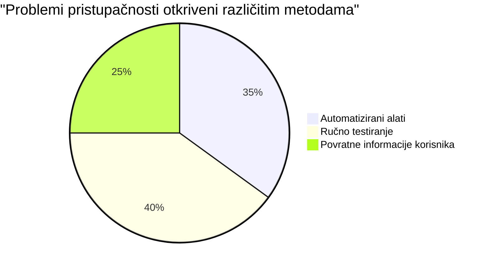
> **Poticaj samopouzdanja**: Profesionalni testeri pristupačnosti koriste upravo ovu kombinaciju metoda. Učite industrijski standard!

## Izgradnja pristupačnosti od temelja

Ključ uspjeha u pristupačnosti je izgraditi je u temelje od prvog dana. Znam da je primamljivo misliti "Dodam pristupačnost kasnije," ali to je kao pokušavati dodati rampu kući nakon što je već izgrađena. Moguće? Da. Jednostavno? Ne baš.

Razmislite o pristupačnosti kao o planiranju kuće—mnogo je lakše uključiti pristupačnost za invalidska kolica u početne arhitektonske planove nego kasnije sve retrofittingom prilagođavati.

### Principi POUR: Vaši temelji pristupačnosti

Smjernice za pristupačnost web sadržaja (WCAG) temelje se na četiri osnovna principa koja čine akronim POUR. Ne brinite—ovo nisu dosadni akademski koncepti! Oni su zapravo praktične smjernice za stvaranje sadržaja koji funkcionira za svakoga.

Nakon što ovladate POUR-om, donošenje odluka o pristupačnosti postaje znatno intuitivnije. To je kao da imate mentalni kontrolni popis koji vodi vaše dizajnerske izbore. Razložimo ih:

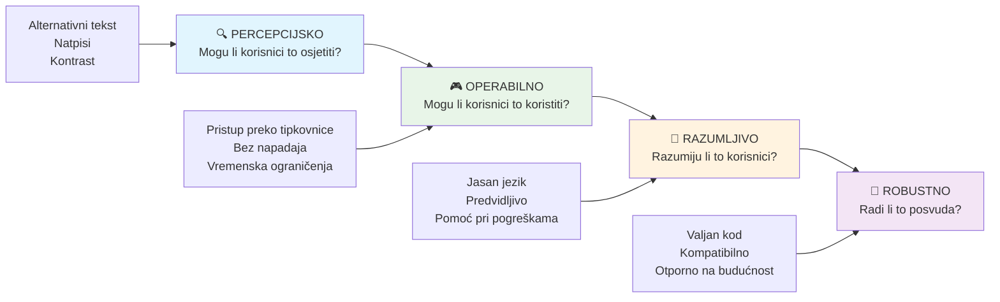
**🔍 Percepcijsko**: Informacije moraju biti prikazane na način na koji ih korisnici mogu percipirati svojim dostupnim osjetilima

- Osigurajte tekstualne alternative za ne-tekstualni sadržaj (slike, video, zvuk)
- Osigurajte dovoljan kontrast boja za sav tekst i UI komponente
- Nudite titlove i transkripte za multimedijski sadržaj
- Dizajnirajte sadržaj koji ostaje funkcionalan pri uvećanju do 200%
- Koristite višestruke senzorne karakteristike (ne samo boju) za prenošenje informacija

**🎮 Operativno**: Sve komponente sučelja moraju biti upravljive dostupnim metodama unosa

- Omogućite svu funkcionalnost putem navigacije tipkovnicom
- Korisnicima omogućite dovoljno vremena za čitanje i interakciju sa sadržajem
- Izbjegavajte sadržaj koji može izazvati napadaje ili vestibularne poremećaje
- Pomognite korisnicima u efikasnoj navigaciji jasnom strukturom i oznakama
- Osigurajte da interaktivni elementi imaju adekvatne veličine ciljeva (najmanje 44px)

**📖 Razumljivo**: Informacije i način rada sučelja moraju biti jasni i razumljivi

- Koristite jasan, jednostavan jezik prikladan vašoj publici
- Osigurajte da sadržaj izgleda i radi predvidljivo i dosljedno
- Pružite jasne upute i poruke o pogreškama za unos korisnika
- Pomognite korisnicima razumjeti i ispraviti pogreške u obrascima
- Organizirajte sadržaj logičnim redoslijedom čitanja i hijerarhijom informacija

**💪 Robusno**: Sadržaj mora pouzdano funkcionirati na različitim tehnologijama i asistivnim uređajima

- **Koristite valjani, semantički HTML kao temelj**
- **Osigurajte kompatibilnost s postojećim i budućim asistivnim tehnologijama**
- **Slijedite web standarde i najbolje prakse za označavanje**
- **Testirajte u različitim preglednicima, na različitim uređajima i s pomoćnim alatima**
- **Strukturirajte sadržaj tako da se postupno prilagođava kad napredne značajke nisu podržane**

### 🎯 **Provjera POUR principa: Kako ga učvrstiti**

**Brza refleksija na temelje:**
- Možete li se sjetiti značajke web stranice koja krši svaki od POUR principa?
- Koji vam princip kao programeru djeluje najprirodnije?
- Kako bi ti principi mogli poboljšati dizajn za sve, a ne samo za osobe s invaliditetom?

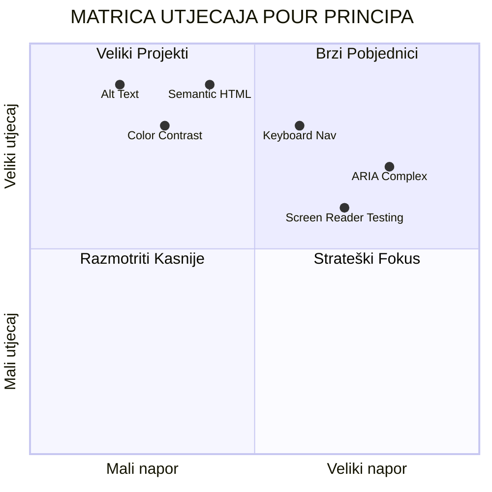
> **Zapamtite**: Počnite s poboljšanjima koja imaju velik utjecaj i malu potrošnju truda. Semantički HTML i alt tekst daju vam najveći pristupačni napredak uz najmanji napor!

## Izrada pristupačnog vizualnog dizajna

Dobar vizualni dizajn i pristupačnost idu ruku pod ruku. Kad dizajnirate imajući pristupačnost na umu, često otkrijete da ti ograničenja vode do čišćih, elegantnijih rješenja koja koriste svim korisnicima.

Istražimo kako stvoriti vizualno privlačne dizajne koji funkcioniraju za sve, bez obzira na njihove vizualne sposobnosti ili uvjete pod kojima gledaju vaš sadržaj.

### Strategije boja i vizualne pristupačnosti

Boja je snažan komunikacijski alat, ali nikad ne bi trebala biti jedini način na koji prenosite važne informacije. Dizajniranje izvan boje stvara robusnije, inkluzivnije iskustvo koje djeluje u više situacija.

**Dizajnirajte za razlike u percepciji boja:**

Otprilike 8% muškaraca i 0,5% žena ima neki oblik teškoće u percepciji boja (često nazvan "sljepoćom za boje"). Najčešći tipovi su:
- **Deuteranopija**: Teškoće u razlikovanju crvene i zelene
- **Protanopija**: Crvena se čini tamnijom
- **Tritanopija**: Teškoće s plavom i žutom (rijetko)

**Inkluzivne strategije boja:**

```css
/* ❌ Bad: Using only color to indicate status */
.error { color: red; }
.success { color: green; }

/* ✅ Good: Color plus icons and context */
.error {
  color: #d32f2f;
  border-left: 4px solid #d32f2f;
}
.error::before {
  content: "⚠️";
  margin-right: 8px;
}

.success {
  color: #2e7d32;
  border-left: 4px solid #2e7d32;
}
.success::before {
  content: "✅";
  margin-right: 8px;
}
```

**Iza osnovnih zahtjeva kontrasta:**
- Testirajte svoje odabire boja pomoću simulatora za sljepoću na boje
- Koristite uzorke, teksture ili oblike uz boje
- Osigurajte da interaktivna stanja ostanu prepoznatljiva bez boje
- Razmotrite kako vaš dizajn izgleda u načinu visokog kontrasta

✅ **Testirajte pristupačnost vaših boja**: Koristite alate poput [Coblis](https://www.color-blindness.com/coblis-color-blindness-simulator/) da vidite kako vaša stranica izgleda korisnicima s različitim vrstama teškoća u percepciji boja.

### Pokazivači fokusa i dizajn interakcije

Pokazivači fokusa su digitalni ekvivalent pokazivača miša — pokazuju korisnicima tipkovnice gdje se nalaze na stranici. Dobro dizajnirani pokazivači fokusa poboljšavaju iskustvo za sve tako da čine interakcije jasnima i predvidivima.

**Najbolje prakse modernih pokazivača fokusa:**

```css
/* Enhanced focus styles that work across browsers */
button:focus-visible {
  outline: 2px solid #0066cc;
  outline-offset: 2px;
  box-shadow: 0 0 0 4px rgba(0, 102, 204, 0.25);
}

/* Remove focus outline for mouse users, preserve for keyboard users */
button:focus:not(:focus-visible) {
  outline: none;
}

/* Focus-within for complex components */
.card:focus-within {
  box-shadow: 0 0 0 3px rgba(74, 144, 164, 0.5);
  border-color: #4A90A4;
}

/* Ensure focus indicators meet contrast requirements */
.custom-focus:focus-visible {
  outline: 3px solid #ffffff;
  outline-offset: 2px;
  box-shadow: 0 0 0 6px #000000;
}
```

**Zahtjevi za pokazivače fokusa:**
- **Vidljivost**: Mora imati omjer kontrasta barem 3:1 s okolinom
- **Širina**: Minimalna debljina od 2px oko cijelog elementa
- **Upornost**: Treba ostati vidljiv dok se fokus ne premjesti negdje drugdje
- **Razlikovanje**: Mora biti vizualno različit od drugih stanja sučelja

> 💡 **Savjet za dizajn**: Odlični pokazivači fokusa često koriste kombinaciju obruba, sjene okvira i promjena boje kako bi osigurali vidljivost na različitim pozadinama i okolnostima.

✅ **Provjerite pokazivače fokusa**: Tabirajte kroz vašu web stranicu i zabilježite koji elementi imaju jasne pokazivače fokusa. Ima li koji koji je teško vidjeti ili potpuno nedostaje?

### Semantički HTML: Temelj pristupačnosti

Semantički HTML je poput davanja GPS sustava pomoćnim tehnologijama za vašu web stranicu. Kad koristite ispravne HTML elemente za njihovu namjenu, zapravo dajete čitačima zaslona, tipkovnicama i drugim alatima detaljnu kartu za učinkovitu navigaciju korisnika.

Evo analogije koja mi je stvarno pala na pamet: semantički HTML je razlika između dobro organizirane knjižnice s jasnim kategorijama i korisnim oznakama naspram skladišta gdje su knjige nasumično razbacane. Oba mjesta imaju iste knjige, ali u kojem biste radije pokušali nešto pronaći? Upravo tako!

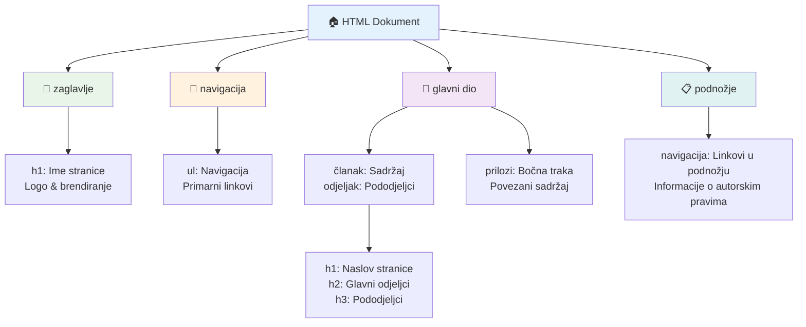
**Građevni blokovi pristupačne strukture stranice:**

```html
<!-- Landmark elements provide page navigation structure -->
<header>
  <h1>Your Site Name</h1>
  <nav aria-label="Main navigation">
    <ul>
      <li><a href="/home">Home</a></li>
      <li><a href="/about">About</a></li>
      <li><a href="/services">Services</a></li>
    </ul>
  </nav>
</header>

<main>
  <article>
    <header>
      <h1>Article Title</h1>
      <p>Published on <time datetime="2024-10-14">October 14, 2024</time></p>
    </header>
    
    <section>
      <h2>First Section</h2>
      <p>Content that relates to this section...</p>
    </section>
    
    <section>
      <h2>Second Section</h2>
      <p>More related content...</p>
    </section>
  </article>
  
  <aside>
    <h2>Related Links</h2>
    <nav aria-label="Related articles">
      <ul>
        <li><a href="/related-1">First related article</a></li>
        <li><a href="/related-2">Second related article</a></li>
      </ul>
    </nav>
  </aside>
</main>

<footer>
  <p>&copy; 2024 Your Site Name. All rights reserved.</p>
  <nav aria-label="Footer links">
    <ul>
      <li><a href="/privacy">Privacy Policy</a></li>
      <li><a href="/contact">Contact Us</a></li>
    </ul>
  </nav>
</footer>
```

**Zašto semantički HTML mijenja pristupačnost:**

| Semantički Element | Svrha | Prednost za čitače zaslona |
|--------------------|-------|----------------------------|
| `<header>` | Zaglavlje stranice ili sekcije | "Banner landmark" - brza navigacija na vrh |
| `<nav>` | Navigacijski linkovi | "Navigation landmark" - popis odjeljaka navigacije |
| `<main>` | Primarni sadržaj stranice | "Main landmark" - skok izravno na sadržaj |
| `<article>` | Samostalni sadržaj | Označava granice članka |
| `<section>` | Tematske skupine sadržaja | Pruža strukturu sadržaja |
| `<aside>` | Povezani sadržaj u bočnoj traci | "Complementary landmark" |
| `<footer>` | Podnožje stranice ili sekcije | "Contentinfo landmark" |

**Supermoći čitača zaslona sa semantičkim HTML-om:**
- **Navigacija po orijentirima**: Skočite između glavnih dijelova stranice trenutno
- **Nacrt naslova**: Generira sadržaj po strukturi naslova
- **Popisi elemenata**: Stvara popise svih linkova, gumba ili kontrola obrazaca
- **Svijest o kontekstu**: Razumije veze između odjeljaka sadržaja

> 🎯 **Brzi test**: Pokušajte navigirati vašom stranicom pomoću čitača zaslona koristeći prečace za orijentire (D za landmark, H za naslov, K za link u NVDA/JAWS). Ima li navigacija smisla?

### 🏗️ **Provjera majstorstva semantičkog HTML-a: Izgradnja snažnih temelja**

**Procijenimo vaše semantičko razumijevanje:**
- Možete li prepoznati orijentire na web stranici samo gledajući HTML?
- Kako biste prijatelju objasnili razliku između `<section>` i `<div>`?
- Što biste prvo provjerili ako korisnik čitača zaslona prijavi probleme s navigacijom?

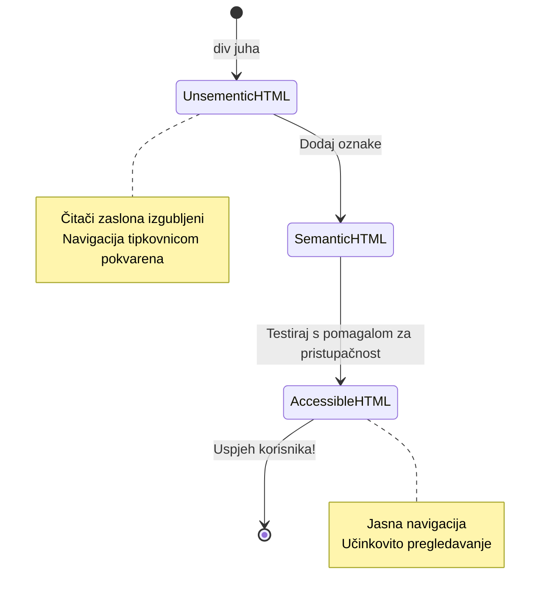
> **Profinski savjet**: Dobar semantički HTML automatski rješava oko 70% problema pristupačnosti. Savladajte taj temelj i na dobrom ste putu!

✅ **Provjerite svoju semantičku strukturu**: Upotrijebite panel Pristupačnosti u alatima za razvijanje preglednika da vidite stablo pristupačnosti i osigurajte da vaš markup stvara logičku strukturu.

### Hijerarhija naslova: Izrada logičnog sadržajnog pregleda

Naslovi su apsolutno ključni za pristupačan sadržaj — oni su poput kralježnice koja sve drži zajedno. Korisnici čitača zaslona jako se oslanjaju na naslove da razumiju i navigiraju vašim sadržajem. Razmislite o tome kao o davanju sadržaja za vašu stranicu.

**Evo zlatnog pravila za naslove:**
Nikad nemojte preskakati razine. Uvijek idite logičnim redoslijedom od `<h1>` do `<h2>` do `<h3>`, i tako dalje. Sjećate li se pravljenja skica u školi? To je isti princip — ne biste skočili s „I. Glavna misao“ pravo na „C. Pod-pod-misao“ bez „A. Pod-misli“ između, zar ne?

**Primjer savršene strukture naslova:**

```html
<!-- ✅ Excellent: Logical, hierarchical progression -->
<main>
  <h1>Complete Guide to Web Accessibility</h1>
  
  <section>
    <h2>Understanding Screen Readers</h2>
    <p>Introduction to screen reader technology...</p>
    
    <h3>Popular Screen Reader Software</h3>
    <p>NVDA, JAWS, and VoiceOver comparison...</p>
    
    <h3>Testing with Screen Readers</h3>
    <p>Step-by-step testing instructions...</p>
  </section>
  
  <section>
    <h2>Color and Contrast Guidelines</h2>
    <p>Designing with sufficient contrast...</p>
    
    <h3>WCAG Contrast Requirements</h3>
    <p>Understanding the different contrast levels...</p>
    
    <h3>Testing Tools and Techniques</h3>
    <p>Tools for verifying contrast ratios...</p>
  </section>
</main>
```

```html
<!-- ❌ Problematic: Skipping levels, inconsistent structure -->
<h1>Page Title</h1>
<h3>Subsection</h3> <!-- Skipped h2 -->
<h2>This should come before h3</h2>
<h1>Another main heading?</h1> <!-- Multiple h1s -->
```

**Najbolje prakse naslova:**
- **Jedan `<h1>` po stranici**: Obično je to glavni naslov stranice ili primarni naslov sadržaja
- **Logičan napredak**: Nikad nemojte preskakati razine (h1 → h2 → h3, ne h1 → h3)
- **Opisni sadržaj**: Naslovi neka budu smisleni i van konteksta
- **Vizualno stiliziranje s CSS-om**: Koristite CSS za izgled, HTML razine za strukturu

**Statistika navigacije po naslovima za čitače zaslona:**
- 68% korisnika čitača zaslona koristi naslove za navigaciju ([WebAIM Survey](https://webaim.org/projects/screenreadersurvey9/#finding))
- Korisnici očekuju pronalazak logičnog sadržajnog pregleda
- Naslovi su najbrži način da se razumije struktura stranice

> 💡 **Profinski savjet**: Koristite proširenja preglednika poput "HeadingsMap" za vizualizaciju strukture naslova. Trebalo bi se čitati kao dobro organizirani sadržaj.

✅ **Testirajte strukturu naslova**: Koristite navigaciju po naslovima čitača zaslona (tipka H u NVDA) da preskačete kroz naslove. Priča li progresija logično priču vašeg sadržaja?

### Napredne tehnike vizualne pristupačnosti

Iza osnovnih kontrasta i boja postoje sofisticirane tehnike koje pomažu stvarati stvarno inkluzivna vizualna iskustva. Ove metode osiguravaju da vaš sadržaj funkcionira u različitim uvjetima gledanja i s pomoćnim tehnologijama.

**Ključne strategije vizualne komunikacije:**

- **Višestruki modaliteti povratne informacije**: Kombinirajte vizualne, tekstualne i povremeno audio znakove
- **Postupno otkrivanje**: Prikazujte informacije u probavljivim dijelovima
- **Konzistentni obrasci interakcije**: Koristite poznate UI konvencije
- **Responzivna tipografija**: Prilagodite veličinu teksta na uređajima
- **Stanja učitavanja i pogrešaka**: Pružite jasnu povratnu informaciju za sve korisničke radnje

**CSS alati za poboljšanu pristupačnost:**

```css
/* Screen reader only text - visually hidden but accessible */
.sr-only {
  position: absolute;
  width: 1px;
  height: 1px;
  padding: 0;
  margin: -1px;
  overflow: hidden;
  clip: rect(0, 0, 0, 0);
  white-space: nowrap;
  border: 0;
}

/* Skip link for keyboard navigation */
.skip-link {
  position: absolute;
  top: -40px;
  left: 6px;
  background: #000000;
  color: #ffffff;
  padding: 8px 16px;
  text-decoration: none;
  border-radius: 4px;
  font-weight: bold;
  transition: top 0.3s ease;
  z-index: 1000;
}

.skip-link:focus {
  top: 6px;
}

/* Reduced motion respect */
@media (prefers-reduced-motion: reduce) {
  .skip-link {
    transition: none;
  }
  
  * {
    animation-duration: 0.01ms !important;
    animation-iteration-count: 1 !important;
    transition-duration: 0.01ms !important;
  }
}

/* High contrast mode support */
@media (prefers-contrast: high) {
  .button {
    border: 2px solid;
  }
}
```

> 🎯 **Pristupačni uzorak**: "Skip link" (link za preskakanje) je ključan za korisnike tipkovnice. Trebao bi biti prvi fokusabilni element na vašoj stranici i odmah skočiti na glavni sadržaj.

✅ **Implementirajte preskakanje navigacije**: Dodajte skip linkove na svoje stranice i testirajte ih pritiskanjem Tab čim se stranica učita. Trebali bi se pojaviti i omogućiti vam skok na glavni sadržaj.

## Izrada smislenog teksta linka

Linkovi su doista autoceste weba, ali loše napisan tekst linka poput prometnih znakova koji samo pišu "Mjesto" umjesto "Centar Chicaga". Nije baš korisno, zar ne?

Evo nečega što mi je promijenilo pogled kad sam prvi put naučio: čitači zaslona mogu izvući sve linkove sa stranice i prikazati ih kao jedan veliki popis. Zamislite da vam netko preda imenik svakog linka na vašoj stranici. Bi li svaki link imao smisla sam za sebe? To je test koji vaš tekst linka mora proći!

### Razumijevanje obrazaca navigacije linkovima

Čitači zaslona nude snažne funkcije navigacije linkovima koje se oslanjaju na dobro napisane tekstove linkova:

**Metode navigacije linkovima:**
- **Sekvencijalno čitanje**: Linkovi se čitaju u kontekstu kao dio toka sadržaja
- **Generiranje popisa linkova**: Svi linkovi na stranici sastavljeni u pretraživi imenik
- **Brza navigacija**: Skakanje između linkova pomoću tipkovničkih prečaca (K u NVDA)
- **Funkcija pretraživanja**: Pronalaženje određenih linkova tipkanjem dijela teksta

**Zašto je kontekst važan:**
Kada korisnici čitača zaslona generiraju popis linkova, vide nešto poput ovoga:
- "Preuzmi izvještaj"
- "Saznaj više"
- "Klikni ovdje"
- "Pravila privatnosti"
- "Klikni ovdje"

Samo dva od tih linkova pružaju korisnu informaciju kad se čitaju izvan konteksta!

> 📊 **Utjecaj na korisnike**: Korisnici čitača zaslona pregledavaju popise linkova da brzo razumiju sadržaj stranice. Generički tekst linka prisiljava ih da se vraćaju u kontekst svakog linka, značajno usporavajući njihovo pretraživanje.

### Uobičajene pogreške u tekstu linka koje treba izbjegavati

Razumijevanje što ne funkcionira pomaže vam u prepoznavanju i ispravljanju problema pristupačnosti u postojećem sadržaju.

**❌ Generički tekst linka koji ne daje kontekst:**

```html
<!-- Meaningless when read from a link list -->
<p>Our sustainability efforts are detailed in our recent report. 
   <a href="/sustainability-2024.pdf">Click here</a> to view it.</p>

<!-- Repeated generic text throughout the page -->
<div class="article-card">
  <h3>Web Accessibility Guide</h3>
  <p>Learn the fundamentals...</p>
  <a href="/accessibility-guide">Read more</a>
</div>
<div class="article-card">
  <h3>Color Contrast Tips</h3>
  <p>Improve your design...</p>
  <a href="/color-contrast">Read more</a>
</div>

<!-- URLs as link text (difficult for screen readers to announce) -->
<p>Visit https://www.w3.org/WAI/WCAG21/quickref/ for WCAG guidelines.</p>

<!-- Vague action words -->
<a href="/contact">Go</a> | <a href="/about">See</a> | <a href="/help">View</a>
```

**Zašto ti obrasci ne uspijevaju:**
- **"Klikni ovdje"** ne govori korisnicima ništa o odredištu
- **"Pročitaj više"** ponovljeno više puta stvara zbunjenost
- **Sirove URL adrese** teško izgovaraju čitači zaslona
- **Pojedine riječi** poput "Idi" ili "Vidi" nemaju opisni kontekst

### Pisanje izvrsnog teksta linka

Opisni tekst linka koristi svima — korisnici koji vide mogu brzo skenirati linkove, a korisnici čitača zaslona odmah razumiju odredište.

**✅ Primjeri jasnog i opisnog teksta linka:**

```html
<!-- Descriptive text that explains the destination -->
<p>Our comprehensive <a href="/sustainability-2024.pdf">2024 sustainability report (PDF, 2.1MB)</a> details our environmental initiatives.</p>

<!-- Specific, unique link text for each card -->
<div class="article-card">
  <h3>Web Accessibility Guide</h3>
  <p>Learn the fundamentals of inclusive design...</p>
  <a href="/accessibility-guide">Read our complete web accessibility guide</a>
</div>
<div class="article-card">
  <h3>Color Contrast Tips</h3>
  <p>Improve your design with better color choices...</p>
  <a href="/color-contrast">Explore color contrast best practices</a>
</div>

<!-- Meaningful text instead of raw URLs -->
<p>The <a href="https://www.w3.org/WAI/WCAG21/quickref/">WCAG 2.1 Quick Reference guide</a> provides comprehensive accessibility guidelines.</p>

<!-- Descriptive action links -->
<a href="/contact">Contact our support team</a> | 
<a href="/about">About our company</a> | 
<a href="/help">Get help with your account</a>
```

**Najbolje prakse za tekst linka:**
- **Budite specifični**: "Preuzmite kvartalni financijski izvještaj" nasuprot "Preuzmi"
- **Uključite tip i veličinu datoteke**: "(PDF, 1.2MB)" za datoteke za preuzimanje
- **Navedite ako link otvara novu stranicu**: "(otvara se u novom prozoru)" kad je prikladno
- **Koristite aktivan jezik**: "Kontaktirajte nas" nasuprot "Kontakt stranica"
- **Budite sažeti**: Ciljajte 2-8 riječi kad je moguće

### Napredni obrasci pristupačnosti linkova

Ponekad ograničenja vizualnog dizajna ili tehnički zahtjevi traže posebna rješenja. Evo sofisticiranih tehnika za uobičajene izazovne scenarije:

**Korištenje ARIA za bogatiji kontekst:**

```html
<!-- When button text must be short but needs more context -->
<a href="/report.pdf" 
   aria-label="Download 2024 annual financial report, PDF format, 2.3MB">
  Download Report
</a>

<!-- When the full context comes from surrounding content -->
<h3 id="sustainability-heading">Sustainability Initiative</h3>
<p>Our efforts to reduce environmental impact...</p>
<a href="/sustainability-details" 
   aria-labelledby="sustainability-heading"
   aria-describedby="sustainability-summary">
  Learn more
</a>
<p id="sustainability-summary">Detailed breakdown of our 2024 environmental goals and achievements</p>
```

**Navođenje tipova datoteka i vanjskih odredišta:**

```html
<!-- Method 1: Include information in visible link text -->
<a href="/annual-report.pdf">
  Download our 2024 annual report (PDF, 2.3MB)
</a>

<!-- Method 2: Use screen reader-only text for file details -->
<a href="/annual-report.pdf">
  Download our 2024 annual report
  <span class="sr-only">(PDF format, 2.3MB)</span>
</a>

<!-- Method 3: External link indication -->
<a href="https://example.com" 
   target="_blank" 
   aria-describedby="external-link-warning">
  Visit external resource
</a>
<span id="external-link-warning" class="sr-only">
  (opens in new window)
</span>

<!-- Method 4: Using CSS for visual indicators -->
<a href="https://example.com" class="external-link">
  External resource
</a>
```

```css
/* Visual indicator for external links */
.external-link::after {
  content: " ↗";
  font-size: 0.8em;
  color: #666;
}

/* Screen reader announcement for external links */
.external-link::before {
  content: "External link: ";
  position: absolute;
  left: -10000px;
  width: 1px;
  height: 1px;
  overflow: hidden;
}
```

> ⚠️ **Važno**: Kad koristite `target="_blank"`, uvijek obavijestite korisnike da se link otvara u novom prozoru ili kartici. Neočekivane promjene navigacije mogu izazvati zbunjenost.

✅ **Testirajte kontekst vašeg linka**: Koristite alate za razvijanje preglednika da generirate popis svih linkova na stranici. Možete li razumjeti svrhu svakog linka bez ikakvog konstruktivnog konteksta?

## ARIA: Pojačavanje pristupačnosti HTML-a

[Accessible Rich Internet Applications (ARIA)](https://developer.mozilla.org/docs/Web/Accessibility/ARIA) je poput univerzalnog prevoditelja između vaših složenih web aplikacija i pomoćnih tehnologija. Kad HTML sam po sebi ne može izraziti sve što vaše interaktivne komponente rade, ARIA preuzima zadatak da popuni te praznine.

Volim ARIA zamišljati kao dodavanje korisnih bilješki vašem HTML-u — poput uputa za glumce u kazališnoj predstavi koje im pomažu razumjeti njihove uloge i odnose.

**Najvažnije pravilo o ARIA-i**: Uvijek koristite semantički HTML prvo, zatim dodajte ARIA-u za poboljšanje. Razmišljajte o ARIA-i kao o začinu, a ne glavnom jelu. Trebala bi pojasniti i unaprijediti vašu HTML strukturu, nikad je ne zamijeniti. Najprije dobro savladajte temelj!

### Strateška primjena ARIA-e

ARIA je moćan, no s moći dolazi i odgovornost. Nepravilna upotreba ARIA-e može učiniti pristupačnost gorom nego bez nje. Evo kada i kako je koristiti učinkovito:

**✅ Koristite ARIA-u kad:**
- stvarate prilagođene interaktivne widgete (akordeoni, kartice, karuseli)
- gradite dinamični sadržaj koji se mijenja bez ponovnog učitavanja stranice
- pružate dodatni kontekst za složene odnose UI-a
- označavate stanja učitavanja ili ažuriranja uživo
- stvarate aplikacijska sučelja s prilagođenim kontrolama

**❌ Izbjegavajte ARIA-u kad:**
- standardni HTML elementi već pružaju potrebnu semantiku
- niste sigurni kako to ispravno implementirati
- duplicira informacije koje već pruža semantički HTML
- niste testirali s pravom pomoćnom tehnologijom

> 🎯 **Zlatno pravilo ARIA-e**: "Nemojte mijenjati semantiku osim ako je zaista neophodno, uvijek osigurajte pristupačnost tipkovnice i testirajte s pravom pomoćnom tehnologijom."
**Pet kategorija ARIA-e:**

1. **Uloge**: Što je ovaj element? (`button`, `tab`, `dialog`)
2. **Svojstva**: Koje su njegove značajke? (`aria-required`, `aria-haspopup`)
3. **Stanja**: Koje je trenutno stanje? (`aria-expanded`, `aria-checked`)
4. **Orijentiri**: Gdje se nalazi u strukturi stranice? (`banner`, `navigation`, `main`)
5. **Regioni uživo**: Kako treba najaviti promjene? (`aria-live`, `aria-atomic`)

### Osnovni ARIA obrasci za moderne web aplikacije

Ovi obrasci rješavaju najčešće izazove pristupačnosti u interaktivnim web aplikacijama:

**Imenovanje i opis elemenata:**

```html
<!-- aria-label: Provides accessible name when visible text isn't sufficient -->
<button aria-label="Close newsletter subscription dialog">×</button>

<!-- aria-labelledby: References existing text as the accessible name -->
<section aria-labelledby="news-heading">
  <h2 id="news-heading">Latest News</h2>
  <!-- news content -->
</section>

<!-- aria-describedby: Links to additional descriptive text -->
<input type="password" 
       aria-describedby="pwd-requirements pwd-strength"
       required>
<div id="pwd-requirements">
  Password must contain at least 8 characters, including uppercase, lowercase, and numbers.
</div>
<div id="pwd-strength" aria-live="polite">
  <!-- Dynamic password strength indicator -->
</div>
```
  
**Regioni uživo za dinamički sadržaj:**

```html
<!-- Polite announcements (don't interrupt current speech) -->
<div aria-live="polite" id="status-updates">
  <!-- Status messages appear here -->
</div>

<!-- Assertive announcements (interrupt and announce immediately) -->
<div aria-live="assertive" id="urgent-alerts">
  <!-- Error messages and critical alerts -->
</div>

<!-- Loading states with live regions -->
<button id="submit-btn" aria-describedby="loading-status">
  Submit Application
</button>
<div id="loading-status" aria-live="polite" aria-atomic="true">
  <!-- "Processing your application..." appears here -->
</div>
```
  
**Primjer interaktivnog widgeta (akordeon):**

```html
<div class="accordion">
  <h3>
    <button aria-expanded="false" 
            aria-controls="panel-1" 
            id="accordion-trigger-1"
            class="accordion-trigger">
      Accessibility Guidelines
    </button>
  </h3>
  <div id="panel-1" 
       role="region"
       aria-labelledby="accordion-trigger-1" 
       hidden>
    <p>WCAG 2.1 provides comprehensive guidelines...</p>
  </div>
</div>
```
  
```javascript
// JavaScript za upravljanje stanjem akordeona
function toggleAccordion(trigger) {
  const panel = document.getElementById(trigger.getAttribute('aria-controls'));
  const isExpanded = trigger.getAttribute('aria-expanded') === 'true';
  
  // Prebaci stanja
  trigger.setAttribute('aria-expanded', !isExpanded);
  panel.hidden = isExpanded;
  
  // Najavi promjenu čitačima zaslona
  const status = document.getElementById('status-updates');
  status.textContent = isExpanded ? 'Section collapsed' : 'Section expanded';
}
```
  
### Najbolje prakse implementacije ARIA-e

ARIA je moćna, ali zahtijeva pažljivu implementaciju. Slijeđenje ovih smjernica pomaže osigurati da ARIA unapređuje, a ne ometa pristupačnost:

**🛡️ Temeljna načela:**

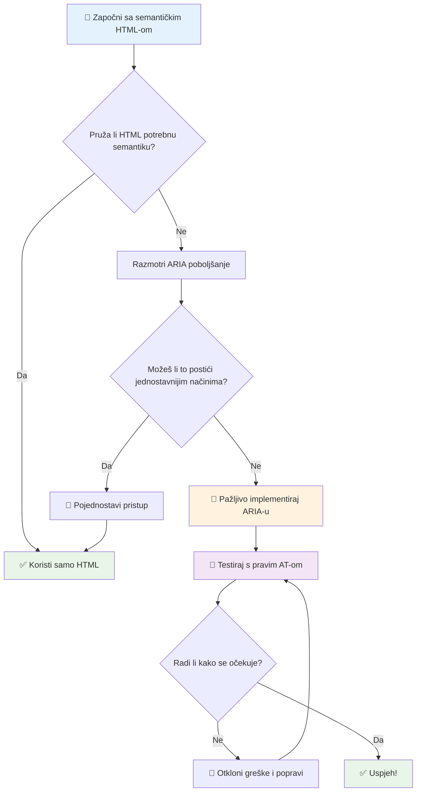
1. **Prvo semantički HTML**: Uvijek preferirajte `<button>` umjesto `<div role="button">`  
2. **Ne narušavajte semantiku**: Nikada ne nadjačavajte postojeće značenje HTML-a (izbjegavajte `<h1 role="button">`)  
3. **Održavajte pristupačnost s tipkovnicom**: Svi interaktivni ARIA elementi moraju biti u potpunosti pristupačni putem tipkovnice  
4. **Testirajte s pravim korisnicima**: Podrška za ARIA-u znatno varira između pomoćnih tehnologija  
5. **Započnite jednostavno**: Kompleksne ARIA implementacije imaju veću vjerojatnost pogrešaka

**🔍 Radni tijek testiranja:**

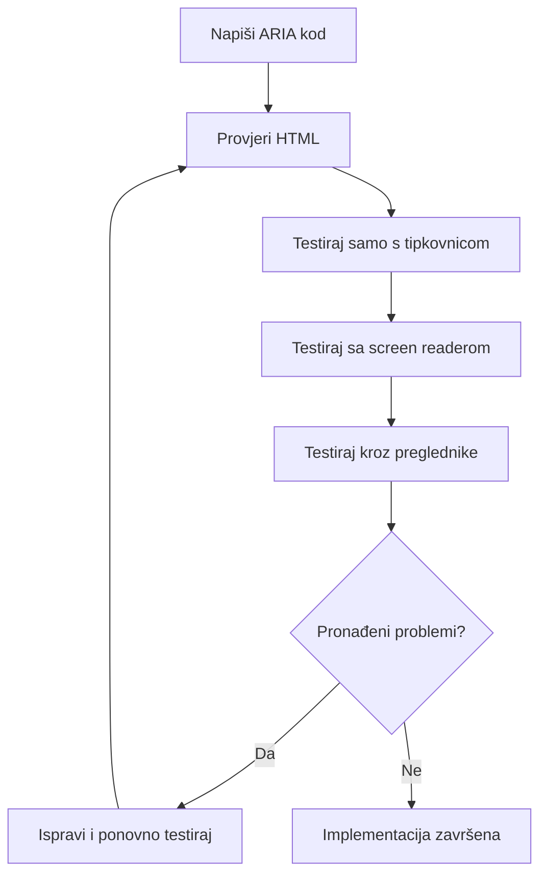
**🚫 Uobičajene ARIA pogreške koje treba izbjegavati:**

- **Protuslovne informacije**: Ne proturječite HTML semantici  
- **Pretjerano označavanje**: Previše ARIA informacija zbunjuje korisnike  
- **Statistička ARIA**: Zaboravljanje ažuriranja ARIA stanja prilikom promjena sadržaja  
- **Netestirane implementacije**: ARIA koja u teoriji radi, ali ne i u praksi  
- **Nedostatak podrške za tipkovnicu**: ARIA uloge bez pripadajućih interakcija na tipkovnici

> 💡 **Resursi za testiranje**: Koristite alate poput [accessibility-checker](https://www.npmjs.com/package/accessibility-checker) za automatiziranu ARIA validaciju, ali uvijek testirajte s pravim čitačima ekrana za potpun doživljaj.

### 🎭 **Provjera ARIA vještina: Spremni za složene interakcije?**

**Procijenite svoje ARIA samopouzdanje:**  
- Kada biste izabrali ARIA-u umjesto semantičkog HTML-a? (Nagovještaj: gotovo nikada!)  
- Možete li objasniti zašto je `<div role="button">` obično lošije od `<button>`?  
- Koja je najvažnija stvar za zapamtiti pri testiranju ARIA-e?

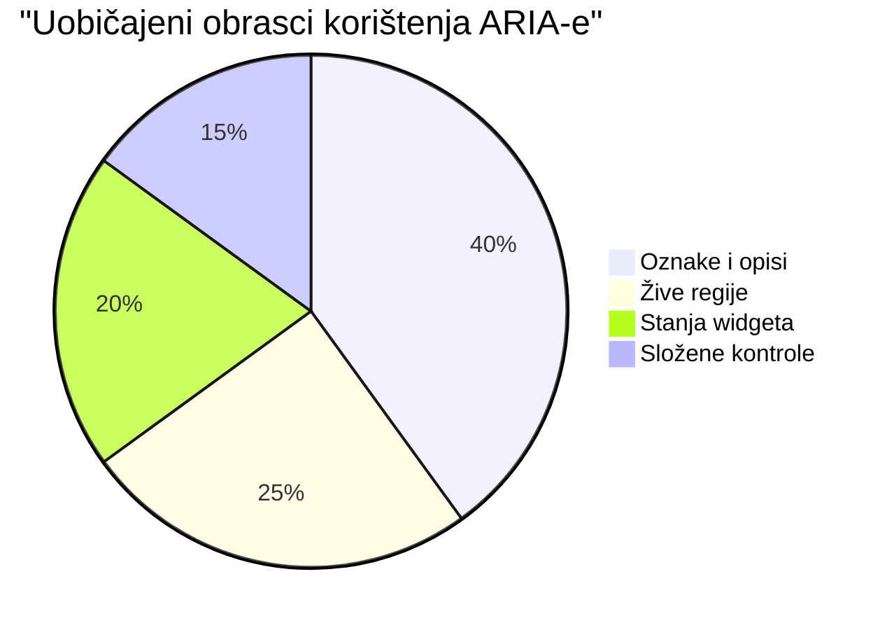
> **Ključni uvid**: Većina korištenja ARIA-e odnosi se na označavanje i opisivanje elemenata. Kompleksni obrasci widgeta su mnogo rjeđi nego što biste pomislili!

✅ **Učite od stručnjaka**: Proučite [ARIA Authoring Practices Guide](https://w3c.github.io/aria-practices/) za dokazane obrasce i implementacije složenih interaktivnih widgeta.

## Omogućavanje pristupačnosti slika i medija

Vizualni i audio sadržaj su ključni dijelovi modernog web doživljaja, no mogu stvarati prepreke ako nisu pažljivo realizirani. Cilj je osigurati da informacije i emocionalni utjecaj vaših medija dosegnu svakog korisnika. Kad se uhvatite u koštac, to postaje druga priroda.

Različite vrste medija zahtijevaju različite pristupe pristupačnosti. To je kao kuhanje — ne biste tretirali delikatnu ribu isto kao robusni odrezak. Razumijevanje tih razlika pomaže vam izabrati pravo rješenje za svaku situaciju.

### Strateška pristupačnost slika

Svaka slika na vašoj web stranici ima svrhu. Razumijevanje te svrhe pomaže vam napisati bolje alternativne tekstove i stvarati inkluzivnija iskustva.

**Četiri tipa slika i njihove strategije alt teksta:**  

**Informativne slike** - prenose važne informacije:  
```html

```
  
**Dekorativne slike** - samo vizualne, bez informativne vrijednosti:  
```html

```
  
**Funkcionalne slike** - služe kao gumbi ili kontrole:  
```html
<button>
  
</button>
```
  
**Složene slike** - grafikoni, dijagrami, infografike:  
```html

<div id="chart-description">
  <p>Detailed description: Sales data shows a steady increase across all quarters...</p>
</div>
```
  
### Pristupačnost videa i zvuka

**Zahtjevi za video:**  
- **Titlovi**: Tekstualna verzija govornog sadržaja i zvučnih efekata  
- **Audio opisi**: Naracija vizualnih elemenata za slabovidne korisnike  
- **Transkripti**: Potpuni tekst svih audio i vizualnih sadržaja  

```html
<video controls>
  <source src="video.mp4" type="video/mp4">
  <track kind="captions" src="captions.vtt" srclang="en" label="English">
  <track kind="descriptions" src="descriptions.vtt" srclang="en" label="Audio descriptions">
</video>
```
  
**Zahtjevi za audio:**  
- **Transkripti**: Tekstualna verzija cijelog govornog sadržaja  
- **Vizualni indikatori**: Za sadržaj samo s audio zapisom, pružite vizualne znakove

### Moderne tehnike za slike

**Korištenje CSS-a za dekorativne slike:**  
```css
.hero-section {
  background-image: url('decorative-hero.jpg');
  /* Decorative images in CSS don't need alt text */
}
```
  
**Prilagodljive slike s pristupačnošću:**  
```html
<picture>
  <source media="(min-width: 800px)" srcset="large-chart.png">
  <source media="(min-width: 400px)" srcset="medium-chart.png">
  
</picture>
```
  
✅ **Testirajte pristupačnost slika**: Koristite čitač ekrana za navigaciju stranicom sa slikama. Dobivate li dovoljno informacija za razumijevanje sadržaja?

## Tipkovnična navigacija i upravljanje fokusom

Mnogi korisnici koriste web isključivo preko tipkovnice. To uključuje osobe s motoričkim poteškoćama, iskusne korisnike kojima je tipkovnica brža od miša te sve kojima je miš prestao raditi. Osigurati da vaša stranica dobro radi s unosima s tipkovnice ključno je i često čini vašu stranicu učinkovitijom za sve.

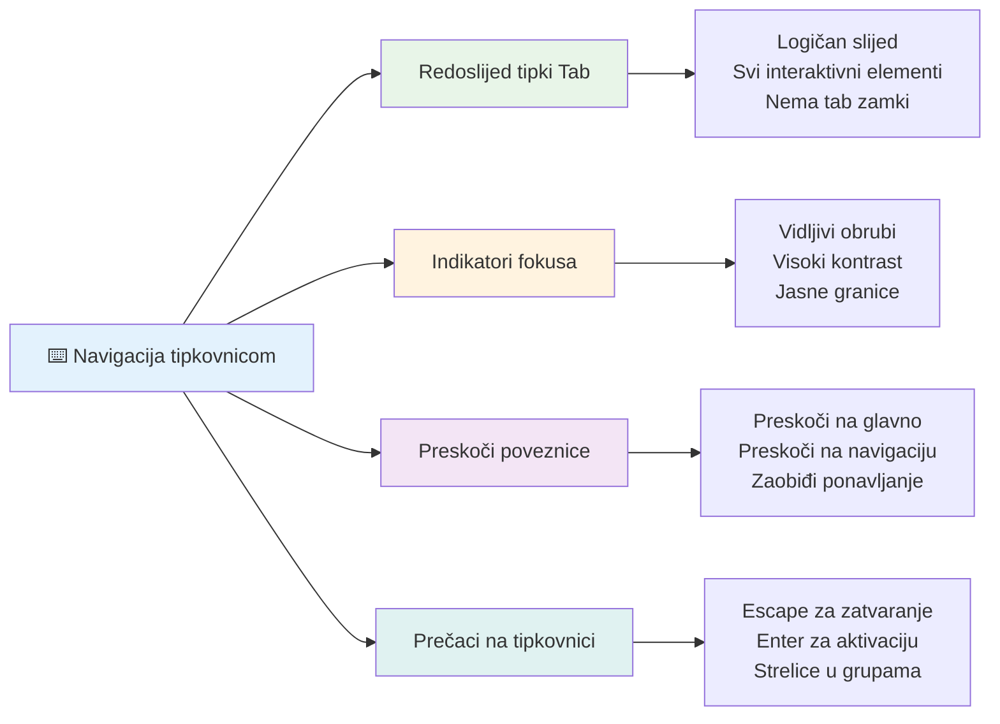
### Osnovni obrasci tipkovničke navigacije

**Standardne tipkovničke interakcije:**  
- **Tab**: Pomicanje fokusa unaprijed kroz interaktivne elemente  
- **Shift + Tab**: Pomicanje fokusa unatrag  
- **Enter**: Aktivacija gumba i poveznica  
- **Space**: Aktivacija gumba, označavanje potvrdnih okvira  
- **Tipke sa strelicama**: Navigacija unutar grupa komponenti (radio gumbi, izbornici)  
- **Escape**: Zatvaranje modalnih dijaloga, padajućih izbornika ili prekid operacija

### Najbolje prakse upravljanja fokusom

**Vidljivi indikatori fokusa:**  
```css
/* Ensure focus is always visible */
button:focus-visible {
  outline: 2px solid #4A90A4;
  outline-offset: 2px;
}

/* Custom focus styles for different components */
.card:focus-within {
  box-shadow: 0 0 0 3px rgba(74, 144, 164, 0.5);
}
```
  
**Linkovi za preskakanje radi učinkovite navigacije:**  
```html
<a href="#main-content" class="skip-link">Skip to main content</a>
<a href="#navigation" class="skip-link">Skip to navigation</a>

<nav id="navigation">
  <!-- navigation content -->
</nav>
<main id="main-content">
  <!-- main content -->
</main>
```
  
**Ispravan redoslijed tabulatora:**  
```html
<!-- Use semantic HTML for natural tab order -->
<form>
  <label for="name">Name:</label>
  <input type="text" id="name" tabindex="0">
  
  <label for="email">Email:</label>
  <input type="email" id="email" tabindex="0">
  
  <button type="submit" tabindex="0">Submit</button>
</form>
```
  
### Zatvaranje fokusa u modalima

Pri otvaranju modalnih dijaloga fokus treba biti zarobljen unutar modala:

```javascript
// Moderna implementacija zamke za fokus
function trapFocus(element) {
  const focusableElements = element.querySelectorAll(
    'button, [href], input, select, textarea, [tabindex]:not([tabindex="-1"])'
  );
  
  const firstElement = focusableElements[0];
  const lastElement = focusableElements[focusableElements.length - 1];

  element.addEventListener('keydown', (e) => {
    if (e.key === 'Tab') {
      if (e.shiftKey && document.activeElement === firstElement) {
        e.preventDefault();
        lastElement.focus();
      } else if (!e.shiftKey && document.activeElement === lastElement) {
        e.preventDefault();
        firstElement.focus();
      }
    }
    
    if (e.key === 'Escape') {
      closeModal();
    }
  });
  
  // Fokusiraj prvi element kada se modal otvori
  firstElement.focus();
}
```
  
✅ **Testirajte tipkovničku navigaciju**: Pokušajte navigirati vašom web stranicom koristeći samo tipku Tab. Možete li dosegnuti sve interaktivne elemente? Je li redoslijed fokusa logičan? Jesu li indikatori fokusa jasno vidljivi?

## Pristupačnost obrazaca

Obrasci su ključni za korisničku interakciju i zahtijevaju posebnu pažnju u pogledu pristupačnosti.

### Povezivanje oznaka i kontrola u obrazcima

**Svakoj kontroli obrasca treba oznaka:**  
```html
<!-- Explicit labeling (preferred) -->
<label for="username">Username:</label>
<input type="text" id="username" name="username" required>

<!-- Implicit labeling -->
<label>
  Password:
  <input type="password" name="password" required>
</label>

<!-- Using aria-label when visual label isn't desired -->
<input type="search" aria-label="Search products" placeholder="Search...">
```
  
### Obrada pogrešaka i validacija

**Pristupačne poruke o pogreškama:**  
```html
<label for="email">Email Address:</label>
<input type="email" id="email" name="email" 
       aria-describedby="email-error" 
       aria-invalid="true" required>
<div id="email-error" role="alert">
  Please enter a valid email address
</div>
```
  
**Najbolje prakse validacije obrazaca:**  
- Koristite `aria-invalid` za označavanje neispravnih polja  
- Pružite jasne, specifične poruke o pogreškama  
- Koristite `role="alert"` za važne najave o pogreškama  
- Prikazujte pogreške odmah i pri slanju obrasca

### Grupiranje putem fieldsetova

**Grupirajte povezane kontrole u obrascima:**  
```html
<fieldset>
  <legend>Shipping Address</legend>
  <label for="street">Street Address:</label>
  <input type="text" id="street" name="street">
  
  <label for="city">City:</label>
  <input type="text" id="city" name="city">
</fieldset>

<fieldset>
  <legend>Preferred Contact Method</legend>
  <input type="radio" id="contact-email" name="contact" value="email">
  <label for="contact-email">Email</label>
  
  <input type="radio" id="contact-phone" name="contact" value="phone">
  <label for="contact-phone">Phone</label>
</fieldset>
```
  
## Vaše putovanje pristupačnosti: Glavni zaključci

Čestitamo! Upravo ste stekli temeljno znanje za stvaranje zaista inkluzivnih web iskustava. Ovo je zaista uzbudljivo! Pristupačnost weba nije samo ispunjavanje zakonskih okvira - riječ je o prepoznavanju različitih načina na koje ljudi koriste digitalni sadržaj i dizajnu koji prati tu zadivljujuću složenost.

Sada ste dio rastuće zajednice programera koji razumiju da dobar dizajn funkcionira za svakoga. Dobrodošli u klub!

**🎯 Vaš set alata za pristupačnost sada uključuje:**

| Temeljno načelo           | Implementacija                          | Utjecaj                                               |
|---------------------------|---------------------------------------|------------------------------------------------------|
| **Semantička HTML osnova** | Koristite odgovarajuće HTML elemente  | Čitači ekrana lako navigiraju, tipkovnice rade automatski |
| **Inkluzivan vizualni dizajn** | Dovoljni kontrast, smislenost boja, vidljivi indikatori fokusa | Jasno svima u svim uvjetima osvjetljenja             |
| **Opisni sadržaj**         | Smisleni tekst poveznica, alt tekst, naslovi | Korisnici razumiju sadržaj bez vizualnog konteksta   |
| **Pristupačnost na tipkovnici** | Redoslijed tabulatora, prečaci na tipkovnici, upravljanje fokusom | Motorička pristupačnost i učinkovitost iskusnih korisnika |
| **Unapređenje ARIA-om**    | Strateška uporaba za ispunjavanje semantičkih praznina | Složene aplikacije funkcioniraju s pomoćnim tehnologijama |
| **Sveobuhvatno testiranje** | Automatizirani alati + ručna provjera + testiranje s pravim korisnicima | Otkriva probleme prije nego što utječu na korisnike  |

**🚀 Sljedeći koraci:**

1. **Ugradite pristupačnost u svoj radni tijek**: Učinite testiranje prirodnim dijelom procesa razvoja  
2. **Učite od stvarnih korisnika**: Prikupljajte povratne informacije od ljudi koji koriste pomoćne tehnologije  
3. **Budite u tijeku**: Tehnike pristupačnosti razvijaju se s novim tehnologijama i standardima  
4. **Zagovarajte inkluzivnost**: Dijelite svoje znanje i učinite pristupačnost timskim prioritetom

> 💡 **Zapamtite**: Ograničenja pristupačnosti često vode do inovativnih, elegantnih rješenja koja koriste svima. Prilazi na nogostupu, titlovi i glasovne kontrole započeli su kao funkcije pristupačnosti, a postali su mainstream poboljšanja.

**Poslovni razlog je kristalno jasan**: Pristupačne web stranice dosežu više korisnika, bolje se rangiraju u tražilicama, imaju niže troškove održavanja i izbjegavaju pravne rizike. No iskreno? Pravi razlog brige o pristupačnosti ide puno dublje. Pristupačne web stranice utjelovljuju najbolje vrijednosti weba—otvorenost, inkluzivnost i ideju da svatko zaslužuje jednak pristup informacijama.

Sada ste opremljeni za izgradnju inkluzivnog weba budućnosti. Svaka pristupačna stranica koju napravite čini internet gostoljubivijim mjestom za sve. To je prilično nevjerojatno kad o tome razmislite!

## Dodatni resursi

Nastavite svoje učenje o pristupačnosti s ovim ključnim resursima:

**📚 Službeni standardi i smjernice:**  
- [WCAG 2.1 Guidelines](https://www.w3.org/WAI/WCAG21/quickref/) - Službeni standard pristupačnosti s brzom referencom  
- [ARIA Authoring Practices Guide](https://w3c.github.io/aria-practices/) - Sveobuhvatni obrasci za interaktivne widgete  
- [WebAIM Guidelines](https://webaim.org/) - Praktični, početnički prijateljski vodič za pristupačnost

**🛠️ Alati i resursi za testiranje:**  
- [axe DevTools](https://www.deque.com/axe/devtools/) - Standard industrije za testiranje pristupačnosti  
- [A11y Project Checklist](https://www.a11yproject.com/checklist/) - Provjera pristupačnosti korak po korak  
- [Accessibility Insights](https://accessibilityinsights.io/) - Sveobuhvatni Microsoftov alat za testiranje  
- [Color Oracle](https://colororacle.org/) - Simulator daltonizma za testiranje dizajna

**🎓 Učenje i zajednica:**  
- [WebAIM Screen Reader Survey](https://webaim.org/projects/screenreadersurvey9/) - Preferencije i ponašanja stvarnih korisnika  
- [Inclusive Components](https://inclusive-components.design/) - Moderni obrasci pristupačnih komponenti  
- [A11y Coffee](https://a11y.coffee/) - Kratki savjeti i uvidi o pristupačnosti  
- [Web Accessibility Initiative (WAI)](https://www.w3.org/WAI/) - Sveobuhvatni W3C-ovi resursi o pristupačnosti

**🎥 Praktično učenje:**  
- [Accessibility Developer Guide](https://www.accessibility-developer-guide.com/) - Praktični vodiči za implementaciju  
- [Deque University](https://dequeuniversity.com/) - Profesionalni tečajevi pristupačnosti

## Izazov GitHub Copilot agenta 🚀

Iskoristite Agent način rada za dovršetak sljedećeg izazova:

**Opis:** Izradite pristupačnu komponentu modalnog dijaloga koja demonstrira pravilno upravljanje fokusom, ARIA atribute i obrasce tipkovničke navigacije.

**Zadatak:** Izradite kompletnu komponentu modalnog dijaloga koristeći HTML, CSS i JavaScript koja uključuje: pravilno zatvaranje fokusa, ESC tipku za zatvaranje, klik izvan modala za zatvaranje, ARIA atribute za čitače ekrana i vidljive indikatore fokusa. Modal treba sadržavati obrazac s odgovarajućim oznakama i obradom pogrešaka. Osigurajte da komponenta zadovoljava WCAG 2.1 AA standarde.


## 🚀 Izazov

Uz ovu HTML strukturu napišite što je moguće pristupačniju verziju, koristeći naučene strategije.

```html
<!DOCTYPE html>
<html lang="en">
  <head>
    <meta charset="UTF-8">
    <meta name="viewport" content="width=device-width, initial-scale=1.0">
    <title>Turtle Ipsum - The World's Premier Turtle Fan Club</title>
    <link href='../assets/style.css' rel='stylesheet' type='text/css'>
  </head>
  <body>
    <header class="site-header">
      <h1 class="site-title">Turtle Ipsum</h1>
      <p class="site-subtitle">The World's Premier Turtle Fan Club</p>
    </header>
    
    <nav class="main-nav" aria-label="Main navigation">
      <h2 class="nav-header">Resources</h2>
      <ul class="nav-list">
        <li><a href="https://www.youtube.com/watch?v=CMNry4PE93Y">"I like turtles" video</a></li>
        <li><a href="https://en.wikipedia.org/wiki/Turtle">Basic turtle information</a></li>
        <li><a href="https://en.wikipedia.org/wiki/Turtles_(chocolate)">Chocolate turtles candy</a></li>
      </ul>
    </nav>
    
    <main class="main-content">
      <article>
        <h1>Welcome to Turtle Ipsum</h1>
        <p class="intro">
          <a href="/about">Learn more about our turtle community</a> and discover fascinating facts about these amazing creatures.
        </p>
        <p class="article-text">
          Turtle ipsum dolor sit amet, consectetur adipiscing elit, sed do eiusmod tempor incididunt ut labore et dolore magna aliqua. Ut enim ad minim veniam, quis nostrud exercitation ullamco laboris nisi ut aliquip ex ea commodo consequat. Duis aute irure dolor in reprehenderit in voluptate velit esse cillum dolore eu fugiat nulla pariatur. Excepteur sint occaecat cupidatat non proident, sunt in culpa qui officia deserunt mollit anim id est laborum.
        </p>
      </article>
    </main>
    
    <footer class="footer">
      <section class="newsletter-signup">
        <h2>Stay Updated</h2>
        <button type="button" onclick="showNewsletterForm()">Sign up for turtle news</button>
      </section>
      
      <nav class="footer-nav" aria-label="Footer navigation">
        <h2>Site Pages</h2>
        <ul>
          <li><a href="../">Home</a></li>
          <li><a href="../semantic">Semantic HTML example</a></li>
        </ul>
      </nav>
      
      <p class="footer-copyright">&copy; 2024 Instrument. All rights reserved.</p>
    </footer>
  </body>
</html>
```
  
**Ključna poboljšanja koja su napravljena:**  
- Dodana odgovarajuća semantička HTML struktura  
- Ispravljena hijerarhija naslova (jedan h1, logičan tijek)  
- Dodan smisleni tekst poveznica umjesto "klikni ovdje"  
- Uključene odgovarajuće ARIA oznake za navigaciju  
- Dodana atribut lang i pravilni meta tagovi  
- Korišten element button za interaktivne elemente  
- Struktuiran sadržaj podnožja s pravilnim orijentirima

## Kviz nakon predavanja  
[Post-lecture quiz](https://ff-quizzes.netlify.app/web/en/)

## Pregled i samostalno učenje

Mnoge vlade imaju zakone o zahtjevima za pristupačnost. Informirajte se o zakonima o pristupačnosti u vašoj zemlji. Što je pokriveno, a što nije? Na primjer, [ova državna stranica](https://accessibility.blog.gov.uk/).

## Zadatak

[Analizirajte nepristupačnu web stranicu](assignment.md)

Zasluge: [Turtle Ipsum](https://github.com/Instrument/semantic-html-sample) by Instrument

---

## 🚀 Vaš vremenski plan usavršavanja pristupačnosti

### ⚡ **Što možete učiniti u sljedećih 5 minuta**  
- [ ] Instalirati ekstenziju axe DevTools u svoj preglednik  
- [ ] Pokrenuti Lighthouse audit pristupačnosti na omiljenoj web stranici  
- [ ] Pokušati navigirati bilo kojom web stranicom koristeći samo tipku Tab  
- [ ] Isprobati ugrađeni čitač ekrana u svom pregledniku (Narrator/VoiceOver)

### 🎯 **Što možete postići u sljedećem satu**  
- [ ] Završiti kviz nakon lekcije i razmisliti o uvidima u pristupačnost  
- [ ] Vježbati pisanje smislenog alt teksta za 10 različitih slika  
- [ ] Provjeriti hijerarhiju naslova na web stranici pomoću HeadingsMap ekstenzije  
- [ ] Popraviti probleme pristupačnosti pronađene u HTML izazovu  
- [ ] Testirati kontrast boja na aktualnom projektu pomoću alata WebAIM

### 📅 **Vaše tjedno putovanje pristupačnosti**  
- [ ] Završiti zadatak analizirajući nepristupačnu web stranicu  
- [ ] Postaviti razvojno okruženje s alatima za testiranje pristupačnosti
- [ ] Vježbajte navigaciju tipkovnicom na 5 različitih složenih web stranica
- [ ] Izradite jednostavan obrazac s prikladnim oznakama, upravljanjem pogreškama i ARIA-om
- [ ] Pridružite se zajednici za pristupačnost (A11y Slack, WebAIM forum)
- [ ] Promatrajte stvarne korisnike s invaliditetom dok navigiraju web stranicama (YouTube ima odlične primjere)

### 🌟 **Vaša mjesečna transformacija**
- [ ] Integrirajte testiranje pristupačnosti u svoj razvojni tijek rada
- [ ] Doprinijeti open source projektu popravljajući probleme s pristupačnošću
- [ ] Provedite testiranje upotrebljivosti s nekim tko koristi pomoćnu tehnologiju
- [ ] Izradite pristupačnu biblioteku komponenti za svoj tim
- [ ] Zalagajte se za pristupačnost u svom radnom okruženju ili zajednici
- [ ] Mentorirajte nekoga novog u konceptima pristupačnosti

### 🏆 **Završna provjera šampiona pristupačnosti**

**Proslavite svoje putovanje pristupačnosti:**
- Što vas je najviše iznenadilo u načinu na koji ljudi koriste web?
- Koji vam princip pristupačnosti najviše odgovara u vašem stilu razvoja?
- Kako vam je učenje o pristupačnosti promijenilo pogled na dizajn?
- Koje je prvo poboljšanje pristupačnosti koje želite napraviti na stvarnom projektu?

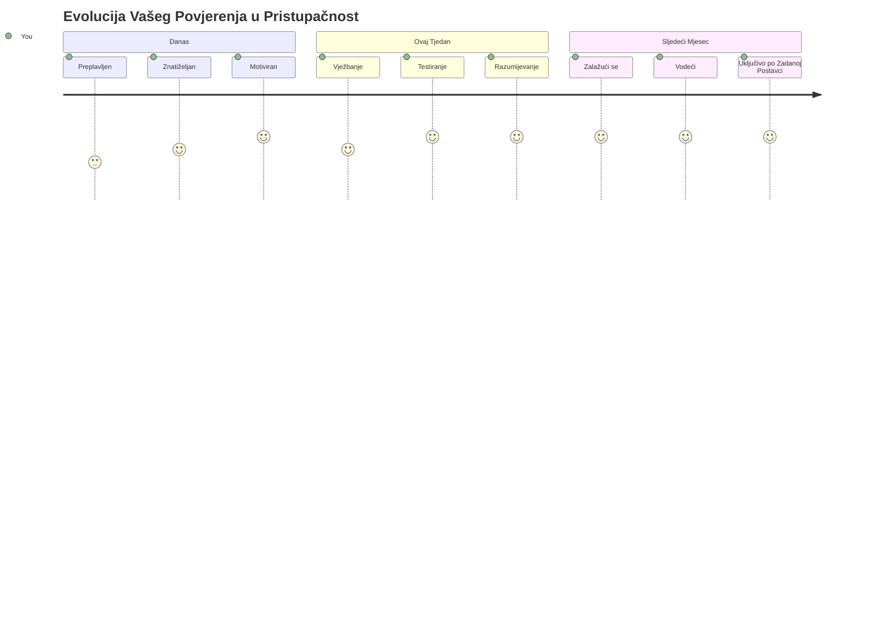
> 🌍 **Sada ste šampion pristupačnosti!** Razumijete da izvrsna web iskustva funkcioniraju za svakoga, bez obzira na način pristupa webu. Svaka pristupačna značajka koju izgradite čini internet inkluzivnijim. Web treba programere poput vas koji pristupačnost ne vide kao ograničenje, već kao priliku za stvaranje boljih iskustava za sve korisnike. Dobrodošli u pokret! 🎉

---

<!-- CO-OP TRANSLATOR DISCLAIMER START -->
**Odricanje od odgovornosti**:
Ovaj je dokument preveden korištenjem AI prevoditeljske usluge [Co-op Translator](https://github.com/Azure/co-op-translator). Iako težimo točnosti, imajte na umu da automatski prijevodi mogu sadržavati pogreške ili netočnosti. Izvorni dokument na izvornom jeziku treba se smatrati službenim i vjerodostojnim izvorom. Za ključne informacije preporučuje se profesionalni ljudski prijevod. Ne snosimo odgovornost za bilo kakve nesporazume ili pogrešna tumačenja nastala korištenjem ovog prijevoda.
<!-- CO-OP TRANSLATOR DISCLAIMER END -->