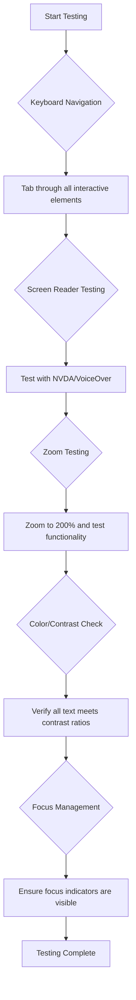
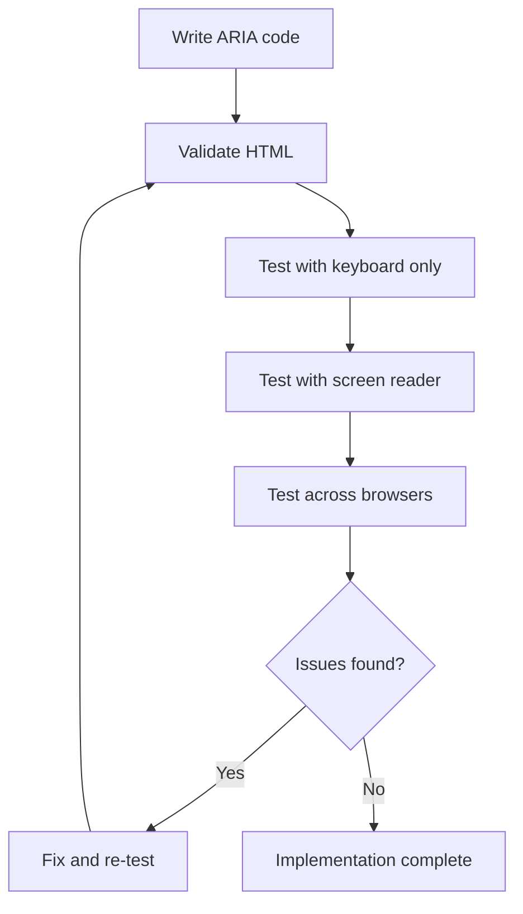

<!--
CO_OP_TRANSLATOR_METADATA:
{
  "original_hash": "90b19cde5b79b29e91babd3138cd8035",
  "translation_date": "2025-10-24T23:54:08+00:00",
  "source_file": "1-getting-started-lessons/3-accessibility/README.md",
  "language_code": "hr"
}
-->
# Izrada dostupnih web stranica


> Sketchnote autorice [Tomomi Imura](https://twitter.com/girlie_mac)

## Kviz prije predavanja
[Kviz prije predavanja](https://ff-quizzes.netlify.app/web/)

> Snaga weba leži u njegovoj univerzalnosti. Pristup svima, bez obzira na invaliditet, ključni je aspekt.
>
> \- Sir Timothy Berners-Lee, direktor W3C-a i izumitelj World Wide Weba

Evo nečega što bi vas moglo iznenaditi: kada gradite dostupne web stranice, ne pomažete samo osobama s invaliditetom—zapravo činite web boljim za sve!

Jeste li ikada primijetili one spuštene rubove na ulicama? Izvorno su dizajnirani za invalidska kolica, ali sada pomažu ljudima s dječjim kolicima, dostavljačima s kolicima, putnicima s prtljagom na kotačima, pa čak i biciklistima. Upravo tako funkcionira dizajn dostupnih web stranica—rješenja koja pomažu jednoj skupini često na kraju koriste svima. Prilično cool, zar ne?

U ovoj lekciji istražit ćemo kako stvoriti web stranice koje zaista funkcioniraju za sve, bez obzira na način na koji pregledavaju web. Otkrit ćete praktične tehnike koje su već ugrađene u web standarde, isprobati alate za testiranje i vidjeti kako dostupnost čini vaše stranice korisnijima za sve korisnike.

Na kraju ove lekcije, imat ćete samopouzdanje da dostupnost učinite prirodnim dijelom vašeg razvojnog procesa. Spremni za istraživanje kako promišljeni dizajnerski izbori mogu otvoriti web za milijarde korisnika? Krenimo!

> Ovu lekciju možete pronaći na [Microsoft Learn](https://docs.microsoft.com/learn/modules/web-development-101/accessibility/?WT.mc_id=academic-77807-sagibbon)!

## Razumijevanje asistivnih tehnologija

Prije nego što krenemo s kodiranjem, odvojimo trenutak da razumijemo kako osobe s različitim sposobnostima zapravo doživljavaju web. Ovo nije samo teorija—razumijevanje ovih stvarnih obrazaca navigacije učinit će vas puno boljim programerom!

Asistivne tehnologije su nevjerojatni alati koji pomažu osobama s invaliditetom da komuniciraju s web stranicama na načine koji bi vas mogli iznenaditi. Kada shvatite kako te tehnologije funkcioniraju, stvaranje dostupnih web iskustava postaje puno intuitivnije. To je kao da učite gledati svoj kod kroz oči nekog drugog.

### Čitači ekrana

[Čitači ekrana](https://en.wikipedia.org/wiki/Screen_reader) su prilično sofisticirani komadi tehnologije koji digitalni tekst pretvaraju u govor ili brajevo pismo. Iako ih prvenstveno koriste osobe s oštećenjem vida, također su vrlo korisni za korisnike s poteškoćama u učenju, poput disleksije.

Volim razmišljati o čitaču ekrana kao o vrlo pametnom pripovjedaču koji vam čita knjigu. Čita sadržaj naglas logičnim redoslijedom, najavljuje interaktivne elemente poput "gumb" ili "link" i pruža prečace na tipkovnici za navigaciju po stranici. Ali evo u čemu je stvar—čitači ekrana mogu raditi svoj posao samo ako izgradimo web stranice s pravilnom strukturom i smislenim sadržajem. Tu vi kao programer dolazite na scenu!

**Popularni čitači ekrana na različitim platformama:**
- **Windows**: [NVDA](https://www.nvaccess.org/about-nvda/) (besplatan i najpopularniji), [JAWS](https://webaim.org/articles/jaws/), [Narrator](https://support.microsoft.com/windows/complete-guide-to-narrator-e4397a0d-ef4f-b386-d8ae-c172f109bdb1/?WT.mc_id=academic-77807-sagibbon) (ugrađen)
- **macOS/iOS**: [VoiceOver](https://support.apple.com/guide/voiceover/welcome/10) (ugrađen i vrlo sposoban)
- **Android**: [TalkBack](https://support.google.com/accessibility/android/answer/6283677) (ugrađen)
- **Linux**: [Orca](https://wiki.gnome.org/Projects/Orca) (besplatan i otvorenog koda)

**Kako čitači ekrana navigiraju web sadržajem:**

Čitači ekrana pružaju više metoda navigacije koje čine pregledavanje učinkovitijim za iskusne korisnike:
- **Sekvencijalno čitanje**: Čita sadržaj od vrha prema dnu, kao da slijedi knjigu
- **Navigacija po oznakama**: Skakanje između dijelova stranice (zaglavlje, navigacija, glavni dio, podnožje)
- **Navigacija po naslovima**: Preskakanje između naslova za razumijevanje strukture stranice
- **Popisi linkova**: Generiranje popisa svih linkova za brzi pristup
- **Kontrole obrazaca**: Izravna navigacija između polja za unos i gumba

> 💡 **Evo nečega što me oduševilo**: 68% korisnika čitača ekrana prvenstveno navigira pomoću naslova ([WebAIM Survey](https://webaim.org/projects/screenreadersurvey9/#finding)). To znači da je vaša struktura naslova poput karte za korisnike—kada je pravilno postavite, doslovno pomažete ljudima da brže pronađu svoj put kroz vaš sadržaj!

### Izgradnja vašeg testnog procesa

Evo dobrih vijesti—učinkovito testiranje dostupnosti ne mora biti preplavljujuće! Trebat ćete kombinirati automatizirane alate (sjajni su za otkrivanje očitih problema) s nekim ručnim testiranjem. Evo sustavnog pristupa koji, prema mom iskustvu, otkriva najviše problema bez da vam oduzme cijeli dan:

**Osnovni proces ručnog testiranja:**



**Kontrolni popis za testiranje korak po korak:**
1. **Navigacija tipkovnicom**: Koristite samo Tab, Shift+Tab, Enter, Space i strelice
2. **Testiranje čitača ekrana**: Omogućite NVDA, VoiceOver ili Narrator i navigirajte zatvorenih očiju
3. **Testiranje zumiranja**: Testirajte na razinama zumiranja od 200% i 400%
4. **Provjera kontrasta boja**: Provjerite sav tekst i UI komponente
5. **Testiranje indikatora fokusa**: Osigurajte da svi interaktivni elementi imaju vidljive stanja fokusa

✅ **Započnite s Lighthouseom**: Otvorite DevTools u pregledniku, pokrenite Lighthouse analizu dostupnosti, a zatim koristite rezultate za usmjeravanje vašeg fokusa na ručno testiranje.

### Alati za zumiranje i povećanje

Znate kako ponekad širite prste na telefonu kad je tekst premalen ili škiljite na zaslonu laptopa na jakom suncu? Mnogi korisnici svakodnevno se oslanjaju na alate za povećanje kako bi sadržaj bio čitljiv. To uključuje osobe s slabim vidom, starije osobe i svakoga tko je ikada pokušao čitati web stranicu na otvorenom.

Moderne tehnologije za zumiranje evoluirale su izvan pukog povećanja. Razumijevanje kako ti alati funkcioniraju pomoći će vam da stvorite responzivne dizajne koji ostaju funkcionalni i privlačni na bilo kojoj razini povećanja.

**Suvremene mogućnosti zumiranja preglednika:**
- **Zumiranje stranice**: Proporcionalno povećava sav sadržaj (tekst, slike, izgled) - ovo je preferirana metoda
- **Samo zumiranje teksta**: Povećava veličinu fonta uz održavanje izvornog izgleda
- **Zumiranje širenjem prstiju**: Podrška za mobilne geste za privremeno povećanje
- **Podrška preglednika**: Svi moderni preglednici podržavaju zumiranje do 500% bez narušavanja funkcionalnosti

**Specijalizirani softver za povećanje:**
- **Windows**: [Magnifier](https://support.microsoft.com/windows/use-magnifier-to-make-things-on-the-screen-easier-to-see-414948ba-8b1c-d3bd-8615-0e5e32204198) (ugrađen), [ZoomText](https://www.freedomscientific.com/training/zoomtext/getting-started/)
- **macOS/iOS**: [Zoom](https://www.apple.com/accessibility/mac/vision/) (ugrađen s naprednim značajkama)

> ⚠️ **Dizajnerska razmatranja**: WCAG zahtijeva da sadržaj ostane funkcionalan kada je zumiran do 200%. Na ovoj razini, horizontalno pomicanje treba biti minimalno, a svi interaktivni elementi trebaju ostati dostupni.

✅ **Testirajte svoj responzivni dizajn**: Zumirajte svoj preglednik na 200% i 400%. Prilagođava li se vaš izgled skladno? Možete li i dalje pristupiti svim funkcijama bez prekomjernog pomicanja?

## Suvremeni alati za testiranje dostupnosti

Sada kada razumijete kako ljudi navigiraju webom pomoću asistivnih tehnologija, istražimo alate koji vam pomažu u izgradnji i testiranju dostupnih web stranica.

Razmislite o tome ovako: automatizirani alati su izvrsni za otkrivanje očitih problema (poput nedostatka alt teksta), dok ručno testiranje pomaže osigurati da vaša stranica bude ugodna za korištenje u stvarnom svijetu. Zajedno vam pružaju sigurnost da vaše stranice funkcioniraju za sve.

### Testiranje kontrasta boja

Evo dobrih vijesti: kontrast boja jedan je od najčešćih problema s dostupnošću, ali je također jedan od najlakših za popraviti. Dobar kontrast koristi svima—od korisnika s oštećenjem vida do ljudi koji pokušavaju čitati svoje telefone na plaži.

**WCAG zahtjevi za kontrast:**

| Vrsta teksta | WCAG AA (Minimalno) | WCAG AAA (Poboljšano) |
|--------------|---------------------|-----------------------|
| **Normalan tekst** (manje od 18pt) | Omjer kontrasta 4.5:1 | Omjer kontrasta 7:1 |
| **Veliki tekst** (18pt+ ili 14pt+ podebljano) | Omjer kontrasta 3:1 | Omjer kontrasta 4.5:1 |
| **UI komponente** (gumbi, obrubi obrazaca) | Omjer kontrasta 3:1 | Omjer kontrasta 3:1 |

**Osnovni alati za testiranje:**
- [Colour Contrast Analyser](https://www.tpgi.com/color-contrast-checker/) - Desktop aplikacija s odabirom boja
- [WebAIM Contrast Checker](https://webaim.org/resources/contrastchecker/) - Web alat s trenutnim povratnim informacijama
- [Stark](https://www.getstark.co/) - Plugin za dizajnerske alate poput Figma, Sketch, Adobe XD
- [Accessible Colors](https://accessible-colors.com/) - Pronađite dostupne palete boja

✅ **Izgradite bolje palete boja**: Započnite s bojama vašeg brenda i koristite alate za provjeru kontrasta kako biste stvorili dostupne varijacije. Dokumentirajte ih kao dostupne boje u vašem dizajnerskom sustavu.

### Sveobuhvatna provjera dostupnosti

Najbolje testiranje dostupnosti kombinira više pristupa. Nijedan alat ne može otkriti sve, pa izgradnja rutine testiranja s različitim metodama osigurava temeljitu pokrivenost.

**Testiranje u pregledniku (ugrađeno u DevTools):**
- **Chrome/Edge**: Lighthouse analiza dostupnosti + panel za dostupnost
- **Firefox**: Inspektor dostupnosti s detaljnim prikazom stabla
- **Safari**: Kartica za provjeru u Web Inspectoru s simulacijom VoiceOvera

**Profesionalni dodaci za testiranje:**
- [axe DevTools](https://www.deque.com/axe/devtools/) - Industrijski standard za automatizirano testiranje
- [WAVE](https://wave.webaim.org/extension/) - Vizualne povratne informacije s isticanjem grešaka
- [Accessibility Insights](https://accessibilityinsights.io/) - Microsoftov sveobuhvatni alat za testiranje

**Alati za naredbeni redak i integraciju CI/CD:**
- [axe-core](https://github.com/dequelabs/axe-core) - JavaScript biblioteka za automatizirano testiranje
- [Pa11y](https://pa11y.org/) - Alat za testiranje dostupnosti putem naredbenog retka
- [Lighthouse CI](https://github.com/GoogleChrome/lighthouse-ci) - Automatizirano ocjenjivanje dostupnosti

> 🎯 **Cilj testiranja**: Ciljajte na Lighthouse ocjenu dostupnosti od 95+ kao osnovni standard. Zapamtite, automatizirani alati otkrivaju samo oko 30-40% problema s dostupnošću—ručno testiranje i dalje je ključno!

## Izgradnja dostupnosti od samog početka

Ključ uspjeha u dostupnosti je uključiti je u temelje od samog početka. Znam da je primamljivo misliti "dodat ću dostupnost kasnije", ali to je kao da pokušavate dodati rampu kući nakon što je već izgrađena. Moguće? Da. Lako? Ne baš.

Razmislite o dostupnosti kao o planiranju kuće—mnogo je lakše uključiti pristup za invalidska kolica u početne arhitektonske planove nego sve naknadno prilagođavati.

### Načela POUR: Temelj vaše dostupnosti

Smjernice za dostupnost web sadržaja (WCAG) temelje se na četiri osnovna načela koja čine akronim POUR. Ne brinite—ovo nisu suhoparni akademski koncepti! Zapravo su to praktične smjernice za stvaranje sadržaja koji funkcionira za sve.

Kada se naviknete na POUR, donošenje odluka o dostupnosti postaje puno intuitivnije. To je kao da imate mentalni kontrolni popis koji vodi vaše dizajnerske odluke. Razložimo to:

**🔍 Perceptivno**: Informacije moraju biti predstavljene na način koji korisnici mogu percipirati svojim dostupnim osjetilima

- Pružite tekstualne alternative za sadržaj koji nije tekst (slike, videozapisi, audio)
- Osigurajte dovoljan kontrast boja za sav tekst i UI komponente
- Ponudite titlove i transkripte za multimedijski sadržaj
- Dizajnirajte sadržaj koji ostaje funkcionalan kada se poveća do 200%
- Koristite višestruke senzorne karakteristike (ne samo boju) za prenošenje informacija

**🎮 Operativno**: Sve komponente sučelja moraju biti operativne putem dostupnih metoda unosa

- Omogućite pristup svim funkcijama putem navigacije tipkovnicom
- Pružite korisnicima dovoljno vremena za čitanje i interakciju sa sadržajem
- Izbjegavajte sadržaj koji uzrokuje napade ili vestibularne poremećaje
- Pomozite korisnicima da učinkovito navigiraju jasnom strukturom i oznakama
- Osigurajte da interaktivni elementi imaju odgovarajuće veličine ciljeva (minimalno 44px)

**📖 Razumljivo**: Informacije i operacija UI-a moraju biti jasne i razumljive

- Koristite jasan, jednostavan jezik prilagođen vašoj publici
- Osigurajte da se sadržaj pojavljuje i funkcionira na predvidljiv, dosljedan način
- Pružite jasne upute i poruke o greškama za unos korisnika
- Pomozite korisnicima da razumiju i isprave pogreške u obrascima
- Organizirajte sadržaj logičnim redoslijedom čitanja i hijerarhijom informacija

**💪 Robusno**: Sadržaj mora pouzdano funkcionirati na različitim tehnologijama i asistivnim uređajima

- Koristite valjani, semantički HTML kao temelj
- Osigurajte kompatibilnost s trenutnim i budućim asistivnim tehnologijama
- Slijedite web standarde i najbolje prakse za označavanje
- Testirajte na različitim preglednicima, uređajima i asistivnim alatima
- Strukturirajte sadržaj tako da se dostojanstveno degradira kada napredne značajke nisu podržane

## Stvaranje dostupnog vizualnog dizajna

Dobar vizualni dizajn i dostupnost idu ruku pod ruku. Kada dizajnirate s dostupnošću na umu, često otkrivate da ti zahtjevi vode do čišćih, elegantnijih rješenja koja koriste svim korisnicima.

Istražimo kako stvoriti vizualno privlačne dizajne koji funkcioniraju za sve, bez obzira na njihove vizualne sposobnosti ili uvjete u kojima pregledavaju vaš sadržaj.

### Strategije za boje i vizual
Boja je moćan alat za komunikaciju, ali nikada ne bi trebala biti jedini način prenošenja važnih informacija. Dizajniranje izvan boja stvara robusnija, inkluzivnija iskustva koja funkcioniraju u različitim situacijama.

**Dizajnirajte za razlike u percepciji boja:**

Otprilike 8% muškaraca i 0,5% žena ima neki oblik razlike u percepciji boja (često nazvano "sljepoća za boje"). Najčešći tipovi su:
- **Deuteranopija**: Teškoće u razlikovanju crvene i zelene boje
- **Protanopija**: Crvena boja izgleda tamnije
- **Tritanopija**: Teškoće s plavom i žutom bojom (rijetko)

**Strategije za inkluzivnu upotrebu boja:**

```css
/* ❌ Bad: Using only color to indicate status */
.error { color: red; }
.success { color: green; }

/* ✅ Good: Color plus icons and context */
.error {
  color: #d32f2f;
  border-left: 4px solid #d32f2f;
}
.error::before {
  content: "⚠️";
  margin-right: 8px;
}

.success {
  color: #2e7d32;
  border-left: 4px solid #2e7d32;
}
.success::before {
  content: "✅";
  margin-right: 8px;
}
```

**Izvan osnovnih zahtjeva za kontrast:**
- Testirajte svoje odabire boja pomoću simulatora za sljepoću na boje
- Koristite uzorke, teksture ili oblike uz kodiranje bojama
- Osigurajte da interaktivna stanja ostanu prepoznatljiva bez boje
- Razmislite kako vaš dizajn izgleda u načinu visokog kontrasta

✅ **Testirajte pristupačnost boja**: Koristite alate poput [Coblis](https://www.color-blindness.com/coblis-color-blindness-simulator/) kako biste vidjeli kako vaša stranica izgleda korisnicima s različitim vrstama percepcije boja.

### Indikatori fokusa i dizajn interakcije

Indikatori fokusa digitalni su ekvivalent pokazivaču miša—pokazuju korisnicima tipkovnice gdje se nalaze na stranici. Dobro dizajnirani indikatori fokusa poboljšavaju iskustvo za sve, čineći interakcije jasnim i predvidljivim.

**Najbolje prakse za moderne indikatore fokusa:**

```css
/* Enhanced focus styles that work across browsers */
button:focus-visible {
  outline: 2px solid #0066cc;
  outline-offset: 2px;
  box-shadow: 0 0 0 4px rgba(0, 102, 204, 0.25);
}

/* Remove focus outline for mouse users, preserve for keyboard users */
button:focus:not(:focus-visible) {
  outline: none;
}

/* Focus-within for complex components */
.card:focus-within {
  box-shadow: 0 0 0 3px rgba(74, 144, 164, 0.5);
  border-color: #4A90A4;
}

/* Ensure focus indicators meet contrast requirements */
.custom-focus:focus-visible {
  outline: 3px solid #ffffff;
  outline-offset: 2px;
  box-shadow: 0 0 0 6px #000000;
}
```

**Zahtjevi za indikatore fokusa:**
- **Vidljivost**: Mora imati omjer kontrasta od najmanje 3:1 u odnosu na okolne elemente
- **Širina**: Minimalna debljina od 2px oko cijelog elementa
- **Postojanost**: Treba ostati vidljiv dok se fokus ne premjesti na drugo mjesto
- **Razlikovanje**: Mora biti vizualno različit od drugih stanja korisničkog sučelja

> 💡 **Savjet za dizajn**: Odlični indikatori fokusa često koriste kombinaciju obruba, sjene okvira i promjena boje kako bi osigurali vidljivost na različitim pozadinama i u različitim kontekstima.

✅ **Provjerite indikatore fokusa**: Prođite kroz svoju web stranicu pomoću tipke Tab i zabilježite koji elementi imaju jasne indikatore fokusa. Jesu li neki teško vidljivi ili potpuno nedostaju?

### Semantički HTML: Temelj pristupačnosti

Semantički HTML je poput GPS sustava za asistivne tehnologije na vašoj web stranici. Kada koristite prave HTML elemente za njihovu namjenu, zapravo pružate čitačima ekrana, tipkovnicama i drugim alatima detaljnu kartu koja pomaže korisnicima da se učinkovito kreću.

Evo analogije koja mi je stvarno pomogla: semantički HTML je razlika između dobro organizirane knjižnice s jasnim kategorijama i korisnim oznakama naspram skladišta gdje su knjige nasumično razbacane. Oba mjesta imaju iste knjige, ali u kojem biste radije pokušali nešto pronaći? Upravo tako!

**Temeljni elementi pristupačne strukture stranice:**

```html
<!-- Landmark elements provide page navigation structure -->
<header>
  <h1>Your Site Name</h1>
  <nav aria-label="Main navigation">
    <ul>
      <li><a href="/home">Home</a></li>
      <li><a href="/about">About</a></li>
      <li><a href="/services">Services</a></li>
    </ul>
  </nav>
</header>

<main>
  <article>
    <header>
      <h1>Article Title</h1>
      <p>Published on <time datetime="2024-10-14">October 14, 2024</time></p>
    </header>
    
    <section>
      <h2>First Section</h2>
      <p>Content that relates to this section...</p>
    </section>
    
    <section>
      <h2>Second Section</h2>
      <p>More related content...</p>
    </section>
  </article>
  
  <aside>
    <h2>Related Links</h2>
    <nav aria-label="Related articles">
      <ul>
        <li><a href="/related-1">First related article</a></li>
        <li><a href="/related-2">Second related article</a></li>
      </ul>
    </nav>
  </aside>
</main>

<footer>
  <p>&copy; 2024 Your Site Name. All rights reserved.</p>
  <nav aria-label="Footer links">
    <ul>
      <li><a href="/privacy">Privacy Policy</a></li>
      <li><a href="/contact">Contact Us</a></li>
    </ul>
  </nav>
</footer>
```

**Zašto semantički HTML transformira pristupačnost:**

| Semantički element | Namjena | Prednost za čitače ekrana |
|--------------------|---------|--------------------------|
| `<header>` | Zaglavlje stranice ili sekcije | "Banner landmark" - brzo navigiranje na vrh |
| `<nav>` | Navigacijski linkovi | "Navigation landmark" - popis navigacijskih sekcija |
| `<main>` | Primarni sadržaj stranice | "Main landmark" - direktan skok na sadržaj |
| `<article>` | Samostalni sadržaj | Označava granice članka |
| `<section>` | Tematske grupe sadržaja | Pruža strukturu sadržaja |
| `<aside>` | Povezani sadržaj sa strane | "Complementary landmark" |
| `<footer>` | Podnožje stranice ili sekcije | "Contentinfo landmark" |

**Supermoći čitača ekrana sa semantičkim HTML-om:**
- **Navigacija po landmarkovima**: Trenutni skok između glavnih sekcija stranice
- **Pregled naslova**: Generiranje sadržaja stranice iz strukture naslova
- **Popisi elemenata**: Stvaranje popisa svih linkova, gumba ili kontrola obrazaca
- **Svijest o kontekstu**: Razumijevanje odnosa između sekcija sadržaja

> 🎯 **Brzi test**: Pokušajte navigirati svojom stranicom pomoću čitača ekrana koristeći prečace za landmarkove (D za landmark, H za naslov, K za link u NVDA/JAWS). Ima li navigacija smisla?

✅ **Provjerite svoju semantičku strukturu**: Koristite panel za pristupačnost u DevTools vašeg preglednika kako biste vidjeli stablo pristupačnosti i osigurali da vaš markup stvara logičnu strukturu.

### Hijerarhija naslova: Stvaranje logičnog sadržajnog okvira

Naslovi su apsolutno ključni za pristupačan sadržaj—oni su poput kralježnice koja sve drži zajedno. Korisnici čitača ekrana uvelike se oslanjaju na naslove kako bi razumjeli i navigirali vašim sadržajem. Zamislite to kao pružanje sadržaja stranice u obliku tablice.

**Zlatno pravilo za naslove:**
Nikada ne preskačite razine. Uvijek napredujte logično od `<h1>` do `<h2>` do `<h3>` i tako dalje. Sjećate se kako ste radili skice u školi? To je isti princip—ne biste preskočili s "I. Glavna točka" direktno na "C. Pod-podtočka" bez "A. Podtočke" između, zar ne?

**Primjer savršene strukture naslova:**

```html
<!-- ✅ Excellent: Logical, hierarchical progression -->
<main>
  <h1>Complete Guide to Web Accessibility</h1>
  
  <section>
    <h2>Understanding Screen Readers</h2>
    <p>Introduction to screen reader technology...</p>
    
    <h3>Popular Screen Reader Software</h3>
    <p>NVDA, JAWS, and VoiceOver comparison...</p>
    
    <h3>Testing with Screen Readers</h3>
    <p>Step-by-step testing instructions...</p>
  </section>
  
  <section>
    <h2>Color and Contrast Guidelines</h2>
    <p>Designing with sufficient contrast...</p>
    
    <h3>WCAG Contrast Requirements</h3>
    <p>Understanding the different contrast levels...</p>
    
    <h3>Testing Tools and Techniques</h3>
    <p>Tools for verifying contrast ratios...</p>
  </section>
</main>
```

```html
<!-- ❌ Problematic: Skipping levels, inconsistent structure -->
<h1>Page Title</h1>
<h3>Subsection</h3> <!-- Skipped h2 -->
<h2>This should come before h3</h2>
<h1>Another main heading?</h1> <!-- Multiple h1s -->
```

**Najbolje prakse za naslove:**
- **Jedan `<h1>` po stranici**: Obično glavni naslov stranice ili primarni sadržaj
- **Logičan napredak**: Nikada ne preskačite razine (h1 → h2 → h3, ne h1 → h3)
- **Opisni sadržaj**: Neka naslovi budu smisleni kada se čitaju izvan konteksta
- **Vizualno oblikovanje pomoću CSS-a**: Koristite CSS za izgled, HTML razine za strukturu

**Statistika navigacije čitača ekrana:**
- 68% korisnika čitača ekrana navigira pomoću naslova ([WebAIM Survey](https://webaim.org/projects/screenreadersurvey9/#finding))
- Korisnici očekuju logičan okvir naslova
- Naslovi pružaju najbrži način za razumijevanje strukture stranice

> 💡 **Profesionalni savjet**: Koristite ekstenzije preglednika poput "HeadingsMap" za vizualizaciju strukture naslova. Trebala bi izgledati kao dobro organizirana tablica sadržaja.

✅ **Testirajte strukturu naslova**: Koristite navigaciju po naslovima čitača ekrana (tipka H u NVDA) za skakanje kroz naslove. Je li napredak logičan i jasno prenosi priču vašeg sadržaja?

### Napredne tehnike vizualne pristupačnosti

Osim osnovnih kontrasta i boja, postoje sofisticirane tehnike koje pomažu u stvaranju zaista inkluzivnih vizualnih iskustava. Ove metode osiguravaju da vaš sadržaj funkcionira u različitim uvjetima gledanja i s asistivnim tehnologijama.

**Osnovne strategije vizualne komunikacije:**

- **Multimodalna povratna informacija**: Kombinirajte vizualne, tekstualne, a ponekad i zvučne znakove
- **Progresivno otkrivanje**: Prikazujte informacije u probavljivim dijelovima
- **Dosljedni obrasci interakcije**: Koristite poznate konvencije korisničkog sučelja
- **Responzivna tipografija**: Prilagodite veličinu teksta različitim uređajima
- **Stanja učitavanja i grešaka**: Pružite jasnu povratnu informaciju za sve korisničke radnje

**CSS alati za poboljšanu pristupačnost:**

```css
/* Screen reader only text - visually hidden but accessible */
.sr-only {
  position: absolute;
  width: 1px;
  height: 1px;
  padding: 0;
  margin: -1px;
  overflow: hidden;
  clip: rect(0, 0, 0, 0);
  white-space: nowrap;
  border: 0;
}

/* Skip link for keyboard navigation */
.skip-link {
  position: absolute;
  top: -40px;
  left: 6px;
  background: #000000;
  color: #ffffff;
  padding: 8px 16px;
  text-decoration: none;
  border-radius: 4px;
  font-weight: bold;
  transition: top 0.3s ease;
  z-index: 1000;
}

.skip-link:focus {
  top: 6px;
}

/* Reduced motion respect */
@media (prefers-reduced-motion: reduce) {
  .skip-link {
    transition: none;
  }
  
  * {
    animation-duration: 0.01ms !important;
    animation-iteration-count: 1 !important;
    transition-duration: 0.01ms !important;
  }
}

/* High contrast mode support */
@media (prefers-contrast: high) {
  .button {
    border: 2px solid;
  }
}
```

> 🎯 **Obrazac pristupačnosti**: "Skip link" je ključan za korisnike tipkovnice. Trebao bi biti prvi element na koji se može fokusirati na vašoj stranici i omogućiti skok direktno na glavni sadržaj.

✅ **Implementirajte preskakanje navigacije**: Dodajte skip linkove na svoje stranice i testirajte ih pritiskom na Tab čim se stranica učita. Trebali bi se pojaviti i omogućiti skok na glavni sadržaj.

## Stvaranje smislenog teksta za linkove

Linkovi su poput autocesta na internetu, ali loše napisani tekstovi linkova su poput prometnih znakova koji samo kažu "Mjesto" umjesto "Centar Chicaga". Nije baš korisno, zar ne?

Evo nečega što me oduševilo kad sam to prvi put saznao: čitači ekrana mogu izvući sve linkove sa stranice i prikazati ih kao jedan veliki popis. Zamislite da vam netko preda direktorij svih linkova na vašoj stranici. Bi li svaki od njih imao smisla sam po sebi? To je test koji vaš tekst linka mora proći!

### Razumijevanje obrazaca navigacije linkova

Čitači ekrana nude moćne značajke navigacije linkovima koje se oslanjaju na dobro napisane tekstove linkova:

**Metode navigacije linkovima:**
- **Sekvencijalno čitanje**: Linkovi se čitaju u kontekstu kao dio toka sadržaja
- **Generiranje popisa linkova**: Svi linkovi na stranici sastavljeni u pretraživi direktorij
- **Brza navigacija**: Skakanje između linkova pomoću prečaca na tipkovnici (K u NVDA)
- **Funkcija pretraživanja**: Pronalaženje specifičnih linkova unosom dijela teksta

**Zašto je kontekst važan:**
Kada korisnici čitača ekrana generiraju popis linkova, vide nešto poput ovoga:
- "Preuzmi izvještaj"
- "Saznaj više"
- "Klikni ovdje"
- "Politika privatnosti"
- "Klikni ovdje"

Samo dva od ovih linkova pružaju korisne informacije kada se čitaju izvan konteksta!

> 📊 **Utjecaj na korisnike**: Korisnici čitača ekrana pregledavaju popise linkova kako bi brzo razumjeli sadržaj stranice. Generički tekst linkova prisiljava ih da se vrate na kontekst svakog linka, značajno usporavajući njihovo pregledavanje.

### Uobičajene greške u tekstu linkova koje treba izbjegavati

Razumijevanje onoga što ne funkcionira pomaže vam prepoznati i ispraviti probleme pristupačnosti u postojećem sadržaju.

**❌ Generički tekst linkova koji ne pruža kontekst:**

```html
<!-- Meaningless when read from a link list -->
<p>Our sustainability efforts are detailed in our recent report. 
   <a href="/sustainability-2024.pdf">Click here</a> to view it.</p>

<!-- Repeated generic text throughout the page -->
<div class="article-card">
  <h3>Web Accessibility Guide</h3>
  <p>Learn the fundamentals...</p>
  <a href="/accessibility-guide">Read more</a>
</div>
<div class="article-card">
  <h3>Color Contrast Tips</h3>
  <p>Improve your design...</p>
  <a href="/color-contrast">Read more</a>
</div>

<!-- URLs as link text (difficult for screen readers to announce) -->
<p>Visit https://www.w3.org/WAI/WCAG21/quickref/ for WCAG guidelines.</p>

<!-- Vague action words -->
<a href="/contact">Go</a> | <a href="/about">See</a> | <a href="/help">View</a>
```

**Zašto ovi obrasci ne funkcioniraju:**
- **"Klikni ovdje"** ne govori korisnicima ništa o odredištu
- **"Saznaj više"** ponovljeno više puta stvara zbrku
- **Sirovi URL-ovi** su teški za čitače ekrana da ih jasno izgovore
- **Jedna riječ** poput "Idi" ili "Vidi" nema opisni kontekst

### Pisanje izvrsnog teksta za linkove

Opisni tekst linkova koristi svima—korisnici koji vide mogu brzo pregledati linkove, a korisnici čitača ekrana odmah razumiju odredišta.

**✅ Primjeri jasnog, opisnog teksta za linkove:**

```html
<!-- Descriptive text that explains the destination -->
<p>Our comprehensive <a href="/sustainability-2024.pdf">2024 sustainability report (PDF, 2.1MB)</a> details our environmental initiatives.</p>

<!-- Specific, unique link text for each card -->
<div class="article-card">
  <h3>Web Accessibility Guide</h3>
  <p>Learn the fundamentals of inclusive design...</p>
  <a href="/accessibility-guide">Read our complete web accessibility guide</a>
</div>
<div class="article-card">
  <h3>Color Contrast Tips</h3>
  <p>Improve your design with better color choices...</p>
  <a href="/color-contrast">Explore color contrast best practices</a>
</div>

<!-- Meaningful text instead of raw URLs -->
<p>The <a href="https://www.w3.org/WAI/WCAG21/quickref/">WCAG 2.1 Quick Reference guide</a> provides comprehensive accessibility guidelines.</p>

<!-- Descriptive action links -->
<a href="/contact">Contact our support team</a> | 
<a href="/about">About our company</a> | 
<a href="/help">Get help with your account</a>
```

**Najbolje prakse za tekst linkova:**
- **Budite specifični**: "Preuzmi kvartalni financijski izvještaj" naspram "Preuzmi"
- **Uključite vrstu datoteke i veličinu**: "(PDF, 1.2MB)" za datoteke za preuzimanje
- **Napomenite ako se linkovi otvaraju eksterno**: "(otvara se u novom prozoru)" kada je primjenjivo
- **Koristite aktivan jezik**: "Kontaktirajte nas" naspram "Kontakt stranica"
- **Budite sažeti**: Ciljajte na 2-8 riječi kad je to moguće

### Napredni obrasci pristupačnosti linkova

Ponekad vizualna ograničenja dizajna ili tehnički zahtjevi zahtijevaju posebna rješenja. Evo sofisticiranih tehnika za uobičajene izazovne scenarije:

**Korištenje ARIA za poboljšani kontekst:**

```html
<!-- When button text must be short but needs more context -->
<a href="/report.pdf" 
   aria-label="Download 2024 annual financial report, PDF format, 2.3MB">
  Download Report
</a>

<!-- When the full context comes from surrounding content -->
<h3 id="sustainability-heading">Sustainability Initiative</h3>
<p>Our efforts to reduce environmental impact...</p>
<a href="/sustainability-details" 
   aria-labelledby="sustainability-heading"
   aria-describedby="sustainability-summary">
  Learn more
</a>
<p id="sustainability-summary">Detailed breakdown of our 2024 environmental goals and achievements</p>
```

**Naznačavanje vrsta datoteka i vanjskih odredišta:**

```html
<!-- Method 1: Include information in visible link text -->
<a href="/annual-report.pdf">
  Download our 2024 annual report (PDF, 2.3MB)
</a>

<!-- Method 2: Use screen reader-only text for file details -->
<a href="/annual-report.pdf">
  Download our 2024 annual report
  <span class="sr-only">(PDF format, 2.3MB)</span>
</a>

<!-- Method 3: External link indication -->
<a href="https://example.com" 
   target="_blank" 
   aria-describedby="external-link-warning">
  Visit external resource
</a>
<span id="external-link-warning" class="sr-only">
  (opens in new window)
</span>

<!-- Method 4: Using CSS for visual indicators -->
<a href="https://example.com" class="external-link">
  External resource
</a>
```

```css
/* Visual indicator for external links */
.external-link::after {
  content: " ↗";
  font-size: 0.8em;
  color: #666;
}

/* Screen reader announcement for external links */
.external-link::before {
  content: "External link: ";
  position: absolute;
  left: -10000px;
  width: 1px;
  height: 1px;
  overflow: hidden;
}
```

> ⚠️ **Važno**: Kada koristite `target="_blank"`, uvijek obavijestite korisnike da se link otvara u novom prozoru ili kartici. Neočekivane promjene navigacije mogu biti zbunjujuće.

✅ **Testirajte kontekst linkova**: Koristite alate za razvoj preglednika kako biste generirali popis svih linkova na vašoj stranici. Možete li razumjeti svrhu svakog linka bez ikakvog okolnog konteksta?

## ARIA: Poboljšanje pristupačnosti HTML-a

[Accessible Rich Internet Applications (ARIA)](https://developer.mozilla.org/docs/Web/Accessibility/ARIA) je poput univerzalnog prevoditelja između vaših složenih web aplikacija i asistivnih tehnologija. Kada sam HTML ne može izraziti sve što vaši interaktivni elementi rade, ARIA uskače kako bi popunila te praznine.

Volim razmišljati o ARIA-i kao o dodavanju korisnih bilješki vašem HTML-u—nešto poput režijskih uputa u scenariju koje pomažu glumcima da razumiju svoje uloge i odnose.

**Najvažnije pravilo o ARIA-i**: Uvijek prvo koristite semantički HTML, a zatim dodajte ARIA-u kako biste ga poboljšali. Zamislite ARIA-u kao začin, a ne glavno jelo. Trebala bi pojasniti i poboljšati strukturu vašeg HTML-a, nikada je zamijeniti. Prvo postavite temelje kako treba!

### Strateška implementacija ARIA-e

ARIA je moćna, ali s moći dolazi i odgovornost. Neispravna implementacija ARIA-e može pogoršati pristupačnost više nego da je uopće nema. Evo kada i kako je koristiti učinkovito:

**✅ Koristite ARIA kada:**
- Stvarate prilagođene interaktivne widgete (harmonike, kartice, karusele)
- Gradite dinamičan sadržaj koji se mijenja bez ponovnog učitavanja stranice
- Pružate dodatni kontekst za složene odnose korisničkog sučelja
- Označavate stanja učitavanja ili ažuriranja sadržaja uživo
- Stvarate aplikacije s prilagođenim kontrolama

**❌ Izbjegavajte ARIA-u kada:**
- Standardni HTML elementi već pružaju potrebne semantike
- Niste sigurni kako je pravilno implementirati
- Duplira informacije koje već pruža semantički HTML
- Niste testirali s stvarnim asistivnim tehnologijama

> 🎯 **Zlatno pravilo ARIA-e**: "Nemojte mijenjati semantiku osim ako to apsolutno morate, uvijek osigurajte pristupačnost tipkovnicom i testirajte sa stvarnim asistivnim tehnologijama."

**Pet kategorija ARIA-e:**

1. **Uloge**: Što je ovaj element? (`button`, `tab`, `dialog`)
2. **Svojstva**: Koje su njegove značajke? (`aria-required`, `aria-haspopup`)
3. **Stanja**: Koje je njegovo trenutno stanje? (`aria-expanded`, `aria-checked`)
4. **Landmarkovi**: Gdje se nalazi u strukturi stranice? (`banner`, `navigation`, `main`)
5. **Regije uživo**: Kako bi se promjene trebale najaviti? (`aria-live`, `aria-atomic`)

### Osnovni ARIA obrasci za moderne web aplikacije

Ovi obrasci rješavaju najčešće izazove pristupačnosti u interaktivnim web aplikacijama:

**Imenovanje i opisivanje elemenata:**

```html
<!-- aria-label: Provides accessible name when visible text isn't sufficient -->
<button aria-label="Close newsletter subscription dialog">×</button>

<!-- aria-labelledby: References existing text as the accessible name -->
<section aria-labelledby="news-heading">
  <h2 id="news-heading">Latest News</h2>
  <!-- news content -->
</section>

<!-- aria-describedby: Links to additional descriptive text -->
<input type="password" 
       aria-describedby="pwd-requirements pwd-strength"
       required>
<div id="pwd-requirements">
  Password must contain at least 8 characters, including uppercase, lowercase, and numbers.
</div>
<div id="pwd-strength" aria-live="polite">
  <!-- Dynamic password strength indicator -->
</div>
```

**Regije uživo za dinamičan sadržaj:**

```html
<!-- Polite announcements (don't interrupt current speech) -->
<div aria-live="polite" id="status-updates">
  <!-- Status messages appear here -->
</div>

<!-- Assertive announcements (interrupt and announce immediately) -->
<div aria-live="assertive" id="urgent-alerts">
  <!-- Error messages and critical alerts -->
</div>

<!-- Loading states with live regions -->
<button id="submit-btn" aria-describedby="loading-status">
  Submit Application
</button>
<div id="loading-status" aria-live="polite" aria-atomic="true">
  <!-- "Processing your application..." appears here -->
</div>
```

**Primjer interaktivnog widgeta (harmonika):**

```html
<div class="accordion">
  <h3>
    <button aria-expanded="false" 
            aria-controls="panel-1" 
            id="accordion-trigger-1"
            class="accordion-trigger">
      Accessibility Guidelines
    </button>
  </h3>
  <div id="panel-1" 
       role="region"
       aria-labelledby="accordion-trigger-1" 
       hidden>
    <p>WCAG 2.1 provides comprehensive guidelines...</p>
  </div>
</div>
```

@@CODE
5. **Započnite jednostavno**: Složenije ARIA implementacije češće sadrže pogreške

**🔍 Radni tijek testiranja:**



**🚫 Uobičajene pogreške s ARIA-om koje treba izbjegavati:**

- **Konfliktne informacije**: Nemojte proturječiti HTML semantici
- **Prekomjerno označavanje**: Previše ARIA informacija može zbuniti korisnike
- **Statistička ARIA**: Zaboravljanje ažuriranja ARIA stanja kada se sadržaj mijenja
- **Neprovjerene implementacije**: ARIA koja teoretski funkcionira, ali ne uspijeva u praksi
- **Nedostatak podrške za tipkovnicu**: ARIA uloge bez odgovarajućih interakcija putem tipkovnice

> 💡 **Resursi za testiranje**: Koristite alate poput [accessibility-checker](https://www.npmjs.com/package/accessibility-checker) za automatiziranu validaciju ARIA-e, ali uvijek testirajte s pravim čitačima ekrana za cjelovito iskustvo.

✅ **Učite od stručnjaka**: Proučite [ARIA Authoring Practices Guide](https://w3c.github.io/aria-practices/) za provjerene uzorke i implementacije složenih interaktivnih widgeta.

## Pristupačnost slika i medija

Vizualni i audio sadržaji ključni su dijelovi modernog web iskustva, ali mogu stvoriti prepreke ako nisu pažljivo implementirani. Cilj je osigurati da informacije i emocionalni utjecaj vaših medija dopru do svakog korisnika. Kad se naviknete, postaje prirodno.

Različite vrste medija zahtijevaju različite pristupe pristupačnosti. To je poput kuhanja—ne biste tretirali nježnu ribu na isti način kao sočan odrezak. Razumijevanje ovih razlika pomaže vam odabrati pravo rješenje za svaku situaciju.

### Strateška pristupačnost slika

Svaka slika na vašoj web stranici ima svoju svrhu. Razumijevanje te svrhe pomaže vam napisati bolji alternativni tekst i stvoriti inkluzivnija iskustva.

**Četiri vrste slika i njihove strategije za alt tekst:**

**Informativne slike** - prenose važne informacije:
```html

```

**Dekorativne slike** - isključivo vizualne, bez informativne vrijednosti:
```html

```

**Funkcionalne slike** - služe kao gumbi ili kontrole:
```html
<button>
  
</button>
```

**Složene slike** - grafikoni, dijagrami, infografike:
```html

<div id="chart-description">
  <p>Detailed description: Sales data shows a steady increase across all quarters...</p>
</div>
```

### Pristupačnost videozapisa i zvuka

**Zahtjevi za videozapise:**
- **Titlovi**: Tekstualna verzija govornog sadržaja i zvučnih efekata
- **Audio opisi**: Naracija vizualnih elemenata za slijepe korisnike
- **Transkripti**: Potpuna tekstualna verzija svih audio i vizualnih sadržaja

```html
<video controls>
  <source src="video.mp4" type="video/mp4">
  <track kind="captions" src="captions.vtt" srclang="en" label="English">
  <track kind="descriptions" src="descriptions.vtt" srclang="en" label="Audio descriptions">
</video>
```

**Zahtjevi za zvuk:**
- **Transkripti**: Tekstualna verzija svih govorenih sadržaja
- **Vizualni indikatori**: Za sadržaj koji je samo audio, osigurajte vizualne znakove

### Moderne tehnike za slike

**Korištenje CSS-a za dekorativne slike:**
```css
.hero-section {
  background-image: url('decorative-hero.jpg');
  /* Decorative images in CSS don't need alt text */
}
```

**Pristupačne responzivne slike:**
```html
<picture>
  <source media="(min-width: 800px)" srcset="large-chart.png">
  <source media="(min-width: 400px)" srcset="medium-chart.png">
  
</picture>
```

✅ **Testirajte pristupačnost slika**: Koristite čitač ekrana za navigaciju stranicom sa slikama. Dobivate li dovoljno informacija za razumijevanje sadržaja?

## Navigacija tipkovnicom i upravljanje fokusom

Mnogi korisnici navigiraju webom isključivo pomoću tipkovnice. To uključuje osobe s motoričkim poteškoćama, napredne korisnike koji smatraju tipkovnicu bržom od miša i svakoga kome miš prestane raditi. Osiguravanje da vaša stranica dobro funkcionira s unosom putem tipkovnice ključno je i često čini vašu stranicu učinkovitijom za sve.

### Osnovni obrasci navigacije tipkovnicom

**Standardne interakcije tipkovnicom:**
- **Tab**: Pomicanje fokusa naprijed kroz interaktivne elemente
- **Shift + Tab**: Pomicanje fokusa unatrag
- **Enter**: Aktivacija gumba i poveznica
- **Space**: Aktivacija gumba, označavanje okvira za potvrdu
- **Strelice**: Navigacija unutar grupa komponenti (radio gumbi, izbornici)
- **Escape**: Zatvaranje modala, padajućih izbornika ili otkazivanje operacija

### Najbolje prakse za upravljanje fokusom

**Vidljivi indikatori fokusa:**
```css
/* Ensure focus is always visible */
button:focus-visible {
  outline: 2px solid #4A90A4;
  outline-offset: 2px;
}

/* Custom focus styles for different components */
.card:focus-within {
  box-shadow: 0 0 0 3px rgba(74, 144, 164, 0.5);
}
```

**Poveznice za preskakanje za učinkovitu navigaciju:**
```html
<a href="#main-content" class="skip-link">Skip to main content</a>
<a href="#navigation" class="skip-link">Skip to navigation</a>

<nav id="navigation">
  <!-- navigation content -->
</nav>
<main id="main-content">
  <!-- main content -->
</main>
```

**Pravilni redoslijed tabova:**
```html
<!-- Use semantic HTML for natural tab order -->
<form>
  <label for="name">Name:</label>
  <input type="text" id="name" tabindex="0">
  
  <label for="email">Email:</label>
  <input type="email" id="email" tabindex="0">
  
  <button type="submit" tabindex="0">Submit</button>
</form>
```

### Zadržavanje fokusa u modalima

Prilikom otvaranja modalnih dijaloga, fokus treba biti zadržan unutar modala:

```javascript
// Modern focus trap implementation
function trapFocus(element) {
  const focusableElements = element.querySelectorAll(
    'button, [href], input, select, textarea, [tabindex]:not([tabindex="-1"])'
  );
  
  const firstElement = focusableElements[0];
  const lastElement = focusableElements[focusableElements.length - 1];

  element.addEventListener('keydown', (e) => {
    if (e.key === 'Tab') {
      if (e.shiftKey && document.activeElement === firstElement) {
        e.preventDefault();
        lastElement.focus();
      } else if (!e.shiftKey && document.activeElement === lastElement) {
        e.preventDefault();
        firstElement.focus();
      }
    }
    
    if (e.key === 'Escape') {
      closeModal();
    }
  });
  
  // Focus first element when modal opens
  firstElement.focus();
}
```

✅ **Testirajte navigaciju tipkovnicom**: Pokušajte navigirati svojom web stranicom koristeći samo tipku Tab. Možete li doći do svih interaktivnih elemenata? Je li redoslijed fokusa logičan? Jesu li indikatori fokusa jasno vidljivi?

## Pristupačnost obrazaca

Obrasci su ključni za interakciju korisnika i zahtijevaju posebnu pažnju prema pristupačnosti.

### Povezivanje oznaka i kontrola obrazaca

**Svaka kontrola obrasca treba oznaku:**
```html
<!-- Explicit labeling (preferred) -->
<label for="username">Username:</label>
<input type="text" id="username" name="username" required>

<!-- Implicit labeling -->
<label>
  Password:
  <input type="password" name="password" required>
</label>

<!-- Using aria-label when visual label isn't desired -->
<input type="search" aria-label="Search products" placeholder="Search...">
```

### Rukovanje pogreškama i validacija

**Pristupačne poruke o pogreškama:**
```html
<label for="email">Email Address:</label>
<input type="email" id="email" name="email" 
       aria-describedby="email-error" 
       aria-invalid="true" required>
<div id="email-error" role="alert">
  Please enter a valid email address
</div>
```

**Najbolje prakse za validaciju obrazaca:**
- Koristite `aria-invalid` za označavanje nevažećih polja
- Osigurajte jasne, specifične poruke o pogreškama
- Koristite `role="alert"` za važne obavijesti o pogreškama
- Prikazujte pogreške odmah i prilikom slanja obrasca

### Polja i grupiranje

**Grupirajte povezane kontrole obrazaca:**
```html
<fieldset>
  <legend>Shipping Address</legend>
  <label for="street">Street Address:</label>
  <input type="text" id="street" name="street">
  
  <label for="city">City:</label>
  <input type="text" id="city" name="city">
</fieldset>

<fieldset>
  <legend>Preferred Contact Method</legend>
  <input type="radio" id="contact-email" name="contact" value="email">
  <label for="contact-email">Email</label>
  
  <input type="radio" id="contact-phone" name="contact" value="phone">
  <label for="contact-phone">Phone</label>
</fieldset>
```

## Vaše putovanje prema pristupačnosti: Ključni zaključci

Čestitamo! Upravo ste stekli osnovno znanje za stvaranje istinski inkluzivnih web iskustava. Ovo je zaista uzbudljivo! Pristupačnost weba nije samo ispunjavanje zahtjeva za usklađenost—radi se o prepoznavanju raznolikih načina na koje ljudi komuniciraju s digitalnim sadržajem i dizajniranju za tu nevjerojatnu složenost.

Sada ste dio rastuće zajednice programera koji razumiju da dobar dizajn funkcionira za sve. Dobrodošli u klub!

**🎯 Vaš alat za pristupačnost sada uključuje:**

| Osnovno načelo | Implementacija | Utjecaj |
|----------------|----------------|---------|
| **Temelj semantičkog HTML-a** | Koristite odgovarajuće HTML elemente za njihovu namjenu | Čitači ekrana mogu učinkovito navigirati, tipkovnice automatski funkcioniraju |
| **Inkluzivni vizualni dizajn** | Dovoljan kontrast, smisleno korištenje boja, vidljivi indikatori fokusa | Jasno za sve u bilo kojim uvjetima osvjetljenja |
| **Opisni sadržaj** | Smisleni tekst poveznica, alt tekst, naslovi | Korisnici razumiju sadržaj bez vizualnog konteksta |
| **Pristupačnost tipkovnice** | Redoslijed tabova, prečaci na tipkovnici, upravljanje fokusom | Pristupačnost za motoričke poteškoće i učinkovitost za napredne korisnike |
| **Poboljšanje ARIA-e** | Strateško korištenje za popunjavanje semantičkih praznina | Složene aplikacije funkcioniraju s pomoćnim tehnologijama |
| **Sveobuhvatno testiranje** | Automatizirani alati + ručna provjera + testiranje stvarnih korisnika | Otkrivanje problema prije nego što utječu na korisnike |

**🚀 Vaši sljedeći koraci:**

1. **Ugradite pristupačnost u svoj radni proces**: Učinite testiranje prirodnim dijelom vašeg razvojnog procesa
2. **Učite od stvarnih korisnika**: Tražite povratne informacije od osoba koje koriste pomoćne tehnologije
3. **Ostanite u toku**: Tehnike pristupačnosti razvijaju se s novim tehnologijama i standardima
4. **Zagovarajte inkluzivnost**: Podijelite svoje znanje i učinite pristupačnost prioritetom tima

> 💡 **Zapamtite**: Ograničenja pristupačnosti često dovode do inovativnih, elegantnih rješenja koja koriste svima. Rampice, titlovi i glasovne kontrole započeli su kao značajke pristupačnosti i postali mainstream poboljšanja.

**Poslovni slučaj je kristalno jasan**: Pristupačne web stranice dosežu više korisnika, bolje se rangiraju na tražilicama, imaju niže troškove održavanja i izbjegavaju pravne rizike. Ali iskreno? Pravi razlog za brigu o pristupačnosti ide mnogo dublje. Pristupačne web stranice utjelovljuju najbolje vrijednosti weba—otvorenost, inkluzivnost i ideju da svi zaslužuju jednak pristup informacijama.

Sada ste opremljeni za izgradnju inkluzivnog weba budućnosti. Svaka pristupačna stranica koju stvorite čini internet gostoljubivijim mjestom za sve. To je prilično nevjerojatno kad razmislite o tome!

## Dodatni resursi

Nastavite svoje putovanje učenja o pristupačnosti s ovim ključnim resursima:

**📚 Službeni standardi i smjernice:**
- [WCAG 2.1 Guidelines](https://www.w3.org/WAI/WCAG21/quickref/) - Službeni standard pristupačnosti s brzim referencama
- [ARIA Authoring Practices Guide](https://w3c.github.io/aria-practices/) - Sveobuhvatni uzorci za interaktivne widgete
- [WebAIM Guidelines](https://webaim.org/) - Praktične, pristupačne smjernice za početnike

**🛠️ Alati i resursi za testiranje:**
- [axe DevTools](https://www.deque.com/axe/devtools/) - Industrijski standard za testiranje pristupačnosti
- [A11y Project Checklist](https://www.a11yproject.com/checklist/) - Korak-po-korak provjera pristupačnosti
- [Accessibility Insights](https://accessibilityinsights.io/) - Microsoftov sveobuhvatni alat za testiranje
- [Color Oracle](https://colororacle.org/) - Simulator za testiranje dizajna za osobe s daltonizmom

**🎓 Učenje i zajednica:**
- [WebAIM Screen Reader Survey](https://webaim.org/projects/screenreadersurvey9/) - Preferencije i ponašanja stvarnih korisnika
- [Inclusive Components](https://inclusive-components.design/) - Moderni uzorci pristupačnih komponenti
- [A11y Coffee](https://a11y.coffee/) - Brzi savjeti i uvidi o pristupačnosti
- [Web Accessibility Initiative (WAI)](https://www.w3.org/WAI/) - Sveobuhvatni resursi za pristupačnost od strane W3C-a

**🎥 Praktično učenje:**
- [Accessibility Developer Guide](https://www.accessibility-developer-guide.com/) - Praktične smjernice za implementaciju
- [Deque University](https://dequeuniversity.com/) - Profesionalni tečajevi za pristupačnost

## GitHub Copilot Agent Challenge 🚀

Koristite Agent način rada za dovršavanje sljedećeg izazova:

**Opis:** Izradite pristupačnu komponentu modalnog dijaloga koja demonstrira pravilno upravljanje fokusom, ARIA atribute i obrasce navigacije tipkovnicom.

**Zadatak:** Izradite kompletnu komponentu modalnog dijaloga s HTML-om, CSS-om i JavaScriptom koja uključuje: pravilno zadržavanje fokusa, ESC tipku za zatvaranje, klik izvan za zatvaranje, ARIA atribute za čitače ekrana i vidljive indikatore fokusa. Modal bi trebao sadržavati obrazac s pravilnim oznakama i rukovanjem pogreškama. Osigurajte da komponenta zadovoljava WCAG 2.1 AA standarde.


## 🚀 Izazov

Uzmite ovaj HTML i prepišite ga kako bi bio što pristupačniji, koristeći strategije koje ste naučili.

```html
<!DOCTYPE html>
<html lang="en">
  <head>
    <meta charset="UTF-8">
    <meta name="viewport" content="width=device-width, initial-scale=1.0">
    <title>Turtle Ipsum - The World's Premier Turtle Fan Club</title>
    <link href='../assets/style.css' rel='stylesheet' type='text/css'>
  </head>
  <body>
    <header class="site-header">
      <h1 class="site-title">Turtle Ipsum</h1>
      <p class="site-subtitle">The World's Premier Turtle Fan Club</p>
    </header>
    
    <nav class="main-nav" aria-label="Main navigation">
      <h2 class="nav-header">Resources</h2>
      <ul class="nav-list">
        <li><a href="https://www.youtube.com/watch?v=CMNry4PE93Y">"I like turtles" video</a></li>
        <li><a href="https://en.wikipedia.org/wiki/Turtle">Basic turtle information</a></li>
        <li><a href="https://en.wikipedia.org/wiki/Turtles_(chocolate)">Chocolate turtles candy</a></li>
      </ul>
    </nav>
    
    <main class="main-content">
      <article>
        <h1>Welcome to Turtle Ipsum</h1>
        <p class="intro">
          <a href="/about">Learn more about our turtle community</a> and discover fascinating facts about these amazing creatures.
        </p>
        <p class="article-text">
          Turtle ipsum dolor sit amet, consectetur adipiscing elit, sed do eiusmod tempor incididunt ut labore et dolore magna aliqua. Ut enim ad minim veniam, quis nostrud exercitation ullamco laboris nisi ut aliquip ex ea commodo consequat. Duis aute irure dolor in reprehenderit in voluptate velit esse cillum dolore eu fugiat nulla pariatur. Excepteur sint occaecat cupidatat non proident, sunt in culpa qui officia deserunt mollit anim id est laborum.
        </p>
      </article>
    </main>
    
    <footer class="footer">
      <section class="newsletter-signup">
        <h2>Stay Updated</h2>
        <button type="button" onclick="showNewsletterForm()">Sign up for turtle news</button>
      </section>
      
      <nav class="footer-nav" aria-label="Footer navigation">
        <h2>Site Pages</h2>
        <ul>
          <li><a href="../">Home</a></li>
          <li><a href="../semantic">Semantic HTML example</a></li>
        </ul>
      </nav>
      
      <p class="footer-copyright">&copy; 2024 Instrument. All rights reserved.</p>
    </footer>
  </body>
</html>
```

**Ključna poboljšanja:**
- Dodana pravilna semantička struktura HTML-a
- Ispravljena hijerarhija naslova (jedan h1, logičan slijed)
- Dodan smislen tekst poveznica umjesto "kliknite ovdje"
- Uključeni pravilni ARIA atributi za navigaciju
- Dodan atribut lang i odgovarajući meta tagovi
- Korišten element button za interaktivne elemente
- Strukturiran sadržaj podnožja s odgovarajućim oznakama

## Kviz nakon predavanja
[Kviz nakon predavanja](https://ff-quizzes.netlify.app/web/en/)

## Pregled i samostalno učenje

Mnoge države imaju zakone koji se odnose na zahtjeve za pristupačnost. Informirajte se o zakonima o pristupačnosti u svojoj zemlji. Što je obuhvaćeno, a što nije? Primjer je [ova web stranica vlade](https://accessibility.blog.gov.uk/).

## Zadatak
 
[Analizirajte web stranicu koja nije pristupačna](assignment.md)

Zasluge: [Turtle Ipsum](https://github.com/Instrument/semantic-html-sample) od Instrument

---

**Izjava o odricanju odgovornosti**:  
Ovaj dokument je preveden pomoću AI usluge za prevođenje [Co-op Translator](https://github.com/Azure/co-op-translator). Iako nastojimo osigurati točnost, imajte na umu da automatski prijevodi mogu sadržavati pogreške ili netočnosti. Izvorni dokument na izvornom jeziku treba smatrati autoritativnim izvorom. Za ključne informacije preporučuje se profesionalni prijevod od strane ljudskog prevoditelja. Ne preuzimamo odgovornost za nesporazume ili pogrešne interpretacije nastale korištenjem ovog prijevoda.