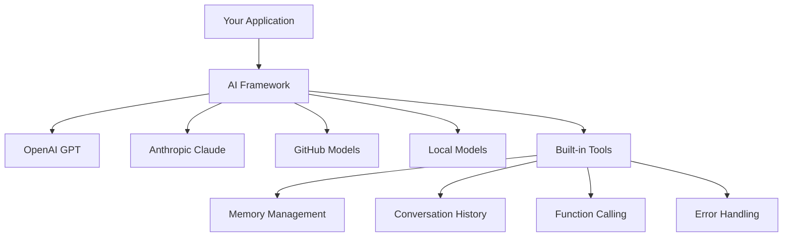
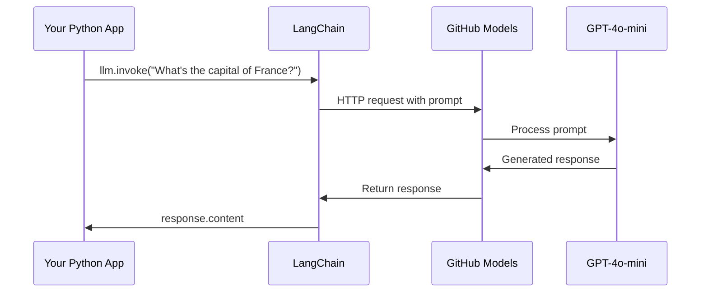
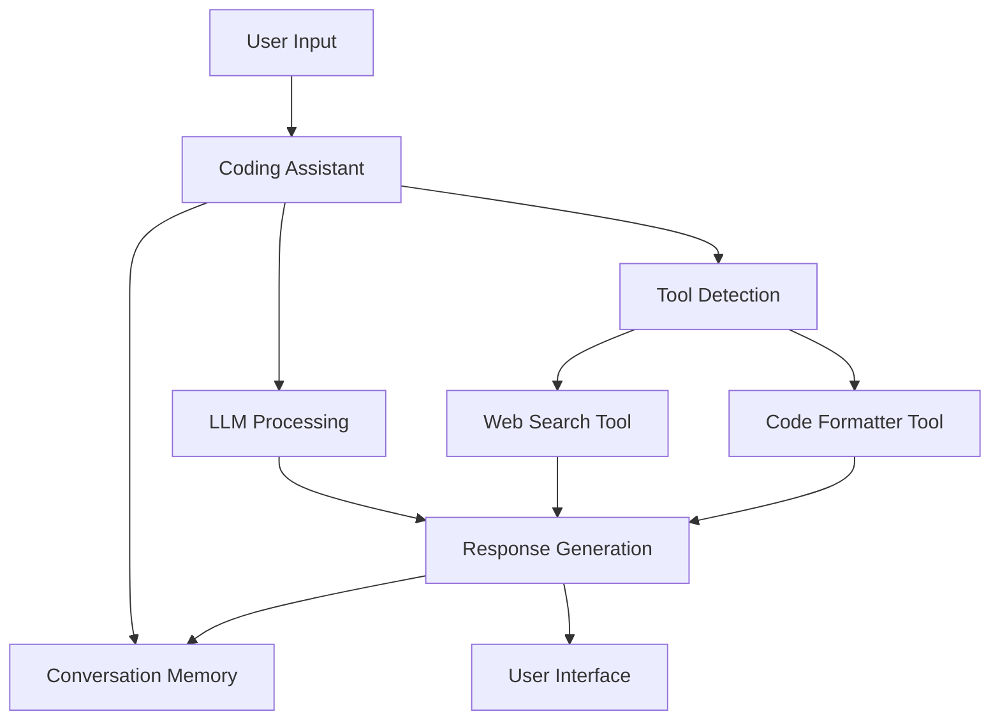
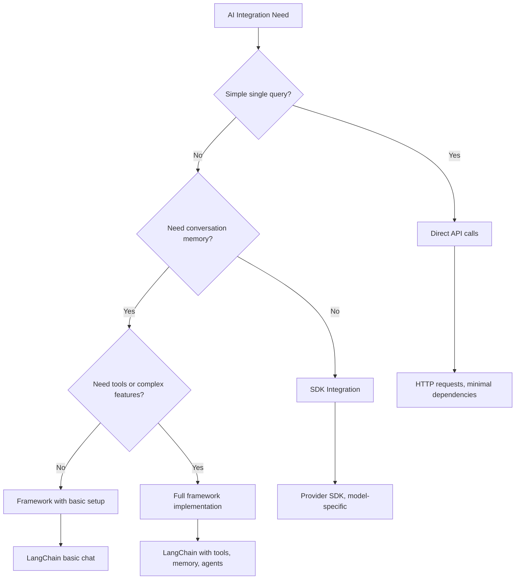

<!--
CO_OP_TRANSLATOR_METADATA:
{
  "original_hash": "e2c4ae5688e34b4b8b09d52aec56c79e",
  "translation_date": "2025-10-24T23:57:01+00:00",
  "source_file": "10-ai-framework-project/README.md",
  "language_code": "hr"
}
-->
# AI Framework

Jeste li se ikada osjećali preplavljeno pokušavajući izgraditi AI aplikacije od nule? Niste jedini! AI okviri su poput švicarskog nožića za razvoj umjetne inteligencije - moćni alati koji vam mogu uštedjeti vrijeme i glavobolje pri izradi inteligentnih aplikacija. Zamislite AI okvir kao dobro organiziranu knjižnicu: pruža unaprijed izgrađene komponente, standardizirane API-je i pametne apstrakcije kako biste se mogli usredotočiti na rješavanje problema umjesto na borbu s detaljima implementacije.

U ovoj lekciji istražit ćemo kako okviri poput LangChain-a mogu pretvoriti nekada složene zadatke integracije AI-a u čist i čitljiv kod. Otkrit ćete kako se nositi s izazovima iz stvarnog svijeta, poput praćenja razgovora, implementacije poziva alata i upravljanja različitim AI modelima putem jednog ujedinjenog sučelja.

Do kraja lekcije znat ćete kada posegnuti za okvirima umjesto za sirovim API pozivima, kako učinkovito koristiti njihove apstrakcije i kako izgraditi AI aplikacije spremne za stvarnu upotrebu. Istražimo što AI okviri mogu učiniti za vaše projekte.

## Zašto odabrati okvir?

Spremni ste za izradu AI aplikacije - sjajno! Ali evo u čemu je stvar: imate nekoliko različitih puteva koje možete odabrati, a svaki od njih ima svoje prednosti i nedostatke. To je pomalo kao biranje između hodanja, vožnje biciklom ili autom kako biste stigli negdje - svi će vas odvesti na odredište, ali iskustvo (i trud) bit će potpuno različiti.

Razmotrimo tri glavna načina na koja možete integrirati AI u svoje projekte:

| Pristup | Prednosti | Najbolje za | Razmatranja |
|----------|------------|----------|--------------|
| **Izravni HTTP zahtjevi** | Potpuna kontrola, bez ovisnosti | Jednostavni upiti, učenje osnova | Više opsežan kod, ručno rukovanje greškama |
| **SDK integracija** | Manje boilerplate koda, optimizacija specifična za model | Aplikacije s jednim modelom | Ograničeno na specifične pružatelje usluga |
| **AI okviri** | Ujedinjeni API, ugrađene apstrakcije | Aplikacije s više modela, složeni tijekovi rada | Krivulja učenja, potencijalna prekomjerna apstrakcija |

### Prednosti okvira u praksi



**Zašto su okviri važni:**
- **Ujedinjuju** više AI pružatelja usluga pod jednim sučeljem
- **Automatski upravljaju** memorijom razgovora
- **Pružaju** gotove alate za uobičajene zadatke poput ugrađivanja i poziva funkcija
- **Upravljaju** rukovanjem greškama i logikom ponovnog pokušaja
- **Pretvaraju** složene tijekove rada u čitljive metode poziva

> 💡 **Savjet stručnjaka**: Koristite okvire kada prelazite između različitih AI modela ili gradite složene značajke poput agenata, memorije ili poziva alata. Držite se izravnih API-ja kada učite osnove ili gradite jednostavne, fokusirane aplikacije.

**Zaključak**: Kao i kod odabira između specijaliziranih alata majstora i kompletne radionice, sve ovisi o prilagodbi alata zadatku. Okviri su izvrsni za složene, bogate značajkama aplikacije, dok izravni API-ji dobro funkcioniraju za jednostavne slučajeve upotrebe.

## Uvod

U ovoj lekciji naučit ćemo:

- Kako koristiti uobičajeni AI okvir.
- Kako riješiti uobičajene probleme poput razgovora, korištenja alata, memorije i konteksta.
- Kako to iskoristiti za izradu AI aplikacija.

## Vaš prvi AI upit

Započnimo s osnovama stvaranjem vaše prve AI aplikacije koja šalje pitanje i dobiva odgovor. Kao što je Arhimed otkrio princip istiskivanja u svojoj kadi, ponekad najjednostavnija opažanja vode do najmoćnijih uvida - a okviri čine te uvide dostupnima.

### Postavljanje LangChain-a s GitHub modelima

Koristit ćemo LangChain za povezivanje s GitHub modelima, što je prilično sjajno jer vam omogućuje besplatan pristup raznim AI modelima. Najbolji dio? Trebate samo nekoliko jednostavnih parametara konfiguracije da biste započeli:

```python
from langchain_openai import ChatOpenAI
import os

llm = ChatOpenAI(
    api_key=os.environ["GITHUB_TOKEN"],
    base_url="https://models.github.ai/inference",
    model="openai/gpt-4o-mini",
)

# Send a simple prompt
response = llm.invoke("What's the capital of France?")
print(response.content)
```

**Razložimo što se ovdje događa:**
- **Stvara** LangChain klijent koristeći klasu `ChatOpenAI` - ovo je vaš ulaz u AI!
- **Konfigurira** vezu s GitHub modelima pomoću vašeg autentifikacijskog tokena
- **Određuje** koji AI model koristiti (`gpt-4o-mini`) - zamislite to kao odabir vašeg AI asistenta
- **Šalje** vaše pitanje koristeći metodu `invoke()` - ovdje se događa magija
- **Izvlači** i prikazuje odgovor - i voilà, razgovarate s AI-jem!

> 🔧 **Napomena o postavljanju**: Ako koristite GitHub Codespaces, imate sreće - `GITHUB_TOKEN` je već postavljen za vas! Radite lokalno? Bez brige, samo trebate stvoriti osobni pristupni token s odgovarajućim dozvolama.

**Očekivani izlaz:**
```text
The capital of France is Paris.
```



## Izrada konverzacijskog AI-a

Prvi primjer pokazuje osnove, ali to je samo jedna razmjena - postavite pitanje, dobijete odgovor i to je to. U stvarnim aplikacijama želite da vaš AI zapamti o čemu ste razgovarali, poput načina na koji su Watson i Holmes gradili svoje istraživačke razgovore tijekom vremena.

Tu LangChain postaje posebno koristan. Pruža različite vrste poruka koje pomažu u strukturiranju razgovora i omogućuju vam da svom AI-ju date osobnost. Gradit ćete iskustva razgovora koja održavaju kontekst i karakter.

### Razumijevanje vrsta poruka

Zamislite ove vrste poruka kao različite "kape" koje sudionici nose u razgovoru. LangChain koristi različite klase poruka za praćenje tko što govori:

| Vrsta poruke | Svrha | Primjer upotrebe |
|--------------|---------|------------------|
| `SystemMessage` | Definira osobnost i ponašanje AI-ja | "Vi ste korisni asistent za kodiranje" |
| `HumanMessage` | Predstavlja unos korisnika | "Objasnite kako funkcije rade" |
| `AIMessage` | Pohranjuje odgovore AI-ja | Prethodni odgovori AI-ja u razgovoru |

### Stvaranje vašeg prvog razgovora

Stvorimo razgovor u kojem naš AI preuzima određenu ulogu. Neka utjelovi kapetana Picarda - lika poznatog po svojoj diplomatskoj mudrosti i vodstvu:

```python
messages = [
    SystemMessage(content="You are Captain Picard of the Starship Enterprise"),
    HumanMessage(content="Tell me about you"),
]
```

**Razlaganje postavke ovog razgovora:**
- **Uspostavlja** ulogu i osobnost AI-ja putem `SystemMessage`
- **Pruža** početni upit korisnika putem `HumanMessage`
- **Stvara** temelj za razgovor u više koraka

Cijeli kod za ovaj primjer izgleda ovako:

```python
from langchain_core.messages import HumanMessage, SystemMessage
from langchain_openai import ChatOpenAI
import os

llm = ChatOpenAI(
    api_key=os.environ["GITHUB_TOKEN"],
    base_url="https://models.github.ai/inference",
    model="openai/gpt-4o-mini",
)

messages = [
    SystemMessage(content="You are Captain Picard of the Starship Enterprise"),
    HumanMessage(content="Tell me about you"),
]


# works
response  = llm.invoke(messages)
print(response.content)
```

Trebali biste vidjeti ishod sličan:

```text
I am Captain Jean-Luc Picard, the commanding officer of the USS Enterprise (NCC-1701-D), a starship in the United Federation of Planets. My primary mission is to explore new worlds, seek out new life and new civilizations, and boldly go where no one has gone before. 

I believe in the importance of diplomacy, reason, and the pursuit of knowledge. My crew is diverse and skilled, and we often face challenges that test our resolve, ethics, and ingenuity. Throughout my career, I have encountered numerous species, grappled with complex moral dilemmas, and have consistently sought peaceful solutions to conflicts.

I hold the ideals of the Federation close to my heart, believing in the importance of cooperation, understanding, and respect for all sentient beings. My experiences have shaped my leadership style, and I strive to be a thoughtful and just captain. How may I assist you further?
```

Kako biste održali kontinuitet razgovora (umjesto da svaki put resetirate kontekst), trebate nastaviti dodavati odgovore na svoj popis poruka. Kao usmena tradicija koja je očuvala priče kroz generacije, ovaj pristup gradi trajnu memoriju:

```python
from langchain_core.messages import HumanMessage, SystemMessage
from langchain_openai import ChatOpenAI
import os

llm = ChatOpenAI(
    api_key=os.environ["GITHUB_TOKEN"],
    base_url="https://models.github.ai/inference",
    model="openai/gpt-4o-mini",
)

messages = [
    SystemMessage(content="You are Captain Picard of the Starship Enterprise"),
    HumanMessage(content="Tell me about you"),
]


# works
response  = llm.invoke(messages)

print(response.content)

print("---- Next ----")

messages.append(response)
messages.append(HumanMessage(content="Now that I know about you, I'm Chris, can I be in your crew?"))

response  = llm.invoke(messages)

print(response.content)

```

Prilično zgodno, zar ne? Ono što se ovdje događa jest da pozivamo LLM dvaput - prvo samo s našim početnim dvjema porukama, a zatim ponovno s cijelom poviješću razgovora. Kao da AI zapravo prati naš razgovor!

Kada pokrenete ovaj kod, dobit ćete drugi odgovor koji zvuči otprilike ovako:

```text
Welcome aboard, Chris! It's always a pleasure to meet those who share a passion for exploration and discovery. While I cannot formally offer you a position on the Enterprise right now, I encourage you to pursue your aspirations. We are always in need of talented individuals with diverse skills and backgrounds. 

If you are interested in space exploration, consider education and training in the sciences, engineering, or diplomacy. The values of curiosity, resilience, and teamwork are crucial in Starfleet. Should you ever find yourself on a starship, remember to uphold the principles of the Federation: peace, understanding, and respect for all beings. Your journey can lead you to remarkable adventures, whether in the stars or on the ground. Engage!
```

Uzeti ću to kao možda ;)

## Streaming odgovora

Jeste li ikada primijetili kako ChatGPT "tipka" svoje odgovore u stvarnom vremenu? To je streaming u akciji. Kao gledanje vještog kaligrafa na djelu - vidjeti kako se znakovi pojavljuju potez po potez umjesto da se materijaliziraju trenutno - streaming čini interakciju prirodnijom i pruža trenutne povratne informacije.

### Implementacija streaminga s LangChain-om

```python
from langchain_openai import ChatOpenAI
import os

llm = ChatOpenAI(
    api_key=os.environ["GITHUB_TOKEN"],
    base_url="https://models.github.ai/inference",
    model="openai/gpt-4o-mini",
    streaming=True
)

# Stream the response
for chunk in llm.stream("Write a short story about a robot learning to code"):
    print(chunk.content, end="", flush=True)
```

**Zašto je streaming sjajan:**
- **Prikazuje** sadržaj dok se stvara - nema više neugodnog čekanja!
- **Čini** da se korisnici osjećaju kao da se nešto stvarno događa
- **Djeluje** brže, čak i kad tehnički nije
- **Omogućuje** korisnicima da počnu čitati dok AI još "razmišlja"

> 💡 **Savjet za korisničko iskustvo**: Streaming se zaista ističe kada se bavite duljim odgovorima poput objašnjenja koda, kreativnog pisanja ili detaljnih tutorijala. Vaši korisnici će voljeti vidjeti napredak umjesto da zure u prazan ekran!

## Predlošci upita

Predlošci upita funkcioniraju poput retoričkih struktura korištenih u klasičnoj oratoriji - razmislite o tome kako bi Ciceron prilagodio svoje obrasce govora za različitu publiku, dok bi zadržao isti uvjerljivi okvir. Omogućuju vam stvaranje ponovljivih upita gdje možete zamijeniti različite dijelove informacija bez ponovnog pisanja svega. Jednom kada postavite predložak, samo popunite varijable s potrebnim vrijednostima.

### Stvaranje ponovljivih upita

```python
from langchain_core.prompts import ChatPromptTemplate

# Define a template for code explanations
template = ChatPromptTemplate.from_messages([
    ("system", "You are an expert programming instructor. Explain concepts clearly with examples."),
    ("human", "Explain {concept} in {language} with a practical example for {skill_level} developers")
])

# Use the template with different values
questions = [
    {"concept": "functions", "language": "JavaScript", "skill_level": "beginner"},
    {"concept": "classes", "language": "Python", "skill_level": "intermediate"},
    {"concept": "async/await", "language": "JavaScript", "skill_level": "advanced"}
]

for question in questions:
    prompt = template.format_messages(**question)
    response = llm.invoke(prompt)
    print(f"Topic: {question['concept']}\n{response.content}\n---\n")
```

**Zašto ćete voljeti koristiti predloške:**
- **Održava** vaše upite dosljednima u cijeloj aplikaciji
- **Nema više** neurednog spajanja stringova - samo čiste, jednostavne varijable
- **Vaš AI** se ponaša predvidljivo jer struktura ostaje ista
- **Ažuriranja** su jednostavna - promijenite predložak jednom i svugdje je ažuriran

## Strukturirani izlaz

Jeste li ikada bili frustrirani pokušavajući analizirati AI odgovore koji se vraćaju kao nestrukturirani tekst? Strukturirani izlaz je poput podučavanja vašeg AI-ja da slijedi sustavni pristup koji je Linnaeus koristio za biološku klasifikaciju - organiziran, predvidljiv i jednostavan za rad. Možete zatražiti JSON, specifične podatkovne strukture ili bilo koji format koji vam je potreban.

### Definiranje shema izlaza

```python
from langchain_core.prompts import ChatPromptTemplate
from langchain_core.output_parsers import JsonOutputParser
from pydantic import BaseModel, Field

class CodeReview(BaseModel):
    score: int = Field(description="Code quality score from 1-10")
    strengths: list[str] = Field(description="List of code strengths")
    improvements: list[str] = Field(description="List of suggested improvements")
    overall_feedback: str = Field(description="Summary feedback")

# Set up the parser
parser = JsonOutputParser(pydantic_object=CodeReview)

# Create prompt with format instructions
prompt = ChatPromptTemplate.from_messages([
    ("system", "You are a code reviewer. {format_instructions}"),
    ("human", "Review this code: {code}")
])

# Format the prompt with instructions
chain = prompt | llm | parser

# Get structured response
code_sample = """
def calculate_average(numbers):
    return sum(numbers) / len(numbers)
"""

result = chain.invoke({
    "code": code_sample,
    "format_instructions": parser.get_format_instructions()
})

print(f"Score: {result['score']}")
print(f"Strengths: {', '.join(result['strengths'])}")
```

**Zašto je strukturirani izlaz revolucionaran:**
- **Nema više** nagađanja u kojem formatu ćete dobiti odgovor - uvijek je dosljedan
- **Izravno se povezuje** s vašim bazama podataka i API-jima bez dodatnog rada
- **Hvata** čudne AI odgovore prije nego što pokvare vašu aplikaciju
- **Čini** vaš kod čišćim jer točno znate s čime radite

## Pozivanje alata

Sada dolazimo do jedne od najmoćnijih značajki: alata. Ovo je način na koji svom AI-ju dajete praktične sposobnosti izvan razgovora. Kao što su srednjovjekovni cehovi razvili specijalizirane alate za određene zanate, možete opremiti svoj AI fokusiranim instrumentima. Opisujete koji su alati dostupni, a kada netko zatraži nešto što odgovara, vaš AI može poduzeti akciju.

### Korištenje Pythona

Dodajmo nekoliko alata ovako:

```python
from typing_extensions import Annotated, TypedDict

class add(TypedDict):
    """Add two integers."""

    # Annotations must have the type and can optionally include a default value and description (in that order).
    a: Annotated[int, ..., "First integer"]
    b: Annotated[int, ..., "Second integer"]

tools = [add]

functions = {
    "add": lambda a, b: a + b
}
```

Što se ovdje događa? Stvaramo nacrt za alat nazvan `add`. Nasljeđivanjem iz `TypedDict` i korištenjem tih naprednih `Annotated` tipova za `a` i `b`, dajemo LLM-u jasnu sliku o tome što ovaj alat radi i što mu je potrebno. Rječnik `functions` je poput našeg alata - govori našem kodu točno što učiniti kada AI odluči koristiti određeni alat.

Pogledajmo kako sljedeće pozivamo LLM s ovim alatom:

```python
llm = ChatOpenAI(
    api_key=os.environ["GITHUB_TOKEN"],
    base_url="https://models.github.ai/inference",
    model="openai/gpt-4o-mini",
)

llm_with_tools = llm.bind_tools(tools)
```

Ovdje pozivamo `bind_tools` s našim nizom `tools`, čime LLM `llm_with_tools` sada ima znanje o ovom alatu.

Da bismo koristili ovaj novi LLM, možemo upisati sljedeći kod:

```python
query = "What is 3 + 12?"

res = llm_with_tools.invoke(query)
if(res.tool_calls):
    for tool in res.tool_calls:
        print("TOOL CALL: ", functions[tool["name"]](../../../10-ai-framework-project/**tool["args"]))
print("CONTENT: ",res.content)
```

Sada kada pozivamo `invoke` na ovom novom LLM-u, koji ima alate, možda će svojstvo `tool_calls` biti popunjeno. Ako je tako, bilo koji identificirani alat ima svojstvo `name` i `args` koje identificira koji alat treba pozvati i s argumentima. Cijeli kod izgleda ovako:

```python
from langchain_core.messages import HumanMessage, SystemMessage
from langchain_openai import ChatOpenAI
import os
from typing_extensions import Annotated, TypedDict

class add(TypedDict):
    """Add two integers."""

    # Annotations must have the type and can optionally include a default value and description (in that order).
    a: Annotated[int, ..., "First integer"]
    b: Annotated[int, ..., "Second integer"]

tools = [add]

functions = {
    "add": lambda a, b: a + b
}

llm = ChatOpenAI(
    api_key=os.environ["GITHUB_TOKEN"],
    base_url="https://models.github.ai/inference",
    model="openai/gpt-4o-mini",
)

llm_with_tools = llm.bind_tools(tools)

query = "What is 3 + 12?"

res = llm_with_tools.invoke(query)
if(res.tool_calls):
    for tool in res.tool_calls:
        print("TOOL CALL: ", functions[tool["name"]](../../../10-ai-framework-project/**tool["args"]))
print("CONTENT: ",res.content)
```

Pokretanjem ovog koda trebali biste vidjeti izlaz sličan:

```text
TOOL CALL:  15
CONTENT: 
```

AI je analizirao "Što je 3 + 12" i prepoznao ovo kao zadatak za alat `add`. Kao što vješt knjižničar zna na koji izvor se obratiti na temelju vrste postavljenog pitanja, AI je to zaključio iz naziva alata, opisa i specifikacija polja. Rezultat od 15 dolazi iz našeg rječnika `functions` koji izvršava alat:

```python
print("TOOL CALL: ", functions[tool["name"]](../../../10-ai-framework-project/**tool["args"]))
```

### Zanimljiviji alat koji poziva web API

Dodavanje brojeva demonstrira koncept, ali stvarni alati obično obavljaju složenije operacije, poput pozivanja web API-ja. Proširimo naš primjer kako bismo omogućili AI-ju da dohvaća sadržaj s interneta - slično kao što su telegrafisti nekada povezivali udaljene lokacije:

```python
class joke(TypedDict):
    """Tell a joke."""

    # Annotations must have the type and can optionally include a default value and description (in that order).
    category: Annotated[str, ..., "The joke category"]

def get_joke(category: str) -> str:
    response = requests.get(f"https://api.chucknorris.io/jokes/random?category={category}", headers={"Accept": "application/json"})
    if response.status_code == 200:
        return response.json().get("value", f"Here's a {category} joke!")
    return f"Here's a {category} joke!"

functions = {
    "add": lambda a, b: a + b,
    "joke": lambda category: get_joke(category)
}

query = "Tell me a joke about animals"

# the rest of the code is the same
```

Sada, ako pokrenete ovaj kod, dobit ćete odgovor koji kaže nešto poput:

```text
TOOL CALL:  Chuck Norris once rode a nine foot grizzly bear through an automatic car wash, instead of taking a shower.
CONTENT:  
```

Evo cijelog koda:

```python
from langchain_openai import ChatOpenAI
import requests
import os
from typing_extensions import Annotated, TypedDict

class add(TypedDict):
    """Add two integers."""

    # Annotations must have the type and can optionally include a default value and description (in that order).
    a: Annotated[int, ..., "First integer"]
    b: Annotated[int, ..., "Second integer"]

class joke(TypedDict):
    """Tell a joke."""

    # Annotations must have the type and can optionally include a default value and description (in that order).
    category: Annotated[str, ..., "The joke category"]

tools = [add, joke]

def get_joke(category: str) -> str:
    response = requests.get(f"https://api.chucknorris.io/jokes/random?category={category}", headers={"Accept": "application/json"})
    if response.status_code == 200:
        return response.json().get("value", f"Here's a {category} joke!")
    return f"Here's a {category} joke!"

functions = {
    "add": lambda a, b: a + b,
    "joke": lambda category: get_joke(category)
}

llm = ChatOpenAI(
    api_key=os.environ["GITHUB_TOKEN"],
    base_url="https://models.github.ai/inference",
    model="openai/gpt-4o-mini",
)

llm_with_tools = llm.bind_tools(tools)

query = "Tell me a joke about animals"

res = llm_with_tools.invoke(query)
if(res.tool_calls):
    for tool in res.tool_calls:
        # print("TOOL CALL: ", tool)
        print("TOOL CALL: ", functions[tool["name"]](../../../10-ai-framework-project/**tool["args"]))
print("CONTENT: ",res.content)
```

## Ugrađivanja i obrada dokumenata

Ugrađivanja predstavljaju jedno od najelegantnijih rješenja u modernom AI-ju. Zamislite da možete uzeti bilo koji tekst i pretvoriti ga u numeričke koordinate koje hvataju njegovo značenje. To je upravo ono što ugrađivanja rade - transformiraju tekst u točke u višedimenzionalnom prostoru gdje se slični koncepti grupiraju. To je poput koordinatnog sustava za ideje, nalik na način na koji je Mendeljejev organizirao periodni sustav prema atomskim svojstvima.

### Stvaranje i korištenje ugrađivanja

```python
from langchain_openai import OpenAIEmbeddings
from langchain_community.vectorstores import FAISS
from langchain_community.document_loaders import TextLoader
from langchain.text_splitter import CharacterTextSplitter

# Initialize embeddings
embeddings = OpenAIEmbeddings(
    api_key=os.environ["GITHUB_TOKEN"],
    base_url="https://models.github.ai/inference",
    model="text-embedding-3-small"
)

# Load and split documents
loader = TextLoader("documentation.txt")
documents = loader.load()

text_splitter = CharacterTextSplitter(chunk_size=1000, chunk_overlap=0)
texts = text_splitter.split_documents(documents)

# Create vector store
vectorstore = FAISS.from_documents(texts, embeddings)

# Perform similarity search
query = "How do I handle user authentication?"
similar_docs = vectorstore.similarity_search(query, k=3)

for doc in similar_docs:
    print(f"Relevant content: {doc.page_content[:200]}...")
```

### Učitavanje dokumenata u različitim formatima

```python
from langchain_community.document_loaders import (
    PyPDFLoader,
    CSVLoader,
    JSONLoader,
    WebBaseLoader
)

# Load different document types
pdf_loader = PyPDFLoader("manual.pdf")
csv_loader = CSVLoader("data.csv")
json_loader = JSONLoader("config.json")
web_loader = WebBaseLoader("https://example.com/docs")

# Process all documents
all_documents = []
for loader in [pdf_loader, csv_loader, json_loader, web_loader]:
    docs = loader.load()
    all_documents.extend(docs)
```

**Što možete učiniti s ugrađivanjima:**
- **Izgraditi** pretraživanje koje zaista razumije što mislite, a ne samo podudaranje ključnih riječi
- **Stvoriti** AI koji može odgovarati na pitanja o vašim dokumentima
- **Napraviti** sustave preporuka koji predlažu zaista relevantan sadržaj
- **Automatski** organizirati i kategorizirati vaš sadržaj

## Izrada kompletne AI aplikacije

Sada ćemo integrirati sve što ste naučili u sveobuhvatnu aplikaciju - asistenta za kodiranje koji može odgovarati na pitanja, koristiti alate i održavati memoriju razgovora. Kao što je tiskarski stroj kombinirao postojeće tehnologije (pomicanje slova, tinta, papir i pritisak) u nešto transformativno, kombinirat ćemo naše AI komponente u nešto praktično i korisno.

### Primjer kompletne aplikacije

```python
from langchain_openai import ChatOpenAI, OpenAIEmbeddings
from langchain_core.prompts import ChatPromptTemplate
from langchain_core.messages import HumanMessage, SystemMessage, AIMessage
from langchain_community.vectorstores import FAISS
from typing_extensions import Annotated, TypedDict
import os
import requests

class CodingAssistant:
    def __init__(self):
        self.llm = ChatOpenAI(
            api_key=os.environ["GITHUB_TOKEN"],
            base_url="https://models.github.ai/inference",
            model="openai/gpt-4o-mini"
        )
        
        self.conversation_history = [
            SystemMessage(content="""You are an expert coding assistant. 
            Help users learn programming concepts, debug code, and write better software.
            Use tools when needed and maintain a helpful, encouraging tone.""")
        ]
        
        # Define tools
        self.setup_tools()
    
    def setup_tools(self):
        class web_search(TypedDict):
            """Search for programming documentation or examples."""
            query: Annotated[str, "Search query for programming help"]
        
        class code_formatter(TypedDict):
            """Format and validate code snippets."""
            code: Annotated[str, "Code to format"]
            language: Annotated[str, "Programming language"]
        
        self.tools = [web_search, code_formatter]
        self.llm_with_tools = self.llm.bind_tools(self.tools)
    
    def chat(self, user_input: str):
        # Add user message to conversation
        self.conversation_history.append(HumanMessage(content=user_input))
        
        # Get AI response
        response = self.llm_with_tools.invoke(self.conversation_history)
        
        # Handle tool calls if any
        if response.tool_calls:
            for tool_call in response.tool_calls:
                tool_result = self.execute_tool(tool_call)
                print(f"🔧 Tool used: {tool_call['name']}")
                print(f"📊 Result: {tool_result}")
        
        # Add AI response to conversation
        self.conversation_history.append(response)
        
        return response.content
    
    def execute_tool(self, tool_call):
        tool_name = tool_call['name']
        args = tool_call['args']
        
        if tool_name == 'web_search':
            return f"Found documentation for: {args['query']}"
        elif tool_name == 'code_formatter':
            return f"Formatted {args['language']} code: {args['code'][:50]}..."
        
        return "Tool execution completed"

# Usage example
assistant = CodingAssistant()

print("🤖 Coding Assistant Ready! Type 'quit' to exit.\n")

while True:
    user_input = input("You: ")
    if user_input.lower() == 'quit':
        break
    
    response = assistant.chat(user_input)
    print(f"🤖 Assistant: {response}\n")
```

**Arhitektura aplikacije:**



**Ključne značajke koje smo implementirali:**
- **Pamti** cijeli vaš razgovor za kontinuitet konteksta
- **Izvršava radnje** putem poziva alata, ne samo razgovora
- **Prati** predvidljive obrasce interakcije
- **Automatski upravlja** rukovanjem greškama i složenim tijekovima rada

## Zadatak: Izradite vlastitog AI asistenta za učenje

**Cilj**: Stvorite AI aplikaciju koja pomaže studentima u učenju programskih koncepata pružanjem objašnjenja, primjera koda i interaktivnih kvizova.

### Zahtjevi

**Osnovne značajke (obavezno):**
1. **Razgovorno sučelje**: Implementirajte sustav za chat koji održava kontekst kroz više pitanja
2. **Obrazovni alati**: Stvorite barem dva alata koja pomažu u učenju:
   - Alat za objašnjenje koda
   - Generator kvizova za koncepte
3. **Personalizirano učenje**: Koristite sistemske poruke za prilagodbu odgovora različitim razinama vještina  
4. **Formatiranje odgovora**: Implementirajte strukturirani izlaz za pitanja kviza  

### Koraci implementacije  

**Korak 1: Postavljanje okruženja**  
```bash
pip install langchain langchain-openai
```
  
**Korak 2: Osnovna funkcionalnost razgovora**  
- Kreirajte klasu `StudyAssistant`  
- Implementirajte memoriju razgovora  
- Dodajte konfiguraciju osobnosti za edukativnu podršku  

**Korak 3: Dodavanje edukativnih alata**  
- **Objašnjenje koda**: Razlaže kod na razumljive dijelove  
- **Generator kvizova**: Stvara pitanja o konceptima programiranja  
- **Praćenje napretka**: Prati teme koje su obrađene  

**Korak 4: Napredne značajke (opcionalno)**  
- Implementirajte streaming odgovore za bolje korisničko iskustvo  
- Dodajte učitavanje dokumenata za uključivanje materijala s tečaja  
- Kreirajte ugrađene elemente za pretraživanje sadržaja na temelju sličnosti  

### Kriteriji evaluacije  

| Značajka | Izvrsno (4) | Dobro (3) | Zadovoljavajuće (2) | Potrebno poboljšanje (1) |  
|----------|-------------|-----------|---------------------|--------------------------|  
| **Tijek razgovora** | Prirodni, kontekstualno svjesni odgovori | Dobro zadržavanje konteksta | Osnovni razgovor | Nema memorije između razmjena |  
| **Integracija alata** | Više korisnih alata koji besprijekorno rade | 2+ alata ispravno implementirana | 1-2 osnovna alata | Alati ne funkcioniraju |  
| **Kvaliteta koda** | Čist, dobro dokumentiran, rukovanje greškama | Dobra struktura, neka dokumentacija | Osnovna funkcionalnost radi | Loša struktura, bez rukovanja greškama |  
| **Edukativna vrijednost** | Zaista korisno za učenje, prilagodljivo | Dobra podrška za učenje | Osnovna objašnjenja | Ograničena edukativna korist |  

### Primjer strukture koda  

```python
class StudyAssistant:
    def __init__(self, skill_level="beginner"):
        # Initialize LLM, tools, and conversation memory
        pass
    
    def explain_code(self, code, language):
        # Tool: Explain how code works
        pass
    
    def generate_quiz(self, topic, difficulty):
        # Tool: Create practice questions
        pass
    
    def chat(self, user_input):
        # Main conversation interface
        pass

# Example usage
assistant = StudyAssistant(skill_level="intermediate")
response = assistant.chat("Explain how Python functions work")
```
  
**Bonus izazovi:**  
- Dodajte mogućnosti glasovnog unosa/izlaza  
- Implementirajte web sučelje koristeći Streamlit ili Flask  
- Kreirajte bazu znanja iz materijala s tečaja koristeći ugrađene elemente  
- Dodajte praćenje napretka i personalizirane putanje učenja  

## Sažetak  

🎉 Sada ste savladali osnove razvoja AI okvira i naučili kako izgraditi sofisticirane AI aplikacije koristeći LangChain. Kao da ste završili sveobuhvatno naukovanje, stekli ste značajan set vještina. Pogledajmo što ste postigli.  

### Što ste naučili  

**Osnovni koncepti okvira:**  
- **Prednosti okvira**: Razumijevanje kada odabrati okvire umjesto izravnih API poziva  
- **Osnove LangChain-a**: Postavljanje i konfiguriranje AI modela  
- **Vrste poruka**: Korištenje `SystemMessage`, `HumanMessage` i `AIMessage` za strukturirane razgovore  

**Napredne značajke:**  
- **Pozivanje alata**: Kreiranje i integracija prilagođenih alata za poboljšane AI mogućnosti  
- **Memorija razgovora**: Održavanje konteksta kroz više izmjena u razgovoru  
- **Streaming odgovori**: Implementacija isporuke odgovora u stvarnom vremenu  
- **Predlošci upita**: Izrada ponovljivih, dinamičnih upita  
- **Strukturirani izlaz**: Osiguravanje dosljednih, lako čitljivih AI odgovora  
- **Ugrađeni elementi**: Kreiranje semantičkog pretraživanja i mogućnosti obrade dokumenata  

**Praktične primjene:**  
- **Izrada kompletnih aplikacija**: Kombiniranje više značajki u aplikacije spremne za proizvodnju  
- **Rukovanje greškama**: Implementacija robusnog upravljanja greškama i validacije  
- **Integracija alata**: Kreiranje prilagođenih alata koji proširuju AI mogućnosti  

### Ključne lekcije  

> 🎯 **Zapamtite**: AI okviri poput LangChain-a su u osnovi vaši najbolji prijatelji za skrivanje složenosti i pružanje bogatih značajki. Savršeni su kada trebate memoriju razgovora, pozivanje alata ili želite raditi s više AI modela bez gubitka razuma.  

**Okvir za donošenje odluka o integraciji AI-a:**  


  
### Što dalje?  

**Počnite graditi odmah:**  
- Iskoristite ove koncepte i izgradite nešto što vas uzbuđuje!  
- Eksperimentirajte s različitim AI modelima kroz LangChain - to je kao igralište za AI modele  
- Kreirajte alate koji rješavaju stvarne probleme s kojima se suočavate u svom radu ili projektima  

**Spremni za sljedeću razinu?**  
- **AI agenti**: Izradite AI sustave koji mogu planirati i izvršavati složene zadatke samostalno  
- **RAG (Generacija uz prošireno pretraživanje)**: Kombinirajte AI s vlastitim bazama znanja za aplikacije s povećanim mogućnostima  
- **Multimodalni AI**: Radite s tekstom, slikama i zvukom zajedno - mogućnosti su beskrajne!  
- **Implementacija u produkciju**: Naučite kako skalirati svoje AI aplikacije i pratiti ih u stvarnom svijetu  

**Pridružite se zajednici:**  
- Zajednica LangChain-a je fantastična za praćenje novosti i učenje najboljih praksi  
- GitHub Models vam pruža pristup najnovijim AI mogućnostima - savršeno za eksperimentiranje  
- Nastavite vježbati s različitim slučajevima upotrebe - svaki projekt će vas naučiti nešto novo  

Sada imate znanje za izradu inteligentnih, konverzacijskih aplikacija koje mogu pomoći ljudima u rješavanju stvarnih problema. Kao renesansni majstori koji su kombinirali umjetničku viziju s tehničkom vještinom, sada možete spojiti AI mogućnosti s praktičnom primjenom. Pitanje je: što ćete stvoriti? 🚀  

## Izazov GitHub Copilot Agenta 🚀  

Koristite Agent način rada za dovršavanje sljedećeg izazova:  

**Opis:** Izradite naprednog AI asistenta za pregled koda koji kombinira više značajki LangChain-a, uključujući pozivanje alata, strukturirani izlaz i memoriju razgovora, kako bi pružio sveobuhvatne povratne informacije o predaji koda.  

**Upit:** Kreirajte klasu CodeReviewAssistant koja implementira:  
1. Alat za analizu složenosti koda i predlaganje poboljšanja  
2. Alat za provjeru koda prema najboljim praksama  
3. Strukturirani izlaz koristeći Pydantic modele za dosljedan format pregleda  
4. Memoriju razgovora za praćenje sesija pregleda  
5. Glavno sučelje za razgovor koje može obrađivati predaju koda i pružiti detaljne, korisne povratne informacije  

Asistent bi trebao moći pregledavati kod na više programskih jezika, održavati kontekst kroz više predaja koda u jednoj sesiji i pružiti i sažetke ocjena i detaljne prijedloge za poboljšanje.  

Saznajte više o [agent načinu rada](https://code.visualstudio.com/blogs/2025/02/24/introducing-copilot-agent-mode) ovdje.  

---

**Izjava o odricanju odgovornosti**:  
Ovaj dokument je preveden pomoću AI usluge za prevođenje [Co-op Translator](https://github.com/Azure/co-op-translator). Iako nastojimo osigurati točnost, imajte na umu da automatski prijevodi mogu sadržavati pogreške ili netočnosti. Izvorni dokument na izvornom jeziku treba smatrati autoritativnim izvorom. Za ključne informacije preporučuje se profesionalni prijevod od strane ljudskog prevoditelja. Ne preuzimamo odgovornost za nesporazume ili pogrešna tumačenja koja proizlaze iz korištenja ovog prijevoda.