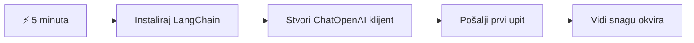
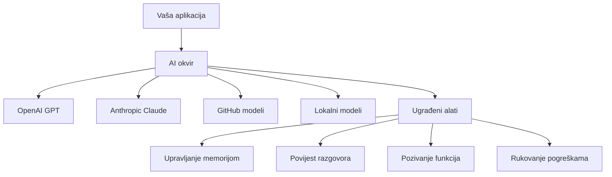
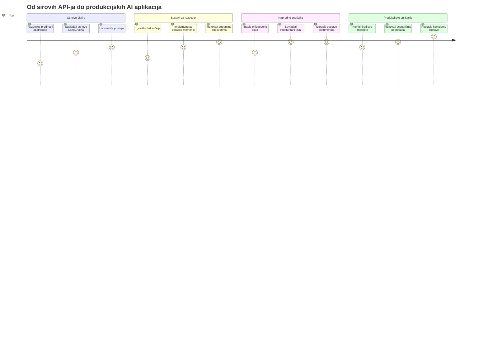
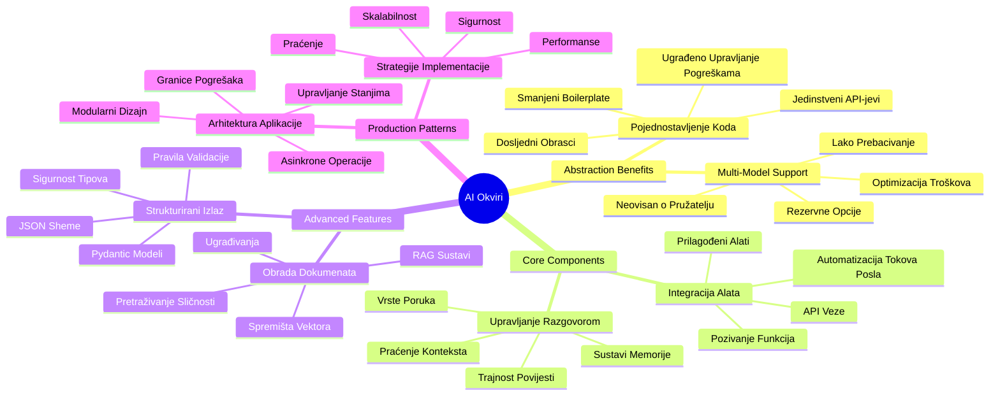
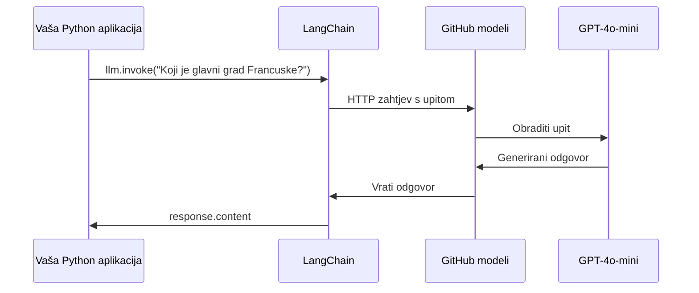
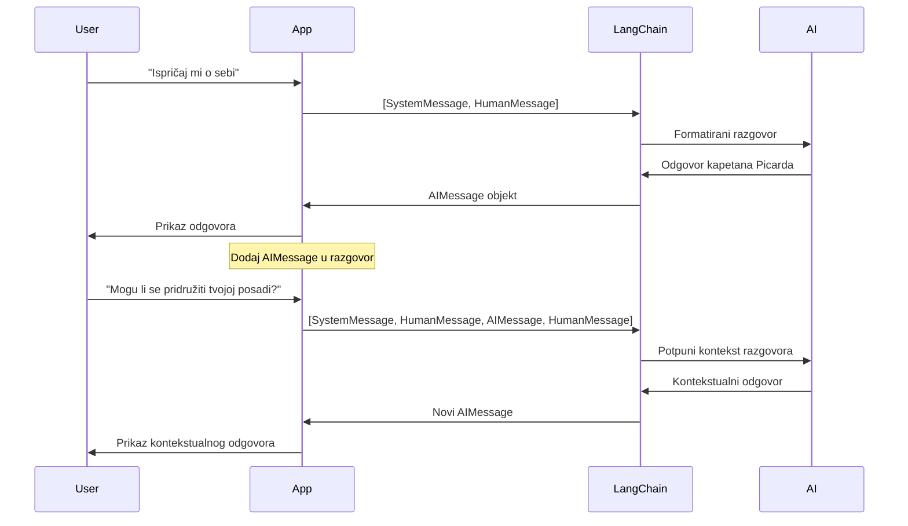
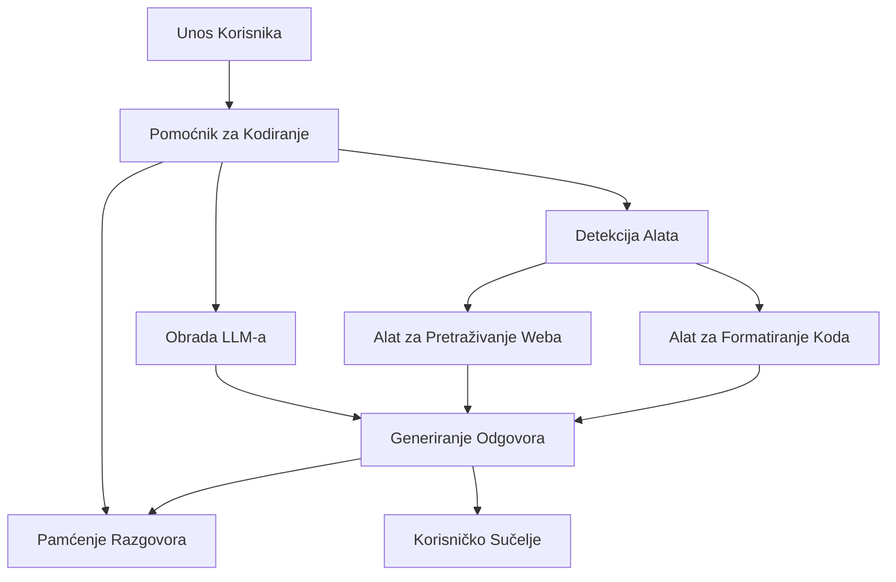
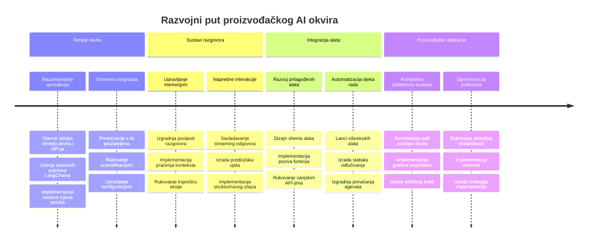
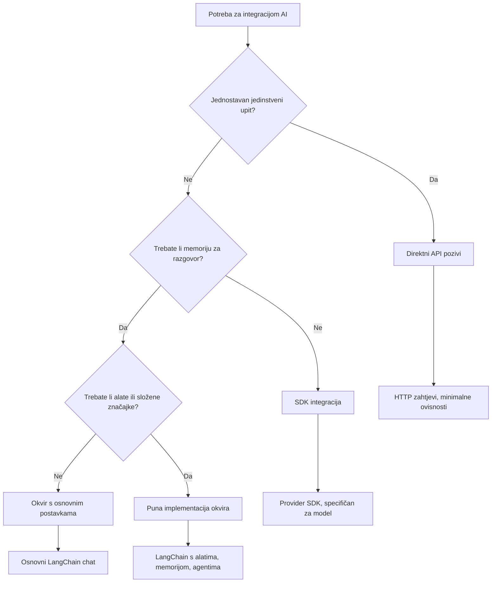

# Okvir za umjetnu inteligenciju

Jeste li se ikad osjećali preplavljeno pokušavajući izgraditi AI aplikacije od nule? Niste sami! AI okviri su poput švicarskog noža za razvoj umjetne inteligencije - moćni alati koji vam mogu uštedjeti vrijeme i glavobolje pri izgradnji inteligentnih aplikacija. Zamislite AI okvir kao dobro organiziranu biblioteku: on pruža unaprijed izrađene komponente, standardizirane API-je i pametne apstrakcije kako biste se mogli usredotočiti na rješavanje problema umjesto na borbu s detaljima implementacije.

U ovom ćemo lekciji istražiti kako okviri poput LangChain mogu pretvoriti ono što je nekad bilo složen zadatak integracije AI-a u čist i čitljiv kod. Otkrit ćete kako se nositi s izazovima iz stvarnog svijeta kao što su praćenje razgovora, implementacija pozivanja alata i upravljanje različitim AI modelima kroz jedan objedinjeni sučelje.

Do kraja lekcije znat ćete kada posegnuti za okvirima umjesto za sirovim API pozivima, kako učinkovito koristiti njihove apstrakcije te kako graditi AI aplikacije spremne za stvarnu upotrebu. Istražimo što AI okviri mogu učiniti za vaše projekte.

## ⚡ Što možete napraviti u sljedećih 5 minuta

**Put za brzi početak za zaposlene programere**


- **Minuta 1**: Instalirajte LangChain: `pip install langchain langchain-openai`
- **Minuta 2**: Postavite svoj GitHub token i uvezite ChatOpenAI klijenta
- **Minuta 3**: Kreirajte jednostavni razgovor sa sistemskim i ljudskim porukama
- **Minuta 4**: Dodajte osnovni alat (poput funkcije zbrajanja) i isprobajte pozivanje AI alata
- **Minuta 5**: Iskusite razliku između sirovih API poziva i apstrakcije okvira

**Brzi testni kod**:  
```python
from langchain_openai import ChatOpenAI
from langchain_core.messages import SystemMessage, HumanMessage

llm = ChatOpenAI(
    api_key=os.environ["GITHUB_TOKEN"],
    base_url="https://models.github.ai/inference",
    model="openai/gpt-4o-mini"
)

response = llm.invoke([
    SystemMessage(content="You are a helpful coding assistant"),
    HumanMessage(content="Explain Python functions briefly")
])
print(response.content)
```
  
**Zašto je ovo važno**: U 5 minuta iskusit ćete kako AI okviri pretvaraju složenu integraciju umjetne inteligencije u jednostavne metode poziva. Ovo je temelj koji pokreće proizvodne AI aplikacije.

## Zašto odabrati okvir?

Dakle, spremni ste izgraditi AI aplikaciju - sjajno! Ali evo stvar: imate nekoliko različitih puteva kojima možete ići, a svaki ima svoje prednosti i nedostatke. To je kao biranje između hodanja, vožnje bicikla ili automobila - svi će vas odvesti tamo, ali iskustvo (i trud) će biti potpuno različiti.

Podijelimo tri glavna načina na koja možete integrirati AI u svoje projekte:

| Pristup | Prednosti | Najbolje za | Razmatranja |
|---------|------------|-------------|-------------|
| **Izravni HTTP zahtjevi** | Potpuna kontrola, bez ovisnosti | Jednostavni upiti, učenje osnova | Opširniji kod, ručno upravljanje greškama |
| **SDK integracija** | Manje boilerplate koda, optimizacija za određene modele | Aplikacije s jednim modelom | Ograničeno na određene pružatelje |
| **AI okviri** | Jedinstveni API, ugrađene apstrakcije | Višestruke modele, složeni tijekovi rada | Krivulja učenja, moguća pretjerana apstrakcija |

### Prednosti okvira u praksi


**Zašto su okviri važni:**  
- **Objedinjuju** više AI pružatelja pod jednim sučeljem  
- **Automatski upravljaju** memorijom razgovora  
- **Pružaju** gotove alate za uobičajene zadatke poput ugradnji i pozivanja funkcija  
- **Upravljaju** obradom grešaka i logikom ponovnog pokušaja  
- **Pretvaraju** složene tijekove rada u čitljive metode poziva  

> 💡 **Savjet od profesionalca**: Koristite okvire kad prelazite između različitih AI modela ili gradite složene značajke kao što su agenti, memorija ili pozivanje alata. Držite se izravnih API-ja pri učenju osnova ili izgradnji jednostavnih, fokusiranih aplikacija.

**Zaključak**: Kao kod izbora između specijaliziranih alata majstora i kompletne radionice, bitno je uskladiti alat sa zadatkom. Okviri su izvrsni za složene, bogate značajkama aplikacije, dok izravni API-ji dobro funkcioniraju za jednostavne slučajeve upotrebe.

## 🗺️ Vaše putovanje u svladavanje AI okvira


**Vaš cilj na ovom putovanju**: Do kraja lekcije svladat ćete razvoj AI okvira i moći ćete izgraditi sofisticirane, proizvodno spremne AI aplikacije koje pariraju komercijalnim AI asistentima.

## Uvod

U ovoj lekciji naučit ćemo:

- Koristiti uobičajeni AI okvir.  
- Riješiti uobičajene probleme poput razgovora, korištenja alata, memorije i konteksta.  
- Iskoristiti ovo za izgradnju AI aplikacija.

## 🧠 Ekosustav razvoja AI okvira


**Ključno načelo**: AI okviri apstrahiraju složenost dok pružaju moćne apstrakcije za upravljanje razgovorom, integraciju alata i obradu dokumenata, omogućujući programerima izgradnju sofisticiranih AI aplikacija s čistim i održivim kodom.

## Vaš prvi AI upit

Počnimo s osnovama kreiranjem vaše prve AI aplikacije koja šalje pitanje i dobiva odgovor. Kao što je Arhimed otkrio princip istiskivanja u svojoj kadi, ponekad najjednostavnija zapažanja vode do najmoćnijih uvida - a okviri čine te uvide dostupnima.

### Postavljanje LangChaina s GitHub modelima

Koristit ćemo LangChain za povezivanje s GitHub modelima, što je super jer vam daje besplatan pristup raznim AI modelima. Najbolji dio? Trebate samo nekoliko jednostavnih konfiguracijskih parametara za početak:

```python
from langchain_openai import ChatOpenAI
import os

llm = ChatOpenAI(
    api_key=os.environ["GITHUB_TOKEN"],
    base_url="https://models.github.ai/inference",
    model="openai/gpt-4o-mini",
)

# Pošaljite jednostavan upit
response = llm.invoke("What's the capital of France?")
print(response.content)
```
  
**Objasnimo što se ovdje događa:**  
- **Kreira** LangChain klijenta koristeći `ChatOpenAI` klasu - ovo je vaš pristup AI-u!  
- **Konfigurira** vezu s GitHub modelima koristeći vaš autentifikacijski token  
- **Navodi** koji AI model koristiti (`gpt-4o-mini`) - zamislite to kao odabir svog AI asistenta  
- **Šalje** pitanje koristeći `invoke()` metodu - ovdje se događa magija  
- **Izvlači** i prikazuje odgovor - i eto, razgovarate s AI-em!

> 🔧 **Napomena o postavljanju**: Ako koristite GitHub Codespaces, imate sreće - `GITHUB_TOKEN` je već postavljen! Radite lokalno? Nema brige, samo trebate kreirati osobni pristupni token s odgovarajućim dopuštenjima.

**Očekivani izlaz:**  
```text
The capital of France is Paris.
```
  

## Izgradnja razgovornog AI-a

Prvi primjer pokazuje osnove, ali riječ je o jednoj razmjeni – postavite pitanje, dobijete odgovor, i to je to. U stvarnim aplikacijama želite da vaš AI pamti o čemu ste raspravljali, poput načina na koji su Watson i Holmes gradili svoje istraživačke razgovore tijekom vremena.

Ovdje LangChain postaje naročito koristan. Pruža različite vrste poruka koje pomažu strukturirati razgovore i omogućiti da svojem AI-u date osobnost. Izgradit ćete iskustva chata koja održavaju kontekst i karakter.

### Razumijevanje vrsta poruka

Zamislite ove vrste poruka kao različite "kape" koje sudionici nose u razgovoru. LangChain koristi različite klase poruka da prati tko što govori:

| Vrsta poruke | Svrha | Primjer upotrebe |
|--------------|-------|------------------|
| `SystemMessage` | Definira osobnost i ponašanje AI-a | "Ti si koristan asistent za programiranje" |
| `HumanMessage` | Predstavlja korisnički unos | "Objasni kako funkcioniraju funkcije" |
| `AIMessage` | Pohranjuje AI odgovore | Prethodni AI odgovori u razgovoru |

### Kreiranje prvog razgovora

Napravimo razgovor u kojem naš AI preuzima specifičnu ulogu. Dat ćemo mu osobnost kapetana Picarda - lika poznatog po diplomatskoj mudrosti i vodstvu:

```python
messages = [
    SystemMessage(content="You are Captain Picard of the Starship Enterprise"),
    HumanMessage(content="Tell me about you"),
]
```
  
**Razbijanje postavki ovog razgovora:**  
- **Postavlja** ulogu i osobnost AI-a kroz `SystemMessage`  
- **Daje** početni korisnički upit kroz `HumanMessage`  
- **Stvara** temelj za višekratni razgovor

Cijeli kod ovog primjera izgleda ovako:

```python
from langchain_core.messages import HumanMessage, SystemMessage
from langchain_openai import ChatOpenAI
import os

llm = ChatOpenAI(
    api_key=os.environ["GITHUB_TOKEN"],
    base_url="https://models.github.ai/inference",
    model="openai/gpt-4o-mini",
)

messages = [
    SystemMessage(content="You are Captain Picard of the Starship Enterprise"),
    HumanMessage(content="Tell me about you"),
]


# radi
response  = llm.invoke(messages)
print(response.content)
```
  
Trebali biste vidjeti rezultat sličan ovome:

```text
I am Captain Jean-Luc Picard, the commanding officer of the USS Enterprise (NCC-1701-D), a starship in the United Federation of Planets. My primary mission is to explore new worlds, seek out new life and new civilizations, and boldly go where no one has gone before. 

I believe in the importance of diplomacy, reason, and the pursuit of knowledge. My crew is diverse and skilled, and we often face challenges that test our resolve, ethics, and ingenuity. Throughout my career, I have encountered numerous species, grappled with complex moral dilemmas, and have consistently sought peaceful solutions to conflicts.

I hold the ideals of the Federation close to my heart, believing in the importance of cooperation, understanding, and respect for all sentient beings. My experiences have shaped my leadership style, and I strive to be a thoughtful and just captain. How may I assist you further?
```
  
Da biste održali kontinuitet razgovora (umjesto resetiranja konteksta svaki put), trebate nastaviti dodavati odgovore na svoj popis poruka. Kao što su usmene tradicije prenosile priče kroz generacije, ovaj pristup gradi trajnu memoriju:

```python
from langchain_core.messages import HumanMessage, SystemMessage
from langchain_openai import ChatOpenAI
import os

llm = ChatOpenAI(
    api_key=os.environ["GITHUB_TOKEN"],
    base_url="https://models.github.ai/inference",
    model="openai/gpt-4o-mini",
)

messages = [
    SystemMessage(content="You are Captain Picard of the Starship Enterprise"),
    HumanMessage(content="Tell me about you"),
]


# radi
response  = llm.invoke(messages)

print(response.content)

print("---- Next ----")

messages.append(response)
messages.append(HumanMessage(content="Now that I know about you, I'm Chris, can I be in your crew?"))

response  = llm.invoke(messages)

print(response.content)

```
  
Prilično genijalno, zar ne? Ono što se događa je da pozivamo LLM dvaput - prvo s našim početnim dvjema porukama, a zatim opet sa cijelom povijesti razgovora. Kao da AI stvarno prati naš razgovor!

Kad izvršite ovaj kod, dobit ćete drugi odgovor koji zvuči otprilike ovako:

```text
Welcome aboard, Chris! It's always a pleasure to meet those who share a passion for exploration and discovery. While I cannot formally offer you a position on the Enterprise right now, I encourage you to pursue your aspirations. We are always in need of talented individuals with diverse skills and backgrounds. 

If you are interested in space exploration, consider education and training in the sciences, engineering, or diplomacy. The values of curiosity, resilience, and teamwork are crucial in Starfleet. Should you ever find yourself on a starship, remember to uphold the principles of the Federation: peace, understanding, and respect for all beings. Your journey can lead you to remarkable adventures, whether in the stars or on the ground. Engage!
```
  

Uzet ću to kao možda ;)

## Streaming odgovori

Jeste li ikad primijetili kako ChatGPT izgleda kao da "tipka" odgovore u stvarnom vremenu? To je streaming u akciji. Kao da gledate vještog kaligrafa kako radi - vidite znakove kako se pojavljuju potez po potez, a ne odmah u potpunosti - streaming čini interakciju prirodnijom i pruža trenutnu povratnu informaciju.

### Implementacija streaminga s LangChainom

```python
from langchain_openai import ChatOpenAI
import os

llm = ChatOpenAI(
    api_key=os.environ["GITHUB_TOKEN"],
    base_url="https://models.github.ai/inference",
    model="openai/gpt-4o-mini",
    streaming=True
)

# Strimirajte odgovor
for chunk in llm.stream("Write a short story about a robot learning to code"):
    print(chunk.content, end="", flush=True)
```
  
**Zašto je streaming sjajan:**  
- **Prikazuje** sadržaj dok se stvara - nema više neugodnog čekanja!  
- **Čini** da korisnici osjećaju kako se nešto stvarno događa  
- **Izgleda** brže, čak i kad tehnički nije  
- **Dopustite** korisnicima da počnu čitati dok AI još "razmišlja"

> 💡 **Savjet za korisničko iskustvo**: Streaming je posebno koristan kod duljih odgovora poput objašnjenja koda, kreativnog pisanja ili detaljnih vodiča. Korisnici će voljeti vidjeti napredak umjesto da gledaju prazni ekran!

### 🎯 Pedagoška provjera: Prednosti apstrakcije okvira

**Pauza za razmišljanje**: Upravo ste iskusi moć apstrakcija AI okvira. Usporedite što ste naučili s sirovim API pozivima iz prethodnih lekcija.

**Brza samo-evaluacija**:  
- Možete li objasniti kako LangChain pojednostavljuje upravljanje razgovorom u usporedbi s ručnim praćenjem poruka?  
- Koja je razlika između metoda `invoke()` i `stream()`, i kada biste koristili koji?  
- Kako sustav vrsta poruka u okviru poboljšava organizaciju koda?

**Veza sa stvarnim svijetom**: Apstrakcijski obrasci koje ste naučili (vrste poruka, streaming sučelja, memorija razgovora) koriste se u svim velikim AI aplikacijama - od sučelja ChatGPT-a do GitHub Copilotove pomoći kodiranju. Svladavate iste arhitektonske obrasce koje koriste profesionalni AI razvojni timovi.

**Izazovno pitanje**: Kako biste dizajnirali apstrakciju okvira za rukovanje različitim pružateljima AI modela (OpenAI, Anthropic, Google) s jednim sučeljem? Razmotrite prednosti i nedostatke.

## Predlošci upita

Predlošci upita rade kao retoričke strukture korištene u klasičnoj oratoriji - razmislite kako bi Ciceron prilagodio svoje govorne obrasce različitim publikama održavajući istu uvjerljivu strukturu. Oni vam omogućuju da stvarate ponovljive upite u kojima možete zamijeniti različite dijelove informacija bez ponovnog pisanja svega od početka. Kad postavite predložak, samo popunite varijable s bilo kojim vrijednostima koje trebate.

### Izrada ponovljivih upita

```python
from langchain_core.prompts import ChatPromptTemplate

# Definirajte predložak za objašnjenja koda
template = ChatPromptTemplate.from_messages([
    ("system", "You are an expert programming instructor. Explain concepts clearly with examples."),
    ("human", "Explain {concept} in {language} with a practical example for {skill_level} developers")
])

# Koristite predložak s različitim vrijednostima
questions = [
    {"concept": "functions", "language": "JavaScript", "skill_level": "beginner"},
    {"concept": "classes", "language": "Python", "skill_level": "intermediate"},
    {"concept": "async/await", "language": "JavaScript", "skill_level": "advanced"}
]

for question in questions:
    prompt = template.format_messages(**question)
    response = llm.invoke(prompt)
    print(f"Topic: {question['concept']}\n{response.content}\n---\n")
```
  
**Zašto ćete voljeti korištenje predložaka:**  
- **Održava** vaše upite dosljednima kroz cijelu aplikaciju  
- **Nema više** neurednog povezivanja nizova - samo čiste, jednostavne varijable  
- **Vaš AI** se ponaša predvidljivo jer struktura ostaje ista  
- **Ažuriranja** su jednostavna - promijenite predložak jednom i to je popravak svugdje

## Strukturirani izlaz

Jeste li se ikad frustrirali pokušavajući parsirati AI odgovore koji dolaze kao nestrukturirani tekst? Strukturirani izlaz kao da podučavate vaš AI da slijedi sustavan pristup kakav je Linnaeus koristio za biološku klasifikaciju - organiziran, predvidljiv i lak za rad. Možete zatražiti JSON, određene podatkovne strukture ili bilo koji format koji vam treba.

### Definiranje izlaznih shema

```python
from langchain_core.prompts import ChatPromptTemplate
from langchain_core.output_parsers import JsonOutputParser
from pydantic import BaseModel, Field

class CodeReview(BaseModel):
    score: int = Field(description="Code quality score from 1-10")
    strengths: list[str] = Field(description="List of code strengths")
    improvements: list[str] = Field(description="List of suggested improvements")
    overall_feedback: str = Field(description="Summary feedback")

# Postavi parser
parser = JsonOutputParser(pydantic_object=CodeReview)

# Kreiraj prompt s uputama za format
prompt = ChatPromptTemplate.from_messages([
    ("system", "You are a code reviewer. {format_instructions}"),
    ("human", "Review this code: {code}")
])

# Formatiraj prompt s uputama
chain = prompt | llm | parser

# Dohvati strukturirani odgovor
code_sample = """
def calculate_average(numbers):
    return sum(numbers) / len(numbers)
"""

result = chain.invoke({
    "code": code_sample,
    "format_instructions": parser.get_format_instructions()
})

print(f"Score: {result['score']}")
print(f"Strengths: {', '.join(result['strengths'])}")
```
  
**Zašto je strukturirani izlaz revolucija:**  
- **Nema više** pogađanja u kojem formatu ćete dobiti odgovor - uvijek je dosljedan  
- **Izravno se priključuje** u vaše baze podataka i API-je bez dodatnog rada  
- **Hvata** čudne AI odgovore prije nego što pokvare vašu aplikaciju  
- **Čini** vaš kod čišćim jer točno znate s čim radite

## Pozivanje alata

Sada dolazimo do jedne od najmoćnijih značajki: alata. Ovo je način na koji svom AI-u dajete praktične mogućnosti izvan razgovora. Kao što su srednjovjekovne cehove razvijale specijalizirane alate za specifične zanate, možete opremiti svoj AI fokusiranim instrumentima. Vi opisujete koje su alatke dostupne, i kada netko zatraži nešto što odgovara, vaš AI može poduzeti akciju.

### Korištenje Pythona

Dodajmo neke alate ovako:

```python
from typing_extensions import Annotated, TypedDict

class add(TypedDict):
    """Add two integers."""

    # Bilješke moraju imati tip i mogu opcionalno uključivati zadanu vrijednost i opis (tim redoslijedom).
    a: Annotated[int, ..., "First integer"]
    b: Annotated[int, ..., "Second integer"]

tools = [add]

functions = {
    "add": lambda a, b: a + b
}
```
  
Što se ovdje događa? Kreiramo nacrt za alat nazvan `add`. Nasljeđujući od `TypedDict` i koristeći te elegantne `Annotated` tipove za `a` i `b`, dajemo LLM-u jasnu sliku što ovaj alat radi i što treba. Rječnik `functions` je kao naša kutija s alatima - kaže našem kodu točno što treba učiniti kada AI odluči koristiti određeni alat.

Pogledajmo kako pozvati LLM s ovim alatom sljedeće:

```python
llm = ChatOpenAI(
    api_key=os.environ["GITHUB_TOKEN"],
    base_url="https://models.github.ai/inference",
    model="openai/gpt-4o-mini",
)

llm_with_tools = llm.bind_tools(tools)
```
  
Ovdje pozivamo `bind_tools` s našim nizom `tools` i time LLM `llm_with_tools` sada ima znanje o ovom alatu.

Za korištenje ovog novog LLM-a možemo napisati sljedeći kod:

```python
query = "What is 3 + 12?"

res = llm_with_tools.invoke(query)
if(res.tool_calls):
    for tool in res.tool_calls:
        print("TOOL CALL: ", functions[tool["name"]](../../../10-ai-framework-project/**tool["args"]))
print("CONTENT: ",res.content)
```
  
Sada kad pozovemo `invoke` na ovom novom llm-u koji ima alate, možda će svojstvo `tool_calls` biti popunjeno. Ako jest, svaki identificirani alat ima svojstva `name` i `args` koja identificiraju koji alat se treba pozvati i s kojim argumentima. Cijeli kod izgleda ovako:

```python
from langchain_core.messages import HumanMessage, SystemMessage
from langchain_openai import ChatOpenAI
import os
from typing_extensions import Annotated, TypedDict

class add(TypedDict):
    """Add two integers."""

    # Bilješke moraju imati tip i mogu opcionalno uključivati zadanu vrijednost i opis (tim redoslijedom).
    a: Annotated[int, ..., "First integer"]
    b: Annotated[int, ..., "Second integer"]

tools = [add]

functions = {
    "add": lambda a, b: a + b
}

llm = ChatOpenAI(
    api_key=os.environ["GITHUB_TOKEN"],
    base_url="https://models.github.ai/inference",
    model="openai/gpt-4o-mini",
)

llm_with_tools = llm.bind_tools(tools)

query = "What is 3 + 12?"

res = llm_with_tools.invoke(query)
if(res.tool_calls):
    for tool in res.tool_calls:
        print("TOOL CALL: ", functions[tool["name"]](../../../10-ai-framework-project/**tool["args"]))
print("CONTENT: ",res.content)
```
  
Pokretanjem ovog koda trebali biste vidjeti rezultat sličan:

```text
TOOL CALL:  15
CONTENT: 
```
  
AI je analizirao "What is 3 + 12" i prepoznao to kao zadatak za alat `add`. Kao što vješti knjižničar zna koji izvor konzultirati na temelju vrste pitanja, napravio je ovu procjenu prema imenu alata, opisu i specifikacijama polja. Rezultat 15 dolazi iz izvršavanja alata putem našeg rječnika `functions`:

```python
print("TOOL CALL: ", functions[tool["name"]](../../../10-ai-framework-project/**tool["args"]))
```
  
### Zanimljiviji alat koji poziva web API
Dodavanje brojeva demonstrira koncept, ali stvarni alati obično izvode složenije operacije, poput pozivanja web API-ja. Proširimo naš primjer tako da AI dohvaća sadržaj s interneta - slično kao što su telegrafisti nekada povezivali udaljena mjesta:

```python
class joke(TypedDict):
    """Tell a joke."""

    # Anotacije moraju sadržavati tip i opcionalno mogu uključivati zadanu vrijednost i opis (tim redoslijedom).
    category: Annotated[str, ..., "The joke category"]

def get_joke(category: str) -> str:
    response = requests.get(f"https://api.chucknorris.io/jokes/random?category={category}", headers={"Accept": "application/json"})
    if response.status_code == 200:
        return response.json().get("value", f"Here's a {category} joke!")
    return f"Here's a {category} joke!"

functions = {
    "add": lambda a, b: a + b,
    "joke": lambda category: get_joke(category)
}

query = "Tell me a joke about animals"

# ostatak koda je isti
```

Sada, ako pokrenete ovaj kod, dobit ćete odgovor koji će reći nešto poput:

```text
TOOL CALL:  Chuck Norris once rode a nine foot grizzly bear through an automatic car wash, instead of taking a shower.
CONTENT:  
```

```mermaid
flowchart TD
    A[Korisnički upit: "Ispričaj mi vic o životinjama"] --> B[LangChain analiza]
    B --> C{Alat dostupan?}
    C -->|Da| D[Odaberi alat za vic]
    C -->|Ne| E[Generiraj izravan odgovor]
    
    D --> F[Izvuci parametre]
    F --> G[Pozovi vic(kategorija="životinje")]
    G --> H[API zahtjev prema chucknorris.io]
    H --> I[Vraćanje sadržaja vica]
    I --> J[Prikaži korisniku]
    
    E --> K[AI-generirani odgovor]
    K --> J
    
    subgraph "Sloj definicije alata"
        L[TypedDict shema]
        M[Implementacija funkcije]
        N[Provjera parametara]
    end
    
    D --> L
    F --> N
    G --> M
```
Evo koda u cijelosti:

```python
from langchain_openai import ChatOpenAI
import requests
import os
from typing_extensions import Annotated, TypedDict

class add(TypedDict):
    """Add two integers."""

    # Bilješke moraju imati tip i mogu opcionalno uključiti zadanu vrijednost i opis (tim redoslijedom).
    a: Annotated[int, ..., "First integer"]
    b: Annotated[int, ..., "Second integer"]

class joke(TypedDict):
    """Tell a joke."""

    # Bilješke moraju imati tip i mogu opcionalno uključiti zadanu vrijednost i opis (tim redoslijedom).
    category: Annotated[str, ..., "The joke category"]

tools = [add, joke]

def get_joke(category: str) -> str:
    response = requests.get(f"https://api.chucknorris.io/jokes/random?category={category}", headers={"Accept": "application/json"})
    if response.status_code == 200:
        return response.json().get("value", f"Here's a {category} joke!")
    return f"Here's a {category} joke!"

functions = {
    "add": lambda a, b: a + b,
    "joke": lambda category: get_joke(category)
}

llm = ChatOpenAI(
    api_key=os.environ["GITHUB_TOKEN"],
    base_url="https://models.github.ai/inference",
    model="openai/gpt-4o-mini",
)

llm_with_tools = llm.bind_tools(tools)

query = "Tell me a joke about animals"

res = llm_with_tools.invoke(query)
if(res.tool_calls):
    for tool in res.tool_calls:
        # print("POZIV ALATA: ", alat)
        print("TOOL CALL: ", functions[tool["name"]](../../../10-ai-framework-project/**tool["args"]))
print("CONTENT: ",res.content)
```

## Ugrađivanje i obrada dokumenata

Ugrađivanje predstavlja jedno od najelegantnijih rješenja u modernom AI-u. Zamislite da možete uzeti bilo koji tekst i pretvoriti ga u numeričke koordinate koje hvataju njegovo značenje. Upravo to ugrađivanje i radi - pretvara tekst u točke u višedimenzionalnom prostoru gdje se slični pojmovi grupiraju zajedno. To je kao da imate koordinatni sustav za ideje, podsjećajući na način na koji je Mendelejev organizirao periodni sustav prema atomskim svojstvima.

### Izrada i korištenje ugrađivanja

```python
from langchain_openai import OpenAIEmbeddings
from langchain_community.vectorstores import FAISS
from langchain_community.document_loaders import TextLoader
from langchain.text_splitter import CharacterTextSplitter

# Inicijaliziraj ugradnje
embeddings = OpenAIEmbeddings(
    api_key=os.environ["GITHUB_TOKEN"],
    base_url="https://models.github.ai/inference",
    model="text-embedding-3-small"
)

# Učitaj i podijeli dokumente
loader = TextLoader("documentation.txt")
documents = loader.load()

text_splitter = CharacterTextSplitter(chunk_size=1000, chunk_overlap=0)
texts = text_splitter.split_documents(documents)

# Kreiraj vektorsku pohranu
vectorstore = FAISS.from_documents(texts, embeddings)

# Izvrši pretraživanje po sličnosti
query = "How do I handle user authentication?"
similar_docs = vectorstore.similarity_search(query, k=3)

for doc in similar_docs:
    print(f"Relevant content: {doc.page_content[:200]}...")
```

### Učitavači dokumenata za različite formate

```python
from langchain_community.document_loaders import (
    PyPDFLoader,
    CSVLoader,
    JSONLoader,
    WebBaseLoader
)

# Učitajte različite vrste dokumenata
pdf_loader = PyPDFLoader("manual.pdf")
csv_loader = CSVLoader("data.csv")
json_loader = JSONLoader("config.json")
web_loader = WebBaseLoader("https://example.com/docs")

# Obradite sve dokumente
all_documents = []
for loader in [pdf_loader, csv_loader, json_loader, web_loader]:
    docs = loader.load()
    all_documents.extend(docs)
```

**Što možete učiniti s ugrađivanjem:**
- **Izgraditi** pretraživanje koje zapravo razumije što mislite, a ne samo podudaranje ključnih riječi
- **Kreirati** AI koji može odgovarati na pitanja o vašim dokumentima
- **Napraviti** sustave preporuka koji sugeriraju doista relevantan sadržaj
- **Automatski** organizirati i kategorizirati vaš sadržaj

```mermaid
flowchart LR
    A[Dokumenti] --> B[Razdjelnik Teksta]
    B --> C[Stvori Ugrađivanja]
    C --> D[Spremište Vektora]
    
    E[Upit Korisnika] --> F[Ugrađivanje Upita]
    F --> G[Pretraga Sličnosti]
    G --> D
    D --> H[Relevantni Dokumenti]
    H --> I[Odgovor AI]
    
    subgraph "Vektorski Prostor"
        J[Dokument A: [0.1, 0.8, 0.3...]]
        K[Dokument B: [0.2, 0.7, 0.4...]]
        L[Upit: [0.15, 0.75, 0.35...]]
    end
    
    C --> J
    C --> K
    F --> L
    G --> J
    G --> K
```
## Izgradnja kompletne AI aplikacije

Sada ćemo integrirati sve što ste naučili u sveobuhvatnu aplikaciju - pomoćnika za kodiranje koji može odgovarati na pitanja, koristiti alate i održavati memoriju razgovora. Kao što je tiskarski stroj kombinirao postojeće tehnologije (pomični tip, tintu, papir i pritisak) u nešto transformativno, mi ćemo kombinirati naše AI komponente u nešto praktično i korisno.

### Primjer kompletne aplikacije

```python
from langchain_openai import ChatOpenAI, OpenAIEmbeddings
from langchain_core.prompts import ChatPromptTemplate
from langchain_core.messages import HumanMessage, SystemMessage, AIMessage
from langchain_community.vectorstores import FAISS
from typing_extensions import Annotated, TypedDict
import os
import requests

class CodingAssistant:
    def __init__(self):
        self.llm = ChatOpenAI(
            api_key=os.environ["GITHUB_TOKEN"],
            base_url="https://models.github.ai/inference",
            model="openai/gpt-4o-mini"
        )
        
        self.conversation_history = [
            SystemMessage(content="""You are an expert coding assistant. 
            Help users learn programming concepts, debug code, and write better software.
            Use tools when needed and maintain a helpful, encouraging tone.""")
        ]
        
        # Definirajte alate
        self.setup_tools()
    
    def setup_tools(self):
        class web_search(TypedDict):
            """Search for programming documentation or examples."""
            query: Annotated[str, "Search query for programming help"]
        
        class code_formatter(TypedDict):
            """Format and validate code snippets."""
            code: Annotated[str, "Code to format"]
            language: Annotated[str, "Programming language"]
        
        self.tools = [web_search, code_formatter]
        self.llm_with_tools = self.llm.bind_tools(self.tools)
    
    def chat(self, user_input: str):
        # Dodajte korisničku poruku u razgovor
        self.conversation_history.append(HumanMessage(content=user_input))
        
        # Dohvati AI odgovor
        response = self.llm_with_tools.invoke(self.conversation_history)
        
        # Obradi pozive alata ako ih ima
        if response.tool_calls:
            for tool_call in response.tool_calls:
                tool_result = self.execute_tool(tool_call)
                print(f"🔧 Tool used: {tool_call['name']}")
                print(f"📊 Result: {tool_result}")
        
        # Dodajte AI odgovor u razgovor
        self.conversation_history.append(response)
        
        return response.content
    
    def execute_tool(self, tool_call):
        tool_name = tool_call['name']
        args = tool_call['args']
        
        if tool_name == 'web_search':
            return f"Found documentation for: {args['query']}"
        elif tool_name == 'code_formatter':
            return f"Formatted {args['language']} code: {args['code'][:50]}..."
        
        return "Tool execution completed"

# Primjer upotrebe
assistant = CodingAssistant()

print("🤖 Coding Assistant Ready! Type 'quit' to exit.\n")

while True:
    user_input = input("You: ")
    if user_input.lower() == 'quit':
        break
    
    response = assistant.chat(user_input)
    print(f"🤖 Assistant: {response}\n")
```

**Arhitektura aplikacije:**


**Ključne značajke koje smo implementirali:**
- **Pamti** cijeli vaš razgovor radi kontinuiteta konteksta
- **Izvodi radnje** pozivanjem alata, ne samo razgovorom
- **Prati** predvidljive obrasce interakcije
- **Upravlja** automatskim rukovanjem pogreškama i složenim radnim tijekovima

### 🎯 Pedagoška provjera: Arhitektura AI za produkciju

**Razumijevanje arhitekture**: Izgradili ste kompletnu AI aplikaciju koja kombinira upravljanje razgovorom, pozivanje alata i strukturirane radne tijekove. Ovo predstavlja razvoj AI aplikacija na proizvodnoj razini.

**Ključni pojmovi koje ste svladali**:
- **Arhitektura temeljena na klasama**: Organizirana, održiva struktura AI aplikacije
- **Integracija alata**: Prilagođena funkcionalnost izvan samog razgovora
- **Upravljanje memorijom**: Perzistentni kontekst razgovora
- **Rukovanje pogreškama**: Robusno ponašanje aplikacije

**Povezanost s industrijom**: Obrasci arhitekture koje ste implementirali (razredi za razgovor, sustavi alata, upravljanje memorijom) isti su obrasci koji se koriste u enterprise AI aplikacijama poput Slackovog AI asistenta, GitHub Copilota i Microsoft Copilota. Gradite s razmišljanjem profesionalne arhitekture.

**Pitanje za razmišljanje**: Kako biste proširili ovu aplikaciju za rukovanje s više korisnika, perzistentnim pohranama ili integracijom s vanjskim bazama podataka? Razmotrite izazove skalabilnosti i upravljanja stanjem.

## Zadatak: Izgradite vlastitog asistenta za učenje pokretanog AI-em

**Cilj**: Kreirati AI aplikaciju koja pomaže studentima učiti programske koncepte pružajući objašnjenja, primjere koda i interaktivne kvizove.

### Zahtjevi

**Temeljne značajke (obvezno):**
1. **Sučelje za razgovor**: Implementirajte sustav za chat koji održava kontekst kroz više pitanja
2. **Alati za učenje**: Kreirajte barem dva alata koji pomažu u učenju:
   - alat za objašnjavanje koda
   - generator kvizova o konceptima
3. **Personalizirano učenje**: Koristite sistemske poruke za prilagodbu odgovora različitim razinama vještina
4. **Formatiranje odgovora**: Implementirajte strukturirani izlaz za pitanja iz kviza

### Koraci implementacije

**Korak 1: Postavljanje okruženja**
```bash
pip install langchain langchain-openai
```

**Korak 2: Osnovna funkcionalnost chata**
- Kreirajte klasu `StudyAssistant`
- Implementirajte memoriju razgovora
- Dodajte konfiguraciju osobnosti za edukativnu podršku

**Korak 3: Dodavanje edukativnih alata**
- **Objašnjivač koda**: Razbija kod na razumljive dijelove
- **Generator kvizova**: Stvara pitanja o programskim konceptima
- **Pratitelj napretka**: Prati obrađene teme

**Korak 4: Poboljšane značajke (neobavezno)**
- Implementirajte streaming odgovore za bolje korisničko iskustvo
- Dodajte učitavanje dokumenata za uključivanje nastavnih materijala
- Kreirajte ugrađivanje za pronalazak sadržaja temeljenog na sličnosti

### Kriteriji evaluacije

| Značajka | Izvrsno (4) | Dobro (3) | Zadovoljavajuće (2) | Potrebno poboljšanje (1) |
|---------|--------------|------------|---------------------|--------------------------|
| **Tijek razgovora** | Prirodni, svjesni konteksta odgovori | Dobar zadržan kontekst | Osnovni razgovor | Nema memorije između razmjena |
| **Integracija alata** | Više korisnih alata radi besprijekorno | 2+ alata ispravno implementirano | 1-2 osnovna alata | Alati nisu funkcionalni |
| **Kvaliteta koda** | Čist, dobro dokumentiran, s rukovanjem pogreškama | Dobra struktura, nešto dokumentacije | Osnovne funkcije rade | Loša struktura, bez rukovanja pogreškama |
| **Edukativna vrijednost** | Doista pomaže u učenju, prilagodljivo | Dobra podrška učenju | Osnovna objašnjenja | Ograničena edukativna korist |

### Primjer strukture koda

```python
class StudyAssistant:
    def __init__(self, skill_level="beginner"):
        # Inicijaliziraj LLM, alate i memoriju razgovora
        pass
    
    def explain_code(self, code, language):
        # Alat: Objasni kako kod radi
        pass
    
    def generate_quiz(self, topic, difficulty):
        # Alat: Izradi praktična pitanja
        pass
    
    def chat(self, user_input):
        # Glavno sučelje za razgovor
        pass

# Primjer uporabe
assistant = StudyAssistant(skill_level="intermediate")
response = assistant.chat("Explain how Python functions work")
```

**Bonus izazovi:**
- Dodajte mogućnosti glasovnog unosa/izlaza
- Implementirajte web sučelje koristeći Streamlit ili Flask
- Kreirajte bazu znanja iz nastavnih materijala pomoću ugrađivanja
- Dodajte praćenje napretka i personalizirane putove učenja

## 📈 Vaš vremenski okvir usavršavanja razvoja AI okvira


**🎓 Mjerilo diplome**: Uspješno ste savladali razvoj AI okvira koristeći iste alate i obrasce koji pokreću moderne AI aplikacije. Ove vještine predstavljaju vrhunac razvoja AI aplikacija i pripremaju vas za izgradnju inteligentnih sustava na razini poduzeća.

**🔄 Sljedeće razine sposobnosti**:
- Spremni za istraživanje naprednih AI arhitektura (agenti, višestruki agenti)
- Pripremljeni za izgradnju RAG sustava s vektorskim bazama podataka
- Opremljeni za stvaranje višemodalnih AI aplikacija
- Postavljena osnova za skaliranje i optimizaciju AI aplikacija

## Sažetak

🎉 Sada ste savladali osnove razvoja AI okvira i naučili kako graditi sofisticirane AI aplikacije koristeći LangChain. Kao da ste završili sveobuhvatan naukovanje, stekli ste opsežan skup vještina. Pogledajmo što ste postigli.

### Što ste naučili

**Temeljni koncepti okvira:**
- **Prednosti okvira**: Razumijevanje kada odabrati okvire umjesto izravnih poziva API-ja
- **Osnove LangChaina**: Postavljanje i konfiguracija veza za AI modele
- **Vrste poruka**: Korištenje `SystemMessage`, `HumanMessage` i `AIMessage` za strukturirane razgovore

**Napredne značajke:**
- **Pozivanje alata**: Kreiranje i integracija prilagođenih alata za povećane AI sposobnosti
- **Memorija razgovora**: Održavanje konteksta kroz više okretaja razgovora
- **Streaming odgovori**: Implementacija isporuke odgovora u stvarnom vremenu
- **Predlošci za upite**: Izrada višekratno upotrebljivih, dinamičnih upita
- **Strukturirani izlaz**: Osiguravanje konzistentnih, parsabilnih AI odgovora
- **Ugrađivanje**: Kreiranje semantičkog pretraživanja i obrada dokumenata

**Praktične primjene:**
- **Izgradnja kompletnih aplikacija**: Kombiniranje više značajki u aplikacije spremne za produkciju
- **Rukovanje pogreškama**: Implementacija robusnog upravljanja pogreškama i validacija
- **Integracija alata**: Kreiranje prilagođenih alata koji proširuju AI sposobnosti

### Ključne spoznaje

> 🎯 **Zapamtite**: AI okviri poput LangChain-a su u osnovi vaši najbolji prijatelji koji skrivaju složenost i prepuni su značajki. Savršeni su kad trebate memoriju razgovora, pozivanje alata ili želite raditi s više AI modela bez gubitka razuma.

**Okvir odluke za integraciju AI-a:**


### Kuda dalje?

**Započnite odmah graditi:**
- Uzmite ove koncepte i izgradite nešto što VAS oduševljava!
- Igrajte se s različitim AI modelima preko LangChaina - to je kao igralište za AI modele
- Kreirajte alate koji rješavaju stvarne probleme na poslu ili u projektima

**Spremni za sljedeću razinu?**
- **AI agenti**: Izradite AI sustave koji mogu sami planirati i izvršavati složene zadatke
- **RAG (Retrieval-Augmented Generation)**: Kombinirajte AI sa svojim bazama znanja za supermoćne aplikacije
- **Višemodalni AI**: Radite s tekstom, slikama i zvukom zajedno - mogućnosti su beskonačne!
- **Producentsko pokretanje**: Naučite kako skalirati svoje AI aplikacije i nadzirati ih u stvarnom svijetu

**Pridružite se zajednici:**
- Zajednica LangChain je izvrsna za praćenje novosti i učenje najboljih praksi
- GitHub Models vam pruža pristup najmodernijim AI mogućnostima - savršeno za eksperimentiranje
- Nastavite vježbati s različitim slučajevima upotrebe - svaki projekt će vas nešto novo naučiti

Sada imate znanje za izgradnju inteligentnih, konverzacijskih aplikacija koje mogu pomoći ljudima riješiti stvarne probleme. Kao renesansni majstori koji su spojili umjetničku viziju i tehničku vještinu, sada možete spojiti AI sposobnosti s praktičnom primjenom. Pitanje je: što ćete stvoriti? 🚀

## Izazov GitHub Copilot Agenta 🚀

Iskoristite Agent mod za dovršetak sljedećeg izazova:

**Opis:** Izradite naprednog AI asistenta za pregled koda koji kombinira više LangChain značajki uključujući pozivanje alata, strukturirani izlaz i memoriju razgovora kako biste pružili sveobuhvatne povratne informacije o predajama koda.

**Zadatak:** Kreirajte klasu CodeReviewAssistant koja implementira:
1. Alat za analizu složenosti koda i prijedloge poboljšanja
2. Alat za provjeru koda s obzirom na najbolje prakse
3. Strukturirani izlaz koristeći Pydantic modele za dosljedan format recenzije
4. Memoriju razgovora za praćenje sesija recenzije
5. Glavno chat sučelje koje može obrađivati predaje koda i pružati detaljne, primjenjive povratne informacije

Asistent bi trebao moći pregledavati kod u više programskih jezika, održavati kontekst kroz više predaja koda u sesiji i pružati i sažetke ocjena i detaljne prijedloge za poboljšanje.

Više saznajte o [agent modu](https://code.visualstudio.com/blogs/2025/02/24/introducing-copilot-agent-mode) ovdje.

---

<!-- CO-OP TRANSLATOR DISCLAIMER START -->
**Odricanje od odgovornosti**:  
Ovaj dokument je preveden korištenjem AI usluge za prevođenje [Co-op Translator](https://github.com/Azure/co-op-translator). Iako težimo točnosti, imajte na umu da automatski prijevodi mogu sadržavati pogreške ili netočnosti. Izvorni dokument na izvornom jeziku treba se smatrati službenim izvorom informacija. Za kritične informacije preporučuje se profesionalni ljudski prijevod. Ne odgovaramo za bilo kakve nesporazume ili pogrešna tumačenja nastala korištenjem ovog prijevoda.
<!-- CO-OP TRANSLATOR DISCLAIMER END -->