# Osnove JavaScripta: Tipovi podataka

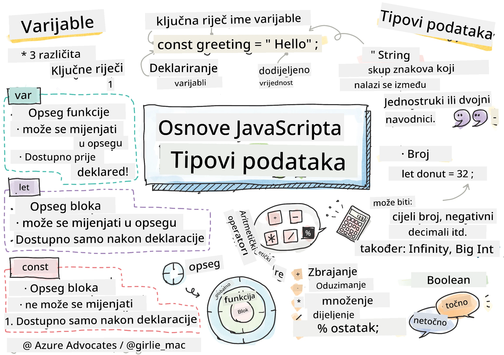
> Sketchnote by [Tomomi Imura](https://twitter.com/girlie_mac)

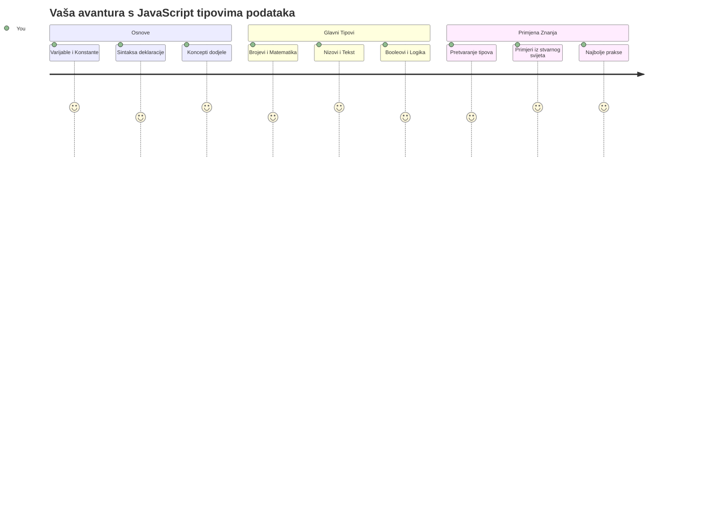
Tipovi podataka su jedan od temeljnih pojmova u JavaScriptu koje ćete susresti u svakom programu koji napišete. Zamislite tipove podataka poput sustava za arhiviranje kojeg su koristili drevni knjižničari u Aleksandriji – imali su posebna mjesta za svitke koji su sadržavali poeziju, matematiku i povijesne zapise. JavaScript organizira informacije na sličan način s različitim kategorijama za različite vrste podataka.

U ovoj lekciji istražit ćemo osnovne tipove podataka koji pokreću JavaScript. Naučit ćete kako rukovati brojevima, tekstom, istinitim/neistinitim vrijednostima te zašto je odabir pravog tipa ključan za vaše programe. Ti koncepti mogu u početku djelovati apstraktno, ali s praksom postat će vam prirodni.

Razumijevanje tipova podataka učinit će sve ostalo u JavaScriptu mnogo jasnijim. Baš kao što arhitekti trebaju razumjeti različite građevinske materijale prije nego što izgrade katedralu, ti temelji će podržavati sve što budete gradili u budućnosti.

## Kviz prije predavanja
[Pre-lecture quiz](https://ff-quizzes.netlify.app/web/)

Ova lekcija pokriva osnove JavaScripta, jezika koji omogućuje interaktivnost na webu.

> Ovu lekciju možete pohađati na [Microsoft Learn](https://docs.microsoft.com/learn/modules/web-development-101-variables/?WT.mc_id=academic-77807-sagibbon)!

[](https://youtube.com/watch?v=JNIXfGiDWM8 "Variables in JavaScript")

[](https://youtube.com/watch?v=AWfA95eLdq8 "Data Types in JavaScript")

> 🎥 Kliknite na slike iznad za videozapise o varijablama i tipovima podataka

Počnimo s varijablama i tipovima podataka kojima se one pune!

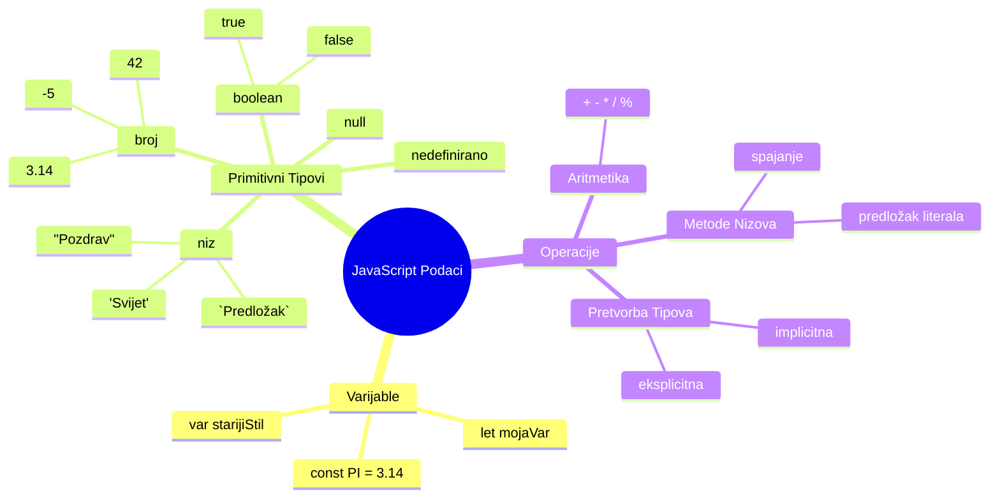
## Varijable

Varijable su temeljni građevinski blokovi u programiranju. Poput označenih staklenki koje su srednjovjekovni alkemisti koristili za pohranu različitih supstanci, varijable vam omogućuju pohranu informacija i daju im opisno ime kako biste im mogli kasnije pristupiti. Trebate zapamtiti nečiju dob? Pohranite je u varijablu nazvanu `age`. Želite pratiti ime korisnika? Držite ga u varijabli nazvanoj `userName`.

Usredotočit ćemo se na suvremen pristup stvaranju varijabli u JavaScriptu. Te tehnike koje ćete ovdje naučiti predstavljaju godine evolucije jezika i najbolje prakse razvijene od strane programerske zajednice.

Kreiranje i **deklaracija** varijable ima sljedeću sintaksu **[keyword] [name]**. Sastoji se od dva dijela:

- **Ključna riječ**. Koristite `let` za varijable koje se mogu mijenjati ili `const` za vrijednosti koje ostaju iste.
- **Ime varijable**, to je opisni naziv koji sami odaberete.

✅ Ključna riječ `let` uvedena je u ES6 i daje varijabli tzv. _blok opseg_. Preporučuje se da koristite `let` ili `const` umjesto starije ključne riječi `var`. Blok opsezi će biti detaljnije obrađeni u budućim dijelovima.

### Zadatak - rad s varijablama

1. **Deklarirajte varijablu**. Započnimo stvaranjem naše prve varijable:

    ```javascript
    let myVariable;
    ```

   **Što ovo postiže:**
   - Ovo govori JavaScriptu da kreira memorijsku lokaciju nazvanu `myVariable`
   - JavaScript rezervira prostor u memoriji za ovu varijablu
   - Varijabla trenutno nema vrijednost (undefined)

2. **Dodajte joj vrijednost**. Sad ćemo staviti nešto u našu varijablu:

    ```javascript
    myVariable = 123;
    ```

   **Kako radi dodjela:**
   - Operator `=` dodjeljuje vrijednost 123 našoj varijabli
   - Varijabla sada sadrži tu vrijednost umjesto da je neodređena
   - Možete referencirati ovu vrijednost kroz vaš kod koristeći `myVariable`

   > Napomena: Korištenje `=` u ovoj lekciji znači da koristimo "operator dodjele", koristeći ga za postavljanje vrijednosti varijabli. Ne označava jednakost.

3. **Uradi to pametnije**. Zapravo, spojimo ta dva koraka:

    ```javascript
    let myVariable = 123;
    ```

    **Ovaj pristup je učinkovitiji:**
    - Deklarirate varijablu i dodjeljujete joj vrijednost u jednoj izjavi
    - Ovo je standardna praksa među programerima
    - Smanjuje duljinu koda, a zadržava jasnoću

4. **Promijenite mišljenje**. Što ako želimo pohraniti drugu vrijednost?

   ```javascript
   myVariable = 321;
   ```

   **Razumijevanje ponovnog dodjeljivanja:**
   - Varijabla sada sadrži 321 umjesto 123
   - Prethodna vrijednost je zamijenjena – varijable pohranjuju samo jednu vrijednost u jednom trenutku
   - Ova promjenjivost je ključna karakteristika varijabli deklariranih s `let`

   ✅ Isprobajte! Možete pisati JavaScript izravno u svoje pregledniku. Otvorite prozor preglednika i idite na Developer Tools. U konzoli ćete pronaći prompt; upišite `let myVariable = 123`, pritisnite Enter, zatim upišite `myVariable`. Što se događa? Više o ovim konceptima naučit ćete u narednim lekcijama.

### 🧠 **Provjera znanja o varijablama: Postajete komforni**

**Pogledajmo kako stojite s varijablama:**
- Možete li objasniti razliku između deklaracije i dodjele varijable?
- Što se događa ako pokušate koristiti varijablu prije nego što je deklarirate?
- Kada biste izabrali `let` umjesto `const` za varijablu?

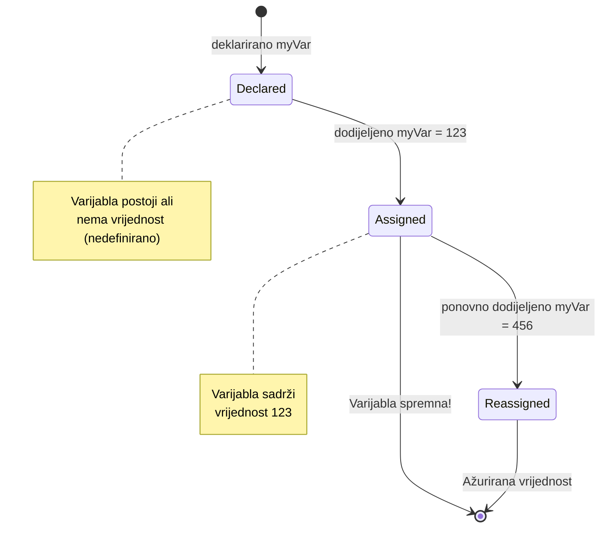
> **Brzi savjet**: Zamislite varijable kao označene kutije za pohranu. Stvarate kutiju (`let`), stavljate nešto u nju (`=`), i kasnije možete zamijeniti sadržaj ako treba!

## Konstantne vrijednosti

Ponekad trebate pohraniti informacije koje se tijekom izvođenja programa nikad ne smiju mijenjati. Zamislite konstante poput matematičkih načela koje je Euklid utvrdio u antičkoj Grčkoj – jednom dokazana i zabilježena, ostala su fiksna za buduće generacije.

Konstante funkcioniraju slično varijablama, ali s važnim ograničenjem: nakon što im dodijelite vrijednost, ona se ne može mijenjati. Ta nepromjenjivost pomaže spriječiti slučajne izmjene ključnih vrijednosti u vašem programu.

Deklaracija i inicijalizacija konstante slijedi iste koncepte kao i varijable, osim što se koristi ključna riječ `const`. Konstante se obično deklariraju s nazivima napisanim velikim slovima.

```javascript
const MY_VARIABLE = 123;
```

**Što ovaj kod radi:**
- **Kreira** konstantu nazvanu `MY_VARIABLE` s vrijednošću 123
- **Koristi** konvenciju imenovanja velikim slovima za konstante
- **Sprječava** buduće promjene ove vrijednosti

Konstante imaju dva glavna pravila:

- **Morate im odmah dodijeliti vrijednost** – konzistentno bez praznih konstanti!
- **Nikada ne smijete mijenjati tu vrijednost** – JavaScript će baciti grešku ako pokušate. Pogledajmo to sad:

   **Jednostavna vrijednost** - Sljedeće NIJE dopušteno:
   
      ```javascript
      const PI = 3;
      PI = 4; // nije dopušteno
      ```

   **Što morate zapamtiti:**
   - **Pokušaji** ponovne dodjele konstante uzrokovat će grešku
   - **Štiti** važne vrijednosti od slučajnih promjena
   - **Osigurava** da vrijednost ostane dosljedna kroz cijeli program
 
   **Zaštita reference objekta** - Sljedeće NIJE dopušteno:
   
      ```javascript
      const obj = { a: 3 };
      obj = { b: 5 } // nije dopušteno
      ```

   **Razumijevanje ovih pojmova:**
   - **Sprječava** zamjenu cijelog objekta novim
   - **Štiti** referencu na izvorni objekt
   - **Očuva** identitet objekta u memoriji

    **Vrijednost u objektu nije zaštićena** - Sljedeće JE dopušteno:
    
      ```javascript
      const obj = { a: 3 };
      obj.a = 5;  // dopušteno
      ```

      **Što se ovdje događa:**
      - **Mijenja** se svojstvo unutar objekta
      - **Zadržava** istu referencu objekta
      - **Pokazuje** da se sadržaj objekta može mijenjati dok referenca ostaje konstanta

   > Napomena, `const` znači da je referenca zaštićena od ponovne dodjele. Vrijednost ipak nije _nepromjenjiva_ i može se mijenjati, osobito ako je riječ o složenim strukturama poput objekta.

## Tipovi podataka

JavaScript organizira informacije u različite kategorije nazvane tipovi podataka. Ovaj koncept odražava način na koji su stari učenjaci kategorizirali znanje – Aristotel je razlikovao različite vrste rezoniranja, znajući da logička načela ne mogu se jednako primjenjivati na poeziju, matematiku i prirodnu filozofiju.

Tipovi podataka su važni jer različite operacije rade s različitim vrstama informacija. Baš kao što ne možete obavljati aritmetiku nad nečijim imenom ili alfabetizirati matematičku jednadžbu, JavaScript zahtijeva odgovarajući tip podataka za svaku operaciju. Razumijevanje ovog sprječava greške i čini vaš kod pouzdanijim.

Varijable mogu pohraniti mnoge različite vrste vrijednosti, poput brojeva i teksta. Ove različite vrste vrijednosti poznate su kao **tip podataka**. Tipovi podataka važan su dio razvoja softvera jer pomažu programerima donositi odluke o tome kako kod treba biti napisan i kako bi softver trebao raditi. Nadalje, neki tipovi podataka imaju jedinstvene značajke koje pomažu pri transformaciji ili izdvajaju dodatne informacije iz vrijednosti.

✅ Tipovi podataka se također nazivaju JavaScript primitivima jer su najnižeg nivoa tipovi podataka koje jezik pruža. Postoji 7 primitivnih tipova podataka: string, number, bigint, boolean, undefined, null i symbol. Odvojite trenutak da vizualizirate što svaki od ovih primitiva može predstavljati. Što je `zebra`? A `0`? `true`?

### Brojevi

Brojevi su najjednostavniji tip podataka u JavaScriptu. Bilo da radite s cijelim brojevima poput 42, decimalnim poput 3.14 ili negativnim kao -5, JavaScript ih obrađuje uniformno.

Sjećate li se naše varijable od prije? Taj 123 koji smo pohranili zapravo je tip podatka broj:

```javascript
let myVariable = 123;
```

**Ključne karakteristike:**
- JavaScript automatski prepoznaje numeričke vrijednosti
- Možete s njima izvoditi matematičke operacije
- Nije potrebna eksplicitna deklaracija tipa

Varijable mogu pohraniti sve vrste brojeva, uključujući decimale ili negativne brojeve. Brojevi se također mogu koristiti s aritmetičkim operatorima, koji će biti obrađeni u [sljedećem odjeljku](../../../../2-js-basics/1-data-types).

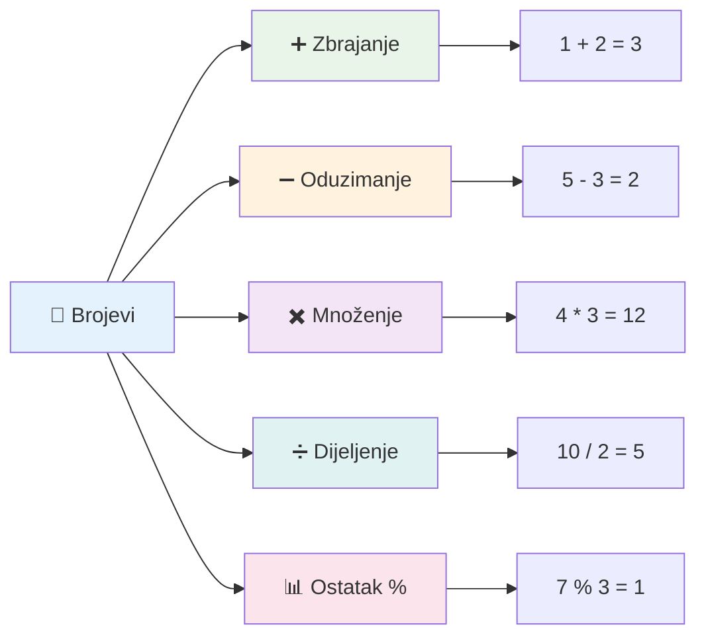
### Aritmetički operatori

Aritmetički operatori omogućuju izvođenje matematičkih izračuna u JavaScriptu. Ti operatori slijede ista pravila koja su matematičari koristili stoljećima – isti simboli koji su se pojavljivali u radovima učenjaka poput Al-Khwarizmija, koji je razvio algebarsku notaciju.

Operatori rade onako kako biste očekivali iz tradicionalne matematike: plus za zbrajanje, minus za oduzimanje i tako dalje.

Postoji nekoliko vrsta operatora koje možete koristiti pri izvođenju aritmetičkih funkcija, neki su navedeni ovdje:

| Simbol | Opis                                                                    | Primjer                          |
| ------ | ----------------------------------------------------------------------- | ------------------------------- |
| `+`    | **Zbrajanje**: Izračunava zbroj dvaju brojeva                           | `1 + 2 // očekivani rezultat je 3`   |
| `-`    | **Oduzimanje**: Izračunava razliku dvaju brojeva                        | `1 - 2 // očekivani rezultat je -1`  |
| `*`    | **Množenje**: Izračunava umnožak dvaju brojeva                         | `1 * 2 // očekivani rezultat je 2`   |
| `/`    | **Dijeljenje**: Izračunava količnik dvaju brojeva                       | `1 / 2 // očekivani rezultat je 0.5` |
| `%`    | **Ostatak**: Izračunava ostatak nakon djeljenja dvaju brojeva           | `1 % 2 // očekivani rezultat je 1`   |

✅ Isprobajte! Pokušajte napraviti aritmetičku operaciju u konzoli vašeg preglednika. Jesu li rezultati iznenađujući?

### 🧮 **Provjera matematičkih sposobnosti: Računanje s povjerenjem**

**Testirajte svoje aritmetičko razumijevanje:**
- Koja je razlika između `/` (dijeljenje) i `%` (ostatak)?
- Možete li predvidjeti što je `10 % 3` jednako? (Pomoć: nije 3.33...)
- Zašto bi operator ostatka mogao biti koristan u programiranju?

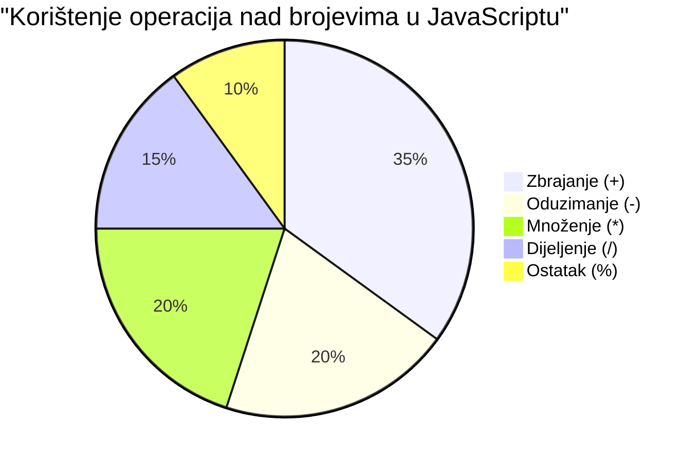
> **Uvid iz stvarnog svijeta**: Operator ostatka (%) je vrlo koristan za provjeru jesu li brojevi parni/neparni, stvaranje obrazaca ili cikličko prolazak kroz nizove!

### Stringovi

U JavaScriptu, tekstualni podaci predstavljeni su kao stringovi. Termin "string" dolazi od koncepta znakova povezanih u niz, kao što su prepisi u srednjovjekovnim samostanima gdje su pisari povezivali slova da bi oblikovali riječi i rečenice u svojim rukopisima.

Stringovi su temeljni za web razvoj. Svaki tekst prikazan na web stranici – korisnička imena, oznake na gumbima, poruke o pogreškama, sadržaj – obrađuje se kao string podatak. Razumijevanje stringova neophodno je za kreiranje funkcionalnih korisničkih sučelja.

Stringovi su skupovi znakova smještenih između jednostrukih ili dvostrukih navodnika.

```javascript
'This is a string'
"This is also a string"
let myString = 'This is a string value stored in a variable';
```

**Razumijevanje ovih pojmova:**
- **Koristi** ili jednostruke `'` ili dvostruke `"` navodnike za definiranje stringova
- **Pohranjuje** tekstualne podatke koji mogu uključivati slova, brojeve i simbole
- **Dodjeljuje** string vrijednosti varijablama za naknadnu upotrebu
- **Zahtijeva** navodnike za razlikovanje teksta od imena varijabli

Zapamtite koristiti navodnike pri pisanju stringa ili će JavaScript pretpostaviti da je riječ o imenu varijable.

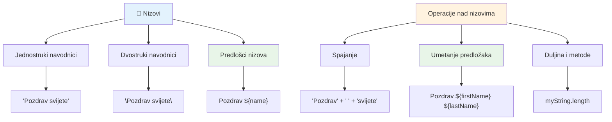
### Formatiranje stringova

Manipulacija stringovima omogućuje vam da kombinirate tekstualne elemente, unesete varijable i stvarate dinamički sadržaj koji odgovara stanju programa. Ova tehnika vam omogućuje da programatski gradite tekst.

Često trebate spojiti više stringova zajedno – taj proces naziva se konkatenacija.
Za **spajanje** dva ili više nizova, ili njihovo povezivanje zajedno, koristi operator `+`.

```javascript
let myString1 = "Hello";
let myString2 = "World";

myString1 + myString2 + "!"; //Pozdrav svijete!
myString1 + " " + myString2 + "!"; //Pozdrav svijetu!
myString1 + ", " + myString2 + "!"; //Pozdrav, svijete!
```

**Korak po korak, evo što se događa:**
- **Spaja** više nizova koristeći operator `+`
- **Povezuje** nizove izravno jedan za drugim bez razmaka u prvom primjeru
- **Dodaje** znakove razmaka `" "` između nizova radi čitljivosti
- **Umeće** interpunkcijske znakove poput zareza za pravilno oblikovanje

✅ Zašto je `1 + 1 = 2` u JavaScriptu, ali `'1' + '1' = 11?` Razmisli o tome. A što kažeš na `'1' + 1`?

**Predlošci nizova (template literals)** su još jedan način formatiranja nizova, osim umjesto navodnika koriste se naglašeni akcenti (backtick). Sve što nije običan tekst mora se staviti unutar rezerviranih mjesta `${ }`. To uključuje i bilo koje varijable koje mogu biti nizovi.

```javascript
let myString1 = "Hello";
let myString2 = "World";

`${myString1} ${myString2}!` //Pozdrav svijete!
`${myString1}, ${myString2}!` //Pozdrav, svijete!
```

**Razumimo svaki dio:**
- **Koristi** naglašene akcente `` ` `` umjesto običnih navodnika za stvaranje predložaka nizova
- **Ugrađuje** varijable izravno koristeći sintaksu rezerviranih mjesta `${}`
- **Čuva** razmake i oblikovanje točno kako su napisani
- **Nudi** čišći način za stvaranje složenih nizova s varijablama

Možete postići svoje ciljeve oblikovanja na oba načina, ali predlošci nizova poštuju sve razmake i prijelome redaka.

✅ Kada biste koristili predložak niza umjesto običnog niza?

### 🔤 **Provjera Majstorstva Nizova: Povjerenje u Manipulaciju Tekstom**

**Procijenite svoje vještine sa nizovima:**
- Možete li objasniti zašto `'1' + '1'` daje `'11'` umjesto `2`?
- Koju metodu za nizove smatrate čitljivijom: spajanje ili predloške nizova?
- Što se događa ako zaboravite navodnike oko niza?

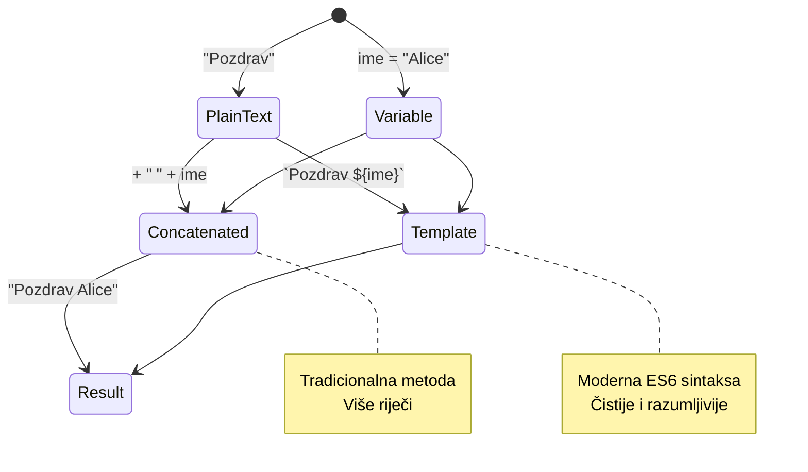
> **Savjet za profesionalce**: Predlošci nizova su općenito preferirani za složeno gradnju nizova jer su čitljiviji i izvrsno podržavaju višeredne nizove!

### Booleovi tipovi

Booleovi tipovi predstavljaju najjednostavniji oblik podataka: mogu imati samo jednu od dvije vrijednosti – `true` ili `false`. Ovaj binarni logički sustav potječe iz rada Georgea Boolea, matematičara iz 19. stoljeća koji je razvio Booleovu algebru.

Unatoč jednostavnosti, booleovi su ključni za logiku programa. Omogućuju vašem kodu donošenje odluka na temelju uvjeta – je li korisnik prijavljen, je li gumb kliknut, ili jesu li ispunjeni neki kriteriji.

Boolean može imati samo dvije vrijednosti: `true` ili `false`. Booleovi mogu pomoći u odlučivanju koje će se linije koda izvršiti kada su ispunjeni određeni uvjeti. U mnogim slučajevima, [operatori](../../../../2-js-basics/1-data-types) pomažu u postavljanju vrijednosti Boolean tipa, a često ćete primijetiti i pisati varijable koje se inicijaliziraju ili im se vrijednosti ažuriraju operatorom.

```javascript
let myTrueBool = true;
let myFalseBool = false;
```

**U gornjem primjeru smo:**
- **Stvorili** varijablu koja pohranjuje Boolean vrijednost `true`
- **Demonstrirali** kako pohraniti Boolean vrijednost `false`
- **Koristili** točne ključne riječi `true` i `false` (ne trebaju navodnici)
- **Pripremili** te varijable za korištenje u uvjetnim izrazima

✅ Varijabla se može smatrati 'truthy' ako se evaluira kao boolean `true`. Zanimljivo je da u JavaScriptu [sve vrijednosti su truthy osim onih definirano kao falsy](https://developer.mozilla.org/docs/Glossary/Truthy).

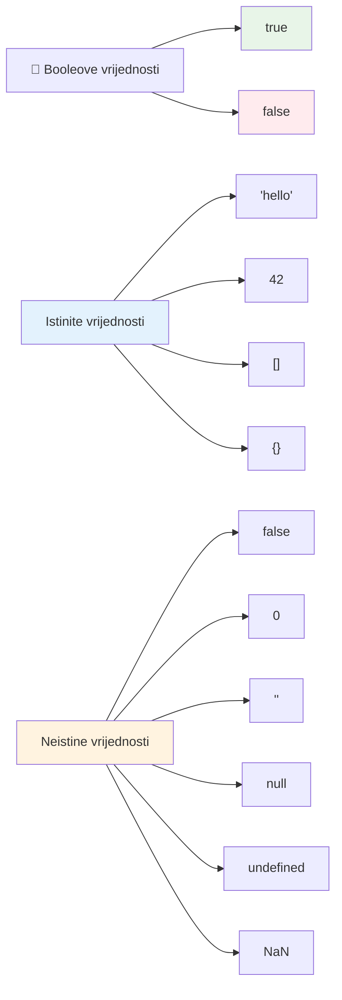
### 🎯 **Provjera Boolean Logike: Vještine donošenja odluka**

**Testirajte svoje razumijevanje Boolean tipa:**
- Zašto mislite da JavaScript ima "truthy" i "falsy" vrijednosti osim samo `true` i `false`?
- Možete li predvidjeti koja od ovih je falsy: `0`, `"0"`, `[]`, `"false"`?
- Kako bi booleovi mogli biti korisni u kontroli tijeka programa?

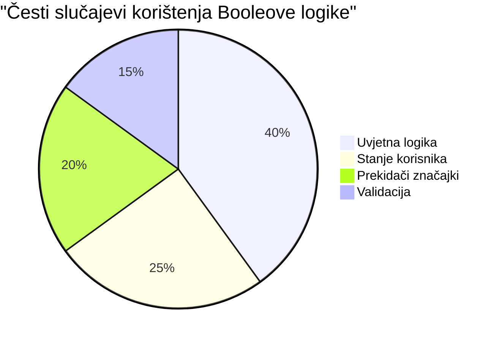
> **Zapamtite**: U JavaScriptu samo 6 vrijednosti su falsy: `false`, `0`, `""`, `null`, `undefined`, i `NaN`. Sve ostalo je truthy!

---

## 📊 **Sažetak Vašeg Alata za Tipove Podataka**

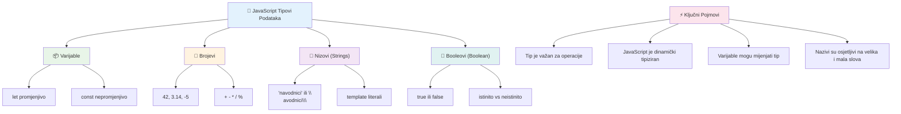
## Izazov GitHub Copilot Agent-a 🚀

Koristite Agent način rada da biste dovršili sljedeći izazov:

**Opis:** Kreirajte upravitelj osobnim informacijama koji demonstrira sve JavaScript tipove podataka koje ste naučili u ovoj lekciji dok rukujete scenarijima stvarnih podataka.

**Zadatak:** Izradite JavaScript program koji kreira objekt korisničkog profila koji sadrži: ime osobe (string), godine (broj), status studenta (boolean), omiljene boje kao niz, te objekt adrese s ulicom, gradom i poštanskim brojem. Uključite funkcije za prikazivanje podataka profila i ažuriranje pojedinačnih polja. Obavezno pokažite spajanje nizova, predloške nizova, aritmetičke operacije s dobi, te Boolean logiku za status studenta.

Saznajte više o [agent načinu rada](https://code.visualstudio.com/blogs/2025/02/24/introducing-copilot-agent-mode) ovdje.

## 🚀 Izazov

JavaScript ima ponašanja koja mogu iznenaditi developere. Evo klasičnog primjera za istraživanje: pokušajte upisati ovo u konzolu preglednika: `let age = 1; let Age = 2; age == Age` i promatrajte rezultat. Vraća `false` – možete li ustanoviti zašto?

Ovo predstavlja jedan od mnogih JavaScript ponašanja koje vrijedi razumjeti. Upoznavanje s ovim nejasnoćama pomoći će vam pisati pouzdaniji kod i učinkovitije rješavati pogreške.

## Kviz nakon predavanja
[Kviz nakon predavanja](https://ff-quizzes.netlify.app)

## Pregled i Samostalan Rad

Pogledajte [ovu listu JavaScript vježbi](https://css-tricks.com/snippets/javascript/) i pokušajte neku. Što ste naučili?

## Zadatak

[Vježbe za tipove podataka](assignment.md)

## 🚀 Vaš vremenski plan za usavršavanje JavaScript tipova podataka

### ⚡ **Što možete napraviti u sljedećih 5 minuta**
- [ ] Otvorite konzolu preglednika i napravite 3 varijable različitih tipova podataka
- [ ] Isprobajte izazov: `let age = 1; let Age = 2; age == Age` i shvatite zašto je false
- [ ] Vježbajte spajanje nizova s vašim imenom i omiljenim brojem
- [ ] Testirajte što se događa kada zbrojite broj i niz

### 🎯 **Što možete postići u ovom satu**
- [ ] Dovršite kviz nakon lekcije i pregledajte bilo koje zbunjujuće koncepte
- [ ] Izradite mini kalkulator koji zbraja, oduzima, množi i dijeli dva broja
- [ ] Napravite jednostavan formatir za ime koristeći predloške nizova
- [ ] Istražite razlike između operatora usporedbe `==` i `===`
- [ ] Vježbajte pretvaranje između različitih tipova podataka

### 📅 **Vaša tjedna osnova JavaScript-a**
- [ ] S pouzdanjem i kreativnošću dovršite zadatak
- [ ] Napravite osobni profil koristeći sve naučene tipove podataka
- [ ] Vježbajte s [JavaScript vježbama s CSS-Tricks](https://css-tricks.com/snippets/javascript/)
- [ ] Izradite jednostavan validator forme koristeći Boolean logiku
- [ ] Eksperimentirajte s nizovima i objektima (najava za buduće lekcije)
- [ ] Pridružite se JavaScript zajednici i postavljajte pitanja o tipovima podataka

### 🌟 **Vaša mjesečna transformacija**
- [ ] Integrirajte znanje o tipovima podataka u veće programske projekte
- [ ] Razumite kada i zašto koristiti svaki tip podataka u stvarnim aplikacijama
- [ ] Pomozite drugim početnicima da shvate osnove JavaScript-a
- [ ] Izradite malu aplikaciju koja upravlja različitim vrstama korisničkih podataka
- [ ] Istražite napredne koncepte tipova podataka poput prisiljene konverzije i stroge jednakosti
- [ ] Doprinesite open source JavaScript projektima poboljšanjem dokumentacije

### 🧠 **Završna provjera znanja o tipovima podataka**

**Proslavite svoje JavaScript temelje:**
- Koji vas je tip podataka najviše iznenadio u pogledu svog ponašanja?
- Koliko se udobno osjećate objašnjavajući varijable nasuprot konstantama prijatelju?
- Koja je najzanimljivija stvar koju ste otkrili o JavaScript sustavu tipova?
- Koju aplikaciju iz stvarnog svijeta možete zamisliti da izgradite s ovim osnovama?

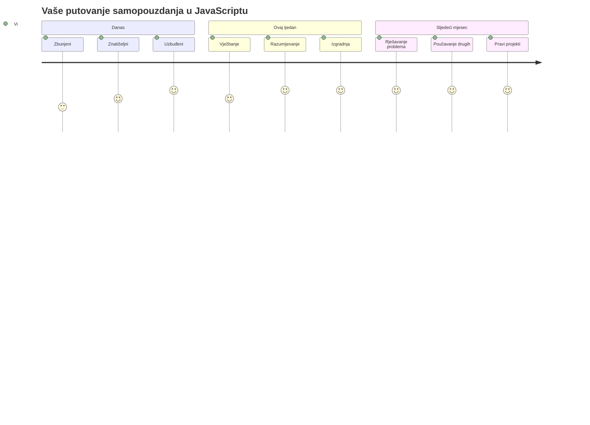
> 💡 **Izgradili ste temelje!** Razumijevanje tipova podataka je kao učenje abecede prije pisanja priča. Svaki JavaScript program koji ikada napišete koristit će ove temeljne koncepte. Sada imate gradivne blokove za stvaranje interaktivnih web stranica, dinamičkih aplikacija i rješavanje stvarnih problema putem koda. Dobrodošli u prekrasni svijet JavaScript-a! 🎉

---

<!-- CO-OP TRANSLATOR DISCLAIMER START -->
**Odricanje od odgovornosti**:
Ovaj dokument je preveden korištenjem AI prevoditeljskog servisa [Co-op Translator](https://github.com/Azure/co-op-translator). Iako nastojimo postići točnost, imajte na umu da automatski prijevodi mogu sadržavati pogreške ili netočnosti. Izvorni dokument na izvornom jeziku treba se smatrati autoritativnim izvorom. Za kritične informacije preporučuje se profesionalni ljudski prijevod. Nismo odgovorni za bilo kakva nerazumijevanja ili pogrešna tumačenja koja proizlaze iz korištenja ovog prijevoda.
<!-- CO-OP TRANSLATOR DISCLAIMER END -->