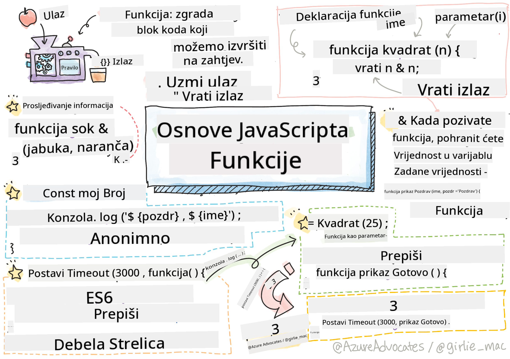

<!--
CO_OP_TRANSLATOR_METADATA:
{
  "original_hash": "ec43b53e8e015cdabfd3ad877b3c28e5",
  "translation_date": "2025-10-24T23:48:21+00:00",
  "source_file": "2-js-basics/2-functions-methods/README.md",
  "language_code": "hr"
}
-->
# Osnove JavaScripta: Metode i Funkcije


> Sketchnote autorice [Tomomi Imura](https://twitter.com/girlie_mac)

## Kviz prije predavanja
[Kviz prije predavanja](https://ff-quizzes.netlify.app)

Pisanje istog koda iznova i iznova jedna je od najčešćih frustracija u programiranju. Funkcije rješavaju ovaj problem omogućujući vam da pakirate kod u blokove koji se mogu ponovno koristiti. Zamislite funkcije kao standardizirane dijelove koji su učinili revolucionarnom proizvodnu liniju Henryja Forda – jednom kada stvorite pouzdan komponent, možete ga koristiti gdje god je potrebno bez ponovnog stvaranja od nule.

Funkcije omogućuju grupiranje dijelova koda kako biste ih mogli ponovno koristiti u cijelom programu. Umjesto kopiranja i lijepljenja iste logike svugdje, možete jednom stvoriti funkciju i pozvati je kad god je potrebno. Ovaj pristup održava vaš kod organiziranim i olakšava ažuriranja.

U ovoj lekciji naučit ćete kako stvoriti vlastite funkcije, proslijediti im informacije i dobiti korisne rezultate. Otkrit ćete razliku između funkcija i metoda, naučiti moderne sintakse i vidjeti kako funkcije mogu surađivati s drugim funkcijama. Ove koncepte ćemo graditi korak po korak.

[](https://youtube.com/watch?v=XgKsD6Zwvlc "Metode i Funkcije")

> 🎥 Kliknite na sliku iznad za video o metodama i funkcijama.

> Ovu lekciju možete pronaći na [Microsoft Learn](https://docs.microsoft.com/learn/modules/web-development-101-functions/?WT.mc_id=academic-77807-sagibbon)!

## Funkcije

Funkcija je samostalni blok koda koji obavlja određeni zadatak. Ona obuhvaća logiku koju možete izvršiti kad god je to potrebno.

Umjesto da pišete isti kod više puta u svom programu, možete ga pakirati u funkciju i pozvati tu funkciju kad god vam zatreba. Ovaj pristup održava vaš kod čistim i olakšava ažuriranja. Zamislite izazov održavanja ako biste morali mijenjati logiku koja je raspršena na 20 različitih mjesta u vašem kodu.

Važno je davati funkcijama opisna imena. Dobro imenovana funkcija jasno komunicira svoju svrhu – kada vidite `cancelTimer()`, odmah razumijete što ona radi, baš kao što jasno označena tipka govori što će se dogoditi kada je pritisnete.

## Stvaranje i pozivanje funkcije

Pogledajmo kako stvoriti funkciju. Sintaksa slijedi dosljedan obrazac:

```javascript
function nameOfFunction() { // function definition
 // function definition/body
}
```

Razložimo ovo:
- Ključna riječ `function` govori JavaScriptu "Hej, stvaram funkciju!"
- `nameOfFunction` je mjesto gdje dajete svojoj funkciji opisno ime
- Zagrade `()` su mjesto gdje možete dodati parametre (o tome ćemo uskoro)
- Vitičaste zagrade `{}` sadrže stvarni kod koji se izvršava kada pozovete funkciju

Stvorimo jednostavnu funkciju za pozdrav kako bismo to vidjeli u praksi:

```javascript
function displayGreeting() {
  console.log('Hello, world!');
}
```

Ova funkcija ispisuje "Hello, world!" u konzolu. Kada je jednom definirate, možete je koristiti koliko god puta želite.

Da biste izvršili (ili "pozvali") svoju funkciju, napišite njezino ime nakon kojeg slijede zagrade. JavaScript vam omogućuje da definirate funkciju prije ili nakon što je pozovete – JavaScript engine će se pobrinuti za redoslijed izvršavanja.

```javascript
// calling our function
displayGreeting();
```

Kada pokrenete ovu liniju, ona izvršava sav kod unutar vaše funkcije `displayGreeting`, prikazujući "Hello, world!" u konzoli vašeg preglednika. Ovu funkciju možete pozvati više puta.

> **Napomena:** Tijekom ovih lekcija koristili ste **metode**. `console.log()` je metoda – u osnovi funkcija koja pripada objektu `console`. Ključna razlika je u tome što su metode vezane uz objekte, dok funkcije stoje samostalno. Mnogi programeri koriste ove izraze naizmjenično u svakodnevnom razgovoru.

### Najbolje prakse za funkcije

Evo nekoliko savjeta koji će vam pomoći da pišete kvalitetne funkcije:

- Dajte svojim funkcijama jasna, opisna imena – vaša buduća verzija će vam biti zahvalna!
- Koristite **camelCase** za imena koja se sastoje od više riječi (npr. `calculateTotal` umjesto `calculate_total`)
- Neka svaka funkcija bude usmjerena na obavljanje jednog zadatka

## Prosljeđivanje informacija funkciji

Naša funkcija `displayGreeting` je ograničena – može prikazati samo "Hello, world!" za sve. Parametri nam omogućuju da funkcije učinimo fleksibilnijima i korisnijima.

**Parametri** djeluju kao rezervirana mjesta gdje možete umetnuti različite vrijednosti svaki put kada koristite funkciju. Na taj način, ista funkcija može raditi s različitim informacijama pri svakom pozivu.

Parametre navodite unutar zagrada kada definirate funkciju, odvajajući više parametara zarezima:

```javascript
function name(param, param2, param3) {

}
```

Svaki parametar djeluje kao rezervirano mjesto – kada netko pozove vašu funkciju, pružit će stvarne vrijednosti koje se ubacuju na ta mjesta.

Ažurirajmo našu funkciju pozdrava kako bismo prihvatili ime osobe:

```javascript
function displayGreeting(name) {
  const message = `Hello, ${name}!`;
  console.log(message);
}
```

Primijetite kako koristimo obrnute navodnike (`` ` ``) i `${}` za umetanje imena izravno u našu poruku – to se zove predložak literal, i to je zaista koristan način za izgradnju stringova s pomiješanim varijablama.

Sada, kada pozovemo našu funkciju, možemo proslijediti bilo koje ime:

```javascript
displayGreeting('Christopher');
// displays "Hello, Christopher!" when run
```

JavaScript uzima string `'Christopher'`, dodjeljuje ga parametru `name` i stvara personaliziranu poruku "Hello, Christopher!"

## Zadane vrijednosti

Što ako želimo učiniti neke parametre opcionalnima? Tu dolaze u igru zadane vrijednosti!

Recimo da želimo omogućiti ljudima da prilagode riječ za pozdrav, ali ako je ne navedu, jednostavno ćemo koristiti "Hello" kao rezervnu opciju. Zadane vrijednosti možete postaviti pomoću znaka jednakosti, baš kao kod postavljanja varijable:

```javascript
function displayGreeting(name, salutation='Hello') {
  console.log(`${salutation}, ${name}`);
}
```

Ovdje je `name` još uvijek obavezan, ali `salutation` ima rezervnu vrijednost `'Hello'` ako nitko ne navede drugačiji pozdrav.

Sada ovu funkciju možemo pozvati na dva različita načina:

```javascript
displayGreeting('Christopher');
// displays "Hello, Christopher"

displayGreeting('Christopher', 'Hi');
// displays "Hi, Christopher"
```

U prvom pozivu JavaScript koristi zadani "Hello" jer nismo naveli pozdrav. U drugom pozivu koristi naš prilagođeni "Hi". Ova fleksibilnost čini funkcije prilagodljivima različitim scenarijima.

## Povratne vrijednosti

Naše funkcije do sada su samo ispisivale poruke u konzolu, ali što ako želite da funkcija nešto izračuna i vrati vam rezultat?

Tu dolaze **povratne vrijednosti**. Umjesto da samo nešto prikazuje, funkcija vam može vratiti vrijednost koju možete pohraniti u varijablu ili koristiti u drugim dijelovima koda.

Da biste vratili vrijednost, koristite ključnu riječ `return` nakon koje slijedi ono što želite vratiti:

```javascript
return myVariable;
```

Evo nečega važnog: kada funkcija naiđe na `return` naredbu, odmah prestaje s izvršavanjem i vraća tu vrijednost onome tko ju je pozvao.

Modificirajmo našu funkciju pozdrava kako bi vraćala poruku umjesto da je ispisuje:

```javascript
function createGreetingMessage(name) {
  const message = `Hello, ${name}`;
  return message;
}
```

Sada, umjesto da ispisuje pozdrav, ova funkcija stvara poruku i vraća je nama.

Da bismo koristili vraćenu vrijednost, možemo je pohraniti u varijablu kao i svaku drugu vrijednost:

```javascript
const greetingMessage = createGreetingMessage('Christopher');
```

Sada `greetingMessage` sadrži "Hello, Christopher" i možemo ga koristiti bilo gdje u našem kodu – za prikaz na web stranici, uključivanje u e-mail ili prosljeđivanje drugoj funkciji.

## Funkcije kao parametri za funkcije

Funkcije se mogu prosljeđivati kao parametri drugim funkcijama. Iako se ovaj koncept u početku može činiti složenim, to je moćna značajka koja omogućuje fleksibilne obrasce programiranja.

Ovaj obrazac je vrlo uobičajen kada želite reći "kada se nešto dogodi, učini nešto drugo." Na primjer, "kada tajmer završi, pokreni ovaj kod" ili "kada korisnik klikne gumb, pozovi ovu funkciju."

Pogledajmo `setTimeout`, koja je ugrađena funkcija koja čeka određeno vrijeme, a zatim pokreće neki kod. Moramo joj reći koji kod da pokrene – savršen slučaj za prosljeđivanje funkcije!

Isprobajte ovaj kod – nakon 3 sekunde vidjet ćete poruku:

```javascript
function displayDone() {
  console.log('3 seconds has elapsed');
}
// timer value is in milliseconds
setTimeout(displayDone, 3000);
```

Primijetite kako prosljeđujemo `displayDone` (bez zagrada) funkciji `setTimeout`. Ne pozivamo funkciju sami – predajemo je `setTimeout` i kažemo "pozovi ovo za 3 sekunde."

### Anonimne funkcije

Ponekad vam je potrebna funkcija samo za jednu stvar i ne želite joj dati ime. Razmislite – ako funkciju koristite samo jednom, zašto zatrpavati kod dodatnim imenom?

JavaScript vam omogućuje stvaranje **anonimnih funkcija** – funkcija bez imena koje možete definirati točno tamo gdje su vam potrebne.

Evo kako možemo prepisati naš primjer s tajmerom koristeći anonimnu funkciju:

```javascript
setTimeout(function() {
  console.log('3 seconds has elapsed');
}, 3000);
```

Ovo postiže isti rezultat, ali funkcija je definirana izravno unutar poziva `setTimeout`, eliminirajući potrebu za zasebnom deklaracijom funkcije.

### Funkcije sa strelicom

Moderni JavaScript ima još kraći način pisanja funkcija, nazvan **funkcije sa strelicom**. Koriste `=>` (što izgleda kao strelica – zar ne?) i vrlo su popularne među programerima.

Funkcije sa strelicom omogućuju vam da preskočite ključnu riječ `function` i napišete sažetiji kod.

Evo našeg primjera s tajmerom koristeći funkciju sa strelicom:

```javascript
setTimeout(() => {
  console.log('3 seconds has elapsed');
}, 3000);
```

`()` je mjesto gdje bi išli parametri (prazno u ovom slučaju), zatim dolazi strelica `=>`, a na kraju tijelo funkcije u vitičastim zagradama. Ovo pruža istu funkcionalnost s sažetijom sintaksom.

### Kada koristiti koju strategiju

Kada biste trebali koristiti koji pristup? Praktična smjernica: ako ćete funkciju koristiti više puta, dajte joj ime i definirajte je zasebno. Ako je za jednu specifičnu upotrebu, razmislite o anonimnoj funkciji. I funkcije sa strelicom i tradicionalna sintaksa su valjani izbori, iako su funkcije sa strelicom sve prisutnije u modernim JavaScript kodnim bazama.

---


## 🚀 Izazov

Možete li u jednoj rečenici objasniti razliku između funkcija i metoda? Pokušajte!

## GitHub Copilot Agent Izazov 🚀

Koristite Agent način rada za dovršavanje sljedećeg izazova:

**Opis:** Kreirajte biblioteku korisnih matematičkih funkcija koja demonstrira različite koncepte funkcija obrađene u ovoj lekciji, uključujući parametre, zadane vrijednosti, povratne vrijednosti i funkcije sa strelicom.

**Zadatak:** Kreirajte JavaScript datoteku pod nazivom `mathUtils.js` koja sadrži sljedeće funkcije:
1. Funkciju `add` koja prima dva parametra i vraća njihov zbroj
2. Funkciju `multiply` s zadanim vrijednostima parametara (drugi parametar ima zadanu vrijednost 1)
3. Funkciju sa strelicom `square` koja prima broj i vraća njegov kvadrat
4. Funkciju `calculate` koja prihvaća drugu funkciju kao parametar i dva broja, a zatim primjenjuje tu funkciju na te brojeve
5. Demonstrirajte pozivanje svake funkcije s odgovarajućim testnim slučajevima

Saznajte više o [agent načinu rada](https://code.visualstudio.com/blogs/2025/02/24/introducing-copilot-agent-mode) ovdje.

## Kviz nakon predavanja
[Kviz nakon predavanja](https://ff-quizzes.netlify.app)

## Pregled i samostalno učenje

Vrijedi [pročitati malo više o funkcijama sa strelicom](https://developer.mozilla.org/docs/Web/JavaScript/Reference/Functions/Arrow_functions), jer se sve više koriste u kodnim bazama. Vježbajte pisanje funkcije, a zatim je prepišite koristeći ovu sintaksu.

## Zadatak

[Zabava s funkcijama](assignment.md)

---

**Odricanje od odgovornosti**:  
Ovaj dokument je preveden pomoću AI usluge za prevođenje [Co-op Translator](https://github.com/Azure/co-op-translator). Iako nastojimo osigurati točnost, imajte na umu da automatski prijevodi mogu sadržavati pogreške ili netočnosti. Izvorni dokument na izvornom jeziku treba smatrati autoritativnim izvorom. Za ključne informacije preporučuje se profesionalni prijevod od strane čovjeka. Ne preuzimamo odgovornost za nesporazume ili pogrešna tumačenja koja proizlaze iz korištenja ovog prijevoda.