<!--
CO_OP_TRANSLATOR_METADATA:
{
  "original_hash": "71f7d7dafa1c7194d79ddac87f669ff9",
  "translation_date": "2026-01-07T08:49:13+00:00",
  "source_file": "2-js-basics/2-functions-methods/README.md",
  "language_code": "hr"
}
-->
# Osnove JavaScripta: Metode i funkcije

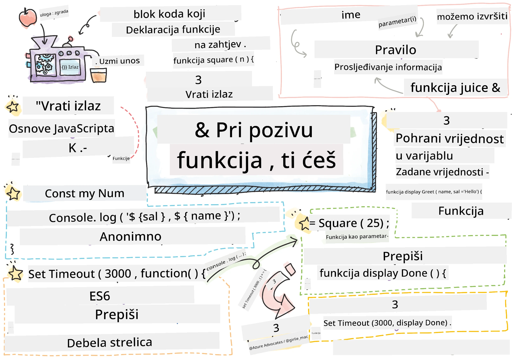
> Sketchnote autorice [Tomomi Imura](https://twitter.com/girlie_mac)

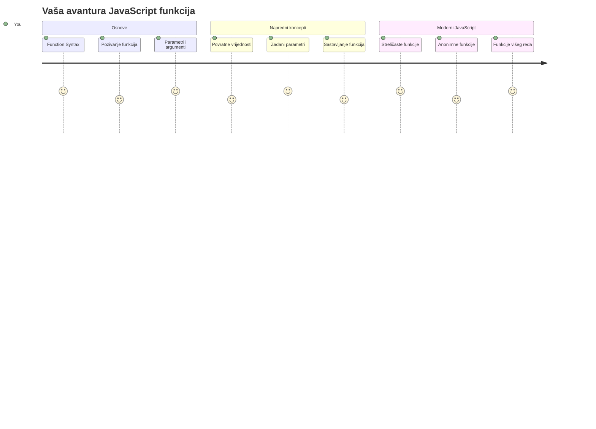
## Pred-predavanje kviz
[Pred-predavanje kviz](https://ff-quizzes.netlify.app)

Pisanje istog koda iznova jedna je od najčešćih frustracija u programiranju. Funkcije rješavaju taj problem dopuštajući vam da upakirate kod u višekratno uporabljive blokove. Zamislite funkcije kao standardizirane dijelove koji su revolucionalizirali Henry Fordovu montažnu liniju – jednom kad napravite pouzdani komad, možete ga koristiti gdje god je potrebno bez ponovnog izgradnje od nule.

Funkcije vam omogućuju da grupirate dijelove koda kako biste ih mogli ponovno koristiti kroz svoj program. Umjesto da svaki put kopirate i lijepite istu logiku, možete jednom stvoriti funkciju i pozvati je kad god vam zatreba. Ovakav pristup održava vaš kod urednim i znatno olakšava ažuriranja.

U ovom ćemo se satu naučiti kako kreirati vlastite funkcije, kako im predavati informacije i kako dobiti korisne rezultate natrag. Otkrit ćete razliku između funkcija i metoda, naučiti moderne sintakse i vidjeti kako funkcije mogu raditi s drugim funkcijama. Izgradit ćemo ove koncepte korak po korak.

[](https://youtube.com/watch?v=XgKsD6Zwvlc "Metode i Funkcije")

> 🎥 Kliknite na gornju sliku za video o metodama i funkcijama.

> Ovaj lekciju možete pohađati na [Microsoft Learn](https://docs.microsoft.com/learn/modules/web-development-101-functions/?WT.mc_id=academic-77807-sagibbon)!

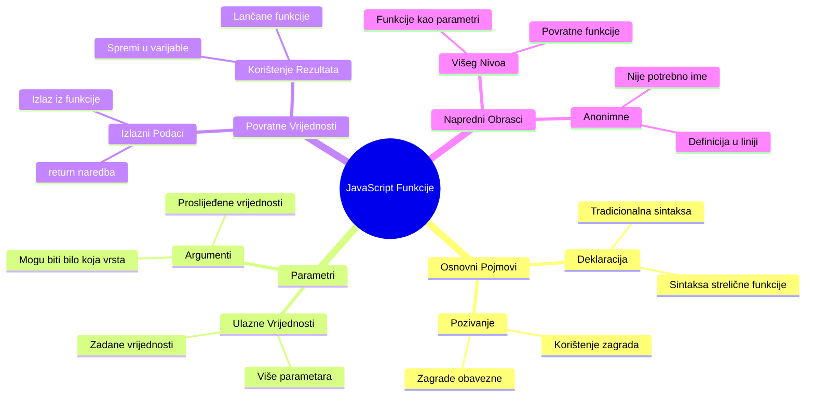
## Funkcije

Funkcija je samostalni blok koda koji izvršava određeni zadatak. Ona enkapsulira logiku koju možete pokrenuti kad god zatrebate.

Umjesto da pišete isti kod više puta kroz program, možete ga upakirati u funkciju i pozvati tu funkciju kad vam zatreba. Ovaj pristup održava vaš kod čistim i znatno olakšava ažuriranja. Zamislite izazov održavanja ako trebate promijeniti logiku raspršenu na 20 različitih mjesta u vašem kodnom bazenu.

Važno je imenovati vaše funkcije opisno. Dobro imenovana funkcija jasno komunicira svoju svrhu – kad vidite `cancelTimer()`, odmah shvaćate što radi, baš kao što jasno označeno dugme govori točno što će se dogoditi kad ga kliknete.

## Kreiranje i pozivanje funkcije

Pogledajmo kako stvoriti funkciju. Sintaksa slijedi dosljedan obrazac:

```javascript
function nameOfFunction() { // definicija funkcije
 // definicija/tijelo funkcije
}
```

Raspakirajmo ovo:
- Ključna riječ `function` govori JavaScriptu "Hej, stvaram funkciju!"
- `nameOfFunction` je mjesto gdje funkciji dajete opisno ime
- Zagrade `()` su mjesto gdje možete dodati parametre (o tome uskoro)
- Vitičaste zagrade `{}` sadrže stvarni kod koji se izvršava kada pozovete funkciju

Napravimo jednostavnu funkciju pozdrava da to vidimo u praksi:

```javascript
function displayGreeting() {
  console.log('Hello, world!');
}
```

Ova funkcija ispisuje "Hello, world!" u konzolu. Nakon što ju definirate, možete je koristiti onoliko puta koliko vam treba.

Da biste izvršili (ili "pozvali") funkciju, napišite njeno ime praćeno zagradama. JavaScript vam dopušta definirati funkciju prije ili poslije njezinog poziva – JavaScriptov engine će se pobrinuti za redoslijed izvršenja.

```javascript
// pozivanje naše funkcije
displayGreeting();
```

Kad pokrenete ovaj redak, izvršava se sav kod unutar vaše funkcije `displayGreeting`, prikazujući "Hello, world!" u konzoli vašeg preglednika. Ovu funkciju možete pozivati više puta.

### 🧠 **Provjera osnova funkcija: Izgradnja prvih funkcija**

**Pogledajmo kako stojite s osnovama funkcija:**
- Možete li objasniti zašto koristimo vitičaste zagrade `{}` u definicijama funkcija?
- Što se događa ako napišete `displayGreeting` bez zagrada?
- Zašto biste željeli pozvati istu funkciju više puta?

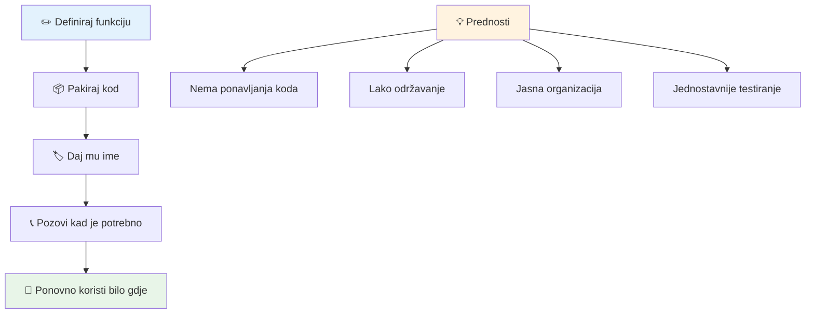
> **Napomena:** Tijekom ovih lekcija koristili ste **metode**. `console.log()` je metoda – zapravo funkcija koja pripada objektu `console`. Ključna razlika je u tome što su metode prikačene na objekte, dok funkcije stoje samostalno. Mnogi developeri ove termine koriste naizmjenično u svakodnevnom govoru.

### Najbolje prakse za funkcije

Evo nekoliko savjeta kako napisati odlične funkcije:

- Dajte funkcijama jasna i opisna imena – vaš budući ja će vam biti zahvalan!
- Koristite **camelCase** za višerječena imena (npr. `calculateTotal` umjesto `calculate_total`)
- Neka svaka funkcija bude fokusirana na jedan zadatak koji radi dobro

## Predavanje informacija funkciji

Naša funkcija `displayGreeting` je ograničena – može samo prikazati "Hello, world!" svima. Parametri nam omogućavaju da funkcije učinimo fleksibilnijima i korisnijima.

**Parametri** djeluju kao rezervirana mjesta u koje možete ubaciti različite vrijednosti svaki put kad koristite funkciju. Na taj način ista funkcija može raditi s različitim informacijama pri svakom pozivu.

Parametre navodite unutar zagrada kad definirate funkciju, odvajajući ih zarezima:

```javascript
function name(param, param2, param3) {

}
```

Svaki parametar djeluje kao rezervirano mjesto – kad netko pozove vašu funkciju, on/ona predaje stvarne vrijednosti koje se stavljaju u ta mjesta.

Ažurirajmo našu funkciju pozdrava da prihvati ime:

```javascript
function displayGreeting(name) {
  const message = `Hello, ${name}!`;
  console.log(message);
}
```

Primijetite kako koristimo znakove za navodnike unatrag (`` ` ``) i `${}` za umetanje imena direktno u našu poruku – ovo se zove predložak stringa i vrlo je zgodan način za sastavljanje stringova s varijablama.

Sad kad pozovemo funkciju, možemo predati bilo koje ime:

```javascript
displayGreeting('Christopher');
// prikazuje "Hello, Christopher!" prilikom pokretanja
```

JavaScript uzima string `'Christopher'`, dodjeljuje ga parametru `name` i stvara personaliziranu poruku "Hello, Christopher!"

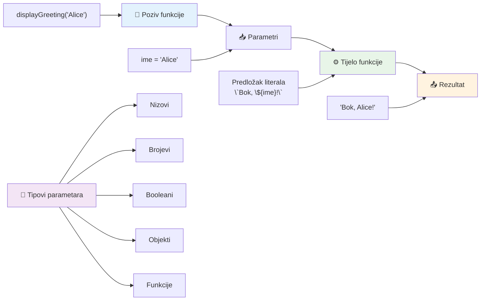
## Zadane vrijednosti

Što ako želimo neke parametre učiniti opcionalnima? Evo koristi zadanih vrijednosti!

Recimo da želimo omogućiti korisnicima da prilagode pozdravnu riječ, ali ako je ne navedu, koristit ćemo "Hello" kao zadanu vrijednost. Zadne vrijednosti postavljate koristeći znak jednakosti, baš kao kod postavljanja varijable:

```javascript
function displayGreeting(name, salutation='Hello') {
  console.log(`${salutation}, ${name}`);
}
```

Ovdje je `name` i dalje obavezan, ali `salutation` ima rezervnu vrijednost `'Hello'` ako netko ne navede drugačiji pozdrav.

Sada možemo pozvati ovu funkciju na dva različita načina:

```javascript
displayGreeting('Christopher');
// prikazuje "Zdravo, Christopher"

displayGreeting('Christopher', 'Hi');
// prikazuje "Bok, Christopher"
```

U prvom pozivu JavaScript koristi zadano "Hello" jer nismo naveli pozdrav. U drugom pozivu koristi naš prilagođeni "Hi". Ova fleksibilnost čini funkcije prilagodljivima različitim situacijama.

### 🎛️ **Provjera razumijevanja parametara: Čineći funkcije fleksibilnima**

**Testirajte svoje razumijevanje parametara:**
- Koja je razlika između parametra i argumenta?
- Zašto su zadane vrijednosti korisne u stvarnom programiranju?
- Možete li predvidjeti što se događa ako proslijedite više argumenata nego parametara?

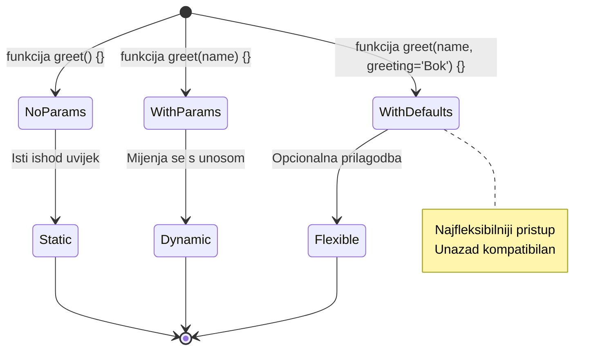
> **Savjet za profesionalce**: Zadani parametri čine vaše funkcije pristupačnijima. Korisnici mogu brzo početi s razumijevanjem zadanim vrijednostima, ali ih i dalje prilagoditi po potrebi!

## Povratne vrijednosti

Dosad su naše funkcije samo ispisivale poruke u konzolu, ali što ako želite da funkcija nešto izračuna i vrati rezultat?

Tu na scenu stupaju **povratne vrijednosti**. Umjesto da samo nešto prikaže, funkcija može vratiti vrijednost koju možete spremiti u varijablu ili koristiti u drugim dijelovima koda.

Da biste poslali vrijednost natrag, koristite ključnu riječ `return` praćenu vrijednošću koju želite vratiti:

```javascript
return myVariable;
```

Evo važne stvari: kad funkcija dosegne `return` naredbu, odmah prestaje s radom i šalje tu vrijednost natrag onome tko ju je pozvao.

Promijenimo našu funkciju pozdrava da vraća poruku umjesto da je ispisuje:

```javascript
function createGreetingMessage(name) {
  const message = `Hello, ${name}`;
  return message;
}
```

Sad ta funkcija umjesto ispisa poruke stvara poruku i vraća ju nama.

Da bismo koristili vraćenu vrijednost, možemo ju spremiti u varijablu poput bilo koje druge vrijednosti:

```javascript
const greetingMessage = createGreetingMessage('Christopher');
```

Sada `greetingMessage` sadrži "Hello, Christopher" i možemo je koristiti bilo gdje u kodu – prikazati na web stranici, uključiti u email ili predati drugoj funkciji.

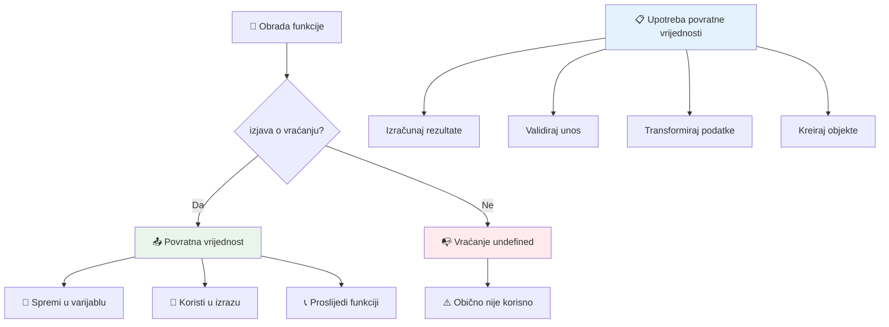
### 🔄 **Provjera povratnih vrijednosti: Dobivanje rezultata natrag**

**Procijenite svoje razumijevanje povratnih vrijednosti:**
- Što se događa s kodom nakon `return` naredbe u funkciji?
- Zašto je povrat vrijednosti često bolji od ispisivanja u konzolu?
- Može li funkcija vratiti različite tipove vrijednosti (string, broj, boolean)?

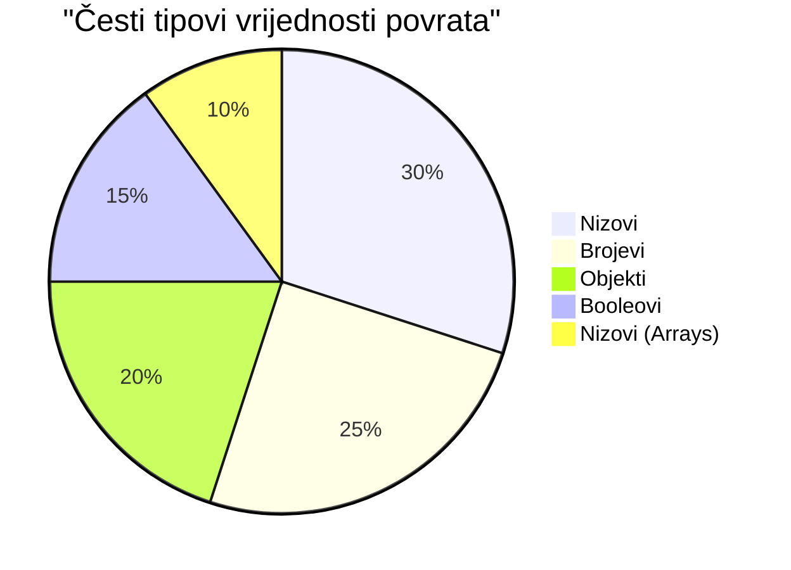
> **Ključni uvid**: Funkcije koje vraćaju vrijednosti su svestranije jer pozivatelj odlučuje što će s rezultatom napraviti. To vaš kod čini modularnijim i ponovo upotrebljivim!

## Funkcije kao parametri funkcijama

Funkcije se mogu predavati kao parametri drugim funkcijama. Iako ovaj koncept može djelovati složeno na početku, to je moćna značajka koja omogućava fleksibilne programske obrasce.

Ovaj uzorak je vrlo čest kad želite reći "kada se nešto dogodi, napravi ovo drugo." Na primjer, "kada tajmer završi, pokreni ovaj kod" ili "kada korisnik klikne gumb, pozovi ovu funkciju."

Pogledajmo `setTimeout`, što je ugrađena funkcija koja čeka određeno vrijeme, a zatim izvršava neki kod. Moramo joj reći koji kod pokrenuti – savršen slučaj za predavanje funkcije!

Isprobajte ovaj kod – nakon 3 sekunde vidjet ćete poruku:

```javascript
function displayDone() {
  console.log('3 seconds has elapsed');
}
// vrijednost tajmera je u milisekundama
setTimeout(displayDone, 3000);
```

Primijetite kako predajemo `displayDone` (bez zagrada) funkciji `setTimeout`. Mi ne pozivamo funkciju sami – predajemo ju `setTimeout` i kažemo "pozovi ovo za 3 sekunde."

### Anonimne funkcije

Ponekad trebate funkciju za samo jednu stvar i ne želite joj dati ime. Razmislite – ako funkciju koristite samo jednom, zašto nepotrebno zatrpavati kod imenom?

JavaScript vam omogućuje stvaranje **anonimnih funkcija** – funkcije bez imena koje možete definirati točno tamo gdje ih trebate.

Evo kako možemo prepisati naš primjer s tajmerom koristeći anonimnu funkciju:

```javascript
setTimeout(function() {
  console.log('3 seconds has elapsed');
}, 3000);
```

Time se postiže isti rezultat, ali funkcija je definirana direktno unutar poziva `setTimeout`, uklanjajući potrebu za zasebnom deklaracijom funkcije.

### Funkcije s "debela strelica"

Moderni JavaScript ima još kraći način pisanja funkcija zvane **arrow functions** (funkcije sa strelicom). Koriste `=>` (izgleda kao strelica – shvatili ste?) i vrlo su popularne kod developera.

Funkcije sa strelicom omogućuju preskakanje ključne riječi `function` i pisanje sažetijeg koda.

Evo našeg primjera s tajmerom koristeći funkciju sa strelicom:

```javascript
setTimeout(() => {
  console.log('3 seconds has elapsed');
}, 3000);
```

Prazne zagrade `()` su mjesto za parametre (ovdje prazne), zatim dolazi strelica `=>`, i na kraju tijelo funkcije u vitičastim zagradama. Ovo pruža istu funkcionalnost s konciznijom sintaksom.

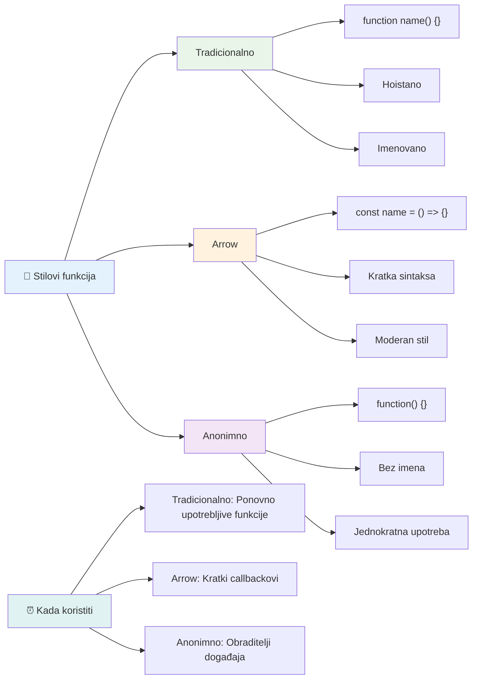
### Kada koristiti koju strategiju

Kada biste trebali koristiti koji pristup? Praktično pravilo je: ako ćete funkciju koristiti više puta, dajte joj ime i definirajte je odvojeno. Ako je za specifičnu, jednokratnu upotrebu, razmislite o anonimnoj funkciji. Oba pristupa, strelične funkcije i tradicionalna sintaksa, su valjani izbori, iako su strelične funkcije češće u modernim JavaScript kodnim bazama.

### 🎨 **Provjera stilova funkcija: Odabir pravog sintaksisa**

**Testirajte svoje razumijevanje sintakse:**
- Kada biste radije koristili strelične funkcije umjesto tradicionalne sintakse funkcija?
- Koja je glavna prednost anonimnih funkcija?
- Možete li zamisliti situaciju u kojoj je imenovana funkcija bolja od anonimne?

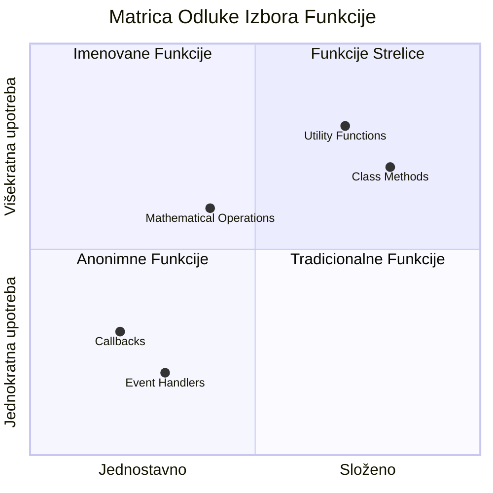
> **Moderan trend**: Strelične funkcije postaju zadani izbor za mnoge developere zbog sažetosti sintakse, ali tradicionalne funkcije još uvijek imaju svoje mjesto!

---


## 🚀 Izazov

Možete li jednim rečenicom izreći razliku između funkcija i metoda? Probajte!

## GitHub Copilot Agent Izazov 🚀

Koristite Agent način rada za dovršetak sljedećeg izazova:

**Opis:** Napravite pomoćnu biblioteku matematičkih funkcija koja demonstrira različite koncepte funkcija obrađene u ovoj lekciji, uključujući parametre, zadane vrijednosti, povratne vrijednosti i strelične funkcije.

**Zadatak:** Kreirajte JavaScript datoteku pod nazivom `mathUtils.js` koja sadrži sljedeće funkcije:
1. Funkciju `add` koja prima dva parametra i vraća njihov zbroj
2. Funkciju `multiply` sa zadanim vrijednostima parametara (drugi parametar zadano 1)
3. Streličnu funkciju `square` koja prima broj i vraća njegov kvadrat
4. Funkciju `calculate` koja prima drugu funkciju kao parametar i dva broja te primjenjuje tu funkciju na ta dva broja
5. Prikažite pozivanje svake funkcije s odgovarajućim testnim primjerima

Više o [agent načinu rada](https://code.visualstudio.com/blogs/2025/02/24/introducing-copilot-agent-mode) saznajte ovdje.

## Post-predavanje kviz
[Post-predavanje kviz](https://ff-quizzes.netlify.app)

## Pregled i samostalno učenje

Vrijedi [pročitati malo više o streličnim funkcijama](https://developer.mozilla.org/docs/Web/JavaScript/Reference/Functions/Arrow_functions) jer se sve više koriste u kodnim bazama. Prakticirajte pisanje funkcije, a zatim je prepišite koristeći ovaj sintaksis.

## Zadatak

[Zabava s funkcijama](assignment.md)

---

## 🧰 **Vaš JavaScript alatni set funkcija - Sažetak**

```mermaid
graph TD
    A["🎯 JavaScript Funkcije"] --> B["📋 Deklaracija funkcije"]
    A --> C["📥 Parametri"]
    A --> D["📤 Vraćene vrijednosti"]
    A --> E["🎨 Moderna sintaksa"]
    
    B --> B1["function name() {}"]
    B --> B2["Deskriptivno imenovanje"]
    B --> B3["Ponovno iskoristivi blokovi koda"]
    
    C --> C1["Ulazni podaci"]
    C --> C2["Zadane vrijednosti"]
    C --> C3["Više parametara"]
    
    D --> D1["izjava return"]
    D --> D2["Izlaz iz funkcije"]
    D --> D3["Vraćanje podataka natrag"]
    
    E --> E1["Arrow funkcije: () =>"]
    E --> E2["Anonimne funkcije"]
    E --> E3["Funkcije višeg reda"]
    
    F["⚡ Ključne prednosti"] --> F1["Ponovna iskoristivost koda"]
    F --> F2["Bolja organizacija"]
    F --> F3["Lakše testiranje"]
    F --> F4["Modularni dizajn"]
    
    style A fill:#e3f2fd
    style B fill:#e8f5e8
    style C fill:#fff3e0
    style D fill:#f3e5f5
    style E fill:#e0f2f1
    style F fill:#fce4ec
```
---

## 🚀 Vaš vremenski okvir za savladavanje JavaScript funkcija

### ⚡ **Što možete napraviti u sljedećih 5 minuta**
- [ ] Napišite jednostavnu funkciju koja vraća vaš omiljeni broj
- [ ] Kreirajte funkciju s dva parametra koja ih zbraja zajedno
- [ ] Pokušaj pretvoriti tradicionalnu funkciju u sintaksu streličaste funkcije
- [ ] Vježbaj izazov: objasni razliku između funkcija i metoda

### 🎯 **Što možeš postići u ovom satu**
- [ ] Dovrši kviz nakon lekcije i pregledaj zbunjujuće koncepte
- [ ] Izgradi biblioteku matematičkih utiliteta iz GitHub Copilot izazova
- [ ] Kreiraj funkciju koja koristi drugu funkciju kao parametar
- [ ] Vježbaj pisanje funkcija s zadanim parametrima
- [ ] Eksperimentiraj s predlošcima nizova u vrijednostima koje funkcije vraćaju

### 📅 **Tvoj tjedan za usavršavanje funkcija**
- [ ] Dovrši zadatak "Zabava s funkcijama" s kreativnošću
- [ ] Refaktoriraj neke ponavljajuće dijelove koda koje si napisao u višekratno upotrebljive funkcije
- [ ] Izgradi mali kalkulator koristeći samo funkcije (bez globalnih varijabli)
- [ ] Vježbaj streličaste funkcije s metodama nizova poput `map()` i `filter()`
- [ ] Kreiraj zbirku utilitarnih funkcija za uobičajene zadatke
- [ ] Prouči funkcije višeg reda i koncepte funkcionalnog programiranja

### 🌟 **Tvoja mjesečna transformacija**
- [ ] Ovladavanje naprednim konceptima funkcija poput zatvaranja i opsega
- [ ] Izgradi projekt koji intenzivno koristi kompoziciju funkcija
- [ ] Sudjeluj u open source projektima poboljšavajući dokumentaciju funkcija
- [ ] Poduči nekoga drugoga o funkcijama i različitim stilovima sintakse
- [ ] Istraži paradigme funkcionalnog programiranja u JavaScriptu
- [ ] Kreiraj osobnu biblioteku višekratno upotrebljivih funkcija za buduće projekte

### 🏆 **Zaključna provjera tvog majstorstva funkcija**

**Proslavi svoje ovladavanje funkcijama:**
- Koja je najučinkovitija funkcija koju si do sada stvorio?
- Kako je učenje o funkcijama promijenilo tvoj pogled na organizaciju koda?
- Koju sintaksu funkcija preferiraš i zašto?
- Koji stvarni problem bi riješio pisanjem funkcije?

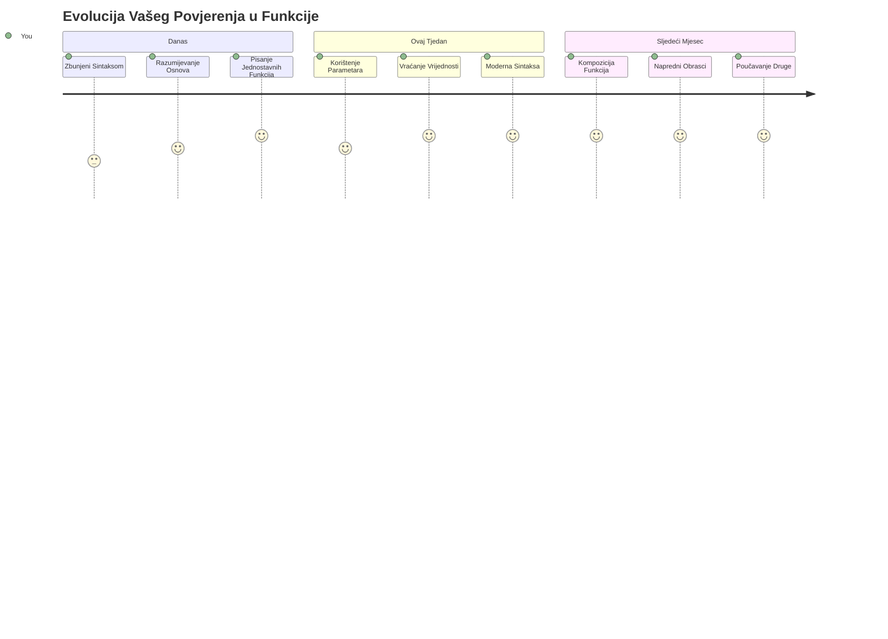
> 🎉 **Ovladali ste jednim od najsnažnijih koncepata programiranja!** Funkcije su gradivni blokovi većih programa. Svaka aplikacija koju ikada napraviš koristit će funkcije za organizaciju, ponovnu upotrebu i strukturiranje koda. Sada razumiješ kako zapakirati logiku u višekratno upotrebljive komponente, čineći te učinkovitijim i uspješnijim programerom. Dobrodošao u svijet modularnog programiranja! 🚀

---

<!-- CO-OP TRANSLATOR DISCLAIMER START -->
**Izjava o odricanju od odgovornosti**:  
Ovaj dokument je preveden korištenjem AI usluge za prevođenje [Co-op Translator](https://github.com/Azure/co-op-translator). Iako nastojimo postići točnost, molimo imajte na umu da automatski prijevodi mogu sadržavati pogreške ili netočnosti. Izvorni dokument na izvornom jeziku treba smatrati autoritativnim izvorom. Za kritične informacije preporučuje se profesionalni ljudski prijevod. Ne snosimo odgovornost za bilo kakva nesporazuma ili pogrešna tumačenja proizašla iz korištenja ovog prijevoda.
<!-- CO-OP TRANSLATOR DISCLAIMER END -->