<!--
CO_OP_TRANSLATOR_METADATA:
{
  "original_hash": "c688385d15dd3645e924ea0ffee8967f",
  "translation_date": "2026-01-07T08:53:00+00:00",
  "source_file": "2-js-basics/3-making-decisions/README.md",
  "language_code": "hr"
}
-->
# Osnove JavaScripta: Donošenje odluka


> Sketchnote autorice [Tomomi Imura](https://twitter.com/girlie_mac)

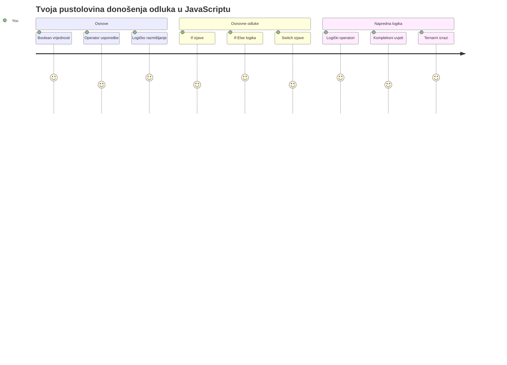
Jeste li se ikada pitali kako aplikacije donose pametne odluke? Kao što navigacijski sustav bira najbržu rutu, ili kako termostat odlučuje kada uključiti grijanje? Ovo je osnovni koncept donošenja odluka u programiranju.

Baš kao što je Charles Babbageov Analitički stroj zamišljen da slijedi različite nizove operacija ovisno o uvjetima, moderni JavaScript programi trebaju donositi odluke na temelju različitih okolnosti. Ta sposobnost grananja i donošenja odluka je ono što statični kod pretvara u responzivne, inteligentne aplikacije.

U ovoj lekciji naučit ćete kako implementirati uvjetnu logiku u svoje programe. Istražit ćemo uvjetne izjave, operatore usporedbe i logičke izraze koji omogućuju vašem kodu da procijeni situaciju i odgovori prikladno.

## Pred-ispitni kviz

[Pred-ispitni kviz](https://ff-quizzes.netlify.app/web/quiz/11)

Sposobnost donošenja odluka i kontroliranja toka programa temeljni je aspekt programiranja. Ovaj odjeljak pokriva kako kontrolirati izvršni put vaših JavaScript programa koristeći Boolean vrijednosti i uvjetnu logiku.

[](https://youtube.com/watch?v=SxTp8j-fMMY "Donošenje odluka")

> 🎥 Kliknite gornju sliku za video o donošenju odluka.

> Ovu lekciju možete pohađati na [Microsoft Learn](https://docs.microsoft.com/learn/modules/web-development-101-if-else/?WT.mc_id=academic-77807-sagibbon)!

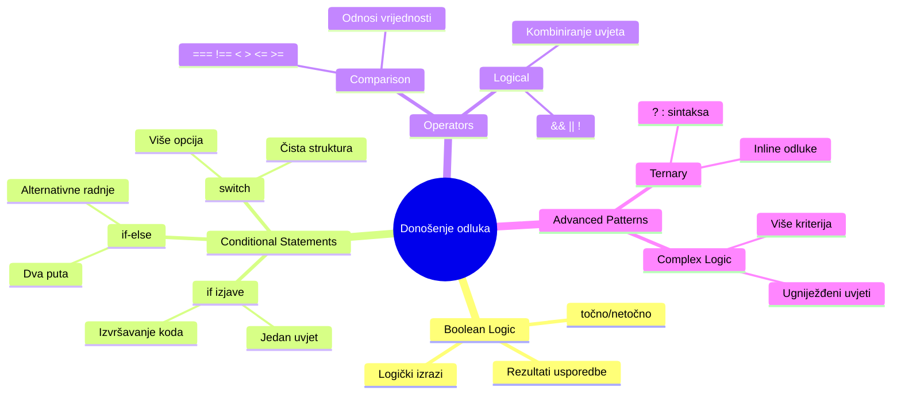
## Kratki podsjetnik na Booleove vrijednosti

Prije nego što krenemo u donošenje odluka, vratimo se na Booleove vrijednosti iz naše prethodne lekcije. Nazvane po matematičaru Georgu Booleu, ove vrijednosti predstavljaju binarne statuse – ili `true` ili `false`. Nema nejasnoća, nema sredine.

Ove binarne vrijednosti čine temelj cjelokupne računalne logike. Svaka odluka koju vaš program donese na kraju se svodi na Boolean evaluaciju.

Kreiranje Boolean varijabli je jednostavno:

```javascript
let myTrueBool = true;
let myFalseBool = false;
```

Ovo stvara dvije varijable s eksplicitnim Boolean vrijednostima.

✅ Booleovi su nazvani po engleskom matematičaru, filozofu i logičaru Georgu Booleu (1815.–1864.).

## Operatori usporedbe i Booleovi

U praksi rijetko ručno postavljate Boolean vrijednosti. Umjesto toga, generirat ćete ih procjenom uvjeta: "Je li ovaj broj veći od onog?" ili "Jesu li ove vrijednosti jednake?"

Operateri usporedbe omogućuju ove procjene. Oni uspoređuju vrijednosti i vraćaju Boolean rezultate ovisno o odnosu između operanada.

| Simbol | Opis                                                                                                                                                       | Primjer            |
| ------ | ---------------------------------------------------------------------------------------------------------------------------------------------------------- | ------------------ |
| `<`    | **Manje od**: Uspoređuje dvije vrijednosti i vraća `true` ako je vrijednost s lijeve strane manja od one s desne                                   | `5 < 6 // true`    |
| `<=`   | **Manje ili jednako**: Uspoređuje dvije vrijednosti i vraća `true` ako je vrijednost s lijeve strane manja ili jednaka onoj s desne                  | `5 <= 6 // true`   |
| `>`    | **Veće od**: Uspoređuje dvije vrijednosti i vraća `true` ako je vrijednost s lijeve strane veća od one s desne                                       | `5 > 6 // false`   |
| `>=`   | **Veće ili jednako**: Uspoređuje dvije vrijednosti i vraća `true` ako je vrijednost s lijeve strane veća ili jednaka onoj s desne                    | `5 >= 6 // false`  |
| `===`  | **Stroga jednakost**: Uspoređuje dvije vrijednosti i vraća `true` ako su vrijednosti lijevo i desno jednake I ISTOG SU tipa podataka.                 | `5 === 6 // false` |
| `!==`  | **Nejednakost**: Uspoređuje dvije vrijednosti i vraća suprotni Boolean rezultat onome što bi strogi operator jednakosti vratio                        | `5 !== 6 // true`  |

✅ Provjerite svoje znanje tako da napišete neke usporedbe u konzolu vašeg preglednika. Iznenađuju li vas neki rezultati?

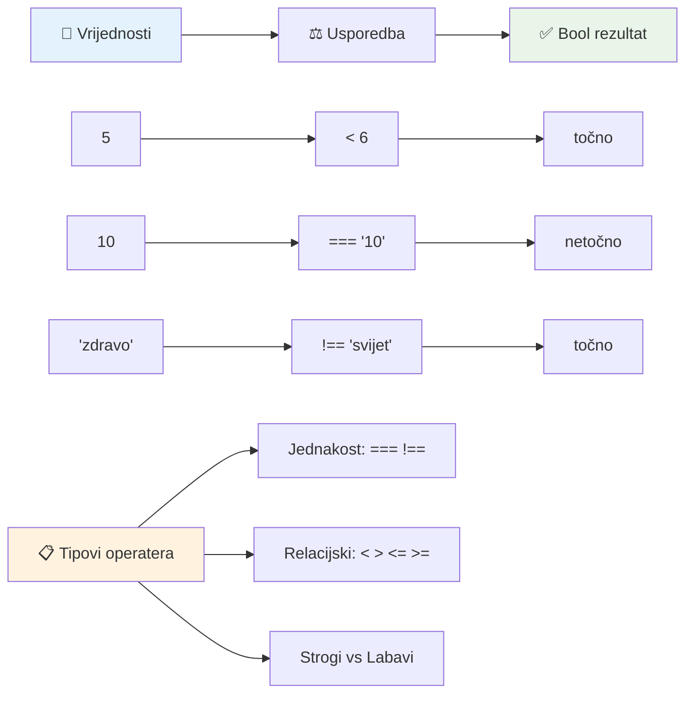
### 🧠 **Provjera majstorstva u usporedbi: Razumijevanje Booleove logike**

**Testirajte svoje razumijevanje usporedbe:**
- Zašto mislite da je `===` (stroga jednakost) općenito poželjniji od `==` (labave jednakosti)?
- Možete li predvidjeti što `5 === '5'` vraća? A što `5 == '5'`?
- Koja je razlika između `!==` i `!=`?

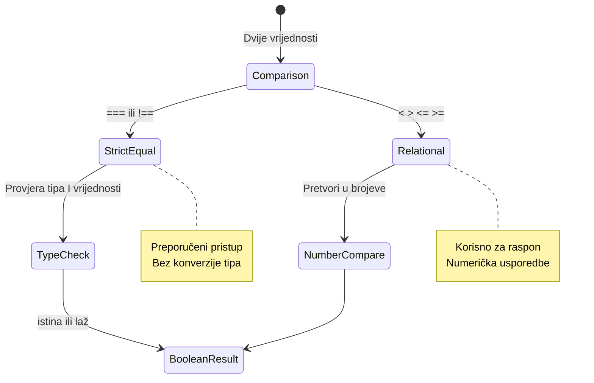
> **Savjet**: Uvijek koristite `===` i `!==` za provjere jednakosti, osim ako vam izričito ne treba konverzija tipa. Time sprječavate neočekivano ponašanje!

## If izjava

`if` izjava je kao postaviti pitanje u svom kodu. „Ako je ovaj uvjet istinit, onda učini ovo.“ Vjerojatno je najvažniji alat koji ćete koristiti za donošenje odluka u JavaScriptu.

Evo kako to funkcionira:

```javascript
if (condition) {
  // Uvjet je istinit. Kod u ovom bloku će se izvršiti.
}
```

Uvjet je unutar zagrada, i ako je `true`, JavaScript izvršava kod unutar vitičastih zagrada. Ako je `false`, JavaScript preskače cijeli blok.

Češće ćete koristiti operatore usporedbe za stvaranje ovih uvjeta. Pogledajmo praktičan primjer:

```javascript
let currentMoney = 1000;
let laptopPrice = 800;

if (currentMoney >= laptopPrice) {
  // Uvjet je istinit. Kod u ovom bloku će se izvršiti.
  console.log("Getting a new laptop!");
}
```

Budući da `1000 >= 800` evaluira u `true`, kod unutar bloka se izvršava i u konzoli se prikazuje "Kupujem novi laptop!".

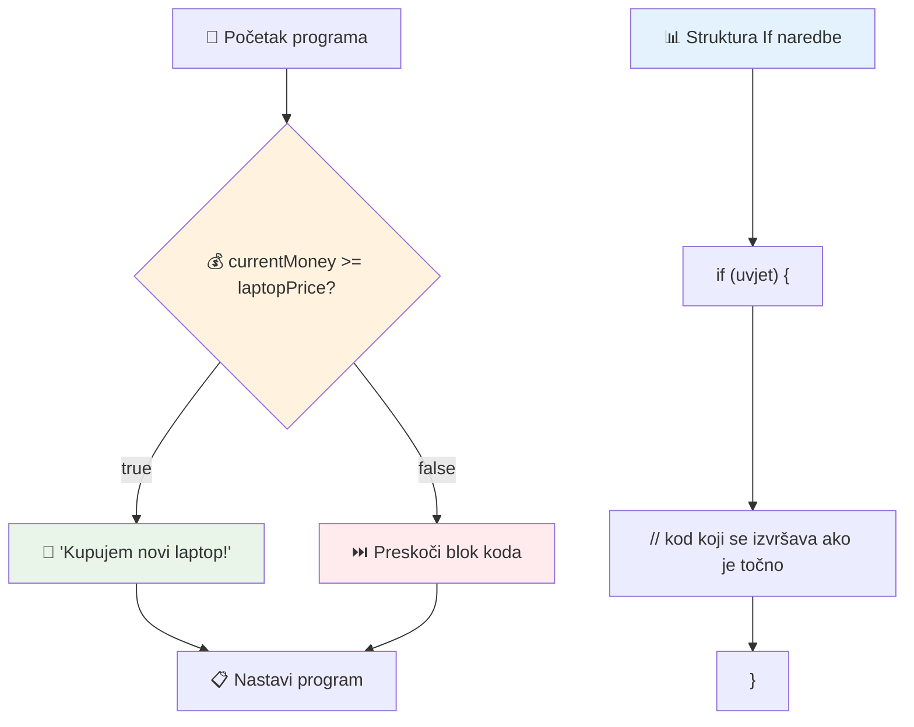
## If..Else izjava

Ali što ako želite da vaš program učini nešto drugo kad je uvjet lažan? Tu dolazi `else` – kao rezervni plan.

`else` izjava vam daje način reći "ako ovaj uvjet nije istinit, onda učini nešto drugo".

```javascript
let currentMoney = 500;
let laptopPrice = 800;

if (currentMoney >= laptopPrice) {
  // Uvjet je istinit. Kod u ovom bloku će se izvršiti.
  console.log("Getting a new laptop!");
} else {
  // Uvjet je neistinit. Kod u ovom bloku će se izvršiti.
  console.log("Can't afford a new laptop, yet!");
}
```

Sada, budući da je `500 >= 800` `false`, JavaScript preskače prvi blok i izvršava `else` blok. U konzoli ćete vidjeti "Još ne mogu priuštiti novi laptop!".

✅ Testirajte svoje razumijevanje ovog koda i sljedećeg tako što ćete ga pokrenuti u konzoli preglednika. Promijenite vrijednosti varijabli currentMoney i laptopPrice da promijenite ispis u `console.log()`.

### 🎯 **Provjera if-else logike: Grane izbora**

**Procijenite svoje razumijevanje uvjetne logike:**
- Što se događa ako `currentMoney` točno odgovara `laptopPrice`?
- Možete li smisliti stvarni scenarij gdje bi if-else logika bila korisna?
- Kako biste mogli proširiti ovo da pokriva više cjenovnih razreda?

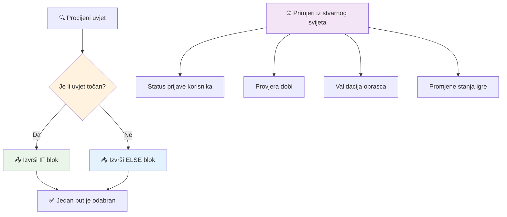
> **Ključni uvid**: If-else osigurava da se uzme točno jedan put. Time se garantira da vaš program uvijek ima odgovor na svaki uvjet!

## Switch izjava

Ponekad trebate usporediti jednu vrijednost s više opcija. Iako možete ugnijezditi nekoliko `if..else` izjava, taj pristup postaje nezgrapan. `switch` izjava nudi čišću strukturu za rukovanje višestrukim diskretnim vrijednostima.

Koncept podsjeća na mehaničke sklopke koje su se koristile u ranim telefonskim centrima – jedna ulazna vrijednost određuje koji specifični put izvođenje slijedi.

```javascript
switch (expression) {
  case x:
    // blok koda
    break;
  case y:
    // blok koda
    break;
  default:
    // blok koda
}
```

Evo kako je strukturirano:
- JavaScript evaluira izraz jednom
- Pregleda svaki `case` da pronađe podudaranje
- Kad nađe podudaranje, izvršava taj blok koda
- `break` govori JavaScriptu da prekine i izađe iz switcha
- Ako nijedan slučaj ne odgovara, izvršava se `default` blok (ako postoji)

```javascript
// Program koji koristi switch naredbu za dan u tjednu
let dayNumber = 2;
let dayName;

switch (dayNumber) {
  case 1:
    dayName = "Monday";
    break;
  case 2:
    dayName = "Tuesday";
    break;
  case 3:
    dayName = "Wednesday";
    break;
  default:
    dayName = "Unknown day";
    break;
}
console.log(`Today is ${dayName}`);
```

U ovom primjeru, JavaScript vidi da je `dayNumber` `2`, nalazi poklapanje s `case 2`, postavlja `dayName` na "Tuesday", i zatim izlazi iz switcha. Rezultat? "Today is Tuesday" se ispisuje u konzolu.

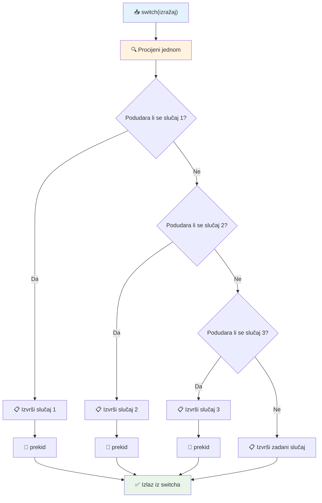
✅ Testirajte svoje razumijevanje ovog i sljedećeg koda tako da ga pokrenete u konzoli preglednika. Promijenite vrijednost varijable a da biste promijenili ispis u `console.log()`.

### 🔄 **Majstorija switch izjave: Više opcija**

**Testirajte razumijevanje switcha:**
- Što se događa ako zaboravite `break` izjavu?
- Kada biste koristili `switch` umjesto više `if-else` izjava?
- Zašto je `default` slučaj koristan čak i ako mislite da ste pokrili sve mogućnosti?

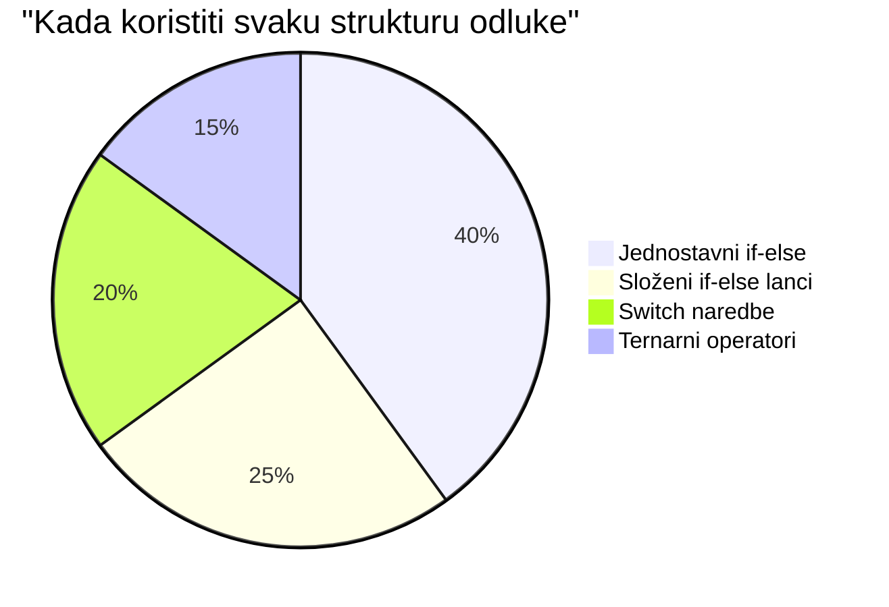
> **Najbolja praksa**: Koristite `switch` kad uspoređujete jednu varijablu s više specifičnih vrijednosti. Koristite `if-else` za provjere raspona ili složene uvjete!

## Logički operatori i Booleovi

Složene odluke često zahtijevaju evaluaciju više uvjeta istodobno. Baš kao što Booleova algebra omogućuje matematičarima kombiniranje logičkih izraza, programiranje pruža logičke operatore za povezivanje više Boolean uvjeta.

Ovi operatori omogućuju sofisticiranu uvjetnu logiku spajajući jednostavne true/false evaluacije.

| Simbol | Opis                                                                                                 | Primjer                                                                 |
| ------ | --------------------------------------------------------------------------------------------------- | ----------------------------------------------------------------------- |
| `&&`   | **Logički AND**: Uspoređuje dva Boolean izraza. Vraća true **samo** ako su oba uvjeta istinita       | `(5 > 3) && (5 < 10) // Oba uvjeta su istinita. Vraća true`             |
| `\|\|` | **Logički OR**: Uspoređuje dva Boolean izraza. Vraća true ako je barem jedan uvjet istinit           | `(5 > 10) \|\| (5 < 10) // Jedan je uvjet lažan, drugi istinit. Vraća true` |
| `!`    | **Logički NOT**: Vraća suprotnu vrijednost Boolean izraza                                          | `!(5 > 10) // 5 nije veće od 10, pa "!" čini izraz istinitim`           |

Ovi operatori vam omogućuju korisno spajanje uvjeta:
- AND (`&&`) znači da oba uvjeta moraju biti istinita
- OR (`||`) znači da bar jedan uvjet mora biti istinit
- NOT (`!`) mijenja istinitost u neistinitost (i obratno)

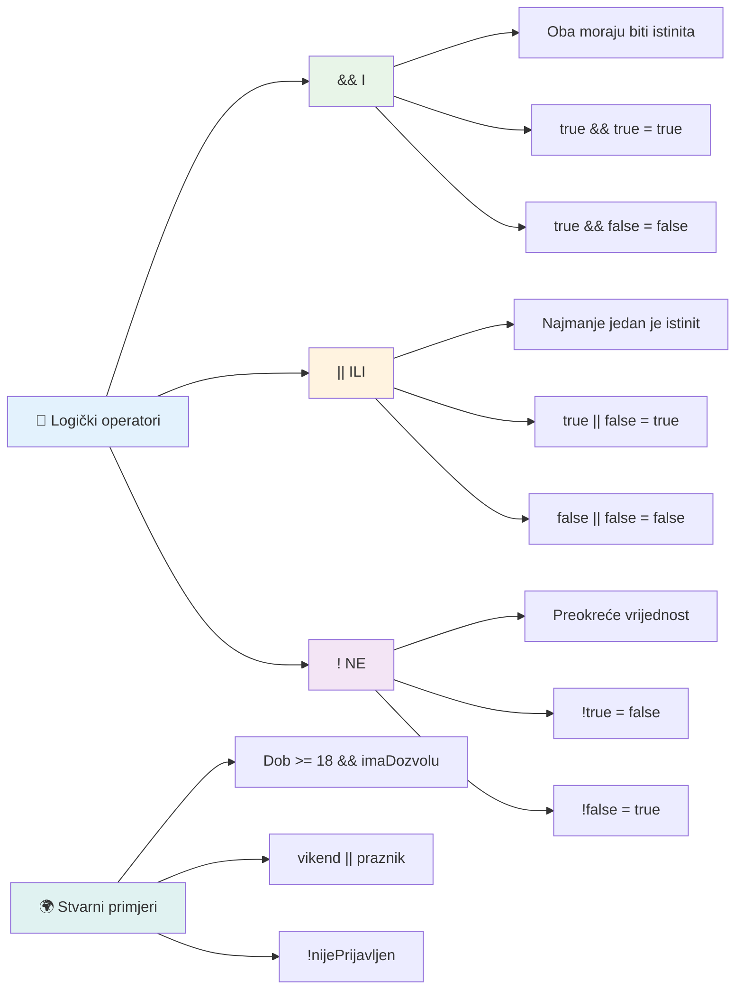
## Uvjeti i odluke s logičkim operatorima

Pogledajmo ove logičke operatore u praksi s realističnijim primjerom:

```javascript
let currentMoney = 600;
let laptopPrice = 800;
let laptopDiscountPrice = laptopPrice - (laptopPrice * 0.2); // Cijena laptopa s 20 posto popusta

if (currentMoney >= laptopPrice || currentMoney >= laptopDiscountPrice) {
  // Uvjet je istinit. Kod u ovom bloku će se izvršiti.
  console.log("Getting a new laptop!");
} else {
  // Uvjet je neistinit. Kod u ovom bloku će se izvršiti.
  console.log("Can't afford a new laptop, yet!");
}
```

U ovom primjeru: računamo 20% popusta (640), zatim procjenjujemo pokrivaju li naša dostupna sredstva ili puni iznos ILI sniženi iznos. Budući da 600 nije dostatan za umanjeni iznos od 640, uvjet evaluira u false.

### 🧮 **Provjera logičkih operatora: Kombiniranje uvjeta**

**Testirajte svoje razumijevanje logičkih operatora:**
- U izrazu `A && B`, što se događa ako je A lažno? Da li se B uopće procjenjuje?
- Možete li zamisliti situaciju gdje biste trebali koristiti sva tri operatora (&&, ||, !) zajedno?
- Koja je razlika između `!user.isActive` i `user.isActive !== true`?

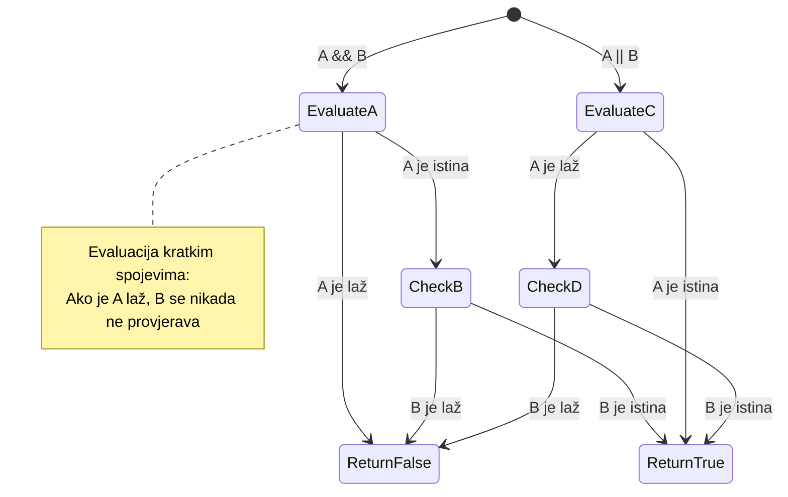
> **Savjet za performanse**: JavaScript koristi „kratki spoj“ - u `A && B`, ako je A lažno, B se ne evaluira. Iskoristite to u svoju korist!

### Operator negacije

Ponekad je lakše razmišljati o tome kada nešto NIJE istinito. Kao umjesto da pitate "Je li korisnik prijavljen?", možda ćete htjeti pitati "Nije li korisnik prijavljen?" Operator uskličnika (`!`) okreće logiku za vas.

```javascript
if (!condition) {
  // izvršava se ako je uvjet netočan
} else {
  // izvršava se ako je uvjet točan
}
```

Operator `!` je kao da kažete "suprotno od..." – ako je nešto `true`, `!` ga čini `false`, i obratno.

### Ternarni izrazi

Za jednostavne uvjetne dodjele, JavaScript pruža **ternarni operator**. Ovaj sažeti zapis omogućuje pisanje uvjetnog izraza u jednoj liniji, korisno kada trebate dodijeliti jednu od dvije vrijednosti ovisno o uvjetu.

```javascript
let variable = condition ? returnThisIfTrue : returnThisIfFalse;
```

Čita se kao pitanje: "Je li ovaj uvjet istinit? Ako jest, koristi ovu vrijednost. Ako nije, koristi onu vrijednost."

Ispod je konkretniji primjer:

```javascript
let firstNumber = 20;
let secondNumber = 10;
let biggestNumber = firstNumber > secondNumber ? firstNumber : secondNumber;
```

✅ Provedite minutu čitajući ovaj kod nekoliko puta. Razumijete li kako ovi operatori rade?

Ova linija kaže: "Je li `firstNumber` veći od `secondNumber`? Ako jest, stavi `firstNumber` u `biggestNumber`. Ako nije, stavi `secondNumber` u `biggestNumber`."

Ternarni operator je samo kraći način pisanja ove tradicionalne `if..else` izjave:

```javascript
let biggestNumber;
if (firstNumber > secondNumber) {
  biggestNumber = firstNumber;
} else {
  biggestNumber = secondNumber;
}
```

Oba pristupa daju identične rezultate. Ternarni operator nudi sažetost, dok tradicionalna struktura if-else može biti čitljivija za složenije uvjete.

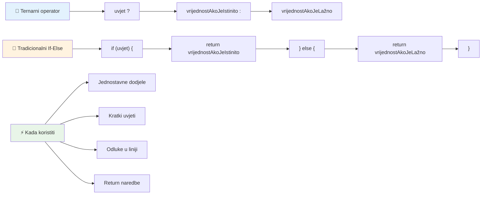
---


## 🚀 Izazov

Napišite program koji je prvo napisan s logičkim operatorima, a zatim ga prepišite koristeći ternarni izraz. Koji je sintaksni oblik vaš favorit?

---

## Izazov GitHub Copilot Agenta 🚀

Koristite Agent mod za dovršetak sljedećeg izazova:

**Opis:** Kreirajte opsežni kalkulator ocjena koji demonstrira višestruke koncepte donošenja odluka iz ove lekcije, uključujući if-else izjave, switch izjave, logičke operatore i ternarne izraze.

**Zadatak:** Napišite JavaScript program koji prima numeričku ocjenu učenika (0-100) i određuje njegovu slovnu ocjenu prema sljedećim kriterijima:
- A: 90-100
- B: 80-89  
- C: 70-79
- D: 60-69
- F: ispod 60

Zahtjevi:
1. Koristite if-else izjavu za određivanje slovne ocjene
2. Koristite logičke operatore da provjerite je li student prošao (ocjena >= 60) I ima li pohvale (ocjena >= 90)  
3. Koristite switch izraz za davanje specifične povratne informacije za svaku ocjenu  
4. Koristite ternarni operator da utvrdite je li student podoban za sljedeći kolegij (ocjena >= 70)  
5. Uključite provjeru valjanosti unosa kako biste osigurali da je rezultat između 0 i 100  

Testirajte svoj program s različitim ocjenama uključujući granične slučajeve poput 59, 60, 89, 90 i nevažeće unose.  

Saznajte više o [agent mode](https://code.visualstudio.com/blogs/2025/02/24/introducing-copilot-agent-mode) ovdje.  


## Post-Lecture Quiz

[Post-lecture quiz](https://ff-quizzes.netlify.app/web/quiz/12)

## Review & Self Study

Pročitajte više o mnogim dostupnim operatorima [na MDN-u](https://developer.mozilla.org/docs/Web/JavaScript/Reference/Operators).  

Prođite kroz sjajni Josh Comeau-ov [pregled operatora](https://joshwcomeau.com/operator-lookup/)!  

## Assignment

[Operators](assignment.md)

---

## 🧠 **Sažetak Vašeg Alata za Donošenje Odluka**

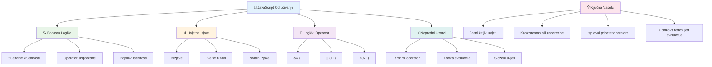
---

## 🚀 Vaš vremenski okvir usavršavanja donošenja odluka u JavaScriptu

### ⚡ **Što možete napraviti u sljedećih 5 minuta**
- [ ] Vježbajte operatore usporedbe u konzoli preglednika
- [ ] Napišite jednostavnu if-else izjavu koja provjerava vašu dob
- [ ] Isprobajte izazov: prepišite if-else koristeći ternarni operator
- [ ] Testirajte što se događa s različitim "truthy" i "falsy" vrijednostima

### 🎯 **Što možete postići u ovom satu**
- [ ] Završite kviz nakon lekcije i pregledajte sve nejasne koncepte
- [ ] Izradite sveobuhvatni kalkulator ocjena iz GitHub Copilot izazova
- [ ] Kreirajte jednostavno stablo odluka za stvarni scenarij (poput odabira što odjenuti)
- [ ] Vježbajte kombiniranje više uvjeta s logičkim operatorima
- [ ] Eksperimentirajte sa switch izrazima za različite slučajeve upotrebe

### 📅 **Vaše tjedno usavršavanje logike**
- [ ] Dovršite zadatak o operatorima s kreativnim primjerima
- [ ] Izradite mini kviz aplikaciju koristeći različite uvjetne strukture
- [ ] Kreirajte validator formulara koji provjerava višestruke uvjete unosa
- [ ] Vježbajte Josh Comeau-ove vježbe [pregleda operatora](https://joshwcomeau.com/operator-lookup/)
- [ ] Refaktorirajte postojeći kod da koristi prikladnije uvjetne strukture
- [ ] Proučite kratkocirkularnu evaluaciju i implikacije na performanse

### 🌟 **Vaša mjesečna transformacija**
- [ ] Savladajte složene ugniježđene uvjete i održavajte čitljivost koda
- [ ] Izradite aplikaciju sa sofisticiranom logikom donošenja odluka
- [ ] Doprinesite open source projektima poboljšavajući uvjetnu logiku u postojećim projektima
- [ ] Naučite nekoga drugoga o različitim uvjetnim strukturama i kada ih koristiti
- [ ] Istražite funkcionalne pristupe uvjetnoj logici
- [ ] Kreirajte osobni vodič za najbolje prakse uvjetnih izraza

### 🏆 **Završni pregled vašeg usavršavanja donošenja odluka**

**Proslavite svoje umijeće logičkog razmišljanja:**  
- Koju najkompleksniju logiku donošenja odluka ste uspješno implementirali?  
- Koja vam uvjetna struktura najviše „leži“ i zašto?  
- Kako vam je učenje o logičkim operatorima promijenilo pristup rješavanju problema?  
- Koja bi stvarna primjena imala koristi od sofisticirane logike donošenja odluka?  

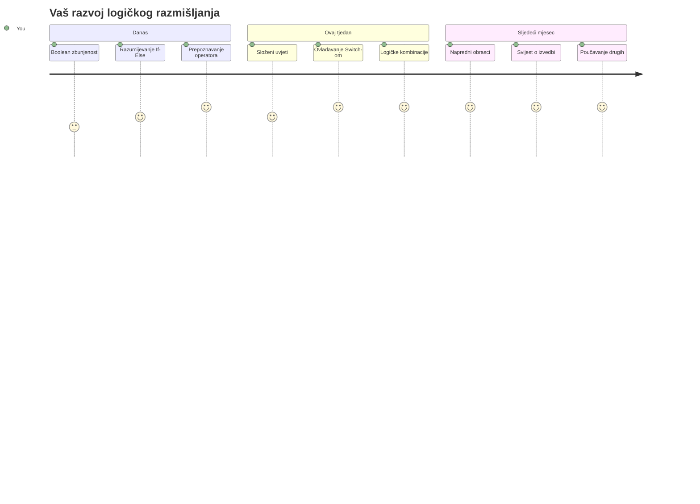
> 🧠 **Savladali ste umjetnost digitalnog donošenja odluka!** Svaka interaktivna aplikacija se oslanja na uvjetnu logiku za inteligentan odgovor na korisničke akcije i promjenjive uvjete. Sada razumijete kako natjerati svoje programe da razmišljaju, evaluiraju i biraju odgovarajuće odgovore. Ova logička osnova pokretat će svaku dinamičnu aplikaciju koju izgradite! 🎉

---

<!-- CO-OP TRANSLATOR DISCLAIMER START -->
**Odricanje odgovornosti**:
Ovaj dokument je preveden pomoću AI servisa za prijevod [Co-op Translator](https://github.com/Azure/co-op-translator). Iako nastojimo postići točnost, molimo imajte na umu da automatski prijevodi mogu sadržavati pogreške ili netočnosti. Izvorni dokument na izvornom jeziku treba smatrati službenim i autoritativnim izvorom. Za kritične informacije preporučuje se profesionalni ljudski prijevod. Ne snosimo odgovornost za bilo kakva nerazumijevanja ili pogrešne interpretacije koje proizlaze iz korištenja ovog prijevoda.
<!-- CO-OP TRANSLATOR DISCLAIMER END -->