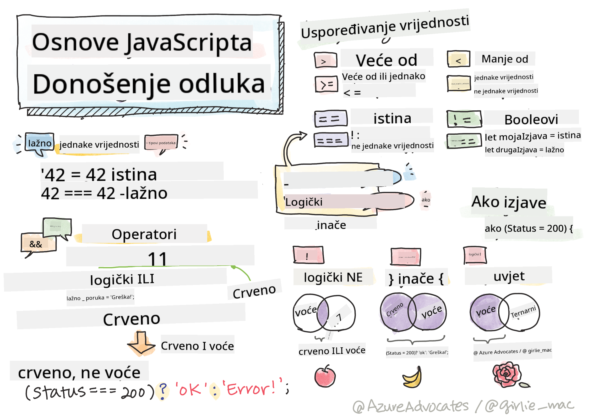

<!--
CO_OP_TRANSLATOR_METADATA:
{
  "original_hash": "888609c48329c280ca2477d2df40f2e5",
  "translation_date": "2025-08-27T22:38:13+00:00",
  "source_file": "2-js-basics/3-making-decisions/README.md",
  "language_code": "hr"
}
-->
# Osnove JavaScripta: Donošenje odluka



> Sketchnote autor [Tomomi Imura](https://twitter.com/girlie_mac)

## Kviz prije predavanja

[Kviz prije predavanja](https://ashy-river-0debb7803.1.azurestaticapps.net/quiz/11)

Donošenje odluka i kontroliranje redoslijeda izvršavanja koda čini vaš kod ponovno upotrebljivim i robusnim. Ovaj dio pokriva sintaksu za kontrolu toka podataka u JavaScriptu i njegovu važnost kada se koristi s Boolean tipovima podataka.

[](https://youtube.com/watch?v=SxTp8j-fMMY "Donošenje odluka")

> 🎥 Kliknite na sliku iznad za video o donošenju odluka.

> Ovu lekciju možete pratiti na [Microsoft Learn](https://docs.microsoft.com/learn/modules/web-development-101-if-else/?WT.mc_id=academic-77807-sagibbon)!

## Kratki podsjetnik o Booleanima

Booleani mogu imati samo dvije vrijednosti: `true` ili `false`. Booleani pomažu u donošenju odluka o tome koje linije koda treba izvršiti kada su određeni uvjeti ispunjeni.

Postavite svoj Boolean na true ili false ovako:

`let myTrueBool = true`  
`let myFalseBool = false`

✅ Booleani su dobili ime po engleskom matematičaru, filozofu i logičaru Georgeu Booleu (1815–1864).

## Operatori usporedbe i Booleani

Operatori se koriste za procjenu uvjeta usporedbom koja će stvoriti Boolean vrijednost. Slijedi popis često korištenih operatora.

| Simbol | Opis                                                                                                                                                          | Primjer            |
| ------ | ------------------------------------------------------------------------------------------------------------------------------------------------------------- | ------------------ |
| `<`    | **Manje od**: Uspoređuje dvije vrijednosti i vraća Boolean vrijednost `true` ako je vrijednost na lijevoj strani manja od vrijednosti na desnoj               | `5 < 6 // true`    |
| `<=`   | **Manje ili jednako**: Uspoređuje dvije vrijednosti i vraća Boolean vrijednost `true` ako je vrijednost na lijevoj strani manja ili jednaka desnoj            | `5 <= 6 // true`   |
| `>`    | **Veće od**: Uspoređuje dvije vrijednosti i vraća Boolean vrijednost `true` ako je vrijednost na lijevoj strani veća od vrijednosti na desnoj                | `5 > 6 // false`   |
| `>=`   | **Veće ili jednako**: Uspoređuje dvije vrijednosti i vraća Boolean vrijednost `true` ako je vrijednost na lijevoj strani veća ili jednaka desnoj             | `5 >= 6 // false`  |
| `===`  | **Stroga jednakost**: Uspoređuje dvije vrijednosti i vraća Boolean vrijednost `true` ako su vrijednosti na lijevoj i desnoj strani jednake I istog tipa podataka | `5 === 6 // false` |
| `!==`  | **Nejednakost**: Uspoređuje dvije vrijednosti i vraća suprotnu Boolean vrijednost od one koju bi vratio operator stroge jednakosti                           | `5 !== 6 // true`  |

✅ Provjerite svoje znanje pisanjem nekoliko usporedbi u konzoli vašeg preglednika. Iznenađuje li vas neki vraćeni podatak?

## If naredba

If naredba će izvršiti kod unutar svojih blokova ako je uvjet istinit.

```javascript
if (condition) {
  //Condition is true. Code in this block will run.
}
```

Logički operatori često se koriste za formiranje uvjeta.

```javascript
let currentMoney;
let laptopPrice;

if (currentMoney >= laptopPrice) {
  //Condition is true. Code in this block will run.
  console.log("Getting a new laptop!");
}
```

## If..Else naredba

`else` naredba će izvršiti kod unutar svojih blokova kada je uvjet neistinit. Opcionalna je uz `if` naredbu.

```javascript
let currentMoney;
let laptopPrice;

if (currentMoney >= laptopPrice) {
  //Condition is true. Code in this block will run.
  console.log("Getting a new laptop!");
} else {
  //Condition is false. Code in this block will run.
  console.log("Can't afford a new laptop, yet!");
}
```

✅ Testirajte svoje razumijevanje ovog koda i sljedećeg koda izvršavanjem u konzoli preglednika. Promijenite vrijednosti varijabli `currentMoney` i `laptopPrice` kako biste promijenili vraćeni `console.log()`.

## Switch naredba

`switch` naredba koristi se za izvršavanje različitih radnji na temelju različitih uvjeta. Koristite `switch` naredbu za odabir jednog od mnogih blokova koda koji će se izvršiti.

```javascript
switch (expression) {
  case x:
    // code block
    break;
  case y:
    // code block
    break;
  default:
  // code block
}
```

```javascript
// program using switch statement
let a = 2;

switch (a) {
  case 1:
    a = "one";
    break;
  case 2:
    a = "two";
    break;
  default:
    a = "not found";
    break;
}
console.log(`The value is ${a}`);
```

✅ Testirajte svoje razumijevanje ovog koda i sljedećeg koda izvršavanjem u konzoli preglednika. Promijenite vrijednosti varijable `a` kako biste promijenili vraćeni `console.log()`.

## Logički operatori i Booleani

Odluke mogu zahtijevati više od jedne usporedbe i mogu se povezati logičkim operatorima kako bi se proizvela Boolean vrijednost.

| Simbol | Opis                                                                                     | Primjer                                                                 |
| ------ | ----------------------------------------------------------------------------------------- | ----------------------------------------------------------------------- |
| `&&`   | **Logički AND**: Uspoređuje dva Boolean izraza. Vraća true **samo** ako su obje strane istinite | `(5 > 6) && (5 < 6 ) //Jedna strana je neistina, druga istina. Vraća false` |
| `\|\|` | **Logički OR**: Uspoređuje dva Boolean izraza. Vraća true ako je barem jedna strana istinita | `(5 > 6) \|\| (5 < 6) //Jedna strana je neistina, druga istina. Vraća true` |
| `!`    | **Logički NOT**: Vraća suprotnu vrijednost Boolean izraza                                 | `!(5 > 6) // 5 nije veće od 6, ali "!" će vratiti true`                 |

## Uvjeti i odluke s logičkim operatorima

Logički operatori mogu se koristiti za formiranje uvjeta u if..else naredbama.

```javascript
let currentMoney;
let laptopPrice;
let laptopDiscountPrice = laptopPrice - laptopPrice * 0.2; //Laptop price at 20 percent off

if (currentMoney >= laptopPrice || currentMoney >= laptopDiscountPrice) {
  //Condition is true. Code in this block will run.
  console.log("Getting a new laptop!");
} else {
  //Condition is true. Code in this block will run.
  console.log("Can't afford a new laptop, yet!");
}
```

### Operator negacije

Do sada ste vidjeli kako možete koristiti `if...else` naredbu za stvaranje uvjetne logike. Sve što ide u `if` mora se procijeniti kao true/false. Korištenjem operatora `!` možete _negirati_ izraz. To bi izgledalo ovako:

```javascript
if (!condition) {
  // runs if condition is false
} else {
  // runs if condition is true
}
```

### Ternarni izrazi

`if...else` nije jedini način izražavanja logike odluke. Također možete koristiti nešto što se zove ternarni operator. Sintaksa za njega izgleda ovako:

```javascript
let variable = condition ? <return this if true> : <return this if false>
```

Ispod je konkretniji primjer:

```javascript
let firstNumber = 20;
let secondNumber = 10;
let biggestNumber = firstNumber > secondNumber ? firstNumber : secondNumber;
```

✅ Odvojite trenutak da nekoliko puta pročitate ovaj kod. Razumijete li kako ovi operatori funkcioniraju?

Gore navedeno kaže:

- ako je `firstNumber` veći od `secondNumber`
- tada dodijelite `firstNumber` varijabli `biggestNumber`
- inače dodijelite `secondNumber`.

Ternarni izraz je samo kompaktan način pisanja koda ispod:

```javascript
let biggestNumber;
if (firstNumber > secondNumber) {
  biggestNumber = firstNumber;
} else {
  biggestNumber = secondNumber;
}
```

---

## 🚀 Izazov

Napravite program koji je prvo napisan s logičkim operatorima, a zatim ga prepišite koristeći ternarni izraz. Koja vam sintaksa više odgovara?

---

## Kviz nakon predavanja

[Kviz nakon predavanja](https://ashy-river-0debb7803.1.azurestaticapps.net/quiz/12)

## Pregled i samostalno učenje

Pročitajte više o mnogim operatorima dostupnim korisniku [na MDN](https://developer.mozilla.org/docs/Web/JavaScript/Reference/Operators).

Prođite kroz sjajan [operator lookup](https://joshwcomeau.com/operator-lookup/) Josha Comeaua!

## Zadatak

[Operatori](assignment.md)

---

**Odricanje od odgovornosti**:  
Ovaj dokument je preveden pomoću AI usluge za prevođenje [Co-op Translator](https://github.com/Azure/co-op-translator). Iako nastojimo osigurati točnost, imajte na umu da automatski prijevodi mogu sadržavati pogreške ili netočnosti. Izvorni dokument na izvornom jeziku treba smatrati autoritativnim izvorom. Za ključne informacije preporučuje se profesionalni prijevod od strane ljudskog prevoditelja. Ne preuzimamo odgovornost za bilo kakva nesporazuma ili pogrešna tumačenja koja proizlaze iz korištenja ovog prijevoda.