<!--
CO_OP_TRANSLATOR_METADATA:
{
  "original_hash": "1710a50a519a6e4a1b40a5638783018d",
  "translation_date": "2026-01-07T08:55:09+00:00",
  "source_file": "2-js-basics/4-arrays-loops/README.md",
  "language_code": "hr"
}
-->
# Osnove JavaScripta: Nizovi i petlje


> Sketchnote od [Tomomi Imura](https://twitter.com/girlie_mac)

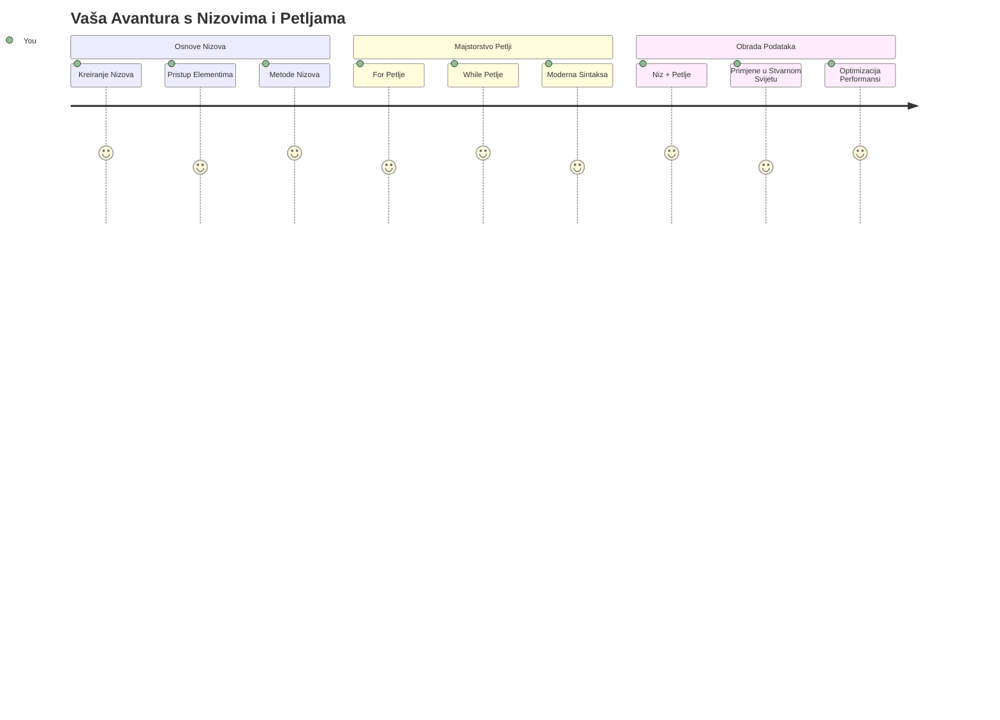
## Kviz prije predavanja
[Kviz prije predavanja](https://ff-quizzes.netlify.app/web/quiz/13)

Jeste li se ikad pitali kako web-stranice prate artikle u košarici ili prikazuju vašu listu prijatelja? Tu na scenu stupaju nizovi i petlje. Nizovi su poput digitalnih spremnika koji drže više informacija, dok petlje omogućuju učinkovito rad s tim podacima bez ponavljanja koda.

Zajedno, ova dva koncepta čine temelj za rukovanje informacijama u vašim programima. Naučit ćete kako prijeći s ručnog pisanja svakog koraka na stvaranje pametnog, učinkovitog koda koji može brzo obraditi stotine ili tisuće elemenata.

Do kraja ovog lekcija, razumjet ćete kako obaviti složene zadatke s podacima s samo nekoliko linija koda. Istražimo ove osnovne programske koncepte.

[](https://youtube.com/watch?v=1U4qTyq02Xw "Arrays")

[](https://www.youtube.com/watch?v=Eeh7pxtTZ3k "Loops")

> 🎥 Kliknite na slike gore za videozapise o nizovima i petljama.

> Ovu lekciju možete pohađati na [Microsoft Learn](https://docs.microsoft.com/learn/modules/web-development-101-arrays/?WT.mc_id=academic-77807-sagibbon)!

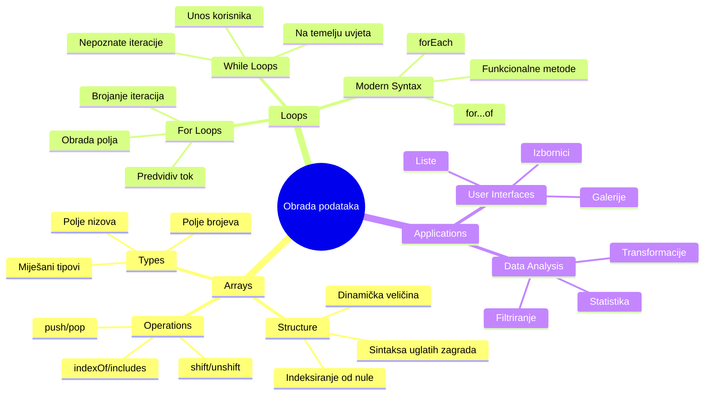
## Nizovi

Zamislite niz kao digitalni ormarić za pohranu dokumenata – umjesto da svaki poseban dokument spremate u zaseban ladicu, možete organizirati više povezanih stvari u jedan strukturirani spremnik. U programiranju, nizovi vam omogućuju spremanje više informacija u jedan organizirani paket.

Bilo da gradite galeriju fotografija, upravljate popisom obaveza ili pratite najviše rezultate u igri, nizovi pružaju temelj za organizaciju podataka. Pogledajmo kako rade.

✅ Nizovi su posvuda oko nas! Možete li smisliti primjer iz stvarnog života za niz, kao što je niz solarnih panela?

### Kreiranje nizova

Kreiranje niza je vrlo jednostavno – samo upotrijebite uglate zagrade!

```javascript
// Prazan niz - poput prazne košarice koja čeka na stavke
const myArray = [];
```

**Što se ovdje događa?**
Upravo ste stvorili prazan spremnik koristeći te uglate zagrade `[]`. Zamislite ga kao praznu policu u knjižnici – spreman je za držanje bilo kojih knjiga koje želite tamo organizirati.

Možete i odmah napuniti svoj niz početnim vrijednostima:

```javascript
// Izbornik okusa vaše trgovine sladoledom
const iceCreamFlavors = ["Chocolate", "Strawberry", "Vanilla", "Pistachio", "Rocky Road"];

// Podaci iz korisničkog profila (miješanje različitih vrsta podataka)
const userData = ["John", 25, true, "developer"];

// Rezultati testova za vaš omiljeni predmet
const scores = [95, 87, 92, 78, 85];
```

**Zanimljive stvari za primijetiti:**
- U istom nizu možete pohraniti tekst, brojeve ili čak vrijednosti true/false
- Samo odvojite svaku stavku zarezom – lako!
- Nizovi su savršeni za držanje povezanih informacija na okupu

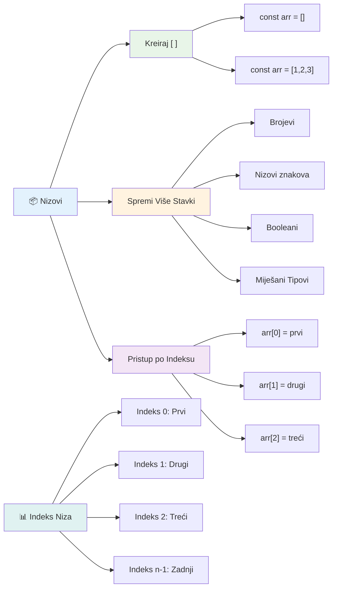
### Indeksiranje nizova

Evo nešto što na prvi pogled može djelovati neobično: nizovi numeriraju svoje elemente počevši od 0, a ne od 1. Ovo indeksiranje od nule potječe iz načina na koji radi memorija računala – to je programerska konvencija od ranih dana računalnih jezika poput C-a. Svakom mjestu u nizu dodijeljen je svoj broj adrese koji se naziva **indeks**.

| Indeks | Vrijednost | Opis |
|-------|-------|-------------|
| 0 | "Chocolate" | Prvi element |
| 1 | "Strawberry" | Drugi element |
| 2 | "Vanilla" | Treći element |
| 3 | "Pistachio" | Četvrti element |
| 4 | "Rocky Road" | Peti element |

✅ Iznenađuje li vas da nizovi počinju na indeksu nula? U nekim programskim jezicima indeksi počinju od 1. Oko toga postoji zanimljiva povijest, koju možete [pročitati na Wikipediji](https://en.wikipedia.org/wiki/Zero-based_numbering).

**Pristupanje elementima niza:**

```javascript
const iceCreamFlavors = ["Chocolate", "Strawberry", "Vanilla", "Pistachio", "Rocky Road"];

// Pristup pojedinačnim elementima korištenjem zagrade
console.log(iceCreamFlavors[0]); // "Čokolada" - prvi element
console.log(iceCreamFlavors[2]); // "Vanilija" - treći element
console.log(iceCreamFlavors[4]); // "Rocky Road" - zadnji element
```

**Razjašnjenje što se ovdje događa:**
- **Koristi** notaciju s uglatim zagradama i brojem indeksa za pristup elementima
- **Vraća** vrijednost pohranjenu na toj specifičnoj poziciji u nizu
- **Počinje** brojati od 0, što čini prvi element indeksom 0

**Izmjena elemenata niza:**

```javascript
// Promijeni postojeću vrijednost
iceCreamFlavors[4] = "Butter Pecan";
console.log(iceCreamFlavors[4]); // "Maslac Orah"

// Dodaj novi element na kraj
iceCreamFlavors[5] = "Cookie Dough";
console.log(iceCreamFlavors[5]); // "Tijesto za Kolačiće"
```

**U gornjem primjeru smo:**
- **Izmijenili** element na indeksu 4 sa "Rocky Road" u "Butter Pecan"
- **Dodali** novi element "Cookie Dough" na indeksu 5
- **Automatski** proširili duljinu niza dodavanjem izvan trenutnih granica

### Duljina niza i uobičajene metode

Nizovi dolaze s ugrađenim svojstvima i metodama koje olakšavaju rad s podacima.

**Pronalaženje duljine niza:**

```javascript
const iceCreamFlavors = ["Chocolate", "Strawberry", "Vanilla", "Pistachio", "Rocky Road"];
console.log(iceCreamFlavors.length); // 5

// Duljina se automatski ažurira kako se niz mijenja
iceCreamFlavors.push("Mint Chip");
console.log(iceCreamFlavors.length); // 6
```

**Ključne stvari za zapamtiti:**
- **Vraća** ukupan broj elemenata u nizu
- **Automatski** se ažurira kada se elementi dodaju ili uklanjaju
- **Pruža** dinamički broj koji je koristan za petlje i provjere

**Osnovne metode nizova:**

```javascript
const fruits = ["apple", "banana", "orange"];

// Dodaj elemente
fruits.push("grape");           // Dodaje na kraj: ["apple", "banana", "orange", "grape"]
fruits.unshift("strawberry");   // Dodaje na početak: ["strawberry", "apple", "banana", "orange", "grape"]

// Ukloni elemente
const lastFruit = fruits.pop();        // Uklanja i vraća "grape"
const firstFruit = fruits.shift();     // Uklanja i vraća "strawberry"

// Pronađi elemente
const index = fruits.indexOf("banana"); // Vraća 1 (pozicija "banana")
const hasApple = fruits.includes("apple"); // Vraća true
```

**Razumijevanje ovih metoda:**
- **Dodaje** elemente s `push()` (na kraj) i `unshift()` (na početak)
- **Uklanja** elemente s `pop()` (s kraja) i `shift()` (s početka)
- **Pronalazi** elemente s `indexOf()` i provjerava postojanje s `includes()`
- **Vraća** korisne vrijednosti poput uklonjenih elemenata ili pozicija indeksa

✅ Isprobajte sami! Koristite konzolu vašeg preglednika za stvaranje i manipulaciju nizom po vlastitom izboru.

### 🧠 **Provjera osnova nizova: Organizacija vaših podataka**

**Provjerite razumijevanje nizova:**
- Zašto mislite da nizovi broje od 0, a ne od 1?
- Što se događa ako pokušate pristupiti indeksu koji ne postoji (poput `arr[100]` u nizu od 5 elemenata)?
- Možete li smisliti tri stvarne situacije gdje bi nizovi bili korisni?

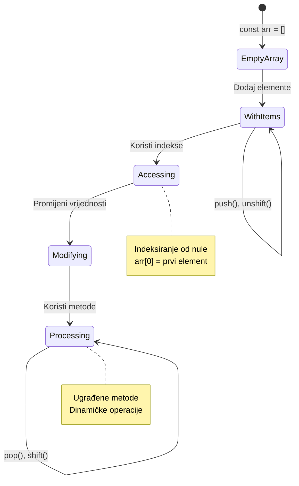
> **Uvid iz stvarnog svijeta**: Nizovi su posvuda u programiranju! Doručci na društvenim mrežama, košarice za kupovinu, galerije slika, popisi pjesama – sve su to nizovi iza scene!

## Petlje

Zamislite poznatu kaznu iz romana Charlesa Dickensa gdje su učenici morali višestruko pisati rečenicu na ploči. Zamislite da nekome jednostavno kažete "upiši ovu rečenicu 100 puta" i to se automatski izvrši. Točno to petlje rade za vaš kod.

Petlje su poput neumornog pomoćnika koji može ponavljati zadatke bez pogreške. Bilo da trebate provjeriti svaki artikl u košarici ili prikazati sve fotografije u albumu, petlje učinkovito upravljaju ponavljanjem.

JavaScript nudi nekoliko vrsta petlji za korištenje. Istražimo svaku i shvatimo kada ih koristiti.

```mermaid
flowchart TD
    A["🔄 Vrste petlji"] --> B["For petlja"]
    A --> C["While petlja"]
    A --> D["For...of petlja"]
    A --> E["forEach metoda"]
    
    B --> B1["Poznati brojevi iteracija"]
    B --> B2["Temeljeno na brojaču"]
    B --> B3["for(init; uvjet; inkrement)"]
    
    C --> C1["Nepoznati brojevi iteracija"]
    C --> C2["Temeljeno na uvjetu"]
    C --> C3["while(uvjet)"]
    
    D --> D1["Moderno ES6+"]
    D --> D2["Iteracija kroz niz"]
    D --> D3["for(item of array)"]
    
    E --> E1["Funkcionalni stil"]
    E --> E2["Metoda niza"]
    E --> E3["array.forEach(callback)"]
    
    F["⏰ Kada koristiti"] --> F1["For: brojanje, indeksi"]
    F --> F2["While: unos korisnika, pretraživanje"]
    F --> F3["For...of: jednostavna iteracija"]
    F --> F4["forEach: funkcionalno programiranje"]
    
    style A fill:#e3f2fd
    style B fill:#e8f5e8
    style C fill:#fff3e0
    style D fill:#f3e5f5
    style E fill:#e0f2f1
    style F fill:#fce4ec
```
### For petlja

`for` petlja je poput postavljanja tajmera – točno znate koliko puta želite da se nešto dogodi. Vrlo je organizirana i predvidiva, što je čini savršenom kada radite s nizovima ili trebate brojati stvari.

**Struktura for petlje:**

| Komponenta | Svrha | Primjer |
|-----------|---------|----------|
| **Inicijalizacija** | Postavlja početnu točku | `let i = 0` |
| **Uvjet** | Kada nastaviti | `i < 10` |
| **Inkrement** | Kako ažurirati | `i++` |

```javascript
// Brojanje od 0 do 9
for (let i = 0; i < 10; i++) {
  console.log(`Count: ${i}`);
}

// Praktičniji primjer: obrada rezultata
const testScores = [85, 92, 78, 96, 88];
for (let i = 0; i < testScores.length; i++) {
  console.log(`Student ${i + 1}: ${testScores[i]}%`);
}
```

**Korak po korak, evo što se događa:**
- **Inicijalizira** varijablu brojila `i` na 0 na početku
- **Provjerava** uvjet `i < 10` prije svake iteracije
- **Izvršava** blok koda kada je uvjet istinit
- **Povećava** `i` za 1 nakon svake iteracije s `i++`
- **Zaustavlja** se kada uvjet postane neistinit (kad `i` dosegne 10)

✅ Pokrenite ovaj kod u konzoli preglednika. Što se događa ako napravite sitne promjene u brojaču, uvjetu ili izrazu za iteraciju? Možete li ga pokrenuti unatrag, stvarajući odbrojavanje?

### 🗓️ **Provjera ovladavanja For petljom: Kontrolirana ponavljanja**

**Procijenite svoje razumijevanje for petlje:**
- Koja su tri dijela for petlje i što svaki radi?
- Kako biste petljali kroz niz unatrag?
- Što se događa ako zaboravite inkrement dio (`i++`)?

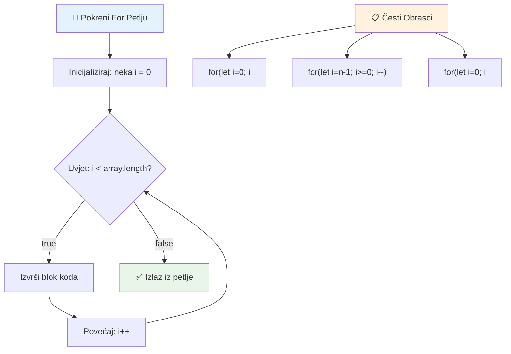
> **Mudrost petlji**: For petlje su savršene kad znate točno koliko puta nešto treba ponoviti. One su najčešći izbor za obradu nizova!

### While petlja

`while` petlja je poput govora "nastavi dok..." - možda ne znate točno koliko će se puta izvršiti, ali znate kada prestati. Savršena je za stvari poput traženja unosa korisnika dok ne dobijete potrebne podatke ili pretraživanja podataka dok ne pronađete ono što tražite.

**Karakteristike while petlje:**
- **Nastavlja** se izvršavati dok je uvjet istinit
- **Zahtijeva** ručno upravljanje bilo kojim brojačima
- **Provjerava** uvjet prije svake iteracije
- **Rizik** beskonačnih petlji ako uvjet nikada ne postane neistinit

```javascript
// Osnovni primjer brojanja
let i = 0;
while (i < 10) {
  console.log(`While count: ${i}`);
  i++; // Ne zaboravi povećati!
}

// Praktičniji primjer: obrada korisničkog unosa
let userInput = "";
let attempts = 0;
const maxAttempts = 3;

while (userInput !== "quit" && attempts < maxAttempts) {
  userInput = prompt(`Enter 'quit' to exit (attempt ${attempts + 1}):`);
  attempts++;
}

if (attempts >= maxAttempts) {
  console.log("Maximum attempts reached!");
}
```

**Razumijevanje ovih primjera:**
- **Ručno upravlja** brojačem `i` unutar tijela petlje
- **Povećava** brojač da spriječi beskonačne petlje
- **Prikazuje** praktični primjer s unosom korisnika i ograničenjem pokušaja
- **Uključuje** sigurnosne mehanizme za sprječavanje beskonačnog izvršavanja

### ♾️ **Provjera mudrosti While petlje: Ponavljanje na temelju uvjeta**

**Testirajte razumijevanje while petlji:**
- Koja je glavna opasnost pri korištenju while petlji?
- Kada biste odabrali while petlju umjesto for petlje?
- Kako možete spriječiti beskonačne petlje?

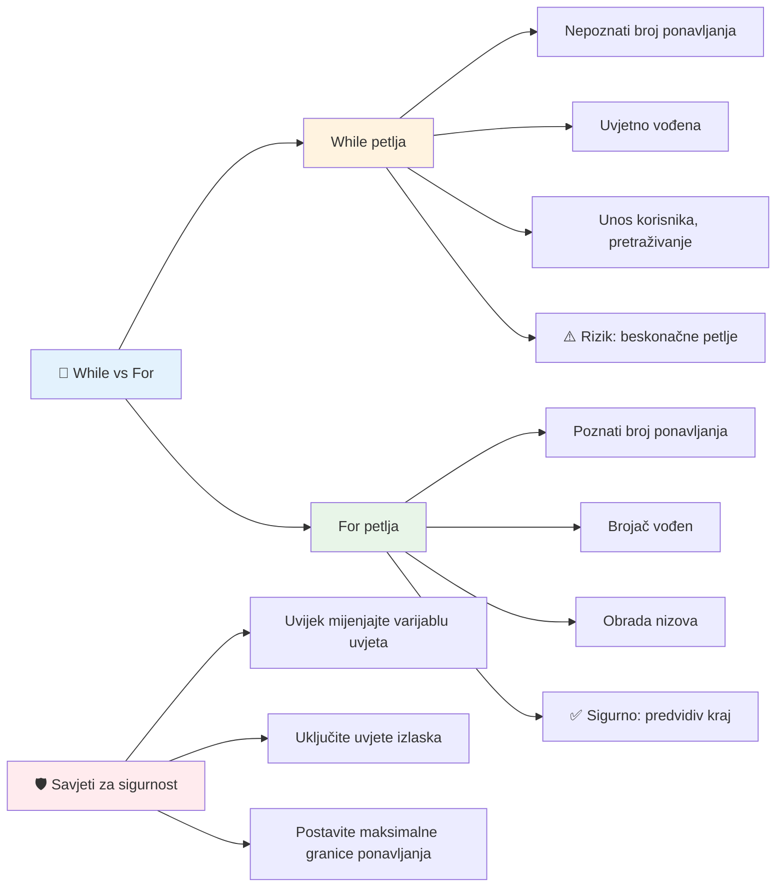
> **Sigurnost na prvom mjestu**: While petlje su moćne, ali zahtijevaju pažljivo upravljanje uvjetima. Uvijek osigurajte da će uvjet petlje na kraju postati neistinit!

### Moderni alternativni sintaksisi petlji

JavaScript nudi modernu sintaksu petlji koja može učiniti vaš kod čitljivijim i manje podložnim greškama.

**For...of petlja (ES6+):**

```javascript
const colors = ["red", "green", "blue", "yellow"];

// Moderan pristup - čišći i sigurniji
for (const color of colors) {
  console.log(`Color: ${color}`);
}

// Usporedi s tradicionalnom for petljom
for (let i = 0; i < colors.length; i++) {
  console.log(`Color: ${colors[i]}`);
}
```

**Ključne prednosti for...of:**
- **Uklanja** upravljanje indeksom i potencijalne pogreške u indeksiranju
- **Pruža** izravan pristup elementima niza
- **Poboljšava** čitljivost koda i smanjuje složenost sintakse

**Metoda forEach:**

```javascript
const prices = [9.99, 15.50, 22.75, 8.25];

// Korištenje forEach za funkcionalni stil programiranja
prices.forEach((price, index) => {
  console.log(`Item ${index + 1}: $${price.toFixed(2)}`);
});

// forEach s arrow funkcijama za jednostavne operacije
prices.forEach(price => console.log(`Price: $${price}`));
```

**Što trebate znati o forEach:**
- **Izvršava** funkciju za svaki element niza
- **Pruža** i vrijednost elementa i indeks kao parametre
- **Ne može** se zaustaviti ranije (za razliku od tradicionalnih petlji)
- **Vraća** undefined (ne stvara novi niz)

✅ Zašto biste odabrali for petlju umjesto while petlje? 17 tisuća gledatelja imalo je isto pitanje na StackOverflowu, a neka od mišljenja [mogla bi vam biti zanimljiva](https://stackoverflow.com/questions/39969145/while-loops-vs-for-loops-in-javascript).

### 🎨 **Provjera moderne sintakse petlji: Prihvatite ES6+**

**Procijenite svoje razumijevanje modernog JavaScripta:**
- Koje su prednosti `for...of` u odnosu na tradicionalne for petlje?
- Kada biste još uvijek mogli preferirati tradicionalne for petlje?
- Koja je razlika između `forEach` i `map`?

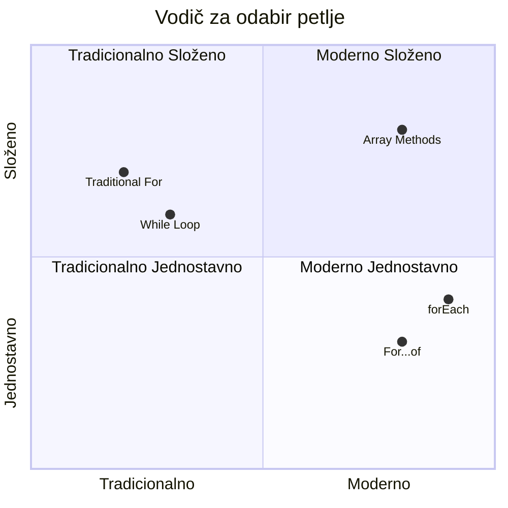
> **Moderni trend**: ES6+ sintaksa poput `for...of` i `forEach` postaje preferirani pristup za iteraciju nizova jer je čišća i manje sklona greškama!

## Petlje i nizovi

Kombiniranje nizova i petlji stvara snažne mogućnosti obrade podataka. Ovo je spoj temelj za mnoge programske zadatke, od prikaza lista do izračuna statistike.

**Tradicionalna obrada nizova:**

```javascript
const iceCreamFlavors = ["Chocolate", "Strawberry", "Vanilla", "Pistachio", "Rocky Road"];

// Klasični pristup for petlje
for (let i = 0; i < iceCreamFlavors.length; i++) {
  console.log(`Flavor ${i + 1}: ${iceCreamFlavors[i]}`);
}

// Moderni pristup for...of petlje
for (const flavor of iceCreamFlavors) {
  console.log(`Available flavor: ${flavor}`);
}
```

**Razumimo svaki pristup:**
- **Koristi** svojstvo duljine niza za određivanje granice petlje
- **Pristupa** elementima po indeksu u tradicionalnim for petljama
- **Pruža** izravan pristup elementima u for...of petljama
- **Obrađuje** svaki element niza točno jednom

**Praktični primjer obrade podataka:**

```javascript
const studentGrades = [85, 92, 78, 96, 88, 73, 89];
let total = 0;
let highestGrade = studentGrades[0];
let lowestGrade = studentGrades[0];

// Obradite sve ocjene jednom petljom
for (let i = 0; i < studentGrades.length; i++) {
  const grade = studentGrades[i];
  total += grade;
  
  if (grade > highestGrade) {
    highestGrade = grade;
  }
  
  if (grade < lowestGrade) {
    lowestGrade = grade;
  }
}

const average = total / studentGrades.length;
console.log(`Average: ${average.toFixed(1)}`);
console.log(`Highest: ${highestGrade}`);
console.log(`Lowest: ${lowestGrade}`);
```

**Evo kako ovaj kod radi:**
- **Inicijalizira** varijable za praćenje zbroja i ekstremnih vrijednosti
- **Obrađuje** svaki rezultat kroz jednu učinkovitu petlju
- **Akumulira** ukupno za izračun prosjeka
- **Prati** najviše i najniže vrijednosti tijekom iteracije
- **Izračunava** konačne statistike nakon završetka petlje

✅ Eksperimentirajte s petljanjem kroz niz koji ste sami napravili u konzoli vašeg preglednika.

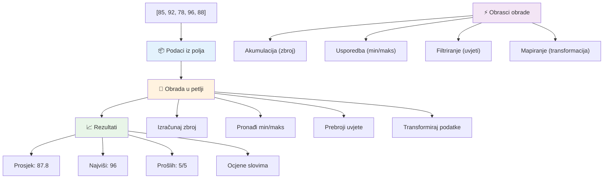
---

## Izazov GitHub Copilot Agenta 🚀

Koristite Agent mod za dovršetak sljedećeg izazova:

**Opis:** Izgradite sveobuhvatnu funkciju za obradu podataka koja kombinira nizove i petlje za analizu skupa podataka i generiranje smislenih uvida.

**Zadatak:** Kreirajte funkciju pod nazivom `analyzeGrades` koja prima niz objekata ocjena studenata (svaki s svojstvima ime i bodovi) i vraća objekt sa statistikama uključujući najvišu ocjenu, najnižu ocjenu, prosječnu ocjenu, broj studenata koji su prošli (bodovi >= 70) te niz imena studenata koji su ostvarili ocjenu iznad prosjeka. U rješenju koristite barem dvije različite vrste petlji.

Više o [agent modu](https://code.visualstudio.com/blogs/2025/02/24/introducing-copilot-agent-mode) saznajte ovdje.

## 🚀 Izazov
JavaScript nudi nekoliko modernih metoda za nizove koje mogu zamijeniti tradicionalne petlje za određene zadatke. Istražite [forEach](https://developer.mozilla.org/docs/Web/JavaScript/Reference/Global_Objects/Array/forEach), [for-of](https://developer.mozilla.org/docs/Web/JavaScript/Reference/Statements/for...of), [map](https://developer.mozilla.org/docs/Web/JavaScript/Reference/Global_Objects/Array/map), [filter](https://developer.mozilla.org/docs/Web/JavaScript/Reference/Global_Objects/Array/filter) i [reduce](https://developer.mozilla.org/docs/Web/JavaScript/Reference/Global_Objects/Array/reduce).

**Vaš izazov:** Prefaktorirajte primjer ocjena studenata koristeći barem tri različite metode niza. Primijetite koliko kod postaje čišći i čitljiviji s modernom JavaScript sintaksom.

## Post-Lecture Quiz
[Post-lecture quiz](https://ff-quizzes.netlify.app/web/quiz/14)


## Pregled i samostalno učenje

Nizovi u JavaScriptu imaju mnogo pridruženih metoda koje su iznimno korisne za manipulaciju podacima. [Pročitajte o tim metodama](https://developer.mozilla.org/docs/Web/JavaScript/Reference/Global_Objects/Array) i isprobajte neke od njih (kao što su push, pop, slice i splice) na nizu po vašem izboru.

## Zadatak

[Loop an Array](assignment.md)

---

## 📊 **Sažetak vašeg alata za nizove i petlje**

```mermaid
graph TD
    A["🎯 Majstorstvo nizova i petlji"] --> B["📦 Osnove nizova"]
    A --> C["🔄 Vrste petlji"]
    A --> D["🔗 Obrada podataka"]
    A --> E["🎨 Moderna tehnike"]
    
    B --> B1["Kreiranje: [ ]"]
    B --> B2["Indeksiranje: arr[0]"]
    B --> B3["Metode: push, pop"]
    B --> B4["Svojstva: length"]
    
    C --> C1["For: Poznate iteracije"]
    C --> C2["While: Na temelju uvjeta"]
    C --> C3["For...of: Izravan pristup"]
    C --> C4["forEach: Funkcionalno"]
    
    D --> D1["Izračun statistike"]
    D --> D2["Transformacija podataka"]
    D --> D3["Filtriranje i pretraživanje"]
    D --> D4["Obrada u stvarnom vremenu"]
    
    E --> E1["Arrow funkcije"]
    E --> E2["Lančanje metoda"]
    E --> E3["Destrukturiranje"]
    E --> E4["Predlošci niza"]
    
    F["💡 Ključne koristi"] --> F1["Učinkovito rukovanje podacima"]
    F --> F2["Smanjena ponavljanja koda"]
    F --> F3["Rješenja koja se skaliraju"]
    F --> F4["Čistija sintaksa"]
    
    style A fill:#e3f2fd
    style B fill:#e8f5e8
    style C fill:#fff3e0
    style D fill:#f3e5f5
    style E fill:#e0f2f1
    style F fill:#fce4ec
```
---

## 🚀 Vaš vremenski tijek savladavanja nizova i petlji

### ⚡ **Što možete napraviti u sljedećih 5 minuta**
- [ ] Kreirati niz omiljenih filmova i pristupiti određenim elementima
- [ ] Napisati for petlju koja broji od 1 do 10
- [ ] Isprobati izazov modernih metoda niza iz lekcije
- [ ] Vježbati indeksiranje nizova u konzoli preglednika

### 🎯 **Što možete postići u ovom satu**
- [ ] Završiti kviz nakon lekcije i pregledati teže koncepte
- [ ] Izgraditi opsežni analizator ocjena iz GitHub Copilot izazova
- [ ] Kreirati jednostavnu košaricu za kupovinu koja dodaje i uklanja stavke
- [ ] Vježbati pretvaranje između različitih tipova petlji
- [ ] Eksperimentirati s metodama niza kao što su `push`, `pop`, `slice` i `splice`

### 📅 **Vaše tjedno putovanje obradom podataka**
- [ ] Završiti zadatak "Loop an Array" s kreativnim poboljšanjima
- [ ] Izraditi aplikaciju lista zadataka koristeći nizove i petlje
- [ ] Kreirati jednostavan kalkulator statistike za numeričke podatke
- [ ] Vježbati s [MDN metodama nizova](https://developer.mozilla.org/docs/Web/JavaScript/Reference/Global_Objects/Array)
- [ ] Izraditi sučelje galerije slika ili glazbene liste
- [ ] Istražiti funkcionalno programiranje s `map`, `filter` i `reduce`

### 🌟 **Vaša mjesečna transformacija**
- [ ] Savladati napredne operacije nad nizovima i optimizaciju performansi
- [ ] Izgraditi kompletan nadzorni panel za vizualizaciju podataka
- [ ] Doprinijeti open source projektima vezanim uz obradu podataka
- [ ] Poučiti nekoga drugoga o nizovima i petljama s praktičnim primjerima
- [ ] Kreirati osobnu biblioteku za višekratnu upotrebu funkcija za obradu podataka
- [ ] Istražiti algoritme i strukture podataka temeljene na nizovima

### 🏆 **Završni pregled o vašem majstorstvu u obradi podataka**

**Proslavite svoje znanje o nizovima i petljama:**
- Koja vam je najkorisnija operacija nad nizovima za stvarne primjene?
- Koji vam tip petlje najviše "leži" i zašto?
- Kako je razumijevanje nizova i petlji promijenilo vaš pristup organizaciji podataka?
- Koji složen zadatak obrade podataka biste željeli sljedeći riješiti?

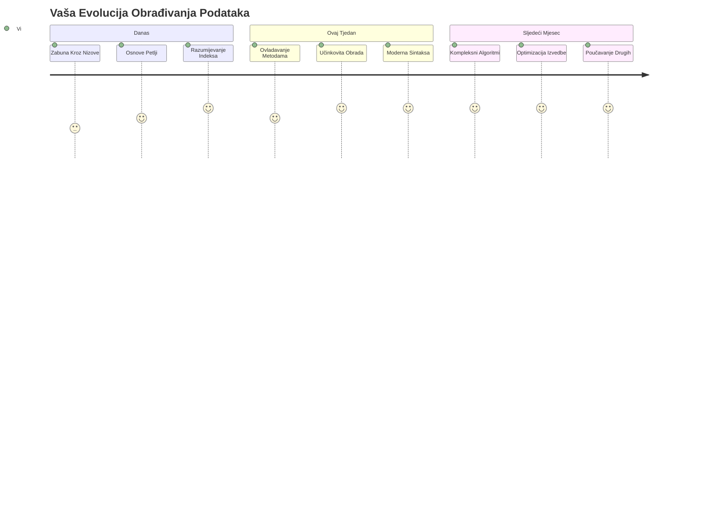
> 📦 **Otključali ste moć organizacije i obrade podataka!** Nizovi i petlje temelj su gotovo svake aplikacije koju ćete ikada izgraditi. Od jednostavnih lista do složene analize podataka, sada imate alate za učinkovito i elegantno rukovanje informacijama. Svaka dinamična web stranica, mobilna aplikacija i aplikacija vođena podacima oslanja se na ove osnovne koncepte. Dobrodošli u svijet skalabilne obrade podataka! 🎉

---

<!-- CO-OP TRANSLATOR DISCLAIMER START -->
**Odricanje od odgovornosti**:  
Ovaj je dokument preveden pomoću AI usluge za prijevod [Co-op Translator](https://github.com/Azure/co-op-translator). Iako težimo točnosti, imajte na umu da automatski prijevodi mogu sadržavati pogreške ili netočnosti. Izvorni dokument na izvornom jeziku treba smatrati autoritativnim izvorom. Za važne informacije preporučuje se profesionalni ljudski prijevod. Nismo odgovorni za bilo kakva nesporazuma ili pogrešna tumačenja koja proizlaze iz korištenja ovog prijevoda.
<!-- CO-OP TRANSLATOR DISCLAIMER END -->