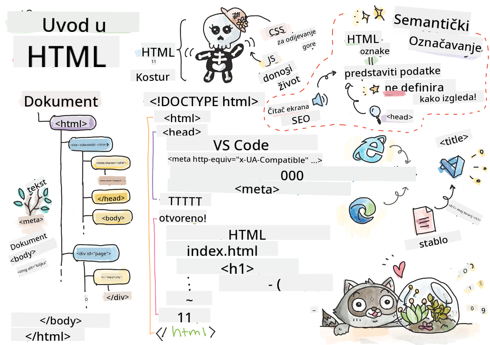
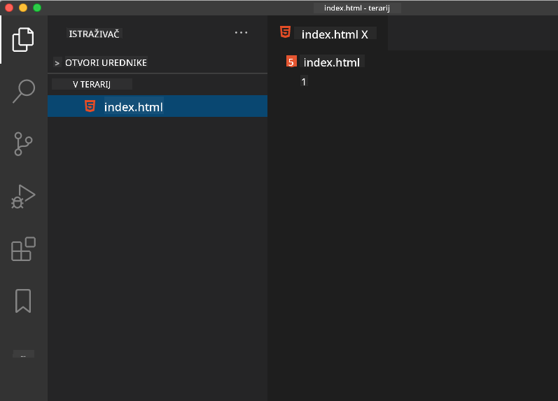

<!--
CO_OP_TRANSLATOR_METADATA:
{
  "original_hash": "46a0639e719b9cf1dfd062aa24cad639",
  "translation_date": "2025-08-27T22:45:42+00:00",
  "source_file": "3-terrarium/1-intro-to-html/README.md",
  "language_code": "hr"
}
-->
# Projekt Terarij, 1. dio: Uvod u HTML

  
> Sketchnote autorice [Tomomi Imura](https://twitter.com/girlie_mac)

## Kviz prije predavanja

[Kviz prije predavanja](https://ashy-river-0debb7803.1.azurestaticapps.net/quiz/15)

> Pogledajte video

> 
> [](https://www.youtube.com/watch?v=1TvxJKBzhyQ)

### Uvod

HTML, ili HyperText Markup Language, je 'kostur' weba. Ako CSS 'odijeva' vaš HTML, a JavaScript ga oživljava, HTML je tijelo vaše web aplikacije. Sintaksa HTML-a čak odražava tu ideju, jer uključuje oznake "head", "body" i "footer".

U ovoj lekciji koristit ćemo HTML za postavljanje 'kostura' sučelja našeg virtualnog terarija. Imat će naslov i tri stupca: desni i lijevi stupac gdje će se nalaziti biljke koje se mogu povlačiti, te središnje područje koje će predstavljati stakleni terarij. Do kraja ove lekcije moći ćete vidjeti biljke u stupcima, ali sučelje će izgledati pomalo čudno; ne brinite, u sljedećem dijelu dodat ćete CSS stilove kako bi sučelje izgledalo bolje.

### Zadatak

Na svom računalu stvorite mapu pod nazivom 'terrarium', a unutar nje datoteku pod nazivom 'index.html'. To možete učiniti u Visual Studio Codeu nakon što stvorite mapu terarija tako da otvorite novi prozor VS Codea, kliknete na 'open folder' i odete do svoje nove mape. Kliknite na mali gumb 'file' u Explorer panelu i stvorite novu datoteku:



Ili

Koristite ove naredbe u svom git bashu:  
* `mkdir terrarium`  
* `cd terrarium`  
* `touch index.html`  
* `code index.html` ili `nano index.html`

> Datoteke index.html označavaju pregledniku da je to zadana datoteka u mapi; URL-ovi poput `https://anysite.com/test` mogu biti izgrađeni pomoću strukture mapa koja uključuje mapu pod nazivom `test` s `index.html` unutar nje; `index.html` ne mora biti prikazan u URL-u.

---

## DocType i oznake html

Prvi redak HTML datoteke je njezin doctype. Pomalo je iznenađujuće da ovaj redak mora biti na samom vrhu datoteke, ali on govori starijim preglednicima da trebaju prikazati stranicu u standardnom načinu rada, slijedeći trenutnu HTML specifikaciju.

> Savjet: u VS Codeu možete prijeći mišem preko oznake i dobiti informacije o njezinoj upotrebi iz MDN referentnih vodiča.

Drugi redak trebao bi biti početna oznaka `<html>`, odmah praćena završnom oznakom `</html>`. Ove oznake su korijenski elementi vašeg sučelja.

### Zadatak

Dodajte ove retke na vrh svoje datoteke `index.html`:

```HTML
<!DOCTYPE html>
<html></html>
```

✅ Postoji nekoliko različitih načina rada koji se mogu odrediti postavljanjem DocTypea s upitnim nizom: [Quirks Mode i Standards Mode](https://developer.mozilla.org/docs/Web/HTML/Quirks_Mode_and_Standards_Mode). Ovi načini rada nekada su podržavali vrlo stare preglednike koji se danas rijetko koriste (Netscape Navigator 4 i Internet Explorer 5). Možete se držati standardne deklaracije doctypea.

---

## 'Head' dokumenta

Područje 'head' HTML dokumenta uključuje ključne informacije o vašoj web stranici, poznate i kao [metapodaci](https://developer.mozilla.org/docs/Web/HTML/Element/meta). U našem slučaju, serveru na koji će ova stranica biti poslana za prikazivanje, govorimo ove četiri stvari:

-   naslov stranice  
-   metapodaci stranice uključujući:  
    -   'character set', koji govori o tome koje kodiranje znakova se koristi na stranici  
    -   informacije o pregledniku, uključujući `x-ua-compatible` koji označava da je podržan preglednik IE=edge  
    -   informacije o tome kako bi se viewport trebao ponašati prilikom učitavanja. Postavljanje početne skale viewporta na 1 kontrolira razinu zumiranja kada se stranica prvi put učita.

### Zadatak

Dodajte blok 'head' u svoj dokument između početne i završne oznake `<html>`.

```html
<head>
	<title>Welcome to my Virtual Terrarium</title>
	<meta charset="utf-8" />
	<meta http-equiv="X-UA-Compatible" content="IE=edge" />
	<meta name="viewport" content="width=device-width, initial-scale=1" />
</head>
```

✅ Što bi se dogodilo ako biste postavili meta oznaku viewporta ovako: `<meta name="viewport" content="width=600">`? Pročitajte više o [viewportu](https://developer.mozilla.org/docs/Web/HTML/Viewport_meta_tag).

---

## `Body` dokumenta

### HTML oznake

U HTML-u dodajete oznake u svoju .html datoteku kako biste stvorili elemente web stranice. Svaka oznaka obično ima početnu i završnu oznaku, poput ove: `<p>hello</p>` za označavanje paragrafa. Stvorite tijelo svog sučelja dodavanjem skupa `<body>` oznaka unutar para `<html>` oznaka; vaš markup sada izgleda ovako:

### Zadatak

```html
<!DOCTYPE html>
<html>
	<head>
		<title>Welcome to my Virtual Terrarium</title>
		<meta charset="utf-8" />
		<meta http-equiv="X-UA-Compatible" content="IE=edge" />
		<meta name="viewport" content="width=device-width, initial-scale=1" />
	</head>
	<body></body>
</html>
```

Sada možete početi graditi svoju stranicu. Obično koristite `<div>` oznake za stvaranje odvojenih elemenata na stranici. Stvorit ćemo niz `<div>` elemenata koji će sadržavati slike.

### Slike

Jedna HTML oznaka koja ne treba završnu oznaku je `` oznaka, jer ima `src` element koji sadrži sve informacije potrebne za prikazivanje stavke na stranici.

Stvorite mapu u svojoj aplikaciji pod nazivom `images` i u nju dodajte sve slike iz [mape izvornog koda](../../../../3-terrarium/solution/images); (ima 14 slika biljaka).

### Zadatak

Dodajte te slike biljaka u dva stupca između oznaka `<body></body>`:

```html
<div id="page">
	<div id="left-container" class="container">
		<div class="plant-holder">
			
		</div>
		<div class="plant-holder">
			
		</div>
		<div class="plant-holder">
			
		</div>
		<div class="plant-holder">
			
		</div>
		<div class="plant-holder">
			
		</div>
		<div class="plant-holder">
			
		</div>
		<div class="plant-holder">
			
		</div>
	</div>
	<div id="right-container" class="container">
		<div class="plant-holder">
			
		</div>
		<div class="plant-holder">
			
		</div>
		<div class="plant-holder">
			
		</div>
		<div class="plant-holder">
			
		</div>
		<div class="plant-holder">
			
		</div>
		<div class="plant-holder">
			
		</div>
		<div class="plant-holder">
			
		</div>
	</div>
</div>
```

> Napomena: Spans vs. Divs. Divovi se smatraju 'blok' elementima, dok su Spans 'inline'. Što bi se dogodilo ako biste ove divove pretvorili u spanove?

S ovim markupom biljke se sada prikazuju na ekranu. Izgleda prilično loše, jer još nisu stilizirane pomoću CSS-a, a to ćemo učiniti u sljedećoj lekciji.

Svaka slika ima alt tekst koji će se pojaviti čak i ako ne možete vidjeti ili prikazati sliku. Ovo je važan atribut za uključivanje radi pristupačnosti. Saznajte više o pristupačnosti u budućim lekcijama; za sada zapamtite da alt atribut pruža alternativne informacije za sliku ako korisnik iz nekog razloga ne može vidjeti sliku (zbog sporog povezivanja, pogreške u src atributu ili ako korisnik koristi čitač ekrana).

✅ Jeste li primijetili da svaka slika ima isti alt tag? Je li to dobra praksa? Zašto ili zašto ne? Možete li poboljšati ovaj kod?

---

## Semantički markup

Općenito, poželjno je koristiti značajan 'semantički' markup prilikom pisanja HTML-a. Što to znači? To znači da koristite HTML oznake za predstavljanje vrste podataka ili interakcije za koje su dizajnirane. Na primjer, glavni naslov na stranici trebao bi koristiti oznaku `<h1>`.

Dodajte sljedeći redak odmah ispod svoje početne oznake `<body>`:

```html
<h1>My Terrarium</h1>
```

Korištenje semantičkog markupa, poput postavljanja naslova kao `<h1>` i navođenja neuređenih popisa kao `<ul>`, pomaže čitačima ekrana da se lakše kreću kroz stranicu. Općenito, gumbi bi trebali biti napisani kao `<button>`, a popisi kao `<li>`. Iako je _moguće_ koristiti posebno stilizirane `<span>` elemente s click handlerima za imitaciju gumba, bolje je za korisnike s invaliditetom da koriste tehnologije za određivanje gdje se na stranici nalazi gumb i za interakciju s njim, ako se element pojavljuje kao gumb. Iz tog razloga, pokušajte koristiti semantički markup što je više moguće.

✅ Pogledajte čitač ekrana i [kako on komunicira s web stranicom](https://www.youtube.com/watch?v=OUDV1gqs9GA). Možete li vidjeti zašto bi nesemantički markup mogao frustrirati korisnika?

## Terarij

Posljednji dio ovog sučelja uključuje stvaranje markupa koji će biti stiliziran kako bi stvorio terarij.

### Zadatak:

Dodajte ovaj markup iznad posljednje oznake `</div>`:

```html
<div id="terrarium">
	<div class="jar-top"></div>
	<div class="jar-walls">
		<div class="jar-glossy-long"></div>
		<div class="jar-glossy-short"></div>
	</div>
	<div class="dirt"></div>
	<div class="jar-bottom"></div>
</div>
```

✅ Iako ste dodali ovaj markup na ekran, apsolutno ništa se ne prikazuje. Zašto?

---

## 🚀Izazov

Postoje neki zanimljivi 'stariji' tagovi u HTML-u koji su još uvijek zabavni za isprobati, iako ne biste trebali koristiti zastarjele oznake poput [ovih oznaka](https://developer.mozilla.org/docs/Web/HTML/Element#Obsolete_and_deprecated_elements) u svom markupu. Ipak, možete li koristiti staru `<marquee>` oznaku kako biste naslov h1 pomicali horizontalno? (ako to učinite, ne zaboravite je kasnije ukloniti)

## Kviz nakon predavanja

[Kviz nakon predavanja](https://ashy-river-0debb7803.1.azurestaticapps.net/quiz/16)

## Pregled i samostalno učenje

HTML je 'provjereni i pouzdani' sustav gradnje koji je pomogao izgraditi web kakav danas poznajemo. Naučite malo o njegovoj povijesti proučavajući stare i nove oznake. Možete li shvatiti zašto su neke oznake zastarjele, a neke dodane? Koje bi oznake mogle biti uvedene u budućnosti?

Saznajte više o izradi stranica za web i mobilne uređaje na [Microsoft Learn](https://docs.microsoft.com/learn/modules/build-simple-website/?WT.mc_id=academic-77807-sagibbon).

## Zadatak

[Vježbajte svoj HTML: Izradite maketu bloga](assignment.md)

---

**Odricanje od odgovornosti**:  
Ovaj dokument je preveden pomoću AI usluge za prevođenje [Co-op Translator](https://github.com/Azure/co-op-translator). Iako nastojimo osigurati točnost, imajte na umu da automatski prijevodi mogu sadržavati pogreške ili netočnosti. Izvorni dokument na izvornom jeziku treba smatrati autoritativnim izvorom. Za ključne informacije preporučuje se profesionalni prijevod od strane ljudskog prevoditelja. Ne preuzimamo odgovornost za bilo kakva nesporazuma ili pogrešna tumačenja koja proizlaze iz korištenja ovog prijevoda.