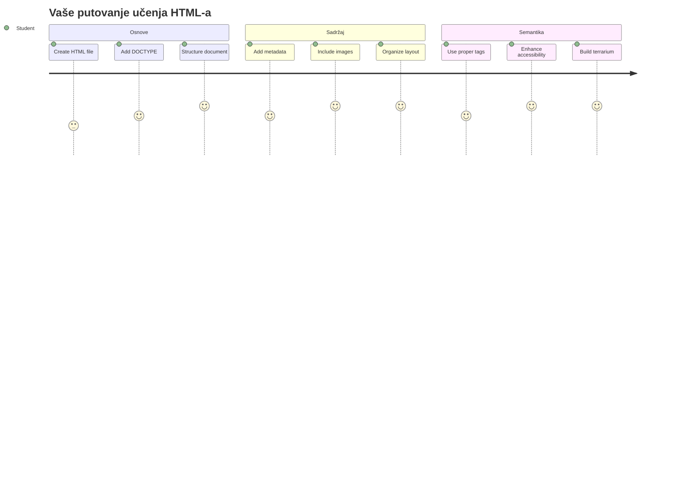
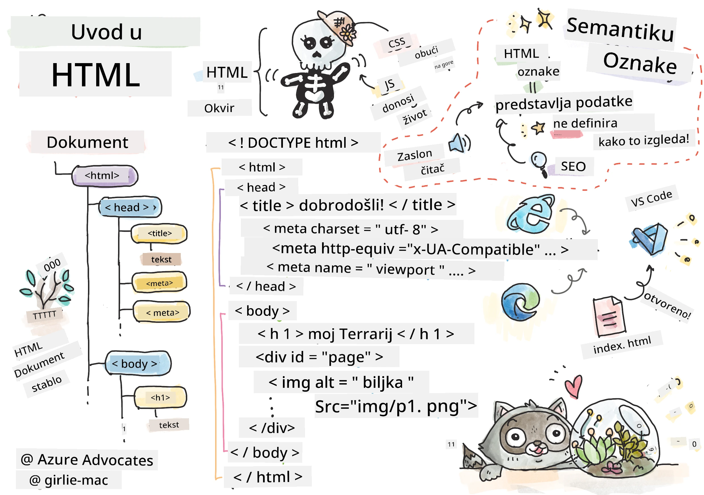
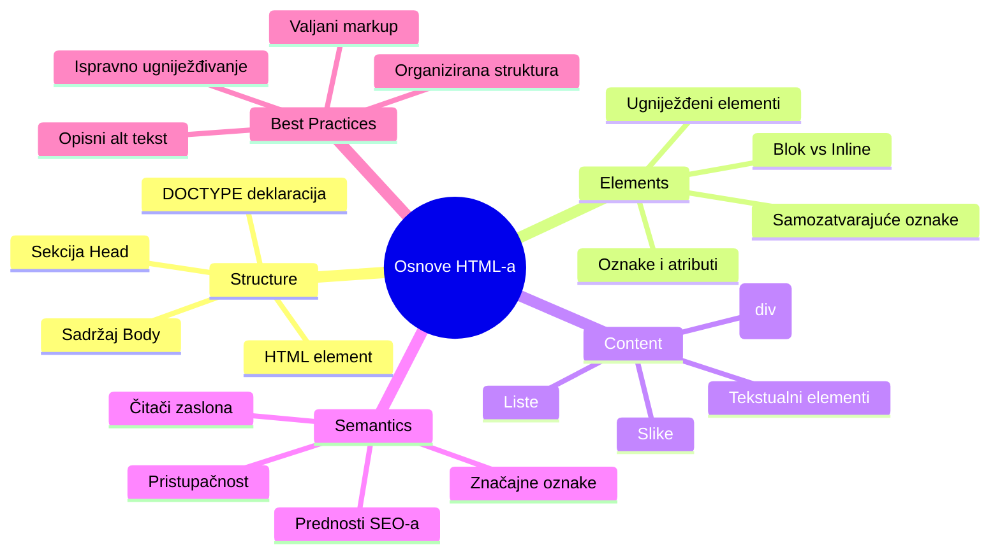
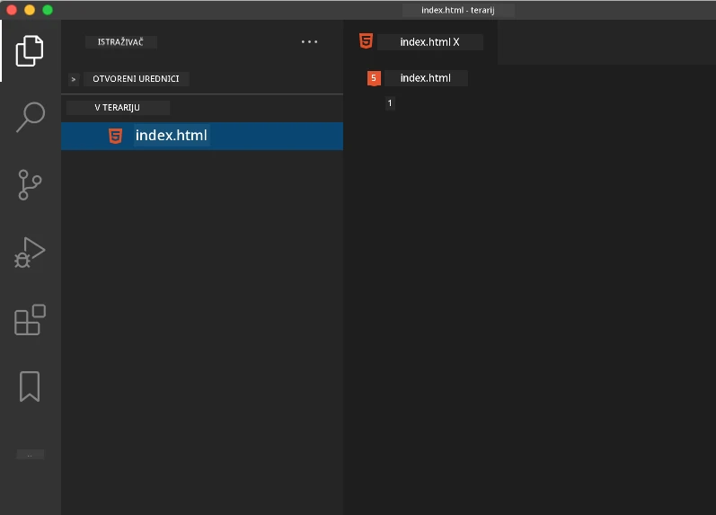
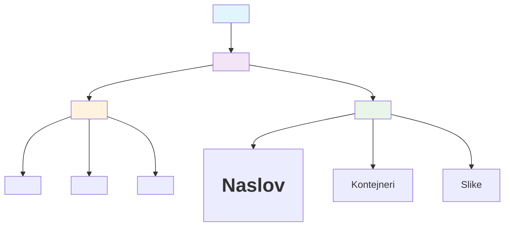
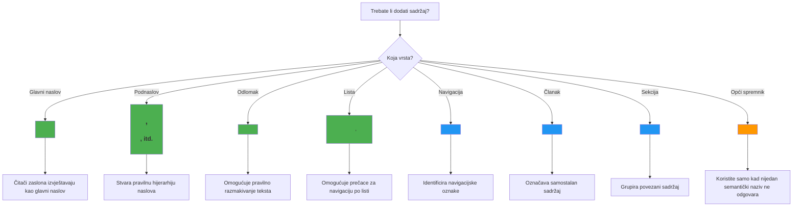
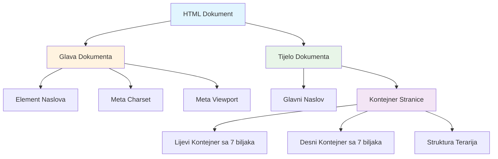
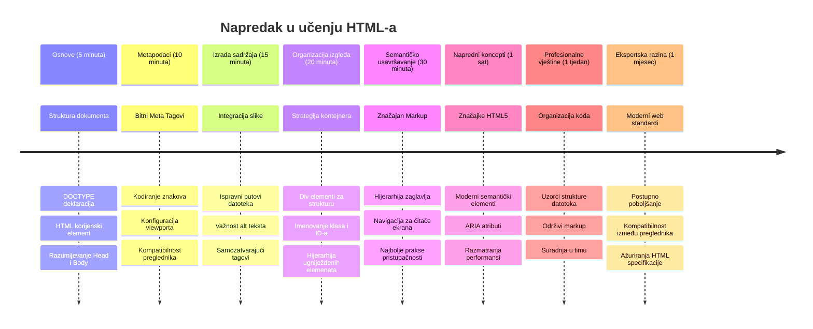

# Terrarium Projekt Dio 1: Uvod u HTML



> Sketchnote autora [Tomomi Imura](https://twitter.com/girlie_mac)

HTML, ili HyperText Markup Language, temelj je svake web stranice koju ste ikada posjetili. Zamislite HTML kao kostur koji daje strukturu web stranicama – on definira gdje sadržaj ide, kako je organiziran i što svaki dio predstavlja. Dok će CSS kasnije "ofarbati" vaš HTML bojama i rasporedima, a JavaScript će ga oživjeti interaktivnošću, HTML pruža osnovnu strukturu koja omogućuje sve ostalo.

U ovoj lekciji kreirat ćete HTML strukturu za sučelje virtualnog terarija. Ovaj praktični projekt naučit će vas osnovnim HTML pojmovima dok izrađujete nešto vizualno zanimljivo. Naučit ćete kako organizirati sadržaj pomoću semantičkih elemenata, raditi sa slikama i stvoriti osnovu za interaktivnu web aplikaciju.

Na kraju ove lekcije imat ćete funkcionalnu HTML stranicu koja prikazuje slike biljaka u organiziranim stupcima, spremnu za stiliziranje u sljedećoj lekciji. Ne brinite ako na početku izgleda jednostavno – upravo tako HTML treba izgledati prije nego što CSS doda vizualne detalje.


## Predpredavanje kviz

[Predpredavanje kviz](https://ff-quizzes.netlify.app/web/quiz/15)

> 📺 **Gledajte i učite**: Pogledajte ovaj korisni video pregled
> 
> [](https://www.youtube.com/watch?v=1TvxJKBzhyQ)

## Postavljanje Vašeg Projekta

Prije nego što zaronimo u HTML kod, postavimo ispravno radno okruženje za vaš terarij projekt. Izrada organizirane strukture datoteka od početka ključna je navika koja će vam dobro služiti tijekom cijelog vašeg web razvoja.

### Zadatak: Kreirajte Strukturu Vašeg Projekta

Napravit ćete posebnu mapu za vaš terarij projekt i dodati prvu HTML datoteku. Evo dva pristupa koja možete koristiti:

**Opcija 1: Korištenje Visual Studio Code**
1. Otvorite Visual Studio Code
2. Kliknite "File" → "Open Folder" ili koristite `Ctrl+K, Ctrl+O` (Windows/Linux) ili `Cmd+K, Cmd+O` (Mac)
3. Kreirajte novu mapu nazvanu `terrarium` i odaberite je
4. U Explorer panelu kliknite na ikonu "New File"
5. Nazovite svoju datoteku `index.html`



**Opcija 2: Korištenje naredbi u Terminalu**
```bash
mkdir terrarium
cd terrarium
touch index.html
code index.html
```

**Ovo su funkcije ovih naredbi:**
- **Kreira** novu mapu nazvanu `terrarium` za vaš projekt
- **Ulazi** u mapu terrarium 
- **Stvara** praznu datoteku `index.html`
- **Otvara** datoteku u Visual Studio Code za uređivanje

> 💡 **Savjet stručnjaka**: Naziv datoteke `index.html` je poseban u web razvoju. Kada netko posjeti web stranicu, preglednici automatski traže `index.html` kao zadanu stranicu za prikaz. To znači da URL poput `https://mysite.com/projects/` automatski prikazuje `index.html` datoteku iz mape `projects` bez potrebe da se ime datoteke navodi u URL-u.

## Razumijevanje Strukture HTML Dokumenta

Svaki HTML dokument slijedi specifičnu strukturu koju preglednici trebaju razumjeti kako bi ispravno prikazali stranicu. Zamislite ovu strukturu kao formalno pismo – ima obavezne elemente redoslijedom koji pomažu primatelju (u ovom slučaju pregledniku) da pravilno obradi sadržaj.


Započnimo dodavanjem osnovnog temelja koji svaki HTML dokument treba.

### DOCTYPE Izjava i Korijenski Element

Prve dvije linije bilo kojeg HTML fajla služe kao "uvod" dokumenta prema pregledniku:

```html
<!DOCTYPE html>
<html></html>
```

**Što ovaj kod radi:**
- **Deklarira** tip dokumenta kao HTML5 koristeći `<!DOCTYPE html>`
- **Kreira** korijenski `<html>` element koji će sadržavati sav sadržaj stranice
- **Uspostavlja** moderne web standarde za ispravan prikaz u preglednicima
- **Osigurava** dosljedan prikaz na različitim preglednicima i uređajima

> 💡 **VS Code Savjet**: Zadržite pokazivač iznad bilo kojeg HTML taga u VS Code da vidite korisne informacije iz MDN Web Docs, uključujući primjere upotrebe i detalje o kompatibilnosti preglednika.

> 📚 **Saznajte Više**: DOCTYPE izjava sprječava da preglednici ulaze u "quirks mode," što se koristilo za podršku vrlo starim web stranicama. Moderni web razvoj koristi jednostavnu `<!DOCTYPE html>` deklaraciju za osiguranje [standardski usklađenog prikaza](https://developer.mozilla.org/docs/Web/HTML/Quirks_Mode_and_Standards_Mode).

### 🔄 **Pedagoški Pregled**
**Pauzirajte i Razmislite**: Prije nego što nastavite, provjerite razumijete li:
- ✅ Zašto svaki HTML dokument treba DOCTYPE deklaraciju
- ✅ Što sadrži korijenski `<html>` element
- ✅ Kako ova struktura pomaže preglednicima da pravilno prikazuju stranice

**Brzi samoprovjera**: Možete li vlastitim riječima objasniti što znači "standardski usklađeni prikaz"?

## Dodavanje Bitnih Metapodataka Dokumenta

Sekcija `<head>` HTML dokumenta sadrži ključne informacije koje preglednici i tražilice trebaju, ali koje posjetitelji ne vide direktno na stranici. Zamislite je kao "iza kulisa" informacije koje pomažu vašoj stranici da ispravno radi i da se pravilno prikazuje na raznim uređajima i platformama.

Ovi metapodaci kažu preglednicima kako prikazati stranicu, koju kodnu stranicu koristiti i kako se nositi s različitim veličinama ekrana – sve što je ključno za izradu profesionalnih i pristupačnih web stranica.

### Zadatak: Dodajte Dokument Glavu

Umetnite ovaj `<head>` odjeljak između vaših otvarajućih i zatvarajućih `<html>` tagova:

```html
<head>
	<title>Welcome to my Virtual Terrarium</title>
	<meta charset="utf-8" />
	<meta http-equiv="X-UA-Compatible" content="IE=edge" />
	<meta name="viewport" content="width=device-width, initial-scale=1" />
</head>
```

**Razlaganje što svaki element radi:**
- **Postavlja** naslov stranice koji se prikazuje u karticama preglednika i rezultatima pretraživanja
- **Specifikira** UTF-8 kodiranje znakova za ispravan prikaz teksta širom svijeta
- **Osigurava** kompatibilnost s modernim verzijama Internet Explorera
- **Konfigurira** responzivni dizajn postavljanjem viewporta da prati širinu uređaja
- **Kontrolira** početni nivo zumiranja kako bi se sadržaj prikazao u prirodnoj veličini

> 🤔 **Razmislite o ovome**: Što bi se dogodilo ako postavite viewport meta tag ovako: `<meta name="viewport" content="width=600">`? Ovo bi prisililo stranicu da uvijek bude široka 600 piksela, čime se primjenjuje lom dizajna prilagođenog zaslonu! Više saznajte o [ispravnoj viewport konfiguraciji](https://developer.mozilla.org/docs/Web/HTML/Viewport_meta_tag).

## Izgradnja Tijela Dokumenta

Element `<body>` sadrži sav vidljivi sadržaj vaše web stranice – sve što korisnici vide i s čim mogu komunicirati. Dok je `<head>` dijelu davao upute pregledniku, sekcija `<body>` sadrži stvarni sadržaj: tekst, slike, gumbe i druge elemente koji stvaraju vaše korisničko sučelje.

Dodajmo tijelo stranice i razumijemo kako HTML tagovi rade zajedno da bi stvorili smisleni sadržaj.

### Razumijevanje Strukture HTML Tagova

HTML koristi uparene tagove za definiranje elemenata. Većina tagova ima otvarajući tag poput `<p>` i zatvarajući tag kao `</p>`, s sadržajem između: `<p>Zdravo, svijete!</p>`. Time se stvara paragraf koji sadrži tekst „Zdravo, svijete!“.

### Zadatak: Dodajte Element Body

Ažurirajte vašu HTML datoteku da uključite `<body>` element:

```html
<!DOCTYPE html>
<html>
	<head>
		<title>Welcome to my Virtual Terrarium</title>
		<meta charset="utf-8" />
		<meta http-equiv="X-UA-Compatible" content="IE=edge" />
		<meta name="viewport" content="width=device-width, initial-scale=1" />
	</head>
	<body></body>
</html>
```

**Evo što ova potpuna struktura pruža:**
- **Uspostavlja** osnovni HTML5 okvir dokumenta
- **Uključuje** bitne metapodatke za ispravan prikaz u preglednicima
- **Kreira** prazno tijelo spremno za vaš vidljivi sadržaj
- **Prati** najbolje prakse modernog web razvoja

Sada ste spremni dodati vidljive elemente svog terarija. Koristit ćemo `<div>` elemente kao kontejnere za organiziranje različitih dijelova sadržaja i `` elemente za prikaz slika biljaka.

### Rad sa Slikama i Kontejnerima za Raspored

Slike su posebne u HTML-u jer koriste "samozatvarajuće" tagove. Za razliku od elemenata poput `<p></p>` koji obavijaju sadržaj, `` tag sadrži sve potrebne informacije unutar tag-a pomoću atributa kao što su `src` za putanju slike i `alt` za pristupačnost.

Prije nego što dodate slike u HTML, trebate organizirati vaše projektne datoteke pravilno stvaranjem mape za slike i dodavanjem grafika biljaka.

**Prvo, postavite slike:**
1. Kreirajte mapu nazvanu `images` unutar vaše terarij projektne mape
2. Preuzmite slike biljaka iz [solution folder](../../../../3-terrarium/solution/images) (ukupno 14 slika biljaka)
3. Kopirajte sve slike biljaka u vašu novu `images` mapu

### Zadatak: Kreirajte Raspored Prikaza Biljaka

Sada dodajte slikovne prikaze biljaka organiziranih u dva stupca između vaših `<body></body>` tagova:

```html
<div id="page">
	<div id="left-container" class="container">
		<div class="plant-holder">
			
		</div>
		<div class="plant-holder">
			
		</div>
		<div class="plant-holder">
			
		</div>
		<div class="plant-holder">
			
		</div>
		<div class="plant-holder">
			
		</div>
		<div class="plant-holder">
			
		</div>
		<div class="plant-holder">
			
		</div>
	</div>
	<div id="right-container" class="container">
		<div class="plant-holder">
			
		</div>
		<div class="plant-holder">
			
		</div>
		<div class="plant-holder">
			
		</div>
		<div class="plant-holder">
			
		</div>
		<div class="plant-holder">
			
		</div>
		<div class="plant-holder">
			
		</div>
		<div class="plant-holder">
			
		</div>
	</div>
</div>
```

**Korak po korak, evo što se događa u ovom kodu:**
- **Kreira** glavni spremnik stranice s `id="page"` koji drži sav sadržaj
- **Uspostavlja** dva stupčasta spremnika: `left-container` i `right-container`
- **Organizira** 7 biljaka u lijevom stupcu i 7 biljaka u desnom stupcu
- **Obavija** svaku sliku biljke u `plant-holder` <div> za individualno pozicioniranje
- **Primjenjuje** dosljedne nazive klasa za CSS stiliziranje u sljedećoj lekciji
- **Dodjeljuje** jedinstvene ID-e svakoj slici biljke za JavaScript interakciju kasnije
- **Uključuje** ispravne putanje do mape sa slikama

> 🤔 **Razmislite o ovome**: Primijetite da sve slike trenutno imaju isti alt tekst "plant". Ovo nije idealno za pristupačnost. Korisnici sa čitačima zaslona bi čuli "plant" ponovljeno 14 puta bez znanja o kojoj biljci se radi. Možete li smisliti bolje, opisnije alt tekstove za svaku sliku?

> 📝 **Tipovi HTML Elemenata**: `<div>` elementi su "blok nivo" i zauzimaju punu širinu, dok su `<span>` elementi "inline" i zauzimaju samo potrebnu širinu. Što mislite što bi se dogodilo da sve ove `<div>` tagove promijenite u `<span>` tagove?

### 🔄 **Pedagoški Pregled**
**Razumijevanje Strukture**: Odvojite trenutak za pregled vaše HTML strukture:
- ✅ Možete li identificirati glavne kontejnere u vašem rasporedu?
- ✅ Razumijete li zašto svaka slika ima jedinstveni ID?
- ✅ Kako biste opisali svrhu `plant-holder` divova?

**Vizualna Inspekcija**: Otvorite vašu HTML datoteku u pregledniku. Trebali biste vidjeti:
- Osnovnu listu slika biljaka
- Slike organizirane u dva stupca
- Jednostavan, nestiliziran raspored

**Zapamtite**: Ovaj jednostavan izgled je upravo ono što HTML treba izgledati prije CSS stiliziranja!

S ovim dodanim markupom, biljke će se pojaviti na ekranu, iako još ne izgledaju dotjerano – za to služi CSS u sljedećoj lekciji! Za sada imate čvrst HTML temelj koji ispravno organizira vaš sadržaj i prati najbolje prakse pristupačnosti.

## Korištenje Semantičkog HTML-a za Pristupačnost

Semantički HTML znači odabir HTML elemenata na temelju njihovog značenja i svrhe, ne samo na temelju njihovog izgleda. Kada koristite semantički markup, komunicirate strukturu i značenje vašeg sadržaja preglednicima, tražilicama i asistivnim tehnologijama poput čitača zaslona.


Ovaj pristup čini vaše web stranice pristupačnijima korisnicima s invaliditetom i pomaže tražilicama da bolje razumiju vaš sadržaj. To je temeljno načelo modernog web razvoja koje stvara bolje doživljaje za sve.

### Dodavanje Semantičkog Naslova Stranice

Dodajmo ispravan naslov vašoj stranici terarija. Umetnite ovaj red odmah nakon otvarajućeg `<body>` taga:

```html
<h1>My Terrarium</h1>
```

**Zašto je semantički markup važan:**
- **Pomaže** čitačima zaslona navigirati i razumjeti strukturu stranice
- **Poboljšava** SEO (optimizaciju za tražilice) jasnoćom hijerarhije sadržaja
- **Unapređuje** pristupačnost korisnicima s oštećenjima vida ili kognitivnim razlikama
- **Stvara** bolje korisničke doživljaje na svim uređajima i platformama
- **Prati** web standarde i najbolje prakse za profesionalni razvoj

**Primjeri semantičkih vs. ne-semantčkih izbora:**

| Svrha | ✅ Semantički Izbor | ❌ Ne-semantički Izbor |
|---------|-------------------|------------------------|
| Glavni naslov | `<h1>Naslov</h1>` | `<div class="big-text">Naslov</div>` |
| Navigacija | `<nav><ul><li></li></ul></nav>` | `<div class="menu"><div></div></div>` |
| Gumb | `<button>Klikni me</button>` | `<span onclick="...">Klikni me</span>` |
| Sadržaj članka | `<article><p></p></article>` | `<div class="content"><div></div></div>` |

> 🎥 **Pogledajte u praksi**: Pogledajte [kako čitači zaslona komuniciraju s web stranicama](https://www.youtube.com/watch?v=OUDV1gqs9GA) da shvatite zašto je semantički markup ključan za pristupačnost. Primijetite kako pravilna HTML struktura pomaže korisnicima u efikasnoj navigaciji.

## Kreiranje Kontejnera Terarija

Sada dodajmo HTML strukturu za sam terarij – stakleni spremnik u koji će biljke na kraju biti postavljene. Ovaj odsjek pokazuje važan koncept: HTML pruža strukturu, ali bez CSS stiliziranja elementi još uvijek neće biti vidljivi.

Markup terarija koristi opisne nazive klasa koje će CSS stiliziranju u sljedećoj lekciji učiniti intuitivnim i održivim.

### Zadatak: Dodajte Strukturu Terarija

Umetnite ovaj markup iznad zadnjeg `</div>` taga (prije zatvarajućeg taga spremnika stranice):

```html
<div id="terrarium">
	<div class="jar-top"></div>
	<div class="jar-walls">
		<div class="jar-glossy-long"></div>
		<div class="jar-glossy-short"></div>
	</div>
	<div class="dirt"></div>
	<div class="jar-bottom"></div>
</div>
```

**Razumijevanje ove terarijske strukture:**
- **Kreira** glavni terarijski spremnik s jedinstvenim ID-em za stiliziranje
- **Definira** odvojene elemente za svaki vizualni dio (gornji dio, zidovi, zemlja, donji dio)
- **Uključuje** ugniježđene elemente za efekte odraza na staklu (sjajni elementi)
- **Koristi** opisne nazive klasa koje jasno označavaju svrhu svakog elementa
- **Priprema** strukturu za CSS stiliziranje koje će stvoriti izgled staklenog terarija

> 🤔 **Primjećujete li nešto?**: Iako ste dodali ovaj markup, ne vidite ništa novo na stranici! Ovo savršeno ilustrira kako HTML pruža strukturu, dok CSS pruža izgled. Ovi `<div>` elementi postoje, ali još nemaju vizualno stiliziranje – to dolazi u sljedećoj lekciji!


### 🔄 **Pedagoška provjera**
**Savladavanje HTML strukture**: Prije nego krenete dalje, osigurajte da možete:
- ✅ Objasniti razliku između HTML strukture i vizualnog izgleda
- ✅ Prepoznati semantičke i nesemantičke HTML elemente
- ✅ Opišite kako ispravna oznaka koristi pristupačnosti
- ✅ Prepoznati kompletnu strukturu stabla dokumenta

**Testiranje vašeg razumijevanja**: Probajte otvoriti vaš HTML fajl u pregledniku s onemogućenim Javaskriptom i uklonjenim CSS-om. Ovo vam pokazuje čistu semantičku strukturu koju ste napravili!

---

## Izazov za GitHub Copilot Agenta

Koristite Agent način rada da dovršite sljedeći izazov:

**Opis:** Izradite semantičku HTML strukturu za odjeljak vodiča za njegu biljaka koju biste mogli dodati projektu terarija.

**Zadatak:** Izradite semantički HTML odjeljak koji uključuje glavni naslov "Vodič za njegu biljaka", tri pododjeljka s naslovima "Zalijevanje", "Zahtjevi za svjetlom" i "Njega tla", svaki sa stilom paragrafa koji sadrži informacije o njezi biljaka. Upotrijebite ispravne semantičke HTML oznake poput `<section>`, `<h2>`, `<h3>`, i `<p>` za odgovarajuću strukturu sadržaja.

Više o [agent načinu](https://code.visualstudio.com/blogs/2025/02/24/introducing-copilot-agent-mode) saznajte ovdje.

## Izazov istraživanja povijesti HTML-a

**Učenje o evoluciji weba**

HTML se značajno razvio otkad je Tim Berners-Lee 1990. godine na CERN-u stvorio prvi web preglednik. Neki stariji tagovi poput `<marquee>` sada su zastarjeli jer ne funkcioniraju dobro s modernim standardima pristupačnosti i načelima responzivnog dizajna.

**Isprobajte ovaj eksperiment:**
1. Privremeno omotajte vaš `<h1>` naslov u `<marquee>` tag: `<marquee><h1>Moj terarij</h1></marquee>`
2. Otvorite svoju stranicu u pregledniku i promatrajte efekt pomicanja
3. Razmislite zašto je ovaj tag ukinut (nagovještaj: razmislite o korisničkom iskustvu i pristupačnosti)
4. Uklonite `<marquee>` tag i vratite se na semantički markup

**Pitanja za razmišljanje:**
- Kako bi pomični naslov mogao utjecati na korisnike s oštećenjima vida ili osjetljivošću na pokret?
- Koje suvremene CSS tehnike mogu postići slične vizualne efekte na pristupačniji način?
- Zašto je važno koristiti trenutne web standarde umjesto zastarjelih elemenata?

Istražite više o [zastarjelim i ukinutim HTML elementima](https://developer.mozilla.org/docs/Web/HTML/Element#Obsolete_and_deprecated_elements) da razumijete kako se web standardi razvijaju za poboljšanje korisničkog iskustva.

## Kviz nakon predavanja

[Kviz nakon predavanja](https://ff-quizzes.netlify.app/web/quiz/16)

## Pregled i samostalno učenje

**Produbite svoje HTML znanje**

HTML je temelj weba više od 30 godina, razvijajući se od jednostavnog jezika označavanja dokumenata do sofisticirane platforme za izgradnju interaktivnih aplikacija. Razumijevanje ove evolucije pomaže vam cijeniti moderne web standarde i donositi bolje razvojne odluke.

**Preporučeni putovi učenja:**

1. **Povijest i razvoj HTML-a**
   - Istražite vremenski slijed od HTML 1.0 do HTML5
   - Saznajte zašto su određeni tagovi ukinuti (pristupačnost, prilagođenost mobilnim uređajima, održivost)
   - Istražite nove HTML značajke i prijedloge

2. **Dubinsko razumijevanje semantičkog HTML-a**
   - Proučite cjeloviti popis [semantičkih elemenata HTML5](https://developer.mozilla.org/docs/Web/HTML/Element)
   - Vježbajte prepoznavanje kada koristiti `<article>`, `<section>`, `<aside>`, i `<main>`
   - Naučite o ARIA atributima za poboljšanu pristupačnost

3. **Moderni web razvoj**
   - Istražite [izgradnju responzivnih web stranica](https://docs.microsoft.com/learn/modules/build-simple-website/?WT.mc_id=academic-77807-sagibbon) na Microsoft Learn
   - Razumite kako HTML integrira s CSS-om i Javaskriptom
   - Naučite o web performansama i najboljim SEO praksama

**Pitanja za razmišljanje:**
- Koje ste zastarjele HTML tagove otkrili i zašto su uklonjeni?
- Koje se nove HTML značajke predlažu za buduće verzije?
- Kako semantički HTML pridonosi pristupačnosti weba i SEO-u?

### ⚡ **Što možete učiniti u sljedećih 5 minuta**
- [ ] Otvorite DevTools (F12) i pregledajte HTML strukturu vaše omiljene web stranice
- [ ] Izradite jednostavnu HTML datoteku s osnovnim tagovima: `<h1>`, `<p>`, i ``
- [ ] Validirajte svoj HTML koristeći W3C HTML Validator online
- [ ] Pokušajte dodati komentar u svoj HTML pomoću `<!-- komentar -->`

### 🎯 **Što možete postići u ovom satu**
- [ ] Dovršite kviz nakon lekcije i pregledajte koncepte semantičkog HTML-a
- [ ] Izradite jednostavnu web stranicu o sebi koristeći ispravnu HTML strukturu
- [ ] Eksperimentirajte s različitim razinama naslova i oznakama za oblikovanje teksta
- [ ] Dodajte slike i poveznice za vježbanje multimedijske integracije
- [ ] Istražite HTML5 značajke koje još niste isprobali

### 📅 **Vaše tjedno učenje HTML-a**
- [ ] Dovršite zadatak projekta terarija sa semantičkim markupom
- [ ] Izradite pristupačnu web stranicu koristeći ARIA oznake i uloge
- [ ] Vježbajte izradu obrazaca s različitim vrstama unosa
- [ ] Istražite HTML5 API-je poput localStorage ili geolocation
- [ ] Proučite responzivne HTML obrasce i dizajn usmjeren na mobilne uređaje
- [ ] Pregledajte HTML kod drugih developera za najbolje prakse

### 🌟 **Vaš mjesečni temelj weba**
- [ ] Izradite portfelj web stranicu koja prikazuje vaše HTML vještine
- [ ] Naučite HTML templating s frameworkom poput Handlebars
- [ ] Sudjelujte u open source projektima poboljšavajući HTML dokumentaciju
- [ ] Savladajte napredne HTML koncepte poput prilagođenih elemenata
- [ ] Integrirajte HTML s CSS frameworkom i Javaskript bibliotekama
- [ ] Mentorirajte druge koji uče osnove HTML-a

## 🎯 Vaš vremenski plan za savladavanje HTML-a


### 🛠️ Sažetak vašeg HTML alata

Nakon završetka ove lekcije, sada imate:
- **Strukturu dokumenta**: Potpun temelj HTML5 s ispravnim DOCTYPE-om
- **Semantički markup**: Smisleni tagovi koji poboljšavaju pristupačnost i SEO
- **Integraciju slika**: Ispravnu organizaciju datoteka i praksu alt teksta
- **Kontejnere za izgled**: Stratešku upotrebu divova s opisnim nazivima klasa
- **Svijest o pristupačnosti**: Razumijevanje navigacije pomoću čitača zaslona
- **Moderne standarde**: Trenutne HTML5 prakse i znanje o zastarjelim tagovima
- **Temelj za projekt**: Čvrst temelj za CSS stiliziranje i JavaScript interaktivnost

**Sljedeći koraci**: Vaša HTML struktura je spremna za CSS stiliziranje! Semantički temelj koji ste izgradili olakšat će razumijevanje sljedeće lekcije.

## Zadatak

[Vježbajte HTML: Izradite maketu bloga](assignment.md)

---

<!-- CO-OP TRANSLATOR DISCLAIMER START -->
**Odricanje od odgovornosti**:
Ovaj je dokument preveden pomoću AI usluge za prevođenje [Co-op Translator](https://github.com/Azure/co-op-translator). Iako težimo točnosti, imajte na umu da automatski prijevodi mogu sadržavati pogreške ili netočnosti. Izvorni dokument na izvornom jeziku treba smatrati službenim i autoritativnim izvorom. Za ključne informacije preporučuje se stručni ljudski prijevod. Ne snosimo odgovornost za bilo kakve nesporazume ili pogrešne interpretacije koje proizlaze iz korištenja ovog prijevoda.
<!-- CO-OP TRANSLATOR DISCLAIMER END -->