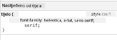
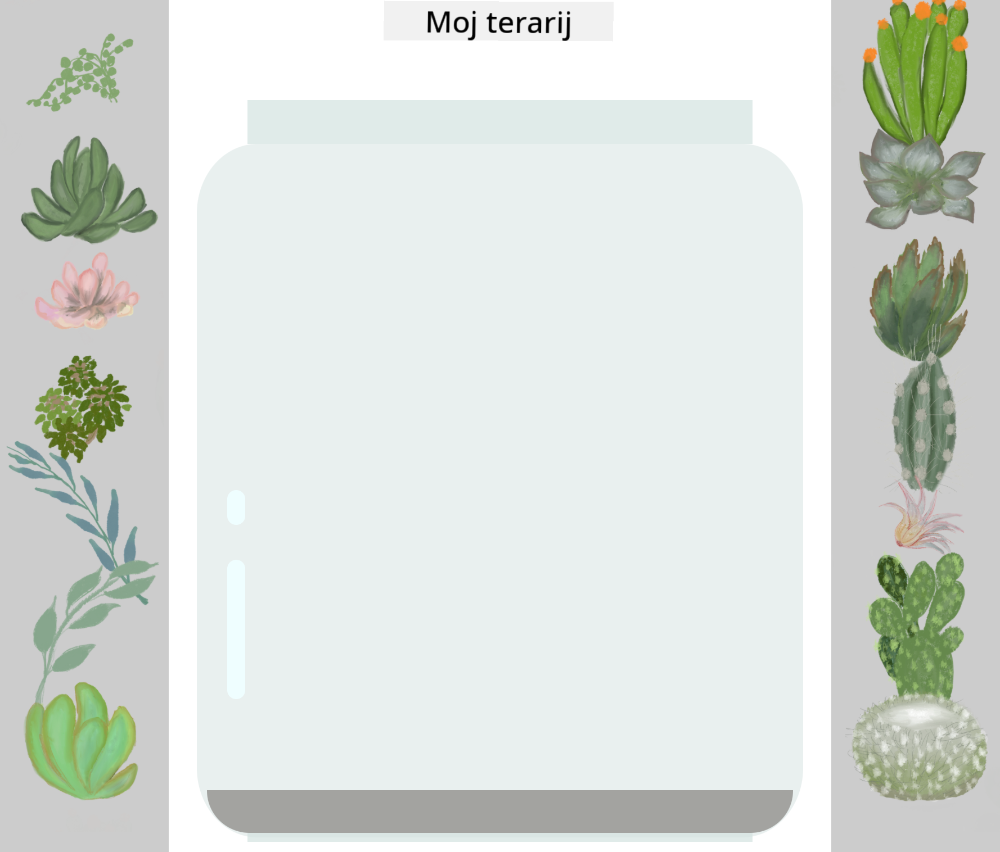

<!--
CO_OP_TRANSLATOR_METADATA:
{
  "original_hash": "92c4431eac70670b0450b02c1d11279a",
  "translation_date": "2025-10-25T00:02:12+00:00",
  "source_file": "3-terrarium/2-intro-to-css/README.md",
  "language_code": "hr"
}
-->
# Projekt terarija, 2. dio: Uvod u CSS


> Sketchnote autorice [Tomomi Imura](https://twitter.com/girlie_mac)

Sjećate li se kako je vaš HTML terarij izgledao prilično osnovno? CSS je ono što tu jednostavnu strukturu pretvara u nešto vizualno privlačno.

Ako je HTML poput izgradnje okvira kuće, onda je CSS sve ono što kuću čini domom - boje zidova, raspored namještaja, osvjetljenje i kako se prostorije međusobno povezuju. Zamislite kako je palača Versailles započela kao jednostavna lovačka kuća, ali pažljivim uređenjem i rasporedom postala jedno od najveličanstvenijih građevina na svijetu.

Danas ćemo vaš terarij transformirati iz funkcionalnog u dotjeran. Naučit ćete kako precizno pozicionirati elemente, prilagoditi raspored različitim veličinama ekrana i stvoriti vizualnu privlačnost koja čini web stranice zanimljivima.

Do kraja ovog predavanja vidjet ćete kako strateško stiliziranje pomoću CSS-a može dramatično poboljšati vaš projekt. Dodajmo malo stila vašem terariju.

## Kviz prije predavanja

[Kviz prije predavanja](https://ff-quizzes.netlify.app/web/quiz/17)

## Početak rada s CSS-om

CSS se često smatra samo načinom "uljepšavanja stvari", ali njegova svrha je mnogo šira. CSS je poput redatelja filma - kontrolirate ne samo kako sve izgleda, već i kako se kreće, reagira na interakciju i prilagođava različitim situacijama.

Moderni CSS je izuzetno sposoban. Možete pisati kod koji automatski prilagođava raspored za telefone, tablete i stolna računala. Možete stvoriti glatke animacije koje usmjeravaju pažnju korisnika gdje je potrebno. Rezultati mogu biti prilično impresivni kada sve funkcionira zajedno.

> 💡 **Savjet profesionalca**: CSS se stalno razvija s novim značajkama i mogućnostima. Uvijek provjerite [CanIUse.com](https://caniuse.com) kako biste provjerili podršku preglednika za novije CSS značajke prije nego ih upotrijebite u produkcijskim projektima.

**Evo što ćemo postići u ovom predavanju:**
- **Stvoriti** kompletan vizualni dizajn za vaš terarij koristeći moderne CSS tehnike
- **Istražiti** osnovne koncepte poput kaskade, nasljeđivanja i CSS selektora
- **Implementirati** strategije za responzivno pozicioniranje i raspored
- **Izgraditi** spremnik terarija koristeći CSS oblike i stiliziranje

### Preduvjet

Trebali biste završiti HTML strukturu za vaš terarij iz prethodnog predavanja i imati je spremnu za stiliziranje.

> 📺 **Video resurs**: Pogledajte ovaj koristan video vodič
>
> [](https://www.youtube.com/watch?v=6yIdOIV9p1I)

### Postavljanje vaše CSS datoteke

Prije nego što počnemo sa stiliziranjem, moramo povezati CSS s našim HTML-om. Ova poveznica govori pregledniku gdje pronaći upute za stiliziranje našeg terarija.

U mapi vašeg terarija, stvorite novu datoteku pod nazivom `style.css`, a zatim je povežite u odjeljku `<head>` vašeg HTML dokumenta:

```html
<link rel="stylesheet" href="./style.css" />
```

**Evo što ovaj kod radi:**
- **Stvara** vezu između vaših HTML i CSS datoteka
- **Govori** pregledniku da učita i primijeni stilove iz `style.css`
- **Koristi** atribut `rel="stylesheet"` kako bi naznačio da je ovo CSS datoteka
- **Referencira** putanju datoteke s `href="./style.css"`

## Razumijevanje CSS kaskade

Jeste li se ikada pitali zašto se CSS naziva "kaskadni" stilovi? Stilovi se spuštaju poput vodopada, a ponekad dolazi do sukoba među njima.

Razmislite o tome kako funkcioniraju vojne zapovjedne strukture - opća naredba može reći "svi vojnici nose zelenu uniformu", ali specifična naredba za vašu jedinicu može reći "nosite plave svečane uniforme za ceremoniju". Specifičnija uputa ima prednost. CSS slijedi sličnu logiku, a razumijevanje ove hijerarhije čini otklanjanje grešaka mnogo lakšim.

### Eksperimentiranje s prioritetom kaskade

Pogledajmo kaskadu u praksi stvaranjem sukoba u stilovima. Prvo dodajte inline stil svom `<h1>` tagu:

```html
<h1 style="color: red">My Terrarium</h1>
```

**Što ovaj kod radi:**
- **Primjenjuje** crvenu boju izravno na `<h1>` element koristeći inline stiliziranje
- **Koristi** atribut `style` za ugrađivanje CSS-a izravno u HTML
- **Stvara** pravilo stila najvišeg prioriteta za ovaj specifični element

Zatim dodajte ovo pravilo u svoju `style.css` datoteku:

```css
h1 {
  color: blue;
}
```

**U gore navedenom, mi smo:**
- **Definirali** CSS pravilo koje cilja sve `<h1>` elemente
- **Postavili** boju teksta na plavu koristeći vanjsku stilsku datoteku
- **Stvorili** pravilo nižeg prioriteta u usporedbi s inline stilovima

✅ **Provjera znanja**: Koja boja se prikazuje u vašoj web aplikaciji? Zašto ta boja pobjeđuje? Možete li zamisliti scenarije u kojima biste željeli nadjačati stilove?

> 💡 **Redoslijed prioriteta CSS-a (od najvišeg do najnižeg):**
> 1. **Inline stilovi** (atribut style)
> 2. **ID-ovi** (#myId)
> 3. **Klase** (.myClass) i atributi
> 4. **Selektori elemenata** (h1, div, p)
> 5. **Zadane postavke preglednika**

## CSS nasljeđivanje u praksi

CSS nasljeđivanje funkcionira poput genetike - elementi nasljeđuju određena svojstva od svojih roditeljskih elemenata. Ako postavite obitelj fontova na elementu body, sav tekst unutar njega automatski koristi isti font. To je slično tome kako se prepoznatljiva čeljust obitelji Habsburg pojavila kroz generacije bez da je bila specificirana za svakog pojedinca.

Međutim, ne nasljeđuje se sve. Tekstualni stilovi poput fontova i boja se nasljeđuju, ali svojstva rasporeda poput margina i obruba ne. Kao što djeca mogu naslijediti fizičke osobine, ali ne i modni ukus svojih roditelja.

### Promatranje nasljeđivanja fonta

Pogledajmo nasljeđivanje u praksi postavljanjem obitelji fontova na elementu `<body>`:

```css
body {
  font-family: 'Segoe UI', Tahoma, Geneva, Verdana, sans-serif;
}
```

**Razlaganje onoga što se ovdje događa:**
- **Postavlja** obitelj fontova za cijelu stranicu ciljanjem elementa `<body>`
- **Koristi** font stack s rezervnim opcijama za bolju kompatibilnost preglednika
- **Primjenjuje** moderne sistemske fontove koji izgledaju odlično na različitim operativnim sustavima
- **Osigurava** da svi podređeni elementi nasljeđuju ovaj font osim ako nije posebno nadjačan

Otvorite alate za razvoj preglednika (F12), idite na karticu Elements i pregledajte svoj `<h1>` element. Vidjet ćete da nasljeđuje obitelj fontova od body elementa:



✅ **Vrijeme za eksperimentiranje**: Pokušajte postaviti druga nasljedna svojstva na `<body>` poput `color`, `line-height` ili `text-align`. Što se događa s vašim naslovom i ostalim elementima?

> 📝 **Nasljedna svojstva uključuju**: `color`, `font-family`, `font-size`, `line-height`, `text-align`, `visibility`
>
> **Svojstva koja se ne nasljeđuju uključuju**: `margin`, `padding`, `border`, `width`, `height`, `position`

## Ovladavanje CSS selektorima

CSS selektori su vaš način ciljanog stiliziranja specifičnih elemenata. Oni funkcioniraju poput davanja preciznih uputa - umjesto da kažete "kuća", možete reći "plava kuća s crvenim vratima na ulici Maple".

CSS pruža različite načine za precizno ciljanje, a odabir pravog selektora je poput odabira odgovarajućeg alata za zadatak. Ponekad trebate stilizirati svaka vrata u susjedstvu, a ponekad samo jedna specifična vrata.

### Selektori elemenata (tagovi)

Selektori elemenata ciljaju HTML elemente prema njihovom nazivu taga. Savršeni su za postavljanje osnovnih stilova koji se široko primjenjuju na vašoj stranici:

```css
body {
  font-family: 'Segoe UI', Tahoma, Geneva, Verdana, sans-serif;
  margin: 0;
  padding: 0;
}

h1 {
  color: #3a241d;
  text-align: center;
  font-size: 2.5rem;
  margin-bottom: 1rem;
}
```

**Razumijevanje ovih stilova:**
- **Postavlja** dosljednu tipografiju na cijeloj stranici pomoću selektora `body`
- **Uklanja** zadane margine i padding preglednika za bolju kontrolu
- **Stilizira** sve elemente naslova bojom, poravnanjem i razmakom
- **Koristi** `rem` jedinice za skalabilno, pristupačno određivanje veličine fonta

Iako selektori elemenata dobro funkcioniraju za opće stiliziranje, trebat će vam specifičniji selektori za stiliziranje pojedinačnih komponenti poput biljaka u vašem terariju.

### ID selektori za jedinstvene elemente

ID selektori koriste simbol `#` i ciljaju elemente s određenim atributima `id`. Budući da ID-ovi moraju biti jedinstveni na stranici, savršeni su za stiliziranje pojedinačnih, posebnih elemenata poput naših lijevih i desnih spremnika za biljke.

Napravimo stilizaciju za bočne spremnike našeg terarija gdje će biljke biti smještene:

```css
#left-container {
  background-color: #f5f5f5;
  width: 15%;
  left: 0;
  top: 0;
  position: absolute;
  height: 100vh;
  padding: 1rem;
  box-sizing: border-box;
}

#right-container {
  background-color: #f5f5f5;
  width: 15%;
  right: 0;
  top: 0;
  position: absolute;
  height: 100vh;
  padding: 1rem;
  box-sizing: border-box;
}
```

**Evo što ovaj kod postiže:**
- **Pozicionira** spremnike na krajnje lijeve i desne rubove koristeći `absolute` pozicioniranje
- **Koristi** jedinice `vh` (visina prikaznog prozora) za responzivnu visinu koja se prilagođava veličini ekrana
- **Primjenjuje** `box-sizing: border-box` kako bi padding bio uključen u ukupnu širinu
- **Uklanja** nepotrebne `px` jedinice iz vrijednosti nula za čišći kod
- **Postavlja** suptilnu boju pozadine koja je ugodnija za oči od oštro sive

✅ **Izazov kvalitete koda**: Primijetite kako ovaj CSS krši princip DRY (Don't Repeat Yourself). Možete li ga preoblikovati koristeći i ID i klasu?

**Poboljšani pristup:**
```html
<div id="left-container" class="container"></div>
<div id="right-container" class="container"></div>
```

```css
.container {
  background-color: #f5f5f5;
  width: 15%;
  top: 0;
  position: absolute;
  height: 100vh;
  padding: 1rem;
  box-sizing: border-box;
}

#left-container {
  left: 0;
}

#right-container {
  right: 0;
}
```

### Selektori klasa za višekratne stilove

Selektori klasa koriste simbol `.` i savršeni su kada želite primijeniti iste stilove na više elemenata. Za razliku od ID-ova, klase se mogu ponovno koristiti u cijelom vašem HTML-u, što ih čini idealnim za dosljedne stilizacijske uzorke.

U našem terariju, svaka biljka treba sličnu stilizaciju, ali i individualno pozicioniranje. Koristit ćemo kombinaciju klasa za zajedničke stilove i ID-ova za jedinstveno pozicioniranje.

**Evo strukture HTML-a za svaku biljku:**
```html
<div class="plant-holder">
  
</div>
```

**Ključni elementi objašnjeni:**
- **Koristi** `class="plant-holder"` za dosljednu stilizaciju spremnika za sve biljke
- **Primjenjuje** `class="plant"` za zajedničko stiliziranje i ponašanje slike
- **Uključuje** jedinstveni `id="plant1"` za individualno pozicioniranje i interakciju putem JavaScripta
- **Pruža** opisni alt tekst za pristupačnost čitačima ekrana

Sada dodajte ove stilove u svoju `style.css` datoteku:

```css
.plant-holder {
  position: relative;
  height: 13%;
  left: -0.6rem;
}

.plant {
  position: absolute;
  max-width: 150%;
  max-height: 150%;
  z-index: 2;
  transition: transform 0.3s ease;
}

.plant:hover {
  transform: scale(1.05);
}
```

**Razlaganje ovih stilova:**
- **Stvara** relativno pozicioniranje za spremnik biljke kako bi se uspostavio kontekst pozicioniranja
- **Postavlja** svaki spremnik biljke na visinu od 13%, osiguravajući da sve biljke stanu vertikalno bez pomicanja
- **Pomjera** spremnike malo ulijevo kako bi bolje centrirali biljke unutar njihovih spremnika
- **Omogućuje** biljkama da se responzivno skaliraju pomoću svojstava `max-width` i `max-height`
- **Koristi** `z-index` za slojevitost biljaka iznad drugih elemenata u terariju
- **Dodaje** suptilan efekt prelaska mišem s CSS prijelazima za bolju interakciju korisnika

✅ **Kritičko razmišljanje**: Zašto su nam potrebni i `.plant-holder` i `.plant` selektori? Što bi se dogodilo da pokušamo koristiti samo jedan?

> 💡 **Dizajnerski obrazac**: Spremnik (`.plant-holder`) kontrolira raspored i pozicioniranje, dok sadržaj (`.plant`) kontrolira izgled i skaliranje. Ova podjela čini kod lakšim za održavanje i fleksibilnijim.

## Razumijevanje CSS pozicioniranja

CSS pozicioniranje je poput režiranja predstave - vi određujete gdje svaki glumac stoji i kako se kreće po pozornici. Neki glumci slijede standardni raspored, dok drugi trebaju specifično pozicioniranje za dramatičan učinak.

Jednom kada razumijete pozicioniranje, mnogi izazovi u rasporedu postaju upravljivi. Trebate navigacijsku traku koja ostaje na vrhu dok korisnici skrolaju? Pozicioniranje to omogućuje. Želite skočni prozor koji se pojavljuje na određenom mjestu? To je također pozicioniranje.

### Pet vrijednosti pozicioniranja

| Vrijednost pozicioniranja | Ponašanje | Primjena |
|---------------------------|-----------|----------|
| `static` | Zadani tok, ignorira top/left/right/bottom | Normalni raspored dokumenta |
| `relative` | Pozicionirano u odnosu na svoju normalnu poziciju | Male prilagodbe, stvaranje konteksta pozicioniranja |
| `absolute` | Pozicionirano u odnosu na najbližeg pozicioniranog pretka | Precizno postavljanje, preklapanja |
| `fixed` | Pozicionirano u odnosu na prikazni prozor | Navigacijske trake, plutajući elementi |
| `sticky` | Prebacuje se između relativnog i fiksnog ovisno o skrolanju | Zaglavlja koja se lijepe pri skrolanju |

### Pozicioniranje u našem terariju

Naš terarij koristi stratešku kombinaciju tipova pozicioniranja za stvaranje željenog rasporeda:

```css
/* Container positioning */
.container {
  position: absolute; /* Removes from normal flow */
  /* ... other styles ... */
}

/* Plant holder positioning */
.plant-holder {
  position: relative; /* Creates positioning context */
  /* ... other styles ... */
}

/* Plant positioning */
.plant {
  position: absolute; /* Allows precise placement within holder */
  /* ... other styles ... */
}
```

**Razumijevanje strategije pozicioniranja:**
- **Apsolutni spremnici** su uklonjeni iz normalnog toka dokumenta i pričvršćeni na rubove ekrana
- **Relativni spremnici biljaka** stvaraju kontekst pozicioniranja dok ostaju u toku dokumenta
- **Apsolutne biljke** mogu se precizno pozicionirati unutar svojih relativnih spremnika
- **Ova kombinacija** omogućuje biljkama da se vertikalno slažu dok su pojedinačno pozicionirane

> 🎯 **Zašto je ovo važno**: Elementi `plant` trebaju apsolutno pozicioniranje kako bi postali povlačivi u sljedećem predavanju. Apsolutno pozicioniranje ih uklanja iz normalnog toka rasporeda, čineći interakcije povlačenja i ispuštanja mogućima.

✅ **Vrijeme za eksperimentiranje**: Pokušajte promijeniti vrijednosti pozicioniranja i promatrajte rezultate:
- Što se događa ako promijenite `.container` iz `absolute` u `relative`?
- Kako se mijenja raspored ako `.plant-holder` koristi `absolute` umjesto `relative`?
- Što se događa kada promijenite `.plant` u `relative` pozicioniranje?

## Izgradnja terarija pomoću CSS-a

Sada ćemo izgraditi staklenu posudu koristeći samo CSS - bez slika ili grafičkog softvera.

Stvaranje realističnog izgleda stakla, sjena i efekata dubine pomoću pozicioniranja i transparentnosti pokazuje vizualne mogućnosti CSS-a. Ova tehnika odražava kako su arhitekti pokreta Bauhaus koristili jednostavne geometrijske oblike za stvaranje složenih, lijepih struktura. Jednom kada razumijete ove principe, prepoznat ćete CSS tehnike iza
Idemo izgraditi terarij staklenku dio po dio. Svaki dio koristi apsolutno pozicioniranje i dimenzioniranje temeljeno na postotcima za responzivni dizajn:

```css
.jar-walls {
  height: 80%;
  width: 60%;
  background: #d1e1df;
  border-radius: 1rem;
  position: absolute;
  bottom: 0.5%;
  left: 20%;
  opacity: 0.5;
  z-index: 1;
  box-shadow: inset 0 0 2rem rgba(0, 0, 0, 0.1);
}

.jar-top {
  width: 50%;
  height: 5%;
  background: #d1e1df;
  position: absolute;
  bottom: 80.5%;
  left: 25%;
  opacity: 0.7;
  z-index: 1;
  border-radius: 0.5rem 0.5rem 0 0;
}

.jar-bottom {
  width: 50%;
  height: 1%;
  background: #d1e1df;
  position: absolute;
  bottom: 0;
  left: 25%;
  opacity: 0.7;
  border-radius: 0 0 0.5rem 0.5rem;
}

.dirt {
  width: 60%;
  height: 5%;
  background: #3a241d;
  position: absolute;
  border-radius: 0 0 1rem 1rem;
  bottom: 1%;
  left: 20%;
  opacity: 0.7;
  z-index: -1;
}
```

**Razumijevanje konstrukcije terarija:**
- **Koristi** dimenzije temeljene na postotcima za responzivno skaliranje na svim veličinama ekrana
- **Pozicionira** elemente apsolutno kako bi ih precizno složio i poravnao
- **Primjenjuje** različite vrijednosti opaciteta za stvaranje efekta prozirnosti stakla
- **Implementira** slojeve pomoću `z-index` kako bi biljke izgledale kao da su unutar staklenke
- **Dodaje** suptilne sjene i profinjeni zaobljeni rub za realističniji izgled

### Responzivni dizajn s postotcima

Primijetite kako sve dimenzije koriste postotke umjesto fiksnih vrijednosti u pikselima:

**Zašto je to važno:**
- **Osigurava** da se terarij proporcionalno skalira na bilo kojoj veličini ekrana
- **Održava** vizualne odnose između komponenti staklenke
- **Pruža** dosljedno iskustvo od mobilnih telefona do velikih monitora
- **Omogućuje** dizajnu da se prilagodi bez narušavanja vizualnog izgleda

### CSS jedinice u praksi

Koristimo `rem` jedinice za zaobljene rubove, koje se skaliraju u odnosu na osnovnu veličinu fonta. Ovo omogućuje pristupačniji dizajn koji poštuje korisničke preferencije za veličinu fonta. Saznajte više o [relativnim CSS jedinicama](https://www.w3.org/TR/css-values-3/#font-relative-lengths) u službenoj specifikaciji.

✅ **Vizualni eksperiment**: Pokušajte promijeniti ove vrijednosti i promatrajte učinke:
- Promijenite opacitet staklenke s 0.5 na 0.8 – kako to utječe na izgled stakla?
- Prilagodite boju zemlje s `#3a241d` na `#8B4513` – kakav vizualni utjecaj to ima?
- Promijenite `z-index` zemlje na 2 – što se događa sa slojevima?

---

## Izazov GitHub Copilot Agent 🚀

Koristite Agent način rada za dovršavanje sljedećeg izazova:

**Opis:** Napravite CSS animaciju koja će učiniti da biljke u terariju nježno lelujaju, simulirajući efekt prirodnog povjetarca. Ovo će vam pomoći da vježbate CSS animacije, transformacije i ključne okvire, dok istovremeno poboljšavate vizualni izgled vašeg terarija.

**Zadatak:** Dodajte CSS animacije ključnih okvira kako bi biljke u terariju nježno lelujale s jedne strane na drugu. Napravite animaciju ljuljanja koja lagano rotira svaku biljku (2-3 stupnja) lijevo i desno s trajanjem od 3-4 sekunde, i primijenite je na `.plant` klasu. Pobrinite se da animacija bude beskonačna i da ima funkciju ublažavanja za prirodnije kretanje.

Saznajte više o [agent načinu rada](https://code.visualstudio.com/blogs/2025/02/24/introducing-copilot-agent-mode) ovdje.

## 🚀 Izazov: Dodavanje refleksija na staklu

Spremni za poboljšanje vašeg terarija s realističnim refleksijama na staklu? Ova tehnika će dodati dubinu i realizam dizajnu.

Stvorit ćete suptilne naglaske koji simuliraju kako svjetlost reflektira na staklenim površinama. Ovaj pristup je sličan načinu na koji su renesansni slikari poput Jana van Eycka koristili svjetlost i refleksiju kako bi naslikano staklo izgledalo trodimenzionalno. Evo što trebate postići:



**Vaš zadatak:**
- **Stvorite** suptilne bijele ili svijetle ovalne oblike za refleksije na staklu
- **Pozicionirajte** ih strateški na lijevoj strani staklenke
- **Primijenite** odgovarajuće opacitete i efekte zamućenja za realističan odsjaj svjetlosti
- **Koristite** `border-radius` za stvaranje organskih, mjehurićastih oblika
- **Eksperimentirajte** s gradijentima ili sjenama za poboljšani realizam

## Kviz nakon predavanja

[Kviz nakon predavanja](https://ff-quizzes.netlify.app/web/quiz/18)

## Proširite svoje znanje o CSS-u

CSS može u početku djelovati složeno, ali razumijevanje ovih osnovnih koncepata pruža čvrstu osnovu za naprednije tehnike.

**Vaša sljedeća područja učenja CSS-a:**
- **Flexbox** - pojednostavljuje poravnanje i raspodjelu elemenata
- **CSS Grid** - pruža moćne alate za stvaranje složenih rasporeda
- **CSS varijable** - smanjuju ponavljanje i poboljšavaju održivost
- **Responzivni dizajn** - osigurava da stranice dobro funkcioniraju na različitim veličinama ekrana

### Interaktivni resursi za učenje

Vježbajte ove koncepte uz ove zanimljive, praktične igre:
- 🐸 [Flexbox Froggy](https://flexboxfroggy.com/) - Savladajte Flexbox kroz zabavne izazove
- 🌱 [Grid Garden](https://codepip.com/games/grid-garden/) - Naučite CSS Grid uz uzgoj virtualne mrkve
- 🎯 [CSS Battle](https://cssbattle.dev/) - Testirajte svoje CSS vještine kroz izazove kodiranja

### Dodatno učenje

Za sveobuhvatne osnove CSS-a, dovršite ovaj modul na Microsoft Learn platformi: [Stilizirajte svoju HTML aplikaciju pomoću CSS-a](https://docs.microsoft.com/learn/modules/build-simple-website/4-css-basics/?WT.mc_id=academic-77807-sagibbon)

## Zadatak

[Refaktoriranje CSS-a](assignment.md)

---

**Izjava o odricanju odgovornosti**:  
Ovaj dokument je preveden pomoću AI usluge za prevođenje [Co-op Translator](https://github.com/Azure/co-op-translator). Iako nastojimo osigurati točnost, imajte na umu da automatski prijevodi mogu sadržavati pogreške ili netočnosti. Izvorni dokument na izvornom jeziku treba smatrati autoritativnim izvorom. Za ključne informacije preporučuje se profesionalni prijevod od strane ljudskog prevoditelja. Ne preuzimamo odgovornost za nesporazume ili pogrešne interpretacije nastale korištenjem ovog prijevoda.