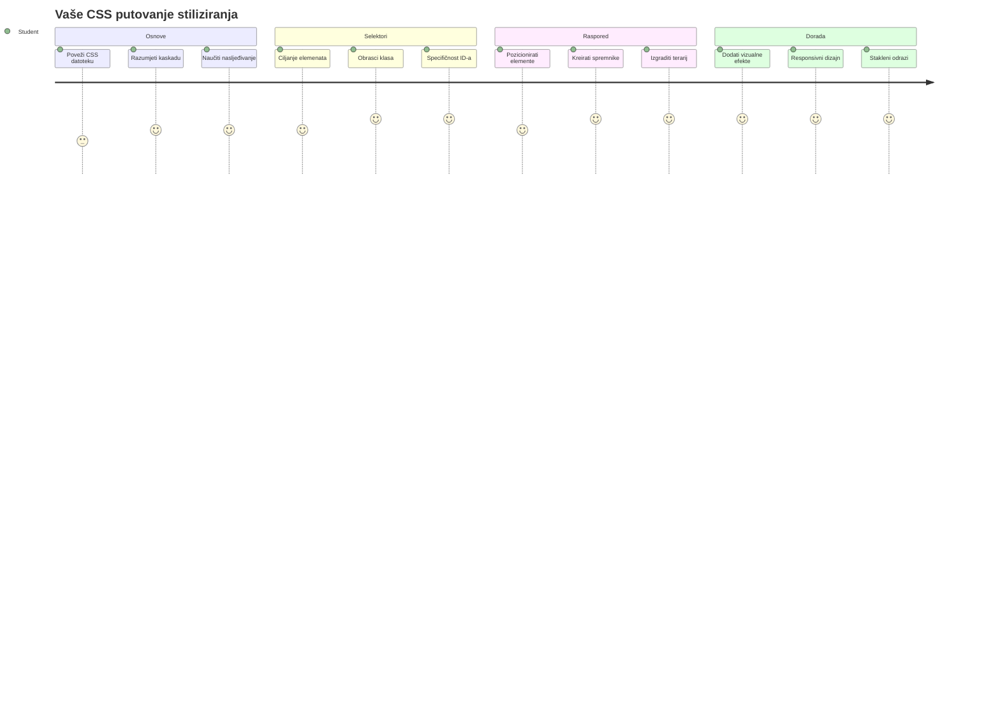
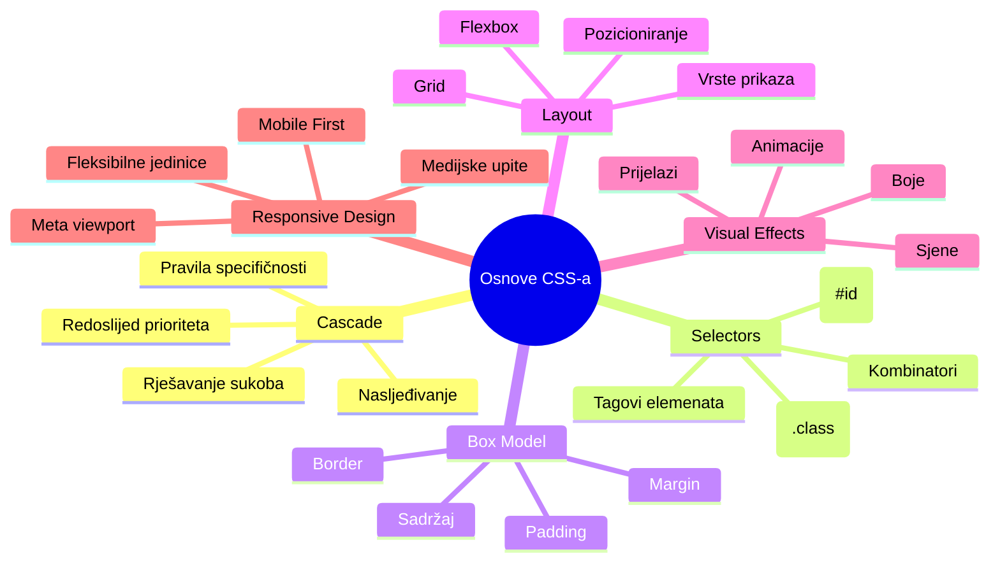
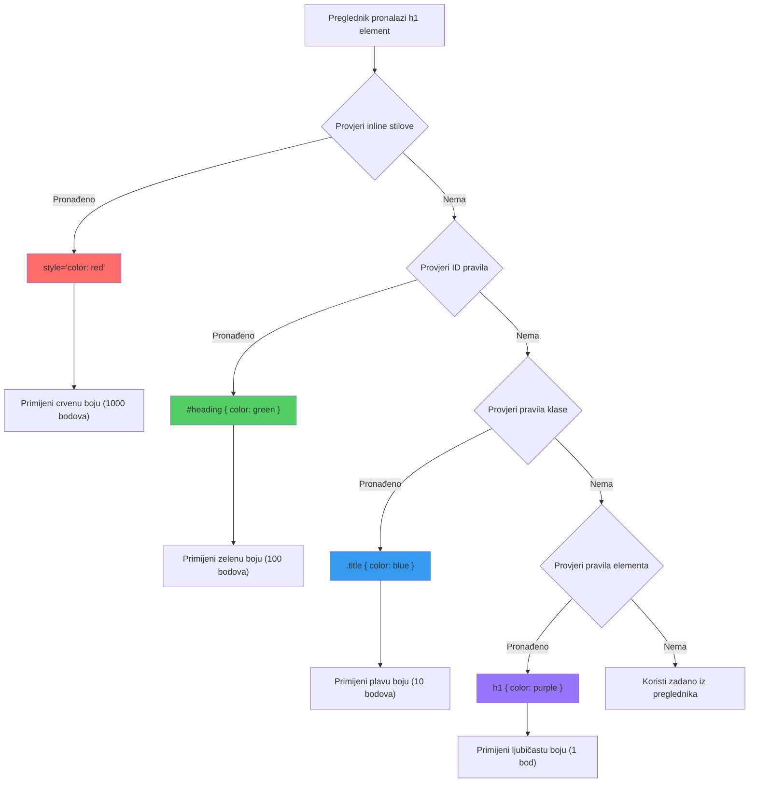
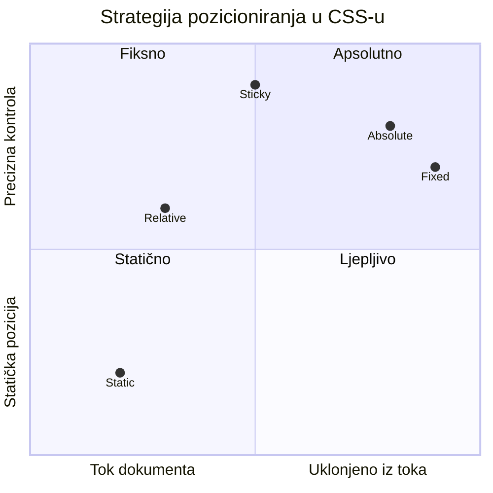
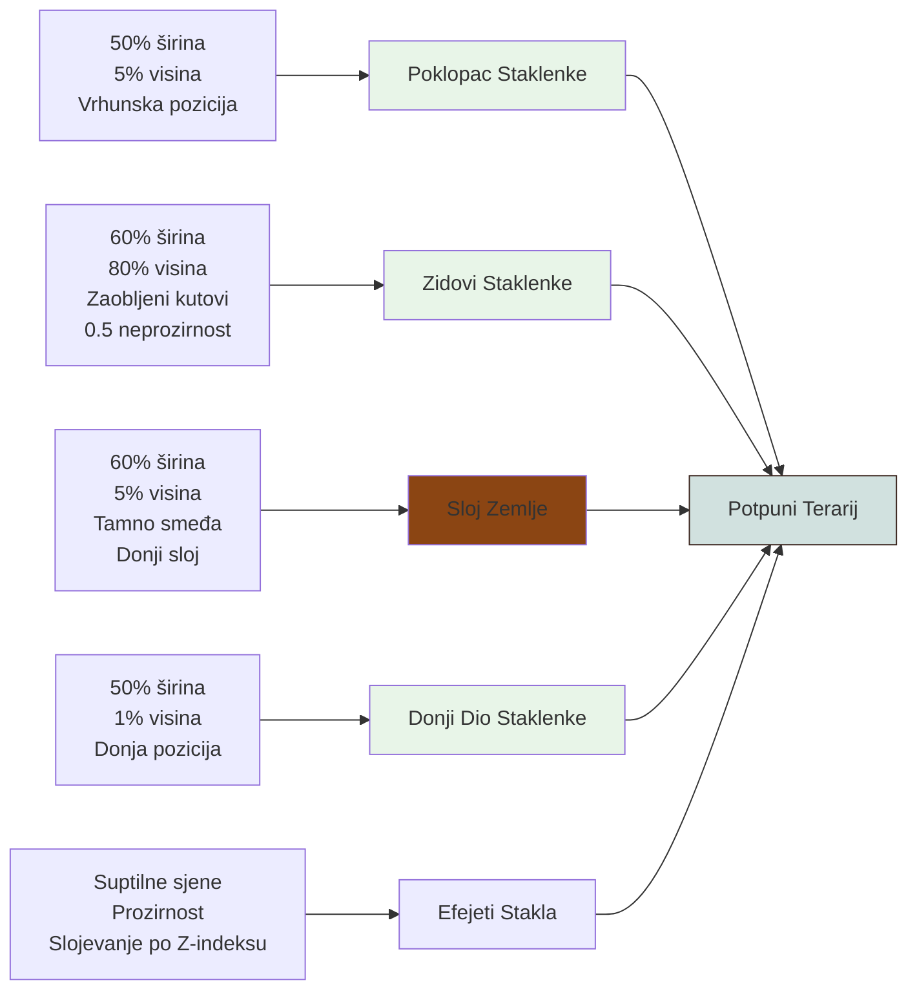
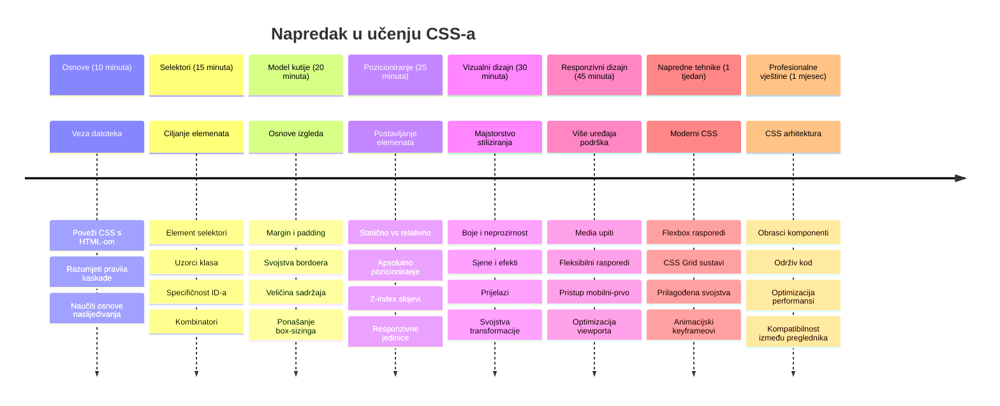

<!--
CO_OP_TRANSLATOR_METADATA:
{
  "original_hash": "e39f3a4e3bcccf94639e3af1248f8a4d",
  "translation_date": "2026-01-07T09:31:12+00:00",
  "source_file": "3-terrarium/2-intro-to-css/README.md",
  "language_code": "hr"
}
-->
# Terrarij Projekt Dio 2: Uvod u CSS



> Sketchnote autora [Tomomi Imura](https://twitter.com/girlie_mac)

Sjećaš li se kako je tvoj HTML terrarij izgledao prilično osnovno? CSS je mjesto gdje tu običnu strukturu pretvaramo u nešto vizualno privlačno.

Ako je HTML kao gradnja kostura kuće, onda je CSS sve ono što kući daje osjećaj doma - boje za zidove, raspored namještaja, osvjetljenje i kako se sobe međusobno povezuju. Zamislite kako je Dvorac Versailles započeo kao jednostavna lovačka kuća, ali pažnja prema dekoraciji i rasporedu pretvorila ga je u jednu od najspektakularnijih građevina na svijetu.

Danas ćemo tvoj terrarij pretvoriti iz funkcionalnog u dotjeran. Naučit ćeš kako precizno pozicionirati elemente, kako napraviti layout koji se prilagođava različitim veličinama ekrana i stvoriti vizualni dojam koji čini web-stranice zanimljivima.

Na kraju ovog sata vidjet ćeš kako strateško stiliziranje s CSS-om može dramatično poboljšati tvoj projekt. Dodajmo stila tvom terrariju.


## Predpredavanje kviz

[Predpredavanje kviz](https://ff-quizzes.netlify.app/web/quiz/17)

## Uvod u CSS

CSS se često smatra samo "uljepšavanjem stvari", ali ima puno širu svrhu. CSS je kao režiser filma - kontroliraš ne samo kako sve izgleda, već i kako se kreće, reagira na interakcije i prilagođava različitim situacijama.

Moderni CSS je iznimno sposoban. Možeš napisati kod koji automatski prilagođava layout za telefone, tablete i stolna računala. Možeš stvoriti glatke animacije koje usmjeravaju pažnju korisnika kamo je potrebno. Rezultati mogu biti vrlo impresivni kada sve funkcionira zajedno.

> 💡 **Stručni savjet**: CSS se stalno razvija s novim značajkama i mogućnostima. Uvijek provjeri [CanIUse.com](https://caniuse.com) kako bi potvrdio podršku preglednika za novije CSS značajke prije nego što ih koristiš u produkcijskim projektima.

**Ovo ćemo postići u ovom satu:**
- **Stvoriti** kompletan vizualni dizajn tvog terrarija koristeći moderne CSS tehnike
- **Istražiti** osnovne koncepte poput kaskade, nasljeđivanja i CSS selektora
- **Implementirati** responzivno pozicioniranje i strategije izrade layouta
- **Izgraditi** terrarij kontejner koristeći CSS oblike i stilizaciju

### Preduvjet

Trebalo bi imati gotovu HTML strukturu za svoj terrarij iz prethodnog sata, spremnu za stiliziranje.

> 📺 **Video resurs**: Pogledaj ovaj koristan video vodič
>
> [](https://www.youtube.com/watch?v=6yIdOIV9p1I)

### Postavljanje CSS datoteke

Prije nego što počnemo stilizirati, moramo povezati CSS s našim HTML-om. Ta veza govori pregledniku gdje pronaći upute za stilizaciju našeg terrarija.

U svojoj mapi terrarija, kreiraj novu datoteku pod nazivom `style.css`, zatim je poveži u dijelu `<head>` tvog HTML dokumenta:

```html
<link rel="stylesheet" href="./style.css" />
```

**Ovo što kod radi:**
- **Stvara** vezu između tvoje HTML i CSS datoteke
- **Kaže** pregledniku da učita i primijeni stilove iz `style.css`
- **Koristi** atribut `rel="stylesheet"` koji specificira da je to CSS datoteka
- **Referencira** putanju do datoteke preko `href="./style.css"`

## Razumijevanje CSS kaskade

Jesi li se ikada pitao zašto se CSS zove "Cascading" Style Sheets? Stilovi se slijevaju poput vodopada, a ponekad i međusobno sukobljavaju.

Razmotri kako vojna zapovjedna struktura funkcionira - generalov naredba može reći "svi vojnici nose zelenu", ali specifična naredba tvojoj jedinici može reći "nosite svečane plave za ceremoniju". Specifičnija uputa ima prednost. CSS slijedi sličnu logiku i razumijevanje ove hijerarhije čini otklanjanje grešaka mnogo jednostavnijim.

### Eksperimentiranje s prioritetom kaskade

Pogledajmo kaskadu u akciji stvaranjem sukoba stilova. Prvo dodaj inline stil na svoj `<h1>` tag:

```html
<h1 style="color: red">My Terrarium</h1>
```

**Što ovaj kod radi:**
- **Primjenjuje** crvenu boju direktno na `<h1>` element koristeći inline stilizaciju
- **Koristi** atribut `style` za ugrađivanje CSS-a direktno u HTML
- **Stvara** stil s najvišim prioritetom za taj specifični element

Zatim dodaj ovo pravilo u svoju datoteku `style.css`:

```css
h1 {
  color: blue;
}
```

**Ovdje smo:**
- **Definirali** CSS pravilo koje cilja sve `<h1>` elemente
- **Postavili** boju teksta na plavu koristeći vanjsku stilsku datoteku
- **Stvorili** pravilo nižeg prioriteta u odnosu na inline stilove

✅ **Provjera znanja**: Koja boja se prikazuje u tvojoj web-aplikaciji? Zašto ta boja pobjeđuje? Možeš li smisliti situacije u kojima bi želio nadjačati stilove?


> 💡 **Redoslijed CSS prioriteta (od najvišeg do najnižeg):**
> 1. **Inline stilovi** (atribut style)
> 2. **ID-ovi** (#myId)
> 3. **Klase** (.myClass) i atributi
> 4. **Selektori elemenata** (h1, div, p)
> 5. **Zadani stilovi preglednika**

## CSS nasljeđivanje u praksi

CSS nasljeđivanje radi poput genetike - elementi nasljeđuju određena svojstva od roditeljskih elemenata. Ako postaviš font-family na elementu body, sav tekst unutar automatski koristi isti font. Slično kao što je prepoznatljiv oblik čeljusti Habsburške obitelji bio prisutan kroz generacije, a nije bio specificiran za svakog pojedinačno.

Međutim, nije sve nasljedno. Stilovi teksta poput fontova i boja se nasljeđuju, no svojstva layouta poput margina i obruba se ne nasljeđuju. Kao što djeca mogu naslijediti fizičke osobine, ali ne i modne izbore roditelja.

### Promatranje nasljeđivanja fonta

Pogledajmo nasljeđivanje u praksi postavljanjem font-family na `<body>` element:

```css
body {
  font-family: 'Segoe UI', Tahoma, Geneva, Verdana, sans-serif;
}
```

**Što se ovdje događa:**
- **Postavlja** font-family za cijelu stranicu ciljajući `<body>` element
- **Koristi** font stack s rezervnim mogućnostima radi bolje kompatibilnosti s preglednicima
- **Primjenjuje** moderne sistemske fontove koji lijepo izgledaju na različitim operativnim sustavima
- **Osigurava** da svi child elementi nasljede taj font osim ako nije eksplicitno drugačije postavljeno

Otvori alate za razvoj preglednika (F12), idi na tab Elements i pregledaj svoj `<h1>` element. Vidjet ćeš da nasljeđuje font-family od body:


✅ **Vrijeme za eksperiment**: Pokušaj postaviti druga nasljediva svojstva na `<body>` kao `color`, `line-height` ili `text-align`. Što se događa s naslovom i ostalim elementima?

> 📝 **Nasljediva svojstva uključuju**: `color`, `font-family`, `font-size`, `line-height`, `text-align`, `visibility`
>
> **Svojstva koja se ne nasljeđuju uključuju**: `margin`, `padding`, `border`, `width`, `height`, `position`

### 🔄 **Pedagoški pregled**
**Razumijevanje osnova CSS-a**: Prije prelaska na selektore, osiguraj da možeš:
- ✅ Objasniti razliku između kaskade i nasljeđivanja
- ✅ Predvidjeti koji stil će pobijediti u konfliktu specifičnosti
- ✅ Prepoznati koja svojstva se nasljeđuju od roditeljskih elemenata
- ✅ Ispravno povezati CSS datoteke s HTML-om

**Brzi test**: Ako imaš ove stilove, koje će boje biti `<h1>` unutar `<div class="special">`?
```css
div { color: blue; }
.special { color: green; }
h1 { color: red; }
```
*Odgovor: Crvena (selektor elementa direktno cilja h1)*

## Ovladavanje CSS selektorima

CSS selektori su tvoj način da ciljano stiliziraš određene elemente. Oni funkcioniraju kao davanje preciznih uputa - umjesto da kažeš "kuća", kažeš "plava kuća s crvenim vratima u Maple Streetu".

CSS nudi različite načine da budeš specifičan, a odabir pravog selektora je poput izbora pravog alata za zadatak. Ponekad trebaš stilizirati svaka vrata u susjedstvu, a ponekad samo jedna specifična vrata.

### Selektori elemenata (Tagovi)

Selektori elemenata ciljaju HTML elemente po imenu taga. Savršeni su za postavljanje osnovnih stilova koji se primjenjuju široko preko stranice:

```css
body {
  font-family: 'Segoe UI', Tahoma, Geneva, Verdana, sans-serif;
  margin: 0;
  padding: 0;
}

h1 {
  color: #3a241d;
  text-align: center;
  font-size: 2.5rem;
  margin-bottom: 1rem;
}
```

**Što ovi stilovi rade:**
- **Postavlja** dosljednu tipografiju preko cijele stranice pomoću `body` selektora
- **Uklanja** zadane margine i padding preglednika radi bolje kontrole
- **Stilizira** sve naslove bojom, poravnanjem i razmakom
- **Koristi** `rem` jedinice za skalabilne i pristupačne veličine fonta

Iako element selektori dobro funkcioniraju za opće stiliziranje, trebat ćeš specifičnije selektore za stiliziranje pojedinačnih komponenti poput biljaka u tvom terrariju.

### ID selektori za jedinstvene elemente

ID selektori koriste simbol `#` i ciljaju elemente s određenim `id` atributom. Budući da id-ovi moraju biti jedinstveni na stranici, savršeni su za stiliziranje pojedinačnih, posebnih elemenata poput lijevog i desnog kontejnera s biljkama.

Napravimo stilizaciju za bočne kontejnere terrarija gdje će biljke stajati:

```css
#left-container {
  background-color: #f5f5f5;
  width: 15%;
  left: 0;
  top: 0;
  position: absolute;
  height: 100vh;
  padding: 1rem;
  box-sizing: border-box;
}

#right-container {
  background-color: #f5f5f5;
  width: 15%;
  right: 0;
  top: 0;
  position: absolute;
  height: 100vh;
  padding: 1rem;
  box-sizing: border-box;
}
```

**Što ovaj kod radi:**
- **Pozicionira** kontejnere na lijevi i desni rub ekrana koristeći `absolute` pozicioniranje
- **Koristi** `vh` (visina viewporta) jedinice za responzivnu visinu koja se prilagođava veličini ekrana
- **Primjenjuje** `box-sizing: border-box` tako da padding ulazi u ukupnu širinu
- **Uklanja** nepotrebne `px` jedinice za vrijednosti nula radi čišćeg koda
- **Postavlja** suptilnu boju pozadine koja je lakša za oči od oštre sive

✅ **Izazov za kvalitetu koda**: Primijeti kako ovaj CSS krši DRY (Don't Repeat Yourself) princip. Možeš li ga refaktorirati koristeći oba, ID i klasu?

**Poboljšani pristup:**
```html
<div id="left-container" class="container"></div>
<div id="right-container" class="container"></div>
```

```css
.container {
  background-color: #f5f5f5;
  width: 15%;
  top: 0;
  position: absolute;
  height: 100vh;
  padding: 1rem;
  box-sizing: border-box;
}

#left-container {
  left: 0;
}

#right-container {
  right: 0;
}
```

### Klase za ponovnu upotrebu stilova

Klase koriste simbol `.` i idealne su kada želiš primijeniti iste stilove na više elemenata. Za razliku od ID-ova, klase se mogu ponavljati po cijelom HTML-u, što ih čini idealnim za dosljedne stilizacijske obrasce.

U našem terrariju, svaka biljka treba sličnu stilizaciju, ali i individualno pozicioniranje. Koristit ćemo kombinaciju klasa za zajedničke stilove i ID za jedinstveno pozicioniranje.

**Ovo je HTML struktura za svaku biljku:**
```html
<div class="plant-holder">
  
</div>
```

**Objašnjenje ključnih elemenata:**
- **Koristi** `class="plant-holder"` za dosljedno stiliziranje kontejnera svih biljaka
- **Primjenjuje** `class="plant"` za zajedničku stilizaciju slike i ponašanje
- **Sadrži** jedinstveni `id="plant1"` za individualno pozicioniranje i JavaScript interakciju
- **Nudi** opisni alt tekst radi pristupačnosti čitačima ekrana

Sada dodaj ove stilove u svoju datoteku `style.css`:

```css
.plant-holder {
  position: relative;
  height: 13%;
  left: -0.6rem;
}

.plant {
  position: absolute;
  max-width: 150%;
  max-height: 150%;
  z-index: 2;
  transition: transform 0.3s ease;
}

.plant:hover {
  transform: scale(1.05);
}
```

**Što ovi stilovi rade:**
- **Stvara** relativno pozicioniranje za plant holder koji uspostavlja kontekst pozicije
- **Postavlja** visinu svakog plant holdera na 13% da bi sve biljke stale vertikalno bez skrolanja
- **Pomjera** holder-e malo ulijevo za bolji centar biljaka u njihovim kontejnerima
- **Dozvoljava** biljkama da se skaliraju responzivno uz svojstva `max-width` i `max-height`
- **Koristi** `z-index` da biljke budu slojene iznad ostalih elemenata u terrariju
- **Dodaje** suptilni efekt prilikom lebdenja pomoću CSS prijelaza za bolje korisničko iskustvo

✅ **Kritičko razmišljanje**: Zašto nam trebaju oba selektora `.plant-holder` i `.plant`? Što bi se dogodilo da koristimo samo jedan?

> 💡 **Dizajnerski obrazac**: Kontejner (`.plant-holder`) kontrolira layout i pozicioniranje, dok sadržaj (`.plant`) kontrolira izgled i skaliranje. Ova podjela čini kod održivijim i fleksibilnijim.

## Razumijevanje CSS pozicioniranja

CSS pozicioniranje je kao režija na sceni - ti upravljaš gdje svaki glumac stoji i kako se kreće po pozornici. Neki glumci slijede standardni raspored, dok drugi trebaju specifično pozicioniranje radi dramatičnog efekta.

Kad shvatiš pozicioniranje, mnogi izazovi kod layouta postaju upravljivi. Trebaš li navigacijsku traku koja ostaje na vrhu dok korisnici skrolaju? Pozicioniranje to omogućuje. Želiš li tooltip koji se pojavljuje na određenom mjestu? To je također pozicioniranje.

### Pet vrijednosti pozicije


| Vrijednost pozicije | Ponašanje | Primjena |
|---------------------|-----------|----------|
| `static` | Zadani tijek, ignorira top/left/right/bottom | Normalni raspored dokumenta |
| `relative` | Pozicionirano relativno u odnosu na normalni položaj | Male prilagodbe, stvaranje konteksta pozicije |
| `absolute` | Pozicionirano relativno u odnosu na najbližeg pozicioniranog roditelja | Precizno postavljanje, slojevi preko |
| `fixed` | Pozicionirano relativno prema viewportu | Navigacijske trake, plutajući elementi |
| `sticky` | Mijenja se između relative i fixed ovisno o skrolanju | Zaglavlja koja se lijepe prilikom skrolanja |

### Pozicioniranje u našem terrariju

Naš terrarij koristi stratešku kombinaciju tipova pozicioniranja da stvori željeni layout:

```css
/* Container positioning */
.container {
  position: absolute; /* Removes from normal flow */
  /* ... other styles ... */
}

/* Plant holder positioning */
.plant-holder {
  position: relative; /* Creates positioning context */
  /* ... other styles ... */
}

/* Plant positioning */
.plant {
  position: absolute; /* Allows precise placement within holder */
  /* ... other styles ... */
}
```

**Razumijevanje strategije pozicioniranja:**
- **Apsolutni kontejneri** su izuzeti iz uobičajenog tijeka dokumenta i pričvršćeni su na rubove ekrana
- **Relativni plant holderi** stvaraju kontekst pozicioniranja, a pritom ostaju u tijeku dokumenta
- **Apsolutne biljke** mogu biti precizno pozicionirane unutar relativnih kontejnera
- **Ova kombinacija** omogućava biljkama da se slažu vertikalno, a istovremeno se pojedinačno pozicioniraju

> 🎯 **Zašto je ovo važno**: Elementi "plant" trebaju apsolutno pozicioniranje da bi bili drag'n'drop (povuci i pusti) u sljedećem satu. Apsolutno pozicioniranje uklanja ih iz normalnog tijeka layouta, omogućujući interakciju povlačenja i ispuštanja.

✅ **Vrijeme za eksperiment**: Isprobaj promjenu vrijednosti pozicije i promatraj rezultate:
- Što se dogodi ako promijeniš `.container` iz `absolute` u `relative`?
- Kako se raspored mijenja ako `.plant-holder` koristi `absolute` umjesto `relative`?
- Što se događa kada ` .plant` promijenite u `relative` pozicioniranje?

### 🔄 **Pedagoška provjera**
**Vladanje CSS pozicioniranjem**: Pauzirajte i provjerite svoje razumijevanje:
- ✅ Možete li objasniti zašto biljke trebaju apsolutno pozicioniranje za povuci-i-pusti funkcionalnost?
- ✅ Razumijete li kako relativni spremnici stvaraju kontekst pozicioniranja?
- ✅ Zašto bočni spremnici koriste apsolutno pozicioniranje?
- ✅ Što bi se dogodilo ako u potpunosti uklonite deklaracije pozicija?

**Povezanost s realnim svijetom**: Razmislite kako CSS pozicioniranje odražava stvarni raspored:
- **Static**: Knjige na polici (prirodni redoslijed)
- **Relative**: Pomicanje knjige malo, ali zadržavanje mjesta
- **Absolute**: Postavljanje knjižne oznake na točan broj stranice
- **Fixed**: Ljepljiva bilješka koja ostaje vidljiva dok okrećete stranice

## Izgradnja terarija s CSS-om

Sada ćemo izgraditi staklenku koristeći samo CSS - bez slika ili grafičkog softvera.

Stvaranje realističnog izgleda stakla, sjena i dubine pomoću pozicioniranja i prozirnosti demonstrira vizualne sposobnosti CSS-a. Ova tehnika odražava način na koji su arhitekti Bauhaus pokreta koristili jednostavne geometrijske oblike za stvaranje složenih, lijepih struktura. Kad razumijete ove principe, prepoznat ćete CSS tehnike iza mnogih web dizajna.


### Izrada dijelova staklenke

Izgradimo terarij korak po korak. Svaki dio koristi apsolutno pozicioniranje i veličine izražene u postocima za responzivan dizajn:

```css
.jar-walls {
  height: 80%;
  width: 60%;
  background: #d1e1df;
  border-radius: 1rem;
  position: absolute;
  bottom: 0.5%;
  left: 20%;
  opacity: 0.5;
  z-index: 1;
  box-shadow: inset 0 0 2rem rgba(0, 0, 0, 0.1);
}

.jar-top {
  width: 50%;
  height: 5%;
  background: #d1e1df;
  position: absolute;
  bottom: 80.5%;
  left: 25%;
  opacity: 0.7;
  z-index: 1;
  border-radius: 0.5rem 0.5rem 0 0;
}

.jar-bottom {
  width: 50%;
  height: 1%;
  background: #d1e1df;
  position: absolute;
  bottom: 0;
  left: 25%;
  opacity: 0.7;
  border-radius: 0 0 0.5rem 0.5rem;
}

.dirt {
  width: 60%;
  height: 5%;
  background: #3a241d;
  position: absolute;
  border-radius: 0 0 1rem 1rem;
  bottom: 1%;
  left: 20%;
  opacity: 0.7;
  z-index: -1;
}
```

**Razumijevanje konstrukcije terarija:**
- **Koristi** dimenzije izražene u postocima za responzivno skaliranje na svim veličinama ekrana
- **Pozicionira** elemente apsolutno kako bi ih precizno složila i poravnala
- **Primjenjuje** različite vrijednosti prozirnosti za stvaranje efekta staklene prozirnosti
- **Koristi** `z-index` slojevito kako bi biljke bile unutar staklenke
- **Dodaje** suptilne sjene i fino zaobljene rubove za realističniji izgled

### Responzivni dizajn s postocima

Primijetite kako sve dimenzije koriste postotke umjesto fiksnih piksela:

**Zašto je to važno:**
- **Osigurava** proporcionalno skaliranje terarija na bilo kojoj veličini ekrana
- **Održava** vizualne odnose između dijelova staklenke
- **Pruža** dosljedno iskustvo od mobilnih telefona do velikih desktop monitora
- **Omogućuje** dizajnu prilagodbu bez narušavanja vizualnog rasporeda

### CSS jedinice u praksi

Koristimo `rem` jedinice za border-radius koje skaliraju u odnosu na veličinu osnovnog fonta. To stvara dostupnije dizajne koje poštuju korisničke postavke fonta. Saznajte više o [relativnim CSS jedinicama](https://www.w3.org/TR/css-values-3/#font-relative-lengths) u službenoj specifikaciji.

✅ **Vizualno eksperimentiranje**: Pokušajte mijenjati ove vrijednosti i promatrajte učinke:
- Promijenite prozirnost staklenke s 0.5 na 0.8 – kako to utječe na izgled stakla?
- Prilagodite boju tla s `#3a241d` na `#8B4513` – koji je vizualni efekt?
- Izmijenite `z-index` tla na 2 – što se događa sa slojevima?

### 🔄 **Pedagoška provjera**
**Razumijevanje vizualnog CSS dizajna**: Potvrdite svoje razumijevanje vizualnog CSS-a:
- ✅ Kako dimenzije u postocima stvaraju responzivni dizajn?
- ✅ Zašto prozirnost stvara efekt prozirnog stakla?
- ✅ Koju ulogu ima z-index u slojevitosti elemenata?
- ✅ Kako vrijednosti border-radius oblikuju staklenku?

**Dizajnerski princip**: Primijetite kako gradimo složene vizuale iz jednostavnih oblika:
1. **Pravokutnici** → **Zaobljeni pravokutnici** → **Dijelovi staklenke**
2. **Jednobojne boje** → **Prozirnost** → **Efekt stakla**
3. **Pojedinačni elementi** → **Slojevita kompozicija** → **3D izgled**

---

## Izazov GitHub Copilot Agenta 🚀

Iskoristite Agent način za dovršetak sljedećeg izazova:

**Opis:** Kreirajte CSS animaciju koja lagano njihuje biljke u terariju kao da ih povjetarac nježno pomiče. Ovo će vam pomoći da uvježbate CSS animacije, transformacije i ključne okvire dok poboljšavate vizualni dojam svog terarija.

**Zadatak:** Dodajte CSS keyframe animacije koje stvaraju nježno njihanje biljaka lijevo i desno. Kreirajte animaciju njihanja koja svaku biljku zakreće blago (2-3 stupnja) lijevo i desno s trajanjem od 3 do 4 sekunde, i primijenite je na `.plant` klasu. Pobrinite se da animacija neprestano traje i ima funkciju ublažavanja za prirodan pokret.

Saznajte više o [agent načinu](https://code.visualstudio.com/blogs/2025/02/24/introducing-copilot-agent-mode) ovdje.

## 🚀 Izazov: Dodavanje odraza stakla

Spremni za povećanje realizma terarija s realističnim odrazima stakla? Ova tehnika će dodati dubinu i vjerodostojnost dizajnu.

Kreirat ćete suptilne naglaske koji simuliraju kako se svjetlo reflektira na staklenim površinama. Ovaj pristup sliči načinu na koji su renesansni slikari poput Jana van Eycka koristili svjetlo i odraze da bi naslikano staklo izgledalo trodimenzionalno. Evo što želite postići:


**Vaš zadatak:**
- **Napravite** suptilne bijele ili svijetle ovalne oblike za odraze stakla
- **Pozicionirajte** ih strateški na lijevoj strani staklenke
- **Primijenite** odgovarajuću prozirnost i zamućenje za realistični odraz svjetla
- **Koristite** `border-radius` za stvaranje organskih, mjehurićastih oblika
- **Igrajte se** s gradijentima ili box-shadow efektima za dodatni realizam

## Kviz nakon predavanja

[Kviz nakon predavanja](https://ff-quizzes.netlify.app/web/quiz/18)

## Proširite svoje CSS znanje

CSS može djelovati složeno na početku, ali razumijevanje ovih osnovnih koncepata pruža čvrsti temelj za naprednije tehnike.

**Vaši sljedeći CSS smjerovi:**
- **Flexbox** - pojednostavljuje poravnanje i raspodjelu elemenata
- **CSS Grid** - nudi moćne alate za izradu složenih izgleda
- **CSS varijable** - smanjuju ponavljanje i olakšavaju održavanje koda
- **Responzivni dizajn** - osigurava dobar rad stranica na različitim veličinama ekrana

### Interaktivni resursi za učenje

Vježbajte ove koncepte kroz zanimljive, praktične igre:
- 🐸 [Flexbox Froggy](https://flexboxfroggy.com/) - Ovladavanje Flexboxom kroz zabavne izazove
- 🌱 [Grid Garden](https://codepip.com/games/grid-garden/) - Učite CSS Grid uz uzgoj virtualne mrkve
- 🎯 [CSS Battle](https://cssbattle.dev/) - Testirajte CSS vještine kroz kodne izazove

### Dodatno učenje

Za sveobuhvatne osnove CSS-a, završite ovaj modul na Microsoft Learnu: [Style your HTML app with CSS](https://docs.microsoft.com/learn/modules/build-simple-website/4-css-basics/?WT.mc_id=academic-77807-sagibbon)

### ⚡ **Što možete učiniti u sljedećih 5 minuta**
- [ ] Otvorite DevTools i pogledajte CSS stilove na bilo kojoj stranici koristeći Elements panel
- [ ] Napravite jednostavnu CSS datoteku i povežite je s HTML stranicom
- [ ] Pokušajte mijenjati boje koristeći različite načine: hex, RGB i imenovane boje
- [ ] Vježbajte box model dodavanjem paddinga i margine na div

### 🎯 **Što možete postići u ovom satu**
- [ ] Završiti kviz nakon lekcije i obnoviti osnove CSS-a
- [ ] Stilizirati HTML stranicu fontovima, bojama i razmakom
- [ ] Kreirati jednostavan raspored koristeći flexbox ili grid
- [ ] Eksperimentirati s CSS prijelazima za glatke efekte
- [ ] Vježbati responzivni dizajn s media queryjima

### 📅 **Vaša tjedna CSS avantura**
- [ ] Završiti zadatak stiliziranja terarija s kreativnim pristupom
- [ ] Ovladati CSS Gridom izradom galerije fotografija
- [ ] Učiti CSS animacije za oživljavanje dizajna
- [ ] Istražiti CSS preprocessore poput Sassa ili Lessa
- [ ] Proučiti dizajnerske principe i primijeniti ih u CSS-u
- [ ] Analizirati i reproducirati zanimljive dizajne s interneta

### 🌟 **Vaše mjesečno usavršavanje dizajna**
- [ ] Izgraditi kompletan responzivni sustav dizajna web stranice
- [ ] Naučiti CSS-in-JS ili utility-first okvire poput Tailwinda
- [ ] Doprinijeti open source projektima poboljšanjima CSS-a
- [ ] Ovladati naprednim CSS konceptima poput prilagođenih svojstava i containmenta
- [ ] Kreirati višekratno upotrebljive biblioteke komponenti s modularnim CSS-om
- [ ] Mentorirati druge koji uče CSS i dijeliti dizajnersko znanje

## 🎯 Vaš vremenski plan za savladavanje CSS-a


### 🛠️ Sažetak vašeg CSS alata

Nakon završetka ovog poglavlja, sada imate:
- **Razumijevanje kaskade**: Kako se stilovi nasljeđuju i nadjačavaju
- **Ovladavanje selektorima**: Precizno ciljanje elemenata, klasa i ID-eva
- **Vještine pozicioniranja**: Strateško postavljanje i slojevitost elemenata
- **Vizualni dizajn**: Stvaranje staklenih efekata, sjena i prozirnosti
- **Responzivne tehnike**: Rasporedi u postocima koji se prilagođavaju svakom ekranu
- **Organizacija koda**: Čista, održiva CSS struktura
- **Moderni pristupi**: Korištenje relativnih jedinica i dostupnih dizajnerskih obrazaca

**Sljedeći koraci**: Vaš terarij sada ima i strukturu (HTML) i stil (CSS). Završna lekcija će dodati interaktivnost uz JavaScript!

## Zadatak

[CSS Refactoring](assignment.md)

---

<!-- CO-OP TRANSLATOR DISCLAIMER START -->
**Odricanje od odgovornosti**:
Ovaj dokument preveden je korištenjem AI usluge prevođenja [Co-op Translator](https://github.com/Azure/co-op-translator). Iako nastojimo biti točni, imajte na umu da automatizirani prijevodi mogu sadržavati pogreške ili netočnosti. Izvorni dokument na njegovom izvornom jeziku treba smatrati autoritativnim izvorom. Za kritične informacije preporučuje se profesionalni ljudski prijevod. Ne snosimo odgovornost za bilo kakva nesporazuma ili pogrešna tumačenja koja proizlaze iz uporabe ovog prijevoda.
<!-- CO-OP TRANSLATOR DISCLAIMER END -->