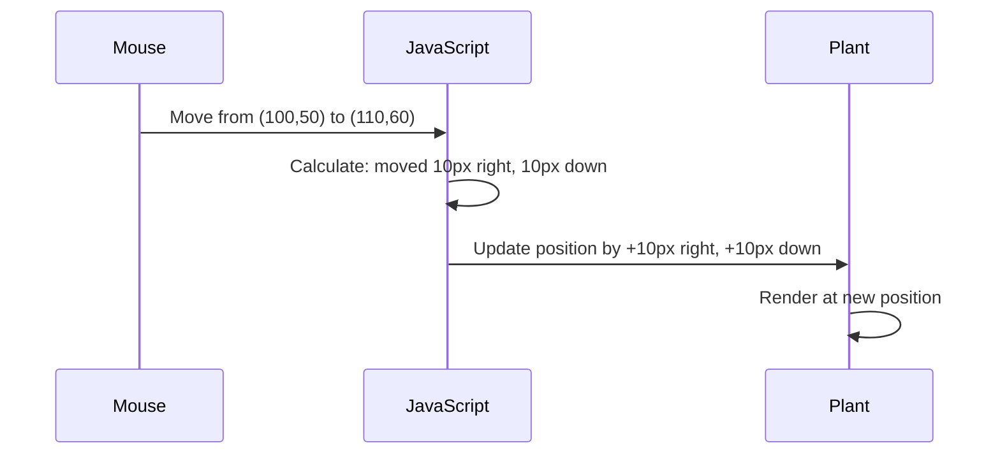

<!--
CO_OP_TRANSLATOR_METADATA:
{
  "original_hash": "bc93f6285423033ebf5b8abeb5282888",
  "translation_date": "2025-10-25T00:01:16+00:00",
  "source_file": "3-terrarium/3-intro-to-DOM-and-closures/README.md",
  "language_code": "hr"
}
-->
# Projekt Terarij, 3. dio: Manipulacija DOM-om i JavaScript zatvaranja


> Sketchnote od [Tomomi Imura](https://twitter.com/girlie_mac)

Dobrodošli u jedan od najzanimljivijih aspekata web razvoja - stvaranje interaktivnosti! Document Object Model (DOM) je poput mosta između vašeg HTML-a i JavaScripta, a danas ćemo ga koristiti kako bismo vaš terarij oživjeli. Kada je Tim Berners-Lee stvorio prvi web preglednik, zamislio je web gdje dokumenti mogu biti dinamični i interaktivni - DOM omogućuje ostvarenje te vizije.

Također ćemo istražiti JavaScript zatvaranja, što na prvi pogled može zvučati zastrašujuće. Zamislite zatvaranja kao stvaranje "džepova memorije" u kojima vaše funkcije mogu zapamtiti važne informacije. To je poput svakog biljnog elementa u vašem terariju koji ima vlastiti zapis podataka za praćenje svoje pozicije. Do kraja ove lekcije shvatit ćete koliko su prirodna i korisna.

Evo što ćemo izraditi: terarij u kojem korisnici mogu povlačiti i ispuštati biljke gdje god žele. Naučit ćete tehnike manipulacije DOM-om koje omogućuju sve, od povlačenja i ispuštanja datoteka do interaktivnih igara. Oživimo vaš terarij.

## Kviz prije predavanja

[Pre-lecture quiz](https://ff-quizzes.netlify.app/web/quiz/19)

## Razumijevanje DOM-a: Vaša ulaznica za interaktivne web stranice

Document Object Model (DOM) način je na koji JavaScript komunicira s vašim HTML elementima. Kada vaš preglednik učita HTML stranicu, stvara strukturirani prikaz te stranice u memoriji - to je DOM. Zamislite ga kao obiteljsko stablo gdje je svaki HTML element član obitelji kojem JavaScript može pristupiti, modificirati ga ili ga premjestiti.

Manipulacija DOM-om pretvara statične stranice u interaktivne web stranice. Svaki put kad vidite da se gumb mijenja boju pri prelasku mišem, sadržaj se ažurira bez osvježavanja stranice ili elemente koje možete povlačiti, to je rad manipulacije DOM-om.


> Prikaz DOM-a i HTML oznaka koje ga referenciraju. Od [Olfa Nasraoui](https://www.researchgate.net/publication/221417012_Profile-Based_Focused_Crawler_for_Social_Media-Sharing_Websites)

**Evo što DOM čini moćnim:**
- **Omogućuje** strukturirani način pristupa bilo kojem elementu na vašoj stranici
- **Omogućuje** dinamično ažuriranje sadržaja bez osvježavanja stranice
- **Omogućuje** reakciju u stvarnom vremenu na interakcije korisnika poput klikova i povlačenja
- **Stvara** temelj za moderne interaktivne web aplikacije

## JavaScript zatvaranja: Stvaranje organiziranog i moćnog koda

[JavaScript zatvaranje](https://developer.mozilla.org/docs/Web/JavaScript/Closures) je poput davanja funkciji vlastitog privatnog radnog prostora s trajnom memorijom. Zamislite kako su Darwinove zebe na Galapagosu razvile specijalizirane kljunove na temelju svog specifičnog okruženja - zatvaranja djeluju slično, stvarajući specijalizirane funkcije koje "pamte" svoj specifični kontekst čak i nakon što je njihova roditeljska funkcija završila.

U našem terariju, zatvaranja pomažu svakoj biljci da neovisno pamti svoju poziciju. Ovaj obrazac pojavljuje se u profesionalnom JavaScript razvoju, čineći ga vrijednim konceptom za razumijevanje.

> 💡 **Razumijevanje zatvaranja**: Zatvaranja su značajna tema u JavaScriptu, a mnogi ih programeri koriste godinama prije nego što u potpunosti shvate sve teorijske aspekte. Danas se fokusiramo na praktičnu primjenu - vidjet ćete kako se zatvaranja prirodno pojavljuju dok gradimo naše interaktivne funkcije. Razumijevanje će se razvijati kako budete vidjeli kako rješavaju stvarne probleme.


> Prikaz DOM-a i HTML oznaka koje ga referenciraju. Od [Olfa Nasraoui](https://www.researchgate.net/publication/221417012_Profile-Based_Focused_Crawler_for_Social_Media-Sharing_Websites)

U ovoj lekciji dovršit ćemo naš interaktivni projekt terarija stvaranjem JavaScripta koji će omogućiti korisniku manipulaciju biljkama na stranici.

## Prije nego počnemo: Priprema za uspjeh

Trebat će vam vaši HTML i CSS datoteke iz prethodnih lekcija o terariju - sada ćemo taj statični dizajn učiniti interaktivnim. Ako se prvi put pridružujete, dovršavanje tih lekcija prvo će vam pružiti važan kontekst.

Evo što ćemo izraditi:
- **Glatko povlačenje i ispuštanje** za sve biljke u terariju
- **Praćenje koordinata** kako bi biljke zapamtile svoje pozicije
- **Potpuno interaktivno sučelje** koristeći vanilla JavaScript
- **Čist, organiziran kod** koristeći obrasce zatvaranja

## Postavljanje JavaScript datoteke

Izradimo JavaScript datoteku koja će učiniti vaš terarij interaktivnim.

**Korak 1: Izradite svoju skriptu**

U mapi terarija izradite novu datoteku pod nazivom `script.js`.

**Korak 2: Povežite JavaScript s vašim HTML-om**

Dodajte ovu oznaku skripte u odjeljak `<head>` vaše `index.html` datoteke:

```html
<script src="./script.js" defer></script>
```

**Zašto je atribut `defer` važan:**
- **Osigurava** da vaš JavaScript čeka dok se sav HTML ne učita
- **Sprječava** pogreške gdje JavaScript traži elemente koji još nisu spremni
- **Jamči** da su svi vaši biljni elementi dostupni za interakciju
- **Pruža** bolje performanse nego postavljanje skripti na dno stranice

> ⚠️ **Važna napomena**: Atribut `defer` sprječava uobičajene probleme s vremenom učitavanja. Bez njega, JavaScript bi mogao pokušati pristupiti HTML elementima prije nego što se učitaju, što bi uzrokovalo pogreške.

---

## Povezivanje JavaScripta s vašim HTML elementima

Prije nego što možemo učiniti elemente povlačivima, JavaScript mora locirati te elemente u DOM-u. Zamislite to kao sustav katalogizacije knjižnice - jednom kada imate broj kataloga, možete pronaći točno onu knjigu koja vam treba i pristupiti svim njezinim sadržajima.

Koristit ćemo metodu `document.getElementById()` za uspostavljanje tih veza. To je poput preciznog sustava arhiviranja - pružite ID i locirate točno onaj element koji vam treba u vašem HTML-u.

### Omogućavanje funkcionalnosti povlačenja za sve biljke

Dodajte ovaj kod u vašu `script.js` datoteku:

```javascript
// Enable drag functionality for all 14 plants
dragElement(document.getElementById('plant1'));
dragElement(document.getElementById('plant2'));
dragElement(document.getElementById('plant3'));
dragElement(document.getElementById('plant4'));
dragElement(document.getElementById('plant5'));
dragElement(document.getElementById('plant6'));
dragElement(document.getElementById('plant7'));
dragElement(document.getElementById('plant8'));
dragElement(document.getElementById('plant9'));
dragElement(document.getElementById('plant10'));
dragElement(document.getElementById('plant11'));
dragElement(document.getElementById('plant12'));
dragElement(document.getElementById('plant13'));
dragElement(document.getElementById('plant14'));
```

**Evo što ovaj kod postiže:**
- **Locira** svaki biljni element u DOM-u koristeći njegov jedinstveni ID
- **Dohvaća** JavaScript referencu na svaki HTML element
- **Prosljeđuje** svaki element funkciji `dragElement` (koju ćemo uskoro izraditi)
- **Priprema** svaku biljku za interakciju povlačenja i ispuštanja
- **Povezuje** vašu HTML strukturu s JavaScript funkcionalnošću

> 🎯 **Zašto koristiti ID-ove umjesto klasa?** ID-ovi pružaju jedinstvene identifikatore za specifične elemente, dok su CSS klase dizajnirane za stiliziranje grupa elemenata. Kada JavaScript treba manipulirati pojedinačnim elementima, ID-ovi nude preciznost i performanse koje su nam potrebne.

> 💡 **Savjet**: Primijetite kako pozivamo `dragElement()` za svaku biljku pojedinačno. Ovaj pristup osigurava da svaka biljka dobije vlastito neovisno ponašanje povlačenja, što je ključno za glatku interakciju korisnika.

---

## Izrada zatvaranja funkcije dragElement

Sada ćemo izraditi srž naše funkcionalnosti povlačenja: zatvaranje koje upravlja ponašanjem povlačenja za svaku biljku. Ovo zatvaranje će sadržavati više unutarnjih funkcija koje zajedno rade na praćenju pokreta miša i ažuriranju pozicija elemenata.

Zatvaranja su savršena za ovaj zadatak jer nam omogućuju stvaranje "privatnih" varijabli koje traju između poziva funkcija, dajući svakoj biljci vlastiti neovisni sustav za praćenje koordinata.

### Razumijevanje zatvaranja kroz jednostavan primjer

Dopustite mi da demonstriram zatvaranja jednostavnim primjerom koji ilustrira koncept:

```javascript
function createCounter() {
    let count = 0; // This is like a private variable
    
    function increment() {
        count++; // The inner function remembers the outer variable
        return count;
    }
    
    return increment; // We're giving back the inner function
}

const myCounter = createCounter();
console.log(myCounter()); // 1
console.log(myCounter()); // 2
```

**Evo što se događa u ovom obrascu zatvaranja:**
- **Stvara** privatnu varijablu `count` koja postoji samo unutar ovog zatvaranja
- **Unutarnja funkcija** može pristupiti i mijenjati tu vanjsku varijablu (mehanizam zatvaranja)
- **Kada vratimo** unutarnju funkciju, ona održava svoju vezu s tim privatnim podacima
- **Čak i nakon** što `createCounter()` završi izvršenje, `count` ostaje i pamti svoju vrijednost

### Zašto su zatvaranja savršena za funkcionalnost povlačenja

Za naš terarij, svaka biljka mora zapamtiti svoje trenutne koordinate pozicije. Zatvaranja pružaju savršeno rješenje:

**Ključne prednosti za naš projekt:**
- **Održava** privatne varijable pozicije za svaku biljku neovisno
- **Čuva** podatke o koordinatama između događaja povlačenja
- **Sprječava** sukobe varijabli između različitih povlačivih elemenata
- **Stvara** čist, organiziran kod

> 🎯 **Cilj učenja**: Ne morate odmah savladati svaki aspekt zatvaranja. Fokusirajte se na to kako nam pomažu organizirati kod i održavati stanje za našu funkcionalnost povlačenja.

### Izrada funkcije dragElement

Sada ćemo izraditi glavnu funkciju koja će upravljati svim logikom povlačenja. Dodajte ovu funkciju ispod deklaracija vaših biljnih elemenata:

```javascript
function dragElement(terrariumElement) {
    // Initialize position tracking variables
    let pos1 = 0,  // Previous mouse X position
        pos2 = 0,  // Previous mouse Y position  
        pos3 = 0,  // Current mouse X position
        pos4 = 0;  // Current mouse Y position
    
    // Set up the initial drag event listener
    terrariumElement.onpointerdown = pointerDrag;
}
```

**Razumijevanje sustava praćenja pozicije:**
- **`pos1` i `pos2`**: Spremaju razliku između starih i novih pozicija miša
- **`pos3` i `pos4`**: Prate trenutne koordinate miša
- **`terrariumElement`**: Specifični biljni element koji činimo povlačivim
- **`onpointerdown`**: Događaj koji se aktivira kada korisnik započne povlačenje

**Evo kako obrazac zatvaranja funkcionira:**
- **Stvara** privatne varijable pozicije za svaki biljni element
- **Održava** te varijable tijekom cijelog životnog ciklusa povlačenja
- **Osigurava** da svaka biljka neovisno prati svoje koordinate
- **Pruža** čisto sučelje kroz funkciju `dragElement`

### Zašto koristiti događaje pokazivača?

Možda se pitate zašto koristimo `onpointerdown` umjesto poznatijeg `onclick`. Evo objašnjenja:

| Vrsta događaja | Najbolje za | Nedostatak |
|----------------|------------|------------|
| `onclick` | Jednostavni klikovi na gumb | Ne može upravljati povlačenjem (samo klikovi i otpuštanja) |
| `onpointerdown` | Miš i dodir | Noviji, ali danas dobro podržan |
| `onmousedown` | Samo za desktop miš | Isključuje mobilne korisnike |

**Zašto su događaji pokazivača savršeni za ono što gradimo:**
- **Odlično radi** bez obzira koristi li netko miš, prst ili čak olovku
- **Isti osjećaj** na prijenosnom računalu, tabletu ili telefonu
- **Upravlja** stvarnim pokretom povlačenja (ne samo klikom i gotovim)
- **Stvara** glatko iskustvo koje korisnici očekuju od modernih web aplikacija

> 💡 **Priprema za budućnost**: Događaji pokazivača su moderan način upravljanja interakcijama korisnika. Umjesto pisanja zasebnog koda za miš i dodir, dobivate oboje besplatno. Prilično zgodno, zar ne?

---

## Funkcija pointerDrag: Hvatanje početka povlačenja

Kada korisnik pritisne biljku (bilo klikom miša ili dodirom prsta), funkcija `pointerDrag` stupa na snagu. Ova funkcija bilježi početne koordinate i postavlja sustav povlačenja.

Dodajte ovu funkciju unutar vašeg zatvaranja `dragElement`, odmah nakon linije `terrariumElement.onpointerdown = pointerDrag;`:

```javascript
function pointerDrag(e) {
    // Prevent default browser behavior (like text selection)
    e.preventDefault();
    
    // Capture the initial mouse/touch position
    pos3 = e.clientX;  // X coordinate where drag started
    pos4 = e.clientY;  // Y coordinate where drag started
    
    // Set up event listeners for the dragging process
    document.onpointermove = elementDrag;
    document.onpointerup = stopElementDrag;
}
```

**Korak po korak, evo što se događa:**
- **Sprječava** zadano ponašanje preglednika koje bi moglo ometati povlačenje
- **Bilježi** točne koordinate gdje je korisnik započeo gestu povlačenja
- **Postavlja** slušatelje događaja za kontinuirano kretanje povlačenja
- **Priprema** sustav za praćenje kretanja miša/prsta preko cijelog dokumenta

### Razumijevanje sprječavanja događaja

Linija `e.preventDefault()` ključna je za glatko povlačenje:

**Bez sprječavanja, preglednici bi mogli:**
- **Odabrati** tekst prilikom povlačenja preko stranice
- **Pokrenuti** kontekstne izbornike na desni klik povlačenja
- **Ometati** naše prilagođeno ponašanje povlačenja
- **Stvoriti** vizualne artefakte tijekom operacije povlačenja

> 🔍 **Eksperiment**: Nakon dovršetka ove lekcije, pokušajte ukloniti `e.preventDefault()` i vidjeti kako to utječe na iskustvo povlačenja. Brzo ćete shvatiti zašto je ova linija ključna!

### Sustav praćenja koordinata

Svojstva `e.clientX` i `e.clientY` daju nam precizne koordinate miša/dodira:

| Svojstvo | Što mjeri | Primjena |
|----------|-----------|----------|
| `clientX` | Horizontalni položaj u odnosu na prikaz | Praćenje kretanja lijevo-desno |
| `clientY` | Vertikalni položaj u odnosu na prikaz | Praćenje kretanja gore-dolje |

**Razumijevanje ovih koordinata:**
- **Pruža** informacije o pozicioniranju u pikselima
- **Ažurira** u stvarnom vremenu dok korisnik pomiče pokazivač
- **Ostaje** dosljedno na različitim veličinama zaslona i razinama zumiranja
- **Omogućuje** glatke, responzivne interakcije povlačenja

### Postavljanje slušatelja događaja na razini dokumenta

Primijetite kako postavljamo događaje za kretanje i zaustavljanje na cijeli `document`, a ne samo na biljni element:

```javascript
document.onpointermove = elementDrag;
document.onpointerup = stopElementDrag;
```

**Zašto postaviti na dokument:**
- **Nastavlja** praćenje čak i kada miš napusti biljni element
- **Sprječava** prekid povlačenja ako se korisnik brzo pomakne
- **Pruža** glatko povlačenje preko cijelog zaslona
- **Upravlja** rubnim slučajevima kada pokazivač napusti prozor preglednika

> ⚡ **Napomena o performansama**: Očistit ćemo ove slušatelje događaja na razini dokumenta kada povlačenje završi kako bismo izbjegli curenje memorije i probleme s performansama.

## Dovršavanje sustava povlačenja: Kretanje i čišćenje

Sada ćemo dodati dvije preostale funkcije koje upravljaju stvarnim kretanjem povlačenja i čišćenjem kada povlačenje završi. Ove funkcije zajedno stvaraju glatko, responzivno kretanje biljaka po vašem terariju.

### Funkcija elementDrag: Praćenje kretanja

Dodajte funkciju `elementDrag` odmah nakon zatvarajuće vitičaste zagrade funkcije `pointerDrag`:

```javascript
function elementDrag(e) {
    // Calculate the distance moved since the last event
    pos1 = pos3 - e.clientX;  // Horizontal distance moved
    pos2 = pos4 - e.clientY;  // Vertical distance moved
    
    // Update the current position tracking
    pos3 = e.clientX;  // New current X position
    pos4 = e.clientY;  // New current Y position
    
    // Apply the movement to the element's position
    terrariumElement.style.top = (terrariumElement.offsetTop - pos2) + 'px';
    terrariumElement.style.left = (terrariumElement.offsetLeft - pos1) + 'px';
}
```

**Razumijevanje matematike koordinata:**
- **`pos1` i `pos2`**: Izračunavaju koliko se miš pomaknuo od zadnjeg ažuriranja
- **`pos3` i `pos4`**: Spremaju trenutni položaj miša za sljedeći izračun
- **`offsetTop` i `offsetLeft`**: Dohvaćaju trenutni položaj elementa na stranici
- **Logika oduzimanja**: Pomicanje elementa za istu udaljenost koju je miš prešao

**Evo kako se računa pomicanje:**
1. **Mjeri** razliku između starog i novog položaja miša
2. **Izračunava** koliko treba pomaknuti element na temelju kretanja miša
3. **Ažurira** CSS svojstva položaja elementa u stvarnom vremenu
4. **Sprema** novi položaj kao osnovu za sljedeći izračun pomicanja

### Vizualni prikaz matematike



### Funkcija stopElementDrag: Čišćenje

Dodajte funkciju za čišćenje nakon zatvorene vitičaste zagrade funkcije `elementDrag`:

```javascript
function stopElementDrag() {
    // Remove the document-level event listeners
    document.onpointerup = null;
    document.onpointermove = null;
}
```

**Zašto je čišćenje važno:**
- **Sprječava** curenje memorije zbog preostalih slušatelja događaja
- **Zaustavlja** ponašanje povlačenja kad korisnik pusti biljku
- **Omogućuje** neovisno povlačenje drugih elemenata
- **Resetira** sustav za sljedeću operaciju povlačenja

**Što se događa bez čišćenja:**
- Slušatelji događaja nastavljaju raditi čak i nakon što povlačenje prestane
- Performanse se pogoršavaju zbog nakupljanja neiskorištenih slušatelja
- Neočekivano ponašanje pri interakciji s drugim elementima
- Resursi preglednika troše se na nepotrebno rukovanje događajima

### Razumijevanje CSS svojstava položaja

Naš sustav povlačenja manipulira s dva ključna CSS svojstva:

| Svojstvo | Što kontrolira | Kako ga koristimo |
|----------|----------------|-------------------|
| `top` | Udaljenost od gornjeg ruba | Vertikalno pozicioniranje tijekom povlačenja |
| `left` | Udaljenost od lijevog ruba | Horizontalno pozicioniranje tijekom povlačenja |

**Ključni uvidi o offset svojstvima:**
- **`offsetTop`**: Trenutna udaljenost od gornjeg ruba pozicioniranog roditeljskog elementa
- **`offsetLeft`**: Trenutna udaljenost od lijevog ruba pozicioniranog roditeljskog elementa
- **Kontekst pozicioniranja**: Ove vrijednosti su relativne prema najbližem pozicioniranom pretku
- **Ažuriranja u stvarnom vremenu**: Promjene se događaju odmah kad mijenjamo CSS svojstva

> 🎯 **Filozofija dizajna**: Ovaj sustav povlačenja namjerno je fleksibilan – nema "zona za ispuštanje" ili ograničenja. Korisnici mogu postaviti biljke bilo gdje, pružajući im potpunu kreativnu kontrolu nad dizajnom terarija.

## Sve na jednom mjestu: Vaš kompletan sustav povlačenja

Čestitamo! Upravo ste izgradili sofisticirani sustav povlačenja i ispuštanja koristeći čisti JavaScript. Vaša kompletna funkcija `dragElement` sada sadrži moćan closure koji upravlja:

**Što vaš closure postiže:**
- **Održava** privatne varijable položaja za svaku biljku neovisno
- **Upravlja** cijelim životnim ciklusom povlačenja od početka do kraja
- **Omogućuje** glatko i responzivno kretanje po cijelom ekranu
- **Pravilno čisti** resurse kako bi spriječio curenje memorije
- **Stvara** intuitivno i kreativno sučelje za dizajn terarija

### Testiranje vašeg interaktivnog terarija

Sada testirajte svoj interaktivni terarij! Otvorite svoju datoteku `index.html` u web pregledniku i isprobajte funkcionalnost:

1. **Kliknite i držite** bilo koju biljku za početak povlačenja
2. **Pomaknite miš ili prst** i gledajte kako biljka glatko prati pokret
3. **Otpustite** kako biste ispustili biljku na novu poziciju
4. **Eksperimentirajte** s različitim rasporedima kako biste istražili sučelje

🥇 **Postignuće**: Stvorili ste potpuno interaktivnu web aplikaciju koristeći osnovne koncepte koje profesionalni programeri svakodnevno koriste. Ova funkcionalnost povlačenja i ispuštanja koristi iste principe kao i prijenos datoteka, kanban ploče i mnogi drugi interaktivni sustavi.


---

## Izazov GitHub Copilot Agent 🚀

Koristite Agent način rada za dovršavanje sljedećeg izazova:

**Opis:** Poboljšajte projekt terarija dodavanjem funkcionalnosti za resetiranje koja vraća sve biljke na njihove izvorne pozicije uz glatke animacije.

**Zadatak:** Stvorite gumb za resetiranje koji, kad se klikne, animira sve biljke natrag na njihove izvorne pozicije u bočnoj traci koristeći CSS prijelaze. Funkcija bi trebala spremiti izvorne pozicije kad se stranica učita i glatko premjestiti biljke natrag na te pozicije u trajanju od 1 sekunde kad se pritisne gumb za resetiranje.

Saznajte više o [agent načinu rada](https://code.visualstudio.com/blogs/2025/02/24/introducing-copilot-agent-mode) ovdje.

## 🚀 Dodatni izazov: Proširite svoje vještine

Spremni za podizanje vašeg terarija na višu razinu? Pokušajte implementirati ove nadogradnje:

**Kreativna proširenja:**
- **Dvostruki klik** na biljku kako bi se premjestila u prvi plan (manipulacija z-indexom)
- **Dodajte vizualne povratne informacije** poput suptilnog sjaja prilikom prelaska mišem preko biljaka
- **Implementirajte granice** kako biste spriječili da biljke budu povučene izvan terarija
- **Stvorite funkciju spremanja** koja pamti pozicije biljaka koristeći localStorage
- **Dodajte zvučne efekte** za podizanje i postavljanje biljaka

> 💡 **Prilika za učenje**: Svaki od ovih izazova naučit će vas novim aspektima manipulacije DOM-om, rukovanja događajima i dizajna korisničkog iskustva.

## Kviz nakon predavanja

[Kviz nakon predavanja](https://ff-quizzes.netlify.app/web/quiz/20)

## Pregled i samostalno učenje: Produbljivanje vašeg razumijevanja

Savladali ste osnove manipulacije DOM-om i closures, ali uvijek ima prostora za daljnje istraživanje! Evo nekoliko smjernica za proširenje vašeg znanja i vještina.

### Alternativni pristupi povlačenju i ispuštanju

Koristili smo pointer događaje za maksimalnu fleksibilnost, ali web razvoj nudi više pristupa:

| Pristup | Najbolje za | Vrijednost učenja |
|---------|-------------|-------------------|
| [HTML Drag and Drop API](https://developer.mozilla.org/docs/Web/API/HTML_Drag_and_Drop_API) | Prijenos datoteka, formalne zone povlačenja | Razumijevanje mogućnosti koje pruža preglednik |
| [Touch Events](https://developer.mozilla.org/docs/Web/API/Touch_events) | Interakcije specifične za mobilne uređaje | Obrasci razvoja prilagođeni mobilnim uređajima |
| CSS `transform` svojstva | Glatke animacije | Tehnike optimizacije performansi |

### Napredne teme manipulacije DOM-om

**Sljedeći koraci u vašem procesu učenja:**
- **Delegacija događaja**: Učinkovito rukovanje događajima za više elemenata
- **Intersection Observer**: Otkrivanje kad elementi ulaze/izlaze iz vidnog polja
- **Mutation Observer**: Praćenje promjena u strukturi DOM-a
- **Web Components**: Stvaranje ponovno upotrebljivih, inkapsuliranih UI elemenata
- **Koncepti virtualnog DOM-a**: Razumijevanje kako okviri optimiziraju ažuriranja DOM-a

### Ključni resursi za nastavak učenja

**Tehnička dokumentacija:**
- [MDN Pointer Events Guide](https://developer.mozilla.org/docs/Web/API/Pointer_events) - Sveobuhvatan vodič za pointer događaje
- [W3C Pointer Events Specification](https://www.w3.org/TR/pointerevents1/) - Službena dokumentacija standarda
- [JavaScript Closures Deep Dive](https://developer.mozilla.org/docs/Web/JavaScript/Closures) - Napredni obrasci za closures

**Kompatibilnost preglednika:**
- [CanIUse.com](https://caniuse.com/) - Provjerite podršku značajki u različitim preglednicima
- [MDN Browser Compatibility Data](https://github.com/mdn/browser-compat-data) - Detaljne informacije o kompatibilnosti

**Prilike za vježbu:**
- **Izradite** igru slagalice koristeći slične mehanizme povlačenja
- **Kreirajte** kanban ploču s upravljanjem zadacima povlačenjem i ispuštanjem
- **Dizajnirajte** galeriju slika s mogućnošću povlačenja fotografija
- **Eksperimentirajte** s gestama dodira za mobilna sučelja

> 🎯 **Strategija učenja**: Najbolji način za učvršćivanje ovih koncepata je kroz praksu. Pokušajte izraditi varijacije sučelja za povlačenje – svaki projekt naučit će vas nečemu novom o interakciji korisnika i manipulaciji DOM-om.

## Zadatak

[Radite još malo s DOM-om](assignment.md)

---

**Izjava o odricanju odgovornosti**:  
Ovaj dokument je preveden pomoću AI usluge za prevođenje [Co-op Translator](https://github.com/Azure/co-op-translator). Iako nastojimo osigurati točnost, imajte na umu da automatski prijevodi mogu sadržavati pogreške ili netočnosti. Izvorni dokument na izvornom jeziku treba smatrati autoritativnim izvorom. Za ključne informacije preporučuje se profesionalni prijevod od strane čovjeka. Ne preuzimamo odgovornost za nesporazume ili pogrešna tumačenja koja proizlaze iz korištenja ovog prijevoda.