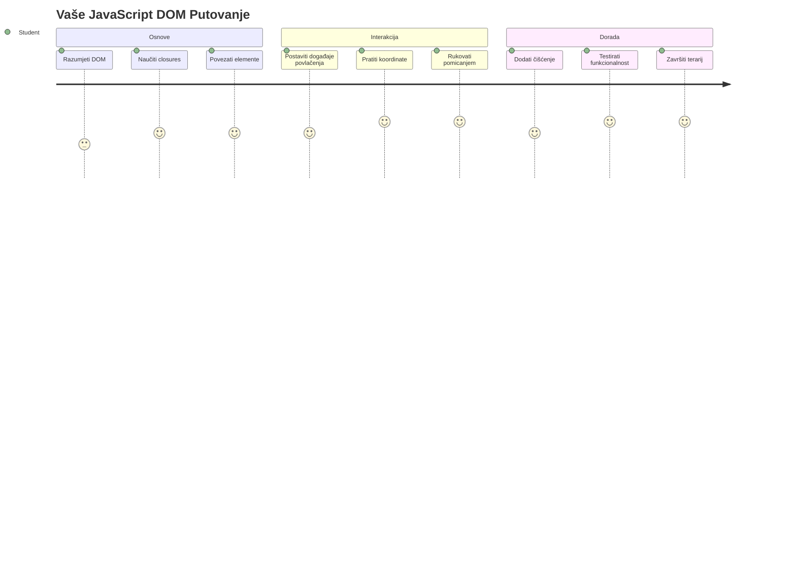
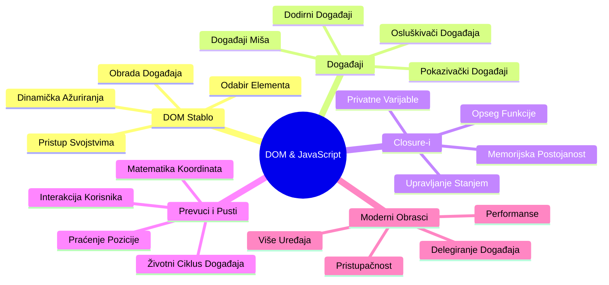
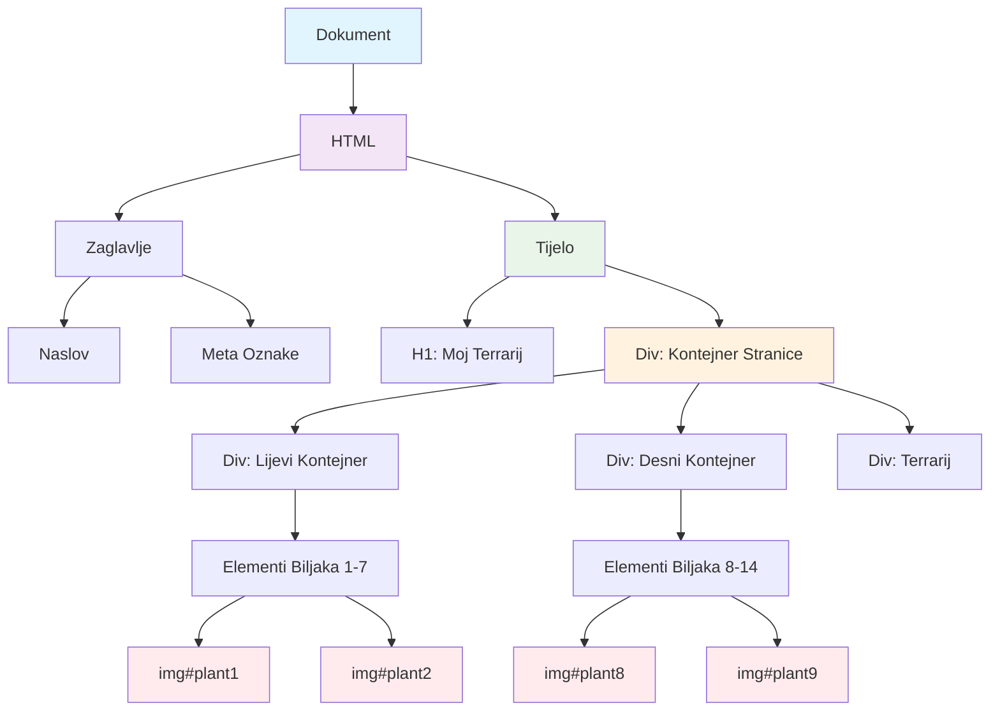
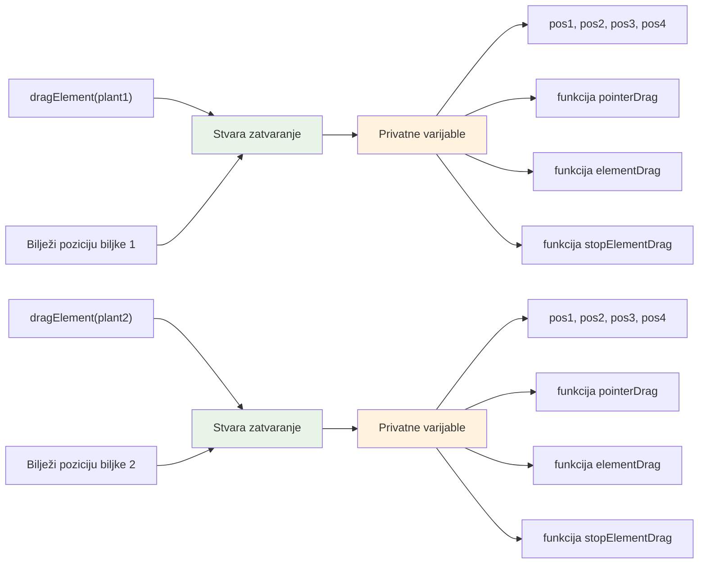
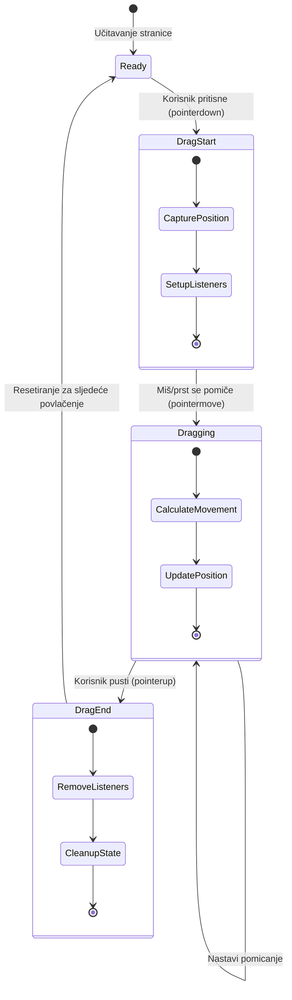
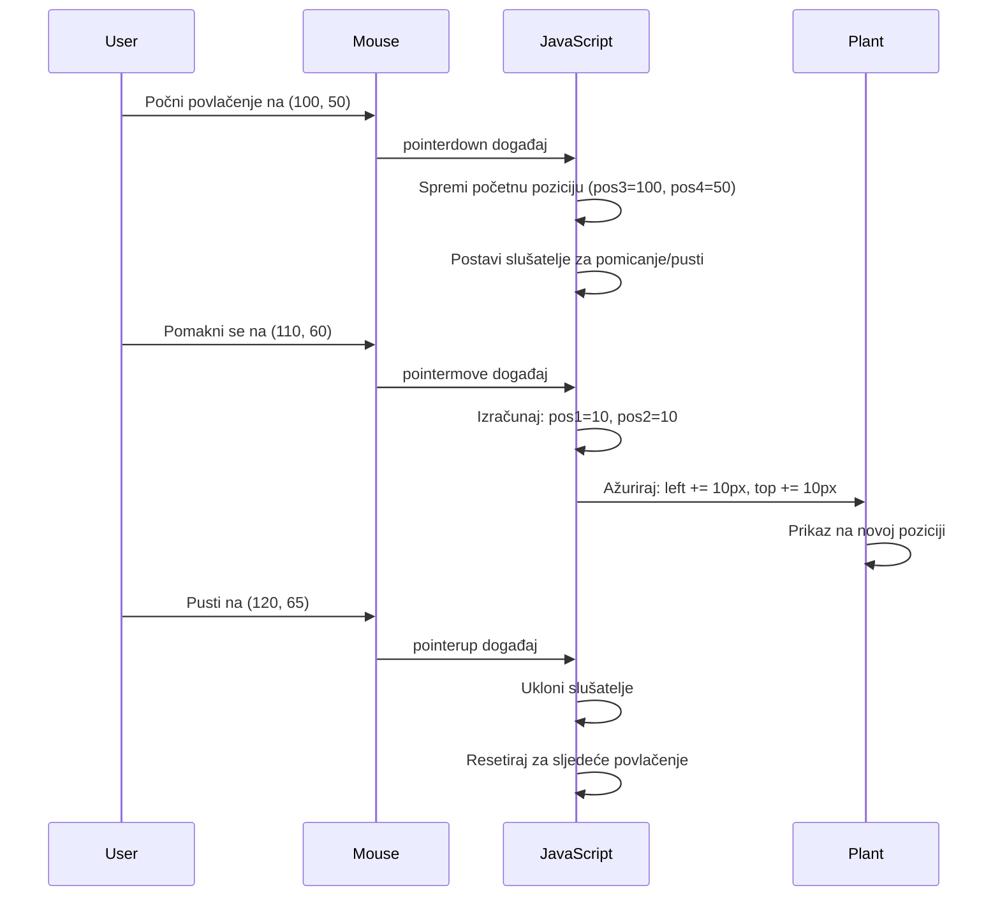
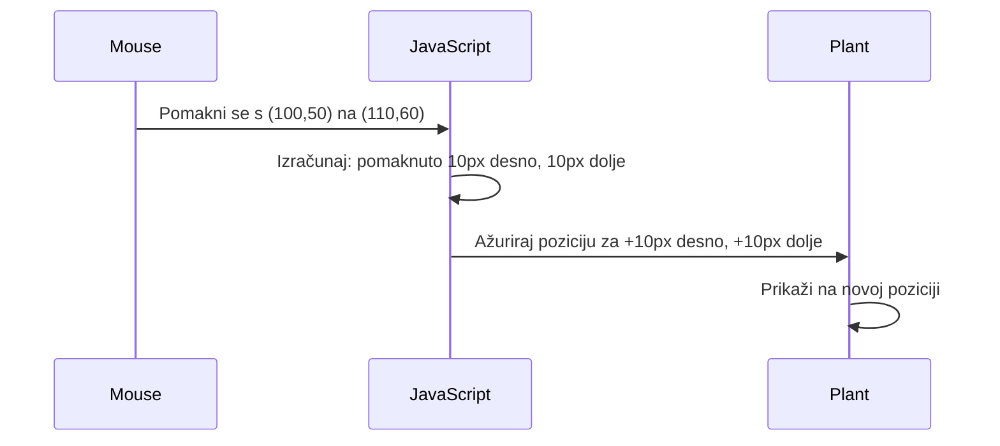
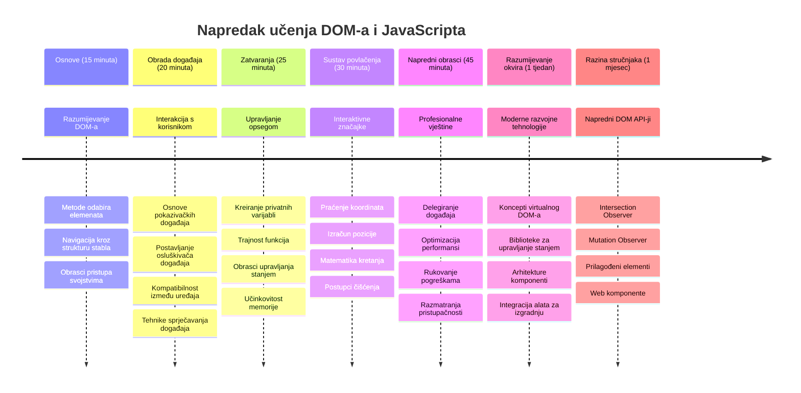

<!--
CO_OP_TRANSLATOR_METADATA:
{
  "original_hash": "973e48ad87d67bf5bb819746c9f8e302",
  "translation_date": "2026-01-07T09:29:01+00:00",
  "source_file": "3-terrarium/3-intro-to-DOM-and-closures/README.md",
  "language_code": "hr"
}
-->
# Terrarij Projekt Dio 3: Manipulacija DOM-om i JavaScript Zatvaranja



> Sketchnote autora [Tomomi Imura](https://twitter.com/girlie_mac)

Dobrodošli u jedan od najzanimljivijih aspekata web razvoja - stvaranje interaktivnosti! Document Object Model (DOM) je poput mosta između vašeg HTML-a i JavaScripta, a danas ćemo ga koristiti da oživimo vaš terrarij. Kada je Tim Berners-Lee stvorio prvi web preglednik, zamislio je web na kojem dokumenti mogu biti dinamični i interaktivni - DOM tu viziju čini mogućom.

Također ćemo istražiti JavaScript zatvaranja, što na prvi pogled može zvučati zastrašujuće. Razmislite o zatvaranjima kao o stvaranju "memorijskih džepova" u kojima vaše funkcije mogu pamtiti važne informacije. To je kao da svaka biljka u vašem terrariju ima svoj vlastiti zapis podataka za praćenje svoje pozicije. Na kraju ove lekcije, shvatit ćete koliko su prirodna i korisna.

Evo što gradimo: terrarij u kojem korisnici mogu povlačiti i ispuštati biljke gdje god žele. Naučit ćete tehnike manipulacije DOM-om koje pokreću sve od povuci-i-pusti prijenosa datoteka do interaktivnih igara. Oživimo vaš terrarij.


## Predpredavanje Kviz

[Predpredavanje kviz](https://ff-quizzes.netlify.app/web/quiz/19)

## Razumijevanje DOM-a: Vaš Ulaz u Interaktivne Web Stranice

Document Object Model (DOM) je način na koji JavaScript komunicira s vašim HTML elementima. Kada vaš preglednik učita HTML stranicu, on stvara strukturiranu reprezentaciju te stranice u memoriji - to je DOM. Zamislite ga kao obiteljsko stablo gdje je svaki HTML element član obitelji kojem JavaScript može pristupiti, mijenjati ga ili preraspodijeliti.

Manipulacija DOM-om pretvara statične stranice u interaktivne web stranice. Svaki put kada vidite da se gumb mijenja bojom pri prelasku mišem, sadržaj se ažurira bez osvježavanja stranice ili elemente koje možete povlačiti, to je DOM manipulacija na djelu.




> Reprezentacija DOM-a i HTML oznaka koje ga referenciraju. Iz [Olfa Nasraoui](https://www.researchgate.net/publication/221417012_Profile-Based_Focused_Crawler_for_Social_Media-Sharing_Websites)

**Evo što DOM čini moćnim:**
- **Pruža** strukturiran način pristupa bilo kojem elementu na vašoj stranici
- **Omogućuje** dinamička ažuriranja sadržaja bez osvježavanja stranice
- **Dozvoljava** odgovor u stvarnom vremenu na korisničke interakcije poput klikova i povlačenja
- **Stvara** temelj za moderne interaktivne web aplikacije

## JavaScript Zatvaranja: Stvaranje Organiziranog, Moćnog Koda

[JavaScript zatvaranje](https://developer.mozilla.org/docs/Web/JavaScript/Closures) je poput davanja funkciji vlastitog privatnog radnog prostora s trajnom memorijom. Razmislite o Darwinovim sjenicama na Galapagoskim otocima koje su razvile specijalizirane kljunove ovisno o njihovom određenom okolišu - zatvaranja rade slično, stvarajući specijalizirane funkcije koje "pamte" svoj specifični kontekst čak i nakon što njihova roditeljska funkcija završi.

U našem terrariju, zatvaranja pomažu svakoj biljci da pamti svoju poziciju neovisno. Ovaj obrazac se pojavljuje kroz profesionalni JavaScript razvoj, što ga čini vrijednim konceptom za razumijevanje.


> 💡 **Razumijevanje Zatvaranja**: Zatvaranja su važna tema u JavaScriptu, a mnogi programeri ih koriste godinama prije nego što u potpunosti shvate sve teorijske aspekte. Danas se fokusiramo na praktičnu primjenu - vidjet ćete zatvaranja prirodno kako se pojavljuju dok gradimo naše interaktivne značajke. Razumijevanje će se razvijati kako budete vidjeli kako rješavaju stvarne probleme.


> Reprezentacija DOM-a i HTML oznaka koje ga referenciraju. Iz [Olfa Nasraoui](https://www.researchgate.net/publication/221417012_Profile-Based_Focused_Crawler_for_Social_Media-Sharing_Websites)

U ovoj lekciji ćemo dovršiti naš interaktivni terrarij projekt stvaranjem JavaScripta koji će korisniku omogućiti manipuliranje biljkama na stranici.

## Prije nego što Počnemo: Postavljanje za Uspjeh

Trebate imati HTML i CSS datoteke iz prethodnih terrarij lekcija - spremni smo učiniti taj statični dizajn interaktivnim. Ako ste se pridružili prvi put, preporučujemo da prvo završite te lekcije za važan kontekst.

Evo što ćemo napraviti:
- **Glatko povlačenje i ispuštanje** svih biljaka u terrariju
- **Praćenje koordinata** tako da biljke pamte svoje pozicije
- **Potpuno interaktivno sučelje** koristeći vanilla JavaScript
- **Čist, organiziran kod** koristeći obrasce zatvaranja

## Postavljanje Vaše JavaScript Datoteke

Kreirajmo JavaScript datoteku koja će učiniti vaš terrarij interaktivnim.

**Korak 1: Kreirajte svoju skriptu**

U svojoj mapi terrarija, kreirajte novu datoteku nazvanu `script.js`.

**Korak 2: Povežite JavaScript sa svojim HTML-om**

Dodajte ovaj skript tag u odjeljak `<head>` vaše `index.html` datoteke:

```html
<script src="./script.js" defer></script>
```

**Zašto je atribut `defer` važan:**
- **Osigurava** da vaš JavaScript čeka dok se sav HTML ne učita
- **Sprječava** pogreške kada JavaScript traži elemente koji još nisu spremni
- **Jamči** da su svi vaši biljni elementi dostupni za interakciju
- **Pruža** bolju izvedbu nego postavljanje skripti na dno stranice

> ⚠️ **Važna Napomena**: Atribut `defer` sprječava uobičajene probleme s redoslijedom izvršavanja. Bez njega, JavaScript može pokušati pristupiti HTML elementima prije nego što su učitani, izazivajući pogreške.

---

## Povezivanje JavaScripta s Vašim HTML Elementima

Prije nego što možemo omogućiti povlačenje elemenata, JavaScript ih mora locirati u DOM-u. Zamislite to kao sustav katalogizacije u knjižnici - kad imate katalogski broj, možete pronaći točno knjigu koju trebate i pristupiti svim njezinim sadržajima.

Koristit ćemo metodu `document.getElementById()` za uspostavljanje ovih veza. To je poput preciznog sustava arhiviranja - vi dajete ID, a ona pronalazi točno onaj element koji vam treba u vašem HTML-u.

### Omogućavanje Funkcionalnosti Povlačenja za Sve Biljke

Dodajte ovaj kod u svoju datoteku `script.js`:

```javascript
// Omogući funkcionalnost povlačenja za svih 14 biljaka
dragElement(document.getElementById('plant1'));
dragElement(document.getElementById('plant2'));
dragElement(document.getElementById('plant3'));
dragElement(document.getElementById('plant4'));
dragElement(document.getElementById('plant5'));
dragElement(document.getElementById('plant6'));
dragElement(document.getElementById('plant7'));
dragElement(document.getElementById('plant8'));
dragElement(document.getElementById('plant9'));
dragElement(document.getElementById('plant10'));
dragElement(document.getElementById('plant11'));
dragElement(document.getElementById('plant12'));
dragElement(document.getElementById('plant13'));
dragElement(document.getElementById('plant14'));
```

**Evo što ovaj kod postiže:**
- **Locira** svaki biljni element u DOM-u koristeći njegov jedinstveni ID
- **Dohvaća** JavaScript referencu na svaki HTML element
- **Prosljeđuje** svaki element funkciji `dragElement` (koju ćemo sada kreirati)
- **Priprema** svaku biljku za interakciju povlačenja i ispuštanja
- **Povezuje** vašu HTML strukturu s JavaScript funkcionalnostima

> 🎯 **Zašto koristimo ID umjesto klasa?** ID-ovi pružaju jedinstvene identifikatore za specifične elemente, dok su CSS klase dizajnirane za stiliziranje grupa elemenata. Kada JavaScript treba manipulirati pojedinačnim elementima, ID-ovi pružaju preciznost i učinkovitost koja nam treba.

> 💡 **Pametni savjet**: Primijetite kako pozivamo `dragElement()` za svaku biljku zasebno. Ovaj pristup osigurava da svaka biljka dobije svoje neovisno ponašanje povlačenja, što je ključno za glatku korisničku interakciju.

### 🔄 **Pedagoška Provjera**
**Razumijevanje Povezivanja DOM-a**: Prije nego krenete u funkcionalnost povlačenja, potvrdite da možete:
- ✅ Objasniti kako `document.getElementById()` pronalazi HTML elemente
- ✅ Razumjeti zašto koristimo jedinstvene ID-ove za svaku biljku
- ✅ Opisati svrhu atributa `defer` u skriptama
- ✅ Prepoznati kako se JavaScript i HTML povezuju kroz DOM

**Brzi Samoprovjera**: Što bi se dogodilo da dva elementa imaju isti ID? Zašto `getElementById()` vraća samo jedan element?  
*Odgovor: ID-ovi trebaju biti jedinstveni; ako su duplicirani, vraća se samo prvi element*

---

## Izgradnja Funkcije zatvaranja za Element za Povlačenje

Sada ćemo stvoriti srce naše funkcionalnosti povlačenja: zatvaranje koje upravlja ponašanjem povlačenja za svaku biljku. Ovo zatvaranje će sadržavati više unutarnjih funkcija koje surađuju u praćenju pomaka miša i ažuriranju položaja elemenata.

Zatvaranja su savršena za ovaj zadatak jer nam omogućuju stvaranje "privatnih" varijabli koje traju između poziva funkcija, dajući svakoj biljci vlastiti sustav praćenja koordinata.

### Razumijevanje Zatvaranja kroz Jednostavan Primjer

Dopustite mi da pokažem zatvaranja s jednim jednostavnim primjerom koji ilustrira koncept:

```javascript
function createCounter() {
    let count = 0; // Ovo je poput privatne varijable
    
    function increment() {
        count++; // Unutarnja funkcija pamti vanjsku varijablu
        return count;
    }
    
    return increment; // Vraćamo unutarnju funkciju
}

const myCounter = createCounter();
console.log(myCounter()); // 1
console.log(myCounter()); // 2
```

**Evo što se događa u ovom obrascu zatvaranja:**
- **Stvara** privatnu varijablu `count` koja postoji samo unutar ovog zatvaranja
- **Unutarnja funkcija** može pristupiti i mijenjati tu vanjsku varijablu (mehanizam zatvaranja)
- **Kada vraćamo** unutarnju funkciju, ona održava vezu s tim privatnim podacima
- **Čak i nakon** što `createCounter()` završi izvođenje, `count` ostaje i pamti svoju vrijednost

### Zašto su zatvaranja savršena za funkcionalnost povlačenja

Za naš terrarij, svaka biljka treba pamtiti svoje trenutne koordinate pozicije. Zatvaranja pružaju savršeno rješenje:

**Ključne prednosti za naš projekt:**
- **Održava** privatne varijable položaja za svaku biljku neovisno
- **Čuva** podatke o koordinatama između događaja povlačenja
- **Sprječava** konflikte varijabli između različitih elemenata koje se mogu povlačiti
- **Stvara** čist i organiziran kod

> 🎯 **Cilj učenja**: Ne trebate odmah savladati svaki aspekt zatvaranja. Fokusirajte se na to kako nam pomažu organizirati kod i održavati stanje za našu funkcionalnost povlačenja.


### Kreiranje funkcije dragElement

Sada izgradimo glavnu funkciju koja će rukovati svojom logikom povlačenja. Dodajte ovu funkciju ispod deklaracija biljnih elemenata:

```javascript
function dragElement(terrariumElement) {
    // Inicijaliziraj varijable za praćenje položaja
    let pos1 = 0,  // Prethodna X pozicija miša
        pos2 = 0,  // Prethodna Y pozicija miša
        pos3 = 0,  // Trenutna X pozicija miša
        pos4 = 0;  // Trenutna Y pozicija miša
    
    // Postavi početnog slušača za događaj povlačenja
    terrariumElement.onpointerdown = pointerDrag;
}
```

**Razumijevanje sustava praćenja položaja:**
- **`pos1` i `pos2`**: Spremaju razliku između starog i novog položaja miša
- **`pos3` i `pos4`**: Prate trenutne koordinate miša
- **`terrariumElement`**: Specifični biljni element koji ćemo učiniti povlačivim
- **`onpointerdown`**: Događaj koji se aktivira kada korisnik počne povlačiti

**Evo kako radi obrazac zatvaranja:**
- **Stvara** privatne varijable položaja za svaki biljni element
- **Održava** te varijable kroz cijeli životni ciklus povlačenja
- **Osigurava** da svaka biljka prati svoje vlastite koordinate neovisno
- **Pruža** čist sučelje kroz funkciju `dragElement`

### Zašto koristiti Pointer Evente?

Možda se pitate zašto koristimo `onpointerdown` umjesto poznatijeg `onclick`. Evo objašnjenja:

| Tip događaja | Najbolji za | Mana |
|--------------|-------------|-------|
| `onclick`    | Jednostavni klikovi na gumb | Ne može rukovati povlačenjem (samo klik i otpuštanje) |
| `onpointerdown` | Miš i dodir | Noviji, ali danas dobro podržan |
| `onmousedown` | Samo miš na desktopu | Ne funkcionira za mobilne korisnike |

**Zašto su pointer eventi savršeni za ono što gradimo:**
- **Odlično rade** bilo da netko koristi miš, prst ili olovku
- **Isto se osjećaju** na laptopu, tabletu ili telefonu
- **Rukuje** aktivnim povlačenjem (ne samo klikom)
- **Stvara** glatko iskustvo koje korisnici očekuju od modernih web aplikacija

> 💡 **Buduća zaštita**: Pointer eventi su moderni način za rukovanje korisničkim interakcijama. Umjesto da pišete zaseban kod za miš i dodir, dobijete oba besplatno. Prilično zgodno, zar ne?

### 🔄 **Pedagoška Provjera**
**Razumijevanje rukovanja događajima**: Pauzirajte kako biste potvrdili razumijevanje događaja:
- ✅ Zašto koristimo pointer evente umjesto mouse eventa?
- ✅ Kako varijable zatvaranja traju između poziva funkcija?
- ✅ Koju ulogu ima `preventDefault()` u glatkom povlačenju?
- ✅ Zašto postavljamo slušače na dokument, a ne na pojedinačne elemente?

**Povezanost sa stvarnim svijetom**: Razmislite o sučeljima povuci-i-pusti koje svakodnevno koristite:
- **Prijenos datoteka**: Povlačenje datoteka u prozor preglednika
- **Kanban table**: Premještanje zadataka između stupaca
- **Galerije slika**: Promjena redoslijeda fotografija
- **Mobilna sučelja**: Klizanje i povlačenje na zaslonima osjetljivim na dodir

---

## Funkcija pointerDrag: Hvatanje Početka Povlačenja

Kada korisnik pritisne na biljku (bilo klikom miša ili dodirom prsta), funkcija `pointerDrag` kreće u akciju. Ova funkcija hvata početne koordinate i postavlja sustav povlačenja.

Dodajte ovu funkciju unutar svog zatvaranja `dragElement`, odmah nakon retka `terrariumElement.onpointerdown = pointerDrag;`:

```javascript
function pointerDrag(e) {
    // Spriječi zadano ponašanje preglednika (poput odabira teksta)
    e.preventDefault();
    
    // Zabilježi početnu poziciju miša/dodira
    pos3 = e.clientX;  // X koordinata na kojoj je početno povlačenje započeto
    pos4 = e.clientY;  // Y koordinata na kojoj je početno povlačenje započeto
    
    // Postavi slušače događaja za proces povlačenja
    document.onpointermove = elementDrag;
    document.onpointerup = stopElementDrag;
}
```

**Korak po korak, evo što se događa:**
- **Sprječava** zadano ponašanje preglednika koje bi moglo smetati povlačenju
- **Bilježi** točne koordinate gdje je korisnik započeo gestu povlačenja
- **Usmjerava** slušače događaja za nastavak praćenja pomicanja
- **Priprema** sustav za praćenje pokreta miša/prsta kroz cijeli dokument

### Razumijevanje sprečavanja događaja

Red `e.preventDefault()` je ključan za glatko povlačenje:

**Bez sprečavanja, preglednici bi mogli:**
- **Selektirati** tekst prilikom povlačenja preko stranice
- **Pokrenuti** kontekstne izbornike pri desnom kliku i povlačenju
- **Omesti** našu prilagođenu funkcionalnost povlačenja
- **Stvoriti** vizualne artefakte tijekom operacije povlačenja

> 🔍 **Eksperimentirajte**: Nakon završetka ove lekcije, pokušajte ukloniti `e.preventDefault()` i vidjeti kako to utječe na iskustvo povlačenja. Brzo ćete shvatiti zašto je ovaj redak neophodan!

### Sustav praćenja koordinata

Svojstva `e.clientX` i `e.clientY` daju nam precizne koordinate miša/dodira:

| Svojstvo | Što mjeri | Primjena |
|----------|------------|-----------|
| `clientX` | Horizontalnu poziciju relativno prema vidljivom dijelu prozora | Praćenje kretanja lijevo-desno |
| `clientY` | Vertikalnu poziciju relativno prema vidljivom dijelu prozora | Praćenje kretanja gore-dolje |
**Razumijevanje ovih koordinata:**
- **Pruža** podatke o pozicioniranju s pikselom precizno
- **Ažurira se** u stvarnom vremenu dok korisnik pomiče pokazivač
- **Ostaje** konzistentno na različitim veličinama zaslona i razinama zumiranja
- **Omogućuje** glatke, responzivne interakcije povlačenja

### Postavljanje slušatelja događaja na razini dokumenta

Primijetite kako povezujemo događaje pomicanja i zaustavljanja na cijeli `document`, a ne samo na element biljke:

```javascript
document.onpointermove = elementDrag;
document.onpointerup = stopElementDrag;
```

**Zašto povezati na dokument:**
- **Nastavlja** praćenje čak i kada miš izađe iz elementa biljke
- **Sprječava** prekid povlačenja ako korisnik brzo pomakne miš
- **Omogućuje** glatko povlačenje preko cijelog zaslona
- **Rješava** rubne slučajeve gdje pokazivač izađe iz prozora preglednika

> ⚡ **Napomena o izvedbi**: Očistit ćemo ove slušatelje na razini dokumenta kada povlačenje prestane kako bismo izbjegli curenje memorije i probleme s izvedbom.

## Završetak sustava povlačenja: pokretanje i čišćenje

Sada ćemo dodati preostale dvije funkcije koje upravljaju stvarnim pomicanjem pri povlačenju i čišćenjem nakon završetka povlačenja. Te funkcije surađuju kako bi se postiglo glatko, responzivno pomicanje biljke po vašem terariju.

### Funkcija elementDrag: praćenje pomicanja

Dodajte funkciju `elementDrag` odmah nakon zatvarajuće vitičaste zagrade funkcije `pointerDrag`:

```javascript
function elementDrag(e) {
    // Izračunaj udaljenost koju je objekt pomaknuo od posljednjeg događaja
    pos1 = pos3 - e.clientX;  // Horizontalna udaljenost pomaka
    pos2 = pos4 - e.clientY;  // Vertikalna udaljenost pomaka
    
    // Ažuriraj praćenje trenutne pozicije
    pos3 = e.clientX;  // Nova trenutačna X pozicija
    pos4 = e.clientY;  // Nova trenutačna Y pozicija
    
    // Primijeni pomak na poziciju elementa
    terrariumElement.style.top = (terrariumElement.offsetTop - pos2) + 'px';
    terrariumElement.style.left = (terrariumElement.offsetLeft - pos1) + 'px';
}
```

**Razumijevanje koordinatne matematike:**
- **`pos1` i `pos2`**: Izračunavaju koliko se miš pomaknuo od posljednjeg ažuriranja
- **`pos3` i `pos4`**: Spremaju trenutnu poziciju miša za sljedeću računski korak
- **`offsetTop` i `offsetLeft`**: Dohvaćaju trenutnu poziciju elementa na stranici
- **Logika oduzimanja**: Pomjera element za isti iznos koliko se miš pomaknuo


**Evo raščlambe izračuna pomaka:**
1. **Mjeri** razliku između stare i nove pozicije miša
2. **Izračunava** koliko treba pomaknuti element na temelju pomaka miša
3. **Ažurira** CSS pozicijske osobine elementa u stvarnom vremenu
4. **Sprema** novu poziciju kao bazu za sljedeći izračun pomaka

### Vizualni prikaz matematike


### Funkcija stopElementDrag: čišćenje

Dodajte funkciju za čišćenje odmah nakon zatvarajuće vitičaste zagrade funkcije `elementDrag`:

```javascript
function stopElementDrag() {
    // Ukloni slušatelje događaja na razini dokumenta
    document.onpointerup = null;
    document.onpointermove = null;
}
```

**Zašto je čišćenje važno:**
- **Sprječava** curenje memorije zbog preostalih slušatelja događaja
- **Zaustavlja** ponašanje povlačenja kad korisnik pusti biljku
- **Omogućuje** da se drugi elementi mogu povlačiti neovisno
- **Resetira** sustav za sljedeću operaciju povlačenja

**Što se događa bez čišćenja:**
- Slušatelji događaja nastavljaju raditi i nakon prestanka povlačenja
- Izvedba opada kako se nakupljaju neiskorišteni slušatelji
- Neočekivano ponašanje pri interakciji s drugim elementima
- Resursi preglednika se troše na nepotrebnu obradu događaja

### Razumijevanje CSS pozicijskih svojstava

Naš sustav povlačenja manipulira dvjema ključnim CSS osobinama:

| Svojstvo | Što kontrolira | Kako ga koristimo |
|----------|----------------|-------------------|
| `top` | Udaljenost od gornjeg ruba | Vertikalno pozicioniranje tijekom povlačenja |
| `left` | Udaljenost od lijevog ruba | Horizontalno pozicioniranje tijekom povlačenja |

**Ključni uvidi o offset svojstvima:**
- **`offsetTop`**: Trenutna udaljenost od vrha roditeljskog elementa s pozicioniranjem
- **`offsetLeft`**: Trenutna udaljenost od lijevog ruba roditeljskog elementa s pozicioniranjem
- **Kontekst pozicioniranja**: Ove vrijednosti su relativne najbližem položeno roditelju
- **Ažuriranja u stvarnom vremenu**: Mijenjaju se odmah pri izmjeni CSS osobina

> 🎯 **Filozofija dizajna**: Ovaj sustav povlačenja je namjerno fleksibilan – nema "zona za ispuštanje" ili ograničenja. Korisnici mogu postaviti biljke bilo gdje, dajući im potpunu kreativnu kontrolu nad dizajnom terarija.

## Sve zajedno: vaš kompletan sustav povlačenja

Čestitamo! Upravo ste izgradili sofisticirani sustav povlačenja i ispuštanja koristeći čisti JavaScript. Vaša kompletna funkcija `dragElement` sada sadrži moćan closure koji upravlja:

**Što vaš closure postiže:**
- **Održava** privatne varijable pozicije za svaku biljku neovisno
- **Upravlja** kompletnim životnim ciklusom povlačenja od početka do kraja
- **Pruža** glatko, responzivno pomicanje po cijelom zaslonu
- **Čisti** resurse ispravno kako bi spriječio curenja memorije
- **Kreira** intuitivno, kreativno sučelje za dizajn terarija

### Testiranje vašeg interaktivnog terarija

Sada testirajte svoj interaktivni terarij! Otvorite datoteku `index.html` u web pregledniku i isprobajte funkcionalnost:

1. **Kliknite i držite** bilo koju biljku da započnete povlačenje
2. **Pomaknite miš ili prst** i promatrajte kako biljka glatko prati pokrete
3. **Otpustite** da ispustite biljku na novu poziciju
4. **Eksperimentirajte** s različitim rasporedima i istražite sučelje

🥇 **Postignuće**: Stvorili ste potpuno interaktivnu web aplikaciju koristeći temeljne koncepte koje profesionalni developeri koriste svakodnevno. Ta funkcionalnost povlačenja i ispuštanja koristi iste principe iza uploadanja datoteka, kanban ploča i mnogih drugih interaktivnih sučelja.

### 🔄 **Pedagoški provjeravanje**
**Potpuno razumijevanje sustava**: Provjerite svoje razumijevanje kompletnog sustava povlačenja:
- ✅ Kako closures održavaju neovisno stanje za svaku biljku?
- ✅ Zašto je matematički izračun koordinata nužan za glatko kretanje?
- ✅ Što bi se dogodilo da zaboravimo očistiti slušatelje događaja?
- ✅ Kako se ovaj obrazac skalira na složenije interakcije?

**Razmišljanje o kvaliteti koda**: Pregledajte svoje kompletno rješenje:
- **Modularni dizajn**: Svaka biljka dobiva vlastitu instancu closure-a
- **Učinkovitost događaja**: Ispravno postavljanje i čišćenje slušatelja
- **Podrška za uređaje**: Radi na desktopu i mobilnim uređajima
- **Svijest o izvedbi**: Nema curenja memorije ili suvišnih izračuna


---

## Izazov GitHub Copilot agenta 🚀

Koristite Agent mod da dovršite sljedeći izazov:

**Opis:** Poboljšajte projekt terarija dodavanjem funkcionalnosti resetiranja koja vraća sve biljke na njihove početne pozicije s glatkim animacijama.

**Zadatak:** Napravite gumb za resetiranje koji, kad se klikne, animira sve biljke natrag na njihove izvorne pozicije sa strane koristeći CSS prijelaze. Funkcija treba pohraniti početne položaje pri učitavanju stranice i glatko vratiti biljke na te pozicije tijekom 1 sekunde prilikom pritiskanja gumba za reset.

Više o [agent modu](https://code.visualstudio.com/blogs/2025/02/24/introducing-copilot-agent-mode) pročitajte ovdje.

## 🚀 Dodatni izazov: Proširite svoje vještine

Spremni ste podići svoj terarij na višu razinu? Ispunite ove dodatke:

**Kreativne ekstenzije:**
- **Dvoklik** na biljku da je dovedete u prvi plan (manipulacija z-index-om)
- **Dodajte vizualnu povratnu informaciju** poput suptilnog sjaja pri prelasku mišem preko biljaka
- **Implementirajte granice** da spriječite povlačenje biljaka izvan terarija
- **Napravite funkciju spremanja** koja pamti pozicije biljaka koristeći localStorage
- **Dodajte zvučne efekte** prilikom podizanja i postavljanja biljaka

> 💡 **Prilika za učenje**: Svaki od ovih izazova će vas naučiti novim aspektima manipulacije DOM-om, rukovanja događajima i dizajna korisničkog iskustva.

## Kviz nakon predavanja

[Kviz nakon predavanja](https://ff-quizzes.netlify.app/web/quiz/20)

## Pregled i samostalno učenje: produbljivanje razumijevanja

Osvladali ste osnove manipulacije DOM-om i closures, ali uvijek ima prostora za istraživanje! Evo nekoliko smjerova za proširenje vašeg znanja i vještina.

### Alternativni pristupi povlačenju i ispuštanju

Koristili smo pokazivačke događaje za maksimalnu fleksibilnost, ali web razvoj nudi više pristupa:

| Pristup | Najbolje za | Vrijednost učenja |
|----------|-------------|-------------------|
| [HTML Drag and Drop API](https://developer.mozilla.org/docs/Web/API/HTML_Drag_and_Drop_API) | Upload datoteka, formalne zone za povlačenje | Razumijevanje izvornog ponašanja preglednika |
| [Touch Events](https://developer.mozilla.org/docs/Web/API/Touch_events) | Interakcije specifične za mobilne uređaje | Mobile-first razvojni obrasci |
| CSS `transform` osobine | Glatke animacije | Tehnike optimizacije izvedbe |

### Napredne teme manipulacije DOM-om

**Sljedeći koraci u učenju:**
- **Delegiranje događaja**: Efikasno upravljanje događajima za više elemenata
- **Intersection Observer**: Otkrivanje kada elementi ulaze ili izlaze iz vidljivog dijela
- **Mutation Observer**: Praćenje promjena u strukturi DOM-a
- **Web komponenta**: Kreiranje višekratno upotrebljivih, enkapsuliranih UI elemenata
- **Koncepti virtualnog DOM-a**: Razumijevanje kako frameworki optimiziraju ažuriranja DOM-a

### Bitni izvori za kontinuirano učenje

**Tehnička dokumentacija:**
- [MDN vodič za Pointer Events](https://developer.mozilla.org/docs/Web/API/Pointer_events) - Sveobuhvatna referenca pointer događaja
- [W3C specifikacija za Pointer Events](https://www.w3.org/TR/pointerevents1/) - Službena dokumentacija standarda
- [Duboko o JavaScript closures](https://developer.mozilla.org/docs/Web/JavaScript/Closures) - Napredni obrasci closure-a

**Kompatibilnost preglednika:**
- [CanIUse.com](https://caniuse.com/) - Provjera podrške značajki u preglednicima
- [MDN Browser Compatibility Data](https://github.com/mdn/browser-compat-data) - Detaljne informacije o kompatibilnosti

**Prilike za vježbu:**
- **Izgradite** puzzle igru koristeći sličnu mehaniku povlačenja
- **Napravite** kanban ploču s upravljanjem zadacima povlačenjem i ispuštanjem
- **Dizajnirajte** galeriju slika sa sortirajućim slikama povlačenjem
- **Eksperimentirajte** s dodirnim gestama za mobilna sučelja

> 🎯 **Strategija učenja**: Najbolji način da utvrdite ove koncepte je praksa. Isprobajte izradu varijacija sučelja za povlačenje – svaki projekt naučit će vas nešto novo o interakciji korisnika i manipulaciji DOM-om.

### ⚡ **Što možete učiniti u sljedećih 5 minuta**
- [ ] Otvorite DevTools u pregledniku i upišite `document.querySelector('body')` u konzolu
- [ ] Probajte promijeniti tekst na web stranici koristeći `innerHTML` ili `textContent`
- [ ] Dodajte slušatelj događaja klika na bilo koji gumb ili vezu na stranici
- [ ] Istražite strukturu DOM stabla koristeći panel Elements

### 🎯 **Što možete postići u ovom satu**
- [ ] Dovršite kviz nakon lekcije i pregledajte koncepte manipulacije DOM-om
- [ ] Napravite interaktivnu web stranicu koja reagira na korisničke klike
- [ ] Vježbajte rukovanje događajima s različitim vrstama (click, mouseover, keypress)
- [ ] Izradite jednostavnu listu zadataka ili brojač korištenjem manipulacije DOM-om
- [ ] Istražite odnos između HTML elemenata i JavaScript objekata

### 📅 **Vaše tjedno putovanje kroz JavaScript**
- [ ] Dovršite projekt interaktivnog terarija s povlačenjem i ispuštanjem
- [ ] Ovladate event delegacijom za učinkovito rukovanje događajima
- [ ] Naučite o event loopu i asinkronom JavaScriptu
- [ ] Vježbajte closures izrađujući module s privatnim stanjima
- [ ] Istražite moderne DOM API-je poput Intersection Observera
- [ ] Napravite interaktivne komponente bez korištenja frameworka

### 🌟 **Vaša mjesečna ovladavanja JavaScript-om**
- [ ] Izradite složenu single-page aplikaciju koristeći vanilla JavaScript
- [ ] Naučite moderni framework (React, Vue ili Angular) i usporedite s vanilla DOM-om
- [ ] Doprinosite open source JavaScript projektima
- [ ] Ovladate naprednim konceptima poput web komponenti i custom elemenata
- [ ] Izradite performantne web aplikacije s optimalnim DOM obrascima
- [ ] Podučavajte druge o manipulaciji DOM-om i osnovama JavaScript-a

## 🎯 Vaš vremenski plan majstorstva JavaScript DOM-a


### 🛠️ Sažetak vašeg JavaScript alata

Nakon dovršetka ove lekcije, sada imate:
- **Ovladavanje DOM-om**: Selekcija elemenata, manipulacija svojstvima, navigacija po stablu
- **Ekspertiza u događajima**: Rukovanje interakcijama na svim uređajima pomoću pointer događaja
- **Razumijevanje closures**: Upravljanje privatnim stanjem i trajanje funkcija
- **Interaktivni sustavi**: Potpuna implementacija povlačenja i ispuštanja od nule
- **Svijest o izvedbi**: Ispravno čišćenje događaja i upravljanje memorijom
- **Moderni obrasci**: Tehnike organizacije koda korištene u profesionalnom razvoju
- **Korisničko iskustvo**: Kreiranje intuitivnih, responzivnih sučelja

**Profesionalne vještine koje ste stekli**: Izgradili ste značajke koristeći iste tehnike kao:
- **Trello/Kanban ploče**: Povlačenje kartica između kolona
- **Sustavi za upload datoteka**: Rukovanje datotekama povlačenjem i ispuštanjem
- **Galerije slika**: Sučelja za raspored fotografija
- **Mobilne aplikacije**: Obrasci za dodirne interakcije

**Sljedeći nivo**: Spremni ste istražiti moderne frameworke poput React, Vue ili Angular koji nadograđuju ove temeljne koncepte manipulacije DOM-om!

## Zadatak

[Radite još malo s DOM-om](assignment.md)

---

<!-- CO-OP TRANSLATOR DISCLAIMER START -->
**Izjava o odricanju odgovornosti**:
Ovaj dokument preveden je pomoću AI prevoditeljskog servisa [Co-op Translator](https://github.com/Azure/co-op-translator). Iako nastojimo postići točnost, imajte na umu da automatski prijevodi mogu sadržavati pogreške ili netočnosti. Izvornik dokumenta na izvornom jeziku treba smatrati službenim i autoritativnim izvorom. Za kritične informacije preporučuje se profesionalni ljudski prijevod. Ne snosimo odgovornost za bilo kakva nesporazuma ili kriva tumačenja koja proizađu iz korištenja ovog prijevoda.
<!-- CO-OP TRANSLATOR DISCLAIMER END -->