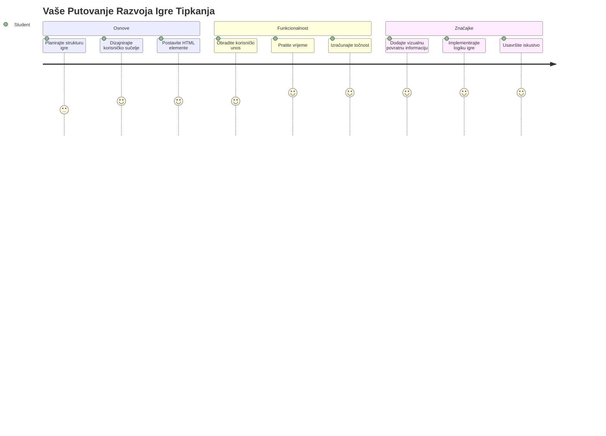
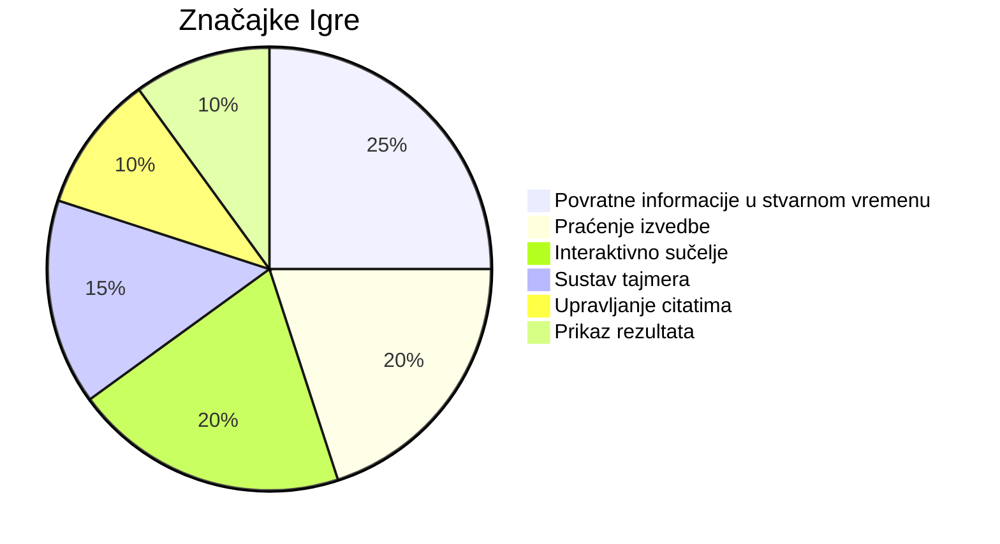
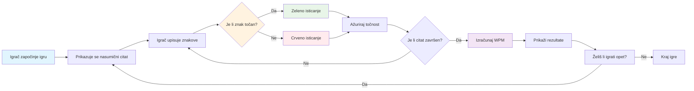
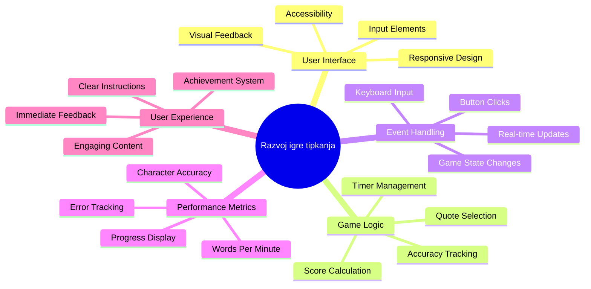
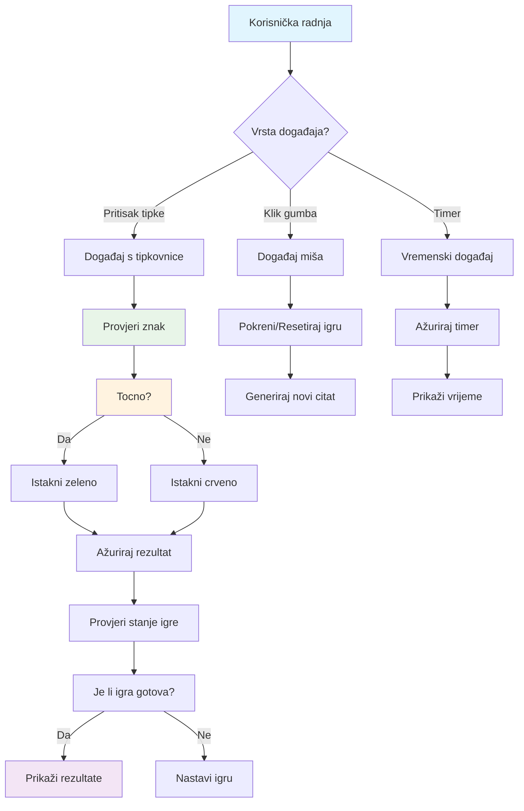
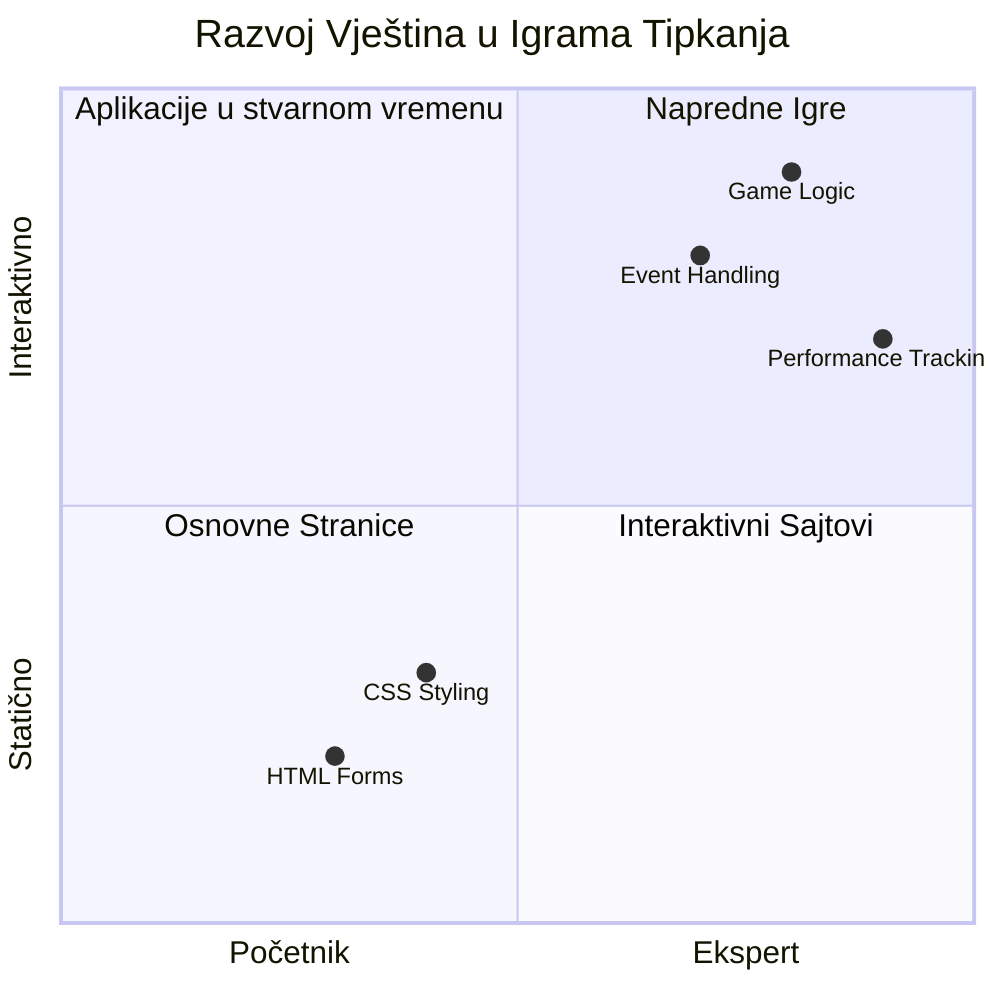
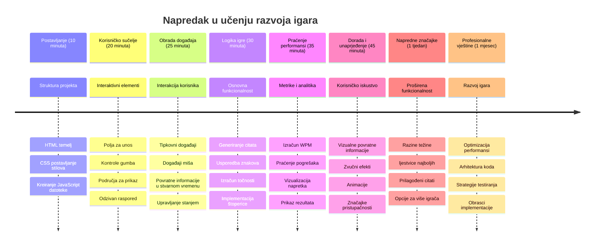

<!--
CO_OP_TRANSLATOR_METADATA:
{
  "original_hash": "efa2ab875b8bb5a7883816506da6b6d2",
  "translation_date": "2026-01-07T08:42:46+00:00",
  "source_file": "4-typing-game/README.md",
  "language_code": "hr"
}
-->
# Programiranje vođeno događajima - Izgradite igru tipkanja

## Uvod

Evo nečega što svaki programer zna, ali o tome rijetko govori: brzo tipkanje je supermoć! 🚀 Razmislite o tome - što brže možete prenijeti svoje ideje iz mozga u uređivač koda, to vaša kreativnost može bolje teći. To je kao imati izravan kanal između vaših misli i ekrana.

Želite li znati jedan od najboljih načina za unaprijediti ovu vještinu? Pogodili ste - izgradit ćemo igru!

> Hajde da zajedno stvorimo sjajnu igru tipkanja!

Spremni ste primijeniti sve te vještine JavaScript-a, HTML-a i CSS-a koje ste učili? Izgradit ćemo igru tipkanja koja će vas izazivati sa slučajnim citatima legendarnog detektiva [Sherlocka Holmesa](https://en.wikipedia.org/wiki/Sherlock_Holmes). Igra će pratiti koliko brzo i točno možete tipkati - i vjerujte mi, to je zaraznije nego što mislite!

## Što trebate znati

Prije nego što krenemo, pobrinite se da ste upoznati s ovim pojmovima (ne brinite ako trebate brz podsjetnik - svi smo tamo bili!):

- Kreiranje tekstualnih unosa i kontrola gumba
- CSS i postavljanje stilova pomoću klasa  
- Osnove JavaScripta
  - Kreiranje niza
  - Kreiranje slučajnog broja
  - Dohvaćanje trenutačnog vremena

Ako vam je nešto od ovoga malo zaboravljeno, to je potpuno u redu! Ponekad je najbolji način da učvrstite svoje znanje skočiti u projekt i učiti usput.

### 🔄 **Pedagoška provjera**
**Procjena osnova**: Prije početka razvoja, provjerite razumijete li:
- ✅ Kako HTML forme i elementi za unos funkcioniraju
- ✅ CSS klase i dinamičko stiliziranje
- ✅ JavaScript događaje i handlere
- ✅ Manipulaciju nizovima i slučajan odabir
- ✅ Mjerenje vremena i izračune

**Brzi samoprovjeru**: Možete li objasniti kako ovi koncepti zajedno rade u interaktivnoj igri?
- **Događaji** se pokreću kad korisnici stupaju u interakciju s elementima
- **Handleri** obrađuju te događaje i ažuriraju stanje igre
- **CSS** pruža vizualnu povratnu informaciju za korisničke radnje
- **Mjerenje vremena** omogućuje praćenje performansi i napredak igre

## Izgradimo ovo!

[Izrada igre tipkanja pomoću programiranja vođenog događajima](./typing-game/README.md)

### ⚡ **Što možete raditi u sljedećih 5 minuta**
- [ ] Otvorite konzolu preglednika i pokušajte slušati tipkovne događaje s `addEventListener`
- [ ] Kreirajte jednostavnu HTML stranicu s poljem za unos i testirajte detekciju tipkanja
- [ ] Vježbajte manipulaciju nizovima uspoređujući uneseni tekst s ciljnim tekstom
- [ ] Eksperimentirajte s `setTimeout` da razumijete funkcije vremenskog upravljanja

### 🎯 **Što možete postići u sljedećem satu**
- [ ] Završite kviz nakon lekcije i razumite programiranje vođeno događajima
- [ ] Izradite osnovnu verziju igre tipkanja s validacijom riječi
- [ ] Dodajte vizualnu povratnu informaciju za točno i netočno tipkanje
- [ ] Implementirajte jednostavan sustav bodovanja na temelju brzine i točnosti
- [ ] Stilizirajte svoju igru CSS-om da bi bila vizualno privlačna

### 📅 **Vaš tjedan razvoja igre**
- [ ] Dovršite punu igru tipkanja sa svim značajkama i poliranjem
- [ ] Dodajte razine težine s različitim složenostima riječi
- [ ] Implementirajte praćenje korisničkih statistika (WPM, točnost tijekom vremena)
- [ ] Kreirajte zvučne efekte i animacije za bolje korisničko iskustvo
- [ ] Učinite svoju igru prilagođenom za mobilne uređaje s dodirnim zaslonima
- [ ] Podijelite svoju igru na mreži i prikupite povratne informacije korisnika

### 🌟 **Vaš mjesečni interaktivni razvoj**
- [ ] Izradite više igara koje istražuju različite obrasce interakcije
- [ ] Naučite o game loopovima, upravljanju stanjima i optimizaciji performansi
- [ ] Doprinosite open source projektima razvoja igara
- [ ] Usavršite napredne koncepte mjerenja vremena i glatkih animacija
- [ ] Kreirajte portfolio koji prikazuje razne interaktivne aplikacije
- [ ] Mentorirajte druge zainteresirane za razvoj igara i korisničku interakciju

## 🎯 Vaš vremenski plan za savladavanje igre tipkanja

### 🛠️ Sažetak vašeg alata za razvoj igre

Nakon dovršetka ovog projekta savladat ćete:
- **Programiranje vođeno događajima**: Reagirajući korisnički sučelja koja odgovaraju na unos
- **Povratnu informaciju u stvarnom vremenu**: Trenutna vizualna i izvedbena ažuriranja
- **Mjerenje performansi**: Precizni sustavi mjerenja vremena i bodovanja
- **Upravljanje stanjem igre**: Kontrola tijeka aplikacije i korisničkog iskustva
- **Interaktivni dizajn**: Stvaranje zanimljivih, zaraznih korisničkih iskustava
- **Moderne web API-jeve**: Korištenje mogućnosti preglednika za bogate interakcije
- **Obrasce pristupačnosti**: Uključivi dizajn za sve korisnike

**Primjene u stvarnom svijetu**: Ove vještine direktno se primjenjuju na:
- **Web aplikacije**: Bilo koje interaktivno sučelje ili nadzorna ploča
- **Obrazovni softver**: Platforme za učenje i alati za procjenu vještina
- **Alati za produktivnost**: Tekstualni uređivači, IDE-i i softver za suradnju
- **Industrija igara**: Igre unutar preglednika i interaktivna zabava
- **Mobilni razvoj**: Sučelja na dodir i upravljanje gestama

**Sljedeća razina**: Spremni ste istražiti napredne okvire za igre, sustave za multiplayer u stvarnom vremenu ili složene interaktivne aplikacije!

## Zasluge

Napisao s ljubavlju ♥️ [Christopher Harrison](http://www.twitter.com/geektrainer)

---

<!-- CO-OP TRANSLATOR DISCLAIMER START -->
**Ograničenje odgovornosti**:  
Ovaj je dokument preveden korištenjem AI prevoditeljske usluge [Co-op Translator](https://github.com/Azure/co-op-translator). Iako nastojimo postići točnost, imajte na umu da automatski prijevodi mogu sadržavati pogreške ili netočnosti. Izvorni dokument na izvornom jeziku treba smatrati autoritativnim izvorom. Za kritične informacije preporučuje se profesionalni ljudski prijevod. Ne prihvaćamo odgovornost za bilo kakva nesporazume ili pogrešna tumačenja proizašla iz korištenja ovog prijevoda.
<!-- CO-OP TRANSLATOR DISCLAIMER END -->