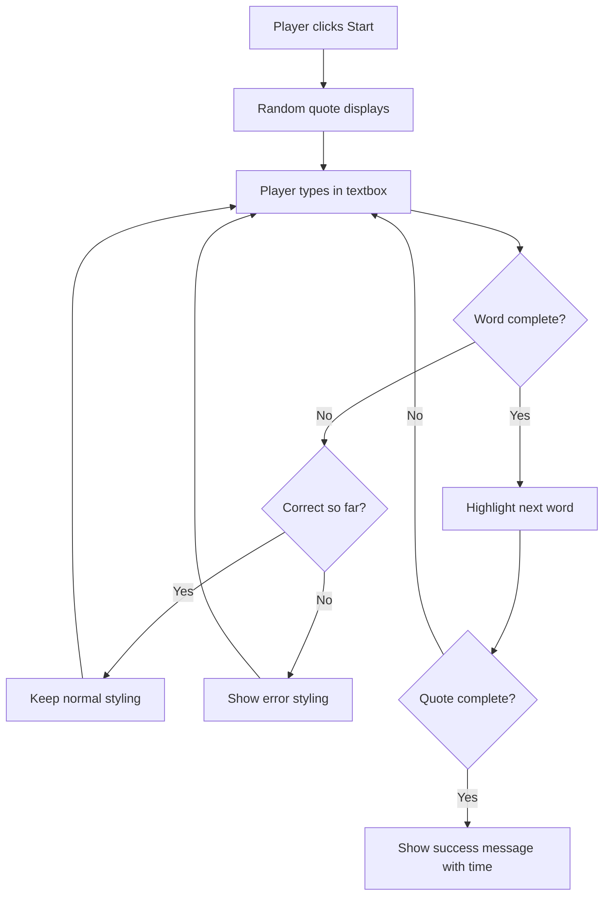
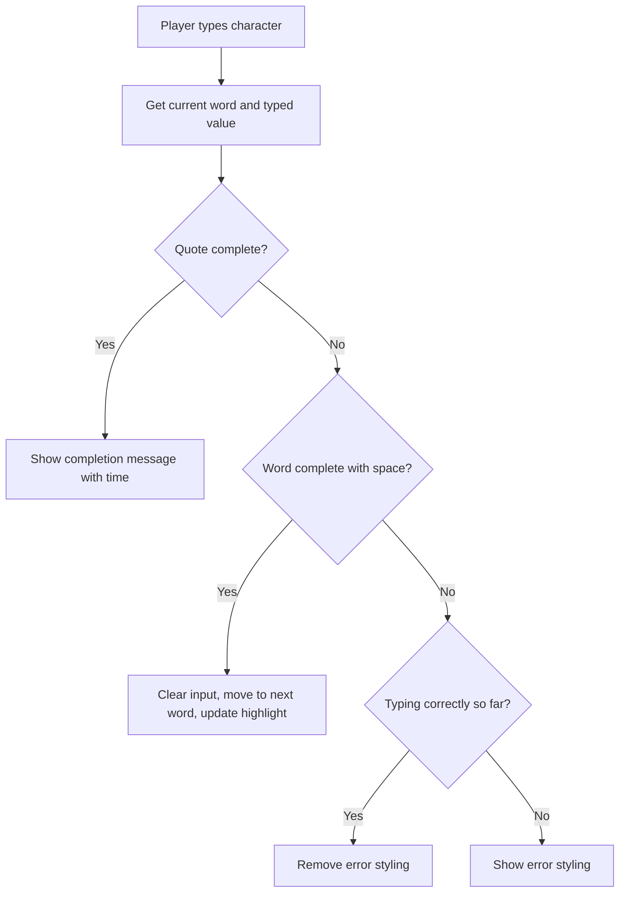

<!--
CO_OP_TRANSLATOR_METADATA:
{
  "original_hash": "e6b75e5b8caae906473a8a09d77b7121",
  "translation_date": "2025-10-25T00:09:32+00:00",
  "source_file": "4-typing-game/typing-game/README.md",
  "language_code": "hr"
}
-->
# Kreiranje igre pomoću događaja

Jeste li se ikada pitali kako web stranice znaju kada kliknete na gumb ili upišete tekst u okvir? To je čarolija programiranja vođenog događajima! Koji je bolji način za učenje ove ključne vještine nego izradom nečeg korisnog - igre brzog tipkanja koja reagira na svaki vaš pritisak tipke.

Vidjet ćete iz prve ruke kako web preglednici "komuniciraju" s vašim JavaScript kodom. Svaki put kad kliknete, tipkate ili pomičete miš, preglednik šalje male poruke (zovemo ih događaji) vašem kodu, a vi odlučujete kako ćete reagirati!

Do kraja ovog vodiča, izradit ćete pravu igru tipkanja koja prati vašu brzinu i točnost. Još važnije, razumjet ćete osnovne koncepte koji pokreću svaku interaktivnu web stranicu koju ste ikada koristili. Krenimo!

## Kviz prije predavanja

[Pre-lecture quiz](https://ff-quizzes.netlify.app/web/quiz/21)

## Programiranje vođeno događajima

Razmislite o svojoj omiljenoj aplikaciji ili web stranici - što je čini živom i responzivnom? Sve se svodi na to kako reagira na vaše radnje! Svaki dodir, klik, povlačenje ili pritisak tipke stvara ono što zovemo "događaj", i tu se događa prava čarolija web razvoja.

Evo što programiranje za web čini tako zanimljivim: nikada ne znamo kada će netko kliknuti taj gumb ili početi tipkati u tekstualni okvir. Možda će kliknuti odmah, čekati pet minuta ili možda nikada neće kliknuti! Ova nepredvidivost znači da moramo razmišljati drugačije o tome kako pišemo svoj kod.

Umjesto da pišemo kod koji se izvršava od vrha do dna poput recepta, pišemo kod koji strpljivo čeka da se nešto dogodi. To je slično kao što su telegrafisti u 1800-ima sjedili uz svoje strojeve, spremni odgovoriti čim poruka stigne putem žice.

Dakle, što je točno "događaj"? Jednostavno rečeno, to je nešto što se događa! Kada kliknete na gumb - to je događaj. Kada upišete slovo - to je događaj. Kada pomaknete miš - to je još jedan događaj.

Programiranje vođeno događajima omogućuje nam da postavimo naš kod da sluša i reagira. Kreiramo posebne funkcije koje se zovu **slušači događaja** i koje strpljivo čekaju da se dogodi nešto specifično, a zatim se aktiviraju kada se to dogodi.

Zamislite slušatelje događaja kao zvono na vratima za vaš kod. Postavite zvono na vratima (`addEventListener()`), kažete mu koji zvuk treba slušati (poput 'klik' ili 'pritisak tipke'), a zatim odredite što bi se trebalo dogoditi kada netko zazvoni (vaša prilagođena funkcija).

**Kako funkcioniraju slušatelji događaja:**
- **Slušaju** specifične radnje korisnika poput klikova, pritisaka tipki ili pomicanja miša
- **Izvršavaju** vaš prilagođeni kod kada se dogodi određeni događaj
- **Reagiraju** odmah na interakcije korisnika, stvarajući besprijekorno iskustvo
- **Rukovode** višestrukim događajima na istom elementu koristeći različite slušatelje

> **NOTE:** Vrijedi istaknuti da postoji mnogo načina za kreiranje slušatelja događaja. Možete koristiti anonimne funkcije ili kreirati imenovane. Možete koristiti razne prečace, poput postavljanja svojstva `click`, ili korištenja `addEventListener()`. U našem zadatku fokusirat ćemo se na `addEventListener()` i anonimne funkcije, jer je to vjerojatno najčešća tehnika koju web programeri koriste. Također je najfleksibilnija, jer `addEventListener()` radi za sve događaje, a ime događaja može se pružiti kao parametar.

### Uobičajeni događaji

Iako web preglednici nude desetke različitih događaja koje možete slušati, većina interaktivnih aplikacija oslanja se na samo nekoliko osnovnih događaja. Razumijevanje ovih ključnih događaja pružit će vam temelj za izgradnju sofisticiranih korisničkih interakcija.

Postoji [desetak događaja](https://developer.mozilla.org/docs/Web/Events) koje možete slušati prilikom kreiranja aplikacije. U osnovi, sve što korisnik radi na stranici pokreće događaj, što vam daje puno moći da osigurate da dobiju željeno iskustvo. Srećom, obično će vam trebati samo nekoliko osnovnih događaja. Evo nekoliko uobičajenih (uključujući dva koja ćemo koristiti pri kreiranju naše igre):

| Događaj | Opis | Uobičajeni slučajevi upotrebe |
|---------|------|-----------------------------|
| `click` | Korisnik je kliknuo na nešto | Gumbi, poveznice, interaktivni elementi |
| `contextmenu` | Korisnik je kliknuo desnom tipkom miša | Prilagođeni izbornici desnog klika |
| `select` | Korisnik je označio neki tekst | Uređivanje teksta, operacije kopiranja |
| `input` | Korisnik je unio neki tekst | Validacija obrazaca, pretraživanje u stvarnom vremenu |

**Razumijevanje ovih vrsta događaja:**
- **Pokreću** se kada korisnici interagiraju s određenim elementima na vašoj stranici
- **Pružaju** detaljne informacije o radnji korisnika putem objekata događaja
- **Omogućuju** stvaranje responzivnih, interaktivnih web aplikacija
- **Funkcioniraju** dosljedno na različitim preglednicima i uređajima

## Kreiranje igre

Sada kada razumijete kako događaji funkcioniraju, primijenimo to znanje u praksi izradom nečeg korisnog. Kreirat ćemo igru brzog tipkanja koja demonstrira rukovanje događajima dok vam pomaže razviti važnu vještinu programiranja.

Izradit ćemo igru kako bismo istražili kako događaji funkcioniraju u JavaScriptu. Naša igra testirat će vještinu tipkanja igrača, što je jedna od najpodcjenjenijih vještina koju bi svi programeri trebali imati. Zanimljivost: raspored tipkovnice QWERTY koji danas koristimo zapravo je dizajniran 1870-ih za pisaće strojeve - a dobre vještine tipkanja i dalje su jednako vrijedne za programere danas! Opći tijek igre izgledat će ovako:



**Kako će naša igra funkcionirati:**
- **Počinje** kada igrač klikne gumb za početak i prikazuje nasumični citat
- **Prati** napredak igrača u tipkanju riječ po riječ u stvarnom vremenu
- **Ističe** trenutnu riječ kako bi usmjerio fokus igrača
- **Pruža** trenutnu vizualnu povratnu informaciju za greške u tipkanju
- **Izračunava** i prikazuje ukupno vrijeme kada je citat dovršen

Krenimo s izradom naše igre i učenjem o događajima!

### Struktura datoteka

Prije nego što počnemo kodirati, organizirajmo se! Imati čistu strukturu datoteka od početka uštedjet će vam glavobolje kasnije i učiniti vaš projekt profesionalnijim. 😊

Zadržat ćemo stvari jednostavnima s samo tri datoteke: `index.html` za strukturu stranice, `script.js` za svu logiku igre i `style.css` kako bi sve izgledalo sjajno. Ovo je klasična trojka koja pokreće većinu weba!

**Kreirajte novu mapu za svoj rad otvaranjem konzole ili terminala i izdavanjem sljedeće naredbe:**

```bash
# Linux or macOS
mkdir typing-game && cd typing-game

# Windows
md typing-game && cd typing-game
```

**Što ove naredbe rade:**
- **Kreiraju** novi direktorij nazvan `typing-game` za vaše projektne datoteke
- **Navigiraju** automatski u novokreirani direktorij
- **Postavljaju** čisto radno okruženje za razvoj vaše igre

**Otvorite Visual Studio Code:**

```bash
code .
```

**Ova naredba:**
- **Pokreće** Visual Studio Code u trenutnom direktoriju
- **Otvara** vašu projektnu mapu u uređivaču
- **Omogućuje** pristup svim alatima za razvoj koji su vam potrebni

**Dodajte tri datoteke u mapu u Visual Studio Code s sljedećim nazivima:**
- `index.html` - Sadrži strukturu i sadržaj vaše igre
- `script.js` - Rukuje svom logikom igre i slušateljima događaja
- `style.css` - Definira vizualni izgled i stilizaciju

## Kreiranje korisničkog sučelja

Sada izgradimo pozornicu na kojoj će se odvijati sva akcija naše igre! Zamislite ovo kao dizajniranje kontrolne ploče za svemirski brod - moramo osigurati da je sve što naši igrači trebaju točno tamo gdje to očekuju.

Razmislimo što naša igra zapravo treba. Da igrate igru tipkanja, što biste željeli vidjeti na ekranu? Evo što ćemo trebati:

| Element sučelja | Svrha | HTML element |
|------------------|-------|--------------|
| Prikaz citata | Prikazuje tekst za tipkanje | `<p>` s `id="quote"` |
| Područje poruka | Prikazuje status i poruke o uspjehu | `<p>` s `id="message"` |
| Tekstualni unos | Mjesto gdje igrači upisuju citat | `<input>` s `id="typed-value"` |
| Gumb za početak | Započinje igru | `<button>` s `id="start"` |

**Razumijevanje strukture sučelja:**
- **Organizira** sadržaj logično od vrha prema dolje
- **Dodjeljuje** jedinstvene ID-ove elementima za ciljanje u JavaScriptu
- **Pruža** jasnu vizualnu hijerarhiju za bolji korisnički doživljaj
- **Uključuje** semantičke HTML elemente za pristupačnost

Svaki od tih elemenata trebat će ID-ove kako bismo mogli raditi s njima u našem JavaScriptu. Također ćemo dodati reference na CSS i JavaScript datoteke koje ćemo kreirati.

Kreirajte novu datoteku pod nazivom `index.html`. Dodajte sljedeći HTML:

```html
<!-- inside index.html -->
<html>
<head>
  <title>Typing game</title>
  <link rel="stylesheet" href="style.css">
</head>
<body>
  <h1>Typing game!</h1>
  <p>Practice your typing skills with a quote from Sherlock Holmes. Click **start** to begin!</p>
  <p id="quote"></p> <!-- This will display our quote -->
  <p id="message"></p> <!-- This will display any status messages -->
  <div>
    <input type="text" aria-label="current word" id="typed-value" /> <!-- The textbox for typing -->
    <button type="button" id="start">Start</button> <!-- To start the game -->
  </div>
  <script src="script.js"></script>
</body>
</html>
```

**Razlaganje onoga što ova HTML struktura postiže:**
- **Povezuje** CSS stilsku datoteku u `<head>` za stilizaciju
- **Kreira** jasan naslov i upute za korisnike
- **Postavlja** rezervirane odlomke s određenim ID-ovima za dinamički sadržaj
- **Uključuje** polje za unos s atributima za pristupačnost
- **Pruža** gumb za početak igre
- **Učitava** JavaScript datoteku na kraju za optimalne performanse

### Pokretanje aplikacije

Često testiranje vaše aplikacije tijekom razvoja pomaže vam da rano uočite probleme i vidite svoj napredak u stvarnom vremenu. Live Server je neprocjenjiv alat koji automatski osvježava vaš preglednik kad god spremite promjene, čineći razvoj mnogo učinkovitijim.

Uvijek je najbolje razvijati iterativno kako biste vidjeli kako stvari izgledaju. Pokrenimo našu aplikaciju. Postoji sjajan dodatak za Visual Studio Code pod nazivom [Live Server](https://marketplace.visualstudio.com/items?itemName=ritwickdey.LiveServer&WT.mc_id=academic-77807-sagibbon) koji će i hostati vašu aplikaciju lokalno i osvježavati preglednik svaki put kad spremite.

**Instalirajte [Live Server](https://marketplace.visualstudio.com/items?itemName=ritwickdey.LiveServer&WT.mc_id=academic-77807-sagibbon) slijedeći poveznicu i klikom na Instaliraj:**

**Što se događa tijekom instalacije:**
- **Otvara** vaš preglednik za pokretanje Visual Studio Code-a
- **Vodi** vas kroz proces instalacije dodatka
- **Može zahtijevati** ponovno pokretanje Visual Studio Code-a za dovršetak postavljanja

**Nakon instalacije, u Visual Studio Code-u, kliknite Ctrl-Shift-P (ili Cmd-Shift-P) za otvaranje palete naredbi:**

**Razumijevanje palete naredbi:**
- **Pruža** brz pristup svim naredbama VS Code-a
- **Pretražuje** naredbe dok tipkate
- **Nudi** prečace za brži razvoj

**Upišite "Live Server: Open with Live Server":**

**Što Live Server radi:**
- **Pokreće** lokalni razvojni server za vaš projekt
- **Automatski** osvježava preglednik kada spremite datoteke
- **Poslužuje** vaše datoteke s lokalnog URL-a (obično `localhost:5500`)

**Otvorite preglednik i navigirajte na `https://localhost:5500`:**

Sada biste trebali vidjeti stranicu koju ste kreirali! Dodajmo malo funkcionalnosti.

## Dodavanje CSS-a

Sada učinimo da sve izgleda dobro! Vizualna povratna informacija bila je ključna za korisnička sučelja od ranih dana računalstva. Osamdesetih godina istraživači su otkrili da trenutna vizualna povratna informacija dramatično poboljšava performanse korisnika i smanjuje greške. Upravo to ćemo stvoriti.

Naša igra mora biti kristalno jasna o tome što se događa. Igrači bi odmah trebali znati koju riječ trebaju upisati, a ako naprave grešku, trebali bi je odmah vidjeti. Kreirajmo jednostavno, ali učinkovito stiliziranje:

Kreirajte novu datoteku pod nazivom `style.css` i dodajte sljedeću sintaksu.

```css
/* inside style.css */
.highlight {
  background-color: yellow;
}

.error {
  background-color: lightcoral;
  border: red;
}
```

**Razumijevanje ovih CSS klasa:**
- **Ističe** trenutnu riječ žutom pozadinom za jasnu vizualnu pomoć
- **Signalizira** greške u tipkanju svijetlom koraljnom bojom pozadine
- **Pruža** trenutnu povratnu informaciju bez ometanja korisnikovog tipkanja
- **Koristi** kontrastne boje za pristupačnost i jasnu vizualnu komunikaciju

✅ Kada je riječ o CSS-u, možete oblikovati svoju stranicu kako god želite. Odvojite malo vremena i učinite stranicu privlačnijom:

- Odaberite drugačiji font
- Obojite naslove
- Promijenite veličinu elemenata

## JavaScript

Sada dolazi zanimljiv dio! 🎉 Imamo strukturu HTML-a i stilizaciju CSS-a, ali trenutno naša igra izgleda kao prekrasan automobil bez motora. JavaScript će biti taj motor - on je ono što sve zapravo pokreće i reagira na radnje igrača.

Ovdje ćete vidjeti kako vaše stvaranje oživljava. Krenut ćemo korak po korak kako ništa ne bi bilo previše zbunjujuće:

| Korak | Svrha | Što ćete naučiti |
|-------|-------|------------------|
| [Kreiranje konstanti](../../../../4-typing-game/typing-game) | Postavljanje citata i referenci na DOM | Upravljanje varijablama i odabir DOM-a |
| [Slušač događaja za početak igre](../../../../4-typing-game/typing-game) | Rukovanje inicijalizacijom igre | Rukovanje događajima i ažuriranje sučelja |
| [Slušač događaja za tipkanje](../../../../4-typing-game/typing-game) | Obrada korisničkog unosa u stvarnom vremenu | Validacija unosa i dinamična povratna informacija |

**Ovaj strukturirani pristup pomaže vam:**
- **Organizirati** vaš kod u logične, upravljive sekcije
- **Graditi** funkcionalnost postupno za lakše otklanjanje grešaka
- **Razumjeti** kako različiti dijelovi vaše aplikacije međusobno djeluju
- **Kreirati** obrasce koji se mogu ponovno koristiti za buduće projekte

Ali prvo, kreirajte novu datoteku pod nazivom `script.js`.

### Dodavanje konstanti

Prije nego što krenemo u akciju, prikupimo sve naše resurse! Baš kao što NASA-ina kontrola misije postavlja sve svoje sustave za praćenje prije lansiranja, puno je lakše kada imate sve pripremljeno i spremno. To nas spašava od traženja stvari kasnije i pomaže u sprječavanju tipfelera.

Evo što prvo trebamo postaviti:

| Tip podataka | Svrha | Primjer |
|--------------|-------|---------|
| Niz citata | Pohranjuje sve moguće citate za igru | `['Citat 1', 'Citat 2', ...]` |
| Niz riječi | Razdvaja trenutni citat na pojedinačne riječi | `['Kad', 'imaš', '...', ...]` |
| Indeks riječi | Prati koju riječ igrač trenutno tipka | `0, 1, 2, 3...` |
| Vrijeme početka | Izračunava proteklo vrijeme za bodovanje | `Date.now()` |

**Također ćemo trebati reference na naše UI elemente:**
| Element | ID | Svrha |
|---------|----|-------|
| Tekstualni unos | `typed-value` | Mjesto gdje igrači tipkaju |
| Prikaz citata | `quote` | Prikazuje citat za tipkanje |
| Područje poruka | `message` | Prikazuje obavijesti o statusu |

```javascript
// inside script.js
// all of our quotes
const quotes = [
    'When you have eliminated the impossible, whatever remains, however improbable, must be the truth.',
    'There is nothing more deceptive than an obvious fact.',
    'I ought to know by this time that when a fact appears to be opposed to a long train of deductions it invariably proves to be capable of bearing some other interpretation.',
    'I never make exceptions. An exception disproves the rule.',
    'What one man can invent another can discover.',
    'Nothing clears up a case so much as stating it to another person.',
    'Education never ends, Watson. It is a series of lessons, with the greatest for the last.',
];
// store the list of words and the index of the word the player is currently typing
let words = [];
let wordIndex = 0;
// the starting time
let startTime = Date.now();
// page elements
const quoteElement = document.getElementById('quote');
const messageElement = document.getElementById('message');
const typedValueElement = document.getElementById('typed-value');
```

**Razlaganje što ovaj kod za postavljanje postiže:**
- **Pohranjuje** niz citata Sherlocka Holmesa koristeći `const` jer se citati neće mijenjati
- **Inicijalizira** varijable za praćenje koristeći `let` jer će se te vrijednosti mijenjati tijekom igre
- **Hvata** reference na DOM elemente koristeći `document.getElementById()` za učinkoviti pristup
- **Postavlja** temelje za svu funkcionalnost igre s jasnim, opisnim nazivima varijabli
- **Organizira** povezane podatke i elemente logično radi lakšeg održavanja koda

✅ Slobodno dodajte još citata u svoju igru

> 💡 **Savjet**: Možemo dohvatiti elemente kad god želimo u kodu koristeći `document.getElementById()`. Budući da ćemo se često referirati na te elemente, izbjeći ćemo tipografske pogreške s literalima stringova koristeći konstante. Okviri poput [Vue.js](https://vuejs.org/) ili [React](https://reactjs.org/) mogu vam pomoći bolje upravljati centralizacijom vašeg koda.
>
**Zašto ovaj pristup tako dobro funkcionira:**
- **Sprječava** pravopisne pogreške pri višestrukom referiranju na elemente
- **Poboljšava** čitljivost koda s opisnim nazivima konstanti
- **Omogućuje** bolju podršku IDE-a s automatskim dovršavanjem i provjerom pogrešaka
- **Olakšava** refaktoriranje ako se ID-ovi elemenata kasnije promijene

Odvojite trenutak da pogledate video o korištenju `const`, `let` i `var`

[](https://youtube.com/watch?v=JNIXfGiDWM8 "Vrste varijabli")

> 🎥 Kliknite na sliku iznad za video o varijablama.

### Dodajte logiku za početak

Ovdje sve dolazi na svoje mjesto! 🚀 Upravo ćete napisati svoj prvi pravi event listener, a postoji nešto vrlo zadovoljavajuće u tome da vidite kako vaš kod reagira na klik gumba.

Razmislite o tome: negdje vani, igrač će kliknuti gumb "Start", a vaš kod mora biti spreman za njega. Nemamo pojma kada će kliknuti - možda odmah, možda nakon što popije kavu - ali kad to učini, vaša igra oživljava.

Kada korisnik klikne `start`, trebamo odabrati citat, postaviti korisničko sučelje i postaviti praćenje za trenutnu riječ i vrijeme. Ispod je JavaScript koji trebate dodati; o njemu ćemo raspravljati odmah nakon bloka skripte.

```javascript
// at the end of script.js
document.getElementById('start').addEventListener('click', () => {
  // get a quote
  const quoteIndex = Math.floor(Math.random() * quotes.length);
  const quote = quotes[quoteIndex];
  // Put the quote into an array of words
  words = quote.split(' ');
  // reset the word index for tracking
  wordIndex = 0;

  // UI updates
  // Create an array of span elements so we can set a class
  const spanWords = words.map(function(word) { return `<span>${word} </span>`});
  // Convert into string and set as innerHTML on quote display
  quoteElement.innerHTML = spanWords.join('');
  // Highlight the first word
  quoteElement.childNodes[0].className = 'highlight';
  // Clear any prior messages
  messageElement.innerText = '';

  // Setup the textbox
  // Clear the textbox
  typedValueElement.value = '';
  // set focus
  typedValueElement.focus();
  // set the event handler

  // Start the timer
  startTime = new Date().getTime();
});
```

**Razlaganje koda na logične dijelove:**

**📊 Postavljanje praćenja riječi:**
- **Odabire** nasumični citat koristeći `Math.floor()` i `Math.random()` za raznolikost
- **Pretvara** citat u niz pojedinačnih riječi koristeći `split(' ')`
- **Resetira** `wordIndex` na 0 jer igrači počinju s prvom riječi
- **Priprema** stanje igre za novi krug

**🎨 Postavljanje i prikaz korisničkog sučelja:**
- **Stvara** niz `<span>` elemenata, omotavajući svaku riječ za pojedinačno stiliziranje
- **Spaja** span elemente u jedan string za učinkovito ažuriranje DOM-a
- **Ističe** prvu riječ dodavanjem CSS klase `highlight`
- **Briše** sve prethodne poruke igre kako bi osigurao čistu ploču

**⌨️ Priprema tekstualnog polja:**
- **Briše** postojeći tekst u polju za unos
- **Postavlja fokus** na tekstualno polje kako bi igrači mogli odmah početi tipkati
- **Priprema** područje unosa za novu sesiju igre

**⏱️ Inicijalizacija mjerača vremena:**
- **Hvata** trenutni vremenski pečat koristeći `new Date().getTime()`
- **Omogućuje** točan izračun brzine tipkanja i vremena završetka
- **Započinje** praćenje performansi za sesiju igre

### Dodajte logiku za tipkanje

Ovdje se bavimo srcem naše igre! Ne brinite ako vam se na prvi pogled čini previše - proći ćemo kroz svaki dio, i na kraju ćete vidjeti kako je sve logično.

Ono što ovdje gradimo prilično je sofisticirano: svaki put kad netko upiše slovo, naš kod će provjeriti što je upisano, dati povratnu informaciju i odlučiti što dalje. To je slično načinu na koji su rani procesori teksta poput WordStara iz 1970-ih pružali povratne informacije u stvarnom vremenu za tipkače.

```javascript
// at the end of script.js
typedValueElement.addEventListener('input', () => {
  // Get the current word
  const currentWord = words[wordIndex];
  // get the current value
  const typedValue = typedValueElement.value;

  if (typedValue === currentWord && wordIndex === words.length - 1) {
    // end of sentence
    // Display success
    const elapsedTime = new Date().getTime() - startTime;
    const message = `CONGRATULATIONS! You finished in ${elapsedTime / 1000} seconds.`;
    messageElement.innerText = message;
  } else if (typedValue.endsWith(' ') && typedValue.trim() === currentWord) {
    // end of word
    // clear the typedValueElement for the new word
    typedValueElement.value = '';
    // move to the next word
    wordIndex++;
    // reset the class name for all elements in quote
    for (const wordElement of quoteElement.childNodes) {
      wordElement.className = '';
    }
    // highlight the new word
    quoteElement.childNodes[wordIndex].className = 'highlight';
  } else if (currentWord.startsWith(typedValue)) {
    // currently correct
    // highlight the next word
    typedValueElement.className = '';
  } else {
    // error state
    typedValueElement.className = 'error';
  }
});
```

**Razumijevanje toka logike tipkanja:**

Ova funkcija koristi pristup "vodopada", provjeravajući uvjete od najkonkretnijih do najopćenitijih. Razmotrimo svaki scenarij:



**🏁 Završetak citata (Scenarij 1):**
- **Provjerava** odgovara li upisana vrijednost trenutnoj riječi I jesmo li na posljednjoj riječi
- **Izračunava** proteklo vrijeme oduzimanjem vremena početka od trenutnog vremena
- **Pretvara** milisekunde u sekunde dijeljenjem s 1.000
- **Prikazuje** čestitku s vremenom završetka

**✅ Završetak riječi (Scenarij 2):**
- **Otkriva** završetak riječi kada unos završi razmakom
- **Provjerava** da li obrezani unos točno odgovara trenutnoj riječi
- **Briše** polje za unos za sljedeću riječ
- **Prelazi** na sljedeću riječ povećanjem `wordIndex`
- **Ažurira** vizualno isticanje uklanjanjem svih klasa i isticanjem nove riječi

**📝 Tipkanje u tijeku (Scenarij 3):**
- **Provjerava** počinje li trenutna riječ s onim što je dosad upisano
- **Uklanja** sve stiliziranje grešaka kako bi pokazao da je unos točan
- **Omogućuje** nastavak tipkanja bez prekida

**❌ Stanje greške (Scenarij 4):**
- **Pokreće** se kada upisani tekst ne odgovara očekivanom početku riječi
- **Primjenjuje** CSS klasu greške za trenutnu vizualnu povratnu informaciju
- **Pomaže** igračima brzo identificirati i ispraviti pogreške

## Testirajte svoju aplikaciju

Pogledajte što ste postigli! 🎉 Upravo ste izgradili pravu, funkcionalnu igru tipkanja od nule koristeći programiranje temeljeno na događajima. Odvojite trenutak da to cijenite - ovo nije mali podvig!

Sada dolazi faza testiranja! Hoće li raditi kako je očekivano? Jesmo li nešto propustili? Evo stvari: ako nešto ne radi savršeno odmah, to je potpuno normalno. Čak i iskusni programeri redovito pronalaze greške u svom kodu. To je sve dio procesa razvoja!

Kliknite na `start` i počnite tipkati! Trebalo bi izgledati otprilike kao animacija koju smo vidjeli prije.


**Što testirati u vašoj aplikaciji:**
- **Provjerava** da klik na Start prikazuje nasumični citat
- **Potvrđuje** da tipkanje ispravno ističe trenutnu riječ
- **Provjerava** da se stiliziranje grešaka pojavljuje za netočno tipkanje
- **Osigurava** da završavanje riječi ispravno pomiče isticanje
- **Testira** da završetak citata prikazuje poruku o završetku s vremenom

**Uobičajeni savjeti za otklanjanje grešaka:**
- **Provjerite** konzolu preglednika (F12) za JavaScript pogreške
- **Provjerite** da svi nazivi datoteka točno odgovaraju (osjetljivo na velika i mala slova)
- **Osigurajte** da Live Server radi i pravilno se osvježava
- **Testirajte** različite citate kako biste provjerili radi li nasumični odabir

---

## GitHub Copilot Agent Challenge 🎮

Koristite Agent način rada za dovršavanje sljedećeg izazova:

**Opis:** Proširite igru tipkanja implementacijom sustava težine koji se prilagođava na temelju performansi igrača. Ovaj izazov pomoći će vam da vježbate napredno rukovanje događajima, analizu podataka i dinamičko ažuriranje korisničkog sučelja.

**Zadatak:** Kreirajte sustav prilagodbe težine za igru tipkanja koji:
1. Prati brzinu tipkanja igrača (riječi po minuti) i postotak točnosti
2. Automatski se prilagođava na tri razine težine: Lako (jednostavni citati), Srednje (trenutni citati), Teško (složeni citati s interpunkcijom)
3. Prikazuje trenutnu razinu težine i statistiku igrača na korisničkom sučelju
4. Implementira brojač serija koji povećava težinu nakon 3 uzastopne dobre izvedbe
5. Dodaje vizualne povratne informacije (boje, animacije) za označavanje promjena težine

Dodajte potrebne HTML elemente, CSS stilove i JavaScript funkcije za implementaciju ove značajke. Uključite odgovarajuće rukovanje pogreškama i osigurajte da igra ostane pristupačna s odgovarajućim ARIA oznakama.

Saznajte više o [agent modu](https://code.visualstudio.com/blogs/2025/02/24/introducing-copilot-agent-mode) ovdje.

## 🚀 Izazov

Spremni za podizanje vaše igre tipkanja na višu razinu? Pokušajte implementirati ove napredne značajke kako biste produbili svoje razumijevanje rukovanja događajima i manipulacije DOM-om:

**Dodajte više funkcionalnosti:**

| Značajka | Opis | Vještine koje ćete vježbati |
|----------|------|----------------------------|
| **Kontrola unosa** | Onemogućite `input` event listener nakon završetka i ponovno ga omogućite kada se klikne gumb | Upravljanje događajima i kontrola stanja |
| **Upravljanje stanjem UI-a** | Onemogućite tekstualno polje kada igrač završi citat | Manipulacija svojstvima DOM-a |
| **Modalni dijalog** | Prikazivanje modalnog dijaloškog okvira s porukom o uspjehu | Napredni UI obrasci i pristupačnost |
| **Sustav najboljih rezultata** | Pohranite najbolje rezultate koristeći `localStorage` | API-ji za pohranu u pregledniku i trajnost podataka |

**Savjeti za implementaciju:**
- **Istražite** `localStorage.setItem()` i `localStorage.getItem()` za trajnu pohranu
- **Vježbajte** dodavanje i uklanjanje event listenera dinamički
- **Istražite** HTML dijaloške elemente ili CSS modalne obrasce
- **Razmotrite** pristupačnost pri onemogućavanju i omogućavanju kontrola obrasca

## Kviz nakon predavanja

[Kviz nakon predavanja](https://ff-quizzes.netlify.app/web/quiz/22)

## Pregled i samostalno učenje

Pročitajte o [svim dostupnim događajima](https://developer.mozilla.org/docs/Web/Events) za programere putem web preglednika i razmotrite scenarije u kojima biste koristili svaki od njih.

## Zadatak

[Kreirajte novu igru tipkanja](assignment.md)

---

**Odricanje od odgovornosti**:  
Ovaj dokument je preveden pomoću AI usluge za prevođenje [Co-op Translator](https://github.com/Azure/co-op-translator). Iako nastojimo osigurati točnost, imajte na umu da automatski prijevodi mogu sadržavati pogreške ili netočnosti. Izvorni dokument na izvornom jeziku treba smatrati autoritativnim izvorom. Za ključne informacije preporučuje se profesionalni prijevod od strane čovjeka. Ne preuzimamo odgovornost za nesporazume ili pogrešna tumačenja koja proizlaze iz korištenja ovog prijevoda.