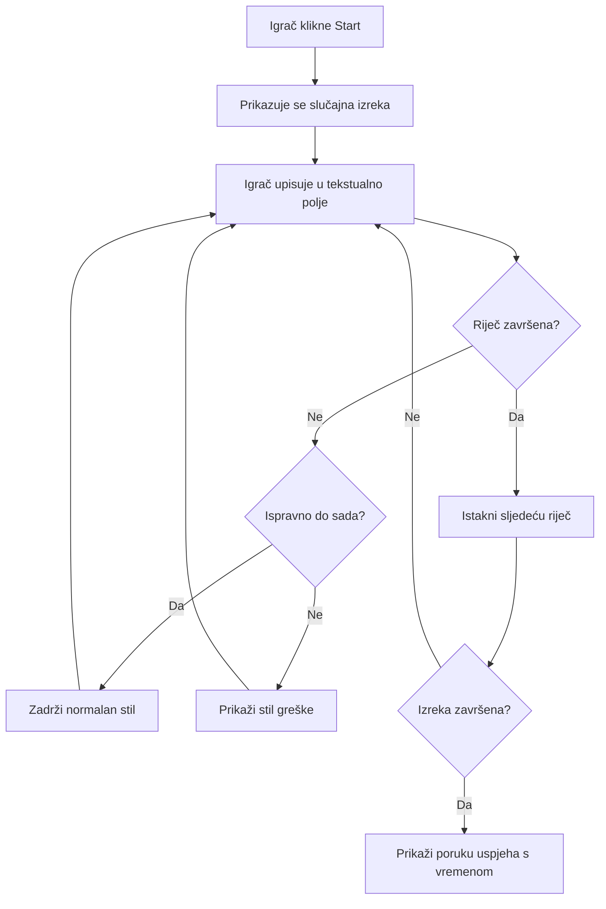
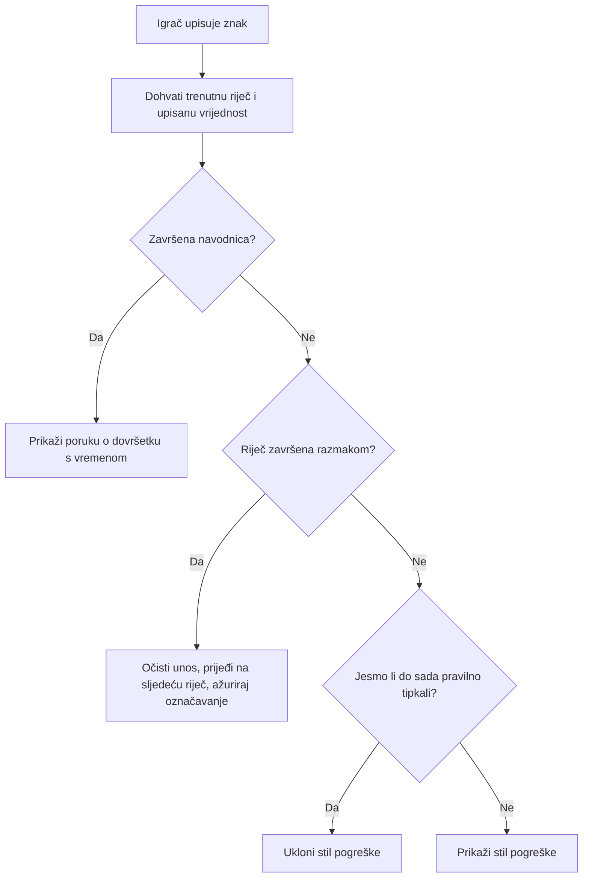
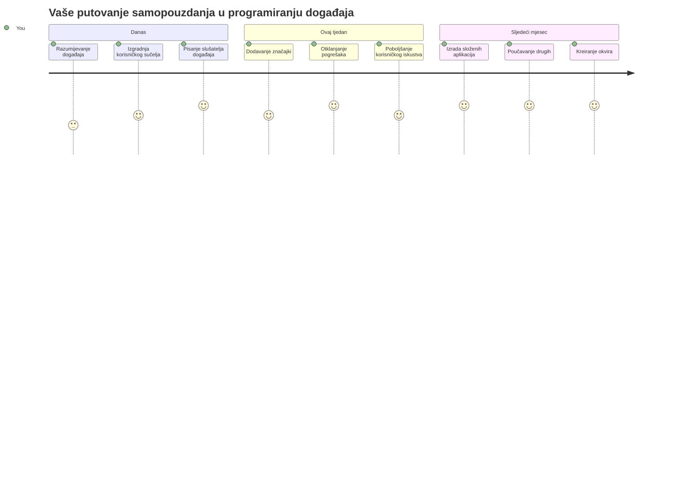

<!--
CO_OP_TRANSLATOR_METADATA:
{
  "original_hash": "da8bc72041a2bb3826a54654ee1a8844",
  "translation_date": "2026-01-07T09:25:41+00:00",
  "source_file": "4-typing-game/typing-game/README.md",
  "language_code": "hr"
}
-->
# Izrada igre pomoću događaja

Jeste li se ikada zapitali kako web stranice znaju kada kliknete na gumb ili upišete nešto u tekstni okvir? To je čarolija programiranja vođenog događajima! Koji je bolji način za naučiti ovu osnovnu vještinu nego izgraditi nešto korisno - igru brzine tipkanja koja reagira na svaki pritisak tipke.

Uvidjet ćete iz prve ruke kako web preglednici "komuniciraju" s vašim JavaScript kodom. Svaki put kada kliknete, tipkate ili pomaknete miša, preglednik šalje male poruke (zovemo ih događaji) vašem kodu i vi odlučujete kako na njih odgovoriti!

Do kraja ovog vodiča izgradit ćete pravu igru tipkanja koja prati vašu brzinu i točnost. Još važnije, razumjet ćete temeljne koncepte koji pokreću svaku interaktivnu web stranicu koju ste ikada koristili. Krenimo!

## Pred-predavanje kviz

[Pred-predavanje kviz](https://ff-quizzes.netlify.app/web/quiz/21)

## Programiranje vođeno događajima

Razmislite o svojoj omiljenoj aplikaciji ili web stranici - što je čini živom i responzivnom? Sve se svodi na način na koji reagira na ono što radite! Svaki dodir, klik, klizanje prstom ili pritisak tipke stvara ono što zovemo "događaj", i tu se događa prava čarolija razvoja weba.

Ono što programiranje za web čini tako zanimljivim jest to što nikada ne znamo kada će netko kliknuti gumb ili početi tipkati u tekstni okvir. Mogu kliknuti odmah, pričekati pet minuta ili možda nikada ne kliknuti! Ova nepredvidivost znači da moramo drukčije razmišljati o pisanju koda.

Umjesto da pišemo kod koji se izvršava od vrha do dna poput recepta, pišemo kod koji strpljivo čeka da se nešto dogodi. To je slično kao što su telegrafisti u 1800-ima sjedili kraj svojih uređaja, spremni odgovoriti u trenutku kada poruka stigne žicom.

Pa, što je zapravo "događaj"? Jednostavno rečeno, to je nešto što se dogodi! Kada kliknete gumb - to je događaj. Kad upišete slovo - to je događaj. Kada pomaknete miša - to je još jedan događaj.

Programiranje vođeno događajima omogućuje nam da postavimo naš kod da sluša i odgovara. Kreiramo posebne funkcije zvane **slušatelji događaja** koji strpljivo čekaju da se dogode određene stvari, a onda brzo reagiraju.

Slušatelje događaja možete zamisliti kao zvono na vratima za vaš kod. Postavite zvono (`addEventListener()`), kažete mu koji zvuk da sluša (kao 'click' ili 'keypress'), a zatim odredite što treba napraviti kada netko zvoni (vaša prilagođena funkcija).

**Evo kako slušatelji događaja funkcioniraju:**
- **Slušaju** određene korisničke radnje poput klikova, pritisaka tipki ili pokreta miša
- **Izvršavaju** vaš prilagođeni kod kada se dogodi navedeni događaj
- **Odgovaraju** odmah na korisničke interakcije, stvarajući besprijekorno iskustvo
- **Rukovode** s više događaja na istom elementu koristeći različite slušatelje

> **NAPOMENA:** Vrijedi istaknuti da postoji mnogo načina za kreiranje slušatelja događaja. Možete koristiti anonimne funkcije ili kreirati imenovane. Možete koristiti razne prečace, poput postavljanja svojstva `click`, ili korištenja `addEventListener()`. U našoj vježbi fokusirat ćemo se na `addEventListener()` i anonimne funkcije, jer je to vjerojatno najčešća tehnika koju web programeri koriste. Također je najfleksibilnija, jer `addEventListener()` radi za sve događaje, a ime događaja može se proslijediti kao parametar.

### Uobičajeni događaji

Iako web preglednici nude desetke različitih događaja na koje možete reagirati, većina interaktivnih aplikacija oslanja se samo na nekoliko osnovnih događaja. Razumijevanje ovih osnovnih događaja pružit će vam temelj za izradu složenih korisničkih interakcija.

Postoji [desetke događaja](https://developer.mozilla.org/docs/Web/Events) na koje možete slušati prilikom izrade aplikacije. U osnovi, sve što korisnik učini na stranici izaziva događaj, što vam daje mnogo moći da osigurate željeno iskustvo. Srećom, obično vam treba samo mali broj događaja. Evo nekoliko uobičajenih (uključujući dva koja ćemo koristiti za izradu naše igre):

| Događaj | Opis | Uobičajeni slučajevi uporabe |
|---------|-------|------------------------------|
| `click` | Korisnik je kliknuo nešto | Gumbi, linkovi, interaktivni elementi |
| `contextmenu` | Korisnik je kliknuo desnom tipkom miša | Prilagođeni desni klik izbornici |
| `select` | Korisnik je označio neki tekst | Uređivanje teksta, kopiranje |
| `input` | Korisnik je unio neki tekst | Validacija formi, pretraživanje u stvarnom vremenu |

**Razumijevanje ovih tipova događaja:**
- **Pokreću se** kada se korisnici interakcijom odnose na određene elemente na vašoj stranici
- **Pružaju** detaljne informacije o korisničkoj radnji putem objekata događaja
- **Omogućuju** kreiranje responzivnih, interaktivnih web aplikacija
- **Rade** dosljedno preko različitih preglednika i uređaja

## Izrada igre

Sada kada razumijete kako događaji funkcioniraju, primijenimo to znanje kroz izradu nečeg korisnog. Kreirat ćemo igru brzine tipkanja koja demonstrira upravljanje događajima dok vam pomaže razviti važnu developersku vještinu.

Izradit ćemo igru kako bismo istražili kako događaji rade u JavaScriptu. Naša igra testirat će sposobnost tipkanja igrača, što je jedna od najpotcjenjenijih vještina koje svi developeri trebaju imati. Zanimljivost: raspored tipkovnice QWERTY kojeg danas koristimo zapravo je dizajniran 1870-ih za pisaće strojeve - a dobre vještine tipkanja još su uvijek jednako vrijedne za programere danas! Opći tijek igre bit će ovakav:


**Evo kako će naša igra funkcionirati:**
- **Počinje** kada igrač klikne gumb za start i prikaže se nasumični citat
- **Prati** igračev napredak u tipkanju riječ po riječ u stvarnom vremenu
- **Ističe** trenutnu riječ kako bi usmjerila igračevu pažnju
- **Pruža** trenutne vizualne povratne informacije za pogreške u tipkanju
- **Izračunava** i prikazuje ukupno vrijeme po završetku citata

Izgradimo našu igru i naučimo o događajima!

### Struktura datoteka

Prije nego što započnemo s kodiranjem, organizirajmo se! Imati čist raspored datoteka od početka uštedjet će vam glavobolje kasnije i učiniti vaš projekt profesionalnijim. 😊

Držat ćemo se jednostavnog pristupa sa samo tri datoteke: `index.html` za strukturu stranice, `script.js` za svu logiku igre i `style.css` da sve izgleda lijepo. Ovo je klasični trio koji pokreće većinu weba!

**Stvorite novi direktorij za vaš rad otvaranjem konzole ili terminala i izvršavanjem sljedeće naredbe:**

```bash
# Linux ili macOS
mkdir typing-game && cd typing-game

# Windows
md typing-game && cd typing-game
```

**Evo što ove naredbe rade:**
- **Stvara** novi direktorij nazvan `typing-game` za vaše projektne datoteke
- **Automatski** ulazi u novo kreirani direktorij
- **Postavlja** čist radni prostor za razvoj vaše igre

**Otvorite Visual Studio Code:**

```bash
code .
```

**Ova naredba:**
- **Pokreće** Visual Studio Code u trenutnoj mapi
- **Otvara** vašu projekt mapu u uređivaču
- **Pruža** pristup svim alatima za razvoj koji će vam trebati

**Dodajte tri datoteke u mapu u Visual Studio Code s ovim imenima:**
- `index.html` - Sadrži strukturu i sadržaj vaše igre
- `script.js` - Rukuje svojom logikom igre i slušateljima događaja
- `style.css` - Definira vizualni izgled i stilizaciju

## Kreirajte korisničko sučelje

Sad izgradimo pozornicu na kojoj će se odvijati cijela akcija igre! Zamislite to kao dizajniranje kontrolne ploče za svemirski brod - moramo osigurati da je sve što igračima treba upravo tamo gdje očekuju.

Razmotrimo što naša igra stvarno treba. Kada biste igrali igru tipkanja, što biste željeli vidjeti na ekranu? Evo što ćemo trebati:

| UI Element | Svrha | HTML Element |
|------------|--------|--------------|
| Prikaz citata | Prikazuje tekst koji treba upisati | `<p>` s `id="quote"` |
| Područje poruke | Prikazuje status i poruke uspjeha | `<p>` s `id="message"` |
| Tekstni unos | Gdje igrači tipkaju citat | `<input>` s `id="typed-value"` |
| Gumb za start | Pokreće igru | `<button>` s `id="start"` |

**Razumijevanje strukture UI-ja:**
- **Organizira** sadržaj logično od vrha prema dnu
- **Dodjeljuje** jedinstvene ID-eve elementima za ciljanje u JavaScriptu
- **Pruža** jasnu vizualnu hijerarhiju za bolje korisničko iskustvo
- **Uključuje** semantičke HTML elemente radi pristupačnosti

Svakom od njih trebat će ID kako bismo mogli raditi s njima u našem JavaScriptu. Također ćemo dodati reference na CSS i JavaScript datoteke koje ćemo stvoriti.

Kreirajte novu datoteku nazvanu `index.html`. Dodajte sljedeći HTML:

```html
<!-- inside index.html -->
<html>
<head>
  <title>Typing game</title>
  <link rel="stylesheet" href="style.css">
</head>
<body>
  <h1>Typing game!</h1>
  <p>Practice your typing skills with a quote from Sherlock Holmes. Click **start** to begin!</p>
  <p id="quote"></p> <!-- This will display our quote -->
  <p id="message"></p> <!-- This will display any status messages -->
  <div>
    <input type="text" aria-label="current word" id="typed-value" /> <!-- The textbox for typing -->
    <button type="button" id="start">Start</button> <!-- To start the game -->
  </div>
  <script src="script.js"></script>
</body>
</html>
```

**Razlaganje što ova HTML struktura omogućuje:**
- **Povezuje** CSS stilsku datoteku u `<head>` za stilizaciju
- **Stvara** jasan naslov i upute za korisnike
- **Uspostavlja** prazne paragrafove s određenim ID-evima za dinamički sadržaj
- **Uključuje** polje za unos s atributima za pristupačnost
- **Pruža** gumb za start kako bi pokrenuo igru
- **Učitava** JavaScript datoteku na kraju za optimalne performanse

### Pokretanje aplikacije

Često testiranje vaše aplikacije tijekom razvoja pomaže vam da rano uočite probleme i pratite napredak u stvarnom vremenu. Live Server je neprocjenjiv alat koji automatski osvježava vaš preglednik svaki put kad spremite promjene, čineći razvoj znatno učinkovitijim.

Uvijek je najbolje razvijati iterativno kako biste vidjeli kako stvari izgledaju. Pokrenimo našu aplikaciju. Postoji izvrsni dodatak za Visual Studio Code pod nazivom [Live Server](https://marketplace.visualstudio.com/items?itemName=ritwickdey.LiveServer&WT.mc_id=academic-77807-sagibbon) koji će vam omogućiti lokalno hostanje aplikacije i osvježavanje preglednika svaki put kada spremite.

**Instalirajte [Live Server](https://marketplace.visualstudio.com/items?itemName=ritwickdey.LiveServer&WT.mc_id=academic-77807-sagibbon) slijedeći vezu i kliknite na Instaliraj:**

**Evo što se događa tijekom instalacije:**
- **Pokreće** vaš preglednik i otvara Visual Studio Code
- **Vodit će** vas kroz proces instalacije dodatka
- **Moguće je** da će biti potrebna ponovna izrada Visual Studio Codea da bi instalacija bila dovršena

**Nakon instalacije, u Visual Studio Codeu pritisnite Ctrl-Shift-P (ili Cmd-Shift-P) da otvorite paletu naredbi:**

**Razumijevanje palete naredbi:**
- **Omogućuje** brz pristup svim VS Code naredbama
- **Pretražuje** naredbe dok tipkate
- **Nudi** tipkovne prečace za brži razvoj

**Upišite "Live Server: Open with Live Server":**

**Što Live Server radi:**
- **Pokreće** lokalni razvojni server za vaš projekt
- **Automatski** osvježava preglednik kad spremite datoteke
- **Servira** vaše datoteke s lokalne URL adrese (obično `localhost:5500`)

**Otvorite preglednik i idite na `https://localhost:5500`:**

Sada biste trebali vidjeti stranicu koju ste kreirali! Dodajmo malo funkcionalnosti.

## Dodajte CSS

Sad učinimo da stvari izgledaju dobro! Vizualna povratna informacija bila je ključna za korisnička sučelja još od ranih dana računarstva. Osamdesetih godina istraživači su otkrili da trenutna vizualna povratna informacija dramatično poboljšava korisničke performanse i smanjuje pogreške. Upravo to ćemo stvoriti.

Naša igra mora biti kristalno jasna u vezi s onim što se događa. Igrači bi trebali odmah znati koju riječ trebaju upisati, a ako naprave pogrešku, trebaju je odmah vidjeti. Napravimo jednostavan, ali učinkovit stil:

Kreirajte novu datoteku nazvanu `style.css` i dodajte sljedeći sintaksu.

```css
/* inside style.css */
.highlight {
  background-color: yellow;
}

.error {
  background-color: lightcoral;
  border: red;
}
```

**Razumijevanje ovih CSS klasa:**
- **Ističe** trenutnu riječ žutom pozadinom za jasnu vizualnu usmjerenost
- **Signalizira** pogreške u tipkanju svijetlocrvenom bojom pozadine
- **Pruža** trenutne povratne informacije bez ometanja korisnika u tipkanju
- **Koristi** kontrastne boje radi pristupačnosti i jasne vizualne komunikacije

✅ Kada je riječ o CSS-u, možete postaviti izgled stranice kako god želite. Odvojite malo vremena i učinite da stranica izgleda privlačnije:

- Odaberite drugi font
- Bojite naslove
- Promijenite veličine elemenata

## JavaScript

Evo gdje stvari postaju zanimljive! 🎉 Imamo našu HTML strukturu i CSS stilizaciju, ali trenutno je naša igra kao lijep automobil bez motora. JavaScript će biti taj motor - on čini da sve stvarno funkcionira i reagira na ono što igrači rade.

Ovdje ćete vidjeti kako vaš projekt oživljava. Krenut ćemo korak po korak da ništa ne bude previše komplicirano:

| Korak | Svrha | Što ćete naučiti |
|-------|-------|------------------|
| [Kreirajte konstante](../../../../4-typing-game/typing-game) | Postavite citate i reference na DOM | Upravljanje varijablama i odabir DOM elemenata |
| [Slušatelj događaja za pokretanje igre](../../../../4-typing-game/typing-game) | Rukuje inicijalizacijom igre | Upravljanje događajima i ažuriranje UI-ja |
| [Slušatelj događaja za tipkanje](../../../../4-typing-game/typing-game) | Obrada korisničkog unosa u stvarnom vremenu | Validacija unosa i dinamičke povratne informacije |

**Ovaj strukturirani pristup pomaže vam:**
- **Organizirati** kod u logične i upravljive cjeline
- **Graditi** funkcionalnosti postupno radi lakšeg uklanjanja pogrešaka
- **Razumjeti** kako različiti dijelovi aplikacije surađuju
- **Stvarati** ponovljive obrasce za buduće projekte

Ali prvo, stvorite novu datoteku nazvanu `script.js`.

### Dodajte konstante

Prije nego zaronimo u akciju, skupimo sve naše resurse! Baš kao što NASA-in kontrolni centar postavlja sve svoje nadzorne sustave prije lansiranja, puno je lakše kada imate sve pripremljeno i spremno. To nas spašava od traženja stvari kasnije i pomaže izbjeći tipkarske pogreške.

Evo što trebamo najprije postaviti:

| Tip podataka | Svrha | Primjer |
| Niz citata | Spremi sve moguće citate za igru | `['Quote 1', 'Quote 2', ...]` |
| Niz riječi | Razdijeli trenutni citat na pojedinačne riječi | `['When', 'you', 'have', ...]` |
| Indeks riječi | Prati koju riječ igrač tipka | `0, 1, 2, 3...` |
| Vrijeme početka | Izračunaj proteklo vrijeme za bodovanje | `Date.now()` |

**Također ćemo trebati reference na naše UI elemente:**
| Element | ID | Svrha |
|---------|----|---------|
| Unos teksta | `typed-value` | Gdje igrači tipkaju |
| Prikaz citata | `quote` | Prikazuje citat za tipkanje |
| Područje poruka | `message` | Prikazuje statusne poruke |

```javascript
// unutar script.js
// svi naši citati
const quotes = [
    'When you have eliminated the impossible, whatever remains, however improbable, must be the truth.',
    'There is nothing more deceptive than an obvious fact.',
    'I ought to know by this time that when a fact appears to be opposed to a long train of deductions it invariably proves to be capable of bearing some other interpretation.',
    'I never make exceptions. An exception disproves the rule.',
    'What one man can invent another can discover.',
    'Nothing clears up a case so much as stating it to another person.',
    'Education never ends, Watson. It is a series of lessons, with the greatest for the last.',
];
// pohrani popis riječi i indeks riječi koju igrač trenutno upisuje
let words = [];
let wordIndex = 0;
// početno vrijeme
let startTime = Date.now();
// elementi stranice
const quoteElement = document.getElementById('quote');
const messageElement = document.getElementById('message');
const typedValueElement = document.getElementById('typed-value');
```

**Razbijanje što ovaj početni kod ostvaruje:**
- **Spremi** niz citata Sherlocka Holmesa koristeći `const` jer se citati neće mijenjati
- **Inicijalizira** varijable za praćenje koristeći `let` jer će se te vrijednosti mijenjati tijekom igre
- **Hvata** reference na DOM elemente koristeći `document.getElementById()` za efikasan pristup
- **Postavlja** temelje za svu funkcionalnost igre s jasnim, opisnim imenima varijabli
- **Organizira** povezane podatke i elemente logično radi lakšeg održavanja koda

✅ Slobodno dodaj još citata u svoju igru

> 💡 **Dobri savjet**: Elementi se mogu dohvatiti kad god želimo u kodu koristeći `document.getElementById()`. Zbog činjenice da ćemo se na njih često pozivati, izbjegavamo tipfelere u string literalima korištenjem konstanti. Okviri poput [Vue.js](https://vuejs.org/) ili [React](https://reactjs.org/) mogu ti pomoći bolje upravljati centralizacijom koda.
>
**Evo zašto ovaj pristup tako dobro funkcionira:**
- **Sprječava** pogreške u pisanju prilikom višestrukog korištenja elemenata
- **Poboljšava** čitljivost koda s opisnim nazivima konstanti
- **Omogućuje** bolju podršku IDE-a s automatskim dovršavanjem i provjerom grešaka
- **Olakšava** refaktoriranje u slučaju kasnije promjene ID-eva elemenata

Uzmite minutu da pogledate video o korištenju `const`, `let` i `var`

[](https://youtube.com/watch?v=JNIXfGiDWM8 "Vrste varijabli")

> 🎥 Klikni sliku iznad za video o varijablama.

### Dodaj logiku za početak

Ovdje sve počinje klikati na mjesto! 🚀 Upravo ćeš napisati svoj prvi stvarni slušatelj događaja, a postoji nešto vrlo zadovoljavajuće u gledanju kako tvoj kod reagira na klik gumba.

Razmisli: negdje tamo, igrač će kliknuti gumb "Start", a tvoj kod treba biti spreman za to. Ne znamo kada će kliknuti - može odmah, može nakon što popije kavu - ali kad klikne, tvoja igra oživljava.

Kad korisnik klikne `start`, trebamo odabrati citat, postaviti korisničko sučelje i postaviti praćenje za trenutnu riječ i vrijeme. Ispod je JavaScript koji trebaš dodati; razgovaramo o njemu odmah nakon bloka skripte.

```javascript
// na kraju script.js
document.getElementById('start').addEventListener('click', () => {
  // dobiti citat
  const quoteIndex = Math.floor(Math.random() * quotes.length);
  const quote = quotes[quoteIndex];
  // Stavite citat u polje riječi
  words = quote.split(' ');
  // resetiraj indeks riječi za praćenje
  wordIndex = 0;

  // Ažuriranja korisničkog sučelja
  // Napravi polje span elemenata da možemo postaviti klasu
  const spanWords = words.map(function(word) { return `<span>${word} </span>`});
  // Pretvori u string i postavi kao innerHTML na prikazu citata
  quoteElement.innerHTML = spanWords.join('');
  // Istakni prvu riječ
  quoteElement.childNodes[0].className = 'highlight';
  // Očisti sve prethodne poruke
  messageElement.innerText = '';

  // Postavi tekstni okvir
  // Očisti tekstni okvir
  typedValueElement.value = '';
  // postavi fokus
  typedValueElement.focus();
  // postavi rukovatelja događaja

  // Pokreni mjerač vremena
  startTime = new Date().getTime();
});
```

**Rasčlanimo kod na logične dijelove:**

**📊 Podešavanje praćenja riječi:**
- **Odabire** nasumični citat koristeći `Math.floor()` i `Math.random()` radi raznolikosti
- **Pretvara** citat u niz pojedinačnih riječi koristeći `split(' ')`
- **Resetira** `wordIndex` na 0 jer igrači počinju od prve riječi
- **Priprema** stanje igre za novu rundu

**🎨 Postavljanje i prikaz UI-a:**
- **Stvara** niz `<span>` elemenata, umotavajući svaku riječ za pojedinačno stiliziranje
- **Spaja** span elemente u jedan string radi efikasnog ažuriranja DOM-a
- **Ističe** prvu riječ dodavanjem CSS klase `highlight`
- **Briše** sve prethodne poruke igre za čist početak

**⌨️ Priprema tekstualnog unosa:**
- **Briše** postojeći tekst u polju za unos
- **Postavlja fokus** u textbox da igrači mogu odmah početi tipkati
- **Priprema** područje unosa za novu sesiju igre

**⏱️ Inicijalizacija tajmera:**
- **Hvata** trenutačni vremenski žig koristeći `new Date().getTime()`
- **Omogućuje** točan izračun brzine tipkanja i vremena završetka
- **Pokreće** praćenje izvedbe za sesiju igre

### Dodaj logiku tipkanja

Ovdje ćemo se pozabaviti srcem naše igre! Ne brini ako ti se na početku čini puno – proći ćemo kroz svaki dio, a na kraju će ti sve biti vrlo logično.

Ono što gradimo je prilično sofisticirano: svaki put kad netko upiše slovo, naš kod će provjeriti što je napisao, dati povratnu informaciju i odlučiti što dalje. Slično je kao rani procesori teksta poput WordStar u 1970-ima koji su pružali povratne informacije u stvarnom vremenu tipkajućima.

```javascript
// na kraju script.js
typedValueElement.addEventListener('input', () => {
  // Dohvati trenutnu riječ
  const currentWord = words[wordIndex];
  // dohvatiti trenutnu vrijednost
  const typedValue = typedValueElement.value;

  if (typedValue === currentWord && wordIndex === words.length - 1) {
    // kraj rečenice
    // Prikaži uspjeh
    const elapsedTime = new Date().getTime() - startTime;
    const message = `CONGRATULATIONS! You finished in ${elapsedTime / 1000} seconds.`;
    messageElement.innerText = message;
  } else if (typedValue.endsWith(' ') && typedValue.trim() === currentWord) {
    // kraj riječi
    // očisti typedValueElement za novu riječ
    typedValueElement.value = '';
    // prijeđi na sljedeću riječ
    wordIndex++;
    // resetiraj naziv klase za sve elemente u citatu
    for (const wordElement of quoteElement.childNodes) {
      wordElement.className = '';
    }
    // istakni novu riječ
    quoteElement.childNodes[wordIndex].className = 'highlight';
  } else if (currentWord.startsWith(typedValue)) {
    // trenutno ispravno
    // istakni sljedeću riječ
    typedValueElement.className = '';
  } else {
    // stanje pogreške
    typedValueElement.className = 'error';
  }
});
```

**Razumijevanje toka logike tipkanja:**

Ova funkcija koristi vodopadni pristup, provjeravajući uvjete od najspecifičnijih do najopćenitijih. Razložimo svaki scenarij:


**🏁 Citat završen (Scenarij 1):**
- **Provjerava** je li unesena vrijednost jednaka trenutnoj riječi I je li to posljednja riječ
- **Izračunava** proteklo vrijeme oduzimanjem vremena početka od trenutačnog vremena
- **Pretvara** milisekunde u sekunde dijeljenjem s 1.000
- **Prikazuje** čestitku s vremenom završetka

**✅ Riječ završena (Scenarij 2):**
- **Detektira** završetak riječi kada unos završava razmakom
- **Provjerava** da li trimmirani unos točno odgovara trenutnoj riječi
- **Briše** unos za sljedeću riječ
- **Napreduje** na sljedeću riječ povećanjem `wordIndex`
- **Ažurira** vizualno isticanje uklanjanjem svih klasa i isticanjem nove riječi

**📝 Tipkanje u tijeku (Scenarij 3):**
- **Provjerava** je li trenutna riječ započeta unesenim tekstom dosad
- **Uklanja** bilo kakvo stiliziranje greške da pokaže da je unos točan
- **Dozvoljava** nastavak tipkanja bez prekida

**❌ Stanje greške (Scenarij 4):**
- **Aktivira** se kada uneseni tekst ne odgovara očekivanom početku riječi
- **Dodaje** CSS klasu greške za trenutnu vizualnu povratnu informaciju
- **Pomaže** igračima da brzo identificiraju i isprave pogreške

## Testiraj svoju aplikaciju

Pogledaj što si postigao! 🎉 Upravo si napravio pravu, funkcionalnu igru tipkanja iz temelja koristeći programiranje vođeno događajima. Uzmi trenutak da to cijenis - nije mala stvar!

Sada dolazi faza testiranja! Hoće li raditi kako treba? Jesmo li nešto propustili? Evo što: ako nešto ne radi savršeno odmah, to je potpuno normalno. Čak i iskusni programeri redovito pronalaze greške u svom kodu. To je dio procesa razvoja!

Klikni na `start` i počni tipkati! Trebalo bi izgledati malo kao animacija koju smo vidjeli prije.


**Što testirati u svojoj aplikaciji:**
- **Provjerava** da klik na Start pokaže nasumični citat
- **Potvrđuje** da tipkanje ispravno ističe trenutnu riječ
- **Provjerava** da se prikazuje stil greške za netočno tipkanje
- **Osigurava** da završetak riječi ispravno pomiče isticanje
- **Testira** da završetak citata prikazuje poruku o završetku s vremenom

**Uobičajeni savjeti za otklanjanje pogrešaka:**
- **Provjeri** konzolu preglednika (F12) za JavaScript greške
- **Potvrdi** točnost svih naziva datoteka (pažljivo na velika i mala slova)
- **Provjeri** da je Live Server pokrenut i ispravno osvježava
- **Testiraj** različite citate radi provjere nasumičnog odabira

---

## Izazov GitHub Copilot Agenta 🎮

Iskoristi Agent način rada za dovršetak sljedećeg izazova:

**Opis:** Proširi igru tipkanja implementirajući sustav težine koji prilagođava igru prema performansama igrača. Ovaj izazov pomoći će ti uvježbati napredno rukovanje događajima, analizu podataka i dinamičke ažuriranja UI-a.

**Zadatak:** Kreiraj sustav prilagodbe težine za igru tipkanja koji:
1. Prati brzinu tipkanja igrača (riječi u minuti) i postotak točnosti
2. Automatski prilagođava na tri razine težine: Lako (jednostavni citati), Srednje (trenutni citati), Teško (kompleksni citati s interpunkcijom)
3. Prikazuje trenutnu razinu težine i statistiku igrača na korisničkom sučelju
4. Implementira brojač serija koji povećava težinu nakon 3 uzastopna dobra rezultata
5. Dodaje vizualnu povratnu informaciju (boje, animacije) za označavanje promjena težine

Dodaj potrebne HTML elemente, CSS stilove i JavaScript funkcije za implementaciju ove značajke. Uključi pravilno rukovanje greškama i osiguraj pristupačnost igre s odgovarajućim ARIA oznakama.

Više o [agent načinu rada](https://code.visualstudio.com/blogs/2025/02/24/introducing-copilot-agent-mode) možeš saznati ovdje.

## 🚀 Izazov

Spreman za podizanje svoje igre tipkanja na višu razinu? Pokušaj implementirati ove napredne značajke kako bi produbio razumijevanje rukovanja događajima i manipulacije DOM-om:

**Dodaj više funkcionalnosti:**

| Značajka | Opis | Vještine koje ćeš uvježbati |
|---------|-------------|------------------------|
| **Kontrola unosa** | Onemogući slušatelja događaja `input` na završetku i ponovno ga omogući kad se klikne gumb | Upravljanje događajima i kontrola stanja |
| **Upravljanje stanjem UI-a** | Onemogući textbox kada igrač završi citat | Manipulacija DOM svojstvima |
| **Modalni dijalog** | Prikaži modalni dijalog s porukom o uspjehu | Napredni UI obrasci i pristupačnost |
| **Sustav rekorda** | Spremi najbolje rezultate koristeći `localStorage` | API-je za pohranu u pregledniku i trajnost podataka |

**Savjeti za implementaciju:**
- **Istraži** `localStorage.setItem()` i `localStorage.getItem()` za trajnu pohranu
- **Vježbaj** dinamičko dodavanje i uklanjanje slušatelja događaja
- **Istraži** HTML dijaloge ili CSS modalne obrasce
- **Razmišljaj** o pristupačnosti prilikom onemogućavanja i omogućavanja kontrola forme

## Kviz nakon predavanja

[Kviz nakon predavanja](https://ff-quizzes.netlify.app/web/quiz/22)

---

## 🚀 Tvoj vremenski plan usavršavanja igre tipkanja

### ⚡ **Što možeš napraviti u sljedećih 5 minuta**
- [ ] Testiraj svoju igru tipkanja s različitim citatima da se uvjeriš da sve radi glatko
- [ ] Eksperimentiraj sa CSS stilovima - pokušaj promijeniti boju isticanja i greške
- [ ] Otvori DevTools preglednika (F12) i prati Konzolu dok igraš
- [ ] Izazovi se da završiš citat što brže možeš

### ⏰ **Što možeš postići u ovom satu**
- [ ] Dodaj više citata u niz (možda iz omiljenih knjiga ili filmova)
- [ ] Implementiraj sustav visokih rezultata koristeći `localStorage` iz izazova
- [ ] Kreiraj kalkulator riječi po minuti koji se prikazuje nakon igre
- [ ] Dodaj zvučne efekte za točno tipkanje, greške i završetak

### 📅 **Tvoja tjedna avantura**
- [ ] Napravi multiplayer verziju gdje prijatelji mogu natjecati jedan pored drugog
- [ ] Kreiraj različite razine težine s različitom složenošću citata
- [ ] Dodaj traku napretka koja pokazuje koliko je citat dovršen
- [ ] Implementiraj korisničke račune s praćenjem osobnih statistika
- [ ] Dizajniraj prilagođene teme i dopusti korisnicima da biraju željeni izgled

### 🗓️ **Tvoja mjesečna transformacija**
- [ ] Kreiraj tečaj tipkanja s lekcijama koje postupno uče pravilno postavljanje prstiju
- [ ] Razvij analitiku koja pokazuje koje slova ili riječi uzrokuju najviše pogrešaka
- [ ] Dodaj podršku za različite jezike i rasporede tipkovnica
- [ ] Integriraj edukativne API-je za dohvat citata iz književnih baza podataka
- [ ] Objavi svoj unaprijeđeni tipkarski projekt za druge da koriste i uživaju

### 🎯 **Završni pregled i razmišljanje**

**Prije nego što nastaviš, odvoji trenutak i proslavi:**
- Koji ti je bio najzadovoljavajući trenutak dok si gradio ovu igru?
- Kako sada gledaš na programiranje vođeno događajima u usporedbi s početkom?
- Koju značajku jedva čekaš dodati da igru učiniš jedinstvenom?
- Kako bi mogao primijeniti koncepte upravljanja događajima u drugim projektima?


> 🌟 **Zapamti**: Upravo si savladao jedan od osnovnih koncepata koji pokreću svaku interaktivnu web stranicu i aplikaciju. Programiranje vođeno događajima je ono što web čini živim i responzivnim. Svaki put kad vidiš padajući meni, formu koja se validira dok tipkaš ili igru koja reagira na klikove, sada razumiješ magiju iza toga. Ne učiš samo programirati - učiš stvarati doživljaje koji su intuitivni i zanimljivi! 🎉

---

## Pregled i samostalno učenje

Pročitaj o [svim dostupnim događajima](https://developer.mozilla.org/docs/Web/Events) koje web preglednik pruža programerima i razmotri scenarije u kojima bi koristio svaki od njih.

## Zadatak

[Napravi novu tipkovničku igru](assignment.md)

---

<!-- CO-OP TRANSLATOR DISCLAIMER START -->
**Odricanje od odgovornosti**:  
Ovaj dokument je preveden pomoću AI prijevodne usluge [Co-op Translator](https://github.com/Azure/co-op-translator). Iako nastojimo osigurati točnost, imajte na umu da automatski prijevodi mogu sadržavati pogreške ili netočnosti. Izvorni dokument na izvornom jeziku treba smatrati službenim izvorom. Za važne informacije preporučuje se profesionalni ljudski prijevod. Nismo odgovorni za bilo kakve nesporazume ili pogrešna tumačenja koja proizlaze iz korištenja ovog prijevoda.
<!-- CO-OP TRANSLATOR DISCLAIMER END -->