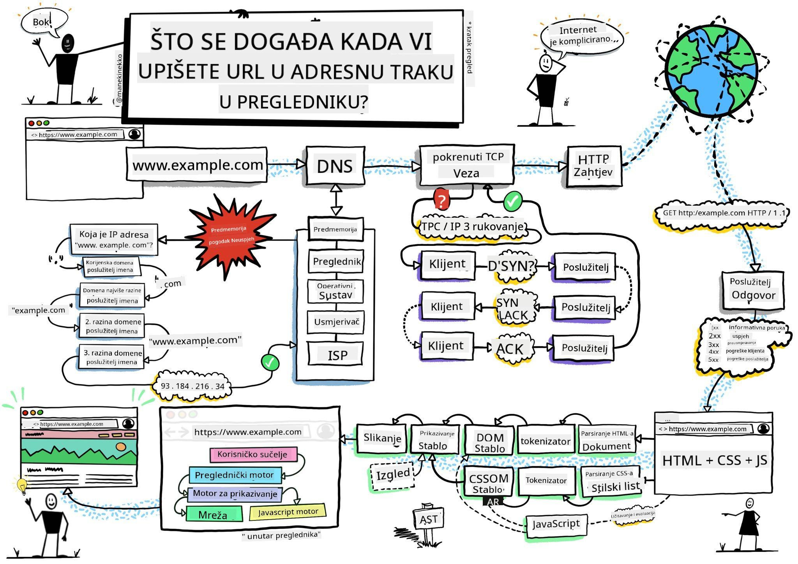
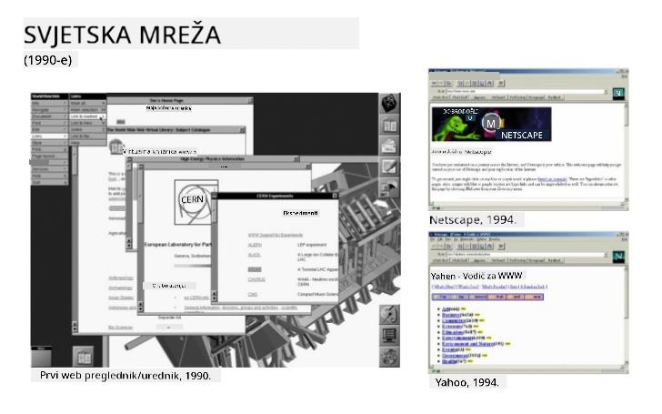
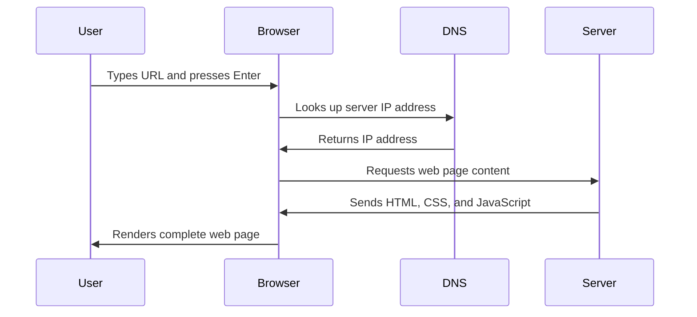

<!--
CO_OP_TRANSLATOR_METADATA:
{
  "original_hash": "33a875c522f237a2026e4653240dfc07",
  "translation_date": "2025-10-25T00:16:11+00:00",
  "source_file": "5-browser-extension/1-about-browsers/README.md",
  "language_code": "hr"
}
-->
# Projekt proširenja preglednika, 1. dio: Sve o preglednicima


> Skica autora [Wassim Chegham](https://dev.to/wassimchegham/ever-wondered-what-happens-when-you-type-in-a-url-in-an-address-bar-in-a-browser-3dob)

## Kviz prije predavanja

[Kviz prije predavanja](https://ff-quizzes.netlify.app/web/quiz/23)

### Uvod

Proširenja za preglednike su mini-aplikacije koje poboljšavaju vaše iskustvo pregledavanja interneta. Poput izvorne vizije Tima Berners-Leeja o interaktivnom webu, proširenja proširuju mogućnosti preglednika izvan jednostavnog prikaza dokumenata. Od upravitelja lozinki koji čuvaju vaše račune do alata za odabir boja koji pomažu dizajnerima da pronađu savršene nijanse, proširenja rješavaju svakodnevne izazove pregledavanja.

Prije nego što izradimo vaše prvo proširenje, razumjet ćemo kako preglednici funkcioniraju. Baš kao što je Alexander Graham Bell morao razumjeti prijenos zvuka prije nego što je izumio telefon, poznavanje osnova preglednika pomoći će vam da stvorite proširenja koja se besprijekorno integriraju s postojećim sustavima preglednika.

Na kraju ove lekcije, razumjet ćete arhitekturu preglednika i započeti izradu svog prvog proširenja.

## Razumijevanje web preglednika

Web preglednik je u suštini sofisticirani interpretator dokumenata. Kada u adresnu traku upišete "google.com", preglednik izvodi složeni niz operacija - zahtijeva sadržaj sa servera širom svijeta, zatim analizira i prikazuje taj kod u interaktivne web stranice koje vidite.

Ovaj proces odražava način na koji je prvi web preglednik, WorldWideWeb, dizajnirao Tim Berners-Lee 1990. godine kako bi hiperpovezane dokumente učinio dostupnima svima.

✅ **Malo povijesti**: Prvi preglednik zvao se 'WorldWideWeb' i stvorio ga je Sir Timothy Berners-Lee 1990. godine.


> Neki od ranih preglednika, prema [Karen McGrane](https://www.slideshare.net/KMcGrane/week-4-ixd-history-personal-computing)

### Kako preglednici obrađuju web sadržaj

Proces između unosa URL-a i prikaza web stranice uključuje nekoliko koordiniranih koraka koji se odvijaju u sekundi:



**Što ovaj proces postiže:**
- **Prevodi** URL koji je čitljiv ljudima u IP adresu servera putem DNS pretraživanja
- **Uspostavlja** sigurnu vezu sa web serverom koristeći HTTP ili HTTPS protokole
- **Zahtijeva** specifičan sadržaj web stranice od servera
- **Prima** HTML oznake, CSS stilove i JavaScript kod od servera
- **Prikazuje** sav sadržaj u interaktivnu web stranicu koju vidite

### Osnovne značajke preglednika

Moderni preglednici pružaju brojne značajke koje programeri proširenja mogu iskoristiti:

| Značajka | Svrha | Mogućnosti proširenja |
|---------|---------|------------------------|
| **Motor za prikazivanje** | Prikazuje HTML, CSS i JavaScript | Modifikacija sadržaja, umetanje stilova |
| **JavaScript motor** | Izvršava JavaScript kod | Prilagođeni skripti, interakcije s API-jem |
| **Lokalna pohrana** | Sprema podatke lokalno | Korisničke postavke, predmemorirani podaci |
| **Mrežni sloj** | Upravljanje web zahtjevima | Praćenje zahtjeva, analiza podataka |
| **Sigurnosni model** | Štiti korisnike od zlonamjernog sadržaja | Filtriranje sadržaja, poboljšanja sigurnosti |

**Razumijevanje ovih značajki pomaže vam:**
- **Identificirati** gdje vaše proširenje može dodati najviše vrijednosti
- **Odabrati** prave API-je preglednika za funkcionalnost vašeg proširenja
- **Dizajnirati** proširenja koja učinkovito rade s sustavima preglednika
- **Osigurati** da vaše proširenje slijedi najbolje prakse sigurnosti preglednika

### Razmatranja za razvoj proširenja na više preglednika

Različiti preglednici implementiraju standarde s blagim varijacijama, slično kao što različiti programski jezici mogu različito obrađivati isti algoritam. Chrome, Firefox i Safari imaju jedinstvene karakteristike koje programeri moraju uzeti u obzir tijekom razvoja proširenja.

> 💡 **Savjet za profesionalce**: Koristite [caniuse.com](https://www.caniuse.com) kako biste provjerili koje web tehnologije podržavaju različiti preglednici. Ovo je neprocjenjivo prilikom planiranja značajki vašeg proširenja!

**Ključna razmatranja za razvoj proširenja:**
- **Testirajte** svoje proširenje na preglednicima Chrome, Firefox i Edge
- **Prilagodite** se različitim API-jima proširenja i formatima manifestacija preglednika
- **Rukujte** različitim karakteristikama performansi i ograničenjima
- **Osigurajte** rezervne opcije za značajke specifične za preglednik koje možda nisu dostupne

✅ **Analitički uvid**: Možete odrediti koje preglednike vaši korisnici preferiraju instaliranjem analitičkih paketa u svoje projekte web razvoja. Ovi podaci pomažu vam da odredite prioritete koje preglednike prvo podržati.

## Razumijevanje proširenja za preglednike

Proširenja za preglednike rješavaju uobičajene izazove pregledavanja weba dodavanjem funkcionalnosti izravno u sučelje preglednika. Umjesto da zahtijevaju zasebne aplikacije ili složene radne procese, proširenja pružaju trenutni pristup alatima i značajkama.

Ovaj koncept odražava kako su rani pioniri računalstva poput Douglasa Engelbarta zamišljali proširenje ljudskih sposobnosti tehnologijom - proširenja proširuju osnovnu funkcionalnost vašeg preglednika.

**Popularne kategorije proširenja i njihove prednosti:**
- **Alati za produktivnost**: Upravljanje zadacima, aplikacije za bilježenje i praćenje vremena koje pomažu u organizaciji
- **Poboljšanja sigurnosti**: Upravitelji lozinki, blokatori oglasa i alati za privatnost koji štite vaše podatke
- **Alati za programere**: Formatiranje koda, odabir boja i alati za otklanjanje pogrešaka koji olakšavaju razvoj
- **Poboljšanje sadržaja**: Načini čitanja, preuzimanje videozapisa i alati za snimanje zaslona koji poboljšavaju vaše iskustvo na webu

✅ **Pitanje za razmišljanje**: Koja su vaša omiljena proširenja za preglednik? Koje specifične zadatke obavljaju i kako poboljšavaju vaše iskustvo pregledavanja?

## Instalacija i upravljanje proširenjima

Razumijevanje procesa instalacije proširenja pomaže vam predvidjeti korisničko iskustvo kada ljudi instaliraju vaše proširenje. Proces instalacije standardiziran je u modernim preglednicima, s manjim varijacijama u dizajnu sučelja.


> **Važno**: Obavezno uključite način rada za razvojne programere i omogućite proširenja iz drugih trgovina prilikom testiranja vlastitih proširenja.

### Proces instalacije proširenja za razvoj

Kada razvijate i testirate vlastita proširenja, slijedite ovaj tijek rada:

```bash
# Step 1: Build your extension
npm run build
```

**Što ova naredba postiže:**
- **Kompilira** vaš izvorni kod u datoteke spremne za preglednik
- **Pakira** JavaScript module u optimizirane pakete
- **Generira** konačne datoteke proširenja u mapi `/dist`
- **Priprema** vaše proširenje za instalaciju i testiranje

**Korak 2: Otvorite upravljanje proširenjima u pregledniku**
1. **Otvorite** stranicu za upravljanje proširenjima u vašem pregledniku
2. **Kliknite** gumb "Postavke i više" (ikona `...`) u gornjem desnom kutu
3. **Odaberite** "Proširenja" iz padajućeg izbornika

**Korak 3: Učitajte svoje proširenje**
- **Za nove instalacije**: Odaberite `load unpacked` i odaberite svoju mapu `/dist`
- **Za ažuriranja**: Kliknite `reload` pored već instaliranog proširenja
- **Za testiranje**: Omogućite "Način rada za razvojne programere" za pristup dodatnim značajkama za otklanjanje pogrešaka

### Instalacija proširenja za produkciju

> ✅ **Napomena**: Ove upute za razvoj specifične su za proširenja koja sami izrađujete. Za instalaciju objavljenih proširenja posjetite službene trgovine proširenja preglednika poput [Microsoft Edge Add-ons trgovine](https://microsoftedge.microsoft.com/addons/Microsoft-Edge-Extensions-Home).

**Razumijevanje razlike:**
- **Instalacije za razvoj** omogućuju testiranje neobjavljenih proširenja tijekom razvoja
- **Instalacije iz trgovine** pružaju provjerena, objavljena proširenja s automatskim ažuriranjima
- **Ručno instaliranje** omogućuje instalaciju proširenja izvan službenih trgovina (zahtijeva način rada za razvojne programere)

## Izrada proširenja za ugljični otisak

Izradit ćemo proširenje za preglednik koje prikazuje ugljični otisak potrošnje energije u vašoj regiji. Ovaj projekt demonstrira osnovne koncepte razvoja proširenja dok stvara praktičan alat za podizanje svijesti o okolišu.

Ovaj pristup slijedi princip "učenje kroz rad" koji se pokazao učinkovitim još od obrazovnih teorija Johna Deweya - kombinirajući tehničke vještine s značajnim stvarnim aplikacijama.

### Zahtjevi projekta

Prije početka razvoja, prikupimo potrebne resurse i ovisnosti:

**Potrebni pristup API-ju:**
- **[CO2 Signal API ključ](https://www.co2signal.com/)**: Unesite svoju email adresu kako biste dobili besplatni API ključ
- **[Kod regije](http://api.electricitymap.org/v3/zones)**: Pronađite kod svoje regije koristeći [Electricity Map](https://www.electricitymap.org/map) (na primjer, Boston koristi 'US-NEISO')

**Alati za razvoj:**
- **[Node.js i NPM](https://www.npmjs.com)**: Alat za upravljanje paketima za instalaciju ovisnosti projekta
- **[Početni kod](../../../../5-browser-extension/start)**: Preuzmite mapu `start` za početak razvoja

✅ **Saznajte više**: Poboljšajte svoje vještine upravljanja paketima s ovim [sveobuhvatnim modulom za učenje](https://docs.microsoft.com/learn/modules/create-nodejs-project-dependencies/?WT.mc_id=academic-77807-sagibbon)

### Razumijevanje strukture projekta

Razumijevanje strukture projekta pomaže u učinkovitom organiziranju razvojnih zadataka. Kao što je Aleksandrijska knjižnica bila organizirana za jednostavno pronalaženje znanja, dobro strukturirana baza koda čini razvoj učinkovitijim:

```
project-root/
├── dist/                    # Built extension files
│   ├── manifest.json        # Extension configuration
│   ├── index.html           # User interface markup
│   ├── background.js        # Background script functionality
│   └── main.js              # Compiled JavaScript bundle
└── src/                     # Source development files
    └── index.js             # Your main JavaScript code
```

**Razlaganje onoga što svaka datoteka postiže:**
- **`manifest.json`**: **Definira** metapodatke proširenja, dozvole i ulazne točke
- **`index.html`**: **Stvara** korisničko sučelje koje se pojavljuje kada korisnici kliknu na vaše proširenje
- **`background.js`**: **Upravlja** pozadinskim zadacima i slušateljima događaja preglednika
- **`main.js`**: **Sadrži** konačni JavaScript nakon procesa izgradnje
- **`src/index.js`**: **Sadrži** vaš glavni razvojni kod koji se kompajlira u `main.js`

> 💡 **Savjet za organizaciju**: Spremite svoj API ključ i kod regije u sigurnu bilješku za jednostavno referenciranje tijekom razvoja. Trebat ćete te vrijednosti za testiranje funkcionalnosti vašeg proširenja.

✅ **Sigurnosna napomena**: Nikada ne pohranjujte API ključeve ili osjetljive vjerodajnice u svoj repozitorij koda. Pokazat ćemo vam kako ih sigurno upravljati u sljedećim koracima.

## Izrada sučelja proširenja

Sada ćemo izraditi komponente korisničkog sučelja. Proširenje koristi pristup s dva ekrana: ekran za konfiguraciju za početno postavljanje i ekran za prikaz rezultata.

Ovo slijedi princip progresivnog otkrivanja koji se koristi u dizajnu sučelja od ranih dana računalstva - otkrivanje informacija i opcija u logičnom slijedu kako bi se izbjeglo preopterećenje korisnika.

### Pregled prikaza proširenja

**Prikaz postavki** - Konfiguracija za prvi put:


**Prikaz rezultata** - Prikaz podataka o ugljičnom otisku:


### Izrada obrasca za konfiguraciju

Obrazac za postavljanje prikuplja podatke o konfiguraciji korisnika tijekom prve upotrebe. Jednom konfigurirani, ovi podaci ostaju pohranjeni u memoriji preglednika za buduće sesije.

U datoteku `/dist/index.html` dodajte ovu strukturu obrasca:

```html
<form class="form-data" autocomplete="on">
    <div>
        <h2>New? Add your Information</h2>
    </div>
    <div>
        <label for="region">Region Name</label>
        <input type="text" id="region" required class="region-name" />
    </div>
    <div>
        <label for="api">Your API Key from tmrow</label>
        <input type="text" id="api" required class="api-key" />
    </div>
    <button class="search-btn">Submit</button>
</form>
```

**Što ovaj obrazac postiže:**
- **Stvara** semantičku strukturu obrasca s odgovarajućim oznakama i poveznicama za unos
- **Omogućuje** funkcionalnost automatskog popunjavanja preglednika za poboljšano korisničko iskustvo
- **Zahtijeva** da oba polja budu ispunjena prije slanja koristeći atribut `required`
- **Organizira** unose s opisnim nazivima klasa za jednostavno stiliziranje i ciljanje JavaScriptom
- **Pruža** jasne upute korisnicima koji prvi put postavljaju proširenje

### Izrada prikaza rezultata

Zatim, stvorite područje rezultata koje će prikazivati podatke o ugljičnom otisku. Dodajte ovaj HTML ispod obrasca:

```html
<div class="result">
    <div class="loading">loading...</div>
    <div class="errors"></div>
    <div class="data"></div>
    <div class="result-container">
        <p><strong>Region: </strong><span class="my-region"></span></p>
        <p><strong>Carbon Usage: </strong><span class="carbon-usage"></span></p>
        <p><strong>Fossil Fuel Percentage: </strong><span class="fossil-fuel"></span></p>
    </div>
    <button class="clear-btn">Change region</button>
</div>
```

**Razlaganje onoga što ova struktura pruža:**
- **`loading`**: **Prikazuje** poruku učitavanja dok se dohvaćaju podaci iz API-ja
- **`errors`**: **Prikazuje** poruke o pogreškama ako API pozivi ne uspiju ili su podaci nevažeći
- **`data`**: **Sadrži** sirove podatke za otklanjanje pogrešaka tijekom razvoja
- **`result-container`**: **Prikazuje** formatirane informacije o ugljičnom otisku korisnicima
- **`clear-btn`**: **Omogućuje** korisnicima promjenu regije i ponovno postavljanje proširenja

### Postavljanje procesa izgradnje

Sada instalirajmo ovisnosti projekta i testirajmo proces izgradnje:

```bash
npm install
```

**Što ovaj proces instalacije postiže:**
- **Preuzima** Webpack i druge razvojne ovisnosti navedene u `package.json`
- **Konfigurira** alat za izgradnju za kompajliranje modernog JavaScripta
- **Priprema** razvojno okruženje za izradu i testiranje proširenja
- **Omogućuje** pakiranje koda, optimizaciju i značajke kompatibilnosti s različitim preglednicima

> 💡 **Uvid u proces izgradnje**: Webpack pakira vaš izvorni kod iz `/src/index.js` u `/dist/main.js`. Ovaj proces optimizira vaš kod za produkciju i osigurava kompatibilnost s preglednicima.

### Testiranje vašeg napretka

U ovom trenutku možete testirati svoje proširenje:

1. **Pokrenite** naredbu za izgradnju kako biste kompajlirali svoj kod
2. **Učitajte** proširenje u svoj preglednik koristeći način rada za razvojne programere
3. **Provjerite** da se obrazac ispravno prikazuje i izgleda profesionalno
4. **Provjerite** da su svi elementi obrasca pravilno poravnati i funkcionalni

**Što ste postigli:**
- **Izradili** osnovnu HTML strukturu za svoje proširenje
- **Stvorili
**Opis:** Poboljšajte proširenje za preglednik dodavanjem validacije obrazaca i značajki povratnih informacija korisnicima kako biste unaprijedili korisničko iskustvo prilikom unosa API ključeva i kodova regije.

**Zadatak:** Kreirajte JavaScript funkcije za validaciju koje provjeravaju sadrži li polje za API ključ najmanje 20 znakova i slijedi li kod regije ispravan format (poput 'US-NEISO'). Dodajte vizualne povratne informacije mijenjanjem boje obruba polja za unos u zeleno za ispravne unose i crveno za neispravne. Također dodajte značajku za uključivanje/isključivanje prikaza API ključa radi sigurnosti.

Saznajte više o [agent modu](https://code.visualstudio.com/blogs/2025/02/24/introducing-copilot-agent-mode) ovdje.

## 🚀 Izazov

Pogledajte trgovinu proširenja za preglednik i instalirajte jedno na svoj preglednik. Možete na zanimljive načine proučiti njegove datoteke. Što ste otkrili?

## Kviz nakon predavanja

[Kviz nakon predavanja](https://ff-quizzes.netlify.app/web/quiz/24)

## Pregled i samostalno učenje

U ovoj lekciji ste naučili nešto o povijesti web preglednika; iskoristite ovu priliku da saznate kako su izumitelji World Wide Weba zamislili njegovu upotrebu čitajući više o njegovoj povijesti. Neke korisne stranice uključuju:

[Povijest web preglednika](https://www.mozilla.org/firefox/browsers/browser-history/)

[Povijest weba](https://webfoundation.org/about/vision/history-of-the-web/)

[Intervju s Timom Berners-Leeom](https://www.theguardian.com/technology/2019/mar/12/tim-berners-lee-on-30-years-of-the-web-if-we-dream-a-little-we-can-get-the-web-we-want)

## Zadatak 

[Promijenite stil vašeg proširenja](assignment.md)

---

**Odricanje od odgovornosti**:  
Ovaj dokument je preveden pomoću AI usluge za prevođenje [Co-op Translator](https://github.com/Azure/co-op-translator). Iako nastojimo osigurati točnost, imajte na umu da automatski prijevodi mogu sadržavati pogreške ili netočnosti. Izvorni dokument na izvornom jeziku treba smatrati autoritativnim izvorom. Za ključne informacije preporučuje se profesionalni prijevod od strane čovjeka. Ne preuzimamo odgovornost za nesporazume ili pogrešna tumačenja koja proizlaze iz korištenja ovog prijevoda.