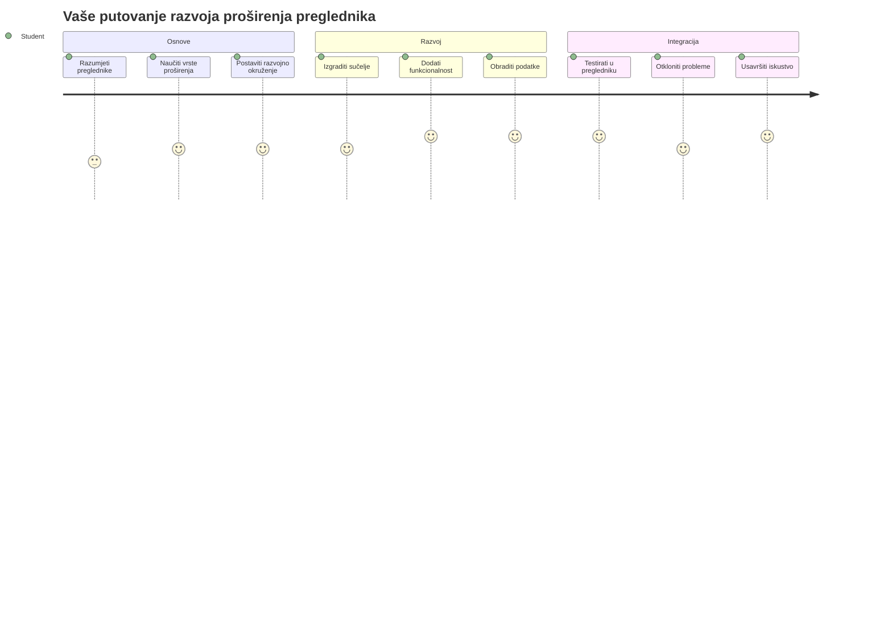
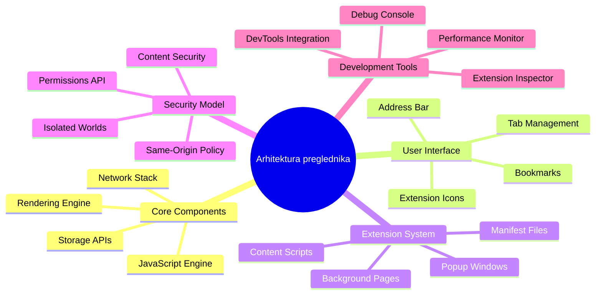
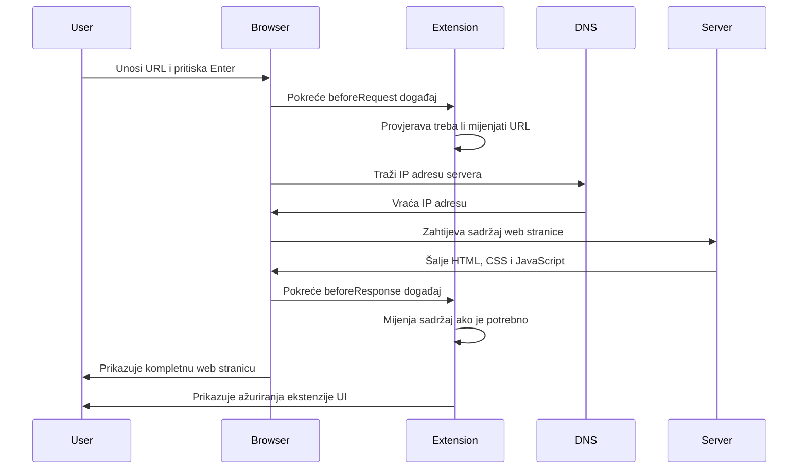
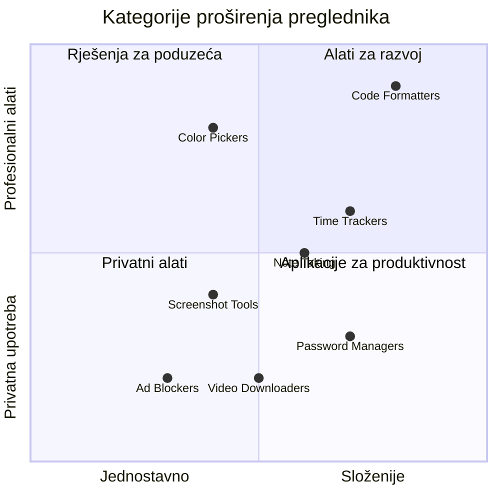
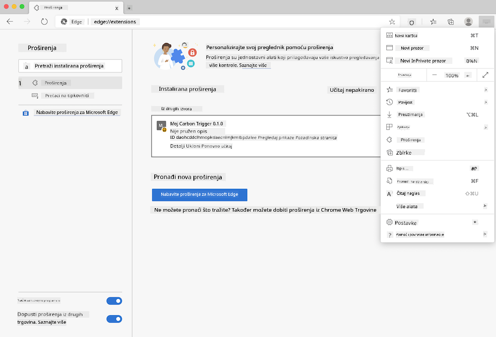
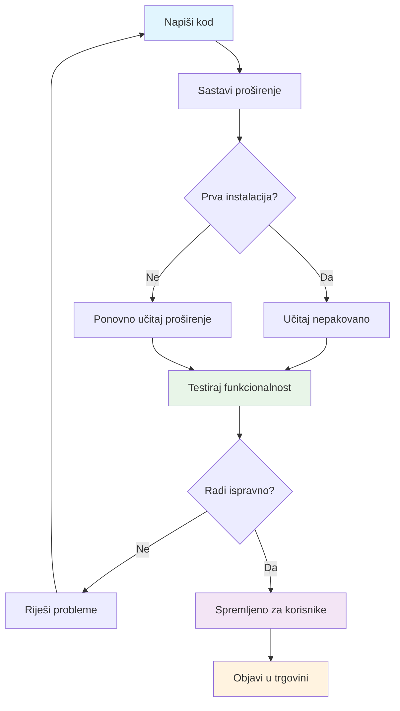
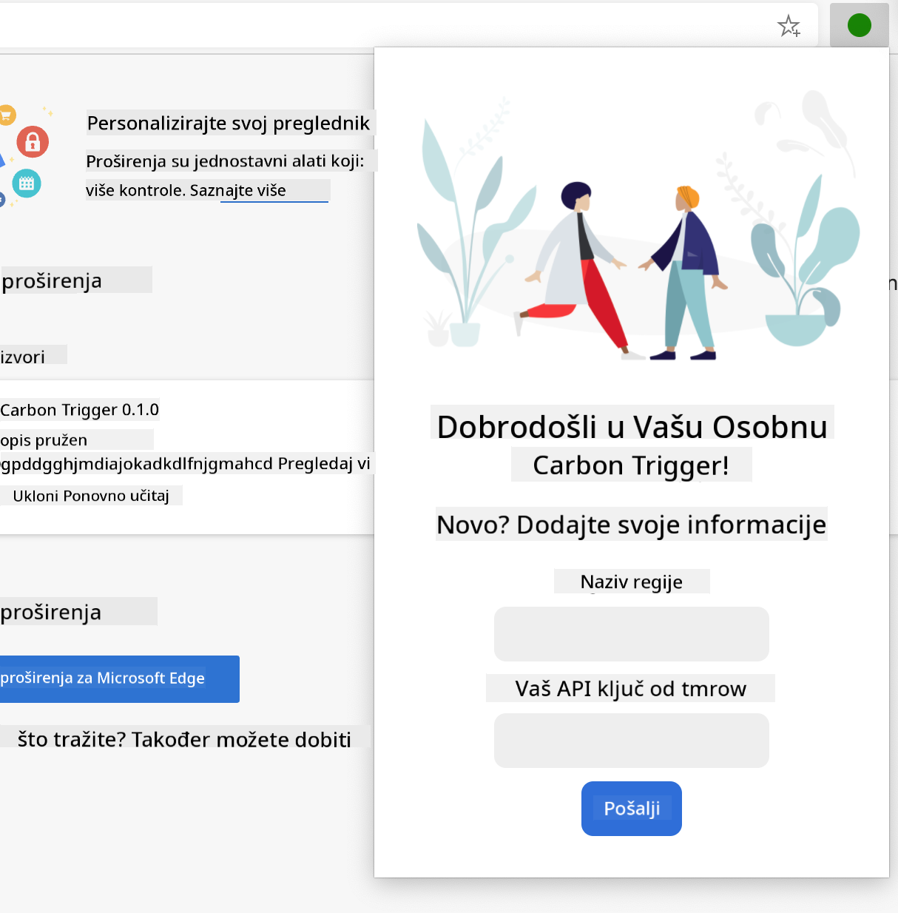
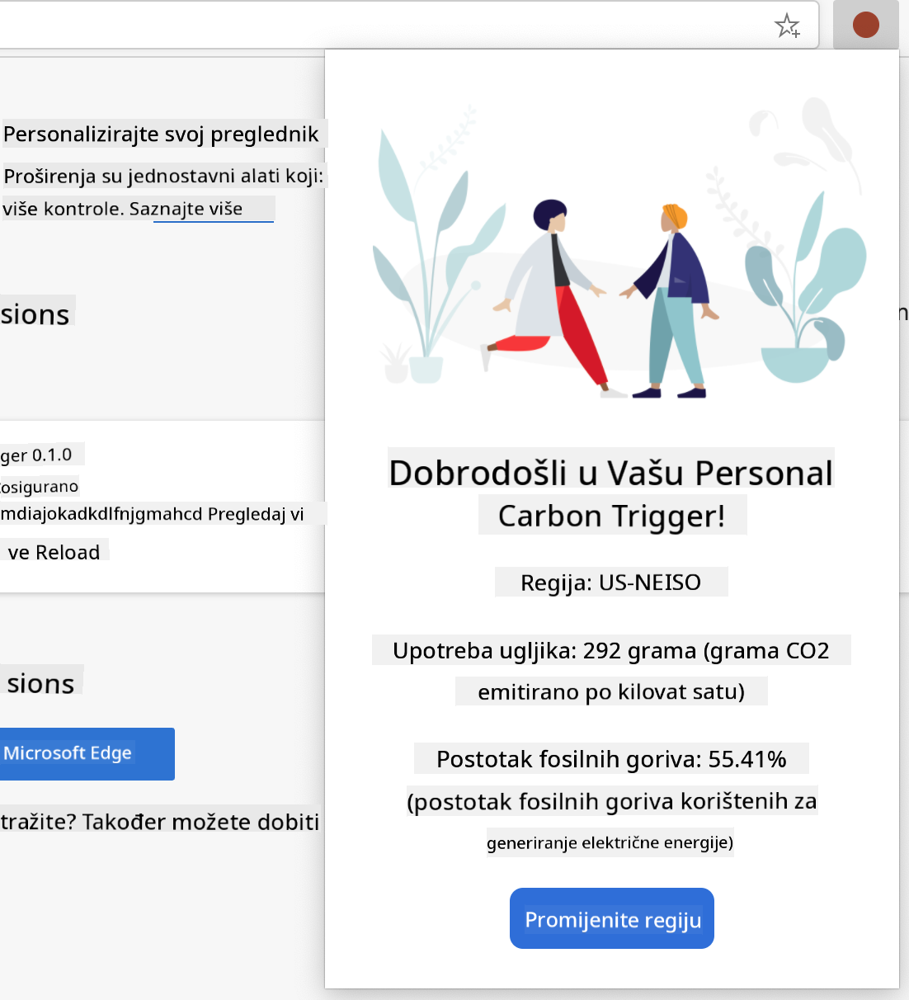
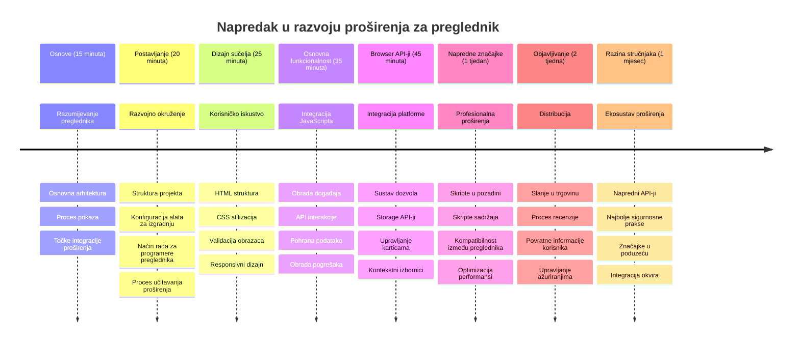

<!--
CO_OP_TRANSLATOR_METADATA:
{
  "original_hash": "00aa85715e1efd4930c17a23e3012e69",
  "translation_date": "2026-01-07T09:14:53+00:00",
  "source_file": "5-browser-extension/1-about-browsers/README.md",
  "language_code": "hr"
}
-->
# Projekt proširenja preglednika Dio 1: Sve o preglednicima



> Sketchnote od [Wassim Chegham](https://dev.to/wassimchegham/ever-wondered-what-happens-when-you-type-in-a-url-in-an-address-bar-in-a-browser-3dob)

## Kviz prije predavanja

[Pre-lecture quiz](https://ff-quizzes.netlify.app/web/quiz/23)

### Uvod

Proširenja preglednika su mini-aplikacije koje poboljšavaju vaše iskustvo pregledavanja weba. Kao što je Tim Berners-Lee zamišljao interaktivni web, proširenja proširuju mogućnosti preglednika izvan jednostavnog prikaza dokumenata. Od upravitelja lozinkama koji štite vaše račune do birača boja koji pomažu dizajnerima da uhvate savršene nijanse, proširenja rješavaju svakodnevne izazove pregledavanja.

Prije nego što izradimo vaše prvo proširenje, razumimo kako preglednici rade. Baš kao što je Alexander Graham Bell trebao razumjeti prijenos zvuka prije nego što je izumio telefon, poznavanje osnovnih principa preglednika pomoći će vam da izradite proširenja koja se besprijekorno integriraju s postojećim sustavima preglednika.

Na kraju ovog poglavlja razumjet ćete arhitekturu preglednika i započeti gradnju svog prvog proširenja.


## Razumijevanje web preglednika

Web preglednik je u suštini sofisticirani tumač dokumenata. Kad upišete "google.com" u adresnu traku, preglednik izvodi složeni niz radnji - traži sadržaj s poslužitelja širom svijeta, zatim parsira i prikazuje taj kod u interaktivne web stranice koje vidite.

Ovaj proces odražava kako je prvi web preglednik, WorldWideWeb, dizajnirao Tim Berners-Lee 1990. godine kako bi hiperveze učinio dostupnima svima.

✅ **Malo povijesti**: Prvi preglednik zvao se ‘WorldWideWeb’ i stvorio ga je sir Timothy Berners-Lee 1990. godine.


> Neki rani preglednici, prema [Karen McGrane](https://www.slideshare.net/KMcGrane/week-4-ixd-history-personal-computing)

### Kako preglednici obrađuju web sadržaj

Proces između unošenja URL-a i prikaza web stranice uključuje nekoliko koordiniranih koraka koji se odigraju u roku od sekundi:


**Ovo je što proces postiže:**
- **Prevede** URL čitljiv ljudima u IP adresu poslužitelja putem DNS upita
- **Uspostavi** sigurnu vezu s web poslužiteljem koristeći HTTP ili HTTPS protokole
- **Zatraži** specifični sadržaj web stranice s poslužitelja
- **Primi** HTML oznake, CSS stilove i JavaScript kod s poslužitelja
- **Prikazuje** sav sadržaj u interaktivnu web stranicu koju vidite

### Osnovne značajke preglednika

Moderni preglednici pružaju brojne značajke koje programeri proširenja mogu iskoristiti:

| Značajka | Svrha | Mogućnosti za proširenja |
|---------|---------|------------------------|
| **Rendering Engine** | Prikazuje HTML, CSS i JavaScript | Modifikacija sadržaja, umetanje stilova |
| **JavaScript Engine** | Izvršava JavaScript kod | Prilagođeni skripti, interakcije s API-jem |
| **Local Storage** | Sprema podatke lokalno | Postavke korisnika, predmemorirani podaci |
| **Network Stack** | Rukuje web zahtjevima | Praćenje zahtjeva, analiza podataka |
| **Security Model** | Štiti korisnike od zlonamjernog sadržaja | Filtriranje sadržaja, sigurnosna poboljšanja |

**Razumijevanje ovih značajki pomaže vam da:**
- **Prepoznate** gdje vaše proširenje može dodati najviše vrijednosti
- **Odaberete** prave API-je preglednika za funkcionalnost vašeg proširenja
- **Dizajnirate** proširenja koja učinkovito rade s pregledničkim sustavima
- **Osigurate** da vaše proširenje slijedi najbolje prakse sigurnosti preglednika

### Razmatranja za razvoj na više preglednika

Različiti preglednici standarde provode s malim varijacijama, slično kao što različiti programski jezici mogu drugačije obraditi isti algoritam. Chrome, Firefox i Safari svaki imaju jedinstvene karakteristike koje developeri moraju uzeti u obzir tijekom izrade proširenja.

> 💡 **Savjet**: Koristite [caniuse.com](https://www.caniuse.com) kako biste provjerili koje web tehnologije podržavaju različiti preglednici. Ovo je neprocjenjivo kod planiranja funkcionalnosti vašeg proširenja!

**Ključne stvari za razvoj proširenja:**
- **Testirajte** svoje proširenje na preglednicima Chrome, Firefox i Edge
- **Prilagodite** se različitim API-jima i formatima manifest datoteka
- **Riješite** varijacije u performansama i ograničenjima
- **Omogućite** alternative za značajke specifične za određene preglednike koje možda nisu dostupne

✅ **Uvid u analitiku**: Možete odrediti koje preglednike vaši korisnici preferiraju instaliranjem analitičkih paketa u vaše web razvojne projekte. Ti podaci pomažu vam prioritetizirati koje preglednike prvo podržavati.

## Razumijevanje proširenja preglednika

Proširenja preglednika rješavaju uobičajene izazove pregledavanja dodavanjem funkcionalnosti izravno u sučelje preglednika. Umjesto da korisnici trebaju zasebne aplikacije ili složene procese, proširenja pružaju trenutačan pristup alatima i značajkama.

Ovaj koncept podsjeća na način kako su ranih računarskih pionira poput Douglasa Engelbarta zamišljali povećanje ljudskih sposobnosti pomoću tehnologije - proširenja nadograđuju osnovnu funkcionalnost vašeg preglednika.


**Popularne kategorije proširenja i njihove prednosti:**
- **Alati za produktivnost**: Upravljanje zadacima, aplikacije za bilješke i vremensko praćenje koje pomažu u organizaciji
- **Sigurnosna poboljšanja**: Upravitelji lozinkama, blokatori reklama i alati za privatnost koji štite vaše podatke
- **Alati za developere**: Formatere koda, biranje boja i alati za otklanjanje pogrešaka koji ubrzavaju razvoj
- **Poboljšanje sadržaja**: Načini čitanja, preuzimatelji videa i alati za snimanje zaslona koji poboljšavaju vaše web iskustvo

✅ **Pitanje za razmišljanje**: Koja su vaša omiljena proširenja preglednika? Koje specifične zadatke obavljaju i kako poboljšavaju vaše iskustvo pregledavanja?

### 🔄 **Pedagoški pregled**
**Razumijevanje arhitekture preglednika**: Prije prelaska na razvoj proširenja, pobrinite se da možete:
- ✅ Objasniti kako preglednici obrađuju web zahtjeve i prikazuju sadržaj
- ✅ Prepoznati glavne komponente arhitekture preglednika
- ✅ Razumjeti kako se proširenja integriraju s funkcionalnošću preglednika
- ✅ Prepoznati sigurnosni model koji štiti korisnike

**Brzi samoprovjera**: Možete li pratiti put od upisivanja URL-a do prikaza web stranice?
1. **DNS upit** pretvara URL u IP adresu
2. **HTTP zahtjev** dohvaća sadržaj s poslužitelja
3. **Parsiranje** obrađuje HTML, CSS i JavaScript
4. **Prikazivanje** prikazuje konačnu web stranicu
5. **Proširenja** mogu modificirati sadržaj u više koraka

## Instalacija i upravljanje proširenjima

Razumijevanje procesa instalacije proširenja pomaže vam predvidjeti iskustvo korisnika kad ljudi instaliraju vaše proširenje. Proces instalacije standardiziran je kod modernih preglednika, s manjim varijacijama u dizajnu sučelja.



> **Važno**: Provjerite jeste li uključili način za developere te dozvolili instalaciju proširenja iz drugih trgovina prilikom testiranja svojih proširenja.

### Proces instalacije proširenja tijekom razvoja

Kad razvijate i testirate vlastita proširenja, slijedite ovaj tijek rada:


```bash
# Korak 1: Izgradite svoje proširenje
npm run build
```

**Što ova naredba postiže:**
- **Kompilira** vaš izvorni kod u datoteke spremne za preglednik
- **Spaja** JavaScript module u optimizirane pakete
- **Generira** konačne datoteke proširenja u mapi `/dist`
- **Priprema** vaše proširenje za instalaciju i testiranje

**Korak 2: Otiđite na Proširenja preglednika**
1. **Otvorite** stranicu za upravljanje proširenjima preglednika
2. **Kliknite** gumb "Postavke i još" (ikona `...`) u gornjem desnom kutu
3. **Odaberite** "Proširenja" iz padajućeg izbornika

**Korak 3: Učitajte svoje proširenje**
- **Za nove instalacije**: Izaberite `load unpacked` i odaberite vašu `/dist` mapu
- **Za ažuriranja**: Kliknite `reload` pored već instaliranog proširenja
- **Za testiranje**: Uključite "Način za developere" za dodatne mogućnosti otklanjanja pogrešaka

### Instalacija proširenja za produkciju

> ✅ **Napomena**: Ove upute za razvoj posebno su za proširenja koja sami gradite. Za instalaciju objavljenih proširenja posjetite službene trgovine proširenja preglednika poput [Microsoft Edge Add-ons store](https://microsoftedge.microsoft.com/addons/Microsoft-Edge-Extensions-Home).

**Razumijevanje razlika:**
- **Razvojne instalacije** omogućuju testiranje neobjavljenih proširenja tijekom razvoja
- **Trgovačke instalacije** nude pregledana, objavljena proširenja s automatskim ažuriranjima
- **Sideloading** omogućuje instalaciju proširenja izvan službenih trgovina (zahtijeva način za developere)

## Izrada vašeg proširenja za ugljični otisak

Izradit ćemo proširenje preglednika koje prikazuje ugljični otisak potrošnje energije u vašoj regiji. Ovaj projekt demonstrira osnovne koncepte razvoja proširenja dok stvara koristan alat za okolišnu svijest.

Ovaj pristup slijedi načelo "učenja kroz rad" koje je djelotvorno od vremena John Deweyjevih pedagoških teorija - kombinirajući tehničke vještine s korisnim stvarnim primjenama.

### Zahtjevi projekta

Prije početka razvoja skupimo potrebne resurse i ovisnosti:

**Potrebni pristup API-ju:**
- **[CO2 Signal API ključ](https://www.co2signal.com/)**: Unesite svoju email adresu kako biste dobili besplatan API ključ
- **[Kod regije](http://api.electricitymap.org/v3/zones)**: Pronađite kod svoje regije koristeći [Electricity Map](https://www.electricitymap.org/map) (na primjer, Boston koristi 'US-NEISO')

**Razvojni alati:**
- **[Node.js i NPM](https://www.npmjs.com)**: Alat za upravljanje paketima za instalaciju ovisnosti projekta
- **[Početni kod](../../../../5-browser-extension/start)**: Preuzmite mapu `start` za početak razvoja

✅ **Saznajte više**: Poboljšajte svoje vještine upravljanja paketima kroz ovaj [detaljni Learn modul](https://docs.microsoft.com/learn/modules/create-nodejs-project-dependencies/?WT.mc_id=academic-77807-sagibbon)

### Razumijevanje strukture projekta

Razumijevanje strukture projekta pomaže učinkovito organizirati razvojni rad. Kao što je knjižnica Aleksandrije bila organizirana za lakši pristup znanju, dobro strukturirana baza koda čini razvoj efikasnijim:

```
project-root/
├── dist/                    # Built extension files
│   ├── manifest.json        # Extension configuration
│   ├── index.html           # User interface markup
│   ├── background.js        # Background script functionality
│   └── main.js              # Compiled JavaScript bundle
├── src/                     # Source development files
│   └── index.js             # Your main JavaScript code
├── package.json             # Project dependencies and scripts
└── webpack.config.js        # Build configuration
```

**Što svaka datoteka radi:**
- **`manifest.json`**: **Definira** metapodatke proširenja, dopuštenja i početne točke
- **`index.html`**: **Kreira** korisničko sučelje koje se prikazuje kad korisnici kliknu na proširenje
- **`background.js`**: **Rukuje** pozadinskim zadacima i slušateljima događaja preglednika
- **`main.js`**: **Sadrži** konačni objedinjeni JavaScript nakon procesa izgradnje
- **`src/index.js`**: **Sadrži** vaš glavni razvojni kod koji se kompajlira u `main.js`

> 💡 **Savjet za organizaciju**: Spremite svoj API ključ i kod regije u sigurnu bilješku radi lakšeg pristupa tijekom razvoja. Trebat će vam te vrijednosti za testiranje funkcionalnosti vašeg proširenja.

✅ **Sigurnosna napomena**: Nikada ne spremite API ključeve ili osjetljive pristupne podatke u svoj repozitorij koda. Pokazat ćemo vam kako ih sigurno rukovati u sljedećim koracima.

## Izrada sučelja proširenja

Sada ćemo izgraditi komponente korisničkog sučelja. Proširenje koristi pristup s dva zaslona: zaslon konfiguracije za početno postavljanje i zaslon rezultata za prikaz podataka.

Ovo slijedi princip progresivnog otkrivanja koji se koristi u dizajnu sučelja još od ranih računarskih dana - otkrivajući informacije i opcije logičnim redoslijedom kako se korisnici ne bi preopteretili.

### Pregled prikaza proširenja

**Zaslon postavljanja** - konfiguracija za prvi put korisnika:


**Zaslon rezultata** - prikaz podataka o ugljičnom otisku:


### Izrada obrasca za konfiguraciju

Obrazac za postavljanje prikuplja konfiguracijske podatke korisnika prilikom prvog korištenja. Nakon konfiguracije, ove informacije ostaju spremljene u pregledničku pohranu za buduće sesije.

U datoteci `/dist/index.html` dodajte ovu strukturu obrasca:

```html
<form class="form-data" autocomplete="on">
    <div>
        <h2>New? Add your Information</h2>
    </div>
    <div>
        <label for="region">Region Name</label>
        <input type="text" id="region" required class="region-name" />
    </div>
    <div>
        <label for="api">Your API Key from tmrow</label>
        <input type="text" id="api" required class="api-key" />
    </div>
    <button class="search-btn">Submit</button>
</form>
```

**Što ovaj obrazac omogućuje:**
- **Kreira** semantičku strukturu obrasca s odgovarajućim oznakama i povezivanjem unosa
- **Omogućuje** automatsko dovršavanje preglednika za bolje korisničko iskustvo
- **Zahtijeva** ispunjavanje oba polja prije slanja putem atributa `required`
- **Organizira** ulaze s opisnim imenima klasa radi lakšeg stiliziranja i ciljanog JavaScript pristupa
- **Pruža** jasne upute korisnicima koji prvi put postavljaju proširenje

### Izrada prikaza rezultata

Zatim kreirajte područje rezultata koje će prikazivati podatke o ugljičnom otisku. Dodajte ovaj HTML ispod obrasca:

```html
<div class="result">
    <div class="loading">loading...</div>
    <div class="errors"></div>
    <div class="data"></div>
    <div class="result-container">
        <p><strong>Region: </strong><span class="my-region"></span></p>
        <p><strong>Carbon Usage: </strong><span class="carbon-usage"></span></p>
        <p><strong>Fossil Fuel Percentage: </strong><span class="fossil-fuel"></span></p>
    </div>
    <button class="clear-btn">Change region</button>
</div>
```

**Što ova struktura pruža:**
- **`loading`**: **Prikazuje** poruku učitavanja dok se podaci s API-ja dohvaćaju
- **`errors`**: **Prikazuje** poruke o pogreškama ako pozivi API-ja zakažu ili su podaci nevažeći
- **`data`**: **Drži** sirove podatke radi otklanjanja pogrešaka tijekom razvoja
- **`result-container`**: **Prikazuje** oblikovane informacije o ugljičnom otisku korisnicima
- **`clear-btn`**: **Dopusti** korisnicima promjenu regije i ponovnu konfiguraciju proširenja

### Postavljanje procesa izgradnje

Sada instalirajmo ovisnosti projekta i testirajmo proces izgradnje:

```bash
npm install
```

**Što ovaj proces instalacije postiže:**
- **Preuzima** Webpack i druge razvojne ovisnosti navedene u `package.json`
- **Konfigurira** alat za izgradnju za kompilaciju modernog JavaScript koda
- **Priprema** razvojno okruženje za izradu i testiranje proširenja
- **Omogućuje** objedinjavanje, optimizaciju i značajke međupregledničke kompatibilnosti

> 💡 **Uvid u proces izgradnje**: Webpack spaja vaš izvorni kod iz `/src/index.js` u `/dist/main.js`. Ovaj proces optimizira kod za produkciju i osigurava kompatibilnost s preglednicima.

### Testiranje vašeg napretka

U ovom trenutku možete testirati svoje proširenje:
1. **Pokreni** naredbu za izgradnju kako bi kompajlirao svoj kod
2. **Učitaj** dodatak u svoj preglednik koristeći način za razvojne programere
3. **Provjeri** prikazuje li se obrazac ispravno i izgleda profesionalno
4. **Provjeri** jesu li svi elementi obrasca ispravno poravnati i funkcionalni

**Što si postigao:**
- **Izgradio** temeljnu HTML strukturu za svoj dodatak
- **Kreirao** sučelja za konfiguraciju i rezultate s pravilnom semantičkom oznakom
- **Postavio** moderan razvojni tijek koristeći industrijski standardne alate
- **Pripremio** temelj za dodavanje interaktivnih JavaScript funkcionalnosti

### 🔄 **Pedagoška provjera**
**Napredak u razvoju dodatka**: Provjeri svoje razumijevanje prije nastavka:
- ✅ Možeš li objasniti svrhu svake datoteke u strukturi projekta?
- ✅ Razumiješ li kako proces izgradnje transformira tvoj izvorni kod?
- ✅ Zašto odvajamo konfiguraciju i rezultate u različite dijelove sučelja?
- ✅ Kako struktura obrasca podržava i upotrebljivost i pristupačnost?

**Razumijevanje razvojog tijeka**: Sada bi trebao moći:
1. **Izmijeniti** HTML i CSS za sučelje svog dodatka
2. **Pokrenuti** naredbu za izgradnju kako bi kompajlirao svoje izmjene
3. **Ponovno učitati** dodatak u pregledniku kako bi testirao ažuriranja
4. **Otkloniti pogreške** koristeći alate za razvojne programere u pregledniku

Završio si prvu fazu razvoja dodataka za preglednike. Kao što su braća Wright prvo trebala razumjeti aerodinamiku prije nego što su ostvarili let, razumijevanje ovih temeljnih pojmova priprema te za izgradnju složenijih interaktivnih značajki u sljedećoj lekciji.

## Izazov GitHub Copilot Agenta 🚀

Iskoristi Agent način za dovršetak sljedećeg izazova:

**Opis:** Poboljšaj dodatak za preglednik dodavanjem validacije obrasca i značajki za povratnu informaciju korisniku radi poboljšanja korisničkog iskustva pri unosu API ključeva i kodova regija.

**Zadatak:** Kreiraj funkcije za validaciju u JavaScriptu koje provjeravaju sadrži li polje API ključa barem 20 znakova i slijedi li kod regije ispravan format (npr. 'US-NEISO'). Dodaj vizualnu povratnu informaciju promjenom boje okvira unosa u zeleno za valjane unose i crveno za nevaljane. Također dodaj značajku preklapanja za prikaz/sakrivanje API ključa radi sigurnosti.

Više o [agent modu](https://code.visualstudio.com/blogs/2025/02/24/introducing-copilot-agent-mode) pročitaj ovdje.

## 🚀 Izazov

Pogledaj trgovinu dodataka za preglednik i instaliraj jedan u svoj preglednik. Možeš proučiti njegove datoteke na zanimljive načine. Što otkrivaš?

## Kviz nakon lekcije

[Kviz nakon lekcije](https://ff-quizzes.netlify.app/web/quiz/24)

## Pregled i samostalno učenje

U ovoj si lekciji naučio malo o povijesti web preglednika; iskoristi priliku da saznaš kako su izumitelji World Wide Weba zamišljali njegovu uporabu čitajući više o njegovoj povijesti. Korisne stranice uključuju:

[Povijest web preglednika](https://www.mozilla.org/firefox/browsers/browser-history/)

[Povijest weba](https://webfoundation.org/about/vision/history-of-the-web/)

[Intervju s Timom Berners-Leejem](https://www.theguardian.com/technology/2019/mar/12/tim-berners-lee-on-30-years-of-the-web-if-we-dream-a-little-we-can-get-the-web-we-want)

### ⚡ **Što možeš napraviti u sljedećih 5 minuta**
- [ ] Otvori stranicu za dodatke Chrome/Edge preglednika (chrome://extensions) i istraži što si instalirao
- [ ] Pogledaj karticu Mreža u alatima za razvojne programere dok učitavaš web stranicu
- [ ] Pokušaj pogledati izvor stranice (Ctrl+U) da vidiš HTML strukturu
- [ ] Istraži bilo koji element web stranice i izmijeni njegov CSS u alatima za razvojne programere

### 🎯 **Što možeš postići u ovom satu**
- [ ] Završiti kviz nakon lekcije i razumjeti osnove preglednika
- [ ] Kreirati osnovnu datoteku manifest.json za dodatak preglednika
- [ ] Izgraditi jednostavni dodatak "Hello World" koji prikazuje skočni prozor
- [ ] Testirati učitavanje dodatka u načinu za razvojne programere
- [ ] Istražiti dokumentaciju dodataka za ciljanu vrstu preglednika

### 📅 **Tvoj tjedni put razvoja dodatka**
- [ ] Dovršiti funkcionalni dodatak za preglednik s pravom korisnom funkcionalnošću
- [ ] Naučiti o sadržajnim skriptama, pozadinskim skriptama i interakcijama skočnih prozora
- [ ] Ovladati API-jima preglednika kao što su spremište, kartice i slanje poruka
- [ ] Dizajnirati korisnički pristupačna sučelja za svoj dodatak
- [ ] Testirati dodatak na različitim web stranicama i u različitim scenarijima
- [ ] Objaviti dodatak u trgovini dodataka za preglednike

### 🌟 **Tvoj mjesečni razvoj pregledničkih dodataka**
- [ ] Izgraditi više dodataka koji rješavaju različite korisničke probleme
- [ ] Naučiti napredne API-je preglednika i najbolje prakse za sigurnost
- [ ] Doprinijeti otvorenim izvorima projekata dodataka za preglednike
- [ ] Ovladati kompatibilnošću među preglednicima i progresivnim poboljšanjem
- [ ] Kreirati alate i predloške za razvoj dodataka za druge
- [ ] Postati stručnjak za pregledničke dodatke koji pomaže drugim programerima

## 🎯 Tvoj vremenski plan za usavršavanje u razvoju dodataka


### 🛠️ Sažetak skupa alata za razvoj dodataka

Nakon završetka ove lekcije, sada imaš:
- **Znanje o arhitekturi preglednika**: Razumijevanje renderiranja, sigurnosnih modela i integracije dodataka
- **Razvojno okruženje**: Moderan alatni lanac s Webpackom, NPM-om i mogućnostima debugiranja
- **Temelj UI/UX-a**: Semantička HTML struktura s obrascima progresivnog otkrivanja
- **Sigurnosnu osviještenost**: Razumijevanje dozvola preglednika i sigurnih razvojnih praksi
- **Koncepte kompatibilnosti među preglednicima**: Znanje o razmatranjima kompatibilnosti i pristupima testiranju
- **Integraciju API-ja**: Temelj za rad s vanjskim izvorima podataka
- **Profesionalni tijek rada**: Industrijski standardni postupci razvoja i testiranja

**Primjena u stvarnom svijetu**: Ove vještine direktno se primjenjuju na:
- **Web razvoj**: Jednostanične aplikacije i progresivne web aplikacije
- **Desktop aplikacije**: Electron i softver temeljen na webu za stolna računala
- **Mobilni razvoj**: Hibridne aplikacije i mobilna web rješenja
- **Alate za poduzeća**: Interni alati za produktivnost i automatizaciju tijeka rada
- **Open Source**: Doprinose projektima dodataka za preglednike i web standardima

**Sljedeća razina**: Spreman si za dodavanje interaktivnih funkcionalnosti, rad s API-jima preglednika i kreiranje dodataka koji rješavaju stvarne korisničke probleme!

## Zadatak

[Prilagodi svoj dodatak](assignment.md)

---

<!-- CO-OP TRANSLATOR DISCLAIMER START -->
**Odricanje od odgovornosti**:
Ovaj je dokument preveden pomoću AI prevodilačke usluge [Co-op Translator](https://github.com/Azure/co-op-translator). Iako nastojimo postići točnost, imajte na umu da automatizirani prijevodi mogu sadržavati pogreške ili netočnosti. Izvorni dokument na izvornom jeziku treba se smatrati službenim i autoritativnim izvorom. Za važne informacije preporučujemo profesionalni prijevod od strane ljudskog prevoditelja. Nismo odgovorni za bilo kakve nesporazume ili pogrešne interpretacije koje proizlaze iz korištenja ovog prijevoda.
<!-- CO-OP TRANSLATOR DISCLAIMER END -->