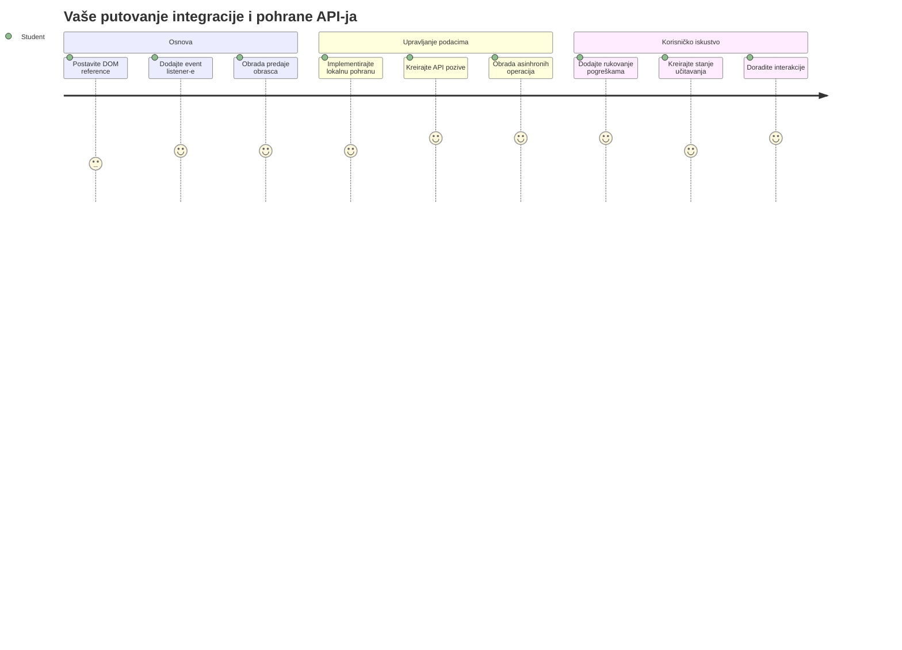
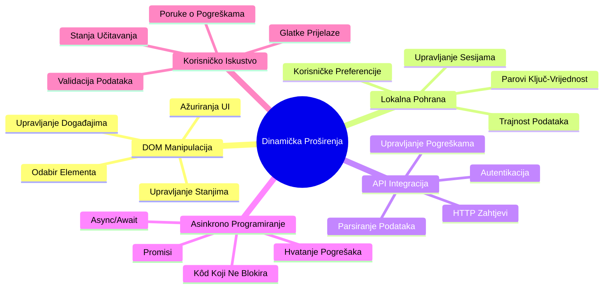
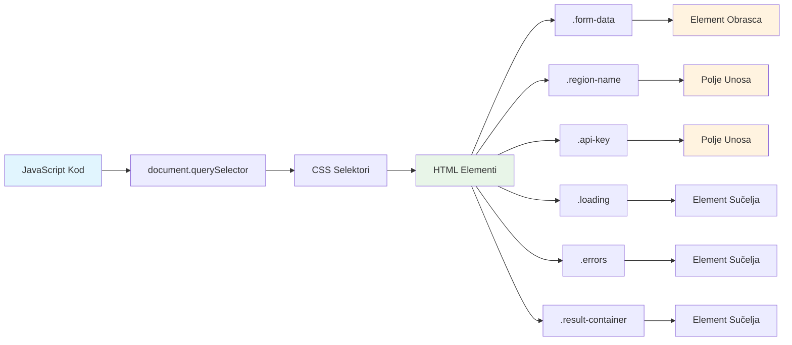
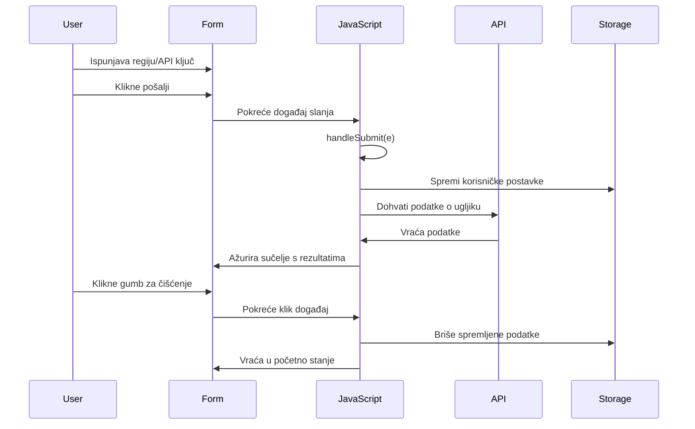
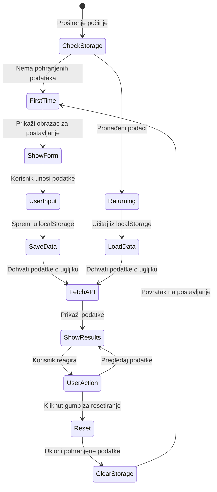
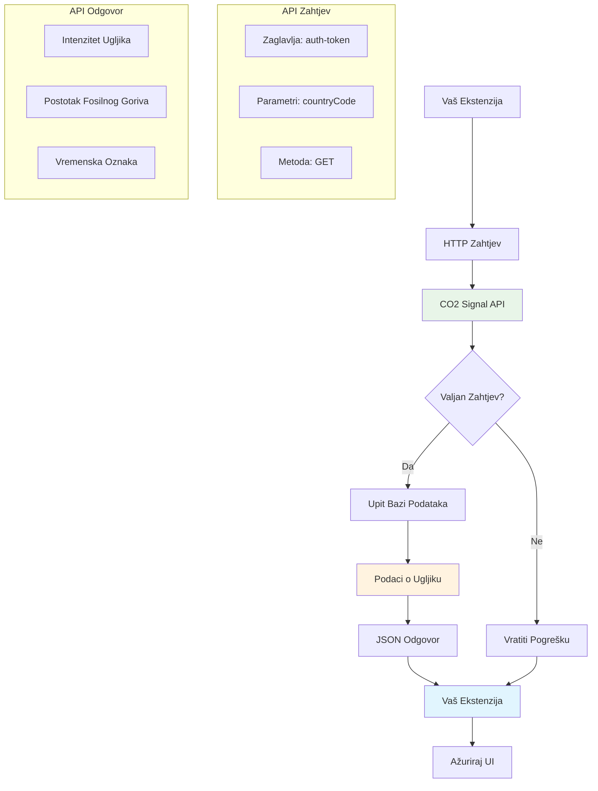
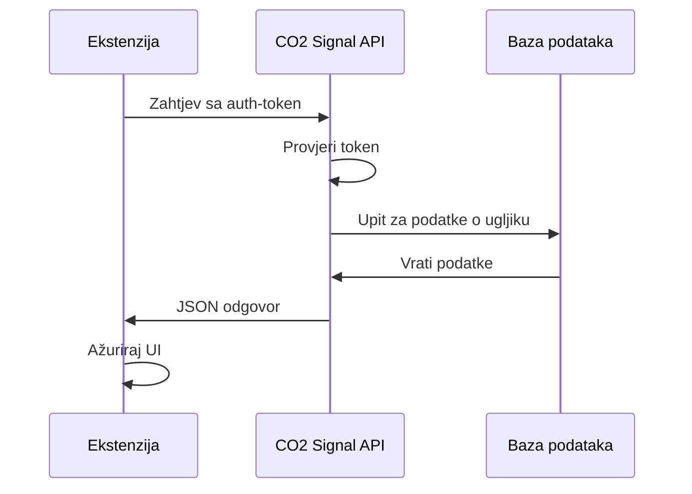
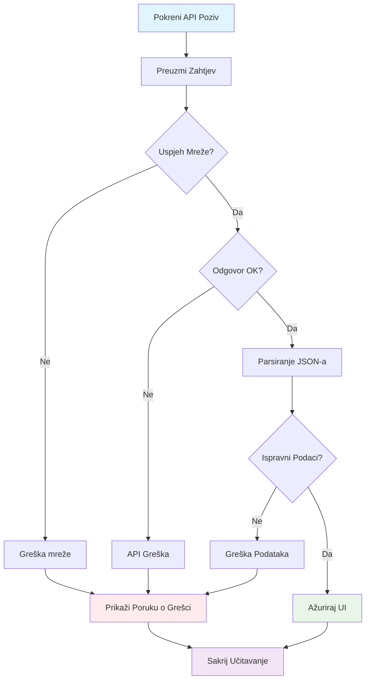
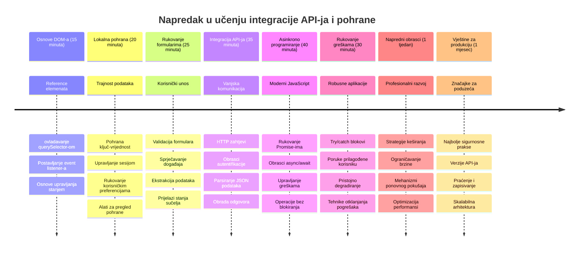

# Projekt proširenja preglednika, dio 2: Pozivanje API-ja, korištenje lokalne pohrane


## Predpredavanje kviz

[Predpredavanje kviz](https://ff-quizzes.netlify.app/web/quiz/25)

## Uvod

Sjećaš se onog proširenja za preglednik koje si počeo graditi? Trenutno imaš lijepo dizajniran oblik, ali on je zapravo statičan. Danas ćemo ga oživjeti povezivanjem s pravim podacima i dodavanjem memorije.

Razmisli o računalima za kontrolu misija Apolla – nisu samo prikazivala fiksne informacije. Kontinuirano su komunicirala s letjelicama, ažurirala podatke s telemetrije i pamtila ključne parametre misije. To je dinamično ponašanje koje danas gradimo. Tvoje proširenje će dohvaćati stvarne podatke o okolišu i pamtiti tvoje postavke za sljedeći put.

Integracija API-ja može zvučati komplicirano, ali to je zapravo učenje tvog koda kako komunicirati s drugim uslugama. Bilo da dohvaćaš vremenske podatke, društvene mreže ili informacije o ugljičnom otisku poput onoga što ćemo raditi danas, radi se o uspostavljanju tih digitalnih veza. Također ćemo istražiti kako preglednici mogu trajno pohraniti informacije – slično kao što su knjižnice koristile kartoteke da pamte gdje knjige pripadaju.

Na kraju ove lekcije imat ćeš proširenje preglednika koje dohvaća stvarne podatke, pohranjuje korisničke postavke i pruža glatko iskustvo. Krenimo!


✅ Slijedi numerirane dijelove u odgovarajućim datotekama da znaš gdje staviti svoj kod

## Postavi elemente za manipulaciju u proširenju

Prije nego što tvoj JavaScript može manipulirati sučeljem, treba mu reference na specifične HTML elemente. To je kao teleskop koji mora biti usmjeren na određene zvijezde – prije nego je Galileo mogao proučavati Jupiterove mjeseca, morao je locirati i usredotočiti se na Jupiter.

U tvojoj datoteci `index.js` stvorit ćemo varijable `const` koje hvataju reference na svaki važan element u obliku. To je slično kao što znanstvenici označavaju svoju opremu – umjesto da svaki put pretražuju cijelu laboratoriju, mogu izravno pristupiti onome što treba.


```javascript
// obrasci polja
const form = document.querySelector('.form-data');
const region = document.querySelector('.region-name');
const apiKey = document.querySelector('.api-key');

// rezultati
const errors = document.querySelector('.errors');
const loading = document.querySelector('.loading');
const results = document.querySelector('.result-container');
const usage = document.querySelector('.carbon-usage');
const fossilfuel = document.querySelector('.fossil-fuel');
const myregion = document.querySelector('.my-region');
const clearBtn = document.querySelector('.clear-btn');
```

**Evo što ovaj kod radi:**
- **Hvata** elemente obrasca koristeći `document.querySelector()` s CSS selektorima
- **Stvara** reference na ulazna polja za naziv regije i API ključ
- **Uspostavlja** veze na elemente za prikaz rezultata za podatke o potrošnji ugljika
- **Postavlja** pristup UI elementima poput pokazivača učitavanja i poruka o pogrešci
- **Sprema** svaki element u `const` varijablu radi lakšeg ponovnog korištenja kroz kod

## Dodaj slušatelje događaja

Sada ćemo učiniti da tvoje proširenje reagira na korisničke radnje. Slušatelji događaja su način na koji tvoj kod prati korisničke interakcije. Zamislimo ih kao operatere u ranim telefonskim centrima – slušali su dolazne pozive i povezivali odgovarajuće krugove kad bi netko želio uspostaviti vezu.


```javascript
form.addEventListener('submit', (e) => handleSubmit(e));
clearBtn.addEventListener('click', (e) => reset(e));
init();
```

**Razumijevanje pojmova:**
- **Veže** slušatelja podnošenja na obrazac koji se aktivira kad korisnik pritisne Enter ili klikne podnesi
- **Povezuje** slušatelja klika na gumb za čišćenje za resetiranje obrasca
- **Prosljeđuje** objekt događaja `(e)` u funkcije za dodatnu kontrolu
- **Poziva** funkciju `init()` odmah radi postavljanja početnog stanja proširenja

✅ Primijeti ovdje korištenu sažetu sintaksu strelične funkcije. Ovaj moderni JavaScript pristup je čišći od tradicionalnih funkcijskih izraza, ali oba jednako dobro funkcioniraju!

### 🔄 **Pedagoški pregled**
**Razumijevanje rukovanja događajima**: Prije prelaska na inicijalizaciju, budi siguran da možeš:
- ✅ Objasniti kako `addEventListener` povezuje korisničke akcije s JavaScript funkcijama
- ✅ Razumjeti zašto prosljeđujemo objekt događaja `(e)` u funkcije za rukovanje
- ✅ Prepoznati razliku između događaja `submit` i `click`
- ✅ Opisati kada i zašto se funkcija `init()` pokreće

**Brzi samoprovjera**: Što bi se dogodilo da zaboraviš `e.preventDefault()` u podnošenju obrasca?
*Odgovor: Stranica bi se ponovno učitala, izgubivši sav JavaScript status i prekidajući korisničko iskustvo*

## Izradi funkcije inicijalizacije i resetiranja

Kreirat ćemo logiku inicijalizacije za tvoje proširenje. Funkcija `init()` je poput navigacijskog sustava broda koja provjerava instrumente – određuje trenutno stanje i prilagođava sučelje u skladu s tim. Provjerava je li netko već koristio tvoje proširenje i učitava prethodne postavke.

Funkcija `reset()` korisnicima pruža svjež početak – slično kao što znanstvenici resetiraju instrumente između eksperimenata kako bi osigurali čiste podatke.

```javascript
function init() {
	// Provjerite je li korisnik prethodno spremio API vjerodajnice
	const storedApiKey = localStorage.getItem('apiKey');
	const storedRegion = localStorage.getItem('regionName');

	// Postavite ikonu ekstenzije na generičku zelenu (privremeni prikaz za buduću lekciju)
	// TODO: Implementirajte ažuriranje ikone u sljedećoj lekciji

	if (storedApiKey === null || storedRegion === null) {
		// Korisnik prvi put: prikažite obrazac za postavljanje
		form.style.display = 'block';
		results.style.display = 'none';
		loading.style.display = 'none';
		clearBtn.style.display = 'none';
		errors.textContent = '';
	} else {
		// Povratni korisnik: automatski učitajte njihove spremljene podatke
		displayCarbonUsage(storedApiKey, storedRegion);
		results.style.display = 'none';
		form.style.display = 'none';
		clearBtn.style.display = 'block';
	}
}

function reset(e) {
	e.preventDefault();
	// Očistite pohranjenu regiju kako biste korisniku omogućili odabir nove lokacije
	localStorage.removeItem('regionName');
	// Ponovno pokrenite proces inicijalizacije
	init();
}
```

**Analiza onoga što se događa:**
- **Dohvaća** spremljeni API ključ i regiju iz lokalne pohrane preglednika
- **Provjerava** je li korisnik prvi put (nema spremljenih podataka) ili vraćajući se
- **Prikazuje** obrazac za postavljanje za nove korisnike i skriva ostale elemente sučelja
- **Automatski učitava** spremljene podatke za vraćajuće korisnike i prikazuje opciju resetiranja
- **Upravlja** stanjem korisničkog sučelja na temelju dostupnih podataka

**Ključni pojmovi o lokalnoj pohrani:**
- **Trajno pohranjuje** podatke između sesija preglednika (za razliku od sessionStorage)
- **Pohranjuje** podatke kao parove ključ-vrijednost koristeći `getItem()` i `setItem()`
- **Vraća** `null` ako nema podataka za određeni ključ
- **Pruža** jednostavan način za pamćenje korisničkih postavki i preferencija

> 💡 **Razumijevanje pohrane u pregledniku**: [LocalStorage](https://developer.mozilla.org/docs/Web/API/Window/localStorage) je poput davanja tvom proširenju trajne memorije. Razmisli kako je drevna Aleksandrijska knjižnica pohranjivala svitke – informacije su ostajale dostupne čak i kad su znanstvenici odlazili i vraćali se.
>
> **Ključne značajke:**
> - **Čuva** podatke čak i nakon zatvaranja preglednika
> - **Preživljava** restart računala i padove preglednika
> - **Pruža** značajan prostor za pohranu korisničkih postavki
> - **Nudi** trenutačni pristup bez mrežnih kašnjenja

> **Važna napomena**: Tvoje proširenje preglednika ima vlastitu izoliranu lokalnu pohranu koja je odvojena od redovnih web stranica. To pruža sigurnost i sprječava sukobe s drugim web-lokacijama.

Možeš pogledati svoje pohranjene podatke otvaranjemalatčkih razvojnih alata u pregledniku (F12), navigiraj do kartice **Application** i proširi odjeljak **Local Storage**.




> ⚠️ **Sigurnosna napomena**: U proizvodnim aplikacijama pohranjivanje API ključeva u LocalStorage predstavlja sigurnosni rizik jer JavaScript može pristupiti tim podacima. Za svrhe učenja je ovaj pristup dobar, ali prave aplikacije trebaju koristiti sigurnu pohranu na strani servera za osjetljive vjerodajnice.

## Obradi podnošenje obrasca

Sada ćemo obraditi što se događa kad netko podnese tvoj obrazac. Zadano, preglednici ponovno učitavaju stranicu pri podnošenju obrasca, ali mi ćemo presresti to ponašanje za glatkije iskustvo.

Ovaj pristup sliči načinu na koji kontrola misije upravlja komunikacijama s letjelicama – umjesto da resetiraju cijeli sustav za svaki prijenos, održavaju kontinuirani rad dok obrađuju nove informacije.

Kreiraj funkciju koja hvata događaj podnošenja obrasca i izvlači unos korisnika:

```javascript
function handleSubmit(e) {
	e.preventDefault();
	setUpUser(apiKey.value, region.value);
}
```

**U gornjem smo kodu:**
- **Spriječili** zadano ponašanje podnošenja obrasca koje bi osvježilo stranicu
- **Izvukli** vrijednosti unosa korisnika iz polja za API ključ i regiju
- **Proslijedili** podatke obrasca u funkciju `setUpUser()` za obradu
- **Održavamo** ponašanje jedne stranice time što izbjegavamo ponovno učitavanje

✅ Sjeti se da su tvoja HTML polja obrasca označena atributom `required`, pa preglednik automatski provjerava postoji li unos API ključa i regije prije nego što ova funkcija radi.

## Postavi korisničke postavke

Funkcija `setUpUser` je odgovorna za spremanje korisničkih vjerodajnica i pokretanje prvog poziva API-ja. Time se stvara gladak prijelaz od postavljanja do prikaza rezultata.

```javascript
function setUpUser(apiKey, regionName) {
	// Spremi korisničke vjerodajnice za buduće sesije
	localStorage.setItem('apiKey', apiKey);
	localStorage.setItem('regionName', regionName);
	
	// Ažuriraj sučelje da prikaže stanje učitavanja
	loading.style.display = 'block';
	errors.textContent = '';
	clearBtn.style.display = 'block';
	
	// Dohvati podatke o potrošnji ugljika s korisničkim vjerodajnicama
	displayCarbonUsage(apiKey, regionName);
}
```

**Korak po korak što se događa:**
- **Spremi** API ključ i naziv regije u lokalnu pohranu za buduću uporabu
- **Prikaži** indikator učitavanja da korisnici znaju da se podaci dohvaćaju
- **Očisti** prethodne poruke o pogrešci s prikaza
- **Pokaži** gumb za čišćenje da korisnici kasnije mogu resetirati postavke
- **Pokreni** poziv API-ja za dohvaćanje stvarnih podataka o potrošnji ugljika

Ova funkcija stvara besprijekorno korisničko iskustvo upravljajući podatcima i ažuriranjima sučelja u jednoj usklađenoj akciji.

## Prikaz podataka o potrošnji ugljika

Sada ćemo povezati tvoje proširenje s vanjskim izvorima podataka putem API-ja. Time tvoje proširenje postaje alat koji može pristupati informacijama u stvarnom vremenu širom interneta.

**Razumijevanje API-ja**

[API-ji](https://www.webopedia.com/TERM/A/API.html) su način na koji različite aplikacije međusobno komuniciraju. Zamislimo ih kao telegraf koji je spajao udaljene gradove u 19. stoljeću – operateri su slali zahtjeve udaljenim stanicama i primali odgovore s traženim informacijama. Svaki put kad provjeravaš društvene mreže, postaviš pitanje glasovnom asistentu ili koristiš aplikaciju za dostavu, API-ji olakšavaju te razmjene podataka.


**Ključni pojmovi o REST API-jima:**
- **REST** znači 'Representational State Transfer' (prijenos reprezentacijskog stanja)
- **Koristi** standardne HTTP metode (GET, POST, PUT, DELETE) za interakciju s podacima
- **Vraća** podatke u predvidivim formatima, obično JSON
- **Pruža** dosljedne URL krajnje točke za različite vrste zahtjeva

✅ [CO2 Signal API](https://www.co2signal.com/) koji ćemo koristiti pruža podatke o intenzitetu ugljika u stvarnom vremenu iz elektroenergetskih mreža širom svijeta. To pomaže korisnicima razumjeti utjecaj njihove potrošnje električne energije na okoliš!

> 💡 **Razumijevanje asinhronog JavaScripta**: [`async` ključna riječ](https://developer.mozilla.org/docs/Web/JavaScript/Reference/Statements/async_function) omogućuje tvom kodu da istovremeno obrađuje više operacija. Kad zatražiš podatke s poslužitelja, ne želiš da se cijelo proširenje zamrzne – to bi bilo kao da zračni promet kontrola prestaje dok čekaju odgovor jednog aviona.
>
> **Ključne prednosti:**
> - **Održava** odzivnost proširenja dok se podaci učitavaju
> - **Dopušta** izvršavanje drugih dijelova koda tijekom mrežnih zahtjeva
> - **Poboljšava** čitljivost koda u odnosu na tradicionalne obrasce pozivanja (callback)
> - **Omogućuje** elegantno upravljanje pogreškama kod mrežnih problema

Evo kratki video o `async`:

[](https://youtube.com/watch?v=YwmlRkrxvkk "Async i Await za upravljanje obećanjima")

> 🎥 Klikni na gornju sliku za video o async/await.

### 🔄 **Pedagoški pregled**
**Razumijevanje asinkronog programiranja**: Prije nego što se uhvatiš za API funkciju, provjeri razumiješ li:
- ✅ Zašto koristimo `async/await` umjesto blokiranja cijelog proširenja
- ✅ Kako blokovi `try/catch` elegantno obrađuju mrežne pogreške
- ✅ Razliku između sinkronih i asinkronih operacija
- ✅ Zašto pozivi API-ja mogu ne uspjeti i kako te pogreške obraditi

**Povezivanje sa stvarnim svijetom**: Razmisli o ovim svakodnevnim asinhronim primjerima:
- **Naručivanje hrane**: Ne stojiš kraj kuhinje – dobiješ račun i radiš druge stvari
- **Slanje e-pošte**: Aplikacija ne zamrzava dok šalje – možeš pisati nove poruke
- **Učitavanje web stranica**: Slike se postupno učitavaju dok već možeš čitati tekst

**Tijek provjere autentičnosti API-ja**:

Kreiraj funkciju za dohvat i prikaz podataka o potrošnji ugljika:

```javascript
// Moderan pristup s fetch API-jem (nije potrebna vanjska ovisnost)
async function displayCarbonUsage(apiKey, region) {
	try {
		// Dohvati podatke o ugljičnoj intenziteti s CO2 Signal API-ja
		const response = await fetch('https://api.co2signal.com/v1/latest', {
			method: 'GET',
			headers: {
				'auth-token': apiKey,
				'Content-Type': 'application/json'
			},
			// Dodaj parametre upita za određenu regiju
			...new URLSearchParams({ countryCode: region }) && {
				url: `https://api.co2signal.com/v1/latest?countryCode=${region}`
			}
		});

		// Provjeri je li API zahtjev bio uspješan
		if (!response.ok) {
			throw new Error(`API request failed: ${response.status}`);
		}

		const data = await response.json();
		const carbonData = data.data;

		// Izračunaj zaokruženu vrijednost ugljične intenzitete
		const carbonIntensity = Math.round(carbonData.carbonIntensity);

		// Ažuriraj korisničko sučelje sa dohvaćenim podacima
		loading.style.display = 'none';
		form.style.display = 'none';
		myregion.textContent = region.toUpperCase();
		usage.textContent = `${carbonIntensity} grams (grams CO₂ emitted per kilowatt hour)`;
		fossilfuel.textContent = `${carbonData.fossilFuelPercentage.toFixed(2)}% (percentage of fossil fuels used to generate electricity)`;
		results.style.display = 'block';

		// TODO: calculateColor(carbonIntensity) - implementirati u sljedećoj lekciji

	} catch (error) {
		console.error('Error fetching carbon data:', error);
		
		// Prikaži korisniku razumljivu poruku o grešci
		loading.style.display = 'none';
		results.style.display = 'none';
		errors.textContent = 'Sorry, we couldn\'t fetch data for that region. Please check your API key and region code.';
	}
}
```

**Rasčlanjivanje što se događa:**
- **Koristi** modernu `fetch()` API umjesto vanjskih biblioteka poput Axios za čistiji, neovisan kod
- **Provodi** ispravno provjeravanje pogrešaka s `response.ok` za rano hvatanje neuspjeha API poziva
- **Rukuje** asinkronim operacijama s `async/await` radi čitljivijeg tijeka koda
- **Autentificira** se s CO2 Signal API-jem koristeći zaglavlje `auth-token`
- **Parsira** podatke JSON odgovora i izvlači informacije o intenzitetu ugljika
- **Ažurira** više UI elemenata formatiranim podacima o okolišu
- **Pruža** korisnički prihvatljive poruke o pogreškama kad API pozivi zakažu

**Ključni moderni JavaScript koncepti prikazani ovdje:**
- **Literalni predlošci** s `${}` sintaksom za čisto formatiranje stringova
- **Rukovanje pogreškama** s try/catch blokovima za robusne aplikacije
- **Async/await** obrazac za elegantno upravljanje mrežnim zahtjevima
- **Destrukturiranje objekata** za izdvajanje specifičnih podataka iz API odgovora
- **Chaining metoda** za više manipulacija DOM-om

✅ Ova funkcija ilustrira nekoliko važnih koncepata web razvoja – komunikaciju s vanjskim poslužiteljima, upravljanje autentifikacijom, obradu podataka, ažuriranje sučelja i elegantno upravljanje pogreškama. To su temeljne vještine koje profesionalni programeri redovito koriste.


### 🔄 **Pedagoški pregled**
**Potpuno razumijevanje sustava**: Provjeri svoje znanje o cijelom tijeku:
- ✅ Kako DOM reference omogućuju JavaScriptu kontrolu sučelja
- ✅ Zašto lokalna pohrana omogućuje trajnost između sesija preglednika
- ✅ Kako async/await pozivi API-ja rade bez zamrzavanja proširenja
- ✅ Što se događa kad pozivi API-ja zakažu i kako se greške obrađuju
- ✅ Zašto korisničko iskustvo uključuje stanje učitavanja i poruke o pogreškama

🎉 **Što si postigao:** Napravio si proširenje preglednika koje:
- **Povezuje** se na internet i dohvaća stvarne podatke o okolišu
- **Pamti** korisničke postavke između sesija
- **Rukuje** greškama elegantno umjesto da pada
- **Pruža** glatko i profesionalno korisničko iskustvo

Testiraj svoj rad pokretanjem `npm run build` i osvježi proširenje u pregledniku. Sada imaš funkcionalni tracker ugljičnog otiska. Sljedeća lekcija dodaje dinamičnu funkcionalnost ikone za dovršetak proširenja.

---

## Izazov GitHub Copilot agenta 🚀

Iskoristi Agent mod za dovršetak sljedećeg izazova:
**Opis:** Poboljšajte proširenje za preglednik dodavanjem poboljšanja u obradi pogrešaka i značajki za korisničko iskustvo. Ovaj izazov će vam pomoći da uvježbate rad s API-jima, lokalnim spremištem i manipulacijom DOM-om koristeći moderne JavaScript obrasce.

**Zadatak:** Napravite poboljšanu verziju funkcije displayCarbonUsage koja uključuje: 1) mehanizam ponovnog pokušaja za neuspjele pozive API-ja s eksponencijalnim vraćanjem unazad, 2) provjeru valjanosti unosa za kod regije prije poziva API-ja, 3) animaciju učitavanja s pokazivačima napretka, 4) keširanje odgovora API-ja u localStorage s vremenskim oznakama isteka (keširajte 30 minuta) i 5) značajku za prikaz povijesnih podataka iz prethodnih poziva API-ja. Također dodajte odgovarajuće JSDoc komentare u TypeScript stilu za dokumentiranje svih parametara funkcije i tipova povratka.

Saznajte više o [agent mode](https://code.visualstudio.com/blogs/2025/02/24/introducing-copilot-agent-mode) ovdje.

## 🚀 Izazov

Proširite svoje razumijevanje API-ja istraživanjem bogatstva API-ja dostupnih u pregledniku za razvoj weba. Izaberite jedan od ovih pregledničkih API-ja i napravite malu demonstraciju:

- [Geolocation API](https://developer.mozilla.org/docs/Web/API/Geolocation_API) - Dohvati trenutačnu lokaciju korisnika
- [Notification API](https://developer.mozilla.org/docs/Web/API/Notifications_API) - Slanje desktop obavijesti
- [HTML Drag and Drop API](https://developer.mozilla.org/docs/Web/API/HTML_Drag_and_Drop_API) - Izrada interaktivnih sučelja za povlačenje
- [Web Storage API](https://developer.mozilla.org/docs/Web/API/Web_Storage_API) - Napredne tehnike lokalnog spremišta
- [Fetch API](https://developer.mozilla.org/docs/Web/API/Fetch_API) - Moderna alternativa XMLHttpRequest-u

**Istraživačka pitanja za razmatranje:**
- Koje stvarne probleme ovaj API rješava?
- Kako API rukuje pogreškama i rubnim slučajevima?
- Koje sigurnosne aspekte treba imati na umu pri korištenju ovog API-ja?
- Koliko je široko podržan ovaj API na različitim preglednicima?

Nakon istraživanja, identificirajte koje karakteristike API čine prijateljskim za developere i pouzdanim.

## Kviz nakon predavanja

[Kviz nakon predavanja](https://ff-quizzes.netlify.app/web/quiz/26)

## Pregled i samostalno učenje

Naučili ste o LocalStorage i API-jima u ovoj lekciji, oba vrlo korisna za profesionalnog web developera. Možete li razmisliti o tome kako te dvije stvari funkcioniraju zajedno? Razmislite kako biste arhitektonski postavili web stranicu koja pohranjuje stavke za korištenje API-jem.

### ⚡ **Što možete učiniti u sljedećih 5 minuta**
- [ ] Otvorite karticu Application u DevTools i istražite localStorage na bilo kojoj web stranici
- [ ] Napravite jednostavan HTML obrazac i testirajte validaciju obrasca u pregledniku
- [ ] Isprobajte pohranu i dohvat podataka koristeći localStorage u konzoli preglednika
- [ ] Pregledajte podatke obrasca koji se šalju koristeći karticu Network

### 🎯 **Što možete postići u ovom satu**
- [ ] Završite kviz nakon lekcije i razumite koncepte rukovanja obrascima
- [ ] Izradite obrazac za proširenje preglednika koji sprema korisničke postavke
- [ ] Implementirajte validaciju obrasca na strani klijenta s korisnim porukama o pogreškama
- [ ] Vježbajte korištenje chrome.storage API-ja za trajnost podataka proširenja
- [ ] Izradite korisničko sučelje koje reagira na spremljene korisničke postavke

### 📅 **Vaša tjedna gradnja proširenja**
- [ ] Završite proširenje za preglednik s punom funkcionalnošću obrasca
- [ ] Ovladajte različitim opcijama spremišta: local, sync i session storage
- [ ] Implementirajte napredne značajke obrasca poput automatskog dovršavanja i validacije
- [ ] Dodajte funkcionalnost uvoza/izvoza korisničkih podataka
- [ ] Temeljito testirajte proširenje na različitim preglednicima
- [ ] Doradite korisničko iskustvo i obradu pogrešaka proširenja

### 🌟 **Vaša mjesečna stručnost u web API-jima**
- [ ] Izradite složene aplikacije koristeći razne API-je za pohranu u pregledniku
- [ ] Naučite o offline-first razvojnom pristupu
- [ ] Doprinesite open source projektima vezanim uz trajnost podataka
- [ ] Ovladajte razvojem usmjerenim na privatnost i usklađenošću s GDPR-om
- [ ] Izradite ponovo upotrebljive biblioteke za rukovanje obrascima i upravljanje podacima
- [ ] Dijelite znanja o web API-jima i razvoju proširenja

## 🎯 Vaš vremenski plan za ovladavanje razvojem proširenja


### 🛠️ Sažetak vašeg kompletnog alata za Full-Stack razvoj

Nakon završetka ove lekcije, sada imate:
- **Ovladavanje DOM-om**: Precizno ciljanje i manipulacija elementima
- **Stručnost u pohrani podataka**: Upravljanje trajnim podacima pomoću localStorage
- **Integracija s API-jem**: Dohvat podataka u stvarnom vremenu i autentikacija
- **Asinkrono programiranje**: Neprekidne operacije s modernim JavaScriptom
- **Rukovanje pogreškama**: Robusne aplikacije koje elegantno rješavaju neuspjehe
- **Korisničko iskustvo**: Stanja učitavanja, validacija i glatke interakcije
- **Moderni obrasci**: fetch API, async/await, i značajke ES6+

**Profesionalne vještine koje ste stekli**: Implementirali ste obrasce korištene u:
- **Web aplikacijama**: Jednostanične aplikacije s vanjskim izvorima podataka
- **Mobilnom razvoju**: API-pokretane aplikacije s offline mogućnostima
- **Desktop softveru**: Electron aplikacije s trajnom pohranom
- **Enterprise sustavima**: Autentikacija, keširanje i obrada pogrešaka
- **Modernim okvirima**: Obrasci upravljanja podacima u React/Vue/Angular

**Sljedeća razina**: Spremni ste istražiti napredne teme poput strategija keširanja, WebSocket veza u stvarnom vremenu ili složenog upravljanja stanjem!

## Zadatak

[Usvoji API](assignment.md)

---

<!-- CO-OP TRANSLATOR DISCLAIMER START -->
**Odricanje od odgovornosti**:  
Ovaj je dokument preveden pomoću AI prevoditeljske usluge [Co-op Translator](https://github.com/Azure/co-op-translator). Iako težimo točnosti, imajte na umu da automatski prijevodi mogu sadržavati pogreške ili netočnosti. Izvorni dokument na izvornom jeziku treba smatrati autoritativnim izvorom. Za kritične informacije preporučuje se profesionalni ljudski prijevod. Ne snosimo odgovornost za bilo kakva nesporazume ili pogrešne interpretacije koje proizlaze iz korištenja ovog prijevoda.
<!-- CO-OP TRANSLATOR DISCLAIMER END -->