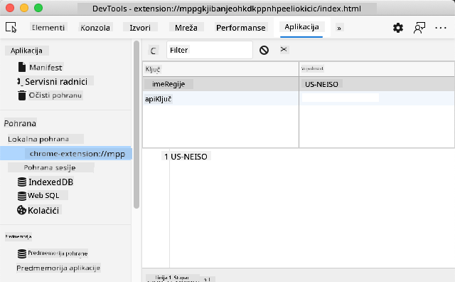

<!--
CO_OP_TRANSLATOR_METADATA:
{
  "original_hash": "e10f168beac4e7b05e30e0eb5c92bf11",
  "translation_date": "2025-08-27T22:23:15+00:00",
  "source_file": "5-browser-extension/2-forms-browsers-local-storage/README.md",
  "language_code": "hr"
}
-->
# Projekt proširenja preglednika, dio 2: Pozivanje API-ja, korištenje lokalne pohrane

## Kviz prije predavanja

[Kviz prije predavanja](https://ashy-river-0debb7803.1.azurestaticapps.net/quiz/25)

### Uvod

U ovoj lekciji pozvat ćete API slanjem obrasca vašeg proširenja preglednika i prikazati rezultate u proširenju. Osim toga, naučit ćete kako možete pohraniti podatke u lokalnu pohranu preglednika za buduću referencu i upotrebu.

✅ Slijedite numerirane segmente u odgovarajućim datotekama kako biste znali gdje postaviti svoj kod.

### Postavljanje elemenata za manipulaciju u proširenju:

Do sada ste izradili HTML za obrazac i `<div>` za rezultate vašeg proširenja preglednika. Od sada ćete raditi u datoteci `/src/index.js` i graditi svoje proširenje korak po korak. Pogledajte [prethodnu lekciju](../1-about-browsers/README.md) za postavljanje projekta i proces izgradnje.

Radom u svojoj datoteci `index.js`, započnite stvaranjem nekih `const` varijabli za pohranu vrijednosti povezanih s različitim poljima:

```JavaScript
// form fields
const form = document.querySelector('.form-data');
const region = document.querySelector('.region-name');
const apiKey = document.querySelector('.api-key');

// results
const errors = document.querySelector('.errors');
const loading = document.querySelector('.loading');
const results = document.querySelector('.result-container');
const usage = document.querySelector('.carbon-usage');
const fossilfuel = document.querySelector('.fossil-fuel');
const myregion = document.querySelector('.my-region');
const clearBtn = document.querySelector('.clear-btn');
```

Sva ova polja referenciraju se prema njihovoj CSS klasi, kako ste ih postavili u HTML-u u prethodnoj lekciji.

### Dodavanje osluškivača događaja

Zatim dodajte osluškivače događaja za obrazac i gumb za brisanje koji resetira obrazac, tako da se nešto dogodi ako korisnik pošalje obrazac ili klikne na taj gumb za resetiranje. Dodajte i poziv za inicijalizaciju aplikacije na dnu datoteke:

```JavaScript
form.addEventListener('submit', (e) => handleSubmit(e));
clearBtn.addEventListener('click', (e) => reset(e));
init();
```

✅ Obratite pažnju na skraćeni način slušanja događaja slanja ili klika i kako se događaj prosljeđuje funkcijama `handleSubmit` ili `reset`. Možete li napisati ekvivalent ovog skraćenog zapisa u dužem formatu? Koji vam je način draži?

### Izgradnja funkcija `init()` i `reset()`:

Sada ćete izgraditi funkciju koja inicijalizira proširenje, a zove se `init()`:

```JavaScript
function init() {
	//if anything is in localStorage, pick it up
	const storedApiKey = localStorage.getItem('apiKey');
	const storedRegion = localStorage.getItem('regionName');

	//set icon to be generic green
	//todo

	if (storedApiKey === null || storedRegion === null) {
		//if we don't have the keys, show the form
		form.style.display = 'block';
		results.style.display = 'none';
		loading.style.display = 'none';
		clearBtn.style.display = 'none';
		errors.textContent = '';
	} else {
        //if we have saved keys/regions in localStorage, show results when they load
        displayCarbonUsage(storedApiKey, storedRegion);
		results.style.display = 'none';
		form.style.display = 'none';
		clearBtn.style.display = 'block';
	}
};

function reset(e) {
	e.preventDefault();
	//clear local storage for region only
	localStorage.removeItem('regionName');
	init();
}

```

U ovoj funkciji postoji zanimljiva logika. Čitajući je, možete li vidjeti što se događa?

- postavljaju se dvije `const` varijable kako bi se provjerilo je li korisnik pohranio APIKey i kod regije u lokalnu pohranu.
- ako je bilo koji od njih null, prikazuje se obrazac promjenom njegovog stila na 'block'.
- skrivaju se rezultati, učitavanje i `clearBtn`, a tekst pogreške postavlja se na prazan string.
- ako postoje ključ i regija, pokreće se rutina za:
  - pozivanje API-ja za dobivanje podataka o potrošnji ugljika,
  - skrivanje područja rezultata,
  - skrivanje obrasca,
  - prikaz gumba za resetiranje.

Prije nego što krenete dalje, korisno je naučiti o vrlo važnom konceptu dostupnom u preglednicima: [LocalStorage](https://developer.mozilla.org/docs/Web/API/Window/localStorage). LocalStorage je koristan način za pohranu stringova u pregledniku kao `key-value` par. Ova vrsta web pohrane može se manipulirati pomoću JavaScripta za upravljanje podacima u pregledniku. LocalStorage ne istječe, dok se SessionStorage, druga vrsta web pohrane, briše kada se preglednik zatvori. Različite vrste pohrane imaju svoje prednosti i nedostatke.

> Napomena - vaše proširenje preglednika ima vlastitu lokalnu pohranu; glavni prozor preglednika je druga instanca i ponaša se odvojeno.

Postavite svoj APIKey da ima vrijednost stringa, na primjer, i možete vidjeti da je postavljen u Edgeu tako da "inspektirate" web stranicu (možete desnim klikom na preglednik otvoriti inspektor) i odete na karticu Applications kako biste vidjeli pohranu.



✅ Razmislite o situacijama u kojima NE biste željeli pohraniti neke podatke u LocalStorage. Općenito, postavljanje API ključeva u LocalStorage je loša ideja! Možete li vidjeti zašto? U našem slučaju, budući da je naša aplikacija isključivo za učenje i neće biti objavljena u trgovini aplikacija, koristit ćemo ovu metodu.

Primijetite da koristite Web API za manipulaciju LocalStorage-om, bilo pomoću `getItem()`, `setItem()` ili `removeItem()`. Široko je podržan u preglednicima.

Prije nego što izgradite funkciju `displayCarbonUsage()` koja se poziva u `init()`, izgradimo funkcionalnost za rukovanje početnim slanjem obrasca.

### Rukovanje slanjem obrasca

Kreirajte funkciju pod nazivom `handleSubmit` koja prihvaća argument događaja `(e)`. Zaustavite propagaciju događaja (u ovom slučaju želimo zaustaviti osvježavanje preglednika) i pozovite novu funkciju, `setUpUser`, prosljeđujući argumente `apiKey.value` i `region.value`. Na taj način koristite dvije vrijednosti koje se unose putem početnog obrasca kada su odgovarajuća polja popunjena.

```JavaScript
function handleSubmit(e) {
	e.preventDefault();
	setUpUser(apiKey.value, region.value);
}
```

✅ Osvježite svoje pamćenje - HTML koji ste postavili u prošloj lekciji ima dva ulazna polja čije se `vrijednosti` hvataju putem `const` varijabli koje ste postavili na vrhu datoteke, a oba su `required`, tako da preglednik sprječava korisnike da unesu null vrijednosti.

### Postavljanje korisnika

Prelazimo na funkciju `setUpUser`, ovdje postavljate vrijednosti lokalne pohrane za apiKey i regionName. Dodajte novu funkciju:

```JavaScript
function setUpUser(apiKey, regionName) {
	localStorage.setItem('apiKey', apiKey);
	localStorage.setItem('regionName', regionName);
	loading.style.display = 'block';
	errors.textContent = '';
	clearBtn.style.display = 'block';
	//make initial call
	displayCarbonUsage(apiKey, regionName);
}
```

Ova funkcija postavlja poruku učitavanja koja se prikazuje dok se API poziva. U ovom trenutku stigli ste do stvaranja najvažnije funkcije ovog proširenja preglednika!

### Prikaz potrošnje ugljika

Napokon, vrijeme je za upit API-ju!

Prije nego što krenemo dalje, trebali bismo razgovarati o API-jima. API-ji, ili [Application Programming Interfaces](https://www.webopedia.com/TERM/A/API.html), ključni su element alata web programera. Oni pružaju standardne načine za programe da međusobno komuniciraju i povezuju se. Na primjer, ako gradite web stranicu koja treba upitati bazu podataka, netko je možda stvorio API koji možete koristiti. Iako postoji mnogo vrsta API-ja, jedan od najpopularnijih je [REST API](https://www.smashingmagazine.com/2018/01/understanding-using-rest-api/).

✅ Pojam 'REST' označava 'Representational State Transfer' i uključuje korištenje različito konfiguriranih URL-ova za dohvaćanje podataka. Istražite malo o različitim vrstama API-ja dostupnih programerima. Koji vam format najviše odgovara?

Postoje važne stvari koje treba primijetiti o ovoj funkciji. Prvo, obratite pažnju na ključnu riječ [`async`](https://developer.mozilla.org/docs/Web/JavaScript/Reference/Statements/async_function). Pisanje vaših funkcija tako da rade asinkrono znači da čekaju na neku radnju, poput vraćanja podataka, prije nego što nastave.

Evo kratkog videa o `async`:

[](https://youtube.com/watch?v=YwmlRkrxvkk "Async i Await za upravljanje obećanjima")

> 🎥 Kliknite na sliku iznad za video o async/await.

Kreirajte novu funkciju za upit C02Signal API-ju:

```JavaScript
import axios from '../node_modules/axios';

async function displayCarbonUsage(apiKey, region) {
	try {
		await axios
			.get('https://api.co2signal.com/v1/latest', {
				params: {
					countryCode: region,
				},
				headers: {
					'auth-token': apiKey,
				},
			})
			.then((response) => {
				let CO2 = Math.floor(response.data.data.carbonIntensity);

				//calculateColor(CO2);

				loading.style.display = 'none';
				form.style.display = 'none';
				myregion.textContent = region;
				usage.textContent =
					Math.round(response.data.data.carbonIntensity) + ' grams (grams C02 emitted per kilowatt hour)';
				fossilfuel.textContent =
					response.data.data.fossilFuelPercentage.toFixed(2) +
					'% (percentage of fossil fuels used to generate electricity)';
				results.style.display = 'block';
			});
	} catch (error) {
		console.log(error);
		loading.style.display = 'none';
		results.style.display = 'none';
		errors.textContent = 'Sorry, we have no data for the region you have requested.';
	}
}
```

Ovo je velika funkcija. Što se ovdje događa?

- slijedeći najbolje prakse, koristite ključnu riječ `async` kako bi se ova funkcija ponašala asinkrono. Funkcija sadrži blok `try/catch` jer će vratiti obećanje kada API vrati podatke. Budući da nemate kontrolu nad brzinom kojom će API odgovoriti (možda uopće neće odgovoriti!), morate se nositi s ovom neizvjesnošću pozivajući ga asinkrono.
- upitujete co2signal API kako biste dobili podatke o regiji, koristeći svoj API ključ. Da biste koristili taj ključ, morate koristiti vrstu autentifikacije u parametrima zaglavlja.
- kada API odgovori, dodjeljujete različite elemente njegovih podataka odgovora dijelovima vašeg zaslona koje ste postavili za prikaz tih podataka.
- ako postoji pogreška ili nema rezultata, prikazujete poruku o pogrešci.

✅ Korištenje obrazaca asinkronog programiranja još je jedan vrlo koristan alat u vašem alatu. Pročitajte [o različitim načinima](https://developer.mozilla.org/docs/Web/JavaScript/Reference/Statements/async_function) na koje možete konfigurirati ovu vrstu koda.

Čestitamo! Ako izgradite svoje proširenje (`npm run build`) i osvježite ga u svom panelu proširenja, imate funkcionalno proširenje! Jedina stvar koja ne radi je ikona, a to ćete popraviti u sljedećoj lekciji.

---

## 🚀 Izazov

Razgovarali smo o nekoliko vrsta API-ja u ovim lekcijama. Odaberite web API i istražite detaljno što nudi. Na primjer, pogledajte API-je dostupne unutar preglednika, poput [HTML Drag and Drop API](https://developer.mozilla.org/docs/Web/API/HTML_Drag_and_Drop_API). Što čini dobar API prema vašem mišljenju?

## Kviz nakon predavanja

[Kviz nakon predavanja](https://ashy-river-0debb7803.1.azurestaticapps.net/quiz/26)

## Pregled i samostalno učenje

U ovoj lekciji naučili ste o LocalStorage i API-jima, oba vrlo korisna za profesionalnog web programera. Možete li razmisliti o tome kako ove dvije stvari rade zajedno? Razmislite o tome kako biste osmislili web stranicu koja bi pohranjivala stavke koje koristi API.

## Zadatak

[Usvojite API](assignment.md)

---

**Odricanje od odgovornosti**:  
Ovaj dokument je preveden korištenjem AI usluge za prevođenje [Co-op Translator](https://github.com/Azure/co-op-translator). Iako nastojimo osigurati točnost, imajte na umu da automatski prijevodi mogu sadržavati pogreške ili netočnosti. Izvorni dokument na izvornom jeziku treba smatrati mjerodavnim izvorom. Za ključne informacije preporučuje se profesionalni prijevod od strane stručnjaka. Ne preuzimamo odgovornost za bilo kakve nesporazume ili pogrešne interpretacije proizašle iz korištenja ovog prijevoda.