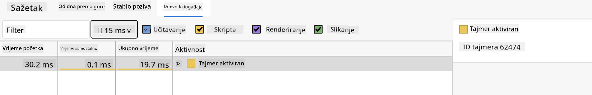

<!--
CO_OP_TRANSLATOR_METADATA:
{
  "original_hash": "b91cbf14240ee59411b96448b994ace1",
  "translation_date": "2025-10-03T12:34:42+00:00",
  "source_file": "5-browser-extension/3-background-tasks-and-performance/README.md",
  "language_code": "hr"
}
-->
# Projekt proširenja preglednika, dio 3: Naučite o pozadinskim zadacima i performansama

## Kviz prije predavanja

[Kviz prije predavanja](https://ff-quizzes.netlify.app/web/quiz/27)

### Uvod

U posljednje dvije lekcije ovog modula naučili ste kako izraditi obrazac i područje za prikaz podataka dohvaćenih s API-ja. To je vrlo standardan način stvaranja web prisutnosti na internetu. Čak ste naučili kako asinkrono dohvaćati podatke. Vaše proširenje preglednika gotovo je dovršeno.

Preostaje upravljati nekim pozadinskim zadacima, uključujući osvježavanje boje ikone proširenja, pa je ovo odličan trenutak za razgovor o tome kako preglednik upravlja takvim zadacima. Razmislimo o ovim zadacima preglednika u kontekstu performansi vaših web resursa dok ih izrađujete.

## Osnove web performansi

> "Performanse web stranice odnose se na dvije stvari: koliko brzo se stranica učitava i koliko brzo se kod na njoj izvršava." -- [Zack Grossbart](https://www.smashingmagazine.com/2012/06/javascript-profiling-chrome-developer-tools/)

Tema kako učiniti vaše web stranice iznimno brzim na svim vrstama uređaja, za sve vrste korisnika, u svim vrstama situacija, očekivano je opsežna. Evo nekoliko točaka koje treba imati na umu dok gradite standardni web projekt ili proširenje preglednika.

Prva stvar koju trebate učiniti kako biste osigurali da vaša stranica radi učinkovito jest prikupiti podatke o njezinim performansama. Prvo mjesto za to su alati za razvojne programere vašeg web preglednika. U Edgeu možete odabrati gumb "Postavke i više" (ikona tri točke u gornjem desnom kutu preglednika), zatim navigirati do Više alata > Alati za razvojne programere i otvoriti karticu Performanse. Također možete koristiti tipkovne prečace `Ctrl` + `Shift` + `I` na Windowsu ili `Option` + `Command` + `I` na Macu za otvaranje alata za razvojne programere.

Kartica Performanse sadrži alat za profiliranje. Otvorite web stranicu (isprobajte, na primjer, [https://www.microsoft.com](https://www.microsoft.com/?WT.mc_id=academic-77807-sagibbon)) i kliknite gumb 'Record', zatim osvježite stranicu. Zaustavite snimanje u bilo kojem trenutku i moći ćete vidjeti rutine koje se generiraju za 'script', 'render' i 'paint' stranice:


✅ Posjetite [Microsoft dokumentaciju](https://docs.microsoft.com/microsoft-edge/devtools-guide/performance/?WT.mc_id=academic-77807-sagibbon) o kartici Performanse u Edgeu.

> Savjet: kako biste dobili točno očitanje vremena pokretanja vaše web stranice, očistite predmemoriju preglednika.

Odaberite elemente vremenske trake profila kako biste se približili događajima koji se događaju dok se vaša stranica učitava.

Dobijte snimku performansi vaše stranice odabirom dijela vremenske trake profila i pregledom sažetka:


Provjerite karticu Dnevnik događaja kako biste vidjeli je li neki događaj trajao dulje od 15 ms:



✅ Upoznajte svoj alat za profiliranje! Otvorite alate za razvojne programere na ovoj stranici i provjerite postoje li uska grla. Koji je resurs najsporije učitavanje? Najbrže?

## Provjere profiliranja

Općenito, postoje neka "problematična područja" na koja bi svaki web programer trebao paziti prilikom izrade stranice kako bi izbjegao neugodne iznenađenja kada dođe vrijeme za implementaciju u produkciju.

**Veličine resursa**: Web je postao 'teži', a time i sporiji, tijekom posljednjih nekoliko godina. Dio te težine odnosi se na korištenje slika.

✅ Pregledajte [Internet Archive](https://httparchive.org/reports/page-weight) za povijesni pregled težine stranica i više.

Dobra praksa je osigurati da su vaše slike optimizirane i isporučene u odgovarajućoj veličini i rezoluciji za vaše korisnike.

**DOM pretraživanja**: Preglednik mora izgraditi svoj Document Object Model na temelju koda koji napišete, pa je u interesu dobrih performansi stranice držati oznake minimalnim, koristeći i stilizirajući samo ono što stranici treba. Na primjer, višak CSS-a povezanog sa stranicom mogao bi se optimizirati; stilovi koji se trebaju koristiti samo na jednoj stranici ne moraju biti uključeni u glavnu datoteku stilova.

**JavaScript**: Svaki JavaScript programer trebao bi paziti na 'render-blocking' skripte koje se moraju učitati prije nego što se ostatak DOM-a može pretražiti i prikazati u pregledniku. Razmislite o korištenju `defer` s vašim inline skriptama (kao što je učinjeno u modulu Terrarium).

✅ Isprobajte neke stranice na [web stranici za testiranje brzine stranica](https://www.webpagetest.org/) kako biste saznali više o uobičajenim provjerama koje se provode za određivanje performansi stranice.

Sada kada imate ideju o tome kako preglednik prikazuje resurse koje mu šaljete, pogledajmo posljednje stvari koje trebate učiniti kako biste dovršili svoje proširenje:

### Izradite funkciju za izračun boje

Radite u `/src/index.js`, dodajte funkciju pod nazivom `calculateColor()` nakon niza `const` varijabli koje ste postavili za pristup DOM-u:

```JavaScript
function calculateColor(value) {
	let co2Scale = [0, 150, 600, 750, 800];
	let colors = ['#2AA364', '#F5EB4D', '#9E4229', '#381D02', '#381D02'];

	let closestNum = co2Scale.sort((a, b) => {
		return Math.abs(a - value) - Math.abs(b - value);
	})[0];
	console.log(value + ' is closest to ' + closestNum);
	let num = (element) => element > closestNum;
	let scaleIndex = co2Scale.findIndex(num);

	let closestColor = colors[scaleIndex];
	console.log(scaleIndex, closestColor);

	chrome.runtime.sendMessage({ action: 'updateIcon', value: { color: closestColor } });
}
```

Što se ovdje događa? Prosljeđujete vrijednost (intenzitet ugljika) iz API poziva koji ste dovršili u posljednjoj lekciji, a zatim izračunavate koliko je njegova vrijednost blizu indeksa prikazanog u polju boja. Zatim šaljete tu najbližu vrijednost boje preko chrome runtime-a.

Chrome.runtime ima [API](https://developer.chrome.com/extensions/runtime) koji upravlja svim vrstama pozadinskih zadataka, a vaše proširenje ga koristi:

> "Koristite chrome.runtime API za dohvaćanje pozadinske stranice, vraćanje detalja o manifestu i osluškivanje i odgovaranje na događaje u životnom ciklusu aplikacije ili proširenja. Također možete koristiti ovaj API za pretvaranje relativne putanje URL-ova u potpuno kvalificirane URL-ove."

✅ Ako razvijate ovo proširenje preglednika za Edge, moglo bi vas iznenaditi da koristite chrome API. Novije verzije Edge preglednika rade na Chromium pregledničkom motoru, pa možete koristiti ove alate.

> Napomena: ako želite profilirati proširenje preglednika, pokrenite alate za razvojne programere unutar samog proširenja, jer je ono vlastita zasebna instanca preglednika.

### Postavite zadanu boju ikone

Sada, u funkciji `init()`, postavite ikonu na generičku zelenu boju za početak tako da ponovno pozovete chromeovu akciju `updateIcon`:

```JavaScript
chrome.runtime.sendMessage({
	action: 'updateIcon',
		value: {
			color: 'green',
		},
});
```
### Pozovite funkciju, izvršite poziv

Zatim, pozovite tu funkciju koju ste upravo stvorili dodavanjem u obećanje koje vraća C02Signal API:

```JavaScript
//let CO2...
calculateColor(CO2);
```

I na kraju, u `/dist/background.js`, dodajte osluškivač za ove pozadinske pozive akcija:

```JavaScript
chrome.runtime.onMessage.addListener(function (msg, sender, sendResponse) {
	if (msg.action === 'updateIcon') {
		chrome.action.setIcon({ imageData: drawIcon(msg.value) });
	}
});
//borrowed from energy lollipop extension, nice feature!
function drawIcon(value) {
	let canvas = new OffscreenCanvas(200, 200);
	let context = canvas.getContext('2d');

	context.beginPath();
	context.fillStyle = value.color;
	context.arc(100, 100, 50, 0, 2 * Math.PI);
	context.fill();

	return context.getImageData(50, 50, 100, 100);
}
```

U ovom kodu dodajete osluškivač za sve poruke koje dolaze upravitelju pozadinskih zadataka. Ako se zove 'updateIcon', tada se sljedeći kod izvršava kako bi nacrtao ikonu odgovarajuće boje koristeći Canvas API.

✅ Više o Canvas API-ju naučit ćete u [lekcijama o svemirskoj igri](../../6-space-game/2-drawing-to-canvas/README.md).

Sada ponovno izgradite svoje proširenje (`npm run build`), osvježite i pokrenite svoje proširenje te promatrajte promjenu boje. Je li pravo vrijeme za obaviti neki posao ili oprati suđe? Sada znate!

Čestitamo, izradili ste korisno proširenje preglednika i naučili više o tome kako preglednik radi i kako profilirati njegove performanse.

---

## 🚀 Izazov

Istražite neke open source web stranice koje postoje već dugo vremena i, na temelju njihove povijesti na GitHubu, pokušajte utvrditi kako su optimizirane tijekom godina za performanse, ako uopće jesu. Koja je najčešća bolna točka?

## Kviz nakon predavanja

[Kviz nakon predavanja](https://ff-quizzes.netlify.app/web/quiz/28)

## Pregled i samostalno učenje

Razmislite o prijavi na [newsletter o performansama](https://perf.email/).

Istražite neke načine na koje preglednici procjenjuju web performanse pregledavanjem kartica performansi u njihovim web alatima. Primjećujete li neke velike razlike?

## Zadatak

[Analizirajte stranicu za performanse](assignment.md)

---

**Odricanje od odgovornosti**:  
Ovaj dokument je preveden pomoću AI usluge za prevođenje [Co-op Translator](https://github.com/Azure/co-op-translator). Iako nastojimo osigurati točnost, imajte na umu da automatski prijevodi mogu sadržavati pogreške ili netočnosti. Izvorni dokument na izvornom jeziku treba smatrati autoritativnim izvorom. Za ključne informacije preporučuje se profesionalni prijevod od strane čovjeka. Ne preuzimamo odgovornost za nesporazume ili pogrešna tumačenja koja proizlaze iz korištenja ovog prijevoda.