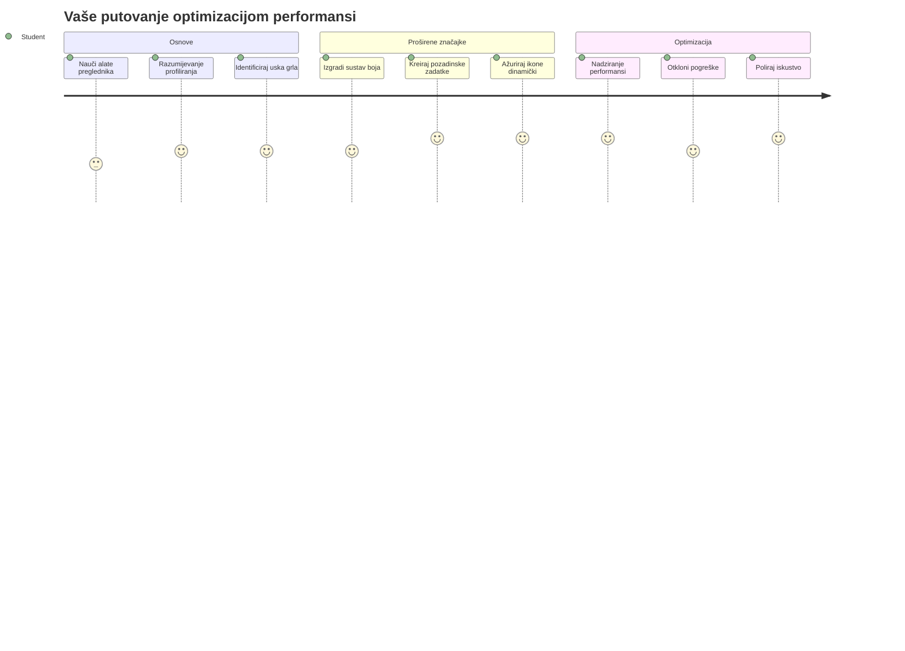
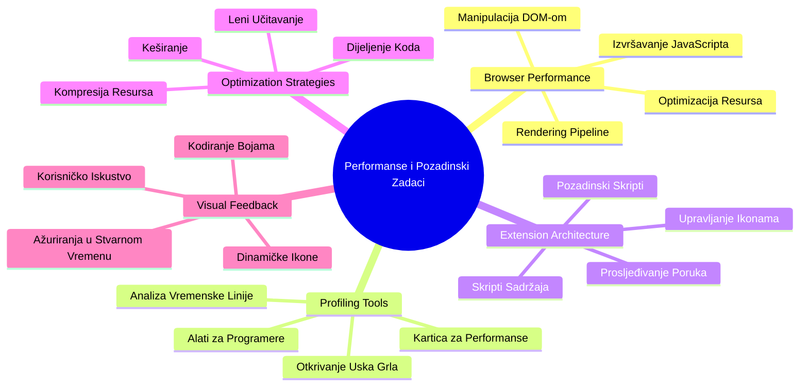
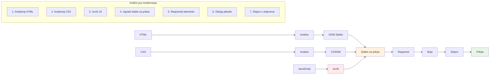
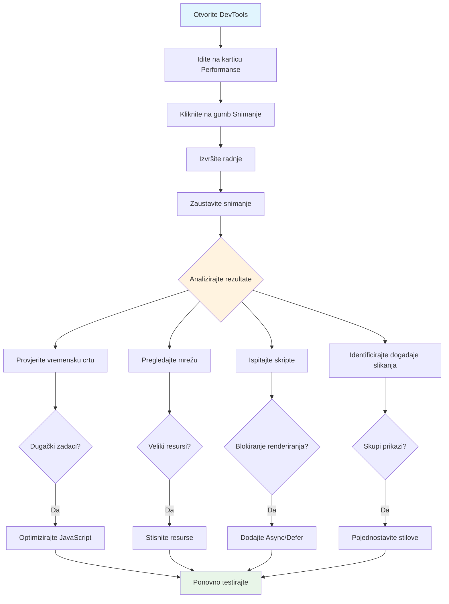
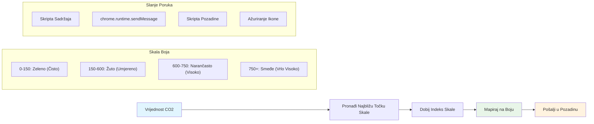
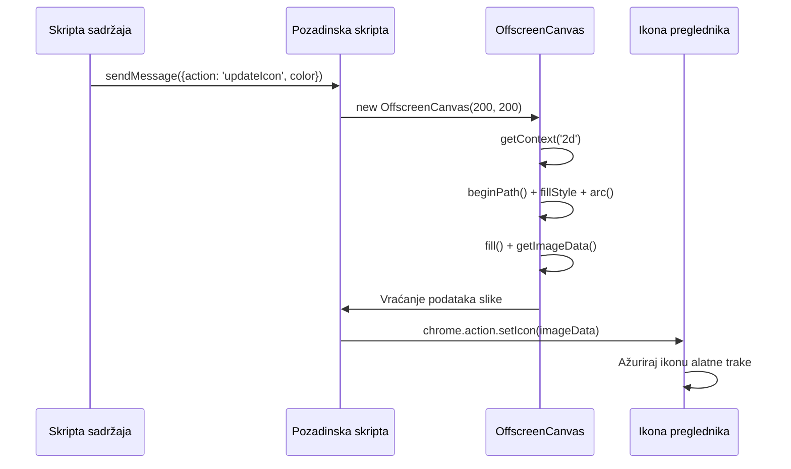
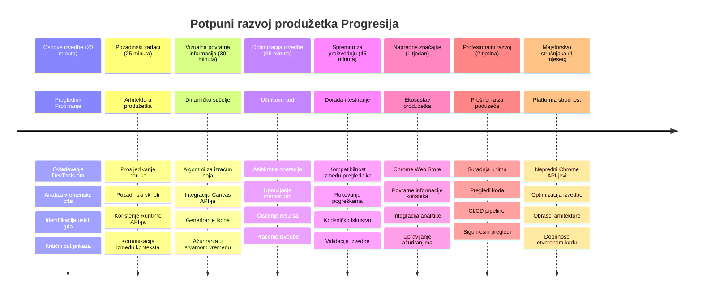

<!--
CO_OP_TRANSLATOR_METADATA:
{
  "original_hash": "b275fed2c6fc90d2b9b6661a3225faa2",
  "translation_date": "2026-01-07T09:13:02+00:00",
  "source_file": "5-browser-extension/3-background-tasks-and-performance/README.md",
  "language_code": "hr"
}
-->
# Projekt ekstenzije za preglednik dio 3: Naučite o Pozadinskim Zadatcima i Performansama


Jeste li se ikada pitali što čini da neke ekstenzije za preglednik djeluju brzo i responzivno, dok druge djeluju sporo? Tajna leži u onome što se događa iza scene. Dok korisnici klikaju po sučelju vaše ekstenzije, postoji cijeli svijet pozadinskih procesa koji tiho upravljaju dohvaćanjem podataka, ažuriranjem ikona i sistemskim resursima.

Ovo je naša posljednja lekcija u seriji ekstenzija za preglednik, i napravit ćemo da vaš pratitelj ugljičnog otiska radi glatko. Dodati ćete dinamička ažuriranja ikona i naučiti kako prepoznati probleme s performansama prije nego što postanu problem. Kao da ugađate trkaći automobil – male optimizacije mogu napraviti veliku razliku u radu svega.

Do kraja ćete imati dotjeranu ekstenziju i razumjeti principe performansi koji dijele dobre web aplikacije od odličnih. Idemo zaroniti u svijet optimizacije preglednika.

## Pred-predavanja kviz

[Pred-predavanja kviz](https://ff-quizzes.netlify.app/web/quiz/27)

### Uvod

U prethodnim lekcijama ste napravili obrazac, povezali ga s API-em i savladali asinkrono dohvaćanje podataka. Vaša ekstenzija lijepo poprima oblik.

Sad trebamo dodati završne detalje - poput promjene boje ikone ekstenzije na temelju podataka o ugljiku. Ovo me podsjeća kako je NASA morala optimizirati svaki sustav na Apollovom svemirskom brodu. Nisu si mogli priuštiti izgubljene cikluse ili memoriju jer su životi ovisili o performansama. Iako naša ekstenzija za preglednik nije toliko kritična, isti principi vrijede - učinkovit kod stvara bolje korisničko iskustvo.


## Osnove web performansi

Kad vaš kod radi učinkovito, ljudi to zapravo *osjete*. Znate onaj trenutak kada se stranica učitava odmah ili animacija glatko prikazuje? To su dobre performanse na djelu.

Performanse nisu samo brzina - radi se o stvaranju web iskustava koja se osjećaju prirodno, a ne nespretno i frustrirajuće. Još u ranim danima računarstva, Grace Hopper je poznato držala nanosekundu (komad žice dug oko stopu) na svom stolu kako bi pokazala koliko svjetlost putuje u jednoj milijardinki sekunde. Bio je to njen način objašnjenja zašto je svaki mikrosekund bitan u računarstvu. Istražimo alate detektiva koji vam pomažu da otkrijete što usporava stvari.

> "Performanse web stranice se sastoje od dva čimbenika: koliko brzo se stranica učita i koliko brzo kod na njoj radi." -- [Zack Grossbart](https://www.smashingmagazine.com/2012/06/javascript-profiling-chrome-developer-tools/)

Tema kako napraviti vaše web stranice izrazito brzim na svim vrstama uređaja, za sve vrste korisnika, u svim situacijama, nije iznenađujuće vrlo široka. Evo nekoliko točaka za pamćenje dok gradite standardni web projekt ili ekstenziju za preglednik.

Prvi korak u optimizaciji vaše stranice je razumjeti što se zapravo događa pod kapom motora. Srećom, vaš preglednik dolazi s moćnim alatima detektiva ugrađenim izravno.


Za otvaranje Developer Tools u Edgeu kliknite na tri točkice u gornjem desnom kutu, zatim idite na Više alata > Developer Tools. Ili koristite tipkovničku prečac: `Ctrl` + `Shift` + `I` na Windowsu ili `Option` + `Command` + `I` na Macu. Kad ste tamo, kliknite na karticu Performance - ovdje ćete raditi svoju istragu.

**Evo vašeg seta alata za detektiva performansi:**
- **Otvorite** Developer Tools (koristit ćete ih stalno kao developer!)
- **Idite** na karticu Performance - zamislite to kao fitness tracker vaše web aplikacije
- **Pritisnite** gumb Snimanje (Record) i promatrajte stranicu u akciji
- **Proučite** rezultate kako biste uočili što usporava stvari

Isprobajmo ovo. Otvorite neku web stranicu (Microsoft.com dobro funkcionira za to) i kliknite gumb 'Record'. Sada osvježite stranicu i promatrajte kako profiler bilježi sve što se događa. Kad zaustavite snimanje, vidjet ćete detaljan prikaz kako preglednik 'skriptira', 'renderira' i 'crtaju' stranicu. Podsjeća me na to kako misijski kontrolori prate svaki sustav tijekom lansiranja rakete - dobivate podatke u realnom vremenu o tome što se točno događa i kada.


✅ [Microsoft Dokumentacija](https://docs.microsoft.com/microsoft-edge/devtools-guide/performance/?WT.mc_id=academic-77807-sagibbon) ima mnogo više detalja ako želite dublje zaroniti

> Profesionalni savjet: Obrišite predmemoriju preglednika prije testiranja kako biste vidjeli kako se vaša stranica ponaša za prve posjetitelje - obično je dosta drugačije od ponovljenih posjeta!

Odaberite elemente vremenske linije profila da zumirate događaje koji se odvijaju dok se vaša stranica učitava.

Dobijte snimku performansi vaše stranice odabirom dijela vremenske linije profila i pogledajte sažetak:


Provjerite panel Dnevnik događaja (Event Log) da vidite je li neki događaj trajao duže od 15 ms:


✅ Upoznajte se s profilerom! Otvorite developer tools na ovoj stranici i provjerite postoje li uska grla. Koji je najsporiji resurs za učitavanje? Koji najbrži?


## Na što paziti pri profiliranju

Pokretanje profilera je tek početak – prava vještina je znati što ti šareni grafovi zapravo govore. Ne brinite, naučit ćete ih čitati. Iskusni developeri znaju prepoznati znakove upozorenja prije nego što prerastu u velike probleme.

Razgovarajmo o uobičajenim krivcima – problematičnim faktorima performansi koji se često uvuku u web projekte. Kao što je Marie Curie morala pomno pratiti razine radijacije u svom laboratoriju, mi moramo paziti na određene obrasce koji nagovještavaju probleme. Rana detekcija će vam (i vašim korisnicima) uštedjeti puno frustracije.

**Veličine resursa**: Web stranice su tijekom godina postajale "teže", a velik dio tog dodatnog tereta dolazi od slika. Kao da sve više pakiramo u naše digitalne kofere.

✅ Pogledajte [Internet Archive](https://httparchive.org/reports/page-weight) da vidite kako su se veličine stranica povećavale tijekom vremena – vrlo je otkrivajuće.

**Evo kako održavati optimizirane resurse:**
- **Kompresirajte** slike! Moderni formati poput WebP mogu značajno smanjiti veličinu datoteka
- **Poslužite** pravu veličinu slike za svaki uređaj – nema potrebe slati ogromne slike za desktop na mobitele
- **Minificirajte** vaš CSS i JavaScript – svaki bajt je bitan
- **Koristite** lijeno učitavanje (lazy loading) tako da se slike preuzimaju tek kad korisnici dođu na njih skrolanjem

**DOM traversali**: Preglednik mora izgraditi svoj Document Object Model na temelju koda koji pišete, pa je u interesu dobre performanse stranice zadržati HTML oznake na minimum, koristiti i stilizirati samo ono što stranica treba. U tom smislu višak CSS-a povezan s jednom stranicom mogao bi se optimizirati; stilovi potrebni samo za jednu stranicu ne trebaju se uključivati u glavni stil.

**Ključne strategije za optimizaciju DOM-a:**
- **Minimizira** broj HTML elemenata i razina ugnježđivanja
- **Uklanja** neiskorištena CSS pravila i učinkovito konsolidira stilove
- **Organizira** CSS da se učitava samo ono što je potrebno za svaku stranicu
- **Strukturira** HTML semantički za bolje parsiranje preglednika

**JavaScript**: Svaki JavaScript developer treba paziti na skripte koje blokiraju renderiranje i moraju se učitati prije nego što se DOM može parsirati i prikazati. Razmotrite korištenje `defer` atributa kod vlastitih skripti (kao što je učinjeno u modulu Terrarium).

**Moderne tehnike optimizacije JavaScripta:**
- **Koristi** `defer` atribut da se skripte učitavaju nakon parsiranja DOM-a
- **Implementira** podjelu koda (code splitting) da se učitava samo potreban JavaScript
- **Primjenjuje** lijeno učitavanje za ne-kritične funkcionalnosti
- **Minimizira** upotrebu teških biblioteka i frameworka kad je moguće

✅ Isprobajte neke stranice na [Site Speed Test web stranici](https://www.webpagetest.org/) da naučite više o uobičajenim provjerama za određivanje performansi stranica.

### 🔄 **Pedagoška provjera**
**Razumijevanje performansi**: Prije nego što počnete graditi funkcionalnosti ekstenzije, pobrinite se da možete:
- ✅ Objasniti kritičnu putanju renderiranja od HTML-a do piksela
- ✅ Prepoznati uobičajena uska grla u performansama web aplikacija
- ✅ Koristiti alate developera za profiliranje performansi stranice
- ✅ Razumjeti kako veličina resursa i složenost DOM-a utječu na brzinu

**Brzi samoprovjera**: Što se događa kada imate JavaScript koji blokira renderiranje?
*Odgovor: Preglednik mora preuzeti i izvršiti skriptu prije nego što može nastaviti parsiranje HTML-a i renderiranje stranice*

**Utjecaj performansi u stvarnom svijetu**:
- **100 ms kašnjenja**: Korisnici osjete usporavanje
- **1 sekunda kašnjenja**: Korisnici počinju gubiti fokus
- **3+ sekunde**: 40% korisnika napušta stranicu
- **Mobilne mreže**: Performanse su još važnije

Sad kad imate ideju o tome kako preglednik renderira resurse koje šaljete, pogledajmo posljednje stvari koje trebate napraviti da dovršite vašu ekstenziju:

### Kreirajte funkciju za izračun boje

Sada ćemo napraviti funkciju koja pretvara numeričke podatke u značajne boje. Zamislite to kao sustav semafora - zelena za čistu energiju, crvena za visoku intenzitet ugljika.

Ova funkcija će uzimati CO2 podatke iz našeg API-ja i odrediti koju boju najbolje predstavlja utjecaj na okoliš. Slično kao što znanstvenici koriste kodiranje bojama na toplinskim kartama za vizualizaciju složenih obrasaca podataka - od temperatura oceana do formiranja zvijezda. Dodajmo ovu funkciju u `/src/index.js`, odmah nakon onih `const` varijabli koje smo ranije postavili:


```javascript
function calculateColor(value) {
	// Definirajte ljestvicu intenziteta CO2 (grama po kWh)
	const co2Scale = [0, 150, 600, 750, 800];
	// Odgovarajuće boje od zelene (čisto) do tamnosmeđe (visoka emisija ugljika)
	const colors = ['#2AA364', '#F5EB4D', '#9E4229', '#381D02', '#381D02'];

	// Pronađite najbližu vrijednost ljestvice našem unosu
	const closestNum = co2Scale.sort((a, b) => {
		return Math.abs(a - value) - Math.abs(b - value);
	})[0];
	
	console.log(`${value} is closest to ${closestNum}`);
	
	// Pronađite indeks za preslikavanje boja
	const num = (element) => element > closestNum;
	const scaleIndex = co2Scale.findIndex(num);

	const closestColor = colors[scaleIndex];
	console.log(scaleIndex, closestColor);

	// Pošaljite poruku o ažuriranju boje pozadinskom skriptu
	chrome.runtime.sendMessage({ action: 'updateIcon', value: { color: closestColor } });
}
```

**Evo kako ova pametna mala funkcija radi:**
- **Postavlja** dva niza - jedan za razine CO2, drugi za boje (zelena = čisto, smeđa = prljavo!)
- **Pronalazi** najbližu vrijednost stvarnom CO2 pomoću pametnog sortiranja polja
- **Uhvati** odgovarajuću boju pomoću metode findIndex()
- **Šalje** poruku Chrome pozadinskom skriptu s odabranom bojom
- **Koristi** template literal (ove obrnutih apostrofe) za čišće formatiranje stringova
- **Održava** sve organizirano pomoću const deklaracija

`chrome.runtime` [API](https://developer.chrome.com/extensions/runtime) je poput živčanog sustava vaše ekstenzije – upravlja svim komunikacijama i zadacima u pozadini:

> "Koristite chrome.runtime API za dohvat pozadinske stranice, vraćanje detalja o manifestu i slušanje te reagiranje na događaje tijekom životnog ciklusa aplikacije ili ekstenzije. Također možete koristiti ovaj API za pretvaranje relativnih putanja URL-ova u potpuno kvalificirane URL-ove."

**Zašto je Chrome Runtime API tako praktičan:**
- **Omogućava** različitim dijelovima ekstenzije da međusobno komuniciraju
- **Rukuje** pozadinskim radom bez zamrzavanja korisničkog sučelja
- **Upravljanje** događajima životnog ciklusa ekstenzije
- **Olakšava** slanje poruka između skripti

✅ Ako razvijate ovu ekstenziju za Edge, možda će vas iznenaditi da koristite chrome API. Novije verzije Edge preglednika rade na Chromium motoru, tako da možete iskoristiti ove alate.


> **Profesionalni savjet**: Ako želite profilirati ekstenziju za preglednik, pokrenite dev tools iz same ekstenzije jer je to zaseban preglednički proces. To vam daje pristup metriki performansi specifičnoj za ekstenziju.

### Postavite zadanu boju ikone

Prije nego što počnemo dohvaćati stvarne podatke, dajmo ekstenziji početnu točku. Nitko ne voli gledati praznu ili nefunkcionalnu ikonu. Počet ćemo sa zelenom bojom tako da korisnici znaju da ekstenzija radi od trenutka instalacije.

U vašoj funkciji `init()`, postavimo zadanu zelenu ikonu:

```javascript
chrome.runtime.sendMessage({
	action: 'updateIcon',
	value: {
		color: 'green',
	},
});
```

**Što ova inicijalizacija postiže:**
- **Postavlja** neutralnu zelenu boju kao zadano stanje
- **Pruža** trenutačnu vizualnu povratnu informaciju kad se ekstenzija učitava
- **Uspostavlja** obrazac komunikacije s pozadinskim skriptom
- **Osigurava** da korisnici vide funkcionalnu ekstenziju prije učitavanja podataka

### Pozovite funkciju, izvršite poziv

Sada povežimo sve zajedno tako da kad dođu svježi CO2 podaci, vaša ikona automatski ažurira ispravnu boju. Kao da spajate zadnji krug na elektroničkom uređaju - iznenada svi pojedinačni dijelovi rade kao jedan sustav.

Dodajte ovaj redak odmah nakon što dobijete CO2 podatke iz API-ja:

```javascript
// Nakon dohvaćanja CO2 podataka s API-ja
// dopusti CO2 = data.data[0].intensity.actual;
calculateColor(CO2);
```

**Ova integracija postiže:**
- **Povezuje** protok podataka iz API-ja sa sustavom vizualnog indikatora
- **Pokreće** automatska ažuriranja ikone kad pristignu novi podaci
- **Osigurava** vizualnu povratnu informaciju u stvarnom vremenu na temelju trenutnog intenziteta ugljika
- **Održava** separaciju odgovornosti između dohvaćanja podataka i logike prikaza

I na kraju, u `/dist/background.js`, dodajte slušač ovih poziva za pozadinske akcije:

```javascript
// Slušaj poruke iz skripte sadržaja
chrome.runtime.onMessage.addListener(function (msg, sender, sendResponse) {
	if (msg.action === 'updateIcon') {
		chrome.action.setIcon({ imageData: drawIcon(msg.value) });
	}
});

// Nacrtaj dinamičku ikonu koristeći Canvas API
// Posuđeno iz energy lollipop ekstenzije - super značajka!
function drawIcon(value) {
	// Kreiraj offscreen canvas za bolju izvedbu
	const canvas = new OffscreenCanvas(200, 200);
	const context = canvas.getContext('2d');

	// Nacrtaj obojeni krug koji predstavlja intenzitet ugljika
	context.beginPath();
	context.fillStyle = value.color;
	context.arc(100, 100, 50, 0, 2 * Math.PI);
	context.fill();

	// Vrati podatke slike za ikonu preglednika
	return context.getImageData(50, 50, 100, 100);
}
```

**Evo što radi ovaj pozadinski skript:**
- **Sluša** poruke iz vaše glavne skripte (kao recepcioner koji prima pozive)
- **Procesira** zahtjeve 'updateIcon' za promjenu ikone na alatnoj traci
- **Stvara** nove ikone u letu koristeći Canvas API
- **Crtanje** jednostavnog obojenog kruga koji prikazuje trenutačni intenzitet ugljika
- **Ažurira** vašu alatnu traku preglednika s novom ikonom
- **Koristi** OffscreenCanvas za glatke performanse (bez blokiranja UI-a)

✅ Više o Canvas API-ju naučit ćete u [lekcijama Space Game](../../6-space-game/2-drawing-to-canvas/README.md).


### 🔄 **Pedagoška provjera**
**Potpuno razumijevanje ekstenzije**: Provjerite svoje ovladavanje cijelim sustavom:
- ✅ Kako funkcionira prijenos poruka između različitih skripti ekstenzije?
- ✅ Zašto koristimo OffscreenCanvas umjesto regularnog Canvasa radi performansi?
- ✅ Koju ulogu igra Chrome Runtime API u arhitekturi proširenja?
- ✅ Kako algoritam za izračunavanje boje mapira podatke na vizualnu povratnu informaciju?

**Razmatranja performansi**: Vaše proširenje sada demonstrira:
- **Učinkovito slanje poruka**: Čistu komunikaciju između konteksta skripti
- **Optimizirano prikazivanje**: OffscreenCanvas sprječava blokiranje korisničkog sučelja
- **Ažuriranja u stvarnom vremenu**: Dinamičke promjene ikone bazirane na živim podacima
- **Upravljanje memorijom**: Ispravno čišćenje i rukovanje resursima

**Vrijeme je za testiranje vašeg proširenja:**
- **Izgradite** sve s `npm run build`
- **Ponovno učitajte** vaše proširenje u pregledniku (ne zaboravite ovaj korak)
- **Otvorite** vaše proširenje i pratite kako se ikona mijenja u boji
- **Provjerite** kako reagira na stvarne podatke o ugljiku iz cijelog svijeta

Sada ćete na prvi pogled znati je li dobro vrijeme za pranje rublja ili biste trebali pričekati čišću energiju. Upravo ste napravili nešto zaista korisno i usput naučili o performansama preglednika.

## GitHub Copilot Agent Challenge 🚀

Koristite Agent način za dovršetak sljedećeg izazova:

**Opis:** Poboljšajte mogućnosti praćenja performansi vašeg pregledničkog proširenja dodavanjem značajke koja prati i prikazuje vrijeme učitavanja različitih komponenti proširenja.

**Zadatak:** Kreirajte sustav za praćenje performansi pregledničkog proširenja koji mjeri i bilježi vrijeme potrebno za dohvat CO2 podataka s API-ja, izračun boja i ažuriranje ikone. Dodajte funkciju nazvanu `performanceTracker` koja koristi Performance API za mjerenje ovih operacija i prikazuje rezultate u konzoli preglednika s vremenskim oznakama i metrike trajanja.

Više o [agent načinu](https://code.visualstudio.com/blogs/2025/02/24/introducing-copilot-agent-mode) saznajte ovdje.

## 🚀 Izazov

Evo jedne zanimljive detektivske misije: odaberite nekoliko open source web stranica koje već postoje godinama (npr. Wikipedia, GitHub ili Stack Overflow) i istražite njihovu povijest commit-ova. Možete li uočiti gdje su izvršili poboljšanja performansi? Koji su se problemi često ponavljali?

**Vaš pristup istraživanju:**
- **Pretražujte** poruke commit-ova za riječi poput "optimiziraj," "performanse," ili "brže"
- **Promatrajte** obrasce - popravljaju li stalno iste vrste problema?
- **Identificirajte** uobičajene uzroke usporavanja web stranica
- **Podijelite** svoja otkrića - ostali developeri uče iz stvarnih primjera

## Kviz nakon predavanja

[Kviz nakon predavanja](https://ff-quizzes.netlify.app/web/quiz/28)

## Pregled i samostalno učenje

Razmislite o prijavi na [newsletter o performansama](https://perf.email/)

Istražite neke načine na koje preglednici mjere web performanse pregledom kartica performansi u njihovim alatima. Primjećujete li neke veće razlike?

### ⚡ **Što možete napraviti u sljedećih 5 minuta**
- [ ] Otvorite upravitelj zadataka preglednika (Shift+Esc u Chromeu) da vidite potrošnju resursa proširenja
- [ ] Koristite karticu Performanse u DevToolsima za snimanje i analizu performansi stranice
- [ ] Provjerite stranicu proširenja u pregledniku da vidite koja proširenja utječu na vrijeme pokretanja
- [ ] Isprobajte privremeno onemogućavanje proširenja da vidite razlike u performansama

### 🎯 **Što možete postići ovaj sat**
- [ ] Završite kviz nakon lekcije i razumijte koncepte performansi
- [ ] Implementirajte background skriptu za svoje pregledničko proširenje
- [ ] Naučite koristiti browser.alarms za učinkovite pozadinske zadatke
- [ ] Vježbajte slanje poruka između content i background skripti
- [ ] Mjerite i optimizirajte potrošnju resursa vašeg proširenja

### 📅 **Vaše tjedno putovanje prema performansama**
- [ ] Izradite visokoučinkovito pregledničko proširenje s pozadinskom funkcionalnošću
- [ ] Ovladate service workerima i modernom arhitekturom proširenja
- [ ] Implementirajte učinkovite strategije sinkronizacije podataka i cache-a
- [ ] Naučite napredne tehnike otklanjanja pogrešaka za performanse proširenja
- [ ] Optimizirajte svoje proširenje za funkcionalnost i učinkovitost resursa
- [ ] Izradite sveobuhvatne testove za scenarije performansi proširenja

### 🌟 **Vaš mjesečni majstorski program optimizacije**
- [ ] Izradite poslovna preglednička proširenja s optimalnim performansama
- [ ] Saznajte o Web Workerima, Service Workerima i modernim web performansama
- [ ] Doprinesite open source projektima fokusiranim na optimizaciju performansi
- [ ] Ovladate unutrašnjim radom preglednika i naprednim tehnikama otklanjanja pogrešaka
- [ ] Izradite alate za praćenje performansi i vodiče najboljih praksi
- [ ] Postanite stručnjak za performanse koji pomaže u optimizaciji web aplikacija

## 🎯 Vaš vremenski okvir ovladavanja pregledničkim proširenjima


### 🛠️ Vaš kompletni alatni paket za razvoj proširenja

Nakon završetka ove trilogije, savladali ste:
- **Arhitekturu preglednika**: Duboko razumijevanje integracije proširenja s pregledničkim sustavima
- **Profiliranje performansi**: Sposobnost identificiranja i otklanjanja uskih grla korištenjem razvojnih alata
- **Asinkrono programiranje**: Moderne JavaScript obrasce za responzivne, neblokirajuće operacije
- **API integraciju**: Dohvat vanjskih podataka s autentifikacijom i rukovanjem pogreškama
- **Vizualni dizajn**: Dinamička ažuriranja sučelja i generiranje grafike temeljene na Canvasu
- **Slanje poruka**: Komunikaciju između skripti u arhitekturama proširenja
- **Korisničko iskustvo**: Stanja učitavanja, rukovanje pogreškama i intuitivne interakcije
- **Vještine produkcije**: Testiranje, otklanjanje pogrešaka i optimizacija za stvarnu upotrebu

**Primjene u stvarnom svijetu**: Vaše vještine razvoja proširenja primjenjuju se izravno na:
- **Progressive Web Apps**: Sličnu arhitekturu i obrasce performansi
- **Electron Desktop Apps**: Višeplatformske aplikacije koristeći web tehnologije
- **Mobilne hibridne aplikacije**: Razvoj Cordova/PhoneGap s web API-jima
- **Poslovne web aplikacije**: Složeni nadzorne ploče i alati za produktivnost
- **Chrome DevTools proširenja**: Napredni alati za razvoj i otklanjanje pogrešaka
- **Integracija web API-ja**: Bilo koja aplikacija koja komunicira s vanjskim servisima

**Profesionalni utjecaj**: Sada možete:
- **Izgraditi** proizvodno spremna preglednička proširenja od koncepta do implementacije
- **Optimizirati** performanse web aplikacija koristeći industrijske alate za profiliranje
- **Projektirati** skalabilne sustave s pravilnim razdvajanjem odgovornosti
- **Otklanjati pogreške** složenih asinhronih operacija i komunikacije između konteksta
- **Doprinositi** open source projektima proširenja i standardima preglednika

**Sljedeće razine prilika**:
- **Chrome Web Store Developer**: Objavljivanje proširenja za milijune korisnika
- **Inženjer web performansi**: Specijalizacija u optimizaciji i korisničkom iskustvu
- **Razvijatelj pregledničke platforme**: Doprinos razvoju motora preglednika
- **Kreator okvira proširenja**: Izrada alata koji pomažu drugim programerima
- **Odnosi s developerima**: Dijeljenje znanja kroz podučavanje i stvaranje sadržaja

🌟 **Dosegnuta značajka**: Izgradili ste potpuno funkcionalno pregledničko proširenje koje demonstrira profesionalne razvojne prakse i moderne web standarde!

## Zadatak

[Analizirajte stranicu za performanse](assignment.md)

---

<!-- CO-OP TRANSLATOR DISCLAIMER START -->
**Izjava o odricanju od odgovornosti**:
Ovaj dokument je preveden korištenjem AI prevoditeljske usluge [Co-op Translator](https://github.com/Azure/co-op-translator). Iako težimo točnosti, imajte na umu da automatski prijevodi mogu sadržavati pogreške ili netočnosti. Izvorni dokument na izvornom jeziku treba se smatrati službenim izvorom. Za važne informacije preporučuje se profesionalni ljudski prijevod. Ne snosimo odgovornost za bilo kakva nesporazuma ili pogrešne interpretacije koje proizlaze iz korištenja ovog prijevoda.
<!-- CO-OP TRANSLATOR DISCLAIMER END -->