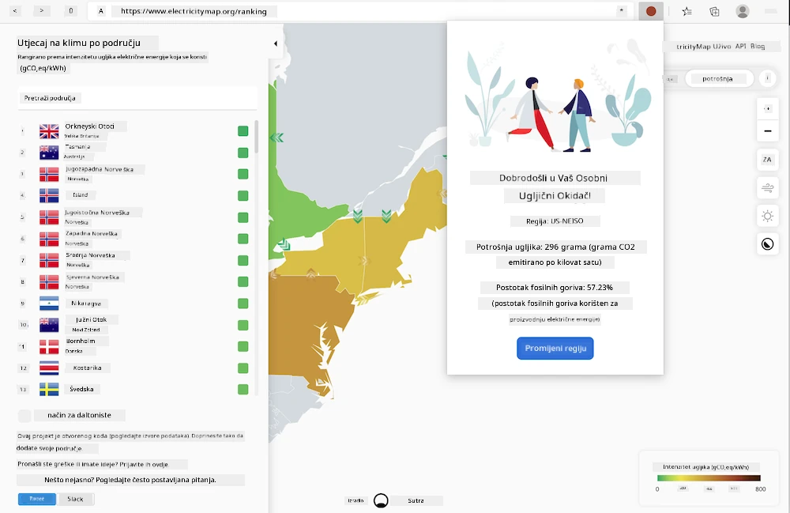
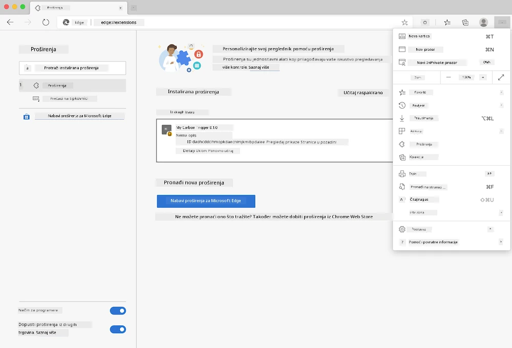

# Carbon Trigger Browser Extension: Završeni kod

Koristeći tmrow-ov C02 Signal API za praćenje potrošnje električne energije, izrađujemo ekstenziju za preglednik koja vas podsjeća koliko je potrošnja električne energije u vašem području trenutno velika. Korištenje ove ekstenzije može vam pomoći da donesete odluke o svojim aktivnostima na temelju tih informacija.



## Početak

Morate instalirati [npm](https://npmjs.com). Preuzmite kopiju ovog koda u mapu na svom računalu.

Instalirajte sve potrebne pakete:

```
npm install
```

Izradite ekstenziju pomoću Webpack-a:

```
npm run build
```

Za instalaciju na Edge pregledniku, koristite izbornik 'tri točke' u gornjem desnom kutu preglednika kako biste pronašli panel za ekstenzije. Tamo odaberite 'Load unpacked' za učitavanje nove ekstenzije. Na upitu otvorite mapu 'dist' i ekstenzija će se učitati. Za korištenje, trebat će vam API ključ za CO2 Signal ([dobijte ga putem e-pošte ovdje](https://www.co2signal.com/) - unesite svoju e-mail adresu u okvir na toj stranici) i [kod za vaše područje](http://api.electricitymap.org/v3/zones) s [Electricity Map](https://www.electricitymap.org/map) (na primjer, za Boston koristim 'US-NEISO').



Nakon što unesete API ključ i kod područja u sučelje ekstenzije, obojena točka u traci ekstenzije preglednika trebala bi se promijeniti kako bi odražavala potrošnju energije u vašem području. To će vam dati indikator o tome koje energetski intenzivne aktivnosti su prikladne za vaše performanse. Koncept ove 'točke' sustava inspiriran je [Energy Lollipop ekstenzijom](https://energylollipop.com/) za emisije u Kaliforniji.

---

**Odricanje od odgovornosti**:  
Ovaj dokument je preveden pomoću AI usluge za prevođenje [Co-op Translator](https://github.com/Azure/co-op-translator). Iako nastojimo osigurati točnost, imajte na umu da automatski prijevodi mogu sadržavati pogreške ili netočnosti. Izvorni dokument na izvornom jeziku treba smatrati autoritativnim izvorom. Za ključne informacije preporučuje se profesionalni prijevod od strane čovjeka. Ne preuzimamo odgovornost za nesporazume ili pogrešna tumačenja koja mogu proizaći iz korištenja ovog prijevoda.