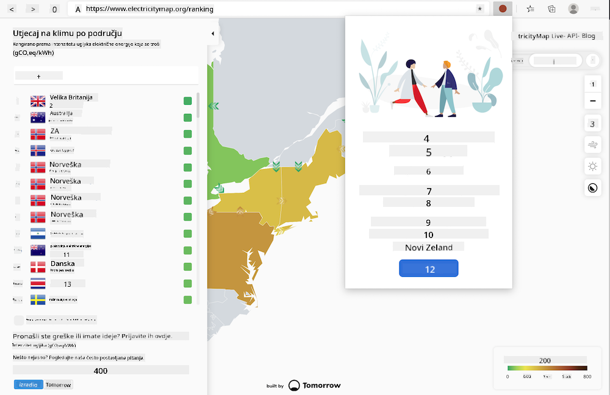
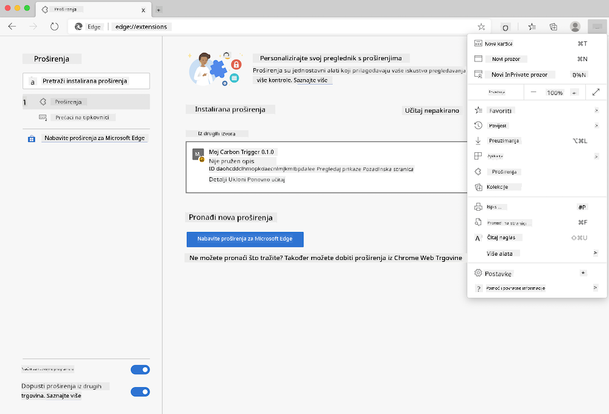

<!--
CO_OP_TRANSLATOR_METADATA:
{
  "original_hash": "26fd39046d264ba185dcb086d3a8cf3e",
  "translation_date": "2025-08-27T22:17:43+00:00",
  "source_file": "5-browser-extension/start/README.md",
  "language_code": "hr"
}
-->
# Carbon Trigger Browser Extension: Početni Kod

Koristeći tmrowov C02 Signal API za praćenje potrošnje električne energije, izradite proširenje za preglednik kako biste imali podsjetnik u svom pregledniku o tome koliko je velika potrošnja električne energije u vašoj regiji. Korištenje ovog proširenja ad hoc pomoći će vam da donesete odluke o svojim aktivnostima na temelju tih informacija.



## Početak

Trebat ćete imati instaliran [npm](https://npmjs.com). Preuzmite kopiju ovog koda u mapu na svom računalu.

Instalirajte sve potrebne pakete:

```
npm install
```

Izgradite proširenje pomoću webpacka

```
npm run build
```

Za instalaciju na Edgeu, koristite izbornik s 'tri točke' u gornjem desnom kutu preglednika kako biste pronašli panel za proširenja. Tamo odaberite 'Load Unpacked' za učitavanje novog proširenja. Otvorite mapu 'dist' na upitu i proširenje će se učitati. Za korištenje, trebat će vam API ključ za CO2 Signal API ([nabavite ga ovdje putem e-pošte](https://www.co2signal.com/) - unesite svoju e-poštu u okvir na ovoj stranici) i [kod za vašu regiju](http://api.electricitymap.org/v3/zones) koji odgovara [Electricity Map](https://www.electricitymap.org/map) (na primjer, u Bostonu koristim 'US-NEISO').



Nakon što unesete API ključ i regiju u sučelje proširenja, obojena točka u traci proširenja preglednika trebala bi se promijeniti kako bi odražavala potrošnju energije u vašoj regiji i dala vam smjernice o tome koje aktivnosti s velikom potrošnjom energije bi bile prikladne za vas. Koncept iza ovog sustava 'točke' dobio sam od [Energy Lollipop proširenja](https://energylollipop.com/) za emisije u Kaliforniji.

---

**Odricanje od odgovornosti**:  
Ovaj dokument je preveden korištenjem AI usluge za prevođenje [Co-op Translator](https://github.com/Azure/co-op-translator). Iako nastojimo osigurati točnost, imajte na umu da automatski prijevodi mogu sadržavati pogreške ili netočnosti. Izvorni dokument na izvornom jeziku treba smatrati mjerodavnim izvorom. Za ključne informacije preporučuje se profesionalni prijevod od strane stručnjaka. Ne preuzimamo odgovornost za bilo kakve nesporazume ili pogrešne interpretacije proizašle iz korištenja ovog prijevoda.