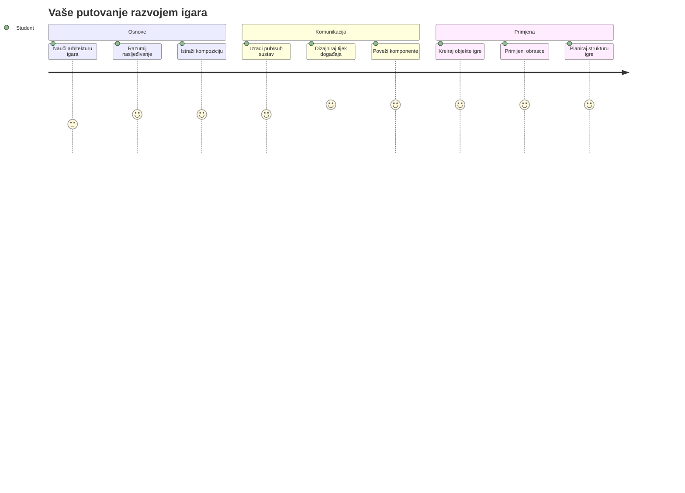
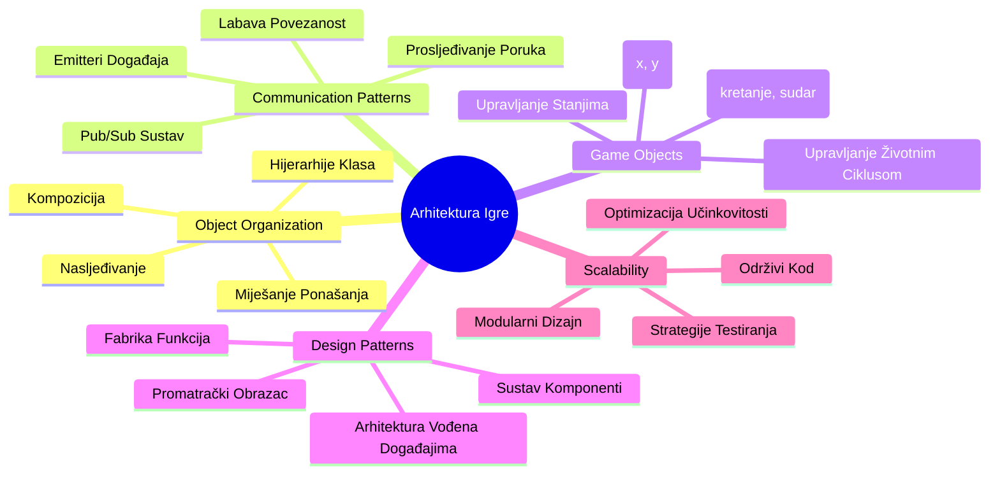
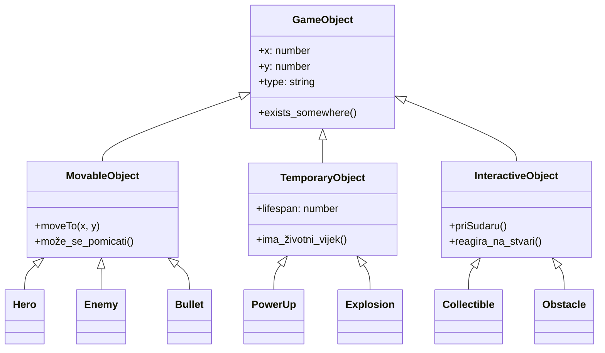
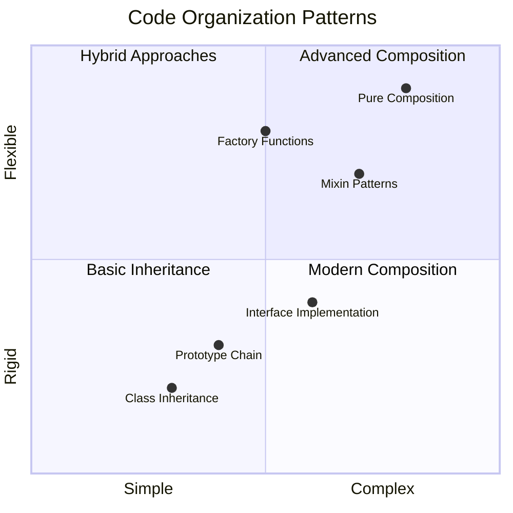
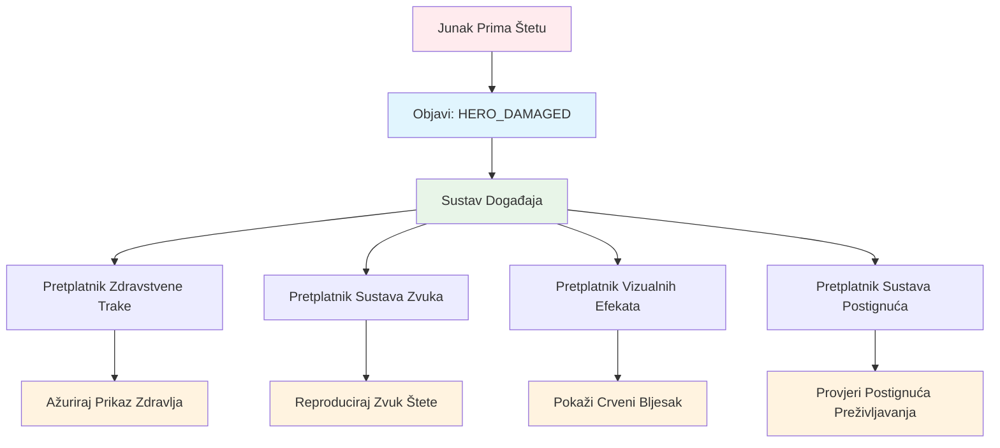
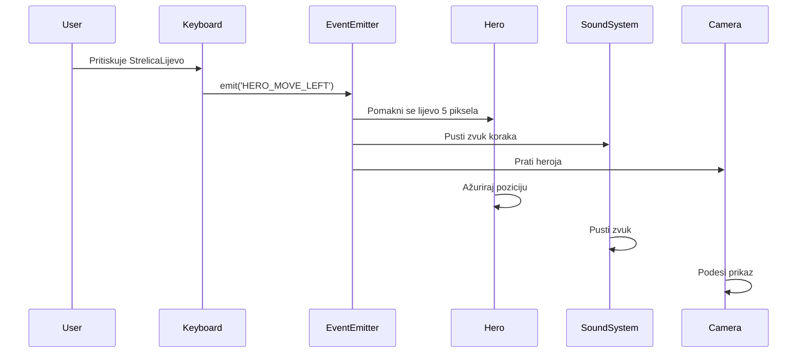
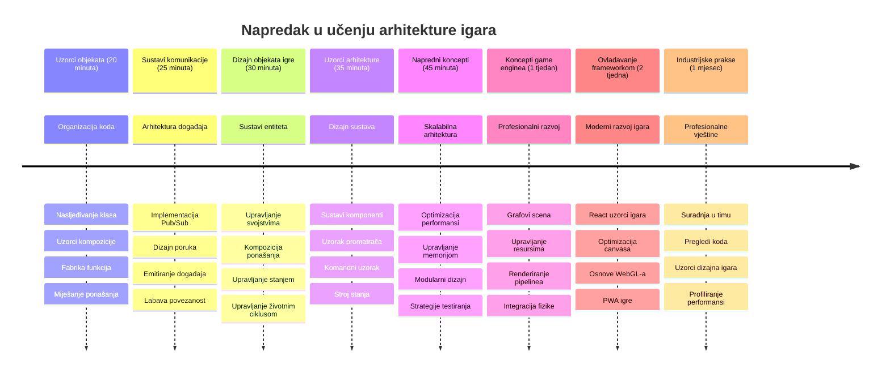

<!--
CO_OP_TRANSLATOR_METADATA:
{
  "original_hash": "a6332a7bb4d0be3bfd24199c83993777",
  "translation_date": "2026-01-07T09:06:41+00:00",
  "source_file": "6-space-game/1-introduction/README.md",
  "language_code": "hr"
}
-->
# Izgradnja svemirske igre, dio 1: Uvod




Baš kao što NASA-in kontrola misija koordinira višestruke sustave tijekom svemirskog lansiranja, izgradit ćemo svemirsku igru koja pokazuje kako različiti dijelovi programa mogu nesmetano surađivati. Dok stvarate nešto što možete zapravo igrati, naučit ćete ključne programske koncepte koji se primjenjuju na bilo koji softverski projekt.

Istražit ćemo dva temeljna pristupa organizaciji koda: nasljeđivanje i kompoziciju. To nisu samo akademski pojmovi – to su isti obrasci koji pokreću sve od videoigara do bankarskih sustava. Također ćemo implementirati komunikacijski sustav zvani pub/sub koji funkcionira poput komunikacijskih mreža korištenih u svemirskim letjelicama, omogućujući različitim komponentama da dijele informacije bez stvaranja ovisnosti.

Na kraju ove serije shvatit ćete kako izgraditi aplikacije koje mogu rasti i evoluirati – bilo da razvijate igre, web-aplikacije ili bilo koji drugi softverski sustav.


## Predavanje - kviz

[Predavanje - kviz](https://ff-quizzes.netlify.app/web/quiz/29)

## Nasljeđivanje i kompozicija u razvoju igara

Kako projekti rastu u složenosti, organizacija koda postaje kritična. Ono što počinje kao jednostavan skript može postati teško za održavanje bez odgovarajuće strukture – baš kao što su misije Apollo zahtijevale pažljivu koordinaciju tisuća komponenti.

Istražit ćemo dva temeljna pristupa za organizaciju koda: nasljeđivanje i kompoziciju. Svaki ima različite prednosti, a razumijevanje oba pomaže vam da odaberete pravi pristup za različite situacije. Pružit ćemo demonstraciju ovih koncepata kroz našu svemirsku igru, gdje heroji, neprijatelji, pojačanja i drugi objekti moraju učinkovito međusobno djelovati.

✅ Jedna od najpoznatijih knjiga o programiranju tiče se [dizajnerskih obrazaca](https://en.wikipedia.org/wiki/Design_Patterns).

U svakoj igri imate `objekte igre` – interaktivne elemente koji ispunjavaju vaš igrački svijet. Heroji, neprijatelji, pojačanja i vizualni efekti su sve objekt igre. Svaki postoji na određenim koordinate zaslona koristeći vrijednosti `x` i `y`, slično kao određivanje točaka na koordinatnom sustavu.

Unatoč njihovim vizualnim razlikama, ovi objekti često dijele temeljna ponašanja:

- **Postoje negdje** – Svaki objekt ima x i y koordinate tako da igra zna gdje ga nacrtati
- **Mnogi se mogu kretati** – Heroji trče, neprijatelji love, metci lete preko zaslona
- **Imaju životni vijek** – Neki traju zauvijek, drugi (kao eksplozije) se kratko pojave i nestanu
- **Reagiraju na događaje** – Kad se stvari sudare, pojačanja se skupljaju, zdravstvene trake se ažuriraju

✅ Razmislite o igri poput Pac-Mana. Možete li prepoznati četiri vrste objekata navedene gore u toj igri?


### Izražavanje ponašanja kroz kod

Sad kad razumijete zajednička ponašanja koja dijele objekti igre, istražimo kako implementirati ta ponašanja u JavaScriptu. Možete izraziti ponašanje objekta kroz metode prikačene na klase ili pojedinačne objekte, a postoji nekoliko pristupa za odabir.

**Pristup temeljen na klasama**

Klase i nasljeđivanje pružaju strukturirani pristup organizaciji objekata igre. Kao taksonomski sustav klasifikacije koji je razvio Carl Linnaeus, počinjete s osnovnom klasom koja sadrži zajednička svojstva, a zatim stvarate specijalizirane klase koje nasljeđuju te temelje dok dodaju specifične mogućnosti.

✅ Nasljeđivanje je važan koncept za razumjeti. Saznajte više u [MDN članku o nasljeđivanju](https://developer.mozilla.org/docs/Web/JavaScript/Inheritance_and_the_prototype_chain).

Evo kako možete implementirati objekte igre koristeći klase i nasljeđivanje:

```javascript
// Korak 1: Kreirajte osnovnu GameObject klasu
class GameObject {
  constructor(x, y, type) {
    this.x = x;
    this.y = y;
    this.type = type;
  }
}
```

**Objasnimo to korak po korak:**
- Kreiramo osnovni predložak koji svaki objekt igre može koristiti
- Konstruktor sprema gdje se objekt nalazi (`x`, `y`) i kakav je tip objekta
- Ovo postaje temelj na kojem će svi vaši objekti igre graditi

```javascript
// Korak 2: Dodajte mogućnost kretanja putem nasljeđivanja
class Movable extends GameObject {
  constructor(x, y, type) {
    super(x, y, type); // Pozovite konstruktor roditelja
  }

  // Dodajte sposobnost kretanja na novu poziciju
  moveTo(x, y) {
    this.x = x;
    this.y = y;
  }
}
```

**U gornjem primjeru smo:**
- **Proširili** klasu GameObject kako bismo dodali funkcionalnost kretanja
- **Pozvali** roditeljski konstruktor koristeći `super()` za inicijalizaciju naslijeđenih svojstava
- **Dodali** metodu `moveTo()` koja osvježava poziciju objekta

```javascript
// Korak 3: Kreirajte specifične tipove objekata igre
class Hero extends Movable {
  constructor(x, y) {
    super(x, y, 'Hero'); // Postavite tip automatski
  }
}

class Tree extends GameObject {
  constructor(x, y) {
    super(x, y, 'Tree'); // Drveće ne treba kretanje
  }
}

// Korak 4: Koristite svoje objekte igre
const hero = new Hero(0, 0);
hero.moveTo(5, 5); // Junak se može kretati!

const tree = new Tree(10, 15);
// tree.moveTo() bi uzrokovao grešku - drveće se ne može kretati
```

**Razumijevanje ovih koncepata:**
- **Stvara** specijalizirane tipove objekata koji nasljeđuju odgovarajuća ponašanja
- **Pokazuje** kako nasljeđivanje omogućuje selektivno uključivanje značajki
- **Demonstrira** da se heroji mogu kretati dok drveće ostaje nepomično
- **Ilustrira** kako hijerarhija klasa sprječava neprimjerena djela

✅ Odvojite nekoliko minuta i zamislite Pac-Man heroja (na primjer Inky, Pinky ili Blinky) kako bi bio napisan u JavaScriptu.

**Pristup kompozicije**

Kompozicija slijedi filozofiju modularnog dizajna, slično kao što inženjeri dizajniraju svemirske letjelice s izmjenjivim komponentama. Umjesto da nasljeđujete iz roditeljske klase, kombinirate specifična ponašanja kako biste stvorili objekte s točno onom funkcionalnošću koju trebaju. Ovaj pristup nudi fleksibilnost bez stroge hijerarhijske kontrole.

```javascript
// Korak 1: Kreirajte osnovne objekte ponašanja
const gameObject = {
  x: 0,
  y: 0,
  type: ''
};

const movable = {
  moveTo(x, y) {
    this.x = x;
    this.y = y;
  }
};
```

**Ovaj kod radi sljedeće:**
- **Definira** osnovni `gameObject` s pozicijskim i tipovskim svojstvima
- **Stvara** zaseban `movable` objekt ponašanja s funkcionalnošću kretanja
- **Razdvaja** zabrinutosti čuvanjem podataka o poziciji i logike kretanja neovisno

```javascript
// Korak 2: Sastavite objekte kombiniranjem ponašanja
const movableObject = { ...gameObject, ...movable };

// Korak 3: Kreirajte tvorničke funkcije za različite tipove objekata
function createHero(x, y) {
  return {
    ...movableObject,
    x,
    y,
    type: 'Hero'
  };
}

function createStatic(x, y, type) {
  return {
    ...gameObject,
    x,
    y,
    type
  };
}
```

**U gornjem primjeru smo:**
- **Kombinirali** osnovna svojstva objekta s ponašanjem kretanja pomoću spread sintakse
- **Stvorili** tvorničke funkcije koje vraćaju prilagođene objekte
- **Omogućili** fleksibilnu izradu objekata bez rigidnih hijerarhija klasa
- **Dozvolili** objektima da imaju točno ona ponašanja koja im trebaju

```javascript
// Korak 4: Kreirajte i koristite svoje složene objekte
const hero = createHero(10, 10);
hero.moveTo(5, 5); // Radi savršeno!

const tree = createStatic(0, 0, 'Tree');
// tree.moveTo() nije definirano - nije sastavljeno ponašanje pomicanja
```

**Ključne stvari za zapamtiti:**
- **Sastavlja** objekte miješanjem ponašanja umjesto nasljeđivanja
- **Pruža** veću fleksibilnost nego strogi hijerarhijski sustavi nasljeđivanja
- **Dozvoljava** objektima točno one značajke koje trebaju
- **Koristi** modernu JavaScript spread sintaksu za čisto kombiniranje objekata
```

**Which Pattern Should You Choose?**

**Which Pattern Should You Choose?**



> 💡 **Profesionalni savjet**: Oba obrasca imaju svoje mjesto u modernom JavaScript razvoju. Klase su pogodne za jasno definirane hijerarhije, dok kompozicija sjaji kad vam treba maksimalna fleksibilnost.
> 
**Evo kada koristiti koji pristup:**
- **Odaberite** nasljeđivanje kad imate jasne "je-objekt" odnose (Heroj *je-objekt* koji se može kretati)
- **Odaberite** kompoziciju kada vam trebaju "ima-objekt" odnosi (Heroj *ima* sposobnosti kretanja)
- **Uzmite u obzir** preferencije svog tima i zahtjeve projekta
- **Zapamtite** da možete kombinirati oba pristupa u istoj aplikaciji

### 🔄 **Pedagoški pregled**
**Razumijevanje organizacije objekata**: Prije prelaska na komunikacijske obrasce, uvjerite se da možete:
- ✅ Objasniti razliku između nasljeđivanja i kompozicije
- ✅ Prepoznati kada koristiti klase, a kada tvorničke funkcije
- ✅ Razumjeti kako ključna riječ `super()` radi u nasljeđivanju
- ✅ Prepoznati prednosti svakog pristupa u razvoju igara

**Brzi samoprovjeru**: Kako biste kreirali Letjelog neprijatelja koji može i letjeti i kretati se?
- **Pristup nasljeđivanja**: `class FlyingEnemy extends Movable`
- **Pristup kompozicije**: `{ ...movable, ...flyable, ...gameObject }`

**Veza sa stvarnim svijetom**: Ovi obrasci pojavljuju se svugdje:
- **React komponente**: Props (kompozicija) vs nasljeđivanje klasa
- **Igrački engine-i**: Sustavi entiteta i komponenti koriste kompoziciju
- **Mobilne aplikacije**: UI frameworki često koriste hijerarhiju nasljeđivanja

## Komunikacijski obrasci: Pub/Sub sustav

Kako aplikacije rastu u kompleksnosti, upravljanje komunikacijom između komponenti postaje izazovno. Publish-subscribe obrazac (pub/sub) rješava ovaj problem koristeći principe slične radijskom emitiranju – jedan predajnik može dosegnuti više primatelja bez da zna tko ih sluša.

Razmotrite što se dogodi kada heroj primi štetu: zdravstvena traka se ažurira, reproduciraju se zvučni efekti, pojavljuje se vizualna povratna informacija. Umjesto da povežete objekt heroja direktno s tim sustavima, pub/sub omogućuje heroju da emitira poruku "primljena šteta". Svaki sustav koji treba reagirati može se pretplatiti na tu vrstu poruke i reagirati sukladno.

✅ **Pub/Sub** znači 'objavi-pretplati se'


### Razumijevanje arhitekture Pub/Sub

Obrazac pub/sub održava različite dijelove vaše aplikacije labavo povezanim, što znači da mogu surađivati bez izravnih ovisnosti. Ovo razdvajanje čini vaš kod lakšim za održavanje, testiranje i prilagodbu promjenama.

**Ključni sudionici u pub/sub:**
- **Poruke** – jednostavni tekstualni nazivi poput `'PLAYER_SCORED'` koji opisuju što se dogodilo (plus dodatne informacije)
- **Izdavači (Publishers)** – objekti koji viču "Nešto se dogodilo!" svima koji slušaju
- **Pretplatnici (Subscribers)** – objekti koji kažu "Zanima me taj događaj" i reagiraju kad se dogodi
- **Sustav događaja** – posrednik koji osigurava da poruke stignu pravim slušačima

### Izgradnja sustava događaja

Napravimo jednostavan ali snažan sustav događaja koji demonstrira ove koncepte:

```javascript
// Korak 1: Kreirajte klasu EventEmitter
class EventEmitter {
  constructor() {
    this.listeners = {}; // Spremite sve slušatelje događaja
  }
  
  // Registrirajte slušatelja za određenu vrstu poruke
  on(message, listener) {
    if (!this.listeners[message]) {
      this.listeners[message] = [];
    }
    this.listeners[message].push(listener);
  }
  
  // Pošaljite poruku svim registriranim slušateljima
  emit(message, payload = null) {
    if (this.listeners[message]) {
      this.listeners[message].forEach(listener => {
        listener(message, payload);
      });
    }
  }
}
```

**Razbijanje što se ovdje događa:**
- **Kreira** centralni sustav za upravljanje događajima koristeći jednostavnu klasu
- **Sprema** slušatelje u objekt organiziran prema vrsti poruke
- **Registrira** nove slušatelje korištenjem `on()` metode
- **Emitira** poruke svim zainteresiranim slušateljima koristeći `emit()`
- **Podržava** opcionalne podatke koji se prenose uz poruku

### Spojimo sve zajedno: praktičan primjer

U redu, pogledajmo to u akciji! Izgradit ćemo jednostavan sustav kretanja koji pokazuje kako čist i fleksibilan pub/sub može biti:

```javascript
// Korak 1: Definirajte svoje vrste poruka
const Messages = {
  HERO_MOVE_LEFT: 'HERO_MOVE_LEFT',
  HERO_MOVE_RIGHT: 'HERO_MOVE_RIGHT',
  ENEMY_SPOTTED: 'ENEMY_SPOTTED'
};

// Korak 2: Kreirajte svoj sustav događaja i objekte igre
const eventEmitter = new EventEmitter();
const hero = createHero(0, 0);
```

**Ovaj kod radi sljedeće:**
- **Definira** objekt konstanti za sprječavanje tipfelera u imenima poruka
- **Stvara** instancu emitera događaja za upravljanje komunikacijom
- **Inicijalizira** objekt heroja na početnoj poziciji

```javascript
// Korak 3: Postavite osluškivače događaja (pretplatnike)
eventEmitter.on(Messages.HERO_MOVE_LEFT, () => {
  hero.moveTo(hero.x - 5, hero.y);
  console.log(`Hero moved to position: ${hero.x}, ${hero.y}`);
});

eventEmitter.on(Messages.HERO_MOVE_RIGHT, () => {
  hero.moveTo(hero.x + 5, hero.y);
  console.log(`Hero moved to position: ${hero.x}, ${hero.y}`);
});
```

**U gornjem primjeru smo:**
- **Registrirali** slušatelje događaja koji reagiraju na poruke o kretanju
- **Ažurirali** poziciju heroja temeljem smjera kretanja
- **Dodali** ispis u konzolu za praćenje promjena pozicije heroja
- **Razdvojili** logiku kretanja od upravljanja unosom

```javascript
// Korak 4: Povežite unos s tipkovnice s događajima (izdavačima)
window.addEventListener('keydown', (event) => {
  switch(event.key) {
    case 'ArrowLeft':
      eventEmitter.emit(Messages.HERO_MOVE_LEFT);
      break;
    case 'ArrowRight':
      eventEmitter.emit(Messages.HERO_MOVE_RIGHT);
      break;
  }
});
```

**Razumijevanje ovih koncepata:**
- **Povezuje** unos s tipkovnice s događajima igre bez čvrstih ovisnosti
- **Omogućuje** sustavu unosa komunikaciju s objektima igre neizravno
- **Dopušta** više sustava da reagiraju na iste tipkovne događaje
- **Olakšava** promjenu dodjela tipki ili dodavanje novih metoda unosa


> 💡 **Profesionalni savjet**: Ljepota ovog obrasca je fleksibilnost! Možete lako dodati zvučne efekte, tresenje ekrana ili čestice tako da samo dodate još slušatelja događaja – nije potrebno mijenjati postojeći kod tipkovnice ili kretanja.
> 
**Evo zašto ćete voljeti ovaj pristup:**
- Dodavanje novih značajki postaje vrlo jednostavno – samo slušajte događaje koji vas zanimaju
- Više stvari može reagirati na isti događaj bez međusobnog ometanja
- Testiranje postaje mnogo lakše jer svaka komponenta radi neovisno
- Kad nešto zakaže, točno znate gdje potražiti grešku

### Zašto Pub/Sub učinkovito skalira

Obrazac pub/sub održava jednostavnost kako aplikacije rastu u složenosti. Bilo da upravljate desecima neprijatelja, dinamičnim UI ažuriranjima ili zvučnim sustavima, obrazac može podnijeti povećani opseg bez arhitektonskih promjena. Nove značajke se integriraju u postojeći sustav događaja bez utjecaja na postojeću funkcionalnost.

> ⚠️ **Česta pogreška**: Nemojte prerano stvarati previše specifičnih vrsta poruka. Počnite s općim kategorijama i usavršavajte ih kako potrebe vaše igre budu jasnije.
> 
**Preporuke za praksu:**
- **Grupirajte** povezane poruke u logične kategorije
- **Koristite** opisna imena koja jasno označavaju što se dogodilo
- **Držite** podatke u porukama jednostavnima i fokusiranima
- **Dokumentirajte** vrste poruka radi timske suradnje

### 🔄 **Pedagoški pregled**
**Razumijevanje arhitekture vođene događajima**: Provjerite svoje razumijevanje kompletnog sustava:
- ✅ Kako pub/sub obrazac sprječava čvrstu povezanost između komponenti?
- ✅ Zašto je lakše dodavati nove značajke s arhitekturom vođenom događajima?
- ✅ Koju ulogu ima EventEmitter u komunikacijskom tijeku?
- ✅ Kako konstante poruka sprječavaju greške i poboljšavaju održivost?

**Izazov dizajna**: Kako biste rukovali ovim situacijama u igri pomoću pub/suba?
1. **Neprijatelj umire**: ažurirajte rezultat, reproducirajte zvuk, stvorite pojačanje, uklonite ga sa zaslona
2. **Razina završena**: zaustavite glazbu, prikažite UI, spremite napredak, učitajte sljedeću razinu
3. **Pojačanje skupljeno**: poboljšajte sposobnosti, ažurirajte UI, reproducirajte efekt, pokrenite odbrojavanje

**Profesionalna veza**: Ovaj obrazac pojavljuje se u:
- **Frontend frameworkima**: React/Vue sustavi događaja
- **Backend servisima**: komunikacija mikroservisa
- **Igračkim engine-ima**: Unityjev sustav događaja
- **Mobilnom razvoju**: sustavi notifikacija iOS/Android

---

## Izazov GitHub Copilot agenta 🚀

Koristite Agent način rada za dovršetak sljedećeg izazova:

**Opis:** Kreirajte jednostavan sustav objekata igre koristeći i nasljeđivanje i pub/sub obrazac. Implementirat ćete osnovnu igru u kojoj različiti objekti mogu međusobno komunicirati putem događaja bez izravnog znanja jedni o drugima.

**Zadatak:** Kreirajte JavaScript sustav igre s slijedećim zahtjevima: 1) Kreirajte osnovnu klasu GameObject sa koordinatama x, y i svojstvom tipa. 2) Kreirajte klasu Hero koja nasljeđuje GameObject i može se kretati. 3) Kreirajte klasu Enemy koja nasljeđuje GameObject i može loviti heroja. 4) Implementirajte klasu EventEmitter za pub/sub obrazac. 5) Postavite slušatelje događaja tako da kad se heroj pomakne, obližnji neprijatelji dobiju 'HERO_MOVED' događaj i ažuriraju svoju poziciju da se pomaknu prema heroju. Uključite console.log izraze koji pokazuju komunikaciju između objekata.

Više o [agent načinu](https://code.visualstudio.com/blogs/2025/02/24/introducing-copilot-agent-mode) pročitajte ovdje.

## 🚀 Izazov
Razmislite kako pub-sub uzorak može unaprijediti arhitekturu igre. Identificirajte koji bi se komponenti trebali emitirati događaje i kako bi sustav trebao reagirati. Dizajnirajte koncept igre i mapirajte obrasce komunikacije između njezinih komponenti.

## Post-lecture Quiz

[Post-lecture quiz](https://ff-quizzes.netlify.app/web/quiz/30)

## Pregled i samostalno učenje

Saznajte više o Pub/Subu [čitanjem o njemu](https://docs.microsoft.com/azure/architecture/patterns/publisher-subscriber/?WT.mc_id=academic-77807-sagibbon).

### ⚡ **Što možete učiniti u sljedećih 5 minuta**
- [ ] Otvorite bilo koju HTML5 igru na mreži i pregledajte njezin kod pomoću DevTools-a
- [ ] Kreirajte jednostavni HTML5 Canvas element i nacrtajte osnovni oblik
- [ ] Isprobajte korištenje `setInterval` za stvaranje jednostavne petlje animacije
- [ ] Istražite Canvas API dokumentaciju i isprobajte neku metodu crtanja

### 🎯 **Što možete postići u ovom satu**
- [ ] Završite post-lesson quiz i shvatite koncepte razvoja igara
- [ ] Postavite strukturu svog projekta igre s HTML, CSS i JavaScript datotekama
- [ ] Kreirajte osnovnu petlju igre koja se kontinuirano ažurira i iscrtava
- [ ] Nacrtajte svoje prve spriteove igre na platnu
- [ ] Implementirajte osnovno učitavanje resursa za slike i zvukove

### 📅 **Vaša tjedna kreacija igre**
- [ ] Završite kompletnu svemirsku igru sa svim planiranim značajkama
- [ ] Dodajte uglađenu grafiku, zvučne efekte i glatke animacije
- [ ] Implementirajte stanja igre (početni zaslon, igranje, kraj igre)
- [ ] Kreirajte sustav bodovanja i praćenje napretka igrača
- [ ] Učinite svoju igru responzivnom i dostupnom na različitim uređajima
- [ ] Podijelite svoju igru na mreži i prikupljajte povratne informacije od igrača

### 🌟 **Vaš mjesečni razvoj igre**
- [ ] Izradite više igara istražujući različite žanrove i mehanike
- [ ] Naučite okvir za razvoj igara poput Phaser ili Three.js
- [ ] Doprinesite otvorenim projektima razvoja igara
- [ ] Usavršite napredne obrasce programiranja igara i optimizaciju
- [ ] Izradite portfelj koji prikazuje vaše vještine razvoja igara
- [ ] Mentorirajte druge zainteresirane za razvoj igara i interaktivnih medija

## 🎯 Vaš vremenski okvir savladavanja razvoja igara


### 🛠️ Sažetak vašeg alata za arhitekturu igara

Nakon završetka ove lekcije, sada imate:
- **Majstorstvo dizajnerskih uzoraka**: Razumijevanje prednosti i nedostataka nasljeđivanja u odnosu na kompoziciju
- **Event-Driven arhitektura**: Implementacija pub/sub za skalabilnu komunikaciju
- **Objektno-orijentirani dizajn**: Hijerarhije klasa i kompozicija ponašanja
- **Moderni JavaScript**: Factory funkcije, spread sintaksa i ES6+ obrasci
- **Skalabilna arhitektura**: Prinsipi labavog sparivanja i modularnog dizajna
- **Temelji razvoja igara**: Sustavi entiteta i obrasci komponenti
- **Profesionalni uzorci**: Pristupi organizaciji koda koji su standard u industriji

**Praktična primjena**: Ovi obrasci se direktno primjenjuju na:
- **Frontend okvire**: Arhitektura komponenti i upravljanje stanjima u React/Vue
- **Backend servise**: Komunikaciju mikroservisa i event-driven sustave
- **Mobilni razvoj**: Arhitekturu i sustave notifikacija na iOS/Androidu
- **Game engine-e**: Unity, Unreal i razvoj igara na webu
- **Enterprise softver**: Event sourcing i dizajn distribuiranih sustava
- **API dizajn**: REST usluge i komunikaciju u stvarnom vremenu

**Profesionalne vještine koje ste stekli**: Sada možete:
- **Dizajnirati** skalabilne softverske arhitekture koristeći dokazane obrasce
- **Implementirati** event-driven sustave koji upravljaju složenim interakcijama
- **Birati** odgovarajuće strategije organizacije koda za različite scenarije
- **Otklanjati greške** i održavati labavo povezane sustave učinkovito
- **Komunicirati** tehničke odluke koristeći terminologiju industrijskog standarda

**Sljedeća razina**: Spremni ste implementirati ove obrasce u stvarnoj igri, istražiti napredne teme razvoja igara ili primijeniti ove arhitektonske koncepte u web aplikacijama!

🌟 **Osvojeno postignuće**: Savladali ste osnovne obrasce softverske arhitekture koji pokreću sve od jednostavnih igara do složenih enterprise sustava!

## Zadatak

[Mock up a game](assignment.md)

---

<!-- CO-OP TRANSLATOR DISCLAIMER START -->
**Izjava o odricanju od odgovornosti**:
Ovaj je dokument preveden korištenjem AI usluge za prijevod [Co-op Translator](https://github.com/Azure/co-op-translator). Iako težimo točnosti, molimo imajte na umu da automatski prijevodi mogu sadržavati pogreške ili netočnosti. Izvorni dokument na njegovom izvornom jeziku treba smatrati autoritativnim izvorom. Za bitne informacije preporučuje se profesionalni ljudski prijevod. Nismo odgovorni za bilo kakve nesporazume ili pogrešna tumačenja koja proizađu iz korištenja ovog prijevoda.
<!-- CO-OP TRANSLATOR DISCLAIMER END -->