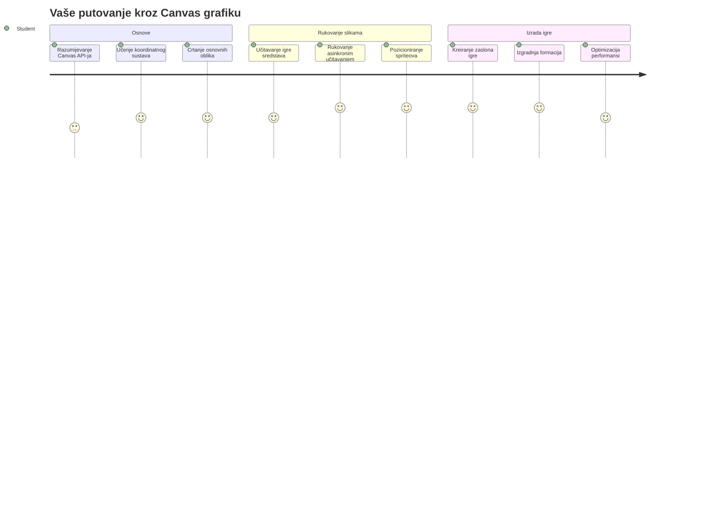
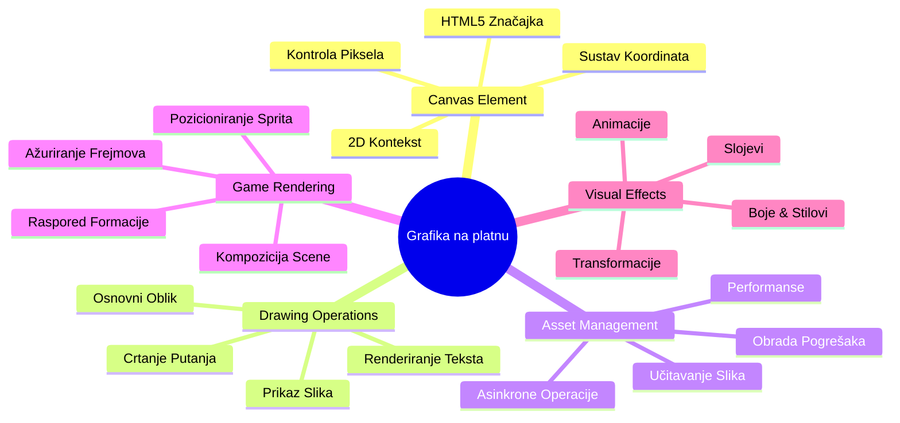
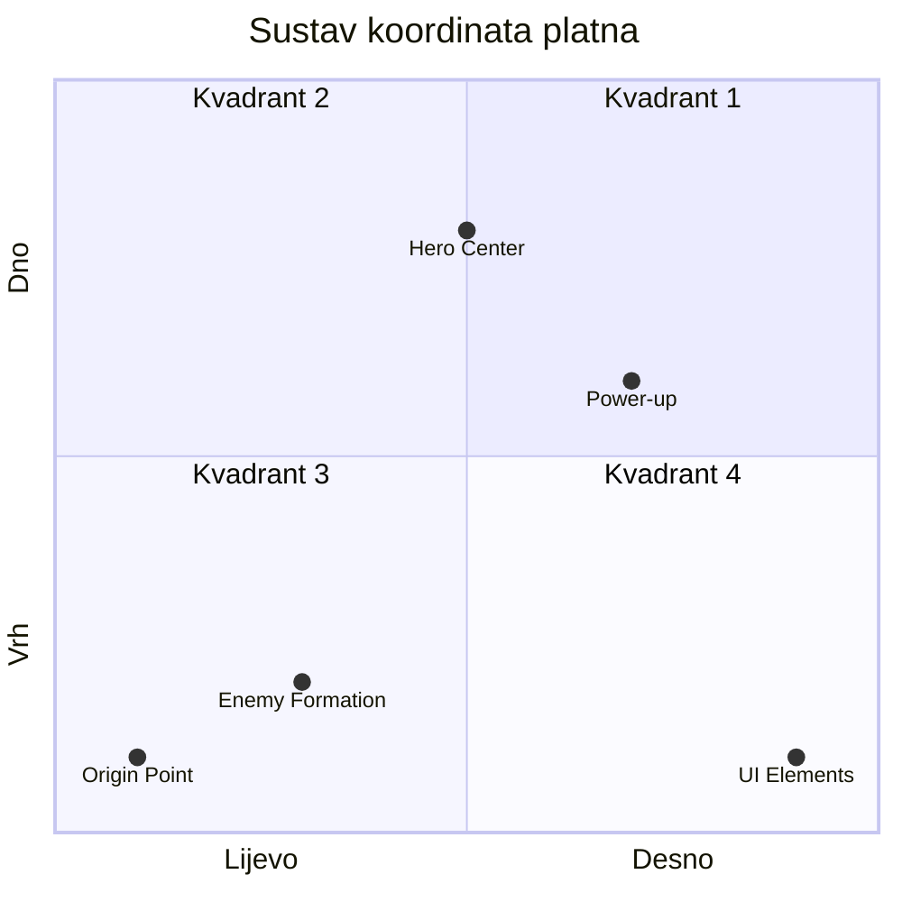
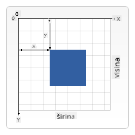
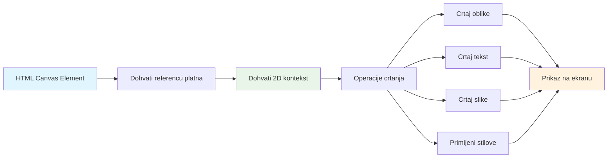
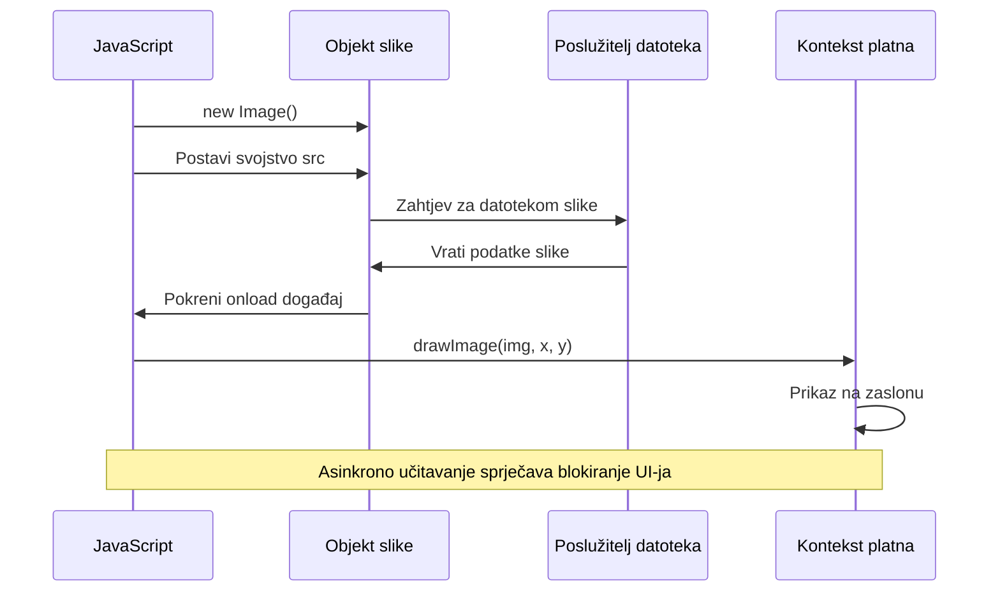
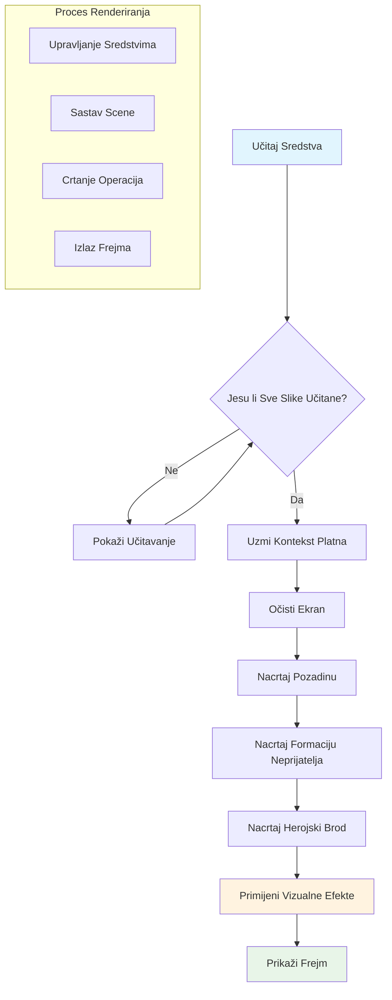
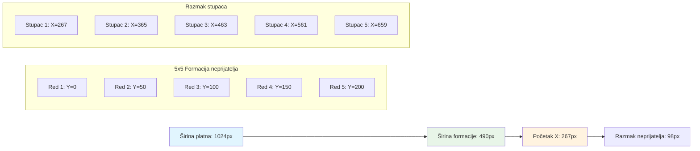
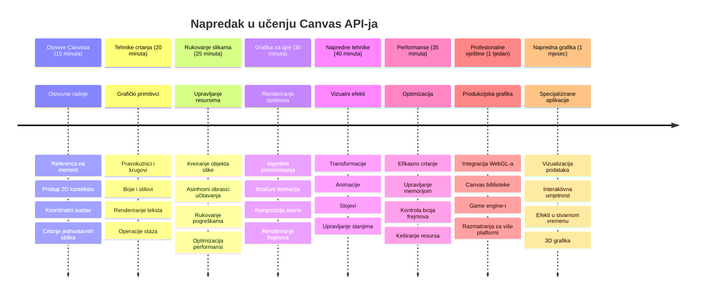

<!--
CO_OP_TRANSLATOR_METADATA:
{
  "original_hash": "7994743c5b21fdcceb36307916ef249a",
  "translation_date": "2026-01-07T09:01:21+00:00",
  "source_file": "6-space-game/2-drawing-to-canvas/README.md",
  "language_code": "hr"
}
-->
# Izradite svemirsku igru dio 2: Nacrtajte heroja i čudovišta na Canvas


Canvas API jedno je od najmoćnijih značajki web razvoja za stvaranje dinamičke, interaktivne grafike izravno u vašem pregledniku. U ovoj lekciji pretvorit ćemo prazni HTML `<canvas>` element u svijet igre ispunjen herojima i čudovištima. Zamislite canvas kao vašu digitalnu umjetničku ploču gdje kod postaje vizualan.

Nadograđujemo na ono što ste naučili u prethodnoj lekciji, a sada ćemo zaroniti u vizualne aspekte. Naučit ćete kako učitati i prikazati spriteove igre, precizno pozicionirati elemente i stvoriti vizualnu osnovu za vašu svemirsku igru. Ovo premošćuje jaz između statičkih web stranica i dinamičkih, interaktivnih iskustava.

Na kraju lekcije imat ćete potpunu scenu igre s vašim herojsko brodom pravilno pozicioniranim i neprijateljskim formacijama spremnim za borbu. Razumjet ćete kako moderni igre prikazuju grafiku u preglednicima i steći vještine za stvaranje vlastitih interaktivnih vizualnih iskustava. Krenimo istraživati canvas grafiku i oživimo vašu svemirsku igru!


## Predkviz prije predavanja

[Predkviz prije predavanja](https://ff-quizzes.netlify.app/web/quiz/31)

## Canvas

Pa što je točno ovaj `<canvas>` element? To je HTML5 rješenje za stvaranje dinamičke grafike i animacija u web preglednicima. Za razliku od običnih slika ili videozapisa koji su statični, canvas vam daje kontrolu na razini piksela nad svime što se prikazuje na ekranu. To ga čini savršenim za igre, vizualizacije podataka i interaktivnu umjetnost. Zamislite ga kao programabilnu površinu za crtanje gdje JavaScript postaje vaša kist.

Po defaultu, canvas element izgleda kao prazan, proziran pravokutnik na vašoj stranici. Ali tu leži njegova snaga! Njegova prava moć pojavljuje se kada koristite JavaScript za crtanje oblika, učitavanje slika, stvaranje animacija i omogućavanje da stvari reagiraju na korisničke interakcije. To je slično onome kako su pioniri računalne grafike u Bell Labsu 1960-ih morali programirati svaki piksel da bi stvorili prve digitalne animacije.

✅ Pročitajte [više o Canvas API-ju](https://developer.mozilla.org/docs/Web/API/Canvas_API) na MDN-u.

Evo kako se obično deklarira, kao dio tijela stranice:

```html
<canvas id="myCanvas" width="200" height="100"></canvas>
```

**Evo što ovaj kod radi:**
- **Postavlja** `id` atribut da biste mogli referencirati ovaj specifični canvas element u JavaScriptu
- **Definira** `width` u pikselima za kontrolu horizontalne veličine canvasa
- **Postavlja** `height` u pikselima za određivanje vertikalnih dimenzija canvasa

## Crtanje jednostavne geometrije

Sada kad znate što je canvas element, istražimo kako zapravo crtati na njemu! Canvas koristi koordinatni sustav koji bi vam mogao biti poznat iz matematike, ali postoji jedna važna posebnost vezana za računalnu grafiku.

Canvas koristi kartezijanske koordinate s x-osi (horizontalna) i y-osi (vertikalna) za pozicioniranje svega što crtate. Ali evo ključne razlike: za razliku od koordinatnog sustava iz matematike, točka ishodišta `(0,0)` počinje u gornjem lijevom kutu, pri čemu vrijednosti x rastu pomicanjem udesno, a vrijednosti y rastu pomicanjem prema dolje. Ovaj pristup datira još iz ranih računalnih prikaza gdje su elektronske snopove skenirale od vrha prema dolje, pa je gornji lijevi kut prirodna točka početka.



> Slika s [MDN](https://developer.mozilla.org/docs/Web/API/Canvas_API/Tutorial/Drawing_shapes)

Za crtanje na canvas elementu slijedit ćete isti trostupanjski proces koji tvori temelj svih grafika na canvasu. Nakon što to učinite nekoliko puta, postat će vam druga priroda:


1. **Dohvatite referencu** na vaš Canvas element iz DOM-a (kao bilo koji drugi HTML element)
2. **Dohvatite 2D rendering kontekst** – on pruža sve metode za crtanje
3. **Počnite crtati!** Koristite ugrađene metode konteksta za stvaranje grafike

Evo kako to izgleda u kodu:

```javascript
// Korak 1: Dohvati element platna
const canvas = document.getElementById("myCanvas");

// Korak 2: Dohvati 2D kontekst za crtanje
const ctx = canvas.getContext("2d");

// Korak 3: Postavi boju ispune i nacrtaj pravokutnik
ctx.fillStyle = 'red';
ctx.fillRect(0, 0, 200, 200); // x, y, širina, visina
```

**Razložimo ovo korak po korak:**
- Mi **hvata** canvas element pomoću njegovog ID-a i spremamo ga u varijablu
- Mi **dohvaćamo** 2D rendering kontekst – to je naš alatni set pun metoda za crtanje
- Mi **kažemo** canvasu da želimo ispuniti stvari crvenom bojom koristeći `fillStyle` svojstvo
- Mi **crtamo** pravokutnik započevši u gornjem lijevom kutu (0,0) koji je širok i visok 200 piksela

✅ Canvas API se većinom fokusira na 2D oblike, ali možete također nacrtati 3D elemente na web stranici; za to možete koristiti [WebGL API](https://developer.mozilla.org/docs/Web/API/WebGL_API).

Možete crtati razne stvari s Canvas API-jem poput:

- **Geometrijskih oblika**, već smo pokazali kako nacrtati pravokutnik, ali postoji još mnogo toga što možete nacrtati.
- **Teksta**, možete nacrtati tekst s bilo kojim fontom i bojom koju želite.
- **Slika**, možete nacrtati sliku na temelju slike poput .jpg ili .png datoteke.

✅ Isprobajte! Znate kako nacrtati pravokutnik, možete li nacrtati krug na stranici? Pogledajte neke zanimljive Canvas crteže na CodePen. Evo [posebno impresivnog primjera](https://codepen.io/dissimulate/pen/KrAwx).

### 🔄 **Pedagoški pregled**
**Razumijevanje osnova canvasa**: Prije no što prijeđete na učitavanje slika, osigurajte da možete:
- ✅ Objasniti kako se koordinatni sustav canvasa razlikuje od matematičkih koordinata
- ✅ Razumjeti trostupanjski proces crtanja na canvasa
- ✅ Prepoznati što pruža 2D rendering kontekst
- ✅ Opišete kako fillStyle i fillRect rade zajedno

**Brzi samoprovjera**: Kako biste nacrtali plavi krug na poziciji (100, 50) s radijusom 25?
```javascript
ctx.fillStyle = 'blue';
ctx.beginPath();
ctx.arc(100, 50, 25, 0, 2 * Math.PI);
ctx.fill();
```

**Metode crtanja na canvasa koje sada znate**:
- **fillRect()**: Crta ispunjene pravokutnike
- **fillStyle**: Postavlja boje i uzorke
- **beginPath()**: Pokreće nove putanje za crtanje
- **arc()**: Stvara krugove i krivulje

## Učitajte i nacrtajte slikovni resurs

Crtanje osnovnih oblika korisno je za početak, ali većina igara treba stvarne slike! Spriteovi, pozadine i teksture ono su što igri daje vizualnu privlačnost. Učitavanje i prikaz slika na canvasu radi drugačije nego crtanje geometrijskih oblika, no jednostavno je jednom kad shvatite proces.

Moramo stvoriti `Image` objekt, učitati našu datoteku slike (to se odvija asinkrono, znači "u pozadini") i zatim je nacrtati na canvas kad je spremna. Ovaj pristup osigurava da se slike pravilno prikazuju bez blokiranja vaše aplikacije tijekom učitavanja.


### Osnovno učitavanje slike

```javascript
const img = new Image();
img.src = 'path/to/my/image.png';
img.onload = () => {
  // Slika učitana i spremna za korištenje
  console.log('Image loaded successfully!');
};
```

**Evo što se događa u ovom kodu:**
- Mi **stvaramo** sasvim novi Image objekt za držanje našeg spritea ili teksture
- Mi **kažemo** koju datoteku slike učitati postavljanjem izvornog puta
- Mi **slušamo** događaj učitavanja da znamo točno kada je slika spremna za korištenje

### Bolji način učitavanja slika

Evo robusnijeg načina za upravljanje učitavanjem slika koji često koriste profesionalni developeri. Umotat ćemo učitavanje slike u funkciju temeljenu na Promise-u – ovaj pristup, populariziran kada su JavaScript Promises postale standard u ES6, čini vaš kod organiziranijim i lijepo upravlja greškama:

```javascript
function loadAsset(path) {
  return new Promise((resolve, reject) => {
    const img = new Image();
    img.src = path;
    img.onload = () => {
      resolve(img);
    };
    img.onerror = () => {
      reject(new Error(`Failed to load image: ${path}`));
    };
  });
}

// Moderno korištenje s async/await
async function initializeGame() {
  try {
    const heroImg = await loadAsset('hero.png');
    const monsterImg = await loadAsset('monster.png');
    // Slike su sada spremne za korištenje
  } catch (error) {
    console.error('Failed to load game assets:', error);
  }
}
```

**Što smo ovdje napravili:**
- **Umotali** svu tu logiku učitavanja slike u Promise da bismo bolje mogli upravljati tim procesom
- **Dodali** obradu grešaka koja nam doista govori kada nešto pođe po zlu
- **Koristili** moderni async/await sintaksu jer je puno urednije čitati
- **Uključili** try/catch blokove da graciozno upravljamo bilo kakvim problemima pri učitavanju

Kad su vam slike učitane, crtanje na canvas zapravo je vrlo jednostavno:

```javascript
async function renderGameScreen() {
  try {
    // Učitaj resurse igre
    const heroImg = await loadAsset('hero.png');
    const monsterImg = await loadAsset('monster.png');

    // Dohvati platno i kontekst
    const canvas = document.getElementById("myCanvas");
    const ctx = canvas.getContext("2d");

    // Nacrtaj slike na određene pozicije
    ctx.drawImage(heroImg, canvas.width / 2, canvas.height / 2);
    ctx.drawImage(monsterImg, 0, 0);
  } catch (error) {
    console.error('Failed to render game screen:', error);
  }
}
```

**Prođimo to korak po korak:**
- Magično **učitavamo** slike heroja i čudovišta u pozadini koristeći await
- **Dohvaćamo** canvas element i dobivamo 2D rendering kontekst koji nam treba
- **Pozicioniramo** sliku heroja točno u sredinu pomoću brzih matematičkih izračuna
- **Stavljamo** sliku čudovišta u gornji lijevi kut da započnemo neprijateljsku formaciju
- **Hvataju** se potencijalne greške koje se mogu dogoditi tijekom učitavanja ili renderiranja


## Sad je vrijeme da započnete izradu svoje igre

Sada ćemo sve povezati kako bismo stvorili vizualnu osnovu vaše svemirske igre. Imate solidno razumijevanje osu canvas osnova i tehnika učitavanja slika, pa će ovaj praktični dio voditi kroz izradu kompletne igre s pravilno pozicioniranim spriteovima.

### Što izgraditi

Izradit ćete web stranicu s canvas elementom. Trebala bi prikazivati crni ekran dimenzija `1024*768`. Dobit ćete dvije slike:

- Herojski brod

   

- 5*5 čudovišta

   

### Preporučeni koraci za početak razvoja

Pronađite početne datoteke koje su za vas kreirane u `your-work` podmapi. Struktura vašeg projekta trebala bi sadržavati:

```bash
your-work/
├── assets/
│   ├── enemyShip.png
│   └── player.png
├── index.html
├── app.js
└── package.json
```

**Evo s čim radite:**
- **Spriteovi igre** nalaze se u mapi `assets/` da bi sve bilo organizirano
- **Vaša glavna HTML datoteka** postavlja canvas element i priprema sve
- **JavaScript datoteka** u kojoj ćete pisati svu logiku prikaza igre
- **package.json** koji postavlja razvojni server za lokalno testiranje

Otvorite ovu mapu u Visual Studio Code za početak rada. Trebat će vam lokalno razvojno okruženje s Visual Studio Code, NPM i Node.js instaliranim. Ako nemate `npm` postavljen na računalu, [evo kako ga instalirati](https://www.npmjs.com/get-npm).

Pokrenite svoj razvojni server tako da se pozicionirate u `your-work` mapu:

```bash
cd your-work
npm start
```

**Ova naredba radi neke prilično cool stvari:**
- **Pokreće** lokalni server na `http://localhost:5000` da možete testirati svoju igru
- **Poslužuje** sve vaše datoteke ispravno da ih preglednik može učitati
- **Prati** vaše datoteke za promjene da razvoj teče glatko
- **Daje vam** profesionalno razvojno okruženje za testiranje svega

> 💡 **Napomena**: Vaš preglednik će inicijalno prikazati praznu stranicu – to je očekivano! Kako dodajete kod, osvježite stranicu da vidite promjene. Ovaj iterativni razvoj sličan je načinu na koji je NASA izgradila Apollo računalo za navigaciju – testirajući svaki komponentu prije integracije u veći sustav.

### Dodajte kod

Dodajte potreban kod u `your-work/app.js` da dovršite sljedeće zadatke:

1. **Nacrtajte canvas s crnom pozadinom**
   > 💡 **Evo kako**: Pronađite TODO u `/app.js` i dodajte samo dvije linije. Postavite `ctx.fillStyle` na crno, zatim upotrijebite `ctx.fillRect()` počevši od (0,0) s dimenzijama canvasa. Jednostavno!

2. **Učitajte teksture igre**
   > 💡 **Evo kako**: Koristite `await loadAsset()` da učitate slike igrača i neprijatelja. Spremite ih u varijable da ih možete kasnije koristiti. Zapamtite – neće se prikazati dok ih doista ne nacrtate!

3. **Nacrtajte herojski brod u centru na dnu**
   > 💡 **Evo kako**: Koristite `ctx.drawImage()` za pozicioniranje heroja. Za x-koordinatu pokušajte `canvas.width / 2 - 45` da ga centrirate, i za y-koordinatu `canvas.height - canvas.height / 4` da ga smjestite u donji dio.

4. **Nacrtajte formaciju od 5×5 neprijateljskih brodova**
   > 💡 **Evo kako**: Pronađite funkciju `createEnemies` i postavite ugniježđene petlje. Trebat ćete malo matematike za razmak i pozicioniranje, ali ne brinite – pokazat ću vam točno kako!

Prvo, definirajte konstante za pravilno postavljanje formacije neprijatelja:

```javascript
const ENEMY_TOTAL = 5;
const ENEMY_SPACING = 98;
const FORMATION_WIDTH = ENEMY_TOTAL * ENEMY_SPACING;
const START_X = (canvas.width - FORMATION_WIDTH) / 2;
const STOP_X = START_X + FORMATION_WIDTH;
```

**Razložimo što ove konstante rade:**
- Postavljamo 5 neprijatelja po retku i stupcu (lijepa mreža 5×5)
- Definiramo koliko prostora staviti između neprijatelja da ne budu zbijeni
- Izračunavamo koliko će široka cijela formacija biti
- Određujemo gdje početi i stati da formacija izgleda centrirano


Zatim, stvorite ugniježđene petlje da nacrtate formaciju neprijatelja:

```javascript
for (let x = START_X; x < STOP_X; x += ENEMY_SPACING) {
  for (let y = 0; y < 50 * 5; y += 50) {
    ctx.drawImage(enemyImg, x, y);
  }
}
```

**Evo što ova ugniježđena petlja radi:**
- Vanjska petlja se **pomiče** s lijeva na desno kroz formaciju
- Unutarnja petlja **ide** od vrha prema dnu da stvori uredne retke
- **Crtamo** svaki neprijateljski sprite na točnim x,y koordinatama koje smo izračunali
- Sve ostaje **ravnomjerno razmaknuto** da izgleda profesionalno i organizirano

### 🔄 **Pedagoški pregled**
**Majstorstvo prikaza igre**: Provjerite svoje razumijevanje kompletnog sustava prikaza:
- ✅ Kako asinkrono učitavanje slika sprječava blokadu korisničkog sučelja prilikom pokretanja igre?
- ✅ Zašto pozicije formacije neprijatelja računamo korištenjem konstanti umjesto da ih tvrdokodno unosimo?
- ✅ Koju ulogu 2D rendering kontekst ima u operacijama crtanja?
- ✅ Kako ugniježđene petlje stvaraju organizirane formacije spriteova?

**Razmatranja o performansama**: Vaša igra sad demonstrira:
- **Učinkovito učitavanje resursa**: Upravljanje slikama temeljeno na Promise-u
- **Organizirano prikazivanje**: Strukturirane operacije crtanja
- **Matematičko pozicioniranje**: Izračunate pozicije spriteova
- **Upravljanje greškama**: Graciozno upravljanje pogreškama

**Koncepti vizualnog programiranja**: Naučili ste:
- **Koordinatni sustavi**: Prevođenje matematike u pozicije na zaslonu  
- **Upravljanje spriteovima**: Učitavanje i prikazivanje grafike igre  
- **Algoritmi formacija**: Matematički obrasci za organizirane rasporede  
- **Asinkrone operacije**: Moderni JavaScript za glatko korisničko iskustvo  

## Rezultat

Gotovi rezultat trebao bi izgledati ovako:


## Rješenje

Pokušajte ga sami prvo riješiti, ali ako zapnete, pogledajte [rješenje](../../../../6-space-game/2-drawing-to-canvas/solution/app.js)

---

## GitHub Copilot Agent izazov 🚀

Upotrijebite Agent način za dovršetak sljedećeg izazova:

**Opis:** Unaprijedite svoj prostor-igru na platnu dodavanjem vizualnih efekata i interaktivnih elemenata koristeći tehnike Canvas API-ja koje ste naučili.

**Zadatak:** Kreirajte novu datoteku pod nazivom `enhanced-canvas.html` s canvasom koji prikazuje animirane zvijezde u pozadini, pulsirajuću traku zdravlja za herojski brod i neprijateljske brodove koji polako se kreću prema dolje. Uključite JavaScript kod koji crta trepereće zvijezde koristeći nasumične pozicije i neprozirnost, implementira traku zdravlja koja mijenja boju ovisno o razini zdravlja (zeleno > žuto > crveno), te animira neprijateljske brodove da se kreću dolje po zaslonu različitim brzinama.

Saznajte više o [agent modu](https://code.visualstudio.com/blogs/2025/02/24/introducing-copilot-agent-mode) ovdje.

## 🚀 Izazov

Naučili ste crtati s 2D-fokusiranim Canvas API-jem; pogledajte [WebGL API](https://developer.mozilla.org/docs/Web/API/WebGL_API) i pokušajte nacrtati 3D objekt.

## Kviz nakon predavanja

[Kviz nakon predavanja](https://ff-quizzes.netlify.app/web/quiz/32)

## Pregled & Samostalno učenje

Saznajte više o Canvas API-ju čitajući [više o njemu](https://developer.mozilla.org/docs/Web/API/Canvas_API).

### ⚡ **Što možete napraviti u sljedećih 5 minuta**
- [ ] Otvorite konzolu preglednika i kreirajte canvas element pomoću `document.createElement('canvas')`  
- [ ] Pokušajte nacrtati pravokutnik koristeći `fillRect()` na canvas kontekstu  
- [ ] Eksperimentirajte s različitim bojama koristeći svojstvo `fillStyle`  
- [ ] Nacrtajte jednostavan krug koristeći metodu `arc()`  

### 🎯 **Što možete postići u ovom satu**
- [ ] Završite kviz nakon lekcije i razumite osnove canvasa  
- [ ] Kreirajte aplikaciju za crtanje na canvasu s više oblika i boja  
- [ ] Implementirajte učitavanje slika i prikaz spriteova za svoju igru  
- [ ] Napravite jednostavnu animaciju koja pomiče objekte po canvasu  
- [ ] Vježbajte transformacije canvasa poput skaliranja, rotacije i translacije  

### 📅 **Vaš tjedan s Canvasom**
- [ ] Dovršite space igru s uglađenom grafikom i animacijama spriteova  
- [ ] Ovladate naprednim tehnikama canvasa poput gradijenata, uzoraka i kompozicije  
- [ ] Kreirajte interaktivne vizualizacije koristeći canvas za prikaz podataka  
- [ ] Naučite optimizacije canvasa za glatki rad aplikacije  
- [ ] Izradite aplikaciju za crtanje ili slikanje s različitim alatima  
- [ ] Istražujte kreativne obrasce kodiranja i generativnu umjetnost s canvasom  

### 🌟 **Vaša mjesec dana grafičkog majstorstva**
- [ ] Izgradite složene vizualne aplikacije koristeći Canvas 2D i WebGL  
- [ ] Naučite koncepte grafičkog programiranja i osnove shader-a  
- [ ] Doprinose grafičkim bibliotekama otvorenog koda i alatima za vizualizaciju  
- [ ] Ovladate optimizacijom performansi za grafički zahtjevne aplikacije  
- [ ] Kreirajte edukativni sadržaj o programiranju canvasa i računalnoj grafici  
- [ ] Postanite stručnjak za grafičko programiranje koji pomaže drugima stvarati vizualna iskustva  

## 🎯 Vaš vremenski okvir za majstorstvo Canvas grafike


### 🛠️ Sažetak vašeg alata za Canvas grafiku

Nakon završetka ove lekcije imate:  
- **Majstorstvo Canvas API-ja**: Potpuno razumijevanje programiranja 2D grafike  
- **Matematiku koordinata**: Precizno pozicioniranje i algoritme rasporeda  
- **Upravljanje resursima**: Profesionalno učitavanje slika i rukovanje greškama  
- **Rendering pipeline**: Strukturirani pristup sastavljanju scena  
- **Igrinu grafiku**: Pozicioniranje spriteova i kalkulacije formacija  
- **Asinkrono programiranje**: Moderne JavaScript obrasce za glatku izvedbu  
- **Vizualno programiranje**: Prevođenje matematičkih koncepata u grafiku na ekranu  

**Primjena u stvarnom svijetu**: Vaše Canvas vještine primjenjuju se direktno na:  
- **Vizualizaciju podataka**: Grafikone, dijagrame i interaktivne nadzorne ploče  
- **Razvoj igara**: 2D igre, simulacije i interaktivna iskustva  
- **Digitalnu umjetnost**: Kreativno kodiranje i generativne umjetničke projekte  
- **Dizajn sučelja**: Prilagođenu grafiku i interaktivne elemente  
- **Obrazovni softver**: Vizualne alate za učenje i simulacije  
- **Web aplikacije**: Dinamičku grafiku i vizualizacije u stvarnom vremenu  

**Stečene profesionalne vještine**: Sada možete:  
- **Izgraditi** prilagođena grafička rješenja bez vanjskih biblioteka  
- **Optimizirati** performanse prikaza za glatko korisničko iskustvo  
- **Otkloniti greške** u složenim vizualnim problemima koristeći alate preglednika  
- **Dizajnirati** skalabilne grafičke sustave koristeći matematičke principe  
- **Integrirati** Canvas grafiku s modernim web aplikacijskim okvirima  

**Canvas API metode koje ste savladali**:  
- **Upravljanje elementima**: getElementById, getContext  
- **Operacije crtanja**: fillRect, drawImage, fillStyle  
- **Učitavanje resursa**: Image objekti, Promise obrasci  
- **Matematičko pozicioniranje**: Kalkulacije koordinata, algoritmi formacija  

**Sljedeća razina**: Spremni ste dodati animaciju, korisničku interakciju, detekciju sudara ili istražiti WebGL za 3D grafiku!

🌟 **Ostvarenje**: Izgradili ste kompletan sustav za rendering igre koristeći temeljne tehnike Canvas API-ja!

## Zadatak

[Igrajte se s Canvas API-jem](assignment.md)

---

<!-- CO-OP TRANSLATOR DISCLAIMER START -->
**Odricanje od odgovornosti**:
Ovaj dokument je preveden korištenjem AI usluge za prevođenje [Co-op Translator](https://github.com/Azure/co-op-translator). Iako nastojimo postići točnost, imajte na umu da automatski prijevodi mogu sadržavati pogreške ili netočnosti. Izvorni dokument na izvornom jeziku treba smatrati autoritativnim izvorom. Za kritične informacije preporuča se profesionalni ljudski prijevod. Nismo odgovorni za bilo kakva nesporazuma ili kriva tumačenja koja proizlaze iz korištenja ovog prijevoda.
<!-- CO-OP TRANSLATOR DISCLAIMER END -->