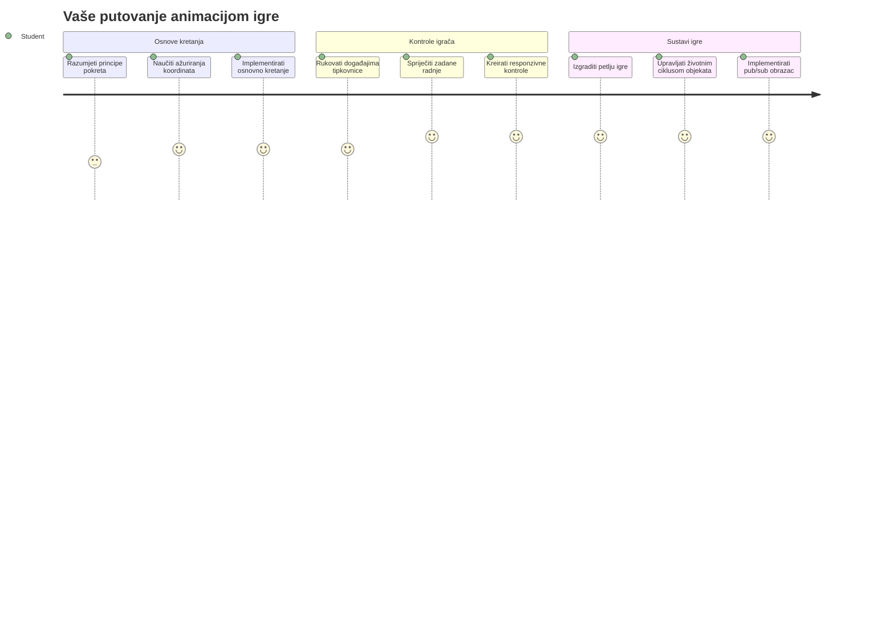
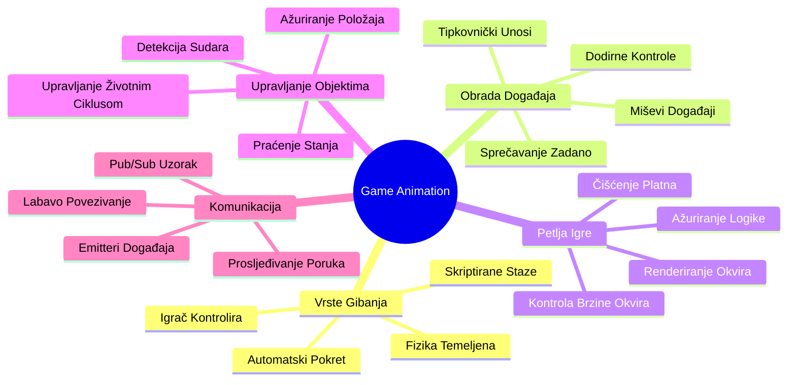
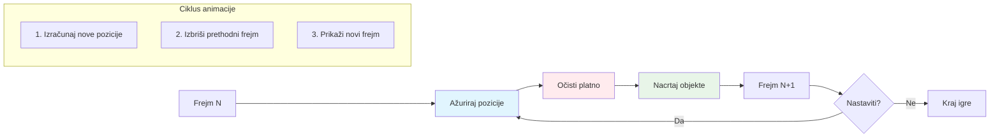
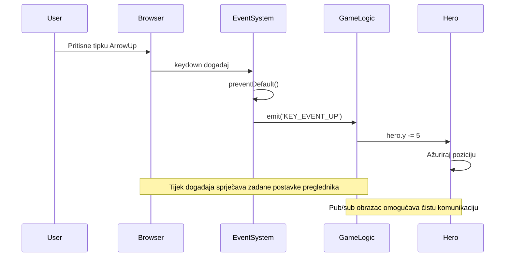
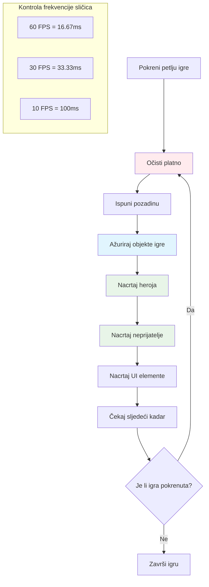
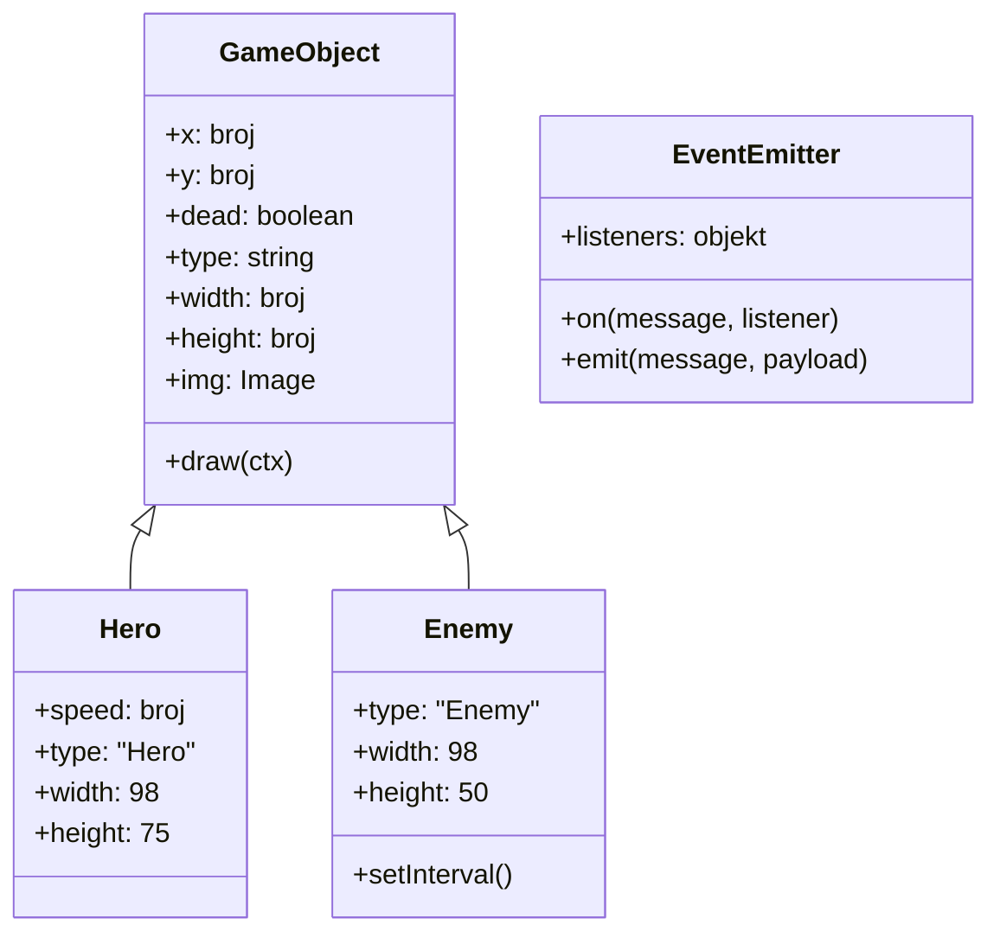
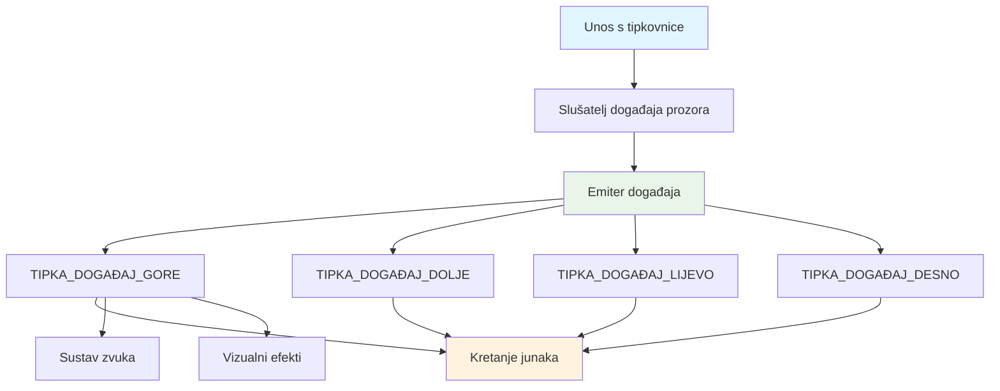
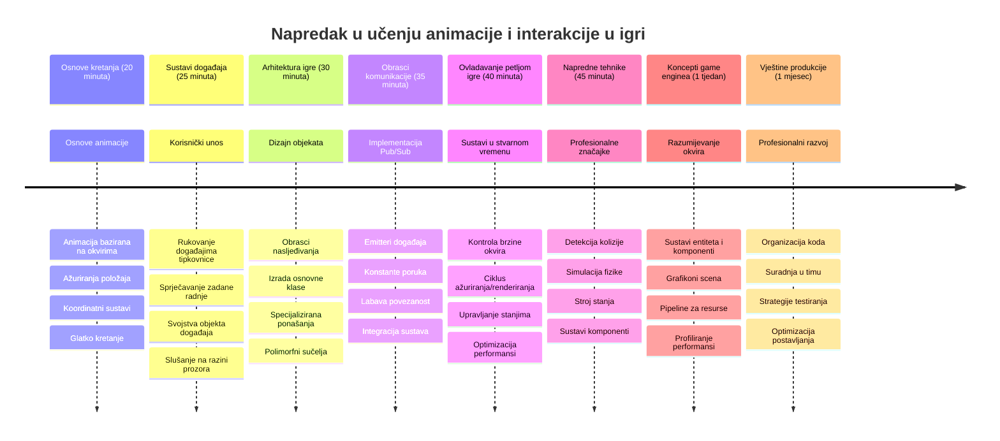

# Izrada igre u svemiru, dio 3: Dodavanje gibanja


Razmislite o svojim omiljenim igrama – ono što ih čini privlačnima nije samo lijepa grafika, već način na koji se sve kreće i reagira na vaše radnje. Trenutno je vaša igra u svemiru poput prekrasne slike, ali upravo ćemo dodati pokret koji će joj udahnuti život.

Kada su inženjeri NASA-e programirali računalo za upravljanje za Apolonske misije, suočili su se sličnim izazovom: kako natjerati svemirski brod da reagira na upravljanje pilotom dok istovremeno automatski održava korekcije kursa? Principi koje ćemo danas naučiti odražavaju te iste koncepte – upravljanje kretanjem kojim kontrolira igrač uz automatsko ponašanje sustava.

U ovom ćemo lekciji naučiti kako učiniti da se svemirski brodovi klize preko ekrana, reagiraju na zapovijedi igrača i stvaraju glatke uzorke kretanja. Sve ćemo razbiti na upravljive koncepte koji se prirodno nadovezuju jedan na drugi.

Na kraju će igrači moći letjeti svojim herojskim brodom po ekranu dok neprijateljski brodovi patroliraju iznad. Još važnije, razumjet ćete temeljne principe koji pokreću sustave kretanja u igrama.


## Kviz prije predavanja

[Kviz prije predavanja](https://ff-quizzes.netlify.app/web/quiz/33)

## Razumijevanje gibanja u igrama

Igre oživljavaju kada stvari počnu kretati, a postoje osnovno dva načina na koja se to događa:

- **Kretanje koje kontrolira igrač**: Kad pritisnete tipku ili kliknete mišem, nešto se pomiče. To je izravna veza između vas i vašeg svijeta igre.
- **Automatsko kretanje**: Kada igra sama odlučuje pomaknuti stvari – poput onih neprijateljskih brodova koji moraju patrolirati ekranskim prostorom bez obzira na to radite li išta ili ne.

Pomicanje objekata na računalu je jednostavnije nego što mislite. Sjećate li se onih x i y koordinata iz matematičke nastave? Upravo s tim radimo ovdje. Kad je Galileo 1610. pratilo Jupiterove mjesece, on je ustvari radio isto – bilježio položaje tijekom vremena da bi razumio obrasce gibanja.

Pomicanje stvari na ekranu je poput stvaranja animacije kao u flipbooku – morate pratiti ova tri jednostavna koraka:


1. **Ažurirajte poziciju** – Promijenite mjesto na kojem vaš objekt treba biti (možda ga premjestite 5 piksela udesno)
2. **Izbrišite stari okvir** – Očistite ekran da ne biste vidjeli duhove tragova svuda oko
3. **Nacrtajte novi okvir** – Postavite svoj objekt na novo mjesto

Učinite to dovoljno brzo, i bum! Dobivate glatko kretanje koje igračima djeluje prirodno.

Ovako to može izgledati u kodu:

```javascript
// Postavi lokaciju heroja
hero.x += 5;
// Očisti pravokutnik koji sadrži heroja
ctx.clearRect(0, 0, canvas.width, canvas.height);
// Ponovno nacrtaj pozadinu igre i heroja
ctx.fillRect(0, 0, canvas.width, canvas.height);
ctx.fillStyle = "black";
ctx.drawImage(heroImg, hero.x, hero.y);
```

**Ovo što radi ovaj kod:**
- **Ažurira** x-koordinatu heroja za 5 piksela da se pomakne horizontalno
- **Briše** cijeli canvas da ukloni prethodni okvir
- **Popunjava** canvas crnom pozadinom
- **Ponovno crta** sliku heroja na njegovoj novoj poziciji

✅ Možete li smisliti razlog zašto bi ponovno crtanje heroja mnogo puta u sekundi moglo trošiti performanse? Pročitajte o [alternativama ovom uzorku](https://developer.mozilla.org/en-US/docs/Web/API/Canvas_API/Tutorial/Optimizing_canvas).

## Rukovanje događajima tipkovnice

Ovdje povezujemo unos igrača i akciju u igri. Kad netko pritisne razmaknicu da puca laserom ili pritisne strelicu da izbjegne asteroid, vaša igra mora detektirati i odgovoriti na taj unos.

Događaji s tipkovnice događaju se na razini prozora, što znači da cijeli vaš prozor preglednika sluša te pritiske tipki. Klikovi mišem, s druge strane, mogu biti vezani za specifične elemente (poput klika na gumb). Za našu svemirsku igru fokusirat ćemo se na kontrole s tipkovnice jer one igračima daju onaj klasični arkadni osjećaj.

Ovo me podsjeća na to kako su telegrafisti u 1800-ima morali prevoditi unos Morseove abecede u smislene poruke – mi radimo nešto slično, pretvaramo pritiske tipki u naredbe igre.

Da biste rukovali događajem, trebate koristiti metodu `addEventListener()` prozora i pružiti joj dva ulazna parametra. Prvi parametar je ime događaja, na primjer `keyup`. Drugi parametar je funkcija koja se treba pozvati kao rezultat događaja.

Evo primjera:

```javascript
window.addEventListener('keyup', (evt) => {
  // evt.key = nizovni prikaz tipke
  if (evt.key === 'ArrowUp') {
    // učini nešto
  }
});
```

**Razbijajući što se događa ovdje:**
- **Sluša** događaje s tipkovnice na cijelom prozoru
- **Hvata** objekt događaja koji sadrži informacije o tome koja je tipka pritisnuta
- **Provjerava** je li pritisnuta tipka jednaka određenoj tipki (u ovom slučaju strelica gore)
- **Izvršava** kod kad je uvjet zadovoljen

Za događaje s tipkovnice postoje dva svojstva na događaju koja možete koristiti da vidite koja je tipka pritisnuta:

- `key` - ovo je tekstualni prikaz pritisnute tipke, na primjer `'ArrowUp'`
- `keyCode` - ovo je brojčani prikaz, na primjer `37`, odgovara `ArrowLeft`

✅ Manipulacija događajima tipkovnice korisna je i izvan razvoja igara. Koje druge primjene možete smisliti za ovu tehniku?


### Posebne tipke: upozorenje!

Neke tipke imaju ugrađena ponašanja u pregledniku koja mogu ometati vašu igru. Strelice pomiču stranicu, a razmaknica skakuće dolje – ponašanja koja ne želite kada netko pokušava pilotirati svoj svemirski brod.

Možemo spriječiti ta zadana ponašanja i dopustiti našoj igri da umjesto toga obrađuje unos. Ovo je slično kako su rani programeri računala morali ignorirati prekide sustava da bi stvorili prilagođena ponašanja – samo što sad to radimo na razini preglednika. Evo kako:

```javascript
const onKeyDown = function (e) {
  console.log(e.keyCode);
  switch (e.keyCode) {
    case 37:
    case 39:
    case 38:
    case 40: // Tipke sa strelicama
    case 32:
      e.preventDefault();
      break; // Razmak
    default:
      break; // ne blokiraj ostale tipke
  }
};

window.addEventListener('keydown', onKeyDown);
```

**Razumijevanje ovog koda za sprječavanje:**
- **Provjerava** specifične kodove tipki koje bi mogle uzrokovati neželjeno ponašanje preglednika
- **Sprječava** zadanu akciju preglednika za strelice i razmaknicu
- **Dopušta** ostalim tipkama da funkcioniraju normalno
- **Koristi** `e.preventDefault()` da zaustavi ugrađeno ponašanje preglednika

### 🔄 **Pedagoški pregled**
**Razumijevanje rukovanja događajima**: Prije nego prijeđete na automatsko kretanje, budite sigurni da možete:
- ✅ Objasniti razliku između događaja `keydown` i `keyup`
- ✅ Razumjeti zašto sprječavamo zadana ponašanja preglednika
- ✅ Opisati kako slušači događaja povezuju unos korisnika s logikom igre
- ✅ Prepoznati koje tipke bi mogle ometati kontrole igre

**Brzi samoprovjera**: Što bi se dogodilo da ne spriječite zadano ponašanje za strelice?
*Odgovor: Preglednik bi pomicao stranicu, što bi ometalo kretanje u igri*

**Arhitektura sustava događaja**: Sada razumijete:
- **Slušanje na razini prozora**: hvatanje događaja na razini preglednika
- **Svojstva objekta događaja**: stringovi `key` protiv brojeva `keyCode`
- **Sprječavanje zadanog**: zaustavljanje neželjenih ponašanja preglednika
- **Uvjetna logika**: reagiranje na određene kombinacije tipki

## Kretanje uzrokovano igrom

Sad razgovarajmo o objektima koji se kreću bez unosa igrača. Razmislite o neprijateljskim brodovima koji krstare ekranom, metcima koji lete ravno ili oblacima koji plutaju u pozadini. Ovo autonomno kretanje čini vaš svijet igre živim čak i kad nitko ne dira kontrole.

Koristimo ugrađene JavaScript timere da ažuriramo pozicije u redovitim intervalima. Ovaj koncept sličan je radu klatna na satu – redoviti mehanizam koji pokreće dosljedne, vremenski određene radnje. Evo koliko to može biti jednostavno:

```javascript
const id = setInterval(() => {
  // Pomakni neprijatelja na y osi
  enemy.y += 10;
}, 100);
```

**Ovo što radi ovaj kod za kretanje:**
- **Stvara** timer koji se izvršava svakih 100 milisekundi
- **Ažurira** y-koordinatu neprijatelja za 10 piksela svaki put
- **Spremi** ID intervala kako bismo ga mogli zaustaviti kasnije ako treba
- **Automatski pomiče** neprijatelja prema dolje na ekranu

## Petlja igre

Evo koncepta koji sve povezuje – petlja igre. Da je vaša igra film, petlja igre bila bi filmski projektor koji prikazuje kadar za kadrom tako brzo da sve izgleda glatko.

Svaka igra ima jednu takvu petlju koja radi u pozadini. To je funkcija koja ažurira sve objekte igre, ponovno crta ekran i neprestano ponavlja taj proces. Ona prati vašeg heroja, sve neprijatelje, laserske zrake – cijelo stanje igre.

Ovaj koncept me podsjeća na to kako su rani animatorii poput Walta Disneya morali ponovno crtati likove kadar po kadar da stvaraju iluziju kretanja. Mi radimo isto, samo umjesto olovaka koristimo kod.

Ovako obično može izgledati petlja igre, izražena u kodu:


```javascript
const gameLoopId = setInterval(() => {
  function gameLoop() {
    ctx.clearRect(0, 0, canvas.width, canvas.height);
    ctx.fillStyle = "black";
    ctx.fillRect(0, 0, canvas.width, canvas.height);
    drawHero();
    drawEnemies();
    drawStaticObjects();
  }
  gameLoop();
}, 200);
```

**Razumijevanje strukture petlje igre:**
- **Briše** cijeli canvas da ukloni prethodni kadar
- **Popunjava** pozadinu solidnom bojom
- **Crta** sve objekte igre na njihovim trenutačnim pozicijama
- **Ponavlja** ovaj proces svakih 200 milisekundi da stvori glatku animaciju
- **Upravljanje** brzinom prikaza kadrova pomoću kontroliranja intervala

## Nastavak svemirske igre

Sad ćemo dodati kretanje statičnoj sceni koju ste prethodno izgradili. Pretvorit ćemo je iz snimke zaslona u interaktivno iskustvo. Proći ćemo korak po korak kako bi svaki dio prirodno slijedio prethodni.

Uzmite kod odakle smo stali u prošloj lekciji (ili započnite s kodom u [Part II- starter](../../../../6-space-game/3-moving-elements-around/your-work) mapi ako treba svježi početak).

**Ovo što danas gradimo:**
- **Herojske kontrole**: Strelice će upravljati vašim svemirskim brodom po ekranu
- **Neprijateljsko kretanje**: Ti izvanzemaljski brodovi započet će svoj napredak

Krenimo s implementacijom tih značajki.

## Preporučeni koraci

Pronađite datoteke koje su pripremljene za vas u podmapi `your-work`. Trebale bi sadržavati sljedeće:

```bash
-| assets
  -| enemyShip.png
  -| player.png
-| index.html
-| app.js
-| package.json
```

Projekt započinjete u mapi `your-work` upisivanjem:

```bash
cd your-work
npm start
```

**Što ova naredba radi:**
- **Navigira** u direktorij vašeg projekta
- **Pokreće** HTTP poslužitelj na adresi `http://localhost:5000`
- **Servira** vaše datoteke igre kako biste ih mogli testirati u pregledniku

Gорје navedenim bit će pokrenut HTTP poslužitelj na adresi `http://localhost:5000`. Otvorite preglednik i upišite tu adresu, trenutno bi trebala prikazati heroja i sve neprijatelje; još ništa ne miče se - zasad!

### Dodajte kod

1. **Dodajte posebne objekte** za `hero`, `enemy` i `game object`, trebaju imati svojstva `x` i `y`. (Sjetite se dijela o [nasljeđivanju ili kompoziciji](../README.md)).

   *NAPOMENA* `game object` treba biti onaj s `x` i `y` te sposobnošću crtanja na canvas.

   > **Savjet**: Započnite dodavanjem nove klase `GameObject` s konstruktorom kao u nastavku, a zatim je nacrtajte na canvas:

    ```javascript
    class GameObject {
      constructor(x, y) {
        this.x = x;
        this.y = y;
        this.dead = false;
        this.type = "";
        this.width = 0;
        this.height = 0;
        this.img = undefined;
      }
    
      draw(ctx) {
        ctx.drawImage(this.img, this.x, this.y, this.width, this.height);
      }
    }
    ```

    **Razumijevanje ove osnovne klase:**
    - **Definira** zajednička svojstva koja dijele svi objekti igre (položaj, veličina, slika)
    - **Uključuje** zastavicu `dead` koja prati treba li objekt ukloniti
    - **Omogućuje** metodu `draw()` koja prikazuje objekt na canvasu
    - **Postavlja** zadane vrijednosti za sva svojstva koja djeca klase mogu nadjačati


    Sada, proširite `GameObject` da biste napravili `Hero` i `Enemy`:
    
    ```javascript
    class Hero extends GameObject {
      constructor(x, y) {
        super(x, y);
        this.width = 98;
        this.height = 75;
        this.type = "Hero";
        this.speed = 5;
      }
    }
    ```

    ```javascript
    class Enemy extends GameObject {
      constructor(x, y) {
        super(x, y);
        this.width = 98;
        this.height = 50;
        this.type = "Enemy";
        const id = setInterval(() => {
          if (this.y < canvas.height - this.height) {
            this.y += 5;
          } else {
            console.log('Stopped at', this.y);
            clearInterval(id);
          }
        }, 300);
      }
    }
    ```

    **Ključni koncepti u ovim klasama:**
    - **Nasljeđuje** iz `GameObject` koristeći ključnu riječ `extends`
    - **Poziva** konstruktor roditelja s `super(x, y)`
    - **Postavlja** specifične dimenzije i svojstva za svaki tip objekta
    - **Implementira** automatsko kretanje neprijatelja koristeći `setInterval()`

2. **Dodajte rukovatelje događajima za tipke** da biste upravljali kretanjem heroja gore/dolje lijevo/desno

   *Sjetite se* da je to kartezični sustav, gornji lijevi kut je `0,0`. Također ne zaboravite dodati kod za zaustavljanje *zadanog ponašanja*

   > **Savjet**: Napravite svoju funkciju `onKeyDown` i pridružite ju prozoru:

   ```javascript
   const onKeyDown = function (e) {
     console.log(e.keyCode);
     // Dodajte kod iz prethodne lekcije za zaustavljanje zadane radnje
     switch (e.keyCode) {
       case 37:
       case 39:
       case 38:
       case 40: // Tipke sa strelicama
       case 32:
         e.preventDefault();
         break; // Razmak
       default:
         break; // ne blokirajte druge tipke
     }
   };

   window.addEventListener("keydown", onKeyDown);
   ```
    
   **Ovo što ovaj rukovatelj događajima radi:**
   - **Sluša** događaje pritiska tipke na cijelom prozoru
   - **Zapisuje** kod tipke da vam pomogne s otklanjanjem pogrešaka koje tipke se pritiskaju
   - **Sprječava** zadano ponašanje preglednika za strelice i razmaknicu
   - **Dopušta** ostalim tipkama da rade normalno
   
   Provjerite konzolu preglednika u ovom trenutku i promatrajte bilježenje pritisnutih tipki.

3. **Implementirajte** [Pub sub uzorak](../README.md), ovo će održati vaš kod čistim dok pratite ostatak dijelova.

   Publish-Subscribe uzorak pomaže organizirati vaš kod odvajanjem detekcije događaja od rukovanja događajem. Čini vaš kod modularnijim i lakšim za održavanje.

   Za ovu zadnju fazu, možete:

   1. **Dodajte slušača događaja** na prozor:

       ```javascript
       window.addEventListener("keyup", (evt) => {
         if (evt.key === "ArrowUp") {
           eventEmitter.emit(Messages.KEY_EVENT_UP);
         } else if (evt.key === "ArrowDown") {
           eventEmitter.emit(Messages.KEY_EVENT_DOWN);
         } else if (evt.key === "ArrowLeft") {
           eventEmitter.emit(Messages.KEY_EVENT_LEFT);
         } else if (evt.key === "ArrowRight") {
           eventEmitter.emit(Messages.KEY_EVENT_RIGHT);
         }
       });
       ```

   **Ovo što ovaj sustav događaja radi:**
   - **Detektira** unos s tipkovnice i pretvara ga u prilagođene događaje igre
   - **Razdvaja** detekciju unosa od logike igre
   - **Olakšava** izmjenu kontrola kasnije bez utjecaja na kod igre
   - **Dopušta** da se isti unos koristi za više sustava


   2. **Napravite klasu EventEmitter** za objavljivanje i pretplatu na poruke:

       ```javascript
       class EventEmitter {
         constructor() {
           this.listeners = {};
         }
       
         on(message, listener) {
           if (!this.listeners[message]) {
             this.listeners[message] = [];
           }
           this.listeners[message].push(listener);
         }
       
   3. **Dodajte konstante** i postavite EventEmitter:

       ```javascript
       const Messages = {
         KEY_EVENT_UP: "KEY_EVENT_UP",
         KEY_EVENT_DOWN: "KEY_EVENT_DOWN",
         KEY_EVENT_LEFT: "KEY_EVENT_LEFT",
         KEY_EVENT_RIGHT: "KEY_EVENT_RIGHT",
       };
       
       let heroImg, 
           enemyImg, 
           laserImg,
           canvas, ctx, 
           gameObjects = [], 
           hero, 
           eventEmitter = new EventEmitter();
       ```

   **Razumijevanje postavki:**
   - **Definira** konstante poruka da bi se izbjegle tipfeler i olakšala refaktorizacija
   - **Deklarira** varijable za slike, kontekst canvasa i stanje igre
   - **Stvara** globalnog emitera događaja za sustav pub-sub
   - **Inicijalizira** polje za pohranu svih objekata igre

   4. **Inicijaliziraj igru**

       ```javascript
       function initGame() {
         gameObjects = [];
         createEnemies();
         createHero();
       
         eventEmitter.on(Messages.KEY_EVENT_UP, () => {
           hero.y -= 5;
         });
       
         eventEmitter.on(Messages.KEY_EVENT_DOWN, () => {
           hero.y += 5;
         });
       
         eventEmitter.on(Messages.KEY_EVENT_LEFT, () => {
           hero.x -= 5;
         });
       
4. **Postavi petlju igre**

   Preuredi funkciju `window.onload` kako bi inicijalizirala igru i postavila petlju igre s dobrim intervalom. Također ćeš dodati laserski snop:

    ```javascript
    window.onload = async () => {
      canvas = document.getElementById("canvas");
      ctx = canvas.getContext("2d");
      heroImg = await loadTexture("assets/player.png");
      enemyImg = await loadTexture("assets/enemyShip.png");
      laserImg = await loadTexture("assets/laserRed.png");
    
      initGame();
      const gameLoopId = setInterval(() => {
        ctx.clearRect(0, 0, canvas.width, canvas.height);
        ctx.fillStyle = "black";
        ctx.fillRect(0, 0, canvas.width, canvas.height);
        drawGameObjects(ctx);
      }, 100);
    };
    ```

   **Razumijevanje postavljanja igre:**
   - **Čeka** da se stranica potpuno učita prije početka
   - **Dohvaća** element canvas i njegov 2D rendering kontekst
   - **Učitava** sve slikovne resurse asinkrono pomoću `await`
   - **Pokreće** petlju igre koja radi na intervalima od 100 ms (10 FPS)
   - **Briše** i ponovno crta cijeli zaslon svaki frame

5. **Dodaj kod** za pomicanje neprijatelja u određenom intervalu

    Preuredi funkciju `createEnemies()` da stvori neprijatelje i ubaci ih u novu klasu gameObjects:

    ```javascript
    function createEnemies() {
      const MONSTER_TOTAL = 5;
      const MONSTER_WIDTH = MONSTER_TOTAL * 98;
      const START_X = (canvas.width - MONSTER_WIDTH) / 2;
      const STOP_X = START_X + MONSTER_WIDTH;
    
      for (let x = START_X; x < STOP_X; x += 98) {
        for (let y = 0; y < 50 * 5; y += 50) {
          const enemy = new Enemy(x, y);
          enemy.img = enemyImg;
          gameObjects.push(enemy);
        }
      }
    }
    ```

    **Što kreiranje neprijatelja radi:**
    - **Izračunava** pozicije kako bi neprijatelji bili centrirani na zaslonu
    - **Stvara** mrežu neprijatelja koristeći ugniježdene petlje
    - **Dodjeljuje** sliku neprijatelja svakom objektu neprijatelja
    - **Dodaje** svakog neprijatelja globalnom polju game objekata
    
    te dodaj funkciju `createHero()` koja radi sličan proces za heroja.
    
    ```javascript
    function createHero() {
      hero = new Hero(
        canvas.width / 2 - 45,
        canvas.height - canvas.height / 4
      );
      hero.img = heroImg;
      gameObjects.push(hero);
    }
    ```

    **Što kreiranje heroja radi:**
    - **Pozicionira** heroja na donji centar zaslona
    - **Dodjeljuje** herojevu sliku hero objektu
    - **Dodaje** heroja u polje game objekata za prikazivanje

    i na kraju, dodaj funkciju `drawGameObjects()` za početak crtanja:

    ```javascript
    function drawGameObjects(ctx) {
      gameObjects.forEach(go => go.draw(ctx));
    }
    ```

    **Razumijevanje funkcije crtanja:**
    - **Prolazi** kroz sve game objekte u polju
    - **Poziva** metodu `draw()` za svaki objekt
    - **Prosljeđuje** kontekst platna kako bi se objekti mogli prikazati

    ### 🔄 **Pedagoški pregled**
    **Potpuno razumijevanje sistema igre**: Provjeri svoje znanje o cijeloj arhitekturi:
    - ✅ Kako nasljeđivanje omogućuje Hero i Enemy da dijele zajednička svojstva GameObject-a?
    - ✅ Zašto pub/sub obrazac čini tvoj kod lakše održivim?
    - ✅ Koju ulogu igra petlja igre u stvaranju glatke animacije?
    - ✅ Kako event listeneri povezuju korisnički unos s ponašanjem objekata u igri?

    **Integracija sustava**: Tvoja igra sada demonstrira:
    - **Objektno orijentirani dizajn**: Osnovne klase sa specijaliziranim nasljeđivanjem
    - **Arhitektura vođena događajima**: Pub/sub obrazac za labavu povezanost
    - **Okvir za animaciju**: Petlja igre s dosljednim ažuriranjima frameova
    - **Rukovanje unosom**: Tipkovni događaji s onemogućavanjem default ponašanja
    - **Upravljanje resursima**: Učitavanje slika i rendering spriteova

    **Profesionalni obrasci**: Implementirao si:
    - **Odvajanje odgovornosti**: Logika, unos i prikaz su odvojeni
    - **Polimorfizam**: Svi game objekti dijele zajedničko sučelje za crtanje
    - **Slanje poruka**: Čista komunikacija između komponenti
    - **Upravljanje resursima**: Učinkovito rukovanje spriteovima i animacijama

    Tvoji neprijatelji bi trebali početi napredovati prema tvom hero svemirskom brodu!
      }
    }
    ```
    
    and add a `createHero()` function to do a similar process for the hero.
    
    ```javascript
    function createHero() {
      hero = new Hero(
        canvas.width / 2 - 45,
        canvas.height - canvas.height / 4
      );
      hero.img = heroImg;
      gameObjects.push(hero);
    }
    ```

    i na kraju, dodaj funkciju `drawGameObjects()` za početak crtanja:

    ```javascript
    function drawGameObjects(ctx) {
      gameObjects.forEach(go => go.draw(ctx));
    }
    ```

    Tvoji neprijatelji bi trebali početi napredovati prema tvom hero svemirskom brodu!

---

## GitHub Copilot Agent Izazov 🚀

Evo izazova koji će poboljšati polirani izgled tvoje igre: dodavanje granica i glatkih kontrola. Trenutno tvoj heroj može odletjeti s ekrana, a kretanje može izgledati isprekidano.

**Tvoja misija:** Učini da tvoj svemirski brod izgleda realističnije implementirajući granice ekrana i tečno kretanje. Ovo je slično kao kako NASA-in sustav upravljanja letom sprječava da svemirske letjelice prelaze sigurne operativne parametre.

**Evo što trebaš napraviti:** Kreiraj sustav koji drži tvoj hero svemirski brod na ekranu i učini kontrole glatkim. Kada igrači drže pritisnutu tipku strelice, brod bi trebao kliziti kontinuirano umjesto da se pomiče u diskretnim koracima. Razmotri dodavanje vizualne povratne informacije kada brod dosegne granice ekrana – možda diskretan efekt koji označava rub područja igre.

Saznaj više o [agent modu](https://code.visualstudio.com/blogs/2025/02/24/introducing-copilot-agent-mode) ovdje.

## 🚀 Izazov

Organizacija koda postaje sve važnija kako projekti rastu. Možda si primijetio da tvoja datoteka postaje zatrpana funkcijama, varijablama i klasama pomiješanim zajedno. To me podsjeća na to kako su inženjeri koji su organizirali Apollo misiju morali stvoriti jasne, održive sustave na kojima je moglo istovremeno raditi više timova.

**Tvoja misija:**
Razmišljaj kao softverski arhitekt. Kako bi organizirao svoj kod da bi ga nakon šest mjeseci ti (ili kolega) mogao razumjeti? Čak i ako sve ostane u jednoj datoteci za sada, možeš stvoriti bolju organizaciju:

- **Grupiranje povezanih funkcija** s jasnim komentarima zaglavlja
- **Odvajanje odgovornosti** – drži logiku igre odvojenu od prikaza
- **Korištenje dosljedne terminologije** za varijable i funkcije
- **Kreiranje modula** ili namespaceova za organizaciju različitih aspekata igre
- **Dodavanje dokumentacije** koja objašnjava svrhu svakog većeg dijela

**Pitanja za razmišljanje:**
- Koji dijelovi tvog koda su najteži za razumjeti kada se vratiš na njih?
- Kako bi organizirao svoj kod da bi nekome drugome bilo lakše doprinijeti?
- Što bi se dogodilo da želiš dodati nove značajke poput pojačanja ili različitih tipova neprijatelja?

## Kviz poslije predavanja

[Post-lecture quiz](https://ff-quizzes.netlify.app/web/quiz/34)

## Pregled i samostalno učenje

Izgrađivali smo sve ispočetka, što je fantastično za učenje, ali evo male tajne – postoje neki izvrsni JavaScript frameworkovi koji mogu obaviti puno tog teškog posla za tebe. Kad se osjećaš ugodno s temeljima koje smo pokrili, vrijedi [istražiti što je dostupno](https://github.com/collections/javascript-game-engines).

Zamislite frameworkove kao dobro opremljeni alatni set umjesto da svaki alat izrađuješ ručno. Oni mogu riješiti mnoge izazove organizacije koda o kojima smo razgovarali, plus ponuditi značajke koje bi ti same gradile tjednima.

**Vrijedi istražiti:**
- Kako igraći motori organiziraju kod – bit ćeš zadivljen pametnim obrascima koje koriste
- Trikove za performanse kako bi igre na canvasu išle glatko  
- Moderne JavaScript značajke koje mogu učiniti tvoj kod čišćim i održivijim
- Različite pristupe upravljanju objektima igre i njihovim odnosima

## 🎯 Tvoj vremenski plan za usavršavanje animacije igre


### 🛠️ Sažetak alata za razvoj tvoje igre

Nakon završetka ove lekcije, svladao si:
- **Principi animacije**: Kretanje na temelju frameova i glatki prijelazi
- **Programiranje vođeno događajima**: Rukovanje unosom tipkovnice s pravilnim upravljanjem događajima
- **Objektno orijentirani dizajn**: Nasljedne hijerarhije i polimorfna sučelja
- **Obrasci komunikacije**: Pub/sub arhitektura za održiv kod
- **Arhitektura petlje igre**: Ciklusi ažuriranja i renderiranja u stvarnom vremenu
- **Sustavi unosa**: Mapiranje korisničke kontrole s onemogućavanjem default ponašanja
- **Upravljanje resursima**: Učitavanje spriteova i učinkovite tehnike renderiranja

### ⚡ **Što možeš napraviti u sljedećih 5 minuta**
- [ ] Otvori konzolu preglednika i isprobaj `addEventListener('keydown', console.log)` da vidiš događaje tipkovnice
- [ ] Kreiraj jednostavan div element i pomakni ga pomoću strelica
- [ ] Eksperimentiraj s `setInterval` za kontinuirano kretanje
- [ ] Pokušaj spriječiti default ponašanje pomoću `event.preventDefault()`

### 🎯 **Što možeš postići ovaj sat**
- [ ] Završiti kviz poslije lekcije i razumjeti programiranje vođeno događajima
- [ ] Izgraditi pokretnog heroja svemirskog broda s potpunim tipkovničkim upravljanjem
- [ ] Implementirati glatke obrasce kretanja neprijatelja
- [ ] Dodati granice koje sprječavaju izlazak objekata igre s ekrana
- [ ] Izraditi osnovnu detekciju sudara između objekata igre

### 📅 **Tvoj tjedni put prema savršenstvu animacije**
- [ ] Završiti kompletnu svemirsku igru s poliranim kretanjem i interakcijama
- [ ] Dodati napredne obrasce kretanja poput krivulja, ubrzanja i fizike
- [ ] Implementirati glatke prijelaze i funkcije easinga
- [ ] Kreirati čestićne efekte i sustave vizualne povratne informacije
- [ ] Optimizirati performanse igre za glatku igru na 60 fps
- [ ] Dodati upravljanje dodirom za mobilne uređaje i responzivni dizajn

### 🌟 **Tvoj mjesečni interaktivni razvoj**
- [ ] Izgraditi složene interaktivne aplikacije s naprednim sustavima animacije
- [ ] Naučiti animacijske biblioteke poput GSAP-a ili stvoriti vlastiti animacijski motor
- [ ] Doprinijeti open source projektima razvoja igara i animacije
- [ ] Savladati optimizaciju performansi za grafički zahtjevne aplikacije
- [ ] Kreirati edukativni sadržaj o razvoju igara i animaciji
- [ ] Izgraditi portfelj koji prikazuje napredne vještine interaktivnog programiranja

**Primjene u stvarnom svijetu**: Tvoje vještine animacije igre direktno se primjenjuju na:
- **Interaktivne web aplikacije**: Dinamičke nadzorne ploče i sučelja u realnom vremenu
- **Vizualizaciju podataka**: Animirani grafikoni i interaktivna grafika
- **Edukacijski softver**: Interaktivne simulacije i alati za učenje
- **Mobilni razvoj**: Igračke upravljane dodirom i gestama
- **Desktop aplikacije**: Electron aplikacije s glatkim animacijama
- **Web animacije**: CSS i JavaScript animacijske biblioteke

**Profesionalne vještine koje si stekao**: Sada možeš:
- **Arhitektirati** sustave vođene događajima koji skaliraju s kompleksnošću
- **Implementirati** glatke animacije koristeći matematičke principe
- **Debugirati** složene interakcijske sustave koristeći alate za razvoj preglednika
- **Optimizirati** performanse igre za različite uređaje i preglednike
- **Dizajnirati** održive strukture koda koristeći dokazane obrasce

**Koncepti razvoja igara koje si svladao**:
- **Upravljanje frekvencijom frameova**: Razumijevanje FPS-a i kontrola vremena
- **Rukovanje unosom**: Višekanalni tipkovnički i event sustavi
- **Životni ciklus objekata**: Obrasci stvaranja, ažuriranja i uništenja
- **Sinkronizacija stanja**: Održavanje konzistentnog stanja igre kroz frameove
- **Arhitektura događaja**: Nepovezana komunikacija između sustava igre

**Sljedeća razina**: Spreman si dodati detekciju sudara, sustave bodovanja, zvučne efekte ili istražiti suvremene frameworkove za igre poput Phaser-a ili Three.js!

🌟 **Postignuće otključano**: Izgradio si kompletan interaktivni sustav igre s profesionalnim obrascima arhitekture!

## Zadatak

[Komentiraj svoj kod](assignment.md)

---

<!-- CO-OP TRANSLATOR DISCLAIMER START -->
**Odricanje od odgovornosti**:
Ovaj je dokument preveden korištenjem AI usluge za prevođenje [Co-op Translator](https://github.com/Azure/co-op-translator). Iako težimo točnosti, imajte na umu da automatski prijevodi mogu sadržavati pogreške ili netočnosti. Izvorni dokument na izvornom jeziku smatra se autoritativnim izvorom. Za važne informacije preporučuje se stručni ljudski prijevod. Nismo odgovorni za bilo kakva nesporazuma ili pogrešna tumačenja koja proizlaze iz upotrebe ovog prijevoda.
<!-- CO-OP TRANSLATOR DISCLAIMER END -->