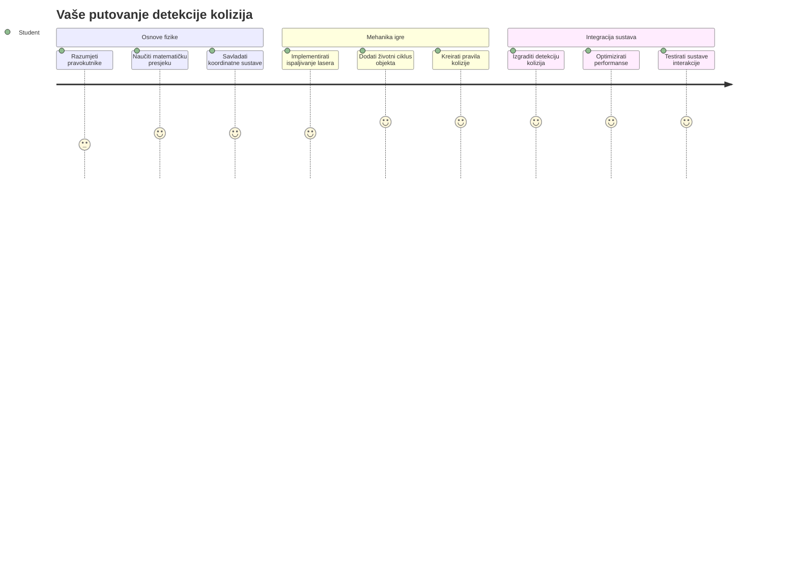
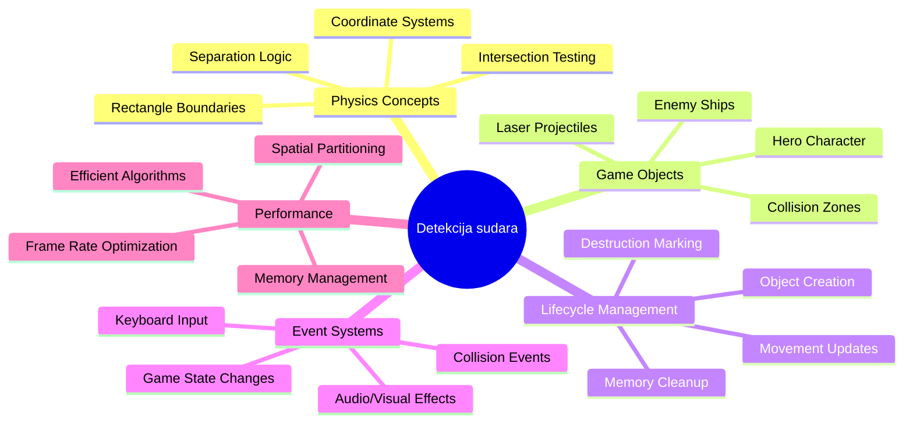
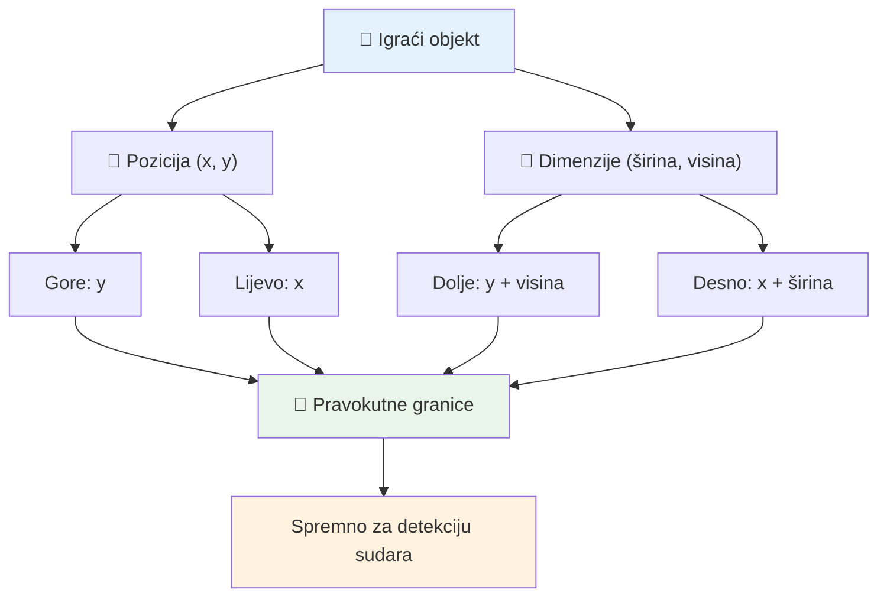
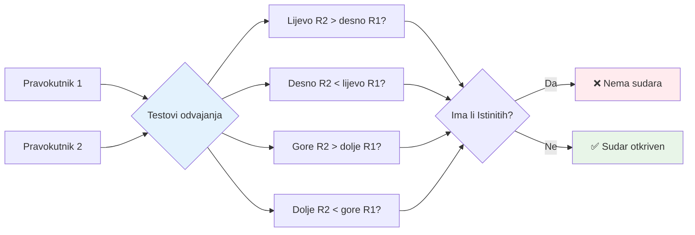
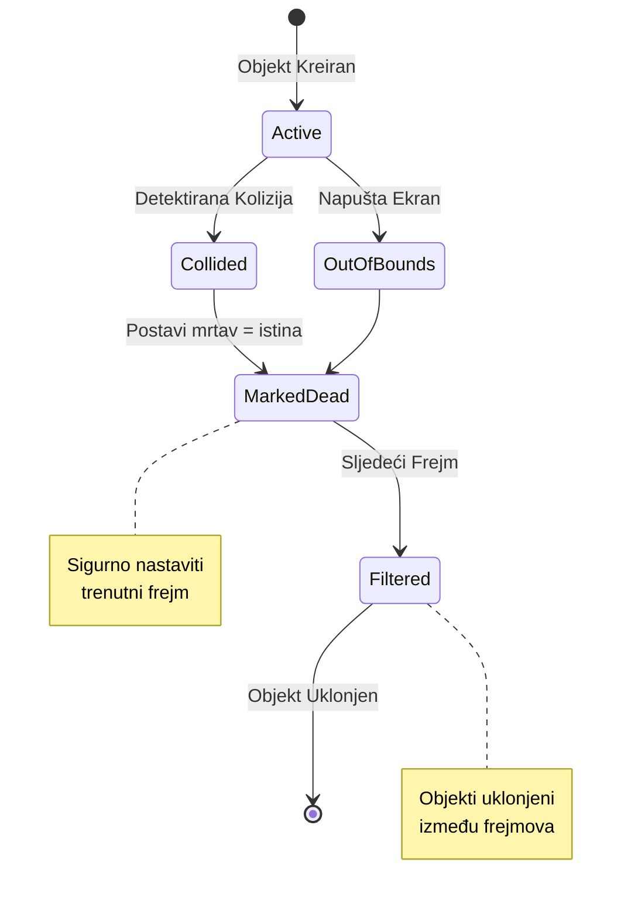
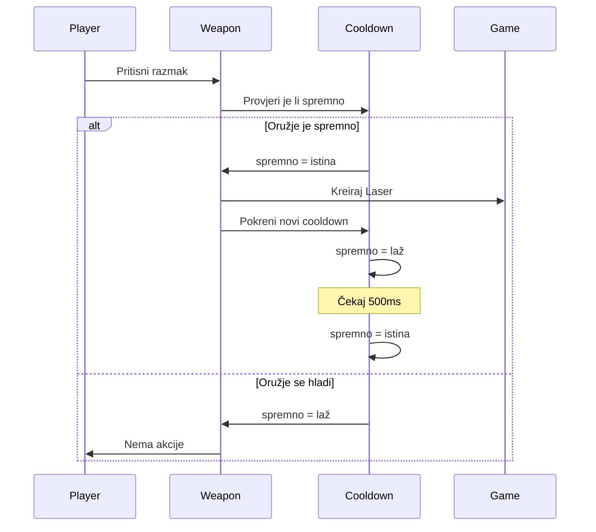
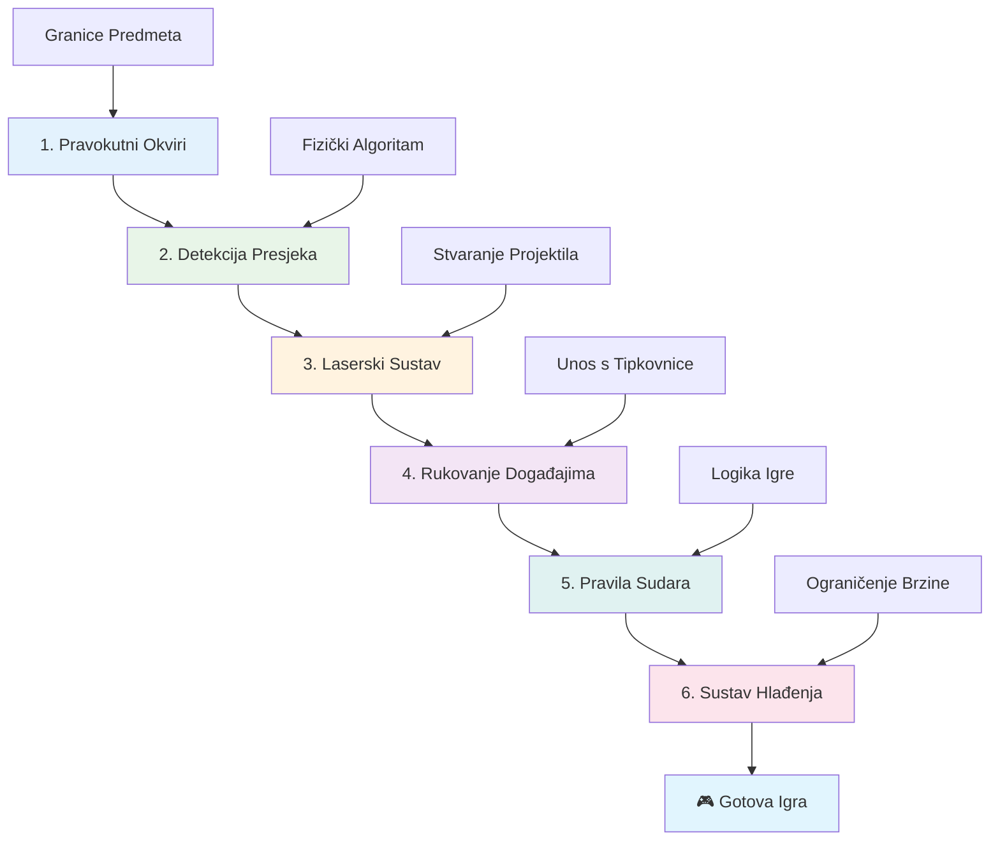
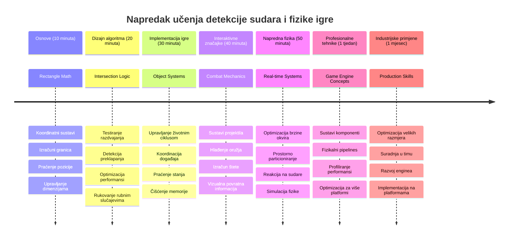

# Izgradnja svemirske igre, 4. dio: Dodavanje lasera i detekcija sudara


## Predpredavanje kviz

[Pre-lecture quiz](https://ff-quizzes.netlify.app/web/quiz/35)

Razmislite o trenutku u Ratovima zvijezda kada su Lukine proton torpede pogodile ispušni otvor Zvijezde smrti. Ta precizna detekcija sudara promijenila je sudbinu galaksije! U igrama, detekcija sudara funkcionira na isti način – određuje kada se objekti međusobno dodiruju i što se događa potom.

U ovom ćemo satu dodati lasersko oružje u vašu svemirsku igru i implementirati detekciju sudara. Baš kao što NASA-ini planerovi misija izračunavaju putanje letjelica da izbjegnu svemirski otpad, naučit ćete kako detektirati kada se nešto u igri presijeca. Razbit ćemo to na upravljive korake koji se nadovezuju jedan na drugi.

Na kraju ćete imati funkcionalan borbeni sustav u kojem laseri uništavaju neprijatelje, a sudari pokreću događaje u igri. Isti principi detekcije sudara koriste se u svemu od fizikalnih simulacija do interaktivnih web sučelja.


✅ Istražite malo o prvoj ikad napisanoj računalnoj igri. Koja je bila njezina funkcionalnost?

## Detekcija sudara

Detekcija sudara radi slično kao senzori blizine na Apollo lunarnom modulu – neprestano provjerava udaljenosti i aktivira upozorenja kad objekti dođu preblizu. U igrama ovaj sustav određuje kada se objekti međusobno dodiruju i što treba slijediti.

Pristup koji ćemo koristiti tretira svaki igraći objekt kao pravokutnik, slično kao što sustavi za kontrolu zračnog prometa koriste pojednostavljene geometrijske oblike za praćenje zrakoplova. Ova pravokutna metoda može se činiti osnovnom, ali je računalno učinkovita i dobro radi u većini scenarija igara.

### Predstavljanje pravokutnika

Svaki igraći objekt treba koordinate granica, slično kao što je Mars Pathfinder rover mapirao svoju lokaciju na površini Marsa. Evo kako definiramo te granične koordinate:


```javascript
rectFromGameObject() {
  return {
    top: this.y,
    left: this.x,
    bottom: this.y + this.height,
    right: this.x + this.width
  }
}
```

**Objasnimo ovo:**
- **Gornja ivica**: To je samo mjesto gdje objekt počinje okomito (njegov y položaj)
- **Lijeva ivica**: Gdje počinje vodoravno (njegov x položaj)
- **Donja ivica**: Dodajte visinu na y položaj – sada znate gdje završava!
- **Desna ivica**: Dodajte širinu na x položaj – i imate kompletne granice

### Algoritam za presjek

Detekcija presjeka pravokutnika koristi logiku sličnu onoj kojom svemirski teleskop Hubble utvrđuje preklapanje nebeskih objekata u svom vidnom polju. Algoritam provjerava odvajanje:


```javascript
function intersectRect(r1, r2) {
  return !(r2.left > r1.right ||
    r2.right < r1.left ||
    r2.top > r1.bottom ||
    r2.bottom < r1.top);
}
```

**Test odvajanja radi kao radarski sustavi:**
- Je li pravokutnik 2 potpuno desno od pravokutnika 1?
- Je li pravokutnik 2 potpuno lijevo od pravokutnika 1?
- Je li pravokutnik 2 potpuno ispod pravokutnika 1?
- Je li pravokutnik 2 potpuno iznad pravokutnika 1?

Ako nijedan od ovih uvjeta nije istinit, pravokutnici se moraju preklapati. Ovaj pristup nalikuje načinu na koji radarski operateri određuju jesu li dva zrakoplova na sigurnoj udaljenosti.

## Upravljanje životnim ciklusom objekata

Kad laser pogodi neprijatelja, oba objekta moraju biti uklonjena iz igre. Međutim, brisanje objekata tijekom petlje može uzrokovati rušenje – lekcija naučena na teži način u ranim računalnim sustavima poput Apollo Guidance Computera. Umjesto toga, koristimo pristup "označi za brisanje" koji sigurno uklanja objekte između frejmova.


Evo kako nešto označimo za uklanjanje:

```javascript
// Označi objekt za uklanjanje
enemy.dead = true;
```

**Zašto ovaj pristup funkcionira:**
- Označavamo objekt kao "mrtav", ali ga ne brišemo odmah
- To dozvoljava trenutnom frejmu igre da se sigurno završi
- Ne dolazi do rušenja uzrokovanih korištenjem nepostojećih objekata!

Zatim filtrirajte označene objekte prije sljedećeg ciklusa prikaza:

```javascript
gameObjects = gameObjects.filter(go => !go.dead);
```

**Što radi ovo filtriranje:**
- Stvara novi popis samo s "živim" objektima
- Izbacuje sve označene kao mrtve
- Održava igru glatkom
- Sprječava gomilanje uništenih objekata i time preopterećenje memorije

## Implementacija laserskih mehanika

Laserski projektili u igrama funkcioniraju na isti način kao fotonska torpeda u Zvjezdanim stazama – to su odvojeni objekti koji putuju ravnim linijama dok ne udare u nešto. Svaki pritisak tipke razmaka stvara novi laserski objekt koji se kreće preko zaslona.

Da bi to funkcioniralo, moramo koordinirati nekoliko različitih dijelova:

**Ključne komponente za implementaciju:**
- **Kreirati** laserske objekte koji se pojavljuju sa položaja heroja
- **Obraditi** unos s tipkovnice za pokretanje stvaranja lasera
- **Upravljati** kretanjem i životnim ciklusom lasera
- **Implementirati** vizualni prikaz laserskih projektila

## Implementacija kontrole brzine paljbe

Neograničena brzina paljbe preopteretila bi motor igre i učinila igranje previše laganim. Realni sustavi oružja imaju slična ograničenja – čak su i fazeri USS Enterprise morali imati vrijeme za ponovno punjenje između pucnjeva.

Implementirat ćemo sustav hlađenja (cooldown) koji sprječava brzo i masovno pucanje, a istovremeno održava responzivne kontrole:


```javascript
class Cooldown {
  constructor(time) {
    this.cool = false;
    setTimeout(() => {
      this.cool = true;
    }, time);
  }
}

class Weapon {
  constructor() {
    this.cooldown = null;
  }
  
  fire() {
    if (!this.cooldown || this.cooldown.cool) {
      // Stvori laserski projektil
      this.cooldown = new Cooldown(500);
    } else {
      // Oružje se još hladi
    }
  }
}
```

**Kako cooldown funkcionira:**
- Kad se stvori, oružje je "vruće" (još ne može pucati)
- Nakon isteka vremena, ono postaje "hladno" (spremno za paljbu)
- Prije pucanja provjeravamo: "Je li oružje hladno?"
- Ovo sprječava spamiranje tipke, a kontrolama omogućuje brz odgovor

✅ Podsjetite se na lekciju 1 u seriji svemirskih igara o cooldown sustavima.

## Izgradnja sustava detekcije sudara

Proširit ćete postojeći kod svemirske igre za stvaranje sustava detekcije sudara. Poput automatiziranog sustava za izbjegavanje sudara na Međunarodnoj svemirskoj postaji, vaša će igra stalno nadzirati položaje objekata i reagirati na njihove presjeke.

Počevši od koda iz prethodne lekcije, dodati ćete detekciju sudara s pravilima koja određuju interakcije objekata.

> 💡 **Savjet za profesionalce**: Sprite lasera već je uključen u vašu mapu resursa i referenciran u kodu, spreman za korištenje.

### Pravila sudara za implementirati

**Mehanike igre za dodati:**
1. **Laser pogodi neprijatelja**: neprijateljski objekt se uništava kad ga pogodi laserski projektil
2. **Laser dotakne granicu zaslona**: laser se uklanja kad dosegne gornju ivicu zaslona
3. **Sudaranje neprijatelja i heroja**: oba objekta uništavaju se kad se dodirnu
4. **Neprijatelj dosegne dno**: uvjet za kraj igre kad neprijatelji stignu do dna zaslona

### 🔄 **Pedagoški pregled**
**Osnove detekcije sudara**: Prije implementacije, provjerite razumijevanje:
- ✅ Kako pravokutne granice definiraju zone sudara
- ✅ Zašto je testiranje za razdvojenost učinkovitije od izračuna presjeka
- ✅ Važnost upravljanja životnim ciklusom objekata u petljama igre
- ✅ Kako sustavi vođeni događajima koordiniraju reakcije sudara

**Brzi samoprovjera**: Što bi se dogodilo da odmah brišete objekte umjesto da ih označite?
*Odgovor: Brisanje u sred petlje može uzrokovati rušenje ili preskakanje objekata tijekom iteracije*

**Razumijevanje fizike**: Sad poznajete:
- **Sustave koordinata**: Kako položaj i dimenzije stvaraju granice
- **Logiku presjeka**: Matematičke principe iza detekcije sudara
- **Optimizaciju performansi**: Zašto su učinkoviti algoritmi važni u real-time sustavima
- **Upravljanje memorijom**: Sigurne prakse životnog ciklusa objekata za stabilnost

## Postavljanje razvojne okoline

Dobre vijesti - već smo postavili većinu priprema za vas! Svi vaši resursi igre i osnovna struktura čekaju vas u podmapi `your-work`, spremni za dodavanje cool značajki sudara.

### Struktura projekta

```bash
-| assets
  -| enemyShip.png
  -| player.png
  -| laserRed.png
-| index.html
-| app.js
-| package.json
```

**Razumijevanje strukture datoteka:**
- **Sadrži** sve sprite slike potrebne za igraće objekte
- **Uključuje** glavni HTML dokument i JavaScript aplikacijsku datoteku
- **Nudi** konfiguraciju paketa za lokalni razvojni poslužitelj

### Pokretanje razvojog poslužitelja

Dođite u mapu projekata i pokrenite lokalni poslužitelj:

```bash
cd your-work
npm start
```

**Ova naredba:**
- **Mijenja** direktorij u vašu radnu mapu projekta
- **Pokreće** lokalni HTTP poslužitelj na `http://localhost:5000`
- **Servira** vaše datoteke igre za testiranje i razvoj
- **Omogućuje** živi razvoj s automatskim ponovnim učitavanjem

Otvorite preglednik i idite na `http://localhost:5000` da vidite trenutačno stanje igre s prikazanim herojem i neprijateljima.

### Implementacija korak po korak

Poput sustavnog pristupa NASA-e pri programiranju Voyager svemirskog broda, implementirat ćemo detekciju sudara metodično, gradeći svaki dio jedan po jedan.


#### 1. Dodajte pravokutne granice sudara

Prvo, naučimo naše igraće objekte kako opisati svoje granice. Dodajte ovu metodu u svoju `GameObject` klasu:

```javascript
rectFromGameObject() {
    return {
      top: this.y,
      left: this.x,
      bottom: this.y + this.height,
      right: this.x + this.width,
    };
  }
```

**Ova metoda radi sljedeće:**
- **Stvara** pravokutni objekt s preciznim koordinatama granica
- **Računa** donju i desnu ivicu koristeći položaj i dimenzije
- **Vraća** objekt spreman za algoritme detekcije sudara
- **Pruža** standardizirani sučelje za sve igraće objekte

#### 2. Implementirajte detekciju presjeka

Sada stvorimo našeg detektiva sudara - funkciju koja može utvrditi kad se dva pravokutnika preklapaju:

```javascript
function intersectRect(r1, r2) {
  return !(
    r2.left > r1.right ||
    r2.right < r1.left ||
    r2.top > r1.bottom ||
    r2.bottom < r1.top
  );
}
```

**Ovaj algoritam radi tako da:**
- **Testira** četiri uvjeta razdvojenosti između pravokutnika
- **Vraća** `false` ako je bilo koji uvjet razdvojenosti istinit
- **Indicira** sudar kad nema razdvojenosti
- **Koristi** logiku negacije radi učinkovite provjere presjeka

#### 3. Implementirajte laserski sustav pucanja

Sad stvari postaju uzbudljive! Postavimo laserski sustav pucanja.

##### Konstante poruka

Prvo definirajmo neke tipove poruka kako različiti dijelovi igre mogu međusobno komunicirati:

```javascript
KEY_EVENT_SPACE: "KEY_EVENT_SPACE",
COLLISION_ENEMY_LASER: "COLLISION_ENEMY_LASER",
COLLISION_ENEMY_HERO: "COLLISION_ENEMY_HERO",
```

**Ove konstante pružaju:**
- **Standardiziraju** nazive događaja kroz cijelu aplikaciju
- **Omogućuju** dosljednu komunikaciju između sustava igre
- **Sprječavaju** tipfelere pri registraciji događajnih rukovatelja

##### Obrada unosa tipkovnice

Dodajte detekciju tipke razmaka u slušatelj tipki:

```javascript
} else if(evt.keyCode === 32) {
  eventEmitter.emit(Messages.KEY_EVENT_SPACE);
}
```

**Ovaj rukovatelj unosa:**
- **Detektira** pritiske razmaka koristeći keyCode 32
- **Emitira** standardiziranu poruku događaja
- **Omogućuje** odvojenu logiku pucanja

##### Postavljanje slušatelja događaja

Registrirajte ponašanje pucanja u funkciji `initGame()`:

```javascript
eventEmitter.on(Messages.KEY_EVENT_SPACE, () => {
 if (hero.canFire()) {
   hero.fire();
 }
});
```

**Ovaj slušatelj događaja:**
- **Reagira** na evente tipke razmaka
- **Provjerava** status cooldowna za pucanje
- **Pokreće** stvaranje lasera kad je dozvoljeno

Dodajte obradu sudara za interakcije laser-neprijatelj:

```javascript
eventEmitter.on(Messages.COLLISION_ENEMY_LASER, (_, { first, second }) => {
  first.dead = true;
  second.dead = true;
});
```

**Ovaj rukovatelj sudara:**
- **Prima** podatke o sudaru s oba objekta
- **Označava** oba objekta za uklanjanje
- **Osigurava** pravilno čišćenje nakon sudara

#### 4. Kreirajte Laser klasu

Implementirajte laserski projektil koji se kreće prema gore i sam upravlja svojim životnim ciklusom:

```javascript
class Laser extends GameObject {
  constructor(x, y) {
    super(x, y);
    this.width = 9;
    this.height = 33;
    this.type = 'Laser';
    this.img = laserImg;
    
    let id = setInterval(() => {
      if (this.y > 0) {
        this.y -= 15;
      } else {
        this.dead = true;
        clearInterval(id);
      }
    }, 100);
  }
}
```

**Ova implementacija klase:**
- **Nasljeđuje** GameObject za osnovnu funkcionalnost
- **Postavlja** odgovarajuće dimenzije za laserski sprite
- **Stvara** automatski pokret prema gore koristeći `setInterval()`
- **Brine se** za samouništenje kad dosegne vrh zaslona
- **Upravlja** vlastitim tempom animacije i čišćenjem

#### 5. Implementirajte sustav detekcije sudara

Kreirajte sveobuhvatnu funkciju za detekciju sudara:

```javascript
function updateGameObjects() {
  const enemies = gameObjects.filter(go => go.type === 'Enemy');
  const lasers = gameObjects.filter(go => go.type === "Laser");
  
  // Testiraj sudare lasera i neprijatelja
  lasers.forEach((laser) => {
    enemies.forEach((enemy) => {
      if (intersectRect(laser.rectFromGameObject(), enemy.rectFromGameObject())) {
        eventEmitter.emit(Messages.COLLISION_ENEMY_LASER, {
          first: laser,
          second: enemy,
        });
      }
    });
  });

  // Ukloni uništene objekte
  gameObjects = gameObjects.filter(go => !go.dead);
}
```

**Ovaj sustav sudara:**
- **Filtrira** igraće objekte po tipu radi učinkovitog testiranja
- **Testira** svaki laser protiv svakog neprijatelja na presjek
- **Emitira** evente sudara kad se detektiraju presjeci
- **Čisti** uništene objekte nakon obrade sudara

> ⚠️ **Važno**: Dodajte `updateGameObjects()` u glavnu petlju igre u `window.onload` da omogućite detekciju sudara.

#### 6. Dodajte cooldown sustav u Hero klasu

Unaprijedite Hero klasu s mehanikom paljbe i ograničenjem brzine:

```javascript
class Hero extends GameObject {
  constructor(x, y) {
    super(x, y);
    this.width = 99;
    this.height = 75;
    this.type = "Hero";
    this.speed = { x: 0, y: 0 };
    this.cooldown = 0;
  }
  
  fire() {
    gameObjects.push(new Laser(this.x + 45, this.y - 10));
    this.cooldown = 500;

    let id = setInterval(() => {
      if (this.cooldown > 0) {
        this.cooldown -= 100;
      } else {
        clearInterval(id);
      }
    }, 200);
  }
  
  canFire() {
    return this.cooldown === 0;
  }
}
```

**Razumijevanje proširene Hero klase:**
- **Inicijalizira** timer cooldowna na nulu (spremno za paljbu)
- **Kreira** laserske objekte pozicionirane iznad broda heroja
- **Postavlja** cooldown period za sprječavanje brzog pucanja
- **Smanjuje** timer cooldowna intervalnim ažuriranjima
- **Omogućuje** provjeru može li se pucati metodom `canFire()`

### 🔄 **Pedagoški pregled**
**Potpuno razumijevanje sustava**: Provjerite svoje znanje o sustavu sudara:
- ✅ Kako pravokutne granice omogućuju učinkovitu detekciju sudara?
- ✅ Zašto je upravljanje životnim ciklusom objekata ključno za stabilnost igre?
- ✅ Kako cooldown sustav sprječava probleme s performansama?
- ✅ Koju ulogu ima arhitektura vođena događajima u obradi sudara?

**Integracija sustava**: Vaša detekcija sudara pokazuje:
- **Matematičku preciznost**: Algoritmi presjeka pravokutnika
- **Optimizaciju performansi**: Učinkovite sheme testiranja sudara
- **Upravljanje memorijom**: Sigurnu kreaciju i uništenje objekata
- **Koordinaciju događaja**: Odvojenu komunikaciju sustava
- **Obradu u stvarnom vremenu**: Ažuriranje u okvirima frejmova

**Profesionalni obrasci**: Implementirali ste:
- **Razdvajanje odgovornosti**: Fizika, prikaz i unos odvojeni
- **Objektno orijentirani dizajn**: Nasljeđivanje i polimorfizam
- **Upravljanje stanjem**: Kontrola životnog ciklusa objekata i stanja igre
- **Optimizaciju performansi**: Učinkovite metode za real-time upotrebu

### Testiranje implementacije

Vaša svemirska igra sad ima kompletan sustav detekcije sudara i borbene mehanike. 🚀 Testirajte nove mogućnosti:
- **Pokrećite se** strelicama da provjerite kontrole kretanja
- **Pucajte laserskim tipkom razmaka** – primijetite kako cooldown sprječava spamiranje
- **Promatrajte sudare** kad laseri pogode neprijatelje, pokrećući njihovo uklanjanje
- **Provjerite čišćenje** kad uništeni objekti nestanu iz igre

Uspješno ste implementirali sustav detekcije sudara koristeći iste matematičke principe koji upravljaju navigacijom svemirskih letjelica i robotikom.

### ⚡ **Što možete napraviti u sljedećih 5 minuta**
- [ ] Otvorite DevTools u pregledniku i postavite prekidne točke u funkciji detekcije sudara
- [ ] Isprobajte promjenu brzine lasera ili kretanja neprijatelja i pratite učinak sudara
- [ ] Eksperimentirajte s različitim vrijednostima cooldowna da testirate brzinu paljbe
- [ ] Dodajte `console.log` izjave za praćenje sudara u stvarnom vremenu

### 🎯 **Što možete postići u ovom satu**
- [ ] Završiti kviz poslije lekcije i razumjeti algoritme za detekciju sudara
- [ ] Dodati vizualne efekte poput eksplozija kada dođe do sudara
- [ ] Implementirati različite vrste projektila s različitim svojstvima
- [ ] Kreirati power-upove koji privremeno poboljšavaju sposobnosti igrača
- [ ] Dodati zvučne efekte za zadovoljavajuće sudare

### 📅 **Vaš tjedan programiranja fizike**
- [ ] Završiti kompletnu svemirsku igru s dotjeranim sustavima sudara
- [ ] Implementirati napredne oblike sudara izvan pravokutnika (krugovi, poligoni)
- [ ] Dodati sustave čestica za realistične efekte eksplozija
- [ ] Kreirati složeno ponašanje neprijatelja s izbjegavanjem sudara
- [ ] Optimizirati detekciju sudara za bolje performanse s mnogo objekata
- [ ] Dodati fiziku simulaciju poput zamaha i realističnog kretanja

### 🌟 **Vaša mjesečna majstorija fizike igre**
- [ ] Izgraditi igre s naprednim fizikalnim motorima i realističnim simulacijama
- [ ] Naučiti 3D detekciju sudara i algoritme za prostornu podjelu
- [ ] Doprinijeti otvorenim izvorima fizikalnih biblioteka i game engine-a
- [ ] Savladati optimizaciju performansi za grafički zahtjevne aplikacije
- [ ] Kreirati edukativne sadržaje o fizici igre i detekciji sudara
- [ ] Izgraditi portfolio koji pokazuje napredne vještine programiranja fizike

## 🎯 Vaš vremenski okvir za savladavanje detekcije sudara


### 🛠️ Sažetak vašeg alata za fiziku igara

Nakon dovršetka ove lekcije, sada ste savladali:
- **Matematiku sudara**: Algoritme presjeka pravokutnika i koordinatne sustave
- **Optimizaciju performansi**: Učinkovitu detekciju sudara u stvarnom vremenu
- **Upravljanje životnim ciklusom objekata**: Sigurne obrasce stvaranja, ažuriranja i uništavanja
- **Arhitekturu vođenu događajima**: Odvojene sustave za reakciju na sudare
- **Integraciju u game loop**: Ažuriranja fizike i koordinaciju renderiranja po frejmu
- **Sisteme unosa**: Odzivne kontrole s ograničenjem brzine i povratnom informacijom
- **Upravljanje memorijom**: Učinkovite strategije poolinga i čišćenja objekata

**Primjena u stvarnom svijetu**: Vaše vještine detekcije sudara primjenjuju se izravno na:
- **Interaktivne simulacije**: Znanstveno modeliranje i edukativni alati
- **Dizajn korisničkog sučelja**: Interakcije povlačenja i dodira
- **Vizualizaciju podataka**: Interaktivni grafovi i klikabilni elementi
- **Mobilni razvoj**: Prepoznavanje dodira i rukovanje sudarima
- **Programiranje robotike**: Planiranje putanje i izbjegavanje prepreka
- **Računalnu grafiku**: Praćenje zraka i prostorne algoritme

**Profesionalne stečeno vještine**: Sada možete:
- **Dizajnirati** učinkovite algoritme za detekciju sudara u stvarnom vremenu
- **Implementirati** fizičke sustave koji skaliraju s kompleksnošću objekata
- **Otkloniti greške** u složenim interakcijskim sustavima koristeći matematičke principe
- **Optimizirati** performanse za različiti hardver i mogućnosti preglednika
- **Arhitektirati** održive igre sustave koristeći dokazane dizajnerske obrasce

**Savladani koncepti razvoja igara**:
- **Simulacija fizike**: Detekcija i reakcija na sudare u stvarnom vremenu
- **Inženjering performansi**: Optimizirani algoritmi za interaktivne aplikacije
- **Sustavi događaja**: Odvojena komunikacija između komponenti igre
- **Upravljanje objektima**: Učinkoviti obrasci životnog ciklusa za dinamički sadržaj
- **Rukovanje unosom**: Odgovorne kontrole s odgovarajućim povratom

**Sljedeća razina**: Spremni ste istražiti napredne fizikalne motore poput Matter.js, implementirati 3D detekciju sudara ili izgraditi složene sustave čestica!

🌟 **Postignuće otključano**: Izgradili ste kompletan sustav interakcije baziran na fizici s profesionalnom detekcijom sudara!

## Izazov GitHub Copilot Agenta 🚀

Iskoristite Agent mod za dovršetak sljedećeg izazova:

**Opis:** Poboljšajte sustav detekcije sudara implementirajući power-upove koji se nasumično pojavljuju i pružaju privremene sposobnosti kada ih prikupi herojski brod.

**Zadatak:** Kreirajte klasu PowerUp koja nasljeđuje GameObject i implementirajte detekciju sudara između heroja i power-upova. Dodajte najmanje dvije vrste power-upova: jedan koji povećava brzinu paljbe (smanjuje cooldown) i drugi koji stvara privremeni štit. Uključite logiku pojavljivanja koja kreira power-upove u nasumičnim intervalima i pozicijama.

---


## 🚀 Izazov

Dodajte eksploziju! Pogledajte zalihe igre u [the Space Art repo](../../../../6-space-game/solution/spaceArt/readme.txt) i pokušajte dodati eksploziju kada laser pogodi izvanzemaljca

## Kviz poslije predavanja

[Post-lecture quiz](https://ff-quizzes.netlify.app/web/quiz/36)

## Pregled i samostalno učenje

Eksperimentirajte s intervalima u vašoj igri do sada. Što se događa kada ih promijenite? Pročitajte više o [JavaScript timing events](https://www.freecodecamp.org/news/javascript-timing-events-settimeout-and-setinterval/).

## Zadatak

[Istražite sudare](assignment.md)

---

<!-- CO-OP TRANSLATOR DISCLAIMER START -->
**Odricanje od odgovornosti**:
Ovaj dokument je preveden pomoću AI usluge za prevođenje [Co-op Translator](https://github.com/Azure/co-op-translator). Iako težimo točnosti, imajte na umu da automatski prijevodi mogu sadržavati pogreške ili netočnosti. Izvorni dokument na njegovom izvornom jeziku treba se smatrati službenim izvorom. Za kritične informacije preporučuje se profesionalni ljudski prijevod. Ne snosimo odgovornost za bilo kakva nesporazuma ili kriva tumačenja proizašla iz korištenja ovog prijevoda.
<!-- CO-OP TRANSLATOR DISCLAIMER END -->