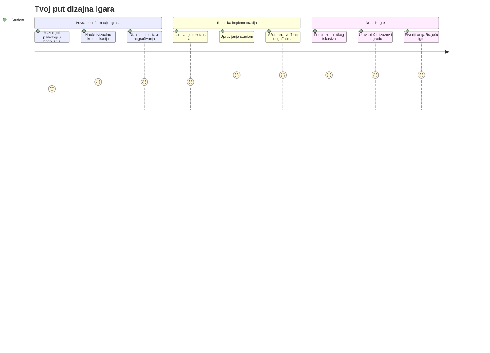
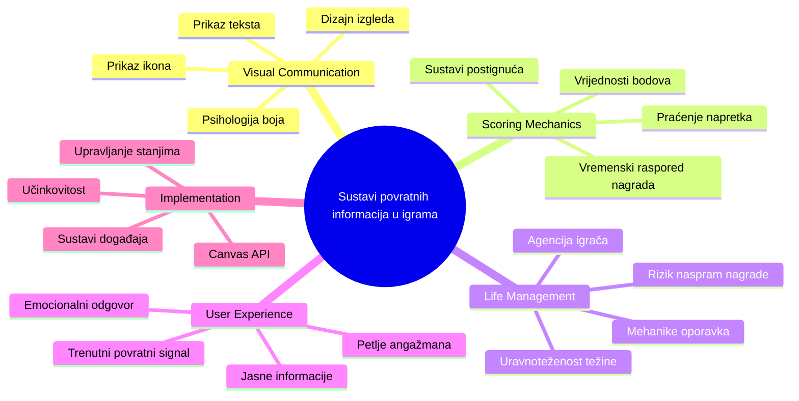
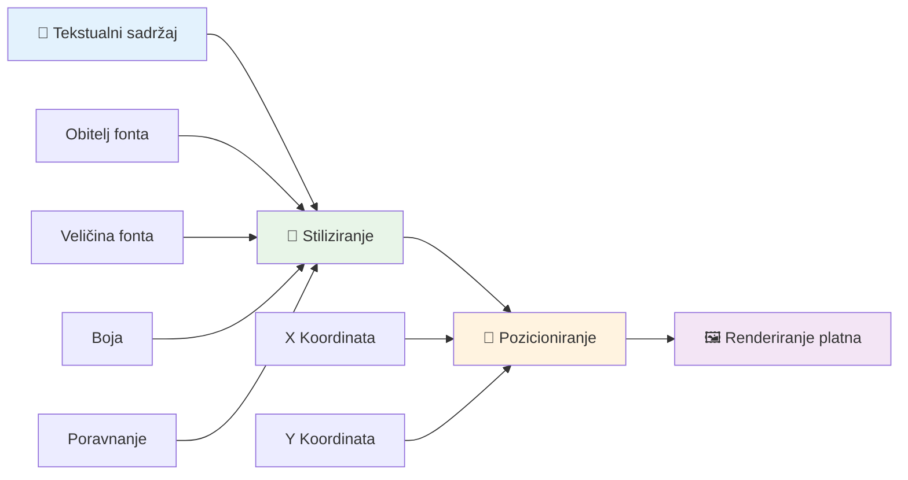
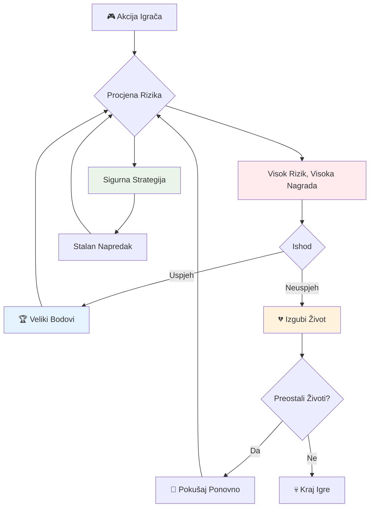
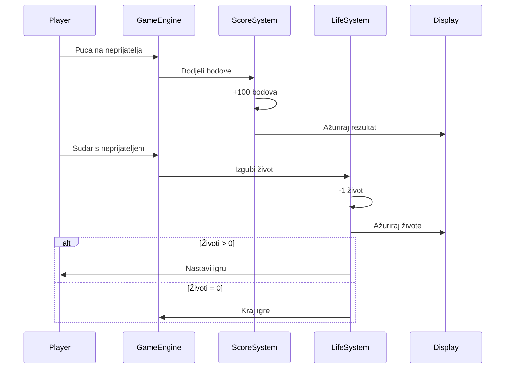
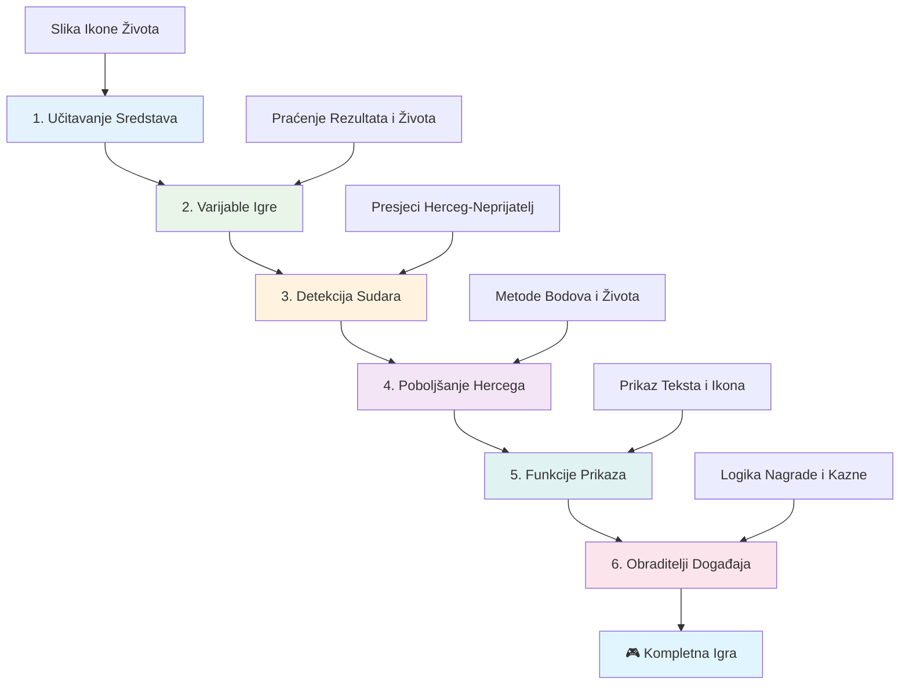
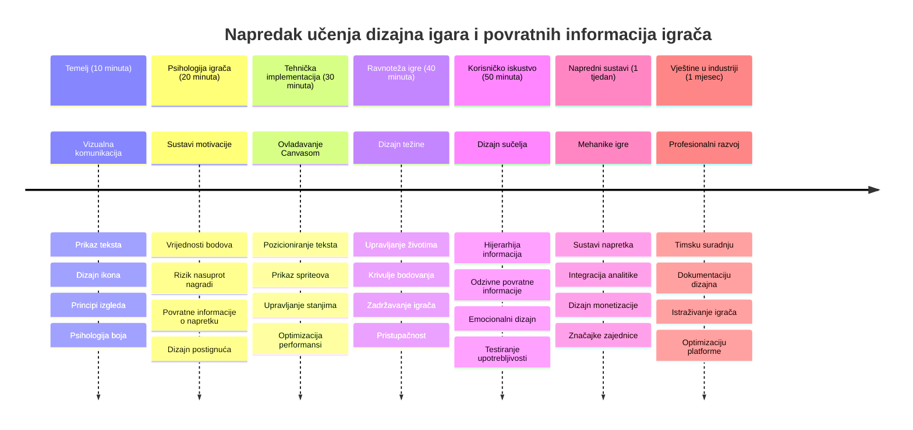

<!--
CO_OP_TRANSLATOR_METADATA:
{
  "original_hash": "2ed9145a16cf576faa2a973dff84d099",
  "translation_date": "2026-01-07T09:05:19+00:00",
  "source_file": "6-space-game/5-keeping-score/README.md",
  "language_code": "hr"
}
-->
# Izrada igre u svemiru, dio 5: Bodovanje i životi


## Pred-predavanja kviz

[Pred-predavanja kviz](https://ff-quizzes.netlify.app/web/quiz/37)

Spremni da vašoj igri u svemiru date stvarni osjećaj igre? Dodajmo bodovanje i upravljanje životima - osnovne mehanike koje su prve arkadne igre poput Space Invaders pretvorile iz jednostavnih demonstracija u zaraznu zabavu. Ovo je trenutak kada vaša igra postaje zaista igriva.


## Iscrtavanje teksta na zaslon - glas vaše igre

Za prikaz rezultata, trebamo naučiti kako prikazati tekst na platnu (canvas). Metoda `fillText()` je vaš glavni alat za to - ista tehnika koja se koristila u klasičnim arkadnim igrama za prikaz bodova i statusnih informacija.


Imate potpunu kontrolu nad izgledom teksta:

```javascript
ctx.font = "30px Arial";
ctx.fillStyle = "red";
ctx.textAlign = "right";
ctx.fillText("show this on the screen", 0, 0);
```

✅ Zaronite dublje u [dodavanje teksta na platno](https://developer.mozilla.org/docs/Web/API/Canvas_API/Tutorial/Drawing_text) - možda ćete biti iznenađeni koliko kreativni možete biti s fontovima i stiliziranjem!

## Životi - Više od broja

U dizajnu igara, "život" predstavlja granicu pogreške igrača. Ovaj koncept potječe od pinball automata, gdje ste dobivali više kuglica za igru. U ranijim videoigrama poput Asteroids, životi su igračima davali dozvolu za rizik i učenje iz pogrešaka.


Vizualni prikaz ima veliki značaj - prikazivanje ikona brodova umjesto samo "Životi: 3" stvara trenutnu vizualnu prepoznatljivost, slično kao što su rani arkadni automati koristili ikonografiju za komunikaciju preko jezičnih barijera.

## Izgradnja sustava nagrađivanja vaše igre

Sada ćemo implementirati osnovne sustave povratne informacije koji igrače drže angažiranima:


- **Sustav bodovanja**: Svaki uništeni neprijateljski brod donosi 100 bodova (zaokruženi brojevi lakši su igračima za mentalno računanje). Rezultat se prikazuje u donjem lijevom kutu.
- **Brojač života**: Vaš junak počinje s tri života - standard uspostavljen od ranih arkadnih igara za balansiranje izazova i igrivosti. Svaka kolizija s neprijateljem oduzima jedan život. Preostale živote prikazat ćemo u donjem desnom kutu koristeći ikone brodova .

## Krenimo s izradom!

Prvo postavite svoj radni prostor. Navigirajte do datoteka unutar podmape `your-work`. Trebali biste vidjeti ove datoteke:

```bash
-| assets
  -| enemyShip.png
  -| player.png
  -| laserRed.png
-| index.html
-| app.js
-| package.json
```

Za testiranje vaše igre, pokrenite razvojni server iz mape `your_work`:

```bash
cd your-work
npm start
```

Ovo pokreće lokalni server na `http://localhost:5000`. Otvorite ovu adresu u svojem pregledniku kako biste vidjeli svoju igru. Testirajte kontrole sa strelicama i pokušajte pucati na neprijatelje da provjerite radi li sve.


### Vrijeme za kodiranje!

1. **Preuzmite vizualne resurse koji su vam potrebni**. Kopirajte datoteku `life.png` iz mape `solution/assets/` u svoju mapu `your-work`. Zatim dodajte lifeImg u svoju funkciju window.onload:

    ```javascript
    lifeImg = await loadTexture("assets/life.png");
    ```

1. Ne zaboravite dodati `lifeImg` na svoj popis resursa:

    ```javascript
    let heroImg,
    ...
    lifeImg,
    ...
    eventEmitter = new EventEmitter();
    ```
  
2. **Postavite varijable igre**. Dodajte kod za praćenje ukupnog rezultata (koji počinje od 0) i preostalih života (koji počinju od 3). Prikazat ćemo ih na ekranu kako bi igrači uvijek znali kada su.

3. **Implementirajte detekciju sudara**. Proširite funkciju `updateGameObjects()` da detektira kada neprijatelji udare vašeg junaka:

    ```javascript
    enemies.forEach(enemy => {
        const heroRect = hero.rectFromGameObject();
        if (intersectRect(heroRect, enemy.rectFromGameObject())) {
          eventEmitter.emit(Messages.COLLISION_ENEMY_HERO, { enemy });
        }
      })
    ```

4. **Dodajte praćenje života i bodova vašem junaku**. 
   1. **Inicijalizirajte brojače**. Ispod `this.cooldown = 0` unutar klase `Hero` postavite život i bodove:

        ```javascript
        this.life = 3;
        this.points = 0;
        ```

   1. **Prikažite ove vrijednosti igraču**. Napravite funkcije za iscrtavanje tih vrijednosti na ekranu:

        ```javascript
        function drawLife() {
          // TODO, 35, 27
          const START_POS = canvas.width - 180;
          for(let i=0; i < hero.life; i++ ) {
            ctx.drawImage(
              lifeImg, 
              START_POS + (45 * (i+1) ), 
              canvas.height - 37);
          }
        }
        
        function drawPoints() {
          ctx.font = "30px Arial";
          ctx.fillStyle = "red";
          ctx.textAlign = "left";
          drawText("Points: " + hero.points, 10, canvas.height-20);
        }
        
        function drawText(message, x, y) {
          ctx.fillText(message, x, y);
        }

        ```

   1. **Povežite sve u vašu glavnu petlju igre**. Dodajte ove funkcije u vašu funkciju window.onload odmah nakon `updateGameObjects()`:

        ```javascript
        drawPoints();
        drawLife();
        ```

### 🔄 **Pedagoška provjera**
**Razumijevanje dizajna igre**: Prije implementacije posljedica, pobrinite se da razumijete:
- ✅ Kako vizualna povratna informacija komunicira stanje igre igračima
- ✅ Zašto dosljedni raspored elemenata korisničkog sučelja poboljšava upotrebljivost
- ✅ Psihologiju bodova i upravljanja životima
- ✅ Kako se iscrtavanje teksta na platnu razlikuje od HTML teksta

**Brzi samoprovjera**: Zašto arkadne igre uglavnom koriste zaokružene brojeve za bodovanje?
*Odgovor: Zaokruženi brojevi su lakši igračima za mentalno računanje i stvaraju zadovoljavajuće psihološke nagrade*

**Principi korisničkog iskustva**: Sada primjenjujete:
- **Vizualna hijerarhija**: Važne informacije smještene su istaknuto
- **Trenutna povratna informacija**: Ažuriranja u stvarnom vremenu na akcije igrača
- **Kognitivno opterećenje**: Jednostavna i jasna prezentacija informacija
- **Emocionalni dizajn**: Ikone i boje koje stvaraju vezu s igračem

1. **Implementirajte posljedice i nagrade igre**. Sada ćemo dodati sustave povratne informacije koji čine akcije igrača smislenima:

   1. **Sudari oduzimaju živote**. Svaki put kada vaš junak udari neprijatelja, trebate izgubiti jedan život.
   
      Dodajte ovu metodu u klasu `Hero`:

        ```javascript
        decrementLife() {
          this.life--;
          if (this.life === 0) {
            this.dead = true;
          }
        }
        ```

   2. **Pucanje po neprijateljima donosi bodove**. Svaki uspješan pogodak donosi 100 bodova, što pruža trenutnu pozitivnu povratnu informaciju za precizno gađanje.

      Proširite klasu Hero ovom metodom za povećanje bodova:
    
        ```javascript
          incrementPoints() {
            this.points += 100;
          }
        ```

        Sada povežite ove funkcije s vašim događajima sudara:

        ```javascript
        eventEmitter.on(Messages.COLLISION_ENEMY_LASER, (_, { first, second }) => {
           first.dead = true;
           second.dead = true;
           hero.incrementPoints();
        })

        eventEmitter.on(Messages.COLLISION_ENEMY_HERO, (_, { enemy }) => {
           enemy.dead = true;
           hero.decrementLife();
        });
        ```

✅ Zanima vas koje su druge igre napravljene u JavaScriptu i Canvasu? Istražite malo - mogli biste se iznenaditi što je sve moguće!

Nakon što implementirate ove funkcionalnosti, testirajte svoju igru da vidite kompletan sustav povratne informacije u akciji. Trebali biste vidjeti ikone života u donjem desnom kutu, rezultat u donjem lijevom, i primijetiti kako sudari smanjuju živote, a uspješni hitci povećavaju rezultat.

Vaša igra sada sadrži ključne mehanike koje su ranim arkadnim igrama dale privlačnost - jasne ciljeve, trenutnu povratnu informaciju i značajne posljedice za akcije igrača.

### 🔄 **Pedagoška provjera**
**Kompletan sustav dizajna igara**: Provjerite svoje razumijevanje sustava povratne informacije igrača:
- ✅ Kako mehanike bodovanja stvaraju motivaciju i angažman igrača?
- ✅ Zašto je vizualna dosljednost važna za dizajn korisničkog sučelja?
- ✅ Kako sustav života balansira izazov i zadržavanje igrača?
- ✅ Koju ulogu igra trenutna povratna informacija u stvaranju zadovoljavajuće igrivosti?

**Integracija sustava**: Vaš sustav povratne informacije demonstrira:
- **Dizajn korisničkog iskustva**: Jasnu vizualnu komunikaciju i hijerarhiju informacija
- **Arhitekturu vođenu događajima**: Odgovorne nadogradnje na akcije igrača
- **Upravljanje stanjem**: Praćenje i prikaz dinamičkih podataka igre
- **Majstorstvo platna (Canvas)**: Iscrtavanje teksta i pozicioniranje spriteova
- **Psihologiju igara**: Razumijevanje motivacije i angažmana igrača

**Profesionalni obrasci**: Implementirali ste:
- **MVC arhitekturu**: Odvajanje logike igre, podataka i prikaza
- **Observer šablon**: Ažuriranja vođena događajima za promjene stanja igre
- **Dizajn komponenti**: Ponovno upotrebljive funkcije za prikaz i logiku
- **Optimizaciju performansi**: Efikasno iscrtavanje u petljama igre

### ⚡ **Što možete napraviti u narednih 5 minuta**
- [ ] Eksperimentirajte s različitim veličinama fonta i bojama za prikaz rezultata
- [ ] Pokušajte mijenjati vrijednosti bodova i vidite kako to utječe na osjećaj igre
- [ ] Dodajte console.log izjave za praćenje promjena bodova i života
- [ ] Testirajte granične slučajeve poput potrošnih života ili postizanja visokih rezultata

### 🎯 **Što možete postići ovaj sat**
- [ ] Završiti kviz nakon lekcije i razumjeti psihologiju dizajna igara
- [ ] Dodati zvučne efekte za bodovanje i gubitak života
- [ ] Implementirati sustav visokih rezultata koristeći localStorage
- [ ] Kreirati različite vrijednosti bodova za različite vrste neprijatelja
- [ ] Dodati vizualne efekte poput podrhtavanja ekrana pri gubitku života

### 📅 **Vaše tjedno putovanje kroz dizajn igara**
- [ ] Završiti potpunu svemirsku igru s izbrušenim sustavima povratne informacije
- [ ] Implementirati napredne mehanike bodovanja poput množitelja kombo bodova
- [ ] Dodati postignuća i sadržaj za otključavanje
- [ ] Kreirati sustave za progresiju i balansiranje težine
- [ ] Dizajnirati korisnička sučelja za izbornike i ekrane igre završene
- [ ] Proučiti druge igre da biste razumjeli mehanizme angažmana

### 🌟 **Vaša mjesečna majstorija razvoja igara**
- [ ] Izraditi potpune igre s sofisticiranim sustavima napredovanja
- [ ] Naučiti analitiku igara i mjerenje ponašanja igrača
- [ ] Doprinijeti projektima otvorenog koda za razvoj igara
- [ ] Ovladati naprednim obrascima dizajna igara i monetizacije
- [ ] Kreirati edukativne sadržaje o dizajnu igara i korisničkom iskustvu
- [ ] Izraditi portfelj koji prikazuje vještine dizajna i razvoja igara

## 🎯 Vaš vremenski plan za majstoriju dizajna igara


### 🛠️ Sažetak vašeg alata za dizajn igara

Nakon završetka ove lekcije, sada ste savladali:
- **Psihologiju igrača**: Razumijevanje motivacije, rizika/nagrade i petlji angažmana
- **Vizualnu komunikaciju**: Efektivan dizajn korisničkog sučelja koristeći tekst, ikone i raspored
- **Sustave povratne informacije**: Odgovore u stvarnom vremenu na akcije i događaje igre
- **Upravljanje stanjem**: Praćenje i efikasno prikazivanje dinamičkih podataka igre
- **Iscrtavanje teksta na platnu (Canvas)**: Profesionalni prikaz teksta sa stiliziranjem i pozicioniranjem
- **Integraciju događaja**: Povezivanje korisničkih akcija s značajnim posljedicama u igri
- **Balansiranje igre**: Dizajn težine i sustava napredovanja igrača

**Primjene u stvarnom svijetu**: Vaše vještine dizajna igara primjenjuju se izravno na:
- **Dizajn korisničkog sučelja**: Kreiranje privlačnih i intuitivnih sučelja
- **Razvoj proizvoda**: Razumijevanje motivacije korisnika i povratnih petlji
- **Edukacijsku tehnologiju**: Gamifikaciju i sustave angažmana u učenju
- **Vizualizaciju podataka**: Provođenje složenih informacija na pristupačan i angažirajući način
- **Razvoj mobilnih aplikacija**: Mehanike zadržavanja i dizajn korisničkog iskustva
- **Marketinšku tehnologiju**: Razumijevanje ponašanja korisnika i optimizaciju konverzija

**Profesionalne vještine koje ste stekli**: Sada možete:
- **Dizajnirati** korisnička iskustva koja motiviraju i angažiraju korisnike
- **Implementirati** sustave povratne informacije koji efikasno usmjeravaju ponašanje korisnika
- **Balansirati** izazov i pristupačnost u interaktivnim sustavima
- **Kreirati** vizualnu komunikaciju koja funkcionira za različite skupine korisnika
- **Analizirati** ponašanje korisnika i iterirati na poboljšanjima dizajna

**Koncepti razvoja igara koje ste savladali**:
- **Motivacija igrača**: Razumijevanje što pokreće angažman i zadržavanje
- **Vizualni dizajn**: Kreiranje jasnih, atraktivnih i funkcionalnih sučelja
- **Integracija sustava**: Povezivanje više sustava igre u skladno iskustvo
- **Optimizacija performansi**: Efikasno iscrtavanje i upravljanje stanjem
- **Pristupačnost**: Dizajn za različite razine vještina i potrebe igrača

**Sljedeći korak**: Spremni ste istražiti napredne obrasce dizajna igara, implementirati analitičke sustave ili proučiti monetizaciju i strategije zadržavanja igrača!

🌟 **Postignuće otključano**: Izgradili ste kompletan sustav povratne informacije igrača s profesionalnim principima dizajna igara!

---

## GitHub Copilot Agent Challenge 🚀

Upotrijebite Agent način rada da dovršite sljedeći izazov:

**Opis:** Unaprijedite sustav bodovanja svemirske igre implementacijom sustava najboljeg rezultata s trajnim spremanjem i bonusnim bodovima.

**Zadatak:** Kreirajte sustav visokih rezultata koji sprema najbolji rezultat igrača u localStorage. Dodajte bonus bodove za više uzastopnih ubijenih neprijatelja (kombo sustav) i implementirajte različite vrijednosti bodova za različite vrste neprijatelja. Uključite vizualni indikator kada igrač postigne novi najbolji rezultat i prikažite trenutni najbolji rezultat na zaslonu igre.

## 🚀 Izazov

Sada imate funkcionalnu igru s bodovanjem i životima. Razmislite koje dodatne značajke bi mogle poboljšati iskustvo igrača.

## Kviz nakon predavanja

[Kviz nakon predavanja](https://ff-quizzes.netlify.app/web/quiz/38)

## Pregled i samostalno učenje

Želite li istražiti više? Istražite različite pristupe bodovanju i sustavima života u igrama. Postoje fascinantni igraći engine-i poput [PlayFab](https://playfab.com) koji upravljaju bodovanjem, ljestvicama i napredovanjem igrača. Kako bi integracija takvog sustava mogla podići vašu igru na višu razinu?

## Zadatak

[Izradite igru s bodovanjem](assignment.md)

---

<!-- CO-OP TRANSLATOR DISCLAIMER START -->
**Odricanje od odgovornosti**:
Ovaj dokument je preveden pomoću AI prijevodnog servisa [Co-op Translator](https://github.com/Azure/co-op-translator). Iako nastojimo osigurati točnost, imajte na umu da automatski prijevodi mogu sadržavati pogreške ili netočnosti. Izvorni dokument na izvornom jeziku treba smatrati službenim i autoritativnim izvorom. Za kritične informacije preporučujemo profesionalni ljudski prijevod. Nismo odgovorni za bilo kakve nesporazume ili pogrešna tumačenja koja proizlaze iz korištenja ovog prijevoda.
<!-- CO-OP TRANSLATOR DISCLAIMER END -->