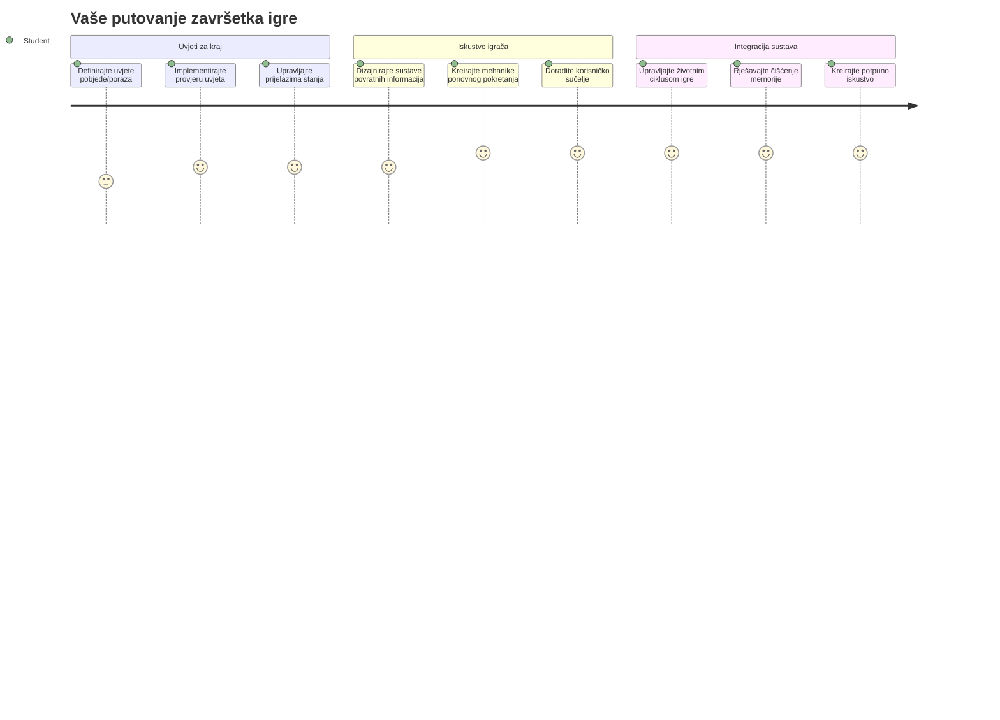
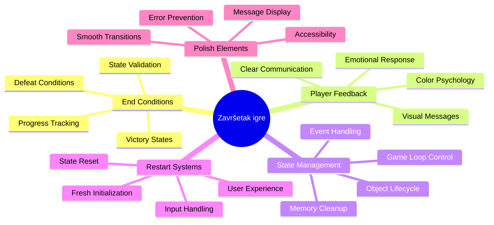
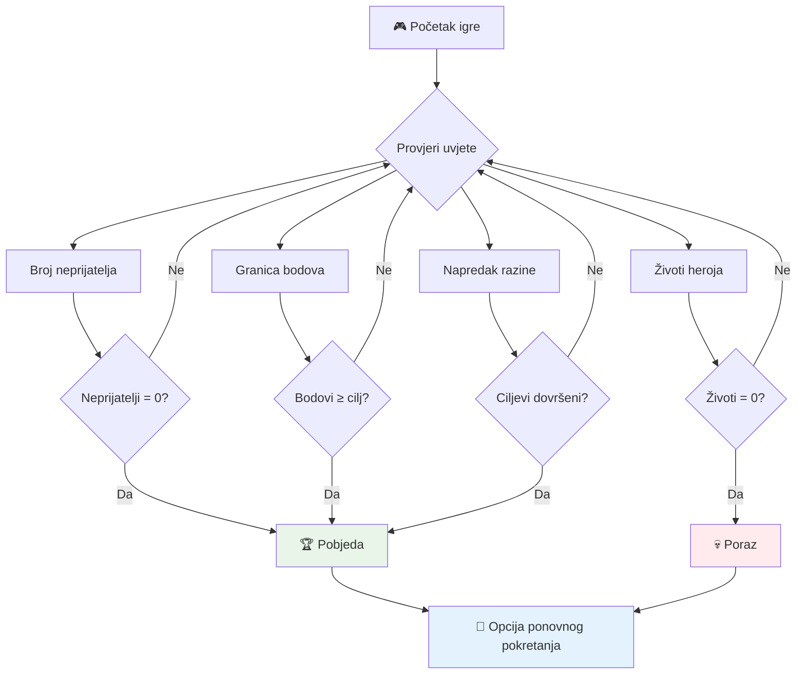
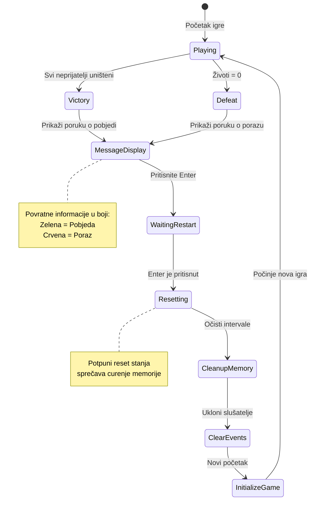
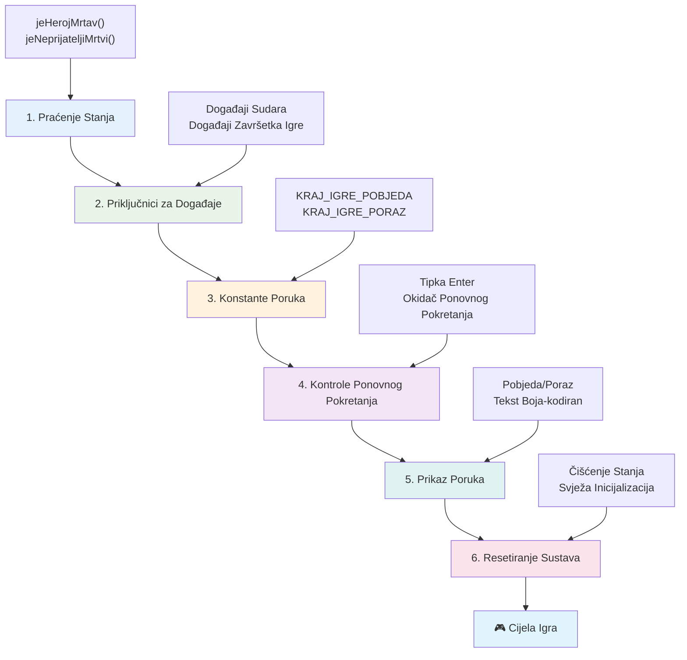
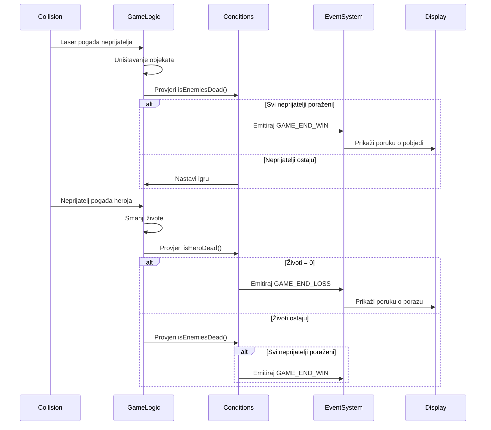
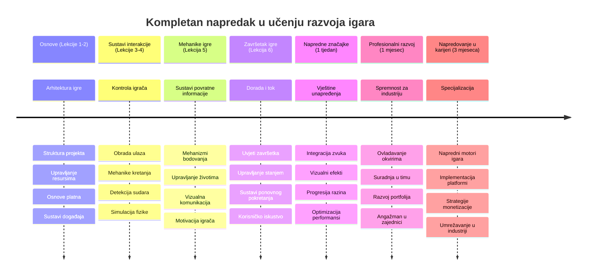

# Izgradite svemirsku igru, dio 6: Kraj i ponovno pokretanje


Svaka izvrsna igra treba jasne uvjete završetka i glatki mehanizam ponovnog pokretanja. Izgradili ste impresivnu svemirsku igru s kretanjem, borbom i bodovanjem - sada je vrijeme da dodate završne dijelove koji je čine potpunom.

Vaša igra trenutno traje beskonačno, poput svemirskih sondi Voyager koje je NASA lansirala 1977. - i dalje putuju kroz svemir desetljećima kasnije. Iako je to u redu za istraživanje svemira, igre trebaju definirane točke završetka kako bi se stvorila zadovoljavajuća iskustva.

Danas ćemo implementirati pravilne uvjete pobjede/poraza i sustav ponovnog pokretanja. Do kraja ovog lekcije imat ćete dotjeranu igru koju igrači mogu završiti i ponovno igrati, baš kao klasične arkadne igre koje su definirale ovaj medij.


## Pred-lecture kviz

[Pred-lecture kviz](https://ff-quizzes.netlify.app/web/quiz/39)

## Razumijevanje uvjeta završetka igre

Kada bi vaša igra trebala završiti? Ovo temeljno pitanje oblikovalo je dizajn igara od ranih dana arkada. Pac-Man završava kad vas uhvate duhovi ili očistite sve točkice, dok Space Invaders završava kad izvanzemaljci stignu do dna ili ih sve uništite.

Kao tvorac igre, vi definirate uvjete pobjede i poraza. Za našu svemirsku igru, evo provjerenih pristupa koji stvaraju zanimljivu igru:


- **Uništeno je `N` neprijateljskih brodova**: Vrlo je uobičajeno da ako igru podijelite u različite razine, morate uništiti `N` neprijateljskih brodova da biste dovršili razinu
- **Vaš je brod uništen**: Postoje igre u kojima gubite ako vam brod bude uništen. Drugi čest pristup je da imate koncept života. Svaki put kad vam brod bude uništen, gubite jedan život. Kad svi životi nestanu, gubite igru.
- **Sakupili ste `N` bodova**: Još jedan čest uvjet završetka je prikupljanje bodova. Kako dobijate bodove ovisi o vama, ali česta je praksa da se bodovi dodjeljuju za različite aktivnosti poput uništavanja neprijateljskog broda ili skupljanja predmeta koje objekti *ispuste* nakon što su uništeni.
- **Dovršili ste razinu**: To može uključivati nekoliko uvjeta kao što su uništenih `X` neprijateljskih brodova, prikupljenih `Y` bodova ili skupljanje određenog predmeta.

## Implementacija funkcionalnosti ponovnog pokretanja igre

Dobre igre potiču ponovnu igrivost kroz glatke mehanizme ponovnog pokretanja. Kad igrači završe igru (ili izgube), često žele odmah pokušati ponovno - bilo da bi pobijedili svoj rezultat ili poboljšali izvedbu.


Tetris to savršeno ilustrira: kad vaši blokovi dosegnu vrh, možete odmah započeti novu igru bez navigacije složenim izbornicima. Izgradit ćemo sličan sustav ponovnog pokretanja koji čisto resetira stanje igre i brzo vraća igrače u akciju.

✅ **Razmišljanje**: Razmislite o igrama koje ste igrali. Koji je njihov uvjet završetka i kako ste potaknuti na ponovno pokretanje? Što čini da iskustvo ponovnog pokretanja djeluje glatko, a što frustrirajuće?

## Što ćete izgraditi

Implementirat ćete završne značajke koje vaš projekt čine potpunim igračkim doživljajem. Ti elementi razlikuju dotjerane igre od osnovnih prototipova.

**Evo što danas dodajemo:**

1. **Uvjet pobjede**: Uništite sve neprijatelje i dobijte prikladnu proslavu (zaslužili ste ju!)
2. **Uvjet poraza**: Izgubite sve živote i suočite se s poraznim ekranom
3. **Mehanizam ponovnog pokretanja**: Pritisnite Enter da odmah uđete natrag - jer jedna igra nikad nije dovoljna
4. **Upravljanje stanjem**: Svaki put čist početak - bez zaostalih neprijatelja ili čudnih grešaka iz prošle igre

## Početak rada

Pripremimo vaše razvojno okruženje. Trebali biste imati sve datoteke vaše svemirske igre iz prethodnih lekcija spremne.

**Vaš projekt bi trebao izgledati otprilike ovako:**

```bash
-| assets
  -| enemyShip.png
  -| player.png
  -| laserRed.png
  -| life.png
-| index.html
-| app.js
-| package.json
```

**Pokrenite svoj razvojni poslužitelj:**

```bash
cd your-work
npm start
```

**Ova naredba:**
- Pokreće lokalni poslužitelj na `http://localhost:5000`
- Ispravno servira vaše datoteke
- Automatski osvježava kad napravite promjene

Otvorite `http://localhost:5000` u pregledniku i provjerite radi li igra. Trebali biste moći pomicati se, pucati i komunicirati s neprijateljima. Kad to potvrdite, možemo nastaviti s implementacijom.

> 💡 **Savjet za profesionalce**: Da biste izbjegli upozorenja u Visual Studio Codeu, deklarirajte `gameLoopId` na vrhu datoteke kao `let gameLoopId;` umjesto unutar funkcije `window.onload`. Ovo prati moderne prakse deklariranja varijabli u JavaScriptu.


## Koraci implementacije

### Korak 1: Kreirajte funkcije za praćenje uvjeta završetka

Potrebne su nam funkcije koje će pratiti kada igra treba završiti. Kao senzori na Međunarodnoj svemirskoj postaji koji kontinuirano nadziru kritične sustave, ove funkcije će stalno provjeravati stanje igre.

```javascript
function isHeroDead() {
  return hero.life <= 0;
}

function isEnemiesDead() {
  const enemies = gameObjects.filter((go) => go.type === "Enemy" && !go.dead);
  return enemies.length === 0;
}
```

**Evo što se događa u pozadini:**
- **Provjerava** jesu li svi životi vašeg heroja izgubljeni (au!)
- **Broji** koliko je neprijatelja još živo i aktivno
- **Vraća** `true` kad je bojno polje očišćeno od neprijatelja
- **Koristi** jednostavnu logiku istina/laž da sve bude jasno i jednostavno
- **Filtrira** kroz sve objekte igre kako bi pronašao preostale

### Korak 2: Ažurirajte rukovatelje događajima za uvjete završetka

Sada ćemo povezati provjeru ovih uvjeta s događajnim sustavom igre. Svaki put kad dođe do sudara, igra će procijeniti je li izazvan uvjet završetka. Ovo omogućava trenutačnu reakciju na kritične događaje.


```javascript
eventEmitter.on(Messages.COLLISION_ENEMY_LASER, (_, { first, second }) => {
    first.dead = true;
    second.dead = true;
    hero.incrementPoints();

    if (isEnemiesDead()) {
      eventEmitter.emit(Messages.GAME_END_WIN);
    }
});

eventEmitter.on(Messages.COLLISION_ENEMY_HERO, (_, { enemy }) => {
    enemy.dead = true;
    hero.decrementLife();
    if (isHeroDead())  {
      eventEmitter.emit(Messages.GAME_END_LOSS);
      return; // gubitak prije pobjede
    }
    if (isEnemiesDead()) {
      eventEmitter.emit(Messages.GAME_END_WIN);
    }
});

eventEmitter.on(Messages.GAME_END_WIN, () => {
    endGame(true);
});
  
eventEmitter.on(Messages.GAME_END_LOSS, () => {
  endGame(false);
});
```

**Što se ovdje događa:**
- **Zrak laserskog zraka pogađa neprijatelja**: Oboje nestaju, dobivate bodove i provjeravamo jeste li pobijedili
- **Neprijatelj udara u vas**: Gubite život i provjeravamo jeste li još u igri
- **Pametan redoslijed**: Provjeravamo poraz prvi (niko ne želi istovremeno pobijediti i izgubiti!)
- **Odmah reagiranje**: Čim se dogodi nešto važno, igra to odmah zna

### Korak 3: Dodajte nove konstante poruka

Morat ćete dodati nove tipove poruka u svoj `Messages` objekt konstantnih vrijednosti. Te konstante pomažu u održavanju dosljednosti i sprječavaju tipkarske pogreške u vašem događajnom sustavu.

```javascript
GAME_END_LOSS: "GAME_END_LOSS",
GAME_END_WIN: "GAME_END_WIN",
```

**U gornjem primjeru smo:**
- **Dodali** konstante za događaje završetka igre radi bolje dosljednosti
- **Koristili** deskriptivne nazive koji jasno označavaju svrhu događaja
- **Slijedili** postojeću konvenciju imenovanja tipova poruka

### Korak 4: Implementirajte kontrole za ponovno pokretanje

Sada ćete dodati upravljanje tipkovnicom koje igračima omogućuje ponovno pokretanje igre. Tipka Enter je prirodan izbor jer je često povezana s potvrđivanjem radnji i pokretanjem novih igara.

**Dodajte detekciju tipke Enter u postojeći slušatelj događaja keydown:**

```javascript
else if(evt.key === "Enter") {
   eventEmitter.emit(Messages.KEY_EVENT_ENTER);
}
```

**Dodajte novu konstantu poruke:**

```javascript
KEY_EVENT_ENTER: "KEY_EVENT_ENTER",
```

**Što trebate znati:**
- **Proširuje** vaš postojeći sustav upravljanja tipkovničkim događajima
- **Koristi** tipku Enter kao okidač za ponovno pokretanje za intuitivno korisničko iskustvo
- **Izdaje** prilagođeni događaj na koji ostatak igre može reagirati
- **Očuva** isti obrazac kao kod ostalih tipkovničkih kontrola

### Korak 5: Kreirajte sustav prikaza poruka

Vaša igra treba jasno komunicirati rezultate igračima. Napravit ćemo sustav poruka koji prikazuje stanja pobjede ili poraza koristeći tekst obojen prema značenju, slično terminalskim sučeljima ranih računalnih sustava gdje zelena označava uspjeh, a crvena greške.

**Kreirajte funkciju `displayMessage()`:**

```javascript
function displayMessage(message, color = "red") {
  ctx.font = "30px Arial";
  ctx.fillStyle = color;
  ctx.textAlign = "center";
  ctx.fillText(message, canvas.width / 2, canvas.height / 2);
}
```

**Korak po korak, evo što se događa:**
- **Postavlja** veličinu i font za jasan, čitljiv tekst
- **Primjenjuje** parametar boje s "crvenom" kao zadanim za upozorenja
- **Centrira** tekst horizontalno i vertikalno na platnu
- **Koristi** moderne zadane parametre JavaScripta za fleksibilne opcije boja
- **Iskorištava** 2D kontekst platna za neposredno iscrtavanje teksta

**Kreirajte funkciju `endGame()`:**

```javascript
function endGame(win) {
  clearInterval(gameLoopId);

  // Postavite kašnjenje kako biste osigurali dovršetak svih čekajućih prikaza
  setTimeout(() => {
    ctx.clearRect(0, 0, canvas.width, canvas.height);
    ctx.fillStyle = "black";
    ctx.fillRect(0, 0, canvas.width, canvas.height);
    if (win) {
      displayMessage(
        "Victory!!! Pew Pew... - Press [Enter] to start a new game Captain Pew Pew",
        "green"
      );
    } else {
      displayMessage(
        "You died !!! Press [Enter] to start a new game Captain Pew Pew"
      );
    }
  }, 200)  
}
```

**Što ova funkcija radi:**
- **Zamrzava** sve u mjestu - više nema pomicanja brodova ni lasera
- **Uzima** kratku pauzu (200ms) da se zadnji okvir nacrta
- **Čisti** ekran i boji ga crno radi dramatičnog efekta
- **Prikazuje** različite poruke za pobjednike i gubitnike
- **Oboji** poruke - zeleno za dobro, crveno za... pa, ne baš dobro
- **Obavještava** igrače kako da nastave ponovo igrati

### 🔄 **Pedagoški pregled**
**Upravljanje stanjem igre**: Prije implementacije ponovnog postavljanja, osigurajte da razumijete:
- ✅ Kako uvjeti završetka stvaraju jasne ciljeve igranja
- ✅ Zašto je vizualna povratna informacija ključna za razumijevanje igrača
- ✅ Važnost pravilnog čišćenja stanja za sprječavanje curenja memorije
- ✅ Kako arhitektura vođena događajima omogućuje čiste prijelaze stanja

**Brzi samo-test**: Što bi se dogodilo da ne uklonite slušatelje događaja tijekom resetiranja?
*Odgovor: Curio bi memorijski prostor i događaji bi se duplicirali uzrokujući nepredvidivo ponašanje*

**Principi dizajna igara**: Sada implementirate:
- **Jasne ciljeve**: Igrači točno znaju što znači uspjeh ili poraz
- **Trenutnu povratnu informaciju**: Promjene stanja igre se odmah komuniciraju
- **Kontrolu korisnika**: Igrači mogu ponovno pokrenuti kad žele
- **Pouzdanost sustava**: Pravilno čišćenje sprječava greške i probleme s izvedbom

### Korak 6: Implementirajte funkcionalnost resetiranja igre

Sustav resetiranja treba potpuno očistiti trenutačno stanje igre i inicijalizirati novu sesiju. To osigurava čisti početak bez zaostalih podataka iz prethodne igre.

**Kreirajte funkciju `resetGame()`:**

```javascript
function resetGame() {
  if (gameLoopId) {
    clearInterval(gameLoopId);
    eventEmitter.clear();
    initGame();
    gameLoopId = setInterval(() => {
      ctx.clearRect(0, 0, canvas.width, canvas.height);
      ctx.fillStyle = "black";
      ctx.fillRect(0, 0, canvas.width, canvas.height);
      drawPoints();
      drawLife();
      updateGameObjects();
      drawGameObjects(ctx);
    }, 100);
  }
}
```

**Razumimo svaki dio:**
- **Provjerava** radi li trenutačno petlja igre prije resetiranja
- **Briše** postojeću petlju igre za prekid svih aktivnosti igre
- **Uklanja** sve slušatelje događaja da spriječi curenje memorije
- **Ponovno inicijalizira** stanje igre sa svježim objektima i varijablama
- **Pokreće** novu petlju igre sa svim potrebnim funkcijama
- **Zadržava** isti interval od 100ms za konzistentnu izvedbu igre

**Dodajte upravljač događaja za tipku Enter unutar funkcije `initGame()`:**

```javascript
eventEmitter.on(Messages.KEY_EVENT_ENTER, () => {
  resetGame();
});
```

**Dodajte metodu `clear()` u klasu EventEmitter:**

```javascript
clear() {
  this.listeners = {};
}
```

**Ključne točke za zapamtiti:**
- **Povezuje** pritiskanje tipke Enter s funkcijom resetiranja igre
- **Registrira** ovog slušatelja događaja tijekom inicijalizacije igre
- **Nudi** čist način za uklanjanje svih slušatelja događaja tijekom resetiranja
- **Sprječava** curenje memorije čišćenjem događajnih handlera između igara
- **Resetira** objekt slušatelja u prazno stanje za svježu inicijalizaciju

## Čestitamo! 🎉

👽 💥 🚀 Uspješno ste izgradili potpunu igru od početka do kraja. Kao programeri koji su 1970-ih stvorili prve videoigre, pretvorili ste redove koda u interaktivno iskustvo s pravim mehanikama igre i povratnim informacijama za korisnika. 🚀 💥 👽

**Postigli ste:**
- **Implementirane** potpune uvjete pobjede i poraza uz povratne informacije
- **Stvoren** besprijekoran sustav ponovnog pokretanja za neprekidnu igru
- **Dizajnirana** jasna vizualna komunikacija stanja igre
- **Upravljanje** složenim prijelazima i čišćenjem stanja igre
- **Spojene** sve komponente u koherentnu, igrivu cjelinu

### 🔄 **Pedagoški pregled**
**Potpuni sustav razvoja igre**: Proslavite svoje ovladavanje cjelokupnim ciklusom razvoja igre:
- ✅ Kako uvjeti završetka stvaraju zadovoljavajuće iskustvo za igrače?
- ✅ Zašto je pravilno upravljanje stanjem ključno za stabilnost igre?
- ✅ Kako vizualna povratna informacija poboljšava razumijevanje igrača?
- ✅ Koju ulogu sustav ponovnog pokretanja ima u zadržavanju igrača?

**Majstorstvo sustava**: Vaša kompletna igra pokazuje:
- **Full-stack razvoj igara**: Od grafike do unosa i upravljanja stanjem
- **Profesionalna arhitektura**: Sustavi vođeni događajima s pravilnim čišćenjem
- **Dizajn korisničkog iskustva**: Jasne povratne informacije i intuitivne kontrole
- **Optimizacija izvedbe**: Efikasno iscrtavanje i upravljanje memorijom
- **Finalni dodiri i cjelovitost**: Svi detalji koji igru čine dovršenom

**Vještine spremne za industriju**: Implementirali ste:
- **Arhitekturu petlje igre**: Sustavi u stvarnom vremenu s dosljednom izvedbom
- **Programiranje vođeno događajima**: Odvojeni sustavi koji se učinkovito skaliraju
- **Upravljanje stanjem**: Rukovanje složenim podacima i životnim ciklusom
- **Dizajn korisničkog sučelja**: Jasna komunikacija i responzivne kontrole
- **Testiranje i otklanjanje grešaka**: Iterativni razvoj i rješavanje problema

### ⚡ **Što možete učiniti u sljedećih 5 minuta**
- [ ] Igrajte svoj kompletni projekt i testirajte sve uvjete pobjede i poraza
- [ ] Eksperimentirajte s različitim parametrima uvjeta završetka
- [ ] Pokušajte dodati console.log izjave za praćenje promjena stanja igre
- [ ] Podijelite igru s prijateljima i prikupite povratne informacije

### 🎯 **Što možete postići u sljedećem satu**
- [ ] Dovršite kviz nakon lekcije i razmislite o svom putu razvoja igre
- [ ] Dodajte zvučne efekte za stanja pobjede i poraza
- [ ] Implementirajte dodatne uvjete završetka poput vremenskih ograničenja ili bonusa
- [ ] Kreirajte različite razine težine s različitim brojem neprijatelja
- [ ] Dotjerajte vizualni izgled s boljim fontovima i bojama

### 📅 **Vaše tjedno majstorstvo razvoja igara**
- [ ] Dovršite unaprijeđenu svemirsku igru s više razina i napretkom
- [ ] Dodajte napredne značajke poput pojačanja, raznih vrsta neprijatelja i specijalnog oružja
- [ ] Kreirajte sustav visokog rezultata s trajnim pohranama
- [ ] Dizajnirajte korisnička sučelja za izbornike, postavke i opcije igre
- [ ] Optimizirajte izvedbu za različite uređaje i preglednike
- [ ] Objavite igru online i podijelite je s zajednicom
### 🌟 **Vaša Mjesečna Karijera u Razvoju Igra**
- [ ] Izradite više potpunih igara istražujući različite žanrove i mehanike
- [ ] Naučite napredne okvire za razvoj igara kao što su Phaser ili Three.js
- [ ] Sudjelujte u open source projektima za razvoj igara
- [ ] Proučavajte principe dizajna igara i psihologiju igrača
- [ ] Izradite portfelj koji prikazuje vaše vještine u razvoju igara
- [ ] Povežite se s zajednicom za razvoj igara i nastavite učiti

## 🎯 Vaš Potpuni Vremenski Plan za Ovladavanje Razvojom Igara


### 🛠️ Sažetak Vašeg Potpunog Alata za Razvoj Igara

Nakon što ste završili ovu kompletnu seriju svemirskih igara, sada ste ovladali:
- **Arhitekturom Igara**: Sustavi vođeni događajima, petlje igara i upravljanje stanjima
- **Grafičkim Programiranjem**: Canvas API, prikaz spriteova i vizualni efekti
- **Sustavima Unosa**: Rukovanje tipkovnicom, detekcija sudara i responzivna kontrola
- **Dizajnom Igara**: Povratne informacije igrača, sustavi napredovanja i mehanike angažmana
- **Optimizacijom Performansi**: Učinkovito prikazivanje, upravljanje memorijom i kontrola brzine sličica
- **Korisničkim Iskustvom**: Jasna komunikacija, intuitivne kontrole i detalji usavršenosti
- **Profesionalnim Obrasima**: Čist kod, tehnike pronalaženja pogrešaka i organizacija projekta

**Praktične Primjene**: Vaše vještine razvoja igara primjenjuju se izravno na:
- **Interaktivne Web Aplikacije**: Dinamička sučelja i sustavi u stvarnom vremenu
- **Vizualizaciju Podataka**: Animirani grafikoni i interaktivna grafika
- **Obrazovnu Tehnologiju**: Gamifikacija i angažirajuća iskustva u učenju
- **Mobilni Razvoj**: Interakcije na dodir i optimizacija performansi
- **Simulacijski Softver**: Fizikalni motori i modeliranje u stvarnom vremenu
- **Kreativne Industrije**: Interaktivna umjetnost, zabava i digitalna iskustva

**Profesionalne Vještine koje Ste Stekli**: Sada možete:
- **Arhitektirati** složene interaktivne sustave od nule
- **Rješavati Probleme** u aplikacijama u stvarnom vremenu koristeći sustavne pristupe
- **Optimizirati** performanse za glatka korisnička iskustva
- **Dizajnirati** privlačna korisnička sučelja i obrasce interakcije
- **Surađivati** učinkovito na tehničkim projektima uz pravilnu organizaciju koda

**Koncepti Razvoja Igara koje Ste Savladali**:
- **Sustavi u Stvarnom Vremenu**: Petlje igara, upravljanje brzinom sličica i performanse
- **Arhitektura Vođena Događajima**: Oslobođeni sustavi i prijenos poruka
- **Upravljanje Stanjima**: Složeno upravljanje podacima i životnim ciklusom
- **Programiranje Korisničkog Sučelja**: Grafika na canvasu i responzivni dizajn
- **Teorija Dizajna Igara**: Psihologija igrača i mehanike angažmana

**Sljedeća Razina**: Spremni ste za istraživanje naprednih okvira za igre, 3D grafiku, multiplayer sustave ili prelazak u profesionalne uloge u razvoju igara!

🌟 **Postignuće Otključano**: Završili ste cijelo putovanje razvoja igre i izgradili profesionalno kvalitetno interaktivno iskustvo od nule!

**Dobrodošli u zajednicu za razvoj igara!** 🎮✨

## Izazov GitHub Copilot Agenta 🚀

Iskoristite Agent mod za dovršetak sljedećeg izazova:

**Opis:** Poboljšajte svemirsku igru implementirajući sustav napredovanja razina s povećanom težinom i bonus značajkama.

**Zadatak:** Kreirajte višerazinski svemirski sustav igre gdje svaka razina ima više neprijateljskih brodova s povećanom brzinom i zdravljem. Dodajte množitelj bodova koji se povećava s svakom razinom, te implementirajte power-upove (poput brzog pucanja ili štita) koji se nasumično pojavljuju nakon uništavanja neprijatelja. Uključite bonus za završetak razine i prikaz trenutne razine na ekranu uz postojeći rezultat i broj života.

Saznajte više o [agent modu](https://code.visualstudio.com/blogs/2025/02/24/introducing-copilot-agent-mode) ovdje.

## 🚀 Dodatni Izazov za Poboljšanje

**Dodajte Zvuk u Vašu Igru**: Unaprijedite svoje iskustvo igranja implementiranjem zvučnih efekata! Razmislite o dodavanju zvuka za:

- **Laserske hitce** kada igrač puca
- **Uništenje neprijatelja** kada su brodovi pogođeni
- **Štetu heroja** kada igrač prima udarce
- **Pobjedničku glazbu** kada se igra osvoji
- **Zvuk poraza** kada se igra izgubi

**Primjer implementacije zvuka:**

```javascript
// Kreirajte audio objekte
const laserSound = new Audio('assets/laser.wav');
const explosionSound = new Audio('assets/explosion.wav');

// Reproducirajte zvukove tijekom događaja u igri
function playLaserSound() {
  laserSound.currentTime = 0; // Vratite se na početak
  laserSound.play();
}
```

**Što trebate znati:**
- **Kreira** Audio objekte za različite zvučne efekte
- **Resetira** `currentTime` kako bi omogućio brzo ponavljanje zvukova
- **Upravlja** pravilima automatskog pokretanja u preglednicima pokretanjem zvukova kroz korisničke interakcije
- **Kontrolira** glasnoću i vrijeme zvuka radi boljeg iskustva igre

> 💡 **Učenje resurs**: Istražite ovaj [audio sandbox](https://www.w3schools.com/jsref/tryit.asp?filename=tryjsref_audio_play) za više o implementaciji zvuka u JavaScript igrama.

## Kviz nakon predavanja

[Kviz nakon predavanja](https://ff-quizzes.netlify.app/web/quiz/40)

## Pregled i Samostalno Učenje

Vaš zadatak je izraditi svježu uzorku igre, zato istražite neke zanimljive igre da vidite kakvu biste igru mogli napraviti.

## Zadatak

[Izradite Uzorku Igru](assignment.md)

---

<!-- CO-OP TRANSLATOR DISCLAIMER START -->
**Odricanje od odgovornosti**:
Ovaj dokument je preveden korištenjem AI usluge za prevođenje [Co-op Translator](https://github.com/Azure/co-op-translator). Iako nastojimo da prijevod bude točan, molimo imajte na umu da automatski prijevodi mogu sadržavati pogreške ili netočnosti. Izvorni dokument na izvornom jeziku treba smatrati autoritativnim izvorom. Za kritične informacije preporučujemo profesionalni ljudski prijevod. Ne snosimo odgovornost za bilo kakva nesporazuma ili pogrešna tumačenja proizašla iz korištenja ovog prijevoda.
<!-- CO-OP TRANSLATOR DISCLAIMER END -->