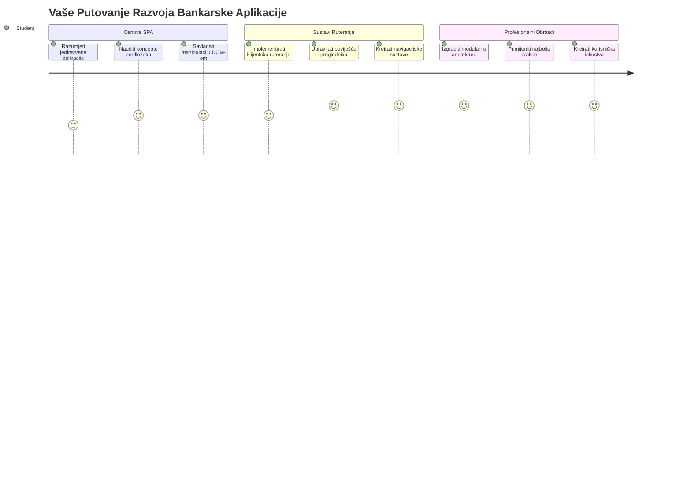
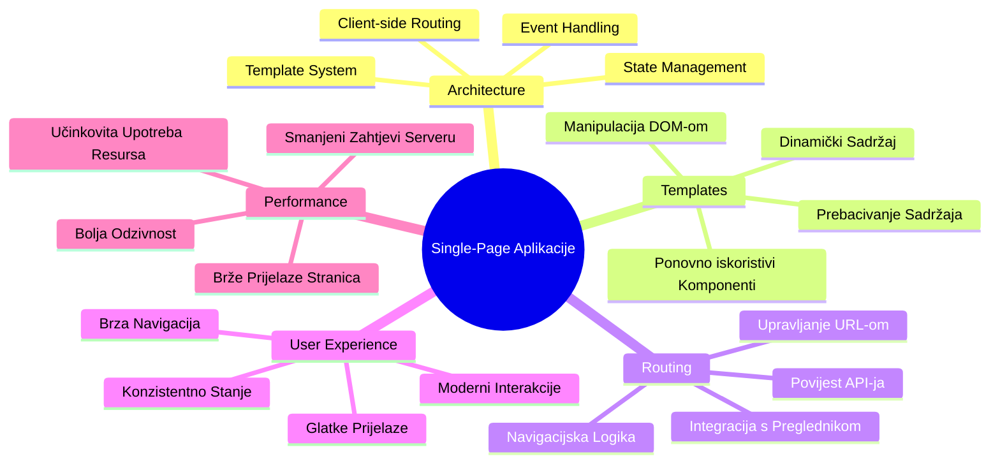
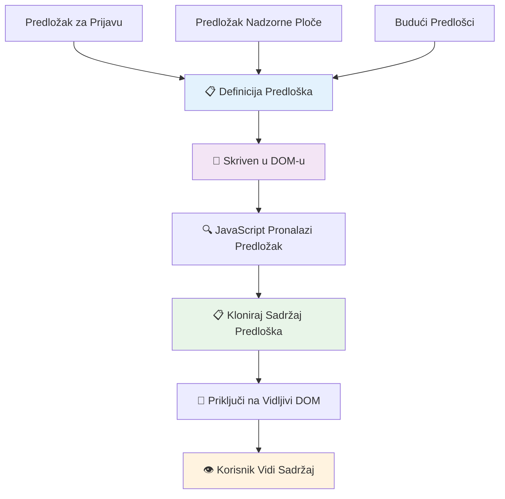
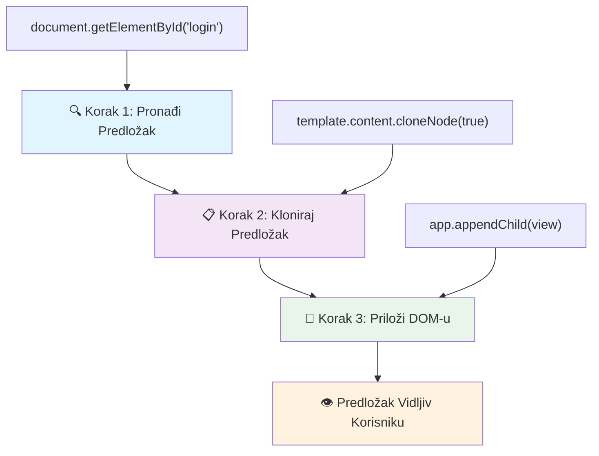
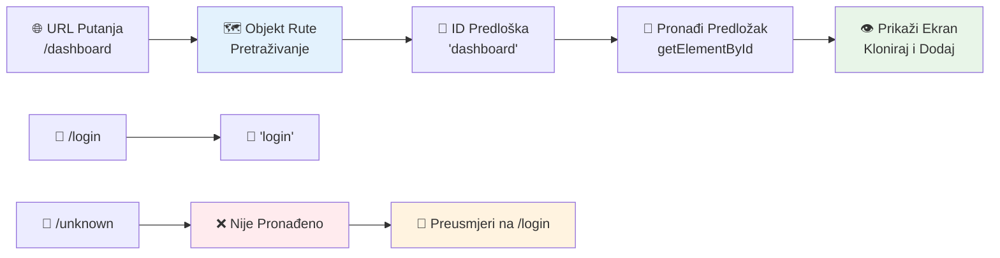
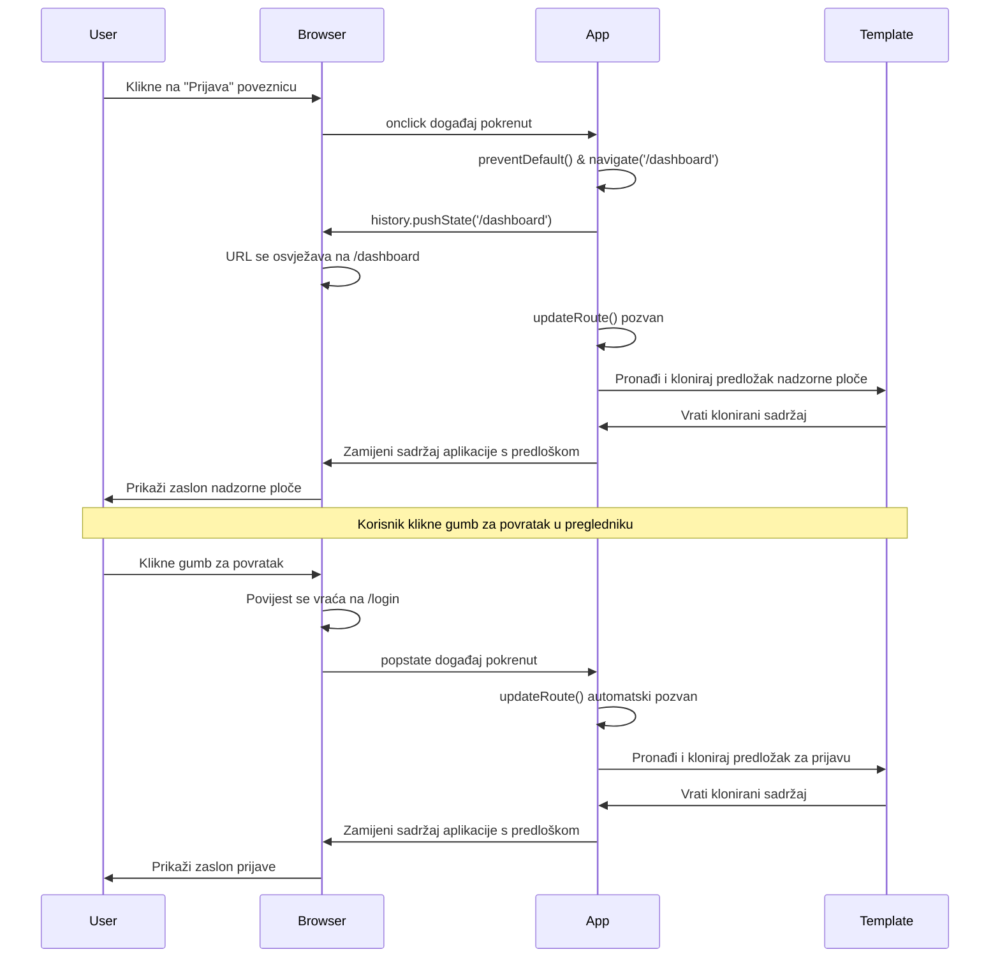
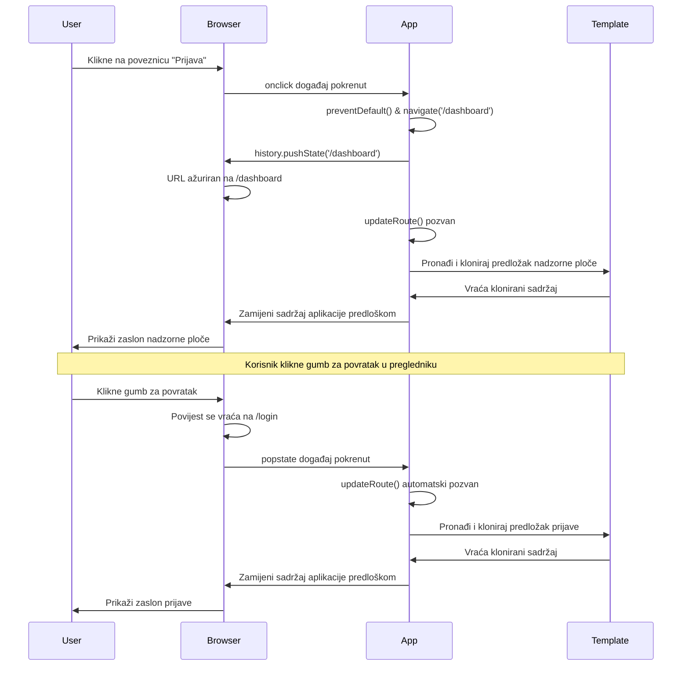
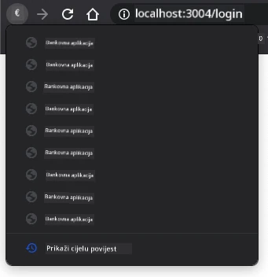
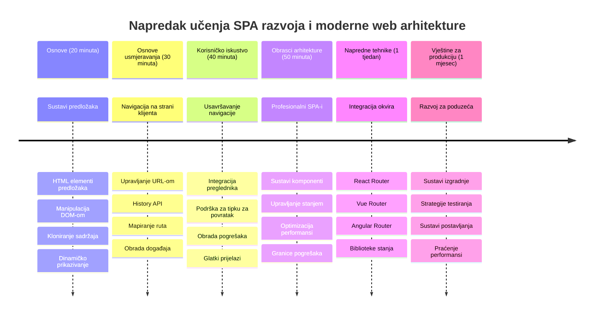

<!--
CO_OP_TRANSLATOR_METADATA:
{
  "original_hash": "351678bece18f07d9daa987a881fb062",
  "translation_date": "2026-01-07T09:18:42+00:00",
  "source_file": "7-bank-project/1-template-route/README.md",
  "language_code": "hr"
}
-->
# Izrada bankarske aplikacije, dio 1: HTML predlošci i rute u web aplikaciji


Kada je Apollo 11-ov sustav za upravljanje navigacijom 1969. godine usmjeravao prema Mjesecu, morao je prelaziti između različitih programa bez ponovnog pokretanja cijelog sustava. Moderna web aplikacija radi slično – mijenja ono što vidite bez ponovnog učitavanja svega iz početka. To stvara glatko i responzivno iskustvo koje korisnici danas očekuju.

Za razliku od tradicionalnih web stranica koje ponovno učitavaju cijele stranice za svaku interakciju, moderne web aplikacije ažuriraju samo dijelove koji trebaju promjenu. Ovaj pristup, slično kao što kontrola misije mijenja prikaze dok održava stalnu komunikaciju, stvara to fluidno iskustvo na koje smo navikli.

Evo što čini razliku tako dramatičnom:

| Tradicionalne višestranične aplikacije | Moderne jednostranične aplikacije |
|----------------------------------------|----------------------------------|
| **Navigacija** | Potpuno ponovno učitavanje stranice za svaki zaslon | Trenutna promjena sadržaja |
| **Performanse** | Sporije zbog potpunog preuzimanja HTML-a | Brže s djelomičnim ažuriranjima |
| **Korisničko iskustvo** | Iznenadni treptaji stranica | Glatki prijelazi kao u aplikacijama |
| **Dijeljenje podataka** | Teško između stranica | Jednostavno upravljanje stanjem |
| **Razvoj** | Više HTML datoteka za održavanje | Jedan HTML s dinamičkim predlošcima |

**Razumijevanje evolucije:**
- **Tradicionalne aplikacije** zahtijevaju zahtjeve serveru za svaku navigacijsku akciju
- **Moderne jednostranične aplikacije (SPA)** se učitavaju jednom i dinamički ažuriraju sadržaj korištenjem JavaScripta
- **Očekivanja korisnika** sada preferiraju trenutne i besprijekorne interakcije
- **Prednosti performansi** uključuju smanjenje propusnosti i brže odzive

U ovoj lekciji ćemo izraditi bankarsku aplikaciju s više zaslona koja teče besprijekorno. Kao što znanstvenici koriste modularne instrumente koji se mogu rekonfigurirati za različite eksperimente, mi ćemo koristiti HTML predloške kao višekratne komponente koje se mogu prikazivati prema potrebi.

Radit ćete s HTML predlošcima (višekratnim nacrtima za različite zaslone), JavaScript rutiranjem (sustav koji prebacuje zaslone) i povijesnim API-jem preglednika (koji omogućuje da gumb za povratak radi kako se očekuje). To su iste temeljne tehnike koje koriste okviri poput Reacta, Vuea i Angulara.

Na kraju ćete imati funkcionalnu bankarsku aplikaciju koja demonstrira profesionalne principe jednostraničnih aplikacija.


## Pred-predavanja kviz

[Pred-predavanja kviz](https://ff-quizzes.netlify.app/web/quiz/41)

### Što će vam trebati

Trebat će nam lokalni web server za testiranje naše bankarske aplikacije – ne brinite, lakše je nego što zvuči! Ako ga već nemate postavljenog, samo instalirajte [Node.js](https://nodejs.org) i pokrenite `npx lite-server` iz vašeg projekt foldera. Ova korisna naredba pokreće lokalni server i automatski otvara vašu aplikaciju u pregledniku.

### Priprema

Na vašem računalu kreirajte mapu nazvanu `bank` s datotekom pod nazivom `index.html` unutar nje. Počet ćemo od ovog HTML [boilerplatea](https://en.wikipedia.org/wiki/Boilerplate_code):

```html
<!DOCTYPE html>
<html lang="en">
  <head>
    <meta charset="UTF-8">
    <meta name="viewport" content="width=device-width, initial-scale=1.0">
    <title>Bank App</title>
  </head>
  <body>
    <!-- This is where you'll work -->
  </body>
</html>
```

**Evo što ovaj boilerplate pruža:**
- **Uspostavlja** strukturu HTML5 dokumenta s ispravnom deklaracijom DOCTYPE-a
- **Konfigurira** kodiranje znakova na UTF-8 za međunarodnu podršku teksta
- **Omogućava** responzivni dizajn s meta oznakom za viewport za kompatibilnost s mobilnim uređajima
- **Postavlja** opisni naslov koji se prikazuje na kartici preglednika
- **Kreira** čisti body odjeljak gdje ćemo graditi našu aplikaciju

> 📁 **Pregled strukture projekta**
> 
> **Na kraju ove lekcije, vaš projekt će sadržavati:**
> ```
> bank/
> ├── index.html      <!-- Main HTML with templates -->
> ├── app.js          <!-- Routing and navigation logic -->
> └── style.css       <!-- (Optional for future lessons) -->
> ```
> 
> **Odgovornosti datoteka:**
> - **index.html**: Sadrži sve predloške i pruža strukturu aplikacije
> - **app.js**: Upravljanje rutiranjem, navigacijom i upravljanjem predlošcima
> - **Predlošci**: Definiraju korisničko sučelje za prijavu, nadzornu ploču i druge zaslone

---

## HTML predlošci

Predlošci rješavaju temeljni problem u web razvoju. Kad je Gutenberg izumio pomični tip tiskanja 1440-ih, shvatio je da umjesto izrezivanja cijelih stranica, može stvoriti višekratne blokove slova i slagati ih po potrebi. HTML predlošci funkcioniraju po istom principu – umjesto stvaranja zasebnih HTML datoteka za svaki zaslon, definirate višekratne strukture koje se prikazuju prema potrebi.


Zamislite predloške kao nacrte za različite dijelove vaše aplikacije. Baš kao što arhitekt stvara jedan nacrt i koristi ga više puta umjesto da ponovno crta identične sobe, mi stvaramo predloške jednom i instanciramo ih kad zatrebaju. Preglednik drži te predloške skrivene dok ih JavaScript ne aktivira.

Ako želite stvoriti više zaslona za web stranicu, jedno rješenje bilo bi kreirati jednu HTML datoteku za svaki zaslon koji želite prikazati. Međutim, to rješenje dolazi s nekim neugodnostima:

- Morate ponovo učitati cijeli HTML prilikom promjene zaslona, što može biti sporo.
- Teško je dijeliti podatke između različitih zaslona.

Drugi pristup je imati samo jednu HTML datoteku i definirati više [HTML predložaka](https://developer.mozilla.org/docs/Web/HTML/Element/template) korištenjem elementa `<template>`. Predložak je višekratni HTML blok koji preglednik ne prikazuje i koji treba biti instanciran u runtime-u putem JavaScripta.

### Izgradimo to

Izradit ćemo bankarsku aplikaciju s dva glavna zaslona: stranicu za prijavu i nadzornu ploču. Prvo dodajmo element rezerviranog mjesta u body našeg HTML-a – ovdje će se pojavljivati svi naši različiti zasloni:

```html
<div id="app">Loading...</div>
```

**Razumijevanje ovog rezerviranog mjesta:**
- **Kreira** spremnik s ID-em "app" u kojem će se prikazivati svi zasloni
- **Prikazuje** poruku učitavanja dok JavaScript ne inicijalizira prvi zaslon
- **Pruža** jednu točku montiranja za naš dinamični sadržaj
- **Omogućava** jednostavno ciljanje iz JavaScripta korištenjem `document.getElementById()`

> 💡 **Savjet**: Budući da će se sadržaj ovog elementa mijenjati, možemo tamo staviti poruku ili indikator učitavanja koji će se prikazivati dok se aplikacija učitava.

Sljedeće, dodajmo ispod HTML predložak za stranicu prijave. Za sada ćemo tamo staviti samo naslov i sekciju koja sadrži poveznicu koju ćemo koristiti za navigaciju.

```html
<template id="login">
  <h1>Bank App</h1>
  <section>
    <a href="/dashboard">Login</a>
  </section>
</template>
```

**Razlaganje ovog predloška za prijavu:**
- **Definira** predložak s jedinstvenim identifikatorom "login" za ciljanje JavaScriptom
- **Uključuje** glavni naslov koji uspostavlja brendiranje aplikacije
- **Sadrži** semantički `<section>` element za grupiranje povezanog sadržaja
- **Pruža** navigacijsku poveznicu koja će preusmjeravati korisnike na nadzornu ploču

Zatim ćemo dodati još jedan HTML predložak za stranicu nadzorne ploče. Ova stranica će sadržavati različite sekcije:

- Zaglavlje s naslovom i poveznicom za odjavu
- Trenutni saldo bankovnog računa
- Popis transakcija prikazan u tablici

```html
<template id="dashboard">
  <header>
    <h1>Bank App</h1>
    <a href="/login">Logout</a>
  </header>
  <section>
    Balance: 100$
  </section>
  <section>
    <h2>Transactions</h2>
    <table>
      <thead>
        <tr>
          <th>Date</th>
          <th>Object</th>
          <th>Amount</th>
        </tr>
      </thead>
      <tbody></tbody>
    </table>
  </section>
</template>
```

**Razumimo svaki dio ove nadzorne ploče:**
- **Strukturira** stranicu korištenjem semantičkog elementa `<header>` koji sadrži navigaciju
- **Prikazuje** naslov aplikacije dosljedno na svim zaslonima radi brendiranja
- **Pruža** poveznicu za odjavu koja vodi natrag na zaslon prijave
- **Prikazuje** trenutni saldo računa u namjenskoj sekciji
- **Organizira** podatke o transakcijama koristeći ispravno strukturiranu HTML tablicu
- **Definira** zaglavlja tablice za stupce Datum, Opis i Iznos
- **Ostavlja** tijelo tablice prazno za dinamičko umetanje sadržaja kasnije

> 💡 **Savjet**: Kada stvarate HTML predloške, ako želite vidjeti kako će izgledati, možete zakomentirati `<template>` i `</template>` linije omotavanjem u `<!-- -->`.

### 🔄 **Pedagoška provjera**
**Razumijevanje sustava predložaka**: Prije implementacije JavaScripta, osigurajte da razumijete:
- ✅ Kako se predlošci razlikuju od običnih HTML elemenata
- ✅ Zašto predlošci ostaju skriveni dok ih JavaScript ne aktivira
- ✅ Važnost semantičke HTML strukture u predlošcima
- ✅ Kako predlošci omogućuju višekratne UI komponente

**Brzi samoprovjerni test**: Što se događa ako uklonite `<template>` oznake oko vašeg HTML-a?
*Odgovor: Sadržaj odmah postaje vidljiv i gubi funkcionalnost predloška*

**Prednosti arhitekture**: Predlošci pružaju:
- **Višekratnost**: Jedna definicija, više instanci
- **Performanse**: Bez suvišnog parsiranja HTML-a
- **Održavanje**: Centralizirana UI struktura
- **Fleksibilnost**: Dinamično mijenjanje sadržaja

✅ Zašto mislite da koristimo `id` atribute na predlošcima? Mogu li se umjesto njih koristiti klase?

## Oživljavanje predložaka uz JavaScript

Sada trebamo učiniti naše predloške funkcionalnima. Kao što 3D printer uzima digitalni nacrt i stvara fizički objekt, JavaScript uzima naše skrivene predloške i stvara vidljive, interaktivne elemente koje korisnici mogu vidjeti i koristiti.

Proces slijedi tri dosljedna koraka koji čine temelj modernog web razvoja. Kad jednom shvatite ovaj uzorak, prepoznat ćete ga u mnogim framework-ovima i bibliotekama.

Ako pokušate otvoriti vaš trenutni HTML u pregledniku, vidjet ćete da ostaje zaglavljen na prikazu `Loading...`. To je zato što trebamo dodati dio JavaScripta koji instancira i prikazuje HTML predloške.

Instanciranje predloška obično se odvija u 3 koraka:

1. Dohvatite element predloška u DOM-u, na primjer pomoću [`document.getElementById`](https://developer.mozilla.org/docs/Web/API/Document/getElementById).
2. Klonirajte element predloška pomoću [`cloneNode`](https://developer.mozilla.org/docs/Web/API/Node/cloneNode).
3. Pridružite ga DOM-u ispod vidljivog elementa, na primjer pomoću [`appendChild`](https://developer.mozilla.org/docs/Web/API/Node/appendChild).


**Vizualno razlaganje procesa:**
- **Korak 1** pronalazi skriveni predložak u DOM strukturi
- **Korak 2** stvara radnu kopiju koju je sigurno modificirati
- **Korak 3** umeće kopiju u vidljivo područje stranice
- **Rezultat** je funkcionalan zaslon s kojim korisnici mogu komunicirati

✅ Zašto trebamo klonirati predložak prije nego što ga dodamo u DOM? Što mislite što bi se dogodilo da preskočimo ovaj korak?

### Zadatak

Kreirajte novu datoteku nazvanu `app.js` u vašem projekt folderu i uvezite tu datoteku u `<head>` odjeljku vašeg HTML-a:

```html
<script src="app.js" defer></script>
```

**Razumijevanje ove skripte:**
- **Povezuje** JavaScript datoteku s našim HTML dokumentom
- **Koristi** atribut `defer` kako bi osigurao da se skripta izvršava nakon završetka parsiranja HTML-a
- **Omogućava** pristup svim DOM elementima budući da su u potpunosti učitani prije pokretanja skripte
- **Slede** modernu praksu učitavanja skripti za bolje performanse

Sada u `app.js` kreirat ćemo novu funkciju `updateRoute`:

```js
function updateRoute(templateId) {
  const template = document.getElementById(templateId);
  const view = template.content.cloneNode(true);
  const app = document.getElementById('app');
  app.innerHTML = '';
  app.appendChild(view);
}
```

**Korak po korak, evo što se događa:**
- **Pronalaženje** elementa predloška korištenjem njegovog jedinstvenog ID-a
- **Stvaranje** duboke kopije sadržaja predloška korištenjem `cloneNode(true)`
- **Pronalaženje** glavnog spremnika aplikacije u kojem će se sadržaj prikazati
- **Brisanje** postojećeg sadržaja iz spremnika
- **Umetanje** kloniranog sadržaja predloška u vidljivi DOM

Sada pozovite ovu funkciju s jednim od predložaka i pogledajte rezultat.

```js
updateRoute('login');
```

**Što ovaj poziv funkcije postiže:**
- **Aktivira** predložak prijave prosljeđivanjem njegovog ID-a kao parametra
- **Prikazuje** kako programatski prebacivati između različitih zaslona aplikacije
- **Prikazuje** zaslon prijave umjesto poruke "Loading..."

✅ Koja je svrha ovog koda `app.innerHTML = '';`? Što se događa bez njega?

## Izrada ruta

Rutiranje je u biti povezivanje URL-ova s odgovarajućim sadržajem. Razmislite kako su rani telefonski operateri koristili kontrolne ploče za povezivanje poziva – primali su ulazni zahtjev i povezivali ga s ispravnim odredištem. Web rutiranje radi slično, uzima URL zahtjev i određuje koji sadržaj prikazati.


Tradicionalno su web serveri to rješavali posluživanjem različitih HTML datoteka za različite URL-ove. Budući da izrađujemo jednostraničnu aplikaciju, moramo sami upravljati rutiranjem pomoću JavaScripta. Ovaj pristup daje nam veću kontrolu nad korisničkim iskustvom i performansama.


**Razumijevanje tijeka rutiranja:**
- **Promjene URL-a** pokreću pretraživanje u našoj konfiguraciji ruta
- **Ispravne rute** mapiraju na određene predloške za prikaz
- **Neispravne rute** pokreću rezervno ponašanje kako bi spriječile neispravna stanja
- **Prikaz predloška** slijedi postupak u tri koraka koji smo ranije naučili

Kada govorimo o web aplikaciji, *rutiranjem* nazivamo namjeru mapiranja **URL-ova** na određene zaslone koji se trebaju prikazati. Na web stranici s više HTML datoteka to se radi automatski jer se putanje datoteka odražavaju u URL-u. Na primjer, s ovim datotekama u vašem projektnom folderu:

```
mywebsite/index.html
mywebsite/login.html
mywebsite/admin/index.html
```

Ako kreirate web server s `mywebsite` kao korijenom, mapiranje URL-a bit će:

```
https://site.com            --> mywebsite/index.html
https://site.com/login.html --> mywebsite/login.html
https://site.com/admin/     --> mywebsite/admin/index.html
```

Međutim, za našu web aplikaciju koristimo jednu HTML datoteku koja sadrži sve zaslone, pa nam ovo zadano ponašanje neće pomoći. Moramo ručno izraditi ovu mapu i pomoću JavaScripta ažurirati prikazani predložak.

### Zadatak

Koristit ćemo jednostavan objekt za implementaciju [karte](https://en.wikipedia.org/wiki/Associative_array) između URL putanja i naših predložaka. Dodajte ovaj objekt na vrh vaše `app.js` datoteke.

```js
const routes = {
  '/login': { templateId: 'login' },
  '/dashboard': { templateId: 'dashboard' },
};
```

**Razumijevanje ove konfiguracije ruta:**
- **Definira** mapiranje između URL putanja i identifikatora predložaka
- **Koristi** sintaksu objekta gdje su ključevi URL putanje, a vrijednosti sadrže informacije o predlošku
- **Omogućava** jednostavno pretraživanje koji se predložak prikazuje za određeni URL
- **Pruža** skalabilnu strukturu za dodavanje novih ruta u budućnosti
Sada malo izmijenimo funkciju `updateRoute`. Umjesto da direktno prosljeđujemo `templateId` kao argument, želimo ga dohvatiti prvo gledajući trenutni URL, a zatim koristiti našu mapu za dobivanje odgovarajuće vrijednosti ID-a predloška. Možemo koristiti [`window.location.pathname`](https://developer.mozilla.org/docs/Web/API/Location/pathname) da dobijemo samo odjeljak puta iz URL-a.

```js
function updateRoute() {
  const path = window.location.pathname;
  const route = routes[path];

  const template = document.getElementById(route.templateId);
  const view = template.content.cloneNode(true);
  const app = document.getElementById('app');
  app.innerHTML = '';
  app.appendChild(view);
}
```

**Razlaganje onoga što se ovdje događa:**
- **Izdvaja** trenutni put iz URL-a preglednika koristeći `window.location.pathname`
- **Traži** odgovarajuću konfiguraciju rute u našem routes objektu
- **Dohvaća** ID predloška iz konfiguracije rute
- **Slijedi** isti proces renderiranja predloška kao i prije
- **Stvara** dinamički sustav koji reagira na promjene URL-a

Ovdje smo preslikali rute koje smo deklarirali na odgovarajući predložak. Možete isprobati da li radi ispravno tako da ručno promijenite URL u svom pregledniku.

✅ Što se događa ako unesete nepoznati put u URL? Kako bismo to mogli riješiti?

## Dodavanje Navigacije

S uspostavljenim usmjeravanjem, korisnici trebaju način za navigaciju kroz aplikaciju. Tradicionalne web stranice ponovo učitavaju cijele stranice klikom na linkove, no želimo ažurirati i URL i sadržaj bez osvježavanja stranice. To stvara glađe korisničko iskustvo slično tome kako desktop aplikacije prelaze između različitih prikaza.

Moramo uskladiti dvije stvari: ažuriranje URL-a preglednika kako bi korisnici mogli dodavati stranice u favorite i dijeliti poveznice, te prikazivanje odgovarajućeg sadržaja. Kada je pravilno implementirano, to stvara besprijekornu navigaciju koju korisnici očekuju od modernih aplikacija.


### 🔄 **Pedagoški pregled**
**Arhitektura Jednostraničnih aplikacija (SPA)**: Provjerite svoje razumijevanje potpunog sustava:
- ✅ Kako se klijentsko usmjeravanje razlikuje od tradicionalnog usmjeravanja na strani servera?
- ✅ Zašto je History API bitan za pravilnu navigaciju u SPA?
- ✅ Kako predlošci omogućuju dinamički sadržaj bez ponovnog učitavanja stranice?
- ✅ Koju ulogu ima upravljanje događajima u presretanju navigacije?

**Integracija sustava**: Vaša SPA demonstrira:
- **Upravljanje predlošcima**: Ponovno iskoristivi UI elementi s dinamičkim sadržajem
- **Klijentsko usmjeravanje**: Upravljanje URL-om bez zahtjeva prema serveru
- **Arhitekturu pokrenutu događajima**: Reaktivna navigacija i korisničke interakcije
- **Integraciju preglednika**: Ispravan rad s poviješću i gumbima naprijed/natrag
- **Optimizaciju performansi**: Brzi prijelazi i smanjeno opterećenje servera

**Profesionalni obrasci**: Implementirali ste:
- **Odvajanje modela i prikaza**: Predlošci odvojeni od logike aplikacije
- **Upravljanje stanjem**: Sinkronizacija stanja URL-a sa prikazanim sadržajem
- **Postupno poboljšanje**: JavaScript unapređuje osnovnu HTML funkcionalnost
- **Korisničko iskustvo**: Glatka, aplikaciji slična navigacija bez osvježavanja stranice

> � **Uvid u arhitekturu**: Komponente navigacijskog sustava  
>  
> **Što gradite:**
> - **🔄 Upravljanje URL-om**: Ažurira adresnu traku bez ponovnog učitavanja stranice  
> - **📋 Sustav predložaka**: Dinamička zamjena sadržaja ovisno o trenutnoj ruti  
> - **📚 Integracija povijesti**: Održava funkcionalnost gumba za naprijed/natrag  
> - **🛡️ Rukovanje pogreškama**: Lijepe zamjene za neispravne ili nedostajuće rute  
>  
> **Kako komponente međusobno djeluju:**
> - **Osluškuje** događaje navigacije (klikove, promjene povijesti)
> - **Ažurira** URL koristeći History API  
> - **Renderira** odgovarajući predložak za novu rutu  
> - **Održava** besprijekorno korisničko iskustvo kroz cijelo vrijeme

Sljedeći korak za našu aplikaciju je omogućiti navigaciju između stranica bez potrebe za ručnim mijenjanjem URL-a. To podrazumijeva dvije stvari:

  1. Ažuriranje trenutnog URL-a  
  2. Ažuriranje prikazanog predloška na temelju novog URL-a

Drugi dio smo već riješili funkcijom `updateRoute`, pa sada moramo smisliti kako ažurirati trenutni URL.

Morat ćemo koristiti JavaScript, a točnije [`history.pushState`](https://developer.mozilla.org/docs/Web/API/History/pushState) koji omogućuje ažuriranje URL-a i stvaranje novog unosa u povijesti pregledavanja, bez ponovnog učitavanja HTML-a.

> ⚠️ **Važna napomena**: Dok se HTML element sidra [`<a href>`](https://developer.mozilla.org/docs/Web/HTML/Element/a) može samostalno koristiti za stvaranje hiperveza na različite URL-ove, on će po defaultu uzrokovati ponovo učitavanje HTML-a. Potrebno je spriječiti ovo ponašanje prilikom rukovanja usmjeravanjem u prilagođenom JavaScriptu koristeći funkciju preventDefault() na događaju klika.

### Zadatak

Napravi novu funkciju koju ćemo koristiti za navigaciju u našoj aplikaciji:

```js
function navigate(path) {
  window.history.pushState({}, path, path);
  updateRoute();
}
```

**Razumijevanje ove funkcije za navigaciju:**
- **Ažurira** URL preglednika na novi put koristeći `history.pushState`
- **Dodaje** novi unos u povijest preglednika za ispravnu podršku gumba natrag/naprijed
- **Poziva** funkciju `updateRoute()` za prikaz odgovarajućeg predloška
- **Održava** iskustvo jednostranične aplikacije bez ponovnog učitavanja stranice

Ova metoda najprije ažurira trenutni URL na temelju danog puta, zatim ažurira predložak. Svojstvo `window.location.origin` vraća korijen URL-a, omogućujući nam rekonstrukciju potpunog URL-a iz danog puta.

Sada kada imamo ovu funkciju, možemo riješiti problem koji se javi ako put ne odgovara nijednoj definiranoj ruti. Izmijenit ćemo funkciju `updateRoute` dodavanjem rezervne opcije na neku od postojećih ruta ako nema podudaranja.

```js
function updateRoute() {
  const path = window.location.pathname;
  const route = routes[path];

  if (!route) {
    return navigate('/login');
  }

  const template = document.getElementById(route.templateId);
  const view = template.content.cloneNode(true);
  const app = document.getElementById('app');
  app.innerHTML = '';
  app.appendChild(view);
}
```

**Ključne točke za zapamtiti:**
- **Provjerava** postoji li ruta za trenutni put  
- **Preusmjerava** na stranicu za prijavu kad se pristupi neispravnoj ruti  
- **Nudi** rezervni mehanizam koji sprječava neispravnu navigaciju  
- **Osigurava** da korisnici uvijek vide valjani ekran, čak i s pogrešnim URL-ovima  

Ako ruta ne može biti pronađena, sada ćemo preusmjeriti na stranicu `login`.

Sada napravimo funkciju koja dohvaća URL klikom na link i sprječava zadano ponašanje preglednika:

```js
function onLinkClick(event) {
  event.preventDefault();
  navigate(event.target.href);
}
```

**Razlaganje ovog rukovatelja klikom:**
- **Sprječava** zadano ponašanje linka preglednika koristeći `preventDefault()`  
- **Dohvaća** odredišni URL iz elementa koji je kliknut  
- **Poziva** našu prilagođenu funkciju `navigate` umjesto ponovnog učitavanja stranice  
- **Održava** glatko iskustvo jednostranične aplikacije  

```html
<a href="/dashboard" onclick="onLinkClick(event)">Login</a>
...
<a href="/login" onclick="onLinkClick(event)">Logout</a>
```

**Što ova veza za `onclick` ostvaruje:**
- **Povezuje** svaki link s našim prilagođenim navigacijskim sustavom  
- **Prosljeđuje** događaj klika našoj funkciji `onLinkClick` za daljnju obradu  
- **Omogućuje** glatku navigaciju bez ponovnog učitavanja stranice  
- **Održava** ispravan URL koji korisnici mogu dodavati u favorite ili dijeliti  

[`onclick`](https://developer.mozilla.org/docs/Web/API/GlobalEventHandlers/onclick) atribut povezuje `click` događaj s JavaScript kodom, ovdje pozivom funkcije `navigate()`.

Isprobajte klikom na ove linkove, sada biste trebali moći navigirati između različitih ekrana vaše aplikacije.

✅ Metoda `history.pushState` dio je HTML5 standarda i implementirana je u [svim modernim preglednicima](https://caniuse.com/?search=pushState). Ako razvijate web aplikaciju za starije preglednike, postoji trik koji možete koristiti umjesto ovog API-ja: korištenjem [hash (`#`)](https://en.wikipedia.org/wiki/URI_fragment) prije puta možete implementirati usmjeravanje koje radi s običnim navigacijama sidrom i ne učitava stranicu, jer je njegova svrha bila stvaranje internih poveznica unutar stranice.

## Omogućavanje rada tipki Natrag i Naprijed

Tipke natrag i naprijed su temeljne za web pregledavanje, slično kao što NASA-ini kontrolori misije mogu pregledavati prethodna stanja sustava tijekom svemirskih misija. Korisnici očekuju da te tipke rade, a kada ne rade, narušava se očekivano iskustvo pregledavanja.

Naša jednostranična aplikacija treba dodatnu konfiguraciju za podršku ovog funkcionalnosti. Preglednik održava stog povijesti (koji smo dosad punili s `history.pushState`), ali kada se korisnici kreću kroz ovu povijest, naša aplikacija treba reagirati ažuriranjem prikazanog sadržaja sukladno tome.


**Ključne točke interakcije:**
- **Korisničke akcije** pokreću navigaciju klikovima ili gumbima preglednika  
- **Aplikacija presreće** klikove na linkove kako bi spriječila ponovno učitavanje stranice  
- **History API** upravlja promjenama URL-a i stogom povijesti preglednika  
- **Predlošci** pružaju strukturu sadržaja za svaki ekran  
- **Slušatelji događaja** osiguravaju da aplikacija odgovara na sve vrste navigacija  

Korištenjem `history.pushState` stvaraju se novi unosi u povijest preglednika. To možete provjeriti držanjem *tipke za povratak* u pregledniku, trebala bi se prikazati povijest poput ovoga:



Ako pokušate nekoliko puta kliknuti gumb za povratak, vidjet ćete da se trenutni URL mijenja i povijest se ažurira, ali se prikazuje isti predložak.

To je zato što aplikacija ne zna da trebamo pozvati `updateRoute()` svaki put kada se povijest promijeni. Ako pogledate dokumentaciju za [`history.pushState`](https://developer.mozilla.org/docs/Web/API/History/pushState), vidjet ćete da se prilikom promjene stanja - što znači prelazak na drugi URL - pokreće događaj [`popstate`](https://developer.mozilla.org/docs/Web/API/Window/popstate_event). Iskoristit ćemo to za popravak tog problema.

### Zadatak

Kako bismo osigurali da se prikazani predložak ažurira kada se povijest preglednika promijeni, pripojit ćemo novu funkciju koja poziva `updateRoute()`. To ćemo ubaciti na dno naše datoteke `app.js`:

```js
window.onpopstate = () => updateRoute();
updateRoute();
```

**Razumijevanje ove integracije s poviješću:**
- **Osluškuje** `popstate` događaje koji nastaju kada korisnici navigiraju pomoću gumba preglednika  
- **Koristi** arrow funkciju radi sažetosti koda rukovatelja događaja  
- **Automatski poziva** `updateRoute()` kad god se stanje povijesti promijeni  
- **Inicijalizira** aplikaciju pozivom `updateRoute()` kada se stranica prvi put učita  
- **Osigurava** ispravan prikaz predloška bez obzira na način navigacije korisnika  

> 💡 **Savjet za profesionalce**: Ovdje smo koristili [arrow funkciju](https://developer.mozilla.org/docs/Web/JavaScript/Reference/Functions/Arrow_functions) za deklariranje rukovatelja `popstate` događaja zbog sažetosti, ali obična funkcija bi isto tako radila.

Evo podsjetnika na arrow funkcije:

[](https://youtube.com/watch?v=OP6eEbOj2sc "Arrow Functions")

> 🎥 Kliknite sliku iznad za video o arrow funkcijama.

Sada pokušajte koristiti gumbe za natrag i naprijed u pregledniku i provjerite da je prikazana ruta ovoga puta ispravno ažurirana.

### ⚡ **Što možete učiniti u sljedećih 5 minuta**
- [ ] Testirajte navigaciju svoje bankarske aplikacije koristeći gumbe za natrag/naprijed u pregledniku  
- [ ] Pokušajte ručno upisati različite URL-ove u adresnu traku i testirati usmjeravanje  
- [ ] Otvorite DevTools i pregledajte kako se predlošci kloniraju u DOM  
- [ ] Eksperimentirajte dodavanjem `console.log` izjava za praćenje toka usmjeravanja  

### 🎯 **Što možete postići u ovom satu**
- [ ] Završiti kviz poslije lekcije i razumjeti koncepte SPA arhitekture  
- [ ] Dodati CSS stilizaciju kako bi vaši predlošci bankarske aplikacije izgledali profesionalno  
- [ ] Implementirati 404 stranicu s ispravnim rukovanjem greškama  
- [ ] Kreirati stranicu s zaslugama i dodatnom funkcionalnošću usmjeravanja  
- [ ] Dodati učitavajuća stanja i prijelaze između promjena predložaka  

### 📅 **Vaš jednodnevni razvojni put SPA**
- [ ] Završiti kompletnu bankarsku aplikaciju s obrascima, upravljanjem podacima i trajnošću  
- [ ] Dodati napredne značajke usmjeravanja poput parametara rute i ugniježđenih ruta  
- [ ] Implementirati navigacijske zaštite i usmjeravanje bazirano na autentikaciji  
- [ ] Kreirati ponovo iskoristive komponente predložaka i knjižnicu komponenti  
- [ ] Dodati animacije i prijelaze za uglađenije iskustvo korisnika  
- [ ] Postaviti SPA na hosting platformu i pravilno konfigurirati usmjeravanje  

### 🌟 **Vaša mjesečna vladavina frontend arhitekturom**
- [ ] Izgraditi složene SPA koristeći moderne okvire poput React, Vue ili Angular  
- [ ] Naučiti napredne obrasce upravljanja stanjem i knjižnice  
- [ ] Ovladati alatima za izgradnju i razvojnim radnim tokovima za SPA  
- [ ] Implementirati značajke progresivnih web aplikacija i offline funkcionalnost  
- [ ] Istražiti tehnike optimizacije performansi za velike SPA projekte  
- [ ] Doprinijeti open-source SPA projektima i podijeliti svoje znanje  

## 🎯 Vaš vremenski okvir za ovladavanje jednostaničnom aplikacijom


### 🛠️ Sažetak vašeg alata za razvoj SPA

Nakon završetka ove lekcije, sada ste usavršili:
- **Arhitekturu predložaka**: Ponovno upotrebljivi HTML elementi s dinamičkim prikazom sadržaja  
- **Klijentsko usmjeravanje**: Upravljanje URL-om i navigacija bez ponovnog učitavanja stranice  
- **Integraciju preglednika**: Korištenje History API-a i podrška gumba naprijed/natrag  
- **Sustave pokrenute događajima**: Upravljanje navigacijom i korisničkim interakcijama  
- **Manipulaciju DOM-om**: Kloniranje predložaka, izmjene sadržaja i upravljanje elementima  
- **Rukovanje pogreškama**: Lijepe zamjene za neispravne rute i nedostajući sadržaj  
- **Obrasce za performanse**: Učinkovito učitavanje i prikazivanje sadržaja  

**Primjene u stvarnom svijetu**: Vaše vještine razvoja SPA izravno se primjenjuju na:
- **Moderne web aplikacije**: React, Vue, Angular i razvoj u ostalim okvirima  
- **Progresivne web aplikacije**: Aplikacije koje rade offline i imaju iskustvo slično aplikacijama  
- **Enterprise nadzorne ploče**: Kompleksne poslovne aplikacije s više prikaza  
- **E-trgovinu**: Katalozi proizvoda, košarice i proces kupnje  
- **Upravljanje sadržajem**: Dinamičko stvaranje i uređivanje sadržaja  
- **Mobilni razvoj**: Hibridne aplikacije koristeći web tehnologije  

**Profesionalne vještine koje ste stekli**: Sada možete:
- **Dizajnirajte** jednostranične aplikacije s pravilnom podjelom odgovornosti  
- **Implementirajte** sustave usmjeravanja na strani klijenta koji skaliraju s kompleksnošću aplikacije  
- **Otklonite pogreške** u složenim navigacijskim tokovima koristeći alate za razvojne programere u pregledniku  
- **Optimizirajte** izvedbu aplikacije kroz učinkovito upravljanje predlošcima  
- **Dizajnirajte** korisnička iskustva koja se osjećaju domaće i responzivno  

**Ovladali ste konceptima frontend razvoja**:  
- **Arhitektura komponenti**: Ponovno upotrebljivi UI obrasci i sustavi predložaka  
- **Sinkronizacija stanja**: Upravljanje stanjem URL-a i povijesti preglednika  
- **Programiranje vođeno događajima**: Obrada korisničkih interakcija i navigacije  
- **Optimizacija performansi**: Učinkovita manipulacija DOM-om i učitavanje sadržaja  
- **Dizajn korisničkog iskustva**: Glatki prijelazi i intuitivna navigacija  

**Sljedeća razina**: Spremni ste istražiti moderne frontend okvire, napredno upravljanje stanjem ili izgraditi složene enterprise aplikacije!

🌟 **Postignuće otključano**: Izgradili ste profesionalnu osnovu jednostanične aplikacije s modernim obrascima web arhitekture!

---

## Izazov GitHub Copilot Agenta 🚀

Koristite Agent mod da dovršite sljedeći izazov:

**Opis:** Poboljšajte bankarsku aplikaciju implementacijom obrade pogrešaka i predloška stranice 404 za nevažeće rute, poboljšavajući korisničko iskustvo pri navigaciji na nepostojeće stranice.

**Zadatak:** Kreirajte novi HTML predložak s id-om "not-found" koji prikazuje korisnički prijateljsku 404 stranicu s pogreškom uz stilizaciju. Zatim modificirajte JavaScript logiku usmjeravanja da prikaže ovaj predložak kada korisnici pristupaju nevažećim URL-ovima, i dodajte gumb "Idi na početnu" koji vraća na stranicu za prijavu.

Više o [agent modu](https://code.visualstudio.com/blogs/2025/02/24/introducing-copilot-agent-mode) potražite ovdje.

## 🚀 Izazov

Dodajte novi predložak i rutu za treću stranicu koja prikazuje zasluge za ovu aplikaciju.

**Ciljevi izazova:**  
- **Kreirajte** novi HTML predložak s odgovarajućom sadržajnom strukturom  
- **Dodajte** novu rutu u konfiguracijski objekt ruta  
- **Uključite** navigacijske poveznice do i s stranice zasluga  
- **Testirajte** da sva navigacija ispravno funkcionira s poviješću preglednika  

## Kviz poslije predavanja

[Kviz poslije predavanja](https://ff-quizzes.netlify.app/web/quiz/42)

## Pregled i samostalno učenje

Usmjeravanje je jedan od neočekivano složenih dijelova web razvoja, posebno kako web prelazi s ponašanja osvježavanja stranica na osvježavanja stranica u Jednostaničnoj aplikaciji (SPA). Pročitajte malo o [kako Azure Static Web App servis](https://docs.microsoft.com/azure/static-web-apps/routes/?WT.mc_id=academic-77807-sagibbon) rukuje usmjeravanjem. Možete li objasniti zašto su neke od odluka opisane u tom dokumentu nužne?

**Dodatni resursi za učenje:**  
- **Istražite** kako popularni okviri poput React Routera i Vue Routera implementiraju usmjeravanje na strani klijenta  
- **Istražite** razlike između usmjeravanja temeljenog na hash-u i usmjeravanja putem history API-ja  
- **Naučite** o server-side renderiranju (SSR) i kako utječe na strategije usmjeravanja  
- **Istražite** kako Progressive Web Apps (PWA) upravljaju usmjeravanjem i navigacijom  

## Zadatak

[Unaprijedite usmjeravanje](assignment.md)

---

<!-- CO-OP TRANSLATOR DISCLAIMER START -->
**Odricanje od odgovornosti**:
Ovaj dokument je preveden korištenjem AI servisa za prijevod [Co-op Translator](https://github.com/Azure/co-op-translator). Iako se trudimo postići točnost, imajte na umu da automatski prijevodi mogu sadržavati pogreške ili netočnosti. Izvorni dokument na izvornom jeziku treba se smatrati autentičnim i službenim izvorom. Za važne informacije preporučuje se stručno ljudsko prevođenje. Nismo odgovorni za bilo kakve nesporazume ili kriva tumačenja nastala uporabom ovog prijevoda.
<!-- CO-OP TRANSLATOR DISCLAIMER END -->