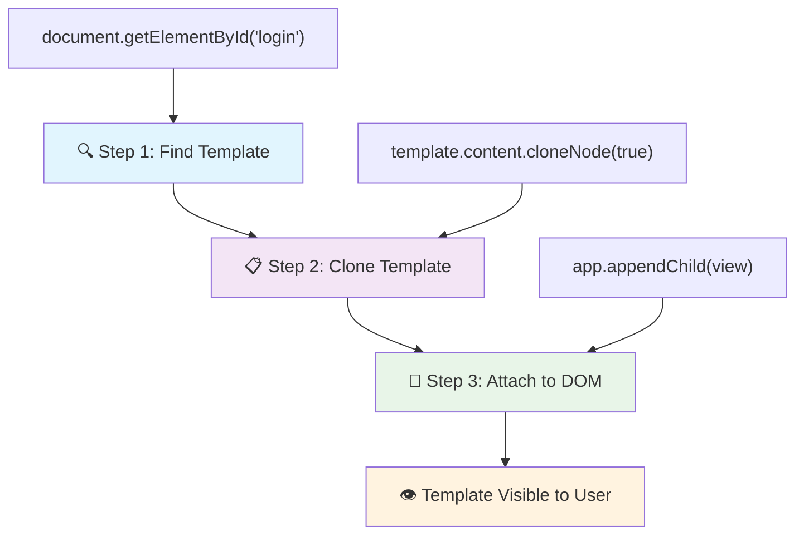
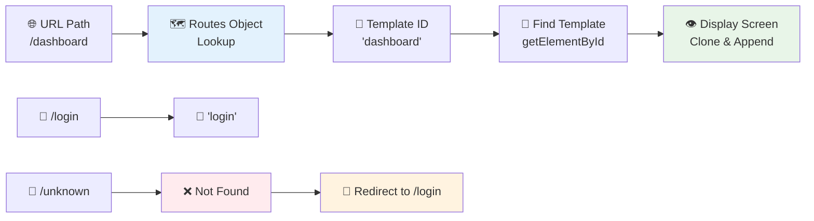
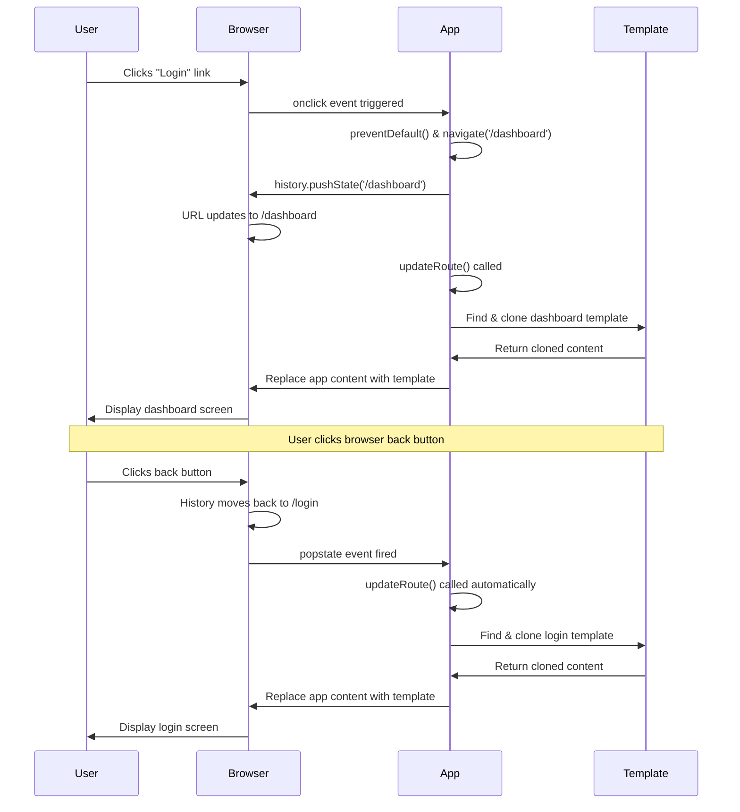

<!--
CO_OP_TRANSLATOR_METADATA:
{
  "original_hash": "5d259f6962464ad91e671083aa0398f4",
  "translation_date": "2025-10-25T00:06:19+00:00",
  "source_file": "7-bank-project/1-template-route/README.md",
  "language_code": "hr"
}
-->
# Izrada aplikacije za bankarstvo, dio 1: HTML predlošci i rute u web aplikaciji

Kada je Apollo 11-ov navigacijski računalni sustav 1969. godine vodio misiju na Mjesec, morao je prelaziti između različitih programa bez ponovnog pokretanja cijelog sustava. Moderne web aplikacije funkcioniraju na sličan način – mijenjaju ono što vidite bez ponovnog učitavanja svega od početka. To stvara glatko i responzivno iskustvo koje korisnici danas očekuju.

Za razliku od tradicionalnih web stranica koje ponovno učitavaju cijele stranice za svaku interakciju, moderne web aplikacije ažuriraju samo dijelove koji se trebaju promijeniti. Ovaj pristup, slično kao što kontrolni centar prebacuje između različitih prikaza dok održava stalnu komunikaciju, stvara fluidno iskustvo na koje smo navikli.

Evo što čini razliku tako dramatičnom:

| Tradicionalne višestranične aplikacije | Moderne jednostranične aplikacije |
|---------------------------------------|----------------------------------|
| **Navigacija** | Ponovno učitavanje cijele stranice za svaki ekran | Trenutno prebacivanje sadržaja |
| **Performanse** | Sporije zbog preuzimanja cijelog HTML-a | Brže s djelomičnim ažuriranjima |
| **Korisničko iskustvo** | Nagli prijelazi stranica | Glatki, aplikacijski prijelazi |
| **Dijeljenje podataka** | Teško između stranica | Jednostavno upravljanje stanjem |
| **Razvoj** | Održavanje više HTML datoteka | Jedan HTML s dinamičnim predlošcima |

**Razumijevanje evolucije:**
- **Tradicionalne aplikacije** zahtijevaju zahtjeve prema serveru za svaku navigacijsku akciju
- **Moderne SPA aplikacije** učitavaju se jednom i dinamički ažuriraju sadržaj koristeći JavaScript
- **Očekivanja korisnika** sada favoriziraju trenutne, besprijekorne interakcije
- **Prednosti performansi** uključuju smanjenu potrošnju bandwidtha i brže odgovore

U ovoj lekciji izgradit ćemo aplikaciju za bankarstvo s više ekrana koji se međusobno glatko povezuju. Kao što znanstvenici koriste modularne instrumente koji se mogu rekonfigurirati za različite eksperimente, mi ćemo koristiti HTML predloške kao višekratne komponente koje se mogu prikazati po potrebi.

Radit ćete s HTML predlošcima (višekratni nacrti za različite ekrane), JavaScript rutiranjem (sustav koji prebacuje između ekrana) i povijesnim API-jem preglednika (koji omogućuje da gumb za povratak radi kako treba). Ovo su iste osnovne tehnike koje koriste okviri poput Reacta, Vuea i Angulara.

Na kraju, imat ćete funkcionalnu aplikaciju za bankarstvo koja demonstrira profesionalne principe jednostraničnih aplikacija.

## Kviz prije predavanja

[Pre-lecture quiz](https://ff-quizzes.netlify.app/web/quiz/41)

### Što će vam trebati

Trebat će nam lokalni web poslužitelj za testiranje naše aplikacije za bankarstvo – ne brinite, to je lakše nego što zvuči! Ako ga već nemate postavljenog, samo instalirajte [Node.js](https://nodejs.org) i pokrenite `npx lite-server` iz mape vašeg projekta. Ova praktična naredba pokreće lokalni poslužitelj i automatski otvara vašu aplikaciju u pregledniku.

### Priprema

Na svom računalu stvorite mapu pod nazivom `bank` s datotekom pod nazivom `index.html` unutar nje. Počet ćemo s ovim HTML [boilerplateom](https://en.wikipedia.org/wiki/Boilerplate_code):

```html
<!DOCTYPE html>
<html lang="en">
  <head>
    <meta charset="UTF-8">
    <meta name="viewport" content="width=device-width, initial-scale=1.0">
    <title>Bank App</title>
  </head>
  <body>
    <!-- This is where you'll work -->
  </body>
</html>
```

**Što ovaj boilerplate pruža:**
- **Postavlja** HTML5 strukturu dokumenta s pravilnom DOCTYPE deklaracijom
- **Konfigurira** kodiranje znakova kao UTF-8 za podršku međunarodnom tekstu
- **Omogućuje** responzivni dizajn s meta oznakom za kompatibilnost s mobilnim uređajima
- **Postavlja** opisni naslov koji se pojavljuje na kartici preglednika
- **Stvara** čistu sekciju tijela gdje ćemo izgraditi našu aplikaciju

> 📁 **Pregled strukture projekta**
> 
> **Na kraju ove lekcije, vaš projekt će sadržavati:**
> ```
> bank/
> ├── index.html      <!-- Main HTML with templates -->
> ├── app.js          <!-- Routing and navigation logic -->
> └── style.css       <!-- (Optional for future lessons) -->
> ```
> 
> **Odgovornosti datoteka:**
> - **index.html**: Sadrži sve predloške i pruža strukturu aplikacije
> - **app.js**: Upravljanje rutiranjem, navigacijom i predlošcima
> - **Predlošci**: Definiraju korisničko sučelje za prijavu, nadzornu ploču i druge ekrane

---

## HTML predlošci

Predlošci rješavaju temeljni problem u web razvoju. Kada je Gutenberg izumio pokretni tisak u 1440-ima, shvatio je da umjesto rezbarenja cijelih stranica može stvoriti višekratne blokove slova i rasporediti ih po potrebi. HTML predlošci funkcioniraju na istom principu – umjesto stvaranja zasebnih HTML datoteka za svaki ekran, definirate višekratne strukture koje se mogu prikazati po potrebi.

Razmislite o predlošcima kao nacrtima za različite dijelove vaše aplikacije. Kao što arhitekt stvara jedan nacrt i koristi ga više puta umjesto da ponovno crta identične prostorije, mi stvaramo predloške jednom i koristimo ih po potrebi. Preglednik drži te predloške skrivenima dok ih JavaScript ne aktivira.

Ako želite stvoriti više ekrana za web stranicu, jedno rješenje bilo bi stvoriti jednu HTML datoteku za svaki ekran koji želite prikazati. Međutim, ovo rješenje dolazi s nekim neugodnostima:

- Morate ponovno učitati cijeli HTML prilikom prebacivanja ekrana, što može biti sporo.
- Teško je dijeliti podatke između različitih ekrana.

Drugi pristup je imati samo jednu HTML datoteku i definirati više [HTML predložaka](https://developer.mozilla.org/docs/Web/HTML/Element/template) koristeći element `<template>`. Predložak je višekratni HTML blok koji preglednik ne prikazuje, a treba ga instancirati u vrijeme izvođenja pomoću JavaScripta.

### Izgradimo aplikaciju

Stvorit ćemo aplikaciju za bankarstvo s dva glavna ekrana: stranicom za prijavu i nadzornom pločom. Prvo, dodajmo element rezerviranog mjesta u tijelo našeg HTML-a – ovdje će se pojaviti svi naši različiti ekrani:

```html
<div id="app">Loading...</div>
```

**Razumijevanje ovog rezerviranog mjesta:**
- **Stvara** spremnik s ID-om "app" gdje će se prikazivati svi ekrani
- **Prikazuje** poruku učitavanja dok JavaScript ne inicijalizira prvi ekran
- **Pruža** jedinstvenu točku za montiranje našeg dinamičkog sadržaja
- **Omogućuje** jednostavno ciljanje iz JavaScripta pomoću `document.getElementById()`

> 💡 **Savjet**: Budući da će sadržaj ovog elementa biti zamijenjen, možemo staviti poruku ili indikator učitavanja koji će se prikazivati dok se aplikacija učitava.

Zatim dodajmo ispod HTML predložak za stranicu za prijavu. Za sada ćemo samo dodati naslov i sekciju koja sadrži poveznicu koju ćemo koristiti za navigaciju.

```html
<template id="login">
  <h1>Bank App</h1>
  <section>
    <a href="/dashboard">Login</a>
  </section>
</template>
```

**Razrada ovog predloška za prijavu:**
- **Definira** predložak s jedinstvenim identifikatorom "login" za ciljanje putem JavaScripta
- **Uključuje** glavni naslov koji uspostavlja brendiranje aplikacije
- **Sadrži** semantički element `<section>` za grupiranje povezanog sadržaja
- **Pruža** navigacijsku poveznicu koja će usmjeriti korisnike na nadzornu ploču

Zatim ćemo dodati još jedan HTML predložak za stranicu nadzorne ploče. Ova stranica će sadržavati različite sekcije:

- Zaglavlje s naslovom i poveznicom za odjavu
- Trenutni saldo bankovnog računa
- Popis transakcija, prikazan u tablici

```html
<template id="dashboard">
  <header>
    <h1>Bank App</h1>
    <a href="/login">Logout</a>
  </header>
  <section>
    Balance: 100$
  </section>
  <section>
    <h2>Transactions</h2>
    <table>
      <thead>
        <tr>
          <th>Date</th>
          <th>Object</th>
          <th>Amount</th>
        </tr>
      </thead>
      <tbody></tbody>
    </table>
  </section>
</template>
```

**Razumijevanje svakog dijela ove nadzorne ploče:**
- **Strukturira** stranicu sa semantičkim elementom `<header>` koji sadrži navigaciju
- **Prikazuje** naslov aplikacije dosljedno na svim ekranima radi brendiranja
- **Pruža** poveznicu za odjavu koja vodi natrag na ekran za prijavu
- **Prikazuje** trenutni saldo računa u namjenskoj sekciji
- **Organizira** podatke o transakcijama koristeći pravilno strukturiranu HTML tablicu
- **Definira** zaglavlja tablice za stupce Datum, Objekt i Iznos
- **Ostavlja** tijelo tablice prazno za kasnije dinamičko umetanje sadržaja

> 💡 **Savjet**: Kada stvarate HTML predloške, ako želite vidjeti kako će izgledati, možete komentirati linije `<template>` i `</template>` koristeći `<!-- -->`.

✅ Zašto mislite da koristimo `id` atribute na predlošcima? Možemo li koristiti nešto drugo, poput klasa?

## Oživljavanje predložaka pomoću JavaScripta

Sada moramo učiniti naše predloške funkcionalnima. Kao što 3D printer uzima digitalni nacrt i stvara fizički objekt, JavaScript uzima naše skrivene predloške i stvara vidljive, interaktivne elemente koje korisnici mogu vidjeti i koristiti.

Proces slijedi tri dosljedna koraka koji čine temelj modernog web razvoja. Kada shvatite ovaj obrazac, prepoznat ćete ga u mnogim okvirima i bibliotekama.

Ako pokušate svoju trenutnu HTML datoteku u pregledniku, vidjet ćete da ostaje prikazana poruka `Loading...`. To je zato što moramo dodati neki JavaScript kod kako bismo instancirali i prikazali HTML predloške.

Instanciranje predloška obično se obavlja u 3 koraka:

1. Dohvatite element predloška u DOM-u, na primjer koristeći [`document.getElementById`](https://developer.mozilla.org/docs/Web/API/Document/getElementById).
2. Klonirajte element predloška, koristeći [`cloneNode`](https://developer.mozilla.org/docs/Web/API/Node/cloneNode).
3. Priključite ga na DOM ispod vidljivog elementa, na primjer koristeći [`appendChild`](https://developer.mozilla.org/docs/Web/API/Node/appendChild).



**Vizualni prikaz procesa:**
- **Korak 1** pronalazi skriveni predložak u strukturi DOM-a
- **Korak 2** stvara radnu kopiju koja se može sigurno mijenjati
- **Korak 3** umeće kopiju u vidljivo područje stranice
- **Rezultat** je funkcionalni ekran s kojim korisnici mogu interagirati

✅ Zašto trebamo klonirati predložak prije nego ga priključimo na DOM? Što mislite da bi se dogodilo da preskočimo ovaj korak?

### Zadatak

Stvorite novu datoteku pod nazivom `app.js` u svojoj projektnoj mapi i uvezite tu datoteku u `<head>` sekciju vašeg HTML-a:

```html
<script src="app.js" defer></script>
```

**Razumijevanje ovog uvoza skripte:**
- **Povezuje** JavaScript datoteku s našim HTML dokumentom
- **Koristi** atribut `defer` kako bi osigurao da se skripta pokrene nakon što se HTML parsira
- **Omogućuje** pristup svim DOM elementima jer su potpuno učitani prije izvođenja skripte
- **Slijedi** moderne najbolje prakse za učitavanje skripti i performanse

Sada u `app.js` stvorit ćemo novu funkciju `updateRoute`:

```js
function updateRoute(templateId) {
  const template = document.getElementById(templateId);
  const view = template.content.cloneNode(true);
  const app = document.getElementById('app');
  app.innerHTML = '';
  app.appendChild(view);
}
```

**Korak po korak, evo što se događa:**
- **Pronalaženje** elementa predloška pomoću njegovog jedinstvenog ID-a
- **Stvaranje** duboke kopije sadržaja predloška koristeći `cloneNode(true)`
- **Pronalaženje** spremnika aplikacije gdje će se sadržaj prikazati
- **Čišćenje** postojećeg sadržaja iz spremnika aplikacije
- **Umetanje** kloniranog sadržaja predloška u vidljivi DOM

Sada pozovite ovu funkciju s jednim od predložaka i pogledajte rezultat.

```js
updateRoute('login');
```

**Što ova funkcija postiže:**
- **Aktivira** predložak za prijavu prosljeđivanjem njegovog ID-a kao parametra
- **Pokazuje** kako programatski prebacivati između različitih ekrana aplikacije
- **Prikazuje** ekran za prijavu umjesto poruke "Loading..."

✅ Koja je svrha ovog koda `app.innerHTML = '';`? Što se događa bez njega?

## Stvaranje ruta

Rutiranje se u osnovi odnosi na povezivanje URL-ova s odgovarajućim sadržajem. Zamislite kako su rani telefonski operateri koristili razvodne ploče za povezivanje poziva – primili bi dolazni zahtjev i usmjerili ga na ispravnu destinaciju. Web rutiranje funkcionira na sličan način, uzimajući zahtjev za URL i određujući koji sadržaj prikazati.

Tradicionalno, web poslužitelji su to radili posluživanjem različitih HTML datoteka za različite URL-ove. Budući da gradimo jednostraničnu aplikaciju, moramo sami upravljati ovim rutiranjem pomoću JavaScripta. Ovaj pristup nam daje veću kontrolu nad korisničkim iskustvom i performansama.



**Razumijevanje toka rutiranja:**
- **Promjene URL-a** pokreću pretraživanje u našoj konfiguraciji ruta
- **Valjane rute** mapiraju se na specifične ID-ove predložaka za prikaz
- **Nevaljane rute** pokreću rezervno ponašanje kako bi se spriječila neispravna stanja
- **Prikaz predloška** slijedi trostupanjski proces koji smo naučili ranije

Kada govorimo o web aplikaciji, nazivamo *Rutiranje* namjerom mapiranja **URL-ova** na specifične ekrane koji bi trebali biti prikazani. Na web stranici s više HTML datoteka, to se automatski obavlja jer se putanje datoteka odražavaju na URL-u. Na primjer, s ovim datotekama u vašoj projektnoj mapi:

```
mywebsite/index.html
mywebsite/login.html
mywebsite/admin/index.html
```

Ako stvorite web poslužitelj s `mywebsite` kao korijenom, mapiranje URL-a bit će:

```
https://site.com            --> mywebsite/index.html
https://site.com/login.html --> mywebsite/login.html
https://site.com/admin/     --> mywebsite/admin/index.html
```

Međutim, za našu web aplikaciju koristimo jednu HTML datoteku koja sadrži sve ekrane pa nam ovo zadano ponašanje neće pomoći. Moramo ručno stvoriti ovu mapu i ažurirati prikazani predložak pomoću JavaScripta.

### Zadatak

Koristit ćemo jednostavan objekt za implementaciju [mape](https://en.wikipedia.org/wiki/Associative_array) između URL putanja i naših predložaka. Dodajte ovaj objekt na vrh svoje `app.js` datoteke.

```js
const routes = {
  '/login': { templateId: 'login' },
  '/dashboard': { templateId: 'dashboard' },
};
```

**Razumijevanje ove konfiguracije ruta:**
- **Definira** mapiranje između URL putanja i identifikatora predložaka
- **Koristi** sintaksu objekta gdje su ključevi URL putanje, a vrijednosti sadrže informacije o predlošku
- **Omogućuje** jednostavno pretraživanje koji predložak prikazati za bilo koji dani URL
- **Pruža** skalabilnu strukturu za dodavanje novih ruta u budućnosti

Sada malo izmijenimo funkciju `updateRoute`. Umjesto da izravno prosljeđujemo `templateId` kao argument, želimo ga dohvatiti prvo gledajući trenutni URL, a zatim koristiti našu mapu za dobivanje odgovarajuće vrijednosti identifikatora predloška. Možemo koristiti [`window.location.pathname`](https://developer.mozilla.org/docs/Web/API/Location/pathname) za dobivanje samo dijela putanje iz URL-a.

```js
function updateRoute() {
  const path = window.location.pathname;
  const route = routes[path];

  const template = document.getElementById(route.templateId);
  const view = template.content.cloneNode(true);
  const app = document.getElementById('app');
  app.innerHTML = '';
  app.appendChild(view);
}
```

**Razrada onoga što se ovdje događa:**
- **Ekstrahira** trenutnu putanju iz URL-a preglednika koristeći `window.location.pathname`
- **Pretražuje** odgovarajuću konfiguraciju ruta u našem objektu ruta
- **Dohvaća** identifikator predloška iz konfiguracije ruta
- **Slijedi** isti proces prikaza predloška kao i prije
- **Stvara** dinamički sustav koji reagira na promjene URL-a

Ovdje smo mapirali rute koje smo deklarirali na odgovarajući predložak. Možete provjeriti radi li ispravno tako da ručno promijenite URL u svom pregledniku.
✅ Što se događa ako unesete nepoznatu putanju u URL? Kako bismo to mogli riješiti?

## Dodavanje navigacije

S uspostavljenim rutiranjem, korisnici trebaju način za navigaciju kroz aplikaciju. Tradicionalne web stranice ponovno učitavaju cijele stranice prilikom klikanja na poveznice, ali mi želimo ažurirati i URL i sadržaj bez osvježavanja stranice. To stvara ugodnije iskustvo slično načinu na koji desktop aplikacije prelaze između različitih prikaza.

Moramo koordinirati dvije stvari: ažuriranje URL-a preglednika kako bi korisnici mogli spremiti stranice u oznake i dijeliti poveznice te prikazivanje odgovarajućeg sadržaja. Kada se to pravilno implementira, stvara se besprijekorna navigacija koju korisnici očekuju od modernih aplikacija.

> 🏗️ **Uvid u arhitekturu**: Komponente navigacijskog sustava
>
> **Što gradite:**
> - **🔄 Upravljanje URL-om**: Ažurira adresnu traku preglednika bez ponovnog učitavanja stranice
> - **📋 Sustav predložaka**: Dinamički mijenja sadržaj na temelju trenutne rute  
> - **📚 Integracija povijesti**: Održava funkcionalnost gumba za povratak/naprijed u pregledniku
> - **🛡️ Rukovanje greškama**: Elegantni načini za nevažeće ili nedostajuće rute
>
> **Kako komponente rade zajedno:**
> - **Prati** događaje navigacije (klikovi, promjene povijesti)
> - **Ažurira** URL koristeći History API
> - **Prikazuje** odgovarajući predložak za novu rutu
> - **Održava** besprijekorno korisničko iskustvo tijekom navigacije

Sljedeći korak za našu aplikaciju je dodavanje mogućnosti navigacije između stranica bez ručnog mijenjanja URL-a. To podrazumijeva dvije stvari:

1. Ažuriranje trenutnog URL-a  
2. Ažuriranje prikazanog predloška na temelju novog URL-a  

Već smo se pobrinuli za drugi dio s funkcijom `updateRoute`, pa moramo smisliti kako ažurirati trenutni URL.

Morat ćemo koristiti JavaScript, a posebno [`history.pushState`](https://developer.mozilla.org/docs/Web/API/History/pushState) koji omogućuje ažuriranje URL-a i stvaranje novog unosa u povijesti pregledavanja, bez ponovnog učitavanja HTML-a.

> ⚠️ **Važna napomena**: Iako se HTML element sidra [`<a href>`](https://developer.mozilla.org/docs/Web/HTML/Element/a) može koristiti samostalno za stvaranje hiperveza na različite URL-ove, on će po zadanom uzrokovati ponovno učitavanje HTML-a. Potrebno je spriječiti ovo ponašanje prilikom rukovanja rutiranjem pomoću prilagođenog JavaScripta, koristeći funkciju preventDefault() na događaju klika.

### Zadatak

Napravimo novu funkciju koju možemo koristiti za navigaciju u našoj aplikaciji:

```js
function navigate(path) {
  window.history.pushState({}, path, path);
  updateRoute();
}
```
  
**Razumijevanje ove navigacijske funkcije:**  
- **Ažurira** URL preglednika na novu putanju koristeći `history.pushState`  
- **Dodaje** novi unos u povijest preglednika za pravilnu podršku gumba za povratak/naprijed  
- **Pokreće** funkciju `updateRoute()` za prikaz odgovarajućeg predloška  
- **Održava** iskustvo aplikacije s jednom stranicom bez ponovnog učitavanja stranice  

Ova metoda prvo ažurira trenutni URL na temelju zadane putanje, a zatim ažurira predložak. Svojstvo `window.location.origin` vraća korijen URL-a, omogućujući nam da rekonstruiramo potpuni URL iz zadane putanje.

Sada kada imamo ovu funkciju, možemo se pobrinuti za problem koji imamo ako putanja ne odgovara nijednoj definiranoj ruti. Modificirat ćemo funkciju `updateRoute` dodavanjem rezervne opcije za jednu od postojećih ruta ako ne možemo pronaći podudaranje.

```js
function updateRoute() {
  const path = window.location.pathname;
  const route = routes[path];

  if (!route) {
    return navigate('/login');
  }

  const template = document.getElementById(route.templateId);
  const view = template.content.cloneNode(true);
  const app = document.getElementById('app');
  app.innerHTML = '';
  app.appendChild(view);
}
```
  
**Ključne točke za zapamtiti:**  
- **Provjerava** postoji li ruta za trenutnu putanju  
- **Preusmjerava** na stranicu za prijavu kada se pristupi nevažećoj ruti  
- **Pruža** rezervni mehanizam koji sprječava neispravnu navigaciju  
- **Osigurava** da korisnici uvijek vide valjanu stranicu, čak i s netočnim URL-ovima  

Ako se ruta ne može pronaći, sada ćemo preusmjeriti na stranicu `login`.

Sada kreirajmo funkciju za dobivanje URL-a kada se klikne na poveznicu i za sprječavanje zadane funkcije preglednika za ponašanje poveznica:

```js
function onLinkClick(event) {
  event.preventDefault();
  navigate(event.target.href);
}
```
  
**Razrada ovog rukovatelja klikova:**  
- **Sprječava** zadano ponašanje poveznica preglednika koristeći `preventDefault()`  
- **Izvlači** odredišni URL iz elementa poveznice na koji se kliknulo  
- **Poziva** našu prilagođenu funkciju navigate umjesto ponovnog učitavanja stranice  
- **Održava** glatko iskustvo aplikacije s jednom stranicom  

```html
<a href="/dashboard" onclick="onLinkClick(event)">Login</a>
...
<a href="/login" onclick="onLinkClick(event)">Logout</a>
```
  
**Što postiže ovo povezivanje onclick događaja:**  
- **Povezuje** svaku poveznicu s našim prilagođenim navigacijskim sustavom  
- **Prosljeđuje** događaj klika našoj funkciji `onLinkClick` za obradu  
- **Omogućuje** glatku navigaciju bez ponovnog učitavanja stranice  
- **Održava** pravilnu strukturu URL-a koju korisnici mogu spremiti u oznake ili dijeliti  

Atribut [`onclick`](https://developer.mozilla.org/docs/Web/API/GlobalEventHandlers/onclick) povezuje događaj `click` s JavaScript kodom, ovdje pozivom funkcije `navigate()`.

Pokušajte kliknuti na ove poveznice, sada biste trebali moći navigirati između različitih ekrana vaše aplikacije.

✅ Metoda `history.pushState` dio je HTML5 standarda i implementirana je u [svim modernim preglednicima](https://caniuse.com/?search=pushState). Ako gradite web aplikaciju za starije preglednike, postoji trik koji možete koristiti umjesto ovog API-ja: korištenjem [hasha (`#`)](https://en.wikipedia.org/wiki/URI_fragment) prije putanje možete implementirati rutiranje koje funkcionira s redovnom navigacijom sidra i ne ponovno učitava stranicu, jer je njegova svrha bila stvaranje unutarnjih poveznica unutar stranice.

## Omogućavanje rada gumba za povratak i naprijed

Gumbi za povratak i naprijed temeljni su za web pregledavanje, slično kao što kontrolori misija NASA-e mogu pregledavati prethodna stanja sustava tijekom svemirskih misija. Korisnici očekuju da ti gumbi rade, a kada ne rade, to narušava očekivano iskustvo pregledavanja.

Naša aplikacija s jednom stranicom treba dodatnu konfiguraciju za podršku ovih gumba. Preglednik održava povijesni stog (koji smo dodavali s `history.pushState`), ali kada korisnici navigiraju kroz ovu povijest, naša aplikacija mora reagirati ažuriranjem prikazanog sadržaja.


  
**Ključne točke interakcije:**  
- **Korisničke akcije** pokreću navigaciju putem klikova ili gumba preglednika  
- **Aplikacija presreće** klikove na poveznice kako bi spriječila ponovno učitavanje stranice  
- **History API** upravlja promjenama URL-a i stogom povijesti preglednika  
- **Predlošci** pružaju strukturu sadržaja za svaki ekran  
- **Slušatelji događaja** osiguravaju da aplikacija reagira na sve vrste navigacije  

Korištenje `history.pushState` stvara nove unose u povijesti navigacije preglednika. To možete provjeriti držeći *gumb za povratak* vašeg preglednika, trebao bi prikazati nešto poput ovoga:


Ako pokušate kliknuti na gumb za povratak nekoliko puta, vidjet ćete da se trenutni URL mijenja i povijest se ažurira, ali isti predložak ostaje prikazan.

To je zato što aplikacija ne zna da trebamo pozvati `updateRoute()` svaki put kada se povijest promijeni. Ako pogledate dokumentaciju za [`history.pushState`](https://developer.mozilla.org/docs/Web/API/History/pushState), možete vidjeti da ako se stanje promijeni - što znači da smo se pomaknuli na drugi URL - događaj [`popstate`](https://developer.mozilla.org/docs/Web/API/Window/popstate_event) se pokreće. Iskoristit ćemo to za rješavanje ovog problema.

### Zadatak

Kako bismo osigurali da se prikazani predložak ažurira kada se povijest preglednika promijeni, povezat ćemo novu funkciju koja poziva `updateRoute()`. To ćemo učiniti na dnu našeg `app.js` datoteke:

```js
window.onpopstate = () => updateRoute();
updateRoute();
```
  
**Razumijevanje ove integracije povijesti:**  
- **Prati** događaje `popstate` koji se događaju kada korisnici navigiraju pomoću gumba preglednika  
- **Koristi** streličnu funkciju za sažet sintaksu rukovatelja događaja  
- **Automatski poziva** `updateRoute()` svaki put kada se stanje povijesti promijeni  
- **Inicijalizira** aplikaciju pozivanjem `updateRoute()` kada se stranica prvi put učita  
- **Osigurava** da se ispravan predložak prikazuje bez obzira na način navigacije korisnika  

> 💡 **Savjet**: Koristili smo [streličnu funkciju](https://developer.mozilla.org/docs/Web/JavaScript/Reference/Functions/Arrow_functions) za deklariranje našeg rukovatelja događaja `popstate` radi sažetosti, ali obična funkcija bi također radila.

Evo video vodiča o streličnim funkcijama:

[](https://youtube.com/watch?v=OP6eEbOj2sc "Strelične funkcije")

> 🎥 Kliknite na sliku iznad za video o streličnim funkcijama.

Sada pokušajte koristiti gumbe za povratak i naprijed u vašem pregledniku i provjerite je li prikazana ruta ispravno ažurirana ovaj put.

---

## Izazov GitHub Copilot Agent 🚀

Koristite način rada Agent za dovršavanje sljedećeg izazova:

**Opis:** Poboljšajte aplikaciju za bankarstvo implementacijom rukovanja greškama i predloška za 404 stranicu za nevažeće rute, poboljšavajući korisničko iskustvo prilikom navigacije na nepostojeće stranice.

**Zadatak:** Kreirajte novi HTML predložak s ID-om "not-found" koji prikazuje korisnički prilagođenu 404 stranicu s dizajnom. Zatim modificirajte logiku rutiranja u JavaScriptu kako biste prikazali ovaj predložak kada korisnici navigiraju na nevažeće URL-ove i dodajte gumb "Idi na početnu stranicu" koji vodi natrag na stranicu za prijavu.

Saznajte više o [načinu rada agent](https://code.visualstudio.com/blogs/2025/02/24/introducing-copilot-agent-mode) ovdje.

## 🚀 Izazov

Dodajte novi predložak i rutu za treću stranicu koja prikazuje zasluge za ovu aplikaciju.

**Ciljevi izazova:**  
- **Kreirajte** novi HTML predložak s odgovarajućom strukturom sadržaja  
- **Dodajte** novu rutu u vaš objekt konfiguracije ruta  
- **Uključite** navigacijske poveznice prema i od stranice sa zaslugama  
- **Testirajte** da sva navigacija ispravno funkcionira s poviješću preglednika  

## Kviz nakon predavanja

[Kviz nakon predavanja](https://ff-quizzes.netlify.app/web/quiz/42)

## Pregled i samostalno učenje

Rutiranje je jedan od iznenađujuće složenih dijelova web razvoja, posebno kako se web kreće od ponašanja osvježavanja stranica prema aplikacijama s jednom stranicom. Pročitajte malo o [načinu na koji Azure Static Web App usluga](https://docs.microsoft.com/azure/static-web-apps/routes/?WT.mc_id=academic-77807-sagibbon) rukuje rutiranjem. Možete li objasniti zašto su neke od odluka opisanih u tom dokumentu nužne?

**Dodatni resursi za učenje:**  
- **Istražite** kako popularni okviri poput React Routera i Vue Routera implementiraju rutiranje na strani klijenta  
- **Istražite** razlike između rutiranja temeljenog na hashu i rutiranja putem History API-ja  
- **Naučite** o renderiranju na strani poslužitelja (SSR) i kako ono utječe na strategije rutiranja  
- **Istražite** kako progresivne web aplikacije (PWAs) rukovode rutiranjem i navigacijom  

## Zadatak

[Poboljšajte rutiranje](assignment.md)

---

**Izjava o odricanju odgovornosti**:  
Ovaj dokument je preveden pomoću AI usluge za prevođenje [Co-op Translator](https://github.com/Azure/co-op-translator). Iako nastojimo osigurati točnost, imajte na umu da automatski prijevodi mogu sadržavati pogreške ili netočnosti. Izvorni dokument na izvornom jeziku treba smatrati autoritativnim izvorom. Za ključne informacije preporučuje se profesionalni prijevod od strane čovjeka. Ne preuzimamo odgovornost za nesporazume ili pogrešna tumačenja koja proizlaze iz korištenja ovog prijevoda.