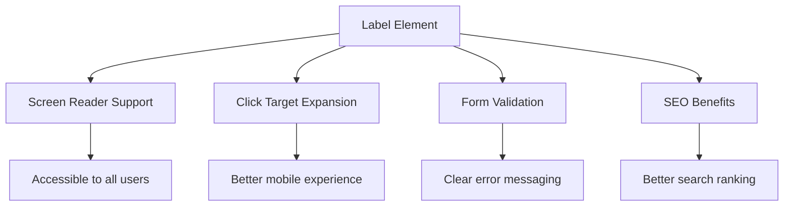
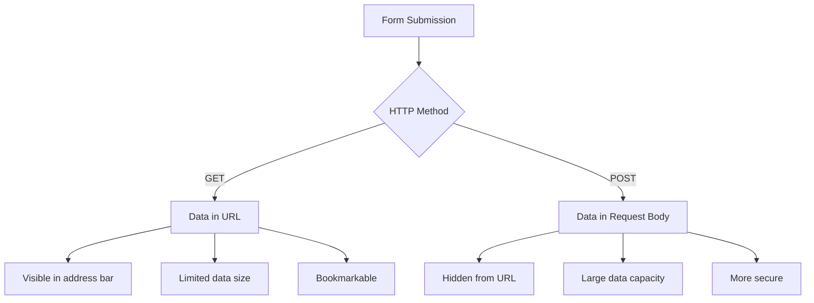
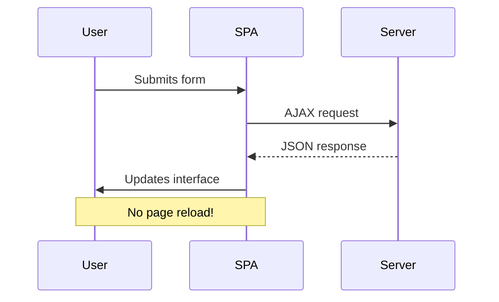
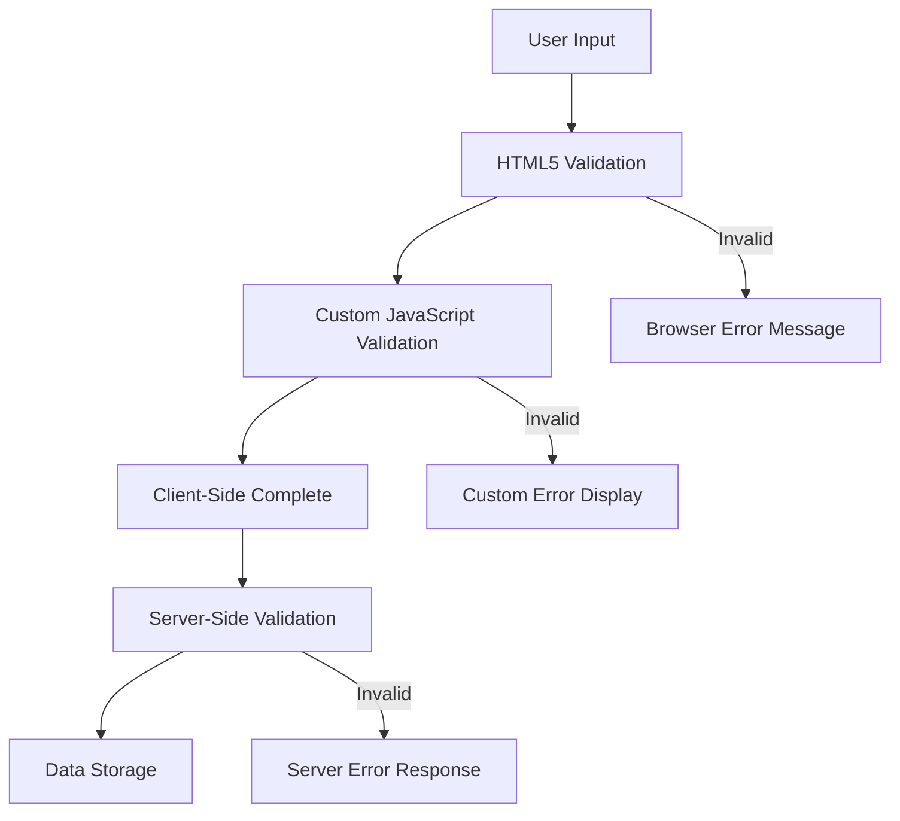
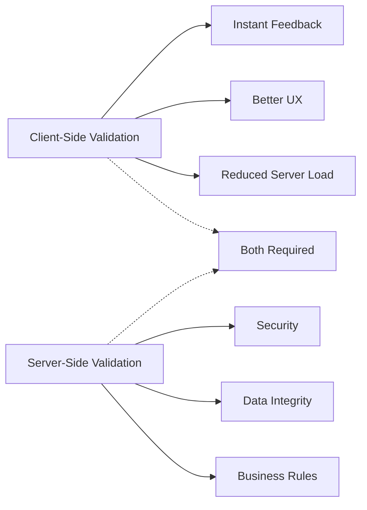

<!--
CO_OP_TRANSLATOR_METADATA:
{
  "original_hash": "b24f28fc46dd473aa9080f174182adde",
  "translation_date": "2025-10-25T00:08:05+00:00",
  "source_file": "7-bank-project/2-forms/README.md",
  "language_code": "hr"
}
-->
# Izrada aplikacije za bankarstvo, dio 2: Izrada obrasca za prijavu i registraciju

## Kviz prije predavanja

[Kviz prije predavanja](https://ff-quizzes.netlify.app/web/quiz/43)

Jeste li ikada ispunili obrazac online i doživjeli odbijanje zbog pogrešnog formata e-maila? Ili izgubili sve unesene podatke nakon što ste kliknuli na "Pošalji"? Svi smo se susreli s ovim frustrirajućim situacijama.

Obrasci su most između korisnika i funkcionalnosti vaše aplikacije. Kao što kontrolori zračnog prometa koriste pažljive protokole za sigurno vođenje aviona, dobro dizajnirani obrasci pružaju jasne povratne informacije i sprječavaju skupe pogreške. Loši obrasci, s druge strane, mogu odbiti korisnike brže nego nesporazum u prometnoj zračnoj luci.

U ovoj lekciji pretvorit ćemo vašu statičnu aplikaciju za bankarstvo u interaktivnu aplikaciju. Naučit ćete kako izraditi obrasce koji provjeravaju unos korisnika, komuniciraju s poslužiteljima i pružaju korisne povratne informacije. Zamislite to kao izradu kontrolnog sučelja koje omogućuje korisnicima navigaciju kroz značajke vaše aplikacije.

Na kraju, imat ćete kompletan sustav za prijavu i registraciju s validacijom koji vodi korisnike prema uspjehu, a ne frustraciji.

## Preduvjeti

Prije nego što počnemo izrađivati obrasce, provjerimo imate li sve ispravno postavljeno. Ova lekcija nastavlja tamo gdje smo stali u prethodnoj, pa ako ste preskočili, možda ćete se htjeti vratiti i prvo postaviti osnovne stvari.

### Potrebna postavka

| Komponenta | Status | Opis |
|------------|--------|------|
| [HTML predlošci](../1-template-route/README.md) | ✅ Obavezno | Osnovna struktura aplikacije za bankarstvo |
| [Node.js](https://nodejs.org) | ✅ Obavezno | JavaScript okruženje za poslužitelj |
| [Bank API poslužitelj](../api/README.md) | ✅ Obavezno | Pozadinska usluga za pohranu podataka |

> 💡 **Savjet za razvoj**: Pokretat ćete dva odvojena poslužitelja istovremeno – jedan za vašu aplikaciju za bankarstvo na klijentskoj strani i drugi za pozadinski API. Ova postavka odražava stvarni razvoj gdje klijentske i pozadinske usluge rade neovisno.

### Konfiguracija poslužitelja

**Vaše razvojno okruženje uključuje:**
- **Poslužitelj klijentske strane**: Poslužuje vašu aplikaciju za bankarstvo (obično port `3000`)
- **Pozadinski API poslužitelj**: Upravlja pohranom i dohvatom podataka (port `5000`)
- **Oba poslužitelja** mogu raditi istovremeno bez sukoba

**Testiranje veze s API-jem:**
```bash
curl http://localhost:5000/api
# Expected response: "Bank API v1.0.0"
```

**Ako vidite odgovor s verzijom API-ja, spremni ste za nastavak!**

---

## Razumijevanje HTML obrazaca i kontrola

HTML obrasci su način na koji korisnici komuniciraju s vašom web aplikacijom. Zamislite ih kao telegrafski sustav koji je povezivao udaljena mjesta u 19. stoljeću – oni su komunikacijski protokol između namjere korisnika i odgovora aplikacije. Kada su pažljivo dizajnirani, hvataju pogreške, vode formatiranje unosa i pružaju korisne prijedloge.

Moderni obrasci su znatno sofisticiraniji od osnovnih tekstualnih unosa. HTML5 je uveo specijalizirane vrste unosa koje automatski obrađuju validaciju e-maila, formatiranje brojeva i odabir datuma. Ova poboljšanja koriste i pristupačnosti i iskustvu mobilnih korisnika.

### Osnovni elementi obrazaca

**Osnovni elementi koje svaki obrazac treba:**

```html
<!-- Basic form structure -->
<form id="userForm" method="POST">
  <label for="username">Username</label>
  <input id="username" name="username" type="text" required>
  
  <button type="submit">Submit</button>
</form>
```

**Što ovaj kod radi:**
- **Stvara** spremnik za obrazac s jedinstvenim identifikatorom
- **Određuje** HTTP metodu za slanje podataka
- **Povezuje** oznake s unosima radi pristupačnosti
- **Definira** gumb za slanje obrasca

### Moderne vrste unosa i atributi

| Vrsta unosa | Namjena | Primjer upotrebe |
|-------------|---------|------------------|
| `text` | Opći unos teksta | `<input type="text" name="username">` |
| `email` | Validacija e-maila | `<input type="email" name="email">` |
| `password` | Skriveni unos teksta | `<input type="password" name="password">` |
| `number` | Unos brojeva | `<input type="number" name="balance" min="0">` |
| `tel` | Brojevi telefona | `<input type="tel" name="phone">` |

> 💡 **Prednost modernog HTML5**: Korištenje specifičnih vrsta unosa omogućuje automatsku validaciju, odgovarajuće tipkovnice na mobilnim uređajima i bolju podršku za pristupačnost bez dodatnog JavaScripta!

### Vrste gumba i ponašanje

```html
<!-- Different button behaviors -->
<button type="submit">Save Data</button>     <!-- Submits the form -->
<button type="reset">Clear Form</button>    <!-- Resets all fields -->
<button type="button">Custom Action</button> <!-- No default behavior -->
```

**Što svaka vrsta gumba radi:**
- **Gumbi za slanje**: Pokreću slanje obrasca i šalju podatke na određenu adresu
- **Gumbi za resetiranje**: Vraćaju sva polja obrasca na početno stanje
- **Obični gumbi**: Nemaju zadano ponašanje, zahtijevaju prilagođeni JavaScript za funkcionalnost

> ⚠️ **Važna napomena**: Element `<input>` je samostalno zatvarajući i ne zahtijeva završni tag. Moderna najbolja praksa je pisanje `<input>` bez kosog crte.

### Izrada obrasca za prijavu

Sada ćemo izraditi praktičan obrazac za prijavu koji demonstrira moderne prakse HTML obrazaca. Počet ćemo s osnovnom strukturom i postupno ga poboljšavati značajkama za pristupačnost i validaciju.

```html
<template id="login">
  <h1>Bank App</h1>
  <section>
    <h2>Login</h2>
    <form id="loginForm" novalidate>
      <div class="form-group">
        <label for="username">Username</label>
        <input id="username" name="user" type="text" required 
               autocomplete="username" placeholder="Enter your username">
      </div>
      <button type="submit">Login</button>
    </form>
  </section>
</template>
```

**Razrada onoga što se ovdje događa:**
- **Strukturira** obrazac s semantičkim HTML5 elementima
- **Grupira** povezane elemente pomoću `div` spremnika s smislenim klasama
- **Povezuje** oznake s unosima pomoću atributa `for` i `id`
- **Uključuje** moderne atribute poput `autocomplete` i `placeholder` za bolji UX
- **Dodaje** `novalidate` za rukovanje validacijom pomoću JavaScripta umjesto zadane validacije preglednika

### Snaga pravilnih oznaka

**Zašto su oznake važne za moderni web razvoj:**



**Što pravilne oznake postižu:**
- **Omogućuju** čitačima ekrana da jasno najave polja obrasca
- **Proširuju** područje za klik (klik na oznaku fokusira unos)
- **Poboljšavaju** upotrebljivost na mobilnim uređajima s većim dodirnim ciljevima
- **Podržavaju** validaciju obrasca s smislenim porukama o pogrešci
- **Povećavaju** SEO pružanjem semantičkog značenja elementima obrasca

> 🎯 **Cilj pristupačnosti**: Svaki unos u obrascu trebao bi imati pridruženu oznaku. Ova jednostavna praksa čini vaše obrasce dostupnima svima, uključujući korisnike s invaliditetom, i poboljšava iskustvo za sve korisnike.

### Izrada obrasca za registraciju

Obrazac za registraciju zahtijeva detaljnije informacije za kreiranje kompletnog korisničkog računa. Izradimo ga s modernim značajkama HTML5 i poboljšanom pristupačnošću.

```html
<hr/>
<h2>Register</h2>
<form id="registerForm" novalidate>
  <div class="form-group">
    <label for="user">Username</label>
    <input id="user" name="user" type="text" required 
           autocomplete="username" placeholder="Choose a username">
  </div>
  
  <div class="form-group">
    <label for="currency">Currency</label>
    <input id="currency" name="currency" type="text" value="$" 
           required maxlength="3" placeholder="USD, EUR, etc.">
  </div>
  
  <div class="form-group">
    <label for="description">Account Description</label>
    <input id="description" name="description" type="text" 
           maxlength="100" placeholder="Personal savings, checking, etc.">
  </div>
  
  <div class="form-group">
    <label for="balance">Starting Balance</label>
    <input id="balance" name="balance" type="number" value="0" 
           min="0" step="0.01" placeholder="0.00">
  </div>
  
  <button type="submit">Create Account</button>
</form>
```

**U gornjem kodu smo:**
- **Organizirali** svako polje u spremnike div za bolji stil i izgled
- **Dodali** odgovarajuće atribute `autocomplete` za podršku automatskom popunjavanju preglednika
- **Uključili** korisni tekst za pomoć pri unosu
- **Postavili** razumne zadane vrijednosti pomoću atributa `value`
- **Primijenili** atribute za validaciju poput `required`, `maxlength` i `min`
- **Koristili** `type="number"` za polje stanja s podrškom za decimalne brojeve

### Istraživanje vrsta unosa i ponašanja

**Moderne vrste unosa pružaju poboljšanu funkcionalnost:**

| Značajka | Prednost | Primjer |
|----------|----------|---------|
| `type="number"` | Numerička tipkovnica na mobilnim uređajima | Lakši unos stanja |
| `step="0.01"` | Kontrola preciznosti decimala | Omogućuje unos centi u valuti |
| `autocomplete` | Automatsko popunjavanje preglednika | Brže ispunjavanje obrasca |
| `placeholder` | Kontekstualni savjeti | Vodi očekivanja korisnika |

> 🎯 **Izazov pristupačnosti**: Pokušajte navigirati kroz obrasce koristeći samo tipkovnicu! Koristite `Tab` za kretanje između polja, `Space` za označavanje okvira i `Enter` za slanje. Ovo iskustvo pomaže razumjeti kako korisnici čitača ekrana komuniciraju s vašim obrascima.

## Razumijevanje metoda slanja obrazaca

Kada netko ispuni vaš obrazac i klikne na "Pošalji", ti podaci moraju negdje otići – obično na poslužitelj koji ih može pohraniti. Postoji nekoliko različitih načina na koje se to može dogoditi, a poznavanje pravog može vas spasiti od glavobolje kasnije.

Pogledajmo što se zapravo događa kada netko klikne na gumb za slanje.

### Zadano ponašanje obrasca

Prvo, promatrajmo što se događa s osnovnim slanjem obrasca:

**Testirajte svoje trenutne obrasce:**
1. Kliknite na gumb *Registriraj se* u svom obrascu
2. Promatrajte promjene u adresnoj traci preglednika
3. Primijetite kako se stranica ponovno učitava i podaci se pojavljuju u URL-u


### Usporedba HTTP metoda



**Razumijevanje razlika:**

| Metoda | Namjena | Lokacija podataka | Razina sigurnosti | Ograničenje veličine |
|--------|---------|-------------------|-------------------|----------------------|
| `GET` | Pretraživanje, filtriranje | Parametri URL-a | Niska (vidljivo) | ~2000 znakova |
| `POST` | Korisnički računi, osjetljivi podaci | Tijelo zahtjeva | Viša (skriveno) | Nema praktičnog ograničenja |

**Razumijevanje temeljnih razlika:**
- **GET**: Dodaje podatke obrasca u URL kao parametre upita (prikladno za pretraživanje)
- **POST**: Uključuje podatke u tijelo zahtjeva (neophodno za osjetljive informacije)
- **Ograničenja GET-a**: Ograničenja veličine, vidljivi podaci, trajna povijest preglednika
- **Prednosti POST-a**: Veliki kapacitet podataka, zaštita privatnosti, podrška za prijenos datoteka

> 💡 **Najbolja praksa**: Koristite `GET` za obrasce za pretraživanje i filtriranje (dohvat podataka), koristite `POST` za registraciju korisnika, prijavu i kreiranje podataka.

### Konfiguriranje slanja obrasca

Konfigurirajmo vaš obrazac za registraciju kako bi ispravno komunicirao s pozadinskim API-jem koristeći metodu POST:

```html
<form id="registerForm" action="//localhost:5000/api/accounts" 
      method="POST" novalidate>
```

**Što ova konfiguracija radi:**
- **Usmjerava** slanje obrasca na adresu vašeg API-ja
- **Koristi** metodu POST za sigurnu transmisiju podataka
- **Uključuje** `novalidate` za rukovanje validacijom pomoću JavaScripta

### Testiranje slanja obrasca

**Slijedite ove korake za testiranje obrasca:**
1. **Ispunite** obrazac za registraciju svojim podacima
2. **Kliknite** na gumb "Kreiraj račun"
3. **Promatrajte** odgovor poslužitelja u svom pregledniku


**Što biste trebali vidjeti:**
- **Preglednik preusmjerava** na URL API krajnje točke
- **JSON odgovor** koji sadrži podatke o novokreiranom računu
- **Potvrda poslužitelja** da je račun uspješno kreiran

> 🧪 **Vrijeme za eksperiment**: Pokušajte se ponovno registrirati s istim korisničkim imenom. Kakav odgovor dobivate? Ovo vam pomaže razumjeti kako poslužitelj obrađuje duplicirane podatke i uvjete pogreške.

### Razumijevanje JSON odgovora

**Kada poslužitelj uspješno obradi vaš obrazac:**
```json
{
  "user": "john_doe",
  "currency": "$",
  "description": "Personal savings",
  "balance": 100,
  "id": "unique_account_id"
}
```

**Ovaj odgovor potvrđuje:**
- **Kreiranje** novog računa s vašim navedenim podacima
- **Dodjeljivanje** jedinstvenog identifikatora za buduće reference
- **Vraćanje** svih informacija o računu za provjeru
- **Indikaciju** uspješne pohrane u bazu podataka

## Moderno rukovanje obrascima pomoću JavaScripta

Tradicionalno slanje obrazaca uzrokuje potpuno ponovno učitavanje stranice, slično kao što su rane svemirske misije zahtijevale potpune sustavne resetove za korekciju kursa. Ovaj pristup narušava korisničko iskustvo i gubi stanje aplikacije.

Rukovanje obrascima pomoću JavaScripta funkcionira poput sustava za kontinuirano navođenje koji koriste moderni svemirski brodovi – omogućuje prilagodbe u stvarnom vremenu bez gubitka navigacijskog konteksta. Možemo presresti slanje obrazaca, pružiti trenutne povratne informacije, elegantno rukovati pogreškama i ažurirati sučelje na temelju odgovora poslužitelja, dok zadržavamo korisnika unutar aplikacije.

### Zašto izbjegavati ponovno učitavanje stranice?



**Prednosti rukovanja obrascima pomoću JavaScripta:**
- **Održava** stanje aplikacije i kontekst korisnika
- **Pruža** trenutne povratne informacije i indikatore učitavanja
- **Omogućuje** dinamično rukovanje pogreškama i validaciju
- **Stvara** glatko korisničko iskustvo slično aplikaciji
- **Omogućuje** uvjetnu logiku na temelju odgovora poslužitelja

### Prijelaz s tradicionalnih na moderne obrasce

**Izazovi tradicionalnog pristupa:**
- **Preusmjerava** korisnike izvan vaše aplikacije
- **Gubi** trenutno stanje aplikacije i kontekst
- **Zahtijeva** potpuno ponovno učitavanje stranice za jednostavne operacije
- **Pruža** ograničenu kontrolu nad povratnim informacijama korisnika

**Prednosti modernog JavaScript pristupa:**
- **Zadržava** korisnike unutar vaše aplikacije
- **Održava** sve stanje i podatke aplikacije
- **Omogućuje** validaciju i povratne informacije u stvarnom vremenu
- **Podržava** progresivno poboljšanje i pristupačnost

### Implementacija rukovanja obrascima pomoću JavaScripta

Zamijenimo tradicionalno slanje obrazaca modernim rukovanjem događajima pomoću JavaScripta:

```html
<!-- Remove the action attribute and add event handling -->
<form id="registerForm" method="POST" novalidate>
```

**Dodajte logiku registracije u svoju datoteku `app.js`:**

```javascript
// Modern event-driven form handling
function register() {
  const registerForm = document.getElementById('registerForm');
  const formData = new FormData(registerForm);
  const data = Object.fromEntries(formData);
  const jsonData = JSON.stringify(data);
  
  console.log('Form data prepared:', data);
}

// Attach event listener when the page loads
document.addEventListener('DOMContentLoaded', () => {
  const registerForm = document.getElementById('registerForm');
  registerForm.addEventListener('submit', (event) => {
    event.preventDefault(); // Prevent default form submission
    register();
  });
});
```

**Razrada onoga što se ovdje događa:**
- **Sprječava** zadano slanje obrasca pomoću `event.preventDefault()`
- **Dohvaća** element obrasca pomoću modernog odabira DOM-a
- **Izvlači** podatke obrasca pomoću moćnog API-ja `FormData`
- **Pretvara** FormData u običan objekt pomoću `Object.fromEntries()`
- **Serijalizira** podatke u JSON format za komunikaciju s poslužiteljem
- **Bilježi** obrađene podatke za debugiranje i provjeru

### Razumijevanje API-ja FormData

**API FormData pruža moćno rukovanje obrascima:**

```javascript
// Example of what FormData captures
const formData = new FormData(registerForm);

// FormData automatically captures:
// {
//   "user": "john_doe",
//   "currency": "$", 
//   "description": "Personal account",
//   "balance": "100"
// }
```

**Prednosti API-ja FormData:**
- **Sveobuhvatno prikupljanje**: Hvata sve elemente obrasca, uključujući tekst, datoteke i složene unose
- **Svjesnost tipa**: Automatski obrađuje različite vrste unosa bez prilagođenog kodiranja
- **Učinkovitost**: Eliminira ručno prikupljanje
- **Pruža** detaljne poruke o greškama za otklanjanje pogrešaka
- **Vraća** dosljednu strukturu podataka za uspješne i neuspješne slučajeve

### Snaga modernog Fetch API-ja

**Prednosti Fetch API-ja u odnosu na starije metode:**

| Značajka | Prednost | Implementacija |
|----------|----------|----------------|
| Temeljeno na obećanjima | Čist asinhroni kod | `await fetch()` |
| Prilagodba zahtjeva | Potpuna kontrola nad HTTP-om | Zaglavlja, metode, tijelo |
| Obrada odgovora | Fleksibilno parsiranje podataka | `.json()`, `.text()`, `.blob()` |
| Rukovanje greškama | Sveobuhvatno hvatanje grešaka | Blokovi try/catch |

> 🎥 **Saznaj više**: [Async/Await Tutorial](https://youtube.com/watch?v=YwmlRkrxvkk) - Razumijevanje asinhronih JavaScript obrazaca za moderni web razvoj.

**Ključni koncepti za komunikaciju s poslužiteljem:**
- **Asinhrone funkcije** omogućuju pauziranje izvršavanja dok se čeka odgovor poslužitelja
- **Ključna riječ await** čini da asinhroni kod izgleda kao sinhroni kod
- **Fetch API** omogućuje moderne, temeljene na obećanjima HTTP zahtjeve
- **Rukovanje greškama** osigurava da vaša aplikacija reagira na mrežne probleme na primjeren način

### Dovršavanje funkcije registracije

Spojimo sve zajedno s kompletnom, spremnom za produkciju funkcijom registracije:

```javascript
async function register() {
  const registerForm = document.getElementById('registerForm');
  const submitButton = registerForm.querySelector('button[type="submit"]');
  
  try {
    // Show loading state
    submitButton.disabled = true;
    submitButton.textContent = 'Creating Account...';
    
    // Process form data
    const formData = new FormData(registerForm);
    const jsonData = JSON.stringify(Object.fromEntries(formData));
    
    // Send to server
    const result = await createAccount(jsonData);
    
    if (result.error) {
      console.error('Registration failed:', result.error);
      alert(`Registration failed: ${result.error}`);
      return;
    }
    
    console.log('Account created successfully!', result);
    alert(`Welcome, ${result.user}! Your account has been created.`);
    
    // Reset form after successful registration
    registerForm.reset();
    
  } catch (error) {
    console.error('Unexpected error:', error);
    alert('An unexpected error occurred. Please try again.');
  } finally {
    // Restore button state
    submitButton.disabled = false;
    submitButton.textContent = 'Create Account';
  }
}
```

**Ova poboljšana implementacija uključuje:**
- **Pruža** vizualne povratne informacije tijekom slanja obrasca
- **Onemogućuje** gumb za slanje kako bi se spriječilo višestruko slanje
- **Rukuje** i očekivanim i neočekivanim greškama na primjeren način
- **Prikazuje** korisnički prihvatljive poruke o uspjehu i greškama
- **Resetira** obrazac nakon uspješne registracije
- **Vraća** stanje korisničkog sučelja bez obzira na ishod

### Testiranje vaše implementacije

**Otvorite alate za razvoj u pregledniku i testirajte registraciju:**

1. **Otvorite** konzolu preglednika (F12 → kartica Console)
2. **Ispunite** obrazac za registraciju
3. **Kliknite** "Kreiraj račun"
4. **Promatrajte** poruke u konzoli i povratne informacije korisnika


**Što biste trebali vidjeti:**
- **Stanje učitavanja** pojavljuje se na gumbu za slanje
- **Konzolni zapisi** prikazuju detaljne informacije o procesu
- **Poruka o uspjehu** pojavljuje se kada je kreiranje računa uspješno
- **Obrazac se automatski resetira** nakon uspješnog slanja

> 🔒 **Sigurnosna napomena**: Trenutno podaci putuju putem HTTP-a, što nije sigurno za produkciju. U stvarnim aplikacijama uvijek koristite HTTPS za šifriranje prijenosa podataka. Saznajte više o [HTTPS sigurnosti](https://en.wikipedia.org/wiki/HTTPS) i zašto je ključna za zaštitu korisničkih podataka.

## Sveobuhvatna validacija obrazaca

Validacija obrazaca sprječava frustrirajuće iskustvo otkrivanja grešaka tek nakon slanja. Kao višestruki sigurnosni sustavi na Međunarodnoj svemirskoj postaji, učinkovita validacija koristi više slojeva sigurnosnih provjera.

Optimalan pristup kombinira validaciju na razini preglednika za trenutne povratne informacije, JavaScript validaciju za poboljšano korisničko iskustvo i validaciju na strani poslužitelja za sigurnost i integritet podataka. Ova redundancija osigurava zadovoljstvo korisnika i zaštitu sustava.

### Razumijevanje slojeva validacije



**Strategija višeslojne validacije:**
- **HTML5 validacija**: Trenutne provjere na razini preglednika
- **JavaScript validacija**: Prilagođena logika i korisničko iskustvo
- **Validacija na poslužitelju**: Konačne provjere sigurnosti i integriteta podataka
- **Progresivno poboljšanje**: Funkcionira čak i ako je JavaScript onemogućen

### HTML5 atributi za validaciju

**Moderni alati za validaciju:**

| Atribut | Svrha | Primjer upotrebe | Ponašanje preglednika |
|---------|-------|------------------|-----------------------|
| `required` | Obavezna polja | `<input required>` | Sprječava slanje praznog obrasca |
| `minlength`/`maxlength` | Ograničenja duljine teksta | `<input maxlength="20">` | Ograničava broj znakova |
| `min`/`max` | Rasponi brojeva | `<input min="0" max="1000">` | Provjerava granice brojeva |
| `pattern` | Pravila za prilagođene regex izraze | `<input pattern="[A-Za-z]+">` | Provjerava specifične formate |
| `type` | Validacija tipa podataka | `<input type="email">` | Validacija specifična za format |

### CSS stiliziranje validacije

**Stvorite vizualne povratne informacije za stanja validacije:**

```css
/* Valid input styling */
input:valid {
  border-color: #28a745;
  background-color: #f8fff9;
}

/* Invalid input styling */
input:invalid {
  border-color: #dc3545;
  background-color: #fff5f5;
}

/* Focus states for better accessibility */
input:focus:valid {
  box-shadow: 0 0 0 0.2rem rgba(40, 167, 69, 0.25);
}

input:focus:invalid {
  box-shadow: 0 0 0 0.2rem rgba(220, 53, 69, 0.25);
}
```

**Što postižu ovi vizualni pokazatelji:**
- **Zeleni obrubi**: Označavaju uspješnu validaciju, poput zelenih svjetala u kontrolnom centru misije
- **Crveni obrubi**: Signaliziraju greške u validaciji koje zahtijevaju pažnju
- **Isticanje fokusa**: Pruža jasnu vizualnu kontekstualizaciju trenutne lokacije unosa
- **Dosljedno stiliziranje**: Uspostavlja predvidljive obrasce sučelja koje korisnici mogu naučiti

> 💡 **Savjet**: Koristite CSS pseudo-klase `:valid` i `:invalid` za pružanje trenutnih vizualnih povratnih informacija dok korisnici unose podatke, stvarajući responzivno i korisno sučelje.

### Implementacija sveobuhvatne validacije

Poboljšajmo vaš obrazac za registraciju s robusnom validacijom koja pruža izvrsno korisničko iskustvo i kvalitetu podataka:

```html
<form id="registerForm" method="POST" novalidate>
  <div class="form-group">
    <label for="user">Username <span class="required">*</span></label>
    <input id="user" name="user" type="text" required 
           minlength="3" maxlength="20" 
           pattern="[a-zA-Z0-9_]+" 
           autocomplete="username"
           title="Username must be 3-20 characters, letters, numbers, and underscores only">
    <small class="form-text">Choose a unique username (3-20 characters)</small>
  </div>
  
  <div class="form-group">
    <label for="currency">Currency <span class="required">*</span></label>
    <input id="currency" name="currency" type="text" required 
           value="$" maxlength="3" 
           pattern="[A-Z$€£¥₹]+" 
           title="Enter a valid currency symbol or code">
    <small class="form-text">Currency symbol (e.g., $, €, £)</small>
  </div>
  
  <div class="form-group">
    <label for="description">Account Description</label>
    <input id="description" name="description" type="text" 
           maxlength="100" 
           placeholder="Personal savings, checking, etc.">
    <small class="form-text">Optional description (up to 100 characters)</small>
  </div>
  
  <div class="form-group">
    <label for="balance">Starting Balance</label>
    <input id="balance" name="balance" type="number" 
           value="0" min="0" step="0.01" 
           title="Enter a positive number for your starting balance">
    <small class="form-text">Initial account balance (minimum $0.00)</small>
  </div>
  
  <button type="submit">Create Account</button>
</form>
```

**Razumijevanje poboljšane validacije:**
- **Kombinira** indikatore obaveznih polja s korisnim opisima
- **Uključuje** `pattern` atribute za validaciju formata
- **Pruža** `title` atribute za pristupačnost i savjete
- **Dodaje** pomoćni tekst za vođenje korisničkog unosa
- **Koristi** semantičku HTML strukturu za bolju pristupačnost

### Napredna pravila validacije

**Što svako pravilo validacije postiže:**

| Polje | Pravila validacije | Korisnička korist |
|-------|--------------------|-------------------|
| Korisničko ime | `required`, `minlength="3"`, `maxlength="20"`, `pattern="[a-zA-Z0-9_]+"` | Osigurava valjane, jedinstvene identifikatore |
| Valuta | `required`, `maxlength="3"`, `pattern="[A-Z$€£¥₹]+"` | Prihvaća uobičajene simbole valuta |
| Stanje | `min="0"`, `step="0.01"`, `type="number"` | Sprječava negativna stanja |
| Opis | `maxlength="100"` | Razumna ograničenja duljine |

### Testiranje ponašanja validacije

**Isprobajte ove scenarije validacije:**
1. **Pošaljite** obrazac s praznim obaveznim poljima
2. **Unesite** korisničko ime kraće od 3 znaka
3. **Pokušajte** unijeti posebne znakove u polje za korisničko ime
4. **Unesite** negativan iznos stanja


**Što ćete primijetiti:**
- **Preglednik prikazuje** poruke o greškama u validaciji
- **Promjene u stiliziranju** na temelju stanja `:valid` i `:invalid`
- **Slanje obrasca** je onemogućeno dok sve validacije ne prođu
- **Fokus automatski** prelazi na prvo neispravno polje

### Validacija na strani klijenta vs. na strani poslužitelja



**Zašto su potrebna oba sloja:**
- **Validacija na strani klijenta**: Pruža trenutne povratne informacije i poboljšava korisničko iskustvo
- **Validacija na strani poslužitelja**: Osigurava sigurnost i obrađuje složena poslovna pravila
- **Kombinirani pristup**: Stvara robusne, korisnički prihvatljive i sigurne aplikacije
- **Progresivno poboljšanje**: Funkcionira čak i kada je JavaScript onemogućen

> 🛡️ **Sigurnosna napomena**: Nikada se ne oslanjajte samo na validaciju na strani klijenta! Zlonamjerni korisnici mogu zaobići provjere na strani klijenta, stoga je validacija na strani poslužitelja ključna za sigurnost i integritet podataka.

---


---

## Izazov GitHub Copilot Agent 🚀

Koristite Agent način rada za dovršavanje sljedećeg izazova:

**Opis:** Poboljšajte obrazac za registraciju sveobuhvatnom validacijom na strani klijenta i povratnim informacijama za korisnika. Ovaj izazov pomoći će vam da vježbate validaciju obrazaca, rukovanje greškama i poboljšanje korisničkog iskustva interaktivnim povratnim informacijama.

**Zadatak:** Kreirajte kompletan sustav validacije obrazaca za registraciju koji uključuje: 1) Povratne informacije o validaciji u stvarnom vremenu za svako polje dok korisnik unosi podatke, 2) Prilagođene poruke o greškama koje se pojavljuju ispod svakog polja za unos, 3) Polje za potvrdu lozinke s validacijom podudaranja, 4) Vizualne pokazatelje (poput zelenih kvačica za valjana polja i crvenih upozorenja za nevaljana), 5) Gumb za slanje koji postaje aktivan samo kada sve validacije prođu. Koristite HTML5 atribute za validaciju, CSS za stiliziranje stanja validacije i JavaScript za interaktivno ponašanje.

Saznajte više o [agent načinu rada](https://code.visualstudio.com/blogs/2025/02/24/introducing-copilot-agent-mode) ovdje.

## 🚀 Izazov

Prikazati poruku o grešci u HTML-u ako korisnik već postoji.

Evo primjera kako bi konačna stranica za prijavu mogla izgledati nakon malo stiliziranja:


## Kviz nakon predavanja

[Kviz nakon predavanja](https://ff-quizzes.netlify.app/web/quiz/44)

## Pregled i samostalno učenje

Razvijatelji su postali vrlo kreativni u izradi obrazaca, posebno u vezi strategija validacije. Saznajte više o različitim tokovima obrazaca pregledavajući [CodePen](https://codepen.com); možete li pronaći neke zanimljive i inspirativne primjere obrazaca?

## Zadatak

[Stilizirajte svoju bankovnu aplikaciju](assignment.md)

---

**Izjava o odricanju odgovornosti**:  
Ovaj dokument je preveden pomoću AI usluge za prevođenje [Co-op Translator](https://github.com/Azure/co-op-translator). Iako nastojimo osigurati točnost, imajte na umu da automatski prijevodi mogu sadržavati pogreške ili netočnosti. Izvorni dokument na izvornom jeziku treba smatrati autoritativnim izvorom. Za ključne informacije preporučuje se profesionalni prijevod od strane čovjeka. Ne preuzimamo odgovornost za nesporazume ili pogrešna tumačenja koja proizlaze iz korištenja ovog prijevoda.